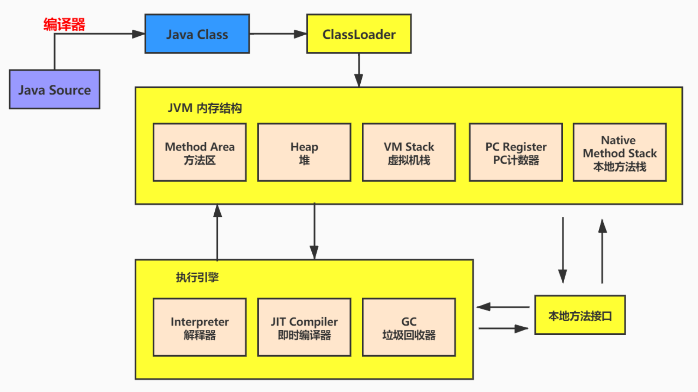
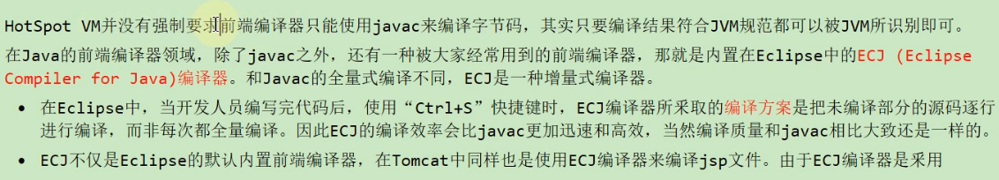
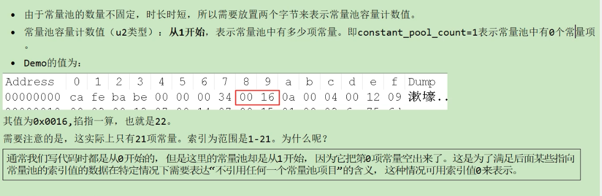
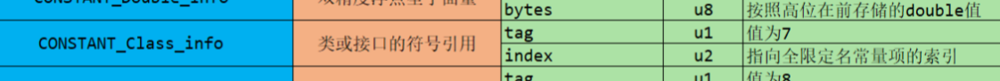
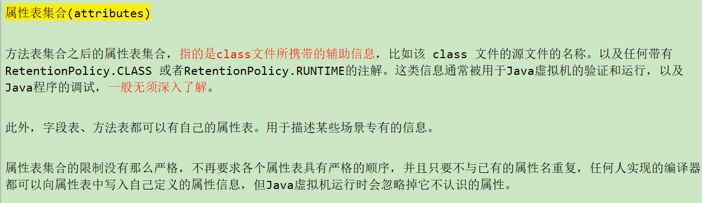
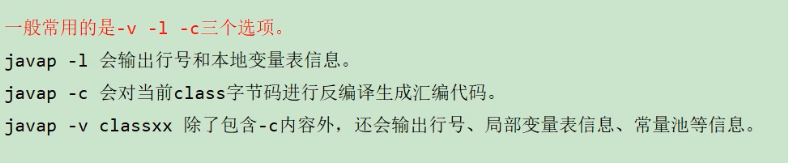

# Class文件结构


 


## 概述


### 字节码文件的跨平台性

java虚拟机不和包括java在内的任何语言绑定，只与  **Class文件** 这种特定的二进制文件格式所关联，无论使用何种语言，只要能将源文件编译为正确的Class文件，那么就可以在java虚拟机上执行。


统一而强大的Class文件结构，就是jvm的基石、桥梁





jdk软件：

- 前端编译器：将java源代码编译成java虚拟机的指令集的编译器（不包含在jvm中）
- 用于实现java虚拟机的**运行时环境**


### java的前端编译器


java源代码的编译结果是字节码，那么肯定需要有一种编译器能够将java源码编译为字节码，承担这个重要责任的就是配置在path环境变量中的  ***javac编译器***，javac是一种能够**将java源码编译为字节码**的 **前端编译器**

其实只要能将java源代码编译为符合规则的Class文件就行！不强制使用javac编译器。

全量式编译/增量式编译，eclipse快一些



idea默认使用javac编译器


效率：后端编译器。

- JIT：即时编译器，运行过程中来进行

- AOT：在程序运行之前将字节码文件翻译成机器指令。打破了动态性


### 通过字节码指令看代码细节


> 面试题：
>
> - 类文件结构有几个部分
> - 知道字节码吗？字节码都有哪些？`Integer x = 5; int y = 5;`比较x==y都经过哪些步骤


**自动装箱**

```java
public static void main(String[] args) {
    Integer x = 5; //自动装箱
    int y = 5;
    System.out.println(x == y); //true

    Integer i = 5;
    Integer j = 5;
    System.out.println(i == j); //true

    Integer m = 128;
    Integer n = 128;
    System.out.println(m == n); //false
}
```

只能存储-128~127范围的Integer类型常量。


不在这个范围内，就新new一个Integer对象


```
 0 iconst_5
 1 invokestatic #2 <java/lang/Integer.valueOf>
 4 astore_1
 5 iconst_5
 6 istore_2
 7 getstatic #3 <java/lang/System.out>
10 aload_1
11 invokevirtual #4 <java/lang/Integer.intValue>  # 拆箱
14 iload_2
15 if_icmpne 22 (+7)
18 iconst_1
19 goto 23 (+4)
22 iconst_0
23 invokevirtual #5 <java/io/PrintStream.println>


26 iconst_5
27 invokestatic #2 <java/lang/Integer.valueOf>
30 astore_3   #带_最大到3  4需要直接加数字
31 iconst_5
32 invokestatic #2 <java/lang/Integer.valueOf>
35 astore 4
37 getstatic #3 <java/lang/System.out>
40 aload_3
41 aload 4
43 if_acmpne 50 (+7)
46 iconst_1
47 goto 51 (+4)
50 iconst_0
51 invokevirtual #5 <java/io/PrintStream.println>


54 sipush 128
57 invokestatic #2 <java/lang/Integer.valueOf>
60 astore 5
62 sipush 128
65 invokestatic #2 <java/lang/Integer.valueOf>
68 astore 6
70 getstatic #3 <java/lang/System.out>
73 aload 5
75 aload 6
77 if_acmpne 84 (+7)
80 iconst_1
81 goto 85 (+4)
84 iconst_0
85 invokevirtual #5 <java/io/PrintStream.println>
88 return

```


----


**成员变量（非静态）的赋值过程：**

- 默认初始化
- 显示初始化  /  代码块中初始化
- 构造器中初始化
- 有了对象后可以  对象.属性   /   对象.方法  的方式对成员变量赋值


Father：

这时父类<init>的整个过程，这个过程执行完成后，才会初始化子类的类变量、构造函数。。。


Son：


初始化son之前，先调用父类init初始化，执行父类的 `this.print()`，子类进行了重写，其实是调用Son的print()方法，这时类变量还没有初始化，所以x=0

父类初始化完成后（包括父类的类变量、构造函数），x才被初始化

***属性不存在多态性！f.x还是父类的x值***


## 虚拟机的基石-Class文件


- 字节码文件里是什么？

源代码经过编译器编译之后便会生成一个字节码文件，二进制的类文件，内容是JVM的指令，而不是像Cpp一样经过编译器直接生成机器码


- 什么是字节码指令 byte code？


**操作码 + 操作数**：`bipush 10`

`astore_3`只是个操作码，提供的现成的，不带操作数


- 如何解读虚拟机解释执行的二进制字节码

idea安装jclasslib插件直接查看。


## Class文件结构


- Class类的本质

任何一个Class文件都对应 **唯一一个类或接口的定义信息**，反过来说，Class文件实际上并不一定以磁盘的形式存在（也可能通过网络），Class文件是一组一8位字节为基础单位 的  ***二进制流***


- 无符号数：基本数据类型、String
- 表：符号数据类型。（类似Java数组）  。**Class文件本质上就是一张表**

表的长度？**主要还是因为没有分隔符**


| 数据类型 | 定义                                                         | 说明                                                         |
| -------- | ------------------------------------------------------------ | ------------------------------------------------------------ |
| 无符号数 | 无符号数可以用来描述数字、索引引用、数量值或按照utf-8编码构成的字符串值。 | 其中无符号数属于基本的数据类型。 以u1、u2、u4、u8来分别代表1个字节、2个字节、4个字节和8个字节 |
| 表       | 表是由多个无符号数或其他表构成的复合数据结构。               | 所有的表都以“_info”结尾。 由于表没有固定长度，所以通常会在其前面加上个数说明。 |


### Class文件结构概述


虽然Class文件结构并不是一成不变的，但是总体结构不变。


- 魔数 ：u4  无符号数，识别当前是一个class文件
- Class文件版本
- 常量池
- 访问标志：final、abstract
- 类索引、父类索引、  接口索引集合（表）
- 字段表集合 ：fields  表
- 方法表集合 ：方法表
- 属性表集合 ：attribute，类名，局部变量表等等....


 

| 类型           | 名称                | 说明                       | 长度    | 数量                  |
| -------------- | ------------------- | -------------------------- | ------- | --------------------- |
| u4             | magic               | 魔数,**识别Class文件格式** | 4个字节 | 1                     |
| u2             | minor_version       | 副版本号(小版本)           | 2个字节 | 1                     |
| u2             | major_version       | 主版本号(大版本)           | 2个字节 | 1                     |
| u2             | constant_pool_count | 常量池计数器               | 2个字节 | 1                     |
| cp_info        | constant_pool       | 常量池表                   | n个字节 | constant_pool_count-1 |
| u2             | access_flags        | 访问标识                   | 2个字节 | 1                     |
| u2             | this_class          | 类索引                     | 2个字节 | 1                     |
| u2             | super_class         | 父类索引                   | 2个字节 | 1                     |
| u2             | interfaces_count    | 接口计数器                 | 2个字节 | 1                     |
| u2             | interfaces          | 接口索引集合               | 2个字节 | interfaces_count      |
| u2             | fields_count        | 字段计数器                 | 2个字节 | 1                     |
| field_info     | fields              | 字段表                     | n个字节 | fields_count          |
| u2             | methods_count       | 方法计数器                 | 2个字节 | 1                     |
| method_info    | methods             | 方法表                     | n个字节 | methods_count         |
| u2             | attributes_count    | 属性计数器                 | 2个字节 | 1                     |
| attribute_info | attributes          | 属性表                     | n个字节 | attributes_count      |


### 魔数

无法仅仅通过class扩展名来识别该文件是class文件，**进行校验**


### Class文件版本号


34（16） = 52（10），即jdk1.8版本

| 主版本（十进制） | 副版本（十进制） | 编译器版本 |
| ---------------- | ---------------- | ---------- |
| 45               | 3                | 1.1        |
| 46               | 0                | 1.2        |
| 47               | 0                | 1.3        |
| 48               | 0                | 1.4        |
| 49               | 0                | 1.5        |
| 50               | 0                | 1.6        |
| 51               | 0                | 1.7        |
| 52               | 0                | 1.8        |
| 53               | 0                | 1.9        |
| 54               | 0                | 1.10       |
| 55               | 0                | 1.11       |

升级jdk版本，主版本会改变

- **不同版本的Java编译器编译的Class文件对应的版本是不一样的，高版本的Java虚拟机可以执行由低版本编译器生成的Class文件，但是低版本的Java虚拟机不能执行由高版本编译器生成的Class文件，否则JVM会抛出异常：UnsupportedVersionError——>向下兼容**


### 常量池


- 常量池是Class文件中内容最风阻的区域。常量池对于Class文件中的字段和方法解析也有着至关重要的作用
- 常量池是整个Class文件的基石


在版本号后，是常量池计数器和常量池表


前置的容量计数器和若干个连续的数据项

- **常量池表项中，用于存放编译时期生成的各种 *字面量和符号引用*，这部分内容将在类加载后进入 *方法区的运行时常量池中存放***


---

**常量池计数器**

- 常量池的数量不固定
- u2类型，两个字节，从1开始计数，表示常量池中有多少项常量

**常量池计数器比常量池表中的常量项个数多 1**



**第0个位置是空出来的**


----

**常量池表**


- **字面量**
- **符号引用**

常量池表中元素可能是这些常量类型的任何一个

使用标识tag在表中表示


---

**字面量和符号引用**


字面量Literal

- 文本字符串
- 声明为final的常量值（int等基本类型均可），会放在常量池中，如果是个变量就不会放在Class文件常量池中了


剩下四个类型都转成Integer。Long和Double是8个字节


符号引用

- 类和接口的全限定名
- 字段的名称和描述符
- 方法的名称和描述符


- 全限定名：

com/xxx/text/Demo  ，将报名的. 替换成 /

- 简单名称：

没有类型和参数修饰的方法或者字段名称。如：add  num  x  y....

- 描述符：

**描述符的作用是用来描述字段的数据类型、方法的参数列表（包括数量、类型、顺序）和返回值**，基本数据类型以及代表无返回值的void类型都用一个大写字符来表示，对象类型则用L加对象的全限定名来表示：

| 标志符 | 含义                                                 |
| ------ | ---------------------------------------------------- |
| B      | 基本数据类型byte                                     |
| C      | 基本数据类型char                                     |
| D      | 基本数据类型double                                   |
| F      | 基本数据类型float                                    |
| I      | 基本数据类型int                                      |
| J      | 基本数据类型long                                     |
| S      | 基本数据类型short                                    |
| Z      | 基本数据类型boolean                                  |
| V      | 代表void类型                                         |
| L      | 对象类型，比如：`Ljava/lang/Object;`                 |
| [      | 数组类型，代表一维数组。比如：`double[][][] is [[[D` |


动态链接，  字节码文件还没加载到内存中。

 **从常量池中获得对应的符号引用，再在  *类加载过程中的解析阶段将其替换为直接引用*  ，并翻译到具体的内存地址中**


----

### 解析常量类型


除了字符串类型，都保存了具体的长度


如：


0A：tag=10，这个符号引用 一共占**5个字节**大小


特例：01字符串类型：长度是不确定的，后面一个u2（后面跟着的2位）表示的字符串的长度03，那么后三位存的就是字符串：


常量池中绝大部分都是字符串


### 解析常量池表数据


都是一一对应的。

如：CONSTANT_Utf8_info：代表tag=01，utf8编码的字符串


---


10**指向**：   声明方法的类描述符：索引为4   &   名称及类描述符 ：索引18


索引4又指向了21：字符串java/lang/Object


最终得出：它的类型是java/lang/Object定义的


索引18，也有两个索引：分别为7 & 8


当前方法的名称<init>，返回值类型void，形参列表（空参）


---


第二项：

09：Fieldref_info  

指向**字段的类或接口描述符**：com/hcr/jvm/Demo，

指向**字段描述符**：


- 字面量：字符串String 

- 引用->指向字面量，类名、描述符、名字等信息


---

常量池表项总结：

- tag，对应该项的类型
- 有的类型有index属性，指向另一个常量池表项。
- 最多的还是字符串形式，来表示方法、字段的字面量，类名、描述符、名字等信息，自带一个字符串的长度，不确定长度


常量池：可以理解为Class文件的资源仓库，是Class文件结构中与其他项目关联最多的数据类型，也是占用Class文件空间最大的数据项目之一


字节码文件中不涉及加载到内存的操作，***没法确定真实内存的地址***，**只能保存符号引用**，当进行类的加载，形成**动态链接时，转化为直接引用。**


### 访问标识


access flag

**类的访问信息 public / abstract / final**


| 标志名称       | 标志值 | 含义                                                         |
| -------------- | ------ | ------------------------------------------------------------ |
| ACC_PUBLIC     | 0x0001 | 标志为public类型                                             |
| ACC_FINAL      | 0x0010 | 标志被声明为final，只有类可以设置                            |
| ACC_SUPER      | 0x0020 | 标志允许使用invokespecial字节码指令的新语义，JDK1.0.2之后编译出来的类的这个标志默认为真。（使用增强的方法调用父类方法） |
| ACC_INTERFACE  | 0x0200 | 标志这是一个接口                                             |
| ACC_ABSTRACT   | 0x0400 | 是否为abstract类型，对于接口或者抽象类来说，次标志值为真，其他类型为假 |
| ACC_SYNTHETIC  | 0x1000 | 标志此类并非由用户代码产生（即：由编译器产生的类，没有源码对应） |
| ACC_ANNOTATION | 0x2000 | 标志这是一个注解                                             |
| ACC_ENUM       | 0x4000 | 标志这是一个枚举                                             |

访问标识：0x0021：

- 0x0020 

- 0x0001 public


注解也需要有interface标识。 `@Interface`


### 类索引、父类索引、接口索引集合


**注意：接口是表结构，单继承，多实现**

| 长度 | 含义                                     |
| ---- | ---------------------------------------- |
| u2   | this_class                               |
| u2   | super_class                              |
| u2   | interfaces_count——**没有分隔符，计数器** |
| u2   | interfaces[interfaces_count]             |


当前类全限定名、父类全限定名、接口计数器（没实现->0000 ）


指向常量池中的class类型（接口的符号引用）：




### 字段表集合

**FIELDS**

- 用于描述接口或类中声明的变量，包括：**累计变量以及实例级变量，但不包括方法内部、代码块内部声明的局部变量(local variables，放在局部变量表中)**

- 字段叫什么名字、字段被定义为什么数据类型，都是无法固定的，**只能引用常量池中的常量来描述**
- 指向常量池中索引集合，描述了每个字段的完整信息，比如
  - **字段的标识符**
  - **访问修饰符  public，private，protected**
  - **类变量（static）还是实例变量**
  - **是否是常量 final**


**父类或接口中定义的字段不会继承。**

**字段无法重载，不论签名是否相同，都必须使用不同的名称(虽然在字节码中是合法的)**，没法区分两个变量。


----

字段计数器

2个字节表示


---

字段表

fields[]

每个字段都是fields_info结构，包含固定的一些信息


字段表的结构：


**这些结构都指向常量池中的索引  或者   代表一定的规则，如访问标志**

---

- 字段访问标识


**标志如果不冲突，就可以累加**

```
private final static int num = 10;
0x001a [private static final]  
```


- 字段名索引：num （指向常量池中的字符串）


- 字段描述符索引：**描述字段的数据类型**


- 属性计数器

- 属性集合

**初始化值**


属性名索引：ConstantValue

属性长度：2 


常量值的索引：10  **在常量池中保存Integer类型的常量作为常量num初始化的值**


### 方法表集合


不包括从父类中继承的方法。

编译器产生的方法：clinit，init


但class文件中是合法的.....java中不允许（同字段）


---

**方法表计数器**


---

**方法表**


- 访问标志


- 方法名索引
- 方法描述符索引


### 属性表集合

class文件的源文件的名称。

**字段表、方法表都可以有自己的属性表。**


方法的属性：


在Code属性中。


同样，也有属性计数器


----

- init属性表

**属性的通用格式**

| 类型 | 名称                 | 数量             | 含义       |
| ---- | -------------------- | ---------------- | ---------- |
| u2   | attribute_name_index | 1                | 属性名索引 |
| u4   | attribute_length     | 1                | 属性长度   |
| u1   | info                 | attribute_length | 属性表     |


-----

***Code属性结构：*** 


字节码指令的长度：0a

具体的字节码指令：


字节码指令的长度为10：

每个字节码指令由一个16进制的数来代表


- 0x2a：aload_0,   0x2b：alocd_1


后面使用两个字节来表示调用的的操作数。代表指令调用的引用（00 01）。


可以看出，这一列代表的是在字节码指令中的该指令的地址，空出来的地址保存操作数（2位来表示操作数），bipush后面的操作数只能是表示4个二进制位的数，所以用一个字节就可以表示


- Code中的属性计数器

- Code中属性名索引


- LineNumberTable


Line_number_table_length：长度为2

代表有两组line_number信息，共8字节：


- LocalVariableTable 局部变量表


LocalVariableTable 中每条数据的各个属性：（名字和描述符都是保存在常量池中）


---


- SourceFile属性





（属性长度为2是固定的）

**源文件名称的索引**


## javap指令


javap是jdk自带的反解析工具。根据calss字节码文件，反解析出各种信息。


通过局部变量表，我们可以查看局部变量的作用域范围、所在槽位等信息，甚至可以看到槽位复用等信息


----

- javac -g 操作。


可以看到方法中的局部变量表中的信息


使用编译器，也会自动生成局部变量表


 

---


-v也是不包含私有的结构。



综合：使用 -v -p


javap中看不到clinit，init方法，会还原成java中的构造器


# TIPs


## 关于常量池中的四种基本类型


测试时，发现int类型数据并没有存储在常量池中？为什么呢

发现只有在int大小大于short类型最大大小时，才会在常量池中保存int类型的数据：


以下内容来自https://blog.csdn.net/Viscu/article/details/87539838


可以清楚地看到long、double、float型的数值确实是加入到了常量池当中，可是int型呢，int型的数值怎么没有出现在常量池当中。


看到int型使用的指令和其他三种类型不太相同，其他三种类型基本上是类似的指令操作。
我们来看一下这些指令的作用：

> iconst_1作用是**将int型(1)推送至栈顶**，该指令属于const系列，该系列的命令主要是负责将简单的数值推送到栈顶，该系列的命令是不需要带参数的。

首先通过通过`iconst_1指令`将int型的1推送至栈顶，再通过putfiled指令，将1赋值给了字段a，由此可以知道，如果int类型的数值如果比较简单的话，是不会将该值放入常量池中的，可以***直接通过JVM指令将值赋值给相应字段。***


> ldc: **将int, float或String型常量值从常量池中推送至栈顶。**
> ldc_w: 将int, float或String型常量值从常量池中推送至栈顶（宽索引）
> ldc2_w: 将long或double型常量值从常量池中推送至栈顶（宽索引）
>
> 这三个指令是属于ldc系列的指令，该系列的指令**负责将数值常量或String常量值从常量池中推送到栈顶**。该命令后面需要**给一个表示常量在常量池中位置(编号)的参数。**
>
> 如： `ldc #2 <32768>`


ldc系列是可以将int型常量值从常量池中推送至栈顶的，那就是说，int型的数值其实是会加入到常量池中的。

继续来看一下push系列的指令。

> `bipush` 将**单字节**的常量值(-128~127)推送至栈顶
> `sipush` 将一个**短整型short**常量值(-32768~32767)推送至栈顶
>
> 该系列命令负责把一个整形数字（长度比较小）送到到栈顶。该系列命令有一个参数，用于指定要送到栈顶的数字。
> 注意该系列命令只能操作一定范围内的整形数值，超出该范围的使用将使用ldc命令系列。


