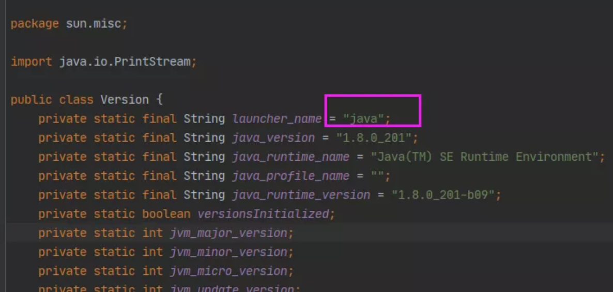

## 字符串常量池


```java
String str1 = new StringBuilder("hello").append("World").toString();
System.out.println(str1.intern());
System.out.println(str1 == str1.intern());


String str2 = new StringBuilder("ja").append("va").toString();
System.out.println(str2.intern());
System.out.println(str2 == str2.intern());


String str3 = new StringBuilder("hello1").toString();
System.out.println(str3.intern());
System.out.println(str3 == str3.intern());
```


答案：

```
helloWorld
true
java
false
hello
false
```


== 运算，对于非基本类型比较的是内存地址值，要知道这道题的输出的结果，最简单的方法就是知道对象：`str1`、`str1.intern()`、`str2`、`str2.intern()`、`str3`、`str3.intern()`的内存地址值就能判断输出是 true还是false。

但这是jvm极力要遏制的，因此我是无法得知内存地址的，当然如果通过其它方式是可以做到的，但是jvm是没有这个api的，下面我们通过hashCode侧面排除一些情况，**如果hash值不同，肯定不是同一个对象**，hash值相同可能不是同一个对象。

hash值相同不能确认是同一个对象，但是能得知不同则一定不是同一个对象。也就是下面"java"。str1和str2是两个不同的对象，str1来自堆的Eden区中，而str2则是Old区的字符串常量池中。


```java
String str1 = new StringBuilder("ja").append("va").toString();
String str2 = str1.intern();
System.out.println(str1==str2);
System.out.println(System.identityHashCode(str1)); // 通过System提供的方法得到hash值，打印hash值相当于内存地址，hashCode方法不完全等于
System.out.println(System.identityHashCode(str2)); // 打印地址


String str3 = new StringBuilder("hello").append("world").toString();
String str4 = str3.intern();
System.out.println(str3==str4);
System.out.println(System.identityHashCode(str3));
System.out.println(System.identityHashCode(str4));
```


得到下面一组打印输出，同一个对象的hash值肯定是相同的，而下面str1和str2的hash值不同肯定不是同一个对象（注意不能调用String重写的hashCode()，我们要调用Object提供的native修饰的hashCode()或者利用System.identityHashCode()得到hash值(这种情况就相当于是内存地址)）

```
false    // str1和str2不是同一个对象
460141958     // 堆空间创建的那个对象 ”java“
1163157884   // 字符串常量池中的字符串对象
true    // 说明str3和str4是同一个对象
1956725890   // 堆中创建的字符串对象 ”helloworld“
1956725890   // 堆中创建的字符串对象 ”helloworld“
```


结果不同：

原因在于"java"在类加载机制过程中执行了System类的System.initializeSystemClass()方法，在方法中调用了sun.misc.Version.init();就**将"java"已经加载到常量池中了**（字节码中的常量池只是class文件常量池不代码jvm环境的所有常量池，而**运行时常量池中已经存在"java"字符串**），部分截图如下，会发现"java"常量已经被使用了。



判断语句变成了，new创建出来的"java"对象，与运行时常量池中的"java"是两个不同的对象，因此返回false。


---

**这段代码可以表明：**

在调用intern()方法时，会将原先堆中（非字符串常量池）的String对象的引用地址拷贝一份到常量池中。并返回这个地址，不会重新创建一个新的"helloWorld"

**此时intern()实际上只是做了一个地址引用**

因此当判断str1 == str1.intern()时，他们的地址是同一个地址，也是同一个对象，因此返回true。

```java
String str3 = new StringBuilder("hello").append("world").toString();
System.out.println(System.identityHashCode(str3));//460141958
String str4 = str3.intern();
System.out.println(str3==str4);
System.out.println(System.identityHashCode(str3));//460141958
System.out.println(System.identityHashCode(str4));//460141958
```


对于最后一个问题：

str3是通过`new StringBuilder("hello1").toString();`**创建出来的对象**，因此是一个**全新的"hello"字符串对象**

**这时候，同时会将"hello1"这个字符串存到字符串常量池中**

调用intern()方法后，返回的则是***常量池中的"hello1"***  ,两者明显不是同一个对象，因此返回false。


```java
String str3 = new StringBuilder("hell").toString();
System.out.println(System.identityHashCode(str3.intern()));//460141958
System.out.println(System.identityHashCode(new String("hell")));//1163157884
System.out.println(System.identityHashCode(new String("hell").intern()));//460141958
System.out.println(System.identityHashCode(str3));//1956725890
System.out.println(str3 == str3.intern());
```


