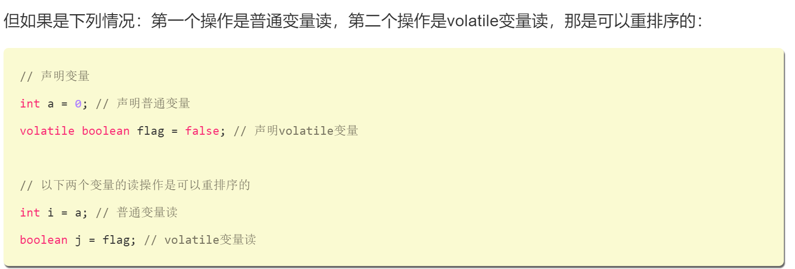
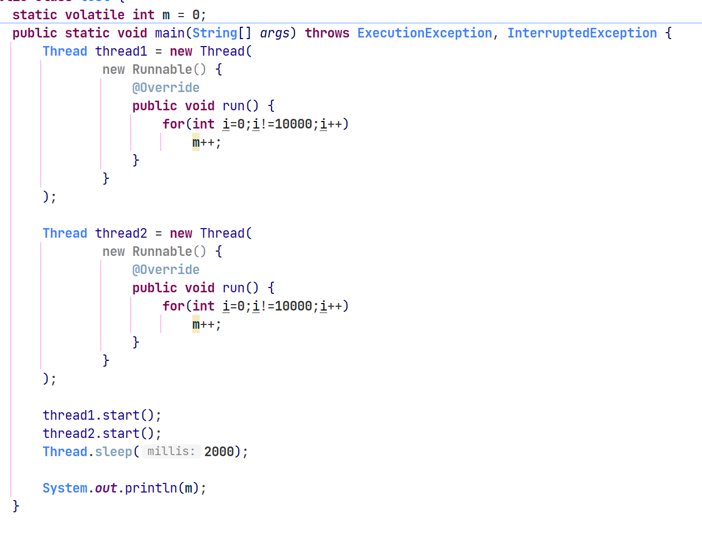

# 目录

[TOC]

进程与线程
==========

批处理操作系统的指令运行方式仍然是**串行**的，**内存中*始终只有一个程序*在运行**。

进程是 **应用程序在内存中分配的空间，也就是正在运行的程序**
各个进程之间互不干扰。进程保存着程序每一个时刻运行的状态。

时间片！暂停！**保存状态 恢复**

对于*单核* 没啥区别.. 任何时刻只有一个任务在占用cpu资源

一个进程在一段时间内只能做一件事情？？？××

有多个**子任务**，只能逐个执行 不能同时使用

线程！！

先暂停一个线程去执行另一个线程

**内部并发**

> 为什么要用多线程（而不是多进程）来实现并发？
>
> -   进程间通信复杂，线程间通信简单，使用**共享资源**
> -   多线程开销小
>
> 区别： **是否单独占有内存地址空间及其他系统资源**
>
> -   进程间存在 **内存隔离，数据是分开的，共享复杂，互不干扰**
> -   一个进程出现问题不会影响其他进程，一个线程崩溃可能影响整个程序的稳定
> -   线程只需要保存**寄存器和栈信息**，不需要调动内存空间的分配

上下文切换
----------

进程切换

上下文：某一时间点**CPU寄存器和程序计数器的内容**


CPU为每个线程分配CPU时间片

上下文切换：任务从**保存到在加载**的过程就是一次上下文切换

计算密集型 消耗资源 不是越多越好 减少系统中上下文切换次数

Java多线程入门类和接口
======================

Thread类和Runnable接口
----------------------

-   继承Thread类，重写run方法
-   实现Runnable接口的run方法

``` java
public class demo1 {
    public static class MyThread extends Thread{
        public void run(){
            System.out.println("MyThread!");
        }
    }
    public static void main(String[] args) {
        Thread myThread = new MyThread();
        myThread.start();
    }
}
```

**调用start()方法**后，该线程才算启动。**虚拟机**创建一个线程，然后等到这个线程**第一次得到时间片**，会**调用run()**方法。

（不可多次调用start()方法，再次调用会抛异常）

------------------------------------------------------------------------

``` java
public interface Runnable {
    public abstract void run();
}
```

``` java
public static void main(String[] args) {
    new Thread(new Myth()).start();
        //java8函数式编程  可以省略Myth类
    new Thread(() -> {
        System.out.println("Java 8 匿名内部类");
        }).start();
    }
    public static class Myth implements Runnable{
        @Override
        public void run(){
            System.out.println("myth!");
        }
    }
```

**start()方法只能Thread及其子类使用，用Runnable实现类来   => 构造一个Thread对象 , 并start()**

Thread类构造方法
----------------

Thread类是Runnable接口的**实现类**

源码：

``` java
//使用Runnable实现类来构造Thread对象的构造函数
public Thread(Runnable target) {
   this(null, target, "Thread-" +nextThreadNum(), 0);
}

//调用这个私有构造方法
private Thread(ThreadGroup g, Runnable target, String name, long stackSize, AccessControlContext acc, boolean inheritThreadLocals)

    //使用在构造方法里初始化AccessControlContext类型的私有属性
    this.inheritedAccessControlContext = 
    acc != null ? acc : AccessController.getContext();

//两个对用于支持ThredLocal的私有属性
ThreadLocal.ThreadLocalMap threadLocals = null;
ThreadLocal.ThreadLocalMap inheritableThreadLocals = null;
```

-   g: 线程组，指定这个线程在哪个线程组下

-   target: 指定要执行的任务

-   name: 线程的名字

-   acc: 用于初始化私有变量`inheritedAccessControlContext`


-   inheritThreadLocals: Thread`类里面有两个私有属性来支持`ThreadLocal

大多数是调用***这两个构造方法***：

``` java
Thread(Runnable target)
Thread(Runnable target, String name)
```

------------------------------------------------------------------------

Thread类的常用方法：

-   currentThread():
    **静态方法**，返回对当前正在执行的**线程对象的引用**
-   start(): **开始执行线程**，jvm会调用线程内的run()方法
-   yield()：yield在英语里有放弃的意思，同样，这里的yield()指的是当前线程愿意**让出对当前处理器的占用**。这里需要注意的是，就算当前线程调用了yield()方法，程序在调度的时候，也还**有可能继续运行**这个线程的；
-   sleep()：**静态**方法，使当前线程**睡眠**一段时间；
-   join()：使**当前**线程**等待**另一个线程执行完毕之后**再继续执行**，内部调用的是Object类的**wait()方法**实现的；

------------------------------------------------------------------------

Thread类和Runnable接口的比较
----------------------------

自定义的线程类： 可以继承Thread类或者实现Runnable接口：

-   **单继承 多实现**，Runnable接口更灵活
-   Runnable将线程**单独进行对象的封装**
-   Runnable降低了线程对象和线程任务的耦合性
-   如果不需要使用Thread类的**诸多方法**，使用Runnable更**轻量**

------------------------------------------------------------------------

Callable、Future与FutureTask
----------------------------

使用Runnable和Thread来创建一个新的线程

弊端：run() 方法没有返回值，希望线程执行完后有一个返回值

**Callable接口和Future接口** "异步"模型

------------------------------------------------------------------------

Callable接口

只有一个抽象方法的函数式接口

Callable接口**有返回值**，**支持泛型**

``` {.java}
public interface Callable<V> {
    /**
     * Computes a result, or throws an exception if unable to do so.
     * @return computed result
     * @throws Exception if unable to compute a result
     */
    V call() throws Exception;
}
```

一般是配合线程池工具ExecutorService来使用，用submit方法来让一个Callable接口执行，**返回一个Future**，通过Furure的**get方法**得到结果

``` {.java}
class Task implements Callable<Integer>{
    @Override
    public Integer call() throws Exception {
        Thread.sleep(1000);
        return 2;
    }
    public static void main(String args[]) throws Exception {
        // 使用
        ExecutorService executor = Executors.newCachedThreadPool();
        Task task = new Task();
        Future<Integer> result = executor.submit(task);
        // 注意调用get方法会  阻塞  当前线程，直到得到结果。
        // 所以实际编码中建议使用可以设置超时时间的重载get方法。
        System.out.println(result.get()); 
    }
}
```

------------------------------------------------------------------------

``` {.java}
public abstract interface Future<V> {
    //试图取消一个线程的执行  试图！不一定能成功   因为任务可能已经完成/已取消/...  存在失败的可能   返回是否取消成功的意思
    public abstract boolean cancel(boolean paramBoolean);//paramBoolean：是否采用中断的方式取消线程执行
    public abstract boolean isCancelled();
    public abstract boolean isDone();
    public abstract V get() throws InterruptedException, ExecutionException;
    public abstract V get(long paramLong, TimeUnit paramTimeUnit)
            throws InterruptedException, ExecutionException, TimeoutException;
}
```

有时候，为了让任务有**能够取消**的功能，就使用`Callable`来**代替**`Runnable`

如果为了**`<u>`{=html}可取消性`</u>`{=html}**而使用
`Future`但又**不提供可用的结果**，则可以声明
`Future<?>`形式类型、并**返回 `null`**作为底层任务的结果。
*不声明返回类型，直接返回null*

------------------------------------------------------------------------

Future接口的实现类：FutureTask`<V>`{=html} implements
RunnableFuture`<V>`{=html}extends Runnable, Future`<V>`{=html}

``` {.java}
public interface RunnableFuture<V> extends Runnable, Future<V> {
    /**
     * Sets this Future to the result of its computation
     * unless it has been cancelled.
     */
    void run();
}
```

Future里面的**方法需要自己实现**，FutureTask类已经实现了

``` {.java}
class Task implements Callable<Integer>{
    @Override
    public Integer call() throws Exception {
        // 模拟计算需要一秒
        Thread.sleep(1000);
        return 2;
    }
    public static void main(String args[]) throws Exception {
        // 使用
        ExecutorService executor = Executors.newCachedThreadPool();
        FutureTask<Integer> futureTask = new FutureTask<>(new Task());
        executor.submit(futureTask);
        System.out.println(futureTask.get());
    }
}
```

submit方法没有返回值，调用的 submit(**Runnable** task)
上面的调用的是submit(**Callable`<T>`{=html}**
task)方法。FutureTask能够在高并发环境下**确保任务只执行一次**

------------------------------------------------------------------------

FutureTask几个**状态**

``` {.java}
/**
  *
  * state可能的状态转变路径如下：
  * NEW -> COMPLETING -> NORMAL
  * NEW -> COMPLETING -> EXCEPTIONAL
  * NEW -> CANCELLED
  * NEW -> INTERRUPTING -> INTERRUPTED
  */
private volatile int state;
private static final int NEW       = 0;
private static final int COMPLETING  = 1;
private static final int NORMAL     = 2;
private static final int EXCEPTIONAL  = 3;
private static final int CANCELLED   = 4;
private static final int INTERRUPTING = 5;
private static final int INTERRUPTED  = 6;
```

运行状态只会在**set、setException、cancel**方法中**终止**。COMPLETING、INTERRUPTING是任务完成后的瞬时状态。

线程组和线程优先级
==================

ThreadGroup 对线程进行批量控制

每个Thread必然存在于一个ThreadGroup中，Thread不能独立于ThreadGroup存在

执行main()方法线程的名字是main，如果在new
Thread时没有**显式指定**，那么默认将**父线程**（当前执行new
Thread的线程）线程组设置为自己的线程组。

``` {.java}
public static void main(String[] args) throws InterruptedException {

    Thread test = new Thread(() -> {
        System.out.println("test当前线程组名字： " +
                Thread.currentThread().getThreadGroup().getName());
        System.out.println("test线程名字： " +
                Thread.currentThread().getName());
    });``

    test.start();
    Thread.sleep(1000);
    System.out.println("执行main所在线程的线程组名字： " + Thread.currentThread().getThreadGroup().getName());
    System.out.println("执行main方法线程名字：" + Thread.currentThread().getName());
}
//test当前线程组名字： main
//test线程名字： Thread-0
//执行main所在线程的线程组名字： main
//执行main方法线程名字：main
```

ThreadGroup是一个标准的**向下引用**的树状结构，这样设计的原因是**防止"上级"线程被"下级"线程引用而无法有效地被GC回收**。

------------------------------------------------------------------------

线程的优先级
------------

1\~10 高优先级的线程回避低优先级的线程有 **更高的几率得到执行**

setPriority()设定线程的优先级 （java默认为5）

但！ 无法指定一些线程执行的先后顺序！！！

Java中的优先级不是特别的可靠！
**设置的优先级只是给os的一个建议，不一定会采纳。真正的调用顺序，是由操作系统的*线程调度算法*决定的**

``` {.java}
当前执行的线程是：Thread-17，优先级：9
当前执行的线程是：Thread-1，优先级：1
当前执行的线程是：Thread-13，优先级：7
当前执行的线程是：Thread-11，优先级：6
当前执行的线程是：Thread-15，优先级：8
当前执行的线程是：Thread-7，优先级：4
当前执行的线程是：Thread-9，优先级：5
当前执行的线程是：Thread-3，优先级：2
当前执行的线程是：Thread-5，优先级：3
```

**线程调度器** 调度策略采用**抢占式**，优先级高有更大的几率有限制性。

每个java程序都有一个默认的**主线程**，通过jvm启动的第一个线程main线程

**守护线程（Daemon）** 优先级较低

> 如果某线程是守护线程，那如果所有的非守护线程都结束了，这个守护线程也**会自动结束**。
>
> 应用场景是：当所有非守护线程结束时，结束其余的子线程（守护线程）**自动关闭**，就免去了还要**继续关闭子线程的麻烦**。
>
> 一个线程默认是非守护线程，可以通过Thread类的setDaemon(boolean
> on)来设置。
>
> 守护线程是指为其他线程服务的线程。在JVM中，所有非守护线程都执行完毕后，无论有没有守护线程，虚拟机都会自动退出。
>
> 因此，JVM退出时，不必关心守护线程是否已结束。
>
> 守护线程**不能持有**任何**需要关闭的资源**，例如打开文件等，因为虚拟机退出时，守护线程没有任何机会来关闭文件，这会导致数据丢失。

如果某个***线程***
优先级大于线程所在**线程组的最大优先级**，那么该线程的优先级将会失效，取而代之的是线程组的最大优先级。

线程组的常用方法及数据结构
--------------------------

``` {.java}
//获取当前的线程组名字
Thread.currentThread().getThreadGroup().getName()
    
//获取当前的线程组
ThreadGroup threadGroup = Thread.currentThread().getThreadGroup();
//复制一个线程组到一个线程数组（获取Thread信息）
Thread[] threads = new Thread[threadGroup.activeCount()];
threadGroup.enumerate(threads);
```

线程组统一异常处理

``` {.java}
public static void main(String[] args) {
    ThreadGroup threadGroup1 = new ThreadGroup("group1"){
        public void uncaughtException(Thread t, Throwable e){
            System.out.println(t.getName() + ": " + e.getMessage());
        }
    };

    Thread thread1 = new Thread(threadGroup1, new Runnable() {
        @Override
        public void run() {
            throw new RuntimeException("测试异常");
        }
    });
    thread1.start();
}
```

------------------------------------------------------------------------

``` {.java}
public class ThreadGroup implements Thread.UncaughtExceptionHandler {
    private final ThreadGroup parent; // 父亲ThreadGroup
    String name; // ThreadGroupr 的名称
    int maxPriority; // 线程最大优先级
    boolean destroyed; // 是否被销毁
    boolean daemon; // 是否守护线程
    boolean vmAllowSuspension; // 是否可以中断

    int nUnstartedThreads = 0; // 还未启动的线程
    int nthreads; // ThreadGroup中线程数目
    Thread threads[]; // ThreadGroup中的线程

    int ngroups; // 线程组数目
    ThreadGroup groups[]; // 线程组数组
}
```

``` {.java}
// 私有构造函数
private ThreadGroup() { 
    this.name = "system";
    this.maxPriority = Thread.MAX_PRIORITY;
    this.parent = null;
}

// 默认是以当前ThreadGroup传入作为parent  ThreadGroup，新线程组的父线程组是目前正在运行线程的线程组。
public ThreadGroup(String name) {
    this(Thread.currentThread().getThreadGroup(), name);
}

// 构造函数
public ThreadGroup(ThreadGroup parent, String name) {
    this(checkParentAccess(parent), parent, name);
}

// 私有构造函数，主要的构造函数
private ThreadGroup(Void unused, ThreadGroup parent, String name) {
    this.name = name;
    this.maxPriority = parent.maxPriority;
    this.daemon = parent.daemon;
    this.vmAllowSuspension = parent.vmAllowSuspension;
    this.parent = parent;
    parent.add(this);
}
```

``` {.java}
// 检查parent ThreadGroup
private static Void checkParentAccess(ThreadGroup parent) {
    parent.checkAccess();
    return null;
}

// 判断当前运行的线程是否具有修改线程组的权限
public final void checkAccess() {
    SecurityManager security = System.getSecurityManager();
    if (security != null) {
        security.checkAccess(this);
    }
}
```

> 这里涉及到`SecurityManager`这个类，它是Java的**安全管理器**，它允许应用程序在执行一个可能不安全或敏感的操作前确定该操作是什么，以及是否是在允许执行该操作的安全上下文中执行它。应用程序可以允许或不允许该操作。
>
> 比如引入了第三方类库，但是并不能保证它的**安全性**。
>
> 其实Thread类也有一个checkAccess()方法，不过是用来当前运行的线程是否有权限修改被调用的这个线程实例。

Java线程的状态及主要转化方法
============================


-   **就绪状态(ready)**：线程正在等待使用cpu，经调度程序调用之后可进入running状态
-   **执行状态(running)**: 正在使用CPU
-   **等待状态(waiting)**:
    经过等待事件的调用或正在**等待其他资源**（IO/网络/...)

Java线程的6个状态
-----------------

``` {.java}
// Thread.State 源码
public enum State {
    NEW,
    RUNNABLE,
    BLOCKED,
    WAITING,
    TIMED_WAITING,
    TERMINATED;
}
```

------------------------------------------------------------------------

NEW

    Thread state for a thread which has not yet started.

new状态：线程尚未启动，**就是还没调用Thread实例的start()方法**

``` {.java}
private void testStateNew() {
    Thread thread = new Thread(() -> {});
    System.out.println(thread.getState()); // 输出 NEW 
}
```

**已*创建* 线程但没执行**

问题：

-   反复调用同一个线程的start()方法是否可行
-   线程**执行完毕(terminated)**，再次调用start()方法是否可行

``` {.java}
public synchronized void start() {
    //不等于0 抛异常
    if (threadStatus != 0)
        throw new IllegalThreadStateException();
    group.add(this);
    boolean started = false;
    try {
        start0();
        started = true;
    } finally {
        try {
            if (!started) {
                group.threadStartFailed(this);
            }
        } catch (Throwable ignore) {

        }
    }
}
```

``` {.java}
public State getState() {
    // get current thread state
    return jdk.internal.misc.VM.toThreadState(threadStatus);
}

public static Thread.State toThreadState(int threadStatus) {
        if ((threadStatus & JVMTI_THREAD_STATE_RUNNABLE) != 0) {
            return RUNNABLE;
        } else if ((threadStatus & JVMTI_THREAD_STATE_BLOCKED_ON_MONITOR_ENTER) != 0) {
            return BLOCKED;
        } else if ((threadStatus & JVMTI_THREAD_STATE_WAITING_INDEFINITELY) != 0) {
            return WAITING;
        } else if ((threadStatus & JVMTI_THREAD_STATE_WAITING_WITH_TIMEOUT) != 0) {
            return TIMED_WAITING;
        } else if ((threadStatus & JVMTI_THREAD_STATE_TERMINATED) != 0) {
            return TERMINATED;
        } else if ((threadStatus & JVMTI_THREAD_STATE_ALIVE) == 0) {
            return NEW;
        } else {
            return RUNNABLE;
        }
    }

private static final int JVMTI_THREAD_STATE_ALIVE = 0x0001;
    private static final int JVMTI_THREAD_STATE_TERMINATED = 0x0002;
    private static final int JVMTI_THREAD_STATE_RUNNABLE = 0x0004;
    private static final int JVMTI_THREAD_STATE_BLOCKED_ON_MONITOR_ENTER = 0x0400;
    private static final int JVMTI_THREAD_STATE_WAITING_INDEFINITELY = 0x0010;
    private static final int JVMTI_THREAD_STATE_WAITING_WITH_TIMEOUT = 0x0020;
```

> 在调用一次start()之后，threadStatus的值会发生改变，此时再次调用start（）方法会抛出throw
> new IllegalThreadStateException();
>
> threadStatus为2代表当前线程状态为terminated

------------------------------------------------------------------------

RUNNABLE

线程正在Java虚拟机中运行，也可能在等待CPU分配资源

``` {.java}
/**
 * Thread state for a runnable thread.  A thread in the runnable
 * state is executing in the Java virtual machine but it may
 * be waiting for other resources from the operating system  等待操作系统分配资源
 * such as processor.
 */
```

Java线程的**RUNNABLE**状态其实是包括了
传统操作系统线程的**ready**和**running**两个状态的。

------------------------------------------------------------------------

BLOCKED

等待**锁的释放**以进入**同步区**

> 假如今天你下班后准备去食堂吃饭。你来到食堂仅有的一个窗口，发现前面已经有个人在窗口前了，此时你必须得等前面的人从窗口离开才行。
> 假设你是线程t2，你前面的那个人是线程t1。此时t1**占有了锁**（食堂**唯一的**窗口），t2正在**等待锁的释放**，所以此时t2就处于BLOCKED状态。

------------------------------------------------------------------------

WAITING

需要其他线程唤醒才能变成Runnable状态

使线程进入等待状态：

-   Object.wait() : 使当前线程处于**等待状态**直到另一个线程**唤醒**它
-   Thread.join() :
    **等待线程执行**完毕，**底层**调用的是**Object实例**的wait方法
-   LockSupport.park() :
    除非获得**调用许可**，否则**禁用**当前线程**进行线程调度**

> 你等了好几分钟现在终于轮到你了，突然你们有一个"不懂事"的经理突然来了。你看到他你就有一种不祥的预感，果然，他是来找你的。
>
> 他把你拉到一旁叫你待会儿再吃饭，说他下午要去作报告，赶紧来找你了解一下项目的情况。你心里虽然有一万个不愿意但是你还是从食堂窗口走开了。
>
> 此时，假设你还是线程t2，你的经理是线程t1。虽然你此时都占有锁（窗口）了，"不速之客"来了你还是得释放掉锁。此时你t2的状态就是WAITING。然后经理t1获得锁，进入RUNNABLE状态。
>
> 要是经理t1不主动唤醒你t2（notify、notifyAll..），可以说你t2只能一直等待了。

------------------------------------------------------------------------

TIMED_WAITING

超时等待。等待一个**具体的时间**，时间到后会被**自动唤醒**

使线程进入超时等待状态：

-   Thread.sleep(long millis) : 使当前线程睡眠指定时间
-   object.wait(long timeout) :
    休眠指定时间，等待期间可以通过notify()/notifyAll()**唤醒**；
-   Thread.join(long millis) :
    等待当前线程最多执行millis毫秒，如果millis为0，则会一直执行；
-   LockSupport.parkNanos(long nanos):
    除非获得调用许可，否则**禁用**当前线程**进行线程调度指定时间**；
-   LockSupport.parkUntil(long
    deadline)：同上，也是禁止线程进行调度指定时间；

> 到了第二天中午，又到了饭点，你还是到了窗口前。
>
> 突然间想起你的同事叫你等他一起，他说让你等他十分钟他改个bug。
>
> 好吧，你说那你就等等吧，你就离开了窗口。很快十分钟过去了，你见他还没来，你想都等了这么久了还不来，那你还是先去吃饭好了。
>
> 这时你还是线程t1，你改bug的同事是线程t2。**t2让t1等待**了指定时间，此时**t1等待期间就属于TIMED_WATING**状态。
>
> t1等待10分钟后，就**自动唤醒**，拥有了去**争夺锁**的资格。

------------------------------------------------------------------------

TERMINATED

终止状态，此时线程已**执行完毕**

线程状态的转换
--------------


------------------------------------------------------------------------

**BLOCKED与RUNNABLE状态的转换**

处于BLOCKED状态的线程是在等待锁的释放。

a线程提前获得了锁并且暂未释放锁，此时b就处于BLOCKED状态

``` {.java}
public static void main(String[] args) throws InterruptedException {
    Thread a = new Thread(new Runnable() {
        @Override
        public void run() {
            testMethod();
        }
    }, "a");

    Thread b = new Thread(new Runnable() {
        @Override
        public void run() {
            testMethod();
        }
    }, "b");
    a.start();
    //使main线程停止1000
    //要在争夺锁的时间内，不要等到前一个线程锁都释放了再去争夺锁，这时候就得不到BLOCKED状态
    Thread.sleep(1000L);
    b.start();
    System.out.println(a.getName() + " : " + a.getState());
    System.out.println(b.getName() + " : " + b.getState());
}
private static synchronized void testMethod(){
    try{
        Thread.sleep(2000L);
    } catch (InterruptedException e) {
        e.printStackTrace();
    }
}
```

**启动线程后执行run方法还是需要消耗一定时间的**。

main线程只保证了a，b两个线程调用start()方法 -\>
转化为RUNNABLE状态。还没等两个线程真正开始争夺锁，就已经打印此时两个线程的状态（RUNNABLE）了。

-   a的状态转换过程：RUNNABLE（`a.start()`） -\>
    TIMED_WATING（`Thread.sleep()`）-\>RUNABLE（sleep()时间到）-\>*BLOCKED(未抢到锁)*
    -\> TERMINATED
-   b的状态转换过程：RUNNABLE（`b.start()`) -\> *BLOCKED(未抢到锁)*
    -\>TERMINATED

**可能出现的状态有很多种**

稍微慢一点可能线程就从RUNNABLE --\> TIMED_WAITING状态了

**从启动线程 到 执行run() 再执行sleep() 都需要一点时间**

------------------------------------------------------------------------

**WAITING状态与RUNNABLE状态的转换**

Object.wait()

> 线程**必须持有**对象的锁
>
> 调用wait()方法时，会***`<u>`{=html}释放`</u>`{=html}***当前的锁，直到有其他线程调用notify(All)()唤醒等待
> 锁 的线程
>
> notify()只能唤醒单个等待锁的线程，如果有**多个**线程都在等待**这个锁**，不一定会唤醒到之前**调用wait方法**的线程
>
> 同样，调用notifyAll()方法唤醒**所有**等待锁的线程之后，也**不一定**会马上把时间片分给**刚才放弃锁**的那个线程，具体要**看系统的调度**。

Thread.join()

> 调用join()不会释放锁，会一直等待当前线程执行完毕（TERMINATED）

``` {.java}
a.start();
a.join();
//Thread.sleep(3000L);
b.start();
 System.out.println(a.getName() + ":" + a.getState()); // 输出 TERMINATED
    System.out.println(b.getName() + ":" + b.getState());
```

a : TERMINATED b : TIMED_WAITING

**如果没有调用join()方法，main线程不管a线程是否执行完毕都会继续往下走**

a启动之后马上调用join方法，**main线程就会等到a执行完毕**，b可能打印RUNNABLE（尚**未进入同步**方法），也可能TIMED_WAITING

------------------------------------------------------------------------

**TIMED_WAITING与RUNNABLE状态转换**

类似，只是时间是指定的

**Thread.sleep(long)**

> 使当前线程睡眠指定时间。需要注意这里的"睡眠"只是暂时使线程**停止执行**，并**不会释放锁**。时间到后，线程会**重新进入RUNNABLE**状态。

**Object.wait(long)**

> wait(long)方法使线程进入TIMED_WAITING状态。这里的wait(long)方法与无参方法wait()相同的地方是，都可以通过其他线程调用notify()或notifyAll()方法来唤醒。
>
> 不同的地方是，有参方法wait(long)就算其他线程不来唤醒它，经过指定时间long之后它会**自动唤醒**，拥有去争夺锁的资格。

**Thread.join(long)**

> join(long)使当前线程**执行指定时间**，并且使线程进入TIMED_WAITING状态。

``` {.java}
a.start();
        a.join(1000L);
        //Thread.sleep(3000L);
        b.start();
        System.out.println(a.getName() + " : " + a.getState());
        System.out.println(b.getName() + " : " + b.getState());
```

a : TIMED_WAITING b : BLOCKED

指定了具体a线程**执行时间，不管任务有没有执行完，都进入TIMED_WAITING状态**

------------------------------------------------------------------------

**线程中断**

> java中**没有安全**直接的方法来停止线程，但java提供了**线程中断机制**来处理需要中断线程的情况
>
> 并不能直接终止一个线程，而是通知需要被中断的线程自行处理

-   Thread.interrupt():
    中断线程。这里的中断线程并不会立即停止线程，而是**设置线程的中断状态**为true（默认是flase）；
-   Thread.interrupted()：**测试**当前线程是否被中断。线程的中断状态受这个方法的影响，意思是**调用一次使线程中断状态设置为true**，连续调用两次会使得这个线程的中断状态重新转为false；
-   Thread.isInterrupted()：测试当前线程是否被中断。与上面方法不同的是调用这个方法并**不会影响线程的中断状态**。

> 在线程中断机制里，当其他线程**通知**需要**被中断**的线程后，线程中断的状态被设置为**true**，但是具体被要求中断的线程要怎么处理，完全由被中断线程自己而定，可以在合适的实际处理中断请求，也可以完全不处理继续执行下去。

Java线程间的通信
================

锁与同步
--------

锁基于对象，对象锁。

**一个锁同一时间只能被一个线程持有，其他线程如果需要得到这个锁，就得等这个线程释放锁**

线程同步是线程之间按照***一定的顺序***执行。

用"锁"来实现线程同步

``` {.java}
public class NoneLock {
    static class ThreadA implements Runnable {
        @Override
        public void run() {
            for (int i = 0; i < 100; i++) {
                System.out.println("Thread A " + i);
            }
        }
    }
    static class ThreadB implements Runnable {
        @Override
        public void run() {
            for (int i = 0; i < 100; i++) {
                System.out.println("Thread B " + i);
            }
        }
    }
    public static void main(String[] args) {
        new Thread(new ThreadA()).start();
        new Thread(new ThreadB()).start();
    }
}
```

不加锁 每次运行结果都**不同**

线程A和B各自独立工作

需求：A先执行完之后，B再执行

**使用一个对象锁**

``` {.java}
private static Object lock = new Object();
static class ThreadA implements Runnable{

    @Override
    public void run() {
        synchronized (lock){
            for(int i = 0; i < 100; i++){
                System.out.println("Thread A " + i);
            }
        }

    }
}
static class ThreadB implements Runnable{

    @Override
    public void run() {
        synchronized (lock){
            for(int i = 0; i < 100; i++){
                System.out.println("Thread B " + i);
            }
        }
    }
}
```

lock对象锁，锁住需要同步的代码块。

**同一时间只有一个线程**持有一个锁，那么线程B就会等线程A执行完成后释放`lock`，线程B才能获得锁`lock`。

使主线程sleep 10ms
防止线程B先得到锁，如果同时start，A和B都是处于就绪状态，可能会让B先运行

等待/通知机制
-------------

线程需要不断尝试去获得锁，失败了继续尝试。

基于Object类的wait() notify() notifyAll()

notify()会随机叫醒一个正在等待的线程，notifyAll()会叫醒所有正在等待的线程

持有锁的A使用lock.wait()使自己进入等待状态，这时，lock**这个锁是被释放了的**。这时，B获得了lock这个锁并开始执行，它可以再某个时刻使用lock.notify()，通知**之前持有lock锁并进入等待状态的线程A**。

> 这时，线程B并没有释放锁lock，除非B这是使用lock.wait()释放锁或者执行结束自行释放锁，线程A才能得到lock锁

``` {.java}
private static Object lock = new Object();

static class ThreadA implements Runnable{

    @Override
    public void run() {
        synchronized (lock){
            for(int i = 0; i < 5; i++){
                try {
                    System.out.println("ThreadA: " + i);
                    lock.notify();
                    lock.wait();
                } catch (InterruptedException e) {
                    e.printStackTrace();
                }
            }
            lock.notify();
        }
    }
}

static class ThreadB implements Runnable{

    @Override
    public void run() {
        synchronized (lock){
            for(int i = 0; i < 5; i++){
                try {
                    System.out.println("ThreadB: " + i);
                    lock.notify();
                    lock.wait();
                } catch (InterruptedException e) {
                    e.printStackTrace();
                }
            }
            lock.notify();
        }

    }
}

public static void main(String[] args) throws InterruptedException {
    new Thread(new ThreadA()).start();
    Thread.sleep(1000);
    new Thread(new ThreadB()).start();
}
```

使用notify叫醒另一个正在等待的线程，自己使用wait()方法陷入等待并释放lock锁

**等待/通知机制使用的是*同一个对象锁***

信号量
------

Semaphore类。

> volatile关键字能够保证**内存的可见性**，如果用volatile关键字声明了一个变量，在**一个线程里面改变**了这个变量的值，那其他线程是**立马可见更改后的值**的

需求：线程A B轮流输出0 1 2 3 ....

``` {.java}
private static volatile int signal = 0;

static class ThreadA implements Runnable{

    @Override
    public void run() {
        while(signal < 5){
            if(signal % 2 == 0){
                System.out.println("threadA: " + signal);
                signal++;
            }
        }
    }
}
static class ThreadB implements Runnable{

    @Override
    public void run() {
        while(signal < 5){
            if(signal % 2 == 1){
                System.out.println("threadB: " + signal);
                signal++;
            }
        }
    }
}

public static void main(String[] args) throws InterruptedException {
    new Thread(new ThreadA()).start();
    Thread.sleep(1000);
    new Thread(new ThreadB()).start();
}
```

`volatile`变量需要进行**原子操作**。

**`signal++`并不是一个原子操作**，所以我们在实际开发中，会根据需要使用`synchronized`给它"**上锁**"，或者是使用`AtomicInteger`等原子类。

管道
----

基于"管道流"的通信方式。

PipedWriter, PipedReader, PipedOutPutStream, PipedInputStream
。分别基于**字符**和**字节**流

``` {.java}
static class ReaderThread implements Runnable{

    private PipedReader reader;

    public ReaderThread(PipedReader reader){
        this.reader = reader;
    }
    @Override
    public void run() {
        System.out.println("this is reader!");
        int receive = 0;
        try{
            while((receive = reader.read()) != -1){
                System.out.println((char)receive);
            }
        } catch (IOException e) {
            e.printStackTrace();
        }
    }
}

static class WriterThread implements Runnable{
    private PipedWriter writer;

    public WriterThread(PipedWriter writer) {
        this.writer = writer;
    }

    @Override
    public void run() {
        System.out.println("this is writer!");
        int receice = 0;
        try{
            writer.write("test");
        } catch (IOException e) {
            e.printStackTrace();
        } finally {
            try {
                writer.close();
            } catch (IOException e) {
                e.printStackTrace();
            }
        }
    }
}

public static void main(String[] args) throws IOException, InterruptedException {
    PipedWriter writer = new PipedWriter();
    PipedReader reader = new PipedReader();
    writer.connect(reader);//一定要连接，才能通信

    new Thread(new ReaderThread(reader)).start();
    Thread.sleep(1000);
    new Thread(new WriterThread(writer)).start();
}

this is reader!
this is writer!
t
e
s
t
```

线程ReaderThread使用管道reader.read()**进入"阻塞"**，

线程WriterThread用writer.write("test")**往管道写入字符串**

线程ReaderThread**接受到管道输出的字符串**并打印，

> 应用场景：
>
> 一个线程需要向另一个线程发送一个信息或者文件... 需要使用管道通信

其他通信相关
------------

------------------------------------------------------------------------

join方法

让当前线程陷入"等待"状态，等**join的这个线程执行完成后**，再继续执行当前线程。

有时候，主线程创建并启动了子线程，如果子线程中需要进行大量的耗时运算，主线程往往将早于子线程结束之前结束。

如果主线程想**等待子线程执行完毕后**，获得**子线程中的处理完的某个数据**，就要用到join方法了。

``` {.java}
static class ThreadA implements Runnable{

    @Override
    public void run() {
        try{
            System.out.println("我是子线程，我先睡2秒");
            Thread.sleep(2000);
            System.out.println("我是子线程，我醒了");
        } catch (InterruptedException e) {
            e.printStackTrace();
        }
    }
}

public static void main(String[] args) throws InterruptedException {
    new Thread(new ThreadA()).start();
    //thread.join();
    System.out.println("如果不加join方法，我会先被打印出来，加了就不一样了");
}
```

join()方法及其重载方法底层都是利用了wait(long)这个方法。

底层并没有精确到纳秒，而是对第二个参数做了简单的判断和处理。

``` {.java}
public final synchronized void join(long millis, int nanos)
throws InterruptedException {

    if (millis < 0) {
        throw new IllegalArgumentException("timeout value is negative");
    }

    if (nanos < 0 || nanos > 999999) {
        throw new IllegalArgumentException(
                            "nanosecond timeout value out of range");
    }

    if (nanos > 0 && millis < Long.MAX_VALUE) {
        millis++;
    }

    join(millis);
}
```

------------------------------------------------------------------------

sleep方法

Thread.sleep() **静态方法**

-   Thread.sleep(long)
-   Thread.sleep(long, int)

第二个方法貌似只对第二个参数做了简单的处理，没有精确到纳秒。实际上还是调用的第一个方法。

> **sleep方法是不会释放当前的锁的，而wait方法会**

它们还有这些**区别**：

-   wait可以指定时间，也可以不指定；而**sleep必须指定时间**。
-   wait释放cpu资源，同时释放锁；sleep释放cpu资源，但是不释放锁，所以***易死锁***。
-   wait***`<u>`{=html}必须放在同步块或同步方法`</u>`{=html}***中，而sleep可以在任意位置

------------------------------------------------------------------------

ThreadLocal类

线程本地变量 线程本地存储

ThreadLocal类并**不属于多线程间的通信**，而是让每个线程有**自己"独立"的变量**，线程之间互不影响，它为每个线程都创建一个副本，每个线程可以**访问**自己**内部的副本变量**

``` {.java}
static class ThreadA implements Runnable{

    private ThreadLocal<String> threadLocal;

    public ThreadA(ThreadLocal<String> threadLocal) {
        this.threadLocal = threadLocal;
    }

    @Override
    public void run() {
        threadLocal.set("A");
        try{
            Thread.sleep(1000);
        } catch (InterruptedException e) {
            e.printStackTrace();
        }

        System.out.println("ThreadA输出：" + threadLocal.get());
    }
}

static class ThreadB implements Runnable{

    private ThreadLocal<String> threadLocal;

    public ThreadB(ThreadLocal<String> threadLocal) {
        this.threadLocal = threadLocal;
    }

    @Override
    public void run() {
        threadLocal.set("B");
        try{
            Thread.sleep(1000);
        } catch (InterruptedException e) {
            e.printStackTrace();
        }

        System.out.println("ThreadB输出：" + threadLocal.get());
    }
}

public static void main(String[] args) {
    ThreadLocal<String> threadLocal = new ThreadLocal<>();
    new Thread(new ThreadA(threadLocal)).start();
    new Thread(new ThreadB(threadLocal)).start();
}
```

**虽然两个线程使用的是*`<u>`{=html}同一个`</u>`{=html}*ThreadLocal实例，但是它们*`<u>`{=html}各自`</u>`{=html}*可以存取自己`<u>`{=html}当前线程的一个值`</u>`{=html}**

那ThreadLocal有什么作用呢？如果只是单纯的想要线程隔离，在每个线程中声明一个私有变量就好了呀，为什么要使用ThreadLocal？

如果开发者希望将**类的某个静态变量**（user ID或者transaction
ID）与线程状态关联，则可以考虑使用ThreadLocal。

数据库连接和Session管理涉及多个复杂对象的初始化和关闭。如果在每个***线程中声明***一些私有变量来进行操作，那这个线程就变得不那么"轻量"了，需要频繁的创建和关闭连接。

------------------------------------------------------------------------

InheritableThreadLocal

InheritableThreadLocal类与ThreadLocal类稍有不同，Inheritable是继承的意思。它不仅仅是**当前线程可以存取副本值**，而且它的**子线程也可以存取这个副本值**。

Java内存模型基础知识
====================

并发编程模型的两个关键问题
--------------------------

-   线程间如何通信？
    -   线程间以**何种机制**来**交换信息**
-   线程间如何同步？
    -   线程以何种机制来控制不同线程间**操作发生的相对*顺序***

两种并发模型：

-   **消息传递**并发模型
-   **共享内存**并发模型


**在Java中，使用的是共享内存并发模型**

Java内存模型的抽象结构
----------------------

运行时数据区


对每个线程，**栈都是私有的，堆是共有的**

在栈中的变量（**局部**变量、方法定义参数、异常处理器参数）不会在线程之间共享，也就不会有内存可见性（下文会说到）的问题，也不受内存模型的影响。而在**堆中的变量是共享的**，本文称为*共享变量*。

所以，内存可见性是针对的**共享变量**。

既然堆是共享的，为什么在堆中会有内存不可见问题？
------------------------------------------------

为了高效，在高速缓存区中缓存共享变量，因为cpu访问**缓存区**比内存更快

> 共享变量存在主内存中，每个线程都有一个私有的本地内存，存储了该线程以读、写共享变量的副本。本地内存。涵盖了缓存，写缓冲区，寄存器等。

重排序与happens-before
======================

重排序
------

对指令做重排

为什么可以提高性能？

每个步骤可能使用不同的硬件，**流水线**，指令1还没有执行完，就可以开始指令2，不用等到指令1执行结束之后再执行指令2

**害怕中断，恢复中断的代价很大。指令重排可以减少中断**

``` {.java}
a = b + c;
d = e - f ;
```

先加载b、c（**注意，即有可能先加载b，也有可能先加载c**），但是在执行add(b,c)的时候，需要**等待b、c装载结束**才能继续执行，也就是**增加了停顿**，那么后面的指令也会依次有停顿,这降低了计算机的执行效率。

为了减少这个停顿，我们可以先加载e和f,然后再去加载add(b,c),这样做对程序（串行）是没有影响的,但却减少了停顿。既然add(b,c)需要停顿，那还不如去做一些有意义的事情。

综上所述，**指令重排对于提高*CPU处理性能*十分必要。虽然由此带来了乱序的问题，但是这点牺牲是值得的。**

-   编译器优化重排

    在 **不改变单线程程序语义**的前提下，可以重新安排语句的**执行顺序**

-   指令并行重排

    指令级并行技术来讲多条指令重叠执行。如果不存在**数据依赖性**（后一个执行的语句无需依赖前面执行的语句的结果）

-   内存系统重排

    处理器使用缓存和读写缓存冲区，这使得加载(load)和存储(store)操作看上去可能是在乱序执行，因为三级缓存的存在，导致**内存与缓存的数据同步存在时间差**。

**保证串行语义一直，但没有义务保证多线程间的语义一致。。**

顺序一致性模型与JMM的保证
-------------------------

未正确同步的时候，可能存在***数据竞争***：在一个线程中写一个变量，在另一个线程读同一个变量，**并且写和读没有通过同步来排序**

Java内存模型（JMM）对正确同步多线程程序的内存一致性做出的保证：


**如果程序正确同步的，程序的执行将具有顺序一致性**。即程序的执行结果和该程序在`<u>`{=html}顺序一致性模型中执行的结果相同`</u>`{=html}。

使用volatile final synchronized来实现**多线程下的同步**

如果没有正确使用volatile final
synchronized，即便是使用了同步（单线程下的同步），JMM也不会有内存可见性的保证

------------------------------------------------------------------------

**顺序一致性模型**

**`<u>`{=html}*理想化的理论参考模型*`</u>`{=html}**，内存可见性保证。

-   一个线程中的所有操作必须按照**程序的顺序**(**Java代码**的顺序)来执行（***不进行重排序***）
-   不管是否**同步**，所有线程都只能看到一个单一的操作执行顺序。**每个操作必须是原子性的，且理科对所有线程可见**

A B两个线程并发执行

A1-\>A2-\>A3

B1-\>B2-\>B3

**正确使用了同步**，A的3个操作执行后释放锁，B获取同一个锁


并且两个线程都**只能看到这个执行顺序**

如果没有使用同步


无序，但两个线程都只能看到这个执行顺序。

顺序一致性模型中的每个操作必须立即对任意线程可见

**但是JMM没有这样的保证**

> 比如，在当前线程把写过的数据**缓存在本地内存**中，在没有**刷新到主内存之前**，这个写操作仅对当前线程可见；从其他线程的角度来观察，这个写操作根本没有被当前线程所执行。只有当前线程把本地内存中写过的数据刷新到主内存之后，这个写操作才对其他线程可见。在这种情况下，当前线程和其他线程看到的执行顺序是不一样的。

------------------------------------------------------------------------

JMM中同步程序的顺序一致性效果

在 **顺序一致性模型**中，所有操作完全按照程序的顺序**串行**执行

但在JMM中，**临界区内（同步块或同步方法中）**的代码可以发生重排序
*不允许临界区内的代码"逃逸"到临界区之**外**，会破坏**锁**的内存语义*

线程A在临界区内做了重排序，因为**锁的特性**，B无法看到A在临界区内的重排序。

JMM会在退出临界区和进去临界区内做特殊的处理，使得在**临界区内**程序获得与**顺序一致性模型相同的内存视图**

**JMM的具体实现方针：在不改变（正确同步的）程序执行结果的前提下，尽量为编译期和处理器的优化打开方便之门**

------------------------------------------------------------------------

未同步程序

**最小安全性**：线程读取到的值，要么是之前某个线程写入的值，要么是默认值，**不会无中生有**。

在堆上分配对象时，首先对内存空间清零，才会咋上面分配对象

**JMM没有保证未同步程序的执行结果与该程序在顺序一致性中执行结果一致。因为如果要保证执行结果一致，那么JMM需要*禁止大量的优化*，对程序的执行性能会产生很大的影响。**

未同步程序在JMM和顺序一致性内存模型中的执行特性有如下差异：

-   顺序一致性保证单线程内的操作会按程序的顺序执行；
    JMM不保真单线程内的操作会按程序的顺序执行（因为**重排序**，但是JMM保证单线程下的重排序**不影响执行结果**）
-   顺序一致性模型
    保证所有线程只能看到**一致的操作执行顺序**，JMM不保证所有线程能看到**一致的**操作执行顺序（JMM不保证所有操作立即可见）
-   顺序一致性保证对**所有的内存读写操作都具有原子性**，而JMM不保证对64位的long型和double型变量的**写操作**具有原子性。

happens-before
--------------

编译器和处理器希望JMM对它们的束缚越少越好，可以做尽可能多的优化来提高性能，希望的是一个弱的内存模型

程序员需要JMM提供一个强的内存模型来编写代码

对编译器和处理器来说，**只要不改变程序的*执行结果*（单线程程序和正确同步了的多线程程序），编译器和处理器怎么优化都行。**

对于程序员，JMM提供了**happens-before规则**，程序员只要遵循happens-before规则，那他写的程序就能保证在JMM中具有强的**内存可见性**。

JMM可以通过happens-before关系向程序员提供**跨线程的内存可见**性保证。

happens-before关系：

1.  如果一个操作happens-before另一个操作，那么第一个操作的执行结果将堆第二个操作可见，而且第一个操作的执行顺序排在第二个操作之前
2.  **两个操作之间存在happens-before关系，并不意味着java平台的具体实现必须要按照happens-before关系指定的顺序来执行。如果重排序之后的执行结果，与按happens-before关系来执行的结果一致，那么JMM*也允许这样的重排序***

as-if-serial语义保证单线程内重排序后的执行结果和程序代码本身应有的结果是一致的，happens-before关系保证正确同步的多线程程序的执行结果不被重排序改变。

总之，**==如果操作A
happens-before操作B，那么操作A在内存上所做的操作对操作B都是可见的，不管它们在不在一个线程。==**

------------------------------------------------------------------------

天然的happens-before关系

-   **程序顺序**规则：一个线程中的每一个操作，happens-before于该线程中的任意后续操作。
-   监视器锁规则：对一个锁的**解锁**，happens-before于随后对这个锁的加锁。
-   **volatile**变量规则：对一个volatile域的写，happens-before于任意后续对这个volatile域的读。
-   **传递**性：如果A happens-before B，且B happens-before C，那么A
    happens-before C。
-   **start**规则：如果线程A执行操作ThreadB.start()启动线程B，那么A线程的ThreadB.start（）操作happens-before于线程B中的任意操作、
-   join规则：如果线程A执行操作ThreadB.join（）并成功返回，那么线程**B中的任意操作**happens-before于线程**A**从ThreadB.join()操作**成功返回**

**真正在执行指令的时候，其实JVM会对一些操作进行重排序，不影响执行结果**

虽然违背了happens-before原则，但是JMM是允许这样的重排的。

JMM对两类重排序有不同的策略：

-   会改变程序执行结果的重排序。JMM要求编译器和处理器都禁止这种重排序
-   不会改变程序执行结果的重排序。JMM对编译器和处理器不做要求，允许。

volatile
========

内存可见性：

JMM有一个主内存，每个线程有自己**私有的工作内存**，工作内存中保存了一些变量**在主内存**的**拷贝**

**内存可见性，指的是线程之间的可见性，当一个线程修改了共享变量时，另一个线程可以读取到这个修改后的值**。

volatile的内存语义：

-   保证变量的 **内存可见性**
-   **禁止**volatile变量与普通变量**重排序**

``` java
int a = 0;
volatile boolean flag = false;

public void writer(){
    a = 1;
    flag = true;
}

public void reader(){
    if(flag){
        System.out.println(a);
    }
}
```

内存可见性，指的是当一个线程对volatile修饰的变量进行**写操作**时，JMM会立即把该线程对应的 **本地内存**中的 **共享变量的值刷新到主内存**；

***<u>当一个线程对volatile修饰的变量进行读操作时，JMM会立即把该线程对应的本地内存置为无效，从主内存中读取共享变量的值。</u>***

> 在这一点上，volatile与锁具有相同的内存效果，volatile变量的**写**和锁的**释放**具有相同的内存语义，volatile变量的**读**和锁的**获取**具有相同的内存语义。


<u>这里面
a和flag都是共享变量，只是更新普通变量a的时候不会将其立马刷新到主内存，而更新flag时  会一同将a刷新到主内存中</u>

如果没有使用volatile关键字的话，线程B就不会**去主内存拿最新的值**，仍然使用线程B**本地内存**缓存的变量的值

禁止重排序
----------

volatile变量与普通变量重排序？

虽然volatile变量能保证内存可见性，可能导致普通变量读取错误。

**增强**volatile的**内存语义**：严格限制编译器和处理器对volatile变量与普通变量的重排序。

编译器还好说，JVM是怎么还能限制处理器的重排序的呢？它是通过***内存屏障***  来实现的。

读屏障(load barrier) 写屏障(store barrier) 作用：

1.  组织屏障两侧的指令重排序
2.  强制把  写缓冲区/高速缓存中的脏数据等写回主内存，或者让缓存中响应的数据失效

编译器在**生成字节码时**，会在指令序列中插入内存屏障来禁止特定类型的处理器重排序。编译器选择了一个**比较保守的JMM内存屏障插入策略**，这样可以保证在任何处理器平台，任何程序中都能得到正确的volatile内存语义。这个策略是：

-   在每个volatile写操作前插入一个StoreStore屏障；
-   在每个volatile写操作后插入一个StoreLoad屏障；
-   在每个volatile读操作后插入一个LoadLoad屏障；
-   在每个volatile读操作后再插入一个LoadStore屏障。


-   **LoadLoad屏障**：对于这样的语句 Load1; LoadLoad;  Load2，在Load2及后续读取操作要读取的数据被访问前，**保证Load1要读取的数据被读取完毕**。
-   **StoreStore屏障**：对于这样的语句Store1; StoreStore;  Store2，在Store2及后续写入操作执行前，这个屏障会**把Store1强制刷新到内存**，保证Store1的**写入操作对其它处理器可见**。
    -   在写入volatile变量之前就需要刷新一次内存
-   **LoadStore屏障**：对于这样的语句Load1; LoadStore;  Store2，在Store2及后续写入操作被刷出前，保证Load1要读取的数据**被读取完毕**。
-   **StoreLoad屏障**：对于这样的语句Store1; StoreLoad; Load2，在Load2及后续所有读取操作执行前，**保证Store1的写入对所有处理器可见**。它的开销是四种屏障中最大的（**冲刷写缓冲器，清空无效化队列**）。在大多数处理器的实现中，这个屏障是个万能屏障，**兼具其它三种内存屏障的功能**

对于连续多个volatile变量读或者连续多个volatile变量写，编译器做了一定的优化来提高性能，比如：

> 第一个volatile读;
>
> LoadLoad屏障；
>
> 第二个volatile读；
>
> LoadStore屏障

volatile阻止重排序
------------------

volatile与普通变量的重排序规则:

1.  如果第**一个操作是volatile读**，那无论第二个操作是什么，都不能重排序；
2.  如果第**二个操作是volatile写**，那无论第一个操作是什么，都不能重排序，这个规则确保volatile
    写之前的操作不会被编译器重排序到volatile 写之后。
3.  如果第**一个操作是volatile写**，第二个操作是volatile读，那不能重排序。

> 为了提高处理速度，处理器不会直接和主存进行通信，现将系统内存的数据读取到 *内部缓存*  中再进行操作，但操作完**不知道何时会写到内存**。
>
> JMM定义了线程和主内存之间的关系：线程之间的共享变量存储在主存中，**每个线程**都有一个私有的本地内存，本地内存中存储了共享内存的副本。

缓存行：CPU高速缓存中可以分配的最小的存储单位。***处理器填写缓存行时会加载整个缓存行。***

> **volatile变量**在进行**写操作**的时候，会插入一条lock前缀的指令：
>
> 1.  将当前处理器**缓存行的数据**写回主存
> 2.  使其他CPU里的缓存***无效***，下次访问相同内存地址时，将强制执行缓存行填充 ——>所以需要先将
>


-   当第二个操作是volatile 写时，不管第一个操作是什么，都不能重排序。
    -   **volatile数据已经同步到主内存了，后面的 普通共享数据写 无法同步到主内存**

> 如果进行重排序，那么volatile写会**使其他CPU的缓存行无效**，不能保证volatile写之前的共享变量数据的一致。
> 
>在volatile变量进行**读**操作的时候，会直接从**主存**中读取，再存储到**缓存行**。

-   当第一个操作是volatile 读时，不管第二个操作是什么，都不能重排序。

    > 如果重排序，当前缓存行的数据就会被置为无效，缓存行中的**普通共享变量也会再从主存中重新读取**


> 重排：
>
> - 第一个操作是volatile读，第二个操作是普通读。如果进行重排序：先普通读，再volatile读，**在volatile读的时候会刷新缓存行**。会导致什么问题呢：给变量赋值时，先给volatile变量赋值，再给普通变量赋值。但是这时候volatile只有volatile读的值，没法给普通变量赋值，会再去从主存中找
> - 第一个操作是普通变量读，第二个操作是volatile读，按原本的指令顺序，缓存行中读到普通变量就直接赋值了，然后再给volatile赋值，即使**缓存行清空也没事**。重排的话也没问题。




当把共享变量声明为 volatile类型后，线程对该变量修改时会将该变量的值**立即刷新回主内存**，同时会使**其它线程中**缓存的该变量**无效**，从而其它线程在读取该值时会从主内存中**重新读取**该值（参考缓存一致性）。因此在读取volatile 类型的变量时总是会**返回最新写入的值。**


-   read 和 load主要是将主内存中数据复制到工作内存中
-   use 和 assign主要是使用数据，并将改变后的值写入到工作内存
-   store 和 write用工作内存数据刷新主内存相关内容


> **volatile 不是原子的**
>
> 栗子：
>
> 

volatile的用途
--------------

volatile可以保证内存可见性 且 禁止重排序

在保证你内存可见性这一点上，volatile有着与**锁**相同的内存语义，作为一个"轻量级"的锁。

-   volatile仅仅保证对      **单个volatile变量的读/写具有原子性**。
-   锁可以保证整个 **临界区代码**的执行具有原子性

**在功能上，锁比volatile更强大；在性能上，volatile更有优势**

单例模式 "双重锁检查"

``` java
public class Singleton {
    private static Singleton singleton; //不使用volatile关键字
    
    //双重锁检验
    public static Singleton getInstance(){
        if(singleton == null){
            synchronized (Singleton.class){
                if(singleton == null){
                    singleton = new Singleton();
                }
            }
        }
        
        return singleton;
    }
}
```

如果这里的变量声明不使用volatile关键字，是可能会发生错误的。它可能会**被重排序**：

``` java
singleton = new Singleton();//未用volatile关键字声明

//可以分解为以下三个步骤
1 memory = allocate()//分配内存
2 ctorInstanc(memory) //初始化对象
3 s=memory //设置s指向刚分配的地址
    
//可能会被重排序为 1-3-2
1 memory=allocate();// 分配内存 相当于c的malloc
3 s=memory //设置s指向刚分配的地址
2 ctorInstanc(memory) //初始化对象
```

如果线程A执行了1、3还没开始执行2，线程B执行到了`if(singleton == null)`，它会判定singleton不为空，然后直接返回了一个**未初始化完成**的singleton

> 如果将singleton声明为volatile的，在`singleton = new Singleton()`过程中，new操作将作为原子操作，**不可重排序**

synchronized与锁
================

java多线程的锁都是**基于对象的**，每一个对象都可以作为一个锁

> **类锁**其实也是对象锁：
>
> java类只有一个class对象（这个类的多个实例共享这个class对象），而class对象也是特殊的java对象。类锁，其实就是Class对象的锁。

生产者-消费者问题
-----------------

在不加任何线程安全的措施下：根据输出：有的资源还没被生产出来就被消费了；或者重复消费同一个资源。

这就是**线程安全问题**。

**线程安全问题的产生原因（缺一不可）**

1.  线程任务中有处理共享的数据。
2.  线程任务中有多条对共享数据的操作。

``` {.java}
class Producer implements Runnable{
    private Res r;
    Producer(Res r){
        this.r=r;
    }
    public void run(){
     while(true)//无限生产和消费
        r.set("面包");
    }
}
class Consumer implements Runnable{
    private Res r;
    Consumer(Res r){
        this.r=r;
    }
    public void run(){
     while(true)//无限生产和消费
        r.get();
    }
}
public class ProducerDemo {
    public static void main(String[] args) {
        Res r=new Res();
        Consumer con=new Consumer(r);
        Producer pro=new Producer(r);
        Thread t1=new Thread(pro);
        Thread t2=new Thread(con);
        t1.start();
        t2.start();
    }
}
```

``` {.java}
class Res{
    //描述资源类
    private String name;
    private int count=1;
    private boolean flag; 
    public synchronized void set(String name){
        if(flag)
            try {
                wait();
            } catch (InterruptedException e) {
            // TODO Auto-generated catch block
                e.printStackTrace();
            }
        this.name=name+"--"+count;
        count++;
        System.out.println(Thread.currentThread().getName()+"...生产者..."+this.name);
        flag=true;
        notify();
    }
    public synchronized void get(){
        if(!flag)
            try {
                wait();
            } catch (InterruptedException e) {
            // TODO Auto-generated catch block
                e.printStackTrace();
            }
        System.out.println(Thread.currentThread().getName()+"...消费者..."+this.name);
        flag=false;
        notify();
    }
}
```

这样就可以做到生产一个消费一个

输出结果：

    Thread-0...生产者...面包--20000
    Thread-1...消费者...面包--20000
    Thread-0...生产者...面包--20001
    Thread-1...消费者...面包--20001
    Thread-0...生产者...面包--20002
    Thread-1...消费者...面包--20002
    Thread-0...生产者...面包--20003
    Thread-1...消费者...面包--20003
    Thread-0...生产者...面包--20004
    Thread-1...消费者...面包--20004
    Thread-0...生产者...面包--20005
    Thread-1...消费者...面包--20005

**问题升级：多生产者 多消费者**

``` {.java}
public class ProducerDemo {
    public static void main(String[] args) {
        Res r=new Res();
        Consumer con=new Consumer(r);
        Producer pro=new Producer(r);
        Thread t0=new Thread(pro);
        Thread t1=new Thread(pro);
        
        Thread t2=new Thread(con);
        Thread t3=new Thread(con);
        t0.start();
        t1.start();
        t2.start();
        t3.start();
    }
}
```

输出结果（截取片段）：

    >Thread-1...生产者...面包--25359   
    >Thread-2...消费者...面包--25359   
    >Thread-3...消费者...面包--25359 

又产生了连续的生产或者连续的消费。这是因为**t0可能唤醒t1**，产生者**连续的生产**。t2唤醒t3，消费者**连续消费**。

问题出在if判断句,因为**t1醒了没有再次判断，直接就生产了**；同理，t3也是没有再次判断，就消费了。

> 换成while后，如果t0唤醒t1,
> flag还是true，但需要跳出循环：即flag=false才能跳出while循环
> 来进行生产操作。

解决：if变成while，其他不变。

``` {.java}
//if变while
while(flag)
```

**新的问题？？**

*确实也想到了。直接死锁.....*

输出结果(**全部**)：

    Thread-0...生产者...面包--1
    Thread-2...消费者...面包--1
    Thread-1...生产者...面包--2
    Thread-2...消费者...面包--2
    Thread-0...生产者...面包--3

出现死锁了。考虑到这样的情况，

**消费者t2/t3都被wait,生产者t1也被wait,生产者t0生产完毕，本应该唤醒消费者，但却唤醒了生产者t1，而生产者t1经过while判断，又wait了（因为池中有面包未被消费），那么这个时候*所有线程全部wait***。

------------------------------------------------------------------------

使用notifyAll()，唤醒所有线程，让所有线程**竞争同步锁**。这时候有两种情况;

-   如果唤醒的本方线程拿到了同步锁，那他执行到while之后会**继续wait**，然后**释放锁**，其他线程**`<u>`{=html}*再次竞争*`</u>`{=html}**。
-   如果对方线程拿到了同步锁，那就会顺利执行下去。

到此为止，多生产者-多消费者的问题还算是解决了，但是不完美，因为notifyAll效率太低，因为唤醒本方线程是**没有意义**的，**唤醒对方的全部线程也是多余的**。在JDK1.5之前，这个效率问题无法解决。

------------------------------------------------------------------------

**JDK1.5的解决方案**

``` {.java}
class Res {
    // 描述资源类
    private String name;
    private int count = 1;
    private boolean flag;
    
    private Lock lock = new ReentrantLock();
    private Condition producer_con = lock.newCondition();
    private Condition consumer_con = lock.newCondition();

    public void set(String name) {
     //上锁
        lock.lock();
        try {
            while (flag)
                try {
             //把该线程加入到生产者线程池
                    producer_con.await();
                } catch (InterruptedException e) {
                    // TODO Auto-generated catch block
                    e.printStackTrace();
                }
            this.name = name + "--" + count;
            count++;
            System.out.println(Thread.currentThread().getName() + "...生产者..." + this.name);
            flag = true;
            //只唤醒一个消费者
            consumer_con.signal();
        } finally {
        //解锁
            lock.unlock();
        }
    }

    public void get() {
        lock.lock();
        try {
            while (!flag)
                try {
             //把该线程加入到消费者线程池
                    consumer_con.await();
                } catch (InterruptedException e) {
                    // TODO Auto-generated catch block
                    e.printStackTrace();
                }
            System.out.println(Thread.currentThread().getName() + "...消费者..." + this.name);
            flag = false;
            //只唤醒一个生产者
            producer_con.signal();
        } finally {
            lock.unlock();
        }
    }
}
```

完美解决，并且效率很高，不会唤醒无用的线程。

> 懂了...
>
> **多个线程共用一个Condition监视器，分别管理他们**
>
> `consumer_con.signal();`
>
> `producer_con.signal();`
>
> 这是生产者、消费者 分别唤醒对方
> 等待在Condition上的线程，就不会唤醒自己方的线程了

Synchronized关键字
------------------

"同步"

使用synchronized关键字来给一段代码或一个方法上锁

-   实例锁（方法所在实例）
-   class对象锁（类锁）**静态方法**
-   对象锁

``` java
// 关键字在实例方法上，锁为当前实例
public synchronized void instanceLock() {
    // code
}

// 关键字在  静态方法  上，锁为当前Class对象
public static synchronized void classLock() {
    // code
}

// 关键字在代码块上，锁为括号里面的对象
public void blockLock() {
    Object o = new Object();
    synchronized (o) {
        // code
    }
}
```


> synchronized关键字**不能继承**。 
> 虽然可以使用synchronized来定义方法，但synchronized并不属于方法定义的一部分，因此，synchronized关键字不能被继承。
> 如果在父类中的某个方法使用了synchronized关键字，而在子类中覆盖了这个方法，在子类中的这个方法默认情况下并不是同步的，而**必须显式**地在子类的这个方法中**加上synchronized关键字**才可以。
> 当然，还可以在子类方法中调用父类中相应的方法，这样虽然子类中的方法不是同步的，**但子类调用了父类的同步方法，因此，子类的方法也就相当于同步了**。


"临界区"，某一块代码区域，它同一时刻只能由一个线程执行

如果`synchronized`关键字在**方法**上，那临界区就是整个方法内部。而如果是使用synchronized**代码块**，那临界区就指的是代码块内部的区域。

作用等价：

``` java
// 关键字在实例方法上，锁为当前实例
public synchronized void instanceLock() {
    // code
}

// 关键字在代码块上，锁为括号里面的对象
public void blockLock() {
    synchronized (this) {
        // code
    }
}

// 关键字在静态方法上，锁为当前Class对象
public static synchronized void classLock() {
    // code
}

// 关键字在代码块上，锁为括号里面的对象
public void blockLock() {
    synchronized (this.getClass()) {//class对象作为锁   类锁
        // code
    }
}
```

几种锁
------

1.  无锁状态 ： 任何线程都可以尝试去修改它
2.  偏向锁状态
3.  轻量级锁状态
4.  重量级锁状态

锁的**升级**很容易发生，但是锁**降级发生的条件会比较苛刻**，锁降级发生在Stop
The
World期间，当JVM进入安全点的时候，会检查是否有**闲置的锁**，然后进行降级。

------------------------------------------------------------------------

Java对象头
----------

一个对象的"锁"的信息是存放在什么地方的


每个java对象都有对象头。费数组类型，用**2个字宽**来存储对象头，如果是数组，则会用**3个字宽**来存储对象头。***在32位处理器中，一个字宽是32位；在64位虚拟机中，一个字宽是64位***。对象头的内容如下表：

  长度       内容                     说明
---------- ------------------------ ------------------------------
  32/64bit   Mark Word                存储对象的hashCode或锁信息等
  32/64bit   Class Metadata Address   存储到对象类型数据的指针
  32/64bit   Array length             数组的长度（如果是数组）


  锁状态     29 bit 或 61 bit               1 bit 是否是偏向锁？         2 bit 锁标志位
---------- ------------------------------ ---------------------------- ----------------
  

|      |      |      |
| ---- | ---- | ---- |
|      |      |      |
|      |      |      |
|      |      |      |

无锁                                      0                            01
  偏向锁     **线程ID**                     1                            01
  轻量级锁   指向栈中锁记录的指针           此时这一位不用于标识偏向锁   00
  重量级锁   指向互斥量（重量级锁）的指针   此时这一位不用于标识偏向锁   10
  GC标记                                    此时这一位不用于标识偏向锁   11

当对象状态为偏向锁时，`Mark Word`存储的是偏向的线程ID；当状态为轻量级锁时，`Mark Word`存储的是指向**线程栈中`Lock Record`的指针**；当状态为重量级锁时，`Mark Word`为指向**堆中的monitor对象的指针**。

偏向锁
------

**大多数情况下锁不仅不存在多线程竞争，而且总是由同一线程多次获得**，于是引入了**偏向锁**

偏向于第一个访问锁的线程。如果接下来的运行过程中，该锁没有被其他的线程访问，则持有偏向锁的线程将永远不需要触发同步。

**偏向锁在资源无竞争情况下*消除了同步语句*，连CAS操作都不做了，提高了程序的运行性能。**

对锁 置个变量，如果发现是true，代表**无资源竞争**，则**无需**再走各种  加锁/解锁流程。

如果为false，代表**存在其他线程竞争资源**，就会走后面的流程

------------------------------------------------------------------------

实现原理

线程在第一次进入同步块时，会在**对象头**和 **栈帧**中的**锁记录**里存储**锁的偏向的线程ID**。

当下次**该线程进入**这个同步块时，会去检查锁的mark word里面是不是放的自己的线程ID。

如果是，表明该线程**已经获得了锁**，以后该线程在进入和退出同步块时**不需要花费CAS操作来加锁和解锁**；

如果不是，就代表**有另一个线程来竞争这个偏向锁**。这个时候会尝试使用CAS来**替换**Mark  Word里面的**线程ID为新线程的ID**(*替换为这个新线程的ID*)，这个时候要分两种情况：

-   成功，表示**之前的线程不存在了（就是mark word中的thread ID为空，可以直接替换掉）**，mark  word里面的**线程ID为*新*  线程的ID**，锁不会升级，仍然为偏向锁
-   失败，表示**之前的线程仍然存在**，那么**暂停**之前的线程，设置偏向锁标识为0，并设置锁标志位为00，**升级为轻量级锁**，会按照轻量级锁的方式**进行竞争锁**。

> CAS: Compare and Swap
>
> 比较并设置。用于在硬件层面上提供原子性操作。在 Intel处理器中，比较并交换通过指令cmpxchg实现。
> 比较是否和给定的数值一致，**如果一致则修改，不一致则不修改。**

锁 偏向 线程的id


图中涉及到了lock record指针指向当前堆栈中**最近一个lock  record**，是轻量级锁按照***先来先服务***  的模式进行了**轻量级锁的加锁**。

------------------------------------------------------------------------

撤销偏向锁

**等到竞争出现才释放锁的机制**，当其他线程（线程2）尝试竞争偏向锁时，持有偏向锁的线程（线程1）才会释放锁。

偏向锁升级成轻量级锁时，会**暂停拥有偏向锁的线程**，重置偏向锁标识，过程：

1.  在一个安全点 停止拥有锁的线程
2.  遍历线程栈，如果存在锁记录的话，需要修复锁记录和mark
    word，使其变成无锁状态
3.  唤醒被停止的线程，将当前锁升级成轻量级锁

所以，如果应用程序里所有的锁通常处于竞争状态，那么**偏向锁就会是一种累赘**，对于这种情况，我们可以一开始就把偏向锁这个默认功能给关闭：

``` {.java}
-XX:UseBiasedLocking=false。
```

**只要**


线程1 将要执行的对象 的 对象头中的mark word 里保存的线程1的线程 id  设置为空 此时 **那个对象** 不是 **偏向锁** 而是 **无锁**

轻量级锁
--------

多个线程在**不同时段**获取同一把锁，**不存在锁竞争**的情况，没有线程阻塞。使用轻量级锁来避免线程的阻塞与唤醒

------------------------------------------------------------------------

轻量级锁的加锁

JVM会为每个线程在当前<**线程的栈帧**>中创建用于***存储锁记录***  的空间**Displaced Mark Word**。如果一个线程获得锁的时候发现是**轻量级锁**，会把锁的Mark Word**复制**到自己的**Displaced Mark Word**里面。

线程尝试用CAS**将锁的mark  word替换为指向锁记录的指针**，成功：当前线程获得锁，失败：mark  word已经被替换成了其他线程的锁记录，说明在与其他线程竞争锁，当前线程尝试使用  **自旋** 来获取锁

> 自旋：**不断尝试去获取锁**，一般用循环来实现
>
> 需要消耗CPU，一直获取不到的话，就一直处在自旋状态，浪费CPU资源。
>
> 指定自旋的次数 （10）还没获取到就进入**阻塞**状态

JDK使用了
**适应性自旋**，线程如果自旋成功了，则下次自旋的次数会更多，如果自旋失败了，则自旋的次数就会减少

阻塞---\> **升级成重量级锁**

------------------------------------------------------------------------

轻量级锁的释放

当前线程使用CAS将 Displased Mark Word 的内容 复制回 Mark  Word里面，如果**没有发生竞争**，那么复制的操作会成功。如果有其他线程因为自旋多次导致轻量级锁**升级成了重量级锁**，那么CAS**操作会失败**，此时会**释放锁并唤醒被阻塞的线程**。


重量级锁
--------

依赖于操作系统的互斥量 mutex
实现的，线程间状态的转换需要比较长时间，所以重量级锁效率很低，但**被阻塞的线程不会消耗CPU**

每一个对象都可以当做一个锁，当多个线程**同时请求**某个**对象锁**时，对象锁会设置几种状态用来区分**请求的线程**

> Contention List：所有请求锁的线程将被首先放置到该竞争队列 Entry
> List：Contention List中那些有资格成为**候选人**的线程被移到Entry List
> Wait Set：那些调用**wait方法**被阻塞的线程被放置到Wait Set
> OnDeck：任何时刻最多**只能有一个线程*正在竞争*锁**，该线程称为OnDeck
> Owner：**获得锁**的线程称为Owner !Owner：**释放锁**的线程

当一个线程尝试获得锁时，如果该锁`<u>`{=html}已经被占用`</u>`{=html}，则会将该线程封装成一个ObjectWaiter对象插入到Contention
List的队列的队首，然后调用 **park 函数挂起**当前线程

当线程释放锁时，会从Contention
List或EntryList中**挑选一个线程唤醒**，被选中的线程叫做Heir presumptive
**假定继承人**，假定继承人被唤醒后会尝试获得锁，但
**synchronized是非公平的**，假定继承人也**不一定**能获得锁。对于重量级锁，线程先自旋尝试获得锁，为了减少执行操作系统同步操作带来的开销。如果**自旋不成功**再**进入等待队列**。这对那些**已经在等待队列中**的线程来说，稍微显得不公平，还有一个不公平的地方是自旋线程可能会**抢占了Ready线程的锁**。

如果线程获得锁后调用 Object.wait() 方法，则会将线程加入到Waitset中，当被
Object.notify唤醒后，会将线程从waitset移动到contention
list或entrylist中去。

*`<u>`{=html}当调用一个锁对象的 wait 或
notify方法时`</u>`{=html}*，**如当前锁的状态是偏向锁或轻量级锁
则会先膨胀成重量级锁**

总结锁的升级流程
----------------

每一个线程在准备共享资源时：

第一步，检查MarkWord里面是不是放的自己的Threadid，如果是，表示当前线程是出于"偏向锁"。

第二步，如果MarkWord不是自己的Threadid，锁升级，这时候，用CAS来执行切换，新的线程根据MarkWord里面现有的Threadid，通知之前线程**暂停**，之前线程将MarkWord的内容**置为空**。

第三步：两个线程都把**锁对象的HashCode复制到自己新建的用于存储锁的记录空间**，接着开始通过CAS操作，把**锁对象的MarkWord的内容**修改为自己新建的**记录空间的地址**
的方式来竞争MarkWord

第四步：第三步中成功执行CAS的获得资源，失败的则进入自旋

第五步：自旋的线程在自旋过程中，成功获得资源（之前获得资源的线程执行完成并释放了共享资源），**依然处于轻量级锁的状态**，如果*自旋失败*？

第六步：进入重量级锁的状态，这时，自旋的线程进行**阻塞**，等待之前线程**执行完成并唤醒自己**(*这时已经是重量级锁，正常执行完成释放锁
并唤醒等待的线程*)

各种锁的优缺点对比
------------------

--------------------------------------------------------------------------------------------------------------------------------------------------------------------------------------------
  锁         优点                                                                            缺点                                                   适用场景
---------- ------------------------------------------------------------------------------- ------------------------------------------------------ ------------------------------------------
  偏向锁     加锁和解锁**不需要额外的消耗**，和执行非同步方法比仅存在纳秒级的差距。          如果线程间存在**锁竞争**，会带来额外的锁撤销的消耗。   适用于**只有一个线程访问同步块**场景。

  轻量级锁   竞争的线程**不会阻塞**，提高了程序的*`<u>`{=html}==响应速度==`</u>`{=html}*。   如果始终得不到锁竞争的线程使用**自旋会消耗CPU**。      追求**响应时间**。同步块执行速度非常快。

  重量级锁   线程竞争**不使用自旋**，不会消耗CPU。                                           线程***阻塞***，响应时间缓慢。                         追求**吞吐量**。同步块执行时间较长。

CAS与原子操作
=============

乐观锁与悲观锁
--------------

**悲观锁：**

就是常说的锁。对于悲观锁，它总是认为每次访问共享资源时会发生冲突，必须对每次数据操作加上锁，保证临界区的程序同一时间只能有一个线程在执行

**乐观锁：**

"无锁"。总是**假设**对共享资源的访问没有冲突，线程可以不停地执行，无需加锁也无需等待。一但多个线程**发生冲突**，*`<u>`{=html}乐观锁通常是使用一种称为**CAS**的技术来**保证线程执行的安全性**。`</u>`{=html}*

无锁操作中没有锁的存在，因此不可能出现死锁的情况，**乐观锁天生免疫死锁**

乐观锁多用于"**读多写少**"，避免**频繁加锁影响性能**；

悲观锁多用于"**写多读少**"的环境，避免**频繁失败和重试**影响性能

CAS的概念
---------

比较并交换( Compare And Swap)

有三个值：

-   V：要更新的变量var
-   E：预期值expected
-   N：新值new

比较并交换的过程：

判断V是否等于E，如果等于，将V的值设置为N；如果不等，说明已经有其它线程更新了V，则当前线程放弃更新，什么都不做。

**预期值E 本质上指的是"*旧值*  "**

那有没有可能我在判断了`i`为5之后，正准备更新它的新值的时候，被其它线程更改了`i`的值呢？

不会的不会的不会的！
**因为CAS是一种原子操作，它是一种系统原语，是一条CPU的原子指令，从CPU层面保证它的原子性。**

**当多个线程同时使用CAS操作一个变量时，只有一个会胜出，并成功更新，其余均会失败，但失败的线程并不会被挂起，仅仅是被告知失败，并且允许再次尝试，当然也允许失败的线程放弃操作**

Java实现CAS的原理 - Unsafe类
----------------------------

在Java中，如果一个方法是native的，那Java就不负责具体实现它，而是交给底层的JVM使用c或者c++去实现

`Unsafe`类，它在`sun.misc`包 和
中，这个Unsafe类中有一些`native`方法，其中就有几个关于CAS的：

sun.misc包中调用的这个类中的native方法

``` {.java}
public final native boolean compareAndSetInt(Object o, long offset,int expected,int x);

@HotSpotIntrinsicCandidate
public final native int compareAndExchangeInt(Object o, long offset,int expected,int x);
```

他们都是`native`的

**Unsafe中对CAS的实现是C++写的**，它的具体实现和操作系统、CPU都有关系。

Linux的X86下主要是通过`cmpxchgl`这个指令在CPU级完成CAS操作的，但在多处理器情况下必须使用`lock`指令加锁来完成。

Unsafe类里面还有其他方法：支持线程挂起和恢复的park和unpark，LockSupport类底层就是调用了这两个方法。还有支持反射操作的allocateInstance()方法

原子操作-AtmoicInteger类源码
----------------------------

java如何使用上面几个方法来实现原子操作的呢

用于原子操作的类 在java.util.concurrent.atomic包下面。


-   原子更新基本类型
-   原子更新数组
-   原子更新引用
-   原子更新字段

AtomicInteger类的getAndAdd(int delta)方法

``` {.java}
//U是Unsafe对象
private static final jdk.internal.misc.Unsafe U = jdk.internal.misc.Unsafe.getUnsafe();

private static final long VALUE = U.objectFieldOffset(AtomicInteger.class, "value");

public final int getAndAdd(int delta) {
    return U.getAndAddInt(this, VALUE, delta);//调用Unsafe类的方法来实现
}

@HotSpotIntrinsicCandidate
public final int getAndAddInt(Object o, long offset, int delta) {
        int v;
        do {
            v = getIntVolatile(o, offset);
        } while (!weakCompareAndSetInt(o, offset, v, v + delta));
        return v;
    }
```

对象 o 是 this, 也就是一个AtmoicInteger 对象。然后offset是一个常量VALUE
(在AtomicInteger类中声明) **对象字段偏移量**

> 用于获取某个字段相对Java对象的"**起始地址**"的**偏移量**。
>
> 一个java对象可以看成是一段内存，各个字段都得按照一定的顺序放在这段内存里，同时考虑到对齐要求，可能是这些字段**不是连续放置**的。
>
> 用这个方法能准确地告诉你
> ***某个字段相对于对象的起始内存地址的字节偏移量***，因为是相对偏移量，所以它其实跟某个具体对象又没什么太大关系，跟class的定义和虚拟机的内存模型的实现细节更相关。

**CAS是"无锁"的基础**，它**允许更新失败**。经常与while循环搭配，在失败后不断去重试

声明的int v 是要返回的值，它返回的应该是原来的值，而新的值 v + delta

这里使用**do-while循环**
，**保证循环体内的语句至少会被执行一遍**，这样才能保证return的值v是我们期望的值

循环体的条件：

``` {.java}
@HotSpotIntrinsicCandidate
public final boolean weakCompareAndSetInt(Object o, long offset,int expected,int x) {
    return compareAndSetInt(o, offset, expected, x);
}
```

最终其实是调用的我们之前说到了CAS
`native`方法。那为什么要经过一层`weakCompareAndSetInt`呢？

``` {.java}
@HotSpotIntrinsicCandidate
public final native boolean compareAndSetInt(Object o, long offset,int expected,int x);
```

> 在JDK
> 9开始，这两个方法上面增加了**@HotSpotIntrinsicCandidate**注解。这个注解允许HotSpot
> VM自己来写汇编或IR编译器来实现该方法以提供性能。也就是说虽然外面看到的在JDK9中weakCompareAndSet和compareAndSet底层依旧是调用了一样的代码，但是不排除HotSpot
> VM会**手动来实现weakCompareAndSet真正含义的功能的可能性。**

这个while循环，尝试不断用CAS更新。如果更新失败，就继续尝试。那为什么要把**获取"旧值"v**的操作放到循环体内呢？其实这也很好理解。前面我们说了，CAS如果旧值V不等于预期值E，它就会**更新失败**。说明**旧的值发生了变化**。那我们当然需要返回的是被其他线程**改变之后的旧值了**，因此放在了***`<u>`{=html}do循环体内`</u>`{=html}***。

CAS实现原子操作的三大问题
-------------------------

ABA问题
-------

一个值
原来是A，变成了B，又变回了A。这时候使用CAS是检查不出变化的，但实际上却被更新了两次

解决：

在变量前面追加上**版本号或者时间戳**。jdk的atomic包里提供了一个类`AtomicStampedReference`类来解决ABA问题

compareAndSet
方法的作用是首先**检查当前引用是否等于预期引用**，并且**检查当前标志是否等于预期标志**，二者**都相等**，才使用CAS设置新的值和标志

``` java
public boolean compareAndSet(V   expectedReference,
                             V   newReference,
                             int expectedStamp,
                             int newStamp) {
    Pair<V> current = pair;
    return
        expectedReference == current.reference &&
        expectedStamp == current.stamp &&
        ((newReference == current.reference &&
          newStamp == current.stamp) ||
         casPair(current, Pair.of(newReference, newStamp)));
}
```

------------------------------------------------------------------------

**循环时间长开销大**

CAS多与自旋结合。如果自旋CAS长时间不成功，会占用大量的CPU资源。

让JVM支持处理器提供的 **pause指令**

pause指令能让自旋失败时cpu**睡眠一小段时间再继续自旋**，从而使得读操作的**频率低**很多，为解决内存顺序冲突而导致的CPU流水线重排的代价也会小很多

------------------------------------------------------------------------

CAS只能保证一个共享变量的原子操作
---------------------------------

-   使用AtomicReference类保证对象之间的原子性，把多个变量放到一个对象里面进行CAS操作
-   使用锁。锁内的临界区代码可以保证只有当前线程能操作

AQS
===

AQS是 `AbstractQueuedSynchronizer`简称， **抽象队列同步器**

-   抽象：抽象类，一些主要逻辑，有些方法由子类实现
-   队列：使用先进先出(FIFO)队列存储数据
-   同步：实现了同步的功能

**AQS是一个用来构建锁和同步器的框架**

使用AQS能简单且高效地构造出应用广泛的***同步器***，比如
ReentrantLock，Semaphore，ReentrantReadWriteLock，SynchronousQueue，FutureTask等等皆是基于AQS的。

利用AQS非常轻松容易地构造出符合我们自己需求的同步器，只要子类实现它的几个protected方法就可以

AQS的数据结构
-------------

作为资源的标识，定义了几个获取和改版state的protected方法，子类可以覆盖这些方法来实现自己的逻辑

``` java
private volatile int state;

protected final int getState() {
        return state;
    }

protected final void setState(int newState) {
        state = newState;
    }

protected final boolean compareAndSetState(int expect, int update) {
        return STATE.compareAndSet(this, expect, update);
    }
```

**均是原子操作，compareAndSetState的实现依赖于Unsafe的conpareAndSwapInt()方法**

AQS本身实现的是一些排队和阻塞的机制，比如：具体线程等待**队列的维护**（获取资源失败入队 /  唤醒出队）。先进先出的双端队列，两个指针  head  和  tail  用于标识队列的头部和尾部。


> *存储的是拥有线程的Node节点*

**将线程对象thread设为Node类的类变量**

资源共享模式
------------

两种共享/同步方式：

-   独占模式(Exclusive)：资源是独占的，**一次只能一个线程**获取，如ReentrantLock
-   共享模式(Share)：**同时可以被多个线程获取**，具体的资源个数可以通过**参数指定**：如  Semaphore   /   **CountDownLatch**

``` java
static final class Node {
    // 标记一个结点（对应的线程）在共享模式下等待
    static final Node SHARED = new Node();
    // 标记一个结点（对应的线程）在独占模式下等待
    static final Node EXCLUSIVE = null; 

    // waitStatus的值，表示该结点（对应的线程）已被取消
    static final int CANCELLED = 1; 
    // waitStatus的值，表示后继结点（对应的线程）需要被唤醒
    static final int SIGNAL = -1;
    // waitStatus的值，表示该结点（对应的线程）在等待某一条件
    static final int CONDITION = -2;
    /*waitStatus的值，表示有资源可用，新head结点需要继续唤醒后继结点（共享模式下，多线程并发释放资源，而head唤醒其后继结点后，需要把多出来的资源留给后面的结点；设置新的head结点时，会继续唤醒其后继结点）*/
    static final int PROPAGATE = -3;

    // 等待状态，取值范围，-3，-2，-1，0，1
    volatile int waitStatus;
    volatile Node prev; // 前驱结点
    volatile Node next; // 后继结点
    volatile Thread thread; // 结点对应的线程
    Node nextWaiter; // 等待队列里下一个等待条件的结点


    // 判断共享模式的方法
    final boolean isShared() {
        return nextWaiter == SHARED;
    }

    Node(Thread thread, Node mode) {     // Used by addWaiter
        this.nextWaiter = mode;
        this.thread = thread;
    }

    // 其它方法忽略，可以参考具体的源码
}

// AQS里面的addWaiter私有方法
private Node addWaiter(Node mode) {
    // 使用了Node的这个构造函数
    Node node = new Node(Thread.currentThread(), mode);
    // 其它代码省略
}
```

AQS的主要方法源码解析
---------------------

基于**模板方法模式**，有一些方法必须要子类去实现：

-   isHeldExclusively()：该线程是否正在独占资源。只有用到condition才需要实现它
-   tryAcquire(int)：独占方式。尝试获取资源，成功返回true or false
-   tryRelease(int)：独占方式。尝试释放资源，成功返回true or false
-   tryAcquireShared(int)：共享方式。尝试**获取资源**。负数表示失败；0表示成功，但没有剩余可用资源；正数表示成功，且有剩余资源。
-   tryReleaseshared(int)：共享方式。尝试**释放资源**，如果释放后允许唤醒后续等待结点返回true，否则返回false

这些都是protected 方法，没有在**AQS具体实现**，而是**直接抛出异常**

``` java
protected boolean tryAcquire(int arg) {
    throw new UnsupportedOperationException();
}
```

AQS实现了一系列主要的逻辑：

### 获取资源

获取资源的入口是acquire(int  arg)方法。arg是要获取的资源的个数，在独占模式下始终未1.

``` java
public final void acquire(int arg) {
    if (   !tryAcquire(arg) &&
        acquireQueued(addWaiter(Node.EXCLUSIVE), arg))
        selfInterrupt();
}
```

首先调用tryAcquire(arg)**尝试去获取资源**。(*需要在子类具体实现*  )

-   如果获取资源成功，&&就不需要再判断后面的条件了，也不需要再进行入队操作了。

-   如果获取资源失败 (**就还需要继续判断后面的条件，执行后面的动作**)，就通过addWaiter(Node.EXCLUSIVE)方法把这个线程插入到等待队列中。传入的参数代表要插入的Node是独占式的。

``` java
//Creates and enqueues node for current thread and given mode.
private Node addWaiter(Node mode) {
    //生成该线程对应的Node节点
    Node node = new Node(mode);

    //自旋插入
    for (;;) {
        //将Node插入队列中
        Node oldTail = tail;
        if (oldTail != null) {
            node.setPrevRelaxed(oldTail);
            //使用CAS尝试，如果成功就返回
            if (compareAndSetTail(oldTail, node)) {
                oldTail.next = node;
                return node;
            }
        } else {
            initializeSyncQueue();
        }
    }
}


/**
 * Initializes head and tail fields on first contention.
 */
private final void initializeSyncQueue() {
        Node h;
        if (HEAD.compareAndSet(this, null, (h = new Node())))
            tail = h;
    }

/**
 * Tail of the wait queue, lazily initialized.  Modified only via
 * method enq to add new wait node.
 */
private transient volatile Node tail;

    /**
     * Inserts node into queue, initializing if necessary. See picture above.
     * @param node the node to insert
     * @return node's predecessor
     * 自旋CAS插入   等待队列
     */
    private Node enq(Node node) {
        //芜湖！ 开始自旋
        for (;;) {
            Node oldTail = tail;
            if (oldTail != null) {
                node.setPrevRelaxed(oldTail);
                if (compareAndSetTail(oldTail, node)) {
                    oldTail.next = node;
                    return oldTail;
                }
            } else {
                initializeSyncQueue();
            }
        }
    }
```

> 在队列的尾部插入新的Node节点，
> 由于AQS中会存在多个线程**同时争夺资源**的情况，因此肯定会出现**多个线程同时插入节点**的操作，在这里是用过**CAS自旋**的方式保证了**操作的线程安全性**。

现在通过addWaiter方法，已经把一个Node放到等待队列尾部了。而处于等待队列的结点是**从头结点一个一个去获取资源**的。具体的实现：

acquireQueued方法：

``` {.java}
//Acquires in exclusive uninterruptible mode for thread already inqueue. Used by condition wait methods as well as acquire.
//以独占不间断模式获取已入线程。用于条件等待方法以及获取。
final boolean acquireQueued(final Node node, int arg) {
    boolean interrupted = false;
    try {
        //自旋
        for (;;) {
            final Node p = node.predecessor();
            //如果node的前驱结点p是head，表示node是第二个结点，就可以尝试去获取资源了
            if (p == head && tryAcquire(arg)) {
                //拿到资源后，将head指向该节点
                //所以head所指的结点，就是当前获取到资源的那个结点或 null
                setHead(node);
                p.next = null; // help GC
                return interrupted;
            }
            //如果自己可以休息了，就进入waiting状态，直到被unpark()
            if (shouldParkAfterFailedAcquire(p, node))
                interrupted |= parkAndCheckInterrupt();
        }
    } catch (Throwable t) {
        cancelAcquire(node);
        if (interrupted)
            selfInterrupt();
        throw t;
    }
}
```

**拿到资源后，该结点就变为了头结点 第二个结点继续自旋尝试获取资源**

``` {.java}
private final boolean parkAndCheckInterrupt() {
    LockSupport.park(this);
    return Thread.interrupted();
}

public static void park(Object blocker) {
    Thread t = Thread.currentThread();
    setBlocker(t, blocker);
    U.park(false, 0L);
    setBlocker(t, null);
}
```

> LockSupport类提供了基本的线程同步原语。LockSupport实际上是调用了Unsafe类里的函数，归结到**Unsafe里，只有两个函数**：
>
> -   public native void park(boolean isAbsolute, long time);
> -   public native void unpark(Object thread);
>
> **都是native方法，由c++实现的**

**节点进入等待队列后，是*调用park使它进入阻塞状态*的。只有头结点的线程是处于`<u>`{=html}*活跃状态*`</u>`{=html}的**

获取资源的方法除了acquire外，还有：

-   acquireInterruptibly：申请**可中断**的资源（独占模式）
-   acquireShared：申请**共享模式**的资源
-   acquireSharedInterruptibly：申请**可中断**的资源（共享模式）

> 可中断：在线程中断时可能会抛出InterruptedException


### 释放资源

``` {.java}
/**
 * Releases in exclusive mode.  Implemented by unblocking one or
 * more threads if {@link #tryRelease} returns true.
 * This method can be used to implement method {@link Lock#unlock}.
 *
 * @param arg the release argument.  This value is conveyed to
 *        {@link #tryRelease} but is otherwise uninterpreted and
 *        can represent anything you like.
 * @return the value returned from {@link #tryRelease}
 */
public final boolean release(int arg) {
    if (tryRelease(arg)) {
        Node h = head;
        if (h != null && h.waitStatus != 0)
            unparkSuccessor(h);
        return true;
    }
    return false;
}


/**
     * Wakes up node's successor, if one exists.
     *
     * @param node the node
     */
    private void unparkSuccessor(Node node) {
        
        //如果状态是负数，尝试把它设置为0
        //负数是cancelled状态。
        int ws = node.waitStatus;
        if (ws < 0)
            node.compareAndSetWaitStatus(ws, 0);

        /*
         * Thread to unpark is held in successor, which is normally
         * just the next node.  But if cancelled or apparently null,
         * traverse backwards from tail to find the actual
         * non-cancelled successor.
         */
        //如果头结点的后继结点为空或者状态大于0
        //通过前面的定义我们知道，大于0只有一种可能 -> 1 ，就是这个结点已被取消
        Node s = node.next;
        if (s == null || s.waitStatus > 0) {
            s = null;
            //等待队列中所有还有用的节点，都向前移动
            for (Node p = tail; p != node && p != null; p = p.prev)
                if (p.waitStatus <= 0)//没被取消的情况下
                    s = p;
        }
        //如果后继结点不为空
        if (s != null)
            LockSupport.unpark(s.thread);
    }

    // waitStatus的值，表示该结点（对应的线程）已被取消
    static final int CANCELLED = 1; 
```

线程池原理
==========

为什么要使用线程池：

-   创建/销毁线程需要消耗系统资源，线程池可以**复用已创建的线程**
-   **控制并发的数量**。并发数量过多，可能会导致资源消耗过多，从而造成服务器崩溃。（主要原因）
-   **可以对线程做统一管理**

------------------------------------------------------------------------

线程池的原理
------------

java中的线程池顶层接口是Executor接口，**ThreadPoolExecutor**是这个接口的实现类

### ThreadPoolExecutor提供的构造方法

``` {.java}
//五个参数的构造函数
public ThreadPoolExecutor(int corePoolSize,
                  int maximumPoolSize,
                  long keepAliveTime,
                  TimeUnit unit,
                  BlockingQueue<Runnable> workQueue) {
    this(corePoolSize, maximumPoolSize, keepAliveTime, unit, workQueue,
         Executors.defaultThreadFactory(), defaultHandler);
}

//六个参数的构造函数 1
    public ThreadPoolExecutor(int corePoolSize,
                      int maximumPoolSize,
                      long keepAliveTime,
                      TimeUnit unit,
                      BlockingQueue<Runnable> workQueue,
                      ThreadFactory threadFactory) {
        this(corePoolSize, maximumPoolSize, keepAliveTime, unit, workQueue,
             threadFactory, defaultHandler);
    }

//六个参数的构造函数 2
    public ThreadPoolExecutor(int corePoolSize,
                      int maximumPoolSize,
                      long keepAliveTime,
                      TimeUnit unit,
                      BlockingQueue<Runnable> workQueue,
                      RejectedExecutionHandler handler) {
        this(corePoolSize, maximumPoolSize, keepAliveTime, unit, workQueue,
             Executors.defaultThreadFactory(), handler);
    }

    public ThreadPoolExecutor(int corePoolSize,
                      int maximumPoolSize,
                      long keepAliveTime,
                      TimeUnit unit,
                      BlockingQueue<Runnable> workQueue,
                      ThreadFactory threadFactory,
                      RejectedExecutionHandler handler) 
```

-   **int corePoolSize**: 该线程池中核心线程数最大值

> 核心线程：线程池中有两类线程，核心线程和非核心线程。核心线程默认情况下会**一直存在于线程池**中，即使这个核心线程**什么都不干**（铁饭碗），而非核心线程如果**长时间的闲置**，就会被**销毁**（临时工）。

-   **int maximumPoolSize**：该线程池中线程总数最大值

> 该值等于核心线程数量 + 非核心线程数量。

-   **long keepAliveTime**
    ：*`<u>`{=html}非核心`</u>`{=html}*线程闲置超时时长

> 非核心线程如果处于闲置状态超过该值，就会被销毁。如果设置allowCoreThreadTimeOut(true)
> **则也会作用于核心线程**

-   **TimeUnit unit**：keepAliveTime的**单位**

> TimeUnit是一个枚举类型，包括以下属性：
>
> NANOSECONDS ： 1微毫秒 = 1微秒 / 1000 MICROSECONDS ： 1微秒 = 1毫秒 /
> 1000 MILLISECONDS ： 1毫秒 = 1秒 /1000 SECONDS ： 秒 MINUTES ： 分
> HOURS ： 小时 DAYS ： 天

-   **BlockingQueue workQueue**：阻塞队列，维护着
    **`<u>`{=html}*等待执行*`</u>`{=html}
    的*`<u>`{=html}Runnable任务对象`</u>`{=html}***

    常用的几个阻塞队列：

    -   **LinkBlockingQueue:
        链式阻塞队列**，底层数据结构是链表，默认大小是Integer.MAX_VALUE,
        也可以指定大小
    -   **ArrayBlockingQueue:
        数组阻塞队列**，底层数据结构是数组，需要指定队列的大小
    -   **SynchronousQueue:
        同步队列**，内部容量为0，每个put操作必须等待一个take操作，反之亦然
    -   **DelayQueue：延迟队列**，该队列中的元素只有当其指定的**延迟时间**到了，才能够从队列中获取到该元素。

------------------------------------------------------------------------

上面是五个**必须的参数**，还有两个非必须的参数：

-   ThreadFactory threadFactory

创建线程的工厂，用于批量创建线程，统一在创建线程时设置一些**参数**，如是否守护线程，线程的优先级等。不指定：新建一个默认的线程工厂

``` {.java}
private static class DefaultThreadFactory implements ThreadFactory {
     //构造函数
    DefaultThreadFactory() {
        SecurityManager s = System.getSecurityManager();
        group = (s != null) ? s.getThreadGroup() :
        Thread.currentThread().getThreadGroup();
        namePrefix = "pool-" +
                      poolNumber.getAndIncrement() +
                     "-thread-";
    }
```

-   **RejectedExecutionHandler handler**

**拒绝处理策略**，线程数量*`<u>`{=html}大于最大线程数`</u>`{=html}*就会采用`<u>`{=html}拒绝处理`</u>`{=html}策略，四种拒绝处理的策略为
：

1.  **ThreadPoolExecutor.AbortPolicy**：**默认拒绝处理策略**，丢弃任务并抛出RejectedExecutionException异常。
2.  **ThreadPoolExecutor.DiscardPolicy**：丢弃新来的任务，但是不抛出异常。
3.  **ThreadPoolExecutor.DiscardOldestPolicy**：丢弃队列头部（最旧的）的任务，然后重新尝试执行程序（如果再次失败，重复此过程）。
4.  **ThreadPoolExecutor.CallerRunsPolicy**：由调用线程处理该任务。

### ThreadPoolExecutor 的策略

线程池本身有**一个调度线程**，这个线程就是用于管理布控整个线程池里的各种任务和事务，例如创建线程、销毁小城、任务队列管理、线程队列管理等等

所以：**线程池也有自己的状态**。ThreadPoolExecutor类中定义了一个
`volatile int`变量 **runState**
来表示线程池的状态，分别为RUNNING、SHUTDOWN、STOP、TIDYING
、TERMINATED。

-   线程池创建后处于RUNNING状态

-   调用**shutdown()方法**后处于**SHUTDOWN状态**，线程池**不能接受新的任务**，清除一些空闲worker，会`<u>`{=html}*等待阻塞队列的任务完成*`</u>`{=html}

-   调用shutdownNow()方法后处于**STOP状态**，线程池不能接受新的任务，中断**所有**线程，阻塞队列中***没有被执行的任务全部
    丢弃***，此时，**poolsize = 0**，阻塞队列的size也为0

-   当所有的任务已**终止**，ctl记录的**任务数量为0**，线程池会变为**TIDYING**状态。**接着会执行**terminated()函数

    > ThreadPoolExecutor中有一个控制状态的属性叫ctl，它是一个AtomicInteger类型的变量

-   线程池处在TIDYING状态时，**执行完terminated()方法之后**，就会由**TIDYING
    -\> TERMINATED**, 线程池被设置为TERMINATED状态。

### 线程池主要的任务处理流程

处理任务和核心方法是execute，ThreadPoolExecutor如何处理线程任务：

``` {.java}
public void execute(Runnable command) {
    if (command == null)
        throw new NullPointerException();
    int c = ctl.get();
    //1.当前线程数小于corePoolSize，则调用addWorker创建核心线程执行任务
    if (workerCountOf(c) < corePoolSize) {
        if (addWorker(command, true))//核心线程
            return;//return
        c = ctl.get();
    }
    //2.如果不小于corePoolSize，则将任务添加到workQueue队列
    if (isRunning(c) && workQueue.offer(command)) {
        int recheck = ctl.get();
        //这里二次检查线程池的状态
        
        //2.1 如果isRunning返回false(状态检查)，则remove这个任务，然后执行拒绝策略
        if (! isRunning(recheck) && remove(command))
            reject(command);
        //2.2 线程池处于running状态，但是没有线程，则创建线程
        else if (workerCountOf(recheck) == 0)
            addWorker(null, false);//创建普通线程
    }
    //3.如果放入workQueue失败，则创建非核心线程执行任务
    //如果这是创建非核心线程失败（当前线程总数不小于maximumPoolSize时），就会执行拒绝策略
    else if (!addWorker(command, false))
        reject(command);
}
```

`ctl.get()`是获取线程池状态，用`int`类型表示。第二部中，入队钱进行了一次
`isRunning`判断，入队之后，又进行了一次isRunning判断。

> **为什么要二次检查线程池的状态?**
>
> 在多线程的环境下，线程池的状态是**时刻发生变化**的。很有可能刚获取线程池状态后线程池状态就改变了。判断是否将`command`加入`workqueue`是线程池之前的状态。倘若没有二次检查，万一线程池处于非**RUNNING**状态（在多线程环境下很有可能发生），那么`command`永远不会执行
> --\> 就**被搁置在一个SHUTDOWN或者STOP状态的线程池中**，无法执行

------------------------------------------------------------------------

总结一下处理流程：

1.  线程总数量 \<
    corePoolSize，无论线程是否空闲，都会新建一个**核心线程**执行任务（让**核心线程数量快速达到corePoolSize**，在核心线程数量
    \< corePoolSize时）。**注意，这一步需要获得全局锁**
2.  线程总数量 \>=
    corePoolSize时，新来的线程任务会进入**任务队列中等待**，然后**空闲的核心线程**会依次去缓存队列中***`<u>`{=html}取任务`</u>`{=html}***来执行（体现了
    **线程复用**）
3.  当缓存队列满了，说明这个时候任务已经爆满，需要一些"临时工"来执行这些任务了。于是会创建非核心线程去执行这个任务。**注意，这一步需要获得全局锁**
4.  缓存队列满了，且总线程数打到了maximumPoolSize，则会采取上面提到的拒绝策略进行处理（**RejectedExecutionHandler
    handler拒绝处理策略**）


### ThreadPoolExecutor如何做到线程复用的？

一个线程在创建的时候回指定一个线程任务，当执行完这个**线程任务**之后，线程**自动销毁**。但线程池可以复用线程，即**一个线程执行完任务后不销毁，继续执行另外的线程任务**

ThreadPoolExecutor在其创建线程时，会将线程封装成**工作线程worker**，并放入**工作线程组**中，然后这个**worker**反复从**阻塞队列**中**拿任务**去执行。

``` {.java}
//ThreadPoolExecutor.addWorker方法源码上半部分
private boolean addWorker(Runnable firstTask, boolean core) {
    retry:
    for (int c = ctl.get();;) {
        // Check if queue empty only if necessary.
        if (runStateAtLeast(c, SHUTDOWN)
            && (runStateAtLeast(c, STOP)
                || firstTask != null
                || workQueue.isEmpty()))
            return false;

        for (;;) {
            //1.如果core是true，证明需要创建的线程为核心线程，则先判断当前线程数是否大于核心线程数
            //2.如果core是false，证明需要创建的是非核心线程，则先判断当前线程数是否大于总线程数
            //如果 大于 核心/总线程数, 返回
            if (workerCountOf(c)
                >= ((core ? corePoolSize : maximumPoolSize) & COUNT_MASK))
                return false;
            if (compareAndIncrementWorkerCount(c))
                break retry;
            c = ctl.get();  // Re-read ctl
            if (runStateAtLeast(c, SHUTDOWN))
                continue retry;
            // else CAS failed due to workerCount change; retry inner loop
        }
    }
```

上半部分主要是判断线程数量是否超出阈值，超过了就返回false

**task就是一个Runnable对象，表示需要执行的任务，被封装在Thread中。**

``` {.java}
// ThreadPoolExecutor.addWorker方法源码下半部分 
boolean workerStarted = false;
    boolean workerAdded = false;
    Worker w = null;
    try {
        //1.创建一个worker对象
        w = new Worker(firstTask);
        //2.实例化一个Thread对象
        final Thread t = w.thread;
        if (t != null) {
            //3.线程池全局锁
            final ReentrantLock mainLock = this.mainLock;
            mainLock.lock();
            try {
                // Recheck while holding lock.
                // Back out on ThreadFactory failure or if
                // shut down before lock acquired.
                int c = ctl.get();

                if (isRunning(c) ||
                    (runStateLessThan(c, STOP) && firstTask == null)) {
                    if (t.isAlive()) // precheck that t is startable
                        throw new IllegalThreadStateException();
                    workers.add(w);
                    int s = workers.size();
                    if (s > largestPoolSize)
                        largestPoolSize = s;
                    workerAdded = true;
                }
            } finally {
                mainLock.unlock();
            }
            if (workerAdded) {
                //4.启动这个线程
                t.start();
                workerStarted = true;
            }
        }
    } finally {
        if (! workerStarted)
            addWorkerFailed(w);
    }
    return workerStarted;
}
```

创建 `worker`对象，并初始化一个 `Thread`对象，然后启动这个线程对象。

``` {.java}
// Worker类部分源码
private final class Worker extends AbstractQueuedSynchronizer implements Runnable{
    final Thread thread;//类内线程变量
    Runnable firstTask;

    Worker(Runnable firstTask) {
        setState(-1); // inhibit interrupts until runWorker
        this.firstTask = firstTask;
        //创建了一个线程，线程的任务就是自己（实现了Runnable）
        this.thread = getThreadFactory().newThread(this);
    }

    public void run() {
            runWorker(this);
    }
    //其余代码略...
}

public interface ThreadFactory {
    /**
     * Constructs a new {@code Thread}.  Implementations may also initialize
     * priority, name, daemon status, {@code ThreadGroup}, etc.
     *
     * @param r a runnable to be executed by new thread instance
     * @return constructed thread, or {@code null} if the request to
     *         create a thread is rejected
     */
    Thread newThread(Runnable r);
}
```

**`Worker`类实现了 `Runnable`接口**，所以
`Worker`**也是一个线程任务**。在构造方法中，创建了一个线程，线程的任务就是自己。故
`addWorker`方法调用 t.start，会触发Worker类的run方法被JVM调用

``` {.java}
//ThreadPoolExecutor.runWorker
final void runWorker(Worker w) {
    Thread wt = Thread.currentThread();
    //首先去执行创建这个worker时就有的任务
    Runnable task = w.firstTask;
    w.firstTask = null;
    //1.线程启动之后，通过unlock方法释放锁
    w.unlock(); // allow interrupts
    boolean completedAbruptly = true;
    try {
        //2.Worker执行firstTask或从workQueue中获取任务，如果getTask方法不返回null，循环不退出
        while (task != null || (task = getTask()) != null) {
            //2.1 进行加锁操作，保证thread不被其他线程中断(除非线程池被中断)
            w.lock();
            //如果线程池正在停止，请确保线程被中断；如果没有，请确保线程不被中断。这需要在第二种情况下重新检查以处理shutdownNow竞赛，同时清除中断
            //2.2检查线程池状态，倘若线程池处于中断状态，确保当前线程也要中断；
            //如果不是中断状态，确保线程没有被中断
            if ((runStateAtLeast(ctl.get(), STOP) ||
                 (Thread.interrupted() &&
                  runStateAtLeast(ctl.get(), STOP))) &&
                !wt.isInterrupted())
                
                wt.interrupt();
            try {
                beforeExecute(wt, task);
                try {
                    //2.3 执行任务
                    task.run();
                    afterExecute(task, null);
                } catch (Throwable ex) {
                    //2.5执行afterExecute方法 
                    afterExecute(task, ex);
                    throw ex;
                }
            } finally {
                task = null;
                w.completedTasks++;
                //2.6 解锁操作
                w.unlock();
            }
        }
        completedAbruptly = false;
    } finally {
        processWorkerExit(w, completedAbruptly);
    }
}
```

首先去执行创建这个worker时就有的任务，当执行完这个任务后，worker的声明周期并没有结束，在
`while`循环中，worker会不断地调用
`getTask`方法**从阻塞队列中获取任务**然后**调用
`task.run()`执行任务**，从而达到**复用线程**的目的。只要
`getTask`方法不返回null，此线程就不会退出

核心线程池中创建的core线程想要拿到阻塞队列中的任务，先要**判断线程池的状态**，如果**STOP或者TERMINATED**，返回null。

``` {.java}
//ThreadPoolExecutor.getTask
    private Runnable getTask() {
        // 上一轮poll操作超时了吗？超时了会被设置为true。在下面
        //if (compareAndDecrementWorkerCount(c))return null 直接返回null，线程被销毁。
        //Worker.run()方法结束
        boolean timedOut = false; 

        for (;;) {
            int c = ctl.get();

            // Check if queue empty only if necessary.
            if (runStateAtLeast(c, SHUTDOWN)
                && (runStateAtLeast(c, STOP) || workQueue.isEmpty())) {
                decrementWorkerCount();
                return null;
            }

            int wc = workerCountOf(c);
            // 1.allowCoreThreadTimeOut变量默认是false，核心线程即使空闲也不会被销毁
            //如果为true，核心线程在keepAliveTime内仍空闲则会被销毁
            boolean timed = allowCoreThreadTimeOut || wc > corePoolSize;

            // 2.如果运行线程数超过了最大线程数，但是缓存队列已经空了，这时递减worker数量
            // 如果有设置  允许核心线程超时  或者  线程数量超过了核心线程数量
            // 并且线程在规定时间内均未poll到任务 且 队列为空 则递减worker数量
            if ((wc > maximumPoolSize || (timed && timedOut))
                && (wc > 1 || workQueue.isEmpty())) {
                if (compareAndDecrementWorkerCount(c))
                    return null;
                continue;
            }

            try {
                // 3.如果timed为true，则会调用workQueue的poll方法获取任务。超时时间是keepAliveTime，如果超过keepAliveTime时长，poll返回了null，上边提到的while循环就会退出，线程也就执行完了。
                //如果timed为false(allowCoreThreadTimeOut为false且wc > corePoolSize为false)， 则会调用workQueue的take方法阻塞在当前。队列中有任务加入时，线程被唤醒，take方法返回任务，并执行
                Runnable r = timed ?
                    workQueue.poll(keepAliveTime, TimeUnit.NANOSECONDS) :
                    workQueue.take();
                if (r != null)
                    return r;
                timedOut = true;
            } catch (InterruptedException retry) {
                timedOut = false;
            }
        }
    }
```

**核心线程**会一直卡在`workQueue.take`方法，**被阻塞并挂起**，**不会占用CPU资源**，直到**拿到`Runnable`**
然后返回（当然如果allowCoreThreadTimeOut设置为
`true`，那么核心线程就会去调用poll方法，因为poll可能会返回null，所以这时候核心线程满足超时条件也会被销毁）。

**非核心线程**会workQueue.poll(keepAliveTime,
TimeUnit.NANOSECONDS)，如果超时还没有拿到，下一次循环判断compareAndDecrementWorkerCount就会返回
`null`，Worker对象的run()方法循环体的判断为
`null`，任务结束，然后线程被系统回收

四种常见的线程池
----------------

`Executors`类中提供的几个静态方法来创建线程池

### newCachedThreadPool

``` {.java}
public static ExecutorService newCachedThreadPool() {
    return new ThreadPoolExecutor(0, Integer.MAX_VALUE,
                                  60L, TimeUnit.SECONDS,
                                  new SynchronousQueue<Runnable>());
}
```

**阻塞队列不接受多余1个的任务，只能装现在正在等待的一个 任务**

`CachedThreadPool`的**运行流程**如下：

1.  提交任务进线程池
2.  因为corePoolSize为0的关系，不创建核心线程，线程池最大为Integer.MAX_VALUE
3.  尝试将任务添加到**SunchronousQueue队列**（**SynchronousQueue:
    同步队列**，内部**容量为0**，每个put操作必须等待一个take操作，反之亦然）
4.  如果Synchronous入列成功，等待被当前运行的线程空闲后拉取执行。如果当前没有空闲线程，那么就*`<u>`{=html}创建一个`</u>`{=html}*
    **非核心线程**，然后从SynchronousQueue**拉取任务并在当前线程执行**
5.  如果SynchronousQueue已有任务在等待(**队列中的任务等待被空闲的线程拉取**)，入列操作将会阻塞

当需要执行很多
**短时间**的任务时，CacheThreadPool的线程复用率比较高，会显著的
**提高性能**。而且线程60s后会回收，意味着即使没有任务进来，CacheThreadPool并不会占用很多资源

### newFixedThreadPool

``` {.java}
    public static ExecutorService newFixedThreadPool(int nThreads) {
        return new ThreadPoolExecutor(nThreads, nThreads,
                                      0L, TimeUnit.MILLISECONDS,
                                      new LinkedBlockingQueue<Runnable>());
    }
```

核心线程数量和总线程数量相等，都是nThreads，所以**只能创建核心线程**，不能创建非核心线程。因为**LinkedBlockingQueue的默认大小是Integer.MAX_VALUE**（链式阻塞队列，可以一直往里面放**等待的任务**），故如果核心线程空闲，则交给核心线程处理；如果核心线程不空闲，则**入列等待**，直到核心线程空闲

**与ChchedThreadPool的区别**：

-   因为 corePoolSize == maximumPoolSize
    ，所以`<u>`{=html}FixedThreadPool只会创建核心线程`</u>`{=html}。
    而CachedThreadPool因为corePoolSize=0，所以`<u>`{=html}只会创建非核心线程。`</u>`{=html}
-   在 **getTask() 方法**，如果队列里没有任务可取，线程会**一直阻塞**在
    LinkedBlockingQueue**.take()** ，线程**不会被回收**。
    CachedThreadPool会在60s后收回。
-   由于线程不会被回收，会一直*`<u>`{=html}卡在阻塞`</u>`{=html}*，所以**没有任务的情况下，
    FixedThreadPool`<u>`{=html}占用资源更多`</u>`{=html}**。
-   都几乎**不会触发拒绝策略**，但是原理不同。FixedThreadPool是因为**阻塞队列可以很大**（最大为Integer最大值）（多的都塞到阻塞队列中），故几乎不会触发拒绝策略；CachedThreadPool是因为线程池很大（最大为Integer最大值），几乎不会导致线程数量大于最大线程数，故几乎不会触发拒绝策略（有新来的任务，并且没有空闲的线程，就创建一个新的
    **非核心**线程来处理这个任务）

> **拒绝处理策略**，线程数量大于最大线程数就会采用拒绝处理策略，四种拒绝处理的策略为
> ：

### newSingleThreadExecutor

``` {.java}
public static ExecutorService newSingleThreadExecutor() {
    return new FinalizableDelegatedExecutorService
        (new ThreadPoolExecutor(1, 1,
                                0L, TimeUnit.MILLISECONDS,
                                new LinkedBlockingQueue<Runnable>()));
}
```

有且仅有一个核心线程（ corePoolSize ==
maximumPoolSize=1），使用了LinkBlockingQueue（容量很大），所以，不会创建
**非核心线程**，所有任务按照**先来先执行**的顺序执行。如果这个唯一的线程不空闲，那么新来的任务会**存储在任务队列**里等待执行

newScheduledThreadPool
----------------------

创建一个**定长**线程池，支持定时及周期性任务执行。

``` {.java}
public static ScheduledExecutorService newScheduledThreadPool(int corePoolSize) {
    return new ScheduledThreadPoolExecutor(corePoolSize);
}

public ScheduledThreadPoolExecutor(int corePoolSize) {
    super(corePoolSize, Integer.MAX_VALUE,
          DEFAULT_KEEPALIVE_MILLIS, MILLISECONDS,
          new DelayedWorkQueue());
}
```

> **DelayQueue**
>
> 延迟队列，该队列中的元素只有当其指定的延迟时间到了，才能够从队列中获取到该元素
> 。

四种常见的线程池基本够用了，但是《阿里BABALA开发手册》不建议我们直接使用Executors类中的线程池，而是通过`ThreadPoolExecutor`的方式，这样的处理方式让写的同学需要更加明确线程池的运行规则，规避资源耗尽的风险。

但如果你及团队本身对线程池非常熟悉，又确定业务规模不会大到资源耗尽的程度（比如线程数量或任务队列长度可能达到Integer.MAX_VALUE）时，其实是可以使用JDK提供的这几个接口的，它能让我们的代码具有更强的可读性。

阻塞队列
========

阻塞队列的由来
--------------

假设一种场景：生产者一直生产资源，消费者一直消费资源，资源存储在一个**缓冲池**中，生产者将生产的资源存进缓冲池中，消费者从缓冲池中拿到资源进行消费，这就是
**生产者·消费者模式**。

该模式能够**简化开发过程**，笑出了生产者类与消费者类之间的代码依赖性，另一方面将`<u>`{=html}生产`</u>`{=html}数据的过程与`<u>`{=html}使用`</u>`{=html}数据的过程***`<u>`{=html}解耦`</u>`{=html}*
简化 负载**

在实现这个模式的时候，因为需要**让多个线程操作共享变量**（即资源），所以很容易引发
**线程安全问题**，造成
**重复消费和死锁**，尤其是生产者和消费者存在多个的情况。另外，当缓冲池空了，我们需要阻塞消费者，唤醒生产者；当缓冲池满了，我们需要阻塞生产者，唤醒消费者。这些
**等待-唤醒**逻辑都需要自己实现。

这么复杂容易出错的事情，JDK当然帮我们做啦。。。。。

---\>
阻塞队列(BlockingQueue)，**你只管往里面存、取就行，而不用担心多线程环境下存、取共享变量的线程安全问题。**

> BlockingQueue是Java
> util.concurrent包下重要的数据结构，区别于普通的队列，BlockingQueue提供了**线程安全的队列访问方式**，并发包下狠多高级同步类的实现都是基于BlockingQueue实现的

BlockingQueue一般用于生产者-消费者模式，生产者是往队列里添加元素的线程，消费者是从队列里拿元素的线程。**BlockingQuquq就是存放元素的容器**

BlockingQueue的操作方法
-----------------------

阻塞队列提供了四组不同的方法用于 插入、移除、检查元素：

   方法`\处理方式`{=tex}   抛出异常    返回特殊值    一直阻塞         超时退出
----------------------- ----------- ------------ ------------ --------------------
         插入方法           add(e)      offer(e)    **put(e)**   offer(e,time,unit)
         移除方法          remove()      poll()     **take()**    poll(time,unit)
         检查方法          element()     peek()         \-               \-

-   抛出异常：如果试图的操作**无法立即执行**，**抛出异常**。当阻塞队列满
    的时候，再往队列里插入元素，会抛出`<u>`{=html}IllegalStateException("Queue
    full")`</u>`{=html}异常。当队列为空时，从队列里获取元素时会抛出`<u>`{=html}NoSuchElementException`</u>`{=html}异常
-   返回特殊值：如果试图的操作无法立即执行，返回一个**特殊值**，通常是true/false
-   一直阻塞：如果试图的操作无法立即执行，则一直阻塞或者响应中断
-   超时退出：㘝试图的操作无法立即执行，该方法调用将会**发生阻塞**，直到能够执行，但**等待时间不会超过给定值**。返回一个特定值以告知该操作是否成功，通常是
    true/false.

**注意：**

-   不能往阻塞队列中插入null，会抛出空指针异常
-   可以访问阻塞队列中的**任意元素**，调用remove(o)可以将队列之中的特定对象移除，效率不高，避免使用。

BlockingQueue的实现类
---------------------

ArrayBlockingQueue

由**数组**结构组成的**有界**阻塞队列。内部结构是数组，故有数组的特性

``` {.java}
public ArrayBlockingQueue(int capacity, boolean fair){
    //..省略代码
}
```

可以初始化队列大小，且一旦初始化**不能改变**。构造方法中的fair表示控制对象的内部锁是否采用公平锁，默认是
**非公平锁**

------------------------------------------------------------------------

DelayQueue

该队列中的元素只有当其指定的延迟时间到了，才能够从队列中获取到该元素。注入其中的元素必须**实现java.util.concurrent.Delayed接口**

DelayQueue是一个没有大小限制的队列，因此往队列中插入数据的操作(生产者)永远不会被阻塞，而只有获取数据的操作(消费者)才会被阻塞。

``` {.java}
public class DelayQueue<E extends Delayed> extends AbstractQueue<E>
    implements BlockingQueue<E> 

public DelayQueue(Collection<? extends E> c) {
    this.addAll(c);
}
```

------------------------------------------------------------------------

PriorityBlockingQueue

基于**优先级**的**无界**阻塞队列(优先级的判断通过构造函数传入的Compator对象来决定)，内部控制线程同步的锁采用的是**非公平锁**

网上大部分博客上**PriorityBlockingQueue**为公平锁，其实是不对的，查阅源码

``` {.java}
//类变量 非公平锁
 private final ReentrantLock lock = new ReentrantLock();
```

------------------------------------------------------------------------

SunchronousQueue

这个队列比较特殊，**没有任何内部容量**，甚至连一个队列的容量都没有。并且每个put必须等待一个take，反之亦然。

需要区别 容量为1的ArrayBlockingQueue LinkedBlockingQueue

返回值：

-   iterator()永远返回空，因为里面没有东西
-   peek()永远返回null
-   put()往queue放进去一个element以后就**一直wait**直到有其他thread进来把这个element取走
-   take()去除并且remove掉queue里的element，娶不到东西**会一直等**
-   offer()往queue里放一个element后立即返回，如果**碰巧**这个element**被另一个thread取走了**，offer方法返回true，认为offer成功，否则返回false
-   poll()去除并且remove掉queue里的element，只有到**碰巧**另外一个线程**正在**往queue里offer数据或者put数据的时候，该方法才会取到东西。否则**立即返回**null。
-   isEmpty()**永远返回true**
-   remove() & removeAll**永远返回false**

**注意**！！

**PriorityBlockingQueue**不会阻塞数据生产者（因为队列是无界的），而只会在没有可消费的数据时，阻塞数据的消费者。因此使用的时候特别注意：**生产者生产数据的速度绝对不能快于消费者消费数据的速度，否则时间一长，会最终好近所有的可用堆内存空间**，对于使用默认大小的
**LinkedBlockingQueue**也是一样。

阻塞队列的原理
--------------

阻塞队列的原理，利用而Lock锁的多条件(Condition)阻塞控制，接下来分析
ArrayBlockingQueue 的源码

首先是构造器，除了初始化队列的大小和是否是公平锁之外，还对统一个锁(lock)初始化了两个监视器，分别是notEmpty和notFull。作用：标记分组，当该线程是put操作时，给他加上监视器notFull，标记这个线程是一个生产者：当线程是take操作时2，给他加上监视器notEmpty，标记这个线程是消费者。

``` {.java}
//数据元素数组
final Object[] items;
//下一个待取出元素索引
int takeIndex;
//下一个待添加元素索引
int putIndex;
//元素个数
int count;
//内部锁
final ReentrantLock lock;
//消费者监视器
private final Condition notEmpty;
//生产者监视器
private final Condition notFull;  

public ArrayBlockingQueue(int capacity, boolean fair) {
    if (capacity <= 0)
        throw new IllegalArgumentException();
    this.items = new Object[capacity];
    lock = new ReentrantLock(fair);
    notEmpty = lock.newCondition();
    notFull =  lock.newCondition();
}
```

**put操作的源码**

``` {.java}
public void put(E e) throws InterruptedException {
    Objects.requireNonNull(e);
    final ReentrantLock lock = this.lock;
    // 1.自旋拿锁
    lock.lockInterruptibly();
    try {
        // 判断队列是否满了
        while (count == items.length)
            // 2.1如果满了，阻塞该线程，并标记为notFull线程
            //等待notFull的唤醒，唤醒之后继续执行while循环
            notFull.await();
        // 3.如果没有满，则进入队列
        enqueue(e);
    } finally {
        lock.unlock();
    }
}

private void enqueue(E e) {
    // assert lock.isHeldByCurrentThread();
    // assert lock.getHoldCount() == 1;
    // assert items[putIndex] == null;
    final Object[] items = this.items;
    items[putIndex] = e;
    if (++putIndex == items.length) putIndex = 0;
    count++;
    // 4.唤醒一个等待的线程
    notEmpty.signal();
}
```

put的流程：

1.  所有执行put操作的线程竞争lock锁，拿到了lock锁的线程进入**下一步**，没有拿到lock锁的线程**自旋竞争锁**
2.  判断阻塞队列是否满了，如果满了，则调用await方法阻塞这个线程，并标记为notFull（生产者）线程，同时释放lock锁，等待`<u>`{=html}被消费者线程唤醒`</u>`{=html}
3.  如果没有满，则调用enqueue方法将元素put进阻塞队列。注意这一步的线程还有一种情况是第二步中阻塞的线程被唤醒且又拿到了lock锁的线程
4.  唤醒一个标记为notEmpty（消费者）的线程，来取队列中的任务

------------------------------------------------------------------------

**take操作的源码**

``` {.java}
public E take() throws InterruptedException {
    final ReentrantLock lock = this.lock;
    lock.lockInterruptibly();
    try {
        while (count == 0)
            notEmpty.await();
        return dequeue();
    } finally {
        lock.unlock();
    }
}

private E dequeue() {
    // assert lock.isHeldByCurrentThread();
    // assert lock.getHoldCount() == 1;
    // assert items[takeIndex] != null;
    final Object[] items = this.items;
    @SuppressWarnings("unchecked")
    E e = (E) items[takeIndex];
    items[takeIndex] = null;
    if (++takeIndex == items.length) takeIndex = 0;
    count--;
    if (itrs != null)
        itrs.elementDequeued();
    notFull.signal();//唤醒生产者
    return e;
}
```

take和put的流程类似：

1.  所有执行take操作的线程竞争lock锁，拿到了lock锁的线程进入下一步，没有拿到lock锁的线程自旋竞争锁
2.  判断阻塞队列是否为空，如果是空，则调用await方法阻塞这个线程，并标记为notEmpty（消费者）线程，同时释放lock锁，等待被生产者线程唤醒
3.  如果没有空，则调用dequeue方法。注意这一步的线程还有一种情况是第二步中阻塞的线程被唤醒且又拿到了lock锁的线程。
4.  唤醒一个标记为notFull（生产者）的线程。

**注意**

1.  put和take操作都需要**先获取锁**，没有获取到锁的线程会被挡在第一道大门之外自旋拿锁，直到获取到锁
2.  就算拿到锁了之后，也 **不一定**会顺利进行
    put/take操作，需要判断**队列是否可用**（是否满/空），如果不可用，则会被阻塞，**并释放锁**
3.  在2中被阻塞的线程会被唤醒，但是在唤醒之后，**依然需要拿到锁**才能继续往下执行，否则，自旋拿锁，拿到锁了再while判断队列是否可用

示例和使用场景
--------------

### 生产者-消费者模型

``` {.java}
public class Test {
    private int queueSize = 10;
    private ArrayBlockingQueue<Integer> queue = new ArrayBlockingQueue<Integer>(queueSize);

    public static void main(String[] args)  {
        Test test = new Test();
        Producer producer = test.new Producer();
        Consumer consumer = test.new Consumer();

        producer.start();
        consumer.start();
    }

    class Consumer extends Thread{

        @Override
        public void run() {
            consume();
        }

        private void consume() {
            while(true){
                try {
                    queue.take();
                    System.out.println("从队列取走一个元素，队列剩余"+queue.size()+"个元素");
                } catch (InterruptedException e) {
                    e.printStackTrace();
                }
            }
        }
    }

    class Producer extends Thread{

        @Override
        public void run() {
            produce();
        }

        private void produce() {
            while(true){
                try {
                    queue.put(1);
                    System.out.println("向队列取中插入一个元素，队列剩余空间："+(queueSize-queue.size()));
                } catch (InterruptedException e) {
                    e.printStackTrace();
                }
            }
        }
    }
}
```

    向队列取中插入一个元素，队列剩余空间：0
    向队列取中插入一个元素，队列剩余空间：9
    向队列取中插入一个元素，队列剩余空间：9
    向队列取中插入一个元素，队列剩余空间：8
    向队列取中插入一个元素，队列剩余空间：7
    向队列取中插入一个元素，队列剩余空间：6
    向队列取中插入一个元素，队列剩余空间：5
    从队列取走一个元素，队列剩余：0个元素
    从队列取走一个元素，队列剩余：5个元素
    从队列取走一个元素，队列剩余：4个元素
    从队列取走一个元素，队列剩余：3个元素
    从队列取走一个元素，队列剩余：2个元素
    从队列取走一个元素，队列剩余：1个元素
    从队列取走一个元素，队列剩余：0个元素

可能在插入一个元素之后，队列的剩余空间不变，这是由于
**System.out.println语句没有锁**。

线程1在执行完put/take操作后**立即失去**CPU时间片，然后切换到线程2执行put/take操作，执行完毕后回到线程1的System.out.println语句并输出，发现这个时候阻塞队列的size已经被线程2改变了，所以这个时候输出的size并不是当时线程1执行完put/take操作之后阻塞队列的size，但可以确保的是size不会超过10个。

### 线程池中使用阻塞队列

``` {.java}
 public ThreadPoolExecutor(int corePoolSize,
                           int maximumPoolSize,
                           long keepAliveTime,
                           TimeUnit unit,
                           BlockingQueue<Runnable> workQueue) {
        this(corePoolSize, maximumPoolSize, keepAliveTime, unit, workQueue,
             Executors.defaultThreadFactory(), defaultHandler);
}
```

Java中的线程池就是使用阻塞队列实现的，在了解阻塞队列之后，无论是使用Executors类中已经提供的线程池，还是自己通过ThreadPoolExecutor实现线程池，都会更加得心应手。

锁接口和类
==========

java原生的锁------基于对象的锁，配合synchronized关键字来使用。

Java在
`java.util.concurrent.locks`包下，提供了几个关于锁的类和接口，有更强大的功能或更高的性能

synchronized的不足之处
----------------------

-   如果临界区是**只读**操作，其实可以多线程一起执行，但使用synchronized的话，**同一时间只能有一个线程执行**
-   synchronized无法知道线程有没有成功获取到锁
-   使用synchronized，如果临界区因为IO或者sleep方法等原因阻塞了，而当前线程又没有释放锁，就会导致**所有线程等待**

这些都是locks包下的锁可以解决的。

锁的几种分类
------------

### 可重入锁的非可重入锁

就是支持重新进入的锁，也就是这个锁支持一个 **线程对资源重复加锁**

synchronized关键字就是使用的重入锁。在一个synchronized实例方法里面调用**另一个**本实例的**synchronized实例方法**，它可以**重新进入**这个锁不会出现任何异常。

我们在继承AQS实现同步器的时候，没有考虑到占有锁的线程再次获取锁的场景，可能就会导致线程阻塞，那这个就是一个"非可重入锁"。

`ReentrantLock`的中文意思就是可重入锁。

### 公平锁与非公平锁

公平：先来后到，FIFO，如果对一个锁来说，先对锁获取请求的线程一定会先被满足，后对锁获取请求的线程后被满足，那这个锁就是公平的。

**非公平锁能提升一定的效率。但是非公平锁可能会发生线程饥饿（有一些线程长时间得不到锁）的情况**。根据实际的需求来选择非公平锁和公平锁

ReentrantLock支持非公平锁和公平锁两种

### 读写锁和排它锁

synchronized用的锁和ReentrantLock，其实都是"排它锁"。也就是说，这些锁在同一时刻只允许一个线程进行访问。

而读写锁可以在同一时刻允许多个
**读线程**访问。java提供了ReentrantReadWriteLock类所谓读写锁的默认实现，内部维护了两个锁：一个读锁，一个写锁。通过分离读锁和写锁，使得在"读多写少"的环境下，大大地提高了性能。

> 使用读写锁，在 写线程访问时，所有的读线程和其他写线程均**被阻塞**

**只是synchronized是远远不能满足多样化的业务对锁的要求的！**

JDK中有关锁的一些接口和类
-------------------------

JDK中关于并发的类大多都在java.util.concurrent包（juc包）下。而juc.locks包看名字就知道是提供了一些并发锁的工具类的

### 抽象类AQS/SQLS/AOS

**AQS(AbstractQueuedSynchronizer)**，提供了一个"队列同步器"的基本功能实现。而AQS里面的"资源"使用一个
`int`类型的数据来表示的，有时候数量超过了int的范围，多了一个AQLS(AbstractQueuedLongSynchronizer)它的代码跟AQS几乎一样，只是把资源的类型变成了`long`类型。

AQS和AQLS都继承了一个类叫AOS(AbstractOwnableSynchronizer)。用于**表示锁与持有者之间的关系（独占模式）**。

``` {.java}
public abstract class AbstractOwnableSynchronizer
    implements java.io.Serializable

// 独占模式，锁的持有者
private transient Thread exclusiveOwnerThread;

// 设置锁持有者
protected final void setExclusiveOwnerThread(Thread thread) {
    exclusiveOwnerThread = thread;
}

// 获取锁的持有线程
protected final Thread getExclusiveOwnerThread() {
    return exclusiveOwnerThread;
}
```

### 接口Condition/Lock/ReadWriteLock

juc.locks包下共有三个**接口**：Condition、lock、ReadWriteLock。

Lock接口里面有一些获取锁和释放锁的方法声明，而ReadWriteLock里面只有两个方法，分别返回"读锁"和"写锁"

``` {.java}
public interface ReadWriteLock {
    /**
     * Returns the lock used for reading.
     */
    Lock readLock();

    /**
     * Returns the lock used for writing.
     */
    Lock writeLock();
}
```

Lock接口中有一个方法是可以获得一个 `Condition`：

``` {.java}
Condition newCondition();
```

每个对象都可以用继承自 `Object`的wait/notify方法来实现
**等待/通知机制**。而Condition接口也**提供了类似Object监视器的方法**，通过与Lock配合来**实现等待/通知**模式


为什么有了Object的监视器方法，还要用Condition？

  对比项                                                           Object监视器                    Condition
---------------------------------------------------------------- ------------------------------- -----------------------------------------------------------------
  前置条件                                                         获取对象的锁                    调用Lock.lock获取锁，调用Lock.newCondition**获取Condition对象**
  调用方式                                                         直接调用，比如object.notify()   直接调用，比如condition.await()
  **等待队列**的个数                                               一个                            多个
  当前线程释放锁进入等待状态                                       支持                            支持
  当前线程释放锁进入等待状态，在**等待状态中不中断**               不支持                          支持
  当前线程释放锁并进入超时等待状态                                 支持                            支持
  当前线程释放锁并进入等待状态直到将来的某个时间（**超时时间**）   不支持                          支持
  唤醒等待队列中的一个线程                                         支持                            支持
  唤醒等待队列中的全部线程                                         支持                            支持

Condition类似于Object的等待/通知机制的加强版

----------------------------------------------------------------------------------------------------------------------------------------------------------------------------------------------------------------------------------------------------------
  方法名称                 描述
------------------------ ---------------------------------------------------------------------------------------------------------------------------------------------------------------------------------------------------------------------------------
  await()                  当前线程进入等待状态直到被通知（signal）或者中断；当前线程进入运行状态并从await()方法返回的场景包括：（1）其他线程调用相同Condition对象的signal/signalAll方法，并且当前线程被唤醒；（2）其他线程调用interrupt方法中断当前线程；

  awaitUninterruptibly()   当前线程进入等待状态直到被通知，在此过程中**对中断信号不敏感，不支持中断当前线程**

  awaitNanos(long)         当前线程进入等待状态，直到被通知、中断或者超时。如果返回值小于等于0，可以认定就是超时了

  awaitUntil(Date)         当前线程进入等待状态，直到被通知、中断或者超时。如果没到指定时间被通知，则返回true，否则返回false

  signal()                 唤醒一个等待在Condition上的线程，被唤醒的线程在方法返回前必须获得与Condition对象关联的锁

  signalAll()              唤醒所有等待在Condition上的线程，能够从await()等方法返回的线程必须先获得与Condition对象关联的锁
  ----------------------------------------------------------------------------------------------------------------------------------------------------------------------------------------------------------------------------------------------------------

### ReentrantLock

ReentrantLock是一个非抽象类，它是Lock接口的JDK默认实现，实现了锁的基本功能。

它是一个"可重入"锁。 它内部有一个抽象类
`Sync`，是继承了AQS，自己实现的一个同步器。同时ReentrantLock内部有两个非抽象类
`NonfairSync`和
`FairSync`，他们都继承了Sync。分别是非公平同步器和公平同步器。意味着ReentrantLock可以支持
公平锁和 非公平锁。

它们的实现都是"独占"的。都调用了AOS的setExclusiceOwnerThread方法，所以ReentrantLock的锁是"独占的"，它的锁都是
**排它锁，不能共享**

在ReentrantLock的构造方法里，可以传入一个`boolean`类型的参数，来指定它是否是一个公平锁，默认情况下是非公平的。这个参数一旦实例化后就不能修改，只能通过`isFair()`方法来查看。

``` {.java}
public class ReentrantLock implements Lock, java.io.Serializable
    
    //默认构造 ：创建非公平同步器
    public ReentrantLock() {
        sync = new NonfairSync();
    }

    public ReentrantLock(boolean fair) {
        sync = fair ? new FairSync() : new NonfairSync();
    }
    
    abstract static class Sync extends AbstractQueuedSynchronizer{}
        
        final boolean nonfairTryAcquire(int acquires) {
           //...
           if (compareAndSetState(0, acquires)) {
               setExclusiveOwnerThread(current);
               return true;
           }
           //...
        }
      }
    static final class NonfairSync extends Sync {
        private static final long serialVersionUID = 7316153563782823691L;
        protected final boolean tryAcquire(int acquires) {
            return nonfairTryAcquire(acquires);
        }
    }
    static final class FairSync extends Sync
            
```

### ReentrantReadWriteLock

非抽象类

它是ReadWriteLock接口的JDK默认实现。它与ReentrantLock的功能类似，同样是可重入的，支持非公平锁和公平锁。还支持
"读写锁"

``` {.java}
public class ReentrantReadWriteLock
        implements ReadWriteLock, java.io.Serializable
    
    // 内部结构
private final ReentrantReadWriteLock.ReadLock readerLock;
private final ReentrantReadWriteLock.WriteLock writerLock;
final Sync sync;


abstract static class Sync extends AbstractQueuedSynchronizer {
    // 具体实现
}
static final class NonfairSync extends Sync {
    // 具体实现
}
static final class FairSync extends Sync {
    // 具体实现
}


public static class ReadLock implements Lock, java.io.Serializable {
    private final Sync sync;
    protected ReadLock(ReentrantReadWriteLock lock) {
            sync = lock.sync;
    }
    // 具体实现
}

public static class WriteLock implements Lock, java.io.Serializable {
    private final Sync sync;
    protected WriteLock(ReentrantReadWriteLock lock) {
            sync = lock.sync;
    }
    // 具体实现
}


// 构造方法，初始化两个锁
public ReentrantReadWriteLock(boolean fair) {
    sync = fair ? new FairSync() : new NonfairSync();
    readerLock = new ReadLock(this);
    writerLock = new WriteLock(this);
}

// 获取读锁和写锁的方法
public ReentrantReadWriteLock.WriteLock writeLock() { return writerLock; }
public ReentrantReadWriteLock.ReadLock  readLock()  { return readerLock; }
```

它内部维护了两个同步器。且维护了两个Lock的实现类ReadLock 和
WriteLock。这两个内部类**用的是外部类的同步器sync**

ReentrantReadWriteLock实现了读写锁，**弊端：**

ReentrantReadWriteLock 在沒有任何读写锁时，才可以取得写入锁

如果**读取执行情况很多，写入很少**的情况下，使用 ReentrantReadWriteLock
可能会使写入线程遭遇饥饿（Starvation）问题，也就是写入线程**迟迟无法竞争到锁**而一直处于等待状态。

### StampedLock

Java 8 才发布的，Doug Lea写的，愿称他为锁的性能之王。

**`<u>`{=html}StampedLock没有实现Lock接口和ReadWriteLock接口`</u>`{=html}**，但它其实是**实现了
"读写锁"**的功能，并且性能比 ReentrantReadWriteLock更高。把读锁分为了
"乐观读锁"和"悲观读锁"

ReentrantReadWriteLock会发生"写饥饿"的现象，但StampedLock不会。

**在读的时候如果发生了写，应该通过`<u>`{=html}重试`</u>`{=html}的方式来获取`<u>`{=html}新的值`</u>`{=html}，而不应该阻塞写操作。这种模式也就是典型的`<u>`{=html}无锁编程思想`</u>`{=html}，和`<u>`{=html}CAS自旋`</u>`{=html}的思想一样**

这种操作方式决定了StampedLock在*`<u>`{=html}读线程非常多
写线程非常少`</u>`{=html}*的场景下非常适用，同时避免了写饥饿情况的发生

``` {.java}
public class Stamped_Lock {

    private double x, y;
    private final StampedLock s1 = new StampedLock();
    
    //写锁的使用
    void move(double deltaX, double deltaY) {
        long stamp = s1.writeLock();//获取写锁
        try {
            x += deltaX;
            t += deltaY;
        } finally {
            s1.unlockWrite(stamp);
        }
    }
    
    //乐观读锁的使用
    double distanceFromOrigin() {
        long stamp = s1.tryOptimisticRead();//获取乐观读锁
        double currentX = x, currentY = y;
        //检查乐观读锁后是否有其他写锁发生，有则返回false，使用独占锁来读取
        //读的时候 写，发现有过读的行为，使用悲观锁来读
        if(!s1.validate(stamp)) {
            stamp = s1.readLock();//获取一个悲观读锁
            try {
                currentX = x;
                currentY = y;
            } finally {
                s1.unlockRead(stamp);//释放悲观读锁
            }
        }
        return Math.sqrt(currentX * currentX + currentY * currentY);
    }
    
    //悲观读锁以及读锁升级写锁的使用
    void moveIfAtOrigin(double newX, double newY) {
        long stamp  = s1.readLock();//悲观读锁
        try {
            while(x == 0.0 && y == 0.0) {
                //读锁尝试转换为写锁：转换成功后相当于获得了写锁，转换失败相当于有写锁被占用
                long ws = s1.tryConvertToWriteLock(stamp);
                
                //转换成功
                if(ws != 0L) {
                    stamp = ws;//读锁的票据更新为写锁的
                    x = newX;
                    y = newY;
                    break;
                }else {
                    //如果转换失败
                    s1.unlockRead(stamp);//释放读锁
                    stamp = s1.writeLock();//强制获取写锁
                }
            }
        } finally {
            s1.unlock(stamp);
        }
    }
```

> 乐观读锁的意思就是先
>
> 假定在这个锁获取期间，共享变量不会被改变，既然假定不会被改变，那么就**不需要上锁**。在获取乐观读锁之后**进行了一些操作**，然后又调用了validate方法，这个方法就是用来**验证tryOptimisticRead之后，是否有写操作**执行过，如果有，则获取一个悲观读锁，这里的悲观读锁和ReentrantReadWriteLock中的读锁类似，也是个共享锁（可以多个线程读？不能写）

StampedLock获取锁会返回一个 **long
类型的变量**，释放锁的时候再把这个变量传进去。

``` {.java}
// 用于操作state后获取stamp的值
private static final int LG_READERS = 7;
private static final long RUNIT = 1L;   //0000 0000 0001
private static final long WBIT  = 1L << LG_READERS; //0000 1000 0000
private static final long RBITS = WBIT - 1L;  //0000 0111 1111
private static final long RFULL = RBITS - 1L;  //0000 0111 1110
private static final long ABITS = RBITS | WBIT; //0000 1111 1111
private static final long SBITS = ~RBITS;   //1111 1000 0000

// 初始化时state的值
private static final long ORIGIN = WBIT << 1; //0001 0000 0000

// 锁共享变量state
private transient volatile long state;
// 读锁溢出时用来存储多出的读锁
private transient int readerOverflow;
```

StampedLock用这个long类型的变量的前7位（LG_READERS =
7）来表示读锁，每获取一个悲观读锁，就加一（RUNIT =
1L），每释放一个悲观读锁，就-1.

而因为7位限制，悲观读锁最多只能装128个，很容易溢出，所以用一个int类型的变量类存储溢出的悲观读锁。

写锁用state变量剩下的位表示，每次获取一个写锁，就加 0000 1000
0000（WBIT）

**写锁在释放的时候，并不是减WBIT，而是再加WBIT**，

这是为了**`<u>`{=html}让每次写锁都留下痕迹`</u>`{=html}**（*写必留痕*
），**解决CAS中的ABA问题**，也为乐观锁检查变化validate方法提供基础。

乐观读锁就比较简单了，并没有真正改变state的值，而是在**获取锁的时候记录state的*写状态***，在操作完成后去*检查state的`<u>`{=html}**写状态**`</u>`{=html}部分是否发生变化*，每次写锁都会留下痕迹，也是为了这里乐观锁检查变化提供方便。

StampedLock的性能非常优异，基本上可以取代 ReentrantReadWriteLock的作用。

同步容器与并发容器
==================

在java.util包下提供了一些容器类，而Vector和HashTable是线程安全的容器类，但是这些容器实现同步的方式是通过对
**方法加锁（synchronized）**方式实现的，这样读写均需要锁操作，导致性能低下。

``` {.java}
public synchronized int size() {
        return elementCount;
    }
```

即使是Vector这样线程安全的类，在面对多线程下的符合操作的时候也是需要
通过**客户端加锁(程序中额外加锁)**的方式保证原子性。

``` {.java}
public class TestVector {
    private Vector<String> vector;
    
    //M1
    public Object getLast(Vector vector) {
        int lastIndex = vector.size();
        return vector.get(lastIndex);
    }
    
    //M2
    public void deleteLast(Vector vector) {
        int lastIndex = vector.size() - 1;
        vector.remove(lastIndex);
    }
    
    //M3
    public Object getLastSynchronized(Vector vector){
        synchronized (vector) {
            int lastIndex = vector.size() - 1;
            return vector.get(lastIndex);
        }   
    }
    
    //M4
    public void deleteLastSynchronized(Vector vector) {
        synchronized (vector) {
            int lastIndex = vector.size() - 1;
            vector.remove(lastIndex);
        }
    }
}
```

如果方法一和方法二为一个组合的话，那么当方法一获取到了vector的size之后，方法二**已经执行完毕**，导致程序错误

方法3 4组合，通过锁机制保证了在 `vector` 上的操作的**原子性**

并发容器是Java 5
提供的在多线程编程下用于**代替同步容器**，针对不同的应用场景进行设计，***提高容器的并发访问性***，同时定义了线程安全的复合操作。

并发容器类介绍
--------------

整体架构（列举常用的容器类）


### 并发Map

ConcurrentMap接口

继承了Map接口，在Map接口的基础上又定义了四个方法

``` {.java}
public interface ConcurrentMap<K, V> extends Map<K, V> {

    //插入元素
    V putIfAbsent(K key, V value);

    //移除元素
    boolean remove(Object key, Object value);

    //替换元素
    boolean replace(K key, V oldValue, V newValue);

    //替换元素
    V replace(K key, V value);

}
```

-   **putIfAbsent：**与原有put方法不同的是，putIfAbsent方法中如果插入的key相同，则**不替换**原有的value值；

-   **remove：**与原有remove方法不同的是，新remove方法中增加了**对value的判断**，如果要删除的key-value不能与Map中原有的key-value**对应上**，则不会删除该元素;

-   **replace(K,V,V)：**增加了对value值的判断，如果key-oldValue能与Map中原有的key-value**对应上，才进行替换操作**；

-   **replace(K,V)：**与上面的replace不同的是，此replace不会对Map中原有的key-value进行比较，如果key存在则**直接替换**；

------------------------------------------------------------------------

ConcurrentHashMap类

同HashMap一样也是基于散列表的map，但是它提供了一种与HashTable完全不同的加锁策略，提供更高效的并发性和伸缩性

**JDK1.7**

ConcurrentHashMap在jdk1.7中，提供了一种粒度更细的加锁机制来实现在多线程下更高的性能，**分段锁（Lock
Striping）**

优点：在并发环境下将实现更高的吞吐量，而在单线程环境下只损失非常小的性能

**将数据分段，对每一段数据分配一把锁。**当一个线程占用锁访问其中一个段数据的时候，其他段的数据也能被其他线程访问。

有些方法需要**跨段**：size()、isEmpty()、containsValue()，它们可能需要**锁定整个表**而不仅仅是某个段，这需要**按顺序锁定所有段**，操作完毕后，又按顺序**释放**所有段的锁


ConcurrentHashMap是由Segment数组结构和HashEntry数组结构组成。Segment是一种可重入锁ReentrantLock，HashEntry则用于存储键值对数据。

一个ConcurrentHashMap里包含一个**Segment数组**，Segment的结构和HashMap类似，是一种数组和链表结构，
一个Segment里包含一个**HashEntry数组**，每个HashEntry是一个**链表**结构的元素，
每个**Segment守护着**一个HashEntry数组里的元素，当对HashEntry数组的数据进行修改时，必须首先获得它**对应的Segment锁**。

------------------------------------------------------------------------

**JDK1.8**

-   同HashMap一样，链表也会在长度达到8的时候转化为**红黑树**，这样可以提升**大量冲突**时候的查询效率；
-   以某个位置的头结点（链表的头结点或红黑树的root结点）为锁，配合**自旋+CAS**避免不必要的锁开销，进一步提升并发性能。

------------------------------------------------------------------------

**ConcurrentNavigableMap接口与ConcurrentSkipListMap类**

ConcurrentNavigableMap接口继承了NavigableMap接口，提供了针对给定搜索目标返回最接近匹配项的**导航方法**。

ConcurrentNavigableMap接口的主要实现类是ConcurrentSkipListMap类。从名字上来看，它的底层使用的是**跳表**（SkipList）的数据结构。关于跳表的数据结构这里不做太多介绍，它是一种"**空间换时间**"的数据结构，可以使用**CAS来保证并发安全**性。

### 并发Queue

JDK并没有提供线程安全的List类，因为对List来说，**很难开发一个通用并且没有并发瓶颈的线程安全的List**，因为即使简单的读操作，拿contains()这样一个操作来说，很难想到搜索的时候如何避免锁住整个list

JDK提供了对
**队列和双端队列**的线程安全的类：ConcurrentLinkedQueue和ConcurrentLinkedDeque。因为队列相对于List来说，有更多的限制。这两个类使用CAS来实现线程安全的。

### 并发Set

JDK提供了ConcurrentSkipListSet，是线程安全的有序的集合。底层是使用ConcurrentSkipListMap实现。

谷歌的guava框架实现了一个线程安全的ConcurrentHashSet：

``` {.java}
Set<String> s = Sets.newConcurrentHashSet();
```

CopyOnWrite容器
===============

CopyOnWrite？
-------------

CopyOnWrite是计算机设计领域中的一种优化策略，也是一种在并发场景下常用的设计思想------**写入时复制思想**

写入时复制思想？当有多个调用者同时去请求一个资源数据的时候，有一个调用者处于某些原因需要对当前的数据源进行**修改**，这个时候系统将会**复制一个当前数据源的副本给调用者修改**。

CopyOnWrite容器即
**写时复制的容器**，当我们网一个容器中添加元素的时候，不直接往容器中添加，而是将当前容器进行copy，复制出来一个新的容器，然后向新容器中添加我们需要的元素，最后将原容器的引用指向新容器。

好处：我们可以在并发的藏景霞对容器进行 "读操作"而不需要
"加锁"，从而达到读写分离的目的

Java并发包里提供了两个使用CopyOnWrite机制实现的并发容器
，分别是**CopyOnWriteArrayList和CopyOnWriteArraySet** 。

CopyOnWriteArrayList
--------------------

**优点**：
CopyOnWriteArrayList经常被用于"读多写少"的并发场景，是因为CopyOnWriteArrayList**无需任何同步措施**，大大增强了读的性能。在Java中遍历线程非安全的List(如：ArrayList和
LinkedList)的时候，若中途有别的线程对List容器进行修改，那么会抛出ConcurrentModificationException异常。CopyOnWriteArrayList由于其"**读写分离**"，**遍历和修改**操作分别作用在**不同的List容器**，所以在使用迭代器遍历的时候，则不会抛出异常

**缺点**：

-   第一个缺点是CopyOnWriteArrayList每次执行写操作都会将原容器进行**拷贝了一份**，数据量大的时候，内存会存在较大的压力，可能会引起频繁Full
    GC（ZGC因为没有使用Full
    GC）。比如这些对象占用的内存比较大200M左右，那么再写入100M数据进去，内存就会多占用300M。

-   第二个缺点是CopyOnWriteArrayList由于实现的原因，写和读分别作用在不同新老容器上，在**写操作执行过程**中，读不会阻塞，但**读取到的却是老容器的数据**。

现在我们来看一下CopyOnWriteArrayList的add操作源码，它的逻辑很清晰，就是先把原容器进行copy，然后在新的副本上进行"写操作"，最后再切换引用，在此过程中是加了锁的。

``` {.java}
public boolean add(E e) {
    synchronized (lock) {
        Object[] es = getArray();
        int len = es.length;
        // 拷贝原容器，长度为原容器长度加一
        es = Arrays.copyOf(es, len + 1);
        //在新副本上执行添加操作
        es[len] = e;
        //将原容器引用指向新副本
        setArray(es);
        return true;
    }
}
```

remove的逻辑是将要remove元素之外的其他元素拷贝到新的副本中，然后**切换引用**，再将原容器的引用指向新的副本中，因为**remove操作也是"写操作"**所以也是要加锁的。

``` {.java}
public E remove(int index) {
    synchronized (lock) {
        Object[] es = getArray();
        int len = es.length;
        E oldValue = elementAt(es, index);
        int numMoved = len - index - 1;
        Object[] newElements;
        if (numMoved == 0)
            //如果要删除的是列表末端数据，拷贝前len-1个数据到新副本上，再切换引用
            newElements = Arrays.copyOf(es, len - 1);
        else {
            newElements = new Object[len - 1];
            System.arraycopy(es, 0, newElements, 0, index);
            System.arraycopy(es, index + 1, newElements, index,
                             numMoved);
        }
        setArray(newElements);
        return oldValue;
    }
}
```

``` {.java}
public E get(int index) {
    return elementAt(getArray(), index);
}

static <E> E elementAt(Object[] a, int index) {
        return (E) a[index];
}
```

**读操作没有加锁，直接读取**

CopyOnWrite的业务中实现
-----------------------

具体结合业务场景实现一个CopyOnWriteMap的并发容器并且来使用它

``` {.java}
import java.util.Collection;
import java.util.Map;
import java.util.Set;

public class CopyOnWriteMap<K, V> implements Map<K, V>, Cloneable {
    private volatile Map<K, V> internalMap;

    public CopyOnWriteMap() {
        internalMap = new HashMap<K, V>();
    }

    public V put(K key, V value) {
        synchronized (this) {
            Map<K, V> newMap = new HashMap<K, V>(internalMap);
            V val = newMap.put(key, value);
            internalMap = newMap;
            return val;
        }
    }

    public V get(Object key) {
        return internalMap.get(key);
    }

    public void putAll(Map<? extends K, ? extends V> newData) {
        synchronized (this) {
            Map<K, V> newMap = new HashMap<K, V>(internalMap);
            newMap.putAll(newData);
            internalMap = newMap;
        }
    }
}
```

结合我们之前说的CopyOnWrite的复制思想，它最适用于**"读多写少"**的并发场景。

**场景：**假如我们有一个搜索的网站需要屏蔽一些"关键字"，"黑名单"每晚定时更新，每当用户搜索的时候，"黑名单"中的关键字不会出现在搜索结果当中，并且提示用户敏感字。

``` {.java}
// 黑名单服务
public class BlackListServiceImpl {
    //　减少扩容开销。根据实际需要，初始化CopyOnWriteMap的大小，避免写时CopyOnWriteMap扩容的开销。
    private static CopyOnWriteMap<String, Boolean> blackListMap = 
        new CopyOnWriteMap<String, Boolean>(1000);

    public static boolean isBlackList(String id) {
        return blackListMap.get(id) == null ? false : true;
    }

    public static void addBlackList(String id) {
        blackListMap.put(id, Boolean.TRUE);
    }

    /**
     * 批量添加黑名单
     * (使用批量添加。因为每次添加，容器每次都会进行复制，所以减少添加次数，可以减少容器的复制次数。
     * 如使用上面代码里的addBlackList方法)
     * @param ids
     */
    public static void addBlackList(Map<String,Boolean> ids) {
        blackListMap.putAll(ids);
    }

}
```

特别特别注意一个问题，此处的场景是每晚凌晨"黑名单"***`<u>`{=html}定时更新`</u>`{=html}***，原因是CopyOnWrite容器有**数据一致性**的问题，它只能保证**最终数据一致性**。

所以如果我们希望写入的数据***`<u>`{=html}马上`</u>`{=html}***
能准确地读取，请不要使用CopyOnWrite容器。

通信工具类
==========

提供的工具类都在java.util.concurrent包中

  类               作用
---------------- --------------------------------------------
  Semaphore        限制线程的**数量**
  Exchanger        两个线程交换数据
  CountDownLatch   线程等待直到计数器减为0时开始工作
  CyclicBarrier    作用跟CountDownLatch类似，但是可以重复使用
  Phaser           增强的CyclicBarrier

Semaphore
---------

**信号**，提供的功能就是多个线程彼此**"打信号"**。而这个信号 是一个
`int`类型数据，也可以看成是一种**资源**

在构造函数中传入初始**资源总数**，以及是否使用"公平"的同步器。默认非公平

``` {.java}
// 默认情况下使用非公平
public Semaphore(int permits) {
    sync = new NonfairSync(permits);
}

public Semaphore(int permits, boolean fair) {
    sync = fair ? new FairSync(permits) : new NonfairSync(permits);
}
```

最主要的方法是acquire方法和release方法。acquire()方法会申请一个permit，而release方法会释放一个permit。当然，你也可以申请多个acquire(int
permits)或者释放多个release(int permits)。

每次acquire，permits就会减少一个或者多个。如果减少到了0，再有其他线程来acquire，那就要阻塞这个线程直到有其它线程**release
permit**为止。

------------------------------------------------------------------------

semaphore往往用于资源有限的场景中，去限制线程的数量。

限制只能同时有3个线程在工作

``` {.java}
public class SemaphoreDemo {
    static class MyThread implements Runnable {

        private int value;
        private Semaphore semaphore;

        public MyThread(int value, Semaphore semaphore) {
            this.value = value;
            this.semaphore = semaphore;
        }

        @Override
        public void run() {
            try {
                semaphore.acquire(); // 获取permit
                System.out.println(String.format("当前线程是%d, 还剩%d个资源，还有%d个线程在等待",
                        value, semaphore.availablePermits(), semaphore.getQueueLength()));
                // 睡眠随机时间，打乱释放顺序
                Random random =new Random();
                Thread.sleep(random.nextInt(1000));
                System.out.println(String.format("线程%d释放了资源", value));
            } catch (InterruptedException e) {
                e.printStackTrace();
            } finally{
                semaphore.release(); // 释放permit
            }
        }
    }

    public static void main(String[] args) {
        Semaphore semaphore = new Semaphore(3);
        for (int i = 1; i <= 10; i++) {
            new Thread(new MyThread(i, semaphore)).start();
        }
    }
}
```

输出：

> 当前线程是3, 还剩0个资源，还有0个线程在等待 当前线程是1,
> 还剩0个资源，还有0个线程在等待 当前线程是5,
> 还剩0个资源，还有0个线程在等待 线程3释放了资源 当前线程是8,
> 还剩0个资源，还有6个线程在等待 线程5释放了资源 当前线程是7,
> 还剩0个资源，还有5个线程在等待 线程1释放了资源 当前线程是10,
> 还剩0个资源，还有4个线程在等待 线程10释放了资源 当前线程是6,
> 还剩0个资源，还有3个线程在等待 线程8释放了资源 当前线程是2,
> 还剩0个资源，还有2个线程在等待 线程2释放了资源 当前线程是9,
> 还剩0个资源，还有1个线程在等待 线程7释放了资源 当前线程是4,
> 还剩0个资源，还有0个线程在等待 线程6释放了资源 线程4释放了资源
> 线程9释放了资源

当某个线程释放资源后，就会有等待队列中的线程获得资源。

Semaphore默认的acquire方法是会让线程进入**等待队列**，且**会抛出中断**异常。但它还有一些方法可以**忽略中断或不进入阻塞队列**。

``` {.java}
// 忽略中断
public void acquireUninterruptibly()
public void acquireUninterruptibly(int permits)

// 不进入等待队列，底层使用CAS
public boolean tryAcquire
public boolean tryAcquire(int permits)
public boolean tryAcquire(int permits, long timeout, TimeUnit unit)
        throws InterruptedException
public boolean tryAcquire(long timeout, TimeUnit unit)
```

### Semaphore原理

Semaphore内部有一个继承了AQS的同步器Sync，重写了`tryAcquireShared`方法，在这个方法里，会去尝试获取资源。

如果获取失败（想要的资源数量小于目前已有的资源数量），就会返回一个负数（代表尝试获取资源失败）。然后当前线程就会进入AQS的等待队列。

Exchanger
---------

Exchanger类用哦关于两个线程交换数据。它**支持泛型**，可以在两个线程之间传送**任何数据**。

比如两个线程之间想要传送字符创：

``` {.java}
public class ExchangerDemo {

    public static void main(String...strings) throws InterruptedException {
        
        Exchanger<String> exchanger = new Exchanger<>();
        
        new Thread(() -> {
            try {
                System.out.println("这是线程A，得到了另一个线程的数据："
                        + exchanger.exchange("A_data"));
            } catch (InterruptedException e) {
                e.printStackTrace();
            }
        }).start();
        
        System.out.println("这个时候线程A是阻塞的，在等待线程B的数据");
        Thread.sleep(1000);
        
        
        new Thread(() -> {
            try {
                System.out.println("这是线程B，得到了另一个线程的数据："
                        + exchanger.exchange("B_data"));
            } catch (InterruptedException e) {
                e.printStackTrace();
            }
        }).start();
    }
}
```

> 这个时候线程 A是阻塞的，在等待线程 B的数据 这是线程
> B，得到了另一个线程的数据：A_data 这是线程
> A，得到了另一个线程的数据：B_data

当一个线程调用exchange方法后，它是处于**阻塞状态**的，只有当**另一个**线程**也调用了**exchange方法，它才会继续向下执行。看源码可以发现它是使用park/unpark来实现等待状态的切换的，但是在使用park/unpark方法之前，使用了CAS检查，估计是为了提高性能。

Exchanger一般用于两个线程之间更方便地在内存中交换数据，因为其支持泛型，所以我们可以传输任何的数据，比如**IO流或者IO缓存**。根据JDK里面的注释的说法，可以总结为一下特性：

-   此类提供对外的操作是同步的；
-   用于**成对**出现的线程之间交换数据；
-   可以视作双向的**同步队列**；
-   可应用于基因算法、流水线设计等场景。

Exchanger类还有一个有超时参数的方法，如果在指定时间内没有另一个线程调用exchange，就会抛出一个超时异常。

``` {.java}
public V exchange(V x, long timeout, TimeUnit unit)
```

那么问题来了，Exchanger**只能是两个线程交换数据**吗？那三个调用***`<u>`{=html}同一个实例`</u>`{=html}***
的exchange方法会发生什么呢？答案是只有前两个线程会交换数据，**第三个线程会进入阻塞**状态。

需要注意的是，exchange是可以重复使用的。也就是说。两个线程可以使用Exchanger在内存中不断地再交换数据。

CountDownLatch
--------------

CountDown代表计数递减，Latch是"门闩(shuan)"的意思，也作"屏障"。

假设某个线程在执行任务之前，需要等待其它线程完成一些**前置任务**，必须等所有的前置任务都完成，才能开始执行本线程的任务。

``` {.java}
// 构造方法：
public CountDownLatch(int count)

public void await() // 等待
public boolean await(long timeout, TimeUnit unit) // 超时等待
public void countDown() // count - 1
public long getCount() // 获取当前还有多少count
```

------------------------------------------------------------------------

在游戏真正开始之前，一般会等待一些前置任务完成，比如"加载地图数据"，"加载人物模型"，"

加载背景音乐".... 只有当所有东西都加载完成后，玩家才能真正进入游戏。

``` {.java}
public class CountDownLatchDemo {
    // 定义前置任务线程
    static class PreTaskThread implements Runnable {

        private String task;
        private CountDownLatch countDownLatch;

        public PreTaskThread(String task, CountDownLatch countDownLatch) {
            this.task = task;
            this.countDownLatch = countDownLatch;
        }

        @Override
        public void run() {
            try {
                Random random = new Random();
                Thread.sleep(random.nextInt(1000));
                System.out.println(task + " - 任务完成");
                countDownLatch.countDown();
            } catch (InterruptedException e) {
                e.printStackTrace();
            }
        }
    }

    public static void main(String[] args) {
        // 假设有三个模块需要加载
        CountDownLatch countDownLatch = new CountDownLatch(3);

        // 主任务
        new Thread(() -> {
            try {
                System.out.println("等待数据加载...");
                System.out.println(String.format("还有%d个前置任务", countDownLatch.getCount()));
                countDownLatch.await();
                System.out.println("数据加载完成，正式开始游戏！");
            } catch (InterruptedException e) {
                e.printStackTrace();
            }
        }).start();

        // 前置任务
        new Thread(new PreTaskThread("加载地图数据", countDownLatch)).start();
        new Thread(new PreTaskThread("加载人物模型", countDownLatch)).start();
        new Thread(new PreTaskThread("加载背景音乐", countDownLatch)).start();
    }
}
```

> 等待数据加载... 还有3个前置任务 加载人物模型 - 任务完成 加载背景音乐 -
> 任务完成 加载地图数据 - 任务完成 数据加载完成，正式开始游戏！

### CountDownLatch原理

内部同样是一个继承了AQS的实现类Sync，且实现起来还很简单，可能是JDK里面AQS的子类中最简单的实现了。

注意构造器中的 **计数值(count)
实际上就是闭锁需要等待的线程数量**。这个值只能被设置一次，而且**CountDownLatch没有提供任何机制去重新设置这个计数值**

CyclicBarrier
=============

CyclicBarrirer从名字上来理解是"**`<u>`{=html}循环的屏障`</u>`{=html}**"的意思。前面提到了CountDownLatch一旦计数值`count`被降为0后，就不能再重新设置了，它只能起**一次**"屏障"的作用。而CyclicBarrier拥有CountDownLatch的**所有功能**，还可以使用`reset()`方法**重置屏障**。

------------------------------------------------------------------------

CyclicBarrier Barrier被破坏

如果在参与者（线程）在等待的过程中，Barrier被破坏，就会抛出BrokenBarrierException。可以用`isBroken()`方法检测Barrier是否被破坏。

1.  如果有线程已经处于等待状态，调用reset方法会导致已经在等待的线程出现BrokenBarrierException异常。并且由于出现了BrokenBarrierException，将会导致始终无法等待。
2.  如果在等待的过程中，线程被中断，也会抛出BrokenBarrierException异常，并且这个异常会传播到其他所有的线程。
3.  如果在执行屏障操作过程中发生异常，则该异常将传播到当前线程中，其他线程会抛出BrokenBarrierException，屏障被损坏。
4.  如果超出指定的等待时间，当前线程会抛出 TimeoutException
    异常，其他线程会抛出BrokenBarrierException异常。

------------------------------------------------------------------------

如果玩一个游戏有多个"关卡"，那使用CountDownLatch显然不太合适，需要为每个关卡都创建一个实例。可以使用CyclicBarrier来实现每个关卡的数据加载等待功能。

``` {.java}
public class CyclicBarrierDemo {
    static class PreTaskThread implements Runnable {

        private String task;
        private CyclicBarrier cyclicBarrier;

        public PreTaskThread(String task, CyclicBarrier cyclicBarrier) {
            this.task = task;
            this.cyclicBarrier = cyclicBarrier;
        }

        @Override
        public void run() {
            // 假设总共三个关卡
            for (int i = 1; i < 4; i++) {
                try {
                    Random random = new Random();
                    Thread.sleep(random.nextInt(1000));
                    System.out.println(String.format("关卡%d的任务%s完成", i, task));
                    cyclicBarrier.await();
                } catch (InterruptedException | BrokenBarrierException e) {
                    e.printStackTrace();
                }
                cyclicBarrier.reset(); // 重置屏障
            }
        }
    }

    public static void main(String[] args) {
        CyclicBarrier cyclicBarrier = new CyclicBarrier(3, () -> {
            System.out.println("本关卡所有前置任务完成，开始游戏...");
        });

        new Thread(new PreTaskThread("加载地图数据", cyclicBarrier)).start();
        new Thread(new PreTaskThread("加载人物模型", cyclicBarrier)).start();
        new Thread(new PreTaskThread("加载背景音乐", cyclicBarrier)).start();
    }
}
```

> 线程 id
>
> 关卡1的任务加载人物模型完成15 关卡1的任务加载背景音乐完成16
> 关卡1的任务加载地图数据完成14 本关卡所有前置任务完成，开始游戏...
> 关卡2的任务加载背景音乐完成16 关卡2的任务加载地图数据完成14
> 关卡2的任务加载人物模型完成15 本关卡所有前置任务完成，开始游戏...
> 关卡3的任务加载人物模型完成15 关卡3的任务加载地图数据完成14
> 关卡3的任务加载背景音乐完成16 本关卡所有前置任务完成，开始游戏...

这里跟CountDownLatch的代码有一些不同，CyclicBarrier没有分为`await()` 和
`countDown()`，而是只有单独的一个 `await()`方法

一旦调用await()方法的**线程数量**等于构造方法中传入的**任务总量**（这里是3），就代表达到屏障了。CyclicBarrier允许我们在达到屏障的时候可以**执行一个任务**，可以在**构造方法传入一个Runnable类型的对象**(*传入一个Runnable任务
输出一段话/....*
)。上述案例就是在达到屏障时，输出"本关卡所有前置任务完成，开始游戏..."。

``` {.java}
// 构造方法
public CyclicBarrier(int parties) {
    this(parties, null);
}
public CyclicBarrier(int parties, Runnable barrierAction) {
    // 具体实现
}
```

### CyclicBarrier原理

CyclicBarrier虽说功能与CountDownLatch类似，但是实现原理却完全不同，CyclicBarrier内部使用的是**Lock
+ Condition实现的等待/通知模式**。查看这个方法的源码：

``` {.java}
private int dowait(boolean timed, long nanos)//...很长
    
public int await() throws InterruptedException, BrokenBarrierException {
    try {
        return dowait(false, 0L);
    } catch (TimeoutException toe) {
        throw new Error(toe); // cannot happen
    }
}
```

Phaser
------

Phaser这个单词是"移相器，相位器"的意思

> 移相器（Phaser）能够对波的相位进行调整的一种装置。任何传输介质对在其中传导的波动都会引入相移，这是早期模拟移相器的原理；现代电子技术发展后利用A/D、D/A转换实现了数字移相，顾名思义，它是一种不连续的移相技术，但特点是移相精度高。
> 移相器在雷达、导弹姿态控制、加速器、通信、仪器仪表甚至于音乐等领域都有着广泛的应用
> ------百度百科

前面介绍了CyclicBarrier，可以发现它在构造方法里传入"任务总量"`parties`之后，就不能修改这个值了，并且每次调用`await()`方法也只能消耗一个`parties`计数。但Phaser可以**动态地调整任务总量**！

-   party：对应一个线程，数量可以通过register或者构造参数传入;
-   arrive：对应一个party的状态，初始时是unarrived，当调用`arriveAndAwaitAdvance()`或者
    `arriveAndDeregister()`进入arrive状态，可以通过`getUnarrivedParties()`获取当前未到达的数量;
-   register：**注册一个party**，每一阶段必须所有注册的party都到达才能**进入下一阶段**;
-   deRegister：减少一个party。
-   phase：阶段，当所有注册的party都arrive之后，将会调用Phaser的`onAdvance()`方法来判断是否要进入下一阶段。

Phaser终止的两种途径，Phaser维护的线程**执行完毕**或者`onAdvance()`返回`true`
此外Phaser还能维护一个树状的层级关系，构造的时候new
Phaser(parentPhaser)，对于Task执行时间短的场景（竞争激烈），也就是说有大量的**party**,
那可以把每个Phaser的**任务量设置较小**，**多个Phaser共同继承一个父Phaser**。

------------------------------------------------------------------------

假设游戏有三个关卡，但只有第一个关卡有新手教程，需要加载新手教程模块。但后面的第二个关卡和第三个关卡都不需要。可以用Phaser来做这个需求。

``` {.java}
public class PhaserDemo {
    static class PreTaskThread implements Runnable {

        private String task;
        private Phaser phaser;

        public PreTaskThread(String task, Phaser phaser) {
            this.task = task;
            this.phaser = phaser;
        }

        @Override
        public void run() {
            for (int i = 1; i < 4; i++) {
                try {
                    // 第二次关卡起不加载NPC，跳过
                    if (i >= 2 && "加载新手教程".equals(task)) {
                        continue;
                    }
                    Random random = new Random();
                    Thread.sleep(random.nextInt(1000));
                    System.out.println(String.format("关卡%d，需要加载%d个模块，当前模块【%s】",
                            i, phaser.getRegisteredParties(), task));

                    // 从第二个关卡起，不加载NPC
                    if (i == 1 && "加载新手教程".equals(task)) {
                        System.out.println("下次关卡移除加载【新手教程】模块");
                        phaser.arriveAndDeregister(); // 移除一个模块
                    } else {
                        phaser.arriveAndAwaitAdvance();
                    }
                } catch (InterruptedException e) {
                    e.printStackTrace();
                }
            }
        }
    }

    public static void main(String[] args) {
        Phaser phaser = new Phaser(4) {
            @Override
            protected boolean onAdvance(int phase, int registeredParties) {
                System.out.println(String.format("第%d次关卡准备完成", phase + 1));
                return phase == 3 || registeredParties == 0;
            }
        };

        new Thread(new PreTaskThread("加载地图数据", phaser)).start();
        new Thread(new PreTaskThread("加载人物模型", phaser)).start();
        new Thread(new PreTaskThread("加载背景音乐", phaser)).start();
        new Thread(new PreTaskThread("加载新手教程", phaser)).start();
    }
}
```

> 关卡1，需要加载4个模块，当前模块【加载背景音乐】
> 关卡1，需要加载4个模块，当前模块【加载新手教程】
> 下次关卡移除加载【新手教程】模块
> 关卡1，需要加载3个模块，当前模块【加载地图数据】
> 关卡1，需要加载3个模块，当前模块【加载人物模型】 第1次关卡准备完成
> 关卡2，需要加载3个模块，当前模块【加载地图数据】
> 关卡2，需要加载3个模块，当前模块【加载背景音乐】
> 关卡2，需要加载3个模块，当前模块【加载人物模型】 第2次关卡准备完成
> 关卡3，需要加载3个模块，当前模块【加载人物模型】
> 关卡3，需要加载3个模块，当前模块【加载地图数据】
> 关卡3，需要加载3个模块，当前模块【加载背景音乐】 第3次关卡准备完成

注意关卡1的输出，在"加载新手教程"线程中调用了 `arriveAndDeregister()`
减少了一个party之后，后面的线程使用 `getRegisterParties()`
得到的是已经被修改之后的parties了。

暗示当前这个阶段(phase)仍然是需要4个parties都arrive才能触发屏障的。从下一个阶段开始，才需要3个parties都arrive就触发屏障


另外Phaser类用来控制**某个阶段的线程数量**很有用，但它并**不在意这个阶段具体有哪些线程arrive**，只要达到它当前阶段的parties值，就触发屏障。所以我这里的案例虽然制定了特定的线程（加载新手教程）来更直观地表述Phaser的功能，但是其实Phaser是没有分辨**具体是哪个线程**的功能的，它***`<u>`{=html}在意的只是数量`</u>`{=html}***，这一点需要读者注意。

进行如下修改：

> ``` {.java}
> if(i >= 2 && "加载人物模型".equals(task)){
>     System.out.println("?");
> }
> ```
>
> 关卡1，需要加载4个模块，当前模块【加载人物模型】
> 关卡1，需要加载4个模块，当前模块【加载背景音乐】
> 关卡1，需要加载4个模块，当前模块【加载地图数据】
> 关卡1，需要加载4个模块，当前模块【加载新手教程】
> 下次关卡移除【加载新手教程】模块 第1次关卡准备完成 ?
> 关卡2，需要加载3个模块，当前模块【加载人物模型】
> 关卡2，需要加载3个模块，当前模块【加载背景音乐】
> 关卡2，需要加载3个模块，当前模块【加载新手教程】 第2次关卡准备完成 ?
> 关卡3，需要加载3个模块，当前模块【加载新手教程】
> 关卡2，需要加载3个模块，当前模块【加载地图数据】
> 关卡3，需要加载3个模块，当前模块【加载人物模型】 第3次关卡准备完成
> 关卡3，需要加载3个模块，当前模块【加载背景音乐】
> 关卡3，需要加载3个模块，当前模块【加载地图数据】

在3次之后一定会触发一次屏障，不管是哪三个线程

### Phaser原理

Phaser类的原理相比起来要复杂得多。它内部使用了两个基于Fork-Join框架的原子类辅助：

``` {.java}
private final AtomicReference<QNode> evenQ;
private final AtomicReference<QNode> oddQ;

static final class QNode implements ForkJoinPool.ManagedBlocker {
    // 实现代码
}
```

总的来说，CountDownLatch，CyclicBarrier，Phaser是一个比一个强大，但也一个比一个复杂。根据自己的业务需求合理选择即可。

Fork/Join框架
=============

Fork/Join框架是一个实现了ExecutorService接口的多线程处理器，它专为那些可以通过递归分解成更细小的任务而设计，最大化的利用多核处理器来提高应用程序的性能。

与其他ExecutorService相关的实现相同的是，Fork/Join框架会将任务分配给线程池中的线程。而与之不同的是，Fork/Join框架在执行任务时使用了**工作窃取算法**。

**fork**在英文里有分叉的意思，**join**在英文里连接、结合的意思。顾名思义，fork就是要使一个大任务分解成若干个小任务，而join就是最后将各个小任务的结果结合起来得到大任务的结果。

Fork/Join的运行流程大致如下所示：


图里的次级子任务可以一直分下去，一直分到子任务足够小为止。用伪代码来表示如下：

``` {.pseudocode}
solve(任务):
    if(任务已经划分到足够小):
        顺序执行任务
    else:
        for(划分任务得到子任务)
            solve(子任务)
        结合所有子任务的结果到上一层循环
        return 最终结合的结果
```

通过上面伪代码可以看出，我们通过递归嵌套的计算得到最终结果，这里有体现**分而治之(divide
and conquer)** 的算法思想

工作窃取算法
------------

工作窃取算法指的是在多线程执行不同人物队列的过程中，某个线程执行完自己队列的任务后从其他线程的任务队列里窃取任务来执行。


当一个线程窃取另一个线程的时候，为了减少两个任务线程之间的**竞争**，我们通常使用**双端队列**来
任务。被窃取的任务线程都从双端队列的**头部**拿任务执行，而窃取其他任务的线程从双端队列的**尾部**执行任务。

另外，当一个**线程**在窃取任务时要是**没有**其他**可用的任务**了，这个线程会进入**阻塞状态**以等待再次"工作"。

Fork/Join 的具体实现
--------------------

Fork/Join框架简单来讲就是对任务的分割与子任务的合并，所以要实现这个框架，先得有**任务**。在Fork/Join框架里提供了抽象类`ForkJoinTask`来实现任务。

### ForkJoinTask

类似普通线程的实体，但是比普通线程轻量得多

**fork()方法**：使用线程池中的空闲线程**异步提交任务**

``` {.java}
public final ForkJoinTask<V> fork() {
    Thread t;
    // ForkJoinWorkerThread是执行ForkJoinTask的专有线程，由ForkJoinPool管理
    
    // 先判断当前线程是否是ForkJoin专有线程，如果是，则将任务push到当前线程所负责的队列里去
    if ((t = Thread.currentThread()) instanceof ForkJoinWorkerThread)
        ((ForkJoinWorkerThread)t).workQueue.push(this);
    else
        // 如果不是ForkJoin专有线程，则将线程加入队列
        // 没有显式创建ForkJoinPool的时候走这里，提交任务到默认的common线程池中
        ForkJoinPool.common.externalPush(this);
    return this;
}
```

其实fork()只做了一件事，那就是**把 任务 推入当前工作线程的工作队列里**。

**join()方法**：等待处理任务的线程处理完毕，获得**返回值**

``` {.java}
public final V join() {
    int s;
    // doJoin()方法来获取当前任务的 执行状态
    if ((s = doJoin() & DONE_MASK) != NORMAL)
        // 任务异常，抛出异常
        reportException(s);
    
    // 任务正常完成，获取返回值
    return getRawResult();
}

/**
 * doJoin()方法用来返回当前任务的->执行状态
 **/
private int doJoin() {
    int s; Thread t; ForkJoinWorkerThread wt; ForkJoinPool.WorkQueue w;
    // 先判断任务是否执行完毕，执行完毕直接返回结果（执行状态）
    return (s = status) < 0 ? s :
    
    // 如果没有执行完毕，先判断是否是ForkJoinWorkThread线程
    ((t = Thread.currentThread()) instanceof ForkJoinWorkerThread) ?
        
        // 如果是，先判断任务是否处于工作队列顶端（意味着下一个就执行它）
        // tryUnpush()方法判断任务是否处于当前工作队列顶端，是返回true
        // doExec()方法执行任务
        // 如果是处于顶端并且任务执行完毕，返回结果
        (w = (wt = (ForkJoinWorkerThread)t).workQueue).tryUnpush(this) && (s = doExec()) < 0 ? s :
        
        // 如果不在顶端或者在顶端却没未执行完毕，那就调用awitJoin()执行任务
        // awaitJoin()：使用自旋使任务执行完成，返回结果
        wt.pool.awaitJoin(w, this, 0L) :
    
    // 如果不是ForkJoinWorkThread线程，执行externalAwaitDone()返回任务结果
    externalAwaitDone();
}
```

Thread.join()会使线程阻塞，而ForkJoinPool.join()会使线程免于阻塞，下面是ForkJoinPool.join()的流程图：


------------------------------------------------------------------------

**RecursiveAction和RecursiveTask**

通常情况下，在创建任务的时候我们一般不直接继承ForkJoinTask，而是继承它的子类**RecursiveAction**和**RecursiveTask**。

两个都是ForkJoinTask的子类，

**RecursiveAction可以看做是无返回值的ForkJoinTask**

**RecursiveTask是有返回值的ForkJoinTask**。

此外，两个子类都有执行主要计算的方法compute()，当然，RecursiveAction的compute()返回void，RecursiveTask的compute()有具体的返回值。

### ForkJoinPool

ForkJoinPool是用于执行ForkJoinTask任务的**执行（线程）池**。

ForkJoinPool管理着执行池中的**线程和任务队列**，此外，执行池是否还接受任务，显示线程的运行状态也是在这里处理。

``` {.java}
public class ForkJoinPool extends AbstractExecutorService {
    // 任务队列
    volatile WorkQueue[] workQueues;   

    // 线程的运行状态
    volatile int runState;  

    // 创建ForkJoinWorkerThread的默认工厂，可以通过构造函数重写
    public static final ForkJoinWorkerThreadFactory defaultForkJoinWorkerThreadFactory;

    // 公用的线程池，其运行状态不受shutdown()和shutdownNow()的影响
    static final ForkJoinPool common;

    // 私有构造方法，没有任何安全检查和参数校验，由makeCommonPool直接调用
    // 其他构造方法都是源自于此方法
    // parallelism: 并行度，
    // 默认调用java.lang.Runtime.availableProcessors() 方法返回可用处理器的数量
    private ForkJoinPool(int parallelism,
                         ForkJoinWorkerThreadFactory factory, // 工作线程工厂
                         UncaughtExceptionHandler handler, // 拒绝任务的handler
                         int mode, // 同步模式
                         String workerNamePrefix) { // 线程名prefix
        this.workerNamePrefix = workerNamePrefix;
        this.factory = factory;
        this.ueh = handler;
        this.config = (parallelism & SMASK) | mode;
        long np = (long)(-parallelism); // offset ctl counts
        this.ctl = ((np << AC_SHIFT) & AC_MASK) | ((np << TC_SHIFT) & TC_MASK);
    }

}
```

**WorkQueue**

双端队列，ForkJoinTask存放在这里

当工作线程在处理自己的工作队列时，会从队列首取任务来执行（FIFO）；如果是窃取其他队列的任务时，窃取的任务位于所属任务队列的队尾（LIFO）

ForkJoinPool与传统线程池最显著的区别就是它维护了一个**工作队列数组**（volatile
WorkQueue\[\]
workQueues，ForkJoinPool中的**每个工作线程都维护着一个工作队列**）。

#### runState

ForkJoinPool的运行状态。**SHUTDOWN**状态用**`<u>`{=html}负数`</u>`{=html}**表示，其他用2的幂次表示。

Fork/Join的使用
---------------

`ForkJoinPool`负责**管理线程和任务**，`ForkJoinTask`**实现fork和join操作**，所以要使用Fork/Join框架就离不开这两个类了，只是在实际开发中我们常用`ForkJoinTask`的子类`RecursiveTask`和`RecursiveAction`来替代ForkJoinTask。

> 斐波那契数列数列是一个线性递推数列，从第三项开始，每一项的值都等于前两项之和：
>
> 1, 1, 2, 3, 5, 8, 13, 21, 34, 55, 89······
>
> 如果设f(n）为该数列的第n项（n∈N\*），那么有：f(n) = f(n-1) + f(n-2)。

``` {.java}
public class FibonacciTest {

    class Fibonacci extends RecursiveTask<Integer> {

        int n;

        public Fibonacci(int n) {
            this.n = n;
        }

        // 主要的实现逻辑都在compute()里
        @Override
        protected Integer compute() {
            // 这里先假设 n >= 0
            if (n <= 1) {
                return n;
            } else {
                // f(n-1)
                Fibonacci f1 = new Fibonacci(n - 1);
                f1.fork();
                // f(n-2)
                Fibonacci f2 = new Fibonacci(n - 2);
                f2.fork();
                // f(n) = f(n-1) + f(n-2)
                return f1.join() + f2.join();
            }
        }
    }

    @Test
    public void testFib() throws ExecutionException, InterruptedException {
        ForkJoinPool forkJoinPool = new ForkJoinPool();
        System.out.println("CPU核数：" + Runtime.getRuntime().availableProcessors());
        long start = System.currentTimeMillis();
        Fibonacci fibonacci = new Fibonacci(40);
        Future<Integer> future = forkJoinPool.submit(fibonacci);
        System.out.println(future.get());
        long end = System.currentTimeMillis();
        System.out.println(String.format("耗时：%d millis", end - start));
    }
}

CPU核数：12
102334155
耗时：2571 millis
```

上述计算时间复杂度为`O(2^n)`，随着n的增长计算效率会越来越低，这也是上面的例子中n不敢取太大的原因。

也并不是所有的任务都适合Fork/Join框架，比如上面的例子任务划分过于细小反而体现不出效率，下面我们试试用普通的递归来求f(n)的值，看看是不是要比使用Fork/Join快：

``` {.java}
// 普通递归，复杂度为O(2^n)
public int plainRecursion(int n) {
    if (n == 1 || n == 2) {
        return 1;
    } else {
        return plainRecursion(n -1) + plainRecursion(n - 2);
    }
}

@Test
public void testPlain() {
    long start = System.currentTimeMillis();
    int result = plainRecursion(40);
    long end = System.currentTimeMillis();
    System.out.println("计算结果:" + result);
    System.out.println(String.format("耗时：%d millis",  end -start));
}

计算结果:102334155
耗时：436 millis
```

再用另一种思路来计算：

``` {.java}
// 通过循环来计算，复杂度为O(n)
private int computeFibonacci(int n) {
    // 假设n >= 0
    if (n <= 1) {
        return n;
    } else {
        int first = 1;
        int second = 1;
        int third = 0;
        for (int i = 3; i <= n; i ++) {
            // 第三个数是前两个数之和
            third = first + second;
            // 前两个数右移
            first = second;
            second = third;
        }
        return third;
    }
}

@Test
public void testComputeFibonacci() {
    long start = System.currentTimeMillis();
    int result = computeFibonacci(40);
    long end = System.currentTimeMillis();
    System.out.println("计算结果:" + result);
    System.out.println(String.format("耗时：%d millis",  end -start));
}

计算结果:102334155
耗时：0 millis
```

这里耗时为0不代表没有耗时，是表明这里计算的耗时**几乎可以忽略不计**，大家可以在自己的电脑试试，即使是n取大很多量级的数据（注意int溢出的问题）耗时也是很短的，或者可以用System.nanoTime()统计纳秒的时间。

为什么在这里普通的递归或循环效率更快呢？因为**`<u>`{=html}Fork/Join是使用多个线程协作来计算`</u>`{=html}**的，所以会有线程通信和线程切换的开销。

如果要计算的任务比较简单（比如我们案例中的斐波那契数列），那当然是直接使用**单线程**会更快一些。但如果要计算的东西比较**复杂**，计算机又是**多核**的情况下，就可以充分利用**多核CPU**来提高计算速度。

另外，Java 8
Stream的并行操作底层就是用到了Fork/Join框架，下一章我们将从源码及案例两方面介绍Java
8 Stream的并行操作。

Stream并行计算原理
==================

从Java8开始，我们可以使用
`Stream`接口以及**lambda表达式**进行**流式计算**。它可以让我们对集合的操作更加简洁，更加可读、更加高效。

Stream接口有非常多用于**集合计算**的方法，比如判空操作empty、过滤操作filter、求最值max、查找操作findFirst和findAny等等。

Stream单线程串行计算
--------------------

Stream接口默认是使用串行的方式，也就是说在一个线程里执行。

``` {.java}
public class StreamDemo {
    public static void main(String[] args) {
        Stream.of(1, 2, 3, 4, 5, 6, 7, 8, 9)
                .reduce((a, b) -> {
                    System.out.println(String.format("%s: %d + %d = %d",
                            Thread.currentThread().getName(), a, b, a + b));
                    return a + b;
                })
                .ifPresent(System.out::println);
    }
}
```

首先我们用整数1\~9创建了一个`Stream`。这里的Stream.of(T...
values)方法是Stream接口的一个静态方法，其底层调用的是Arrays.stream(T\[\]
array)方法。

然后我们使用了`reduce`方法来计算这个集合的累加和。`reduce`方法这里做的是：从前两个元素开始，进行某种操作（我这里进行的是加法操作）后，返回一个结果，然后再拿这个结果跟第三个元素执行同样的操作，以此类推，直到最后的一个元素。

我们来打印一下当前这个reduce操作的线程以及它们被操作的元素和返回的结果以及最后所有reduce方法的结果，也就代表的是数字1到9的累加和。

> main: 1 + 2 = 3 main: 3 + 3 = 6 main: 6 + 4 = 10 main: 10 + 5 = 15
> main: 15 + 6 = 21 main: 21 + 7 = 28 main: 28 + 8 = 36 main: 36 + 9 =
> 45 45

默认情况下，它是在一个**单线程**运行的，也就是**main**线程。然后每次reduce操作都是**串行**起来的，首先计算前两个数字的和，然后再往后依次计算。

Stream多线程并行计算
--------------------

上面的例子，并不是一定要在但县城里进行串行计算？对于多核计算机，能否利用多核来进行并行计算，提高计算效率？

比如我们在计算前两个元素1 + 2 =
3的时候，其实我们也可以同时在另一个核计算 3 + 4 =
7。然后等它们都计算完成之后，再计算 3 + 7 = 10的操作。

是不是很熟悉这样的操作手法？没错，它就是ForkJoin框架的思想。下面小小地修改一下上面的代码，增加一行代码，使Stream使用多线程来并行计算：

``` {.java}
public class StreamParallelDemo {
    public static void main(String[] args) {
        Stream.of(1, 2, 3, 4, 5, 6, 7, 8, 9)
                .parallel()
                .reduce((a, b) -> {
                    System.out.println(String.format("%s: %d + %d = %d",
                            Thread.currentThread().getName(), a, b, a + b));
                    return a + b;
                })
                .ifPresent(System.out::println);
    }
}
```

与上一个案例的代码只有一点点区别，就是在reduce方法被调用之前，调用了parallel()方法。下面来看看这个方法的输出：

    ForkJoinPool.commonPool-worker-23: 1 + 2 = 3
    ForkJoinPool.commonPool-worker-5: 8 + 9 = 17
    ForkJoinPool.commonPool-worker-27: 3 + 4 = 7
    main: 5 + 6 = 11
    ForkJoinPool.commonPool-worker-5: 7 + 17 = 24
    ForkJoinPool.commonPool-worker-27: 3 + 7 = 10
    ForkJoinPool.commonPool-worker-5: 11 + 24 = 35
    ForkJoinPool.commonPool-worker-5: 10 + 35 = 45
    45

**分成两个数一对，一直往上传递计算后的值。**

**它使用的线程是`ForkJoinPool`里面的`commonPool`里面的worker线程**。并且它们是**并行**计算的，并不是串行计算的。但由于Fork/Join框架的作用，它最终能很好的协调计算结果，使得计算结果完全正确。

如果我们用Fork/Join代码去实现这样一个功能，那无疑是非常复杂的。但Java8提供了并行式的流式计算，大大简化了我们的代码量，使得我们只需要写很少很简单的代码就可以利用计算机底层的多核资源。

从源码看Stream并行计算原理
--------------------------

通过在控制台输出线程的名字，看到了Stream的并行计算底层其实是使用的Fork/Join框架。那它到底是在哪使用Fork/Join的呢？我们从源码上来解析一下上述案例。

`Stream.of`方法就不说了，它只是生成一个简单的Stream。

先来看看`parallel()`方法的源码。这里由于我的数据是`int`类型的，所以它其实是使用的`BaseStream`接口的`parallel()`方法。而`BaseStream`接口的JDK唯一实现类是一个叫`AbstractPipeline`的类。下面我们来看看这个类的`parallel()`方法的代码：

``` {.java}
public final S parallel() {
    sourceStage.parallel = true;
    return (S) this;
}
```

这个方法很简单，就是把一个标识`sourceStage.parallel`设置为`true`。然后返回实例本身。

接着我们再来看`reduce`这个方法的内部实现。

Stream.reduce()方法的具体实现是交给了`ReferencePipeline`这个抽象类，它是继承了`AbstractPipeline`这个类的:

``` {.java}
// ReferencePipeline抽象类的reduce方法
@Override
public final Optional<P_OUT> reduce(BinaryOperator<P_OUT> accumulator) {
    // 调用evaluate方法
    return evaluate(ReduceOps.makeRef(accumulator));
}


final <R> R evaluate(TerminalOp<E_OUT, R> terminalOp) {
    assert getOutputShape() == terminalOp.inputShape();
    if (linkedOrConsumed)
        throw new IllegalStateException(MSG_STREAM_LINKED);
    linkedOrConsumed = true;

    return isParallel() // 调用isParallel()判断是否使用并行模式
        ? terminalOp.evaluateParallel(this, sourceSpliterator(terminalOp.getOpFlags()))
        : terminalOp.evaluateSequential(this, sourceSpliterator(terminalOp.getOpFlags()));
}


@Override
public final boolean isParallel() {
    // 根据之前在parallel()方法设置的那个flag来判断。
    return sourceStage.parallel;
}
```

从它的源码可以知道，reduce方法调用了evaluate方法，而evaluate方法会先去检查当前的flag，**是否使用并行模式**，如果是则会**调用`evaluateParallel`方法执行并行计算**，否则，会调用`evaluateSequential`方法执行串行计算。

这里我们再看看`TerminalOp`接口的`evaluateParallel`方法。`TerminalOp`接口的实现类有这样几个内部类：
`java/util/stream/TerminalOp.java`

-   java.util.stream.FindOps.FindOp
-   java.util.stream.ForEachOps.ForEachOp
-   java.util.stream.MatchOps.MatchOp
-   java.util.stream.ReduceOps.ReduceOp

对应的是Stream的几种主要的计算操作。

我们这里的示例代码使用的是reduce计算，那我们就看看ReduceOp类的这个方法的源码：

``` {.java}
// java.util.stream.ReduceOps.ReduceOp.evaluateParallel
@Override
public <P_IN> R evaluateParallel(PipelineHelper<T> helper,
                                 Spliterator<P_IN> spliterator) {
    return new ReduceTask<>(this, helper, spliterator).invoke().get();
}
```

evaluateParallel方法创建了一个新的**ReduceTask实例**，并且调用了invoke()方法后再调用get()方法，然后返回这个结果。那这个ReduceTask是什么呢？它的invoke方法内部又是什么呢？

追溯源码我们可以发现，ReduceTask类是ReduceOps类的一个**内部类**，它继承了AbstractTask类，而AbstractTask类又继承了CountedCompleter类，而CountedCompleter类又继承了ForkJoinTask类！

它们的继承关系如下：

> ReduceTask -\> AbstractTask -\> CountedCompleter -\> ForkJoinTask

> 这里的ReduceTask的invoke方法，其实是调用的ForkJoinTask的invoke方法，中间三层继承并没有覆盖这个方法的实现。
>
> 所以这就从源码层面解释了**Stream并行的底层原理是使用了Fork/Join框架**。

Stream并行计算的性能提升
------------------------

测试一下如果在多核情况下，Stream并行计算会给程序带来多大的效率上的提升。

计算一千万个随机数的和：

``` {.java}
public class demo2 {
    public static void main(String[] args) {
        System.out.println(String.format("本计算机的核数：%d", Runtime.getRuntime().availableProcessors()));
        Random random = new Random();
        List<Integer> list = new ArrayList<>(10000000);

        for(int i = 0; i < 10000000; i++){
            list.add(random.nextInt(10));
        }

        long prevTime = getCurrentTime();
        list.stream().reduce(Integer::sum).ifPresent(System.out::println);
        System.out.println(String.format("单线程计算耗时：%d", getCurrentTime() - prevTime));

        prevTime = getCurrentTime();
        list.stream().parallel().reduce((a, b) -> a + b).ifPresent(System.out::println);
        System.out.println(String.format("多线程计算耗时：%d", getCurrentTime() - prevTime));
    }

    private static long getCurrentTime(){
        return System.currentTimeMillis();
    }
}
```

**数越小 越多 计算用的时间越少 多线程的优势越明显**

    本计算机的核数：12
    44994216
    单线程计算耗时：214
    44994216
    多线程计算耗时：44

所以在多核的情况下，使用Stream的并行计算确实比串行计算能带来很大效率上的提升，并且也能保证结果计算完全准确。

一直在强调的"多核"的情况。本地电脑有12核，但并行计算耗时并不是单线程计算耗时除以8，因为**线程的创建、销毁以及维护线程上下文的切换等等都有一定的开销**。所以如果你的服务器并不是多核服务器，那也没必要用Stream的并行计算。因为在单核的情况下，往往Stream的串行计算比并行计算更快，因为它不需要线程切换的开销。

计划任务
========

自JDK 1.5
开始，JDK提供了`ScheduledThreadPoolExecutor`类用于计划任务（又称定时任务），这个类有两个用途：

-   在**给定的延迟**之后运行任务
-   **周期性重复**执行任务

是使用`Timer`类来完成定时任务的，但是`Timer`有缺陷：

-   Timer是 **单线程模式**
-   如果在执行任务期间某个TimerTask耗时较久，那么就会**影响其他任务的调度**
-   Timer的任务调度是基于**绝对时间**的，对系统时间敏感
-   Timer不会捕获
    执行TimerTask时所抛出的异常，由于Timer是**单线程**，所以一旦出现异常，则线程**就会终止**，其他任务也得不到执行。

所以JDK 1.5之后，大家就摒弃`Timer`,使用`ScheduledThreadPoolExecutor`。

------------------------------------------------------------------------

假设我有一个需求，**指定时间**给大家发送消息。那么我们会将消息（包含发送时间）存储在数据库中，然后想用一个定时任务，**每隔1秒检查**数据库在当前时间有没有需要发送的消息，那这个计划任务怎么写？

``` {.java}
public class ThreadPool {

    private static final ScheduledExecutorService executor = new
        ScheduledThreadPoolExecutor(1, Executors.defaultThreadFactory());

    private static SimpleDateFormat df = new SimpleDateFormat("yyyy-MM-dd HH:mm:ss");

    public static void main(String[] args){
        // 新建一个固定延迟时间的计划任务
        executor.scheduleWithFixedDelay(new Runnable() {
            @Override
            public void run() {
                if (haveMsgAtCurrentTime()) {
                    System.out.println(df.format(new Date()));
                    System.out.println("大家注意了，我宣布个事情");
                }
            }
        }, 1, 1, TimeUnit.SECONDS);
    }

    public static boolean haveMsgAtCurrentTime(){
        //查询数据库，有没有当前时间需要发送的消息
        //这里省略实现，直接返回true
        return true;
    }
}


2020-11-07 11:35:50
大家注意了，虎弟我宣布个事情！
2020-11-07 11:35:51
大家注意了，虎弟我宣布个事情！
2020-11-07 11:35:52
大家注意了，虎弟我宣布个事情！
2020-11-07 11:35:53
大家注意了，虎弟我宣布个事情！
2020-11-07 11:35:54
大家注意了，虎弟我宣布个事情！
2020-11-07 11:35:55
大家注意了，虎弟我宣布个事情！
2020-11-07 11:35:56
大家注意了，虎弟我宣布个事情！
2020-11-07 11:35:57
大家注意了，虎弟我宣布个事情！
```

类结构
------

``` {.java}
public class ScheduledThreadPoolExecutor 
    extends ThreadPoolExecutor
    implements ScheduledExecutorService {

    public ScheduledThreadPoolExecutor(int corePoolSize,ThreadFactory threadFactory) {
         super(corePoolSize, Integer.MAX_VALUE, 0, NANOSECONDS,
              new DelayedWorkQueue(), threadFactory);
    }
    //……
}
```

`ScheduledThreadPoolExecutor`继承了`ThreadPoolExecutor`，实现了`ScheduledExecutorService`。
线程池在之前的章节介绍过了，我们先看看`ScheduledExecutorService`。

``` {.java}
public interface ScheduledExecutorService extends ExecutorService {

    public ScheduledFuture<?> schedule(Runnable command,long delay, TimeUnit unit);

    public <V> ScheduledFuture<V> schedule(Callable<V> callable,long delay, TimeUnit unit);

    public ScheduledFuture<?> scheduleAtFixedRate(Runnable command,long initialDelay,long period,TimeUnit unit);

    
    public ScheduledFuture<?> scheduleWithFixedDelay(Runnable command,long initialDelay,long delay,TimeUnit unit);
}
```

`ScheduledExecutorService`实现了`ExecutorService`
,并增加若干定时相关的接口。
前两个方法用于单次调度执行任务，区别是有没有返回值。

重点理解一下后面两个方法：

-   scheduleAtFixedRate

    该方法在`initialDelay`时长后第一次执行任务，以后每隔`period`时长，再次执行任务。注意，period是从***`<u>`{=html}任务开始执行算起`</u>`{=html}***
    的。开始执行任务后，定时器每隔period时长**检查该任务是否完成**，如果完成则再次启动任务，否则等该任务结束后才再次启动任务。

-   scheduleWithFixDelay

    该方法在`initialDelay`时长后第一次执行任务，以后`<u>`{=html}*每当任务执行**完成后***`</u>`{=html}，等待`delay`时长，再次执行任务。

主要方法介绍
------------

**schedule**

``` {.java}
// java/util/concurrent/ScheduledThreadPoolExecutor.java
// delay时长后执行任务command，该任务只执行一次
public ScheduledFuture<?> schedule(Runnable command, long delay, TimeUnit unit) {
    if (command == null || unit == null)
        throw new NullPointerException();
    // 这里的decorateTask方法仅仅返回第二个参数
    RunnableScheduledFuture<?> t = decorateTask(command,
                                           new ScheduledFutureTask<Void>(command, null, triggerTime(delay,unit)));
    // 延时或者周期执行任务的主要方法,稍后统一说明
    delayedExecute(t);
    return t;
}
```

我们先看看里面涉及到的几个类和接口`ScheduledFuture`、
`RunnableScheduledFuture`、 `ScheduledFutureTask`的关系：


先看看这几个接口和类：

**Delayed接口**

``` {.java}
// 继承Comparable接口，表示该类对象支持排序
public interface Delayed extends Comparable<Delayed> {
    // 返回该对象剩余时延
    long getDelay(TimeUnit unit);
}
```

`Delayed`接口很简单，继承了`Comparable`接口，表示对象是可以比较排序的。

**ScheduledFuture接口**

``` {.java}
// 仅仅继承了Delayed和Future接口，自己没有任何代码
public interface ScheduledFuture<V> extends Delayed, Future<V> {
}
```

没有添加其他方法。

**RunnableScheduledFuture接口**

``` {.java}
public interface RunnableScheduledFuture<V> extends RunnableFuture<V>, ScheduledFuture<V> {      
    // 是否是周期任务，周期任务可被调度运行多次，非周期任务只被运行一次   
    boolean isPeriodic();
}
```

### ScheduledFutureTask类

回到`schecule`方法中，它创建了一个`ScheduledFutureTask`的对象，由上面的关系图可知，**`ScheduledFutureTask`直接或者间接实现了很多接口**，一起看看`ScheduledFutureTask`里面的实现方法吧。

**构造方法**

``` {.java}
ScheduledFutureTask(Runnable r, V result, long ns, long period) {
    // 调用父类FutureTask的构造方法
    super(r, result);
    // time表示任务下次执行的时间
    this.time = ns;
    // 周期任务，正数表示按照固定速率，负数表示按照固定时延,0表示不是周期任务
    this.period = period;
    // 任务的编号
    this.sequenceNumber = sequencer.getAndIncrement();
}
```

> 正数表示按照固定速率，负数表示按照固定时延,0表示不是周期任务
> this.period = period;

**Delayed接口的实现**

``` {.java}
// 实现Delayed接口的getDelay方法，返回任务开始执行的剩余时间
public long getDelay(TimeUnit unit) {
    return unit.convert(time - now(), TimeUnit.NANOSECONDS);
}
```

**Comparable接口的实现**

``` {.java}
// Comparable接口的compareTo方法，比较两个任务的”大小”。
public int compareTo(Delayed other) {
    if (other == this)
      return 0;
    if (other instanceof ScheduledFutureTask) {
      ScheduledFutureTask<?> x = (ScheduledFutureTask<?>)other;
      long diff = time - x.time;
      // 小于0，说明当前任务的执行时间点 -早于- other，要排在延时队列other的前面
      if (diff < 0)
        return -1;
      // 大于0，说明当前任务的执行时间点晚于other，要排在延时队列other的后面
      else if (diff > 0)
        return 1;
      // 如果两个任务的执行时间点一样，比较两个任务的编号，编号小的排在队列前面，编号大的排在队列后面
      else if (sequenceNumber < x.sequenceNumber)
        return -1;
      else
        return 1;
    }
    // 如果任务类型不是ScheduledFutureTask，通过getDelay方法比较
    long d = (getDelay(TimeUnit.NANOSECONDS) -
              other.getDelay(TimeUnit.NANOSECONDS));
    return (d == 0) ? 0 : ((d < 0) ? -1 : 1);
}
```

**setNextRunTime**

``` {.java}
// 任务执行完后，设置下次执行的时间
private void setNextRunTime() {
    long p = period;
    // p > 0，说明是固定速率运行的任务
    // 在原来任务 -开始执行时间- 的基础上加上p即可
    if (p > 0)
      time += p;
    // p < 0，说明是固定时延运行的任务，
    // 下次执行时间在当前时间(--任务执行完成的时间--)的基础上加上-p的时间
    else
      time = triggerTime(-p);
}
```

**Runnable接口实现**

``` {.java}
public void run() {
    boolean periodic = isPeriodic();
    // 如果当前状态下不能执行任务，则取消任务
    if (!canRunInCurrentRunState(periodic))
      cancel(false);
    
    // 不是周期性任务，执行一次任务即可，调用父类的run方法
    else if (!periodic)
      ScheduledFutureTask.super.run();
    
    // 是周期性任务，调用FutureTask的runAndReset方法，方法执行完成后
    // 重新设置任务下一次执行的时间，并将该任务重新入队，等待再次被调度
    else if (ScheduledFutureTask.super.runAndReset()) {
      setNextRunTime();
      reExecutePeriodic(outerTask);
    }
}
```

总结一下run方法的执行过程：

1.  如果当前线程池运行状态不可以执行任务，取消该任务，然后直接返回，否则执行步骤2；
2.  如果**不是周期性任务**，调用FutureTask中的run方法执行，会设置执行结果，然后直接返回，否则执行步骤3；
3.  如果是周期性任务，调用FutureTask中的runAndReset方法**执行**，不会设置执行结果，然后直接返回，否则执行步骤4和步骤5；
4.  计算下次执行该任务的具体时间；
5.  重复执行任务。

`runAndReset`方法是为**任务多次执行**而设计的。`runAndReset`方法执行完任务后不会设置任务的执行结果，也不会去更新任务的状态，维持任务的状态为初始状态（**NEW**状态），这也是该方法和`FutureTask`的`run`方法的区别。

### scheduledAtFixedRate

``` {.java}
// 注意，固定速率和固定时延，传入的参数都是Runnable，也就是说这种定时任务是-没有返回值-的
public ScheduledFuture<?> scheduleAtFixedRate(Runnable command,
                                                  long initialDelay,
                                                  long period,
                                                  TimeUnit unit) {
    if (command == null || unit == null)
      throw new NullPointerException();
    if (period <= 0)
      throw new IllegalArgumentException();
    // 创建一个有初始延时和固定周期的任务
    ScheduledFutureTask<Void> sft =
      new ScheduledFutureTask<Void>(command,
                           null,
                           triggerTime(initialDelay, unit),
                           unit.toNanos(period));
    RunnableScheduledFuture<Void> t = decorateTask(command, sft);
    // outerTask表示将会重新入队的任务
    sft.outerTask = t;
    // 稍后说明
    delayedExecute(t);
    return t;
}
```

`scheduleAtFixedRate`这个方法和`schedule`类似，不同点是`scheduleAtFixedRate`方法内部创建的是`ScheduledFutureTask`，带有初始延时和固定周期的任务
。

------------------------------------------------------------------------

**scheduledAtFixedDelay**

`FixedDelay`也是通过`ScheduledFutureTask`体现的，唯一不同的地方在于创建的`ScheduledFutureTask`不同
。这里不再展示源码。

### delayedExecute

前面讲到的`schedule`、`scheduleAtFixedRate`和`scheduleAtFixedDelay`最后都调用了`delayedExecute`方法，该方法是**定时任务执行的主要方法**。
一起来看看源码：

``` {.java}
private void delayedExecute(RunnableScheduledFuture<?> task) {
    // 线程池已经关闭，调用拒绝执行处理器处理
    if (isShutdown())
      reject(task);
    else {
      // 将任务加入到等待队列
      super.getQueue().add(task);
      // 线程池已经关闭，且当前状态不能运行该任务，将该任务从等待队列移除并取消该任务
      if (isShutdown() &&
          !canRunInCurrentRunState(task.isPeriodic()) &&
          remove(task))
        task.cancel(false);
      else
        // 增加一个worker，就算corePoolSize=0也要增加一个worker
        ensurePrestart();
    }
}
```

`delayedExecute`方法的逻辑也很简单，主要就是将任务添加到等待队列，然后调用`ensurePrestart`方法。

``` {.java}
void ensurePrestart() {
    int wc = workerCountOf(ctl.get());
    if (wc < corePoolSize)
        addWorker(null, true);
    else if (wc == 0)
        addWorker(null, false);
}
```

`ensurePrestart`方法主要是调用了`addWorker`，线程池中的工作线程是通过该方法来启动并执行任务的。
具体可以查看前面讲的线程池讲解。

对于`ScheduledThreadPoolExecutor`，`worker`添加到线程池后会在**等待队列**上等待获取任务，这点是和`ThreadPoolExecutor`一致的。**但是worker是怎么从等待队列取定时任务的？**

因为`ScheduledThreadPoolExecutor`使用了`DelayedWorkQueue`保存等待的任务，该等待队列队首应该保存的是最近将要执行的任务，如果队首任务的**开始执行时间还未到**，`worker`也应该继续等待。

DelayedWorkQueue
----------------

`ScheduledThreadPoolExecutor`使用了`DelayedWorkQueue`保存等待的任务。

该等待队列队首应该保存的是**最近将要执行的任务**，所以`worker`**只关心队首任务**即可，如果队首任务的开始执行时间还未到，worker也应该继续等待。

DelayedWorkQueue是一个无界优先队列，使用数组存储，底层是使用**堆**结构来实现优先队列的功能。

先看看DelayedWorkQueue的声明和成员变量：

``` {.java}
static class DelayedWorkQueue extends AbstractQueue<Runnable>
implements BlockingQueue<Runnable> {
    // 队列初始容量
    private static final int INITIAL_CAPACITY = 16;
    
    // 数组用来存储定时任务，通过数组实现堆排序
    private RunnableScheduledFuture[] queue = new RunnableScheduledFuture[INITIAL_CAPACITY];
    // 当前在队首等待的线程
    private Thread leader = null;
    
    // 锁和监视器，用于leader线程
    private final ReentrantLock lock = new ReentrantLock();
    private final Condition available = lock.newCondition();
    // 其他代码，略
}
```

当一个线程成为leader，它只要等待队首任务的delay时间即可，其他线程会无条件等待。leader取到任务返回前要通知其他线程，直到有线程成为新的leader。每当队首的定时任务被其他更早需要执行的任务**替换(优先队列)**时，leader设置为null，其他等待的线程（被当前leader通知）和当前的leader重新竞争成为leader。

同时，定义了锁lock和监视器available用于线程竞争成为leader。

当一个新的任务成为队首，或者需要有新的线程成为leader时，available监视器上的线程将会被通知，然后竞争称为leader线程。
有些类似于生产者-消费者模式。

接下来看看`DelayedWorkQueue`中几个比较重要的方法

### take

``` {.java}
public RunnableScheduledFuture take() throws InterruptedException {
    final ReentrantLock lock = this.lock;
    lock.lockInterruptibly();
    try {
      for (;;) {
        // 取堆顶的任务，堆顶是最近要执行的任务
        RunnableScheduledFuture first = queue[0];
        // 堆顶为空，线程要在条件available上等待
        if (first == null)
          available.await();
        else {
          // 堆顶任务还要多长时间才能执行
          long delay = first.getDelay(TimeUnit.NANOSECONDS);
          // 堆顶任务已经可以执行了，finishPoll会重新调整堆，使其满足最小堆特性，该方法设置任务在
          // 堆中的index为-1并返回该任务
          if (delay <= 0)
            return finishPoll(first);
          // 如果leader不为空，说明已经有线程成为leader并等待堆顶任务
          // 到达执行时间，此时，其他线程都需要在available条件上等待
          else if (leader != null)
            available.await();
          else {
            // leader为空，当前线程成为新的leader
            Thread thisThread = Thread.currentThread();
            leader = thisThread;
            try {
              // 当前线程已经成为leader了，只需要等待堆顶任务到达执行时间即可
              available.awaitNanos(delay);
            } finally {
              // 返回堆顶元素之前将leader设置为空
              if (leader == thisThread)
                leader = null;
            }
          }
        }
      }
    } finally {
      // 通知其他在available条件等待的线程，这些线程可以去竞争成为新的leader
      if (leader == null && queue[0] != null)
        available.signal();//只唤醒一个线程，不是signalAll
      lock.unlock();
    }
}
```

`take`方法是什么时候调用的呢？在线程池的章节中，介绍了`getTask`方法，工作线程会循环地从`workQueue`中取任务。

但计划任务却不同，因为如果一旦`getTask`方法取出了任务就开始执行了，而这时可能**还没有到执行的时间**，所以在`take`方法中，要保证只有在**到指定的执行时间**的时候**任务才可以被取走**。

总结一下流程：

1.  如果堆顶元素为空，在available条件上等待。
2.  如果堆顶任务的执行时间已到，将堆顶元素替换为堆的最后一个元素并**调整堆**使其满足**最小堆**特性，同时设置任务在堆中索引为-1，**返回该任务**。
3.  如果leader不为空，说明已经有线程成为leader了，其他线程都要**在available监视器上等待**。
4.  如果leader为空，当前线程成为新的leader，并等待直到堆顶任务执行时间到达。
5.  take方法返回之前，**将leader设置为空，并通知其他线程**。

再来说一下leader的作用，这里的leader是**为了减少不必要的定时等待**，当一个线程成为leader时，它*`<u>`{=html}只等待下一个节点的时间间隔，但其它线程无限期等待`</u>`{=html}*。
leader线程必须在从`take()`或`poll()`返回之前**signal其它线程**，除非其他线程成为了leader。

举例来说，如果没有leader，那么在执行take时，都要执行`available.awaitNanos(delay)`，假设当前线程执行了该段代码，这时还没有signal，第二个线程也执行了该段代码，则第二个线程也要被阻塞。但只有一个线程返回队首任务，其他的线程在`awaitNanos(delay)`之后，继续执行for循环，因为队首任务已经被返回了，所以这个时候的for循环拿到的队首任务是新的，又需要重新判断时间，又要继续阻塞。

**其他线程需要一直等待await再执行take操作**

所以，为了不让多个线程**频繁的做无用的定时等待**，这里增加了leader，如果leader不为空，则说明队列中第一个节点*`<u>`{=html}已经在等待出队`</u>`{=html}*，这时其它的线程会**一直阻塞**，减少了`<u>`{=html}***无用的阻塞***`</u>`{=html}（注意，在`finally`中调用了`signal()`来唤醒**一个**线程，而不是`signalAll()`）。

### offer

该方法往队列插入一个值，返回是否成功插入 。

``` {.java}
public boolean offer(Runnable x) {
    if (x == null)
      throw new NullPointerException();
    RunnableScheduledFuture e = (RunnableScheduledFuture)x;
    final ReentrantLock lock = this.lock;
    lock.lock();
    try {
      int i = size;
      // 队列元素已经大于等于数组的长度，需要扩容，新堆的容量是原来堆容量的1.5倍
      if (i >= queue.length)
        grow();
      // 堆中元素增加1
      size = i + 1;
      // 调整堆
      if (i == 0) {
        queue[0] = e;
        setIndex(e, 0);
      } else {
          // 调整堆，使其满足最小堆，比较大小的方式就是上文提到的compareTo方法
        siftUp(i, e);
      }
      if (queue[0] == e) {
        leader = null;
        // 通知其他在available条件上等待的线程，这些线程可以竞争成为新的leader
        available.signal();
      }
    } finally {
      lock.unlock();
    }
    return true;
}

private void grow() {
    int oldCapacity = queue.length;
    int newCapacity = oldCapacity + (oldCapacity >> 1); // grow 50%
    if (newCapacity < 0) // overflow
        newCapacity = Integer.MAX_VALUE;
    queue = Arrays.copyOf(queue, newCapacity);
}
```

在堆中插入了一个节点，这个时候堆有可能不满足最小堆的定义，**`siftUp`用于将堆调整为最小堆**，这属于数据结构的基本内容，本文不做介绍。

总结
----

内部使用优化的DelayQueue来实现，由于使用队列来实现定时器，有出入队调整堆等操作，所以定时并不是非常非常精确。

详解Condition的await和signal等待/通知机制
=========================================

小问题
======

java.lang.IllegalMonitorStateException异常
------------------------------------------

``` {.java}
/**
 * Thrown to indicate that a thread has attempted to wait on an
 * object's monitor or to notify other threads waiting on an object's
 * monitor without owning the specified monitor.
 *
 * @author  unascribed
 * @see     java.lang.Object#notify()
 * @see     java.lang.Object#notifyAll()
 * @see     java.lang.Object#wait()
 * @see     java.lang.Object#wait(long)
 * @see     java.lang.Object#wait(long, int)
 * @since   JDK1.0
 */
public class IllegalMonitorStateException extends RuntimeException
```

> 出这个异常表明线程尝试等待一个**对象的监视**器或者去通知其他在等待这个对象监视器的线程时，但是**没有拥有这个监视器的所有权**。

monitor翻译成监视器。可以换一个角度来解释这个问题，**Java中每个类和对象都有一个同步锁**，**只有获取到调用同步锁，才能**调用wait和notify方法

``` {.java}
//所属对象的情况
public synchronized void notifySlef(){
    this.notify();
}
或
public synchronized void waitSlef（）{
    this.wait();
    
//其他对象的情况
public Object lock = new Object();
public synchronized void notifySlef(){
    synchronized(lock) {
       lock.notify();
    }
}
或
public Object lock = new Object();
public synchronized void waitSlef（）{
     synchronized(lock) {
         lock.wait();
     }
}
```

-\>考虑如下：

``` {.java}
// 线程A 的代码
while(!condition){ // 不能使用 if , 因为存在一些特殊情况， 使得线程没有收到 notify 时也能退出等待状态
    wait();
}
// do something

// 线程 B 的代码
if(!condition){ 
    // do something ...
    condition = true;
    notify();
}
```

1.  【线程A】 进入了 while 循环后（通过了 `!condition` 判断条件，
    但尚未执行 `wait` 方法）, CPU 时间片耗尽， CPU 开始执行线程B的代码
2.  【线程B】 执行完毕了 `condition = true; notify();` 的操作，
    此时【线程A】的 `wait()` 操作尚未被执行， `notify()`
    操作没有产生任何效果
3.  【线程A】执行`wait()` 操作， 进入等待状态，如果没有额外的 notify()
    操作， 该线程将持续在 `condition = true` 的情形下，
    持续处于等待状态得不到执行

在使用 wait() 和 notify() 这种会挂起线程的操作时，
我们需要一种同步机制保证，

**`condition` 的检查与 `wait()` 操作， 以及 `condition` 的更新与
`notify()` 是互斥的。**

`wait()`
函数作为一个**没有参数输入**的方法，无从得知应该**`<u>`{=html}*释放哪个对象的锁*`</u>`{=html}**
。于是很自然的， 语法就会被设计成 java 现在的样子。

> **基于对象的 `wait()` 与 `notify()` 的调用， 必须先获得该对象的锁**

> notify、notifyAll和wait只能用于同步当中，没有***`<u>`{=html}同步是没有意义的`</u>`{=html}***。因为这三个方法本身就是来**`<u>`{=html}操作`</u>`{=html}
> 同步锁上面的
> `<u>`{=html}线程`</u>`{=html}**的。同时在使用这些方法时，必须标识它们**所属于的锁**（因为有同步嵌套）。**标识方法：锁对象.wait()**等。相同的锁，才能唤醒

stop()和suspend()方法为何不推荐使用
-----------------------------------

反对使用
`stop()`，是因为它不安全，它会解除由线程获取的所有锁定，而且如果对象处于一种不连贯状态，那么其他线程能再那种状态下检查和修改他们。

`suspend()`方法容易发生死锁。调用的时候，目标线程会**停下来，但却仍然持有在这之前获得的锁定**，此时，**其他任何线程都不能访问锁定的资源**，**除非被"挂起"的线程恢复运行**

对任何线程来说，如果它们想恢复目标线程，同时又试图使用任何一个锁定的资源，就会造成死锁。使用标志，wait()
/ notify()

Synchronized原理是什么
----------------------

synchronized是由JVM实现的一种实现互斥同步的一种方式，查看被Synchronized修饰过的程序块编译后的字节码，会发现：***被synchronized修饰过的程序块，在编译前后被编译器生成了monitorenter和monitorexit两个字节码指令。***

再虚拟机执行到monitorenter指令时，首先要尝试获取对象的锁：**如果这个对象没有锁定，或者当前线程已经拥有了这个对象的锁，把锁的计数器+1**；**当执行monitorexit指令时将锁计数器-1；当计数器为0时，锁就被释放了**。如果获取对象失败了，那当前线程就要**阻塞等待**，直到对象锁被另外一个线程释放为止。

Java中Synchronized通过**在对象头设置标记**，达到了获取锁和释放锁的目的。

获取对象的锁，这个"锁"到底是什么？如何确定对象的锁？
----------------------------------------------------

"锁"的本质其实是monitorenter和monitorexit字节码指令的一个Reference类型的参数，即要锁定和解锁的对象。

使用synchronized可以修饰不同的对象，因此，对应的对象锁：

1.  如果synchronized明确指定了锁对象，比如synchronized(变量名)、synchronized(this)等，说明加解锁对象为
    **该对象**
2.  如果没有明确指定：
    1.  若synchronized修饰的方法为
        **非静态方法**，表示此方法对应的**对象**为 **锁对象**
    2.  若synchronized修饰的方法为
        **静态方法**，则表示此方法对应的**类对象**为锁对象

> 当一个对象被锁住时，对象里面所有**用synchronized修饰**的 **方法**
> 都将产生 **堵塞**，而对象里
> **非**synchronized修饰的方法可**正常被调用，不受锁影响**

什么是可重入性，为什么说synchronized是可重入锁？
------------------------------------------------

为了解决自己锁死自己的情况。

***一个类中的同步方法调用(本类的)另一个同步方法***，假如synchronized不支持重入，进入method2方法时当前**线程获得锁**，method2方法里面执行method1时当前线程**又要去尝试获取锁**，这时如果不支持重入，它就要**等释放，把自己阻塞**，导致自己锁死自己

> 对synchronized来说，可重入性是显而易见的，在执行monitorenter指令时，如果这个对象没有锁定，或者**当前线程已经拥有了这个对象的锁（而不是已经拥有了锁则不能继续获取）**，就把
> **`<u>`{=html}锁的计数器+1`</u>`{=html}**，其实本质上就通过这种方式实现了可重入性

------------------------------------------------------------------------

### 线程安全

同一进程的不同线程会共享同一主内存，**线程的 *私有栈*
中只包括方法出口，操作数栈，局部变量表和动态链接**

对**共享内存**进行读写时，若要保证线程安全，则必须通过加锁的方式

### 可重入

> 若一个程序或子程序可以"在任意时刻被中断然后操作系统调度执行另外一段代码，这段代码**又调用了该子程序**不会出错"，则称其为可重入（reentrant或re-entrant）的。即当该子程序正在运行时，执行线程可以**再次进入并执行它**，仍然获得符合设计时预期的结果。与**多线程**并发执行的线程安全不同，可重入强调对**单个线程执行时重新进入同一个子程序仍然是安全**的。--Wikipedia

条件：

-   不在函数内使用静态或全局数据
-   不返回静态或全局数据，所有数据都由函数的调用者提供
-   使用本地数据(工作内存)，或者通过制作全局数据的本地拷贝来保护全局数据
-   不调用不可重入函数

### 可重入与线程安全

可重入的函数一定是线程安全的，反之不一定成立。

在**不加锁**的前提下，如果一个函数用到了全局或静态变量，那么**它不是线程安全**的，也不是可重入的。
如果对全局变量的访问**加锁**，此时它**是线程安全的但不是可重入**的，因为通常的加锁方式是针对**不同线程**的访问（如synchronized），当同一个线程多次访问就会出现问题

### synchronized的可重入性

**synchronized是可重入锁**

如果一个获取锁的线程调用其它的synchronized修饰的方法，会发生什么？

> 从设计上讲，当一个线程请求一个由**`<u>`{=html}其他`</u>`{=html}线程持有的对象锁**时，该线程会**阻塞**。当线程请求**`<u>`{=html}自己`</u>`{=html}持有的对象锁**时，如果该线程是重入锁，请求就会成功，否则阻塞。

synchronized拥有强制原子性的内部锁机制，是一个可重入锁。因此，在一个线程使用synchronized方法时调用该对象另一个synchronized方法，即一个县城得到一个对象锁后再次请求该对象锁，是
**永远可以拿到锁的**

在Java内部，**`<u>`{=html}*同一个线程*`</u>`{=html}**
调用**自己类**中其他synchronized方法/块时不会阻碍该线程的执行，**同一个线程对同一个对象锁是可重入的**，同一个线程可以获取**同一把锁多次**，也就是可以多次重入。原因是Java中线程获得对象锁的操作是**`<u>`{=html}*以线程为单位*`</u>`{=html}**
的，而**不是以调用为单位**的。

### synchronized可重入锁的实现

每一个锁关联一个线程持有者和一个计数器。

当计数器为0时表示该锁没有被任何线程持有，那么任何线程都可能获得该锁而调用相应方法。

> 当一个线程请求成功后，JVM会记下持有锁的线程，并将计数器记为1.此时**其他线程**请求该锁，则必须等待。而**持有该锁的线程**如果**再次请求**这个锁，就可以**再次拿到**这个锁，同时**计数器会递增**。（甚至3,4,5,6,......次都可以，只要是**同一个**线程再次请求这**同一个**锁）
>
> 每当线程**退出一个**synchronized方法/块时，计数器**会递减**，如果**计数器为0**，则**释放**该锁。

多线程在操作**同一对象**时，如果**对象中的函数不是同步**的，多线程可以并发执行此函数

如果对象中的函数加了synchronized锁，**不同线程对同一对象锁**是**要竞争**的，是**同步阻塞模式**，不能像同一线程对同一对象锁是可重入的！

> 以线程为单位！！

[Java内置锁synchronized的可重入性](https://blog.csdn.net/aigoogle/article/details/29893667?utm_source=tuicool&utm_medium=referral)