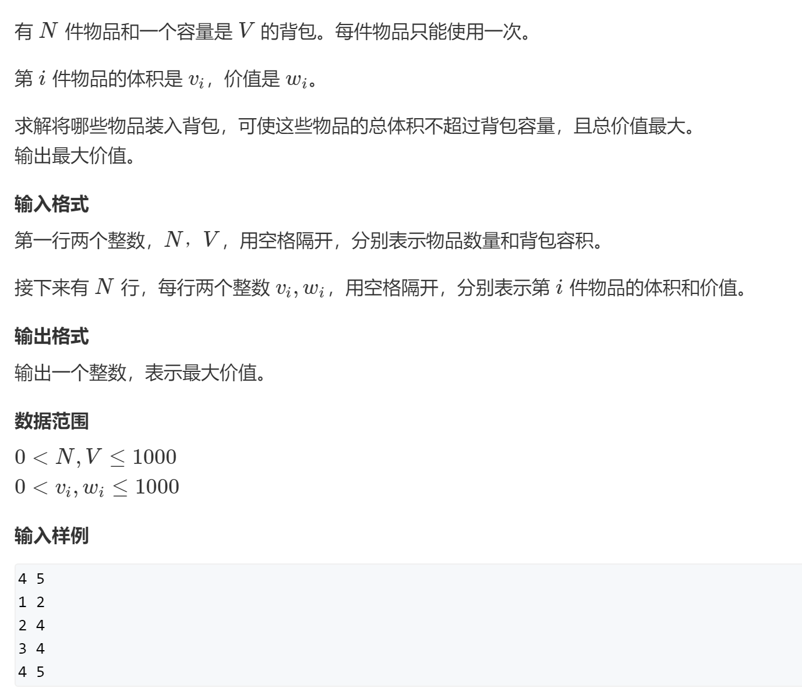

# 闫式dp分析法


从集合角度分析dp问题

有限集的最值或者个数


两个阶段：

- 化零为整：状态表示
  - 集合（f(i)表示的是哪个集合）
  - 属性（max /min /count）
  - **用一个属性来表示一类集合**
- 化整为零：状态计算
  - 将f(i)集合划分为若干个子集，不重复（数量不重复，最大最小值可以重复），**不遗漏**
  - 根据f(i)的属性来整理所有子集得到结果


----

**划分集合的依据：寻找最后一个不同点**


## 0 1背包问题


https://www.acwing.com/problem/content/2/




最多2^N种


从两个角度：

- 状态表示  f(i, j)
  - 集合：只考虑前i个物品，并且总体积不超过 j 的选法的集合
  - 属性：集合中每个方案的最大价值： f(N, V)中的最大值

- 状态计算

  最后一个不同点：

  f(i, j)划分为两个子集：

  1. 所有**不选**第i个物品的方案  `f(i-1, j)`
  2. 所有**选择**第i个物品的方案  `f(i-1, j-vi) + wi`
     - 变化部分：不包含i的部分，`f(i-1, j-vi)`
     - 不变部分：wi

  两个子集的最大值

  
  
  状态转移方程：

```
f(i,j) = max(f(i-1,j), f(i-1, j-vi) + wi)
```


---

**空间优化**

i层只会用到i-1层，滚动数组。

j要么用自己，要么用j-vi

***j从大到小循环:***

```
for(j = v; j >= vi; j--)
```

变为一维：

```
f(j) = min(f(j),f(j-vi) + wi)
```

因为此时的 *f(j-vi)* 还没有在第i层被更新过，所以用的是第 *i-1* 层的 *f(j-vi)*，即 *f(i-1, j-vi)*


```java
import java.util.Scanner;

public class Solution {
    public static void main(String[] args){
        int[][] f = new int[1010][1010];
        Scanner sc = new Scanner(System.in);
        int n = sc.nextInt(), m = sc.nextInt();
        int[] v = new int[1010], w = new int[1010];
        for(int i = 0; i < n; i++){
            v[i] = sc.nextInt();
            w[i] = sc.nextInt();
        }

        for(int i = 1; i <= n; i++){
            for(int j = 1; j <= m; j++){

                f[i][j] = f[i - 1][j]; //左半边的子集
                //右半边不一定存在！
                if(j >= v[i]){
                    f[i][j] = Math.max(f[i][j], f[i - 1][j - v[i]] + w[i]);
                }
            }

        }
        System.out.println(f[n][m]);
    }
}
```


