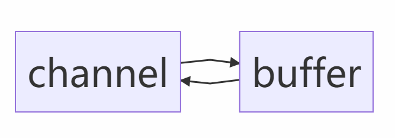
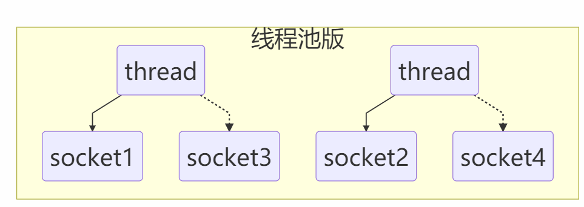
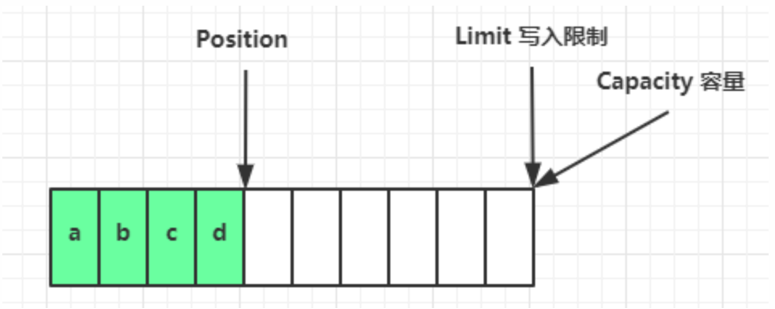
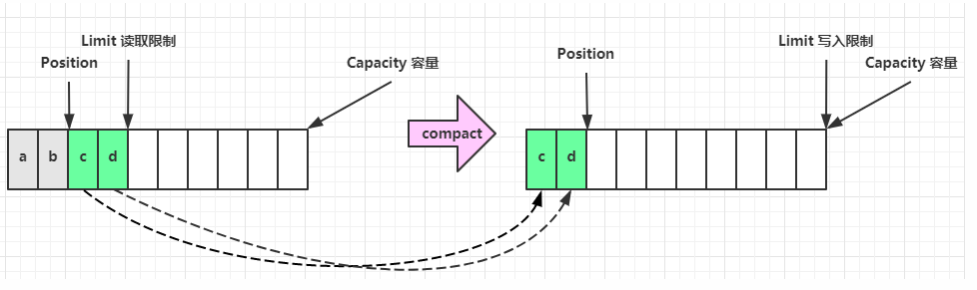
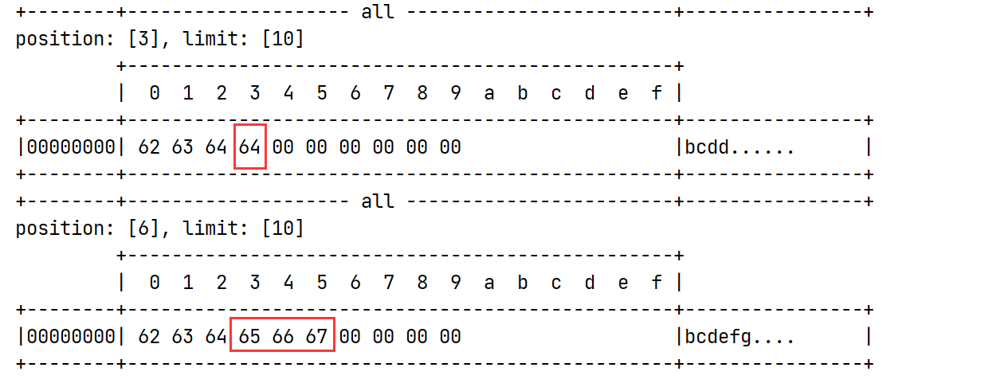
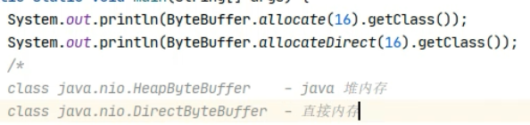
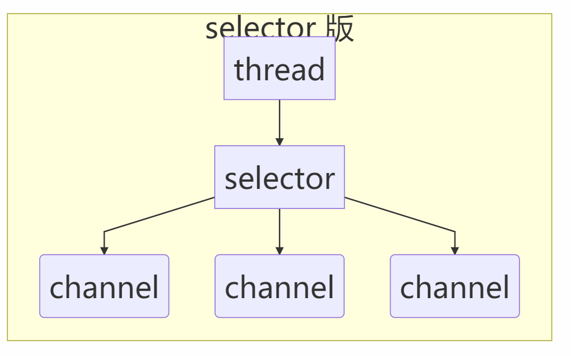
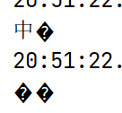
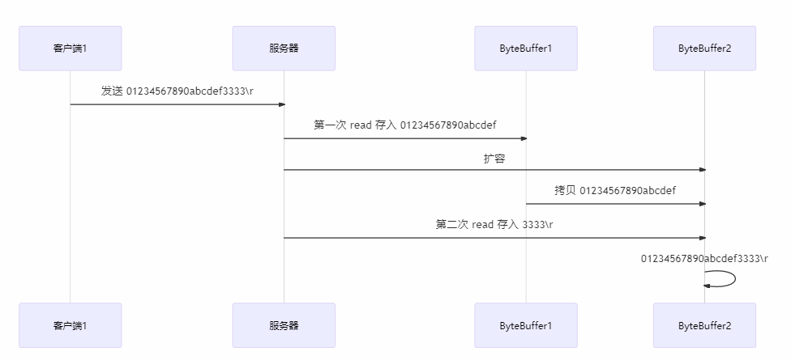

# NIO基础


**non-blocking io 非阻塞 IO**


## 三大组件


### Channel & Buffer


channel 有一点类似于 **stream**，它就是读写数据的***双向通道***，可以从 channel **将数据读入 buffer(内存缓冲区)**，也可以将 buffer 的数据写入 channel，而之前的 stream 要么是输入，要么是输出，**channel 比 stream 更为底层**



常见的 Channel 有

* FileChannel
* DatagramChannel
* SocketChannel
* ServerSocketChannel


buffer 则用来**缓冲读写数据**，常见的 buffer 有

* ByteBuffer
  * MappedByteBuffer
  * DirectByteBuffer
  * HeapByteBuffer
* ShortBuffer
* IntBuffer
* LongBuffer
* FloatBuffer
* DoubleBuffer
* CharBuffer


### Selector

（选择器）


selector 单从字面意思不好理解，需要结合**服务器的设计**演化来理解它的用途


----

**多线程版设计**


----

:warning:**多线程版缺点**

* 内存占用高——请求越多，开动的线程越多
* 线程**上下文切换**成本高——多于cpu线程数，就会发生切换
* 只适合连接数少的场景


----

**线程池版设计**




---

**线程池版缺点**

* **阻塞模式下**，线程仅能**处理一个 socket 连接**

* 仅适合**短连接**场景

  > 如果一个socket连接的时间太长，并且什么也不做，该线程就被闲置了，该线程会被持续占用，整个系统可能会卡死


---

**Selector版设计**

selector 的作用就是***配合一个线程来管理多个 channel***，获取这些 **channel 上发生的事件**，这些 **channel 工作在非阻塞**模式下，***<u>不会让线程吊死在一个 channel 上</u>***。

利用率得到了提高

适合**连接数特别多，但流量低**的场景（low traffic）


调用 selector 的 select() 会**阻塞直到 (多个)channel中是否 发生了读写就绪事件**，这些事件发生，select 方法就会返回这些事件交给 thread 来处理


## ByteBuffer


```xml
 <dependencies>
        <dependency>
            <groupId>io.netty</groupId>
            <artifactId>netty-all</artifactId>
            <version>4.1.39.Final</version>
        </dependency>
        <dependency>
            <groupId>org.projectlombok</groupId>
            <artifactId>lombok</artifactId>
            <version>1.16.18</version>
        </dependency>
        <dependency>
            <groupId>com.google.code.gson</groupId>
            <artifactId>gson</artifactId>
            <version>2.8.5</version>
        </dependency>
        <dependency>
            <groupId>com.google.guava</groupId>
            <artifactId>guava</artifactId>
            <version>19.0</version>
        </dependency>
        <dependency>
            <groupId>ch.qos.logback</groupId>
            <artifactId>logback-classic</artifactId>
            <version>1.2.3</version>
        </dependency>
        <dependency>
            <groupId>com.google.protobuf</groupId>
            <artifactId>protobuf-java</artifactId>
            <version>3.11.3</version>
        </dependency>
    </dependencies>
```


```java
public static void main(String[] args) {
    // FileChannel
    //1. 输入输出流 2.RandomAccessFile
    try (FileChannel channel = new FileInputStream("data.txt").getChannel()) {
        //准备缓冲区
        ByteBuffer buffer = ByteBuffer.allocate(10); //一次read只能读前10个字节，需要分多次读取
        while(true){
            //从channel 读取数据，向缓冲区buffer写入
            int read = channel.read(buffer);
            log.info("读取到的字节：{}",read);
            if(read == -1){
                break; //没有内容，退出
            }
            //打印buffer内容
            buffer.flip(); //切换至 读模式，才能够读取其中数据
            while(buffer.hasRemaining()){ //是否还有剩余未读数据
                byte b = buffer.get();
                System.out.println((char) b);
            }
            //buffer切换为写模式，需要写入数据
            buffer.clear();
        }

    } catch (IOException e){

    }
}
```


### ByteBuffer 正确使用姿势


1. 向 buffer 写入数据，例如调用 channel.read(buffer)
2. 调用 flip() 切换至**读模式**
3. 从 buffer 读取数据，例如调用 `buffer.get()`
4. 调用 clear() 或 compact() 切换至**写模式**
5. 重复 1~4 步骤


### ByteBuffer 结构


ByteBuffer 有以下重要属性

* capacity  容量
* position  读写指针
* limit  读写限制

一开始


**写模式下**，position 是**写入位置**，**limit 等于容量**，下图表示写入了 4 个字节后的状态



**flip** 动作发生后，position 切换为**读取位置**，**limit 切换为读取限制**


读取 4 个字节后，状态： 读指针移动到读取限制limit


**clear** 动作发生后，状态：清空buffer，从头开始，执行写入操作


**compact 方法**，是把未读完的部分**向前压缩**，**然后切换至写模式**




```java
package com.hcr.netty;

import io.netty.util.internal.StringUtil;

import java.nio.ByteBuffer;

import static io.netty.util.internal.MathUtil.isOutOfBounds;
import static io.netty.util.internal.StringUtil.NEWLINE;

public class ByteBufferUtil {
    private static final char[] BYTE2CHAR = new char[256];
    private static final char[] HEXDUMP_TABLE = new char[256 * 4];
    private static final String[] HEXPADDING = new String[16];
    private static final String[] HEXDUMP_ROWPREFIXES = new String[65536 >>> 4];
    private static final String[] BYTE2HEX = new String[256];
    private static final String[] BYTEPADDING = new String[16];

    static {
        final char[] DIGITS = "0123456789abcdef".toCharArray();
        for (int i = 0; i < 256; i++) {
            HEXDUMP_TABLE[i << 1] = DIGITS[i >>> 4 & 0x0F];
            HEXDUMP_TABLE[(i << 1) + 1] = DIGITS[i & 0x0F];
        }

        int i;

        // Generate the lookup table for hex dump paddings
        for (i = 0; i < HEXPADDING.length; i++) {
            int padding = HEXPADDING.length - i;
            StringBuilder buf = new StringBuilder(padding * 3);
            for (int j = 0; j < padding; j++) {
                buf.append("   ");
            }
            HEXPADDING[i] = buf.toString();
        }

        // Generate the lookup table for the start-offset header in each row (up to 64KiB).
        for (i = 0; i < HEXDUMP_ROWPREFIXES.length; i++) {
            StringBuilder buf = new StringBuilder(12);
            buf.append(NEWLINE);
            buf.append(Long.toHexString(i << 4 & 0xFFFFFFFFL | 0x100000000L));
            buf.setCharAt(buf.length() - 9, '|');
            buf.append('|');
            HEXDUMP_ROWPREFIXES[i] = buf.toString();
        }

        // Generate the lookup table for byte-to-hex-dump conversion
        for (i = 0; i < BYTE2HEX.length; i++) {
            BYTE2HEX[i] = ' ' + StringUtil.byteToHexStringPadded(i);
        }

        // Generate the lookup table for byte dump paddings
        for (i = 0; i < BYTEPADDING.length; i++) {
            int padding = BYTEPADDING.length - i;
            StringBuilder buf = new StringBuilder(padding);
            for (int j = 0; j < padding; j++) {
                buf.append(' ');
            }
            BYTEPADDING[i] = buf.toString();
        }

        // Generate the lookup table for byte-to-char conversion
        for (i = 0; i < BYTE2CHAR.length; i++) {
            if (i <= 0x1f || i >= 0x7f) {
                BYTE2CHAR[i] = '.';
            } else {
                BYTE2CHAR[i] = (char) i;
            }
        }
    }

    /**
     * 打印所有内容
     * @param buffer
     */
    public static void debugAll(ByteBuffer buffer) {
        int oldlimit = buffer.limit();
        buffer.limit(buffer.capacity());
        StringBuilder origin = new StringBuilder(256);
        appendPrettyHexDump(origin, buffer, 0, buffer.capacity());
        System.out.println("+--------+-------------------- all ------------------------+----------------+");
        System.out.printf("position: [%d], limit: [%d]\n", buffer.position(), oldlimit);
        System.out.println(origin);
        buffer.limit(oldlimit);
    }

    /**
     * 打印可读取内容
     * @param buffer
     */
    public static void debugRead(ByteBuffer buffer) {
        StringBuilder builder = new StringBuilder(256);
        appendPrettyHexDump(builder, buffer, buffer.position(), buffer.limit() - buffer.position());
        System.out.println("+--------+-------------------- read -----------------------+----------------+");
        System.out.printf("position: [%d], limit: [%d]\n", buffer.position(), buffer.limit());
        System.out.println(builder);
    }

    private static void appendPrettyHexDump(StringBuilder dump, ByteBuffer buf, int offset, int length) {
        if (isOutOfBounds(offset, length, buf.capacity())) {
            throw new IndexOutOfBoundsException(
                    "expected: " + "0 <= offset(" + offset + ") <= offset + length(" + length
                            + ") <= " + "buf.capacity(" + buf.capacity() + ')');
        }
        if (length == 0) {
            return;
        }
        dump.append(
                "         +-------------------------------------------------+" +
                        NEWLINE + "         |  0  1  2  3  4  5  6  7  8  9  a  b  c  d  e  f |" +
                        NEWLINE + "+--------+-------------------------------------------------+----------------+");

        final int startIndex = offset;
        final int fullRows = length >>> 4;
        final int remainder = length & 0xF;

        // Dump the rows which have 16 bytes.
        for (int row = 0; row < fullRows; row++) {
            int rowStartIndex = (row << 4) + startIndex;

            // Per-row prefix.
            appendHexDumpRowPrefix(dump, row, rowStartIndex);

            // Hex dump
            int rowEndIndex = rowStartIndex + 16;
            for (int j = rowStartIndex; j < rowEndIndex; j++) {
                dump.append(BYTE2HEX[getUnsignedByte(buf, j)]);
            }
            dump.append(" |");

            // ASCII dump
            for (int j = rowStartIndex; j < rowEndIndex; j++) {
                dump.append(BYTE2CHAR[getUnsignedByte(buf, j)]);
            }
            dump.append('|');
        }

        // Dump the last row which has less than 16 bytes.
        if (remainder != 0) {
            int rowStartIndex = (fullRows << 4) + startIndex;
            appendHexDumpRowPrefix(dump, fullRows, rowStartIndex);

            // Hex dump
            int rowEndIndex = rowStartIndex + remainder;
            for (int j = rowStartIndex; j < rowEndIndex; j++) {
                dump.append(BYTE2HEX[getUnsignedByte(buf, j)]);
            }
            dump.append(HEXPADDING[remainder]);
            dump.append(" |");

            // Ascii dump
            for (int j = rowStartIndex; j < rowEndIndex; j++) {
                dump.append(BYTE2CHAR[getUnsignedByte(buf, j)]);
            }
            dump.append(BYTEPADDING[remainder]);
            dump.append('|');
        }

        dump.append(NEWLINE +
                "+--------+-------------------------------------------------+----------------+");
    }

    private static void appendHexDumpRowPrefix(StringBuilder dump, int row, int rowStartIndex) {
        if (row < HEXDUMP_ROWPREFIXES.length) {
            dump.append(HEXDUMP_ROWPREFIXES[row]);
        } else {
            dump.append(NEWLINE);
            dump.append(Long.toHexString(rowStartIndex & 0xFFFFFFFFL | 0x100000000L));
            dump.setCharAt(dump.length() - 9, '|');
            dump.append('|');
        }
    }

    public static short getUnsignedByte(ByteBuffer buffer, int index) {
        return (short) (buffer.get(index) & 0xFF);
    }
}
```


```java
public static void main(String[] args) {
        ByteBuffer buffer = ByteBuffer.allocate(10);

        buffer.put((byte) 0x61);
        debugAll(buffer);
        buffer.put(new byte[]{0x62, 0x63, 0x64});
        debugAll(buffer);
//        System.out.println(buffer.get());  0
        buffer.flip();
        System.out.println(buffer.get());
        debugAll(buffer);
        buffer.compact(); //只是往前移动了，但原先位置上的并没有清零，position会覆盖原先的
        debugAll(buffer);
        buffer.put(new byte[]{0x65, 0x66, 0x67});
        debugAll(buffer);
    }
```




### ByteBuffer 常见方法


- **分配空间**

可以使用 allocate 方法为 ByteBuffer 分配空间，其它 buffer 类也有该方法

```java
Bytebuffer buf = ByteBuffer.allocate(16);
```




堆内存：就是jvm堆中的内存，会受到GC的影响（内存移动，复制），读写效率较低，

直接内存：系统内存，不会被GC，读写效率高（少一次拷贝），分配内存比较低，使用不当会造成内存泄漏


- 向buffer写入数据

有两种办法

* 调用 channel 的 read 方法
* 调用 buffer 自己的 put 方法

```java
int readBytes = channel.read(buf);
```

和

```java
buf.put((byte)127);
```


- 从buffer读取数据

同样有两种办法

* 调用 channel 的 write 方法
* 调用 buffer 自己的 get 方法

```java
int writeBytes = channel.write(buf);
```

和

```java
byte b = buf.get();
```

get 方法会让 position **读指针向后走**，如果想**重复读取数据**

* 可以调用 **rewind** 方法将 position 重新置为 0
* 或者调用 **get(int i)** 方法获取**索引 i 的内容**，它不会移动读指针


- mark & reset

mark 是在读取时，做一个标记，即使 position 改变，只要调用 reset 就能回到 mark 的位置

> **注意**
>
> rewind 和 flip 都会清除 mark 位置


```java
public static void main(String[] args) {
    ByteBuffer buffer = ByteBuffer.allocate(10);
    buffer.put(new byte[]{'a','b','c','d'});
    buffer.flip();

    ByteBuffer buffer1 = buffer.get(new byte[4]);
    debugAll(buffer);//position: [4]
    buffer.rewind();
    buffer.get();
    debugAll(buffer);//position: [1]

    //mark 做一个标记，记录position位置  & reset 重置到mark的位置
    buffer.get();//2
    buffer.mark();//在索引2的位置设置mark
    buffer.get();//3
    buffer.reset();//position: [2] 重置为2
    debugAll(buffer);
    buffer.get(3);
    debugAll(buffer);//pos不会改变
}
```


- 字符串与 ByteBuffer **互转**


```java
public static void main(String[] args) {
    ByteBuffer buffer = ByteBuffer.allocate(16);

    //字符串转为bytebuffer
    buffer.put("hello".getBytes(StandardCharsets.UTF_8));
    debugAll(buffer);

    //charset
    ByteBuffer hello = StandardCharsets.UTF_8.encode("hello");
    debugAll(hello); //区别：变成读模式

    //wrap
    ByteBuffer wrap = ByteBuffer.wrap("hello".getBytes());
    debugAll(wrap);//同charset


    //写模式的不能直接转换，需要切换成读模式
    buffer.flip();
    String s = StandardCharsets.UTF_8.decode(buffer).toString();
    System.out.println(s);

}
```


- ⚠️ Buffer 的线程安全

  > Buffer 是***非线程安全的***


### Scattering Reads分散读


分散读取，有一个文本文件 3parts.txt

```
onetwothree
```

使用如下方式读取，可以将数据填充至多个 buffer

```java
try (RandomAccessFile file = new RandomAccessFile("3parts.txt", "rw")) {
    FileChannel channel = file.getChannel();
    ByteBuffer a = ByteBuffer.allocate(3);
    ByteBuffer b = ByteBuffer.allocate(3);
    ByteBuffer c = ByteBuffer.allocate(5);
    channel.read(new ByteBuffer[]{a, b, c});
    a.flip();
    b.flip();
    c.flip();
    debugAll(a);
    debugAll(b);
    debugAll(c);
} catch (IOException e) {
    e.printStackTrace();
}
```


### Gathering Writes集中写入

使用如下方式写入，可以将多个 buffer 的数据填充至 channel


```java
try (RandomAccessFile file = new RandomAccessFile("3parts.txt", "rw")) {
    FileChannel channel = file.getChannel();
    ByteBuffer d = ByteBuffer.allocate(4);
    ByteBuffer e = ByteBuffer.allocate(4);
    channel.position(11);//从channel的第11个位置开始写

    d.put(new byte[]{'f', 'o', 'u', 'r'});
    e.put(new byte[]{'f', 'i', 'v', 'e'});
    //要读取buffer中的内容，需要切换为读模式
    d.flip();
    e.flip();
    debugAll(d);
    debugAll(e);
    channel.write(new ByteBuffer[]{d, e});
} catch (IOException e) {
    e.printStackTrace();
}
```


分散读和集中写入就是利用channel的read和write方法，来传入一个ByteBuffer数组，向数组的每个ByteBuffer写入或从中读取


### 练习


网络上有多条数据发送给服务端，数据之间使用 \n 进行分隔
但由于某种原因这些数据在接收时，被进行了重新组合，例如原始数据有3条为

* Hello,world\n
* I'm zhangsan\n
* How are you?\n

变成了下面的两个 byteBuffer (黏包，半包)

* Hello,world\nI'm zhangsan\nHo
* w are you?\n

现在要求你编写程序，**将错乱的数据恢复成原始的按 \n 分隔的数据**


网络编程中很常见：**黏包、半包**

黏包：效率，一起发送效率更高

半包：服务器缓冲区大小限制，放不下了


```java
public static void main(String[] args) {
    ByteBuffer source = ByteBuffer.allocate(32);
    //                     11            24
    source.put("Hello,world\nI'm zhangsan\nHo".getBytes());
    split(source);

    source.put("w are you?\nhaha!\n".getBytes());
    split(source);
}

private static void split(ByteBuffer source) {
    source.flip();
    for (int i = 0; i < source.limit(); i++) {
        //找到一条完整消息
        if (source.get(i) == '\n') {
            //存入新的ByteBuffer
            //消息长度  position在该条消息的开头处
            int length = i - source.position() + 1;
            ByteBuffer target = ByteBuffer.allocate(length);
            //从source读，向target写
            for (int j = 0; j < length; j++){
                byte b = source.get();
                target.put(b);
            }
            debugAll(target);
        }
    }
    source.compact(); //留下下次处理  Ho移动到buffer头部，继续在其后面写入其他字节

}
```


## 文件编程


### FileChannel


**⚠️ FileChannel 工作模式**

> FileChannel 只能工作在阻塞模式下


- **获取**

不能直接打开 `FileChannel`，必须通过 FileInputStream、FileOutputStream 或者 `RandomAccessFile` 来获取 `FileChannel`，它们都有 **`getChannel` 方法**

* 通过 FileInputStream 获取的 channel **只能读**
* 通过 FileOutputStream 获取的 channel **只能写**
* 通过 **RandomAccessFile 是否能读写根据构造 RandomAccessFile 时的读写模式决定**

```java
new RandomAccessFile("3parts.txt", "rw")
```


- **读取**

会***从 channel 读取数据填充 ByteBuffer***，返回值表示**读到了多少字节**，**-1 表示到达了文件的末尾**

```java
int readBytes = channel.read(buffer);
```


- **写入**

写入的正确姿势如下， 使用更多的是SocketChannel，不可能一次将很大的buffer都写入channel，channel写入的能力是有上限的，如果一次没能写完所有buffer中的数据，需要多次读取，**检查buffer中是否有剩余数据**

```java
ByteBuffer buffer = ...;
buffer.put(...); // 存入数据
buffer.flip();   // 切换读模式

while(buffer.hasRemaining()) {
    channel.write(buffer);
}
```

在 while 中调用 channel.write 是**因为 write 方法并不能保证一次将 buffer 中的内容全部写入 channel**


- **关闭**

channel 必须关闭，不过调用了 FileInputStream、FileOutputStream 或者 RandomAccessFile 的 close 方法会**间接地调用 channel 的 close 方法**

使用tryWithResource语法，会自动释放资源


- **位置**

获取当前位置

```java
long pos = channel.position();
```

设置当前位置

```java
long newPos = ...;
channel.position(newPos);
```

设置当前位置时，如果设置为文件的末尾

* 这时**读取会返回 -1** 
* 这时**写入，会追加内容**，但要注意如果 position 超过了文件末尾，再写入时在新内容和原末尾之间会有**空洞**（00）


- **大小**

使用 size 方法获取文件的大小


- **强制写入**

操作系统出于性能的考虑，会将数据缓存（写入操作系统的缓存中），不是立刻写入磁盘。可以调用 `force(true)`  方法将文件内容和元数据（文件的权限等信息）**立刻写入磁盘**


### 两个 Channel 传输数据


```java
try (FileChannel from = new FileInputStream("data.txt").getChannel();
     FileChannel to = new FileOutputStream("to.txt").getChannel()
) {
    from.transferTo(0, from.size(), to);

} catch (Exception e){
    e.printStackTrace();
}
```

文件复制，效率也很高，比使用stream效率要高

`transferTo`：**底层会利用操作系统的零拷贝进行优化**

一次最多传2g的数据，分多次传输

```java
public class TestFileChannelTransferTo {
    public static void main(String[] args) {
        try (
                FileChannel from = new FileInputStream("data.txt").getChannel();
                FileChannel to = new FileOutputStream("to.txt").getChannel();
        ) {
            // 效率高，底层会利用操作系统的零拷贝进行优化
            long size = from.size();
            // left 变量代表还剩余多少字节
            for (long left = size; left > 0; ) {
                System.out.println("position:" + (size - left) + " left:" + left);
                left -= from.transferTo((size - left), left, to);
            }
        } catch (IOException e) {
            e.printStackTrace();
        }
    }
}
```


### Path


jdk7 引入了 **Path 和 Paths 类**

* Path 用来表示**文件路径**
* Paths 是**工具类，用来获取 Path 实例**

```java
Path source = Paths.get("1.txt"); // 相对路径 使用 user.dir 环境变量来定位 1.txt

Path source = Paths.get("d:\\1.txt"); // 绝对路径 代表了  d:\1.txt

Path source = Paths.get("d:/1.txt"); // 绝对路径 同样代表了  d:\1.txt

Path projects = Paths.get("d:\\data", "projects"); // 代表了  d:\data\projects
```

* `.` 代表了当前路径
* `..` 代表了上一级路径

例如目录结构如下

```
d:
	|- data
		|- projects
			|- a
			|- b 
```

代码

```java
Path path = Paths.get("d:\\data\\projects\\a\\..\\b");
System.out.println(path);
System.out.println(path.normalize()); // 路径正常化
```

会输出

```
d:\data\projects\a\..\b
d:\data\projects\b
```


### Files

---

检查文件是否存在

```java
Path path = Paths.get("helloword/data.txt");
System.out.println(Files.exists(path));
```

---

**创建一级目录**

```java
Path path = Paths.get("helloword/d1");
Files.createDirectory(path);
```

* 如果目录已存在，会抛异常 FileAlreadyExistsException
* **不能一次创建多级目录**，否则会抛异常 NoSuchFileException

---

**创建多级目录**用

```java
Path path = Paths.get("helloword/d1/d2");
Files.createDirectories(path);
```

---

拷贝文件

```java
Path source = Paths.get("helloword/data.txt");
Path target = Paths.get("helloword/target.txt");

Files.copy(source, target);
```

* 如果文件已存在，会抛异常 FileAlreadyExistsException

如果希望用 source **覆盖**掉 target，需要用 StandardCopyOption 来控制

```java
Files.copy(source, target, StandardCopyOption.REPLACE_EXISTING);
```

---

移动文件

```java
Path source = Paths.get("helloword/data.txt");
Path target = Paths.get("helloword/data.txt");

Files.move(source, target, StandardCopyOption.ATOMIC_MOVE);
```

* StandardCopyOption.ATOMIC_MOVE 保证文件移动的原子性

---

删除文件

```java
Path target = Paths.get("helloword/target.txt");

Files.delete(target);
```

* 如果文件不存在，会抛异常 NoSuchFileException

---

删除目录

```java
Path target = Paths.get("helloword/d1");

Files.delete(target);
```

* 如果**目录还有内容**，会抛异常 DirectoryNotEmptyException，只能删空目录


---


遍历目录文件：

```java
public static void main(String[] args) throws IOException {
    AtomicInteger dircount = new AtomicInteger();
    AtomicInteger filecount = new AtomicInteger();

    //遍历目录
    Files.walkFileTree(Paths.get("E:/desktop"), new SimpleFileVisitor<Path>(){
        @Override
        public FileVisitResult preVisitDirectory(Path dir, BasicFileAttributes attrs) throws IOException {
            System.out.println("====>" + dir);
            //匿名类引用外部局部变量，相当于是final的，无法改变值
            dircount.incrementAndGet();
            return super.preVisitDirectory(dir, attrs);
        }

        @Override
        public FileVisitResult visitFile(Path file, BasicFileAttributes attrs) throws IOException {
            filecount.incrementAndGet();
            System.out.println("====>" + file);
            return super.visitFile(file, attrs);
        }
    });
    System.out.println("dircount = " + dircount);
    System.out.println("filecount = " + filecount);
}
```


---

统计 jar 的数目

```java
public static void main(String[] args) throws IOException {
    AtomicInteger jarCount = new AtomicInteger();
    AtomicInteger filecount = new AtomicInteger();

    //遍历jar包
    Files.walkFileTree(Paths.get("D:/mavenRepository"), new SimpleFileVisitor<Path>(){
        @Override
        public FileVisitResult visitFile(Path file, BasicFileAttributes attrs) throws IOException {
            if (file.toString().endsWith(".jar")) {
                System.out.println("file = " + file);
                jarCount.incrementAndGet();
            }
            return super.visitFile(file, attrs);
        }
    });
    System.out.println("jarCount = " + jarCount);
}
```


----

删除多级目录

先删除目录中的文件，后删除文件夹，再删除父文件夹

```java
Path path = Paths.get("d:\\a");
Files.walkFileTree(path, new SimpleFileVisitor<Path>(){
    @Override
    public FileVisitResult visitFile(Path file, BasicFileAttributes attrs) 
        throws IOException {
        Files.delete(file);
        return super.visitFile(file, attrs);
    }

    @Override
    public FileVisitResult postVisitDirectory(Path dir, IOException exc) 
        throws IOException {
        Files.delete(dir);
        return super.postVisitDirectory(dir, exc);
    }
});
```


⚠️ 删除很危险

> 删除是危险操作，**确保要递归删除的文件夹没有重要内容**


---

拷贝多级目录

```java
long start = System.currentTimeMillis();
String source = "D:\\Snipaste-1.16.2-x64";
String target = "D:\\Snipaste-1.16.2-x64aaa";

Files.walk(Paths.get(source)).forEach(path -> {
    try {
        String targetName = path.toString().replace(source, target);
        // 是目录->创建目录
        if (Files.isDirectory(path)) {
            Files.createDirectory(Paths.get(targetName));
        }
        
        // 是普通文件->拷贝文件
        else if (Files.isRegularFile(path)) {
            Files.copy(path, Paths.get(targetName));
        }
    } catch (IOException e) {
        e.printStackTrace();
    }
});
long end = System.currentTimeMillis();
System.out.println(end - start);
```


## 网络编程


### 非阻塞 vs 阻塞


#### 阻塞

* 阻塞模式下，相关方法都会导致线程暂停
  * ServerSocketChannel.accept 会在**没有连接建立时让线程暂停**
  * SocketChannel.read 会在**没有数据可读时让线程暂停**
  * ***阻塞的表现其实就是线程暂停了，暂停期间不会占用 cpu，但线程相当于闲置***


* 单线程下，阻塞方法之间相互影响，几乎不能正常工作，需要多线程支持


* 但多线程下，有新的问题，体现在以下方面
  * 32 位 jvm 一个线程 320k，64 位 jvm 一个线程 1024k，如果连接数过多，必然导致 OOM，并且线程太多，反而会因为频繁上下文切换导致性能降低
  * 可以采用**线程池**技术来减少线程数和线程上下文切换，但治标不治本，如果有很多连接建立，但长时间 inactive，**会阻塞线程池中所有线程**，因此**不适合长连接，只适合短连接**


```java
public static void main(String[] args) throws IOException {
        //使用nio来理解阻塞模式，单线程

        final ByteBuffer buffer = ByteBuffer.allocate(16);

        //创建了服务器
        ServerSocketChannel ssc = ServerSocketChannel.open();

        //绑定监听端口
        ssc.bind(new InetSocketAddress(8080));

        List<SocketChannel> channels = new ArrayList<>();
        while (true){
            //accept 建立连接 SocketChannel用来与客户端之间通信
            log.info("connecting......");
            SocketChannel accept = ssc.accept(); //阻塞方法，让线程暂停，连接建立后，线程恢复
            log.info("connected......" + accept);

            channels.add(accept);

            //接收客户端发送的数据
            for (SocketChannel channel : channels) {
                log.info("before reading......" + channel);

                channel.read(buffer);//read方法再次阻塞，线程停止运行，客户端没有发送数据
                buffer.flip();
                debugRead(buffer);
                buffer.clear();
                log.info("after reading......" + channel);
            }

        }

    }
```

```java
public static void main(String[] args) throws IOException {
        SocketChannel client = SocketChannel.open();

        client.connect(new InetSocketAddress("localhost", 8080));

//      //client.write(Charset.defaultCharset().encode("hello server"));
        System.out.println("waiting.......");
    }
```


一个线程处理多个连接——很困难


#### 非阻塞

* 非阻塞模式下，相关方法都会不会让线程暂停
  * 在 ServerSocketChannel.accept 在没有连接建立时，会返回 null，继续运行
  * SocketChannel.read 在没有数据可读时，会返回 0，但线程不必阻塞，可以去执行其它 SocketChannel 的 read 或是去执行 ServerSocketChannel.accept 
  * 写数据时，线程只是等待数据写入 Channel 即可，无需等 Channel 通过网络把数据发送出去
* 但非阻塞模式下，即使没有连接建立，和可读数据，线程仍然在不断运行，白白浪费了 cpu
* 数据复制过程中，线程实际还是阻塞的（AIO 改进的地方）


```java
public static void main(String[] args) throws IOException {
        //使用nio来理解阻塞模式，单线程

        final ByteBuffer buffer = ByteBuffer.allocate(16);

        //创建了服务器
        ServerSocketChannel ssc = ServerSocketChannel.open();

        ssc.configureBlocking(false);//改为非阻塞模式，accept方法变为非阻塞

        //绑定监听端口
        ssc.bind(new InetSocketAddress(8080));

        List<SocketChannel> channels = new ArrayList<>();
        while (true){
            //accept 建立连接 SocketChannel用来与客户端之间通信
//            log.info("connecting......");
            //非阻塞，线程还会继续运行？如果没有连接建立，返回null
            SocketChannel accept = ssc.accept();
            if(accept != null){
                log.info("connected......" + accept);
                accept.configureBlocking(false);//将SocketChannel设置为非阻塞，read方法非阻塞
                channels.add(accept);
            }


            //接收客户端发送的数据
            for (SocketChannel channel : channels) {
//                log.info("before reading......" + channel);

                int read = channel.read(buffer);//read非阻塞，不会使线程暂停，如果没有读到数据，read返回0
                if(read > 0){
                    buffer.flip();
                    debugRead(buffer);
                    buffer.clear();
                    log.info("after reading......" + channel);
                }

            }

        }

    }
```

```java
public static void main(String[] args) throws IOException {
        SocketChannel client = SocketChannel.open();

        client.connect(new InetSocketAddress("localhost", 8080));

//      //client.write(Charset.defaultCharset().encode("hello server"));
        System.out.println("waiting.......");
    }
```


不管多少个客户端连接，单线程依然能处理多个socket连接


**这个线程一直在跑，属实太累了**，一直在跑，造成cpu资源浪费


改进↓


#### 多路复用

单线程可以配合 **Selector** 完成对**多个 Channel 可读写事件的监控**，这称之为**多路复用**

* 多路复用仅针对网络 IO、普通文件 IO 没法利用多路复用
* 如果不用 Selector 的非阻塞模式，线程大部分时间都在做无用功，而 Selector 能够保证
  * **有可连接事件时才去连接**
  * **有可读事件才去读取**
  * **有可写事件才去写入**
    * 限于网络传输能力，Channel 未必时时可写，一旦 Channel 可写，会触发 Selector 的可写事件


### Selector



好处

* **一个线程配合 selector** 就可以**监控多个 channel 的事件**，事件发生线程才去处理。**避免非阻塞模式下一直循环 ，做无用功**
* 让这个线程能够被充分利用
* 节约了线程的数量
* 减少了线程上下文切换


#### 创建

```java
Selector selector = Selector.open();
```


#### 绑定 Channel 事件

也称之为注册事件，绑定的事件 selector 才会关心 

```java
channel.configureBlocking(false);
SelectionKey key = channel.register(selector, 绑定事件);
```

* channel 必须工作在**非阻塞模式**
* FileChannel 没有非阻塞模式，因此不能配合 selector 一起使用
* 绑定的事件类型可以有
  * connect - 客户端**连接成功时触发**
  * accept - **服务器端成功接受连接时触发**
  * read - **数据可读入时触发**，有因为接收能力弱，数据暂不能读入的情况
  * write - **数据可写出时触发**，有因为发送能力弱，数据暂不能写出的情况


#### 监听 Channel 事件

可以通过下面三种方法来监听是否有事件发生，方法的返回值代表有多少 channel 发生了事件

- 方法1，**阻塞直到绑定事件发生**

```java
int count = selector.select();
```

- 方法2，阻塞直到绑定事件发生，或是**超时**（时间单位为 ms）

```java
int count = selector.select(long timeout);
```

- 方法3，不会阻塞，也就是不管有没有事件，立刻返回，**自己根据返回值检查是否有事件**

```java
int count = selector.selectNow();
```


#### 💡 select 何时不阻塞

> * 事件发生时
>   * 客户端<u>发起连接请求，会触发 accept 事件</u>
>   * 客户端发送数据过来，客户端正常、异常关闭时，都会触发 <u>read 事件</u>，另外如果<u>发送的数据大于 buffer 缓冲区，会触发多次读取事件</u>
>   * channel 可写，会触发 write 事件
>   * 在 linux 下 nio bug 发生时
> * 调用 selector.wakeup()
> * 调用 selector.close()
> * selector 所在线程 interrupt


### 处理 accept 事件


```java
public static void main(String[] args) throws IOException {

    //创建selector，管理多个channel
    Selector selector = Selector.open();

    ByteBuffer buffer = ByteBuffer.allocate(16);

    ServerSocketChannel ssc = ServerSocketChannel.open();

    ssc.configureBlocking(false);

    //建立selector和channel的联系，注册
    //SelectionKey 事件发生时，通过它可以得到事件，和是哪个channel的事件
    SelectionKey sscKey = ssc.register(selector, 0, null);
    // sscKey 只关注 accept事件
    sscKey.interestOps(SelectionKey.OP_ACCEPT);
    log.info("register key:" + sscKey);

    ssc.bind(new InetSocketAddress(8080));

    while (true){
       //select方法,select是阻塞的，没有事件发生就阻塞，
        selector.select();

        //处理事件：selectionKeys内部包含了所有发生的事件
        Set<SelectionKey> selectionKeys = selector.selectedKeys();
        Iterator<SelectionKey> iterator = selectionKeys.iterator();
        while(iterator.hasNext()){
            SelectionKey key = iterator.next(); // 这里就是上面关注的accept事件的sscKey
            log.info("key:" + key);
            ServerSocketChannel channel = (ServerSocketChannel) key.channel();
            SocketChannel sc = channel.accept();// 这里是新建的客户端连接channel，每个都不同
            log.info("sc:" + sc);
        }

    }

}
```


这个key就是**专门关注accept事件的**，其他的客户端连接请求来了，还是这个key，只不过建立的channel是新的


#### 💡 事件发生后能否不处理

> 事件发生后，要么处理，要么取消（cancel），不能什么都不做，否则下次该事件仍会触发，这是因为 nio 底层使用的是水平触发


### 处理 read 事件


```java
public static void main(String[] args) throws IOException {

        //创建selector，管理多个channel
        Selector selector = Selector.open();

        ByteBuffer buffer = ByteBuffer.allocate(16);

        ServerSocketChannel ssc = ServerSocketChannel.open();

        ssc.configureBlocking(false);

        //建立selector和channel的联系，注册
        //SelectionKey 事件发生时，通过它可以得到事件，和是哪个channel的事件
        SelectionKey sscKey = ssc.register(selector, 0, null);
        // sscKey 只关注 accept事件
        sscKey.interestOps(SelectionKey.OP_ACCEPT);
        log.info("register key:" + sscKey);

        ssc.bind(new InetSocketAddress(8080));

        while (true){
            //select方法——是阻塞的，没有事件发生就阻塞，
            //如果拿到的事件没有处理，将上次的事件加入处理集合，
            //有未处理事件时不会阻塞，事件发生后，要么处理，要么取消，不能置之不理
            selector.select();

            //处理事件：selectedKeys内部包含了所有 发生了事件 的SelectionKey对象
            //==========selector会在发生事件后，向集合中添加key对象，但不会删除============
            Set<SelectionKey> selectionKeys = selector.selectedKeys();
            Iterator<SelectionKey> iterator = selectionKeys.iterator();
            while(iterator.hasNext()){
                SelectionKey key = iterator.next(); // 这里就是上面关注的accept事件的sscKey
                //处理key的时候，要从selectionKeys集合中删除，否则下次再处理时，key上没有事件，就会报错
                iterator.remove();
                log.info("key:" + key);

                //事件集合中可能有read事件，也可能有accept事件
                //区分事件类型
                if (key.isAcceptable()) { //如果是accept事件，那么就新建连接，并绑定到selector上
//                    key.cancel(); //取消事件，不会再加入未处理事件集合中
                    ServerSocketChannel channel = (ServerSocketChannel) key.channel();
                    SocketChannel sc = channel.accept();// 这里是新建的客户端连接channel，每个都不同，这里是处理了可连接事件
                    sc.configureBlocking(false);
                    //selector中加入scKey，由selector来管理整个key
                    //sc这个channel由scKey来管理，有事件了就能获取到事件
                    SelectionKey scKey = sc.register(selector, 0, null);
                    scKey.interestOps(SelectionKey.OP_READ);//关注read读事件
                    log.info("sc:" + sc);
                    log.info("scKey:" + scKey);
                } else if(key.isReadable()){ //如果是read事件

                    try {
                        SocketChannel channel = (SocketChannel) key.channel(); //拿到触发事件的channel
                        ByteBuffer readBuffer = ByteBuffer.allocate(16);
                        int read = channel.read(readBuffer);//客户端正常断开，read方法返回-1
                        if(read == -1){
                            key.cancel();
                        }else{
                            readBuffer.flip();
                            debugRead(readBuffer);
                        }

                    } catch (IOException e) {
                        //远程主机强迫关闭了一个现有的连接。 异常，不断循环
                        //客户端关闭会引发read事件(不论正常断开还是强行断开)
                        e.printStackTrace();
                        key.cancel(); //因为客户端连接都断开了， 将这个key取消，从Selector的key集合中真正删除key

                    }
                    /**
                     * 空指针异常?
                     * 将scKey加入selectedKeys中，因为触发了它关心的read事件
                     * 这时候又处理了一次 accept事件
                     * 这时候没有连接可以建立
                     * channel.accept() 返回null
                     * 如果处理完一个key，需要自己将它移除，否则下次再处理这个事件就会
                     */

                }
            }

        }

    }
```


#### 💡 为何要 iter.remove()

> 因为 select 在**事件发生后**，就会***将相关的 key 放入 selectedKeys 集合***，但不会在处理完后从 selectedKeys 集合中移除，需要我们自己编码删除。例如
>
> * 第一次触发了 ssckey 上的 accept 事件，没有移除 ssckey 
> * 第二次触发了 sckey 上的 read 事件，但这时 selectedKeys 中还有上次的 ssckey ，在处理时因为没有真正的 serverSocket 连上了，就会导致空指针异常


#### 💡 cancel 的作用

> cancel 会取消注册在 selector 上的 channel，并从 keys 集合中删除 key 后续不会再监听事件


#### ⚠️  不处理边界的问题

以前有同学写过这样的代码，思考注释中两个问题，以 bio 为例，其实 nio 道理是一样的

```java
public class Server {
    public static void main(String[] args) throws IOException {
        ServerSocket ss=new ServerSocket(9000);
        while (true) {
            Socket s = ss.accept();
            InputStream in = s.getInputStream();
            // 这里这么写，有没有问题
            byte[] arr = new byte[4];
            while(true) {
                int read = in.read(arr);
                // 这里这么写，有没有问题
                if(read == -1) {
                    break;
                }
                System.out.println(new String(arr, 0, read));
            }
        }
    }
}
```

客户端

```java
public class Client {
    public static void main(String[] args) throws IOException {
        Socket max = new Socket("localhost", 9000);
        OutputStream out = max.getOutputStream();
        out.write("hello".getBytes());
        out.write("world".getBytes());
        out.write("你好".getBytes());
        max.close();
    }
}
```

输出

```
hell
owor
ld�
�好

```

为什么？




#### 处理消息的边界


* 一种思路是**固定消息长度**，数据包大小一样，服务器按预定长度读取，缺点是**浪费带宽**
* 另一种思路是**按分隔符拆分**，缺点是**效率低**——半包，黏包
* TLV 格式，即 Type 类型、Length 长度、Value 数据，类型和长度已知的情况下，就可以方便获取消息大小**，分配合适的 buffer**，缺点是 buffer 需要提前分配，如果内容过大，则影响 server 吞吐量
  * Http 1.1 是 TLV 格式
  * Http 2.0 是 LTV 格式

> 分成两部分（三部分，+消息类型）：一部分，存储后续内容的长度，服务器分两步（两个ByteBuffer）来接收，根据长度来分配buffer的长度。


#### 扩容问题


解决方法：




**每个SocketChannel拥有一个自己的ByteBuffer**：附件attachment


```java
private static void split(ByteBuffer source) {
        source.flip();
        for (int i = 0; i < source.limit(); i++) {
            // 找到一条完整消息
            if (source.get(i) == '\n') {
                int length = i + 1 - source.position();
                // 把这条完整消息存入新的 ByteBuffer
                ByteBuffer target = ByteBuffer.allocate(length);
                // 从 source 读，向 target 写
                for (int j = 0; j < length; j++) {
                    target.put(source.get());
                }
                debugAll(target);
            }
        }
        //compact() 使position变为剩余未读的字节数，此时什么都没读，就是buffer的limit，
        source.compact(); //没有拆分出完整消息，移不动啊，就需要扩容了！ 条件：limit=position
    }

    public static void main(String[] args) throws IOException {

        //创建selector，管理多个channel
        Selector selector = Selector.open();


        ServerSocketChannel ssc = ServerSocketChannel.open();

        ssc.configureBlocking(false);

        //建立selector和channel的联系，注册
        //SelectionKey 事件发生时，通过它可以得到事件，和是哪个channel的事件
        SelectionKey sscKey = ssc.register(selector, 0, null);
        // sscKey 只关注 accept事件
        sscKey.interestOps(SelectionKey.OP_ACCEPT);
        log.info("register key:" + sscKey);

        ssc.bind(new InetSocketAddress(8080));

        while (true){
            //select方法——是阻塞的，没有事件发生就阻塞，
            //如果拿到的事件没有处理，将上次的事件加入处理集合，
            //有未处理事件时不会阻塞，事件发生后，要么处理，要么取消，不能置之不理
            selector.select();

            //处理事件：selectedKeys内部包含了所有 发生了事件 的SelectionKey对象
            //==========selector会在发生事件后，向集合中添加key对象，但不会删除============
            Set<SelectionKey> selectionKeys = selector.selectedKeys();
            Iterator<SelectionKey> iterator = selectionKeys.iterator();
            while(iterator.hasNext()){
                SelectionKey key = iterator.next(); // 这里就是上面关注的accept事件的sscKey
                //处理key的时候，要从selectionKeys集合中删除，否则下次再处理时，key上没有事件，就会报错
                iterator.remove();
                log.info("key:" + key);

                //事件集合中可能有read事件，也可能有accept事件
                //区分事件类型
                if (key.isAcceptable()) { //如果是accept事件，那么就新建连接，并绑定到selector上
//                    key.cancel(); //取消事件，不会再加入未处理事件集合中
                    ServerSocketChannel channel = (ServerSocketChannel) key.channel();
                    SocketChannel sc = channel.accept();// 这里是新建的客户端连接channel，每个都不同，这里是处理了可连接事件
                    sc.configureBlocking(false);

                    ByteBuffer readBuffer = ByteBuffer.allocate(4);//attachment 附件
                    //将byteBuffer作为附件关联到SelectionKey上，相同生命周期
                    SelectionKey scKey = sc.register(selector, 0, readBuffer);
                    scKey.interestOps(SelectionKey.OP_READ);//关注read读事件
                    log.info("sc:" + sc);
                    log.info("scKey:" + scKey);
                } else if(key.isReadable()){ //如果是read事件

                    try {
                        SocketChannel channel = (SocketChannel) key.channel(); //拿到触发事件的channel
                        //ByteBuffer不能是一个局部变量，在两次读事件发生时，使用的是同一个ByteBuffer
                        //获取key关联的附件
                        ByteBuffer readBuffer = (ByteBuffer) key.attachment();
                        int read = channel.read(readBuffer);//客户端正常断开，read方法返回-1
                        if(read == -1){
                            key.cancel();
                        }else{
                            split(readBuffer);//按照分隔符进行拆分
                            if(readBuffer.position() == readBuffer.limit()){
                                //compact后判断：一个都没读取
                                ByteBuffer newBuffer = ByteBuffer.allocate(readBuffer.capacity() * 2);
                                readBuffer.flip();
                                newBuffer.put(readBuffer); //拷贝到newBuffer
                                key.attach(newBuffer); //替换readBuffer
                            }
                        }

                    } catch (IOException e) {
                        //远程主机强迫关闭了一个现有的连接。 异常，不断循环
                        //客户端关闭会引发read事件(不论正常断开还是强行断开)
                        e.printStackTrace();
                        key.cancel(); //因为客户端连接都断开了， 将这个key取消，从Selector的key集合中真正删除key

                    }
                }
            }

        }

    }
```


#### ByteBuffer 大小分配

* 每个 channel 都需要**记录可能被切分的消息(多次读取)**，因为 **ByteBuffer 不能被多个 channel 共同使用（数据错乱）**，因此需要**为每个 channel 维护一个独立的 ByteBuffer**
* ByteBuffer **不能太大**，比如一个 ByteBuffer 1Mb 的话，要支持**百万连接**就要 1Tb 内存，因此需要**设计大小可变的 ByteBuffer**
  * 一种思路是首先分配一个较小的 buffer，例如 4k，如果发现数据不够，再分配 8k 的 buffer，将 4k buffer 内容拷贝至 8k buffer，优点是消息连续容易处理，缺点是***数据拷贝耗费性能*** ，参考实现 [http://tutorials.jenkov.com/java-performance/resizable-array.html](http://tutorials.jenkov.com/java-performance/resizable-array.html)
  * 另一种思路是用**多个数组组成 buffer**，一个数组不够，把**多出来的内容写入新的数组**，与前面的区别是**消息存储不连续解析复杂**，优点是**避免了拷贝引起的性能损耗**


### 处理 write 事件


#### 一次无法写完例子

* 非阻塞模式下，无法保证把 buffer 中所有数据都写入 channel，因此需要追踪 write 方法的返回值（代表实际写入字节数）
* 用 selector 监听所有 channel 的可写事件，每个 channel 都需要一个 key 来跟踪 buffer，但这样又会导致占用内存过多，就有两阶段策略
  * 当消息处理器第一次写入消息时，才将 channel 注册到 selector 上
  * selector 检查 channel 上的可写事件，如果所有的数据写完了，就取消 channel 的注册
  * 如果不取消，会每次可写均会触发 write 事件


