# Redis


# 1.概述


## 1.1 互联网架构的演变历程


- 第一阶段：数据访问量不大，简单的架构即可搞定

  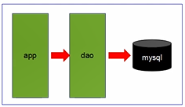


- 第二阶段：数据访问量大，使用**缓存技术**来缓解数据库的压力。

  - **不使用缓存：查询一次就要访问一次数据库**
  - 不同的业务访问不同的数据库
  - **Redis 1s处理10w请求...**

  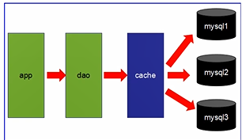

- 第三阶段
  - **主从读写分离**
  - 之前的缓存确实能够缓解数据库的压力，但是**写和读都集中在一个数据库**上，压力又来了
  - **一个数据库负责写，一个数据库负责读，分工合作**
  - 让master（主数据库）来响应事务性（**增删改**）操作，让slave（从数据库）来响应非事务性（**查询**）操作，然后再采用主从赋值来吧master上的事务性操作同步到slave数据库中
  - mysql的master/slace就是网站的标配


- 第四阶段
  - mysql的主从复制，读写分离的基础上，mtsql的**主库开始出现瓶颈**
  - 由于Mysql使用**表锁**，所以**并发性能特别差**
  - **分库分表**开始流行，mysql也提出了表分区，虽然不稳定，但有希望。。
  - 开始mysql集群

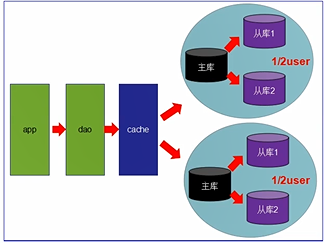


## Redis入门介绍


互联网需求：**高并发，高可扩，高性能**


- Redis是一种**运行速度很快，并发性能很强，并且运行在内存上的noSql（not only sql）数据库**
- NoSQL较较传统数据库的优势：
  - NoSQL数据库**无需事先为要存储的数据建立字段**，随时可以存储**自定义的数据格式**
  - 而在关系数据库里，**增删字段**是一件非常麻烦的事情，如果是非常大数据量的表，增加字段简直就是一个噩梦，每一条数据都要加一个字段

---

- Redis的常用使用场景
  - **缓存：提升服务器性能**！一些**频繁被访问的数据**，经常被访问的数据如果放在关系型数据库，每次查询的开销都会很大，而放在redis中，因为redis是放在**内存中**的可以很高效的访问
  - **排行榜：**利用Redis的SortSet（**有序集合**）数据结构能够简单的搞定
  - **计算器/限速器：**利用redis中**原子性的自增操作**，可以统计各种数据量，mysql**频繁读写压力非常大**；限速器：限制某个用户访问某个API的频率
  - **好友关系：**利用集合的一些命令，求交集、并集、差集等，搞定一些共同好友、共同爱好之类
  - **简单消息队列：**除了Redis自身的**发布/订阅模式**，也可以利用List来实现一个**队列机制**，比如：到货通知、邮件发送之类的需求，不需要高可靠，但是会带来非常大的DB压力，完全可以**用List来完成异步解耦**
  - **Session共享：**默认Session是保存在服务器的文件中，如果是**集群**服务，同一个用户过来可能落在不同机器上，这就导致用户频繁登录，**采用Redis保存**Session后，无论用户落在哪台机器上都能够获取到对应的Session信息


## 1.3 Redis/Memcache/MongoDB对比


都是nosql数据库的代表


### 1.3.1 Redis和Memcache


- Redis和Memcache都是 **内存数据库**，不过Memcache还可以用于缓存其他东西：图片、视频
- memcache**数据结构**单一kv，redis更丰富一些，还提供list，set，hash等数据结构的存储，**有效的减少网络IO的次数，直接作为集合来提交**
- **虚拟内存**---Redis当物理内存用完时，可以将一些很久没用到的value**交换到磁盘**
- **存储数据安全**--Memcache挂掉后，数据没了（**没有持久化机制**），redis可以定期保存到磁盘---持久化
- **灾难恢复**--Memcache挂掉后，数据**不可恢复**；redis数据丢失后可以通过**RBD或AOF**恢复


### 1.3.2 Redis和MongoDB


- redis和MongoDB并不是竞争关系，更多的是一种**协作共存**的关系
- MongoDB本质上还是**硬盘数据库**，在复杂查询时仍然会有大量的**资源消耗**，而且在处理**复杂逻辑**时仍然要不可避免地进行**多次查询**
- 这时就需要redis或Memcache这样的内存数据库来**作为中间层进行缓存和加速**
- 在某些复杂页面的场景中，整个页面的内容如果都**从MongoDB中查询**，可能要几十个查询语句，耗时很长，如果需求允许，可以**把整个页面的对象缓存至redis中，定期更新**，这样**MongoDB和redis就能很好地协作起来**


## 1.4 分布式数据库CAP原理


### 1.4.1 CAP简介


- 传统的关系型数据库**事务**具备ACID：
  - A：原子性
  - C：一致性
  - I：独立性
  - D：持久型
- 分布式数据库的CAP：
  - C（Consistency）：**强一致性**
    - 更新操作成功并返回客户端后，**所有节点在同一时间的数据完全一致**，这就是分布式的一致性。一致性的问题在并发系统中不可避免，对于客户端来说，一致性指的是并发访问时**更新过的数据如何获取**的问题。从服务端来看，则是**更新如何复制分布到整个系统**，以保证数据最终一致
  - A（Availability）：**高可用性**
    - 可用性指："Read and writes always succeed"，**即服务==一直==可用**，而且要是**正常的响应时间**。好的可用性主要是指系统能够很好地为用户服务，不出现用户操作失败或者访问超时等用户体验不好的情况
  - P（Partition tolerance）：分区容错性
    - 即分布式系统在遇到 **某节点或网络分区故障时，仍然能够对外提供满足一致性或可用性的服务**
    - 分区容错性要求能够使应用虽然是一个**分布式系统**，而看上去却好像是在**一个可以运转正常的整体**，比如现在的分布式系统中有某一个或者几个机器宕掉了，其他剩下的机器还能够**正常运转满足系统需求**，对于用户而言并**没有什么体验上的异常**


### 1.4.2 CAP理论


- CAP理论提出就是针对**分布式数据库环境的**，所以，P这个属性必须有容忍它的存在，而且是必须具备的

- 因为P是必须的，那么我们需要选择的就是A和C

- 在分布式环境下，为了保证系统**可用性**，通常都采用了**复制**的方式，避免一个节点损坏，导致系统不可用，那么就出现了每个节点上的数据出现了**很多个副本**的情况，而数据从一个节点复制到另外的节点时需要**时间和要求网络畅通**的，所以，当P发生时，也就是**无法向某个节点复制数据**时，这时候你有两个两个选择：

  - 选择**可用性A**：此时，那么**失去联系的节点**依然**可以向系统提供服务**，不过它的数据就**不能保证是同步的了（因为外部原因无法同步）**（失去了C属性）

  - 选择**一致性C**：为了保证数据库的**一致性**，我们必须**等待失去联系的节点恢复过来**，在这个过程中，那个节点是**不允许对外提供服务的**，这时候系统处于不可用状态（失去了A属性）

    

- 最常见的例子是 **读写分离**，某个节点负责写入数据，然后将数据**同步到其他节点**，其他节点提供读取的服务，当两个节点（读写节点之间）出现同通信问题时，就面临选择A（继续提供服务，但是数据不保证准确），C（用户处于等待状态，一直等到数据同步完成）


### 1.4.3 CAP总结


- 分区是常态，不可避免，三者不可共存
- **可用性和一致性是一对冤家**。一高一低
- 因此，根据CAP原理将NoSQL数据库分成了满足CA原则，满足CP原则和满足AP原则三大类
  - CA：**单点集群**，满足一致性，可用性的系统，扩展性不强大
  - CP：满足一致性，分区容忍性的系统，通常性能不是特别高---需要等待宕掉的节点恢复
  - AP：满足可用性，分区容忍性的系统，通常可能对一致性要求低一些，**可能出错。。因为数据未及时同步**


# 2.下载与安装


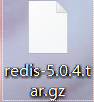


## 安装

不推荐安装在windows操作系统


1. 上传到linux系统并解压

2. 安装gcc编译环境

   ```
   yum -y install gcc
   gcc -v #查看gcc版本
   ```

   

3. 进入redis目录，进行编译

   ```
   make #编译
   make install #编译之后，进行安装
   ```

   


## 安装后的操作


### 后台运行方式


- redis默认不会使用后台运行，如果需要，修改配置文件`daemonize no改为yes`，当你后台服务启动的时候，**会写成一个进程文件运行**

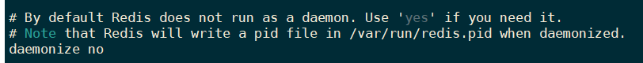

```
vi /opt/redis/redis.conf
```

正常启动：

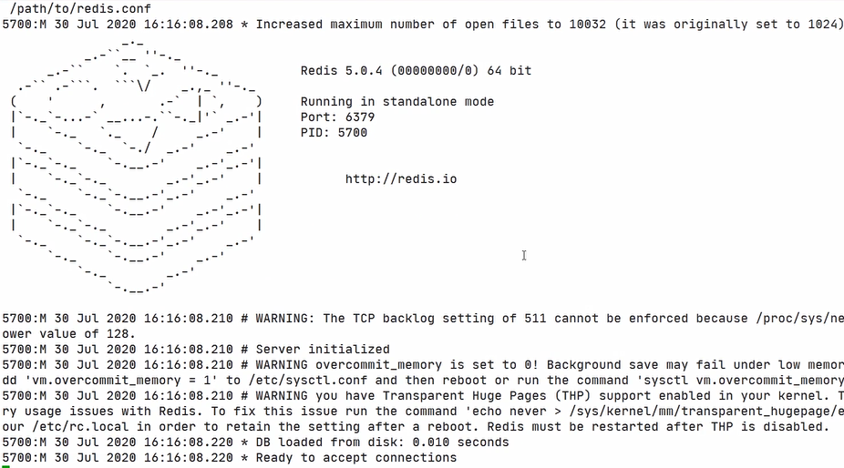

占用了窗口

如果退出这个界面，相当于退出了redis


以配置文件的方式启动：

```bash
cd /usr/local/bin
redis-server /opt/redis/redis.conf #以配置文件的方式启动
```

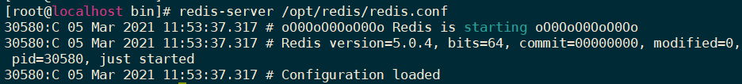


### 关闭数据库


- 单实例关闭

  ```
  redis-cli shutdown
  ```

- 多实例关闭->**用于关闭redis集群**

  ```
  redis-cli 6379 shutdown
  ```

  


### 常用操作


- 检测6379端口是否在监听

```
netstat -lntp | grep 6379
```

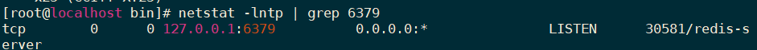

**redis正在运行**


- 检测后台进程是否存在

```
ps -ef|grep redis
```


### 连接redis并测试


```
redis-cli
ping
```

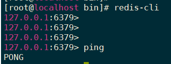

连接成功

### HelloWorld

```
set k1 china # 保存数据
get k1  # 获取数据
```


### 测试性能

```
redis-benchmark
```


```
[root@localhost bin]# redis-benchmark
====== PING_INLINE ======
  100000 requests completed in 1.29 seconds  # 1.8s处理了10w个请求
  50 parallel clients
  3 bytes payload
  keep alive: 1

99.04% <= 1 milliseconds
99.82% <= 2 milliseconds
99.84% <= 7 milliseconds
99.85% <= 11 milliseconds
99.88% <= 12 milliseconds
99.94% <= 13 milliseconds
99.96% <= 14 milliseconds
99.98% <= 20 milliseconds
100.00% <= 20 milliseconds

77639.75 requests per second

```


### 默认16个数据库


```
vi /opt/redis/redis.conf
```

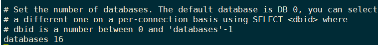


编号**0-15**数据库


切换到15号数据库后，查不到键值。说明默认存储的值都在0号数据库中


### 数据库键的数量

```
dbsize
keys * # 查询所有的键
```


### 清空数据库


清空当前库

```
flushdb # 清空当前库
flush all # 清空所有 16 个库。慎用！
```


### 模糊查询 key


模糊查询keys命令，有三个通配符

- ***** ：通配任意多个字符

  查询所有的键：

  ```
  keys *
  keys n*
  keys *e  #e为最后一位
  keys *k* # 包含k的键
  ```

- **?** ：匹配**单个**字符

- **[ ]**：匹配**括号内的某一个字符**

  ```
  keys r[ae]dis
  ```

  


## 键key


- exists key：判断某个key是否存在
- move key db：移动（**剪切，粘贴**）到几号库
- ttl key：查看键还有多久过期（-1永不过期，-2已过期）
  - `time to live` 还能活多久
- expire key 秒 ： 为键设置过期时间
- type key 查看键的数据类型


**过期后从内存中销毁**


# 3. 使用Redis


## 3.1 五大数据类型


### 3.1.1 字符串String


- set/get/del/append(向key的值追加字符串，返回操作后key的值的长度)/strlen
- incr/decr（加/减 1）  incrby/decrby（加/减指定数）：加减操作，操作的必须是**数字类型**
- getrange/setrange：类似between...and...
  - 查询key中指定下标范围的字符串，`0 -1`表示查询全部的值，`0 3`包含0,3的4个字符
  - `SETRANGE k1 1 xxx` 将k1下标1开始的字符**替换为xxx**

- setex/setnx

  - set with expir：添加数据的同时设置生命周期
  - set if not exist：添加数据的时候**判断是否已经存在**，防止已存在的数据被覆盖掉，**返回0说明执行失败，该键已经存在**

  ```redis
  127.0.0.1:6379> setex k3 10 v3 # 设置生命周期为10s
  OK
  127.0.0.1:6379> get k3
  "v3"
  127.0.0.1:6379> ttl k3
  (integer) -2
  127.0.0.1:6379> get k3  # 过期了 自动销毁
  (nil)
  ```

  

- mset/mget/msetnx(如果有重复，**后面的命令也不执行**)

  - m: more

  - 一次添加或查询多条kv：

    ```
    mset k1 v1 k2 v2...
    mget k1 k2 ...
    ```

    

- getset：先get后set，先查后改


### 3.1.2 列表List


push和pop

- lpush/rpush/lrange
  - l: 自左向右 -> 添加  **从上往下添加**
  - r: 自右向左 <- 添加  **从下往上添加**

**后进入的在上面**

左在下 右在上


- lpop/rpop：移除第一个元素（上左下右）
  - 返回被删除的元素


- lindex：根据下表查询元素（从左向右，自上而下）


- llen：返回集合长度


- lrem：remove

```
lrme list01 2 3 # 表示删除list01中的两个3
```


- ltrim：截取指定范围的值，别的全扔掉
  - ltrim key beginindex endindex

```
ltrim list01 1 3  #将list01的[1,3]的元素保留，其余都删去
```

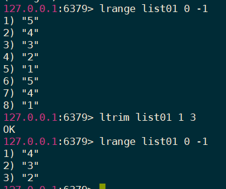

**从上边开始索引**


- rpoplpush：从一个集合**剪切**一个元素到另一个集合中（右出一个，左进一个）


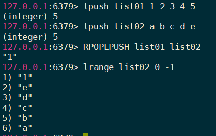


- lset：改变某个下表上的值（从上到下索引）


- linsert：插入元素（指定某个元素之前/之后）

  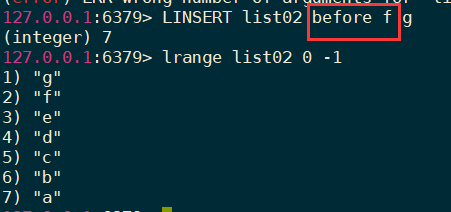

  **需要指定具体在哪一个元素之前/之后插入元素**


- 性能总结：头尾操作效率高，中间效率低


### 3.1.3 集合Set


和java中的set特点类似，**不允许重复**


- sadd/amembers/sismember：添加（自动排除重复元素）/查看/判断是否存在

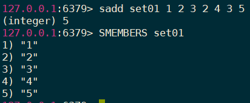


- scard：获得集合中的元素个数


- srem：删除集合中的元素
  - srem key value


- srandmember：从集合中随机获取几个元素
  - srandmember + 整数（个数）


- spop：随机移出set。。。


- smove：移动元素：将key1某个值赋值给key2

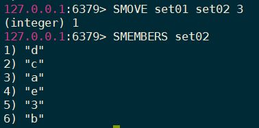


数学集合类：

- 交集：sinter
- 并集：sunion
- 差集：sdiff

```
sinter set01 set02 # 对两个集合求交集
```


### 3.1.4 哈希Hash


类似java里面的`Map<String,Object>`


KV模式不变，但V是一个键值对


- hset/hget/hmget/hgetall(**得到所有键和值的名称**)/hdel：添加/得到/多添加/多得到/得到全部/   删除属性（属性key+值value）
  - **get必须指明具体字段**

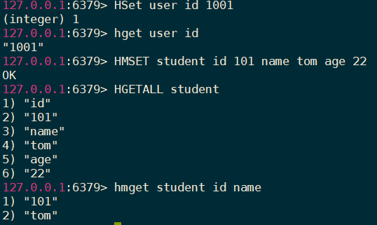


- hlen：返回map的**键值对个数**->属性个数


- hexists：判断map元素是否存在某个属性


- hkeys/hvals：获得属性的所有key/获得属性的所有value


- hincrby/hincrbyfloat：自增整数/小数

  **by   指定需要增加的数**

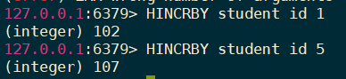


- hsetnx：添加的时候，先判断是否存在。

  在不存在该属性的情况下向map中增加某个属性 

  返回0：增加属性失败


### 3.1.5 有序集合Zset


真实需求：

充值10元可以享受vip1

充值20元可以享受vip2

充值30元可以享受vip3

....


- zadd/zrange（withscores）：添加/查询

  默认是只查询数据

  withscores 带着key的结果

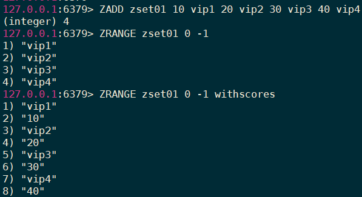


- zrangebyscore：模糊查询

  - ( : 不包含
  - limit：跳过几个截取几个

  跳过2个截取后面的2个

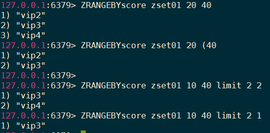


- zrem：删除元素

  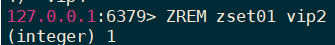

  **需要指明要删除的值**


- acard/zcount/zrank/zscore：集合长度/范围内元素个数/获得指定元素下标/通过值得分数

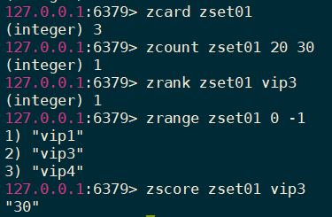


- zrevrank：逆序找下标


- zrevrange：逆序查询


- zrevrangebyscore：逆序范围查找  **score范围也需要反着写，大值在前**


## 3.3 持久化


### 3.3.1 RDB


Redis DataBase

- 在指定的时间间隔内，将内存中的数据局的快照写入磁盘
- 默认保存在usr/local/bin中，文件名dump.rdb

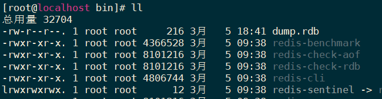


#### 3.3.1.1 自动备份


- redis是内存数据库，当我们每次用完redis，关闭linux的时候，按道理来说，内存释放，redis中的数据也会随之消失。为什么再次启动的时候数据还在？
- 因为每次关机时，redis会自动将数据备份到一个文件中：**/usr/local/bin/dump.rdb**
- **自动备份机制**


1. 默认的自动备份策略不利于我们测试，可以修改redis.conf文件中的自动备份策略

   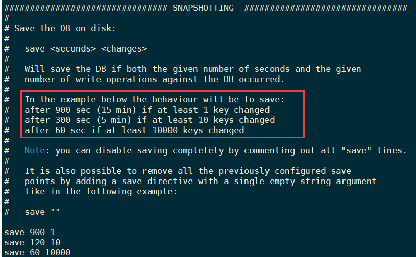

   120s内至少要变更10次才会自动备份...以此类推

   > 如果只使用redis的缓存功能，不需要持久化，那么可以注释掉所有的save行来停用保存功能，可以使用一个空字符串来实现停用： `save ""`

2. 使用shutdown模拟关机，关机之前和关机之后，对比dump.rdb文件的更新时间

   注意：**当我们使用shutdown命令，redis会自动将数据库备份，所以，dump.rdb文件的修改时间更新了**

3. 开机启动redis，我们要在120s内保存10条数据，再查看dump.rdb文件的更新时间

4. 120s内保存10条数据这一动作触发了备份指令，目前，dump.rdb文件中应该保存有这10条数据。***需要过了120s后*，检查是否更新了10次数据，如果是，就自动备份**

5. 既然已经备份了，那么就将数据全部删除 `flushall`（会自动备份一次），再次shutdown关机（还会备份一次）

6. 再次启动redis，发现数据真的消失了，并没有按照我们所想的，将dump.rdb文件中的内容恢复到redis中，为什么？

   > 因为，当我们保存10条以上的数据时，数据备份起来了
   >
   > 然后删除数据库，也会备份文件中的数据，也没问题。
   >
   > 但是，问题出在shutdown上，这个命令一旦执行，就会立即备份，将删除之后的空数据库生成备份文件，将之前装10条数据的备份文件覆盖掉了，所以，自动恢复失败
   >
   > 怎么解决这个问题？将备份文件再备份

7. **拷贝**一份dump.rdb文件dumpbackup.rdb，删除shutdown后的dump.rdb文件，将拷贝文件**重命名为dump.rdb**，开机。**成功还原数据**


#### 3.3.1.2 手动备份


- 之前自动备份，必须要更改好多数据，如更改10条数据才会自动备份
- 现在只保存一条数据，就让他立即备份
- 每次操作完成，执行命令 **save**  就会立即备份


#### 3.3.1.3 与RDB相关的配置


- stop-writes-on-bgsave-error：
  - yes：当后台备份时候发生错误，**前台停止写入->无法更改内存中的数据**
  - no：不管死活，一直写入数据

- rdbcompression：对于存储到磁盘中的快照，是否启动**LZF压缩算法**。一般都会启动
- rdbchecksum：在存储快照后，是否启动CRC64算法进行**数据校验**
  - 开启后，大约增加10%左右的CPU消耗
  - 希望获得最大的性能提升，可以选择关闭
- dbfilename：快照备份文件名字
- dir：快照备份文件保存的目录，默认为当前目录

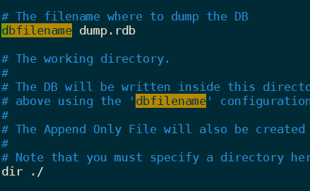


优势/劣势：

- 优势：适合大规模数据恢复，对数据完整性和一致性要求不高
- 劣势：**一定间隔备份一次**，意外宕掉，就失去**最后一次快照的所有修改**


### 3.3.2 AOF


Append Only File


- 以日志的形式记录每个写操作
- 将redis执行过的写指令（set/flushall/...）全部记录下来（读操作也记录，如select）
- 只允许追加文件，不可以改写文件
- redis在启动之初会读取该文件从头到尾执行一遍，这样来重新构建数据


#### 3.3.2.1 开启AOF


将redis总配置文件备份一下：

改为yes：

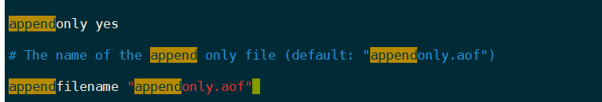


进行一些操作后，看到appendonly.aof文件

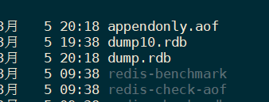

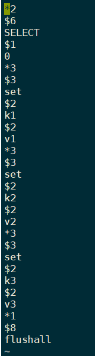

**都是写操作**

删除最后一句清空操作，最后要 `:wq!` **强制保存（wq也可以）**


**只需要重新连接，数据恢复成功**


#### 3.3.2.2 aof和rdb共存 谁优先？


查看redis.conf文件，AOF和RDB两种备份策略可以同时开启，那系统会怎样选择？

1. 编辑appendonly.aof，添加无效代码，保存退出

2. 启动redis失败，所以是**AOF优先载入来恢复原始数据**，因为AOF比RDB数据保存的完整性更高

   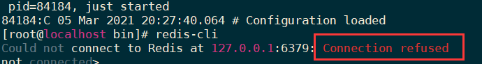

3. 修复AOF文件，**修正/杀光不符合redis规范的代码**

   ```bash
   redis-check-aof --fix appendonly.aof
   ```

   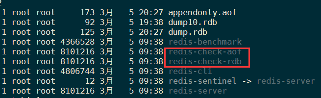


#### 3.3.2.3 与AOF相关的配置


- appendonly：开启aof模式
- appendfilename：aof文件名
- appendfsync：追写策略
  - always：每次数据变更，就会立刻记录到磁盘，性能较差，但数据完整型好
  - everysec：默认设置，一步操作，每秒记录，如果一秒内宕机，会有数据丢失
  - no：不追写
- no-appendfsync-on-rewrite：重写时是否运行用appendfsync追写策略，用默认no即可，保证数据安全性
  - AOF采用文件追加的方式，文件会越来越大，为了解决这个问题，增加了**重写机制**，redis会自动记录上一次aof文件的大小，当AOF文件大小达到预先设定的大小时，redis就会启动aof文件进行**内容压缩**，只保留可以恢复数据的最小指令集合
- auto-aof-rewrite-percentage：如果aof文件大小已经超过原来的100%，也就是一倍，才重写压缩
- auto-aof-rewrite-min-size：如果aof文件已经超过了64mb，才重写压缩


### 3.3.3 总结


RBD：只用作后背用途，建议15min备份一次就行

AOF：

- 在最恶劣的情况下，也只丢失不超过2秒的数据，**数据完整性比较高，但代价太大，会带来持续的IO**
- 对硬盘的大小要求也高，默认64mb太小了，企业级最少都是5g以上
- 后面要学习的master/slave（主从复制）才是新浪微博的选择


## 3.4 事务


- 可以一次执行多条命令，是一个命令组，一个事务中，所有命令都会序列化（**排队**），不会被插队
- 一个队列中，**一次性，顺序性，排他性**的执行一系列命令


- 三特性
  - **隔离性**：所有命令都会**按照顺序**执行，事务在执行的过程中，**不会被**其他客户端送来的命令**打断**
  - 没有隔离级别：队列中的命令没有提交之前都**不会被实际的执行**，不存在“事务中查询要看到事务里的更新，事务外查询不能看到”这个头疼的问题。
  - **不保证原子性**：如果一个命令失败，但是别的命令可能会执行成功，**没有回滚**


- 三步走
  - 开启**multi**
  - **入队queued**
  - 执行**exec**


- 与关系型数据库事务相比：
  - multi：可以理解成关系型事务中的begin
  - exec：commit
  - **discard：rollback**


### 事务的原子性


> 因为 **Redis 事务不支持事务回滚机制**，如果事务执行中出现了**命令执行**错误（例如对 String 类型的数据库键执行 LPUSH 操作），只会返回当前命令执行的错误给客户端，**并不会影响下面的命令的执行**。所以很多人觉得和关系型数据库（MySQL） 不一样，而 MySQL 的事务是具有原子性的，所以大家都认为 Redis 事务不支持原子性。
>
> Redis 事务其实是支持原子性的！即使 Redis 不支持事务回滚机制，但是它会检查每一个事务中的命令是否错误。
>
> 但是我们要注意一个点就是：Redis 事务**不支持检查那些程序员自己逻辑错误**。例如**对 String 类型的数据库键执行对 HashMap 类型的操作**！
>
> https://blog.csdn.net/Howinfun/article/details/105753716?utm_medium=distribute.pc_relevant.none-task-blog-baidujs_title-6&spm=1001.2101.3001.4242


Redis 使用了事务队列来预先将执行命令存储起来，并且**会对其进行格式检查**的，提前就知道命令是否可执行了。所以如果只要有一个命令是错误的，那么这个事务是不能执行的。


- 如果只是逻辑问题，没必要进行事务回滚，其他指令正常执行即可。
- 如果出现了语法错误，会报错，并且整个事务都会执行失败，这时候就需要重新来过了~


### 3.4.1 开启事务并执行

开启事务，加入队列，一起执行，并成功

先开启事务（multi）后，每一条操作都会进入队列

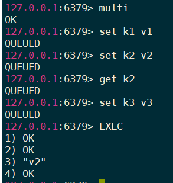


执行exec：一起成功


### 3.4.2 回滚


放弃之前的操作（**已经入队的操作**），恢复到原来的值

取消该事务的执行，且此时事务还没有执行

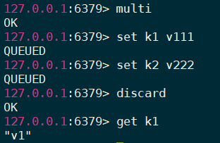


### 3.4.3 报错


一句保存，全部取消，恢复到原来的值


**如果有一个操作报错（命令错误），全部放弃执行**


### 3.4.4 找到错误源头


追究责任，谁的错去找谁


**redis的事务并不支持原子性，对于逻辑错误：加入队列并没有报错，类似java中的通过编译。**

真正执行的时候会报错，但后面的操作还是会成功。

**不同于指令错误**

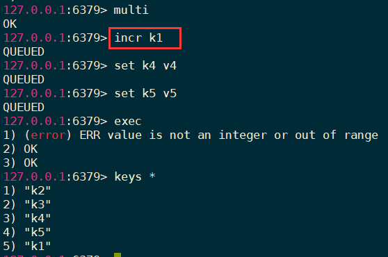


### 3.4.5 watch监控


测试：模拟收入与支出


正常情况：通过事务更改收入与支出

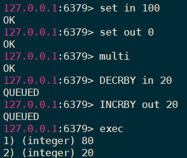


---


- 特殊情况

在`watch in`后，执行事务的过程中（还未exec），对in进行了修改：

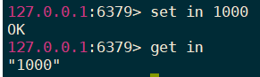

**导致事务执行失败**

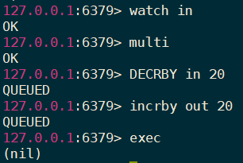

> 因为在执行exec之前，开启了另一个窗口（线程），对监控的in做了修改。
>
> 所以本次的事务将**被打断->失效**，类似于**乐观锁**


- unwatch：取消watch命令对所有key的操作
  - **一旦执行了exec命令，那么之前加的所有监控自动取消**


## 3.5 Redis的发布订阅


- **进程间的一种消息通信模式**：发送者（pub）发送消息，订阅者接收消息，例如：微信订阅号
- 订阅一个或多个频道


订阅一个或多个频道

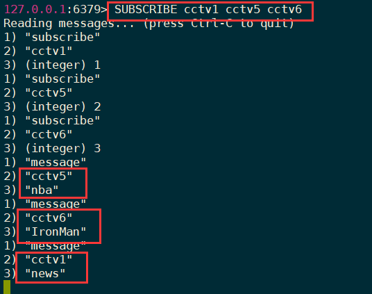


向频道发送消息，若该频道被订阅，则会在订阅方显示接收到的信息

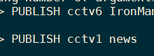


## 3.6 主从复制


- 就是redis集群的策略
- 配从（库）不配主（库）：小弟可以选择谁是大哥，但大哥没有权力去选择小弟
- **读写分离**：**主机写，从机读**


### 3.6.1 一主二仆


1. 准备3台服务器


当前只允许自己访问自己的redis服务器

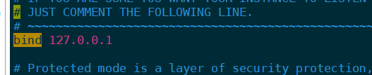


改为：

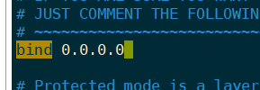


> 0.0.0.0的IP地址表示整个网络，即网络中的所有主机

并且修改为后台运行redis：

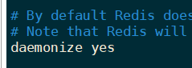


将数据全部清空。


2. 启动三台redis，并查看每台机器的角色，**都是master**

   ```
   info replication
   ```

   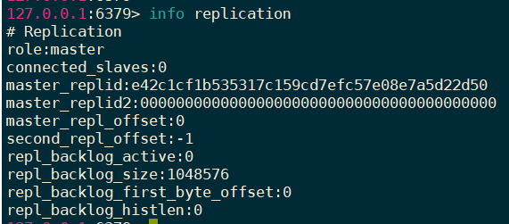


3. 测试开始

   - 首先**第一台**添加值。第二台第三台此时都还没有数据（三台机器还没有组合成为集群）

   - 其余两台机器，复制（**小弟主动去选择大哥**）

     ```
     slaveof ip port
     SLAVEOF 192.168.150.128 6379
     ```

     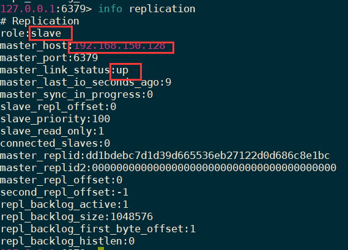

     数据也成功从master处拷贝：

     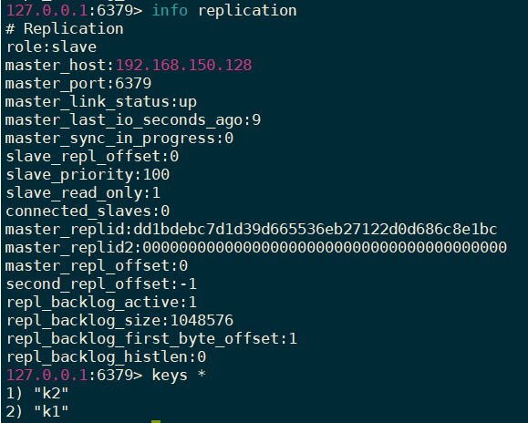

     - 只要跟了master，**之前的数据会立刻同步**

     

     - 从机不能写入，只能读

     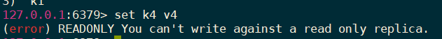

     - 主机shutdown？从机？

       从机仍然是slave，并显示master下线(down)了：

     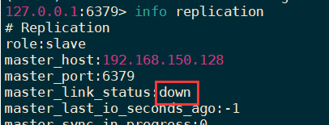

     - 从机死了？死了就死了。主机只是显示少了一个slave

     - 从机重新上线？脱离组织，自己成为了master

       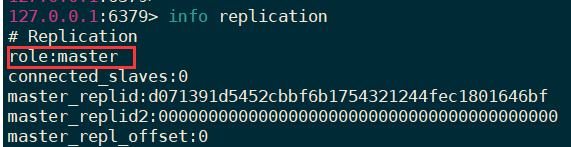

       **重启归来的从机自立门户成为了master，不和原来的集群在一起了**

​		

> 一定是在从机中选择让谁成为自己的master `salveof ip port`
>
> 且一旦成为了从机，不能进行写操作


### 3.6.2 主从的传递性


- 一个主机理论上可以有多个从机，但是这样的话，这个主机会很累
- 我们可以使用java面向对象 **继承中的传递性** 俩解决这个问题，减轻主机的负担


- 192.168.150.128，主机，只有一个slave：129

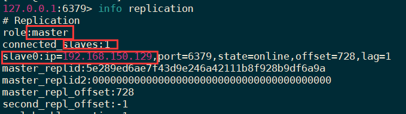


- 129，**是128的从机，同时也是130的master**，但129不具有master的写功能

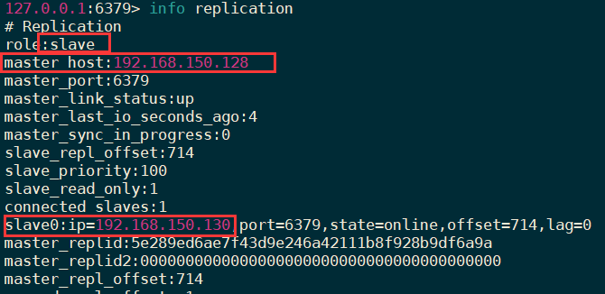


- 130：129的从机，也是128的从机

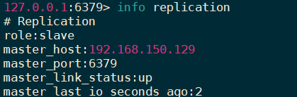


**在128上添加数据，129,130都可以看到变化**


### 3.6.3 谋权篡位


- 1个主机，2个从机，当主机挂掉了，只能从2个从机中再次选1个主机

- 手动选老大

- 1为master，2,3都是slave，当1挂掉后，2篡权为master

  

  2,3此时都仍是小弟
  
  ```
从机2执行: slaveof no one
  ```

  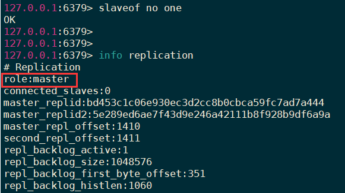

  从机2成为老大->光杆司令
  
  ->使从机3改变master，认从机2为master


- 若主机1再次回归？

  还是master，但是成为光杆司令....**2和3不会回归**


### 3.6.4 复制原理


完成上面几个步骤后就完成了从服务器数据初始化的所有操作，从服务器可以接受来自用户的读请求

- **全量复制：**slave初始化阶段，这是slave需要将master上的所有数据都复制一份，slave接收到数据文件后，存盘，并加载到内存中（**步骤1 2 3 4**）
- **增量复制：**slave初始化后，开始正常工作时，主服务器发生的写操作会同步到从服务器的过程（**步骤5 6**）
  - 但，只要是**重新连接master**，一次性（**全量复制**）同步将自动执行


- Redis主从同步策略

  主从刚刚连接的时候，进行**全量同步**，全同步结束后，进行**增量同步**

  当然，如果有需要，slave任何时候都可以发起全量同步，

  redis策略是：无论如何，**首先会尝试进行增量同步**，如不成功，**要求从机进行全量同步**


### 3.6.5 哨兵模式


- 谋权篡位的自动版！
- 有个哨兵一直在巡逻，突然发现！！老大挂了！！！.......小弟们自动投票，从众小弟中选出新的老大
- Sentinel（**哨兵**）是Redis的高可用性解决方案：
  - 由一个或多个Sentinel实例组成的Sentinel系统可以监视任意多个主服务器，并在被监视的主服务器进入下线状态时，自动将下线主服务器树下的某个从服务器省纪委新的主服务器，然后由新的主服务器代替已下线的主服务器继续处理命令请求


- 模拟测试：

  - 1主 ，2和3从
  - 每一台服务器中传建一个配置文件：/usr/local/bin/sentinel.conf，

  ```
  # sentinel monitor 被监控主机名（自定义） ip port 票数
  sentinel monitor redis128 192.168.150.128 6379 1
  ```

  - 按照主redis->从redis的顺序启动服务，2,3作为1号的slave
  - **启动哨兵**

  

```
redis-sentinel sentinel.conf
# 需要新窗口运行 进程占用了此窗口
```


- 将1号老大挂掉，后台激烈的投票

- 这时3号机变为master。2仍然是slave

  

- 如果之前的老大回来呢？

  128（之前的主服务器）先自己成为master，马上就改变：

  

  130（主服务器）多了一个slave（回来的128）

  

  变成了当前老大130的slave：

  


> 只要主机挂了，哨兵立刻通知从机，要选举出一个主机（**主机的写不能断！**）
>
> 保证了 **高可用性的解决方案**


### 3.6.6 哨兵模式缺点

- **所有的写操作**都在master机器上完成的
- 然后再同步到slave上，所以两台机器之间**通信会有延迟**
- 当系统很繁忙的时候，延迟问题会加重
- slave**机器数量增加**，问题也会加重（增加层数来解决此问题）


## 3.7 总配置redis.conf详解


```shell
################  INCLUDES  包含文件相关  ##############
包含一个或多个配置文件引入当前配置文件中
include ....

###############  GENERAL 综合配置   ################

daemonize no # 当为yes的时候，以守护进程的模式运行（后台运行）

port 6379 # redis监听端口

tcp-backlog 511  #此参数确定了TCP连接中已完成队列(完成三次握手之后)的长度， 当然此值必须不大于Linux系统定义的/proc/sys/net/core/somaxconn值，默认是511，而Linux的默认参数值是128。当系统并发量大并且客户端速度缓慢的时候，可以将这二个参数一起参考设定。该内核参数默认值一般是128，对于负载很大的服务程序来说大大的不够。一般会将它修改为2048或者更大。在/etc/sysctl.conf中添加:net.core.somaxconn =2048，然后在终端中执行sysctl -p

bind 127.0.0.1 #绑定的主机地址，不设置默认将处理所有请求

timeout 0 #当 客户端闲置多长时间后关闭连接，如果指定为0，表示关闭该功能

tcp-keepalive 300 #如果设置不为0，就使用配置tcp的SO_KEEPALIVE值，使用keepalive有两个好处:检测挂掉的对端。降低中间设备出问题而导致网络看似连接却已经与对端端口的问题。在Linux内核中，设置了keepalive，redis会定时给对端发送ack。检测到对端关闭需要两倍的设置值。

loglevelnotice # 日志级别，要用warning

logfile "" #指定了记录日志的文件。空字符串的话，日志会打印到标准输出设备。后台运行的redis标准输出是/dev/null

databases16 # 数据库的数量，默认使用的数据库是DB 0。可以通过”SELECT “命令选择一个db


############ 持久化 ##############

save900 1 #900秒有一个key变化，就做一个保存

save300 10 #300秒有10个key变化，就做一个保存，这里需要和开发沟通

save60 10000 #60秒有10000个key变化就做一个保存

stop-writes-on-bgsave-erroryes #在出现错误的时候，是不是要停止保存

rdbcompression yes # 使用压缩rdb文件，rdb文件压缩使用LZF压缩算法，yes：压缩，但是需要一些cpu的消耗。no：不压缩，需要更多的磁盘空间

rdbchecksum yes # 是否校验rdb文件。从rdb格式的第五个版本开始，在rdb文件的末尾会带上CRC64的校验和。这跟有利于文件的-容错性-，但是在保存rdb文件的时候，会有大概10%的-性能损耗-，所以如果你追求高性能，可以关闭该配置。

dbfilename dump.rdb # rdb文件的名称

dir./ # 数据目录，数据库的写入会在这个目录。rdb、aof文件也会写在这个目录

################### 主从复制的配置 REPLICATION  ##################

slave-serve-stale-data yes #当从库同主机---失去连接或者复制正在进行---，从机库有两种运行方式：   1) 如果slave-serve-stale-data设置为yes(默认设置)，从库会继续响应客户端的请求（可能是空值）。   2) 如果slave-serve-stale-data设置为no，除去INFO和SLAVOF命令之外的任何请求都会返回一个错误”SYNC with master in progress”正在和master同步

slave-read-only yes # 作为从服务器，默认情况下是只读的（yes），可以修改成NO，用于写（不建议）

repl-disable-tcp-nodelay no # 是否禁止复制tcp链接的tcp nodelay[gs1] [gs2] 参数，可传递yes或者no。默认是no，即使用tcp nodelay。如果master设置了yes来禁止tcp nodelay设置，在把数据复制给slave的时候，会减少包的数量和更小的网络带宽。但是这也可能带来数据的延迟。默认我们推荐更小的延迟，但是在数据量传输很大的场景下，建议选择yes。

slave-priority 100 # 当master不可用，Sentinel会根据slave的优先级选举一个master。最低的优先级的slave，当选master。而配置成0，永远不会被选举。

appendonly no # 默认redis使用的是rdb方式持久化，这种方式在许多应用中已经足够用了。但是redis如果--中途宕机--，会导致可能有几分钟的数据丢失，根据save来策略进行持久化，Append Only File是另一种持久化方式，可以提供更好的持久化特性。Redis会把每次写入的数据在接收后都写入 appendonly.aof 文件，每次启动时Redis都会---先把这个文件的数据读入内存里，先忽略RDB文件---

appendfilename "appendonly.aof" # aof文件名

########################   LUA   ##############################
lua嵌入式脚本


###################### 慢日志 slowlog #####################
slowlog-log-slower-than 10000  # slog log是用来记录redis运行中执行比较慢的命令耗时。当命令的执行超过了指定时间，就记录在slow log中，slog log保存在内存中，所以没有IO操作。

#执行时间比slowlog-log-slower-than大的请求记录到slowlog里面，单位是---微秒---，所以1000000就是1秒。注意，负数时间会禁用慢查询日志，而0则会强制记录所有命令。


hash-max-ziplist-entries512 # 数据量小于等于hash-max-ziplist-entries的用ziplist，大于hash-max-ziplist-entries用hash

hash-max-ziplist-value64 # value大小小于等于hash-max-ziplist-value的用ziplist，大于hash-max-ziplist-value用hash。

list-max-ziplist-size-2

set-max-intset-entries512 #数据量小于等于set-max-intset-entries用iniset，大于set-max-intset-entries用set。

zset-max-ziplist-entries128 #数据量小于等于zset-max-ziplist-entries用ziplist，大于zset-max-ziplist-entries用zset。

zset-max-ziplist-value64 #value大小小于等于zset-max-ziplist-value用ziplist，大于zset-max-ziplist-value用zset。

activerehashingyes # Redis将在每100毫秒时使用1毫秒的CPU时间来对redis的hash表进行重新hash，可以降低内存的使用。当你的使用场景中，有非常严格的实时性需要，不能够接受Redis时不时的对请求有2毫秒的延迟的话，把这项配置为no。如果没有这么严格的实时性要求，可以设置为yes，以便能够尽可能快的释放内存。

client-output-buffer-limitnormal 0 0 0
# 对客户端输出缓冲进行限制可以强迫那些不从服务器读取数据的客户端断开连接，用来强制关闭传输缓慢的客户端。
# 对于normalclient，第一个0表示取消hard limit，第二个0和第三个0表示取消soft limit，normal client默认取消限制，因为如果没有寻问，他们是不会接收数据的。

client-output-buffer-limitslave 256mb 64mb 60 #对于slaveclient和MONITER client，如果client-output-buffer一旦超过256mb，又或者超过64mb持续60秒，那么服务器就会立即断开客户端连接。

client-output-buffer-limitpubsub 32mb 8mb 60 #对于pubsub client，如果client-output-buffer一旦超过32mb，又或者超过8mb持续60秒，那么服务器就会立即断开客户端连接。

aof-rewrite-incremental-fsync yes # 在aof重写的时候，如果打开了aof-rewrite-incremental-fsync开关，系统会每32MB执行一次fsync。这对于把文件写入磁盘是有帮助的，可以--避免过大的延迟峰值--。
```


- 通常情况下，默认的配置足够使用需求


## 3.8 Jedis


java和redis打交道的API库


```xml
<dependency>
    <groupId>redis.clients</groupId>
    <artifactId>jedis</artifactId>
    <version>RELEASE</version>
</dependency>
```


### 3.8.1 连接redis

- 记得关闭防火墙 `systemctl stop firewalld.service`

- 修改配置文件 `bind 0.0.0.0`，允许任何ip访问，并以该配置文件启动redis


```java
Jedis jedis = new Jedis("192.168.150.128", 6379);
String ping = jedis.ping();
System.out.println(ping);//PONG
```


### 3.8.2 常用API


```java
Jedis jedis = new Jedis("192.168.150.130", 6379);
jedis.set("k1", "v1");
jedis.set("k2", "v2");
jedis.set("k3", "v3");
Set<String> keys = jedis.keys("*");
System.out.println(keys);
System.out.println(jedis.exists("k2"));
System.out.println(jedis.ttl("k1"));//查看k1的过期时间

// String
jedis.mset("k4", "v4", "k5", "v5");
System.out.println(jedis.mget("k2", "k4", "k5"));//[v2, v4, v5]

//List
jedis.lpush("list01", "1", "a", "2", "b", "3");
System.out.println(jedis.lrange("list01", 0, -1));

//Set
jedis.sadd("order","jd003", "jd001", "jd002");
System.out.println(jedis.smembers("order"));
jedis.srem("order", "jd002");
System.out.println(jedis.smembers("order").size());//2

//hash
jedis.hset("hash01", "username", "james");
System.out.println(jedis.hget("hash01", "username"));//james
HashMap<String, String> map = new HashMap<>();
map.put("gender", "male");
map.put("address", "beijing");
map.put("phone", "12345612341");
jedis.hmset("hash02", map);
System.out.println(jedis.hmget("hash02", "gender", "address", "phone"));
//[male, beijing, 12345612341]

//zset
jedis.zadd("zset01", 60d, "zs1");
jedis.zadd("zset01", 70d, "zs2");
jedis.zadd("zset01", 80d, "zs3");
jedis.zadd("zset01", 90d, "zs4");
System.out.println(jedis.zrange("zset01", 0, -1));
```


### 3.8.3 事务


- 初始化余额和支出

```
set remain 100
set out 0
```


- 使用事务修改

```java
Jedis jedis = new Jedis("192.168.150.130", 6379);

int remain = Integer.parseInt(jedis.get("remain"));
int out = 10;

jedis.watch("remain");//监控余额


if(remain < out){
    jedis.unwatch();//解除监控
    System.out.println("余额不足");
}else{
    Transaction transaction = jedis.multi();//开启事务
    transaction.decrBy("remain", out);//余额减少
    transaction.incrBy("out", out);//累计消费增加
    
    Thread.sleep(5000);//在这里多线程修改remain，事务执行失败，回滚数据
    
    transaction.exec();
    System.out.println("余额：" + jedis.get("remain"));
    System.out.println("累计支出："+ jedis.get("out"));
}
```


### 3.8.4 JedisPool


- redis的连接池技术

```xml
<dependency>
    <groupId>commons-pool</groupId>
    <artifactId>commons-pool</artifactId>
    <version>RELEASE</version>
</dependency>
```


**连接池是单例模式**

```java
//单例模式优化Jedis连接池
public class JedisPoolUtil {
    private JedisPoolUtil(){}

    private volatile static JedisPool jedisPool = null;
    private volatile static Jedis jedis = null;

    //返回一个连接池
    private static JedisPool getJedisPool(){
        //双层检测锁(最常用)
        if(jedisPool == null){//第一层：检测是否为空
            synchronized (JedisPoolUtil.class) { //排队
                if (jedisPool == null) {//第二层
                    JedisPoolConfig jedisPoolConfig = new JedisPoolConfig();
                    jedisPoolConfig.setMaxIdle(30);
                    jedisPoolConfig.setMaxTotal(1000);
                    jedisPoolConfig.setMaxWaitMillis(60*1000);
                    jedisPoolConfig.setTestOnBorrow(true);
                    jedisPool = new JedisPool("192.168.150.130", 6379);
                }
            }
        }
        return jedisPool;
    }

    //返回jedis连接对象
    public static Jedis getJedis(){
        if(jedis == null){
            jedis = getJedisPool().getResource();
        }
        return jedis;
    }

}
```


```java
public static void main(String[] args) {
    Jedis jedis1 = JedisPoolUtil.getJedis();
    Jedis jedis2 = JedisPoolUtil.getJedis();
    System.out.println(jedis1 == jedis2);//true 是单例模式的
}
```


## 3.9 高并发下的分布式锁


- 秒杀，抢购优惠券


### 3.9.1 搭建工程并测试单线程


```xml
<dependency>
    <groupId>redis.clients</groupId>
    <artifactId>jedis</artifactId>
    <version>RELEASE</version>
</dependency>
<dependency>
    <groupId>commons-pool</groupId>
    <artifactId>commons-pool</artifactId>
    <version>RELEASE</version>
</dependency>
<dependency>
    <groupId>org.redisson</groupId>
    <artifactId>redisson</artifactId>
    <version>RELEASE</version>
</dependency>
<dependency>
    <groupId>com.fasterxml.jackson.core</groupId>
    <artifactId>jackson-databind</artifactId>
</dependency>
```


在redis数据库中 `set phone 10`，设置10部手机用于秒杀


configuration类(也可以使用starter-redis进行自动注入)

```java
@Configuration
public class RedisConfig {
    @Bean
    public JedisConnectionFactory jedisConnectionFactory(){
        JedisConnectionFactory jedisConnectionFactory = new JedisConnectionFactory();
        jedisConnectionFactory.setHostName("192.168.150.130");
        jedisConnectionFactory.setPort(6379);
        return jedisConnectionFactory;
    }

    @Bean
    public StringRedisTemplate stringRedisTemplate(JedisConnectionFactory jedisConnectionFactory){
        StringRedisTemplate stringRedisTemplate = new StringRedisTemplate();
        stringRedisTemplate.setConnectionFactory(jedisConnectionFactory);
        return stringRedisTemplate;
    }
}
```


```java
@RestController
public class TestKill {

    @Autowired
    private StringRedisTemplate template;

    @RequestMapping("/kill")
    public String kill(){
        //1.从redis中获取手机的库存数量
        int phoneNum = Integer.parseInt(template.opsForValue().get("phone"));
        //2.判断手机的库存是否够秒杀的
        if(phoneNum > 0){
            phoneNum--;
            //库存减少之后，再将库存的值保存回redis
            template.opsForValue().set("phone", String.valueOf(phoneNum));
            System.out.println("库存-1！剩余："+phoneNum);//库存-1！剩余：9
        }else{
            System.out.println("库存不足！");
        }
        return "over!";
    }
}
```


### 3.9.2 高并发测试


使用apache-jmeter


redis数据库数据正常


----


为方法加上synchronized锁：


```java
@RequestMapping("/kill")
public synchronized String kill(){
    //1.从redis中获取手机的库存数量
    int phoneNum = Integer.parseInt(template.opsForValue().get("phone"));
    //2.判断手机的库存是否够秒杀的
    if(phoneNum > 0){
        phoneNum--;
        //库存减少之后，再将库存的值保存回redis
        template.opsForValue().set("phone", String.valueOf(phoneNum));
        System.out.println("库存-1！剩余："+phoneNum);//库存-1！剩余：9
    }else{
        System.out.println("库存不足！");
    }
    return "over!";
}
```


操作正常：


> **synchronized只能解决一个tomcat的并发问题，如果启动两个tomcat，就没用了**
>
> **锁的是一个进程下的线程并发，如果分布式环境，多个进程并发，这种方案就失效了**


### 3.9.3 多进程&负载均衡+synchronized？


**使用nginx做负载均衡**

多个进程并发


将发送给192.168.150.128:80（nginx服务器）的请求，负载均衡地转发给两台tomcat服务器地址。


使用jmeter：


在nginx的负载均衡下....幸运的实现了锁的效果....不过都是假象


这奇偶分布的过于整齐。。。。。

> 因为有了**nginx负载均衡**和**进程内的synchronized锁**
>
> 
>
> **分别**发送给两台tomcat服务器，而两台服务器即使收到多个请求，也会被synchronized锁限制。。
>
> 那还需不需要分布式锁。。。


不是很清楚。。。。人傻了


---


数据量足够大的情况终于还是出错了：


终于出问题了。。。。

在保存数据之前让线程sleep，


server1：


server2：


使得两个进程每次都读到相同的数，这样就无法实现 **分布式锁**


### 3.9.4 实现分布式锁的思路


- 因为**redis是单线程**的，所以**命令也就具备原子性**，**使用setnx命令实现锁（这个命令只能让一个线程去执行）**，保存k-v
  - 如果k不存在，保存（当前线程加锁），执行完成后，删除k表示释放锁
  - 如果k已存在，阻塞线程执行，表示有锁
- 如果加锁成功，在执行业务代码的过程中**出现异常**，**导致没有删除k**（释放锁失败），那么就会造成死锁（后面的所有线程都无法执行） 
  - 选择在finally中使用delete key来删除锁，只要执行完业务代码就会执行删除操作，但也并不是百分百会执行......
  - 设置过期时间，例如10s后，redis自动删除这个锁节点  `setex key 10 value`
- 高并发下，由于时间段等因素导致压力过大或过小，**每个线程执行的时间不同**
  - 第一个线程，执行需要13秒，执行到第10s的时候，redis自动过期了k（释放锁）
  - 第二个线程，执行需要7s，加锁，执行第三秒（锁被释放了，为什么，**是被第一个线程的finally操作 主动deleteKey释放掉了**-> 第一个线程太慢了，主动释放的是第二个线程的锁）
  - 连锁反应，当前线程刚加的锁，就被其他线程释放掉了，周而复始，导致锁就会永久失效

- 给每个线程加上一个**唯一的标识UUID**，随机生成，释放的时候判断**是否是当前的标识**即可
- 问题又来了，过期时间如何设定？
  - 10s太短不够用怎么办？
  - 设置60s，太长浪费时间资源
  - 开启一个定时器线程，当**已经过期的时间**   小于  **总过期(限定)时间的1/3**时，增长总过期(限定)时间（**给这个key续命！**），**直到主动将锁释放**
    - 限定100岁，当你到67岁的时候，**续命！！**  返老还童，重新再来！


**自己实现分布式锁，太难了。。。**


### 3.9.5 Redisson


- Redis是最流行的NoSQL数据库解决方案之一，而java是世界上最流行的编程语言。。。
- Redis并没有对java提供原生支持
- 相反，作为java开发人员。。得使用Redis的第三方库
- 而Redisson就是用在Java程序中操作REdis的库，可以轻松的使用Redis
- Redisson在java.util中常用借口的基础上，为我们提供了一系列具有分布式特性的工具类


```xml
<dependency>
    <groupId>org.redisson</groupId>
    <artifactId>redisson</artifactId>
    <version>RELEASE</version>
</dependency>
```


```java
@RestController
public class TestKill {

    @Autowired
    private StringRedisTemplate template;

    @Autowired
    private Redisson redisson;

    @RequestMapping("/kill")
    public synchronized String kill() throws InterruptedException {

        //定义商品id
        String productKey = "huawei-P40";
        //通过Redisson获得锁
        RLock lock = redisson.getLock(productKey);//底层源码就是集成了setnx 过期时间等操作

        //上锁 过期时间为30s，单位是Second
        lock.lock(30, TimeUnit.SECONDS);


        try{
            //1.从redis中获取手机的库存数量
            int phoneNum = Integer.parseInt(template.opsForValue().get("phone"));
            //2.判断手机的库存是否够秒杀的
            if(phoneNum > 0){
                phoneNum--;
                //库存减少之后，再将库存的值保存回redis
                //Thread.sleep(3000);
                template.opsForValue().set("phone", String.valueOf(phoneNum));
                System.out.println("库存-1！剩余："+phoneNum);//库存-1！剩余：9
            }else{
                System.out.println("库存不足！");
            }
        }catch (Exception e){
            e.printStackTrace();
        }finally {
            //释放锁
            lock.unlock();
        }
        return "over!";
    }
}
```


配置Redisson进容器

```java
    @Bean
    public Redisson redisson(){
        Config config = new Config();
        //使用单个redis服务器
        config.useSingleServer().setAddress("redis://192.168.150.128:6379").setDatabase(0);
        //使用redis集群
//        config.useClusterServers().setScanInterval(2000)
//         .addNodeAddress("redis://192.168.150.128:6379",
//         "redis://192.168.150.129:6379", "redis://192.168.150.130:6379");
        return (Redisson) Redisson.create(config);
    }
```


测试结果：


**实现分布式锁的方案有很多，之前用过的zookeeper的特点就是高可靠性，现在用的redis就是高性能**

**但是目前分布式锁应用最多的仍然是"Redis"**


# TIP


## synchronized和分布式锁区别


synchronized  锁的是**当前进程**下的对象C。  

服务**A**和服务**B** 的**对象C是独立**的，

所以synchronized起不到分布式锁的作用。synchronized只能加在进程上，并且也会出现多个进程 **同时访问到一个数据相同的值**，就会在业务中对这个相同的值做两次操作


分布式锁的实现，需要**基于一个第三方保持**下，获取到锁的请求对象，就像去**公共厕所（多个进程）**，就1个坑位，A先进去了，B就要等着。

synchronized  的感觉就像，**你和你家人(在一个进程内)**，共享你家里自己的厕所，你进厕所了，你家人就要等你


****


数据库中的数据，不管有多少个进程需要访问/操作，**一次都只能有一个进程来访问，其他进程不能进来。**


