[TOC]


指令文档：http://redisdoc.com/index.html

# 面试问题


## 介绍下 Redis


Redis 全称：Remote Dictionary Server（远程数据服务），**就是使用 C 语言开发的内存数据库**，所以读写速度非常快，基于内存且支持持久化的高性能 key-value 数据库，具备以下三个特征：

- 多数据类型
- 持久化机制
- 主从同步


**Redis除了做缓存之外，也经常用来做分布式锁，甚至消息队列**

**Redis提供了多种数据类型来支持不同的业务场景。还支持事务、持久化、Lua脚本、多种集群方案**


## 分布式缓存常见的技术选型方案？


使用的比较多的是 **Memcached 和 Redis**。Memcached是分布式缓存刚兴起的时候常用的。后来大家都使用更加强大的Redis了。


分布式缓存主要解决的是 **单机缓存的容量受服务器限制并且无法保存通用的信息。因为本地缓存只在当前服务里有效**。比如部署了两个相同的服务，两者之间的缓存数据是无法共通的。


## Redis 和 Memcached 比较


共同点：

1. 都是 **基于内存的数据库，一般用来当缓存用**
2. 都有过期策略
3. 性能都很高


区别：

1. 二者都是将数据存放在内存中，不过Memcached还可以缓存其他东西，例如：**图片、视频等**
2. **Redis支持更丰富的数据类型（支持更复杂的应用场景）**。Redis不仅仅支持简单的 k/v 类型的数据，同时还提供 list, set, zset, hash等数据结构的存储。Memcached 只支持最简单的 k/v 数据类型
3. **Redis 支持数据的持久化，可以将内存中的数据保持在磁盘中，重启的时候可以再次加载进行使用,而 Memecache 把数据全部存在内存之中，无法恢复/持久化。**
4. **Redis有灾难恢复机制**。可以把缓存中的数据持久化到磁盘上
5. **Redis 在服务器内存使用完之后，可以将不用的数据放到磁盘上。但是，Memcached 在服务器内存使用完之后，就会直接报异常。**
6. **Memcached 没有原生的集群模式，需要依靠客户端（magent）来实现往集群中分片写入数据；但是 Redis 目前是原生支持 cluster 模式的.**
7. **Memcached 是多线程，非阻塞 IO 复用的网络模型；Redis 使用单线程的多路 IO 复用模型。** （Redis 6.0 引入了多线程 IO ）
8. **Redis 支持发布订阅模型、Lua 脚本、事务等功能，而 Memcached 不支持。并且，Redis 支持更多的编程语言。**
9. **Memcached过期数据的删除策略只用了惰性删除，而 Redis 同时使用了惰性删除与定期删除。**
10. Memcache 的**单个value最大** 1m，Redis 的单个value**最大 512m。**
11. **Memcached过期数据的删除策略只用了惰性删除，而 Redis 同时使用了惰性删除与定期删除。**


12. Redis 6.0 的多线程和 Memcached 多线程模型进行对比

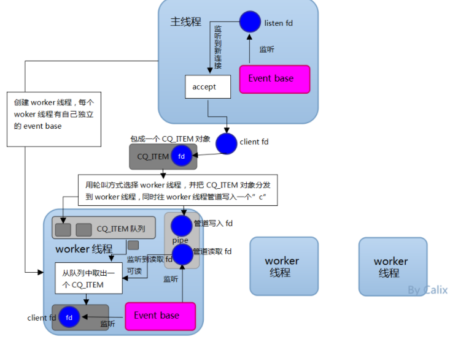

Memcached 服务器采用 master-worker 模式进行工作，服务端采用 socket 与客户端进行通讯。

主线程、工作线程 **采用 pipe 管道进行通讯**。主线程采用 libevent 监听 listen、accept 的读事件，事件响应后将连接信息的数据结构封装起来，根据算法选择合适的工作线程，将**连接任务携带连接信息分发出去**，相应的线程（worker线程）**利用连接描述符建立与客户端的socket连接 并进行后续的存取数据操作**。

Redis6.0与Memcached多线程模型对比：

- 相同点： 都采用了  master-worker线程模型

- 不同点：**Memcached 执行主逻辑也是在 worker 线程里**，模型更加简单，实现了真正的线程隔离，符合我们对线程隔离的常规理解。

  而 Redis **把处理逻辑交还给 master 线程**，虽然一定程度上增加了模型复杂度，但也***解决了线程并发安全等问题。***


## 为什么要用 Redis / 为什么要用缓存


**使用缓存是为了提升用户体验以及应对更多的用户**

:star: **高性能**：

假如用户第一次访问数据库中的某些数据的话，这个过程是比较慢，毕竟是从硬盘中读取的。但是，如果说，用户访问的数据属于高频数据并且不会经常改变的话，那么我们就可以很放心地将该用户访问的数据存在缓存中。

保证用户下一次再访问这些数据的时候就可以直接从缓存中获取了。操作缓存就是直接操作内存，所以速度相当快。


:star: **高并发**：

一般像 MySQL 这类的数据库的 QPS 大概都在 1w 左右（4 核 8g） ，但是使用 Redis 缓存之后很容易达到 10w+，甚至最高能达到 30w+（就单机 redis 的情况，redis 集群的话会更高）。

> QPS（Query Per Second）：服务器每秒可以执行的查询次数；
>

**直接操作缓存**能够承受的数据库请求数量是远**远大于直接访问数据库的**，所以我们可以考虑把数据库中的部分数据转移到缓存中去，**这样用户的一部分请求会直接到缓存这里而不用经过数据库**。进而，我们也就**提高的系统整体的并发。**


## Redis 底层数据类型都有哪些


1. 字符串 string：redis没有直接使用 C语言 传统的字符串表示，**而是自己实现的叫做简单动态字符串SDS的抽象类型。C语言的字符串不记录自身的长度信息，而SDS则保存了长度信息，这样将获取字符串长度的时间由O(N)降低到了O(1)**，同时可以避免缓冲区溢出和减少修改字符串长度时所需的内存重分配次数。

2. 链表linkedlist：redis链表是一个**双向无环链表**结构，很多**发布订阅、慢查询、监视器功能**都是使用到了链表来实现，每个链表的节点由一个**listNode**结构来表示，每个节点都有指向前置节点和后置节点的指针，同时表头节点的前置和后置节点都指向NULL。

3. 字典 hashtable：用于保存键值对的抽象数据结构。redis使用hash表作为底层实现，**每个字典带有两个hash表，供平时使用和rehash时使用**，hash表使用**链地址法来解决键冲突**，被分配到同一个索引位置的多个键值对会形成一个**单向链表**，在对hash表进行扩容或者缩容的时候，为了服务的可用性，**rehash的过程不是一次性完成的，而是渐进式的**。

4. 跳表 skiplist：跳表是有序集合的底层实现之一，redis中在实现**有序集合键和集群节点的内部结构**中都是用到了跳跃表。redis跳跃表由$zskiplist$和$zskiplistNode$组成，**zskiplist用于保存跳跃表信息**（表头、表尾节点、长度等），**zskiplistNode用于表示表跳跃节点**，每个跳跃表的层高都是1-32的**随机数（新节点加入时随机选择可深入的层级）**，在同一个跳跃表中，多个节点可以包含**相同的分值($score$)**，但是每个节点的**成员对象($value$)必须是唯一的**，节点按照分值大小排序，如果分值相同，则按照成员对象的大小排序

5. 整数集合intset：用于保存整数值的集合抽象数据结构，**不会出现重复元素，底层实现为数组**

6. 压缩列表$ziplist$：为**节约内存**而开发的**顺序性**数据结构，他可以**包含多个节点**，每个节点可以保存一个字节数组或者整数值。


基于这些基础的数据结构，redis封装了自己的对象系统，包含**字符串对象string、列表对象list、哈希对象hash、集合对象set、有序集合对象zset，每种对象都用到了至少一种基础的数据结构。**

redis通过encoding属性设置对象的编码形式来提升灵活性和效率，自动做出优化，不同对象的编码如下：

1. 字符串对象string：int整数、embstr编码的简单动态字符串、raw简单动态字符串
2. 列表对象list：ziplist、linkedlist
3. 哈希对象hash：ziplist、hashtable
4. 集合对象set：intset、hashtable
5. 有序集合对象zset：ziplist、skiplist


## Redis常见数据结构以及使用场景


---

1. String

string 数据结构是简单的 key-value 类型。虽然 Redis 是用 C 语言写的，但是 Redis 并没有使用 C 的字符串表示，而是自己构建了一种 **简单动态字符串**（simple dynamic string，**SDS**）。相比于 C 的原生字符串，Redis 的 SDS 不光可以保存文本数据还可以保存二进制数据，并且获取字符串长度复杂度为 O(1)（C 字符串为 O(N)）,除此之外,Redis 的 SDS API 是安全的，不会造成缓冲区溢出。

**常用命令**： `set,get,strlen,exists,dect,incr,setex,mset` 等等。

**应用场景**：需要计数的场景，比如用户的访问次数、热点文章的点赞转发数等等


---

2. list

**list 就是 链表**。java中有 LinkedList，但是C语言并没有实现链表，所以 Redis 实现了**自己的链表数据结构**。Redis 的 list 的实现为一个 **双向链表**，即可以支持**反向查找和遍历**，更方便操作，不过带来了部分额外的内存开销。

**是一个双向链表**

**常用命令:** `rpush,lpop,lpush,rpop,lrange、llen` 等。

**应用场景:** **发布与订阅**或者说**消息队列**、**慢查询**。


> 通过 rpush / rpop **实现栈**
>
> ```
> rpush myList2 value1 value2 value3
> ```
>
> 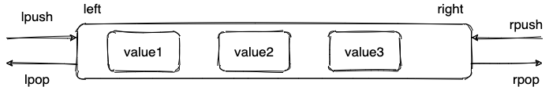


通过 `lrange` 命令，可以**基于 list 实现分页查询**，性能非常高！


---

3. hash

hash类似 jdk1.8前的 HashMap，内部实现也差不多：数组+链表。不过 Redis 的 hash 做了更多优化。

另外，hash 是一个 string 类型的 field 和 value 的映射表，**特别适合用于存储对象**，后续操作的时候，你可以直接**仅仅修改这个对象中的某个字段的值**。 比如我们可以 hash 数据结构来存储用户信息，商品信息等等。

**常用命令：** `hset,hmset,hexists,hget,hgetall,hkeys,hvals` 等。

**应用场景:** 系统中对象数据的存储。

```
127.0.0.1:6379> hset userInfoKey name "guide" description "dev" age "24"
OK
127.0.0.1:6379> hexists userInfoKey name # 查看 key 对应的 value中指定的字段是否存在。
(integer) 1
127.0.0.1:6379> hget userInfoKey name # 获取存储在哈希表中指定字段的值。
"guide"
127.0.0.1:6379> hget userInfoKey age
"24"
127.0.0.1:6379> hgetall userInfoKey # 获取在哈希表中指定 key 的所有字段和值
1) "name"
2) "guide"
3) "description"
4) "dev"
5) "age"
6) "24"
127.0.0.1:6379> hkeys userInfoKey # 获取 key 列表
1) "name"
2) "description"
3) "age"
127.0.0.1:6379> hvals userInfoKey # 获取 value 列表
1) "guide"
2) "dev"
3) "24"
127.0.0.1:6379> hset userInfoKey name "GuideGeGe" # 修改某个字段对应的值
127.0.0.1:6379> hget userInfoKey name
"GuideGeGe"
```


---

4. set

set 类似于 Java 中的 `HashSet` 。Redis 中的 set 类型是一种**无序集合**，集合中的**元素没有先后顺序**。当你需要存储一个列表数据，又**不希望出现重复数据时**，set 是一个很好的选择，并且 set 提供了判断某个成员是否在一个 set 集合内的重要接口，这个也是 list 所不能提供的。可以基于 set 轻易实现交集、并集、差集的操作。比如：你可以将一个用户所有的关注人存在一个集合中，将其所有粉丝存在一个集合。Redis 可以非常方便的实现如共同关注、共同粉丝、共同喜好等功能。这个过程也就是求交集的过程。

**常用命令：** `sadd,spop,smembers,sismember,scard,sinterstore,sunion` 等。

**应用场景:** 需要存放的数据不能重复以及需要获取多个数据源交集和并集等场景

```
127.0.0.1:6379> sadd mySet value1 value2 # 添加元素进去
(integer) 2
127.0.0.1:6379> sadd mySet value1 # 不允许有重复元素
(integer) 0
127.0.0.1:6379> smembers mySet # 查看 set 中所有的元素
1) "value1"
2) "value2"
127.0.0.1:6379> scard mySet # 查看 set 的长度
(integer) 2
127.0.0.1:6379> sismember mySet value1 # 检查某个元素是否存在set 中，只能接收单个元素
(integer) 1
127.0.0.1:6379> sadd mySet2 value2 value3
(integer) 2
127.0.0.1:6379> sinterstore mySet3 mySet mySet2 # 获取 mySet 和 mySet2 的交集并存放在 mySet3 中
(integer) 1
127.0.0.1:6379> smembers mySet3
1) "value2"
```


---

5. sorted set

和 set 相比，sorted set 增加了一个**权重参数 score**，使得集合中的元素能够按 score 进行有序排列，还可以**通过 score 的范围来获取元素的列表**。有点像是 Java 中 HashMap 和 TreeSet 的结合体。

**常用命令：** `zadd,zcard,zscore,zrange,zrevrange,zrem` 等。

**应用场景：** 需要**对数据根据某个权重进行排序的场景**。比如在直播系统中，实时排行信息包含直播间**在线用户列表，各种礼物排行榜，弹幕消息**（可以理解为按消息维度的消息排行榜）等信息。

```
127.0.0.1:6379> zadd myZset 3.0 value1 # 添加元素到 sorted set 中 3.0 为权重
(integer) 1
127.0.0.1:6379> zadd myZset 2.0 value2 1.0 value3 # 一次添加多个元素
(integer) 2
127.0.0.1:6379> zcard myZset # 查看 sorted set 中的元素数量
(integer) 3
127.0.0.1:6379> zscore myZset value1 # 查看某个 value 的权重
"3"
127.0.0.1:6379> zrange  myZset 0 -1 # 顺序输出某个范围区间的元素，0 -1 表示输出所有元素
1) "value3"
2) "value2"
3) "value1"
127.0.0.1:6379> zrange  myZset 0 1 # 顺序输出某个范围区间的元素，0 为 start  1 为 stop
1) "value3"
2) "value2"
127.0.0.1:6379> zrevrange  myZset 0 1 # 逆序输出某个范围区间的元素，0 为 start  1 为 stop
1) "value1"
2) "value2"
```


## Redis为什么快呢


Redis 的速度非常快！单机 redis 就可以支撑 10w QPS，相对于 mysql，性能是 mysql 的几十倍。速度快的原因：

1. 完全基于内存操作
2. C语言实现，**优化过的数据结构**，基于几种基础的数据结构，redis做了大量的优化，性能极高
3. 使用 **单线程，无上下文的切换成本**
4. **基于非阻塞的 IO 多路复用机制**


## Redis是单线程的，如何提高多核 CPU 的利用率


CPU 不太可能是 Redis 的瓶颈，**内存和网络采用可能是。** 

例如使用Redis的管道（pipelining）在liunx系统上运行可以达到500K的RPS(requests per second)，因此，如果您的应用程序主要使用O(N) 或者O(log(N)) 的 命令，他们**几乎不需要使用什么CPU**。

为了最大限度的使用 CPU，可以在同一个服务器部署多个 Redis 的实例，并把他们当做不同的服务器来使用，在某些时候，无论如何一个服务器是不够的，所以，如果想使用**多个CPU（多台服务器）**，你可以考虑一下分片（shard）。


## Redis没有使用多线程？为什么不使用多线程？


虽说 Redis 是单线程模型，但是实际上，**Redis 在 4.0 之后的版本就已经加入了对多线程的支持**

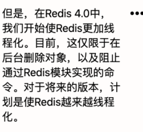

Redis4.0 增加的多线程主要是针对一些大键值对的删除操作的命令，使用这些命令就会使用 **主处理之外的其他线程来"异步处理"**

大体上来说，**Redis 6.0 之前主要还是单线程处理。**

**那，Redis6.0 之前 为什么不使用多线程？**

我觉得主要原因有下面 3 个：

1. 单线程编程容易并且**更容易维护**；
2. Redis 的**性能瓶颈不再是 CPU ，主要在内存和<网络>**；
3. 多线程就会存在**死锁、线程上下文**切换等问题，甚至会影响性能。


## 为什么 Redis6.0 之后又改用多线程呢？


redis 使用多线程 并非是完全摒弃单线程，redis还是 **使用单线程模型来处理 客户端的请求**，只是 **使用多线程来处理数据的读写和协议解析**，执行命令还是使用单线程

这样做的目的是因为redis的**性能瓶颈在于网络IO而非CPU**，使用**多线程能提升  网络IO读写  的效率**，从而整体提高redis的性能。

虽然，Redis6.0 引入了多线程，但是 Redis 的多线程只是在**网络数据的读写这类耗时操作**上使用了，**执行命令仍然是单线程顺序执行**。不需要担心线程安全问题


Redis6.0 的多线程默认是禁用的，只使用主线程。如需开启需要修改 redis 配置文件 `redis.conf` ：

```bash
io-threads-do-reads yes
```

开启多线程后，还需要设置线程数，否则是不生效的。同样需要修改 redis 配置文件 `redis.conf` :

```bash
io-threads 4 #官网建议4核的机器建议设置为2或3个线程，8核的建议设置为6个线程
```


## Redis6.0 多线程的实现机制？


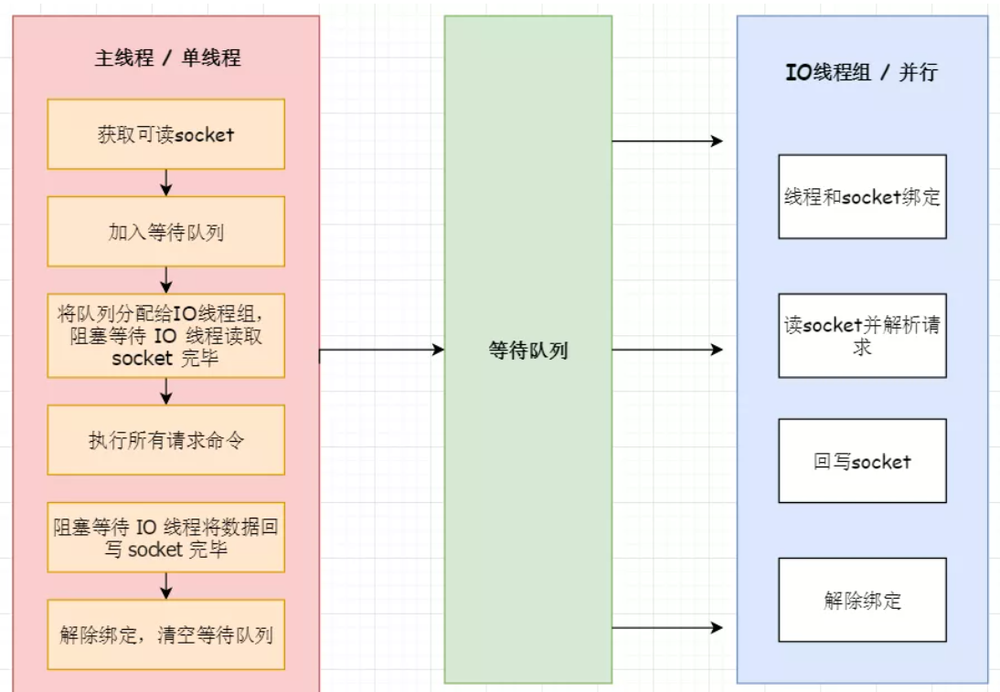


1. 主线程负责接收**建立连接请求**，获取 socket 放入 **全局等待读队列**
2. 主线程处理完读事件之后，通过 Round Robin 将这些连接分配给**这些 IO 线程**
3. **主线程阻塞等待** IO 线程**读取 socket 完毕**
4. 主线程通过**单线程的方式执行请求命令**，请求数据读取并解析完成，但并不执行
5. 主线程阻塞等待 **IO 线程将数据回写 socket 完毕**
6. 解除绑定，清空等待队列


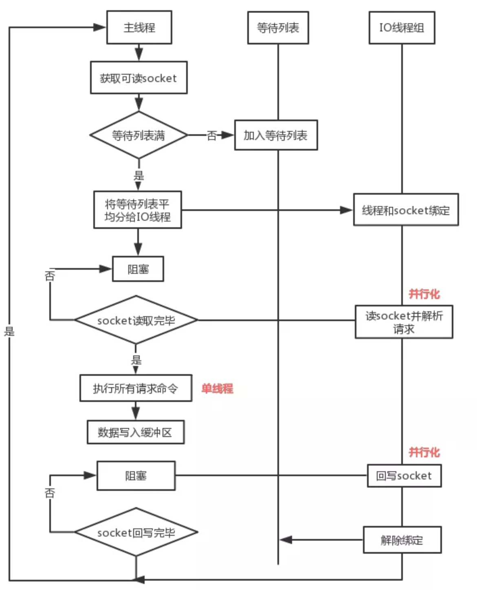


1. **IO 线程要么同时在读 socket，要么同时在写，不会同时在读或写**
2. **IO 线程只负责读写 socket 解析命令，<不负责命令处理>，**

**也就是说，Redis 的多线程部分只是用来处理网络数据的读写和协议解析，执行命令仍然是 单线程顺序执行。**

所以我们不需要去考虑控制 key、lua、事务，LPUSH/LPOP 等等的并发及线程安全问题。


## 知道热key吗？热key问题怎么解决？


热 key问题就是：突然有几十万的请求去访问 redis 上的 < **某个特定 key**>，那么这样会造成**流量过于集中，达到物理网卡上限，从而导致这台redis的服务器宕机引发雪崩**

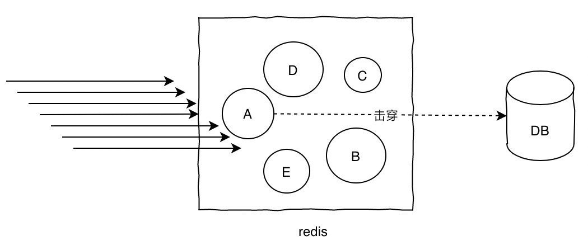


针对 热key的解决方案：

1. **提前把 热 key 打散到不同的服务器，降低压力**
2. 加入二级缓存，**提前加载热 key 数据到内存中**，如果redis宕机，走内存查询


## 什么是缓存击穿、缓存穿透、缓存雪崩？


---

### **缓存击穿**

缓存击穿的概念就是单个 key 并发量访问过高，**过期时**导致所有请求直接打到 db 上，这和 热key 的问题类似，只是说的点：在于 **<过期>导致请求全部打到 DB 上而已**

**集中式高并发访问:zap:**

解决方案：

1. **加锁更新**，基于 redis / zookeeper 实现互斥锁，等待第一个请求构建完缓存之后，再释放锁。比如请求查询 A，发现缓存中没有？**对A这个key加锁，同时去数据库查询数据，写入缓存，再返回给用户，这样后面的请求就可以从缓存中拿到数据了**
2. 将过期时间组合写在 value 中，通过异步的方式不断刷新过期时间，防止此类现象
3. 将热点数据设置为永远不过期


---

### **缓存穿透**

对于系统A，假设一秒 5000 个请求，结果其中 4000 个请求是黑客发出的恶意攻击。黑客发出的那 4000 个攻击，缓存中查不到，每次你去数据库里查，也查不到。**<u>这种恶意攻击场景的缓存穿透就会直接把数据库给打死。</u>**


是指查询**不存在缓存中的数据**，每次请求都会打到db查询，就像缓存不存在一样。

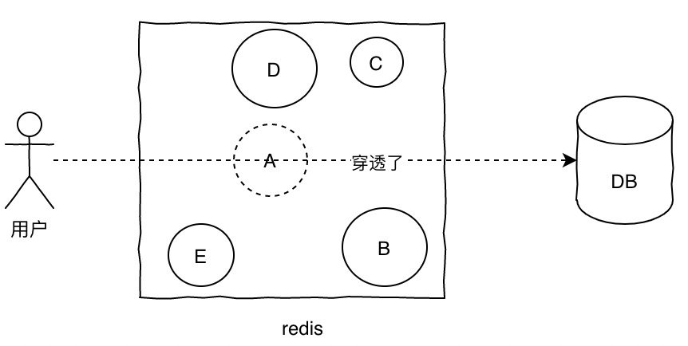


首先就是做好参数校验，一些不合法的参数请求直接抛出异常信息返回给客户端。比如查询的数据库 id 不能小于 0、传入的邮箱格式不对的时候直接返回错误消息给客户端等等。


- 方法一：**布隆过滤器**

**加一层布隆过滤器。布隆过滤器的原理是在你存入数据的时候，会通过散列函数将它映射为一个  位数组中的 K个点，同时把他们置为1**

1. 使用布隆过滤器中的哈希函数对元素值进行计算，得到哈希值（有几个哈希函数得到几个哈希值）。
2. 根据得到的哈希值，在位数组中把对应下标的值置为 1。

当用户再次来查询A：

1. 对给定元素再次进行相同的哈希计算；
2. 得到值之后判断位数组中的**每个元素是否都为 1**，如果值**都**为 1，那么说明这个值在布隆过滤器中，如果**存在一个值不为 1，说明该元素不在布隆过滤器中。**


一定会出现这样一种情况：**不同的字符串可能哈希出来的位置相同。** （可以适当增加位数组大小或者调整我们的哈希函数来降低概率）

> **布隆过滤器的问题：误判**。本身是一个数组，可能有多个值裸到同一个位置，理论上只要数组长度够长，误判的概率就会越低。出现在缓存中的值一定都可以被过滤器放过，**但没有出现过的有可能也被放过而不是直接返回**


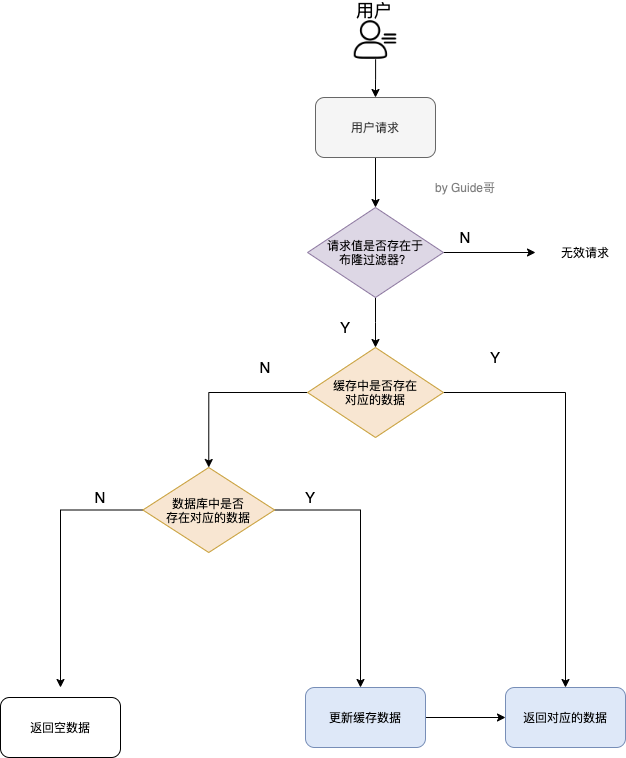


- 方法二：**缓存无效 key**

如果缓存和数据库**都查不到某个 key 的数据**，就写一个到 Redis 中去并设置过期时间。这种方式可以解决请求的 key **变化不频繁** 的情况，如果黑客恶意攻击，每次构建不同的请求 key，**会导致Redis 中缓存大量无效的 key**。那就尽量将无效的 key 的过期时间设置短一点，保证 Redis 中不会出现太多无用数据。

key 一般是这样设计的：`表名:列名:主键名:主键值`

```java
public Object getObjectInclNullById(Integer id) {
    // 从缓存中获取数据
    Object cacheValue = cache.get(id);
    // 缓存为空
    if (cacheValue == null) {
        // 从数据库中获取
        Object dbValue = db.get(key);
        // 缓存空对象
        cache.set(key, dbValue);
        // 如果存储数据为空，需要设置一个过期时间(300秒)
        if (dbValue == null) {
            // 必须设置过期时间，否则有被攻击的风险
            cache.expire(key, 60 * 5);
        }
        return dbValue;
    }
    return cacheValue;
}
```


每次系统 A 从数据库中只要没查到，就写一个空值到缓存里去，比如 `set -999 UNKNOWN`。然后设置一个过期时间，这样的话，下次有相同的 key 来访问的时候，在缓存失效之前，都可以直接从缓存中取数据。


---

### **缓存雪崩**

某一时刻发生**大规模的缓存失效**的情况，两种情况：

1. 你的**缓存服务器宕机了**，
2. **有一些被大量访问数据（热点缓存）在某一时刻大面积失效**

这两种情况发生，会有大量的请求进来直接打到 DB 上，直接可能导致整个系统的崩溃，称为雪崩。

雪崩和击穿、热 key 的问题不太一样的是，他是指**大规模的缓存都过期失效了**

> 举个例子 ：秒杀开始 12 个小时之前，我们统一存放了一批商品到 Redis 中，设置的缓存**过期时间也是 12 个小时**，那么秒杀开始的时候，**这些秒杀的商品的访问直接就失效了**。导致的情况就是，相应的请求直接就**落到了数据库上**，就像雪崩一样可怕。

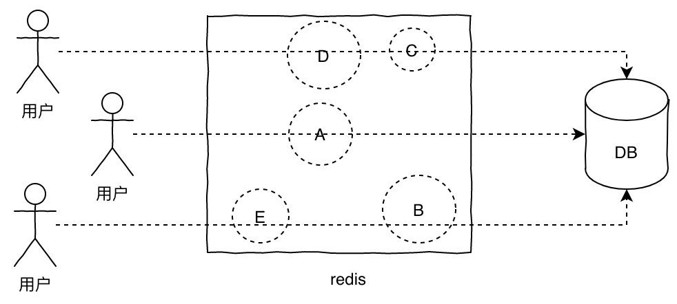


解决方案：

**针对 Redis 服务不可用的情况**：

1. 限流，如果 redis 宕机，可以**限流**，**避免同时刻大量请求打崩 数据库(Mysql...)**
2. 采用 Redis 集群，避免**单机出现问题**整个缓存服务都没办法使用。

**针对热点缓存失效的情况**：

1. 针对不同 key 设置**不同的过期时间**，避免同时过期
2. 暂时设置缓存永不失效，等暂时的高峰期过去后再将这些缓存失效
3. **二级缓存**，同 热key 方案。


- 事前：redis 高可用，主从 + 哨兵，redis  cluster，避免全盘崩溃
- 事中：本地 ehcache 缓存 + **Hystrix 限流&降级**，避免 MySQL 被打死
- 事后：redis 持久化，一旦重启，自动从磁盘上加载数据，快速恢复缓存数据。


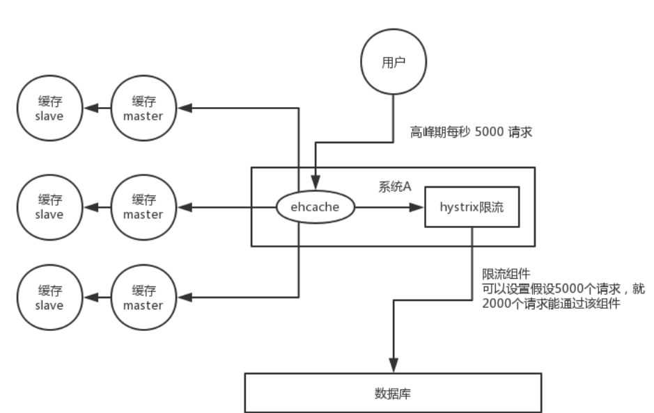


用户发送一个请求，系统 A 收到请求后，**先查本地 ehcache 缓存**，如果没查到再查 redis。如果 **ehcache** 和 redis 都没有，再查数据库，将数据库中的结果，写入 ehcache 和 redis 中。

限流组件，可以设置**每秒的请求**，有多少能通过组件，剩余的未通过的请求，怎么办？**走降级**！可以**返回一些默认的值**，或者友情提示，或者空白的值。

好处：

- 数据库绝对不会死，**「限流组件」**确保了每秒只有多少个请求能通过
- 只要数据库不死，对于用户来说，**2/5的请求都是可以被处理的**
- 只要有 2/5 的请求可以被处理，就意味着你的系统没死，对用户来说，可能就是**点击几次刷不出来页面**，但是多点几次，就可以刷出来一次


## Redis 单线程模型详解


**Redis 基于 Reactor 模式来开发了自己的一套高效的事件处理模型（Netty 的线程模型也基于 Reactor 模式，Reactor——高性能IO的神！）**


这套事件处理模型对应的是 Redis 中的文件事件处理器（file event handler）。由于文件事件处理器是 **单线程运行的**，所以一般说 Redis 是单线程模型

---

**既然是单线程，怎么监听大量的客户端连接呢？**

Redis 通过 **IO多路复用程序** 来监听来自客户端的大量连接（**监听多个 socket**），它会将**感兴趣的事件及类型**（读、写）**注册**到内核中 并 **监听每个事件是否发生**  （和 netty 基本一样）

**IO多路复用技术的使用让 Redis 不需要额外创建多余的线程来监听客户端的大量连接，降低了资源的消耗（和 NIO 中的 Selector 组件很像）**

Redis服务器是一个事件驱动程序，服务器需要处理**两类事件：1. 文件事件；2. 时间事件**

时间事件不需要多花时间了解，接触最多的还是 **文件事件**（客户端进行读取写入等操作，涉及一系列**网络通信**）。


> Redis 基于 Reactor 模式开发了自己的网络事件处理器：这个处理器被称为文件事件处理器（file event handler）。文件事件处理器使用 I/O多路复用（multiplexing）程序来同时监听多个套接字，并根据 **套接字目前执行的任务来为套接字关联不同的事件处理器**
>
> 
>
> 当被监听的套接字准备好执行连接应答（accept）、读取（read）、写入（write）、关 闭（close）等操作时，与操作相对应的文件事件就会产生，这时文件事件处理器就会调用套接字之前关联好的事件处理器来处理这些事件。
>
> **虽然文件事务处理器以单线程方式运行，但通过使用 I/O 多路复用程序来监听多个套接字**，文件事件处理器既实现了**高性能的网络通信模型**，又可以很好地与 Redis 服务器中**其他同样以单线程运行的模块进行对接**，保持了 Redis 内部单线程设计的简单性


- 文件事件处理器的结构包含 4 个部分：

  - **多个 socket**（一个server socket接收连接请求 ，很多客户端连接产生的socket）
  - IO 多路复用程序
  - **文件事件分派器**
  - **事件处理器**（连接应答处理器、命令请求处理器、命令回复处理器）


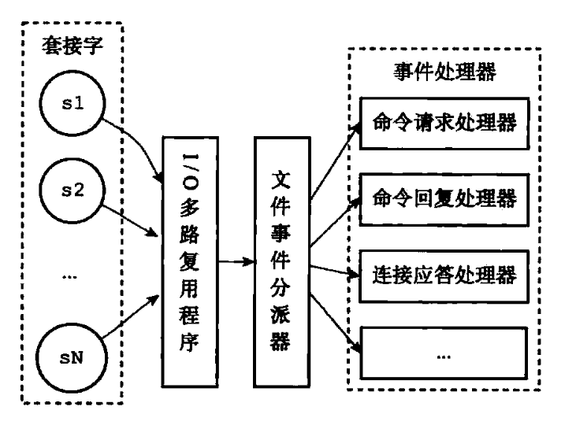


客户端与 Redis 的一次通信过程：

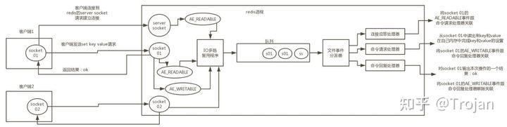

1. 客户端 Socket01 向 Redis 的 Server Socket 请求建立连接，此时 Server Socket 会产生一个 **AE_READABLE事件**，**IO多路复用程序**  监听到 Server socket 产生的事件后，将该事件**压入队列**中。**文件事件分派器**从队列中获取该事件，**交给连接应答处理器**。连接应答处理器会创建一个 **能与客户端通信的 Socket01，并将该 Socket01 的 AE_READABLE 事件与<命令请求处理器>关联。**

2. 此时客户端发送了一个 `set key value` 请求，此时 Redis 中的 Socket01 会产生 AE_READABLE 事件，IO多路复用程序将事件压入队列，此时事件分配器从队列中获取到该事件，由于前面 Socket01 的 AE_READABLE 事件已经与 **命令请求处理器** 关联，因此事件分派器 将事件交给命令请求处理器来处理。命令请求处理器读取 Socket01 的 set key value 并在自己 内存中完成 set key value 的设置。操作完成后，它会将 Socket01 的 AE_WRITABLE 事件与令 回复处理器关联。

3. 如果此时客户端准备好接收返回结果了，那么 Redis 中的 Socket01 会产生一个AE_WRITABLE 事件，同样压入队列中，事件分派器找到相关联的命令回复处理器，由命令回复处理器对 Socket01 输入本次操作的一个结果，比如 ok，之后解除 Socket01 的AE_WRITABLE 事件与命令回复处理器的关联。


----

### IO多路复用

经典的 Reactor 设计模式，也称为异步阻塞IO

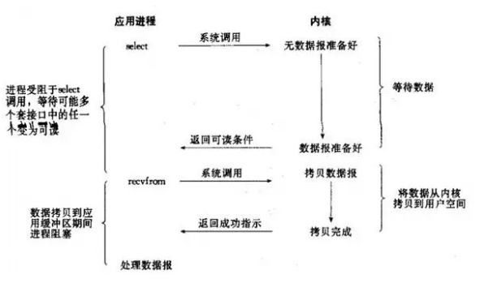

多路：多个 socket 连接，复用：复用一个线程。

多路复用主要有三种技术：select，poll，epoll。epoll是最新的也是目前最好的多路复用技术。

采用多路 I/O 复用技术可以让单个线程高效的处理多个连接请求（尽量减少网络IO的时间消耗），且Redis在内存中操作数据的速度非常快（内存内的操作不会成为这里的性能瓶颈），主要以上两点造就了Redis具有很高的吞吐量。


## Redis 给缓存数据设置过期时间有啥用？


很简单，因为内存是有限的，如果缓存中的所有数据都是一直保存的话，分分钟直接 OOM。

Redis自带了给缓存数据设置过期时间的功能：

```
127.0.0.1:6379> exp key  60 # 数据在 60s 后过期
(integer) 1
127.0.0.1:6379> setex key 60 value # 数据在 60s 后过期 (setex:[set] + [ex]pire)
OK
127.0.0.1:6379> ttl key # 查看数据还有多久过期
(integer) 56
```


**Redis除了字符串类型有自己独有设置过期时间的命令 setex 外，其他方法都需要依靠 expire 命令来设置过期时间。另外，persist 命令可以移除一个键的过期时间**


----

**过期时间除了有助于缓解内存的消耗，还有什么其他作用嘛？**

有些业务场景需要某个数据只在某一时间段内存在，比如 **短信验证码的有效期，只设置为1分钟内有效**，用户登录的 token 可能只在 1天有效

使用传统的数据库处理的话，一般都是自己判断过期


## Redis 如何判断数据是否过期的呢？


Redis 通过一个 **过期字典（hash表）来保存数据过期的时间**。过期字典的键指向 Redis数据库中的某个key，**过期字典的值**是一个 long long类型的整数，**保存了key所指向的数据库键的  过期时间（毫秒精度的UNIX时间戳）**


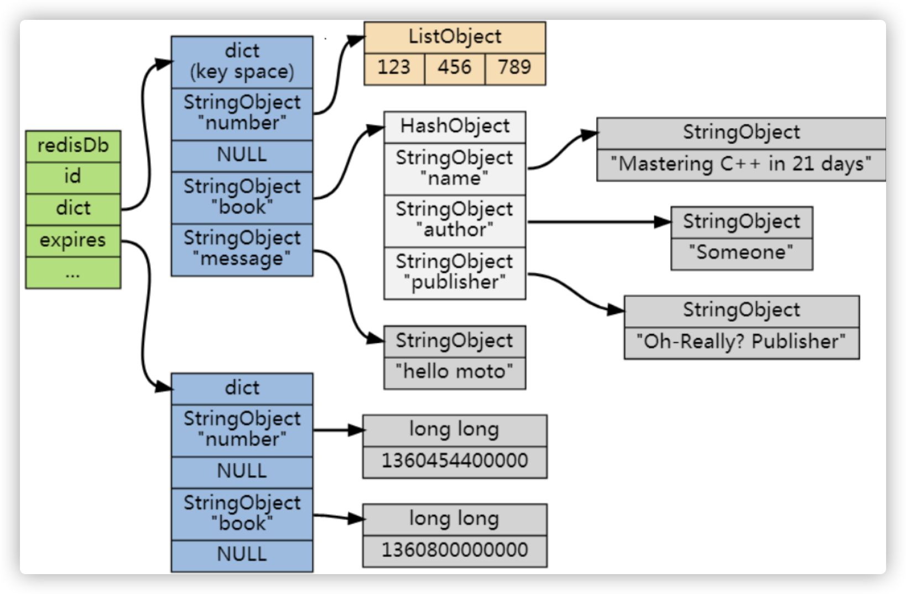

（上面的是数据字典dict，下面的是expires过期字典）

过期字典是存储在redisDb这个结构里的：

```c
typedef struct redisDb {
    ...

    dict *dict;     //数据库键空间,保存着数据库中所有键值对
    dict *expires   // 过期字典,保存着键的过期时间
    ...
} redisDb;
```


## 过期的数据的删除策略


如果假设你设置了一批 key 只能存活 1 分钟，那么 1 分钟后，Redis 是怎么对这批 key 进行删除的呢？

常用的**过期数据的删除策略**就两个：

1. **惰性删除**：只会在取出 key 的时候才对数据进行过期检查。这样对 CPU 最友好，但是可能会造成太多过期的 key 没有被删除（对内存不友好）

   他有一个缺点就是如果这些**过期的key没有被访问**，那么他就**一直无法被删除**，而且一直占用内存。

2. **定期删除**：每隔一段时间**抽取一批 key**（由于不可能对所有key去做轮询来删除） 执行删除过期 key 操作。并且，Redis 底层会 **通过限制删除操作执行时长和频率来减少删除操作对 CPU 时间的影响**


定期删除对内存比较友好，惰性删除对 CPU 更加友好。**Redis采用的是  定期删除 + 惰性/懒汉式删除**


仅仅通过给 key 设置过期时间还是有问题的，存在定期删除和惰性删除 **漏掉了** 很多过期 key的情况。导致 **大量过期 key 堆积在内存里，然后OOM**


怎么解决这个问题？-> **Redis 内存淘汰机制**


## Redis 内存淘汰机制


> 相关问题：MySQL 里有 2000w 数据，Redis 中只存 20w 的数据，如何保证 Redis 中的数据都是热点数据?（根据淘汰算法留下最经常使用的数据）


Redis 提供了 6 种 **数据淘汰策略：**

1. **volatile-lru（least recently used）**：从已设置过期时间的数据集（`server.db[i].expires`）中挑选**<u>最近最少使用</u>**的数据 淘汰掉

2. **volatile-ttl**：从已设置过期时间的数据集（`server.db[i].expires`）挑选**将要过期（存活时间TTL较短）**的数据淘汰

3. **volatile-random**：从已设置过期时间的数据集（`server.db[i].expires`）选择任意数据淘汰

4. **allkeys-lru（least recently used）**：当内存**不足以容纳**新写入的数据时，在 **键空间**中，移除最近最少使用的 key（**常用**）

5. **allkeys-random**：从数据集（server.db[i].dict）中**任意选择数据**淘汰

6. **no-eviction**：禁止驱逐数据，也就是说当内存不足以容纳新写入数据时，**新写入操作会报错**。


4.0 版本后增加以下两种：

1. **volatile-lfu（least frequently used）**：从已设置过期时间的数据集(server.db[i].expires)中挑选**最不经常使用**的数据淘汰
2. **allkeys-lfu（least frequently used）**：当**内存不足**以容纳新写入数据时，在**键空间**中，移除最不经常使用的 key


## Redis 持久化机制


需要持久化数据，将内存中的数据写入到硬盘中，为了之后重用数据（重启机器、机器故障之后恢复数据），或者防止系统故障将数据备份到远程位置


Redis 不同于 Memcached 很重要的一点就是：Redis支持持久化，而且是两种持久化方式：**快照（snapshotting，RDB），只追加文件（append-only file, AOF）**


---

**RDB  快照持久化 【全量】**

**是 Redis 默认采用的持久化方式**

可以手动执行也可以根据配置定期执行，它的作用是将某个时间点上的数据库状态保存到 RDB 文件中，RDB文件是一个**【压缩的二进制文件】**，通过它可以**还原某个时刻数据库的状态**。由于RDB文件是**保存在硬盘上**的，所以即使redis崩溃或者退出，只要RDB文件存在，就可以用它来恢复还原数据库的状态。

可以**通过 `SAVE` 或者 `BGSAVE` 来手动生成RDB文件。**

> `SAVE`命令会**阻塞redis进程**，直到RDB文件生成完毕，在进程阻塞期间，redis不能处理任何命令请求，这显然是不合适的。
>
> `BGSAVE`则是会**【fork出一个子进程】**，然后由**子进程去负责生成RDB临时文件**，父进程还可以继续处理命令请求，**不会阻塞进程。**写入成功后，再替换之前的文件。
>
> **主从同步使用的是 bgsave**


自动备份：在 Redis.conf 配置文件中默认有此下配置：

```bash
save 900 1           #在900秒(15分钟)之后，如果至少有1个key发生变化，Redis就会自动触发BGSAVE命令创建快照。

save 300 10          #在300秒(5分钟)之后，如果至少有10个key发生变化，Redis就会自动触发BGSAVE命令创建快照。

save 60 10000        #在60秒(1分钟)之后，如果至少有10000个key发生变化，Redis就会自动触发BGSAVE命令创建快照。
```


优点：

- 灵活设置**备份频率和周期**。你可能打算每个小时归档一次最近 24 小时的数据，同时还要每天归档一次最近 30 天的数据。通过这样的备份策略，一旦系统出现灾难性故障，我们可以非常容易的进行恢复。
- 非常适合**冷备份**，对于**灾难恢复**而言，RDB 是非常不错的选择。因为我们可以非常轻松的将一个单独的文件压缩后再转移到其它存储介质上。推荐，可以将这种完整的数据文件发送到一些远程的安全存储上去，比如说 Amazon 的 S3 云服务上去，在国内可以是阿里云的 OSS 分布式存储上。
- **性能**最大化。对于 Redis 的服务进程而言，在开始持久化时，它唯一需要做的只是 **fork 出子进程**，之后再由子进程完成这些持久化的工作，这样就可以极大的避免服务进程执行 IO 操作了。也就是说，RDB 对 Redis 对外提供的读写服务，影响非常小，**可以让 Redis 保持高性能**。
- **恢复更快**。相比于 AOF 机制，RDB 的恢复速度更更快，更适合恢复数据，**特别是在数据集非常大的情况。**


缺点：

- 保证数据的高可用性：即最大限度的避免数据丢失，那么 RDB 不是很好的选择。在定时持久化之前出现宕机现象，**此前没有来得及写入磁盘的数据都将丢失。** **需要和 AOF 配合使用**
- RDB 是通过 fork 子进程来协助完成数据持久化工作的，因此，如果当数据集较大时，可能会**导致整个服务器停止服务几百毫秒，甚至是 1 秒钟**。所以，RDB 建议在业务低谷，例如在半夜执行。


---

**AOF（append-only file）持久化**

AOF和RDB不同，AOF是通过**保存redis服务器所执行的写命令**来记录数据库状态的。查询操作不会记录

AOF 持久化的**实时性**更好。默认是没开启的，可以通过 appendonly 参数开启：

```conf
appendonly yes
```


开启aof 持久化后，每执行一条会更改 Redis 中的数据的命令，Redis**都会将该命令写入磁盘的 AOF 文件**。

AOF 文件的保存位置和 RDB 文件的位置相同。都是通过 **dir 参数**设置的，**默认的文件名是 appendonly.aof**。


AOF通过追加、写入、同步三个步骤来实现持久化机制。

1. 当 AOF 持久化处于激活状态，服务器执行完写命令后，写命令将会被追加 append 到 aof_buf缓冲区的末尾
2. 在服务器每结束一个事件循环之前，将会调用 `flushAppendOnlyFile` 函数决定是否要**将 aof_buf 的内容保存到 AOF 文件中**，这个可以通过配置`appendfsync` 参数来决定：**存在三种不同的 AOF 持久化方式：**

```bash
appendfsync always    #每次有数据修改发生时都会写入AOF文件,这样会严重降低Redis的速度
appendfsync everysec  #每秒钟同步一次，显示地将多个写命令 同步到硬盘  默认选项
appendfsync no        #让操作系统决定何时进行同步
```

> 虽然 always 最安全，**只会丢失一次事件循环的写命令**，但性能较差。

为了兼顾数据和写入性能，用户可以考虑 `appendfsync everysec` 选项 ，让 Redis **每秒同步一次 AOF 文件**，Redis **性能几乎没受到任何影响**。而且这样即使出现系统崩溃，用户**最多只会丢失一秒之内产生的数据**。当硬盘忙于执行写入操作的时候，Redis 还会优雅的放慢自己的速度以便适应硬盘的最大写入速度。

> 当磁盘无法满足写入速度，并且后台 `fsync(2)` 调用花费的时间超过 1 秒时，那么 `Redis` 可能会将该次 `AOF` 写入操作延迟最多一秒钟后执行（延迟是为了避免该写入操作会阻塞主线程，因为 `fsync(2)` 在后台线程是针对同一文件描述符运行的)。但是如果 `fsync(2)` 在这两秒内都没有正常执行完，那么 `Redis` 最终将强行执行（可能阻塞）`write(2)` 函数以将数据正确的传输到磁盘。


AOF优点：

- 带来更高的数据安全性（持久性），提供了 3 种同步策略，即每秒同步、每修改(执行一个命令)同步和不同步。

  - **每秒同步也是异步完成的**，效率很高，会损失这一秒内的数据
  - **每次修改同步，同步持久化**，效率最低

- 该机制对日志文件的写入操作采用的是 **append 模式**，因此在写入过程中即使出现宕机现象，也**不会破坏日志文件中已经存在的内容。**

  - **没有任何磁盘寻址的开销，写入性能非常高**
  - 如果没有将操作写全就系统崩溃了，在 Redis 下一次启动之前，**会检查aof 文件的格式，可以通过redis-check-aof 工具来帮助我们解决数据一致性的问题**

- 如果 aof 日志过大，Redis 可以自动启动 rewrite 机制。

  即使出现后台重写操作，也**不会影响客户端的读写**。因为在 rewrite log 的时候，会对其中的指令进行压缩，**创建出一份需要恢复数据的最小日志出来**。再创建新日志文件的时候，**新的操作写入 AOF 重写缓冲区**。当新的 merge 后的日志文件 ready 的时候，再**交换新老日志文件即可**。

- AOF 包含一个格式清晰、**易于理解（人能看懂的！）**的日志文件用于记录所有的修改操作。事实上，我们也可以通过该文件完成数据的重建。


aof 缺点：

- 对于相同数量的数据集而言，**AOF 文件通常要大于 RDB 文件**。RDB 在**恢复大数据集时的速度比 AOF 的恢复速度要快。**

- 类似 AOF 这种较为复杂的基于命令日志/merge/回放的方式，比基于 RDB 每次持久化一份完整的数据快照文件的方式，更加脆弱一些，容易有 bug。

  不过 AOF 就是为了避免 rewrite 过程导致的 bug，因此每次 rewrite **并不是基于旧的指令日志**进行 merge 的，而是**基于当时内存中的数据进行指令的重新构建**，这样健壮性会好很多。


---

**Redis 4.0 对于持久化机制的优化**


Redis 4.0 开始支持 **RDB 和 AOF 的混合持久化**（默认关闭，可以通过配置项 `aof-use-rdb-preamble` 开启）。

如果把混合持久化打开，AOF 重写的时候就**直接把 RDB 的内容写到 AOF 文件开头**。这样做的好处是可以**结合 RDB 和 AOF 的优点**, 快速加载同时避免丢失过多的数据。

当然缺点也是有的， **AOF 里面的 RDB 部分是压缩格式不再是 AOF 格式，可读性较差。**


----

**AOF重写**

AOF 重写可以**产生一个新的 AOF 文件**，这个新的 AOF 文件和原有的 AOF 文件所保存的数据库状态一样，**但体积更小**。

"AOF 重写"  是一个有歧义的名字，该功能是**通过读取数据库中的键值对来实现的，程序无须对现有 AOF 文件进行任何读入、分析或者写入操作。**

在**执行 `BGREWRITEAOF` 命令**时，Redis 服务器会**维护一个 AOF 重写缓冲区**，该缓冲区会在**子进程**创建新 AOF 文件**期间**，**记录服务器执行的所有写命令**。当子进程完成创建新 AOF 文件的工作之后，服务器会**将重写缓冲区中的所有内容追加到新 AOF 文件的末尾**，使得新旧两个 AOF 文件所保存的数据库状态一致。最后，服务器**用新的 AOF 文件替换旧的 AOF 文件**，以此来完成 AOF 文件重写操作


### bgsave 的原理？


fork 和 cow。fork 是指 Redis **通过创建子进程来进行 bgsave 操作**。cow指的是 copy on write，子进程创建之后，**父子进程共享数据段，父进程继续提供读写服务，写脏的页面数据会逐渐和子进程分离开来**。这里 bgsave 操作后，会产生 RDB 快照文件。


## Redis 事务


Redis 可以通过 **MULTI，EXEC，DISCARD 和 WATCH**等命令来实现事务 (transaction) 功能


使用 [MULTI](https://redis.io/commands/multi)命令后可以输入多个命令。**Redis不会立即执行这些命令**，而是将它们**放到队列**，当调用了[EXEC](https://redis.io/commands/exec)命令将**执行该队列中的所有命令**。

https://redis.io/topics/transactions


---

**WATCH命令**

- 一个客户端对某个**数据 x 进行了 watch** 操作，然后开启事务A

- 另一个客户端**对数据 x 进行修改**，此时事务 A **还未提交**

- 这时提交事务 A，该事务执行失败

本次的事务将**被打断->失效**，类似于**乐观锁**

当被监控的数据发生改变后，开启的事务执行是无法成功的，**只有被监控的数据不发生变化，事务才能正常执行。**

UNWATCH：清除所有先前为一个事务监控的键。


当收到客户端EXEC命令时，**WATCH命令监视整个事务中的key是否有被修改**，如果有则返回空回复到客户端**表示失败**；否则redis会遍历整个事务队列，**执行队列中保存的所有命令**，最后返回结果给客户端


----

Redis 的事务和关系型数据库的事务不同。

事务具有四大特性：ACID： 原子性、隔离性、持久性、一致性

**Redis 是不支持 roll back 的，因而不满足原子性，也不满足持久性**

> Redis官网也解释了自己为啥不支持回滚。简单来说就是Redis开发者们觉得没必要支持回滚，这样更简单便捷并且性能更好。Redis开发者觉得即使命令执行错误也应该**在开发过程中就被发现**而不是生产过程中。
>
> （1）大多数事务失败是因为**语法错误或者类型错误**，这两种错误，在开发阶段都是可以预见的。
>
> （2）Redis 为了**性能方面**就忽略了事务回滚。

你可以将Redis中的事务就理解为 ：**Redis事务提供了一种将多个命令请求打包的功能。然后，再按顺序执行打包的所有命令，并且不会被中途打断。**


但是我们要注意一个点就是：Redis 事务**不支持检查那些程序员自己逻辑错误**。例如**对 String 类型的数据库键执行对 HashMap 类型的操作**！

：


### 事务失败处理


1. 若在事务队列中存在命令性错误（类似于**java编译期错误**），则执行EXEC命令时，就会报错，**所有命令都不会执行**，包括队列中正确的命令也不会被执行。


2. 若在事务队列中存在**语法性**错误（类似于java的**运行时异常**），则执行EXEC命令时，其他正确命令会被执行，错误命令抛出异常。

   **这种错误不是命令错误，而是因为对命令理解不透彻出现的使用错误，在执行过程中会报错，Redis开发者对于这种错误不予理会，认为是开发者可以避免的！**


## 如何保证缓存和数据库数据的一致性


> 个人觉得引入缓存之后，如果为了短时间的不一致性问题，选择让系统设计变得更加复杂的话，完全没必要。


1. **Cache Aside Pattern（旁路缓存模式）**


Cache Aside Pattern 中遇到写请求是这样的：更新 DB，然后直接删除 cache 。

如果更新数据库成功，而删除缓存这一步失败的情况的话，简单说两个解决方案：

1. **缓存失效时间变短（不推荐，治标不治本）** ：我们让缓存数据的过期时间变短，这样的话缓存就会从数据库中加载数据。另外，这种解决办法对于先操作缓存后操作数据库的场景不适用。
2. **增加cache更新重试机制（常用）**： 如果 cache 服务当前不可用导致缓存删除失败的话，我们就隔一段时间进行重试，重试次数可以自己定。如果多次重试还是失败的话，我们可以把当前更新失败的 key 存入队列中，等缓存服务可用之后，再将 缓存中对应的 key 删除即可。


## 如何实现 Redis 的高可用


要实现高可用，一台机器肯定不够。redis 保证高可用，有两个方案：


### 主从架构

主从模式是最简单的实现高可用的方案，核心就是主从同步。主从同步的原理：

1. slave 发送 **sync 命令** 到 master
2. master 收到 sync 之后，生成 RDB 全量备份文件（**bgsave**）
3. master 把 **slave 的写命令**记录到**缓存（内存buffer）**
4. bgsave 执行完毕之后，发送 **RDB 文件到 slave**，slave接收完成后**将 rdb 镜像加载到内存**
5. 加载完成后，master发送**缓存中的写命令**到 salve，slave执行这些操作记录，进行重放，就**完成了同步**

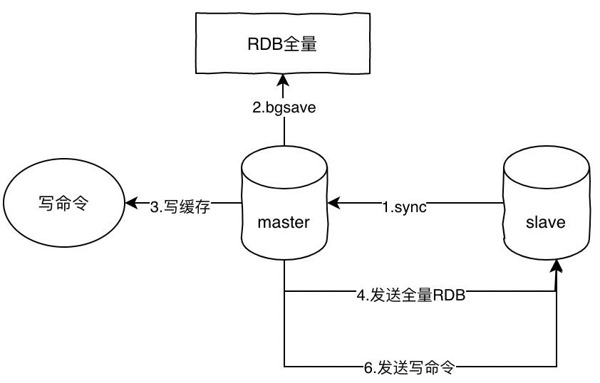

> 在redis2.8版本之后已经使用psync来替代sync了，原因是sync命令非常消耗系统资源，而psync的效率更高。


### 哨兵

主从方案的缺点很明显，**假如 master 宕机**，那么就不能写入数据，那么 slave 也就失去了作用，整个架构就不可用了，**除非手动切换，主要原因就是没有故障转移机制**

哨兵（Sentinel）的功能比单纯的主从架构全面的多了，它具备自动故障转移、集群监控、消息通知等功能。

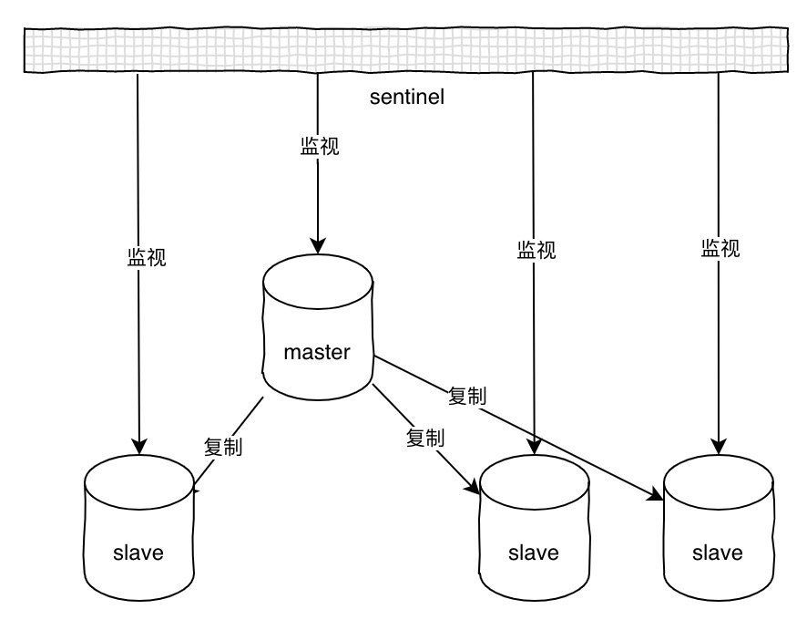


哨兵可以同时监视多个主从服务器，并且**在被监视的 master 下线时，自动将某个 slave 提升为 master，然后由新的 master 继续接收命令**

1. 初始化 Sentinel，将普通的 redis 代码替换成 sentinel 专用代码
2. 初始化 master 字典和服务器信息，服务器信息主要**保存ip:port**，并记录实例的地址和 ID
3. 创建跟 master 的两个连接：**命令连接和订阅连接**，并且订阅 sentinel:hello 频道
4. 每隔 10s 向master发送 info 命令，获取master和它下面所有slave的当前信息
5. 当发现master有新的slave之后，s**entinel和新的slave同样建立两个连接**，同时每隔10秒发送info命令，更新master信息
6. sentinel**每隔1秒向所有服务器发送ping命令**，如果某台服务器在配置的响应时间内连续返回无效回复，将会**被标记为下线状态**
7. 选举出**领头sentinel**，**领头sentinel需要半数以上的sentinel同意**
8. 领头sentinel从已下线的的master所有slave中挑选一个，将其转换为master
9. 让所有的slave改为**从新的master复制数据**
10. 将原来的master设置为新的master的从服务器，当原来master重新回复连接时，就变成了新master的**从服务器**


sentinel每隔1s 向所有实例（**包括主从服务器和其他sentinel**）发送 **ping命令**，并且根据回复判断是否已经下线，**这种方式叫做主观下线**。当判断为主观下线时，就会**向其他监视的sentinel询问**，如果超过半数的投票认为已经是下线状态，则会**标记为客观下线**状态，同时触发故障转移。


## redis 集群的原理


依靠哨兵架构可以实现 redis 的高可用，**如果还想再支持高并发同时容量海量的数据，就需要 redis 集群**。redis 集群是 redis 提供的**分布式数据存储方案**，集群通过数据分片 sharding 来进行数据的共享，同时提供复制和故障转移的功能。


---

**节点**

**一个 redis 集群由多个节点 node 组成**，而多个 node 之间通过 **cluster meet** 命令来进行连接，**节点的握手过程：**

1. 节点 A 收到**客户端的 cluster meet 命令**
2. A根据收到的IP地址和端口号，向B发送一条meet消息
3. 节点B收到meet消息返回pong
4. **A知道B收到了meet消息，返回一条ping消息**，握手成功（类似TCP三次握手）
5. 最后，节点A将会通过gossip协议把节点B的信息传播给集群中的其他节点，其他节点也将和B进行握手


---

**槽 slot**

redis 通过集群分片的形式来保存数据，整个**集群数据被分为 16384 个 slot**，集群中的每个节点可以处理：0-16383 个slot，当数据库 16384 个slot 都有节点在处理时，**集群处于上线状态**，**反之只要有 slot 没有得到处理都会处理下线状态**。

通过 `cluster addslots` 命令可以**将 slot 指派给对应节点处理**。


slot是一个位数组（byte表示），数组的长度是 16384/8 = 2048，而数组的**每一位用1表示被节点处理，0表示不处理**，

如图所示：表示 A节点处理 0-7 的slot。


当客户端向节点发送命令，如果刚好找到slot属于当前节点，那么节点就执行命令，反之，则会**返回一个MOVED命令**到客户端指引客户端转向正确的节点。（MOVED过程是自动的）

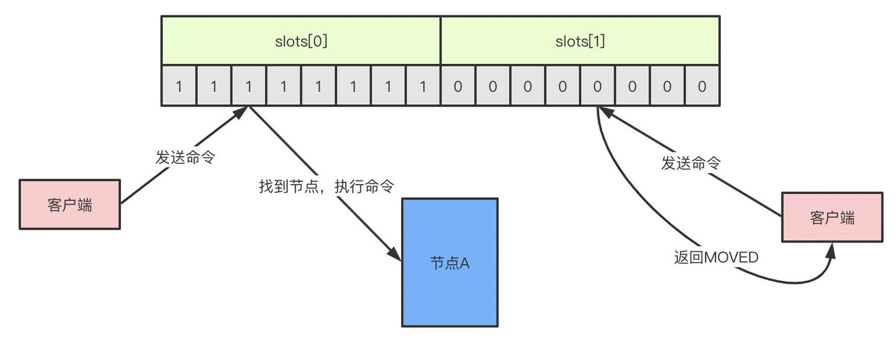


如果增加或者移出节点，对于slot的重新分配也是非常方便的，redis提供了工具帮助实现slot的迁移，**整个过程是完全在线的，不需要停止服务。**


---

**故障转移**

如果节点A向节点B发送ping消息，节点B没有在规定的时间内响应pong，那么节点A会标记节点B为pfail疑似下线状态，同时把B的状态通过消息的形式发送给其他节点，如果超过半数以上的节点都标记B为pfail状态，B就会被标记为fail下线状态，此时将会发生故障转移，优先从复制数据较多的从节点选择一个成为主节点，并且接管下线节点的slot，**整个过程和哨兵非常类似，都是基于Raft协议做选举。**


## Redis 有哪些客户端？


---

**Jedis**

Jedis **多个线程使用一个连接的时候线程不安全**。可以使用连接池，为每个请求创建不同的连接，基于 Apache common pool 实现。跟数据库一样，可以设置最大连接数等参数。Jedis 中有多种连接池的子类

Jedis 有 4 种工作模式：单节点、分片、哨兵、集群。

3 种请求模式：Client、Pipeline、事务。

Client 模式就是客户端发送一个命令，阻塞等待服务端执行，然后读取 返回结果。

Pipeline 模式是**一次性发送多个命令**，最后一次**取回所有的返回结果**，这种模式通过**减少网络的往返时间和 io 读写次数**，大幅度提高通信性能。

第三种是事务模式。Transaction 模式已开启 Redis 的事务管理，事务模式开启后，所有的命令（除了 exec，discard，multi 和 watch）到达服务端以后不会立即执行，会进入一个等待队列。


---

**Lettuce**

与 Jedis 相比，Lettuce 则完全**克服了其线程不安全的缺点**：Lettuce 是一个可伸缩的线程安全的 Redis 客户端，支持同步、异步和响应式模式（Reactive）。**多个线程可以共享一个连接实例，而不必担心多线程并发问题。**

同步调用：异步的结果使用 RedisFuture 包装，提供了大量回调的方法。

**异步调用**：它**基于 Netty 框架**构建，支持 Redis 的高级功能，如 Pipeline、发布订阅，事务、Sentinel，集群，支持连接池。

**Lettuce 是 Spring Boot 2.x 默认的客户端**，替换了 Jedis。集成之后我们不需要单独使用它，**直接调用 Spring 的 RedisTemplate 操作**，连接和创建和关闭也不需要我们操心。


---

**Redisson**

是一个在 Redis 的基础上实现的 Java 驻内存数据网格（In-Memory Data Grid），提供了分布式和可扩展的 Java 数据结构。


1. **基于 Netty** 实现，采用非阻塞 IO，性能高
2. 支持**异步**请求
3. 支持连接池、pipeline、LUA Scripting、Redis Sentinel、Redis Cluster 不支持事务，官方建议以 LUA Scripting 代替事务
4. **主从、哨兵、集群都支持**。Spring 也可以**配置和注入 RedissonClient**。


**在 Redisson 里面提供了更加简单的分布式锁的实现。**


## 如何使用 Redis 实现分布式锁？


1、`setnx(String key,String value)`

若返回1，说明设置成功，**获取到锁**；

若返回0，说明设置失败，已经有了这个key，**说明其它线程持有锁，循环重试**。

2、`expire(String key, int seconds)`

获取到锁（返回1）后，还需要用设置生存期，如果在多少秒内没有完成，**比如发生机器故障、网络故障等，键值对过期，释放锁，实现高可用。**

3、`del(String key)`

**完成业务后需要释放锁**。释放锁有2种方式：del删除key，或者expire将有效期设置为0（马上过期）。

在执行业务过程中，如果发生异常，不能继续往下执行，也应该马上释放锁。

如果你的项目中Redis是**多机部署**的，那么可以尝试使用**Redisson**实现分布式锁，这是Redis官方提供的Java组件。


## 使用 Redis 实现分布式限流


# Redis 数据结构


Redis有5个基本数据结构，string、list、hash、set和zset


## String


string表示一个可变的字节数组，初始化字符串的时候，**可以拿到字符串的长度，可以获取string的子串，可以覆盖子串内容，可以追加子串**


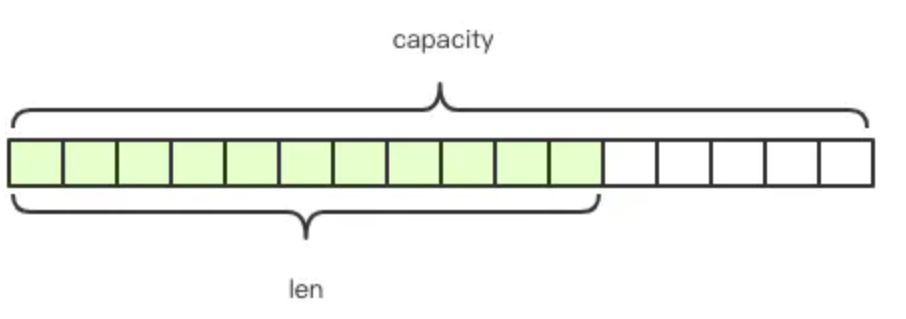

**Redis 的字符串是动态字符串，是可以修改的字符串**，**内部结构类似java的ArrayList**，采用预分配冗余空间的方式来减少内存的频繁分配，如上图所示，内部为当前字符串实际分配的空间，capacity一般要高于实际字符串长度len。当字符串长度小于1M时，扩容都是**加倍现有的空间**，如果超过1M，扩容时一次只会多扩1M的空间。

**需要注意的是字符串最大长度为512M。**

- 初始化字符串：`set key val`

- 获取字符串的内容：`get key`

- 获取字符串的长度：`strlen key`

- 获取子串，提供「变量名称」以及开始和结束位置[start, end]：`getrange key start end`

- **覆盖子串**,  提供「变量名称」以及开始位置和目标子串：`setrange key start str`

- **追加子串**：`append key str`

- **计数器**：如果字符串的内容是一个整数，那么还可以将字符串当成计数器来使用。`incrby key num`，`decrby key num`，`incr/decr key` 等价于 `incrby key 1`

  **计数器是有范围的，不能超过 Long.MAX，不能低于 Long.MIN**

  ```bash
  > set ireader 9223372036854775807
  OK
  > incr ireader
  (error) ERR increment or decrement would overflow
  > set ireader -9223372036854775808
  OK
  > decr ireader
  (error) ERR increment or decrement would overflow
  ```

- **过期和删除**，字符串可以使用del指令进行主动删除；可以使用expire指令设置过期时间，到点会自动删除，这属于被动删除。

  可以使用**ttl指令获取字符串的寿命。**

  ```bash
  > expire ireader 60
  (integer) 1  # 1表示设置成功，0表示变量ireader不存在
  > ttl ireader
  (integer) 50  # 还有50秒的寿命，返回-2表示变量不存在，-1表示没有设置过期时间
  > del ireader
  (integer) 1  # 删除成功返回1
  > get ireader
  (nil)  # 变量ireader没有了
  ```

  

## List


Redis 将列表数据结构命名为 list 而不是 array，是因为**列表的存储结构用的是链表而不是数组**，而且链表还是**双向链表**。因为它是链表，**所以随机定位性能较弱，首尾插入性能较优**

如果list的列表长度很长，使用时需要关注链表操作的时间复杂度


**负下标**：链表元素的位置使用自然数`0,1,2,....n-1`表示，还可以**使用负数**`-1,-2,...-n`来表示，**`-1`表示「倒数第一」，`-2`表示「倒数第二」**，那么**`-n`就表示第一个元素，对应的下标为`0`**。


**队列 / 堆栈**：链表可以从表头和表尾追加和溢出元素，结合使用 rpush/rpop/lpush/lpop四条指令，可以**将链表作为队列或堆栈使用**。

```bash
# 右进左出
> rpush queue go
(integer) 1
> rpush queue java python
(integer) 3
> lpop queue
"go"
> lpop queue
"java"
> lpop queue
"python"

# 左进右出 同上
> lpush queue go java python
(integer) 3
> rpop queue
"go"
...

# 右进右出
> rpush stack go java python
(integer) 3
> rpop stack 
"python"
...

# 左进左出
```

**列表常用来作为异步队列使用**


- **长度：**使用 `llen` 获取链表长度


- **随机读**：可以使用 **`lindex` 指令**访问指定位置的元素，使用 `lrange` （**没有 rrange**）指令获取 **链表子子元素列表**，提供start和end下标参数

> 使用 `lrange` 获取全部元素时，需要提供 end_index，如果没有负下标，就需要首先**通过llen指令获取长度，才可以得出end_index的值**，有了负下标，使用-**1代替end_index就可以达到相同的效果**。


- **修改元素**：使用 `lset` 指令在指定位置修改元素 `lset list index string`


- **插入元素**：使用linsert指令在列表的中间位置插入元素，有经验的程序员都知道在插入元素时，我们经常搞不清楚是在指定位置的前面插入还是后面插入，所以antirez在 `linsert` 指令里**增加了方向参数`before/after`来显示指示前置和后置插入**。不过让人意想不到的是linsert指令**并不是通过指定<位置>来插入**，而是**通过指定具体的值**。这是因为在分布式环境下，列表的元素**总是频繁变动**的，意味着上一时刻计算的元素下标在**下一时刻可能就不是你所期望的下标了**。

  **并且值和位置下标的效率其实是一样的！因为是链表结构，都需要**

  ```bash
  > rpush ireader go java python
  (integer) 3
  > linsert ireader before java ruby
  (integer) 4
  > lrange ireader 0 -1
  1) "go"
  2) "ruby"
  3) "java"
  4) "python"
  ```

  

- 删除元素：列表的删除操作也**不是通过指定下标来确定元素**的，你需要指定**删除的最大个数以及元素的值**

  ```bash
  > rpush ireader go java python
  (integer) 3
  > lrem ireader 1 java
  (integer) 1
  > lrange ireader 0 -1
  1) "go"
  2) "python"
  ```

  

- 定长列表：有时候会遇到「定长列表」的需求。比如要以走马灯的形式实时显示中奖用户名列表，因为中奖用户实在太多，能显示的数量一般不超过100条，那么这里就会使用到定长列表。维持定长列表的指令是`ltrim`，需要**提供两个参数start和end**，**表示需要保留列表的下标范围，范围之外的所有元素都将被移除。**

  ```bash
  > rpush ireader go java python javascript ruby erlang rust cpp
  (integer) 8
  > ltrim ireader -3 -1 #截取最后三个，其他的都抛弃
  OK
  > lrange ireader 0 -1
  1) "erlang"
  2) "rust"
  3) "cpp"
  ```

  > **如果指定参数的end对应的真实下标小于start，其效果等价于del指令，会删除该list，因为这样的参数表示需要需要保留列表元素的下标范围为空。**


- **快速列表**：

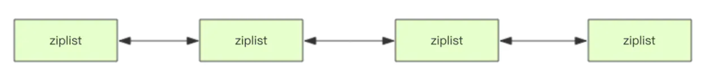

Redis 底层存储的还不是一个简单的 linkedlist，而是 **称之为快速链表 quicklist 的一个结构**。 

首先在列表元素较少的情况下会 **使用一块连续的内存存储，这个结构是 ziplist，即：压缩列表。`ziplist` 将所有的元素紧挨着一起存储，分配的是一块连续的内存（类似数组的存储结构）。当数据量比较多的时候才会改成 quicklist。 **

因为普通的链表需要的**附加指针空间太大**，会**比较浪费空间**。比如这个列表里存的只是 int类型的数据，结构上还需要 **两个额外的指针prev 和 next**。

所以 **Redis将链表和 ziplist 结合起来组成了 quicklist**。也就是**将多个 ziplist 使用双向指针串起来使用**。既满足了 快速的插入删除性能，又不会出现太大的空间冗余


## hash


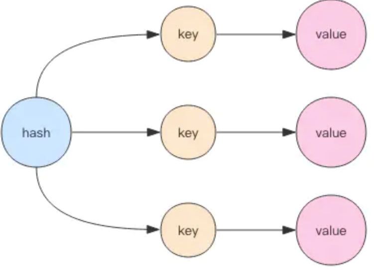

哈希等价于 java 语言的 HashMap或者是 Python 语言的 dict，**在实现结构上它使用二维结构：第一维是数组，第二维是链表**，hash的内容 key 和 value 存放在链表中，数组里存放的是 **链表的头指针**。通过 key 查找元素时，先计算 key 的 hashcode，然后用 hashcode 对数组的长度进行取模定位到 链表的表头，**再对链表进行遍历获取到响应的 value 值**。

**链表的作用就是用来将产生了「hash碰撞」的元素串起来**

**哈希的第一维数组的长度也是2^n。**

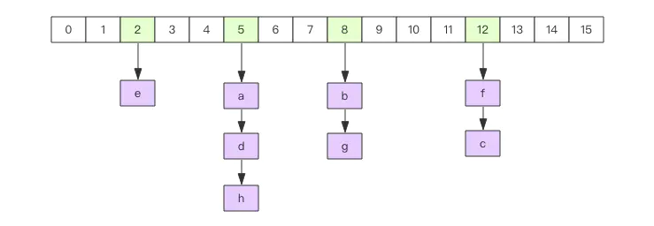


- **增加元素**：可以使用 `hset` 一次增加**一个键值对**，也可以使用 `hmset` 一次增加多个键值对


- **获取元素**：可以通过 `hget` 定位具体 key 对应的 value，可以通过hmget获取多个key对应的value，可以使用hgetall获取所有的键值对，可以使用hkeys和hvals分别获取所有的key列表和value列表。这些操作和Java语言的Map接口是类似的。

  ```bash
  > hmset hash go fast java fast python slow
  OK
  > hget hash go
  "fast"
  > hmget hash go python
  1) "fast"
  2) "slow"
  > hgetall hash
  1) "go"
  2) "fast"
  3) "java"
  4) "fast"
  5) "python"
  6) "slow"
  > hkeys hash
  1) "go"
  2) "java"
  3) "python"
  > hvals hash
  1) "fast"
  2) "fast"
  3) "slow"
  ```

  

- **删除元素**：使用hdel删除指定key，hdel支持**同时删除多个key**


- **判断元素是否存在**： `hget` 获得 key 对应的 value 是否为空，来判断对应的元素是否存在，如果value的**字符串长度特别大**，通过这种方式来判断元素存在与否就略显浪费，这时可以**使用hexists指令**。


- **计数器**：hash结构还可以当成计数器来使用，对于内部的**每一个key都可以作为独立的计数器**。如果value值不是整数，调用 `hincrby` 指令会出错。

  ```bash
  > hincrby ireader go 1
  (integer) 1
  > hincrby ireader python 4
  (integer) 4
  > hincrby ireader java 4
  (integer) 4
  > hgetall ireader
  1) "go"
  2) "1"
  3) "python"
  4) "4"
  5) "java"
  6) "4"
  > hset ireader rust good
  (integer) 1
  > hincrby ireader rust 1
  (error) ERR hash value is not an integer
  ```

  

- **扩容**：当 hash 内部的元素比较拥挤时（**hash碰撞比较频繁**），就需要进行扩容。

  扩容需要申请新的**两倍大小的数组**，然后将所有的键值对重新分配到新的数组下标对应的链表中(**rehash**)。

  如果hash结构很大，比如有上百万个键值对，那么一次完整rehash的过程就会耗时很长。这对于**单线程**的Redis里来说有点压力山大。

  所以Redis采用了**渐进式rehash的方案**。它会同时保留两个新旧hash结构，在后续的定时任务以及hash结构的读写指令中将旧结构的元素逐渐迁移到新的结构中。这样就可以避免因扩容导致的线程卡顿现象。


- **缩容**：edis的hash结构不但有扩容还有缩容，从这一点出发，它要比Java的HashMap要厉害一些，Java的HashMap只有扩容。缩容的原理和扩容是一致的，只不过**新的数组大小要比旧数组小一倍**。


## Set


HashSet的内部实现使用的是 HashMap，只不过所有的 value 都指向同一个对象。Redis 的 set 结构也是一样，**它的内部也使用hash结构，所有的 value 都指向同一个内部值**

```java
// Dummy value to associate with an Object in the backing Map
private static final Object PRESENT = new Object();// HashSet加入Map的value，都是同一个值
```


- **增加元素**：可以一次增加多个元素

  ```
  sadd ireader go java python
  ```

  

- **读取元素**：使用 `smembers` **列出所有元素**，使用 `scard` 获取**集合长度**，使用`srandmember`获取**随机count个元素**（set是无序集合），如果不提供count参数，默认为1

  ```
  > sadd ireader go java python
  (integer) 3
  > smembers ireader
  1) "java"
  2) "python"
  3) "go"
  > scard ireader
  (integer) 3
  > srandmember ireader
  "java"
  ```

  

- **删除元素**：使用 `srem` 删除一或多个元素，使用 `spop` 删除随机一个元素


- **判断元素是否存在**：使用 `sismember` 指令，**只能判断单个元素**


## sortedset


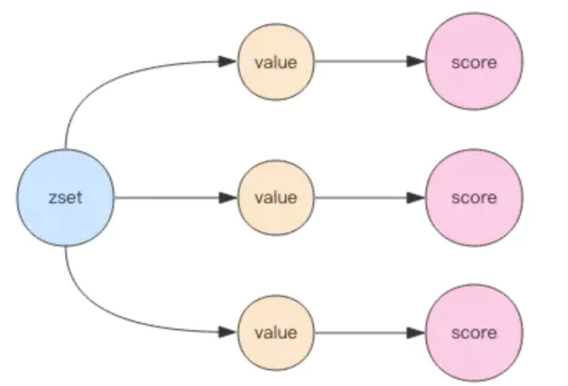


**SortedSet（zset）**，是 Redis 提供的一个 特别的数据结构，一方面它等价于 **Java的数据结构：`Map<String, Double>`，可以给每个元素赋予一个权重 `score`，另一方面它又类似于 `TreeSet`，内部的元素会按照权重 score 进行排序，可以得到每个元素的名次，还可以通过 score 的范围来获取 元素的列表**


zset底层使用了两个数据结构：**hash 、 跳跃列表**：

- hash 的作用就是 **关联元素的 value 和权重 score，保障元素 <value 的唯一性>**，可以通过元素 value 找到相应的 score 值。
- 跳跃列表的目的 **给元素的 value 排序，根据 score 的范围获取元素列表**


- **增加元素**：`zadd` 指令可以增加一个到多个 value/score对(score放在前面)

  ```
  zadd sortedSet 4.0 py 3.0 java 1.0 go
  ```

  

- **长度**：`zcard` 得到 zset 的元素个数


- **删除元素**：`zrem` ，可以一次删除多个


- **计数器**：同 hash 结构一样，zset也可以作为计数器使用，**直接对它的 score 值进行操作**

  ```bash
  > zadd ireader 4.0 python 4.0 java 1.0 go
  (integer) 3
  > zincrby ireader 1.0 python
  "5"
  ```

  

- **获取排名和分数**：通过`zscore`指令获取**指定元素的权重**，通过zrank指令获取**指定元素的正向排名**，通过`zrevrank` 指令获取指定元素的`反向排名`[倒数第一名]。正向是由小到大，负向是由大到小。

  ```bash
  > zscore ireader python
  "5"
  > zrank ireader go  # 分数低的排名考前，rank值小
  (integer) 0
  > zrank ireader java
  (integer) 1
  > zrank ireader python
  (integer) 2
  > zrevrank ireader python
  (integer) 0
  ```

  


- **根据<排名范围>获取元素列表**：通过`zrange`指令指定排名范围参数获取对应的元素列表，携带`withscores`参数可以一并获取元素的权重。通过zrevrange指令按负向排名获取元素列表[倒数]。正向是由小到大，负向是由大到小。

  ```bash
  > zrange ireader 0 -1  # 获取所有元素
  1) "go"
  2) "java"
  3) "python"
  > zrange ireader 0 -1 withscores
  1) "go"
  2) "1"
  3) "java"
  4) "4"
  5) "python"
  6) "5"
  > zrevrange ireader 0 -1 withscores
  1) "python"
  2) "5"
  3) "java"
  4) "4"
  5) "go"
  6) "1"
  ```

  

- **根据 score 范围获取列表**：通过zrangebyscore指令指定score范围获取对应的元素列表。通过zrevrangebyscore指令获取倒排元素列表。正向是由小到大，负向是由大到小。参数`-inf`表示负无穷，`+inf`表示正无穷。

  ```bash
  > zrangebyscore ireader 0 5
  1) "go"
  2) "java"
  3) "python"
  > zrangebyscore ireader -inf +inf withscores
  1) "go"
  2) "1"
  3) "java"
  4) "4"
  5) "python"
  6) "5"
  > zrevrangebyscore ireader +inf -inf withscores  # 注意正负反过来了
  1) "python"
  2) "5"
  3) "java"
  4) "4"
  5) "go"
  6) "1"
  ```

  

- **根据范围移除元素列表**：可以通过score范围来一次性移除多个元素

  ```bash
   zremrangebyrank ireader 0 1
  (integer) 2  # 删掉了2个元素
  > zadd ireader 4.0 java 1.0 go
  (integer) 2
  > zremrangebyscore ireader -inf 4
  (integer) 2
  > zrange ireader 0 -1
  1) "python"
  ```

  

### 跳跃列表


zset 内部的排序功能是通过 [**跳跃列表**] 数据结构实现的。

因为 zset 要支持随机的插入和删除，所以它不好使用数组来表示。先使用链表来分析：

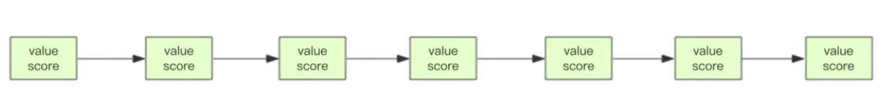

现在需要这个链表按照 score 值进行排序。意味着当有新元素需要插入时，需要定位到 **特定位置的插入点**，这样才能保证链表是有序的。通常都是使用 **二分查找**，但二分查找必须是数组才行，链表做不到！


> 想想一个创业公司，刚开始只有几个人，团队成员之间人人平等，都是联合创始人。随着公司的成长，人数渐渐变多，团队沟通成本随之增加。这时候就会**引入组长制**，对团队进行划分。每个团队会有一个组长。开会的时候分团队进行，多个组长之间还会有自己的会议安排。公司规模进一步扩展，需要再**增加一个层级——部门**，每个部门会从组长列表中推选出一个代表来作为部长。**部长们之间还会有自己的高层会议安排。**

跳表就是类似于这种层级制，最下面一层所有的元素都会串起来，每隔几个元素挑选出一个代表来，再来将这几个代表使用**另外一级指针串起来**。**然后在这些代表里再挑出二级代表，再串起来**。最终形成金字塔结构


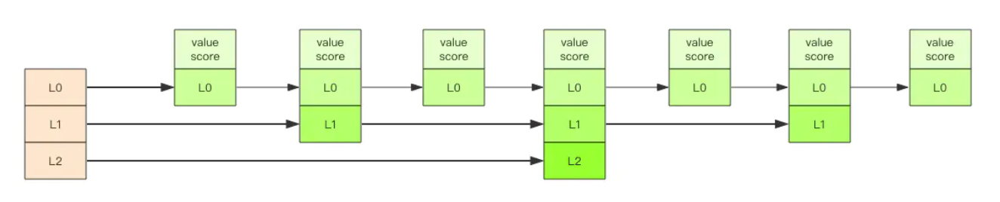

**跳跃列表之所以 [跳跃]，是因为内部的元素可能 [身兼数职]**。比如上图中间的这个元素，同时处于L0、L1和L2层，可以**快速在不同层次之间进行「跳跃」**。


当开始定位插入点时，先在 **顶层进行定位，然后下潜到下一级定位，一直下潜到最底层找到合适的位置，将新元素插进去**。


新插入的元素如何才有机会 【身兼数职】呢？

跳跃列表采取一个**【随机策略】**来决定新元素**可以兼职到第几层**，首先L0层肯定是100%了，L1层只有50%的概率，L2层只有25%的概率，L3层只有12.5%的概率，**一直随机到最顶层L31层**。绝大多数元素都过不了几层，**只有极少数元素可以深入到顶层**。

**列表中的元素越多，能够深入的层次就越深，能进入到顶层的概率就会越大。**

> 这还挺公平的，能不能进入中央不是靠拼爹，而是看运气。


