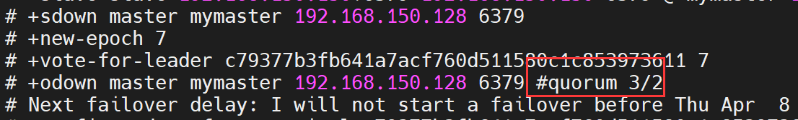
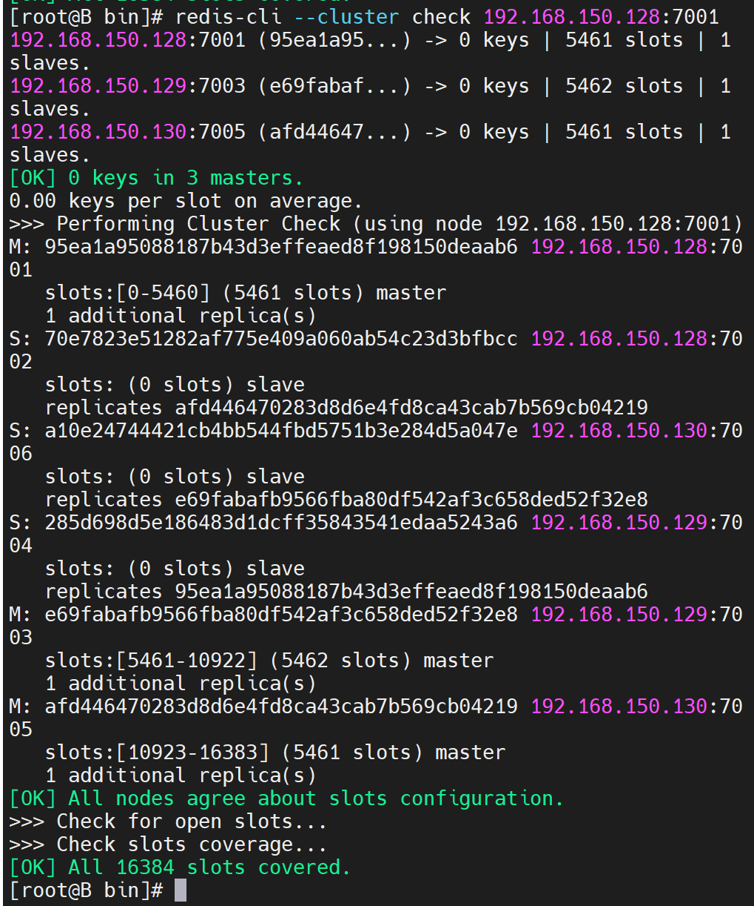

# 高并发高可用复杂系统中的缓存架构


提供了连续而且仿真的一个业务场景

各种各样的业务场景，以及在业务场景中面临的难题和问题，去学习一个又一个的技术或者解决方案，或者架构设计思想

基于大型电商网站中的口罩预约抢购系统

最最核心的架构就是缓存架构，商品详情页系统整体有自己整体的架构

一步一步的去分析商品详情页系统中的一些核心的部分，涉及到最最主要的就是**缓存架构，高并发**

缓存架构，一步一步讲解各种各样**支撑高并发场景的缓存技术，解决方案，架构设计**

**如何将缓存架构本身做成高可用的架构，缓存架构本身面临的可用性的问题**


# 搭建单机版redis以及redis生产环境启动方案


> 见Redis笔记安装步骤


## redis的生产环境启动方案


要把redis作为一个系统的daemon进程去运行的，**每次系统启动，redis进程一起启动**

（1）redis utils目录下，有个redis_init_script脚本

（2）将redis_init_script脚本拷贝到linux的/etc/init.d目录中，将redis_init_script重命名为redis_6379，6379是我们希望这个redis实例监听的端口号

（3）修改redis_6379脚本的第6行的REDISPORT，设置为相同的端口号（默认就是6379）

（4）创建两个目录：/etc/redis（存放redis的**配置文件**），/var/redis/6379（存放redis的**持久化文件**）

（5）**修改redis配置文件**（默认在根目录下，redis.conf），拷贝到/etc/redis目录中，修改名称为6379.conf

（6）修改redis.conf中的部分配置为生产环境

```
daemonize yes           让redis以daemon进程运行

pidfile    /var/run/redis_6379.pid 设置redis的pid文件位置

port    6379           设置redis的监听端口号

dir     /var/redis/6379       设置持久化文件的存储位置
```

（7）启动redis，执行`cd /etc/init.d`,   `chmod 777`， `redis_6379`， 

```
./redis_6379 start
```

（8）确认redis进程是否启动，`ps -ef | grep redis`


（9）让redis跟随系统启动自动启动（暂不设置）

在redis_6379脚本中，最上面，加入两行注释

```
# chkconfig:  2345 90 10

# description: Redis is a persistent key-value database

chkconfig redis_6379 on
```


## redis cli的使用


redis-cli SHUTDOWN，连接本机的6379端口停止redis进程

redis-cli -h 127.0.0.1 -p 6379 SHUTDOWN，指定要连接的ip和端口号

redis-cli PING，ping redis的端口，看是否正常

redis-cli，进入交互式命令行


## redis技术概览


包括4块：

- redis各种数据结构和命令的使用，包括java api的使用

- redis一些特殊的解决方案的使用，pub/sub消息系统，分布式锁，输入的自动完成，等等

- redis日常的管理相关的命令

- redis企业级的集群部署和架构

 

我们这套课程，实际上是针对企业级的大型缓存架构，用得项目，真实的高并发口罩预约抢购系统


**redis持久化、主从架构、复制原理、集群架构、数据分布式存储原理、哨兵原理、高可用架构**


# redis持久化机制


## redis持久化机对于生产环境中的灾难恢复的意义


1、故障发生的时候会怎么样

2、如何应对故障的发生


redis的持久化，RDB，AOF，区别，各自的特点是什么，适合什么场景

redis的企业级的持久化方案是什么，是用来跟哪些企业级的场景结合起来使用的？

 

---

**redis持久化的意义**，在于**故障恢复**

 

比如你部署了一个redis，作为cache缓存，当然也可以保存一些**较为重要的数据**

 

如果没有持久化的话，redis遇到灾难性故障的时候，就会**丢失所有的数据**

 

如果通过持久化将**数据搞一份儿在磁盘上去**，然后定期比如说**同步和备份到一些云存储服务**上去，那么就可以保证数据不丢失全部，还是可以恢复一部分数据回来的


## redis的RDB和AOF两种持久化机制的工作原理


> 1、RDB和AOF两种持久化机制的介绍
>
> 2、RDB持久化机制的优点
>
> 3、RDB持久化机制的缺点
>
> 4、AOF持久化机制的优点
>
> 5、AOF持久化机制的缺点
>
> 6、RDB和AOF到底该如何选择


对于一个企业级的redis架构来说，持久化是不可减少的

企业级redis集群架构：海**量数据、高并发、高可用**

持久化主要是做**灾难恢复**，**数据恢复**，也可以归类到高可用的一个环节里面去

比如你redis整个挂了，然后redis就不可用了，你要做的事情是让redis变得可用，尽快变得可用

重启redis，尽快让它对外提供服务，但是，**如果你没做数据备份，这个时候redis启动了，也不可用啊，数据都没了**


很可能说，大量的请求过来，缓存全部无法命中，在redis里根本找不到数据，这个时候就死定了，缓存雪崩问题，所有请求，没有在redis命中，就会去mysql数据库这种数据源头中去找，一下子mysql承接高并发，然后就挂了

mysql挂掉，你都没法去找数据恢复到redis里面去，redis的数据从哪儿来？从mysql来。。。

具体的完整的缓存雪崩的场景后面会讲解。

如果你把redis的持久化做好，备份和恢复方案做到企业级的程度，那么**即使你的redis故障了，也可以通过备份数据，快速恢复，一旦恢复立即对外提供服务**

**redis的持久化，跟高可用，是有关系的，企业级redis架构中去讲解**


redis持久化：RDB，AOF


### 1、RDB和AOF两种持久化机制的介绍


- RDB持久化机制，对redis中的**数据执行「周期性」的持久化**

- AOF机制对**每条「写入命令」作为日志**，以**append-only的模式写入一个日志文件中**，在redis重启的时候，可以通过***回放AOF日志中的写入指令来重新构建整个数据集***

如果我们想要redis仅仅作为**纯内存的缓存**来用，那么**可以禁止**RDB和AOF所有的持久化机制


通过RDB或AOF，都可以将redis内存中的数据给**持久化到磁盘上**面来，然后可以将这些数据备份到别的地方去，比如说阿里云，云服务

如果redis挂了，服务器上的内存和磁盘上的数据都丢了，可以从云服务上拷贝回来之前的数据，放到指定的目录中，然后重新启动redis，**redis就会自动根据持久化数据文件中的数据，去恢复内存中的数据，继续对外提供服务**

如果同时使用RDB和AOF两种持久化机制，那么在redis重启的时候，会使用AOF来重新构建数据，因为**AOF中的数据「更加完整」**


----

AOF rewite原理：


使用**缓存清除算法**将最不经常使用的数据从内存中删除，给新的数据腾放更多的空间。

rewrite：新的AOF，基于当前**清除过的AOF文件**新建一个。

确保AOF文件不至于膨胀的太大。


### 2、RDB持久化机制的优缺点

优点：

（1）RDB会生成多个数据文件，**每个数据文件都代表了某一个时刻中redis的数据**，这种多个数据文件的方式，非常适合做**冷备**，可以将这种完整的数据文件发送到一些**远程的安全存储**上去，比如说Amazon的S3云服务上去，在国内可以是阿里云的ODPS分布式存储上，以预定好的备份策略来定期备份redis中的数据

RDB也可以做冷备份，生成多个文件，每个文件都代表了某一时刻的完整的数据快照（AOF也可以，每隔一定时间copy一份文件）

RDB由redis控制固定时长生成快照文件，AOF需要自己写脚本


（2）RDB对redis对外提供的读写服务，**影响非常小**，可以**让redis保持高性能**，因为redis主进程只需要**「fork一个子进程」，让子进程执行磁盘IO操作来进行RDB持久化**即可

- **RDB每次写都是直接写Redis内存，只是在一定的时候，才会将数据保存入磁盘中。**

- AOF每次都是要写文件的，虽然可以快速写入 os cache，但还是有一定的**<u>时间开销</u>**，速度肯定比RDB慢一些


（3）相对于AOF持久化机制来说，直接基于RDB数据文件来重启和恢复redis进程，更加**快速**。AOF存放的是 **指令日志，做数据恢复的时候需要回放和「执行所有的指令日志」来恢复出来内存中的所有数据。而RDB就是一份数据文件，恢复的时候，直接加载到内存中即可**


（4）RDB在保存rdb文件时父进程唯一需要做的就**是fork出一个「子进程」**，接下来的工作全部由子进程来做，**父进程不需要再做其他的IO操作**，所以RDB持久化方式可以**「最大化Redis的性能」**。


**<u>Redis特别适合做冷备</u>**

---

缺点：

（1）如果想要在redis故障时，**尽可能少的丢失数据**，那么RDB没有AOF好。一般来说，RDB数据快照文件，**都是每隔5分钟，或者更长时间生成一次**，这个时候就得接受一旦redis进程宕机，那么会**丢失最近5分钟的数据**


不适合做第一优先的恢复方案，如果你依赖RDB做第一优先恢复方案，会导致数据丢失的比较多


（2）RDB每次在fork子进程来执行RDB快照数据文件生成的时候，如果数据文件特别大，可能会导致**对客户端提供的服务暂停**数毫秒，或者甚至数秒


### AOF的优缺点


优点：

1）AOF可以更好的**保护数据不丢失**，一般AOF会每隔1秒，通过一个后台线程**执行一次fsync操作，最多丢失1秒钟的数据**

每隔1秒，就**执行一次fsync操作**，保证os cache中的数据写入磁盘中redis进程。挂了，**最多丢掉1秒钟的数据**


（2）AOF日志文件以append-only模式写入，所以**没有任何「磁盘寻址」的开销**，写入性能非常高，而且**文件不容易破损**，即使文件尾部破损，也很容易修复


（3）AOF日志文件即使过大的时候，出现**后台重写**操作，也不会影响客户端的读写。因为在rewrite log的时候，会对其中的指令**进行压缩**，创建出一份需要**恢复数据的最小日志出来**。再创建新日志文件的时候，老的日志文件还是照常写入。当新的merge后的日志文件ready的时候，再交换新老日志文件即可。


（4）AOF日志文件的命令通过**非常「可读」**的方式进行记录，这个特性非常适合做灾难性的误删除的紧急恢复。

> 比如某人不小心用flushall命令清空了所有数据，只要这个时候后台rewrite还没有发生，那么就可以立即拷贝AOF文件，**将最后一条flushall命令给删了，然后再将该AOF文件放回去**，就可以通过**恢复机制，自动恢复所有数据**
>


---

缺点：

（1）对于同一份数据来说，***AOF日志文件通常比RDB数据快照文件更大***

指令日志，会比RDB更大。


（2）AOF开启后，支持的**写QPS会比RDB支持的写QPS低**，因为AOF一般会配置成每秒fsync一次日志文件，当然，每秒一次fsync，性能也还是很高的。RDB是fork一个进程来进行，不会影响主进程的IO。

如果你要保证一条数据都不丢，也是可以的，AOF的fsync设置成每写入一条数据，fsync一次，那就完蛋了，**redis的QPS大降**


（3）以前AOF发生过bug，就是通过AOF记录的日志，进行数据恢复的时候，**没有恢复一模一样的数据出来**。所以说，类似AOF这种较为复杂的基于**命令日志/merge/回放**的方式，比基于RDB每次持久化一份**完整的数据快照文件**的方式，更加**脆弱一些**，<u>容易有bug</u>。

不过AOF就是为了避免rewrite过程导致的bug，因此**每次rewrite并不是基于旧的指令日志进行merge的**，而是**基于当时内存中的数据进行指令的重新构建**，这样健壮性会好很多。


（4）唯一的比较大的缺点，其实就是做数据恢复的时候，**会比较慢**，还有做冷备，定期的备份，不太方便，可能要自己手写复杂的脚本去做，做冷备不太合适


### RDB和AOF到底该如何选择

 

（1）不要仅仅使用RDB，因为那样会导致你**<u>丢失很多数据</u>**

 

（2）也不要仅仅使用AOF，因为那样有两个问题，第一，你通过AOF做冷备，没有RDB做冷备，来的恢复速度更快; 第二，RDB每次简单粗暴生成数据快照，**更加健壮**，可以避免AOF这种**复杂的备份和恢复机制的bug**

 

（3）综合使用AOF和RDB两种持久化机制，**用AOF来保证数据不丢失，作为数据恢复的第一选择; 用RDB来做不同程度的冷备，在AOF文件都丢失或损坏不可用的时候，还可以使用RDB来进行快速的数据恢复**


## RDB持久化配置以及数据恢复实验


redis.conf文件，也就是/etc/redis/6379.conf，去配置持久化

```
save 60 1000
```

每隔60s，如果有超过1000个key发生了变更，那么就**生成一个新的dump.rdb文件**，就是当前redis内存中**完整的数据快照**，这个操作也被称之为**snapshotting**，快照

 

也可以手动调用**save或者bgsave**命令，同步或异步执行rdb快照生成

 

save可以设置多个，就是多个snapshotting检查点，**每到一个检查点，就会去check一下，是否有指定的key数量发生了变更**，如果有，就生成一个新的dump.rdb文件


DB持久化机制的工作流程

（1）redis根据配置自己尝试去生成rdb快照文件

（2）**fork一个子进程出来**

（3）子进程尝试将数据dump到**临时的rdb快照文件**中

（4）完成rdb快照文件的生成之后，就**替换之前的旧的快照文件**


dump.rdb，***每次生成一个新的快照，都会覆盖之前的老快照*** ——只可能有一个dump.rdb快照文件


----

 

（1）在redis中保存几条数据，立即停掉redis进程，然后重启redis，看看刚才插入的数据还在不在

 

为什么数据还在？


通过redis-cli SHUTDOWN这种方式去停掉redis，其实是一种**安全退出的模式**，redis在退出的时候会**将内存中的数据立即生成一份完整的rdb快照**

/var/redis/6379/dump.rdb

 


（2）在redis中再保存几条新的数据，用kill -9粗暴杀死redis进程，模拟redis故障异常退出，导致内存数据丢失的场景

在/var/run下删除这个文件

 

这次就发现，**redis进程异常被杀掉**，**数据没有进dump文件**，几条**最新的数据就丢失了**

 


（2）手动设置一个save检查点，save 5 1


（3）写入几条数据，等待5秒钟，会发现自动进行了一次dump rdb快照，在dump.rdb中发现了数据

（4）异常停掉redis进程，**再重新启动redis，看刚才插入的数据还在，因为检查点，保存到了dump文件中**

 

rdb的手动配置检查点，以及rdb快照的生成，包括数据的丢失和恢复，全都演示过了


## AOF持久化深入讲解各种操作和相关实验


### AOF持久化的配置


AOF持久化，**默认是关闭的**，**默认是打开RDB持久化**

 

`appendonly  yes`，可以**打开AOF持久化机制**，在生产环境里面，一般来说AOF都是要打开的，除非你说随便丢个几分钟的数据也无所谓


打开AOF持久化机制之后，redis每次接收到一条写命令，**就会写入日志文件中**，当然是**先写入os cache**的，然后**每隔一定时间再fsync一下（1s）**


而且即使AOF和RDB都开启了，redis重启的时候，也是***优先通过AOF进行数据恢复的，因为aof数据比较完整***


可以配置AOF的fsync策略，有**三种策略**可以选择：

- **一种是always：每次写入一条数据就执行一次fsync; **

- **一种是everysync：每隔一秒执行一次fsync; **

- **一种是no：不主动执行fsync**

 


- always: 每次写入一条数据，立即将这个数据对应的写日志fsync到磁盘上去，性能非常非常差，**吞吐量很低**; 确保说redis里的数据一条都不丢，那就只能这样了

 

mysql -> 内存策略，**大量磁盘**，QPS到多少，**一两k**。QPS：每秒钟的请求数量

redis -> **内存**，**磁盘持久化**，QPS到多少，单机，一般来说，**上万QPS**没问题

 

- everysec: **每秒将os cache中的数据fsync到磁盘**，这个最常用的，生产环境一般都这么配置，性能很高，QPS还是可以上万的

 

- no: 仅仅redis负责将数据**写入os cache**就撒手不管了，然后**后面os自己会时不时有自己的策略将数据刷入磁盘，不可控了**


### AOF持久化的数据恢复实验


（1）先仅仅打开RDB，写入一些数据，然后kill -9杀掉redis进程，接着重启redis，发现数据没了，因为RDB快照还没生成

（2）打开AOF的开关，启用AOF持久化

（3）写入一些数据，观察AOF文件中的日志内容

（4）kill -9杀掉redis进程，重新启动redis进程，**发现数据被恢复回来了，就是从AOF文件中恢复回来的**

 

redis进程启动的时候，**直接就会从appendonly.aof中加载所有的日志，把内存中的数据恢复回来**

其实你在appendonly.aof文件中，可以看到刚写的日志，它们其实就是先写入os cache的，然后1秒后才fsync到磁盘中，**只有fsync到磁盘中了，才是安全的**，要不然光是在os cache中，机器只要重启，就什么都没了


### AOF rewrite


redis中的数据其实有限的，很多数据可能会**自动过期**，可能会被用户删除，可能会被redis**用缓存清除的算法清理掉**

redis中的数据会**不断淘汰掉旧的**，就一部分常用的数据会被自动保留在redis内存中

 

所以可能很多之前的已经被清理掉的数据，对应的写日志还停留在AOF中，AOF日志文件就一个，会不断的膨胀，到很大很大

 

所以**AOF会自动在后台每隔一定时间做rewrite操作**，比如日志里已经存放了针对100w数据的写日志了; redis内存只剩下10万; ***基于内存中当前的10万数据构建一套最新的日志***，到AOF中; 覆盖之前的老日志; 确保AOF日志文件不会过大，**保持跟redis内存数据量一致**

 

redis 2.4之前，还需要手动，开发一些脚本，crontab，通过BGREWRITEAOF命令去执行AOF rewrite，但是redis 2.4之后，**会自动进行rewrite操作**

在redis.conf中，可以配置rewrite策略

```
auto-aof-rewrite-percentage 100
auto-aof-rewrite-min-size 64mb
```

比如说上一次AOF rewrite之后，是128mb

然后就会接着128mb继续写AOF的日志，如果发现**增长的比例，超过了之前的100%**，256mb，就可能会**去触发一次rewrite**

但是此时还要去跟min-size，64mb去比较（如果没到64mb，就不进行rewrite），256mb > 64mb，才会去触发rewrite

 

（1）redis **fork一个子进程**

（2）子进程基于当前内存中的数据，**构建日志**，开始往一个***新的临时的AOF文件***中写入日志

（3）redis主进程，接收到client**新的**写操作之后，**在内存中写入日志，同时新的日志也继续写入旧的AOF文件**

（4）子进程**写完新的日志文件**之后，redis主进程将内存中的**新日志再次追加到新的AOF文件**中

（5）***用新的日志文件替换掉旧的日志文件***


### AOF破损文件的修复

 

如果redis在append数据到AOF文件时，机器宕机了，可能会导致AOF文件破损

 

**用redis-check-aof --fix命令来修复破损的AOF文件**

```
redis-check-aof --fix appendonly.aof
```


如果aof文件错误，无法正常启动redis

会修复不合法的语句，甚至补全。


### AOF和RDB同时工作

 

（1）如果**RDB在执行snapshotting**操作，那么redis**不会执行AOF rewrite**; 如果redis在执行AOF rewrite，那么就不会执行RDB snapshotting。不会同时执行，磁盘IO太繁重

（2）如果RDB在执行snapshotting，此时用户执行BGREWRITEAOF命令，那么等RDB快照生成**之后**，才会去执行AOF rewrite

（3）同时有RDB snapshot文件和AOF日志文件，那么redis重启的时候，**会优先使用AOF进行数据恢复，因为其中的日志更完整**


小实验：

（1）在有rdb的dump和aof的appendonly的同时，rdb里也有部分数据，aof里也有部分数据，这个时候其实会发现，**rdb的数据不会恢复到内存中**

（2）我们模拟让aof破损，然后fix，有一条数据会被fix删除

（3）再次用fix后的aof文件去重启redis，发现数据只剩下一条了

 

数据恢复完全是依赖于底层的磁盘的持久化的，只要rdb和aof上都没有数据，那就没了

将aof文件中的k3，k4记录删除，发现**dump文件中的数据不会恢复**


# 在项目中部署redis企业级数据备份方案以及各种踩坑的数据恢复容灾演练


在项目中部署redis企业级数据备份方案以及各种踩坑的数据恢复容灾演练


### 1、企业级的持久化的配置策略

在企业中，RDB的生成策略，用默认的也差不多


save 60 10000：如果你希望尽可能确保说，RDB最多丢1分钟的数据，那么尽量就是每隔1分钟都生成一个快照，低峰期，数据量很少，也没必要


10000->生成RDB，1000->RDB，这个根**据你自己的应用和业务的数据量去改变**


**AOF一定要打开**，`fsync，everysec`每秒写入到磁盘上


`auto-aof-rewrite-percentage 100`: 就是当前AOF大小膨胀到超过上次100%，上次的两倍

`auto-aof-rewrite-min-size 64mb`: aof大小达到64mb才会开始rewrite。根据你的数据量来定，16mb，32mb.....


### 2、企业级的数据备份方案

 

RDB非常适合做**冷备**，**每次生成之后，就不会再有修改了**

 

数据备份方案

（1）写crontab**定时调度脚本**去做数据备份

（2）**每小时**都**copy(因为每次生成rdb会覆盖之前的)**一份rdb的备份，**到一个目录中去，仅仅保留最近48小时的备份**

（3）**每天**都保留一份当日的rdb的备份，到一个目录中去，仅仅保留最近**1个月**的备份

（4）每次copy备份的时候，都**把太旧的备份给删了**

（5）每天晚上将当前服务器上所有的数据备份，发送一份到**远程的云服务**上去


/usr/local/redis目录下：

----

- **每小时copy一次备份，删除48小时前的数据**

crontab -e

```
0 * * * * sh /usr/local/redis/copy/redis_rdb_copy_hourly.sh
```


redis_rdb_copy_hourly.sh

```
#!/bin/sh 
cur_date=`date +%Y%m%d%k`
rm -rf /usr/local/redis/snapshotting/$cur_date
mkdir /usr/local/redis/snapshotting/$cur_date
cp /var/redis/6379/dump.rdb /usr/local/redis/snapshotting/$cur_date

del_date=`date -d -48hour +%Y%m%d%k`
rm -rf /usr/local/redis/snapshotting/$del_date
```

 `./redis_rdb_copy_hourly.sh`手动执行

---

- **每天copy一次备份**

crontab -e

`0 0 * * * sh /usr/local/redis/copy/redis_rdb_copy_daily.sh`

redis_rdb_copy_daily.sh

```
#!/bin/sh 

cur_date=`date +%Y%m%d`
rm -rf /usr/local/redis/snapshotting/$cur_date
mkdir /usr/local/redis/snapshotting/$cur_date
cp /var/redis/6379/dump.rdb /usr/local/redis/snapshotting/$cur_date

del_date=`date -d -1month +%Y%m%d`
rm -rf /usr/local/redis/snapshotting/$del_date
```

每天一次将所有数据上传一次到远程的云服务器上去


在每个月每天每小时0分进行cp，备份dump文件


### 3、数据恢复方案

 

（1）如果是**redis进程挂掉**，那么重启redis进程即可，直接**基于AOF日志文件恢复数据**

AOF数据恢复，**fsync everysec，最多就丢一秒的数据**

---


（2）如果是redis进程所在机器挂掉，那么重启机器后，尝试**重启redis进程**，尝试直接基于AOF日志文件进行数据恢复

AOF没有破损，也是可以直接基于AOF恢复的

AOF append-only，顺序写入，**如果AOF文件破损**，那么用

```
redis-check-aof --fix
```

---

（3）如果redis当前**最新的AOF和RDB文件出现了丢失/损坏**，那么可以尝试基于该机器上当前的某个**最新的RDB数据副本**进行数据恢复

当前最新的AOF和RDB文件都出现了丢失/损坏到无法恢复，一般不是机器的故障，**人为**

大数据系统，hadoop，有人不小心就把hadoop中存储的大量的数据文件对应的目录，rm -rf一下，我朋友的一个小公司，运维不太靠谱，权限也弄的不太好

/var/redis/6379下的文件给删除了


找到RDB最新的一份备份，**小时级的备份**可以了，小时级的肯定是最新的，copy到redis里面去，就可以**恢复到某一个小时的数据**


-----

**容灾演练**


appendonly.aof + dump.rdb，**优先用appendonly.aof去恢复数据**，但是我们发现redis**自动生成的appendonly.aof是没有数据的**


然后**我们自己的dump.rdb是有数据的，但是明显没用我们的数据**

↓

redis启动的时候，自动重新基于内存的数据，生成了一份最新的rdb快照，直接用空的数据，**覆盖掉了我们有数据的，拷贝过去的那份dump.rdb**


你停止redis之后，其实应该先删除appendonly.aof，然后将我们的dump.rdb拷贝过去，然后再重启redis


很简单，就是虽然你**删除了appendonly.aof，但是因为打开了aof持久化，redis就一定会优先基于aof去恢复，即使文件不在，那就创建一个新的空的aof文件**

停止redis，**暂时在配置中关闭aof**，然后**拷贝一份rdb过来，再重启redis，数据就可以恢复过来**

 


脑子一热，再**关掉redis**，手动**修改配置文件**，**打开aof**，再重启redis，数据又没了，**空的aof文件**，**所有数据又没了**

在数据安全丢失的情况下，基于rdb冷备，***如何完美的恢复数据，同时还保持aof和rdb的双开***


----

正确做法：

停止redis，关闭aof，拷贝rdb备份，重启redis，确认数据恢复，**直接在命令行热修改redis配置**，**打开aof**，这个redis就会将内存中的数据对应的日志，写入aof文件中


**此时aof和rdb两份数据文件的数据就同步了**


**redis config set热修改配置参数**，可能**配置文件中的实际的参数没有被持久化的修改**，再次停止redis，**手动修改配置文件，打开aof的命令**，再次重启redis，数据还是存在的。因为之前热修改配置参数时已经生成了aof文件，这次直接根据这份存了数据的aof日志

 


----

（4）如果当前机器上的所有RDB文件全部损坏，那么从**远程的云服务上拉取最新的RDB快照**回来恢复数据


---

（5）如果是发现有重大的数据错误，比如某个小时上线的程序一下子将数据全部污染了，数据全错了，那么可以选择某个**更早的时间点**，对数据进行恢复

举个例子，12点上线了代码，发现代码有bug，导致代码生成的所有的缓存数据，写入redis，全部错了

找到一份11点的rdb的冷备，然后按照上面的步骤，去恢复到11点的数据，不就可以了吗


# 主从架构


## 通过读写分离来承载读请求QPS超过10w+


---

**1、redis高并发跟整个系统的高并发之间的关系**


redis，你要搞高并发的话，不可避免，要把底层的缓存搞得很好

mysql，高并发，做到了，那么也是通过一系列复杂的**分库分表，订单系统，事务**要求的，QPS到几万，比较高了

要做一些电商的商品详情页，真正的超高并发，QPS上十万，甚至是百万，**一秒钟百万的请求量**

光是redis是不够的，但是redis是整个大型的缓存架构中，支撑高并发的架构里面，非常重要的一个环节


首先，你的底层的**缓存中间件，缓存系统**，必须能够支撑的起我们说的那种高并发，其次，再经过良好的整体的缓存架构的设计（**多级缓存架构、热点缓存**），支撑真正的上十万，甚至上百万的高并发

---

2、redis不能支撑高并发的**瓶颈**在哪里？

——>>>>   **单机**


---

3、**如果redis要支撑超过10万+的并发，那应该怎么做？**

 

单机的redis几乎不太可能说QPS超过10万+，除非一些特殊情况，比如你的机器性能特别好，配置特别高，物理机，维护做的特别好，而且你的整体的操作不是太复杂

单机的瓶颈在几万QPS

 

- **读写分离**，一般来说，对***缓存***，一般都是用来**支撑读高并发**的，**写的请求是比较少的，可能写请求也就一秒钟几千，一两千**

  大量的请求**都是读，一秒钟二十万次读**

 ->读写分离


架构做成**主从架构**，一主多从，主负责写，并且**将数据同步复制到其他的slave节点**，从节点负责读。

***所有的读请求全部走从节点***


**主从架构 -> 读写分离 -> 支撑10万+读QPS的架构**

 

---


topic：

redis replication

redis主从架构 -> 读写分离架构 -> 可**支持水平扩展**的读高并发架构（如果读QPS再增加，那么继续增加 redis slave就可以）


## redis replication以及master持久化对主从架构的安全意义


### redis replication的核心机制

 

（1）redis采用**异步方式复制数据到slave节点**，不过redis 2.8开始，slave node会**周期性地确认自己每次复制的数据量**

（2）一个master node是可以配置多个slave node的

（3）**slave node也可以连接其他的slave node（多级关系）**

（4）slave node做复制的时候，是**不会阻塞 master node的正常工作**

（5）slave node在做复制的时候，也**不会block对自己的查询操作**，它会用**旧的数据集**来提供服务; 但是**复制完成（从master到 slave）**的时候，需要**删除旧数据集**，加载新数据集，这个时候就会**暂停对外服务了**

（6）slave node主要用来进行**横向扩容**，做**读写分离**，扩容的slave node可以**提高读的吞吐量**

slave和高可用性，有很大的关系


### master持久化对于主从架构的安全保障的意义


如果采用了主从架构，那么建议**必须开启master node的持久化**！

 

**不建议用slave node作为master node的数据热备**，因为那样的话，如果你**关掉master的持久化**，可能在master宕机重启的时候**数据是空的**，然后可能**一经过复制，salve node数据也丢了**：

- master -> RDB和AOF都关闭了 -> 全部在内存中

- master宕机，重启，是没有本地数据可以恢复的，然后就会**直接认为自己的数据是空的**

- master就会**将空的数据集同步到slave上去，所有slave的数据全部清空**

- 100%的数据丢失


***master节点，必须要使用持久化机制***


master的各种备份方案，万一说本地的所有文件丢失了; **从备份中挑选一份rdb去恢复master**; 这样才能确保master启动的时候，是有数据的

即使采用了后续讲解的sentinel高可用机制，**slave node可以自动接管master node**，但是也可能sentinal还没有检测到master failure，master node就**自动重启**了，还是**可能导致上面的所有slave node数据清空故障**


## 主从架构的核心原理


当启动一个slave node的时候，它会发送一个PSYNC命令给master node


如果这是slave node**重新连接**master node，那么master node仅仅会复制给slave**部分缺少的数据**; 否则如果是slave node**第一次连接**master node，那么会触发一次**full resynchronization**


- 开始full resynchronization的时候，master会启动一**个后台线程**，开始**生成一份RDB快照文件**，同时还会将从客户端收到的所有写命令**缓存**在内存中。RDB文件生成完毕之后，master会**将这个RDB发送给slave，slave会先写入本地磁盘（rdb是保存在磁盘中，然后加载到内存中使用）**，然后**再从本地磁盘加载到内存中**。然后master会将内存中**缓存的写命令发送给slave**，slave也会同步这些数据。


- slave node如果跟master node有网络故障，断开了连接，会自动重连。master如果发现有多个slave node都来重新连接，仅仅会启动一个rdb save操作，**用一份数据服务所有slave node**。


但，只要是**重新连接master**，一次性（**全量复制**）同步将自动执行

> **全量复制：**slave初始化阶段，这是slave需要将master上的所有数据都复制一份，slave接收到数据文件后，存盘，并加载到内存中
>
> **增量复制：**slave初始化后，开始正常工作时，主服务器发生的写操作会同步到从服务器的过程
>
> Redis主从同步策略：
>
> 主从刚刚连接的时候，进行**全量同步**，全同步结束后，进行**增量同步**
>
> 当然，如果有需要，slave任何时候都可以发起全量同步，
>
> redis策略是：无论如何，**首先会尝试进行增量同步**，如不成功，**要求从机进行全量同步**


### 主从复制的断点续传

 

从redis 2.8开始，就支持主从复制的**断点续传**，如果主从复制过程中，网络连接断掉了，那么可以接着上次复制的地方，**继续复制下去，而不是从头开始复制一份**

 

master node会在内存中常见一个**backlog**，master和slave都会保存一个**replica offset**还有一个master id，**offset就是保存在backlog中的**。如果master和slave网络连接断掉了，**slave会让master从上次的replica offset开始继续复制**

但是如果没有找到对应的offset，那么就会执行一次full resynchronization


### 无磁盘化复制

 

master**在内存中直接创建rdb**，然后发送给slave，***不会在自己本地落地磁盘了***

 

`repl-diskless-sync`

`repl-diskless-sync-delay`，等待一定时长再开始复制，因为要等更多slave重新连接过来


### 过期key处理

 

slave不会过期key，**只会等待master过期ke**y。如果master过期了一个key，或者通过LRU淘汰了一个key，那么会**模拟一条del命令发送给slave。**


## redis replication的完整流运行程和原理


**1、复制的完整流程**

（1）slave node启动，仅仅保存master node的信息，包括master node的host和ip，但是复制流程没开始

master host和ip是从哪儿来的，**redis.conf里面的slaveof配置的**

（2）slave node内部有个**定时任务**，每秒检查是否有新的master node要连接和复制，如果发现，就**跟master node建立socket网络连接**

（3）slave node发送ping命令给master node

（4）**口令认证**，如果master设置了requirepass，那么salve node必须发送masterauth的口令过去进行认证

（5）master node**第一次执行全量复制，将所有数据发给slave node**

（6）master node后续持续将   写命令，**异步复制**给slave node

---


**2、数据同步相关的核心机制**

这里指的就是第一次slave连接msater的时候，执行的全量复制，那个过程里面的一些细节的机制

（1）master和slave都会维护一个offset

master会在自身不断累加offset，slave也会在自身不断累加offset

slave每秒都会上报自己的offset给master，同时**master也会保存每个slave的offset**

这个倒不是说特定就用在全量复制的，主要是**master和slave都要知道各自的数据的offset，才能知道互相之间的数据不一致的情况**

 

（2）backlog

master node有一个backlog，默认是1MB大小

master node给slave node复制数据时，也会将数据在backlog中同步写一份

backlog主要是用来做全量复制**中断后的增量复制**的

 

（3）master run id

info server，可以看到master run id

如果根据host+ip定位master node，是不靠谱的，如果**master node重启或者数据出现了变化，master run id会变化**，那么slave node应该**根据不同的run id区分，run id不同就做全量复制——>master中的数据可能已经发生变化，需要重新全部复制**

如果需要**不更改run id重启redis**，可以使用`redis-cli debug reload`命令

 

（4）psync

从节点使用psync从master node进行复制，`psync runid offset`

master node会根据自身的情况返回响应信息，可能是FULLRESYNC runid offset触发**全量复制**，可能是CONTINUE触发**增量复制**

 

----

**3、全量复制**

（1）master执行bgsave，在***本地生成一份rdb快照文件***

（2）master node将rdb快照文件发送给salve node，如果rdb复制时间超过60秒（repl-timeout），那么slave node就会认为**复制失败**，可以适当调节大这个参数

（3）对于千兆网卡的机器，一般每秒传输100MB，6G文件，很可能超过60s

（4）master node在生成rdb时，会将所有**新的写命令缓存在内存中**，在**salve node保存了**rdb之后，**再将新的写命令复制给salve node**


（5）`client-output-buffer-limit slave` 256MB 64MB 60，如果在复制期间，master的内存缓冲区持续消耗超过64MB，或者一次性超过256MB，那么停止复制，复制失败.

复制过程中写命令太多，master暂停rdb传输


（6）slave node接收到rdb之后，**清空自己的旧数据**，然后重新加载rdb到自己的内存中，同时基于旧的数据版本**对外提供服务**

（7）如果slave node开启了AOF，那么会立即执行**BGREWRITEAOF**，**重写AOF**


> rdb生成、rdb通过网络拷贝、slave旧数据的清理、slave aof rewrite，很耗费时间
>
> 如果复制的数据量在4G~6G之间，那么很可能全量复制时间消耗到1分半到2分钟

 

----

**4、增量复制**

 

（1）如果全量复制过程中，master-slave网络连接断掉，那么salve重新连接master时，会触发增量复制

（2）master直接**从自己的backlog中获取部分丢失的数据**，发送给slave node，默认backlog就是1MB

（3）***msater就是根据slave发送的psync中的offset来从backlog中获取数据的***

 

----

**5、heartbeat**

主从节点互相都会发送heartbeat信息

master默认每隔10秒发送一次heartbeat，salve node每隔1秒发送一个heartbeat

----

**6、异步复制**

master每次接收到写命令之后，先在内部写入数据，然后异步发送给slave node


## 在项目中部署redis的读写分离架构


1、启用复制，部署slave node


配置主从关系：

slaveof 192.168.150.128 6379，

也可以使用slaveof命令


2、强制读写分离

基于主从复制架构，实现读写分离

redis slave node只读**，默认开启，slave-read-only**

开启了只读的redis slave node，会**拒绝所有的写操作**，这样可以**强制搭建成读写分离的架构**

 

3、集群安全认证

master上启用安全认证，requirepass

master连接口令，masterauth

 


4、读写分离架构的测试

先启动主节点上的redis实例

再启动从节点上的redis实例

刚才我调试了一下，redis slave node一直说没法连接到主节点的6379的端口

在搭建生产环境的集群的时候，不要忘记修改一个配置，bind

bind 127.0.0.1 -> **本地的开发调试的模式**，就**只能127.0.0.1本地才能访问到6379的端口**

每个redis.conf中的`bind 127.0.0.1` -> bind**自己的ip地址即可** （或者0.0.0.0）


设置了认证密码，输入密码 -a  或者  `auth "yourpassword" `


在每个节点上都设置: iptables -A INPUT -ptcp --dport  6379 -j ACCEPT  把6379端口手动打开

redis-cli -h ipaddr

info replication


在主上写，在从上读

从节点不允许写数据。


数据在主从上都同步完成


## 对项目的主从redis架构进行QPS压测以及水平扩容支撑更高QPS


对自己刚刚搭建好的redis做一个基准的压测，测一下你的redis的性能和QPS（query per second）


redis自己提供的redis-benchmark压测工具，是最快捷最方便的，当然啦，这个工具比较简单，用一些简单的操作和场景去压测


1、对redis读写分离架构进行压测，单实例写QPS+单实例读QPS

 

redis/src

./redis-benchmark -h 192.168.120.128

-c <clients>    Number of parallel connections (default 50)

-n <requests>    Total number of requests (default 100000)

-d <size>      Data size of SET/GET value in bytes (default 2)

根据自己的高峰期的访问量，在高峰期，瞬时最大用户量会达到10万+，-c 100000，-n 10000000，-d 50

各种基准测试，直接出来

> AMD YES！


大部分情况下来说，看你的服务器的机器性能和配置，机器越牛逼，配置越高

单机上十几万，单机上二十万

很多公司里，给一些低配置的服务器，操作复杂度

 

大公司里，都是公司会提供统一的云平台，比如京东、腾讯、BAT、其他的一些、小米、美团

虚拟机，低配

搭建一些集群，专门为某个项目，搭建的**专用集群**，4核4G内存，比较复杂的操作，数据比较大

 

几万，单机做到，差不多了

redis提供的高并发，至少到上万，没问题


几万~十几万/二十万不等

QPS，不同公司，不同服务器，自己去测试，跟生产环境还有区别


生产环境，大量的网络请求的调用，网络本身就有开销，redis的吞吐量就不一定那么高了


QPS的两个杀手：一个是复杂操作，lrange，挺多的; value很大，2 byte，我之前用redis做大规模的缓存

 

做商品详情页的cache，可能是需要把**大串数据，拼接在一起**，作为一个json串，大小可能都几k，几个byte

 

2、**水平扩容**redis读节点，提升度吞吐量

 

再在其他服务器上搭建redis从节点，单个从节点读请QPS在5万左右，两个redis从节点，所有的读请求打到两台机器上去，承载整个集群读QPS在10万+


## redis主从架构下如何才能做到99.99%的高可用性


1、什么是99.99%高可用？

 

架构上，高可用性，99.99%的高可用性

讲的学术，99.99%，公式，**系统可用的时间 / 系统故障的时间**，365天，在365天 * 99.99%的时间内，你的系统都是可以哗哗对外提供服务的，那就是高可用性，99.99%

**系统可用的时间 / 总的时间 = 高可用性**

 

2、redis不可用是什么？单实例不可用？主从架构不可用？不可用的后果是什么？

 

3、redis怎么才能做到高可用？


---

一个slave挂了，不会影响可用性

master挂了，整个系统就不可用了。就算还有slave，但是没有master来给他们复制数据。

**缓存不可用了，大并发去请求mysql，mysql宕机**


**redis怎么做到高可用？**  

**master挂了，将slave切换成master承载写和复制的任务。**


# redis哨兵架构


## 哨兵基础知识

sentinal，中文名是**哨兵**

 

哨兵是redis集群架构中非常重要的一个组件，主要功能如下

（1）集群监控，负责**监控redis master和slave进程是否正常工作**

（2）消息通知，如果某个redis实例有故障，那么**哨兵负责发送消息作为报警通知给管理员**

（3）故障转移，如果master node挂掉了，会**自动转移到slave node上**

（4）配置中心，如果故障转移发生了，通知client客户端新的master地址

 

哨兵本身也是分布式的，作为一个**哨兵集群**去运行，互相协同工作

 

（1）故障转移时，**判断**一个master node是宕机了，需要大部分的哨兵都同意才行，涉及到了**分布式选举**的问题

（2）即使部分哨兵节点挂掉了，**哨兵集群**还是能正常工作的，因为如果一个作为**高可用机制**重要组成部分的故障转移系统本身是单点的，那就很坑爹了

 

目前采用的是sentinal 2版本，sentinal 2相对于sentinal 1来说，重写了很多代码，主要是让故障转移的机制和算法变得更加健壮和简单


----


（1）哨兵**至少需要3个实例**，来保证自己的健壮性

（2）哨兵 + redis主从的部署架构，是**不会保证数据零丢失的**，***只能保证redis集群的高可用性***

（3）对于哨兵 + redis主从这种复杂的部署架构，尽量在测试环境和生产环境，都进行充足的测试和演练


----

为什么redis哨兵集群只有2个节点无法正常工作？

哨兵集群必须部署2个以上节点


如果哨兵集群仅仅部署了个2个哨兵实例，quorum=1


 

`Configuration: quorum = 1`

master宕机，s1和s2中只要有1个哨兵认为master宕机就可以还行切换，同时s1和s2中会选举出一个哨兵来执行故障转移


同时这个时候，需要**majority**，也就是大多数哨兵都是运行的，2个哨兵的majority就是2（2的majority=2，3的majority=2，5的majority=3，4的majority=2），**2个哨兵都运行着，就可以允许执行故障转移**

↓

但是如果整个M1和S1运行的机器宕机了，那么**哨兵只有1个**了，此时就**没有majority来允许执行故障转移**，虽然另外一台机器还有一个R1，**但是故障转移不会执行**

 

----

经典的3节点哨兵集群


 

`Configuration: quorum = 2，majority`

如果M1所在机器宕机了，那么三个哨兵还剩下2个，S2和S3可以一致认为master宕机，然后选举出一个来执行故障转移

同时3个哨兵的majority是2，所以还剩下的2个哨兵运行着，就可以允许执行故障转移


## 异步复制、集群脑裂

---

两种数据丢失的情况

主备切换的过程，可能会导致数据丢失

 

（1）异步复制导致的数据丢失

因为master -> slave的复制是异步的，所以可能有部分数据还没复制到slave，master就宕机了，此时这些部分数据就丢失了

 

（2）脑裂导致的数据丢失

脑裂，也就是说，某个master所在机器突然**脱离了正常的网络**，**跟其他slave机器不能连接**，但是**实际上master还运行着**

此时哨兵可能就会认为master宕机了，然后开启选举，将其他slave切换成了master

这个时候，**集群里就会有两个master**，也就是所谓的**脑裂**

此时虽然某个slave被切换成了master，但是可能***client还没来得及切换到新的master***，还**继续写向旧master的数据可能也丢失了**

因此旧master再次恢复的时候，会被**作为一个slave**挂到新的master上去***，自己的数据会清空，重新从新的master复制数据***


---


解决异步复制和脑裂导致的数据丢失

 

```
min-slaves-to-write 1
min-slaves-max-lag 10

redis5改成了：
min-replicas-to-write 3
min-replicas-max-lag 10
```


要求至少有1个slave，数据复制和同步的延迟不能超过10秒

如果说一旦所有的slave，**数据复制和同步的延迟都超过了10秒钟**，那么这个时候，***master就不会再接收任何请求了***

上面两个配置可以减少异步复制和脑裂导致的数据丢失

---

（1）**减少异步复制的数据丢失**

有了min-slaves-max-lag这个配置，就可以确保说，一旦**slave复制数据和ack延时太长**，master认为可能在master宕机后slave损失的数据太多了（因为此时master上的数据比slave上多了很多），那么就**拒绝写请求**，这样可以把master宕机时由于部分数据未同步到slave导致的数据丢失降低的可控范围内

如果不这么做，master还在接收client的数据，那么master和slave的数据差就会越来越多，一旦master宕机，**就会丢失非常多的数据**

一般来说，会在client做降级，写到本地磁盘里面，在client对外接收请求，再做降级，做限流，减慢请求涌入的速度

或者client可能会采取将数据临时灌入一个**kafka消息队列**，每隔10分钟去队列里取一次，尝试重新发会master

----

（2）减少**脑裂的数据丢失**

如果一个master出现了脑裂，跟其他slave丢了连接，那么上面两个配置可以确保说，如果不能继续给**指定数量的slave发送数据**，而且**slave超过10秒没有给自己ack消息**，那么就**直接拒绝客户端的写请求**

这样脑裂后的**旧master就不会接受client的新数据，也就避免了数据丢失**

上面的配置就确保了，如果跟任何一个slave丢了连接，在10秒后发现没有slave给自己ack，那么就拒绝新的写请求

因此在脑裂场景下，**最多就丢失10秒的数据**


## 核心底层原理深入解析

---

**sdown和odown转换机制**


sdown和odown两种失败状态

sdown是**主观宕机**，就一个哨兵如果**自己觉得一个master宕机了，那么就是主观宕机**

odown是**客观宕机**，如果**quorum数量的哨兵**都觉得一个master宕机了，那么就是客观宕机


sdown达成的条件很简单，如果**一个哨兵ping一个master**，超过了**is-master-down-after-milliseconds指定的毫秒数之后**，就主观认为master宕机

sdown到odown转换的条件很简单，如果一个哨兵在指定时间内，收到了**quorum指定数量**的其他哨兵也认为那个master是sdown了，那么就认为是odown了，客观认为master宕机


---


**哨兵集群的自动发现机制**

 

哨兵互相之间的发现，是通过redis的**pub/sub系统**实现的，每个哨兵都会往sentinel:hello这个**channel**里发送一个消息，这时候**所有其他哨兵都可以消费到这个消息**，并**感知到其他的哨兵的存在**

每隔两秒钟，每个哨兵都会往自己监控的某个master+slaves对应的__sentinel__:hello channel里发送一个消息，*内容是自己的  host、ip和  runid还有对这个 master的监控配置*

每个哨兵也会去监听自己监控的每个master+slaves对应的sentinel:hello **channel**，然后去感知到同样在监听这个master+slaves的其他哨兵的存在

每个哨兵还会跟其他哨兵交换**对master的监控配置，互相进行监控配置的同步**


----

**slave配置的自动纠正**

 

哨兵会负责**自动纠正slave的一些配置**，比如slave如果要成为潜在的master候选人，哨兵会确保slave在**复制现有master的数据（在哨兵本地会保存最新版本的master配置）**; 如果slave连接到了一个错误的master上，比如故障转移之后，那么哨兵会**确保它们连接到正确的master上**

 


----

**slave->master选举算法**

 

如果一个master被认为odown了，而且majority哨兵都允许了主备切换，那么**某个哨兵就会执行主备切换操作**，此时首先要**选举一个slave作为master**

会考虑slave的一些信息

（1）跟master断开连接的时长

（2）slave优先级

（3）复制offset

（4）run id

 

如果一个slave跟master断开连接已经超过了**down-after-milliseconds的10倍**，外加master宕机的时长，那么**slave就被认为不适合选举为master**

`(down-after-milliseconds * 10) + milliseconds_since_master_is_in_SDOWN_state`

 

接下来会对slave进行排序

（1）按照slave优先级进行排序，**slave priority**越低，优先级就越高

（2）如果slave priority相同，那么看replica offset，哪个slave复制了越多的数据，**offset越靠后（从master上同步的数据更多），优先级就越高**

（3）如果上面两个条件都相同，那么选择一个**run id比较小的那个slave**

 


----

**quorum和majority**

 

每次一个哨兵要做**主备切换**，首先需要**quorum数量的哨兵认为odown**，然后**选举出一个哨兵来做切换**，这个哨兵还得得到**majority数量哨兵的授权**，才能正式执行切换

 

- 如果quorum < majority，比如*5个哨兵，majority就是3，quorum设置为2*，那么就3个哨兵授权就可以执行切换

- 但是如果quorum >= majority，那么**必须quorum数量的哨兵都授权**，比如5个哨兵，quorum是5，那么必须5个哨兵都同意授权，才能执行切换


----


**configuration epoch  配置版本**

 

哨兵会对一套redis master+slave进行监控，有**相应的监控的配置**

执行切换的那个哨兵，会**从要切换到的新master（salve->master）**那里**得到一个configuration epoch**，这就是一个**version号**，每次切换的version号都必须是**唯一**的

 

如果第一个选举出的哨兵**切换失败了**，那么其他哨兵，会等待`failover-timeout`时间，然后**接替**继续执行切换，此时会**重新获取一个新的configuration epoch**，作为新的version号

 

----

**configuraiton传播**

 

哨兵完成切换之后，会**在自己本地更新生成最新的master配置**，然后**同步给其他的哨兵**，就是通过之前说的pub/sub消息机制

 

这里之前的**version号**就很重要了，因为各种消息都是**通过一个channel**去发布和监听的，所以一个哨兵完成一次新的切换之后，**新的master配置是跟着新的version号的**

其他的哨兵都是根据版本号的大小来**更新自己的master配置**的


## 以3节点方式部署哨兵集群


哨兵的配置文件

sentinel.conf

最小的配置


每一个哨兵都可以去**监控多个maser-slaves的主从架构**

因为可能公司里，为不同的项目，**部署了多个master-slaves的redis主从集群**

**相同的一套哨兵集群**，就可以去**监控不同的多个redis主从集群**

自己给每个redis**主从集群分配一个逻辑的名称**

 

```
sentinel monitor mymaster 127.0.0.1 6379 2
sentinel down-after-milliseconds mymaster 60000
sentinel failover-timeout mymaster 180000
sentinel parallel-syncs mymaster 1

# master和rescue都是自己指定的集群的名称  后面跟的数字2/4就是quorum
sentinel monitor resque 192.168.1.3 6380 4
sentinel down-after-milliseconds resque 10000
sentinel failover-timeout resque 180000
sentinel parallel-syncs resque 5


sentinel monitor mymaster 127.0.0.1 6379 
```

 上面这段配置，就监控了两个master node


类似这种配置，来**指定对一个master的监控**，给监控的master指定的一个名称，后面分布式集群架构里会讲解，可以配置多个master做数据拆分

```
sentinel down-after-milliseconds mymaster 60000
sentinel failover-timeout mymaster 180000
sentinel parallel-syncs mymaster 1
```

上面的三个配置，都是针对**某个监控的master配置**的，给其指定上面分配的名称即可


这是最小的哨兵配置，如果发生了master-slave故障转移，或者新的哨兵进程加入哨兵集群，那么哨兵会自动更新自己的配置文件


```
sentinel monitor master-group-name hostname port quorum
```

- quorum的解释如下：
  - 至少**多少个哨兵要一致同意**，master进程挂掉了，或者slave进程挂掉了，或者要启动一个故障转移操作
  - quorum是用来**识别故障**的，真正执行故障转移的时候，还是要在哨兵集群**执行选举**，**选举一个哨兵进程出来执行故障转移操作**
  - 假设有5个哨兵，quorum设置了2，那么如果5个哨兵中的2个都认为master挂掉了; 2个哨兵中的一个就会做一个选举，选举一个哨兵出来，执行故障转移; 如果5个哨兵中有3个哨兵都是运行的（majority），那么故障转移就会被允许执行

 

- `down-after-milliseconds`，超过多少毫秒跟一个redis实例断了连接，哨兵就可能认为这个redis实例挂了

- `parallel-syncs`，新的master别切换之后，同时有多少个slave被切换到**去连接新master，重新做同步**，数字越低，花费的时间越多

假设你的redis是1个master，4个slave

> 然后master宕机了，4个slave中有1个切换成了master，剩下3个slave就要挂到新的master上面去
>
> 这个时候，如果parallel-syncs是1，那么3个slave，一个一个地挂接到新的master上面去，**1个挂接完，而且从新的master sync完数据之后，再挂接下一个**
>
> 如果parallel-syncs是3，那么**一次性就会把所有slave挂接到新的master上去**

- failover-timeout，执行故障转移的timeout超时时长

 


----

部署三个redis服务器

只要安装redis就可以了，不需要去部署redis实例的启动


哨兵默认用26379端口，默认不能跟其他机器在指定端口连通，只能在本地访问

 

```
mkdir /etc/sentinal
mkdir -p /var/sentinal/5000
vim /etc/sentinel/5000.conf
```

```
port 5000
bind 192.168.150.128
dir /var/sentinal/5000
sentinel monitor mymaster 192.168.150.128 6379 2
sentinel down-after-milliseconds mymaster 30000
sentinel failover-timeout mymaster 60000
sentinel parallel-syncs mymaster 1
```

```
port 5000
bind 192.168.150.129
dir /var/sentinal/5000
sentinel monitor mymaster 192.168.150.128 6379 2
sentinel down-after-milliseconds mymaster 30000
sentinel failover-timeout mymaster 60000
sentinel parallel-syncs mymaster 1
```

```
port 5000
bind 192.168.150.130
dir /var/sentinal/5000
sentinel monitor mymaster 192.168.150.128 6379 2
sentinel down-after-milliseconds mymaster 30000
sentinel failover-timeout mymaster 60000
sentinel parallel-syncs mymaster 1
```

 

3、启动哨兵进程

在三台机器上，分别启动三个哨兵进程，组成一个集群，观察一下日志的输出

```
redis-sentinel /etc/sentinal/5000.conf
redis-server /etc/sentinal/5000.conf --sentinel
```

日志里会显示出来，每个哨兵都能去监控到对应的redis master，并能够自动发现对应的slave

 

哨兵之间，互相会自动进行发现，**用的就是之前说的pub/sub，消息发布和订阅channel消息系统和机制**

 

----

检查哨兵状态

**一定要使用这种方式来登入redis-cli才行**

```
redis-cli -h 192.168.150.128 -p 5000
```

 

```
sentinel master mymaster
SENTINEL slaves mymaster
SENTINEL sentinels mymaster
SENTINEL get-master-addr-by-name mymaster
```


slaves的信息：


---

三节点部署：


这时，使master节点宕机：


sdown   ->  quorum(2/2)  ->  odown  ->  投票选举新的master->129当选->


重启128（曾经的master）


这时候仍然是129为master，重新上线的128只能当slave


## 对项目中的哨兵节点进行管理以及高可用redis集群的容灾演练


**哨兵节点的增加和删除**


增加sentinal，会自动发现

删除sentinal的步骤：

（1）停止sentinal进程

（2）SENTINEL RESET *，在所有sentinal上执行，清理所有的master状态

（3）SENTINEL MASTER mastername，在所有sentinal上执行，查看所有sentinal对数量是否达成了一致


---

**slave的永久下线**


让master摘除某个已经下线的slave：SENTINEL RESET mastername，**在所有的哨兵上面执行**


---

**slave切换为Master的优先级**


slave->master选举优先级：slave-priority，值越小优先级越高


---

**基于哨兵集群架构下的安全认证**


**每个slave都有可能切换成master，所以每个实例都要配置两个指令**

 

master上启用安全认证，requirepass

master连接口令，masterauth

sentinal，**哨兵的配置文件中也需要配置对应master上的密码**

```
sentinel auth-pass <master-group-name> <pass>
```


---

### 容灾演练

> 见上面的图示

通过哨兵看一下当前的master：SENTINEL get-master-addr-by-name mymaster

把master节点kill -9掉，pid文件也删除掉

查看sentinal的日志，是否出现+sdown字样，识别出了master的宕机问题; 然后出现+odown字样，就是指定的quorum哨兵数量，都认为master宕机了

（1）三个哨兵进程都认为master是sdown了

（2）超过quorum指定的哨兵进程都认为sdown之后，就变为odown

（quorum个哨兵都认为sdown了，那么就可以认为是odown了）



（3）哨兵128是被选举为要执行后续的主备切换的那个哨兵

三个哨兵都投票给了128哨兵来进行主备切换


（4）哨兵128去新的master（slave）获取了一个新的config version


（5）尝试执行failover


（6）投票选举出一个slave切换成master，每隔哨兵都会执行一次投票

（7）让salve，slaveof no one，不让它去做任何节点的slave了; 把slave提拔成master; 旧的master认为不再是master了


（8）哨兵就自动认为之前的128:6379变成了slave了，129:6379变成了master了

（9）哨兵去探查了一下128:6379这个salve的状态，认为它sdown了


所有哨兵**选举出了一个，来执行主备切换操作**

如果哨兵的majority都存活着，那么就会**执行主备切换操作**

再通过哨兵看一下master：SENTINEL get-master-addr-by-name mymaster

尝试连接一下新的master

 

并且在这时：本来设置的所有哨兵都监控monitor128这个master，但现在进行了修改：改为了最新的master：129，**新生成了版本号：7**


这时候再把129下线


129 odown，128再次被选举为master

将129上线：

先是自己作为master，随后通过哨兵连接到集群，作为128的slave


再次查看129的配置文件：

**监控的节点改回了128，并且版本由7变为了8**


容灾演练：

故障恢复，再将旧的master重新启动，查看是否被哨兵自动切换成slave节点

（1）手动杀掉master

（2）哨兵能否执行主备切换，将slave切换为master

（3）哨兵完成主备切换后，新的master能否使用

（4）故障恢复，将旧的master重新启动

（5）哨兵能否自动将**旧的master变为slave**，挂接到新的master上面去，而且也是可以使用的


---

哨兵的生产环境部署

添加日志记录：

```bash
mkdir -p /var/log/sentinal/5000
vim /var/log/sentinal/5000/sentinel.log
```

```properties
daemonize yes # 守护进程方式来启动
logfile /var/log/sentinal/5000/sentinel.log # 不能让日志在输出流里直接输出到屏幕上，输出到文件中(需要指定具体输出文件)
```


# Redis Cluster


## 如何在保持读写分离+高可用的架构下，还能横向扩容支撑1T+海量数据


> 实际上：redis-cluster读写都在master上进行。有点麻烦。。


1、单机redis在**海量数据面前的瓶颈**（单master）

master和slave节点上的数据是一模一样的。

缓存放不下，那么就需要去mysql中找。—— 雪崩

 


----

2、怎么才能够**突破单机瓶颈**，**让redis支撑海量数据**？

**多master的一个集群架构**

 


----

3、redis的集群架构

——>**redis cluster**

 

支撑**N个redis master node**，***每个master node都可以挂载多个  slave node***

 

保持读写分离的架构，对于每个master来说，**写就写到master，然后读就从master对应的slave去读**

 

高可用——>因为每个master都有salve节点，那么**如果mater挂掉**，redis cluster这套机制，就会**自动将某个slave切换成master**

 ↓

***redis cluster（多master + 读写分离 + 高可用）***

 

我们只要基于redis cluster去搭建redis集群即可，**不需要手工去搭建replication复制+主从架构+读写分离+哨兵集群+高可用**

 

---

4、**redis cluster   vs.   replication + sentinal**

如果你的数据量很少，主要是承载**高并发高性能（并非海量数据）**的场景，比如你的缓存一般就几个G，单机足够了

 

搭建replication，一个mater，多个slave，要几个slave跟你的要求的读吞吐量有关系，然后搭建一个sentinal集群，去**保证redis主从架构的高可用性**，就可以了

 ↓

redis cluster，主要是针对**海量数据+高并发+高可用**的场景，海量数据，如果你的**数据量很大**，那么建议就用redis cluster


## 数据分布算法


分布式数据存储的核心算法，数据分布的算法

hash算法 -> 一致性hash算法（memcached） -> redis cluster，hash slot算法

用不同的算法，就决定了在**多个master节点**的时候，数据**如何分布到这些节点上去，解决这个问题**

---


**redis cluster**

（1）自动**将数据进行分片**，每个master上放一部分数据

（2）提供内置的**高可用支持**，部分master不可用时，还是可以继续工作的


在redis cluster架构下，每个redis要放开两个端口号，比如一个是6379，另外一个就是加10000的端口号，比如16379

16379端口号是用来进行**节点间通信**的，也就是**cluster bus**的东西，**集群总线**。cluster bus的通信，用来**进行故障检测**，**配置config更新，故障转移授权**

 

cluster bus用了另外一种二进制的协议，主要用于**节点间进行高效的数据交换**，占用**更少的网络带宽和处理时间**


---

- 最老土的hash算法和弊端（**大量缓存重建**）


如果一个master宕机？

会对2进行取模，**对3进行取模和对2进行取模指向的机器可能不一样**（也可能一样）。那么绝大部分的缓存都会失效，因为根本就没有到对应的机器中去缓存。

**绝大部分的流量都会直接进入数据库中，导致数据库宕机**

然后重新从数据库中写入缓存。


---

- **一致性hash算法**（自动缓存**迁移**）+  **虚拟节点**（**自动负载均衡**）

 

key落在圆环上，会顺时针旋转去寻找距离自己最近的一个节点

如果一个master宕机，那么在这个区间内的key都会顺时针走到下一个节点中。

这样的情况是：几乎1/n的缓存失效，去数据库中查询


**不会像普通hash一样导致取模后绝大部分的元素取模后结果都不一样的情况**，其他的节点没有动，因为是对整个环来取模。这个值不像hash中的master数是会变化的，**环的大小始终不变**。

进行了一点优化


> 缓存热点的问题
>
> 可能hash区间分布不均匀，造成master的热点问题


---

- **redis cluster的 hash slot算法**

 


（粗的环为虚拟节点）

如果有key落在虚拟节点之前，那么会直接落在对应的虚拟节点/真实节点上，不会再大量落在真实节点上了。

大量的数据都会均匀地分布到不同的节点内，而不是按照顺时针的顺序取走，全部涌入同一个master内


----

**hash slot算法**


redis cluster有固定的**16384**个hash slot，对每个key计算CRC16值，然后对16384取模，可以**获取key对应的hash slot**

 

redis cluster中***每个master都会持有部分slot***，比如有3个master，那么可能每个master持有**5000多个hash slot**——>均分所有的hashslot


hash slot让node的增加和移除很简单，**增加一个master，就将其他master的hash slot移动部分过去**

减少一个master，就将它的hash slot**分配到其他master上去, 然后仍然能够实现负载均衡的效果**

移动hash slot的**成本是非常低的**


客户端的api，可以对指定的数据，让他们走同一个hash slot，通过hash tag来实现


## 在项目中重新搭建一套读写分离+高可用+多master的redis cluster集群


redis cluster: **自动**，master+slave复制和**读写分离**，master+slave**高可用和主备切换**，支持**多个master的hash slot支持数据分布式存储**

 

----

停止之前所有的实例，包括redis主从和哨兵集群

1、redis cluster的重要配置

- cluster-enabled <yes/no>

- cluster-config-file <filename>：这是指定一个文件，供cluster模式下的redis实例将集群状态保存在那里，包括集群中其他机器的信息，比如节点的上线和下限，故障转移，不是我们去维护的，**给它指定一个文件，让redis自己去维护的**

- cluster-node-timeout <milliseconds>：**节点存活超时时长**，超过一定时长，认为节点宕机，master宕机的话就会触发主备切换，slave宕机就不会提供服务

 

---

2、在三台机器上启动6个redis实例

（1）在130机器上部署目录

/etc/redis（存放redis的配置文件），/var/redis/6379（存放redis的持久化文件）

 

（2）编写配置文件

redis cluster集群，要求**至少3个master**，去组成一个高可用，健壮的分布式的集群，**每个master都建议至少给一个slave，3个master，3个slave，最少的要求**

正式环境下，建议都是说在6台机器上去搭建，至少3台机器

保证，**每个master都跟自己的slave不在同一台机器上**，如果是6台自然更好，三台：一个master+一个slave就死了

 

这里用3台机器去搭建6个redis实例的redis cluster

```
mkdir -p /etc/redis-cluster
mkdir -p /var/log/redis
mkdir -p /var/redis/7001 7002 7003 7004....
```

 配置文件redis.conf

```
port 7001
cluster-enabled yes
cluster-config-file /etc/redis-cluster/node-7001.conf
cluster-node-timeout 15000
daemonize yes
pidfile    /var/run/redis_7001.pid
dir     /var/redis/7001
logfile /var/log/redis/7001.log
bind 192.168.150.128
appendonly yes
```

至少要用3个master节点启动，每个master加一个slave节点，先选择6个节点，启动6个实例

将上面的配置文件，在/etc/redis下放6个，分别为: 7001.conf，7002.conf，7003.conf，7004.conf，7005.conf，7006.conf

 

---

（3）准备生产环境的启动脚本

在/etc/init.d下，放6个启动脚本，分别为: redis_7001, redis_7002, redis_7003, redis_7004, redis_7005, redis_7006

每个启动脚本内，都修改对应的端口号


（4）分别在3台机器上，启动6个redis实例

将每个配置文件中的slaveof给删除（**哨兵自动修改的配置文件**）

```
./redis_7001 start
...
...
```

 


---

3、**创建集群**

**在一台服务器上安装就可以**


```
wget https://cache.ruby-lang.org/pub/ruby/2.3/ruby-2.3.1.tar.gz
tar -zxvf ruby-2.3.1.tar.gz
cd ruby-2.3.1
./configure -prefix=/usr/local/ruby
make && make install
cd /usr/local/ruby
cp bin/ruby /usr/local/bin
cp bin/gem /usr/local/bin
```

 

```
wget http://rubygems.org/downloads/redis-3.3.0.gem
gem install -l ./redis-3.3.0.gem
```


上面的都可以不执行了。。。。直接执行这三个就行

```
yum install -y ruby
yum install -y rubygems
gem install redis
```

 

```
cp /usr/local/redis-3.2.8/src/redis-trib.rb /usr/local/bin
```

 

```
redis-trib.rb create --replicas 1 192.168.150.128:7001 192.168.150.128:7002 192.168.150.129:7003 192.168.150.129:7004 192.168.150.130:7005 192.168.150.130:7006

redis-cli --cluster create  192.168.150.128:7001 192.168.150.128:7002 192.168.150.129:7003 192.168.150.129:7004 192.168.150.130:7005 192.168.150.130:7006 --cluster-replicas 1
```

--replicas: 每个master有几个slave

  

6台机器，3个master，3个slave，尽量自己让master和slave不在一台机器上

yes

启动redis cluster时，需要**另外启动一台redis来使用redis-cli执行命令（或者直接使用集群中的redis？）**：

```
redis-cli --cluster create  192.168.150.128:7001 192.168.150.128:7002 192.168.150.129:7003 192.168.150.129:7004 192.168.150.130:7005 192.168.150.130:7006 --cluster-replicas 1
```


**7001 7003 7005分别是三个master，7002 7004 7005分别是他们的slave**

**为每个master均匀分配slots，一共是16384个slots**


创建完成！


```
redis-trib.rb check 192.168.150.128:7001

redis-cli --cluster check 192.168.150.128:7001
```



---

4、**读写分离+高可用+多master**

 

- **读写分离**：**每个master都有一个slave**

- **高可用**：master宕机，slave自动被切换过去

- **多master**：横向扩容支持更大数据量


# TIP


## redis主从无法通信


记得在主从节点的配置文件中都删去auth密码。

或者主从节点上都配置上requirepass和masterauth


## 主从节点密码配置


requirepass和masterauth是不一样的，requirepass是配置在主节点的，masterauth是配置在从节点的，**两边配置要一样从节点才能和主节点连接上进行主从复制。**

出现 (error) ERR Client sent AUTH, but no password is set报错是因为客户端想输入密码，但是服务端并不需要密码验证。


**因为主从可能随时会因为宕机而切换，如果从节点没有配置requirepass，那么在该从节点切换为主节点时，其他配置了masterauth的从节点无法访问到该主节点——上面的报错**

---


是否只设置requirepass就可以？masterauth是否需要同步设置？

redis启用密码认证**一定要requirepass和masterauth同时设置**。

如果主节点设置了requirepass登录验证，在主从切换，slave在和master做数据同步的时候首先需要发送一个ping的消息给主节点判断主节点是否存活，再监听主节点的端口是否联通，发送数据同步等**都会用到master的登录密码**，否则无法登录，log会出现响应的报错。也就是说slave的masterauth和master的requirepass是对应的，所以**建议redis启用密码时将各个节点的masterauth和requirepass设置为相同的密码**，降低运维成本。当然设置为不同也是可以的，注意slave节点masterauth和master节点requirepass的对应关系就行。


requreipass和master的作用？

masterauth作用：主要是针对master对应的slave节点设置的，在slave节点数据同步的时候用到。
requirepass作用：**对登录权限做限制**，redis每个节点的requirepass可以是独立、不同的。