# Java基本数据类型

**内置**

byte: 8位   -128~127  **节约空间**

short：16位 -32768~32767  

int：32位    

long：64位  【-2^63，2^63 -1】

float：单精度、32位

double：双精度、64位  boolean  char

**引用类型**：

* java中引用类型类似指针 。引用类型指向一个对象，指向对象的变量是**引用变量**

这些变量在声明时会被指定为一个特定的类型new Class()   一旦**声明后类型就不能改变**

* 对象、数组都是引用数据类型
* 所有引用默认值都是null

基本数据类型和引用数据类型的区别：
基本数据类型在被创建时，在栈上给其划分一块内存，将数值直接存储在栈上；

引用数据类型在被创建时，首先要在栈上给其引用（句柄）分配一块内存，而对象的具体信息都存储在堆内存上，然后由栈上面的引用指向堆中对象的地址。

---

**java常量**

常量在程序运行时不能被修改

***<u>final</u>***

---

## 自动拆箱和装箱

Java 5增加了**自动装箱与自动拆箱**机制，方便**<u>*基本类型与包装类型的相互转换操作*</u>**。在Java 5之前，如果要将一个int型的值转换成对应的**包装器类型Integer**，必须显式的使用**<u>new创建一个新的Integer对象</u>**，或者调用静态方法Integer.valueOf()。

```
//在Java 5之前，只能这样做
Integer value = new Integer(10);
//或者这样做
Integer value = Integer.valueOf(10);
//直接赋值是错误的
//Integer value = 10;
```

在Java 5中，可以**<u>直接将整型赋给Integer对象</u>**，由**<u>编译器来完成从int型到Integer类型的转换</u>**，这就叫自动装箱。

```
//在Java 5中，直接赋值是合法的，由编译器来完成转换`
Integer value = 10;
与此对应的，自动拆箱就是可以将包装类型转换为基本类型，具体的转换工作由编译器来完成。
//在Java 5 中可以直接这么做
Integer value = new Integer(10);
int i = value;
```

自动装箱和`自动拆箱`其实是Java编译器提供的一颗**语法糖**（语法糖是指在计算机语言中添加的某种语法，这种语法对语言的功能并没有影响，但是**更方便**程序员使用。通过可提高开发效率，增加代码可读性，增加代码的安全性）。

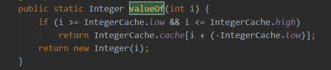

**实现：**

静态方法**valueOf(基本类型)**：将给定的基本类型转换成对应的包装类型；

使用反编译工具，将生成的Class文件在反编译为Java文件

```
class Auto//code2
{
  public static void main(String[] paramArrayOfString)
  {
    Integer localInteger = Integer.valueOf(10);
    int i = localInteger.intValue();
     Double localDouble = Double.valueOf(12.4D);
     double d = localDouble.doubleValue();
  }
}
```

**<u>其实jvm虚拟机根本不知道自动拆箱和自动装箱这回事</u>**

在将java源文件编译为class文件的过程中，javac编译器在自动装箱的时候调用了Integer.valueO**f()方法**

自动拆箱时有调用了intValue()方法

**自动装箱与拆箱中的“坑”**

Integer源码

```
public final class Integer extends Number implements Comparable<Integer> {
    private final int value;
```

1）Integer有一个**<u>实例域value</u>**，它保存了这个Integer所代表的**int型的值**，且它是**final的**，也就是说这个Integer对象一经构造完成，它所代表的值就**不能再被改变**。

```java
/*equals()方法判断的是:所代表的int型的值是否相等*/
 public boolean equals(Object obj) {
        if (obj instanceof Integer) {
            return value == ((Integer)obj).intValue();
        }
        return false;
}
```

2）Integer**重写**了equals()方法，它通过比较两个Integer对象的**<u>value</u>**（转换为基本类型int来比较），来判断是否相等。

```
/*Integer的构造方法，接受一个整型参数,Integer对象表示的int值，保存在value中*/
 public Integer(int value) {
        this.value = value;
 }
```

```
/*返回这个Integer对象代表的int值，也就是保存在value中的值*/
 public int intValue() {
        return value;
 }
```

5）调用intValue()，直接返回value的值。 通过3）和4）可以发现，默认情况下，在使用自动装箱时，VM会复用[-128,127]之间的Integer对象。

```
/**
  * 首先会判断i是否在[IntegerCache.low,Integer.high]之间
  * 如果是，直接返回Integer.cache中相应的元素
  * 否则，调用构造方法，创建一个新的Integer对象
  */
 public static Integer valueOf(int i) {
    assert IntegerCache.high >= 127;
    if (i >= IntegerCache.low && i <= IntegerCache.high)
        return IntegerCache.cache[i + (-IntegerCache.low)];
    return new Integer(i);
 }
```

4）调用valueOf(inti)方法时，首先判断i是否在[low,high]之间，如果是，则复用Integer.cache[i-low]。比如，如果Integer.valueOf(3)，直接返回Integer.cache[131]；如果i不在这个范围，则调用构造方法，构造出一个新的Integer对象。

```java
/**
  * 静态内部类，缓存了从[low,high]对应的Integer对象
  * low -128这个值不会被改变
  * high 默认是127，可以改变，最大不超过：Integer.MAX_VALUE - (-low) -1
  * cache 保存从[low,high]对象的Integer对象
 */
 private static class IntegerCache {
    static final int low = -128;
    static final int high;
    static final Integer cache[];

    static {
        // high value may be configured by property
        int h = 127;
        String integerCacheHighPropValue =
            sun.misc.VM.getSavedProperty("java.lang.Integer.IntegerCache.high");
        if (integerCacheHighPropValue != null) {
            int i = parseInt(integerCacheHighPropValue);
            i = Math.max(i, 127);
            // Maximum array size is Integer.MAX_VALUE
            h = Math.min(i, Integer.MAX_VALUE - (-low) -1);
        }
        high = h;

        cache = new Integer[(high - low) + 1];
        int j = low;
        for(int k = 0; k < cache.length; k++)
            cache[k] = new Integer(j++);
    }

    private IntegerCache() {}
}
```

重点是静态内部类IntegerCache，通过类名就可以发现：它是用来**缓存数据**的。它有一个数组，里面保存的是连续的Integer对象。

(a) low：代表缓存数据中最小的值，固定是-128。

(b) high：代表缓存数据中最大的值，它可以被该改变，默认是127。high最小是127，最大是Integer.MAX_VALUE-(-low)-1，如果**high超过了这个值，那么cache[ ]的长度就超过**Integer.MAX_VALUE了，也就溢出了。

(c) cache[]：里面保存着从[low,high]所对应的Integer对象，长度是high-low+1(因为有元素0，所以要加1)。

```
Integer  a1 = 1;
Integer  a2 = 1;
Integer  a3 = new Integer(1);
//会打印true，因为a1和a2是同一个对象,都是Integer.cache[129]
System.out.println(a1 == a2);
//false，a3构造了一个新的对象，不同于a1,a2
System.out.println(a1 == a3);
```

**了解基本类型的缓存池**

```
//基本数据类型的常量池是-128到127之间。
// 在这个范围中的基本数据类的包装类可以自动拆箱，比较时直接比较数值大小。
public static void main(String[] args) {
    //int的自动拆箱和装箱只在-128到127范围中进行，超过该范围的两个integer的 == 判断是会返回false的。
    Integer a1 = 128;
    Integer a2 = -128;
    Integer a3 = -128;
    Integer a4 = 128;
    System.out.println(a1 == a4); false
    System.out.println(a2 == a3); true

    Byte b1 = 127;
    Byte b2 = 127;
    Byte b3 = -128;
    Byte b4 = -128;
    //byte都是相等的，因为范围就在-128到127之间
    System.out.println(b1 == b2); true
    System.out.println(b3 == b4); true

    //
    Long c1 = 128L;
    Long c2 = 128L;
    Long c3 = -128L;
    Long c4 = -128L;
    System.out.println(c1 == c2); false
    System.out.println(c3 == c4); true

    //char没有负值
    //发现char也是在0到127之间自动拆箱
    Character d1 = 128;
    Character d2 = 128;
    Character d3 = 127;
    Character d4 = 127;
    System.out.println(d1 == d2); false
    System.out.println(d3 == d4); true
```

包装类的比较时**先比较是否是同一个类**，不是的话直接返回false.

---

**总结：**

（1）当需要一个**<u>对象</u>**的时候会**自动装箱**，比如Integer a = 10;equals(Object o)方法的参数是Object对象，所以需要装箱。

（2）当需要一个基本类型时会自动拆箱，比如int a = new Integer(10);算术运算是在基本类型间进行的，所以当遇到算术运算时会**自动拆箱**，比如代码中的 c == (a + b);

（3） 包装类型 == 基本类型时，包装类型自动拆箱；

需要注意的是：“==”在没遇到算术运算时，不会自动拆箱；基本类型只会自动装箱为对应的包装类型，代码中最后一条说明的内容。

在JDK 1.5中提供了自动装箱与自动拆箱，这其实是Java 编译器的语法糖，编译器通过调用包装类型的valueOf()方法实现自动装箱，调用xxxValue()方法自动拆箱。自动装箱和拆箱会有一些陷阱，那就是包装类型复用了某些对象。

（1）Integer**默认复用了[-128,127]这些对象**，其中**高位置可以修改**；

（2）Byte复用了全部256个对象[-128,127]；

（3）Short服用了[-128,127]这些对象；

（4）Long服用了[-128,127];

（5）Character复用了[0,127],Charater不能表示负数;

Double和Float是**连续不可数**的，所以**没法复用对象**，也就不存在自动装箱复用陷阱。

Boolean没有自动装箱与拆箱，它也复用了Boolean.TRUE和Boolean.FALSE，通过Boolean.valueOf(boolean b)返回的Blooean对象要么是TRUE，要么是FALSE，这点也要注意。

## 基本数据类型的存储方式

自动拆装箱与常量池油管

**存在栈中**

public void(int a) { int i = 1; int j = 1; } 方法中的i 存在虚拟机栈的局部变量表里，i是一个引用，j也是一个引用，它们都**指向局部变量表里的整型值 1**. int a是传值引用，所以a也会存在局部变量表。

**存在堆里**

class A{ int i = 1; A a = new A(); } i是类的成员变量。**<u>类实例化的对象存在堆中，所以成员变量也存在堆中</u>**，引用a存的是**<u>对象的地址</u>**，引用i存的是**<u>值</u>**，这个值1也会存在堆中。可以理解为**<u>引用i指向了这个值1</u>**。也可以理解为i就是1

包装类对象怎么存 

其实我们说的常量池也可以叫对象池。 比如String a= new String("a").intern()时会先在**<u>常量池</u>**找是否有“a"对象如果有的话**直接返回**“a"对象在常量池的地址，即让引用a指向常量”a"对象的内存地址。 public native String intern(); Integer也是同理。

所以基本数据类型的**包装类型可以在常量池查找对应值的对象**，找不到就会自动在常量池**创建**该值的对象。

而**String类型可以通过intern**来完成这个操作。

JDK1.7后，常量池被放入到**堆**空间中，这导致intern()函数的功能不同

```
String s = new String("1");  
s.intern();  
String s2 = "1";  
System.out.println(s == s2);  

String s3 = new String("1") + new String("1");  
s3.intern();  
String s4 = "11";  
System.out.println(s3 == s4);  

输出结果为：
JDK1.6以及以下：false false  
JDK1.7以及以上：false true
```

JDK1.6查找到常量池存在相同值的对象时会直接返回该对象的地址。

JDK 1.7后，intern方法还是会先去查询常量池中**是否有已经存在**，如果存在，则返回常量池中的**引用**，这一点与之前没有区别，区别在于，如果在常量池**找不到**对应的字符串，则**不会再将字符串拷贝**到常量池，而只是在常量池中**<u>生成一个对原字符串的引用</u>**。

那么其他字符串在常量池找值时就会返回另一个堆中对象的地址。

# String类

String 类有 11 种构造方法，这些方法提供不同的参数来初始化字符串，比如提供一个字符数组参数：

```
char[] helloArray = { 'r', 'u', 'n', 'o', 'o', 'b'};       
String helloString = new String(helloArray);
```

**String类是不可改变的。一旦创建无法改变    StringBuffer & StringBuilder可以修改**

## String基本用法

charAt()   

substring()  左闭右开

indexOf()

lastIndexOf()

byte[] arrs = str.getBytes("GBK")  字符串与**byte数组**间的相互转换

String str1 = new String(arrs,"GBK")

**<u>==运算符和equals之间的区别：引用指向的地址  和 引用指向的内容</u>**

```
String str1 = "mpp";
String str2 = "mpp";  引用原str1对象
String str3 = new String("mpp");  新建一个对象  地址不同

System.out.println(str1.equals(str2)); //true  内容相同
System.out.println(str1.equals(str3));   //true  内容相同
System.out.println(str1==str2);   //true   地址相同
System.out.println(str1==str3);   //false  地址不同
```

**String的连接：**

```
public void contact () {
    //连接方式
    String s1 = "a";
    String s2 = "a";
    String s3 = "a" + s2;
    String s4 = "a" + "a";
    String s5 = s1 + s2;
    //表达式只有常量时，编译期完成计算
    //表达式有变量时，运行期才计算，所以地址不一样
    System.out.println(s3 == s4); //false
    System.out.println(s3 == s5); //f
    System.out.println(s4 == "aa"); //true

}
```

## String、String builder和String buffer的区别

String拼接字符串时会产生很多无用的中间对象  性能

StringBuffer就是为了解决大量拼接字符串时产生很多中间对象问题而提供的一个类，提供append和add方法，可以将字符串添加到已有序列的末尾或指定位置，它的本质是一个**<u>线程安全的可修改的字符序列</u>**，把所有修改数据的方法都加上了synchronized。但是保证了线程安全是需要性能的代价的。

在很多情况下我们的字符串拼接操作**<u>不需要线程安全</u>**，这时候StringBuilder登场了，StringBuilder是JDK1.5发布的，它和StringBuffer本质上没什么区别，就是**去掉了保证线程安全的那部分，减少了开销**。

***二者都继承了 AbstractStringBuilder ，底层都是利用可修改的 char数组(JDK 9 以后是 byte数组)。***

> 1、在字符串**不经常发生变化**的业务场景优先使用String(代码更清晰简洁)。如常量的声明，少量的字符串操作(拼接，删除等)。
> 
> 2、在**单线程**情况下，如有大量的字符串操作情况，应该使用StringBuilder来操作字符串。不能使用String"+"来拼接而是使用，避免产生**大量无用的中间对象**，**耗费空间且执行效率低下**（新建对象、回收对象花费大量时间）。如JSON的封装等。
> 
> 3、在**多线程**情况下，如有大量的字符串操作情况，应该使用StringBuffer。如HTTP参数解析和封装等。

## String常量池

**intern()函数：**

在1.6中，intern的处理是 先判断字符串常量**是否在字符串常量池**中，如果存在直接**返回该常量**，如果没有找到，则将该**字符串常量加入到字符串常量区**，也就是在字符串常量区**建立**该常量；

在1.7中，intern的处理是 先判断字符串常量是否在字符串常量池中，如果存在直接返回该常量，如果没有找到，说明该字符串**常量在堆**中，则处理是把**堆区该对象的<<u>*引用*</u>> 加入到字符串常量池**中，以后别人拿到的是***<u>该字符串常量的引用</u>***，实际**存在<堆>**中；【**调用**该方法的**字符串对象**要么**在堆区要么在常量池**中的】

## 常量池的分类【理解即可】

**class文件*常量池***

在Class文件中除了有类的版本【高版本可以加载低版本】、字段、方法、接口等描述信息外，还有一项信息是**常量池(Constant Pool Table)【此时没有加载进内存，也就是在文件中】**，用于存放**编译期生成的各种** <u>***字面量和符号引用***</u>
**<u>字面量</u>**
字面量类似与我们平常说的常量，主要包括：

1. **文本字符串**：就是我们在代码中能够看到的**字符串**，例如String a = “aa”。其中”aa”就是字面量。
2. 被**final修饰**的变量。                                                                                                                                                                                 
<u>**符号引用**</u>
主要包括以下常量：

1. 类和接口和**全限定名**：例如对于String这个类，它的**全限定名**就是java/lang/String。
2. 字段的名称和**描述符**：所谓字段就是类或者接口中**声明的变量**，包括类级别变量（static)和实例级的变量。
3. 方法的名称和**描述符**。所谓描述符就相当于方法的**参数类型+返回值类型**。

**<u>运行时常量池</u>**

我们知道类**加载器会加载对应的Class文件**，而上面的class文件中的常量池，会在类加载后进入**方法区**中的运行时常量池【此时存在在内存中】。并且需要的注意的是，**运行时常量池是<u>全局共享</u>的，多个类共用一个运行时常量池**。并且class文件中常量池多个相同的字符串在运行时常量池**只会存在一份**。
注意运行时常量池存在于**方法区**中。

**<u>字符串常量池</u>**

　　看名字我们就可以知道字符串常量池会用来存放**字符串**，也就是说**常量池中的文本字符串**会在类加载时进入**字符串常量池**。
那字符串常量池和运行时常量池是什么关系呢？上面我们说**常量池中的字面量**会在**类加载后**进入运**行时常量池**，其中字面量中有包括**文本字符串**，显然从这段文字我们可以知道：

***<u>字符串常量池存在于运行时常量池中。也就存在于方法区中。</u>***
不过在周志明那本深入java虚拟机中有说到，到了JDK1.7时，字符串常量池就被移出了方法区，<u>*转移到了**堆**里了*</u>。
那么我们可以推断，到了JDK1.7以及之后的版本中，**运行时常量池并没有包含字符串常量池**，运行时常量池存在于**方法区**中，而字符串常量池存在于**堆**中。


## 问题解析
---
**问题一**
    String str1 = new String("1");
　　解析：首先此行代码创建了**两个对象**，在执行前会在==常量池==中创建一个"1"的对象，然后执行该行代码时**new一个"1"的对象存放在*堆区***中；然后**str1指向堆区中的对象**；

    str1.intern();
　　解析：该行代码首先查看"1"字符串有没有存在**常量池**中，此时存在则直接**返回**该常量，这里返回后没有引用接受他，【假如不存在的话在 jdk1.6中会在常量池中建立该常量，在jdk1.7以后会把堆中该对象的**引用放在常量池**中】

    String str2 = "1";
　　解析：此时"1"已经**存在**在常量池中，str2指向**常量池中的对象**；


    System.out.println(str1 == str2);  //结果是 false or true？
　　解析：str1指向堆区的对象，str2指向常量池中的对象，两个==引用指向的地址不同==，false

    String str3 = new String("2") + new String("2");
　　解析：此行代码执行的底层执行过程是 首先使用StringBuffer的append方法将"2"和"2"**拼接**在一块，然后调用**toString方法new**出“22”；所以此时的“22”字符串是==创建在堆区==的；

    t3.intern();
　　解析：此行代码执行时字符串常量池中没有"22",所以此时在jdk1.6中会在字符串常量池中创建"22",而在jdk1.7以后会==把堆中该对象的引用放在常量池==中；

    String str4 = "22";
　　解析：此时的str4在jdk1.6中会指向方法区，而在jdk1.7中会==指向堆区的引用==；

    System.out.println(str3 == str4); //结果是 false or true？
　　解析：很明显了 jdk1.6中为false 在jdk1.7中为true；

**总结：**
如果直接通过方法new一个String对象 则会先在常量池中创建，再在堆区创建对象（但是该引用指向堆区）

通过拼接：==只会在堆区创建对象==  **而不会在常量池中创建！！！**

---
**问题2**
　String str1 = "aaa";
　解析：str1指向方法区 常量池

  String str2 = "bbb";
　解析：str2指向方法区 

  String str3 = "aaabbb";
  解析：str3指向方法区 

  String str4 = str1 + str2;
  解析：此行代码上边已经说过原理。str4指向堆区

  String str5 = "aaa" + "bbb";
  解析：该行代码重点说明一下，jvm对其有**优化**处理，也就是在**编译阶段**就会将这两个字符串常量进行拼接，也就是"aaabbb";所以他是在**方法区**中的；’

  System.out.println(str3 == str4); // false or true
　解析：很明显 为false， 一个指向堆 一个指向方法区

  System.out.println(str3 == str4.intern()); // true or false
 解析：jdk1.6中str4.intern会把“aaabbb”放在方法区（==在方法区新建一个对象==），1.7后在堆区==返回堆区对象的引用==，所以在1.6中会是true 但是在1.7中是false

  System.out.println(str3 == str5);// true or false
  解析：都指向字符串常量区，字符串常量区在方法区，相同的字符串只存在一份，其实这个地方在扩展一下，因为方法区的字符串常量是共享的，在两个线程同时共享这个字符串时，如果一个线程改变他会是怎么样的呢，其实这种场景下是线程安全的，jvm会将改变后的字符串常量在
   　　字符串常量池中重新创建一个处理，可以保证线程安全

==总结==
* String str1 = "aaa" 此时是==在方法区中==生成字符串对象，**执行了intern以后，会在方法区新建一个对于堆区对象的引用**
* 按`String str1 = new String("1");`创建：现在方法区创建一个，再在堆区创建一个
* 若是没有使用变量名而是**直接用字符串来进行拼接**就会在==编译阶段==对字符串常量拼接，在方法区中

---
**问题3**
String t1 = new String("2");
解析：创建了两个对象，==在字符串常量池中也有==t1指向堆区

String t2 = "2";
解析：t2指向字符串常量池 ==此时2已经在常量池中，所以直接指向常量池而不用再在堆区创建一个==

t1.intern();
解析:字符串常量池已经存在该字符串，直接返回；

System.out.println(t1 == t2); //false or true
解析：很明显 false

String t3 = new String("2") + new String("2");
解析：过程同问题1 t3指向==堆区==

String t4 = "22";
解析：t4 在1.6 和 1.7中指向不同 在常量池中创建一个该引用
t3.intern();
解析： 字符串常量池中已经存在该字符串 直接返回

System.out.println(t3 == t4); //false or true
解析： 很明显为 false 指向不同的内存区

---
**问题4**

``` 
    Integer a = 1;
    Integer b = 2;
    Integer c = 3;
    Integer d = 3;
    Integer e = 321;
    *Integer f = 321;*
    Long g = 3L;

    System.out.println(c == d);
    System.out.Println(e == f);
    System.out.println(c == (a + b));
    System.out.println(c.equals(a+b));
    System.out.println(g == (a + b));
    System.out.println(g.equals(a + b));
```

(1)内存中有一个**java基本类型封装类的常量池**。这些类包括Byte, Short, Integer, Long, Character, Boolean。需要注意的是，**Float和Double这两个类并没有对应的常量池**。


(2)上面5种整型的包装类的对象是存在**范围限定**的；范围在==-128~127==存在在常量池，范围以外则在**堆区进行分配**。


==(3)在周志明的那本虚拟机中有这样一句话：包装类的
“ == ”运行符在**不遇到算术运算**的情况下**不会自动拆箱**，以及他们的***equals()方法不处理数据类型的关系***，通俗的讲也就是 “ == ”两边如果*有算术运算*， 那么*自动拆箱和进行数据类型转换*处理，比较的是**数值**等不等。==


(4)Long的equals方法会先判断是否是Long类型。


(5)无论是Integer还是Long，他们的equals方法**比较的是数值**。
``` 
Integer c = 3;
Integer d = 3;
```
System.out.println(c == d)。
解析：由于**常量池**的作用，c与d指向的是**同一个对象(指向常量中同一个对象)**(注意此时的==比较的是对象，也就是地址，而不是数值)。因此为true
    Integer e = 321;
    Integer f = 321;
System.out.println(e == f)。
由于321超过了127，因此**常量池失去了作用**，所以e和f数值虽然相同，但**不是同一个对象**，以此为false。


System.out.println(c == (a+b))。
此时==两边有算术运算，会进行**拆箱**，因此此时比较的是**数值**，而并非对象。因此为true。


System.out.println(c.equals(a+b))
c与a+b的**数值**相等，为true。


System.out.pirnln(g == (a + b))   g为Long类型
由于==两边有算术运算，所以比较的是数值，因此为true。


System.out.println(g.equals(a+b))。
Long类型**的equal在比较时候**，会先判断a+b是否为Long类型，显然a+b不是，因此false
总结：
equals()方法不处理数据类型转换  
==处理数据类型转换


## String类的源码分析

String类型的equals
```
//字符串的equals方法
public boolean equals(Object anObject) {
    if (this == anObject) {
         return true;
    }
    if (anObject instanceof String) {
         String anotherString = (String)anObject;
         int n = value.length;
         if (n == anotherString.value.length) {
         char v1[] = value;
         char v2[] = anotherString.value;
         int i = 0;
         while (n-- != 0) {
             if (v1[i] != v2[i])
                return false;
                i++;
             }
             return true;
         }
  }
    return false
}
```

**StringBuffer和StringBuilder**
底层是继承父类的可变字符数组value

``` processing
/**
- The value is used for character storage.
  */
  char[] value;
  初始化容量为16
/**

- Constructs a string builder with no characters in it and an
- initial capacity of 16 characters.
  */
  public StringBuilder() {
  super(16);
  }
  这两个类的append方法都是来自父类AbstractStringBuilder的方法

public AbstractStringBuilder append(String str) {
    if (str == null)
        return appendNull();
    int len = str.length();
    
    ensureCapacityInternal(count + len);
    
    str.getChars(0, len, value, count);
    count += len;
    return this;
}
@Override
public StringBuilder append(String str) {
    super.append(str);
    return this;
}

@Override
public synchronized StringBuffer append(String str) {
    toStringCache = null;
    super.append(str);
    return this;
}
```


**append方法**
Stringbuffer在大部分涉及字符串修改的操作上加了synchronized关键字来保证*线程安全，效率较低*。
String类型在使用 + 运算符例如
String a = "a"
a = a + a;时，实际上先把a**封装成stringbuilder**，调用==append方法后再用tostring返回==，所以当大量使用字符串加法时，会**大量地生成stringbuilder实例**，这是十分**浪费**的，这种时候应该**用stringbuilder来代替string**。

**扩容**
注意在append方法中调用到了一个函数
==ensureCapacityInternal(count + len);== 该方法是计算append之后的**空间是否足够，不足的话需要进行扩容**

``` 
public void ensureCapacity(int minimumCapacity) {
    if (minimumCapacity > 0)
        ensureCapacityInternal(minimumCapacity);
}
private void ensureCapacityInternal(int minimumCapacity) {
    // overflow-conscious code
    if (minimumCapacity - value.length > 0) {
        value = Arrays.copyOf(value,
                newCapacity(minimumCapacity));
    }
}
```
如果新字符串长度大于value数组长度则进行扩容
扩容后的长度一般为原来的两倍 + 2；
假如扩容后的长度超过了jvm支持的**最大数组长度**MAX_ARRAY_SIZE。
考虑两种情况：
如果新的字符串长度超过int最大值，则抛出异常，否则直接使用数组最大长度作为新数组的长度。

``` 
private int hugeCapacity(int minCapacity) {
    if (Integer.MAX_VALUE - minCapacity < 0) { // overflow
        throw new OutOfMemoryError();
    }
    return (minCapacity > MAX_ARRAY_SIZE)
        ? minCapacity : MAX_ARRAY_SIZE;
}
```
---
**删除**
这两个类型的删除操作：都是调用父类的delete方法进行删除

``` 
public AbstractStringBuilder delete(int start, int end) {
    if (start < 0)
        throw new StringIndexOutOfBoundsException(start);
    if (end > count)
        end = count;
    if (start > end)
        throw new StringIndexOutOfBoundsException();
    int len = end - start;
    if (len > 0) {
        System.arraycopy(value, start+len, value, start, count-end);
        count -= len;
    }
    return this;
}
```
将剩余字符重新拷贝到字符数组value  System.arraycopy来拷贝数组，速度快

---
**system.arraycopy方法**

> 在主流高性能的JVM上(HotSpotVM系、IBMJ9VM系、JRockit系等等)可以认为System.arraycopy()在拷贝数组时是**可靠高效**的——如果发现不够高效的情况，请报告performance
> bug，肯定很快就会得到改进。
> 
> java.lang.System.arraycopy()方法在Java代码里声明为一个native方法。所以最naïve的实现方式就是通过JNI调用JVM里的native代码来实现。
> 
> String的不可变性 关于String的不可变性，这里转一个不错的回答
> 
> 什么是不可变？
> String不可变很简单，如下图，给一个已有字符串"abcd"第二次赋值成"abcedl"，不是在原内存地址上修改数据，而是重新指向一个新对象，新地址。


## String和JVM的关系
java栈、java堆、方法区、常量池

java栈（线程私有数据区）：
每个Java虚拟机**线程**都有自己的Java虚拟机栈，Java虚拟机栈用来存放栈帧，每个**方法被执行**的时候都会同时创建一个栈帧（Stack Frame）用于存储**局部变量表、操作栈、动态链接、方法出口**等信息。每一个方法被调用直至执行完成的过程，就对应着一个栈帧在虚拟机栈中从入栈到出栈的过程。

---
java堆（线程共享数据区）：
在虚拟机启动时创建，此内存区域的唯一目的就是==存放对象实例==，几乎所有的对象实例都在这里分配。

---
方法区（线程共享数据区）：
方法区在虚拟机启动的时候被创建，它存储了**每一个类的结构信息**，例如*运行时常量池、字段和方法数据、构造函数和普通方法的字节码内容、还包括在类、实例、接口初始化时用到的特殊方法*。在JDK8之前**永久代**是方法区的一种实现，而==JDK8元空间替代了永久代，永久代被移除，也可以理解为元空间是方法区的一种实现==。

---
常量池（线程共享数据区）：
常量池常被分为两大类：**静态**常量池和**运行时**常量池。
静态常量池也就是**Class文件中的常量池**，存在于Class文件中。
运行时常量池（Runtime Constant Pool）是==方法区的一部分==，存放一些**运行时**常量数据。

---
==字符串常量池==
字符串常量池存在运行时常量池之中（在JDK**7之前存在运行时常量池**之中，在JDK7已经将其**转移到堆**中）

字符串常量池的存在使JVM**提高了性能和减少了内存开销**。

使用字符串常量池，每当我们使用==字面量==（String s=”1”;）创建字符串常量时，JVM会首先检查字符串常量池，如果该字符串已经存在常量池中，那么就将此字符串对象的==地址==赋值给==引用s（引用s在Java栈中）==。如果字符串不存在常量池中，就会实例化该字符串并且将其放到常量池中，并将此字符串对象的地址赋值给引用s（引用s在Java栈中）。

使用字符串常量池，每当我们使用关键字==new==（String s=new String(”1”);）创建字符串常量时，
JVM会**首先检查字符串常量池**，如果该字符串**已经存在**常量池中，那么**不再**在字符串常量池**创建该字符串对象**，而直接**堆中**复制该对象的副本，然后将堆中对象的**地址赋值给引用s**，如果字符串**不存在**常量池中，就会**实例化**该字符串并且将其**放到常量池**中，然后在==堆中复制==该对象的副本，然后将==堆中对象的地址赋值给引用s==。

## String为什么不可变
翻开JDK源码，java.lang.String类起手前三行：

``` 
public final class String implements java.io.Serializable, Comparable<String>, CharSequence {   
    /** String本质是个char数组. 而且用final关键字修饰.*/     
    private final char value[];  ...  ...
}
```
String类用**final修饰**，==不可继承==  String的主力成员字段value是char[]数组  final修饰
==final修饰的字段创建以后就不可改变==
但也只是value这个**引用地址**不可变，**Array数组可变**啊！ 
Array变量只是stack上的一个**引用**，数组的**本体结构在heap堆**。

String类里的value用final修饰，只是说**stack里的这个叫value的==引用地址==不可变**。没有说==堆里==array本身数据不可变。看下面这个例子，

``` 
final int[] value={1,2,3} ；
int[] another={4,5,6};
 value=another;    //编译器报错，final不可变 value用final修饰，编译器不允许我把value指向堆区另一个地址。
但如果我直接对数组元素动手，分分钟搞定。

 final int[] value={1,2,3};
 value[2]=100;  //这时候数组里已经是{1,2,100}   
```
 所以String是不可变，关键是因为SUN公司的工程师。
 在后面所有String的方法里**很小心的没有去动Array里的元素**，没有暴露内部成员字段。private final char value[]这一句里，private的**私有访问权限**的作用都比final大。而且设计师还很小心地把整个String设成**final禁止继承**，==避免被其他人继承后破坏==。所以String是不可变的关键都在==底层的实现==，而不是一个final。考验的是工程师==构造数据类型，封装数据的功力==。 
**编译器不允许更改value指向的地址   但可以直接更改所指向地址的数组元素**

---
**不可变有什么好处？？**
==就是为了安全==

> 1 首先final修饰的**类**==只保证不能被继承==，并且该类的==对象==在==堆内存中的地址==不会被改变。
> 
> 2 但是持有String对象的==引用==本身是可以改变的，比如他可以==指向其他的对象==。
> 
> 3 final修饰的char数组保证了char数组的**引用**不可变。但是可以通过char[0] =
> 'a’**来修改值**。不过String内部并==不提供方法来完成这一操作==，所以String的==不可变也是基于代码封装和访问控制的。==

栗子：
final类的内部数据可以改变

```
final class Fi {
    int a;
    final int b = 0;
    Integer s;
}

final char[]a = {'a'};
final int[]b = {1};

@Test
public void final修饰类() {

    //引用没有被final修饰，所以是可变的。
    //final只修饰了Fi类型，即Fi实例化的对象在堆中内存地址是不可变的。
    //虽然内存地址不可变，但是可以对内部的数据做改变。
    
    Fi f = new Fi();
    f.a = 1;
    System.out.println(f);
    f.a = 2;
    System.out.println(f);
    //改变实例中的值并不改变内存地址。
    Fi ff = f;
    //让引用指向新的Fi对象，原来的f对象由新的引用ff持有。
    //引用的指向改变也不会改变原来对象的地址
    f = new Fi();
    System.out.println(f);
    System.out.println(ff);
}
```

## String常用工具类
需要对字符串进行很多固定的操作,而这些操作在JDK/JRE中又*没有预置*,于是我们想到了apache-commons组件,但是它也不能完全覆盖我们的业务需求,所以很多时候还是要自己写点代码的,下面就是基于apache-commons组件写的部分常用方法:

```
MAVEN依赖
<dependency>
	<groupId>org.apache.commons</groupId>
	<artifactId>commons-lang3</artifactId>
	<version>${commons-lang3.version}</version>
 </dependency>
```

 

# 面向对象

## 面向对象三大特征

(1)封装(Encapsulation)

所谓封装，也就是把客观事物**封装成抽象的类**，并且类可以把自己的数据和方法只让**可信的类或者对象**操作，对不可信的进行信息**隐藏**。封装是面向对象的特征之一，是对象和类概念的主要特性。简单的说，一个类就是一个**<u>封装了数据以及操作这些数据的代码的逻辑实体</u>**。在一个对象内部，某些代码或某些数据可以是**私有的**，不能被外界访问。通过这种方式，对象对内部数据提供了**不同级别的保护**，以防止程序中无关的部分意外的改变或错误的使用了对象的私有部分。

(2)继承(Inheritance)

继承是指这样一种能力：它可以使用现有类的所有功能，并在**无需重新编写**原来的类的情况下对这些**功能进行扩展**。通过继承创建的新类称为**“子类”或“派生类”**，被继承的类称为**“基类”、“父类”或“超类”**。继承的过程，就是从**<u>*一般到特殊*</u>** 的过程。要实现继承，可以通过“继承”（Inheritance）和“组合”（Composition）来实现。继承概念的实现方式有二类：**实现继承与接口继承**。实现继承是指直接使用**基类的属性和方法而无需额外编码**的能力；接口继承是指**仅使用属性和方法**的<u>**名称**</u>、但是子类必须**提供实现**的能力；

(3)多态(Polymorphism)

所谓多态就是指一个类实例的相同方法在不同情形有**不同表现形式**。多态机制使具有**不同内部结构**的对象可以**共享相同的外部接口**。这意味着，虽然针对不同对象的**具体操作不同**，但通过一个**公共的类**，它们（那些操作）可以通过**相同的方式**予以调用。

最常见的多态就是将***<u>子类传入父类参数中，运行时调用父类方法时通过传入的子类决定具体的内部结构或行为</u>***。

## 五大基本原则

1. ***<u>单一职责原则  (Single-Reposibility Principle)</u>***

核心思想：**<u>一个类，最好只做一件事，只有一个引起它的变化</u>**。单一职责原则可以看做是**低耦合、高内聚**在面向对象原则上的引申，将职责定义为**引起变化**的原因，以**提高内聚性**来减**少引起变化的原因**。职责**过多**，可能引起它变化的原因就越多，这将导致**职责依赖**，相互之间就产生影响，从而大大损伤其内聚性和耦合度。通常意义下的单一职责，就是指只有一种单一功能，不要为类实现过多的功能点，以保证实体只有一个引起它变化的原因。 专注，是一个人优良的品质；同样的，**单一也是一个类的优良设计**。交杂不清的职责将使得代码看起来特别 别扭**牵一发而动全身**，有失美感和必然导致丑陋的系统错误风险。

2. ***<u>开放封闭原则  (Open-Closed Principle)</u>***

其核心思想是：软件实体应该是**可扩展的**，而**不可修改**的。也就是，**对扩展开放，对修改封闭**的。开放封闭原则主要体现在两个方面 : 

​        1、对扩展开放，意味着有**新的需求或变化**时，可以对现有代码进行**扩展**，以适应新的情况。    

​        2、对修改封闭，意味着类一旦设计完成，就可以独立完成其工作，而不要对其进行任何尝试的修改。 

实现开放封闭原则的核心思想就是**对抽象编程**，而不对具体编程，因为**抽象相对稳定**。让**类依赖于固定的抽象**，所以**修改就是封闭的**；而通过面向对象的继承和多态机制，又可以实现**对抽象类的继承**，通过**覆写其方法**来改变固有行为，**实现新的拓展方法**，所以就是**开放**的。 “需求总是变化”没有不变的软件，所以就需要用封闭开放原则来封闭变化满足需求，同时还能保持软件**内部的封装体系稳定**，不被需求的变化影响。

3. ***<u>Liskov替换原则（Liskov-Substitution Principle）</u>***

其核心思想是：**子类必须能够替换其基类**。这一思想体现为对**继承机制**的约束规范，只有子类能够替换基类时，才能保证系统在运行期内**识别子类**，这是保证**继承复用**的基础。在父类和子类的具体行为中，必须严格把握继承层次中的关系和特征，**将基类替换为子类，程序的行为不会发生任何变化**。同时，这一约束反过来则是不成立的，子类可以替换基类，但是基类不一定能替换子类。 Liskov替换原则，主要着眼于**对抽象和多态建立在继承的基础上**，因此只有遵循了Liskov替换原则，才能保证**继承复用是可靠地**。实现的方法是**面向<u>接口</u>编程**：将公共部分抽象为基类接口或抽象类，通过Extract Abstract Class，在子类中通过覆写父类的方法实现新的方式支持同样的职责。 Liskov替换原则是关于继承机制的设计原则，违反了Liskov替换原则就必然导致违反开放封闭原则。 Liskov替换原则能够保证系统具有良好的拓展性，同时实现基于多态的抽象机制，能够减少代码冗余，避免运行期的类型判别。

4. ***<u>依赖倒置原则（Dependency-Incersion Principle）</u>***

其核心思想是：**依赖于抽象**。具体而言就是**高层模块不依赖于底层模块**，二者都**同依赖于抽象**；抽象不依赖于具体，**具体依赖于抽象**。 我们知道，依赖一定会存在于类与类、模块与模块之间。当两个模块之间存在紧密的耦合关系时，最好的方法就是分离接口和实现：在依赖之间定义一个**抽象的接口**使得**高层模块调用接口**，而**底层模块实现接口的定义**，以此来有效控制耦合关系，达到依赖于抽象的设计目标。 抽象的稳定性决定了系统的稳定性，因为抽象是不变的，依赖于抽象是面向对象设计的精髓，也是依赖倒置原则的核心。 依赖于抽象是一个通用的原则，而某些时候依赖于细节则是在所难免的，必须权衡在抽象和具体之间的取舍，方法不是一层不变的。依赖于抽象，就是**对接口编程，不要对实现编程**。

5. 接口隔离原则（Interface-Segregation Principle）

其核心思想是：使用**多个小的专门的接口**，而不要使用一个大的总接口。 具体而言，接口隔离原则体现在：接口应该是**内聚的**，应该**避免“胖”接口**。一个类对另外一个类的依赖应该**建立在最小的接口**上，不要强迫依赖不用的方法，这是一种**接口污染**。 接口有效地将细节和抽象隔离，体现了对抽象编程的一切好处，接口隔离强调接口的单一性。而胖接口存在明显的***<u>弊端</u>***，会导致实现的类型**必须完全实现接口的所有方法、属性**等；而某些时候，实现类型**并非需要所有的接口定义**，在设计上这是“浪费”，而且在实施上这会带来潜在的问题，**对胖接口的修改**将导致一连串的客户端程序需要修改，有时候这是一种**灾难**。在这种情况下，将***<u>胖接口分解为多个特点的定制化方法</u>***，使得客户端**仅仅依赖于它们的实际调用的方法**，从而解除了客户端**不会依赖于它们不用的 *方法*** 。 分离的手段主要有以下两种：1、委托分离，通过增加一个**新的类型**来委托客户的请求，隔离客户和接口的直接依赖，但是会增加系统的开销。2、多重继承分离，通过**接口多继承**来实现客户的需求，这种方式是较好的。

# 平台无关性

Java是一门跨平台的语言，平台无关性

**什么是平台无关性：**

一次编译，到处执行。用java创建的**二进制程序**，能够不加改变的**运行于多个平台**

**平台无关性好处：**

可以运行在各种设备上，尤其是嵌入式设备（打印机、扫描仪、传真机）

**实现：**

对于Java的平台无关性的支持，就像对安全性和网络移动性的支持一样，是分布在整个Java体系结构中的。其中扮演者重要的角色的有**Java语言规范**、**Class文件**、**Java虚拟机（JVM）**等。

在Java平台中，想要把Java文件，编译成二进制文件，需要经过两步编译，前端编译和后端编译：

**前端编译**主要指与源语言有关但与目标机无关的部分。Java中，我们所熟知的`javac`的编译就是前端编译。除了这种以外，我们使用的很多IDE，如eclipse，idea等，都内置了前端编译器。**主要功能就是把`.java`代码转换成`.class`代码。**

这里提到的`.class`代码，其实就是Class文件。

**后端编译**主要是将中间代码再翻译成**机器语言**。Java中，这一步骤就是Java虚拟机来执行的。

Java虚拟机、Class文件、Java语言规范

**1. java虚拟机：**

对于不同的硬件和操作系统，最主要的区别就是指令不同。比如同样执行a+b，A操作系统对应的二进制指令可能是10001000，而B操作系统**对应的指令**可能是11101110。那么，想要做到跨平台，最重要的就是可以根**据对应的硬件和操作系统生成对应的二进制指令。**有了Java虚拟机，想要执行a+b操作，**A操作系统**上面的虚拟机就会把指令翻译成10001000，**B操作系统**上面的虚拟机就会把指令翻译成11101110

而这一工作，主要由我们的Java虚拟机完成。虽然Java语言是平台无关的，但是JVM确实平台有关的，不同的操作系统上面要安装对应的JVM。

所以，Java之所以可以做到跨平台，是因为**Java虚拟机充当了桥梁**。他扮演了运行时Java程序与其下的硬件和操作系统之间的**缓冲**角色

**2. 字节码：**

各种不同的平台的虚拟机都使用统一的程序存储格式——**字节码（ByteCode）**是构成平台无关性的另一个基石。Java虚拟机只与**由字节码组成的Class文件进行交互**。

我们说Java语言可以Write Once ,Run Anywhere。这里的Write其实指的就是**生成Class文件**的过程。

**<u>因为Java Class文件可以在任何平台创建，也可以被任何平台的Java虚拟机装载并执行，所以才有了Java的平台无关性。</u>**

**3. java语言规范：**

已经有了**统一的Class文件**，以及可以在**不同平台**上**将Class文件翻译成对应的二进制文件**的**Java虚拟机**，Java就可以彻底实现跨平台了吗？？？

Java中基本数据类型的值域和行为都是**由其自己定义**的。而C/C++中，基本数据类型是**由它的占位宽度决定**的，占**<u>位宽度则是由所在平台决定</u>**的。所以，在不同的平台中，对于同一个C++程序的编译结果会出现不同的行为。

举一个简单的例子，对于int类型，在Java中，**int占4个字节**，这是固定的。

但是在C++中却不是固定的了。在16位计算机上，int类型的长度可能为两字节；在32位计算机上，可能为4字节；当64位计算机流行起来后，int类型的长度可能会达到8字节。（各不相同）

**小结**

对于Java的平台无关性的支持是**分布在整个Java体系结构中**的。其中扮演着重要角色的有**Java语言规范**、**Class文件**、**Java虚拟机**等。

* Java语言规范
  * 通过规定Java语言中基本数据类型的取值范围和行为
* Class文件
  * 所有Java文件都要编译成统一的class
* Java虚拟机
  * 通过Java虚拟机将Class文件转成对应平台的二进制文件等

Java的平台无关性是**建立在<u>Java虚拟机的平台有关性</u>基础之上**的，是因为Java虚拟机屏蔽了<u>底层操作系统和硬件的差异。</u>

**语言无关性：**

JVM其实并不是和Java文件进行交互的，而是和**<u>Class文件</u>**，也就是说，其实**JVM运行的时候，并不依赖于Java**语言。如Groovy、Scala、Jython，**这些语言也可以被编译成字节码（Class文件），而虚拟机并不关心字节码是由那种语言编译而来的 **

# 值传递

> 错误理解一：值传递和引用传递，区分的条件是传递的内容，如果是个值，就是值传递。如果是个引用，就是引用传递。
> 
> 错误理解二：Java是引用传递。
> 
> 错误理解三：传递的参数如果是普通类型，那就是值传递，如果是对象，那就是引用传递。

*<u>**实参与形参：**</u>*

比如java中的main方法：`public static void main(String[] args)`

* 形式参数：定义函数名和函数体的时候使用的参数，目的是用来接受调用该函数时传入的参数
* 实际参数：在调用有参函数时，主调函数和被调函数之间有数据传递关系。在主调函数中调用一个函数时，函数名后面括号中的参数称为实际参数。

```
public static void main(String[] args) {
  ParamTest pt = new ParamTest();
  pt.sout("Hollis");   //实际参数为 Hollis
}

public void sout(String name) {   //形式参数为 name 
  System.out.println(name);
}
```

形参只在定义的函数体内部起作用

实参是用于传入调用的函数的

***<u>实际参数是调用有参方法的时候真正传递的内容，而形式参数是用于接收实参内容的参数。</u>***

---

***<u>值传递与引用传递：</u>***

把实际参数传递给形式参数

* 值传递（pass by value） 是指在调用函数时将实际参数**复制**一份**传递到函数**中，这样在函数中对参数进行修改，将不会影响到实际参数
* 引用传递（pass by reference）在调用函数时将  **<u>*实际参数的地址*</u>** 直接传递到函数中，那么在**函数中对参数所进行的修改**，将影响到实际参数

**地址！！！！**

```
public static void main(String[] args) {
  ParamTest pt = new ParamTest();

  User hollis = new User();
  hollis.setName("Hollis");
  hollis.setGender("Male");
  pt.pass(hollis);
  System.out.println("print in main , user is " + hollis);
}

public void pass(User user) {
  user.setName("hollischuang");
  System.out.println("print in pass , user is " + user);
}
print in pass , user is User{name='hollischuang', gender='Male'}
print in main , user is User{name='hollischuang', gender='Male'}
```

值被改变了？？难道是因为传进去的是对象？引用传递？？

```
public static void main(String[] args) {
  ParamTest pt = new ParamTest();

  String name = "Hollis";
  pt.pass(name);
  System.out.println("print in main , name is " + name);
}

public void pass(String name) {
  name = "hollischuang";
  System.out.println("print in pass , name is " + name);
}
print in pass , name is hollischuang
print in main , name is Hollis
```

---

## **Java中的值传递**

传递的是User对象，我们试着改变他的**name属性的值**，然后检查是否有改变。其实，在实验方法上就错了，当然得到的结论也就有问题

你有一把钥匙，当你的朋友想要去你家的时候，如果你**<u>直接</u>**把你的钥匙给他了，这就是引用传递。这种情况下，如果他对这把钥匙做了什么事情，比如他在钥匙上刻下了自己名字，那么这把钥匙还给你的时候，你自己的钥匙上也会多出他刻的名字。

你有一把钥匙，当你的朋友想要去你家的时候，你**<u>复刻</u>**了一把新钥匙给他，自己的还在自己手里，这就是值传递。这种情况下，他对这把钥匙**做什么都不会影响你手里的这把钥匙**。

但是，不管上面那种情况，你的朋友拿着你给他的钥匙，进到你的家里，把你家的电视砸了。那你说你会不会**受到影响**？而我们在pass方法中，**改变user对象的name属性**的值的时候，不就是在“**砸电视**”么。

**真正的改变参数**

```
public static void main(String[] args) {
  ParamTest pt = new ParamTest();

  User hollis = new User();
  hollis.setName("Hollis");
  hollis.setGender("Male");
  pt.pass(hollis);
  System.out.println("print in main , user is " + hollis);
}

public void pass(User user) {
  user = new User();
  user.setName("hollischuang");
  user.setGender("Male");
  System.out.println("print in pass , user is " + user);
}
print in pass , user is User{name='hollischuang', gender='Male'}
print in main , user is User{name='Hollis', gender='Male'}
```

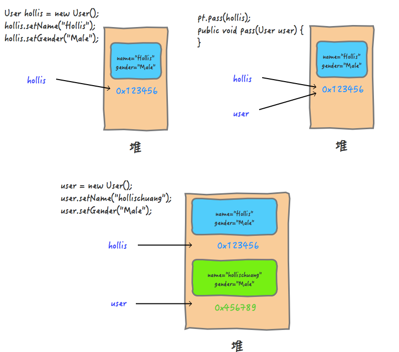

稍微解释下这张图，当我们在main中创建一个User对象的时候，在**堆中开辟一块内存**，其中保存了name和gender等数据。然后hollis持有该内存的地址**<u>*0x123456*</u>**（图1）。当尝试调用pass方法，并且hollis作为实际参数传递给形式参数user的时候，***<u>会把这个地址0x123456交给user</u>***，这时，user也**<u>指向了这个地址</u>**（图2）。然后在pass方法内对**参数进行修改**的时候，即**<u>user = new User()</u>**;，会**<u>重新开辟一块0X456789的内存</u>**，赋值给user。后面对user的任何修改都不会改变内存`0X123456`的内容（图3）。

（修改参数：即user指向的地址，就是令user**重新开辟一块堆区** 就有了**新的地址**）

上面这种传递是什么传递？肯定不是引用传递，如果是引用传递的话，在`user=new User()`的时候，实际参数的引用也应该改为指向`0X456789`，但是实际上并没有。

通过概念我们也能知道，这里是把**<u>实际参数的引用的   *地址*   复制了一份</u>**，传递给了形式参数。所以，**上面的参数其实是值传递，把<u>*实参对象引用的地址当做值传递给了形式参数*</u>。**

---

**砸电视？**

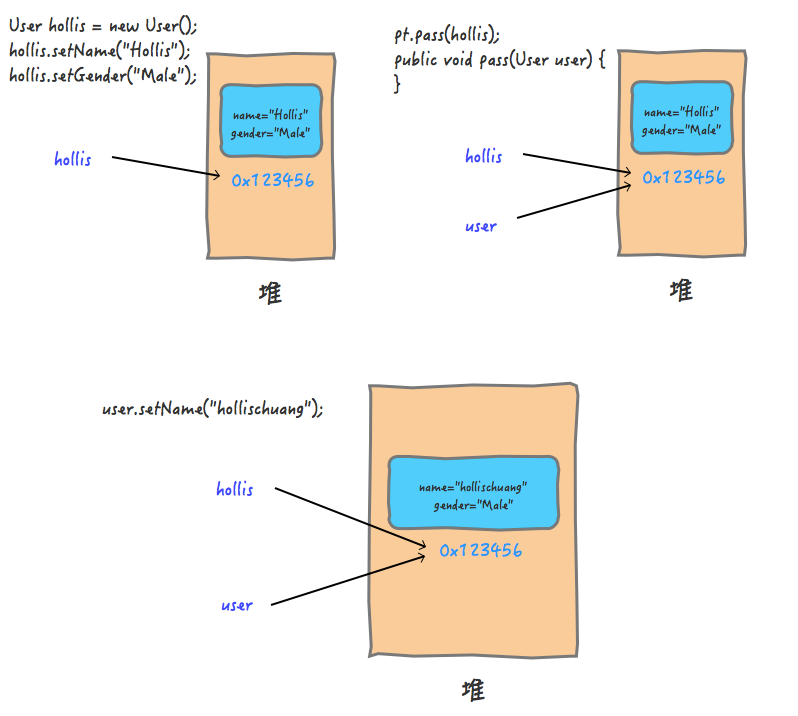

同样的，在参数传递的过程中，实际参数的**<u>地址`0X1213456`被拷贝给了形参</u>**，只是，在这个方法中，并没有对形参本身进行修改，而是修改的形参持有的***<u>地址中存储的内容</u>***。

！！！！！并没有改变形参 也就是（地址）<u>0x123456</u>

所以，值传递和引用传递的区别并不是传递的内容。而是实参到底有没有被**复制一份**给形参。在判断实参内容有没有受影响的时候，要看**传的是什么**，如果你**<u>传递的是个地址</u>**，那么就看这个**<u>地址的变化会不会有影响</u>**，而**<u>不是看地址指向的对象的变化</u>**。就像钥匙和房子的关系。

那么，既然这样，为啥上面同样是传递对象，传递String对象和User对象的表现结果不一样呢？我们在pass方法中使用`name = "hollischuang";`试着去更改name的值，阴差阳错的直接改变了name的引用的地址。因为这段代码，**会new一个String，在把引用交给name**，即等价于**<u>*name = new String("hollischuang");*</u>** 而原来的那个"Hollis"字符串还是由实参持有着的，所以，并没有修改到实际参数的值。

```
public void pass(String name) {
  name = "hollischuang";
  System.out.println("print in pass , name is " + name);
}
```

---

换一种理解方式：

首先创建**一个引用sb** 指向  **对象“hello”**

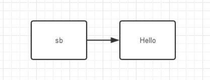

调用函数 形参stringbuffer  也指向了实参sb所指向的对象

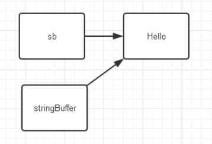

***通过对象的引用* stringbuffer   修改了对象的值. **

// 但如果是重新new一个？ 那就说明这个stringbuffer不是指向hello   而是指向了hi

---

**总结**

无论是值传递还是引用传递，其实都是一种求值策略([Evaluation strategy](https://en.wikipedia.org/wiki/Evaluation_strategy))。在求值策略中，还有一种叫做**按共享传递(call by sharing)**。其实Java中的参数传递严格意义上说应该是**按共享传递**。

> 按共享传递，是指在调用函数时，传递给函数的是实参的地址的拷贝（如果实参在栈中，则直接拷贝该值）。在函数内部对参数进行操作时，需要先拷贝的地址寻找到具体的值，再进行操作。如果该值在**栈**中，那么因为是**直接拷贝的值**，所以函数内部对参数进行操作不会对外部变量产生影响。如果原来拷贝的是原值在**堆中的地址**，那么需要先根据该地址**<u>找到堆中对应的位置</u>**，再进行操作。因为传递的是**<u>*地址的拷贝*</u>**所以函数内对***<u>值的操作对外部变量是可见的</u>***。

**传递给函数的是实参的地址的拷贝**

归根结底：还是传递的拷贝    不管是***<u>地址的拷贝还是基本数据类型的拷贝</u>***

# 封装、继承、多态

## 多态

”一个接口，多个方法“
同一操作，作用于不同的对象，可以有不同的解释，产生不同的执行结果。

多态性是对象多种表现形式的体现：

> 现实中，比如我们按下键盘上F1键这个动作：
> 
> - 如果当前在 Flash 界面下弹出的就是 AS 3 的帮助文档；
> - 如果当前在 Word 下弹出的就是 Word 帮助；
> - 在 Windows 下弹出的就是 Windows 帮助和支持。

***<u>同一个事件发生在不同的对象上会产生不同的结果</u>***

---

如果按照这个概念来定义的话，那么多态应该是一种**运行期的状态**。 为了实现运行期的多态，或者说是**动态绑定**，需要满足三个条件：

* ***<u>有类继承或者接口实现</u>***
* <u>***子类要重写父类的方法***</u>
* <u>***父类的引用指向子类的对象。***</u>

```java
Parent p = new Son1();
p.call();

“IM Son1”
```

是Parent类的实例，p.call()调用的是Son类的实现

多态还分为**动态多态和静态多态**。

* 上面提到的那种动态绑定认为是动态多态，因为只有在**运行期才能知道真正调用的是哪个类的方法**。

* 还有一种静态多态，一般认为Java中的函数重载是一种静态多态，因为他需要在**编译期决定具体调用哪个方法**

”我认为，**多态**应该是一种**运行期特性**，Java中的**<u>重写是多态的体现</u>**。不过也有人提出重载是一种静态多态的想法，这个问题在StackOverflow等网站上有很多人讨论，但是并没有什么定论。我更加倾向于重载不是多态。“

---

**使用多态是一种好习惯** 多态方式声明是一种好的习惯。当我们创建的类，使用时，**只用到它的超类或接口定义的方法**时，我们可以将其<u>**引用**</u>声明为它的***<u>超类或接口类型</u>***。

它的好处是，如果某天我们对这个接口方法的**实现方式**变了，对这个接口又有一个新的实现类，我们的程序也需要使用最新的实现方式，此时**只要将对象实现修改一下**，**引用无需变化**。

比如     Map< String,String> map = new HashMap < String,String>();

想换成HashTable实现，可以    Map< String,String> map = new HashTable < String,String>();

其中，始终是**map对象来引用其子类对象**

比如写一个方法，参数要求传递List类型，你就可以用**List** list = new **ArrayList**()中的list传递，但是你写成**ArrayList** list = new ArrayList()是传递不进去的。尽管方法处理时都一样。另外，方法还可以根据你传递的不同list（ArrayList或者LinkList）进行不同处理。

---

**引用多态**：

父类的引用可以指向本类的对象；

父类的引用可以指向子类的对象；

为什么子类的引用不能用来指向父类的对象呢？

> :zap:
>
> “狗是一种动物”√    
>
>  “动物是一种狗”×

**从属不能颠倒   父类的引用指向子类的对象时，该对象只是看成一种特殊的父类（里面有重写的方法和属性）**

**方法多态：**

创建的对象分别指向 <u>本类对象   和  子类对象</u>   都是父类的引用  指向不同对象，调用的方法也是多态的

***<u>！！！！</u>***

***<u>如果在子类中编写一个独有的方法（没有继承父类的方法），此时就不能通过父类的引用来调用该方法。</u>***

---

**<u>引用类型转换</u>**

1. ***<u>向上类型转换</u>***（**隐式**/自动类型转换）：**小类型（子类）->大类型（父类）**
   
   ​    父类的引用指向子类的对象 Parent p = new Son()

2. **<u>向下类型转换</u>(强制类型转换)，是大类型转换到小类型(有风险,可能出现数据溢出)。**
   
   Son s = p;  ！！！虽然我们知道这个父类引用指向的就是子类对象，但是编译器认为这种转换存在风险
   
   强制转换：Son son = (Son) p  如果p不是真的指向Son的对象，就不能转换，虽然ide不报错，但运行时会报错   ------->   **这就变成了子类的引用  指向了   父类的对象**

我们在**<u>编译</u>**的时候进行了**<u>强制类型转换</u>**，编译时的**类型是我们强制转换的类型**，所以**<u>编译器不会报错</u>**，而当我们运行的时候，程序**<u>给p开辟的是Son类型的内存空间</u>**，这与Parent类型**<u>内存空间不匹配</u>**，所以无法正常转换。这两种情况出错的本质是一样的，所以我们在使用强制类型转换的时候要特别注意这两种错误！！下面有个更安全的方式来实现向下类型转换。。。。

---

 **<u>instanceof</u> 运算符，来解决引用对象的类型，避免类型转换的安全性问题**

**它的作用是测试它左边的对象是否是它右边的类的实例**，返回boolean类型的数据

c instanceof ClassA

利用if语句和instanceof运算符来判断两个对象的类型是否一致。

在比较一个对象是否和另一个对象属于同一个类实例的时候，我们通常可以采用**instanceof**和**getClass**两种方法通过两者是否相等来判断，但是两者在判断上面是有差别的。

Instanceof进行类型检查规则是:**你<u>属于</u>该类吗？或者你属于该类的<u>派生类</u>吗？**

**而通过getClass获得类型信息采用==来进行检查是否相等的操作是严格的判断**,<u>***不会存在继承方面的考虑***</u>

## 重载与重写

**重载 Overloading**

函数或者方法有同样的名称，但是参数列表不相同的情形，这样的同名不同参数的函数或者方法之间，互相支撑只为重载函数或方法

**重写 Overriding**

在Java的子类和父类中有两个    **名称、参数列表都相同的方法**。具有**<u>相同的方法签名</u>**，所以子类中的新方法将**覆盖**父类中原有的方法。

---

**重载vs重写**

> 1、重载是一个**编译期概念**、重写是一个**运行期间概念**。
> 
> 2、重载遵循所谓“**编译期绑定**”，即在编译时***<u>根据参数变量的类型判断应该调用哪个方法</u>***。
> 
> 3、重写遵循所谓“**<u>运行期绑定</u>**”，即在运行的时候，根据引用变量**<u>所指向的实际对象的类型</u>**来调用方法
> 
> 4、因为在**编译期已经确定调用哪个方法**，所以重载**并不是多态**。而重写是多态。
> 
> 重载只是一种<u>语言特性</u>，是一种语法规则，与多态无关，与面向对象也无关。（注：严格来说，重载是编译时多态，即静态多态。但是，Java中提到的多态，在不特别说明的情况下都指动态多态）

```java
class Dog{
    public void bark(){
        System.out.println("woof ");
    }
}
class Hound extends Dog{
    public void sniff(){
        System.out.println("sniff ");
    }

    public void bark(){
        System.out.println("bowl");
    }
}

public class OverridingTest{
    public static void main(String [] args){
        Dog dog = new Hound();
        dog.bark();
    }
}
bowl
```

Dog对象被定义为dog类型。

**编译期间，编译器会检查Dog类**中是否有可访问的bark方法。

在**运行期，Hound对象被new出来，并赋值给dog变量，这是，jvm明确知道dog变量指向的其实就是Hound对象的引用**

当dog调用bark方法时，就会调用Hound类中定义的bark方法

---

**重写的条件**

> **参数列表**必须完全与被重写方法的相同；
> 
> **返回类型**必须完全与被重写方法的返回类型相同；
> 
> **<u>访问级别的限制性一定不能比被重写方法的强；</u>**
> 
> 访问级别的限制性<u>可以比被重写方法的弱</u>；
> 
> 重写方法一定不能抛出**<u>新的检查异常</u>**或比被重写的方法声明的检查异常**<u>更广泛的检查异常</u>**
> 
> 重写的方法能够抛出**<u>更少或更有限</u>**的异常（也就是说，被重写的方法声明了异常，但重写的方法可以什么也不声明）
> 
> *<u>不能重写被标示为 final的方法；</u>*
> 
> 如果**不能继承**一个方法，则**不能重写**这个方法。

**重载的条件**

> 被重载的方法必须<u>改变参数列表</u>；
> 
> 被重载的方法<u>**可以**改变返回类型</u>；
> 
> 被重载的方法**<u>可以</u>**改变访问修饰符；
> 
> 被重载的方法可以声明新的或更广的检查异常；
> 
> 方法能够在同一个类中或者在一个子类中被重载。

---

**转型指的是左侧引用的改变**

向下转型和向上转型的应用，有些人觉得这个操作没意义，何必先向上转型再向下转型呢，不是多此一举么。其实可以用于**方法参数中的类型聚合**，然后具体操作**再进行分解**。
比如add方法用List引用类型作为参数传入，**传入具体类时经历了向下转型**

<u>否则无法直接传入两种list的子类</u>

```

    add(new LinkedList());
    add(new ArrayList());
```

## 继承详解

<u>Java中的继承只能单继承，但是可以通过内部类继承其他类来实现多继承</u>

```java
public class Son extends Father{
    public void go () {
        System.out.println("son go");
    }
    public void eat () {
        System.out.println("son eat");
    }
    public void sleep() {
        System.out.println("zzzzzz");
    }
    public void cook() {
        //匿名内部类实现的多继承
        new Mother().cook();
        //内部类继承第二个父类来实现多继承
        Mom mom = new Mom();
        mom.cook();
    }
    //内部类Mom继承了Mother类 并在Son类中实现了对mom的new以及方法调用
    private class Mom extends Mother {
        @Override
        public void cook() {
            System.out.println("mom cook");
        }
    }
}
```

---

**<u>继承的初始化顺序：**</u>

1. 初始化父类 再 初始化子类
2. 限制性初始化对象中属性，再执行构造方法中的初始化

在继承关系中，当使用new一个类时，程序的执行顺序为：首先执行父类的构造函数方法，再执行自身的构造函数方法， 这个执行顺序不可更改，否则报错或不能运行。

*在深度继承关系中，即当存在C继承B，B继承A，或者更多层继承时，首先执行最上层的构造函数，再依次顺着继承链传递下去，一直到   创建对象的那个类。**例如：我们声明C对象时，调用的是C的构造函数c,构造函数c调用的是父类B的构造函数b,构造函数b调用的是父类A中的构造函数a，那么执行结果就是：a => b => c**

**problems**：
**_子类的构造函数能否覆盖重写父类的构造函数？_**

**当然8能**。在java中，子类无法继承父类构造函数，因此无法重写父类构造函数。只能通过显式调用super(null / parameters)来使用父类构造函数，或者就是调用父类中  已定义的无参构造函数，


试想：_如果子类重写覆盖父类构造函数：那么需要二者的方法名相同，但构造函数的方法名是类名，故：不存在此种情况~_
***


> 记住：必须调用父类的构造函数进行初始化，super（）语句必须是子类构造方法中的头一条语句！

**<u>父类对象属性初始化 ---->  父类对象构造方法 ---->  子类对象属性初始化  ---->  子类对象构造方法</u>**

---

**final关键字**

使用final关键字做表示有“最终的”含义

1. final修饰类，**<u>则该类不允许被继承</u>**
2. final修饰方法，则该方法**<u>不允许被覆盖（重写）</u>**
3. final修饰属性，则该类的该属性**不会**进行**隐性的初始化**，所以该final**<u>属性的初始化属性必须有值</u>**    或者在

**<u>构造方法中赋值（但只能选其一，且必须选其一，因为没有默认值！）</u>**  并且初始化之后不能改了，**只能赋值一次**

4. final 修饰**变量**，则该变量的值**只能赋一次值**，在**声明变量的时候才能赋值**，即变为<u>***常量***</u>。

---

**super关键字**

在对象的内部使用，可以**<u>*代表父类对象*</u>**

1. 访问父类的属性：super.age
2. 访问父类的方法：super.eat()

<u>super的应用：</u>

　首先我们知道子类的构造的过程当中**<u>*必须调用父类的构造方法*</u>**。其实这个过程已经**隐式地使用了我们的super关键字。**

　这是因为如果子类的构造方法中没有**显示调用父类的构造方法**，则系统**<u>默认调用父类无参</u>**的构造方法。

　那么如果自己用super关键字在**子类里调用父类的构造方法**，则必须在子类的构造方法中的<u>***第一行***</u>。

　**要注意的是：如果子类构造方法中既没有显示调用父类的构造方法，而父类没有无参的构造方法，则编译出错。**

（补充说明，虽然没有显示声明父类的无参的构造方法，系统会**<u>自动默认生成一个无参构造方法</u>**，但是，如果你声明了一个有参的构造方法，而没有声明无参的构造方法，这时系统**不会默认生成**一个无参构造方法，此时称为父类**<u>*没有无参的构造方法*</u>**。）

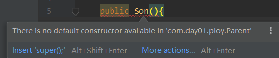

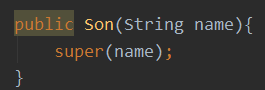

## 封装

**1. 封装的概念**

保证了程序和数据都**不受外部干扰**且**不被误用**。封装的目的在于**保护信息**，使用它的主要优点如下。

- 保护类中的信息，它可以阻止在**<u>外部定义的代码随意访问</u>**  <u>内部代码和数据。</u>
- 隐藏细节信息，一些不需要程序员修改和使用的信息，比如取款机中的键盘，用户只需要知道按哪个键实现什么操作就可以，至于它**<u>内部是如何运行的，用户不需要知道</u>**。
- 有助于建立各个系统之间的松耦合关系，提高系统的**独立性**。当一个系统的实现方式发生变化时，只要它的**<u>接口不变</u>**，就不会影响其他系统的使用。例如 U 盘，不管里面的存储方式怎么改变，只要 U 盘上的 USB 接口不变，就不会影响用户的正常操作。
- 提高软件的复用率，降低成本。每个系统都是一个**相对独立的整体**，可以在**不同的环境中**得到使用。例如，一个 U 盘可以在多台电脑上使用。

Java 语言的**基本封装单位**是**类**   封装复杂性   类的内部有隐藏实现复杂性的机制

对程序员来说，使用封装的目的：

1. 偷懒，辛苦一次，后面都能少敲很多代码，增强了代码得复用性
2. 简化代码，看起来更容易懂
3. **隐藏**核心实现逻辑代码，简化外部逻辑，并且不让其他人修改，jar 都这么干
4. 一对一，一个功能就只为这个功能服务；避免头发绳子一块用，导致最后一团糟

对封装的属性不一定要通过get/set方法，其他方法也可以对封装的属性进行操作。当然**最好使用get/set方法**，比较标准。

---

**Java中的内部类**

定义在另外一个类里面的类

作用：

1. 内部类提供了**更好的封装**，可以把内部类**隐藏**在**<u>外部类之内</u>**，**不允许**同一个包中的其他类访问该类。
2. 内部类的方法可以*<u>**直接访问外部类的所有数据**，包括**私有的数据**</u>*。private也可以访问
3. 内部类所实现的功能使用外部类同样可以实现，只是有时使用内部类更方便。
- 成员内部类
- 静态内部类
- 方法内部类
- 匿名内部类

# 异常

程序执行中发生的不正常情况称为“异常”(<u>开发过程中的语法错误和逻辑错误不是异常</u>)

- `Error`: Java虚拟机无法解决的严重问题。如：JVM系统内部错误、资源耗尽、虚拟机错误(`VirtualMacheError`)及其子类内存溢出错误(`OutOfMemoryError`)和栈溢出错误(`StackOverflowError`)。一般**不编写针对性的代码**进行处理；
- `Exception`: 其它因编程错误或偶然的**外在因素**导致的一般性问题，可以使用针对性的代码进行处理。例如： 空指针访问、试图读取不存在的文件、网络连接中断

```
public class TestExceptionOne {
    public static void main(String[] args) {
        String str = null;
        str.indexOf("zx"); // NullPointerException
        System.out.println("--------");
    }
}
```

NullPointerException

当执行`str.indexOf("zx")`的时候，`Java`发现`str`的值为`null`，无法继续执行，于是**启用异常处理机制**，首先**创建一个异常对象**，这里是**<u>*类`NullPointerException`的对象*</u>**，然后查找看谁能<u>*处理*</u> 这个异常，在上面的代码中，**<u>没有代码能处理这个异常</u>**，于是`Java`就启用**默认处理**机制(**<u>*异常发生点后的代码都不会执行*</u>**)，那就是**打印异常栈信息**到屏幕，并退出程序。异常栈信息包括了从异常发生点到最上层调用者的轨迹、行号等。

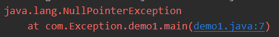

---

查看`NumberFormatException`和`Integer`的源码可以发现:

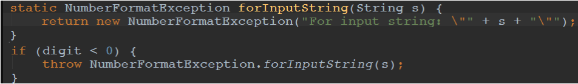

- 就是创建了一个类的对象，只是这个**类是一个异常类**。`throw`就是抛出异常，会触发`Java`的异常处理机制。之前那个`NullPointerException`可以认为`throw`是由`Java`虚拟机自己实现的。
- `throw`关键字可以与`return`关键字进行对比，**`return`代表正常退出，`throw`代表异常退出**，`return`的**返回位置**是确定的，就是**上一级调用者**，而`throw`后**执行哪行代码则是不确定**的，由**异常处理机制**动态确定。
- 异常处理机制会从**当前函数**开始查找看谁**<u>"捕获"</u>**了这个异常，当前函数没有就查看**<u>上一层，直到主函数</u>**，如果主函数也没有，就使用默认机制，即**输出异常栈信息并退出**，这正是我们在屏幕输出中看到的。

---

## 异常的分类

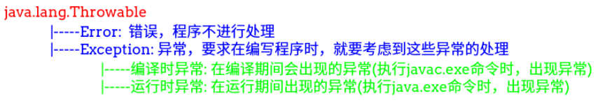

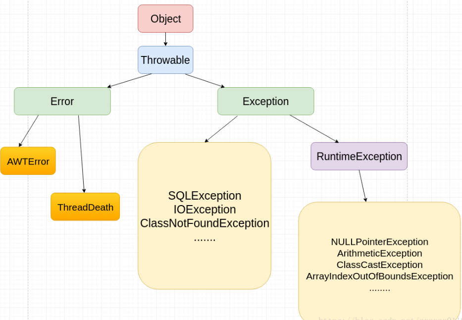

捕获错误最理想的是在**编译期间**，但有的错误**只有在运行时才会发生**。比如：除数为`0`，数组下标越界等

关于`Throwable`类的四个构造方法：

```java
public Throwable()
public Throwable(String message)
public Throwable(String message, Throwable cause)
public Throwable(Throwable cause)
```

有两个主要参数，一个是**`message`，表示异常消息**，另一个是`cause`，表示**触发该异常的其他异常**。异常可以形成一个异常**链，**上层的异常由**底层**异常触发，`cause`表示底层异常。

`Throwable`还有一个`public`方法用于设置`cause`：

```
Throwable initCause(Throwable cause)
```

`Throwable`的某些**子类**没有带<u>**`cause`参数**</u>的**<u>构造方法</u>**，就可以通过这个方法来设置

**<u>子类会继承父类的cause参数  如果没有的话才执行这一步</u>**

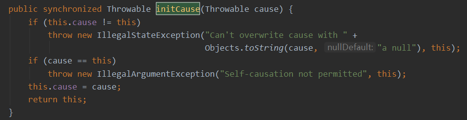

所有构造方法中都有一句重要的函数调用：它会将异常栈信息保存下来，这是我们能看到异常栈的关键。

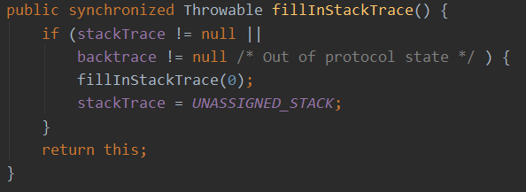

`Throwable`有一些常用方法用于获取异常信息：

```java
void printStackTrace()  // 打印异常栈信息到标准错误输出流，
                        //它还有两个重载的方法：打印栈信息到指定的流。
void printStackTrace(PrintStream s)  
void printStackTrace(PrintWriter s)
String getMessage()  // 获取设置的异常message和cause
Throwable getCause()
StackTraceElement[] getStackTrace() //获取异常栈每一层的信息，每个StackTraceElement包括文件名、类名、函数名、行号等信息。
```

---

## 编译时异常和运行时异常

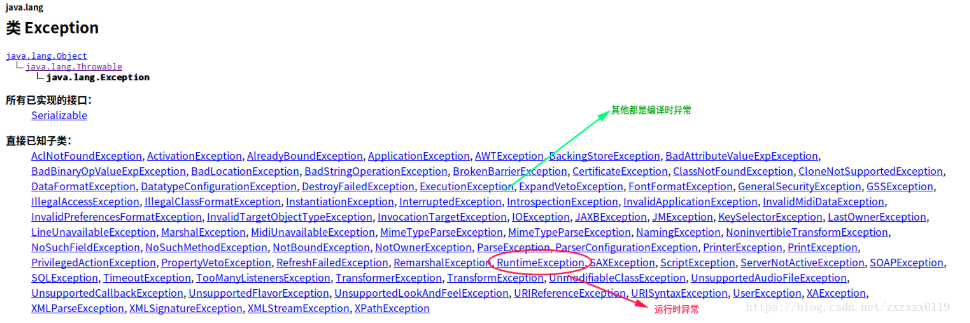

**运行时异常**:

- 是指编译器不要求强制处置的异常。一般是指编程时的**逻辑错误(编译的时候检查不出来)**，是程序员应该积极避免其出现的异常。`java.lang.RuntimeException`类及它的子类都是运行时异常。
- 对于这类异常，**可以不作处理**，因为这类异常很普遍，若全处理可能会对程序的可读性和运行效率产生影响。

**编译时异常**

- 是指编译器要求必须处置的异常。即程序在运行时由于**<u>外界因素（sql / IO...）</u>**造成的<**一般性异常**>。编译器要求java程序**必须捕获或声明所有编译时异常。**
- 对于这类异常，如果程序不处理，可能会带来意想不到的结果。

---

<u>**对于非运行时异常----Exception中除了RuntimeException以外的其他类   必须在程序中加以处理   比如显式的声明throws或者try-catch  否则编译器会报错，根本无法执行     如sqlexception等等**</u>

<u>**运行时异常不管到底有没有出错，都可以无需trycatch  最后若是出错也将报错   但可以运行到那个环节**</u>

---

**区别:**

- `RuntimeException`(运行时异常)比较特殊，含义是**<u>`unchecked exception `(未受检异常</u>**)，相对而言，**`Exception`的其他子类和`Exception`自身则是`checked exception`(受检异常)**，**`Error`及其**子类也是`unchecked exception`；
- `checked`还是`unchecked`，区别在于Java如何处理这两种异常，对于`checked`异常，Java会**<u>强制要求程序员进行处理，否则会有*编译错误*</u>**，而对于`unchecked`异常则没有这个要求；

---

**<u>对于`RuntimeException`和`checked exception`区别:</u>**

- 对于`RuntimeException(unchecked exception)`，是**不要求使用`throws`进行声明**的，但对于`checked exception`，则**必须进行声明**，换句话说，**<u>如果没有声明，则不能抛出</u>**。

- 对于checked exception，<u>***不可以抛出而不声明，但可以声明抛出但实际不抛出***</u>，不抛出声明它干嘛？主要用于**<u>*在父类方法中声明*</u>**，父类方法内可能没有抛出，但子类重写方法后可能就抛出了，子类不能抛出父类方法中没有声明的`checked exception`，所以就**<u>*将所有可能抛出的异常都写到父类上*</u>**了。
  
  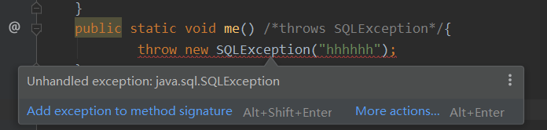

---

常见的运行时异常RuntimeException

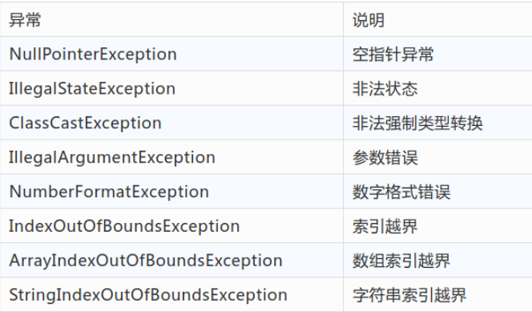

---

## 异常的处理以及自定义异常

**<u>抓抛模型</u>**

`Java`程序的执行过程中如出现异常，会生成一个**异常类对象**，该异常对象将被**提交**给`Java`运行时系统，这个过程称为**抛出(`throw`)**异常。

异常对象的生成:

- 由虚拟机自动生成：程序运行过程中，虚拟机检测到程序发生了问题，如果在当前代码中**没有找到相应的处理程序**，就会在后台自动创建一个对应异常类的**实例对象**并抛出 --> **自动抛出**；
- 由程序员**<u>手动创建：Exception exception = new ClassCastException()</u>**; --> 创建好的异常对象不抛出对程序没有任何影响，和创建一个普通对象一样；

一个方法抛出异常：抛给调用者方法处理——不断返回到上层方法，知道异常被处理。->**catch捕获  异常** 一直到main-就终止程序   （异常链）

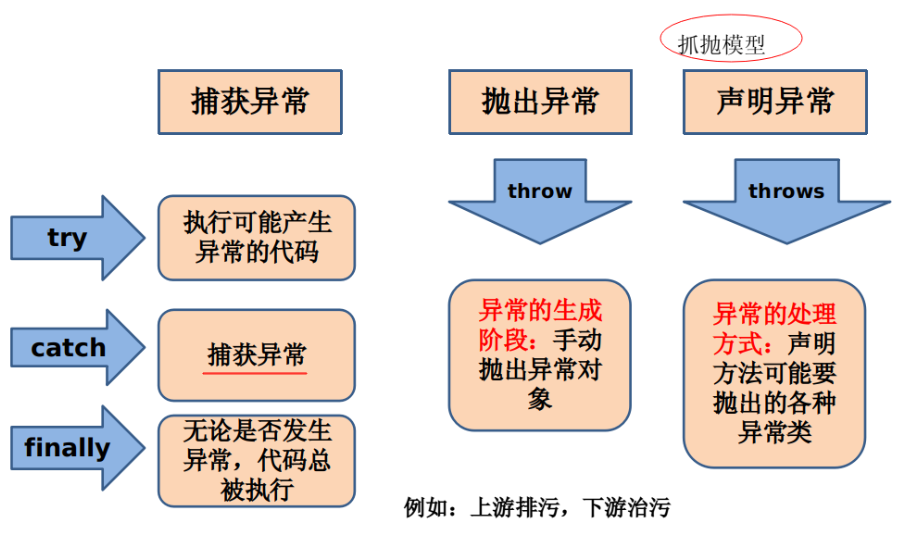

**"抓"的两种处理方式**

- 第一种处理的方式: `try catch`
  - 注意`try`内声明的变量，类似于**局部变量**，出了`try{}`语句，就不能被调用；
  - `catch`语句内部是**对异常对象的处理** ，例如 `getMessage()`、`printStackTrace()`；
  - 可以**有多个`catch`**语句，`try`中抛出的异常类对象**从上往下**去匹配`catch`中的异常类的类型，一旦满足就执行`catch`中的代码，执行完，就**跳出**其后的多条`catch`语句；
  - **<u>*对于运行时异常，可以不显示的处理。对于编译时异常，必须要显示的进行处理；*</u>**
  - 若`catch`中有多个异常类型是"并列关系"，熟上熟下都可以。若是"包含"关系，必须**将子类放在父类的上面，否则报错**；
  - `finally`中存放的是**一定会执行**的代码，不管`try`中，`catch`中是否仍有异常未处理，以及是否有`return `语句；
  - `try - catch`是可以嵌套的；
  - `catch`块内处理完后，可以重新抛出异常，异常可以是原来的，也可以是新建的
    - ​    (为什么要重新抛出呢？因为当前代码**不能够完全处理该异常，需要<u>调用者</u>进一步处理**)；
- 第二种处理的方式: `throws `(在方法的声明处，显示的抛出改异常对象的类型)
  - 当异常在一个方法内部出现的时候，会抛一个异常类的对象，抛给方法的调用者；
  - 异常的对象可以逐层**向上**抛，直至`main()`中，当然在向上抛的过程中，可以**再通过`try-catch`**进行处理；

> 注意: 子类重写父类的方法，其抛出的异常类型只能是**被重写的方法的异常类的<u>*子类*</u>  或和异常类一样**；不能            抛出新的异常

---

异常不能假装当正常来处理  应合理的**<u>抛</u>**出去  ： 作了检查后返回特殊值null或者boolean都可以    **不建议这么做**

## finally和throws

`finally`内的代码不管有无异常发生，都会执行。具体来说：

- 如果没有异常发生，在`try`内的代码执行结束**后**执行；
- 如果有异常发生且被`catch`捕获，在**`catch`内的代码执行结束后**执行；
- 如果有异常发生但没被捕获，**则在异常被抛给上层** <u>*之前*</u> 执行。
* **释放资源，如数据库连接、文件流**

> 注意: `try/catch/finally`语法中，**`catch`不是必需的**，也就是可以只有`try/finally`，表示不捕获异常，异常**<u>自动向上传递</u>**，但`finally`中的代码在异常发生后**<u>也执行</u>**。

* 如果在try或者catch语句内有return语句，则**<u>return语句在finally语句执行结束后才执行</u>**，但finally**并不能改变返回值；**

先将返回值ret保存在一个**临时变量**中，然后才执行`finally`语句，最后`try`再**返回**那个临时变量，`finally`中对`ret`的**修改不会被返回**。

* **<u>*`finally`中有`return`不仅会覆盖`try`和`catch`内的返回值，而且还会掩盖`try`和`catch`内的异常，就像异常没有发生一样*</u>**

* `finally`中不仅`return`语句会**掩盖异常**，如果`finally`中抛出了异常，则***<u>原异常就会被掩盖:</u>***

* 所以为避免混淆，应该**<u>避免</u>**在`finally`中使用`return`语句或者抛出异常，如果**调用的其他代码可能抛出异常，则应该捕获异常并进行处理**。

---

**<u>*throws关键字*</u>**

跟在方法的括号后面，可以声明多可异常，逗号分隔

- 我这个方法内可能抛出这些异常，**我没有进行处理（就是没有catch）**，至少没有处理完，**调用者**必须进行处理。
- 这个声明没有说明，具体什么情况会抛出什么异常，作为一个良好的实践，应该将这些信息用注释的方式进行说明，这样调用者才能更好的处理异常。

如果一个方法内调用了另一个声明抛出`checked exception`的方法，则必须处理这些`checked exception`，不过，处理的方式既可以是`catch`，也可以是继续使用`throws`，如下代码所示：

```
public void tester() throws AppException {
    try {
        test();
    }  catch (SQLException e) {
        e.printStackTrace();
    }
}
```

对于**<u>`test`抛出的`SQLException`</u>**，这里使用了`catch`，而对于`AppException`，则将其添加到了自己方法的**`throws`语句**中，表示**<u>*当前方法也处理不了，还是由上层处理*</u>** 吧。

## 自定义异常

除了`Java API`中定义的异常类，也可以自己**定义异常类**，一般通过**<u>继承`Exception`或者它的某个子类</u>**，如果父类是`RuntimeException`或它的某个子类，则自定义异常也是`unchecked exception`，如果是`Exception`或`Exception`的其他子类，则自定义异常是`checked exception`。

如何自定义一个异常类:

- 自定义的异常类**继承现有的异常类**；
- 提供一个**序列化`ID`，提供几个<u>重载</u>的构造器**；

```
public class MyException extends RuntimeException {
    static final long serialVersionUID = -33873124229948L;
    public MyException(){}
    public MyException(String message){
        super(message);
    }
}
```

## 异常注意事项

1. 不要推诿或延迟处理异常，**就地解决**最好，并且需要实实在在的进行处理，而**不是只捕捉，不动作**。
2. 一个函数尽管抛出了多个异常，但是**只有一个异常可被传播到调用端**。**最后被抛出**的异常时唯一被调用端接收的异常，**<u>其他异常都会被吞没掩盖</u>**。如果调用端要知道造成失败的最初原因，程序之中就绝**不能掩盖**任何异常。
3. **不要**在**finally代码块中处理返回值**。
4. 按照我们程序员的惯性认知：当遇到return语句的时候，执行函数会立刻返回。但是，在Java语言中，如果存在finally就会有例外。除了return语句，try代码块中的**break或continue语句也可能使控制权进入finally**代码块。
5. 请勿在try代码块中**调用return、break或continue语句**。万一无法避免，一定要确保finally的存在**不会改变函数的返回值**。（会覆盖返回值）
6. 函数返回值有两种类型：值类型与对象引用。对于对象引用，要特别小心，如果在finally代码块中对函数返回的**<u>对象成员属性进行了修改</u>**，即使不在finally块中**<u>*显式调用return语句，这个修改也会作用于返回值上*</u>**。
7. 勿将异常用于控制流。
8. **继承**某个异常时，**重写**方法时，要么**<u>不抛出异常，要么抛出一模一样的异常</u>**。 
9. 当一个try后跟了很多个catch时，必须**<u>先捕获小的异常再捕获大的异常</u>**。


# 抽象类和接口

## 抽象类
只给出方法的定义不去实现方法打的具体事物，由子类去根据**具体需求**来具体实现
**只给出方法定义而不具体实现的方法**被称为抽象方法，抽象方法是==没有方法体==的，在代码的表达上就是==没有“{}”==
包含一个或多个==抽象方法==的类也必须被声明为==抽象类==
使用abstract修饰符来表示抽象方法以及抽象类。

``` java
//有抽象方法的类也必须被声明为abstract
public abstract class Test1 {
	//抽象方法，不能有“{}”
	public abstract void f();
}
```
抽象类除了包含抽象方法外，还**可以**包含**具体的**变量和具体的方法。类即使不包含抽象方法，也可以被声明为抽象类，==防止被实例化==。

抽象类**不能被实例化**，也就是不能使用new关键字来得到一个抽象类的==实例==，抽象方法==必须在子类中被实现(继承)==

抽象类不能直接使用，需要子类去**实现**抽象类，然后使用其子类的实例。然而==可以创建一个变量，其类型也是一个抽象类==，并让他==指向具体子类的一个实例==，也就是可以**使用抽象类来充当形参**，==实际实现类为实参==，也就是==多态==的应用。

``` java
People people = new teacher("教师");
prople.work();
```
==不能有抽象构造方法  或  抽象静态方法==
非要使用new来创建一个==抽象类的实例==？？？憨批行为~

``` java
People people=new People() {
	@Override
	public void work() {
	    //实现这个方法的具体功能
	}
}  ;
```
成为抽象类：
> 当一个类的一个或多个方法是**抽象方法**时。  当类是一个抽象类的子类，并且不能实现父类的**所有**抽象方法时。
> 当一个类实现一个接口，并且==不能实现接口的所有抽象方法==时。  注意： 上面说的是这些情况下一个类将称为抽象类，没有说抽象类就一定会是这些情况。
> 抽象类**可以不包含**抽象方法，包含抽象方法的类就**一定**是抽象类。 事实上，抽象类可以是一个**完全正常实现的类**。

**为什么要用抽象类**
一般类够用？子类也可以覆盖啊
其实不是说抽象类有什么用，一般类确实也能满足应用，但是现实中确实**有些父类中的方法确实没有必要写**，因为各个子类中的这个方法==肯定会有不同==，所以没有必要再父类里写。当然你也可以把抽象类都写成非抽象类，但是这样没有必要。

而写成抽象类，这样别人看到你的代码，或你看到别人的代码，你就会注意抽象方法，而知道这个方法是在子类中实现的，所以，有个==提示==作用。


## 接口

接口并==不是类==。类描述对象的属性和方法。接口则包含**要实现的方法**
除非实现接口的类是抽象类，否则该类==要定义并实现接口中的所有方法==

接口==无法被实例化==，但是可以**被实现**。一个实现接口的类，必须实现接口内所描述的所有方法，==**否则就必须声明为抽象类**==。另外，在 Java 中，接口类型可用来**声明一个变量**，他们可以成为一个空指针，或是被绑定在一个==**以此接口实现的对象**==。

> 接口是一种高度抽象的“模板”，而**接口中的属性**也就是**’模板’的成员**，就应当是所有实现"模板"的**<u>实现类的共有特性</u>**，所以它是public static的 ,是所有实现类共有的 
>
> - 为什么是 `static` 的？
>
>   如果可以是非 static 的话，那么如果有多个类实现了接口，就会出现重名变量
>
> 其次,接口中如果可能定义**非final的变量**的话，而**方法又都是abstract**的，这就自相矛盾了，有可变成员变量但对应的方法却无法操作这些变量，虽然可以直接修改这些静态成员变量的值，但**<u>所有实现类对应的值都被修改了</u>**，这跟抽象类有何区别? 又接口是一种更高层面的抽象，是一种规范、功能定义的声明，**所有可变的东西**都应该归属到实现类中，这样接口才能起到标准化、规范化的作用。所以接口中的属性必然是final的。
>
> 最后，接口只是对事物的属性和行为更高层次的**抽象** 。**<u>对修改关闭</u>**，**对扩展（不同的实现implements）开放**，接口是对开闭原则的一种体现。
>
> 综上：在interface里面的变量默认都是public static final 的。所以可以直接省略修饰符
>
> 以下定义方式均正确：
>
> ```
> static final int MALE = 1;
> final int MALE = 1;
> int MALE = 1;
> ```


**接口与类相似点：**

* 一个接口可以有多个方法。
* 接口文件保存在 .java 结尾的文件中，文件名使用接口名。
* 接口的字节码文件保存在 .class 结尾的文件中。
* 接口相应的**字节码文件**必须在与包名称相匹配的**目录结构**中。

**接口与类的区别：**

 - 接口不能用于实例化对象。
 - 接口==没有构造方法==。
 - 接口中==所有的方法==必须是**==抽象方法==**。
 - 接口不能包含==成员变量==，**除了 static 和 final 变量**。
 - 接口不是被类继承了，而是要**被类实现**。
 - 接口支持**多继承**。

**接口特性**

 - 接口中每一个方法也是隐式抽象的,接口中的方法会被==隐式的指定为**public abstract**==（只能是 public abstract，其他修饰符都会报错）。
 - 接口中可以含有变量，但是接口中的**变量**会被隐式的指定为 ==public static final== 变量（并且**只能是 public**，用 private 修饰会报编译错误）。
 - 接口中的方法是**不能在接口中实现**的，只能由实现接口的类来实现接口中的方法。

**抽象类和接口的区别**
1. 抽象类中的方法*可以有方法体*，就是**能实现方法的具体功能**，但是接口中的方法不行。
2. 抽象类中的成员变量可以是**各种类型**的，而接口中的成员变量**只能是 public static final** 类型的，==必须给其初值==，所以实现类中**不能重新定义，也不能改变其值**，
    抽象类中的变量默认是 friendly 型，其值可以在子类中重新定义，也可以重新赋值
3. 接口中==不能==含**有静态代码块**以及**静态方法**(用 static 修饰的方法)，而抽象类是可以有静态代码块和静态方法。
4. 一个类**只能继承一个抽象类**，而一个类却可以==实现多个接口==。

> 注：JDK 1.8 以后，接口里可以有静态方法和方法体了。
friendly 型：如果一个类、类属变量及方法不以public,protected,private这三种修饰符来修饰，它就是friendly类型的，那么包内的任何类都可以访问它，而包外的任何类都不能访问它(包括包外继承了此类的子类)，因此，这种类、类属变量及方法对包内的其他类是友好的，开放的，而对包外的其他类是关闭的。

在接口中可以添加使用 default 关键字修饰的==非抽象方法==。即：默认方法（或扩展方法）
接口里可以声明静态方法，并且可以实现。

Java 8 允许给接口添加一个非抽象的方法实现，只需要使用 ==default== 关键字即可，这个特征又叫做扩展方法（也称为默认方法或虚拟扩展方法或防护方法）。在实现该接口时，该默认扩展方法在子类上==可以直接使用==，它的使用方式类似于抽象类中非抽象成员方法。
所有这个接口的实现类都会**通过继承得到这个方法**（如果有需要也可以重写这个方法）
多重继承的冲突说明：
由于同一个方法可以从不同接口引入，自然而然的会有冲突的现象，规则如下：
1）一个声明**在类里面**的方法**优先于任何默认方法**
2）优先选取**最具体的实现**

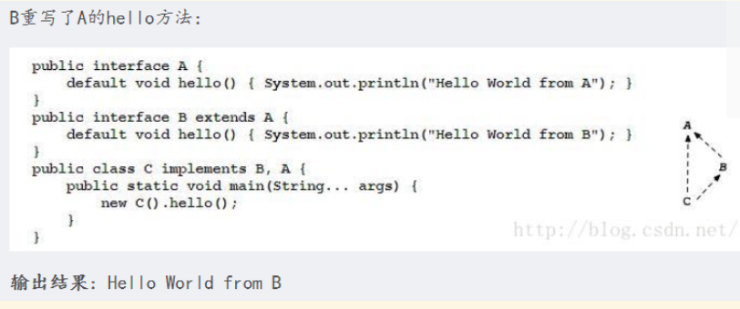

Note：扩展方法不能够重写（也称复写或覆盖） Object 中的方法，却==可以重载==Object 中的方法。
    toString、equals、 hashCode 不能在接口中被覆盖，却可以被重载。

*==**抽象类和接口所反映出的设计理念不同。其实抽象类表示的是"is-a"关系，接口表示的是"like-a"关系；**==*

---
接口的作用：==制定标准==各方共同遵守一个守则，只有操作标准统一额，所有的参与者才可以按照统一的规则操作

电脑可以和各个设备连接，提供==统一的usb接口==，其他设备只能通过USB接口和电脑相连

``` 
interface USB{
    public void work(); //拿到usb设备表示要进行工作
}

class Print implements USB 		//实现类（接口类）	
{   			// 打印机实现了USB接口标准（对接口的方法实现）
    public void work() 
   {
        System.out.println("打印机用USB接口，连接,开始工作。") ;
    }
}

class Flash implements USB 		//实现类（接口类）	 		 	
{  						// U盘实现了USB接口标准（对接口的方法实现）
    public void work() 
    {
        System.out.println("U盘使用USB接口，连接,开始工作。") ;
    }
}
 
class Computer 
{
    public void plugin(USB usb) 			//plugin的意思是插件，参数为接收接口类
    {
        usb.work() ;    // 按照固定的方式进行工作
    }
}

public class InterfaceStandards { 
    public static void main(String args[]) { 
        Computer computer = new Computer() ; 
        computer.plugin(new Print()) ; //实例化接口类， 在电脑上使用打印机 
        computer.plugin(new Flash()) ; //实例化接口类， 在电脑上使用U盘 
    }
}
```

**接口制定==标准==的作用**

``` 
class Computer 
{
    public void plugin(USB usb)  //plugin的意思是插件，参数为接收接口类
    {
        usb.work() ;    // 按照固定的方式进行工作
    }
}
```
方法plugin()参接受的是一个**usb对象(接口类型对象)**，而打印机和U盘对象可以通过**向上转型**当参数 传入方法里
USB usb = new Print()  
USB usb = new Flash()
==相当于自动使用了两次向上转型给了USB接口，虽然使用的子类对象不同，实现的方法体也不同。==
：无论使用的是打印机，还是U盘，都是通过USB接口和电脑连接的
接口的作用：**制定标准**


我们学习前面的章节多态可以知道对象的**多态**可以通过动态绑定来实现，即使用==向上转型==，我们知道类，数组，接口都是引用类型变量，**什么是引用类型变量？**

引用类型变量都会有一个==地址==的概念，即==指向性的概念==，当USB usb = new Print(),此时==usb对象==是==指向new Print()的==，当usb = new Flash()后，这时候usb变量就会==指向new Flash()==，我们会说这是==子类对象赋值给了父类对象usb==，而在内存中，我们应该说，usb==**指向了**==new Flash();

-----
## 接口最佳实践：设计模式中的工厂模式
工厂模式是为了**解耦**：把==对象的创建和使用的过程分开==。就是Class A 想调用 Class B ，那么A只是调用B的方法，而至于==B的实例化==，就交给工厂类。

其次，工厂模式可以降低==代码重复==。如果创建对象B的过程都很复杂，需要一定的代码量，而且很多地方都要用到，那么就会有很多的重复代码。我们可以这些==创建对象B的代码放到工厂里统一管理==。既减少了重复代码，也**方便**以后对B的创建过程的**修改维护**。

由于创建过程都由工厂统一管理，所以发生业务逻辑变化**，不需要找到所有需要创建B的地方去逐个修正**，只需要在工厂里修改即可，**降低维护成本**。同理，想把**所有调用B的地方改成B的子类C**，只需要在对应生产B的工厂中或者工厂的方法中修改其==生产的对象为C==即可，而不需要找到所有的new B（）改为newC()。

代码演示：

``` java
package demo;
 
import java.util.Scanner;
 
interface Fruit						//定义一个水果标准
{
	public abstract void eat();
}
 
class Apple implements Fruit
{
	public void eat()
	{
		System.out.println("吃苹果");
	}
}
class Orange implements Fruit
{
	public void eat()
	{
		System.out.println("吃橘子");
	}
}
 
class factory
{
	public static Fruit getInstance(String className)  //返回值是Fruit的子类
	{
		if("apple".equals(className))
		{
			return new Apple();
		}
		else if("orange".equals(className))
		{
			return new Orange();
		}
		else
		{
			return null;
		}
	}
}
 
public class ComplexFactory {
	public static void main(String[] args)
	{	
		System.out.println("请输入水果的英文名:");
		Scanner sc = new Scanner(System.in);
		String ans = sc.nextLine();
		Fruit f = factory.getInstance(ans);   //初始化参数
		f.eat();
		sc.close();
	}
}
```
factory类中有一个getinstance方法，用static修饰 直接类名.方法名就可以调用

---
## 接口与抽象类的本质区别

``` java
public interface Animal
{
    //所有动物都会吃
    public void eat();

    //所有动物都会飞
    public void fly();
}

public abstract class Animal
{
    //所有动物都会吃
    public abstract void eat();

    //所有动物都会飞
    public void fly(){};
}
```
不考虑接口的default：在接口中，所有的属性**肯定是** public、static 和 final，所有的方法都是 abstract，所以可以默认不写上述标识符；在抽象类中，既可以**包含抽象的定义**，也可以包含**具体的实现方法**。

一个接口的==实现类可以实现**多个接口**==，而一个抽象类的实现类则只能**实现一个抽象类**。


---
**设计思想区别**
抽象类和具体实现类之间是一种**继承关系**，也就是说如果釆用抽象类的方式，则==父类和子类在概念上应该是相同的==。接口却不一样，如果采用接口的方式，则==父类和子类在概念上不要求相同==。

接口只是抽取==相互之间**没有关系**的类的**共同特征**==，而不用关注**类之间的关系**，它可以使没有层次关系的类具有==相同的行为==。因此，可以这样说：

==**抽象类是对一组具有相同属性和方法的逻辑上有关系的事物的一种抽象**==，而==**接口则是对一组具有*相同属性和方法* 的*逻辑上不相关* 的事物的一种抽象**==

对那些只需要吃的功能的具体动物类来说，继承 Animal 抽象类即可。对那些既有吃的功能又有飞的功能的具体动物类来说，则需要继承 AnimalFly 抽象类。

但此时对客户端有一个问题，那就是不能针对**所有的动物类**都使用 Animal 抽象类来进行编程，因为 Animal 抽象类不具有飞的功能，这不符合面向对象的设计原则，因此这种解决方案其实是行不通的。
还有另外一种解决方案，即具有吃的功能的抽象动物类用抽象类来实现，而具有飞的功能的类用接口实现；或者具有吃的功能的抽象动物类用接口来实现，而具有飞的功能的类用抽象类实现。

具有吃的功能的抽象动物类用抽象类来实现，具有飞的功能的类用接口实现，既具有吃的功能又具有飞的功能的具体的动物类，则继承 Animal 动物抽象类，实现 AnimalFly 接口

有什么不同？
**抽象类是对一组具有相同属性和方法的逻辑上有关系的事物的一种抽象，而接口则是对一组具有相同属性和方法的逻辑上不相关的事物的一种抽象，因此抽象类表示的是“is a”关系，接口表示的是“like a”关系。**
假设现在要研究的系统只是动物系统，如果设计人员认为对既具有吃的功能又具有飞的功能的具体的动物类来说，它和只具有吃的功能的动物一样，**都是动物**，是一组**逻辑上有关系**的事物，因此这里应该使用**抽象类来抽象具有吃的功能**的动物类，即继承 Animal 动物抽象类，实现 AnimalFly 接口。

假设现在要研究的系统不只是动物系统，如果设计人员认为不管是吃的功能，还是飞的功能和动物类没有什么关系，因为飞机也会飞，人也会吃，则这里应该**实现两个接口来分别抽象吃的功能和飞的功能**，即除实现吃的 Animal 接口外，再实现飞的 AnimalFly 接口。

从上面的分析可以看出，对于接口和抽象类的选择，反映出设计人员**看待问题的不同角度**，即抽象类用于一组相关的事物，表示的是“is a”的关系，而接口用于一组**不相关的事物**，表示的是“like a”的关系。


---
## 如何回答面试题：接口和抽象类的区别？
接口(interface)和抽象类(abstract class)是支持抽象类定义的==两种机制==。

接口是==公开的==，**不能有私有的方法或变量**，接口中的所有方法都没有方法体，通过关键字interface实现。

抽象类是可以有**私有**方法或私有变量的，通过把类或者类中的方法声明为abstract来表示一个类是抽象类，被声明为抽象的方法不能包含方法体。子类实现方法必须含有相同的或者更低的访问级别(public->protected->private)。抽象类的子类为父类中所有抽象方法的具体实现，否则也是抽象类。

接口可以被看作是抽象类的变体，接口中所有的方法都是抽象的，可以通过接口来间接的实现多重继承。接口中的成员变量都是static final类型，由于抽象类可以包含部分方法的实现，所以，在一些场合下抽象类比接口更有优势。

**相同点**

（1）都不能被实例化 （2）接口的实现类或抽象类的子类都只有实现了接口或抽象类中的方法后才能实例化。

**不同点**

（1）接口只有定义，不能有方法的实现，java 1.8中可以定义default方法体，而抽象类可以有定义与实现，方法可在抽象类中实现。

（2）实现接口的关键字为implements，继承抽象类的关键字为extends。一个类可以实现多个接口，但一个类只能继承一个抽象类。所以，使用接口可以间接地实现多重继承。

（3）==接口强调特定功能的实现，而抽象类强调所属关系。==

（4）接口成员变量默认为public static final，必须赋初值，不能被修改；其所有的成员方法都是public abstract的。抽象类中成员变量默认default，可在子类中被重新定义，也可被重新赋值；抽象方法被abstract修饰，不能被private、static、synchronized和native等修饰，必须**以分号结尾**，不带花括号。

（5）接口被用于常用的功能，便于日后维护和添加删除，而抽象类更倾向于充当公共类的角色，不适用于日后重新对立面的代码修改。功能需要累积时用抽象类，不需要累积时用接口。


# JavaIO流
## IO概述

---

**输入和输出**

术语“输入”和“输出”有时候会有一点让人疑惑。一个应用程序的输入往往是另外一个应用程序的输出
那么OutputStream流到底是一个输出到目的地的流呢，还是一个产生输出的流？InputStream流到底会不会**输出它的数据给读取数据的程序**呢？就我个人而言，在第一天学习Java IO的时候我就感觉到了一丝疑惑。
试着给输入和输出起一些不一样的别名，让它们从概念上与数据的来源和数据的流向相联系。

Java的IO包主要关注的是从**原始数据源**的读取以及**输出**原始数据到**目标媒介**
最典型的数据源和目标媒介：
 - 文件
 - 管道
 - 网络连接
 - 内存缓存
 - System.in, System.out, System.error(注：Java标准输入、输出、错误输出)


---

**流**
在Java IO中，==流==是一个核心的概念。流从概念上来说是一个**连续的数据流**。你既可以**从流中读取数据，也可以往流中写数据**。流与数据源或者数据流向的媒介相关联。在Java IO中流既可以是**==字节流==**(以字节为单位进行读写)，也可以是**==字符流==**(以字符为单位进行读写)。

类**InputStream, OutputStream, Reader 和Writer** 一个程序需要InputStream或者Reader从数据源读取数据，需要OutputStream或者Writer将数据写入到目标媒介中。
InputStream和Reader与数据源相关联，OutputStream和writer与目标媒介相关联。

**Java IO的用途和特征**
Java IO中包含了许多InputStream、OutputStream、Reader、Writer的**子类**。这样设计的原因是让每一个类都负责不同的功能。这也就是为什么IO包中有这么多不同的类的缘故。各类用途汇总如下：

>  - 文件访问
>  - 网络访问
>  - 内存缓存访问
>  - 线程内部通信(管道)
>  - 缓冲
>  - 过滤
>  - 解析
>  - 读写文本 (Readers / Writers)
>  - 读写基本类型数据 (long, int etc.)
>  - 读写对象

不同的类用于针对不同业务场景。

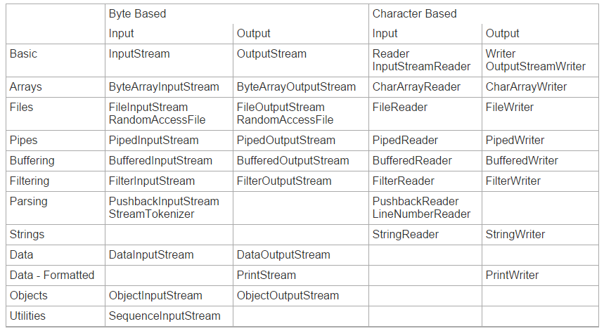


---

**什么是JavaIO流**

Java IO流是既可以从中读取，也可以写入到其中的数据流  流通常会与数据源、数据流向目的地相关联，比如**文件、网络**等等。

流和数组不一样，**不能通过索引读写数据**。在流中，你也不能像数组那样**前后移动读取数据**，除非使用RandomAccessFile 处理文件。流仅仅只是一个**连续的数据流**。

某些类似PushbackInputStream 流的实现允许你将数据**重新推回**到流中，以便重新读取。然而你只能把有限的数据推回流中，并且你不能像操作数组那样随意读取数据。==流中的数据只能够顺序访问==。

> Java IO流通常是基于**字节或者基于字符**的。
**<u>==字节流==</u>** 通常以“stream”命名，比如InputStream和OutputStream。
除了DataInputStream和DataOutputStream 还能够读写int, long, float和double类型的值以外，其他流在一个操作时间内只能读取或者写入一个原始字节。
> ==字符流==通常以**“Reader”或者“Writer”**命名。字符流能够读写**字符**(比如Latin1或者Unicode字符)。
浏览JavaReaders and Writers获取更多关于字符流输入输出的信息。

**InputStream**

java.io.InputStream类是`所有Java IO输入流的基类`。如果你正在开发一个从流中读取数据的组件，请尝试**<u>用InputStream</u>**替代任何它的子类(比如FileInputStream)进行开发。这么做能够让你的代码<u>*兼容任何类型而非某种确定类型的输入流*</u>。


---

***组合流***

将流整合起来以便实现更高级的输入和输出操作。==一次读取一个字节是很慢的，所以可以从磁盘中**一次读取一大块数据**，然后从读到的**数据块中获取字节**。为了实现缓冲，可以**<u>把InputStream包装到BufferedInputStream中</u>**。==

InputStream input = new BufferedInputStream(New FileInputStream("D: \ ... \ ..."))

> 缓冲同样可以应用到OutputStream中。你可以实现将**大块数据批量地写入到磁盘**(或者*相应的流*)中，这个功能由BufferedOutputStream实现。
>
> 缓冲只是通过流整合实现的其中一个效果。你可以把InputStream==包装到PushbackInputStream==中，之后可以**将读取过的数据推回到流中**重新读取，在解析过程中有时候这样做很方便。或者，你可以将**两个InputStream**整合成一个SequenceInputStream。
>
> 将不同的流整合到一个==链==中，可以实现更多种高级操作。通过编写包装了标准流的类，可以实现你想要的效果和过滤器。


**IO文件**

---


**通过Java IO读文件**


> 如果你需要在不同端之间读取文件，你可以根据该文件是**二进制文件还是文本文件**来选择使用==FileInputStream或者FileReader==。
>
> 这两个类允许你从文件==开始到文件末尾==一次读取**一个字节**或者字符，或者将读取到的字节写入到**字节数组或者字符数组**。你不必一次性读取整个文件，相反你可以**按顺序**地读取文件中的字节和字符。

*跳跃式*地读取文件其中的某些部分，可以使用*RandomAccessFile*


**通过Java IO写文件**

> 如果你需要在不同端之间进行文件的写入，你可以根据你要写入的数据是**二进制**型数据还是**字符型**数据选用**FileOutputStream**或者**FileWriter**。
>
> 你可以一次写入一个字节或者字符到文件中，也可以直接写入一个字节数组或者字符数据。数据按照写入的顺序存储在文件当中。


**通过Java IO随机存取文件**

正如我所提到的，你可以通过RandomAccessFile对文件进行随机存取。

> 随机存取并不意味着你可以在真正随机的位置进行读写操作，它只是意味着你可以**跳过文件中某些部分**进行操作，并且支持同时读写，不要求特定的存取顺序。
>
> 这使得RandomAccessFile可以覆盖一个文件的某些部分、或者追加内容到它的末尾、或者删除它的某些内容，当然它也可以从文件的任何位置开始读取文件。


```java
@Test
public void test1() {
try {
FileInputStream fileInputStream = new FileInputStream(new File("D:/desktop/NumOfString.txt"));
FileOutputStream fileOutputStream = new FileOutputStream(new File("D:/desktop/a.txt"));
byte[] buffer = new byte[128];

while (fileInputStream.read(buffer)!= -1) {
	fileOutputStream.write(buffer);
}
//随机读写，通过mode参数来决定读或者写
RandomAccessFile randomAccessFile = new RandomAccessFile(new File("D:/desktop/b.txt"), "rw");
} 
catch (FileNotFoundException e){
e.printStackTrace();
}
catch (IOException e) {
e.printStackTrace();
}
```


---

**字符流和字节流**

Java IO的Reader和Writer除了基于**字符**之外，其他方面都与InputStream和OutputStream非常类似。他们被用于读写文本。InputStream和OutputStream是**基于字节**的，还记得吗？

Reader类是Java IO中所有Reader的**基**类。子类包括  BufferedReader，PushbackReader，InputStreamReader，StringReader和其他Reader。

Writer类是Java IO中所有Writer的**基**类。子类包括  BufferedWriter和PrintWriter等等。


```
Reader reader = new FileReader("c:\\data\\myfile.txt");
int data = reader.read();
while(data != -1){
    char dataChar = (char) data;
    data = reader.read();
}
```

通常会使用Reader的子类，而不会直接使用Reader。Reader的子类包括InputStreamReader，CharArrayReader，FileReader等等。可以查看Java IO概述浏览完整的Reader表格。


---

**==整合Reader与InputStream==**


一个Reader可以和一个InputStream相结合。如果你有一个InputStream输入流，并且想从**其中(inputstream)读取*字符***，可以把这个**InputStream包装到InputStreamReader中**。把InputStream传递到InputStreamReader的构造函数中：

```
Reader reader = new InputStreamReader(inputStream);
```


Writer类是Java IO中所有Writer的基类。子类包括BufferedWriter和PrintWriter等等。这是一个Java IO Writer的例子：

```
Writer writer = new FileWriter("c:\\data\\file-output.txt"); 
writer.write("Hello World Writer"); 
writer.close();
```

同样，**最好使用Writer的子类**，*不需要直接使用Writer*，因为子类的==实现更加明确==，更能表现你的意图。常用子类包括*OutputStreamWriter，CharArrayWriter，FileWriter*等。Writer的write(int c)方法，会将传入参数的<u>低16位</u>写入到Writer中，忽略高16位的数据。


**整合Writer和OutputStream**

与Reader和InputStream类似，一个Writer可以和一个OutputStream相结合。把OutputStream包装到OutputStreamWriter中，**所有写入到OutputStreamWriter的字符都将会传递给OutputStream==??????==**。这是一个OutputStreamWriter的例子：

```
Writer writer = new OutputStreamWriter(outputStream);
```


---


**IO管道**

IO管道为运行在==同一个JVM==中的**两个线程**提供了通信能力，管道也可以作为**数据源以及目标媒介**

你不能利用管道与**不同的JVM中的线程通信**(==不同的进程==)。在概念上，Java的管道不同于Unix/Linux系统中的管道。在Unix/Linux中，运行在*不同地址空间*的两个*进程*可以通过管道通信。在Java中，通信的双方应该是运行在**<u>同一进程中的不同线程</u>**。


> 可以通过Java IO中的PipedOutputStream和PipedInputStream创建管道。一个PipedInputStream流应该和一个PipedOutputStream流==相关联。==
>
> 一个线程通过PipedOutputStream写入的数据可以被**另一个线程**通过相关联的PipedInputStream读取出来。


如何将PipedInputStream和PipedOutputStream关联起来

```java
//使用管道来完成两个线程间的数据点对点传递
    @Test
    public void test2() throws IOException {
        PipedInputStream pipedInputStream = new PipedInputStream();
        PipedOutputStream pipedOutputStream = new PipedOutputStream(pipedInputStream);
        new Thread(new Runnable() {
            @Override
            public void run() {
                try {
                    pipedOutputStream.write("hello input".getBytes());
                    pipedOutputStream.close();
                } catch (IOException e) {
                    e.printStackTrace();
                }
            }
        }).start();
        new Thread(new Runnable() {
            @Override
            public void run() {
                try {
                    byte []arr = new byte[128];
                    while (pipedInputStream.read(arr) != -1) {
                        System.out.println(Arrays.toString(arr));
                    }
                    pipedInputStream.close();
                } catch (IOException e) {
                    e.printStackTrace();
                }
            }
        }).start();
```


管道和线程 请记得，当使用两个相关联的管道流时，务必将它们分配给**不同的线程**。read()方法和write()方法调用时会导致==流阻塞==，这意味着如果你尝试在一个线程中同时进行读和写，可能会导致==线程死锁==。

管道的替代   除了管道之外，一个JVM中**不同线程**之间还有许多通信的方式。实际上，线程在大多数情况下会**传递完整的对象信息**而非原始的字节数据。但是，如果你需要在线程之间传递字节数据，Java IO的管道是一个不错的选择。


---

**Java IO：网络**

当两个进程之间建立了**网络连接**之后，他们通信的方式如同操作文件一样：利用InputStream读取数据，利用OutputStream写入数据。换句话来说，Java网络API用来在不同进程之间建立网络连接，而Java IO则用来在建立了连接之后的进程之间交换数据。

基本上意味着如果你有一份能够**对文件进行写入**某些数据的代码，那么这些数据也可以很容易地**写入到网络连接**中去。你所需要做的仅仅只是在代码中**利用OutputStream替代FileOutputStream**进行数据的写入。因为FileOutputStream是OuputStream的子类，所以这么做并没有什么问题。

```
//从网络中读取字节流也可以直接使用OutputStream
public void test3() {
    //读取网络进程的输出流
    OutputStream outputStream = new OutputStream() {
        @Override
        public void write(int b) throws IOException {
        }
    };
}
public void process(OutputStream ouput) throws IOException {
    //处理网络信息
    //do something with the OutputStream
}
```


---

**字节和字符数组**

从InputStream或者Reader中读入数组

从OutputStream或者Writer中写数组

在java中常用**==字节和字符数组==**在应用中临时存储数据。而这些数组又是通常的数据读取来源或者写入目的地。如果你需要在程序运行时需要大量读取文件里的内容，那么你也可以**把一个文件加载到数组**中。

前面的例子中，字符数组或字节数组是用来缓存数据的临时存储空间，不过它们同时也可以**作为数据来源或者写入目的地**。 举个例子：

```java
//字符数组和字节数组在io过程中的作用
    public void test4() {
        //arr和brr分别作为数据源
        char []arr = {'a','c','d'};
        CharArrayReader charArrayReader = new CharArrayReader(arr);
        byte []brr = {1,2,3,4,5};
        ByteArrayInputStream byteArrayInputStream = new ByteArrayInputStream(brr);
    }
```


---


**System.in, System.out, System.err**

System.in, System.out, System.err这3个流同样是常见的数据来源和数据流目的地。使用最多的可能是在控制台程序里利用System.out将输出打印到控制台上。

JVM启动的时候通过Java运行时初始化这3个流，所以你**不需要初始化它们**(尽管你可以在运行时替换掉它们)。

> System.in
> System.in是一个典型的连接控制台程序和键盘输入的InputStream流。通常当数据通过命令行参数或者配置文件传递给命令行Java程序的时候，System.in并不是很常用。图形界面程序通过界面传递参数给程序，这是一块单独的Java IO输入机制。
>
> System.out
> System.out是一个PrintStream流。System.out一般会把你写到其中的数据输出到控制台上。System.out通常仅用在类似命令行工具的控制台程序上。System.out也经常用于打印程序的调试信息(尽管它可能并不是获取程序调试信息的最佳方式)。
>
> System.err
> System.err是一个PrintStream流。System.err与System.out的运行方式类似，但它更多的是用于**打印错误文本**。一些类似Eclipse的程序，为了让错误信息更加显眼，会将错误信息以  **红色文本**  的形式通过System.err输出到控制台上。


---

**字符流的Buffered和Filter**

BufferedReader能为字符输入流**提供缓冲区**，可以提高许多==IO处理的速度==。你可以一次读取一大块的数据，而不需要每次从网络或者磁盘中一次读取一个字节。特别是在访问大量磁盘数据时，缓冲通常会让IO快上许多。

BufferedReader和BufferedInputStream的主要区别在于，BufferedReader操作**字符，**而BufferedInputStream操作**原始字节**。只需要==把Reader包装到BufferedReader中==，就可以==为Reader添加缓冲区==(译者注：默认**缓冲区大小**为8192字节，即8KB)。

```
Reader input = new BufferedReader(new FileReader("c:\\data\\input-file.txt"));
```

也可以通过传递构造函数的第二个参数，指定缓冲区大小

```
Reader input = new BufferedReader(new FileReader("c:\\data\\input-file.txt"), 8 * 1024);
```

BufferedReader还有一个额外readLine()方法，可以方便地一次性读取一整行字符。


**BufferedWriter**

与BufferedReader类似，可以为输出流提供缓冲区。可以构造一个使用默认大小缓冲区的BufferedWriter 8 * 1024b

```
Writer writer = new BufferedWriter(new FileWriter("...."))
Writer writer = new BufferedWriter(new FileWriter("c:\\data\\output-file.txt"), 8 * 1024);
```

**建议把缓冲区大小设置成1024的整数倍**

同样多提供了writeLine()方法


**值得注意：需要手动flush()确保写入到此输出流的数据真正写入到磁盘或者网络中**


FilterReader

与FilterInputStream类似，FilterReader是实现**自定义过滤输入字符流的基类**，基本上它仅仅只是简单覆盖了Reader中的所有方法。

没发现这个类明显的用途。除了**构造函数取一个Reader变量**作为参数之外，我没看到FilterReader任何对Reader新增或者修改的地方。如果你选择继承FilterReader实现自定义的类，同样也可以直接继承自Reader从而避免额外的类层级结构。


---

## JavaIO流面试题


*什么是IO流？*

它是一种数据的流从源头I  流到 目的地O。比如文件拷贝，同时包括输入流和输出流。输入流从文件中读取数据**存储到进程**(process)中，输出流从进程中读取数据然后写入目标文件


*字节流和字符流的区别*

字节流在jdk1.0中就引进，用于操作包含ASCII字符的文件。

JAVA也支持其他的**字符**如Unicode，为了读取包含Unicode字符的文件，Java语言设计者在jdk1.1中引入了字符流。ASCII作为Unicode的子集，对于**英语字符**的文件，**可以使用字节流也可以使用字符流**


*Java中流类的超类主要有哪些*

* java.io.InputStream
* java.io.OutputStream
* java.io.Reader
* java.io.Writer


*FileInputStream和FileOutputStream是什么*

这是**在拷贝文件操作**的时候，经常用到的两个类。在处理小文件的时候，它们性能表现还不错，在大文件的时候，最好使用BufferedInputStream (或 BufferedReader) 和 BufferedOutputStream (或 BufferedWriter)


*System.out.println()是什么？*

println是PrintStream的一个方法。out是一个**静态**PrintStream类型的**成员变量**，System是一个java.lang包中的类，用于和**底层的操作系统**进行交互。


*什么是Filter流？*

Filter Stream是一种IO流主要作用是用来**对存在的流增加一些额外的功能**，像给目标文件增加源文件中不存在的行数，或者增加拷贝的性能。

在java.io包中主要有4个可用的**filter Stream**。两个字节filter stream，两个字符filter stream. 分别是FilterInputStream, FilterOutputStream, FilterReader and FilterWriter.这些类是**抽象类**，不能被实例化的。


*在文件拷贝的时候，那一种流可用提升更多的性能？*

在字节流的时候，使用BufferedInputStream和BufferedOutputStream。 在字符流的时候，使用BufferedReader 和 BufferedWriter


*说说管道流(Piped Stream)*

有四种管道流， PipedInputStream, PipedOutputStream, PipedReader 和 PipedWriter.在多个**线程或进程**中传递数据的时候管道流非常有用。


*说说File类*

它<u>不属于 IO流，也不是用于文件操作</u>的，它主要用于**知道一个文件的属性，读写权限，大小等信息**。


*说说RandomAccessFile?*

它在java.io包中是一个特殊的类，<u>既不是输入流也不是输出流</u>，它**两者都可以做到**。他是Object的==直接子类==。通常来说，一个流只有一个功能，要么读，要么写。但是RandomAccessFile==既可以读文件，也可以写文件==。 DataInputStream 和 DataOutStream有的方法，**在RandomAccessFile中都存在。**


---


## 解析文件处理

文件类：**File类**

File类用于封装系统的文件和目录的相关信息。在该类中定义了一些与平台无关的方法来操作文件。例如文件的大小、修改时间、文件路径等。

**创建 File 对象可以通过下面3种方式：**

* new File(String pathName)
* File file = new File("E://1.txt")
* new File(String parent, String child) //parent:**父抽象路径名 例如D:/desktop**；child：**子路径名字符串 a.txt**


**如何获取文件信息**

File类是对文件和文件夹的抽象，包含了对文件和文件夹的多种属性和操作方法

| 返回      | 方法            | 说明                                                         |
| --------- | --------------- | ------------------------------------------------------------ |
| String    | getName         | 获取文件名称                                                 |
| String    | getParent       | 获取文件的父路径字符串                                       |
| String    | getPath         | 获取文件的相对路径字符串                                     |
| String    | getAbsolutePath | 获取文件的绝对路径字符串                                     |
| boolean   | exists          | 判断文件或者文件夹是否存在                                   |
| boolean   | isFile          | 判断是不是文件类型                                           |
| boolean   | isDirectory     | 判断是不是文件夹类型                                         |
| boolean   | delete          | 删除文件或文件夹，如果删除成功返回结果为true                 |
| boolean   | mkdir           | 创建文件夹，创建成功返回true                                 |
| boolean   | setRoadOnly     | 设置文件或文件夹的只读属性                                   |
| long      | length          | 获取文件的长度                                               |
| long      | lastModified    | 获取文件的最后修改时间                                       |
| String[ ] | list            | **获取文件夹中的文件和子文件夹的名称，并存放到字符串数组中** |

**在使用delete()方法删除File对象时，如果删除的对象是目录，该目录中的内容必须为空**


## 使用字节输入输出流

字节流用来处理 **二进制数据的读取和写入，以字节为单位，InputStream和OutPutStream**是字节流的==抽象类==。


1、字节输入流*抽象*类 InputStream 


| return       | 方法                   | 说明                                                         |
| ------------ | ---------------------- | ------------------------------------------------------------ |
| int          | available()            | 返回当前输入流的数据读取方法**可以读取的有效字节数量**       |
| Abstract int | read()                 | 从当前数据流中读取一个字节。若已达到流结尾，返回-1           |
| int          | read(**Byte[] bytes**) | 从当前输入流读取一定的byte数据，并存储在数组中，然后返回读取的byte数据的数量，若已达到流结尾，返回-1 |
| void         | reset()                | 将当前的输入流重新定位到最后一次调用mark()方法时的位置       |
| void         | mark(int readlimit)    | 在当前输入流中做**标记位置**，当调用reset()将返回到该位置，从标记位置开始，到**再读入readlimit个字符**位置，这个标记都维持有效 |
| Boolean      | markSupported()        | 测试当前输入流是否支持mark() reset()方法 其中一个不支持返回false |
| long         | skip(long n)           | 跳过和丢弃当前输入的n个字节数据                              |
| void         | close()                | 关闭当前输入流，并释放任何与之相关联的系统资源               |

 ==InputStream 类是**抽象类**，不能通过new关键字来创建该实例对象，需要其子类创建该实例对象。下面通过实例如何使用InputStream从控制台获取用户输入的数据信息。==

```
/**
 * 创建InputStream实例inp，并将其赋值为System类的in属性，定义为控制台输入流，从inp输入流中获取字节信息
 * 用这些字节信息创建字符串，并将其在控制台上输出
 */
public static void main(String[] args) throws IOException {
    InputStream inputStream = System.in;
    byte[] bytes = new byte[1024];

    while(inputStream.read(bytes) != -1){
        String str = new String(bytes).trim();
        System.out.println(str);
    }
    inputStream.close();
}
```


---


2、字节输出流*抽象*类OutputStream类

| 返回          | 方法                              | 说明                                                  |
| ------------- | --------------------------------- | ----------------------------------------------------- |
| void          | write(byte[] b)                   | 将byte[]数组中的数据写入当前输出流                    |
| void          | write(byte[] b, int off, int len) | 将byte[ ]数组下标off开始的len长度的数据写入当前输出流 |
| Abstract void | write（int b)                     | 写入一个byte数据到当前输出流                          |
| void          | flush()                           | 刷新当前输出流，并强制写入所有缓冲的字节数据          |
| void          | close()                           |                                                       |

 和InputStream类一样，OutputStream 类**是抽象类**，不能通过**new关键字**来创建该实例对象，需要**其子类**创建该实例对象

```
创建OutputStream实例out,并将其赋值为System.out标准输出流。通过write()方法向流写入数据

public static void main(String[] args) throws IOException {
    OutputStream outputStream = System.out; //输出目标为控制台
    byte[] bytes = "使用OutputStream输出流在控制台输出字符串\n".getBytes();

    outputStream.write(bytes);

    bytes = "输出内容：\n".getBytes();
    outputStream.write(bytes);

    bytes = "Java数据交互管道——IO流 \n".getBytes();
    outputStream.write(bytes);
    outputStream.close();
}
```


---


**3、文件字节输入流类：FileInputStream类**


文件字节输入流可以从<u>指定路径的文件</u>中读取字节数据

文件字节输入流类继承**InputStream**类，并实现了**读取输入流的各种方法**。

​       创建文件字节输入流创建的构造方法语法如下：

语法1：以==File对象为参数==创建FileInputStream实例

```
new FileInputStream（File file）
```

语法2：以==文件对象的绝对路径为参数==创建FIleInputStream实例

```
new FileInputStream（String filepath）
```


---

4、文件字节输出流类：FileOutputStream

文件字节输出流关联指定文件路径的文件，数据通过文件字节输出流以字节为单位输出并保存到文件中。文件字节输出流继承自OutputStream类，并实现OutputStream类的各种方法。

构造方法：

```
new FileOutputStream(File file)

new FileOutputStream(String filepath)
```


```
File file = new File("D:/desktop/a.txt");

try {
if(!file.exists()){
    file.createNewFile();
    FileOutputStream outputStream = new FileOutputStream(file);

    byte[] bytes = "Java数据交流管道——IO流".getBytes();

    outputStream.write(bytes);
    outputStream.close();
}

} catch (IOException e) {
	e.printStackTrace();
}

try{
    FileInputStream fileInputStream = new FileInputStream(file);

    byte[] bytes2 = new byte[1024];
    int len = fileInputStream.read(bytes2);

    System.out.println("文件中的信息是 \n" + new String(bytes2, 0, len));
    fileInputStream.close();
} catch (Exception e) {
	e.printStackTrace();
}
```


## 使用字符输入输出流

字符输入输出流 与 字节输入输出流有相同的功能，但**传送数据的方式不一样**，字节流以==字节为单位==传送数据，可以使==任何类型==的数据，例如文本、音频、视频、图片等。*字符流*以字符为单位传送数据，==只能传送文本类型的数据==。使用字符输入输出流的好处是，当*读取中文时不会出现乱码问题*，而使用*字节输入输出流时，却不能保证这一点*。


1、字符输入流抽象类：Reader类

| 返回          | 方法                                | 说明                                                         |
| ------------- | ----------------------------------- | ------------------------------------------------------------ |
| boolean       | ready()                             | 判断此数据流是否准备好                                       |
| int           | read()                              | 读入**一个字符**，若已读到流结尾，返回值-1                   |
| int           | read(char[])                        | 读入一些字符到char[]数组内，并返回所**读入的字符的数量**，若已到达流结尾，返回-1 |
| Abscract int  | read(char[ ] chars,int off,int len) | 读取一些字符到char[ ]数组**下标从off开始到off+len的位置**，并返回**所读入的字符的数量**，若已到达流结尾，则返回-1； |
| void          | reset()                             | 将当前输入流重新定位到最后一次mark（）方法时的位置           |
| void          | mark(int readLimit)                 | 将当前输入流中做标记，当调用reset方法时将返回到该位置，从标记位置开始，到再读入readLimit个字符为止，这个标记都维持有效 |
| boolean       | markSupported                       | 测试当前输入流是否支持mark()方法和reset()方法。只要有一个方法不支持，则返回-1 |
| long          | skip(long n)                        | 跳过参数n指定的字符数量，并返回所跳过字符的数量              |
| Abstract void | close()                             |                                                              |


2、字符输出流类Writer类

 Writer 类主要是用于解决字符输入流的类，其地位与Reader类在输入流的地位和作用是相同的，也是所有字符输出流的流类。


| 返回          | 方法                                 | 说明                                                         |
| ------------- | ------------------------------------ | ------------------------------------------------------------ |
| void          | write(char[] cbuf)                   | 将字符数组的数据写入字符输出流                               |
| Abstract void | write(char[ ] cbuf int off ,int len) | 将字符数组从下标off 开始向输入流写入长度为len的数据          |
| void          | write(int c )                        | 向字符输入流中写入一个字符数据                               |
| void          | write(String str )                   | 向输入流中写入一个字符串数据                                 |
| void          | write(String str , int off ,int len) | 向输入流中写入一个字符串从off 开始长度为len的数据            |
| Abstract void | flush()                              | 刷新当前输出流，并强制写入所有**缓冲区**的字节数据           |
| void          | close()                              | 向输出流中写入缓冲区的数据，然后关闭当前输出流，释放所有与当前输出流相关联的系统资源 |


---

3、文件字符输入流FileReader

​    文件**字符输入流**与文件**字节输入流**的功能相似，但是传送数据的方式不一样，字节流以字节为单位传送数据，可以使文本、视频、音频、图片等。字符流以字符为单位传送数，==只能传送文本类型==的数据。


```
new FileReader(File file)
new FileReader(String path)
```


```
File file = new File("D:/desktop/a.txt");

if(!file.exists()){
	System.out.println("对不起，不包含指定路径的文件");
}else{
    try{
    FileReader fileReader = new FileReader(file);
    char[] chars = new char[23];
    int length = 0;
    while((length = fileReader.read(chars)) > 0){
    	String str = new String(chars, 0, length);
    	System.out.println(str);
	 }
fileReader.close();
} catch (Exception e) {
e.printStackTrace();
}
}
```

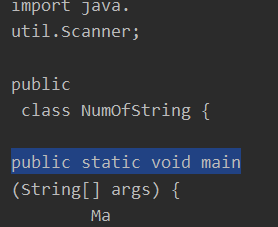

**修改一下char数组的容量**？

就能装得下~~

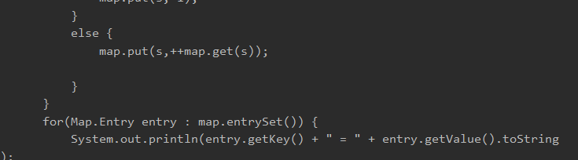


---

4、文件字符输出流FileWriter


文件字符输出流继承自==Writer类==，提供了向文件输出的各种方法，数据通过文件字符输出流以==字符==为单位输出并==保存到文件中==。


```
File file = new File("D:/desktop/e.txt");
        try{
            if(!file.exists()){
                file.createNewFile();
            }
            FileReader fileReader = new FileReader("D:/desktop/a.txt");

            FileWriter fileWriter = new FileWriter(file);

            int length = 0;

            while((length = fileReader.read()) != -1){
                fileWriter.write(length);
                fileWriter.write("**");
            }

            fileReader.close();
            fileWriter.close();
        } catch (IOException e) {
            e.printStackTrace();
        }
```


通过对读写加入断点分析，int read()  和  write(int index)方法是==每次读入和写入一个字符的数据==

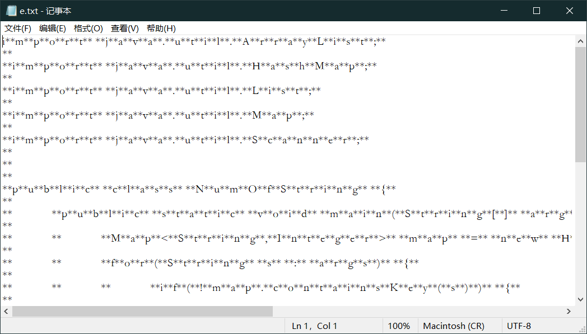


## IO流实战


1、Java IO流实现复制文件夹

通过IO不仅可以复制文件，还可以复制文件夹，文件夹中包含其他文件夹。需要分别复制

```
public static void main(String[] args) {
    File file1 = null;
    File file2 = null;

    String f1 = "D:/desktop/test";
    String f2 = "D:/desktop/copy";

    file1 = new File(f1);
    if(!file1.isDirectory() || !file1.exists()){
        //file1既不是文件夹也不是文件
        System.out.println("源文件夹不存在");
    }else {
        file2 = new File(f2);
        file2.mkdir();
        copy(file1.listFiles(), file2);
        System.out.println("文件夹复制成功！");
    }
}

/**
 * 创建copy方法，该方法接受文件数组和目标文件夹两个参数，如果目标文件夹不存在，则调用mkdir方法创建文件夹
 * 然后在循环中将文件数组中的每个文件对象写到目标文件夹中
 */
public static void copy(File[] files, File file){
    if(!file.exists()){
        //如果文件夹不存在
        file.mkdir();
    }

    for(int i = 0; i < files.length; i++){
        if(files[i].isFile()){
            //如果是文件类型，则复制文件
            try{
                FileInputStream fileInputStream = new FileInputStream(files[i]);

                FileOutputStream fileOutputStream = new FileOutputStream(
                        new File(file.getPath() + File.separator + files[i].getName()));

                int count = fileInputStream.available();
                byte[] bytes = new byte[count];

                if(fileInputStream.read(bytes)!= -1){
                    fileOutputStream.write(bytes);
                }
            } catch (FileNotFoundException e) {
                e.printStackTrace();
            } catch (IOException e) {
                e.printStackTrace();
            }
        }

        if(files[i].isDirectory()){
            //如果是文件夹类型
            File des = new File(file.getPath() + File.separator + files[i].getName());
            des.mkdir();//在目标文件夹中创建相同的文件夹
            copy(files[i].listFiles(), des);
        }
    }
}
```


**复制整个文件夹的本质  就是递归进入文件夹   再判断是文件还是文件夹 到头了就返回  每进入一个新文件夹用for遍历所有文件/文件夹**

*文件夹：新建一个文件夹  然后将其中的东西拷贝过来*

*文件：FileOutputStream生成一个新文件*


---

2、Java IO流实现分行向文件中写入数据

FilterWriter类可以向文件写入==字符==数据，如果将FileWriter类封装到bufferWriter类的缓冲字符流中，能够实现缓冲字符输出流，并且可以通过读输出流的newLine()方法，来实现数据的分行写入


```
String filePath = "D:/desktop/fff.txt";
File file = new File(filePath);
try{
    if(!file.exists()){
        file.createNewFile();
    }
    FileWriter fileWriter = new FileWriter(file);

    BufferedWriter bufferedWriter = new BufferedWriter(fileWriter);

    for(int i = 0; i < 100; i++){
        bufferedWriter.write(("Java交互管道——IO流" + i).toCharArray() );
        bufferedWriter.newLine();  //写入换行符
        bufferedWriter.flush();   //刷新缓冲区
    }
    System.out.println("成功写入数据！");
} catch (Exception e) {
    e.printStackTrace();
}
```

**flush()**

不加flush() 文件中没有任何东西

也可以：

```
for(int i = 0; i < 100; i++){
    bufferedWriter.write(("Java交互管道——IO流" + i).toCharArray() );
    bufferedWriter.newLine();  //写入换行符
   // bufferedWriter.flush();   //刷新缓冲区
}
bufferedWriter.flush();
```

在所有信息都加入了缓存后，**使用flush()从buffer缓存一次性写入文件**

==可能是数据量太小，不够塞满buffer==

循环一千次：

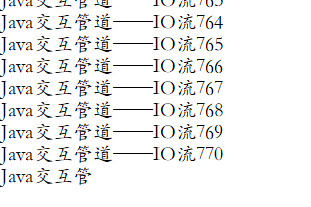

最后再flush  就能彻底清空缓存但没写入文件的数据！！

---

3、删除指定文件

File类的delete()方法可以实现删除指定的文件，首先使用目标文件路径创建File类的实例对象，然后再调用File类的delete()方法


### Java中输出流flush()方法

flush()是清空的意思，用于清空缓冲区的数据流，进行流的操作时，数据先被**读到内存**中，再用数据写到文件中

当数据读完时，我们如果这是调用close方法关闭读写流，这时就可能造成**数据丢失**   为啥呢？**读入数据完成时不代表写入数据完成，一部分数据可能会留在缓存区中**

```
 public void flush() throws IOException {
        synchronized (lock) {
            flushBuffer();
            out.flush();
        }
    }
    
   void flushBuffer() throws IOException {
        synchronized (lock) {
            ensureOpen();
            if (nextChar == 0)
                return;
            out.write(cb, 0, nextChar);
            nextChar = 0;
        }
    }
    
private void ensureOpen() throws IOException {
    if (out == null)
    	throw new IOException("Stream closed");
}
```

**ensureOpen()用于确保该流没有被关闭**


read()方法和write()是**线程阻塞**的，也就是说，当某个线程试图向另一端网络节点读取或写入数据时，有可能会发生网络连接异常或者是服务器短期内没有响应，这将会导致该线程阻塞，同样地，在**无数据状态进行读取**，**数据已满进行写操作**时，同样会发生阻塞，这时，其他线程抢占资源后继续执行。如果出现此现状，读取到缓冲池中的数据不能够及时的发送到另一端的网络节点，需要该线程**再次竞争**到CPU资源才可正常发送。

还有一种情况，当我们将数据预存到缓冲池中时，当数据的长度**满足缓冲池中的大小**后，才会将缓冲池中的数据**成块的发送**，若数据的长度**不满足缓冲池中的大小**，需要继续存入，待数据**满足预存大小后再成块的发送**。往往在发送文件过程中，文件==末尾的数据大小不能满足缓冲池的大小==。最终导致这部分的数据==停留在缓冲池无法发送==。

这时，就需要我们在write()方法后，手动调用flush()方法，强制刷出缓冲池中的数据，（即使==数据长度不满足缓冲池的大小==）从而保证数据的正常发送。当然，当我们调用流的close()方法后，系统也会自动将输出流缓冲区的数据刷出，同时可以保证流的物理资源被回收。

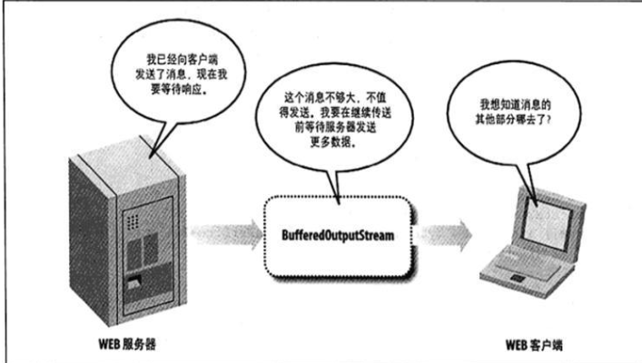

 上图中WEB服务器通过输出流向客户端响应了一个300字节的信息，但是，这时的输出流有一个1024字节的缓冲区。所以，输出流就一直等着WEB服务器继续向客户端响应信 息，当WEB服务器的响应信息把输出流中的缓冲区填满时，这时，输出流才向WEB客户端响应消息。

  为了解决这种尴尬的局面，flush()方法出现了。flush()方法可以**强迫输出流(或缓冲的流)发送数据，即使此时缓冲区还没有填满，以此来打破这种死锁的状态。**

  当我们使用输出流发送数据时，当数据==不能填满==输出流的缓冲区时，这时，数据就会被存储在输出流的缓冲区中。如果，我们这个时候调用关闭(close)输出流，存储在输出流的缓冲区中的数据就会丢失。所以说，关闭(close)输出流时，应先刷新(flush)换冲的输出流，换句话说就是：“**迫使所有缓冲的输出数据被写出到底层输出流中**”。

**通过out.write()将数据写入底层输出流**


# 静态

在外部调用**静态方法**时，可以使用"**类名.方法名**"的方式，也可以使用"**对象名.方法名**"的方式。而**实例方法**只有后面这种方式。也就是说，调用静态方法可以==无需创建对象==。

静态方法在访问本类的成员时，只允许访问==静态成员==（即静态成员变量和静态方法），而不允许访问==实例成员变量和实例方法==；实例方法则无此限制。

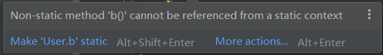


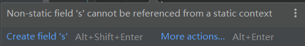


静态方法只能访问静态成员，实例方法可以访问静态和实例成员。之所以不允许静态方法访问实例成员变量，是因为==实例成员变量==是==属于某个对象==的，而静态方法在执行时，并**不一定存在对象**。同样，因为实例方法可以访问实例成员变量，如果允许静态方法调用实例方法，将==间接==地允许它使用实例成员变量，所以它也==不能调用实例方法==。基于同样的道理，静态方法中也不能使用关键字this。


main()方法是一个典型的==静态方法==，它同样遵循一般静态方法的规则，所以它可以由==系统在创建对象之前就调用==。

> 在有main()方法的类中，若要使main方法能调用他们，需要将每个方法设置为static方法
>
> （main方法只能调用静态方法）


```java
 Person p = new Person();
 Method m = p.getClass().getDeclaredMethod("setName", String.class);
 m.setAccessible(true);
 m.invoke(p, "Bob");
 System.out.println(p.name);

 private void setName(String name) {
 	this.name = name;
 }
```


# 泛型


## 泛型概述以及泛型类


泛型：类型参数化，==处理的数据类型不是固定的==，==作为参数传入==

**核心**：告诉**编译器**想使用什么类型，然后编译器帮你处理


> **类的参数**的类型还不确定
>
> 方法要处理的参数的类型不确定

```java
public class GenericClass {
    public static class Pair<U,V>{
        public U fir;
        public V sec;
        
        public Pair(U fir, V sec){
            this.fir = fir;
            this.sec = sec;
        }
        public V getSec() {
            return sec;
        }
        public U getFir() {
            return fir;
        }
    }
    public static void main(String[] args) {
        Pair<String, Integer> pair = new Pair<>("aaa", 123);
			//一个是传入
    }
}
```


**为什么不直接使用普通的Object类呢？**

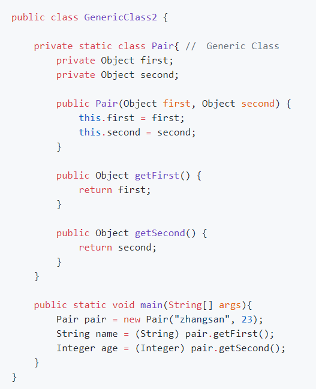

其实是**可行的**，而且Java的**内部**就是这样实现的


> - Java有Java编译器和Java虚拟机，编译器将java源代码转换为.class文件，虚拟机加载并且运行.class文件
> - 对于泛型类，Java编译器会==将泛型代码转换为普通的非泛型代码==，就像上面的普通Pair类代码机器使用代码一样，将==**类型参数T擦除，替换为Object**==，==插入==必要的==类型转换==。`Java`虚拟机实际执行的时候，它是==不知道泛型这回事==的，它只知道普通的类及代码。
> - 再次强调，**`Java`泛型是通过==擦除==实现的，类定义中的类型参数如`T`会被替换为`Object`**，在程序运行过程中，不知道泛型的==**实际类型参数**==，比如`Pair<Integer>`，运行中只知道`Pair`，而不知道`Integer`。


泛型有两个好处：

- **更好的安全性**
- 更高的**可读性**


## 泛型方法


- 需要将***泛型参数列表***至于返回值前

注意：**一个方法是不是泛型，和它所在的类是不是泛型没有任何关系**

泛型方法调用的时候，**不需要指定类型参数的实际类型**，编译器会推断出来


> 泛型方法中的泛型参数    只是用于可以向方法内**传入各种类型的参数**，参数 **用于方法内的调用**


```java
public static <T> int indexOf(T[] arr, T els){
    for(int i = 0; i < arr.length; i++){
        if(arr[i].equals(els)){
            return i;
        }
    }
    return -1;
}

//传入不同类型的参数都可以，无需声明
System.out.println(indexOf(new Integer[]{1, 3, 5, 7}, 5));
System.out.println(indexOf(new String[]{"zhangsan", "lisi", "wangwu"}, "lisi"));
```


**==泛型类的泛型和泛型方法的泛型没有一点关系==**


## 泛型接口


例如Java中的Comparable和Comparator:

```java
public interface Comparable<T> {
	public int compareTo(T o);
}

public interface Comparator<T> {
    int compare(T o1, T o2);
    boolean equals(Object obj);
}
```

**使用的时候需要指定具体的类型**

```java
public final class Integer extends Number implements Comparable<Integer>{
	public int compareTo(Integer anotherInteger) {
       return compare(this.value, anotherInteger.value);
   }
}
```


 

## `extends`、`<=`


### 1、上界为某个==具体类==

- 可以使用 **extends**来限定一个**上界**，此时参数类型必须是给定的类型或者其子类型
- 比如定义一个`NumberPair`类，限定两个参数类型***必须是`Number`或者子类型***，这样限定之后，在子类中，`first`、`second`变量就可以**==当做`Number`进行处理了==**，比如**==调用`Number`类中的方法==**`doubleValue()`、`intValue`等


```java
public static class NumberPair<U extends Number, V extends Number> extends GenericClass.Pair<U,V> {

    public NumberPair(U fir, V sec) {
        super(fir, sec);
    }

    public double getSum(){
        return getFir().intValue() + getSec().doubleValue();
    }
}

public static void main(String[] args) {
    NumberPair<Integer,Double> numberPair = new NumberPair<>(6, 1.11);
    System.out.println(numberPair.getSum());
}
```


---

### 2、上界为某个接口

常见的限定类型是必须实现Comparable接口：


- 要对元素进行比较，要求**元素必须实现Comparable接口**，给类型参数设置一个**上边界**Comparable 必须实现Comparable接口
- T是一种数据类型，必须实现Comparable，且必须可以与相同类型的元素进行比较

```java
public class GenericExtends2 {

    // 要进行元素的比较，要求元素必须实现Comparable接口
    // 所以给类型参数设置了一个上边界Comparable,T 必须实现Comparable接口
    public static <T extends Comparable> T getMax(T[] arr){
        T max = arr[0];
        for(int i = 0; i < arr.length; i++){
            if(arr[i].compareTo(max) > 0){
                max = arr[i];
            }
        }
        return max;
    }

    // 不过上面这么写会有警告 因为Comparable是一个泛型接口，它也需要一个类型参数，所以下面的写法比较好
    // 理解: T是一种数据类型，必须实现Comparable,且必须可以与相同类型的元素进行比较
    public static <T extends Comparable<T> > T getMax2(T[] arr){
        T max = arr[0];
        for(int i = 0; i < arr.length; i++){
            if(arr[i].compareTo(max) > 0){
                max = arr[i];
            }
        }
        return max;
    }
    
    public static void main(String[] args) {
        T t1 = new T(1, "a");
        T t2 = new T(3, "c");
        T t3 = new T(2, "b");
        T[] arr = new T[]{t1, t2, t3};
        System.out.println(getMax(arr).s); //c
    }
}
```


```java
public class T implements Comparable<T>{
    public int a;
    public String s;
    public T(int b, String ss){
        a = b;s = ss;
    }

    @Override
    public int compareTo(T o) {
        return this.a - o.a;  //调用的参数a大于传入的参数a    }
}
```

> 调用这个泛型方法时，限定：**传入的参数T[] 必须是实现了Comparable接口的**，否则不能使用这个方法


---

### 3、上界为其他参数类型


这里模仿`ArrayList`来创建一个类， 并想着实现其中的`addAll()`方法，但是如果**不使用一个上界的话，会出现==无法添加子类==的情况**，

看下面的代码，==`Number`的集合理应可以添加`Integer`类型的元素==。


```java
public class GenericExtends3 {

    // seems like ArrayList
    private static class DynamicArray<E>{

        private static final int DEFAULT_CAPACITY = 10;
        private int size;
        private Object[] data;

        public DynamicArray() {
            this.data = new Object[DEFAULT_CAPACITY];
        }
        
        //add之前先检查容量是否充足
        private void ensureCapacity(int minCapacity){  // simulate ArrayList
            int oldCapacity = data.length;
            if(oldCapacity >= minCapacity)
                return;
            int newCapacity = oldCapacity * 2;
            if(newCapacity < minCapacity) //如果扩展2倍还是小于minCapacity，就直接扩展成为minCapacity
                newCapacity = minCapacity;
            data = Arrays.copyOf(data, newCapacity);
        }

        public void add(E e){
            ensureCapacity(size + 1);
            data[size++] = e;
        }

        public E get(int index){
            return (E)data[index];
        }

        public int size(){
            return size;
        }

        public E set(int index, E e){
            E oldValue = get(index);
            data[index] = e;
            return oldValue;
        }
        
        public void addAll(DynamicArray<E>arr){
            for(int i = 0; i < arr.size; i++){
                add(arr.get(i));
            }
        }
    }

    public static void main(String[] args){
        DynamicArray<Number>numbers = new DynamicArray<>();
        DynamicArray<Integer>ints = new DynamicArray<>();
        ints.add(10);
        ints.add(20);
//        numbers.addAll(ints); // compile error
    }
}
```

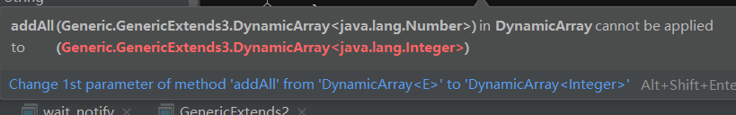

那个需求感觉上是可以，但是通过反证法可以发现是**行不通**的，看下面代码以及解释:

```java
DynamicArray<Number>numbers = new DynamicArray<>();
numbers = ints; // 假设合法
numbers.add(new Double(3.3)); // 那么这一样也可以，此时因为numbers和ints指向的同一个堆区空间，则ints中出现double类型值，显然不合理

//再看一个例子
List<Object>olist = null;
List<String>slist = new ArrayList<>();
olist = slist; // err
//如果上述假设合理
olist.add(111);
//则slist中就会出现Integer类型的值，显然不合理
```

所以，可以==**使用上界类型**==将`addAll`方法改进如下:

```java
//传入的是T类型，限定为是  E类型或者E的子类类型
public <T extends E>void addAll(DynamicArray<T>arr){
    for(int i = 0; i < arr.size; i++){
        add(arr.get(i));
    }
}
```

## 通配符 ？

1. 有限定类型通配符的简单使用

   使用通配符来写上面的addAll()方法：

   ```java
   public void addAll(DynamicArray<? extends E>arr){
       for(int i = 0; i < arr.size; i++){
           add(arr.get(i));
       }
   }
   ```

   **<? extends E>**表示有限定通配符，匹配E或E的某个子类型，具体是什么子类型是未知的。

看一下*public <T extends E> void addAll(DynamicArray<T>arr)*    和     *public void addAll(DynamicArray<? extends E>arr)*   的**区别**

- `<T extends E>`用于**定义**类型参数，它声明了一个类型参数`T`，可放在泛型类中类名的后面、泛型方法返回值前面；
- `<? extends E>`用于**实例化**类型参数，它用于实例化泛型变量中的类型参数，只是这个**具体类型是未知**的，**只知道它是`E`或`E`的子类型**；

它们虽然不一样，但是经常可以达成同样的目标。


---

2. 无限定类型通配符

简单使用：第一种方式使用通配符，第二种方式使用类型参数，达到相同目的：

```java
public static int indexOf(DynamixArray<?> arr)

public static <T> int indexOf2(DynamicArray<T> arr) 
```


---

**限制：**


1) **==只能读 不能写==**

```java
public class WildcardCharacter {
    public static void main(String[] args){
        ArrayList<Integer> ints = new ArrayList<>();
        ArrayList<? extends Number> numbers = ints; // 使用extends通配符指定上界

        Integer a = 10;
        //以下操作会报错
//        numbers.add(a); // err
//        numbers.add(Object(a)); //err
//        numbers.add(Number(a)); //err
    }
}
```

解释： ？ 表示类型安全无知， ？extends Number表示是Number的某个子类型，但不知道具体子类型，==如果允许写入，Java就无法确保类型安全性==，**禁止！！**

**==但是可以进行读取get()==**

**使得很多理应可以完成的操作可能会出现错误**


```java
? 等同于? extends Object
List<?>list6 = new ArrayList<>();
List<? extends Object>list7 = new ArrayList<>();
```


不可以修改`？`通配符的值:

```java
 public static void swap(ArrayList<?> arr, int i, int j){
     Object tmp = arr.get(i);
     //arr.set(i, arr.get(j)); // can't change the value
     //arr.set(j, tmp);
 }
```

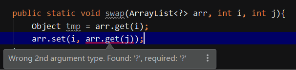

这样做可以。

```java
List<String> l1 = new ArrayList<>();
l1.add("asd");
List<?> list = l1;
list.get(0);//可行
//list.add("123")
```

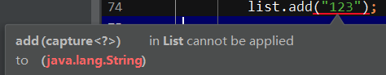

**不允许直接对nu进行写入，虽然nu和in指向同一个堆空间，但对nu操作存在风险。可以对in进行操作**

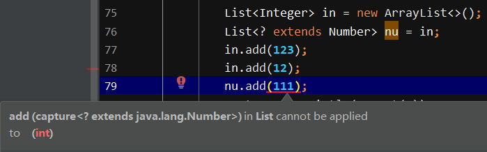

**==为了保证向下兼容的一致性，不能添加元素==**


----

2）参数类型间的依赖关系

如果参数类型之间有依赖关系，也**只能用类型参数**：

```java
// S和D要么相同，要么S是D的子类，否则类型不兼容，有编译错误
public static <D,S extends D> void copy(ArrayList<D> dest, ArrayList<S> src){
    for(int i=0; i<src.size(); i++)
        dest.add(src.get(i));
}

// 可以使用通配符简化一下
public static <D> void copy2(ArrayList<D> dest, ArrayList<? extends D> src){
    for(int i=0; i<src.size(); i++)
        dest.add(src.get(i));
}
```


---

3) 如果==**返回值**==依赖于类型参数，也不能用通配符

```java
//不能使用通配符，只能用类型参数，因为要返回
public static <T extends Comparable<T> > T max(ArrayList<T> arr){
    T max = arr.get(0);
    for(int i = 1; i < arr.size(); i++){
        if(arr.get(i).compareTo(max)>0){
            max = arr.get(i);
        }
    }
    return max;
}
```


> - 通配符形式都可以用类型参数的形式来替代，通配符能做的，用类型参数都能做
> - 通配符形式可以**减少类型参数**，形式上往往**更为简单**，可读性也更好，能用通配符就用通配符
> - 如果类型参数之间有依赖关系，或者返回值依赖类型参数，或者需要 **写** 操作，只能用类型参数


## `super`、`>=`、超类型通配符

简单来说，super和extends刚好相反，匹配的是 >=E 的类型

相当于规定了一个下界。


---

1、使用场景

在DynamicArray中添加一个copyTo方法，功能是将**当前**对象容器中的数拷贝到传入的参数dest容器中

```java
public void copyTo(DynamicArray<? super E> dest){
	for(int i = 0; i < this.size; i++){
		dest.add(this.get(i));
	}
}
```

**Integer数组理应可以拷贝到Number数组**

addAll是将**外部**的拷贝**进来**，**外部需要<= E 才能传入E类型的容器中**

copyTo将**内部**的拷贝**出去**，  **外部需要>= E 才能容纳E类型的数据**


---

2、没有<T super E> 只有<T extends E>

类型参数限定只有extends形式。          通配符形式的声明：

```java
public void copyTo(DynamicArray<? siper E> dest)
```

如果类型参数限定支持super形式，应该是：

```java
public <T super E> void copyTo(DynamicArray<T> dest)
```

**但是，java并不支持这种语法**对于类似上面的超类型通配符，则无法用类型参数替代


**区别：**在方法传递中可以添加自己和子类的数据，而extends都不可以添加

```java
public class GenericSuper2 {

    private static class Fruit {}
    private static class Apple extends Fruit{}
    private static class Pear extends Fruit{}
    private static class FuShiApple extends Apple{}

    static class Clazz<T extends Fruit>{  //创建的类必须是Fruit的子类//为了自己类中使用这个类

    }

	public static void main(String[] args) {
		List<Apple>list1 = new ArrayList<>();
		add(list1);
		List<Fruit>list2 = new ArrayList<>();
		add(list2);
		List<Object>list3 = new ArrayList<>();
		add(list3);

		//？super的使用
		List<? super Apple>list4 = new ArrayList<>();
		add(list4);
		List<? super Apple>list5 = new ArrayList<>();
		add(list5);
		
		List<FuShiApple>list6 = new ArrayList<>();  // < 的不行
//		add(list6); // err
		
	}

	//只要是Apple的祖先都可以调用这个方法 >= 
	public static void add(List <? super Apple> list) {  
		/**  ！！！！！！不能用于添加父类对象的数据
		 * list.add(new Fruit());
		 */
		//区别于extends, 可以添加    自己和子类的数据
		list.add(new Apple());
		list.add(new FuShiApple());
	}
}
```

> - `? super E`：传入的是 >=E的容器    都可以在方法中进行添加 <=E 的对象  **但是不能用于添加父类对象的数据**
>   - 只需要在预先写入的时候add <=E的对象，就可以确保add均可实现，不违规
>
> - `? extends E` ：容器中只能装<=E的对象   **在传入之前不能确定到底是哪一个层级的对象，如果U<T<E ，那么在预先写方法的时候不能确定具体传入的U还是T**
>   - 若传入的是U，那么预先写的T和E的add方法就**无法实现  ERROR**


## 通配符extends, super比较

- 共同点：为了使方法接口更为灵活，可以接受更为广泛的类型
- `<? super E>`用于**写入或比较**，使得对象可以**==写入==**父类型的容器( >= )，是的父类型的比较方法可以应用于子类对象
- `<? extends E>`用于**灵活读取**，使得**方法**可以**读取**E或E的任意**子类型**的**容器对象**


Java容器类的实现中，有很多这种用法，比如，`Collections`中就有如下一些方法：

```java
public static <T extends Comparable<? super T>> void sort(List<T> list)

public static <T> void sort(List<T> list, Comparator<? super T> c)

public static <T> void copy(List<? super T> dest, List<? extends T> sec)//将<=T的容器中的对象 拷贝到 >=T的容器中，确保安全

public static <T> T max(Collection<? extends T> cill, Comparator<? super T> comp)
```


## 泛型擦除

- 泛型信息只存在于代码**编译阶段**，在进入JVM之前，与泛型相关的信息会被擦除掉
- 泛型类和普通类在java虚拟机内是没有什么特别的地方


```java
public class GenericWipe {
    public static void main(String[] args){
        List<String> slist = new ArrayList<>();
        List<Integer> ilist = new ArrayList<>();
        System.out.println(slist.getClass() == ilist.getClass());//true
    }
}
```

**编译器会将T擦掉，然后替换成Object，在必要的时候进行*强制类型转换***


```java
public class GenericWipe<T> {

    private T obj;
    public GenericWipe(T o){
        obj = o;
    }

    public static void main(String[] args) {
        GenericWipe<String> s = new GenericWipe<>("wipe");
        Class gwClass = s.getClass();
        System.out.println(gwClass.getName()); // 得到运行时的状态信息,运行时是真实的类型

        Field[] fs = gwClass.getDeclaredFields();//得到在JVM中的类型 
        for(Field f : fs){
            System.out.println("Field name: " + f.getName() + "   type: " + f.getType().getName());
        }
    }
}

Generic.GenericWipe
Field name: obj   type: java.lang.Object
```

Class的类型是GenericWipe，并不是GenericWipe<T>这种形式

Jvm中的类型，泛型类被类型擦除后，响应的类型就被**替换成Object类型**？？

 *这种说法不完全正确！！*


更改一下代码：

```java
public class GenericWipe<T extends String> {

    private T obj;
    public GenericWipe(T o){
        obj = o;
    }

    public static void main(String[] args) {
        GenericWipe<String> s = new GenericWipe<>("wipe");
        Class gwClass = s.getClass();
        System.out.println(gwClass.getName()); // 得到运行时的状态信息,运行时是真实的类型

        Field[] fs = gwClass.getDeclaredFields();//得到在JVM中的类型 
        for(Field f : fs){
            System.out.println("Field name: " + f.getName() + "   type: " + f.getType().getName());
        }
    }
}

Generic.GenericWipe
Field name: obj   type: java.lang.String
```

可以看到，第二个输出变成了String

**结论**如下：

- 在泛型类被类型擦除的时候，之前泛型类中的类型参数部分如果**没有指定上限**，如`<T>`则会被**转译成普通的Object类型**
- 如果指定了上限，如`<T extends String>`则类型参数就被**替换成类型上限**


所以，在反射中，add()这个方法对应的Method的签名应该是`Object.class`。也就是说，如果你要在反射中找到 `add` 对应的 `Method`，你**应该调用 `getDeclaredMethod("add",Object.class) `否则程序会报错**，提示没有这么一个方法，原因就是类型擦除的时候，`T` 被替换成 `Object` 类型了。

```java
public class GenericWipe<T> {  // <= String
    // public class GenericWipe<T extends String> {  // <= String
    private T obj;

    public GenericWipe(T obj){
        this.obj = obj;
    }
//--------------------------------
    public void add(T obj){
        
    }
//--------------------------------
    public static void main(String[] args){
        GenericWipe<String>gw = new GenericWipe<>("wipe");
        Class gwClass = gw.getClass();
        System.out.println(gwClass.getName()); // 得到运行时的状态信息,运行时是真实的类型

        System.out.println("--------------------------");
        Method[] methods = gwClass.getDeclaredMethods();
        for ( Method m:methods ){
            System.out.println(" method:" + m.toString());
        }
    }
}

 public void t3() throws NoSuchFieldException, NoSuchMethodException, InvocationTargetException, IllegalAccessException {
        GenericWipe<String> g = new GenericWipe<>("wipe");
        Method m = g.getClass().getDeclaredMethod("add", Object.class);
        m.invoke(g, "123");
    }
```

使用`Method m = g.getClass().getDeclaredMethod("add",String.class);`

**<u>java.lang.NoSuchMethodException: Generic.GenericWipe.add(java.lang.String)</u>**


**这个是根据上面说的上限来定的，**

**若指定了上限，就用上限：**

```java
//为方法参数专门设定上限Number
public <T extends Number> void add(T o){
    System.out.println("add! " + o.toString());
}

Method m = g.getClass().getDeclaredMethod("add", Number.class);
m.invoke(g, 123.123);  //add! 123.123
```


## 泛型注意事项


1、基本类型不能用于**实例化类型参数**，也就是泛型类或者泛型方法中，***不接受8种基本数据类型***

```java
List<int> li = new ArrayList<>(); // err
List<boolean> li = new ArrayList<>(); // err
List<Integer> li = new ArrayList<>();  //ok
List<Boolean> li1 = new ArrayList<>(); // ok
```


---

2、**运行时**类型信息**不适用**于泛型

↑  说的泛型擦除，泛型**不支持运行时的信息**（和反射有关）

`instanceof`后面是接口或类名，`instanceof`是**运行时判断**，也**与泛型无关**，所以，Java也不支持如下写法：

```java
if(p1 instanceof Pair<Integer>)
```


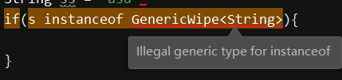


---

3、Java不能创建***具体类型*的泛型数组**

但是 ？ 可以，因为 ？代表的是未知类型：

```java
public class GenericOther {
    public static void main(String[] args){
//        List<Integer>[] list1 = new ArrayList<Integer>[]; // complier err
//        List<Boolean> list2 = new ArrayList<Boolean>[]; // complier err
        List<?>[] list3 = new ArrayList<?>[10]; // 这个却可以 ? 代表的是未知类型
        list3[1] = new ArrayList<String>();
        List<?> tmp = list3[1];
        System.out.println(tmp.get(0));
//        tmp.set(1, 2); complier err
    }
}
```

- `List<Boolean>` 和 `List<Integer>` **在 `Jvm` 中等同于`List<Object>`** ，所有的**类型信息都被擦除**，程序也**无法分辨**一个数组中的元素类型具体是` List<Integer>`类型还是` List<Boolean>` 类型。
- `？` 代表未知类型，涉及的操作都基本上与类型无关，`Jvm` **不针对它对类型作判断**，因此它能编译通过，但是，它只能读，不能写。比如，上面的 `tmp` 这个局部变量，它**只能**进行 `get()` 操作，不能进行 `add()` 操作。


如果可以创建泛型数组：

数组可以进行**不同类型之间的转换**，但也需要注意使用，否则会造成**运行时异常**。

如果运行创建泛型数组也会产生类似的问题，所以**干脆禁止**。


```java
public class NoGenericClassArray {
     private static class Pair { //　Generic Class
        private Object first;
        private Object second;
        public Pair(Object first, Object second) {
            this.first = first;
            this.second = second;
        }
        public Object getFirst() {
            return first;
        }
        public Object getSecond() {
            return second;
        }
    }
    public static void main(String[] args) {
        // 数组是Java直接支持的概念，它知道数组元素的实际类型，
        // 它知道Object和Number都是Integer的父类型，所以这个操作是允许的。
        Integer[] ints = new Integer[10];
        Number[] numbers = ints; //  is ok
        Object[] objs = ints;

        // 虽然Java允许这种转换，但是如果使用不恰当，就有可能引起运行时异常
        Integer[] ints2 = new Integer[10];
        Object[] objs2 = ints2;
        objs2[0] = "hello"; // RuntimeException
    }
}
```

这里如果允许创建，那Double就能给Object对象赋值，但也会引起其他的一些问题，**错误的类型转换**

```java
//        Pair<Object, Integer>[] options = new Pair<Object, Integer>[3]; //如果可以，那最后一行就会不会编译错误，这样显然是不行的
//        Object[] objs = options;
//        objs[0] = new Pair<Double, String>(12.34, "hello");
```


---

4、不能通过类型参数创建对象

```java
T elm = new T();
T[] arr = new T[10];
```

你以为创建的就是对应类型的西哎那个，但由于类型擦除，Java只能创建Object对象，而无法创建T类型的对象。那如果确实希望**根据类型**创建对象呢？需要***设计`API`接受类型对象，即`Class`对象***，并使用`Java`中的**反射机制**，如果类型有默认构造方法，可以调用`Class`的`newInstance`方法构建对象：


# 小知识点


## 双冒号 ::


方法引用分为三种，方法引用通过一对双冒号:: 来表示，方法引用是一种函数式接口的另一种书写方式


- 静态方法引用，通过类名::静态方法名， 如 Integer::parseInt
- 实例方法引用，通过**实例**对象::实例方法，如 str::substring
- **构造**方法引用，通过类名::new， 如 User::new


通过**方法引用**，可以将***方法的引用*** 赋值给一个变量,通过**赋值**给**Function**，说明方法引用也是一种函数式接口的书写方式，Lambda表达式也是一种函数式接口，Lambda表达式一般用于自己提供方法体，而方法引用一般直接引用现成的方法。


```java
// 使用双冒号::来构造静态函数引用
Function<String, Integer> fun = Integer::parseInt;
Integer value = fun.apply("123");
System.out.println(value);

// 使用双冒号::来构造非静态函数引用
String content = "Hello JDK8";
Function<Integer, String> func = content::substring;
String result = func.apply(1);
System.out.println(result);

// 构造函数引用
BiFunction<String, Integer, User> biFunction = User::new;
User user = biFunction.apply("mengday", 28);
System.out.println(user.toString());

// 函数引用也是一种函数式接口，所以也可以将函数引用作为方法的参数
sayHello(String::toUpperCase, "hello");

// 方法有两个参数
private static void sayHello(Function<String, String> func, String parameter){
    String result = func.apply(parameter);
    System.out.println(result);
}
```

**BiFunction接口可以传入两个参数**


