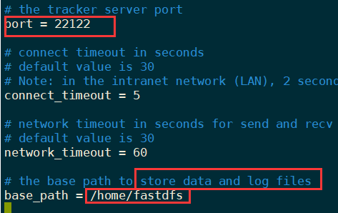
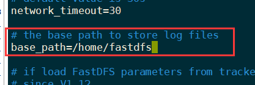

# 分布式文件系统 - FastDFS


# 1. 场景概述


- 天猫、淘宝的购物网站，大量的图片和视频，文件太多，如何存储
- 用户访问量大，如何保证下载速度？分布式文件系统就是解决这些问题的！


## 1.1 什么是文件系统


- 文件数据是如何存储的？


驱动程序来读取硬盘等硬件中的数据。

机械硬盘：


机械硬盘的数据通过文件系统呈现。


## 1.2 分布式文件系统


- 一台电脑存储量有限，并且**并发吞吐量**也有限，如何提高性能？
- 一吨货物，运送到新疆....
  - 1人？
  - 50人？
  - 500人？每个人都很轻松
- 这是分布式吗？**这里面有分布式的概念，也有集群的概念**
- **分布式：**  **不同的业务**，部署在不同的服务器上或者同一个业务模块分析多个子业务，部署在不同的服务器上，**解决高并发的问题->(每个服务器的压力都不至于太大)**
- **集群：**同一个业务部署在多台服务器上，提高系统的**高可用性**


- 原先一个厨师，什么都干，再请一个厨师，两个厨师都可以炒菜，**作用是一样的**，这就是"**集群**"
- 为了让厨师专心炒菜，请了配菜师，厨师和配菜师的关系是 **分布式**
- 一个配菜师忙不过来，再请一个配菜师，两个配菜师又是 **集群**


**必须对大量的请求进行分发（负载均衡？）**


## 1.3 主流的分布式文件系统


### 1.3.1 HDFS


- Hadoop Distributed File System，Hadoop分布式文件系统
- **高容错**的系统，适合部署到廉价的机器上
- 能提供**高吞吐量**的数据访问，非常适合大规模数据应用
- HDFS采用主从结构，一个HDFS是由一个name节点和N个data节点组成
- name节点储存元数据，一个文件 **分割成N份**，存储在不同的data节点上

集成大数据生态


### 1.3.2 GFS

- Google File System
- 可扩展的分布式文件系统，用于大型的，对大量数据进行访问的应用
- 运行于廉价的普通硬件上，提供容错功能
- 给大量的用户提供总体性能较高的服务
- GFS采用主从结构，一个GFS集群由一个master和大量的chunkserver（分块服务器）组成
- 一个文件被 **分隔若干块**，分散到多个分块server中


### 1.3.3 FastDFS


- 淘宝开源...
- 专为互联网量身定制，充分考虑了**冗余备份，负载均衡，线性扩容**等机制，并注重**高可用，高性能**等指标，使用FastDFS容易搭建一套高性能的文件服务器集群提供文件上传、下载等服务
- HDFS、GFS等都是通用的文件系统，他们的有点事开发体验好，但是系统的复杂度较高，性能也一般
- 相比之下，专用的分布式文件系统体验差，但是复杂度低，性能也高，尤其**FastDFS特别适合图片、小视频等小文件**，因为fastDFS **对文件是不分割的**，所以**没有文件合并、切割的开销**
- **网络通信用socket**，速度快


> 如果上传的文件较大，选hdfs


## 1.4 工作原理


- fastDFS包含`Tracker Server`和`Storage Server`
- 客户端请求Tracker Server进行文件的上传和下载
- Tracker Server调度Storage Server最终完成上传与下载


- Tracker（**追踪者**）
  - 作用是**负载均衡和调度**，它管理着存储服务（Storage Server），可以理解为“大管家、追踪者、调度员”
  - Tracker Server可以**集群，实现高可用**，策略为“**轮询**”

> **Tracker不会保存数据**

- Storage （仓库；贮存器）
  - 作用是文件存储，客户端上传的文件最终存储到storage服务器上
  - storage**集群采用分组**的方式，通组内的每台服务器是**平等关系**，**数据同步**，目的是实现**数据备份，从而高可用**，而**不同组的服务器之间是不通信的**
  - 同组内的每台服务器的存储量不一致的情况下，会**选取容量最小**的那个，所以**同组内的服务器**之间软硬件最好保持一致
  - Storage Server会连接集群中的**所有Tracker Server**，定时向他们汇报自己的状态，例如：剩余空间，文件同步情况，文件上传下载次数等信息


## 1.5 上传/下载 原理


上传流程解析：


- 客户端上传文件后，storage会将**文件id**返回给客户端

- group1/M00/02/11/  ajxAeF2105wAAAAAAAGaEIOA12345.sh

  - 组名：文件上传后，在storage服务器上 **组的名称**，文件上传成功后，由storage返回，需要客户端自行保存

  - **虚拟磁盘路径：**

    storage配置的虚拟路径，在磁盘选项storage_path对应

    storage_path0对应M00（自行配置）

    storage_path1对应M01

  - **数据两级目录：**（02/11）

    storage在虚拟磁盘下自行创建的目录

  - **文件名：**(上传a.shell文件)

    与上传时不同，是用**storage根据特定信息生成**的，里面包含：**storage服务器的ip，创建时间戳，大小，后缀名等信息**


下载流程：


# 2.FastDFS的上传与下载


## 2.1 安装


- 安装`gcc`（编译时需要）

  ```
  yum install -y gcc gcc-c++
  ```

  

- 安装`libevent`（运行时需求）

  ```
  yum -y install libevent
  ```

  

- 安装libfastcommon

  libfastcommon是FastDFS官方提供的，libfastcommon包含了FastDFS运行所需要的一些基础库

  上传libfastcommon-master.zip到/opt

  ```
  ./make.sh 编译
  ```

  如果make.sh的权限不够，则需要授权

  ```
  chmod 777 make.sh
  ```

  安装

  ```
  ./make.sh install
  ```

  安装完成后会在


---


- 安装Tracker

上传fastdfs-master.zip

```
unzip fastdfs-master.zip
./make
./make.sh install
```

安装成功后将conf下的文件拷贝到/etc/fdfs下

**其实安装的时候已经有了：**


## 2.2配置


-  Tracker配置

  ```
  cd /etc/fdfs/
  vim tracker.conf
  ```

  

  ​	

---


- Storage配置

  `vim storage.conf`


storage端口：


Storage_path0是store存放文件的位置，可以理解为一个磁盘一个path，多个磁盘就有多个store_path，目录需要自行创建：

`mkdir /home/fastdfs/hdfs_storage`


tracker服务器的ip：


## 2.3 启动服务


启动tracker：

```
/usr/bin/fdfs_trackerd  /etc/fdfs/tracker.conf restart
/usr/bin/fdfs_storaged  /etc/fdfs/storage.conf restart
```


名字写错了。。。**导致无法启动storage服务**


启动成功:


## 2.4 搭建java工程


依赖

```xml
<dependency>
    fastdfs的java客户端
    <groupId>net.oschina.zcx7878</groupId>
    <artifactId>fastdfs-client-java</artifactId>
    <version>RELEASE</version>
</dependency>
	  上传使用的组件
<dependency>
    <groupId>commons-io</groupId>
    <artifactId>commons-io</artifactId>
    <version>2.6</version>
</dependency>
```


fastdfs-client.properties

```properties
##fastdfs-client.properties
fastdfs.connect_timeout_in_seconds = 5
fastdfs.network_timeout_in_seconds = 30
fastdfs.charset = UTF-8
fastdfs.http_anti_steal_token = false
fastdfs.http_secret_key = FastDFS1234567890
fastdfs.http_tracker_http_port = 80
fastdfs.tracker_servers = 192.168.150.128:22122
```


### 2.4.1 文件上传


```java
public class uploadTest {
    public static void main(String[] args) throws IOException, MyException {

        //加载配置文件
        ClientGlobal.initByProperties("fastdfs-client.properties");

        //创建tracker客户端
        TrackerClient trackerClient = new TrackerClient();

        //通过tracker客户端获取tracker的连接服务并返回
        TrackerServer trackerServer = trackerClient.getConnection();

        //声明Storage服务
        StorageServer storageServer = null;

        //定义storage客户端
        StorageClient1 storageClient1 = new StorageClient1(trackerServer, storageServer);

        //定义文件元信息
        NameValuePair[] list = new NameValuePair[1];
        list[0] = new NameValuePair("fileName", "haocun.jpg");
        //上传文件，返回fileId
        String fileId = storageClient1.upload_file1("C:\\Users\\Cuaaa\\Pictures\\haocun.jpg", "jpg", list);
        System.out.println("fileId = " + fileId);
        //fileId = group1/M00/00/00/wKiWgGBEbH6AYNebAAUIbhz8Vws485.jpg

        //关闭客户端
        trackerServer.close();
    }
}
```


`fileId = group1/M00/00/00/wKiWgGBEbH6AYNebAAUIbhz8Vws485.jpg`

- group1：一台服务器就是一个组，就是当前使用的服务器就是group1服务器
- M00对应目录：`store_path0` ->  `/home/fastdfs/fdfs_storage/data/`

- 00/00都是目录地址，两级数据目录，分批管理

在fdfs文件系统中找到小浩存了~


### 2.4.2 文件查询

```java
public static void main(String[] args) throws IOException, MyException {
    //加载配置文件
    ClientGlobal.initByProperties("fastdfs-client.properties");

    //创建tracker客户端
    TrackerClient trackerClient = new TrackerClient();

    //通过tracker客户端获取tracker的连接服务并返回
    TrackerServer trackerServer = trackerClient.getConnection();

    //声明Storage服务
    StorageServer storageServer = null;

    //定义storage客户端
    StorageClient1 storageClient1 = new StorageClient1(trackerServer, storageServer);

    FileInfo fileInfo = storageClient1.query_file_info1("group1/M00/00/00/wKiWgGBEbH6AYNebAAUIbhz8Vws485.jpg");
    System.out.println("fileInfo = " + fileInfo);
    //fileInfo = source_ip_addr = 192.168.150.128, file_size = 329838, create_timestamp = 2021-03-07 14:02:38, crc32 = 486299403
    trackerServer.close();
}
```


`fileInfo = source_ip_addr = 192.168.150.128, file_size = 329838, create_timestamp = 2021-03-07 14:02:38, crc32 = 486299403`


### 2.4.3 文件下载


```java
public static void main(String[] args) throws IOException, MyException {
    //加载配置文件
    ClientGlobal.initByProperties("fastdfs-client.properties");

    //创建tracker客户端
    TrackerClient trackerClient = new TrackerClient();

    //通过tracker客户端获取tracker的连接服务并返回
    TrackerServer trackerServer = trackerClient.getConnection();

    //声明Storage服务
    StorageServer storageServer = null;

    //定义storage客户端
    StorageClient1 storageClient1 = new StorageClient1(trackerServer, storageServer);

    byte[] bytes = storageClient1.download_file1("group1/M00/00/00/wKiWgGBEbH6AYNebAAUIbhz8Vws485.jpg");

    //通过io流将字节数组转换为文件
    FileOutputStream fileOutputStream = new FileOutputStream(new File("D:/desktop/haocun.jpg"));
    //将字节写入文件流中
    fileOutputStream.write(bytes);
    fileOutputStream.close();
    trackerServer.close();


}
```

下载成功：


# 3.项目实战


## 3.1 搭建图片服务器


### 3.1.1 Nginx模块安装（Storage）


1. 上传 fastdfs-nginx-module-master.zip到/opt

2. 解压nginx模块

   ```
   unzip fastdfs-nginx-module-master.zip
   ```

   

3. 编辑config配置文件

   去掉local目录


4. 将fastdfs-nginx-module下的mod_fastdfs.conf拷贝至/etc/fdfs下

```
cp mod_fastdfs.conf /etc/fdfs/
```

5. 修改 `mod_fastdfs.conf`



修改ip：

**n个tracker配置n行**


url中改为包含组名：


指定文件存储路径，上面storage配置文件中配置的store_path0


6. 将libfdfsclient.so拷贝至/usr/lib下

```
cp /usr/lib64/libfdfsclient.so /usr/lib/
```


7. 创建nginx/client目录

   ```
   mkdir -p /var/temp/nginx/client
   ```

   


## 3.1.2 Nginx安装（Tracker）


1. 将nginx上传并解压

2. 安装nginx依赖库

   ```
   yum install pcre
   yum install pcre-devel
   yum install zlib
   yum install zlib-devel
   yum install openssl
   yum install openssl-devel
   ```

3. 安装nginx（见nginx安装笔记。。）

```
./configure --prefix=/usr/local/nginx \
--add-module=/opt/fastdfs-nginx-module-master/src
```

4. 编译：make

5. 安装：make install

6. 拷贝配置文件,**进行覆盖**

   ```
   cd /opt/FastDFS-master/conf
   cp http.conf mime.types /etc/fdfs
   ```

7. 修改nginx配置文件

   ```
   vim nginx.conf
   ```

   

```
server {
        listen       80;
        server_name  192.168.150.128;

        #charset koi8-r;

        #access_log  logs/host.access.log  main;

        location /group1/M00 {
            root   /home/fastdfs/fdfs_storage/data;
            ngx_fastdfs_module;

```


启动遇到bug：unknown directive ngx_fastdfs_module 

解决方法见 **坑**


成功启动：


通过nginx来直接访问照片：√


**nginx的负载均衡 + fastdfs文件系统联合的*小模块*，直接访问到fdfs中的文件**


## 3.2 创建前端页面


```html
<!--上传图片 文件与文字相比较起来，数据内容较大，必须使用post方式提交
上传文件和普通文本有区别，action接收参数也会区别对待，所以声明带文件提交的表单为多部件表单-->
    <form action="/upload" method="post" enctype="multipart/form-data">
        <input type="file" name="fname"><br/>
        <button>提交</button>
    </form>
```


## 3.3 依赖


```xml
<!--        java连接fdfs的客户端工具-->
        <dependency>
            <groupId>net.oschina.zcx7878</groupId>
            <artifactId>fastdfs-client-java</artifactId>
            <version>RELEASE</version>
        </dependency>
<!--        图片上传到fdfs需要用到的io工具-->
        <dependency>
            <groupId>commons-io</groupId>
            <artifactId>commons-io</artifactId>
            <version>2.6</version>
        </dependency>
        <dependency>
            <groupId>javax.servlet</groupId>
            <artifactId>servlet-api</artifactId>
            <version>2.5</version>
        </dependency>
<!--        图片保存到web服务器需要用到的io工具-->
        <dependency>
            <groupId>commons-fileupload</groupId>
            <artifactId>commons-fileupload</artifactId>
            <version>1.3.1</version>
        </dependency>
<!--        转换java对象和json字符串-->
        <dependency>
            <groupId>com.fasterxml.jackson.core</groupId>
            <artifactId>jackson-databind</artifactId>
        </dependency>
```


## 3.4 实体类


```java
@Data
@ToString
@AllArgsConstructor
@NoArgsConstructor
public class FileSystem implements Serializable {
    private String fileId;
    private String filePAth;
    private String fileName;
}
```


## 3.5 配置


无需配置`StandardServletMultipartResolver`,springboot自动配置，只需要配置属性即可


配上上传文件的大小

```properties
spring.servlet.multipart.max-file-size=20MB
spring.servlet.multipart.max-request-size=50MB
```


fastdfs配置文件

`fastdfs-client.properties`

```properties
##fastdfs-client.properties
fastdfs.connect_timeout_in_seconds = 5
fastdfs.network_timeout_in_seconds = 30
fastdfs.charset = UTF-8
fastdfs.http_anti_steal_token = false
fastdfs.http_secret_key = FastDFS1234567890
fastdfs.http_tracker_http_port = 80
fastdfs.tracker_servers = 192.168.150.128:22122
```


## 3.6 controller 


```java
@RestController
public class UploadController {

    /**
     * 上传文件的流程：
     * 1.先把文件保存到web服务器上
     * 2.再从web服务器上将文件上传到fastdfs中
     */
    @PostMapping("/upload")
    //也可以直接使用@RequestPart("fname") MultipartFile 来接收图片
    //MultipartHttpServletRequest是HttpServletRequest的强化版本，不仅可以装文本信息，还可以装图片、文件信息
    public FileSystem upload(MultipartHttpServletRequest request) throws IOException, MyException {
        FileSystem fileSystem = new FileSystem();

        //从页面请求中获取上传的文件对象
        MultipartFile file = request.getFile("fname");

        //获得文件原始名称
        String originalFilename = file.getOriginalFilename();
        //还要获得后缀名
        //通过字符串截取的方式从文件原始名中获取文件的后缀
        String suffix = originalFilename.substring(originalFilename.lastIndexOf(".") + 1);

        //生成为了避免文件因为同名而覆盖，生成全新的文件名 ，拼接后缀
        String newName = UUID.randomUUID().toString() + "." + suffix;

        //创建web服务器保存文件的目录
        File toSaveFile = new File("D:/desktop/" + newName);

        //把原文件转存到服务器设定的保存地址上
        file.transferTo(toSaveFile);

        //获取服务器转存的该文件的的绝对路径
        String absolutePath = toSaveFile.getAbsolutePath();

        //----------------------把文件从web服务器上传到fastdfs--------------------------------------

        //加载配置文件
        ClientGlobal.initByProperties("fastdfs-client.properties");
        TrackerClient trackerClient = new TrackerClient();
        TrackerServer trackerServer = trackerClient.getConnection();
        StorageServer storageServer = null;
        StorageClient1 storageClient1 = new StorageClient1(trackerServer, storageServer);

        NameValuePair[] nameValuePairs = new NameValuePair[1];
        nameValuePairs[0] = new NameValuePair("filename", originalFilename);
        //文件名需要绝对路径
        String fileId = storageClient1.upload_file1(absolutePath, suffix, nameValuePairs);

        trackerServer.close();

        //封装fileSystem数据对象
        fileSystem.setFileId(fileId);
        fileSystem.setFileName(originalFilename);
        fileSystem.setFilePAth(fileId);//已经上传到fastDFS上，通过fileId来访问图片，所以fileId即为文件路径


        return fileSystem;
    }

    @GetMapping("/ok")
    public String get(){
        return "ok";
    }
}
```


```
// 20210307180400
// http://localhost:8080/upload

{
  "fileId": "group1/M00/00/00/wKiWgGBEpQ-AMP_uAAJgzTds8uY985.jpg",
  "filePAth": "group1/M00/00/00/wKiWgGBEpQ-AMP_uAAJgzTds8uY985.jpg",
  "fileName": "微信图片_202003280149158.jpg"
}
```


直接访问nginx服务器，跳转到fdfs文件系统：

**上传成功！**


## 上传gif/小视频


上传.mp4视频文件：


成功上传！


# 坑


## fdfs_nginx模块报错


在配置的时候需要加载模块，才能在nginx配置文件中使用。

```
--add-module=/opt/fastdfs-nginx-module-master/src
```


查看nginx编译模块情况：


发现没有fastdfs的相关内容


于是重新编译：

`rm -rf  Makefile`


重新执行编译文件内容：

```
./configure --prefix=/usr/local/nginx \
--add-module=/opt/fastdfs-nginx-module-master/src
```

编译并安装


修改配置文件：


