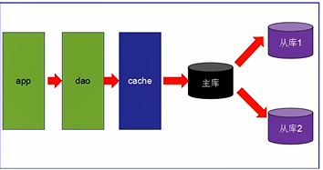

# Redis

# 1.概述

## 1.1 互联网架构的演变历程

- 第一阶段：数据访问量不大，简单的架构即可搞定

  

- 第二阶段：数据访问量大，使用**缓存技术**来缓解数据库的压力。

  - **不使用缓存：查询一次就要访问一次数据库**
  - 不同的业务访问不同的数据库
  - **Redis 1s处理10w请求...**

  

- 第三阶段
  - **主从读写分离**
  - 之前的缓存确实能够缓解数据库的压力，但是**写和读都集中在一个数据库**上，压力又来了
  - **一个数据库负责写，一个数据库负责读，分工合作**
  - 让master（主数据库）来响应事务性（**增删改**）操作，让slave（从数据库）来响应非事务性（**查询**）操作，然后再采用主从赋值来吧master上的事务性操作同步到slave数据库中
  - mysql的master/slace就是网站的标配

- 第四阶段
  - mysql的主从复制，读写分离的基础上，mtsql的**主库开始出现瓶颈**
  - 由于Mysql使用**表锁**，所以**并发性能特别差**
  - **分库分表**开始流行，mysql也提出了表分区，虽然不稳定，但有希望。。
  - 开始mysql集群

## Redis入门介绍

互联网需求：**高并发，高可扩，高性能**

- Redis是一种**运行速度很快，并发性能很强，并且运行在内存上的noSql（not only sql）数据库**
- NoSQL较较传统数据库的优势：
  - NoSQL数据库**无需事先为要存储的数据建立字段**，随时可以存储**自定义的数据格式**
  - 而在关系数据库里，**增删字段**是一件非常麻烦的事情，如果是非常大数据量的表，增加字段简直就是一个噩梦，每一条数据都要加一个字段

---

- Redis的常用使用场景
  - **缓存：提升服务器性能**！一些**频繁被访问的数据**，经常被访问的数据如果放在关系型数据库，每次查询的开销都会很大，而放在redis中，因为redis是放在**内存中**的可以很高效的访问
  - **排行榜：**利用Redis的SortSet（**有序集合**）数据结构能够简单的搞定
  - **计算器/限速器：**利用redis中**原子性的自增操作**，可以统计各种数据量，mysql**频繁读写压力非常大**；限速器：限制某个用户访问某个API的频率
  - **好友关系：**利用集合的一些命令，求交集、并集、差集等，搞定一些共同好友、共同爱好之类
  - **简单消息队列：**除了Redis自身的**发布/订阅模式**，也可以利用List来实现一个**队列机制**，比如：到货通知、邮件发送之类的需求，不需要高可靠，但是会带来非常大的DB压力，完全可以**用List来完成异步解耦**
  - **Session共享：**默认Session是保存在服务器的文件中，如果是**集群**服务，同一个用户过来可能落在不同机器上，这就导致用户频繁登录，**采用Redis保存**Session后，无论用户落在哪台机器上都能够获取到对应的Session信息

## 1.3 Redis/Memcache/MongoDB对比

都是nosql数据库的代表

### 1.3.1 Redis和Memcache

- Redis和Memcache都是 **内存数据库**，不过Memcache还可以用于缓存其他东西：图片、视频
- memcache**数据结构**单一kv，redis更丰富一些，还提供list，set，hash等数据结构的存储，**有效的减少网络IO的次数，直接作为集合来提交**
- **虚拟内存**---Redis当物理内存用完时，可以将一些很久没用到的value**交换到磁盘**
- **存储数据安全**--Memcache挂掉后，数据没了（**没有持久化机制**），redis可以定期保存到磁盘---持久化
- **灾难恢复**--Memcache挂掉后，数据**不可恢复**；redis数据丢失后可以通过**RBD或AOF**恢复

### 1.3.2 Redis和MongoDB

- redis和MongoDB并不是竞争关系，更多的是一种**协作共存**的关系
- MongoDB本质上还是**硬盘数据库**，在复杂查询时仍然会有大量的**资源消耗**，而且在处理**复杂逻辑**时仍然要不可避免地进行**多次查询**
- 这时就需要redis或Memcache这样的内存数据库来**作为中间层进行缓存和加速**
- 在某些复杂页面的场景中，整个页面的内容如果都**从MongoDB中查询**，可能要几十个查询语句，耗时很长，如果需求允许，可以**把整个页面的对象缓存至redis中，定期更新**，这样**MongoDB和redis就能很好地协作起来**

## 1.4 分布式数据库CAP原理

### 1.4.1 CAP简介

- 传统的关系型数据库**事务**具备ACID：
  - A：原子性
  - C：一致性
  - I：独立性
  - D：持久型
- 分布式数据库的CAP：
  - C（Consistency）：**强一致性**
    - 更新操作成功并返回客户端后，**所有节点在同一时间的数据完全一致**，这就是分布式的一致性。一致性的问题在并发系统中不可避免，对于客户端来说，一致性指的是并发访问时**更新过的数据如何获取**的问题。从服务端来看，则是**更新如何复制分布到整个系统**，以保证数据最终一致
  - A（Availability）：高可用性
    - 可用性指："Read and writes always succeed"，**即服务==一直==可用**，而且要是**正常的响应时间**。好的可用性主要是指系统能够很好地为用户服务，不出现用户操作失败或者访问超时等用户体验不好的情况
  - P（Partition tolerance）：分区容错性
    - 即分布式系统在遇到 **某节点或网络分区故障时，仍然能够对外提供满足一致性或可用性的服务**
    - 分区容错性要求能够使应用虽然是一个**分布式系统**，而看上去却好像是在**一个可以运转正常的整体**，比如现在的分布式系统中有某一个或者几个机器宕掉了，其他剩下的机器还能够**正常运转满足系统需求**，对于用户而言并**没有什么体验上的异常**

### 1.4.2 CAP理论

- CAP理论提出就是针对**分布式数据库环境的**，所以，P这个属性必须有容忍它的存在，而且是必须具备的

- 因为P是必须的，那么我们需要选择的就是A和C

- 在分布式环境下，为了保证系统**可用性**，通常都采用了**复制**的方式，避免一个节点损坏，导致系统不可用，那么就出现了每个节点上的数据出现了**很多个副本**的情况，而数据从一个节点复制到另外的节点时需要**时间和要求网络畅通**的，所以，当P发生时，也就是**无法向某个节点复制数据**时，这时候你有两个两个选择：

  - 选择**可用性A**：此时，那么失去联系的节点依然**可以向系统提供服务**，不过它的数据就**不能保证是同步的了（因为外部原因无法同步）**（失去了C属性）

  - 选择**一致性C**：为了保证数据库的**一致性**，我们必须**等待失去联系的节点恢复过来**，在这个过程中，那个节点是**不允许对外提供服务的**，这时候系统处于不可用状态（失去了A属性）

    

- 最常见的例子是 **读写分离**，某个节点负责写入数据，然后将数据**同步到其他节点**，其他节点提供读取的服务，当两个节点（读写节点之间）出现同通信问题时，就面临选择A（继续提供服务，但是数据不保证准确），C（用户处于等待状态，一直等到数据同步完成）

### 1.4.3 CAP总结

- 分区是常态，不可避免，三者不可共存
- **可用性和一致性是一对冤家**。一高一低
- 因此，根据CAP原理将NoSQL数据库分成了满足CA原则，满足CP原则和满足AP原则三大类
  - CA：**单点集群**，满足一致性，可用性的系统，扩展性不强大
  - CP：满足一致性，分区容忍性的系统，通常性能不是特别高---需要等待宕掉的节点恢复
  - AP：满足可用性，分区容忍性的系统，通常可能对一致性要求低一些，**可能出错。。因为数据未及时同步**

