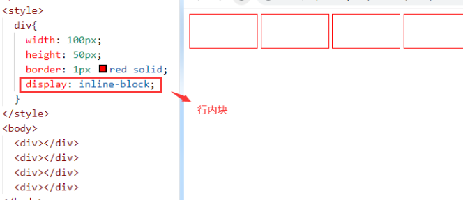
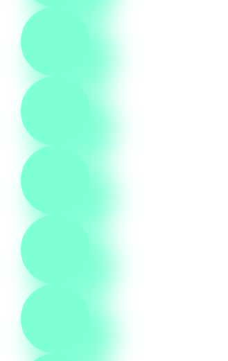
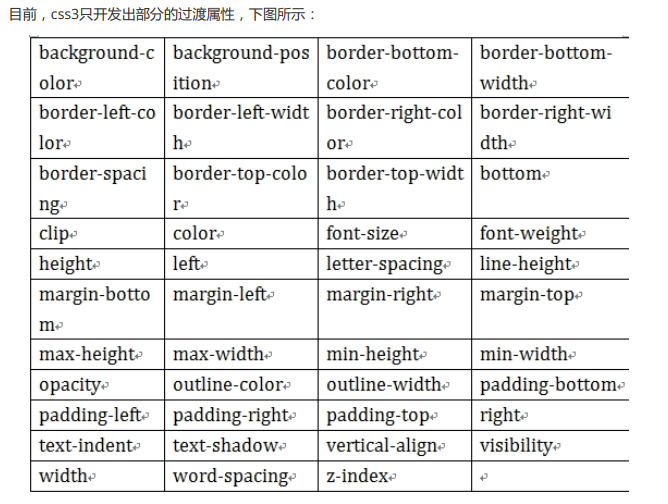

# CSS


# 1. CSS介绍


## 什么是CSS

- CSS是指**层叠样式表 cascading style sheets**
- 通过CSS可以让我们定义**HTML元素如何显示。**
- CSS可以让我们原本**HTML不能描述的效果，通过CSS描述出来**。（div）
- 通过CSS描述我们的html页面，可以让我们的**页面更加漂亮，可以提高工作效率**。  


# 2. CSS与HTML的结合方式


## 2.1 第一种方式 内联/行内样式  


就是在我们的HTML标签上通过style属性来引用CSS代码。  


优点:简单方便 ；
缺点:只能对一个标签进行修饰。  


## 2.2 第二种方式 内部样式表  


我们通过<style>标签来声明我们的CSS. 通常<style>标签我们推荐写在head和body之间，也就是“脖子”的位置

优点:可以**通过多个标签进行统一的样式设置**

缺点: 它只能在**本页面上**进行修饰

语法： 选择器 {属性:值;属性:值}  


## 2.3 第三种方式 外部样式表  


我们需要单独定义一个CSS文件,注意CSS文件的后缀名就是.css

在项目根目录下，创建css目录，在css目录中创建css文件 css01.css


在<head>中使用<link>标签引用外部的css文件  

`  <link href="cssTest/test01.css" rel="stylesheet"/>`


还可以使用另一种引入css文件的方式：  

```html
<style>
    @import url(cssTest/test01.css);
</style>
```


关于外部导入css使用<link>与`@import`的区别?

1. 加载顺序不同
   @import方式导入会**先加载html，然后才导入css样式**，那么如果网络条件不好，就会**先看到没有修饰的页面，然后才看到修饰后的页面。**

   如果使用`link`方式，它**会先加载样式表**，也就是说，我们**看到的直接就是修饰的页面**；

2. @import方式导入css样式，它是***不支持javascript的动态修改的***。而link支持。

   三种样式表的**优先级**：满足就近原则

   **内联 > 内部 > 外部**  


# 3. CSS的使用  


## 3.1 css中选择器  


### 3.1.1 元素(标签)选择器  


它可以对页面上**相同的标签进行统一的设置**，它描述的就是**标签的名称**.  

**几个都会改变颜色**


### 3.1.2 类选择器  


类选择器在使用时**使用"."来描述**，它描述的是元素上的class属性值  


```html
<style>
    .b{
        color: rgb(240, 14, 225);
    }
</style>

<body>

    <h1 class="b">我爱你中国！</h1>
    <h1>我爱你中国！</h1>
    <h1>我爱你中国！</h1>
    <h1>我爱你中国！</h1>
    <h1>我爱你中国！</h1>

</body>
```


### 3.1.3 id选择器  


它只能选择一个元素，**使用 "#" 引入**，引用的是元素的id属性值。

id选择器，***比类选择器更具有唯一性***  


```html
<style>
    .b{
        color: rgb(240, 14, 225);
    }
    #c{
        color: rgb(20, 233, 38);
    }
</style>

<body>

    <h1 class="b">我爱你中国！</h1>
    <h1 id="c">我爱你中国！</h1>
    <h1>我爱你中国！</h1>
    <h1>我爱你中国！</h1>
    <h1>我爱你中国！</h1>

</body>
```


### 3.1.4 选择器组  


**逗号表示**，谁和谁。

例如，我有手机，你有手机，他也有手机，**一条一条写太麻烦，就可以合并编写**  


```html
<style>
    .b,#c{
        color: rgb(240, 14, 225);
    }

</style>

<body>
    <h1 class="b">我爱你中国！</h1>
    <h1 id="c">我爱你中国！</h1>
    <h2>我爱你中国！</h1>
    <h3>我爱你中国！</h1>
    <h4>我爱你中国！</h1>
</body>
```


### 3.1.5 派生选择器  


- **子代**：父子关系（隔代不管）

- **后代**：父子孙，曾孙，从孙...  


```html
<style>
    /* div里面的所有p都被选中了 忽略层级*/
    div p{
        color: rgb(247, 64, 8);
    }
    /* 只会选中孩子的p，不会选择孙子，曾孙，....的p */
    div>p{
        color: teal;
    }
</style>
<body>
    <!-- div有3个孩子，p p span
        span有2个孩子，p，p -->
    <div>
        <p>数学</p>
        <p>语文</p>
        <span>
            <p>古诗词</p>
            <p>文言文</p>
        </span>
    </div>
</body>
```


### 3.1.6 CSS伪类  


- CSS伪类可  **对css的选择器添加一些特殊效果**

- 伪类属性列表： **伪装**
  - :active 向被激活的元素添加样式。
  - :hover 当鼠标悬浮在元素上方时，向元素添加样式。
  - :link 向**未被访问**的链接添加样式。
  - :visited 向**已被访问的链接**添加样式。
  - :first-child 向元素的**第一个子元素**添加样式。

**超链接的伪类：要遵守使用顺序，否则会失效，爱恨原则 LoVeHAte——lvha  **


**只有在触发相关条件的时候，才会显示style样式**

```html
<style>
    

    /*  已经被访问过的链接*/
    a:visited {
        color: yellow;
    }

    /* 未点击 */
    a:link {
        color: turquoise;
    }

    /* 悬停 */
    a:hover {
        font-size: 30px;
        color: tomato;
    }
    
    /* 激活：鼠标按住别松手，显示样式 */
    a:active {
        color: black;
    }
</style>

<body>

    <a href="http://www.baidu.com">百度</a>

</body>
```


**过滤所有li中的第一个**

```
    li:first-child{
        color: brown;
    }
    <ul>
        <li>雪中悍刀行</li>
        <li>元尊</li>
    </ul>
```


## 3.2 CSS基本属性  


### 3.2.1 文本属性  

- 指定字体：font-family : value;
- 字体大小：font-size : value;
  - px：像素
  - em：倍数
- 字体加粗：font-weight : normal/bold;
- 文本颜色：color : value;
- 文本排列：text-align : left/right/center;
- 文字修饰：text-decoration : none/underline;
- 行高：line-height : value;
- 首行文本缩进：text-indent : value （2em）;  


```html
<style>
    
    p{
        font-family: "隶书";
        font-size: 100px;
        font-weight: bolder;
        text-align: center;
        text-decoration: underline;
    }
</style>

<body>

    <p>芜湖！</p>

</body>
```


### 3.2.2 背景属性  


CSS 允许应用纯色作为背景，也允许使用背景图像创建相当复杂的效果  

- background-color 设置元素的**背景颜色**。
- background-image 把**图像设置为背景**。  


- background-repeat 设置背景图像的***墙纸效果***，是否及***如何重复***
  - repeat：在垂直方向和水平方向重复，为重复值 
  - repeat-x：仅在水平方向重复
  - repeat-y：仅在垂直方向重复
  - no-repeat：仅显示一次
- background-position 设置背景图像的起始位置
  - 1：控制水平方向 x轴： 正值，向右移动； 负值，向左移动
  - 2：控制垂直方向 y轴： 正值，向下移动； 负值，向上移动  

- background-attachment 背景图像是否固定或者随着页面的其余部分滚动
  - 默认值是 scroll：默认情况下，背景会随文档滚动
  - 可取值为 fixed：背景图像固定，**并不会随着页面的其余部分滚动，常用于实现称为水印的图像**  , 不管页面如何拖动，这个div的背景始终不变


### 3.2.3 列表属性  


CSS列表属性作用如下：

- 设置不同的列表项标记为**有序列表**
- 设置不同的列表项标记为**无序列表**
- 设置**列表项标记**为**图像**

有两种类型的列表：

- 无序列表 - 列表项标记用特殊图形（如小黑点、小方框等）

- 有序列表 - 列表项的标记有数字或字母

使用CSS，可以列出进一步的样式，并可用图像作列表项标记。

- none：无标记。（去除标记）
- disc：默认。标记是实心圆。
- circle：标记是空心圆。
- square：标记是实心方块。
- decimal：标记是数字。
- decimal-leading-zero：0开头的数字标记。(01, 02, 03, 等。)
- lower-roman：小写罗马数字(i, ii, iii, iv, v, 等。)
- upper-roman：大写罗马数字(I, II, III, IV, V, 等。)
- lower-alpha：小写英文字母The marker is lower-alpha (a, b, c, d, e,等。)
- upper-alpha：大写英文字母The marker is upper-alpha (A, B, C, D, E,等。)  


```html
<style>

.a{
    list-style-type: lower-roman;
}
    
</style>

<body>
<ul class="a">
    <li>曹操</li>
    <li>刘备</li>
    <li>孙权</li>
</ul>
</body>
```

**无需列表也可以使用数字作为列表属性**


### 小练习


```html
<style>

    li{
        list-style-type: none;
        color: white;
        background-color: black;
        width: 130px;
        /* 水平方向显示 */
        float: left;
        line-height: 40px;
        font-size: 1.3em;
        /* 鼠标样式 */
        cursor: pointer;
    }
    li:hover{
        background-color: orange;
        line-height: 50px;
    }
    
</style>

    <ul>
        <li>雪中悍刀行</li>
        <li>大道朝天</li>
        <li>元尊</li>
    </ul>

</body>
```


### 3.2.4 边框属性  


CSS边框属性允许你指定一个元素边框的样式和颜色。  


```html
div{
    border-color: chartreuse;
    border-width: 400px;
    border-style: outset;
}
```


border-style取值：  


### 3.2.5 轮廓属性  


轮廓（**outline**）是绘制于**元素周围**的一条线，位于**边框边缘的外围**，可起到突出元素的作用。

轮廓和边框的区别：

- 边框 (border) 可以是围绕**元素内容和内边距**的一条或多条线；
- 轮廓（outline）是绘制**于元素周围的一条线**，位于边框边缘的外围，可起到突出元素的作用。

CSS outline 属性规定元素轮廓的样式、颜色和宽度。  

**边框保护元素，轮廓保护边框**

```html
div{
    /* 设置四个边 */
    border-width: 10px;
    border-color: orangered;
    border-style:ridge;
    /* 设置右边框颜色 */
    border-right-color: green;
    /* 设置下边框的样式 */
    border-bottom-style: dotted;
    outline: 5px slateblue dashed;
}
```


### 3.2.6 盒子模型  


所有HTML元素可以看作**盒子**，在CSS中，**"box model"**这一术语是用来设计和布局时使用。

CSS盒子模型本质上是一个盒子，封装周围的HTML元素，它包括：***边距，边框，填充，和实际内容。***

盒子模型允许我们在***其它元素和周围元素边框之间的空间***  放置元素。

下面的图片说明了盒子模型(Box Model)：  

**填充部分很重要，控制元素的位置**


- margin(外边距) - **盒子与盒子**之间的距离
- border(边框) - 盒子的**保护壳**
- padding(内边距/填充) - 内填充，**盒子边与内容之间的距离**
- content(内容) - **盒子的内容**，显示的文本或图像  


**浏览器是一个大盒子，装了一个div小盒子，小盒子里装了内容。。。盒子中的内容摆在哪？和padding相关**

```html
    div{
        border: green 5px solid;
        /* 盒子的border边与内容之间的距离   内边距*/
        padding-top: 40px;
        padding-left: 200px;
        /* 和 其他盒子之间的距离  外边距*/
        margin-top: 100px;
        margin-left: 20px; 
        outline: springgreen 4px dotted;
    }
```


## 3.3 CSS定位  


### 3.3.1 默认定位  


- 块级元素：**h1~h6，p, div** 等，**自上而下，垂直排列**（自动换行）；**可以改变宽高** 

**会自动换行，每一个单独占一行**


- 行内元素：a,b,span,等，从左向右，水平排列（不会换行）；**不能改变宽高**  


- 内块元素：input,img等，从左向右，水平排列（**自动换行**）；**可以改变宽高**  




如何让span标签也可以改变宽高，使用display属性进行转换


```html
a{
    width: 50px;
    height: 50px;
    border: 2px solid gold;
    /* a标签是行内元素，无法改变宽高，但只要转换成行内块元素，就可以改变宽高了 */
    display: inline-block; 
    /* 将a元素显示成行内块 */
}
```


### 3.3.2 浮动定位  


让元素“飞”起来。不仅可以靠着左边或右边。还可以**消除“块级”的霸道特性**（**独自占一行**）。

float取值：

- none ：不浮动
- left：贴着左边 浮动
- right：贴着右边 浮动  


**同时往左往右飞，实现效果**

```html
<style>
    a {
        width: 50px;
        height: 50px;
        border: 2px solid gold;
        /* a标签是行内元素，无法改变宽高，但只要转换成行内块元素，就可以改变宽高了 */
        display: inline-block;
        /* 将a元素显示成行内块 */
    }

    .da{
        width: 300px;
        height: 300px;
        border: 5px yellow solid;
    }
    .a, .b{
        width: 80px;
        height: 80px;
    }
    .a{
        background-color: violet;
        /* a往左飞 */
        float: left;
        /* 外边距   或者使用大div的padding填充，内边距 */
        margin: 10px;

    }
    .b{
        background-color: aquamarine;
        /* 块级元素占满行，其他的元素不能在这一行后面排列 */
        float: right;

    }
</style>

<body>

    <div class="da">
        <div class="a"></div>
        <div class="b"></div>
    </div>

</body>
```


### 3.3.3 相对定位  


和**自己原来的位置**进行比较，进行**移动定位**（偏移）  


```html
    .a{
        background-color: violet;
        /* a往左飞 */
        float: left;
        position: relative;
        left: 0px;
        top: 0px;
    }
```


### 3.3.4 绝对定位  


本元素与已定位的祖先元素的距离

- 如果父级元素定位了，**就以父级为参照物**；
- 如果父级没定位，找爷爷级，爷爷定位了，**以爷爷为参照物。**
- 如果爷爷没定位，**继续向上找，都没定位的话，body是最终选择。**  


以爷爷节点作为参照物


使用 `position: absolute;` 如果父亲、爷爷、....**都没设置定位，那么就以整个页面的大盒子（body）为基准来定位**


### 3.3.5 固定定位  


将元素的内容固定在页面的某个位置，当**用户向下滚动页面时元素框并不随着移动**  


使用`    position: fixed;`设置对应标签


### 3.3.6 z-index  


如果有**重叠元素**，使用z轴属性，**定义上下层次**  


注意：

- z轴属性，要配合相对或绝对定位来使用。
- z值没有额定数值（整型就可以，具体用数字几，悉听尊便）  


# 4. CSS3  


## 4.1 圆角  


- **border-radius**：左上 右上 右下 左下;
- border-radius：四个角;
- border-radius：50%; 圆形  


....... `    border-radius: 50px;`


## 4.2 盒子阴影  


box-shadow：1 2 3 4 5;
1：水平偏移
2：垂直偏移
3：模糊半径
4：扩张半径
5：颜色  


。。。。。。。

`    box-shadow: 20px 20px 30px 10px aquamarine;`




## 4.3 渐变  


### 4.3.1 线性渐变  

可以不写方向角度

```
background:linear-gradient([方向/角度]，颜色列表)；
```


```
.a1 {
	background: linear-gradient(red,black);
} 
.a2 {
	background: linear-gradient(red,black,pink, green);
} 
.a3 {
	background: linear-gradient(to left,red,black);
} 
.a4 {
	background: linear-gradient(to top left,red,black);
} 
.a5 {
	background: linear-gradient(30deg,red,black);  角度
}
```


`    background: linear-gradient(to top left, red,black);`


### 4.3.2 径向渐变  


**以圆心向外发散**  


```
background: radial-gradient(颜色列表);
```


`    background: radial-gradient(red,black);`


## 4.4 背景  


### 4.4.1 背景位置  


 **background-origin：指定了背景图像的位置区域**

- border-box : 背景贴边框的边
- padding-box : 背景贴内边框的边
- content-box : 背景贴内容的边  


### 4.4.2 背景裁切  


background-clip:

- border-box 边框开切
- padding-box 内边距开切
- content-box 内容开切  


### 4.4.3 背景大小  


background-size:

- cover 缩放成完全**覆盖（裁剪到正好能装满背景区域的一块，也是按比例缩放，会显示不全）**背景区域最小大小
- contain 缩放成完全**适应（按比例缩放，但一定显示整张图片）**背景区域最大大小  


## 4.5 过渡动画  


### 4.5.1 过渡  


从一个状态到另一个状态，中间的“缓慢”过程；

缺点是，控制不了中间某个时间点。

transition｛1 2 3 4｝
	1：过渡或动画模拟的css属性

​	2：完成过渡所使用的时间（2s内完成）

​	3：过渡函数。。  

​	4：过渡开始**出现的延迟时间**    `transition: width 2s ease 1s;  `

​	




```html
    .a {
        border: hotpink dashed 10px;
        transition: background-color  1s linear 1s;
    }

    div:hover {
        background-color: hotpink;
    }
```


### 4.5.2 动画  


从一个状态到另一个状态，过程中**每个时间点**都可以控制。

关键帧：**@keyframes** 动画帧 { from{} to{} } 或者{ 0%{} 20%{}... }

动画属性：animation{ 1 , 2 , 3 , 4 , 5 }
1：动画帧
2：执行时间
3：过渡函数
4：动画执行的延迟（可省略）
5：动画执行的次数  


需求1：一个 元素从左向右移动，每次3秒，执行2次  


需求2：一个 元素从左向右移动，3秒内执行完成。无限次交替执行

- infinite：无限次
- alternate：来回执行（交替，一去一回）  

...........设置执行到多少比例的时候的状态

```html
<style>
    .a{
        width: 400px;
        height: 400px;
    }

    .a {
        border: hotpink dashed 10px;
        animation: x 1s linear infinite;
    }

    @keyframes x {
        0% {
            margin-left: 0px;
        }

        10% {
            background: yellowgreen;
        }

        20% {
            background: goldenrod;
        }
        30% {
            background: rgb(36, 214, 12);
        }
        40% {
            background: rgb(206, 6, 224);
        }
        50% {
            background: rgb(12, 187, 231);
        }
        60% {
            background: rgb(245, 7, 7);
        }
        70% {
            background: rgb(123, 9, 151);
        }
        80% {
            background: rgb(79, 235, 7);
        }

        90% {
            background: palevioletred;
        }

        100% {
            background: coral;
            margin-left: 550px;
        }
    }
</style>
```


