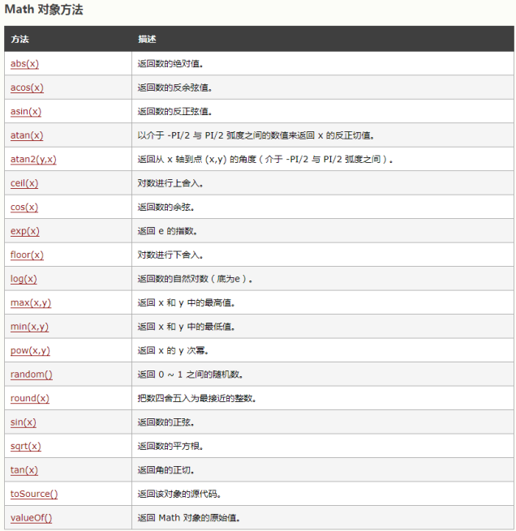

# JavaScript


# 1. JavaScript介绍  


- 虽然是java作为前缀，但java和javascript的关系，就像老婆和老婆饼之间的关系，没有一毛钱关系！
- 网景公司在Netscape2.0首先推出了JavaScript
- JavaScript 的正式名称是 “ECMAScript”，此标准由 ECMA 组织发展和维护，简称“js”
- JavaScript 是一种**网页编程技术**，用来**向 HTML 页面添加交互行为**
- JavaScript 是一种**基于对象和事件驱动的解释性脚本语言**，**直接嵌入 HTML 页面**，***由浏览器解释执行代码，不进行预编译***  


## 1.1 js的特点  


- 可以使用任何文本编辑工具编写，**只需要浏览器就可以执行程序** （后面会说**不用浏览器也能运行**）
- 解释执行：**事先不编译，逐行执行**
- 基于对象：***内置大量现成对象，直接用***
- 适宜：
  - 客户端**数据计算**：比如计算总价，就不需要服务器来计算，在本地就完成计算
  - 客户端**表单合法性**验证
  - **浏览器事件**的触发
  - 网页**特殊显示效果**制作  


## 1.2 js的组成  


- **ECMAScript**：定义核心语法，关键字，运算符，数据类型等系列**标准**
- **DOM**：**文档对象模型**，将一个**html页面**的所有节点看成是一个一个的对象。更有层次感的管理每一个节点。
- **BOM**：**浏览器对象**模型，是对**浏览器窗口进行访问和操作**。使用 BOM，开发者可以移动窗口、改变状态栏中的文本以及执行其他与页面内容不直接相关的动作。使 BOM 独树一帜且又常常令人怀疑的地方在于，它只是 JavaScript 的一个部分。
  - 弹出新的浏览器窗口  
  - 移动、关闭浏览器窗口以及调整窗口大小
  - 提供 Web 浏览器详细信息的定位对象
  - 提供用户屏幕分辨率详细信息的屏幕对象
  - 对 cookie 的支持
  - IE 扩展了 BOM，加入了 ActiveXObject 类，可以通过 JavaScript 实例化 ActiveX对象，进而实现ajax局部刷新技术  


# 2. HTML与javaScript结合方式  

使用js的三种方式  


## 2.1 行内脚本  


1. 点击按钮（触发）
2. 弹框（具体的操作）  


`<button onclick="alert('弹框测试')">点我一下</button>  `


## 2.2.内部脚本  


1. 使用<script></script>
2. 标准是写在**head和body之间**（脖子位置），但其实只要写在html文件内部就可以，无论什么位置<html>外，<p></p>内部，都可以。  

**先执行script，再弹窗**

```
<script>
    alert("hhhh");
</script>
```


## 2.3.外部脚本  


1.  在项目根目录下创建一个目录js
2.  在js目录中创建一个文件，后缀名是.js
3. 在html页面中，使用   `<script src="js/xx.js"></script> `


以上使用脚本的三种方式的优先级，**谁在上，谁先执行**。因为是**解释性语言**  


# 3. JavaScript的使用  


## 3.1 变量  


因为js是弱类型语言，所以，在定义变量的时候，所有的数据类型都是var

- 声明变量： var x ; var x,y;  
- 数值类型：number
  - 不区分整型数值和浮点型数值
  - 所有数字都**采用 64 位浮点格式存储，类似于double 格式**
- 字符串：string
  - 首尾由**单引号或双引号括起**  
  - 转义：\
- 布尔类型：
  - 仅有两个值：true和false也代表1和0
  - **实际运算中true=1,false=0**  


### 3.1.1 自动类型转换  


```
数字 + 字符串：数字转换为字符串 10+’a’ -> 10a
数字 + 布尔值：true转换为1，false转换为0 true+5->6
字符串 + 布尔值：布尔值转换为字符串true或false true+’a’->truea
布尔值 + 布尔值：布尔值转换为数值1或0 true+true->2
```


### 3.1.2 数据类型转换函数  


- parseInt：**强制转换成整数**
  - 如果不能转换，则返回 NaN ：not a number（NaN 属性是**代表非数字值的特殊值**。该属性用于指示某个值不是数字）
  - 例如：`parseInt("6.32")=6`
- parseFloat：强制转换成浮点数
  - 如果不能转换，则返回 NaN
  - 例如：parseFloat("6.32")=6.32
- **typeof**：查询数值当前类型，返回 string / number / boolean / object（数组，类.....）
  - 例如：typeof("test"+3)=="string"  


### 3.1.3 null 与 undefined  


- null 在程序中代表“**无值”或者“无对象"**
  - 可以通过给一个变量赋值 null 来**清除变量的内容**
- undefined
  - 声明了变量**但从未赋值或者对象属性不存在**  


### 3.1.4 算术运算  


加(＋)、 减(－)、 乘( * ) 、除( / ) 、余数( % )

- \- 可以表示减号，也可以表示负号，如：x = -y

- +可以表示加法，也可以用于字符串的连接

递增( ++ ) 、递减( -- )

- i++ 相当于 i=i+1

- i-- 相当于 i=i-1  


### 3.1.5 关系运算  


- 严格相等：===  
  - **类型相同**
  - **数值相同**

- 非严格相等：!==  

==：只判断值


### 3.1.6 逻辑运算  


逻辑非（!）、逻辑与（&&）、逻辑或（||）

逻辑运算的操作数均为 boolean 表达式  


### 3.1.7 控制语句  


```javascript
if（关系表达式） {
	// 语句块 1
}else {
	// 语句块 2
}

switch (表达式) {
    case 值1:
        // 语句1;
        break;
    case 值2:
        // 语句2;
        break;
    default:
    	// 语句4;
}

for (var i=1 ; i<=5 ; i++){
	alert(i);
}

while (条件){
    // 语句1;
    ...
}
```


## 3.2 常用字符串API  


- length:获取字符串的**长度**（字符串中字符的个数） 属性，没有小括号  
- toUpperCase/toLowerCase :**转大小写**  
- charAt(下标) ： 返回某个下标上的字符  
- indexof(字符)：查找字符串中字符出现的**首次下标**
- lastIndexof(字符)：查找字符串中字符**最后一次出现**的下标  
- substring(开始,结束)：**截取字符串中一部分**（**左闭右开**，结束是不包含的）  
- replace(旧的,新的)：将字符串中的**旧字符替换成新字符**  （第一个该字符）
- split(分割的节点)：一个字符串**切割**成N个小字符串，所以返回的是数组类型  

```javascript
var str1 = "一,二,三,四,五";
var arr = str1.split(","); // 将str1 以逗号进行分割，分割成N份，所以返回的结果一定
是数组结构
console.log( "共分割成："+arr.length+"份" );
console.log( "第三份是：" + arr[2] ); // 三
```


# 3.3 数组  


### 3.3.1 创建数组  

**还是用var**

`var arr1 = new Array();  `


### 3.3.2 初始化数组的三种方式  


**构造方式，[]赋值方式，赋值方式**

```javascript
    var a = new Array();

	var arr1 = new Array(10,"a",true);

	var arr1 = [10,"a",true];

    for(var i = 0; i < 5; i++){
        a[i] = i;
    }


    for(var i = 0; i < a.length; i++){
        alert(a[i]);
    }
```


### 3.3.3 数组的常用方法  


- tostring()：将数组转换成字符串  

- join(连接符号)：将数组中的每个元素**用连接符号连接成一个新的字符串**。  

- concat(新元素)：将原来的数组**连接新元素**，原数组不变。  添加元素到末尾 **不改变原数组，创建一个新数组**

- slice(开始，结束)：在数组中**提取一部分，形成新的数组——左闭右开**  

  - 1,2,3,4,5 slice(2,4) 结果：3,4  

- reverse()：数组的反转（倒序）  

- sort()：数组排序

  - arr.sort() 字符排序    **看首字母排序——字符排序（字典序）**
  - arr.sort(func) 数值排序  。

  ```javascript
  alert(a.sort(hcr));// 字符排序（不会按照字面量的大小）
  
  // 定义排序函数  和Comparator中compare方法相同
  function hcr(x, y){
  	return y - x;
  }
  ```


## 3.4 Math数学对象  


- Math 对象用于执行数学任务
- **没有构造函数** Math()
- 无需创建，**直接把 Math 作为对象使用**就可以**调用其所有属性和方法**  





## 3.5 Number对象  


`Number.fixed(2);` **自带四舍五入技能**  

- 固定两位小数，位数不够，**0来补齐**  
- 固定两位小数，**第三位小数四舍五入**  

```javascript
var n = new Number(12.);
var n1 = n.toFixed(2);  
alert(n1);//12,00
```


## 3.6 正则表达式  


对字符串执行模式匹配的强大工具  


```javascript
var reg1 = /^\d{3,6}$/; // 匹配纯数字3-6个
var reg2 = new RegExp(“^\\d{3,6}$");
```


```javascript
// 方式1
var age = "18"; // 判断：1-3位纯数字
var reg = /^\d{1,3}$/; // 以/^开始，中间写正则内容，以$/结束
//或者 var r = new RegExp("^\\d{1,3}$")
var b = reg.test(age); // 验证age变量的是否符合reg的匹配
if (b == true) {
	console.log("验证通过！");
} else {
	console.log("格式错误");
} 


// 方式2
var name = "abc123"; // 大小写字母和数字的组合（特殊字符不能出现）, 5~8位
var reg = new RegExp("^[a-zA-Z0-9]{5,8}$"); // 以^开始，中间写正则内容，以$结束
if (reg.test(name)) {
	console.log("验证通过！");
} else {
	console.log("格式错误");
}
```


##  3.7 日期对象  


```javascript
var time = new Date();
console.log( time ); // Tue Jul 14 2020 11:09:46 GMT+0800 (中国标准时间)
var year = time.getFullYear(); // 年份
var month = time.getMonth() + 1; //月份从0开始，11结束，所以国内习惯要+1
var day = time.getDate(); // 几号
var hour = time.getHours(); // 几点
var mm = time.getMinutes(); // 分钟
var s = time.getSeconds(); //秒
var ms = time.getMilliseconds(); // 毫秒， 1000毫秒 = 1秒
var timestr = year+"年"+month+"月"+day+"号 "+hour+"点"+mm+"分"+s+"秒"+ms+"毫秒";
console.log( timestr );
```


## 3.8 函数  


- 使用关键字 **function 定义函数**  
- 函数声明后**不会立即执行**，会在我们**需要的时候调用到。**
- 注意：
  - 形参：一定**不要带数据类型**
  - 分号是用来分隔可执行JavaScript语句。 由于函数声明不是一个可执行语句，所以不以分号
    结束。  


### 3.8.1 无返回值  


```javascript
function sum(a, b) {
    var he = a + b;
    console.log("两数之和：" + he);
} 
sum(3,4);
```


### 3.8.2 有返回值  


```javascript
function sum(a, b) {
    var he = a + b;
    return "两数之和：" + he;
} 
var s = sum(3,4);
console.log( s );
```


### 3.8.3 参数对象  


在函数内部，**调用参数列表的属性**  ，有点像args

```javascript
function func(a,b,c){
    console.log( arguments.length ); // 获得参数的个数
    console.log( arguments[1] ); // 获得下标为1的参数
}
```


### 3.8.4 构造函数  


函数  同样可以通过内置的 JavaScript **函数构造器**（Function()）定义  

```javascript
var myFunction = new Function("a", "b", "return a * b");

var x = myFunction(4, 3);

console.log(x);
```

注： 上述函数以分号结尾，因为它是一个执行语句。  


### 3.8.5 匿名函数  


没有名称的函数  ，**使用一个变量接收，调用时将参数传入给变量**

如果不加括号，会直接输出函数的定义。

**一定要加括号**

```java
var fn = function(a, b) {// 没有名字的函数，应该用一个变量来接收
	return a * 10 + b;
};
console.log( fn(3, 4) );
```


### 3.8.6 全局函数  

- isNaN：检查其参数是否是**非数字值**  
- eval：用来转换字符串中的运算  
- encodeURI 与 decodeURI  

```javascript
console.log( isNaN( -10 ) ); // 数字，false
console.log( isNaN( "123" ) ); // 数字，false
console.log( isNaN( "1a23" ) ); // 非数字，true


var str = "1+3";
console.log( str ); // 1+3 , +会认定为一种字符符号而已，没有加法的作用
console.log( eval( str ) ); // 让字符串中的运算符号生效

var name = "李淳罡";
console.log( "转码前：" + name );
name = encodeURI(name);
console.log( "转码后：" + name );
```


### 3.8.7 闭包  


1、闭包的概念：指**有权访问另一个函数作用域中的变量**的函数，一般情况就是在一个函数中包含另一个函数。

2、闭包的作用：访问函数**内部变量**、保持函数在环境中一直存在，**不会被垃圾回收机制处理**；
简单地说：就是在函数的**局部范围内**声明一个**封闭的环境**，此环境**不会被垃圾回收探测到**。保证了数据的安全唯一性

想了解闭包，首先要了解什么是**全局变量**，什么是**局部变量**  


```javascript
a = 10; // 全局变量，声明的时候可以不使用var

function test1(){
    b = 20; // 不适用var声明的变量，就是全局变量
    var c = 30; // 用var声明，并且在函数的内部。这样的变量叫做局部变量，有效范围只能在其声明的函数内部
    console.log(c);
}

function test2(){
	console.log(c); //c is not defined (c变量没有定义)
} 
test1();
test2();
```


统计方法执行了多少次  

```javascript
var count = 0; // 总次数

function test1(){
	count++; // 自增+1
} 
test1();
test1();
test1();
console.log( count );
```

谁都可以访问count，所以**count变量并不安全**，**因为是全局变量**。

如何才能安全呢？**将count声明为局部变量，那么其他函数就无法调用了**  


```javascript
function test1(){
	var count = 0; //局部变量
	return count++; //外部无法访问count，只能通过return才能将count变量返回，并输出
} 
test1();
test1();
test1();
console.log( test1() ); // 每次调用方法，首先就是将变量还原为0
```


结果一直是0，因为每次调用test1()，方法体的第一句代码就是还原，无论曾经的值是多少。


突发奇想，如果***在test1()函数里面，再嵌套一个函数，js是支持函数嵌套的***  

```javascript
    function f(){
        var count = 1; //局部变量
        function add(){
            return count++;
        }
        add();
        return count;
    }
    alert(f()) // 每次调用方法，首先就是将变量还原为1
```


如果每次**只调用f()里面的add()就好了**。ok，***闭包帮你解决此问题***！  

```javascript
function f(){
    var count = 1;
    function add(){
        return count++;
    }
    return add;
}
```


```javascript
function f(){
    var count = 1;
    function add(){
        return count++;
    }
    return add;
}

var fn = f(); // fn => function add(){ return count+=1; }
fn();//1 返回后才进行的++运算 
fn();//2
alert(fn())//3
alert(fn())//4
alert(fn())//5
```

**这里返回的是这个内部定义的   函数add()......**


用一个变量来接收，接收的是函数，使用**`变量()`来调用内部函数**


闭包是一种**保护私有变量**的机制，在函数执行时**形成私有的作用域**，保护里面的**私有变量不 受外界干扰。**

直观的说就是形成一个**不销毁的栈环境(否则每次调用完方法后，方法栈帧会弹出栈，局部变量销毁)**。

- 闭包的优点： 方便**调用上下文中声明的局部变量** ，逻辑紧密，可以在一个函数中再创建个函数，**避免了传参的问题**
- 闭包的缺点： 因为使用闭包，可以使**函数在执行完后不被销毁**，如果大量使用闭包就会造 成**内存泄露，内存消耗很大**  


## 3.9 弹框输出  


- 普通弹框 alert("hello，拉勾");
- 控制台日志输出 console.log("谷歌浏览器按F12进入控制台");
- 页面输出 document.write("<h2>我爱你中国</h2>");     **将<h2>元素输出到<body>中**
- 确认框 `confirm("确定删除吗？");`  返回一个Boolean值，可以使用var来接收
- 输入框 prompt("请输入姓名：");  


```javascript
var b = confirm("确认？"); //返回一个boolean值，获取点击的选项
if(b){
    document.write("<h2>我爱你中国</h2>");
}else{
    document.write("为什么不确认？");
}

var name = prompt("请输入你的名字：");
document.write( "<h1>大名："+name+"！</h1>" );
```


# 4.DOM 操作  


- 在一个html页面中，会使用**很多标签**来规划制作页面。
- 每个标签都有它存在的意义，如果我们想要**动态的修改某个标签的值**。那我们就需要在页面中***查找到这个标签元素***
- 如何**查找到这个元素**是个难题，W3C组织的工程师们，突然看到了一棵大树。我要是想找到某一片叶子，应该怎么做？
- **“顺藤摸瓜”**，主树干有分支，每个分支还有许多小分支，只要把这个**分支的结构**整理清楚，任何一片叶子都不是难事了
- 叶子和大树的一些启发，工程师们开会讨论就定了这个理论“**文档对象模型**”
- 文档对象模型，就是将页面中**所有的标签元素都看成是一个对象（一片叶子）**，主树干定义为**根节点（根元素）**，所有的标签都是从根元素延伸出去的，摸清结构，找到某个标签就不再困难了
  - 在节点树中，顶端节点就是根节点（root）
  - **每个节点都有父节点**（除了根节点）
  - 任何一个节点都可以拥有**任意数量的子节点**
  - **同胞**是拥有**相同父节点的节点**  


```html
<html>
<head>
    <meta charset="UTF-8">
    <meta name="viewport" content="width=device-width, initial-scale=1.0">
    <title>DomTest</title>
</head>
<body>
    <h1>点我试试？？</h2>
    <p>hello world</p>
</body>

</html>
```


```
从上面的 HTML 中：
<html> 节点没有父节点；它是根节点

<head> 和 <body> 的父节点是 <html> 节点
文本节点 "Hello world!" 的父节点是 <p> 节点

并且：
<html> 节点拥有两个子节点：<head> 和 <body>
<head> 节点拥有两个子节点：<meta> 与 <title> 节点
<title> 节点也拥有一个子节点：文本节点 "DomTest"
<h1> 和 <p> 节点是  同胞  节点，同时也是<body> 的子节点

并且：
<head> 元素是 <html> 元素的 首个子节点
<body> 元素是 <html> 元素的 最后一个子节点
<h1> 元素是 <body> 元素的 首个子节点
<p> 元素是 <body> 元素的 最后一个子节点
```

js为我们提供了很多种方法来**实现在页面找查找某个元素节点**


## 4.1 DOM访问  


`getElementById`：通过**id属性**获得**元素节点对象**

- 案例：当帐号为空时，阻止表单提交  


```html
<body>

<!-- 直接无法提交表单 -->
    <form action="xxx" onsubmit=" return login()">
        <p >账号：<input id="username"></p>
        <p >电话：<input id="phone"></p>
        <p><button>登录</button></p>
    </form>

    <script>
        function login() {
            var name = document.getElementById("username").value;
            if (name == "") {
                alert("账号不能为空!");
                return false;//阻止表单的提交
            }
            return true;// 放行，让表单提交
        }
    </script>

</body>
```


`getElementsByName`：通过name属性获得**元素节点对象集**  

- 案例：购物车全选效果  


```html
<body>
    <h2>我的购物车</h2>
    <table border="1" cellspacing="0">
        <tr>
            <!-- 把自己穿进去 就是自己这个选择框，如果选择了这个框，那么其他的框都一起设置为和这个一样的就行 选择/不选-->
            <td><input type="checkbox" onchange="selectAll(this)">全选</td>
            <td>商品名称</td>
            <td>单价</td>
        </tr>
        <tr>
            <td><input type="checkbox" name="one">1</td>
            <td>尖叫</td>
            <td>4.0</td>
        </tr>
        <tr> 
            <td><input type="checkbox" name="one">2</td>
            <td>冰红茶</td>
            <td>3.0</td>
        </tr>
        <tr>
            <td><input type="checkbox" name="one">3</td>
            <td>包子</td>
            <td>1.6</td>
        </tr>
        
    </table>

    <script>
        function selectAll(all) {
            var arr = document.getElementsByName("one");
            for(var i = 0; i < arr.length; i++){
                arr[i].checked = all.checked;//// 将全选框的状态，赋值给每一个复选框
            }
        }
    </script>

</body>
```


`getElementsByTagName`：通过标签名称获得元素节点对象集  

- 案例：表格隔行变色  


```javascript
var rows = document.getElementsByTagName("tr"); //通过标签名获得元素对象集合
for (var i = 0; i < rows.length; i++) {
    if (i % 2 == 1) {
        rows[i].style.backgroundColor = "red";
    }
}
```


## 4.2 DOM修改  


修改 HTML DOM 意味着许多不同的方面：

- 改变 HTML 内容
- 改变 CSS 样式
- 改变 HTML 属性
- 创建新的 HTML 元素
- 删除已有的 HTML 元素
- 改变事件（处理程序）  


1. 改变一个 <h2> 元素的 HTML **内容** :  

```html
<body>
    <button onclick="test()">点我试试</button>
    <h2 id="1">李在赣神魔</h2>
    

    <script>
        function test(){
            document.getElementById("1").innerHTML = "神魔恋~~";
        }
    </script>
</body>
```


2. 改变一个<h2>的 HTML **样式**  


```html
<body>
    <button onclick="test()">点我试试</button>
    
    <h2 id="1">李在赣神魔</h2>
    
    <script>
        function test(){
            document.getElementById("1").innerHTML = "神魔恋~~";
            document.getElementById("1").style.backgroundColor = "red";
            document.getElementById("1").style.fontFamily = "华文彩云";

        }
    </script>
</body>
```


### 4.2.1 添加节点  


- 点击按钮，在页面中创建一张图片  


```html
<body>
    <button onclick="addimg()">点我试试</button>
    <div></div>

    <script>

        function addimg(){
            var img = document.createElement("img");
            img.setAttribute("src", "img/haocun1.png");
            img.setAttribute("title","浩存妹妹");
            img.setAttribute("id","haocun");
            var divs = document.getElementsByTagName("div");
            divs[0].appendChild(img);
        }
    </script>
</body>
```


### 4.2.2 删除节点  


- 点击按钮，把上面刚创建的图片从**页面上删除**  


```html
<body>
    <button onclick="addimg()">点我试试</button>
    <button onclick="del()">再试试</button>
    <div></div>

    <script>

        function addimg(){
            var img = document.createElement("img");
            img.setAttribute("src", "img/haocun1.png");
            img.setAttribute("title","浩存妹妹");
            img.setAttribute("id","haocun");
            var divs = document.getElementsByTagName("div");
            divs[0].appendChild(img);
        }
        function del(){
            var img = document.getElementById("haocun");
            //通过父节点获取父节点，删除子节点
            img.parentNode.removeChild(img);
        }
    </script>
</body>
```


### 4.2.3 替换节点  


- 点击按钮，把上面刚创建的图片**替换成另一张**  


```javascript
function rep(){
    var imgold = document.getElementById("cat");
    // 通过修改元素的属性，做的替换
    // img.setAttribute("src","img/2.jpg");
    var imgnew = document.createElement("img");
    
    imgnew.setAttribute("src","img/1.jpg");
    imgold.parentNode.replaceChild( imgnew, imgold );
}
```


## 4.3 事件  


js**捕获某个动作**而做出的反馈

HTML 事件的例子：

- 当用户点击鼠标时
- 当网页已加载时
- 当图片已加载时
- 当鼠标移动到元素上时
- 当输入字段被改变时
- 当 HTML 表单被提交时
- 当用户触发按键时  


### 4.3.1 窗口事件 (Window Events)  


仅在 **body 和 frameset** 元素中有效。

- onload 当文档被载入时执行脚本  

**会覆盖原先的html文档内容。。。。。。**

```html
<body onload="test()">
    <button >点我试试</button>
    <button >再试试</button>
    <div></div>

    <script>
        function test(){
            document.write("hhhhhhhh")
        }
    </script>
</body>
```


### 4.3.2 表单元素事件 (Form Element Events)  


仅在表单元素中有效。

- onblur 当元素**失去焦点**时执行脚本
- onfocus 当元素**获得焦点**时执行脚本  


```html
<body>
<script>
function a() {
	console.log("获得焦点==被激活");
} 
function b() {
    console.log("失去焦点");
}
</script>
    <form action="">
        <p>帐号：<input onfocus="a()" onblur="b()" /></p>
        <p>密码：<input /></p>
    </form>
</body>
```


### 4.3.3 鼠标事件 (Mouse Events)  


- onclick 当鼠标被单击时执行脚本
- ondblclick 当鼠标被双击时执行脚本
- onmouseout 当鼠标指针移出某元素时执行脚本
- onmouseover 当鼠标指针悬停于某元素之上时执行脚本  


```javascript
<script>
function dan(){
	alert("点了一下");
} 
function shuang(){
	alert("连续快读点两下");
} 
function shang(img){
	img.style.border = "5px solid red";
} 
function xia(img){
	img.style.border = "5px solid white";
}
</script>
```


### 4.3.4 键盘事件  


- onkeydown 按下去
- onkeyup 弹上来  


按下键盘是一个事件，执行什么动作？函数定义

```javascript
<script>
    window.onkeydown = function(){
        // event：事件源（按键）
        // console.log( "按键编码："+event.keyCode );
        if(event.keyCode == "13"){ // 回车键
            alert("登录成功！");
        }
    } 

    window.onkeyup = function(){
        console.log(event.keyCode); // 按住按键不松手是不会触发的。当松手时，按键回弹则触发
    }
</script>
```


### 4.3.5 事件冒泡  


- 创建两个div，一个大一些，一个小一些  


```javascript
    <div id="father">
        <div id="child"></div>
    </div>


    <script>

        document.getElementById("father").addEventListener("click", function () {
            alert("父级元素的事件被触发：" + this.id);
        })

        document.getElementById("child").addEventListener("click", function () {
            e.stopPropagation() //取消事件的冒泡机制
            alert("子元素的事件被触发：" + this.id);
        })
    </script>
```

点击子元素，在子元素的事件触发后，父元素也会触发同样的事件

***先子，后父***。事件的触发顺序***自内向外***，这就是**事件冒泡**；  


### 4.3.6 事件捕获  


```javascript
document.getElementById("father").addEventListener("click", function () {
    alert("父级元素的事件被触发：" + this.id);
}, true)

document.getElementById("child").addEventListener("click", function (e) {
    alert("子元素的事件被触发：" + this.id);
}, true)
```


点击子元素，**先父,后子**。事件**触发顺序变更为*自外向内*，**这就是**事件捕获**；  

**父元素捕获了发生在子元素中的事件，先于子元素执行，随后执行子元素的事件**


## 4.4 面向对象OOP  


- 使用Object创建通用对象  


```javascript
var dog = new Object();
dog.name = "旺财";
dog.say = function(){
    alert("wangwangwang!");
}
dog.say();
```


- 使用构造函数  

```javascript
function cat(name, age){
    this.name = name;
    this.age = age;
    this.miao = function(){
        alert("我是" + this.name + "  miaomiaomiao");
    }
}
var cat = new cat("布偶妹妹", 2);
cat.miao();
```


- 使用直接量  


```javascript
var user = {
    username : "孙悟空",
    age : 527,
    say : function(){
    	console.log("大家好，我叫："+this.username+"，我今年"+this.age+"岁了！");
    }
};
user.say();
```


## 4.5 JSON  


- 在**互联网上来回传递数据**，如果没有一个**统一的格式，解析起来的难度很大**（每个人的编码喜好不一样）
- JSON(**JavaScript Object Notation**) 是一种轻量级的数据交换格 式。
- 易于人阅读和编写，同时也易于机器解析和生成
  - {
    	属性1：值1，
    	属性2：值2，
    	。。。。
    }  


```javascript
var json1 = { username: "吕布", age: 31 };
console.log("姓名：" + json1.username + "，年龄：" + json1.age + "岁");

// json数组
var josnarr = [
    { name: "貂蝉", age: 18 }, 
    { name: "小乔", age: 17 }
];

console.log("貂蝉" + josnarr[0].age + "岁了");
console.log("小乔" + josnarr[1].age + "岁了");

// 复杂的json对象
var long = {
    name: "赵云",
    sex: "男",
    hobby: ["玉兰白龙驹", "龙胆亮银枪", "青釭剑"]
};
console.log(long.name + "的主攻武器：" + long.hobby[1])
```


# 5. BOM操作  


就是javascript对浏览器的一些常规操作的方法  


## 5.1 window对象  


可以定义窗口打开的位置（相对于整个屏幕的位置）。

```html
<button ondblclick="db()">百度</button>

    <script>
        function db(){
            window.open("http://www.baidu.com", "baidu", "width=500,height=300,left=400")
        }
    </script>
```


### 5.1.1 screen屏幕对象  


我想知道我的**电脑屏幕**多大？实际上，得到的就是**分辨率**  


```html
<body>
	<button onclick="kai()">求大小</button>
</body>
<script>
    function kai() {
    	alert(window.screen.width + "|" + window.screen.height);
    }
</script>
```


### 5.1.2 location定位  


包含有关当前 URL 的信息，通常用来**做页面跳转**  


```html
<button onclick="test()">测试</button>
<script>
    function test(){
        console.log( "当前页面的URL路径地址："+ location.href );
        location.reload(); // 重新加载当前页面（刷新）
        location.href = "http://www.baidu.com"; // 跳转页面
    }
</script>
```


### 5.1.3 history浏览器历史  


history对象会**记录浏览器的痕迹**  


### 5.1.4 navigator 导航  


`window.navigator` 对象包含有关**访问者浏览器**的信息;  


```javascript
var str = "";
str += "<p>浏览器的代号：" + navigator.appCodeName + "</p>";
str += "<p>浏览器的名称：" + navigator.appName + "</p>";
str += "<p>浏览器的版本：" + navigator.appVersion + "</p>";
str += "<p>硬件平台：" + navigator.platform + "</p>";
str += "<p>用户代理：" + navigator.userAgent + "</p>";
str += "<p>启用Cookies：" + navigator.cookieEnabled + "</p>";
document.write(str);  
```


### 5.1.5 存储对象  


和java中map很相似，都是**键值对的方式存数据**  


#### 5.1.5.1 本地存储 localStorage  


在关闭窗口或标签页之后将会删除这些数据  

- 保存数据
  - `localStorage.setItem("name","curry");`
- 提取数据  
  - `localStorage.getItem("name");  `
- 删除数据  
  - `localStorage.removeItem("name");  `


```javascript
// 三种方式保存数据
localStorage["a"] = 1;
localStorage.b = 2;
localStorage.setItem("c",3);

// 查看数据类型
console.log( typeof localStorage["a"] )
console.log( typeof localStorage["b"] )
console.log( typeof localStorage["c"] )

// 第一种方式读取
var a = localStorage.a;
console.log(a);

// 第二种方式读取
var b = localStorage["b"];
console.log(b);

// 第三种方式读取
var c = localStorage.getItem("c");
console.log(c);
```


#### 5.1.5.2 会话存储 sessionStorage  


会话，就是**保持浏览器别关闭**。  **数据保存当前页面中，关闭页面重新计数**

**关闭浏览就等于结束了一次会话。**

开启浏览器就意味着**创建了一次会话**  

- 保存数据  
- 提取数据  
- 删除指定键的数据  
- 删除所有数据  

```
sessionStorage.setItem("name", "klay");
var lastname = sessionStorage.getItem("name");
sessionStorage.removeItem("name");
sessionStorage.clear();
```


**如果数字类型不加Number()，那么会变成字符串拼接，需要通过Number()转化成数字进行计算**

```html
    <button onclick="dian()">点我试试</button>
    <h2 id="result"></h2>
    <script>
        function dian(){
            if(sessionStorage.getItem("clickCount")){
                sessionStorage.setItem("clickCount", Number(sessionStorage.getItem("clickCount")) +1)

            }else{
                sessionStorage.setItem("clickCount", 1);
            }
            document.getElementById("result").innerHTML = "已经点击了"+ sessionStorage.getItem("clickCount") +"次！"
        }
    </script>
```


## 5.2 计时操作  


### 5.2.1 周期性定时器 setInterval  


`setInterval(1,2)`：周期性触发代码exp （常用）
	1：执行语句
	2：时间周期，单位为毫秒


- 案例：闪烁的字体 （0.1秒1变色）  

每0.1s执行一次函数语句

```html
    <h1 id="1">徐凤年</h1>


    <script>
        var colors = ["red", "orange", "black", "yellow", "green", "purple"];
        var i = 0;
        function change(){
            document.getElementById("1").style.color = colors[i++];
            if(i == colors.length){
                i = 0; //颜色重新开始
            }
        }
        setInterval(change, 100);// 每隔0.1秒，执行一次bian函数
    </script>
```


- 案例：在闪烁字体的基础上扩展，**闪烁的电子时钟**  


```html
    <h1 id="1"></h1>


    <script>
        var colors = ["red", "orange", "black", "yellow", "green", "purple"];
        var i = 0;
        function change(){
            document.getElementById("1").style.color = colors[i++];
            if(i == colors.length){
                i = 0; //颜色重新开始
            }
        }

        function time(){
            var d = new Date();
            document.getElementById("1").innerHTML = d;
        }

        setInterval(time, 1000);// 每隔1秒，执行一次time函数
        setInterval(change, 1000);// 每隔1秒，执行一次bian函数
    </script>
```


### 5.2.2 停止定时器 clearInterval  


- 案例：模拟年会抽奖  


```html
<h2 id="1"></h2>
<button onclick="begin()">开始</button>
<button onclick="stop()">停止</button>


<script>
    var names = ["aaa", "bbb", "ccc", "ddd", "eee"];

    function begin(){
        timer = setInterval(change, 10);//全局变量
    }

    function change(){
        var i = Math.floor(Math.random()*5) //0-4
        document.getElementById("1").innerHTML = names[i];
    }

    function stop(){
        clearInterval(timer);//停止定时器
    }

</script>
```


### 5.2.3 一次性定时器 setTimeout  


- 相当于延迟的效果，**只执行一次**  

```html
<script>
function bian(){
d	ocument.body.style.backgroundColor = "red";
} 
    //3秒之后调用
	setTimeout(bian,3000);
</script>
```


