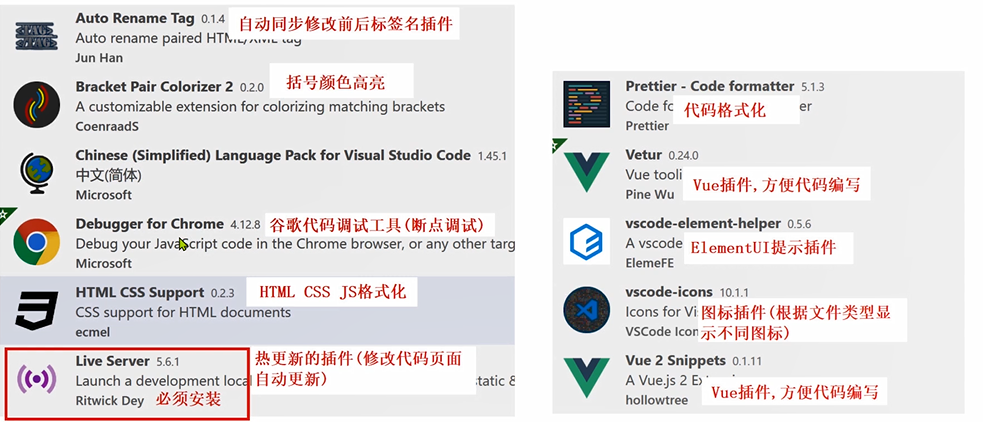
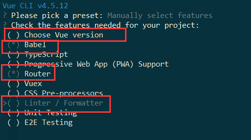

# Vue.js


# 1.Vue.js  

## 1.1 Vue.js介绍


用于构建用户界面的渐进式框架。与其它大型框架不同的是，Vue 被设计 为可以自底向上逐层应用.  

Vue 的核心库只关注视图层，不仅易于上手，还便于与第三方库或既有项目整合。另一 方面，当与现代化的工具链以及各种支持类库结合使用时，Vue 也完全能够为复杂的单页应用提供驱动。

自底向上逐层应用：作为渐进式框架要实现的目标就是**方便项目增量开发**(即插即用)  


## 1.2 Vue.js 基础  


### 1.2.1 Vue.js的使用  


1. 在html页面使用script引入vue.js的库即可使用。  


```html
远程CDN
<script src="https://cdn.jsdelivr.net/npm/vue@2.5.16/dist/vue.js"></script>
本地
<script src="vue.min.js"></script>
```


2. Vue-CLI脚手架:使用vue.js官方提供的**CLI脚本架**很方便去创建vue.js工程雏形  


### 1.2.2 入门程序  


```html
<head>
    <meta charset="UTF-8">
    <meta name="viewport" content="width=device-width, initial-scale=1.0">
    <title>Document</title>
    <!-- <script src="https://cdn.jsdelivr.net/npm/vue@2.5.16/dist/vue.js"></script> -->

    <!-- 1. 引入vue.js -->
    <script src="./js/vue.min.js"></script>
</head>
<body>

<!-- 定义app div，此区域作为vue的接管区域 -->
    <div id="app">
        <!-- {{}} 双括号是VUE中的差值表达式,将表达式的值输出到HTML页面 -->
        {{name}}
    </div>
    
</body>

<script>
    var VM = new Vue({
        //定义 Vue实例挂载的元素节点,表示vue接管该div
        el:"#app",
        //4.定义model模型数据对象
        data:{
            name:"Hello Vue!"
        }
    });

</script>
```


1. `{{}}`: 插值表达式

   - 插值表达式的作用?

     通常用来**获取Vue实例中定义的数据(data)**

     ***属性节点中 不能够使用插值表达式***

   

2. el: 挂载点

   1. el的作用 ?
      定义 Vue实例**挂载**的元素节点,表示**vue接管该区域**
   2. Vue的作用范围是什么 ?
      Vue会**管理el选项命中的元素,及其内部元素**
   3. el选择挂载点时,是否可以使用其他选择器 ?
      可以,但是**建议使用 ID选择器**  
   4. 是否可以设置其他的DOM元素进行关联 ?
      可以但是**建议选择DIV**, **不能使用HTML和Body标签**  

3. data: 数据对象
   1. Vue中用到的**数据定义在data中**
   2. data中**可以写复杂类型**
   3. 渲染**复杂类型数据**的时候,遵守**js语法**  


```html
<body>
    <div id="app">
        {{name}}
        <ul>
            <li>{{names[0]}}</li>
            <li>{{names[2]}}</li>
            <li>{{school.mobile}}</li>
        </ul>
    </div>
  </body>

  <script>
    var VM = new Vue({
      el: "#app",
      data: {
        name: "world!",
        school: {
            name: "tju",
            mobile: 1001111
        },
        names: ["aaa", "bbb", "ccc"]
      },
    });
  </script>
```


安装vscode插件：




### 1.2.3 声明式渲染的好处  


Vue中的声明式渲染,简单理解就是**我们声明数据,Vue帮我们将数据渲染到HTML**.  


jQuery中，如果 DOM 发生变化, js代码也需要做相应的改变，**高耦合**  

```html
<script src="./js/jquery-1.8.3.min.js"></script>
<script>
$(document).ready(function () {
$("#app").append("<h2>Hello Word! !</h2>");
});
</script>
```

**数据耦合在代码中，还拼接了标签。使得页面性能变低**


在用 Vue中，只需要定义好展示数据，并把它放在 DOM 合适的位置就可以  

```html
<script src="js/vue.min.js"></script>
<script>
    var VM = new Vue({
        el: "#app", //挂载点
        data: {
            name: "Hello Word! !",
        },
    });
</script>
```

**数据是单独定义的，使用表达式获得数据，而不是使用jQuery来直接写入数据**


### 1.2.4 Vue常用指令  


根据官网的介绍，指令 是带有 v- 前缀的特殊属性。通过指令来操作DOM元素  


----

#### **v-text 指令**

作用: 获取data数据, 设置标签的内容.

注意: 默认写法会替换全部内容,使用插值表达式{{}}可以替换指定内容  

```html
<!-- v-text 获取data数据,设置标签内容,会覆盖之前的内容体-->
<h2 v-text="names[2]">native</h2>

<!-- 使用插值表达式,不会覆盖 -->
<h2>hello {{name}}</h2>

<!-- 拼接字符串 data中获取的和自定义的进行拼接-->
<h2 v-text="name+'abc'"></h2>
```


----

#### **v-html 指令**  

作用: 设置元素的 **innerHTML** (可以**向元素中写入新的标签**)  


```html
<!-- 设置元素的innerHTML -->
<h2 v-html="url"></h2>
<h2 v-text="url"></h2>


<script src="./js/vue.min.js"></script>
<script>
    var VM = new Vue({
        el: "#app",
        data: {
            message: "Java程序员",
            url: "<a href='https://www.baidu.com'>百度一下</a>",
        },
    });
</script>
```


类似这个方法：

```javascript
document.getElementById("x").innerHTML = "<a href='https://www.baidu.com'>百度一下</a>";
```


一个是添加元素或者数据（有标签的情况下），一个只是显示数据的值。


----

#### **v-on 指令**  


作用: **为元素绑定事件**, 比如: `v-on:click`,可以简写为 `@click="方法"`

绑定的方法**定义在 VUE实例**的**method属性**中  


语法：

**要定义在data属性外面**

```html
<div id="app">
    <!-- 使用v-on 绑定click 点击事件 -->
    <input type="button" value="点击按钮" v-on:click="方法名">
    <!-- 使用 @符号也可以绑定-->
    <input type="button" value="点击按钮" @click="方法名">
</div>


var VM = new Vue({
    el:"#app",
    //通过methods ,专门存放Vue中的方法
    methods:{
        方法名:function(){
        	alert("123!")
        }
    }
})
```


```html
<body>
    <div id="app">
      <!-- 使用v-on 绑定click 点击事件 -->
      <input type="button" value="点击按钮" v-on:click="show" />
      <!-- 简写 @方式 -->
      <input type="button" value="点击按钮" @click="show" />
      <!-- 双击事件 -->
      <input type="button" value="双击击按钮" @dblclick="show" />
      <!-- 绑定点击事件 -->
      <h2 @click="changeFood">{{food}}</h2>
    </div>
  </body>
  <script src="vue.min.js"></script>
  <script>
    var VM = new Vue({
      el: "#app",
      data: {
        food: "麻辣小龙虾",
      },
      //通过methods ,专门存放Vue中的方法
      methods: {
        show: function () {
          alert("程序员!");
        },
        changeFood: function () {
          //使用this获取data中的数据
          console.log(this.food);
          //在VUE中不需要考虑如何更改DOM元素, 重点放在更改数据,数据更新之后,使用数据的那个元素会同步更新;
          this.food += "真好吃!";
        },
      },
    });
  </script>
```


**在VUE中不需要考虑如何更改DOM元素, 重点放在更改数据,数据更新之后,使用数据的那个元素会同步更新**


----

4. **计数器案例**  


 编码步骤

1. data中定义数据: 比如 num 值为1
2. methods中添加两个方法: 比如add(递增) ,sub(递减)
3. 使用{{}} 将num设置给 span标签
4. 使用v-on 将add,sub 分别绑定给 + ,- 按钮
5. 累加到10 停止
6. 递减到0 停止  


```html
  <body>
    <div id="app">
      <!-- 计算功能区域 -->
      <div>
        <input type="button" class="btn btn_plus" @click="add"/>
        <span>{{num}}</span>
        <input type="button" class="btn btn_minus" @click="minus"/>
      </div>
    </div>
  </body>


  <script src="vue.min.js"></script>
  <script>
    var VM = new Vue({
      el: "#app",
      data: {
        num: 1
      },
      methods: {
          add:function(){
            if(this.num < 10){
                this.num++;
            }else{
                alert("别点啦!最大了!")
            }
          },
          minus:function(){
            if(this.num > 0){
                this.num--;
            }else{
                alert("别点啦!最小了!")
            }
          }
      },
    });
  </script>
```


案例总结

- 创建VUE实例时: ***el(挂载点) , data(数据) , methods(方法)***
- v-on 指令的作用是**绑定事件**,简写为 **@**
- 方法中**使用this关键字,获取data中的数据**
- v-text 与 {{}} 的作用都是用来 **设置元素的文本值**  


---


#### **v-show指令**  


作用: v-show指令, **根据真假值,切换元素的显示状态**  

v-show=false ：**不显示元素**

```html
  <body>
    <div id="app">
      <!-- 计算功能区域 -->
      <div>
        <input type="button" value="切换状态" @click="change"/>
        <span v-show="isShow">show</span>
        <span v-show="age>19">age</span>
      </div>
    </div>
  </body>


  <script src="vue.min.js"></script>
  <script>
    var VM = new Vue({
      el: "#app",
      data: {
        num: 1,
        isShow: true,
        age: 19
      },
      methods: {
          change:function(){
              //触发方法, 对isShow进行取反
              this.isShow = !this.isShow;
          }
          
      },
    });
  </script>
```


v-show 指令总结

- 原理是**修改元素的display**,实现显示或者隐藏
- 指令后面的内容,最终会解析为 布尔值
- **值为true 显示, 为false 则隐藏**
- 数据改变之后,显示的状态会同步更新  

修改元素的display属性


---


#### **v-if 指令**  


作用: 根据表达值的真假,**切换元素的显示和隐藏**( **操纵dom 元素** )  


v-if 指令总结

- v-if 指令的作用: 根据表达式的真假切换元素的显示状态
- 本质是通过**操作dom元素**,来切换显示状态
- 表达式为true 元素存在与dom树,为false**从dom树中移除**
- **频繁切换使用 v-show （只修改属性，不动dom元素）,反之使用v-if**  


**直接把这个dom元素注释掉了。而不是修改dom元素的display属性。**


---


#### **v-bind 指令**  


作用: 设置元素的属性 （比如:src,title,class）  


```html
语法格式: v-bind:属性名=表达式

var VM = new Vue({
    el:"#app",
    data:{
    	imgSrc:"图片地址"
    }
})

v-bind 可以省略，简写为冒号 ：

```


```html
<body>
    <div id="app">
      <!-- 使用v-bind设置src属性值 -->
      
      <!-- 简写 设置title -->
      
      <!-- 设置class -->
      <div :style="{ fontSize: size + 'px'}">v-bind指令</div>
    </div>
  </body>

  <script src="./vue.min.js"></script>
  <script>
    var VM = new Vue({
      el: "#app",
      data: {
        imgSrc: "./img/lagou.jpg",
        imgTitle: "拉钩教育",
        size: 100,
      },
    });
  </script>
```


- v-bind 指令的作用是： **为元素绑定属性**
- 完整写法 **v-bind:属性名=“xxx”**，可以简写为 :属性名  


----


#### **v-for 指令**  

作用: 根据数据**生成列表结构**  


```html
<body>
    <div id="app">
      <input type="button" value="添加数据" @click="add" />
      <input type="button" value="移除数据" @click="remove" />
      <ul>
        <!-- 在li标签中获取数组元素 -->
        <li v-for="(item,index) in arr">{{index+1 }}城市: {{item}}</li>
      </ul>
      <!-- 使用h2标签显示
    v-for 结合 v-bind一起使用
    -->
      <h2 v-for="p in persons" v-bind:title="p.name">{{p.name}}</h2>
    </div>
  </body>
  <script>
    var VM = new Vue({
      el: "#app",
      data: {
        //普通数组
        arr: ["上海", "北京", "天津", "杭州"],
        //对象数组
        persons: [{ name: "尼古拉斯·赵四" }, { name: "莱安纳多·小沈阳" }],
      },
      methods: {
        add: function () {
          //push 添加
          this.persons.push({ name: "多利安·刘能" });
        },
        remove: function () {
          this.persons.shift();
        },
      },
    });
  </script>
```


v-for指令总结

- v-for 指令的作用: 根据数据**生成列表结构**
- 数组经常和 v-for结合使用,数组有两个常用方法:
  - **push()** 向数组**末尾添加**一个或多个元素
  - **shift()** 把数组中的**第一个**元素删除
- 语法是: (item,index) in 数据
- item和index 可以结合其他指令一起使用
- 数组的长度变化,会同步更新到页面上,是**响应式**的  


---

#### v-on 指令补充

1. 传递自定义参数 : 函数**调用传参**
2. 事件修饰符: 对**事件触发的方式**进行限制  


```html
  <body>
    <div id="app">
      <!-- 函数传参 -->
      <input
        type="button"
        value="礼物刷起来"
        @click="showTime(666,'爱你老铁!')"
      />
      <!-- 事件修饰符 指定哪些方式可以触发事件 -->
      <input type="text" @keyup.enter="hi" />
    </div>
  </body>

  
  <script>
    var VM = new Vue({
      el: "#app",
      data: {},
      methods: {
        showTime: function (p1, p2) {
          console.log(p1);
          console.log(p2);
        },
        hi: function () {
          alert("你好吗?");
        },
      },
    });
  </script>
</html>
```


- 事件绑定方法,可以传入**自定义参数**
- 定义方法时,需要**定义形参**,来**接收实际的参数**  

- 事件的后面跟上 **.修饰符** 可以对事件进行限制  `@keyup.enter`
- .enter 可以限制触发的按键为回车
- 事件修饰符有许多 使用时可以查询文档  


---


#### **MVVM模式**  


- MVVM 是Model-View-ViewModel 的缩写，它是一种基于**前端开发的架构模式**.
- MVVM模式将页面,分层了 M 、V、和VM ,解释为：
  - Model: 负责**数据存储**
  - View: 负责**页面展示**
  - View Model: 负责**业务逻辑处理**（比如Ajax请求等），对数据进行**加工后交给视图**展示  


```html
  <body>
    <div id="app">
      <!-- View 视图部分 -->
      <h2>{{name}}</h2>
    </div>
  </body>
  <script src="./js/vue.min.js"></script>
  <script>
    //创建的vue实例,就是 VM ViewModel
    var VM = new Vue({
      el: "#app",
      //data就是MVVM模式中的 model
      data: {
        name: "hello",
      },
    });
  </script>
```

- html dom元素：View 视图部分
- 创建的vue实例,就是 VM ViewModel
- data就是MVVM模式中的 model


- 首先，我们将上图中的**DOM Listeners和Data Bindings**看作两个工具，它们是实现**双向绑定**的关键。
  - 从View侧看，ViewModel中的DOM Listeners工具会帮我们**监测页面上DOM元素的变化**，如果有变化，则**更改Model中的数据**；
  - 从Model侧看，当我们**更新Model中的数据**时，Data Bindings工具会帮我们**更新页面中的DOM元素。**  

- MVVM的思想,主要是为了让我们的开发更加的方便,因为MVVM提供了***数据的双向绑定***  


---


#### v-model 指令  


作用: 获取和设置表单元素的值(实现双向数据绑定)

- 双向数据绑定
  - 单向绑定: 就是**把Model绑定到View**，当我们用JavaScript代码**更新Model时，View就会自动更新。**
  - 双向绑定: 用户**更新了View**，**Model的数据也自动被更新了**，这种情况就是双向绑定。
- 什么情况下用户可以更新View呢？
  - 填写表单就是一个最直接的例子。当用户填写表单时，View的状态就被更新了，如果此时MVVM框架可以自动更新Model的状态，那就相当于我们把Model和View做了双向绑定：  


```html
<body>
    <div id="app">
      <!-- View 视图部分 -->

      <!-- 单向绑定 -->
        <!-- <input type="text" v-bind:value="message">-->
        <input type="button" value="修改message" v-on:click="update"> 
        
        <!-- v-model 实现双向数据绑定 -->
        <input type="text" v-model="message">
        <input type="text" v-model="name">
        <h2>{{message}}</h2>

    </div>
  </body>


  <script>

    //创建的vue实例,就是 VM ViewModel  业务逻辑控制
    var VM = new Vue({
      el: "#app",

      //data就是MVVM模式中的 model
      data: {
        name: "hello",
        message: "vuetest"
      },
      methods: {
          update:function(){
              this.message = "进行了修改！";
          }
      },
    });
  </script>
```


- v-model 指令的作用是**便捷的设置   和  获取表单元素的值**
- 绑定的数据会**和表单元素值相关联**
- **双向数据绑定**  


### 1.2.5 实现简单记事本  


- **新增内容**

1. 生成**列表**结构(v-for 数组)
2. 获取**用户输入**(**v-model 双向绑定**)
3. 回车,**新增**数据(**v-on .enter事件修饰符**)
4. 页面布局不熟悉,可以通过审查元素的方式快速找到元素  


- **删除内容  **

1. 点击删除**指定的内容**( **根据索引**删除元素) `@click="remove(index)"`
2. 在methods中添加一个**删除的方法**,使用**splice函数进行删除**  


- **统计操作  **

1. 统计页面信息的个数,就是**列表中的元素的个数**.
2. 获取 **list数组的长度**,就是信息的个数    `{{list.length}}`


- **清空数据  **

1. 点击清除所有信息 `@click="clear"`
2. 本质就是**清空数组**   `this.list = [];`


```html
      <!-- 输入框 -->
      <header class="header">
        <h1>VUE记事本</h1>
        <input
          autofocus="autofocus"
          autocomplete="off"
          placeholder="输入日程"
          class="new-todo"
          @keyup.enter="add" 
          v-model="inputValue"
        />
      </header>

<!-- 列表区域 -->
      <section class="main">
        <ul class="listview">
      <!-- 使用v-for指令生成列表结构 -->
          <li class="todo" v-for="(item,index) in list">
            <div class="view">
              <span class="index">{{index+1}}</span> <label>{{item}}</label>
              <!-- 删除按钮 -->
              <button class="destroy" @click="remove(index)"></button>
            </div>
          </li>
        </ul>
      </section>

       <!-- 统计和清空 -->
       <footer class="footer">
        <span class="todo-count"> <strong>{{list.length}}</strong> items left </span>
        <button class="clear-completed" @click="clear">
          Clear
        </button>
      </footer>
    </section>
```


```javascript
    <!-- 开发环境版本，包含了有帮助的命令行警告 -->
    <script src="https://cdn.jsdelivr.net/npm/vue/dist/vue.js"></script>

    <script>
        var VM = new Vue({
            el:"#app",
            data:{
                list:["写代码", "吃饭", "睡觉", "打豆豆"],
                inputValue:"996还是007"
            },
            methods: {
                //新增日程方法
                add:function(){
                    //将用户输入的内容添加到list
                    //用户输入的值双向绑定到inputValue 将这个值保存进list即可
                    this.list.push(this.inputValue)
                },
                //删除方法
                remove:function(index){
                    //使用splice(元素索引,删除几个) 根据索引删除
                    this.list.splice(index,1);
                },
                //清空操作
                clear:function(){
                    this.list = [];
                }
            },
        })
    </script>
```


## 1.3 axios  


### 1.3.1 Ajax回顾  


Ajax 是指一种**创建交互式网页应用**的开发技术。Ajax = 异步 JavaScript and XML  


- Ajax 可以使**网页实现异步更新**。这意味着可以在**不重新加载整个网页**的情况下，对网页的**某部分**进行更新（**局部更新**）。传统的网页如果需要更新内容，必须**重载整个网页页面**。
- 简单记: Ajax 是一种在***无需重新加载整个网页的情况下，能够更新部分网页的技术, 维护用户体验性, 进行网页的局部刷新.***  


#### 异步与同步

- 浏览器访问服务器的方式
  - 同步访问: 客户端必须**等待服务器端的响应**,在等待过程中**不能进行其他操作**
  - 异步访问: 客户端不需要等待服务的响应,在**等待期间,浏览器可以进行其他操作**  


### 1.3.1 axios介绍  


VUE中结合网络数据进行应用的开发

- 目前十分流行**网络请求库**,专门用来**发送请求**,其内部还是ajax,**进行封装之后使用更加方便**
- axios作用: 在浏览器中可以帮助我们**完成 ajax异步请求的发送**.


> Vue2.0之后，尤雨溪推荐大家用axios替换JQuery ajax  


### 1.3.2 axios入门  


1. 导包  

```
<!-- 官网提供的 axios 在线地址 -->
<script src="https://unpkg.com/axios/dist/axios.min.js"></script>
```


2. 请求方式,以GET和POST举例  


**GET**  

```
axios.get(地址?key=value&key2=value2).then(function(response){},function(error){});
```


**POST  **

```
axios.post(地址,{key:value,key2:value2}).then(function(response){},function(error){})
```


3. 根据接口文档, **访问测试接口,进行测试**  


**接口1:随机笑话  **

```
请求地址:https://autumnfish.cn/api/joke/list
请求方法:get
请求参数:num(笑话条数,数字)
响应内容:随机笑话
```


**接口2:用户注册  **

```
请求地址:https://autumnfish.cn/api/user/reg
请求方法:post
请求参数:username(用户名,字符串)
响应内容:注册成功或失败
```


```html
<body>
    <input type="button" value="get请求" id="get"/>
    <input type="button" value="post请求" id="post"/>
    
</body>

<script>
    document.getElementById("get").onclick=function(){
        axios.get("https://autumnfish.cn/api/joke/list?num=2").then(
            function(res){
                //调用成功
                console.log(res);
            },function(res){
                //调用失败
                console.log(res)
            }
        );
    }

    document.getElementById("post").onclick=function(){
        axios.post("https://autumnfish.cn/api/user/reg", {username:"赵四"}).then(
            function(res){
                console.log(res);
            },function(error){
                console.log(error);
            }
        )
    }

</script>
```


**在一个请求响应结果未返回时，可以在页面进行其他操作，证明请求确实是异步的**


### 1.3.3 axios总结  


1. axios 必须**导包**才能使用
2. 使用**get或者post方法**,就可以发送请求
3. then方法中的**回调函数**,会在**请求成功或者请求失败的时候触发**
4. 通过回调函数的形参可以**获取响应的内容**,或者**错误信息**  


### 1.3.4 获取笑话案例  


通过vue+axios 完成一个获取笑话的案例.  


**接口: 随机获取一条笑话  **


```
请求地址:https://autumnfish.cn/api/joke
请求方法:get
请求参数:无
响应内容:随机笑话
```


```html
<body>
    <div id="app">
        <input type="button" value="点击获取一个笑话" @click="getJoke">
        <p>{{joke}}</p>

    </div>
</body>

<script>
    var VM = new Vue({
        el:"#app",
        data:{
            joke:"笑口常开"
        },
        methods: {
            getJoke:function(){
                //把this进行保存
                var that = this;

                //异步访问
                axios.get("https://autumnfish.cn/api/joke").then(
                    function(res){
                        console.log(res);
                        //但是没有改变？
                        console.log(that.joke);//undinined
                        //在回调函数中，没法正常使用this，需要保存起来
                        that.joke = res.data;
                    },function(error){
                        console.log(error)
                    }
                )

            }
        },
    })
</script>
```


1. axios***回调函数中this指向已经改变*** ,无法访问data中的数据  
2. 解决方案: **将this进行保存**,回调函数中直接使用保存的this即可  


### 1.3.5 天气查询案例  


功能分析: 回车查询

1. 输入内容,**点击回车** (v-on.enter)
2. **访问接口,查询数据** (axios **v-model**)
3. 返回数据,渲染数据  


**接口文档  **

```
请求地址:http://wthrcdn.etouch.cn/weather_mini
请求方法:get
请求参数:city (要查询的城市名称)
响应内容:天气信息
```


**自定义JS文件**

作为一个标准的应用程序,我们将创建VUE实例的代码,**抽取到main.js 文件中**  


```javascript
// 请求地址:http://wthrcdn.etouch.cn/weather_mini
// 请求方法:get
// 请求参数:city (要查询的城市名称)
// 响应内容:天气信息

var VM = new Vue({
    el:"#app",
    data:{
        city: "",
        //定义数组保存天气信息
        weatherList:[]
    },
    methods: {
        searchWeather:function(){
            //保存
            var that = this;

            console.log(this.city);
            axios.get("http://wthrcdn.etouch.cn/weather_mini?city=" + this.city).then(
                function(res){
                    //获取天气信息，保存到weatherList中
                    that.weatherList = res.data.data.forecast
                },function(error){
                    console.log(res);
                }
            )
        }
    },
})
```


```html
<style>
    [v-cloak]{
      /*  在页面完全完成响应后，再去响应*/
      display: none;
    }
  </style>

  <body>
    <div class="wrap" id="app" v-cloak>
      <div class="search_form">
        <div class="logo">天气查询</div>
        <div class="form_group">
          <input type="text" class="input_txt" placeholder="请输入要查询的城市" v-model="city" @keyup.enter="searchWeather"/>
          <button class="input_sub" >回车查询</button>
        </div>
      
      </div>
      <ul class="weather_list">
        <li v-for="(item) in weatherList">
          <div class="info_type"><span class="iconfont">{{item.type}}</span ></div>
          <div class="info_temp">
            <b>{{item.low}}</b>
            ~
            <b>{{item.high}}</b>
          </div>
          <div class="info_date"><span>{{item.date}}</span></div>
        </li>

      </ul>
    </div>
    <!-- 开发环境版本，包含了有帮助的命令行警告 -->
    <script src="https://cdn.jsdelivr.net/npm/vue/dist/vue.js"></script>
    <!-- 官网提供的 axios 在线地址 -->
    <script src="https://unpkg.com/axios/dist/axios.min.js"></script>
    <!-- 自己的js -->
    <script src="js/main.js"></script>

  </body>
```


1. 应用的逻辑代码,建议与页面**进行分离**,**使用单独的JS编写**
2. axios**回调函数**中的 this的指向改变,无法正常使用, 需要**另外保存一份**
3. **服务器返回的数据**比较的复杂时,获取数据时要**注意层级结构**  


### 1.3.6 解决页面闪烁问题  


我们发现访问天气预报案例页面时, 使用**插值表达式的地方出现了闪烁问题**,如何解决呢?

***v-cloak指令***

作用: 解决**插值表达式闪烁问题**
当网络较慢，**网页还在加载 Vue.js** ，而**导致 Vue 来不及渲染**，这时页面就会显示出 Vue 源代码。我们可以使用 v-cloak 指令来解决这一问题。  


1) 添加样式  

```css
<style>
/* 通过属性选择器,设置 添加了v-cloak */
[v-cloak] {
display: none;
}
</style>
```

2) 在id为app的div中添加 v-cloak  

```html
<div class="wrap" id="app" v-cloak>
```


## 1.4 computed 计算属性  


### 1.4.1 什么是计算属性  


在Vue应用中，在模板中双向绑定一些数据或者表达式，但是表达式如果过长，或者逻辑更为复杂时，就会变得臃肿甚至难以维护和阅读，


**重复使用差值表达式进行计算**

如果是调用函数：每次都需要进行调用。

**能不能显示多次，但只计算一次**

`computed` 的作用: **减少运算次数, 缓存运算结果**. 运用于**重复相同的计算.**  

```html
  <body>
    <div id="app">
      <h1>{{res()}}</h1>
      <h1>{{res()}}</h1>

      <h1>{{res2}}</h1>
      <h1>{{res2}}</h1>
    </div>
  </body>

  <script>
    //创建的vue实例,就是 VM ViewModel  业务逻辑控制
    var VM = new Vue({
      el: "#app",

      //data就是MVVM模式中的 model
      data: {
        a:10,
        b:20
      },
      methods: {
        res:function(){
          console.log("res") //2次
          return this.a * this.b;
        }
      },
      //使用计算属性进行优化，减少运算的次数，用于重复相同的运算
      computed:{
        res2:function(){
          console.log("res2") //只执行了一次
          return this.a * this.b;
        }
      }
    });
  </script>
```


### 1.4.2 computed总结  


1. 定义函数也可以实现与 计算属性相同的效果,都可以简化运算。
2. 不同的是**计算属性**是基于它们的响应式依赖进行缓存的。只在相关响应式依赖发生改变时它们**才会重新求值**。  


## 1.5 filter 过滤器  


### 1.5.1 什么是过滤器  


过滤器是对**即将显示的数据**做进一步的**筛选**处理，然后进行显示，值得注意的是过滤器**并没有改变原来的数据**，只是在原数据的基础上**产生新的数据**。

数据加工车间,对值进行筛选加工.  


### 1.5.2 过滤器使用位置  


1. 双括号插值内  

```
{{ msg | filterA }} msg是需要处理的数据, filterA是过滤器, | 这个竖线是管道,通过这个管道将数据传输给过滤器进行过滤 加工操作
```


2. v-bind绑定的值的地方。  

```
<h1 v-bind:id=" msg | filterA"> {{ msg }}  </h1>
```


### 1.5.3 过滤器  


#### 局部过滤器  


需求: 通过过滤器给电脑价格前面 添加一个符号¥  


```html
  <body>
    <div id="app">
      <h1>电脑价格：{{price | addIcon}}</h1>
    </div>
  </body>

  <script>
    //创建的vue实例,就是 VM ViewModel  业务逻辑控制
    var VM = new Vue({
      el: "#app",
      data:{
        price:200
      },
      filters:{
        //定义处理函数  value=接收的price
        addIcon(value){
          return "￥" + value;
        }
      }
    });
  </script>
```


#### 全局过滤器  


需求: 将用户名开头字母大写  


**一定要放到创建Vue实例的上面**


```html
  <body>
    <div id="app">
      <h1>{{user.name | changeName}}</h1>
    </div>
  </body>

  <script>
    //在创建Vue实例之前，创建全局过滤器
    Vue.filter("changeName", function(value){
      //将姓名的开头字母大写
      return value.charAt(0).toUpperCase() + value.slice(1); 
    })
    
    var VM = new Vue({
      el: "#app",
      data:{
        user:{name:"martin"}
      },
      filters:{
        //定义处理函数  value=接收的price
        addIcon(value){
          return "￥" + value;
        }
      }
    });
  </script>
```


### 1.5.4 总结  

1. 过滤器常用来处理**文本格式化**的操作。过滤器可以用在两个地方：**双花括号插值**和 **v-bind 表达式**
2. 过滤器应该被添加在 JavaScript 表达式的**尾部**，由**“管道”符号( | )**指示  


## 1.6 watch 侦听器  


### 1.6.1 什么是侦听器  


Vue.js 提供了一个方法 watch，它用于**观察Vue实例上**的**数据变动**。

作用: 当你有一些数据需要**随着其它数据变动而变动**时，可以使用侦听属性  


### 1.6.2 案例演示  


需求: 监听姓名变化,实时显示  


```html
  <body>


    <div id="app">

      <h1>计数器：{{count}}</h1>
      <input type="button" @click="count++" value="点我+1">

    </div>


  </body>

  <script>

    
    var VM = new Vue({
      el: "#app",
      data:{
        count:1
      },
      watch:{
        //监测属性值的变化
        //参数：新的值,原来的值，
        count: function(nval, oval){
          alert("计数器发生变化：" + oval + "->" + nval)
        }
      }
      
    });
  </script>
```

**count必须是model中定义的值才行**


```html
<body>

    <div id="app">

        <label>名：<input type="text" v-model="firstName"></label>
        <label>姓：<input type="text" v-model="lastName"></label>

        <!-- 可以避免这种耦合 -->
        <h2>{{firstName + " " + lastName}}</h2>
        <h2>{{fullName}}</h2>
    </div>

</body>

<script>

    var VM = new Vue({
        el: "#app",
        data:{
            firstName:"",
            lastName:"",
            fullName:""
        },
        watch:{

            firstName: function(nval, oval){
                this.fullName = nval + " " + this.lastName;
            },
            lastName: function(nval, oval){
                this.fullName = this.firstName + " " + nval;
            }
        }
    });
</script>
```


## 1.7 Component 组件  


### 1.7.1 组件介绍  


- 组件（Component）是**自定义封装**的功能。在前端开发过程中，经常出现多个网页的功能是重复的，而且很多不同的页面之间，也存在同样的功能。

- 我们将**相同的功能进行抽取,封装为组件**,这样，前端人员就可以在组件化开发时，只需要书写一次代码，随处引入即可使用。

- 组件系统让我们可以用**独立可复用的小组件**来构建大型应用，几乎任意类型的应用的界面都可以抽象为一个**组件树**  


**vue的组件有两种: 全局组件 和 局部组件  **


### 1.7.2 全局组件  


语法格式:  

```javascript
Vue.component("组件名称", {
    template: "html代码", // 组件的HTML结构代码
    data(){ //组件数据
    	return {}
    },
    methods: { // 组件的相关的js方法
        方法名(){
        	// 逻辑代码
        }
    }
})
```


注意:

1. 组件名以**小写开头**，采用**短横线**分割命名: 例如 hello-Word
2. 组件中的**data 必须是一个函数**,注意***与Vue实例中的data区分***
3. 在template模板中, **只能有一个根元素**  

```html
  <body>
    <div id="app">
<!-- 使用组件 -->
      <hcr-header></hcr-header>
    </div>
  </body>

  <script>

    //组件的命名规则：一般用-进行连接，左边是公司名，右边是组件作用名称
    Vue.component("hcr-header", {
      //template模板中，只能有一个根元素  只会展示第一个根元素
      template: "<div><h1 @click='hello'>{{msg}}</h1></div>",
      //组件中的data是一个函数
      data() {
        return {
          msg:"这是hcr-header组件中的数据部分"
        }
      },
      methods: {
        hello(){
          alert("你好")
        }
      },
    })
    
    var VM = new Vue({
      el: "#app",
      
    });
  </script>
```


### 1.7.3 局部组件  


相比起全局组件，局部组件**只能在同一个实例内才能被调用**。局部组件的写法和全局组件差不多。 唯一不同就是：**局部组件要写在Vue实例里面**。  


```javascript
var VM = new Vue({
      el: "#app",
      //局部组件
      components:{
        "web-msg":{
          template:"<div><h1>{{msg1}}</h1><h1>{{msg2}}</h1></div>",
          data() {
            return {
              msg1:"开发ing",
              msg2:"开发完成"
            }
          },
        }
      }
      
    });
```

创建局部组件，注意 components，注意末尾有 ‘s’，而全局组件是不用+ ‘s’ 的。这意味着，
components 里可以创建多个组件。  


### 1.7.4 组件与模板分离  

由于把**html语言写在组件里面很不方便**，也不太好看所以将它们分开写。  


```html
<body>

    <!-- 将模板写在html中 -->
    <template id="tmp">
      <div>
        <button @click="show">{{msg1}}</button>
      </div>
    </template>


    <div id="app">
      <!-- 使用组件 -->

      <web-msg></web-msg>
    </div>
  </body>

  <script>
    
    var VM = new Vue({
      el: "#app",
      //局部组件
      components: {
        "web-msg": {
          template: "#tmp",
          data() {
            return {
              msg1: "点击查询"
        
            };
          },
          methods: {
            show(){
              alert("正在查询,请稍等...");
            }
          },  
        },
      },
    });
  </script>
```


1. 上面这种写法，浏览器**会把 html 里的 template 标签过滤掉**。所以 template 标签的内容是**不会在页面中展示的**。**直到它被 JS 中的 Vue 调用**。
2. 在 html 中，template 标签***一定要有一个 id***，因为***通过 id 是最直接被选中的***。 data 和 methods等 参数，全部都要**放到 Vue 实例里面写**  


## 1.8 Vue生命周期  


### 1.8.1 生命周期图示  


每个Vue实例在被创建之前都要经过**一系列的初始化过程**,这个过程就是vue的生命周期

了解生命周期的好处:

1. 找错误
2. 解决需求

下图展示了实例的生命周期。你不需要立马弄明白所有的东西，不过随着你的不断学习和使用，它的参考价值会越来越高  


### 1.8.2 钩子函数介绍  


生命周期中的钩子函数

钩子函数：钩子函数是在**一个事件触发的时候，在系统级捕获到了他，然后做一些操作**  


| 函数             | 说明                                                  |
| ---------------- | ----------------------------------------------------- |
| beforeCreate()   | 在创建Vue实例之前,可以执行这个方法. 例如 加载动画操作 |
| created()        | 实例创建完成,属性绑定好了,但是  **DOM还没有生成.**    |
| beforeMount()    | 模板已经在内存中编辑完成了，尚未被渲染到页面中.       |
| mounted()        | 内存中的模板已经渲染到页面，用户已经可以看见内容.     |
| beforeUpdate()   | 数据更新的前一刻 , 组件在发生更新之前,调用的函数      |
| updated()        | updated执行时，内存中的数据已更新，并且页面已经被渲染 |
| beforeDestroy () | 钩子函数在实例销毁之前调用                            |
| destroyed ()     | 钩子函数在Vue 实例销毁后调用                          |


### 1.8.3 案例演示  


```html
<body>
    <div id="app">
      <h2 id="msg">{{msg}}</h2>
      <button @click="next">获取下一句</button>
    </div>
  </body>


  <script>
    
    var VM = new Vue({
      el: "#app",
      data:{
        msg:"床前明月光"
      },
      methods: {
        show(){
          alert("show方法执行了")
        },
        next(){
          this.msg = "疑是地上霜"
        }
      },
      beforeCreate() {
        alert("1. beforeCreate函数 在Vue对象实例化之前执行！");
        console.log(this.msg)//undifined  实例化之前完成此时数据还没有绑定
        this.show();//this.show is not a function
      },
      created() {
        alert("2. creared函数执行时，组件的实例化完成，但是DOM还没有生成->页面未生成");
        console.log(this.msg)
        this.show();//this.show is not a function
      },
      beforeMount() {
        alert("3. beforeMount执行时，模板已经在内存中编辑完成了，但是还没有被渲染到页面中");
        console.log("页面："+ document.getElementById("msg").innerText);//页面：{{msg}} 还没被渲染 还是差值表达式
        console.log("data:" + this.msg);
      },
      mounted() {
        alert("4. mounted函数执行时，模板已经被渲染到页面了，执行完就会显示页面")
        console.log("页面："+ document.getElementById("msg").innerText);//页面：床前明月光  获取到了data中的数据并渲染进了页面，就差显示了
        console.log("data:" + this.msg);
      },
      beforeUpdate() {
        alert("5. beforeUpdate函数执行时，内存中的数据已经更新了，但是还没有渲染到页面")
        console.log("页面："+ document.getElementById("msg").innerText);//页面：床前明月光  页面还没有更新，但数据data已经更新，还没有渲染到页面
        console.log("data:" + this.msg);//data:疑是地上霜
      },
      updated() {
        alert("6. updated函数执行时，内存中的数据已经更新到页面了，此方法执行完显示页面")
        console.log("页面："+ document.getElementById("msg").innerText);//页面：疑是地上霜 这时候页面中的数据已经更新了，只是还没有显示到浏览器中
        console.log("data:" + this.msg);//data:疑是地上霜
      },
    });
      
  </script>
```


created：页面还没生成


beforeupdate：


**页面显示完成后，如果数据发生了改变，那么在将修改后的数据显示到页面上之前，会触发beforeUpdate方法**


## 1.9 Vue Router 路由  


### 1.9.1 什么是路由?  


在Web开发中，路由是指**根据URL分配**到对应的处理程序。 **路由允许我们通过不同的 URL 访问不同的内容。**

通过 Vue.js 可以实现***多视图单页面web应用***（single page web application，SPA）  


### 1.9.2 什么是SPA ?  


> 单页面Web应用（single page web application，SPA），就是只有**一张Web页面**的应用，是加载单个HTML 页面并在用户与应用程序交互时动态更新该页面的Web应用程序。  


单页应用**不存在页面跳转**，它本身只有一个HTML页面。我们**传统意义上的页面跳转**在单页应用的概念下***转变为了 body 内某些元素的替换和更新***，举个例子:  

**都在同一个页面，但并没有进行跳转，只是替换了组件**


整个body的内容从登录组件变成了欢迎页组件, **从视觉上感受页面已经进行了跳转**。但实际上，页面**只是随着用户操作**，实现了**局部内容更新,**依然还是在index.html 页面中。


单页面应用的好处:

1. 用户操作体验好，用户**不用刷新页面**，整个**交互过程都是通过Ajax来操作。**
2. 适合**前后端分离**开发，服务端提供**http接口**，前端**请求http接口获取数据**，**使用JS进行客户端渲染。**  


### 1.9.3 路由相关的概念  


**router :**

- 是 Vue.js 官方的**路由管理器**。它和 Vue.js 的核心深度集成，让构建单页面应用（SPA）变得易如反掌 ,router 就相当于一个**管理者，它来管理路由。**

**route:**

- ruter相当于路由器, route就相当于**一条路由**.比如: **Home按钮 => home内容**， 这是一条route,news按钮 => news内容， 这是另一条路由。

**routes :**

- 是一组路由，把上面的每一条路由组合起来，形成一个**数组**。[  {home 按钮 =>home内容 }， {about按钮 => about 内容}  ]

**router-link组件:**

- router-link 是一个组件，是**对标签的一个封装**. 该组件用于设置一个**导航链接**，切换不同 HTML内容。 to 属性为目标地址， 即要显示的内容

**router-view 组件:**

- 路由导航到指定组件后,**进行渲染显示页面**  


### 1.9.4 使用路由  

1) Vue.js 路由需要载入 **vue-router 库**  

```html
//方式1: 本地导入
<script src="vue-router.min.js"></script>

//方式2: CDN
<script src="https://unpkg.com/vue-router/dist/vue-router.js"></script>
```


2) 使用步骤

1. 定义路由所需的组件
2. 定义路由 每个路由都由两部分 path (路径) 和component (组件)
3. 创建router路由器实例 ,管理路由
4. 创建Vue实例, 注入路由对象, 使用$mount() 指定挂载点  


```html
<body>

    <div id="app">
      <h1>hcr.com</h1>

      <p>
        <!-- 添加超链接 使用router-link组件来进行导航，to属性执行链接-->
        <router-link to="/home">go-to-home</router-link>
        <router-link to="/news">go-to-news</router-link>

        <!-- 路由的出口，路由匹配到组件后，要渲染到这里 -->
        <router-view></router-view>
      </p>

    </div>
  </body>

  <script>
    //1.定义路由所需的组件
    const home = {template:"<div>首页 花边新闻</div>"};
    const news = {template:"<div>新闻 新闻联播</div>"};

    //2.定义路由 每个路由有两部分  path路径，component组件
    const routes = [
      {path:"/home", component:home},
      {path:"/news", component:news}
    ];

    //3.创建路由管理器实例 router
    const router = new VueRouter({
      routes:routes,
    })

    //4.创建vue实例,将router注入到vue实例中，让整个应用都拥有路由的功能
    var VM = new Vue({
      router
      
    }).$mount("#app") //$mount是手动挂载代替el
  </script>
```


`http://127.0.0.1:5500/vue_test/vue%E5%85%A5%E9%97%A8.html#/news` 

请求路径在变化，**页面没有刷新**，**反复替换组件**


数组形式，每个路由route包括：路由路径path  +  组件component


### 1.9.5 路由总结  


1. router是Vue中的**路由管理器对象,**用来**管理路由**.
2. route是路由对象,**一个路由就对应了一条访问路径,**一组路由用**routes**表示
3. 每个路由对象route都有两部分 **path(路径)和component (组件)**
4. router-link 是**对a标签的封装**,通过**to属性**指定连接
5. router-view 路由访问到指定组件后,**进行页面展示**  。相当于一个槽位，将组件的数据展示到这里


# 学习总结


## Vue基础

### Vue简介

- 前端JavaScript框架
- 特点: 渐进式框架,实现即插即用
- 适合前后端分离,国人开发,中文文档

### Vue.js的使用

- 引入Vue

  - 本地引入
  - 远程

- 定义div 指定id

  - div就是vue控制的区域

- 创建vue实例

  - {{}} 差值表达式
  - el: 挂载点
  - data: 数据对象

- 渲染数据

  - Vue中的声明式渲染,简单理解就是我们声明数据,Vue帮我们将数据渲染到HTML.
  - {{}} 差值表达式

### Vue常用指令

- v-text 指令

  -  获取data数据, 设置标签的内容.

- v-html 指令

  - 设置元素的 innerHTML (可以向元素中**写入新的标签**)

- v-on 指令

  - 为元素绑定事件

- v-show指令

  - 根据真假值,切换元素的显示状态 display属性

- v-if 指令

  - 根据表达值的真假,切换元素的显示和隐藏( **操纵dom 元素** )

- v-bind 指令

  - 设置**元素的属性** （比如:src,title,class）

- v-for 指令

  - 根据数据生成**列表结构**

- v-on 指令补充

  - 传递自定义参数 :  函数调用传参
  - 事件**修饰符**: 对事件触发的方式进行限制  `@keyup.enter`

### MVVM模式

- Model: 负责数据存储 
- View: 负责页面展示 
- View Model: 负责业务逻辑处理（比如Ajax请求等），
  对数据进行加工后交给视图展示 

###  v-model 指令实现双向数据绑定

- 单向绑定: 就是把Model绑定到View，当我们用JavaScript代码更新Model时，
  View就会自动更新。 
- 双向绑定: 用户**更新了View，Model的数据也自动被更新了，**，永远获得的是
  这种情况就是双向绑定。 

## Vue进阶

### axios

- 作用: axios作用: 在浏览器中可以帮助我们完成 ajax异步请求的发送.
- 先导入后使用

### computed  计算属性

- 作用: 减少运算次数, 缓存运算结果. 运用于重复相同的计算.

### filter 过滤器

- 作用: 过滤器是对即将显示的数据做进一步的筛选处理，然后进行显示

### watch 侦听器

- 作用: 当你想要监听某一个数据,然后执行一些操作时可以使用侦听器

### Component 组件化开发

- 组件（Component）是自定义封装的功能
- 在前端开发过程中，经常出现多个网页的功能是重复的，而且很多不同的页面之间，也存在同样的功能。 我们将相同的功能进行抽取,封装为组件,这样，前端人员就可以在组件化开发时，只需要书写一次代码，随处引入即可使用。 

### Vue Router 路由

- 在Web开发中，路由是指根据URL分配到对应的处理程序
- 单页应用: ，就是只有一张Web页面的应用,Vue中使用路由完成单页面应用的开发
- 使用路由步骤

  - 1.定义路由所需的组件
  - 2.定义路由 每个路由都有两部分 path和component
  - 3.创建router路由器实例,对路由对象routes进行管理.
  - 4.创建Vue实例, 调用挂载mount函数,让整个应用都有路由功能

## Vue生命周期

### 每个Vue实例在被创建之前都要经过一系列的初始化过程,

这个过程就是vue的生命周期 


# npm


## 一、简介 

### 什么是NPM

NPM全称Node Package Manager，是Node.js包管理工具，是全球最大的模块生态系统，里面所有的模块都是开源免费的；也是Node.js的包管理工具，相当于前端的Maven 。


 

```
#在命令提示符输入 npm -v 可查看当前npm版本
npm -v
```

## **二、使用npm管理项目**

创建08-npm文件夹

### **1、项目初始化**

 

```
#建立一个空文件夹，在命令提示符进入该文件夹  执行命令初始化
npm init
#按照提示输入相关信息，如果是用默认值则直接回车即可。
#name: 项目名称
#version: 项目版本号
#description: 项目描述
#keywords: {Array}关键词，便于用户搜索到我们的项目
#最后会生成package.json文件，这个是包的配置文件，相当于maven的pom.xml
#我们之后也可以根据需要进行修改。
```

 

```
#如果想直接生成 package.json 文件，那么可以使用命令
npm init -y
```

### **2、修改npm镜像**

NPM官方的管理的包都是从 http://npmjs.com下载的，但是这个网站在国内速度很慢。

这里推荐使用淘宝 NPM 镜像 http://npm.taobao.org/ ，淘宝 NPM 镜像是一个完整 npmjs.com 镜像，同步频率目前为 10分钟一次，以保证尽量与官方服务同步。

**设置镜像地址：**

 

```
#经过下面的配置，以后所有的 npm install 都会经过淘宝的镜像地址下载
npm config set registry https://registry.npm.taobao.org 
#查看npm配置信息
npm config list
```

### **3、npm install命令**

基本命令

 

```
#使用 npm install 安装依赖包的最新版，
#简写 npm i
#模块安装的位置：项目目录\node_modules
#同时package.json 文件中，依赖包会被添加到dependencies节点下，类似maven中的 <dependencies>
#默认参数：--save  简写  -S  将当前依赖保存在dependencies节点下
npm install axios
```

下载特定版本的依赖

 

```
#如果安装时想指定特定的版本
npm i axios@0.18.x
```


下载开发依赖

 

```
#devDependencies节点：开发时的依赖包，项目打包到生产环境的时候不包含的依赖
#使用 -D参数将依赖添加到devDependencies节点
npm i --save-dev mockjs
#或简写
npm i -D mockjs
```

根据依赖下载安装包

 

```
#npm管理的项目在备份和传输的时候一般不携带node_modules文件夹
#安装会自动在项目目录下添加 package-lock.json文件，这个文件帮助锁定安装包的版本
npm i #根据package.json中的配置下载依赖，初始化项目
```

### **4、其它命令**

 

```
#更新包（更新到最新版本）
npm update 包名
#卸载包
npm uninstall 包名
```

 


# Vue-cli & ElementUI


# 1.Vue-cli  


## 1.1 什么是Vue-cli  


- Vue cli是基于Vue的应用开发提供的一个标准的**脚手架**工具.为应用搭建基础的框架结构,提供插件、开发服务、Preset、构建打包功能
- Vue cli 背后集成了现代化开发的诸多功能,**通过简单的命令就可以完成 "零配置"的项目环境搭建**  


## 1.2 安装Vue-cli步骤  


在安装vue-cli前，要确认自己的电脑是否安装了nodejs和npm.  


### 1.2.1 安装Node.js  


安装了node.js才有使用npm ，才能安装vue-cli  


1) 下载对应系统的Node.js版本:
https://nodejs.org/en/download/

2) 选安装目录进行安装

3) 测试: 在命令提示符下输入命令  

```
node -v //会显示当前node的版本
```


### 1.2.2 安装NPM  


npm全称Node Package Manager，他是node包管理和分发的工具，使用NPM可以对应用的依赖进行管理，NPM 的功能和服务端项目构建工具maven的依赖管理功能差不多，我们通过npm 可以很方便地下载js库，打包js文件。  


**node.js已经集成了npm工具**

在命令提示符输入 npm -v 可查看当前npm版本  

```
npm -v
```


**查看包管理路径  **


包路径就是npm从远程下载的js包所存放的路径。 使用 npm config ls 查询NPM管理包路径（NPM下载的依赖包所存放的路径）  

```
npm config ls
```


修改包管理路径

```
npm config set cache "D:\nodejs_package\npm_cache"
npm config set prefix "D:\nodejs_package\npm_modules"
```

就是远程下载的js包存放的路径

此时再使用 `npm config ls` 查询NPM管理包路径发现路径已更改  


**NPM环境变量配置  **


1) 查看npm的全局路径是什么  

```
npm config get prefix
```


2) 配置PATH环境变量  

- 添加新的系统变量: key=NODE_HOME , value= E:\nodejs_package
- path中添加 %NODE_HOME%\npm_modules  


**安装cnpm  **

npm默认会去国外的镜像去下载js包，在开发中通常我们使用国内镜像，这里我们使用淘宝镜像  


下边我们来安装cnpm： 有时我们使用npm下载资源会很慢，所以我们可以安装一个cnmp(淘宝镜像)来加快下载速度。


1) 联网情况下, 输入命令，进行全局安装淘宝镜像:  

```
//安装
npm install -g cnpm --registry=https://registry.npm.taobao.org

//查看cnpm的版本
cnpm -v
```


### 1.2.3 安装vue-cli  


目前主流版本是 2.x 和 3.x 版本,安装3.x 以上的版本是因为该版本既可以创建2.x项目与3.x 项目  

**注意: 以管理员身份打开命令行  **


1) 安装命令  

```
npm install -g @vue/cli
```


2)输入 vue命令  


3) 输入 vue -V 查看版本  

```
vue -V
```


**需要安装新版node才可以**


## 1.3 快速构建Vue项目  


### 1.3.1 步骤说明  


我们使用vue-cli 快速构建项目,步骤如下:

1. 桌面创建一个空的文件夹  vueTest

2. 以管理员身份运行cmd , 进入到vueTest文件夹  
3. 执行下面的命令  

```
1.基于交互式命令方式,创建项目
//文件名 不支持驼峰（含大写字母）使用短横线方式
vue create my-project  
```

4. 选择自定义安装,点击回车  


5. 在这列表中,选择我们要安装的组件,使用空格键选择,选好后回车  

6. 按回车之后,提示选择什么模式的路由,我们输入 n (表示选择hash模式)  

7. 选择项目配置文件单独存放  


8. 是否保存模板,选择n 不创建  
9. 安装完成,提示输入执行下面这两个命令  


```
cd my-project
启动项目
npm run serve
```


访问项目: http://localhost:8080/  


停止项目 只要关闭命令行窗口就可以  


### 1.3.2 导入Vue项目到VSCode  


1. VSCode中右键选择打开文件夹
2. 选择桌面上的项目
3. 打开项目,可以看到如下项目结构  


### 1.3.3 项目结构介绍  


```
|--- my-project 项目名称
    |--- node_modules 存放依赖包的目录
    |--- public 静态资源管理目录
    |--- src 组件源码目录(我们写的代码)
        |--- assets 存放静态图片资源(CSS也可以放在这里)
        |--- components 存放各种组件(一个页面可以看做一个组件)，各个组件联系在一起组成一个完整的项目
        |--- router 存放了项目路由文件
        |--- views 放置的为公共组件(主要还是各个主要页面)
        |--- App.vue app.vue可以当做是网站首页，是一个vue项目的主组件，页面入口文件
        |--- main.js 打包运行的入口文件，引入了vue模块和app.vue组件以及路由route
    |--- babel.config.js babel配置文件, 对源代码进行转码(把es6=>es5)
    |--- package.json 项目及工具的 依赖配置文件
    |--- paxkage-lock.json 依赖配置文件
    |--- README.md 项目说明
```


### 1.3.4 Vue脚手架自定义配置  


#### 1.3.4.1 package.json 介绍  


每个项目的根目录下面，一般都有一个 package.json 文件，定义了这个项目所需要的**各种模块**，以及**项目的配置信息**（比如名称、版本、许可证等元数据）。 **npm install 命令根据这个配置文件**，自动**下载所需的模块**，也就是**配置项目所需的运行和开发环境**。  

添加完配置后，`npm install`来下载模块

```json
{
    //项目基本信息
  "name": "my-project",
  "version": "0.1.0",
  "private": true,
    //指定的运行脚本的命令
  "scripts": {
    "serve": "vue-cli-service serve",
    "build": "vue-cli-service build"
  },
    //生产环境所依赖的 模块版本
  "dependencies": {
    "core-js": "^3.6.5",
    "vue": "^3.0.0",
    "vue-router": "^4.0.0-0"
  },
    //本地开发环境使用的依赖版本
  "devDependencies": {
    "@vue/cli-plugin-babel": "~4.5.0",
    "@vue/cli-plugin-router": "~4.5.0",
    "@vue/cli-service": "~4.5.0",
    "@vue/compiler-sfc": "^3.0.0"
  }
}

```


#### 1.3.4.2 通过package.json 配置项目  


配置内容采用JSON格式,所有的内容都用双引号包裹

打开package.json,在最末端添加如下配置:  

```json
  "vue": {
    "devServer": {
      "port": "8888", #设置项目端口
      "open": true #打包完成自动打开浏览器
    }
```


注意: 不推荐这种方式,因为package.json 主要是用来管理包的配置信息.为了方便维护,  

我们将Vue脚手架相关的**配置单独定义到 vue.config.js 配置文件中**  


### 1.3.4.3 单独的配置文件配置项目  


1. 在项目的根目录创建文件 vue.config.js
2.  删除掉package中新添加的配置项.
3. 在vue.config.js 文件中进行相关配置  


```javascript
module.exports = {
    devServer:{
        open:true,
        port:8088
    }
}
```


### 1.3.5 Vue 组件化开发  


组件化是Vue的精髓，**Vue项目就是由一个一个的组件构成的**。 我们**主要的工作就是开发的组件.**  


#### 组件介绍  


1) 我们用 vue-cli 脚手架搭建的项目，里面有很多，如 index.vue 或者 App.vue 这一类的文件.

**每一个*.vue 文件都是一个组件** ，是一个自定义的文件类型, 比如 **App.vue 就是整个项目的根组件**。  


2) 常见的组件：

- **页面级别**的组件
  - 页面级别的组件，通常是 views 目录下的.vue组件，是组成整个项目的各个**主要页面**
- 业务上可复用的**基础组件**
  - 这一类组件通常是在业务中**被各个页面复用的组件**，这一类组件通常都写到 components 目录下，然后**通过import在各个页面中使用**


3) 组件的组成部分

- **template** : 组件的**HTML部分**
- **script**: 组件的**JS脚本** (使用ES6语法编写)
- **style**: 组件的**CSS样式**  


Home.vue

```vue
<template>
  <div class="home">
    
    <HelloWorld msg="Welcome to Your Vue.js App"/>
  </div>
</template>

<script>
// @ is an alias to /src  引入HelloWorld组件
import HelloWorld from '@/components/HelloWorld.vue'

export default {
  name: 'Home',
  components: {
    HelloWorld
  }
}
</script>
```


## 1.4 项目运行流程  


### 1.4.1 main.js  


1. 项目运行 会**加载入口文件 main.js**  

新版main.js:使用createApp，**自动生成<div id="app">**，在App.vue  页面中就没有这个div标签了


```javascript
/*
    html文件中，通过script src = 'xxx'标签引入js文件。
    而vue中，通过 import 变量名 from 文件路径 的方式导入文件，不光可以导入js文件。
    1.变量名: 指的是为导入的文件起一个名称，不是指导入的文件的名称，相当于变量名。
    2.文件路径: 指的是文件的相对路径
*/
import { createApp } from 'vue'
import App from './App.vue'
import router from './router'
 
//创建Vue实例   为整个项目添加路由
createApp(App).use(router).mount('#app')
//挂载的是App.vue组件中的id为app的区域
```

旧版：

```javascript
import Vue from 'vue'
//关闭启动提示
Vue.config.productionTip = false
//创建Vue实例
new Vue({
    router, //为整个项目添加路由
    render: h => h(App) //这是一个函数ES6语法,作用是生成模板: App = App.vue
}).$mount('#app') //挂载的是App.vue组件中的id为app的区域
```


### 1.4.2 App.vue  


2. App.vue 是vue项目的**主组件**，是页面入口文件 ，**所有页面都是在App.vue下进行切换的**  

App.vue 中的模板(HTML代码)  :

```html
<template>
  <div id="app"> 挂载的是这个div
    <div id="nav">
        这里是两个路由导航链接
        1. to="/" 项目根路径 跳转的是首页
      <router-link to="/">Home</router-link> |
        2. to="/about" 点击About按钮,跳转到about组件
      <router-link to="/about">About</router-link>
    </div>
	router-view 的作用是 根据访问的路径,渲染路径匹配到的视图组件
    <router-view/>
  </div>
</template>
```


### 1.4.3 router 路由  

3. 找到**路由文件**,来看一下具体的路由配置  


```javascript
// 引入所需文件
import { createRouter, createWebHashHistory } from 'vue-router' //vue库    vue-router库
import Home from '../views/Home.vue'   //引入home组件，


const routes = [
  {
    path: '/',
    name: 'Home',
    component: Home
  },
  {
    path: '/about',
    name: 'About',
    // route level code-splitting
    // this generates a separate chunk (about.[hash].js) for this route
    // which is lazy-loaded when the route is visited.
    component: () => import(/* webpackChunkName: "about" */ '../views/About.vue')
  }
]

const router = createRouter({
  history: createWebHashHistory(),
  routes
})

export default router
```


旧版的还会引入Vue库并且使用路由功能, 新版看不太懂。。


component：Home ：导航到Home.vue，表示 **路由导航到的组件**

`  component: () => import(/* webpackChunkName: "about" */ '../views/About.vue')`指向了About.vue组件，和前面的import效果相同


```javascript
  { 
    path: '/',  //访问根路径，跳转到Home.vue组件
    name: 'Home',
    component: Home
  },
```


### 1.4.4 Home.vue组件  


1. 默认访问的是Home.vue 首页  


```vue
html代码：视图部分
<template>
  <div class="home">
    
      HelloWorld是一个组件  msg是传入的String参数
    <HelloWorld msg="Welcome to Your Vue.js App"/>
  </div>
</template>

JS部分
<script>
// @ is an alias to /src
//导入了一个组件 HelloWorld.vue @符号表示 src这个目录
import HelloWorld from '@/components/HelloWorld.vue'

//导出
export default {
  name: 'Home',
    //在home.vue组件中引入了helloworld组件
  components: {
    HelloWorld
  }
}
</script>

```


## 1.5 组件的使用案例  


### 1.5.1 创建Header.vue组件  

1. 在components 目录下创建 Header.vue  


```vue
<template>
  <div class="header">
    {{ msg }}
  </div>
</template>


<script>
export default {
  name: "Header", //组件名称
  data() {
    //data函数
    return {
      msg: "这是一个Header组件",
    };
  },
};
</script>


// scoped 表示当前的样式,只作用于  当前组件  中的 template 视图.
<style scoped>
.header {
  height: 100px;
  line-height: 100px;
  background-color: #eee;
  text-align: center;
  color: blue;
}
</style>

```


### 1.5.2 引入 Header组件  


### 1.5.3 组件的传参  


- props : 是**组件中的属性**, 表示**组件可以接受参数**,  


 `<HelloWorld msg="Welcome to Your Vue.js App"/>` 


**指定一个属性并且定义数据类型，给组件的属性传递参数**


```
<Header msg="这是通过props属性进行赋值显示出来的"></Header>

props:['msg']
```


# 2.Element-UI  


## 2.1 Element-UI介绍  


element-ui 是饿了么前端出品的基于 Vue.js的 后台组件库，方便程序员进行页面快速布局和构建

Element-UI官方站点：

https://element.eleme.cn/#/zh-CN  


## 2.2 Element-UI使用  


### 2.2.1 命令行方式安装  


1. 创建 一个新的项目 `vue create el-project02 `
2. 当前项目下打开终端, **安装依赖包** ,执行下面的命令  

```
npm i element-ui -S
```


3. 打开 main.js , 导入Element-UI 相关资源  

main.js是工程的入口文件，在此文件中**加载了很多第三方组件**，如：**Element-UI**、Base64、VueRouter等。  

```
//导入组件库
import ElementUI from 'element-ui'
//导入组件相关样式
import 'element-ui/lib/theme-chalk/index.css'
//配置Vue插件 将El安装到Vue上
Vue.use(ElementUI);
```


4. 复制Element 按钮样式 到app.vue文件的 template下  


```html
<el-row>
  <el-button>默认按钮</el-button>
  <el-button type="primary">主要按钮</el-button>
  <el-button type="success">成功按钮</el-button>
  <el-button type="info">信息按钮</el-button>
  <el-button type="warning">警告按钮</el-button>
  <el-button type="danger">危险按钮</el-button>
</el-row>
```


### 2.2.2 Vue-CLI工程改造  


1. 删除components 目录下的 HelloWord.vue组件
2.  删除App.vue中的部分内容,只保留如下部分  

```vue
<template>
  <div id="app">
    
  </div>
</template>
```


3. 删除router文件下的路由文件 index.js部分内容,只保留如下部分  


### 2.2.3 安装axios  


1. npm安装：使用npm下载axios包  

```
npm i axios
```

2. 在main.js文件中导入axios 相关资源  

```javascript
//引入axios
import axios from 'axios'
//Vue对象使用axios
Vue.prototype.axios = axios;
```


## 2.3 用户登录界面制作  


### 2.3.1 Dialog对话框组件  

https://element.eleme.cn/#/zh-CN/component/dialog


**我们可以用Dialog制作一个登陆弹窗,选择自定义内容  **


### 2.3.2创建login.vue 组件  


1. 在components 下创建login.vue
2. 将Diglog组件的内容,拷贝到login.vue,进行修改:  


```vue
<template>


  <el-dialog title="用户登录" :visible.sync="dialogFormVisible">
    <el-form >

      <el-form-item label="用户名" :label-width="formLabelWidth">
        <el-input  autocomplete="off"></el-input>
      </el-form-item>
      
      <el-form-item label="密码" :label-width="formLabelWidth">
        <el-input  autocomplete="off"></el-input>
      </el-form-item>

    </el-form>


    <div slot="footer" class="dialog-footer">
      <el-button type="primary" @click="dialogFormVisible = false"
        >登 录</el-button
      >
    </div>
  </el-dialog>


</template>

<script>
  export default {
    data() {
      return {
        dialogFormVisible: false,
        
        formLabelWidth: '120px'
      };
    }
  };
</script>

<style scoped></style>

```


### 2.3.3 配置路由  

/router/index.js

```javascript
import Vue from 'vue'
import VueRouter from 'vue-router'
//导入Login.vue组件
import Login from '@/components/Login'

Vue.use(VueRouter)

const routes = [
  //登录路由
  {
    path:"/login",
    name:"login",
    component:Login
  }
]

const router = new VueRouter({
  routes

})

export default router

```


### 2.3.4 修改App.vue  

App.vue

```html
<template>
  <div id="app">
      
    <!-- 根据访问路径，渲染路径匹配到的组件 -->
      <router-view></router-view>
  </div>
</template>
```


### 组件调整

**访问首页也跳转到login**

```javascript
const routes = [
  //访问 / 也跳转到login
  {
    path:"/",
    redirect:"login" //重定向到login
  },
  //登录路由
  {
    path:"/login",
    name:"login",
    component:Login
  }
]
```


**取消 x 按钮**


`:show-close="false"`


### 2.3.5 编写登录功能  


1. 去掉关闭按钮, 添加一个属性 :show-close="false"  


2. 修改登陆触发事件  

3. 双向数据绑定  

   使用 v-model, 将视图与模型进行绑定  

4. 编写login方法  

```vue
<script>
  export default {
    data() {
      return {
        dialogFormVisible: true,
        user:{username:"", password:""},
        
        formLabelWidth: '120px'
      };
    },
    methods: {
        //登录
        login(){
            const url = "";
            //发送请求
            this.axios(url, {
                //携带的参数
                params:{
                    username:this.user.username,
                    password:this.user.password
                }
            }).then(function(res){
                console.log(res);
                alert("登录成功")
            }).catch((error) =>{
                console.log(error)
            })
        }
    },
  };
</script>
```


### 2.3.6 Postman搭建mock server  


- Mock server就是模拟一个服务器，我们使用Mock server可以模拟后台接口,对请求进行响应.
- 在前后端分离的开发中 前端利用mockeserver模拟出对应接口，拿到返回数据来调试，无需等后端开发人员完成工作。  


postman模拟出一个server 步骤:

使用postman模拟出一个server  


修改请求的URL  

`      const url = "https://d8063c65-95ec-4ef2-8ff8-300e701beab7.mock.pstmn.io/login";`


```javascript
  export default {
    data() {
      return {
        dialogFormVisible: true,
        user:{username:"", password:""},
        
        formLabelWidth: '120px'
      };
    },
    methods: {
        //登录
        login(){
            const url = "https://d8063c65-95ec-4ef2-8ff8-300e701beab7.mock.pstmn.io";
            //发送请求
            this.axios(url, {
                //携带的参数
                params:{
                    username:this.user.username,
                    password:this.user.password
                }
            }).then(
                (res) => {
                    console.log(res);
                    alert("登录成功")
                    //登陆成功后需要关闭对话框
                    //this在回调函数中无法使用  ok!
                    //使用es6的写法，就可以使用this了
                    this.dialogFormVisible = false;
                }
            ).catch((error) =>{
                //登录失败？ 提供消息提示  elementui中的message
                this.$message.error('登录失败！');
            })

        
        }
    },
  };
```


### 2.3.7 登录成功后跳转  


在js中设置跳转，常用的一种方法是 `this.$router.push`  


```javascript
//进行页面跳转，跳转到首页，在前端进行页面跳转，必须使用路由
this.$router.push('index');
```


## 2.4 首页布局页面制作  


### 2.4.1 创建 index.vue  


```vue
<template>
    
    <el-button type="danger">布局页面</el-button>

</template>


<script>
export default {
    
}
</script>

<style scoped>

</style>

```


### 2.4.2 配置路由  


**添加一个组件，就需要给他配置路由**

router目录下 的index.js 路由文件  

```
  //导入布局组件
import Index from '@/components/Index'
  
  
  {
    path:"/index",
    name:"index",
    component:Index //跳转到Index组件
  }
```


### 2.4.3 布局容器  


Container **布局容器** ,是用于布局的容器组件，方便快速搭建页面的基本结构：

https://element.eleme.cn/#/zh-CN/component/container

1. 在官方文档中找到布局的容器代码, 复制到 Index.vue  

稍作修改。。


导航菜单：

https://element.eleme.cn/#/zh-CN/component/menu


## 2.5 课程列表组件制作  


**编写 Course.vue  **

```html
<template>
    <el-button type="danger">课程信息</el-button>
</template>

<script>
export default {
    
}
</script>

<style scoped>

</style>
```


**配置路由  **

```javascript
  //布局路由
  {
    path:"/index",
    name:"index",
    component:Index, //跳转到Index组件
    //添加子路由,使用children属性来表示子路由
    children:[
      //课程信息子路由
      {
        path:"/course",
        name:"course",
        component:Course
      }
    ]
  }
```


修改 Index.vue组件中的 导航菜单属性  

**router 表示是否使用 vue-router 的模式**，启用该模式会**在激活导航时以 index 作为 path 进行路由跳转**  


设置路由的出口,将课程信息展示再 main  

```html
<!-- 主要区域 -->
<el-main>
    <!-- 来渲染main区域要放置的组件 -->
    <router-view></router-view>
</el-main>
```


## 2.6 Table表格组件  


我们通过table组件来实现一个课程页面展示的功能，通过查看Element-UI库，我们需要Table 表 格.进入Element-UI官方，找到Table组件，拷贝源代码到vue页面中，如下  


## 2.7 课程内容展示  


**修改Course.vue  **


加载效果

https://element.eleme.cn/#/zh-CN/component/loading


 


```vue
<template>
  <el-table
    :data="courseList"
    stripe
    style="width: 100%"
    v-loading="loading"
    element-loading-text="拼命加载中"
  >
    <el-table-column prop="id" label="ID"> </el-table-column>
    <el-table-column prop="course_name" label="课程名称"> </el-table-column>
    <el-table-column prop="price" label="价格"> </el-table-column>
    <el-table-column prop="sort_num" label="排序"> </el-table-column>
    <el-table-column prop="status" label="状态"> </el-table-column>
  </el-table>
</template>

<script>
export default {
  data() {
    return {
      courseList: [],
      loading: true,
    };
  },

  //钩子函数
  //在dom页面生成之前执行
  created() {
      //在页面生成之前调用 loadCourse()方法
      this.loadCourse();
  },
  methods: {
      //获取课程信息
      loadCourse(){
          //alert("loadCourse方法执行了")

          //发送请求，获取课程数据
          const url = "https://fa2981b3-5ebb-49eb-8bf7-500d5a78acc7.mock.pstmn.io/course";
          return this.axios.get(url).then((res) => {
              console.log(res.data);
              //将获取到的数据赋值给courseList
              this.courseList = res.data;

            //取消加载动画
            this.loading= false;
          }).catch((error) => { 
              this.$message.error("获取数据失败")
          })
          
      }
  },
};
</script>

<style scoped></style>

```


### 2.7.2 跨域问题解决  


当我们在前端项目中,**向后端发送请求的获取课程数据的时候,出现了跨域问题**:

已被CORS策略阻止：请求的资源上没有' Access-Control-Allow-Origin'标头（跨域请求失败）  


---


跨域是指通过JS在不同的域之间进行数据传输或通信，比如用ajax向一个不同的域请求数据，只要协议、域名、端口有任何一个不同，都被当作是不同的域,浏览器就不允许跨域请求。  


- 跨域的几种常见情况


---


**解决跨域问题  **


跨域的允许主要由服务器端控制。服务器端通过在响应的 header 中设置 Access-Control-AllowOrigin 及相关一系列参数，提供跨域访问的允许策略

- 设置响应头中的参数来允许跨域域请求:
  - Access-Control-Allow-Credentials
  - Access-Control-Allow-Origin 标识允许跨域的请求有哪些  


在POM文件中引入依赖  


```
<!-- 解决跨域问题所需依赖 -->
<dependency>
<groupId>com.thetransactioncompany</groupId>
<artifactId>cors-filter</artifactId>
<version>2.5</version>
</dependency>
```


在web.xml中 配置跨域 filter  

```
<!--配置跨域过滤器-->
<filter>
<filter-name>corsFilter</filter-name>
<filter-class>com.thetransactioncompany.cors.CORSFilter</filter-class>
</filter>
<filter-mapping>
<filter-name>corsFilter</filter-name>
<url-pattern>/*</url-pattern>
</filter-mapping>
```


## 2.8 条件查询  


### 2.8.1 ElementUI输入框组件  

Input 输入框通过鼠标或键盘输入字符  


```html
<el-input
    placeholder="请输入内容"
    v-model="input4">
    <i slot="prefix" class="el-input__icon el-icon-search"></i>
</el-input>
```


Course.vue 添加输入框  


```vue
<el-row :gutter="20">
  <el-col :span="6">  <el-input
  placeholder="课程名称"
  v-model="input"
  prefix-icon="el-icon-search"
  clearable>
</el-input></el-col>

<el-col :span="1">
  <el-button type="primary">点击查询</el-button>
</el-col>
</el-row>
```


# Tip


## 创建vue项目


`import { createRouter, createWebHashHistory } from 'vue-router' //vue库    vue-router库`

和往常引入vue不同。

**不一样的原因在于创建vue项目的时候不能勾选choose vue version 不知道为什么。。**




## json格式


**如果是手动传输json数据，那么key一定要加 双引号“”**


