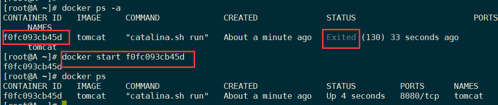
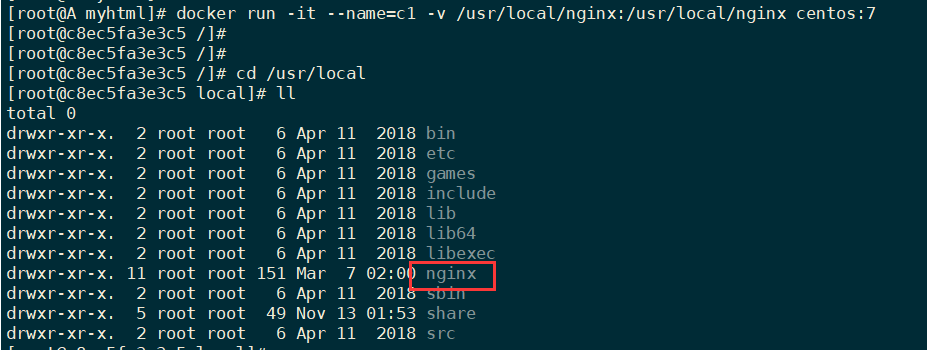
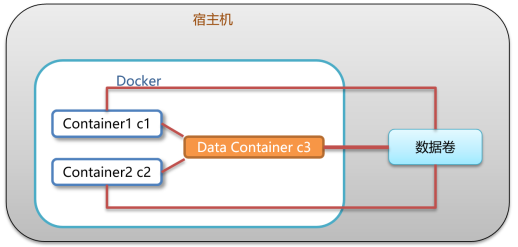

# Docker


# 1. Docker简介


## 1.1 虚拟化技术  


虚拟化技术是一种计算机资源管理技术，是将计算机的各种**实体资源**，如服务器、网络、内存及存储等，予以**抽象、转换后呈现出来**。虚拟化技术**打破了计算机实体结构间的，不可切割的障碍**。使用户可以比原本的组态更好的方式，来应用这些资源。

虚拟化技术主要作用：

- 高性能的物理**硬件产能过剩**和老的旧的硬件**产能过低**的重组重用，透明化底层物理硬件（阿里云）
- 软件**==跨环境迁移==**问题(代码的水土不服)，代码的运行环境tomcat/redis/mysql/jdk/......


在**一台主机上实现多个操作系统**，关键技术就是**==硬件的虚拟化==**。  

无论多少个人来使用，最终都是使用这一台机器的硬件资源


宿主机：真正存在的机器，虚拟机安装在宿主机上，虚拟出多台电脑。具有实在的硬件。


## 1.2 什么是Docker


**1. 合作开发的时候，在本机可以跑，别人的电脑跑不起来**  


这里我们拿Java Web应用程序举例，我们一个Java Web应用程序涉及很多东西，比如JDK、tomcat、spring等等。当这些其中某一项**版本不一致**的时候，可能就会导致应用程序跑不起来这种情况。**Docker则将程序直接打包成镜像**，直接**运行在容器**中即可。  


---


**2. 服务器自己的程序挂了，结果发现是别人程序出了问题把内存吃完了，自己程序因为内存不够就挂了**  

这种也是一种比较常见的情况，如果你的程序重要性不是特别高的话，公司基本上不可能让你的程序独享一台服务器的，这时候**你的服务器就会跟公司其他人的程序共享一台服务器**，所以不可避免地就会**受到其他程序的干扰**，导致自己的程序出现问题。Docker就很好解决了**环境隔离**的问题，**别人程序不会影响到自己的程序。**  


---


**3. 公司要弄一个活动，可能会有大量的流量进来，公司需要再多部署几十台服务器  **


在没有Docker的情况下，要在几天内**部署几十台服务器**，这对运维来说是一件非常折磨人的事，而且每台服务器的环境还不一定一样，就会出现各种问题，最后部署地头皮发麻。用Docker的话，我只需要**将程序打包到镜像**，你要多少台服务，我就给你跑多少容器，**极大地提高了部署效率**。  


https://www.Docker.com  

> Debug your app, not your environment！


Docker 是一个开源的应用容器引擎  ，基于 Go 语言实现  

Docker 可以让开发者**打包**他们的应用，以及依赖包到一个轻量级、可移植的容器中，然后发布到任何流行的 Linux 机器上。Docker容器是完全使用**沙箱机制**，**相互隔离**，**性能开销也极低**。  


Docker通俗的讲是**服务器中   高性能的虚拟机**，可以将一台物理机虚拟N多台虚拟机的机器，**互相之间隔离，互不影响**。

想要搞懂Docker，其实看它的两句口号就行。

第一句，是：“Build, Ship and Run”。也就是，“**搭建、发送、运行**”，三板斧。  

第二句，是：“Build once，Run anywhere（**搭建一次，到处能用**）”  


**特点：**

- 标准化交付：Docker将应用打包成**标准化单元**，用于交付、部署；
- 轻量级：容器及包含了软件运行所需的**所有环境**，而且非常轻量级
- 高可靠：容器化的应用程序，可以在**任何Linux环境**中始终如一的运行  
- 隔离性：容器化的应用程序，具备隔离性，这样多团队可以**共享同一Linux系统资源**  


## 1.3 容器与虚拟机比较


Docker是在**操作系统层面**上实现虚拟化，直接**复用本地主机的操作系统**，而传统方式则是在**硬件**层面实现。  


| 特性       | 容器                   | 虚拟机         |
| ---------- | ---------------------- | -------------- |
| 启动       | 秒级                   | 分钟级         |
| 硬盘使用   | 一般为MB               | 一般为GB       |
| 性能       | 接近**原生硬件**       | 弱鸡           |
| 系统支持量 | 单机可跑**几十个容器** | 单机几个虚拟OS |
| 运行环境   | 主要在Linux            | 主要在window   |

- Docker虚拟化的是操作系统，虚拟机虚拟化的是硬件  

- 传统虚拟机可以运行不同的操作系统，Docker主要运行同一类操作系统(Linux)  


**虚拟机是携带操作系统，本身很小的应用程序却因为==携带了操作系统==而变得非常大，很笨重。Docker是==不携带操作系统==的，所以Docker的应用就非常的轻巧  **


## 1.4 Docker 基本概念  


如果想再docker中运行一个mysql容器，首先需要先从镜像仓库中下载一个mysql的镜像到本地。


- 宿主机：安装Docker守护进程的Linux服务器，称之为宿主机；

- 镜像（Image）：Docker 镜像，就相当于是一个 root 文件系统。除了提供容器运行时所需的程序、库、资源、配置等文件外，还包含了一些为运行时准备的一些配置参数。

  安装、删除、拉取

- 容器（Container）：**镜像运行之后的实体**，镜像和容器的关系，就像是面向对象程序设计中的类和对象一样，镜像是静态的定义，**容器是镜像运行时的实体**。

  容器可以被创建、启动、停止、删除、暂停等。

  **容器可以持久化为镜像-->保存在容器中所作的修改  到镜像中**

- 仓库（Repository）：仓库可看成一个镜像控制中心，用来保存镜像。  


这个Docker镜像，是一个**特殊的文件系统**。它除了提供**容器运行时所需的程序、库、资源、配置等文件**外，还包含了一些为运行时准备的一些**配置参数**（例如**环境变量**）。镜像**不包含任何动态数据**，其内容在构建之后也不会被改变。  

各种各样的镜像共同组成了一个大的公共仓库 

负责对Docker镜像进行管理的，是**Docker Registry服务**（类似仓库管理员）。

不是任何人建的任何镜像都是**合法**的。万一有人盖了一个有问题的房子呢？
所以，Docker Registry服务**对镜像的管理是非常严格**的。

最常使用的Registry公开服务，是官方的Docker Hub，这也是默认的 Registry，并拥有**大量的高质量的官方镜像。**  


------

一款产品从开发到上线，从操作系统，到运行环境，再到应用配置。作为开发+运维之间的协作我们需要关心很多东西，这也是很多互联网公司都不得不面对的问题，特别是各种**版本的迭代**之后，**不同版本环境**的兼容  


开发人员利用 Docker 可以消除协作编码时“**在我的机器上可正常工作**”的问题  


Docker的主要目标是“Build，Ship and Run Any App,Anywhere”，也就是通过对应用组件的封装、分发、部署、运行等生命周期的管理，使用户的APP（可以是一个WEB应用或数据库应用等等）及其运行环境能够做到**一次封装，到处运行**。


Linux 容器技术的出现就解决了这样一个问题，而 Docker 就是在它的基础上发展过来的。将应用运行在 Docker容器上面，而 Docker 容器在任何操作系统上都是一致的，这就实现了跨平台、跨服务器。**只需要一次配置好环境，换到别的机子上就可以一键部署好，大大简化了操作**  


> **虚拟机的缺点： 1 资源占用多 2 冗余步骤多 3 启动慢**  


比较了 Docker 和传统虚拟化方式的不同之处：

- 传统虚拟机技术是**虚拟出一套硬件**后，在其上运行一个**完整操作系统**，在该系统上再运行所需应用进程；
- 而容器内的应用进程**直接运行于宿主的内核**，容器内**没有自己的内核**，而且也**没有进行硬件虚拟**。因此容器
  要比传统虚拟机更为***<u>轻便</u>***。
- 每个容器之间互相**隔离**，每个容器有**自己的文件系统** ，容器之间进程不会相互影响，能区分计算资源。  


# 2. Docker的安装与启动


## 2.1 安装Docker


- 桥接模式的虚拟机，就像一个在路由器"民政局"那里"上过户口"的成年人，有自己单独的居住地址，虽然和主机住在同一个大院里，但好歹是有户口的人，可以大摇大摆地直接和外面通信。  

- NAT模式的虚拟机，纯粹就是一个没上过户口的黑户，路由器"民政局"根本不知道有这么个人，自然也不会主动和它通信。即使虚拟机偶尔要向外面发送点的信件，都得**交给主机以主机的名义转发出去**，主机还专门请了一位叫做NAT的老大爷来专门负责这些虚拟机的发信、收信事宜。

- 仅主机模式的虚拟机，纯粹是一个彻彻底底的黑奴，不仅没有户口、路由器"民政局"不知道这么
  号人，还被主机关在小黑屋里，连信件也不准往外发。  

虚拟网络设置：


VMNET8网卡设置：


这几个网关，IP地址都不能和给虚拟机配置的静态ip重复，其余随便设置


----

- 安装一个虚拟机。

- 在Linux操作系统上安装Docker容器。

- Docker需要从镜像仓库下载镜像，需要联网  ，配置静态ip

安装很简单：

```bash
yum list installed | grep docker # 查看电脑上已经安装的docker
```


## 2.2 Docker守护进程相关命令  


- 启动docker服务
- 停止docker服务
- 重启docker服务
- 查看docker服务状态
- 开机启动docker服务
- 查看docker概要信息  


systemctl命令是**系统服务管理器指令**  

```bash
# 启动docker
systemctl start docker 
# 停止docker
systemctl stop docker
# 重启docker
systemctl restart docker
# 查看docker状态
systemctl status docker
# 开机启动
systemctl enable docker
# 查看docker概要信息
docker info
docker --help
```


## 2.3 镜像加速的两个方案


默认情况，将从docker hub（https://hub.docker.com/）下载docker镜像太慢，一般都会配置镜像加速器；  

中科大和阿里云镜像源：

```bash
vim /etc/docker/daemon.json

{ 
"registry-mirrors": ["https://docker.mirrors.ustc.edu.cn"]
}

{
"registry-mirrors": ["https://3ad96kxd.mirror.aliyuncs.com"]
}
# 刷新配置
sudo systemctl daemon-reload
sudo systemctl restart docker
```


# 3. Docker常用命令  


## 3.1 镜像相关命令  

```
查看镜像 docker images
搜索镜像 docker search imageName
拉取镜像 docker pull imageName：version
删除镜像 docker rmi imageId镜像id   (rmi-->remove Image)
```

在镜像源中搜索iamges：


拉取镜像：


```bash
docker pull tomcat:版本   如8.5....
```


- 镜像都是存储在Docker宿主机的/var/lib/docker目录下  
- 镜像id是唯一的，**唯一标识**
- 删除之前要确认此镜像已经没有被容器在使用，如果存在正在运行的docker容器，删除会报错 `“Error: container_delete: Impossible to remove a running container, please stop it first”`  

```bash
docker images -q #查看所有镜像的ID
docker rmi `docker images -q` #批量删除镜像
```


## 3.2 容器相关命令  


- 查看容器
- 创建容器：交互式、守护式
- 进入容器
- 启动容器
- 停止容器
- 删除容器  

---

查看**正在运行**的容器  ：

```
docker ps
```


查看**所有**容器

```
docker ps –a
docker ps -all
```

查看最后一次运行的容器  

```
docker ps –l
```

查看停止的容器  

```
docker ps -f status=exited
```


----


```
docker run 参数 镜像名称:镜像标签 /bin/bash
```


```bash
## 命令参数详解

-i：表示运行容器,如果不加该参数那么只是通过镜像创建容器，而不启动

-t：表示容器启动后会进入其命令行。加入这两个参数后，容器创建就能登录进去。即分配一个伪终端(如果
只加it两个参数，创建后就会自动进去容器)。

-d：在run后面加上-d参数,则会创建一个守护式容器在后台运行（这样创建容器后不会自动登录容器）。

--name :为创建的容器命名。

-v：表示目录映射关系（前者是宿主机目录：后者是映射到宿主机上的目录），可以使用多个－v做多个目录
或文件映射。注意：最好做目录映射，在宿主机上做修改，然后共享到容器上。

-p：表示端口映射，前者是宿主机端口：后者是容器内的映射端口。可以使用多个-p做多个端口映射，例如：
可以将Docker中Tomcat容器的8080端口映射到宿主机上的某一个端口8080，那么以后访问tomcat只需
要： http://宿主机的IP：8080

进入容器之后，初始化执行的命令：/bin/bash；可写可不写
```


- **交互式容器**

  使用交互式运行容器，容器运行后直接进入到容器内部，退出容器内部后，**容器直接关闭**

  ***只有第一次才会这样，以后再启动容器就是一个守护式的。***  

  ```bash
  docker run -it --name=容器名称 镜像名称:标签 /bin/bash
  ```

  

退出当前界面后，**容器也自动关闭了**。

再进行启动时，自动变成守护式

```
docker start 容器名称（或者容器ID）
```




- 删除容器

  ```
  docker rm 容器名称/容器id
  ```

  

  **一定要先关闭容器再删除容器**


- 关闭容器

  ```
  docker stop 容器名称（或者容器ID）
  ```

  


- 守护式容器

  ```bash
  docker run -di --name=容器名称 镜像名称(或镜像ID):标签 /bin/bash
  ```

  


- **登录容器/进入容器的目录**  

  ```
  docker exec -it 容器名称 (或者容器ID) /bin/bash
  ```

  **注意：这里的登陆容器之后执行的脚本/bin/bash必须写  **

  

  进入到了以守护式开启的tomcat容器中，进行操作

  `exit`退出当前界面，**但容器不会停止，继续以守护进程运行**


### 文件拷贝


如果我们需要将宿主机的文件拷贝到容器内可以使用cp命令  


```bash
docker cp 需要拷贝的文件或目录 容器名称:容器目录

# 新建一个空文件
touch hcr.html
# 拷贝到tomcat容器的webapps目录下
docker cp hcr.html tomcat:/usr/local/tomcat/webapps/
# 切换到tomcat容器中查看
docker exec -it tomcat容器ID /bin/bash
```


也可以将文件从容器内拷贝出来  ，属性反转就行

```
docker cp  tomcat:/usr/local/tomcat/webapps/hcr.html /usr/
```


### 目录挂载

我们可以在创建容器的时候，将宿主机的目录与容器内的目录进行映射，这样我们就可以通过修改宿主机某个目录的文件从而去影响容器。 


建容器 添加-v参数 后边为 **宿主机目录 : 容器目录** 例如：   

```
docker run -di --name=tomcat -v /usr/local/myhtml:/usr/local/myhtml tomcat
```


### 查看容器IP地址  

我们可以通过以下命令查看容器运行的各种数据  

```
docker inspect 容器名称（容器ID）
```


也可以直接执行下面的命令直接输出IP地址  

```
docker inspect --format='{{.NetworkSettings.IPAddress}}' 容器名称（容器ID）
```


主机无法ping通这个docker的ip地址


### 删除容器  

删除指定的容器，正在运行的容器无法删除  


```bash
#删除容器
docker rm 容器名称（容器ID）
#删除镜像
docker rmi 镜像ID(镜像名称)
```


# 4. Docker数据卷（Volumes)  


## 4.1 数据卷概述  


数据卷是**宿主机中**的一个目录或文件，当**容器目录和数据卷目录绑定**后，对方的修改会**立即同步**。

一个数据卷可以**被多个容器同时挂载**，一个容器也可以**被挂载多个数据卷**。多对多

简单来说数据卷本质其实是**共享文件夹**，是**宿主机与容器间数据共享的桥梁**  


**数据卷作用：**

- 容器数据**持久化**
- 外部机器和容器**间接通信**
- **容器之间**数据交换  


## 4.2 数据卷配置方式  


> **挂载后，只是在容器中可以使用并且看到宿主机的数据卷，但数据并不会一同保存到容器中，使用的时候还是从宿主机中同步数据**


### 1个容器挂载1个数据卷  


创建启动容器时，使用 –v 参数 设置数据卷  

```
docker run ... –v 宿主机目录(文件):容器内目录(文件) ...
```


**注意事项：**

1. 目录必须是**绝对路径**
2. 如果宿主机目录**不存在，会自动创建**
3. 可以挂载**多个数据卷**  


### 查看容器已挂载的数据卷  


我们可以通过以下命令，查看容器中挂载的数据卷  

```
docker inspect 容器名称（容器ID）
```


```
docker pull centos:7
docker run -it --name=c1 -v /usr/local/nginx:/usr/local/nginx

```



查看容器挂载的宿主机目录


### 1个容器挂载多个数据卷  

```
docker run -di --name=c1 -v /root/host_data1:/root/c1_data1 
-v /root/host_data2:/root/c1_data2 centos:7 /bin/bash
```


### 多个容器挂载1个数据卷  

多个容器**共享**一个数据卷，一个改动，其他的都发生变化

```
docker run -di --name=c2 -v /root/host_data_common:/root/c2_data centos:7
docker run -di --name=c3 -v /root/host_data_common:/root/c3_data centos:7
```


**多个容器挂载1个容器**(这个容器挂载1个数据卷)  

`--volumes-from`

```bash
##创建启动c3数据卷容器，使用 –v 参数 设置数据卷
docker run -di --name=c3 -v /root/host_data_common:/root/c3_data centos:7
/bin/bash
##创建启动 c1 c2 容器，使用 –-volumes-from 参数 设置数据卷
docker run -di --name=c1 --volumes-from c3 centos:7 /bin/bash
docker run -di --name=c2 --volumes-from c3 centos:7 /bin/bash
```





## 5. 在Docker中部署软件  


## 5.1 MySQL部署  


1. 搜索MySQL镜像
2. 拉取MySQL镜像
3. 创建容器、**设置端口映射、设置数据卷**
4. 进入容器操作mysql
5. 使用Navicat连接MySQL  


- 拉取mysql镜像

```bash
docker pull mysql:8.0.23
```

- 创建容器，设置端口映射、目录映射  

```
docker run -id --name=mysql -p 3307:3306 -v /root/mysql/logs:/logs -v /root/mysql/data:/var/lib/mysql -e MYSQL_ROOT_PASSWORD=123456 mysql:8.0.23
```

​	**将mysql容器的3306端口映射到宿主机的3307端口**

​	做了两个挂载：日志目录&数据目录

​	`-e MYSQL_ROOT_PASSWORD=123456` 初始化root用户的密码

- 进入容器，操作mysql

```
docker exec –it mysql /bin/bash
```

因为做了端口映射，所以连接的是`192.168.150.128:3307`


## 5.2 Tomcat部署  


1. 搜索Tomcat镜像
2. 拉取Tomcat镜像
3. 创建容器、设置端口映射、设置数据卷
4. 向Tomcat中部署服务
5. 使用外部机器访问Tomcat，测试部署服务  


使用tomcat9：


- 创建容器

```
docker run -di --name=tomcat -p 8080:8080 -v /root/tomcat/webapps:/usr/local/tomcat/webapps tomcat
```

将Docker服务下Tomcat容器webapps的目录，挂载到宿主机下，只需要将文件放到宿主机中即可


- 向Tomcat中部署服务  

在宿主机的挂载目录上新建html文件： `/root/tomcat/webapps/root/hcr.html`

- 使用外部机器访问Tomcat，测试部署服务  


**部署成功！**


## 5.3 Nginx部署  


搜索Nginx镜像  

```
docker search nginx
```

拉取镜像并运行

```
docker pull nginx
docker run -id --name=nginx -p 80:80 nginx
```

测试访问：http://192.168.150.128:80  


## 5.4 Redis部署  


搜索redis镜像  

```
docker search redis
```

拉取redis镜像

```
docker pull redis
```

创建容器，设置端口映射  

```
docker run -id --name=redis -p 6379:6379 redis
```

使用redis desktop manager来访问一下


16个库，连接成功


尝试添加数据：


okokok！


属实太整洁了！

舒服了！


# 6. 迁移与备份  


应用场景：
开发环境Docker，在Docker中**安装很多的容器**，进行**对应的配置**，将Docker中的运行的容器持久化为镜像，将对应的镜像安装到生产环境中。

1. 将开发环境下的Docker中对应的**容器持久化为镜像**
2. 将**镜像保存为一个压缩包，发送到生产环境服务器**中
3. 生产环境中需要将**==压缩包-->镜像-->容器==**  


## 6.1 容器保存为镜像  


通过以下命令将容器保存为镜像  

```bash
docker commit {正在运行容器名称/容器ID} {镜像名称}:{镜像标签}
{ImageName} : {Tag}
# 例如
docker commit tomcat tomcat:hcr_v1.0.0
```


镜像标签如果不写默认为latest  


## 6.2 镜像备份  


通过以下命令将镜像保存为tar 文件  

```bash
docker save -o {压缩包存放路径} {镜像名称/镜像ID}

docker save -o /root/tomcat.tar tomcat:hcr_v1.0.0
# 压缩包在生产环境下会还原为一个image，还原之后的name和tag
# -o :输出到的文件
```


## 6.3 镜像恢复与迁移  


```
docker load -i {备份的镜像文件}

docker load -i tomcat.tar
# -i :指定导入的文件
```


我的镜像又回来了！


# 坑


## 安装docker报错


解决方法：

进入 `/etc/yum.repos.d` 目录下，将所有有关 docker 的 repo 全部删掉


安装所需的软件包。yum-utils 提供了 yum-config-manager ，并且 device mapper 存储驱动程序需要 device-mapper-persistent-data 和 lvm2。

```
sudo yum install -y yum-utils \
 device-mapper-persistent-data \
 lvm2
```

重新添加镜像：

```
sudo yum-config-manager --add-repo https://download.docker.com/linux/centos/docker-ce.repo

阿里云：
sudo yum-config-manager \
    --add-repo \
    http://mirrors.aliyun.com/docker-ce/linux/centos/docker-ce.repo
```

**在存储库中列出可用版本**

```
yum list docker-ce --showduplicates | sort -r
```


安装最新版本的 Docker Engine-Community 和 containerd

```
sudo yum install docker-ce docker-ce-cli containerd.io
```


