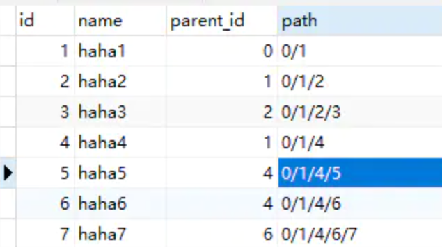
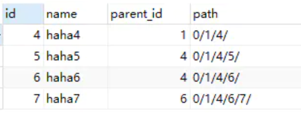
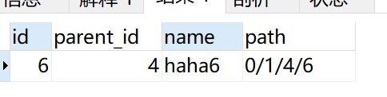
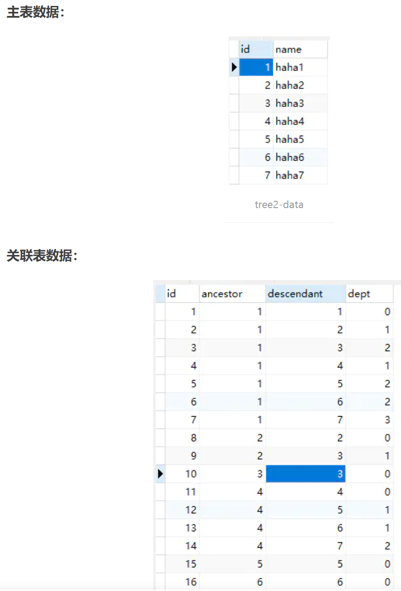
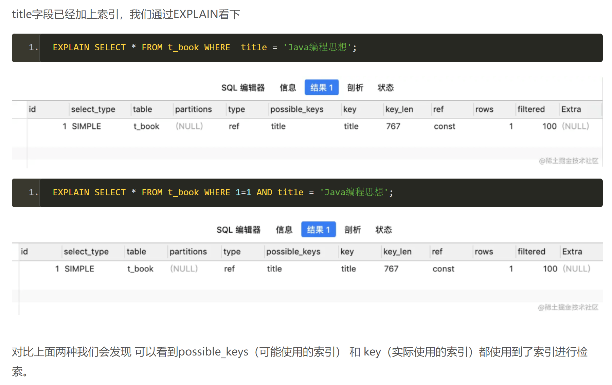
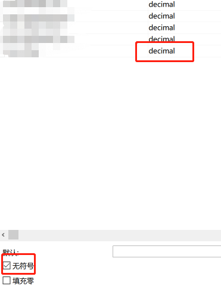
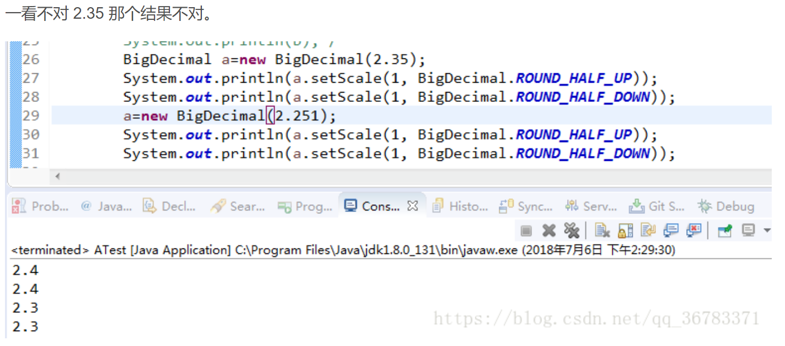
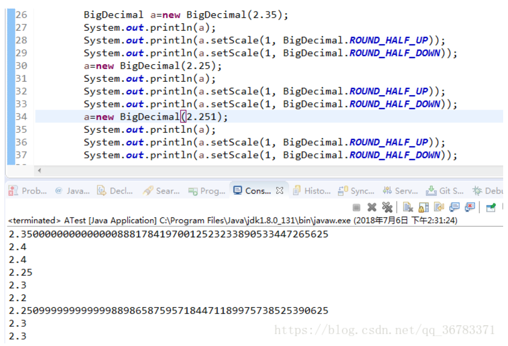
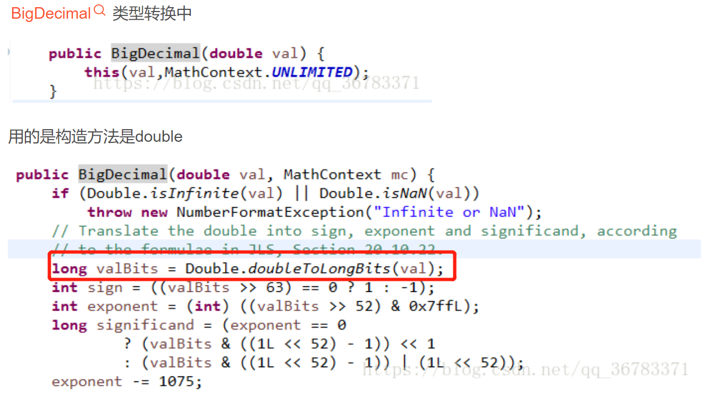

# MySQL


### 多级菜单设计


|   名称    |     类型     |   备注   |
| :-------: | :----------: | :------: |
|    id     |     int      |    PK    |
| parent_id |     int      | 父节点id |
|   name    | varchar(255) |   名称   |

----

**三级查询**

1. 查询出三级id
2. 取出三级id的parent_id值，查询三级id的父级id二级id
3. 取出二级id的parent_id值，查询二级id的父级id一级id

**联表查询：**

查询一个节点（id=1）的所有**下一级后代**

```mysql
SELECT t1.*
FROM tree AS t1 LEFT JOIN tree AS t2 
ON t1.id = t2.parent_id
where t2.parent_id=1
```

查询一个第三级节点的父节点以及爷节点：

```mysql
select 
t1.id, t1.name, t2.id, t2.name, t3.id, t3.name
from
tree as t1 
left join tree as t2 on t1.parent_id = t2.id
left join tree as t3 on t2.paernt_id = t3.id
```


**每需要查多一层，就需要联结多一次表**

> **如果层级更深了？该如何解决？**


> 使用 MySQL **子查询和联表查询**来实现多级查询，但是在线上环境最好避免联表查询，以免带来性能问题


---

**路径枚举**

将所有祖先的信息联合成一个字符串，并保存为每个节点的一个属性。

  路径枚举是一个由连续的直接层级关系组成的完整路径。如"/home/article/details",其中home是article的直接父亲，这也就意味着home是details的祖先。

表tree1：

|   名称    |     类型     |   备注   |
| :-------: | :----------: | :------: |
|    id     |     int      |    PK    |
| parent_id |     int      | 父节点id |
|   name    | varchar(255) |   名称   |
|   path    | varchar(255) |   路径   |




很方便的查询**所有的祖先和后代**：

查询后代：

```mysql
-- 查询所有的子节点（包括孙子）
select * from tree1 where path like '0/1/4%'
```




```mysql
select * from tree1 where path like CONCAT('%','6')
```




 路径枚举的缺点也很明显：

1. 数据库不能确保路径的格式总是正确或者路径中的节点确实存在(中间节点被删除的情况，没外键约束)。
2. 要依赖高级程序来维护路径中的字符串，并且验证字符串的正确性的开销很大。
3. VARCHAR的长度很难确定。无论VARCHAR的长度设为多大，都存在不能够无限扩展的情况。


---

**闭包表**


额外创建了一张TreePaths的表，它记录了表中所有的节点关系，并不仅仅是直接的父子关系。它包含两列，每一列都是一个指向tree3中的treeId的外键。

> **空间换时间**

   这种设计主表已经不再维护节点之间的关系，都是通过外表来维护节点的关系，下面是两个表的结构：


| 名称 |     类型     | 备注 |
| :--: | :----------: | :--: |
|  id  |     int      |  PK  |
| name | varchar(255) | 名称 |

关系记录表：

|    名称    | 类型 |  备注  |
| :--------: | :--: | :----: |
|     id     | int  |   pk   |
|  ancestor  | int  | 祖先id |
| descendant | int  | 后代id |
|    dept    | int  |  深度  |




treePaths表记录了所有的直接，父子关系

ancestor和descendant是直接父子关系

查询id是2节点的所有后代节点：

```mysql
SELECT t.*,tp.dept FROM tree2 AS t
    INNER JOIN TreePath tp on t.id = tp.descendant
    WHERE tp.ancestor = 2 and tp.dept != 0
```


查询id是6的节点的所有祖先节点：

```mysql
SELECT t.* FROM tree2 AS t
    INNER JOIN TreePaths tp on t.id = tp.ancestor
    WHERE tp.descendant = 6
```


插入数据：

先插入主表的数据，然后增加该节点与其关联的"祖先-后代"关系。

```mysql
-- 先插入主表
insert into tree2 values(8, 'haha8')

-- 再插入关联数据
insert into TreePaths (ancestor, descendant, depth)
(
select 
t.ancestor, 8, (t.dept + 1)
from TreePaths as t
where ancestor = 5  # 8的父节点是5
    union all 
    select 8, 8, 0  # 加入自身节点
)

```

删除叶子节点：

```mysql
-- 删除指定节点在TreePaths中的关系，删除儿子是8的所有关系行
DELETE FROM TreePath WHERE descendant = 8

```


删除子树：

```mysql
-- 删除节点6和6的所有子节点（子树）
DELETE FROM treePath
　　where descendant 
　　in
　　(SELECT descendant FROM treePath WHERE ancestor = 6)  节点6的所有子节点
```


### where 1=1


https://www.panziye.com/java/4637.html





where 1=1 也会走索引，不影响查询效率

我们写的sql指令会被mysql 进行解析优化成自己的处理指令，在这个过程中`1 = 1`这类无意义的条件将会被优化

在mybatis当中可以改变一下写法，因为毕竟mysql优化器也是需要时间的，虽然是走了索引，但是当数据量很大时，还是会有影响的，所以我们建议代码这样写：

```xml
<select id="queryBook" parameterType="com.ths.platform.entity.Book" resultType="int">
 select count(*) from t_book t
<where>
<if test="title !=null and title !='' ">
 title = #{title} 
</if>
<if test="author !=null and author !='' "> 
 AND author = #{author}
</if>
</where> 
</select>
```


### Decimal


mysql中的Decimal字段，如果使用或者对其进行操作过程中会变成负数，那么不要使用unsigned定义该字段




```
DECIMAL UNSIGNED value is out of range in ....
```


### join & full join


1. **笛卡尔积(没有加筛选条件的内连接)**


```
mysql> select * from t1, t2;
```

> 注意，如果使用了a, b这种方法，**最好是使用on来将a，b表对应字段连接，否则！会出现很多冗余数据！（进行笛卡尔积运算）**


# Java使用


## BigDecimal


### BigDecimal.ROUND_HALF_UP/DOWN


ROUND_HALF_UP: 遇到.5的情况时往上近似,例: 1.5 ->;2

ROUND_HALF_DOWN : 遇到.5的情况时往下近似,例: 1.5 ->;1


> ROUND_HALF_UP: 遇到.5的情况时往上近似,例: 1.51 ->;2
>
> ROUND_HALF_DOWN : 遇到.5的情况时往下近似,例: 1.51 ->;2







> **根据实际解析出的数，进行相应位数的舍入**





**如何解决？？**

```java
public BigDecimal(String val) {
    this(val.toCharArray(), 0, val.length());
}
```

传入String，BigDecimal将其作为一个char数组来解析，就不会像Double有多余的干扰位。


## 类型转换


### JSONObject


```
/**
 * 将Map转实体类
 * @param params 处理后的结果
 * @param clazz 要转换的实体类型
 * @param <T> 要转换的实体类
 * @return List<T> 将结果转为实体类
 * @author huangcr
 * @date 2022/12/22
 */
public static <T>List<T> mapToBean(List<Map<String, Object>> params, Class<T> clazz) {

    final List<T> list = new ArrayList<>();
    for (Map param : params) {
        final T obj = JSON.parseObject(JSON.toJSONString(param), clazz);
        list.add(obj);
    }
    return list;
}
```


### 反射

```
// 根据传参属性设置实体属性
Field declaredField = SstOrderStatisticsDTO.class.getDeclaredField(type);
declaredField.setAccessible(true);
declaredField.set(total, "合计");
```


## JAVA8


### stream()流操作


https://blog.csdn.net/drnrrwfs/article/details/123636745

http://www.manongjc.com/detail/29-nyqjxsbcofqconc.html


https://blog.csdn.net/u011663149/article/details/87883739


# Spring实际使用


### 基于构造函数的依赖注入


https://mp.weixin.qq.com/s?__biz=Mzg5OTA5Nzk4OA==&mid=2247486282&idx=1&sn=e3504971125db5445732f115b951d5d9&chksm=c0593fa1f72eb6b733dbd0a052d26c8ef099cb86a7da484bebb50b366b34265e7385802e14db&scene=132#wechat_redirect

```java
@Component
public class ConstructorBasedInjection {

    private final InjectedBean injectedBean;

    @Autowired
    public ConstructorBasedInjection(InjectedBean injectedBean) {
        this.injectedBean = injectedBean;
    }
}
```

<u>@Autowired注解也是可以省去的。</u>

可以将需要注入的字段声明为**final**， 使得它们会在**<u>类实例化期间被初始化</u>**，这对于所需的依赖项很方便。


### lombok的问题


:chestnut:

```
String vA
String vB
String vC
```


前端传递过来的这些字段后端接收不到：

JavaBean有个规范说明如何从set get方法推导出字段名的


> 普通的字段比如是 name, 那他的set get就是 setName, getName : 首字母大写
>
> 第二个举例字段 vA : 当第一个字母小写, 第二个字母大写时, set get 就是 setvA  getvA
>

这时首字母不再大写了 ! 对于字段名不做处理 直接在前面加set get

字段值接收不到的原因
项目中使用的是lombok, lombok生成setget的方法没有按照规范, 对于vA 生成了setVA(进行了首字母大写操作)
https://github.com/projectlombok/lombok/issues/1129

而[SpringMVC](https://so.csdn.net/so/search?q=SpringMVC&spm=1001.2101.3001.7020)解析参数时是**<u>按照规范的 即 setvA</u>**

现在**<u>两个set方法对应不上</u>**了, 而SpringMVC没有找到 需要的方法, 就无法完成赋值了

所以字段就没有值了!!!


这是spring根据规范自动生成的getter & setter，只有 **一个小写字母+大写单词** 会 **原封不动生成getter和setter**

```java
private String vA;

public String getvA() {
    return vA;
}

public void setvA(String vA) {
    this.vA = vA;
}


private String vbA;

public String getVbA() {
    return vbA;
}

public void setVbA(String vbA) {
    this.vbA = vbA;
}
```


在**<u>target中</u>**查看lombok自动生成的getter&setter，将第一个字母变成大写...所以对应不上

```
    private String vA;

   
    public String getVA() {
        return this.vA;
    }


    public void setVA(String vA) {
        this.vA = vA;
    }
```


#


# Mybatis


### 类型转换


```
Integer i;

<if test="i != null and i != ''">
	and i = #{i}
</if>
```

对于一个int类型的i，如果这样判断，转换出来的  i  就是 ""，空串，if不成立

所以不能这么判断~


### case语句


```
(CASE WHEN till_type_no in (0) THEN sale_num ELSE 0 END) sale_num,
```


# 工具使用


## 定时任务


```java
public static void createScheduleJob(Scheduler scheduler, ScheduleJobEntity scheduleJob) {
        try {
            //构建job信息
            final JobDetail jobDetail = JobBuilder.newJob(ScheduleJob.class).withIdentity(getJobKey(scheduleJob.getJobId())).build();

            //表达式调度构建器
            final CronScheduleBuilder scheduleBuilder = CronScheduleBuilder.cronSchedule(scheduleJob.getCronExpression())
                    .withMisfireHandlingInstructionDoNothing();

            //按新的cronExpression表达式构建一个新的trigger
            final CronTrigger trigger = TriggerBuilder.newTrigger().withIdentity(getTriggerKey(scheduleJob.getJobId())).withSchedule(scheduleBuilder).build();

            //放入参数，运行时的方法可以获取
            jobDetail.getJobDataMap().put(ScheduleJobEntity.JOB_PARAM_KEY, scheduleJob);

            scheduler.scheduleJob(jobDetail, trigger);

            //暂停任务
            if (scheduleJob.getStatus() == Constant.ScheduleStatus.PAUSE.getValue()) {
                pauseJob(scheduler, scheduleJob.getJobId());
            }
        } catch (SchedulerException e) {
            throw new CnpcException("创建定时任务失败", e);
        }
    }

/*
cron表达式
https://blog.csdn.net/l1394049664/article/details/81538732

"30 * * * * ?" 每半分钟触发任务
"30 10 * * * ?" 每小时的10分30秒触发任务
*/
```


更新定时任务

```java
public static void updateScheduleJob(Scheduler scheduler, ScheduleJobEntity scheduleJob) {
    try {
        final TriggerKey triggerKey = getTriggerKey(scheduleJob.getJobId());

        //表达式调度构建器
        final CronScheduleBuilder scheduleBuilder = CronScheduleBuilder.cronSchedule(scheduleJob.getCronExpression())
                .withMisfireHandlingInstructionDoNothing();

        CronTrigger trigger = getCronTrigger(scheduler, scheduleJob.getJobId());

        //按新的cronExpression表达式重新构建trigger
        trigger = trigger.getTriggerBuilder().withIdentity(triggerKey).withSchedule(scheduleBuilder).build();

        //参数
        trigger.getJobDataMap().put(ScheduleJobEntity.JOB_PARAM_KEY, scheduleJob);

        scheduler.rescheduleJob(triggerKey, trigger);

        //暂停任务
        if (scheduleJob.getStatus() == Constant.ScheduleStatus.PAUSE.getValue()) {
            pauseJob(scheduler, scheduleJob.getJobId());
        }

    } catch (SchedulerException e) {
        throw new CnpcException("更新定时任务失败", e);
    }
}
```


