# Lucene & ElasticSearch


# 1 什么是全文检索


## 1.1 数据分类


生活中的数据总体分为两种：结构化数据和非结构化数据。

- **结构化数据**：即**行数据**，指具有**固定格式或有限长度**的数据，如数据库，元数据等。存储在数据库里可以用**二维表结构**来逻辑表达实现的数据。
- **非结构化数据**：指不定长或**无固定格式**的数据，如邮件，word 文档等磁盘上的**文件**  
  - 文本文件：txt，电子表格，ppt，word.....
  - 社交媒体：数据多元化。
  - 媒体：音视频


## 1.2 结构化数据搜索


常见的结构化数据也就是数据库中的数据。

在数据库中搜索很容易实现，通常都是使用 **sql语句**进行查询，而且能**很快的得到查询结果**。  


为什么数据库搜索很容易？

- 因为数据库中的数据**存储是有规律的**，有行有列而且**数据格式、数据长度都是固定**的。  

datafile数据文件

**数据库底层的文件存储方式**

​	存储的物理方式：硬盘是块状存储，基本单位是1kb/块，磁头每次读取数据，至少扫描一个块大小

常见的关系型数据，最基本常见的存储方式：

- **堆**，随着文件的插入，不停地往其尾巴上堆，它的访问路径就是顺序扫描，扫完了才能查到数据
- **hash**，文件的hash值，就是存储地址
- **索引+堆**：对堆文件的某一列，建立b+树索引


## 1.3 非结构化数据查询方法


1.  **顺序扫描法(Serial Scanning)**
   用户搜索----->文件
   所谓顺序扫描，比如要找内容包含某一个字符串的文件，就是一个文档一个文档的看，对于每一个文档，**从头看到尾**，如果此文档**包含**此字符串，则此文档为我们要找的文件，接着看下一个文件，**直到扫描完所有的文件**。如利用 **windows 的搜索也可以搜索文件内容，只是相当的慢**。  


2.  **全文检索(Full-text Search)**
   **用户通过查询索引库---->生成索引----->文档**
   全文检索是指计算机**索引程序**通过扫描文章中的每一个词，对每一个词**建立一个索引**，指明该词在文章中出现的**次数和位置**，当用户查询时，检索程序就根据事先建立的索引进行查找，并将查找的结果反馈给用户的检索方法。这个过程类似于通过**字典的目录查字**的过程。
   将非结构化数据中的一部分信息**提取**出来，重新组织，**使其变得有一定结构**，然后对此有一定结构的数据进行搜索，从而达到**搜索相对较快**的目的。

   **！分词算法，默认会将每个字都作为一个词。**

   这部分***从非结构化数据中提取出的然后重新组织的信息，我们称之索引***。

   

   例如：字典。字典的拼音表和部首检字表就相当于字典的索引，**对每一个字的解释是非结构化的**，如果字典没有音节表和部首检字表，在茫茫辞海中找一个字只能顺序扫描。然而字的**某些信息可以提取出来进行结构化处理**，比如读音，就比较结构化，分声母和韵母，分别只有几种可以一一列举，于是将读音拿出来**按一定的顺序排列**，每一项读音都**指向此字**的详细解释的**页数**。我们搜索时**按结构化的拼音搜到读音，然后按其指向的页数，便可找到我们的非结构化数据——也即对字的解释。**
   这种先建立索引，再对索引进行搜索的过程就叫**全文检索(Full-Text Search)** 。虽然创建索引的过程也是非常耗时的，但是索引**一旦创建就可以多次使用**，全文检索主要处理的是查询，所以耗时间创建索引是值得的。


## 1.4 如何实现全文检索


可以使用 **Lucene 实现全文检索**。Lucene 是 apache 下的一个开放源代码的**全文检索引擎工具包**。提供了**完整的查询引擎和索引引擎**，部分文本分析引擎（英文与德文两种西方语言）。Lucene 的目的是为软件开发人员提供一个简单易用的**工具包**，以方便的在目标系统中实现全文检索的功能。  


- **Lucene适用场景：**
  在应用中为**数据库**中的数据提供全文检索实现。
  开发独立的**搜索引擎服务、系统**  


- **Lucene的特性：**
  1. **稳定、索引性能高**
     每小时能够索引150GB以上的数据
     对**内存的要求小**，只需要1MB的堆内存
     增量索引和批量索引一样快
     索引的大小约为索引文本大小的20%~30%
  2. **高效、准确、高性能的搜索算法**
     良好的搜索排序
     强大的查询方式支持：短语查询、通配符查询、临近查询、范围查询等
     支持**字段搜索**（如标题、作者、内容）
     可根据任意字段排序
     支持多个索引查询结果合并
     支持更新操作和查询操作同时进行
     支持**高亮**、join、分组结果功能
     **速度快**
     可扩展排序模块，内置包含向量空间模型、BM25模型可选
     可配置存储引擎
  3. **跨平台**
     **纯java编写**
     作为Apache开源许可下的开源项目，可以在商业或开源项目中使用
     Lucene有多种语言实现版（如C，C++、Python等），不仅仅是JAVA  


- **Lucene架构**


**分词！！非常重要！**


## 1.5 全文检索的应用场景

对于**数据量大**、数据**结构不固定**的数据可采用全文检索方式搜索，

- **单机软件**的搜索：word、markdown
- **站内搜索**：京东、淘宝，**索引源是数据库**
- **搜索引擎**：百度、Google，索引源是爬虫程序抓取的数据  


# 2. Lucene实现全文检索的流程说明


## 2.1 索引和搜索流程图


**一个核心（索引库），两个过程（创建索引、查询索引）**


1. 绿色表示索引过程，对要搜索的原始内容进行索引构建一个索引库，索引过程包括：
   **确定原始内容即要搜索的内容-->采集文档-->创建文档-->分析文档(分词)-->索引文档**

   文档对象：document，用来表示数据库中一行记录

   这一过程是在正式**上线项目之前**进行

2. 红色表示搜索过程，**从索引库中搜索**内容，搜索过程包括：
   **用户通过搜索界面-->创建查询-->执行搜索，从索引库搜索-->渲染搜索结果**  


## 2.2 创建索引


**核心概念**

- Document 文档对象：
  用户提供的**源**是**一条条记录**，它们可以是**文本文件、字符串或者数据库表的  一条记录**等等。一条记录经过索引之后，就是**以一个Document的形式**存储在**索引文件**中的。用户进行搜索，也是**以Document列表的形式返回**。  

---

- Field 域 ：
  一个**Document可以包含多个信息域**，例如一篇文章可以包含“标题”、“正文”、“最后修改时间”等信息域，这些信息域就是**通过Field在Document中存储**的。

  **数据库表中的列**

  Field有两个属性可选：**存储和索引**。**通过存储属性你可以控制是否对这个Field进行存储；通过索引属性你可以控制是否对该Field进行索引。**

  如果**对标题和正文(二者一个出现即可)**进行全文搜索，所以我们要把**索引属性设置为真(标题和正文索引属性均为true)**，同时我们希望能直接从搜索结果中提取文章标题，所以我们把标题域的存储属性设置为真，但是由于正文域太大了，我们为了**缩小索引文件大小**，将**正文域的存储属性设置为假**，当**需要时**再直接读取文件；**--> 存了正文的词，但不存储整个文档**

  我们只是希望能从搜索结果中提取最后修改时间，**不需要对它进行搜索**，所以我们把最后修改时间域的**存储属性设置为真，索引属性设置为假**。上面的三个域涵盖了两个属性的三种组合，还有一种全为假的没有用到，事实上Field不允许你那么设置，因为既不存储又不索引的域是没有意义的。  

---

- Term：
  Term是**搜索的最小单位**，它表示文档的**一个词语（从document中获取）**，Term由两部分组成：**它表示的词语和这个词语所出现的==Field==的名称。**

  我们以招聘网站的搜索为例，在网站上输入**关键字搜索**显示的内容不是直接从数据库中来的，而是从**索引库中**获取的，网站的索引数据需要提前创建的。以下是创建的过程：

  1. 获得**原始文档**：就是从mysql数据库中通过sql语句查询需要创建索引的数据

  2. 创建文档对象（Document），把查询的内容**构建成lucene能识别的Document对象**，获取原始内容的目的是**为了索引**，**==在索引前需要将原始内容创建成文档==**，文档中包括一个一个的域（Field），这个域对应就是表中的**列**。

  **数据库中的一条记录，对应索引库中的一个document对象**

  注意：每个 Document 可以有多个 Field，不同的 Document 可以有不同的 Field，同一个Document可以有相同的 Field（域名和域值都相同）。每个文档都有一个**唯一的编号**，就是**文档 id**。

  3. 分析文档
     将原始内容创建为包含域（Field）的文档（document），需要再对域中的内容进行分析，分析的过程是经过**对原始文档提取单词、将字母转为小写、去除标点符号、去除停用词等过程生成最终的语汇单元**，可以将语汇单元理解为**一个一个的单词**。  

  

  **语汇单元：term。**

  **分好的词会组成索引库中最小的单元：term，一个term由域名(field)和词组成  **

  

  4. **创建索引**：
     对所有文档分析得出的**语汇单元(term)**进行**索引**，索引的目的是**为了搜索**，最终要实现**只搜索被索引的语汇单元从而找到 Document（文档）。**

     **词汇term和document存储在两个地方，通过搜索不同的term，==搜索的是词汇！！==，通过==映射关系==来找到==对应的==document对象**

     注意：创建索引是对语汇单元索引，通过词语找文档，这种索引的结构叫 **倒排索引结构**。
     倒排索引结构是**根据内容（词语）找文档**，如下图：  保存对应**文档编号**


倒排索引结构也叫反向索引结构，包括索引和文档两部分，索引即词汇表，它的规模较小，而文档集合较大。  


## 2.3 倒排索引


倒排索引记录**每个词条出现在哪些文档**，及**在文档中的位置**，可以根据词条快速定位到包含这个词条的**文档及出现的位置。**
文档：索引库中的**每一条原始数据**，例如**一个**商品信息、**一个**职位信息
词条：原始数据按照**分词算法**进行分词，得到的**每一个词**

创建倒排索引，分为以下几步：  

1. 创建文档列表

lucene首先对原始文档数据进行**编号（DocID）**，形成列表，就是一个**文档列表**  


2. 创建倒排索引列表

   对文档中数据进行**分词，得到词条**（分词后的一个又一个词）。

   对词条进行**编号**，**以词条创建索引。然后记录下包含该词条的所有文档编号（及其它信息）。**  


搜索的过程：
当用户输入任意的词条时，首先对用户**输入的数据进行分词**，得到用户要搜索的**所有词条**，然后拿着这些词条去**倒排索引列表中进行匹配**。找到这些词条就能找到包含这些词条的**所有文档的编号**。然后根**据这些编号去文档列表中找到文档**  


## 2.4 查询索引


查询索引也是搜索的过程。搜索就是用户输入关键字，从索引（index）中进行搜索的过程。根据关键字搜索索引，根据索引找到对应的文档


第一步：创建用户接口：**用户输入关键字的地方(搜索框)**  

第二步：创建查询 指定查询的域名和关键字

第三步：执行查询

第四步：渲染结果 （结果内容显示到页面上 关键字需要高亮）  


栗子：用户在招聘网站上搜索：java开发工程师。

1. 搜索条件会被切分成词：java，开发，工程师
2. 将搜索条件分词后，**在索引中查询**，匹配词条
3. 通过词条获得 **倒排列表**，通过倒排列表获得document队列，将document队列封装返回


# 3. Lucene实战


## 3.1 需求说明

生成职位信息索引库，从索引库检索数据

1. 将mysql中的表创建索引库

2. 从索引库中进行搜索
3. 中文分词器的使用 IK


创建数据库es，将sql脚本导入数据库执行


## 3.2 准备开发环境


```xml
<dependency>
            <groupId>org.springframework.boot</groupId>
            <artifactId>spring-boot-starter-web</artifactId>
        </dependency>

        <dependency>
            <groupId>org.springframework.boot</groupId>
            <artifactId>spring-boot-devtools</artifactId>
            <scope>runtime</scope>
            <optional>true</optional>
        </dependency>
        <dependency>
            <groupId>org.springframework.boot</groupId>
            <artifactId>spring-boot-configuration-processor</artifactId>
            <optional>true</optional>
        </dependency>
        <dependency>
            <groupId>org.projectlombok</groupId>
            <artifactId>lombok</artifactId>
            <optional>true</optional>
        </dependency>
        <dependency>
            <groupId>org.springframework.boot</groupId>
            <artifactId>spring-boot-starter-test</artifactId>
            <scope>test</scope>
        </dependency>


        <dependency>
            <groupId>com.baomidou</groupId>
            <artifactId>mybatis-plus-boot-starter</artifactId>
            <version>3.3.2</version>
        </dependency>

        <dependency>
            <groupId>javax.persistence</groupId>
            <artifactId>javax.persistence-api</artifactId>
        </dependency>

        <dependency>
            <groupId>mysql</groupId>
            <artifactId>mysql-connector-java</artifactId>
        </dependency>

<!--        lucene核心包以及分词器包-->
        <dependency>
            <groupId>org.apache.lucene</groupId>
            <artifactId>lucene-core</artifactId>
            <version>4.10.3</version>
        </dependency>
        <dependency>
            <groupId>org.apache.lucene</groupId>
            <artifactId>lucene-analyzers-common</artifactId>
            <version>4.10.4</version>
        </dependency>
```


配置文件

```yaml
server:
  port: 9000
spring:
  application:
    name: lucenedemo
  datasource:
    driver-class-name: com.mysql.cj.jdbc.Driver
    url: jdbc:mysql://localhost:3306/cloud?useSSL=false&serverTimezone=GMT%2B8
    username: root
    password: huangchenrui20
mybatis-plus:
  configuration:
    map-underscore-to-camel-case: true
```

实体类：

```java
@Data
@AllArgsConstructor
@NoArgsConstructor
@ToString
@Table(name = "job_info")
public class JobInfo {

  @Id
  private long id;
  private String companyName;
  private String companyAddr;
  private String companyInfo;
  private String jobName;
  private String jobAddr;
  private String jobInfo;
  private int salaryMin;
  private int salaryMax;
  private String url;
  private String time;
}
```

Mapper：

```java
public interface JobInfoMapper extends BaseMapper<JobInfo> {
}
```

Service:

```java
@Service
public class JobInfoServiceImpl implements JobInfoService{

    @Autowired
    JobInfoMapper jobInfoMapper;

    @Override
    public JobInfo selectById(long id) {
        return jobInfoMapper.selectById(id);
    }

    @Override
    public List<JobInfo> selectAll() {
        //如果是条件查询，构建一个querywapper对象设置进去
        return jobInfoMapper.selectList(new QueryWrapper<JobInfo>());
    }
}
```

controller:

```java
@RestController
@RequestMapping("/jobInfo")
public class JobInfoController {

    @Autowired
    JobInfoService jobInfoService;

    @RequestMapping("/query/{id}")
    public JobInfo selectById(@PathVariable("id") long id){
        return jobInfoService.selectById(id);
    }

    @RequestMapping("/query")
    public List<JobInfo> selectAll(){
        return jobInfoService.selectAll();
    }
}
```

测试：


查询所有数据，非常卡。。数据量很大，并且没有格式化。


## 3.3 创建索引


索引源：job_info这个表中的所有信息


**Field的特性：**
Document(文档)是Field(域)的承载体, **一个Document由多个Field组成**. Field由**名称和值**两部分组成,Field的**值是要索引的内容**, 也是**要搜索的内容**.

- **是否分词(tokenized)**
  是: 将Field的值进行分词处理, 分词的目的是为了索引. 如: 商品名称, 商品描述. 这些内容用户会通过输入关键词进行查询, 由于内容多样, 需要进行分词处理建立索引.

  否: 不做分词处理. 如: 订单编号, 身份证号, 是一个整体, 分词以后就失去了意义, 故不需要分词.  

- **是否索引(indexed)**
  是: 将Field内容进行分词处理后得到的词(或整体Field内容)**建立索引, 存储到索引域**. 索引的目的是**为了搜索**. 如: **商品名称, 商品描述需要分词建立索引**. 订单编号, 身份证号**作为整体建立索引**. 只要可能作为用户查询条件的词, 都需要索引.

  否: 不索引. 如: 商品图片路径, 不会作为查询条件, 不需要建立索引

- **是否存储(stored)**
  是: 将Field值保存到Document中. 如: 商品名称, 商品价格. 凡是将来在搜索结果页面展现给用户的内容, 都需要存储.
  否: 不存储. 如: **商品描述. 内容多格式大, 不需要直接在搜索结果页面展现**, 不做存储. 需要的时候可以从关系数据库取  


常用的Field类型：

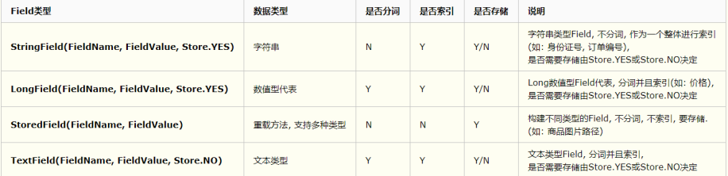

不切分->**精确查找**


```java
@SpringBootTest
class LucenedemoApplicationTests {

    @Autowired
    private JobInfoService jobInfoService;

    /**
     * 创建索引
     */
    @Test
    void create() throws IOException {
        //1.指定索引文件存储的位置，索引具体的表现形式就是一组有规则的文件
        Directory directory = FSDirectory.open(new File("D:/desktop/index"));
        //2.配置版本机器分词器
        Analyzer analyzer = new StandardAnalyzer();
        IndexWriterConfig config = new IndexWriterConfig(Version.LATEST, analyzer);
        //3.创建indexwriter对象，作用就是创建索引
        IndexWriter indexWriter = new IndexWriter(directory, config);
        //删除已经存在的索引库
        indexWriter.deleteAll();
        //4.获得索引源->原始数据
        List<JobInfo> jobInfoList = jobInfoService.selectAll();
        //一条记录对应  一个document对象
        //5.遍历jobinfolist，每次遍历创建一个document对象
        for(JobInfo jobInfo : jobInfoList){
            //创建document对象
            Document document = new Document();
            //创建field，添加到document中
            document.add(new LongField("id",jobInfo.getId(), Field.Store.YES));//Long能够被索引，通过id查询
            //切分词、索引、存储
            document.add(new TextField("companyName", jobInfo.getCompanyName(), Field.Store.YES));//公司名称需要切分词
            document.add(new TextField("companyAddress", jobInfo.getCompanyAddr(), Field.Store.YES));
            document.add(new TextField("companyInfo", jobInfo.getCompanyInfo(), Field.Store.YES));
            document.add(new TextField("jobName", jobInfo.getJobName(), Field.Store.YES));
            document.add(new TextField("jobAddr", jobInfo.getJobAddr(), Field.Store.YES));
            document.add(new TextField("jobInfo", jobInfo.getJobInfo(), Field.Store.YES));
            document.add(new IntField("salaryMin", jobInfo.getSalaryMin(), Field.Store.YES));
            document.add(new IntField("salaryMax", jobInfo.getSalaryMax(), Field.Store.YES));
            document.add(new StringField("url", jobInfo.getUrl(), Field.Store.YES));
            //将文档追加到索引库中
            indexWriter.addDocument(document);
        }
        //关闭资源
        indexWriter.close();
        System.out.println("create index success!");
    }
}
```


---

索引创建完成


生成的索引目录：D:\desktop\index

- **索引(Index)**：
  在Lucene中一个**索引是放在一个文件夹中**的。
  如下图，同一文件夹中的**所有的文件构成一个Lucene索引**。


- **段(Segment)**：
  - 按层次保存了从索引，一直到词的包含关系：索引(Index) –> 段(segment) –> 文档
    (Document) –> 域(Field) –> 词(Term)
  - 也即此索引包含了那些段，每个段包含了那些文档，每个文档包含了那些域，每个域包含了
    那些词。
  - **一个索引可以包含多个段**，段与段之间是**独立**的，添加新文档可以**生成新的段**，不同的段可
    以**合并**。
  - 如上图，具有相同前缀文件的**属同一个段，图中共一个段 "_0"** 。
    segments.gen和segments_1是段的**元数据文件**，也即它们保存了段的**属性**信息。  


## 3.4 查询索引


```java
@Test
public void query() throws IOException {
    //1.指定索引文件的存储为重，索引具体的表现信使就是一组有规则文件
    Directory directory = FSDirectory.open(new File("D:/desktop/index"));
    //2.读取索引对象，IndexReader
    IndexReader indexReader = DirectoryReader.open(directory);
    //3.创建查询对象 IndexSearcher
    IndexSearcher indexSearcher = new IndexSearcher(indexReader);
    //4.使用term查询  field名和值  公司名称中包含"北京"的所有的文档对象  "北京"一条都查不到。。
    Query query = new TermQuery(new Term("companyName","北"));
    //5.执行查询  展示100条数据
    TopDocs docs = indexSearcher.search(query, 100);
    //6.获得符合查询条件的文档数
    int totalHits = docs.totalHits;
    System.out.println("符合条件的文档数：" + totalHits);
    //7.获得命中的文档 id  封装了文档id信息
    ScoreDoc[] scoreDocs = docs.scoreDocs;
    for(ScoreDoc scoreDoc : scoreDocs){
        //文档id
        int docId = scoreDoc.doc;
        //通过文档id获得文档对象
        Document doc = indexSearcher.doc(docId);
        System.out.println("id：" +doc.get("id"));
        System.out.println("companyName：" +doc.get("companyName"));
        System.out.println("companyAddress：" +doc.get("companyAddress"));
        System.out.println("companyInfo：" +doc.get("companyInfo"));
        System.out.println("jobName：" +doc.get("jobName"));
        System.out.println("jobInfo：" +doc.get("jobInfo"));
        System.out.println("url：" +doc.get("url"));
        System.out.println("-----------------------------------------------------------------------------------------");
    }
    indexReader.close();
}
```


**分词算法有些问题，“北京“查询不到，使用”北“来查询**

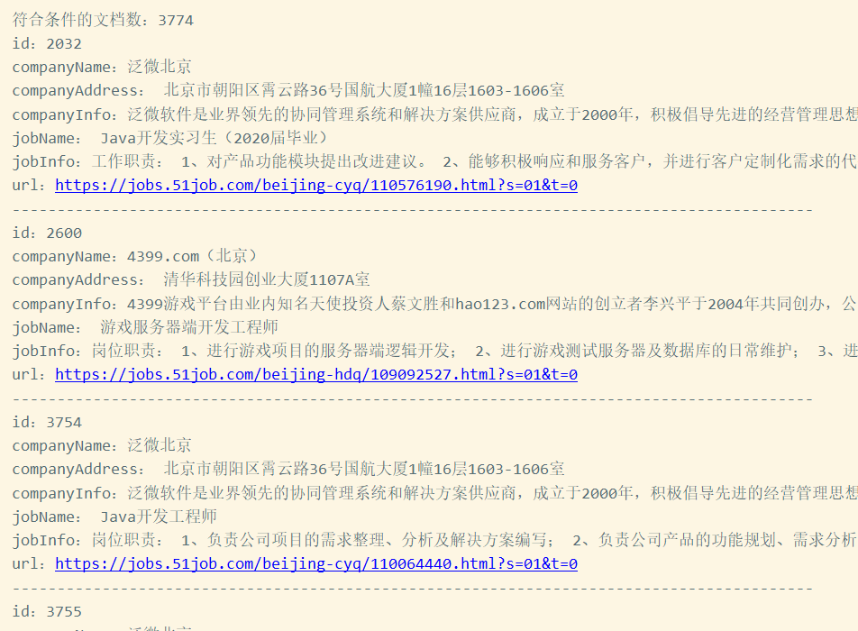


**默认的分词器对于中文不友好，只是按照  一个字  来分**，显然是不合适的，所以我们需要使用可以合理分词的分词器，其中最有名的是**IKAnalyzer分词器**  


## 3.5 中文分词器的使用


- 依赖

```xml
<dependency>
    <groupId>com.janeluo</groupId>
    <artifactId>ikanalyzer</artifactId>
    <version>2012_u6</version>
</dependency>
```


- 可以添加配置文件，放入resources文件夹中


- 修改所使用的分词器，重新建立索引

  ```java
  Analyzer analyzer = new IKAnalyzer();
  ```

- 再次使用“北京”来检索：

  


**问题：一个大型网站中的索引数据会很庞大的，所以使用lucene这种原生的写代码的方式就不
合适了，所以需要借助一个成熟的项目或软件来实现，目前比较有名是solr和elasticSearch，所以需要学习elasticSearch的使用。  **


# 4. ElasticSearch 介绍与安装


Elasticsearch是一个需要**安装配置的软件**。


**ELK技术栈：**

Elastic有一条完整的产品线：**Elasticsearch、Logstash、Kibana**等，前面说的三个就是大家常说的ELK技术栈（开源实时日志分析平台）。  


- Logstash 的作用就是一个数据收集器，将各种格式各种渠道的数据通过它**收集解析**之后**格式化输出到Elasticsearch** 
- 最后再由Kibana 提供的比较友好的 **Web 界面**进行汇总、分析、搜索。

- ELK 内部实际就是个**管道**结构，数据从 Logstash 到 Elasticsearch 再到 Kibana 做可视化展示。这三个组件各自也可以单独使用，比如 Logstash 不仅可以将数据输出到Elasticsearch ，也可以到数据库、缓存等  


## 4.1 简介


### 4.1.1 ElasticSearch


https://www.elastic.co/cn/products/elasticsearch  


功能：

- **分布式的搜索引擎**：百度、Google、站内搜索
- **全文检索**：提供**模糊搜索**等自动度很高的查询方式，并进行相关性排名，高亮等功能
- **数据分析**引擎（分组聚合）：电商网站的一周内手机销量Top10
- 对**海量数据**进行近乎**实时处理**：水平扩展，每秒钟可处理海量事件，同时能够自动管理索引查询在集群中的分布方式，以实现极其流畅的操作。  

----

如上所述，Elasticsearch具备以下特点：

- 高速、扩展性、最相关的搜索结果
- **分布式**：节点对外表现**对等**，每个节点都可以作为入口，加入节点**自动负载均衡**
- JSON：输入输出格式是**JSON**
- Restful风格，一切API都遵循Rest原则，容易上手
- 近**实时搜索**，数据更新在Elasticsearch中几乎是完全同步的，数据检索近乎实时
- 安装方便：没有其它依赖，下载后安装很方便，**简单修改几个参数就可以搭建集群**
- 支持**超大数据**：可以扩展到PB级别的结构化和非结构化数据  


## 4.2 安装和配置


在windows上安装elasticsearch

1. 解压压缩包。


2. 修改配置文件 `elasticsearch.yml`
   1. 修改索引数据和日志数据存储的路径


3. 双击bin目录下的命令文件 `elasticsearch.bat`


## 4.3 访问


可以看到绑定了两个端口:

- 9300：集群**节点间通讯接口**，接收tcp协议
- 9200：**客户端访问接口**，接收Http协议
- 在浏览器中访问：http://127.0.0.1:9200  


## 4.4 安装Kibana


Kibana是一个**基于Node.js**的Elasticsearch索引库数据统计工具，可以利用Elasticsearch的聚合功能，**生成各种图表，如柱形图，线状图，饼图等**。
而且还提供了操作Elasticsearch索引数据的**控制台**，并且提供了一定的API提示，非常有利于我们学习Elasticsearch的语法。  


1. 安装Node环境

   

2. 然后安装kibana，最新版本与elasticsearch保持一致，也是6.2.4  ，解压即可


3. 配置运行

   进入安装目录下的config目录，修改kibana.yml文件的第21行（注释放开即可）：  


4. 运行

   **需要先启动es服务器，再启动kibana客户端**

http://127.0.0.1:5601/

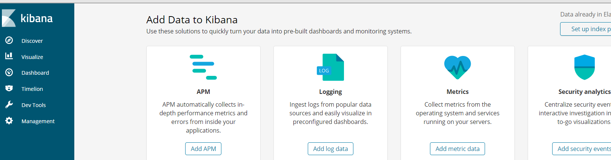


控制台：


**将请求发给es服务器进行处理**

可以向es发送请求，但是不用写es的地址，因为在配置文件中已经定义了es server的地址，只需要对应的uri和参数就可以，restful风格。

右侧显示结果，请求和响应都是json格式


## 4.5 安装ik分词器

默认效果：


----

Lucene的IK分词器早在2012年已经没有维护了，现在我们要使用的是在其基础上维护升级的版本，并且开发为Elasticsearch的集成插件了，与Elasticsearch一起维护升级，版本也保持一致  

https://github.com/medcl/elasticsearch-analysis-ik  


安装ik分词器，解压并且放入 `elasticsearch\elasticsearch-6.2.4\plugins`中，重启elasticsearch。


测试一下：

```json
GET /_analyze
{
  "analyzer": "ik_max_word",
  "text": "我是中国人"
}
```


samrt分词：


## 4.6 安装Head插件


elasticsearch-head 简介：
elasticsearch-head是一个**界面化**的**集群操作和管理工具**，可以对集群进行傻瓜式操作。你可以通过
插件把它集成到es（首选方式）,也可以安装成一个独立webapp。
es-head主要有三个方面的操作：

1. **显示集群的拓扑**,并且能够执行索引和节点级别操作

2. 搜索接口能够查询集群中原始json或表格格式的检索数据

3. 能够快速访问并显示集群的状态
   官方的文档： <https://github.com/mobz/elasticsearch-head>  


直接在谷歌商店中下载该插件：


# 移除type

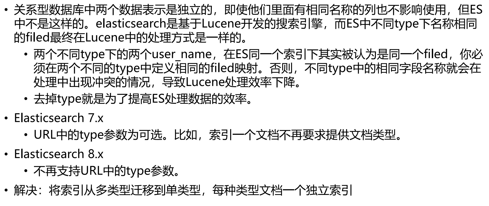


# 5.使用kibana对索引库操作  


## 5.1 基本概念


### 5.1.1.节点、集群、分片及副本  


1. **节点**

   **一个节点是一个Elasticsearch的实例。**
   在服务器上启动Elasticsearch之后，就拥有了一个节点。如果在另一台服务器上启动Elasticsearch，这就是另一个节点。甚至可以通过启动多个Elasticsearch进程，在**同一台服务器上拥有多个节点。**  


2. **集群**

   **多个协同工作的Elasticsearch节点的集合被称为集群。**
   在多节点的集群上，**同样的数据**可以在**多台服务器上传播**。这有助于性能。这同样有助于稳定性，如果每个分片至少有一个**副本**分片，那么任何一个节点**宕机后**，Elasticsearch依然可以进行服务，**返回所有数据**。
   但是它也有缺点：必须确定节点之间能够足够**快速地通信**，并且不会产生**脑裂效应**（集群的2个部分**不能彼此交流**，都认为对方宕机了）。  


3. **分片 shard**

   索引可能会存储大量数据，这些数据可能超过单个节点的硬件限制。例如，十亿个文档的单个索引占用了1TB的磁盘空间，可能**不适合单个节点的磁盘**，或者可能太慢而无法单独满足来自单个节点的搜索请求。
   为了解决此问题，Elasticsearch提供了**将索引细分为多个碎片**的功能。创建索引时，只需定义所需的**分片数量**即可。每个分片**本身就是一个功能齐全且独立的“索引”**，可以托管在群集中的任何节点上。
   分片很重要，主要有两个原因：

   - 允许**水平分割/缩放内容**量

   - 允许**跨碎片**（可能在多个节点上）分布和**并行化操作**，从而提高性能/吞吐量

   分片如何分布以及其文档如何**聚合**回到搜索请求中的机制完全由Elasticsearch管理，并且对用户是透明的。
   在随时可能发生故障的网络/云环境中，非常有用，强烈建议使用**故障转移**机制，以防碎片/节点**因某种原因脱机或消失**。为此，Elasticsearch允许您将**索引分片的一个或多个副本**制作为所谓的**副本分片**（简称副本）  


4. **副本**

   分片处理允许用户推送**超过单机容量**的数据至Elasticsearch集群。副本则解决了**访问压力过大**时**单机无法处理所有请求**的问题。

   分片可以是主分片，也可以是副本分片，其中副本分片是主分片的**完整副本**。副本分片用于搜索，或者是在原有的主分片丢失后成为新的主分片。

   注意：可以在任何时候改变每个分片的副本分片的数量，因为**副本分片总是可以被创建和移除的**。这并不适用于索引划分为主分片的数量，在创建索引之前，必须决定主分片的数量。过少的分片将限制可扩展性，但是过多的分片会影响性能。默认设置的5份是一个不错的开始。  


### 5.1.2 文档、类型、索引及映射  


1. **文档：**

   Elasticsearch是面向文档的，这意味着索引和搜索数据的最小单位是文档。
   在Elasticsearch中文档有几个重要的属性。

   - 它是**自我包含**的。一篇文档同时包含字段和它们的取值。
   - 它可以是层次的。文档中还包含新的文档，字段还可以包含其他字段和取值。如，“location”字段可以同时包含“city”和“street“两个字段。
   - 它拥有**灵活的结构**。文档不依赖于预先定义的模式。并非所有的文档都需要拥有相**同的字段**，它们不受限于**同一个模式**


2. **类型**

   **类型是文档的逻辑容器**，类似于**表格是行的容器**。在不同的类型中，最好放入**不同结构的文档**。例如，可以用一个类型定义聚会时的分组，而另一个类型定义人们参加的活动。  


3. **索引**

   **索引是类型的容器**。一个Elasticsearch索引是独立的大量的**文档集合**。 每个索引存储在磁盘上的同组文件中，**索引存储了所有映射类型的字段，还有一些设置。**  


4. **映射**

   所有文档在写入索引前都将被分析，用户可以设置一些参数，决定如何将输入文本**分割**为词条，哪些词条应该被过滤掉，或哪些附加处理**有必要被调用**（比如移除HTML标签）。这就是映射扮演的角色：**存储分析链所需的所有信息**。
   Elasticsearch也是基于Lucene的全文检索库，本质也是存储数据，很多概念与MySQL类似的。  


| 索引库 （indices)     | indices是index的复数，代表许多的索引，                       |
| --------------------- | ------------------------------------------------------------ |
| 概念                  | 说明                                                         |
| 类型（type）          | 类型是模拟mysql中的table概念，一个索引库下可以有**不同类型的索引**（目前 6.X以后的版本只能有一个类型），类似数据库中的表概念。数据库表中有表 结构，也就是表中每个字段的约束信息；索引库的类型中对应表结构的叫做 映 射(mapping) ，用来定义每个字段的约束。 |
| 文档 （document）     | 存入索引库原始的数据。比如每**一条商品信息**，就是一个文档   |
| 字段（field）         | 文档中的属性                                                 |
| 映射配置 （mappings） | **字段的数据类型、属性、是否索引、是否存储等特性**           |


## 5.2 创建索引库


**语法：**

Elasticsearch采用**Rest风格API**，因此其API就是一次**http请求**，你可以用**任何工具发起http请求**

(GET，DELETE，PUT)

创建索引的请求格式：

- 请求方式：PUT
- 请求路径：/索引库名
- 请求参数：json格式：

```
{
    "settings": {
    	"属性名": "属性值"
    }
}
```

settings：就是索引库设置，其中可以定义索引库的各种属性，目前我们可以不设置，都走默认  


---

**使用kibana创建**


## 5.3 查看索引库


Get请求可以帮我们查看索引信息，格式

```
GET /索引库名
```


## 5.4.删除索引库  


删除索引使用DELETE请求  

```
DELETE /索引库名
```


我们也可以用HEAD请求，查看索引是否存在


# 6.使用kibana对类型及映射操作  


有了 索引库 ，等于有了数据库中的 database 。接下来就需要索引库中的 **类型** 了，也就是数据库中的表 。创建数据库表需要**设置字段约束**，索引库也一样，在创建索引库的类型时，需要知道这个**类型下有哪些字段**，每个字段有**哪些约束信息**，这就叫做 **字段映射(mapping)**

注意：Elasticsearch7.x取消了索引type类型的设置，不允许指定类型，默认为_doc，但字段仍然是有的，我们需要设置字段的约束信息，叫做字段映射（mapping）
字段的约束在学习Lucene中见到过，包括但不限于：

- 字段的数据类型
- 是否要存储
- 是否要索引
- 是否分词
- 分词器是什么


## 6.1.创建字段映射  


请求方式依然是PUT  


```json
PUT /索引库名/_mapping/typeName
{
    "properties": {
        "字段名": {
            "type": "类型",
            "index": true，
            "store": true，
            "analyzer": "分词器"
        }
    }
}
```


类型名称：就是type的概念，类似于数据库中的**表**

**字段名**：**任意填写**，下面**指定许多属性**，例如：

- type：类型，可以是text、keyword、long、short、date、integer、object等
- index：是否索引，**默认为true**
- store：是否存储，默认为false
- analyzer：分词器，这里的 ik_max_word 即  使用ik分词器  


----

给aa这个索引库添加了一个名为 **goods 的类型**，并且在类型中设置了**3个字段**：

- title：商品标题
- images：商品图片
- price：商品价格
  并且给这些字段设置了一些属性  :

```json
PUT /aa/_mapping/goods
{
  "properties": {
    "title": {
      "type": "text", #进行切分词
      "analyzer": "ik_max_word"
    },
    "images": {
      "type": "keyword",
      "store": true,
      "index": false
    },
    "price":{
      "type": "float"
    }
  }
}
```


**创建的是映射mapping**


添加字段映射


更新字段映射：不能更新字段映射

创建新的索引，数据迁移：

- 没有类型


- 有类型type迁移：


## 6.2 查看映射关系

查看某个索引库中的所有类型的映射。如果要查看某个类型映射，可以再路径后面跟上**类型名称(goods)**。

```
GET /索引库名/_mapping
GET /索引库名/_mapping/类型名
```


## 6.3.映射属性详解  


### **type**

Elasticsearch中支持的数据类型非常丰富：  


String类型，又分两种：

- text：使用文本数据类型的字段，它们**会被分词**，文本字段不用于排序，很少用于聚合，如
  **文章标题、正文**。
- keyword：关键字数据类型，用于索引结构化内容的字段，**不会被分词**，必须**完整匹配**的内
  容，如**邮箱，身份证号**。支持聚合  

有的时候，对于一个字符串字段，我们可能希望他两种都支持，此时，可以利用其多字段特性  

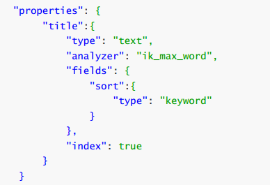


---

Numerical：数值类型，分两类

基本数据类型：long、interger、short、byte、double、float、half_float
double 双精度64位
float 单精度32位
half_float 半精度16位
浮点数的高精度类型：scaled_float
带有缩放因子的缩放类型浮点数，依靠一个 long 数字类型通过一个固定的(double 类型)**缩放因数**进行缩放.
需要指定一个精度因子，比如10或100。elasticsearch会把真实值**乘以这个因子后存储**，取出时**再还原**。  3.14 * 100   ->  315  **保持精度**


---

Date：日期类型  

elasticsearch可以对**日期格式化为字符串存储**，但是建议我们存储为**毫秒值**，存储为long，**节省**
**空间**。  


---

Array：数组类型

进行匹配时，**任意一个元素满足**，都认为满足
排序时，如果升序则用数组中的最小值来排序，如果降序则用数组中的最大值来排序  

```
字符串数组：["one", "two"]
整数数组：[1,2]
数组的数组：[1, [2, 3]]，等价于[1,2,3]
对象数组：[ { "name": "Mary", "age": 12 }, { "name": "John", "age": 10 }]
```


---

Object：对象

JSON文档本质上是**分层的**：文档包含内部对象，内部对象本身还包含**内部对象**  


---


ip地址：


### index

index影响字段的索引情况。

true：字段**会被索引**，则可以用来进行搜索过滤。默认值就是true，**只有当某一个字段的index值
设置为true时，检索ES才可以作为条件去检索**。
false：字段不会被索引，**不能用来搜索**

index的默认值就是true，也就是说你不进行任何配置，所有字段都会被索引。

但是有些字段是我们**不希望被索引**的，比如商品的图片信息（**URL**），就需要手动设置index为false。  


### store

是否将数据进行**额外存储**。


在学习lucene时，我们知道如果一个字段的store设置为false，那么在**文档列表中就不会有这个字段**的值，用户的搜索结果中**不会显示出来**。


但是在Elasticsearch中，即便store设置为false，**也可以搜索到结果**。
原因是Elasticsearch在创建文档索引时，会将文档中的原始数据**备份**，保存到一个叫做 _source 的属性中。而且我们可以通过过滤 _source 来**选择哪些要显示，哪些不显示**。

而如果设置store为true，就会在 _source 以外**额外存储**一份数据，多余，因此一般我们都会将store设置为false，事实上，**store的默认值就是false**。

在某些情况下，这对 store 某个领域可能是有意义的。例如，如果您的文档包含一个 title ，一个
date 和一个非常大的 content 字段，则可能只想检索the title 和the date 而  不必从一个大 _source字段中提取这些字段  

**额外存储需要高频访问的数据，_source中的数据量很大，可以在额外存储的数据中访问，**

```json
PUT my_index
{
    "mappings": {
        "_doc": {
            "properties": {
                "title": {
                    "type": "text",
                    "store": true
            	},
                "date": {
                    "type": "date",
                    "store": true
                },
                "content": {
                    "type": "text"
                }
            }
        }
    }
}
```

**避免去_source存储全部的文件中去访问，更快更高效！**


### boost


**网站权重**:

网站权重是指搜索引擎给网站（包括网页）赋予一定的**权威值**，对网站（含网页）权威的评估评价。一个网站权重越高，**在搜索引擎所占的份量越大**，在搜索引擎**排名就越好**。提高网站权重，不但利于网站（包括网页）**在搜索引擎的排名更靠前**，还能提高整站的流量，提高网站信任度。所以提高网站的权重具有相当重要的意义。 权重即网站在SEO中的重要性，权威性。英文：Page Strength。

1、权重不等于排名 

2、权重对排名有着非常大的影响 

3、整站权重的提高有利于内页的排名。  


权重，新增数据时，可以指定该数据的权重，**权重越高，得分越高，排名越靠前**。  

```json
PUT my_index
{
    "mappings": {
        "_doc": {
            "properties": {
            	"title": {
                    "type": "text",
                    "boost": 2
                },
                "content": {
                	"type": "text"
                }
            }
        }
    }
}
```

title 字段上的匹配项的权重是content字段上的匹配项的权重的两倍 content ，默认 boost 值为 1.0 。

**该term对应的文档优先展示**

提升仅适用于**Term查询**（不提升prefix，range和模糊查询）。  


## 6.4 一次创建索引库和类型


先创建索引库，后创建类型-字段


```json
PUT /hcr2
{
  "settings": {
    
  },
  "mappings": {
    "goods":{
      "properties": {
        "title":{
          "index": true,
          "store": true,
          "analyzer": "ik_max_word",
          "type": "text"
        },
        "price":{
          "index": true,
          "store": true,
          "type": "float"
        }
      }
    }
  }
}
```


# 7.使用kibana对文档操作  


文档，即索引库中**某个类型下**的数据，会根据规则创建索引，将来用来搜索。可以类比做数据库中的**每一行数据。**  


## 7.1.新增文档  


### 7.1.1 新增并随机生成id  


通过POST请求，可以向一个**已经存在的索引库中添加文档数据**。  


```json
POST /索引库名/类型名
{
	"key":"value"
}
```


_id：生成的ID，如果不指定就帮你生成，字符串类型，base64编码，长度20，分布式环境中生成不会重复，是这条文档数据的 **唯一标示** ，以后的增删改查都**依赖这个id作为唯一标示**  


## 7.2 查看文档

新增是post，查询是get  

`GET /hcr2/goods/pIQGNngBavn4q14kklX_`

或者： `GET /hcr2/goods/_search`


- _source ：源文档信息，**所有的数据(无论store是否为true)**都在里面。

- id ：**这条文档的唯一标示**

- **自动生成的id**,长度为20个字符，URL安全，base64编码，GUID（**全局唯一标识符**）,分布式系统并行生成时**不可能会发生冲突**

- 在实际开发中不建议使用ES生成的ID，**太长**且为字符串类型，检索时效率低。

- > 建议：**将数据表中唯一的ID，作为ES的文档ID**  


## 7.3新增文档并自定义id  


如果我们想要自己新增的时候指定id，可以这么做：  

```json
POST /索引库名/类型/id值
{
	...
}
```

**在类型后面追加一个id：**

```json
POST /hcr2/goods/1
{
  "title": "MacBook Pro M1",
  "image": "M1.jpg",
  "price": 13999.9
}
```


## 7.4 更新数据  


**PUT：修改文档**
**POST：新增文档**

- 带_update
- 不带_update

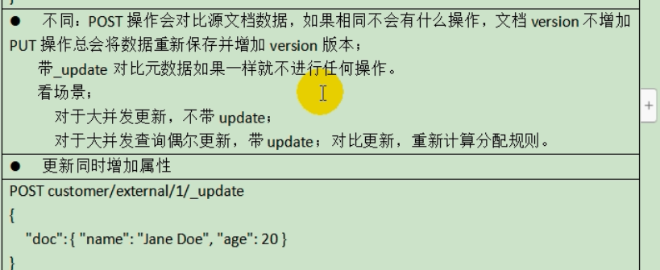


把刚才新增的请求方式改为PUT，就是修改了。不过**修改必须指定id**，

- id对应文档存在，则修改

- id对应文档**不存在，则新增**，（**使用post新增**）

  比如，我们把使用id为2，**不存在，则应该是新增**


## 7.5 删除文档


需要根据id进行删除：  

```
DELETE /索引库名/类型名/id值  
```


## 7.6 智能判断  


刚刚我们在新增数据时，添加的**字段都是提前在类型中定义过**的，如果我们**添加的字段并没有提前定义过**，能够成功吗？
事实上Elasticsearch非常智能，你**不需要给索引库设置任何mapping映射**，它**也可以根据你输入的数据来判断类型**，**动态添加数据映射**。  


**插入新字段的时候还更改了索引库的结构**

自动为stock字段设定类型

**为数字生成long类型，在匹配的类型中选择范围最大的作为新建的mapping字段的类型**


**ES考虑到字符串有可能分词或者不分词两种情况，所以只能同时满足两种情况**

如果当此字段的**字符个数大于256**后，将**不被索引**


image是String类型数据，ES无法智能判断，它就会**存入两个字段**。例如：

- image：**text类型**
- image.keyword：**keyword类型**


这种智能映射，底层原理是动态模板映射，如果我们想修改这种智能映射的规则，其实只要修改动态模板即可！  **不建议使用！**


## 7.7 动态映射模板  


动态模板的语法：


可以定义多个动态模板。

1）模板名称，随便起
2）匹配条件，凡是符合条件的未定义字段，都会**按照这个规则来映射**
3）映射规则，匹配成功后的映射规则
举例，我们可以把所有未映射的string类型数据自动映射为keyword类型：  


```json
PUT hcr4
{
  "mappings": {
    "goods":{
      "properties": {
        "title":{
          "type": "text",
          "index": true ,
          "store": true
        }
      },
      "dynamic_templates": [
       {
         "string_template": {
           "match_mapping_type": "string",
           "mapping": {
             "type": "keyword"
           }
         }
       }
      ]
    }
  }
}
```


这样，未知的string类型数据就**不会被映射为text和keyword并存**，而是**统一以keyword**来处理！  


## 7.8 bulk批量api


# 8.查询


- 基本查询
- 结果过滤
- 高级查询
- 排序


## 8.1 基本查询


```json
GET /索引库名/_search
{
    "query":{
        "查询类型":{
            "查询条件":"查询条件值"
        }
    }
}
```


这里的query代表一个查询对象，里面可以有不同的查询属性
查询类型：
例如： **match_all ， match ， term ， range** 等等
查询条件：查询条件会根据类型的不同，写法也有差异，后面详细讲解  


### 查询所有


```json
GET hcr2/_search
{
  "query": {
    "match_all": {}
  }
}
# 等同于
GET hcr2/goods/_search
```


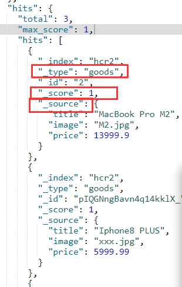

took：查询花费时间，单位是毫秒
time_out：是否超时
_shards：分片信息
hits：搜索结果总览对象
	total：搜索到的总条数
	max_score：所有结果中文档得分的最高分
	hits：搜索结果的文档对象数组，每个元素是一条搜索到的文档信息
	_index：索引库
	_type：文档类型
	_id：文档id
	_score：文档得分
	_source：文档的源数据  


**文档得分：使用ES时，对于查询出的文档无疑会有文档相似度之别。而理想的排序是和查询条件相关性越高排序越靠前，而这个排序的依据就是_score**  


### 匹配查询match


- or关系


match 类型查询，会把查询条件进行分词，然后进行查询,多个词条之间是or的关系  


```json
GET /hcr2/_search
{
  "query": {
    "match": {
      "title": "手机"
    }
  }
}
```


**会分别拿着huawei，手机  去索引库中检索，会得到两个结果集，做并集，合为一个**

**多个词之间是 or 的关系**  


----

- and关系


某些情况下，我们需要**更精确查找**：比如在**电商平台精确搜索商品**时，我们希望这个关系（查询条件切分词之后的关系）变成 **and** （既要满足你，又要满足我），可以这样做  ：

```json
GET /hcr2/_search
{
  "query": {
    "match": {
      "title": {
        "operator": "and",
        "query": "huawei手机"
      }
    }
  }
}
```


**本例中，只有同时包含"huawei"和"手机"才会被检索到并返回**


.keyword，精确检索。必须完全相等

match_phrase:包含就可以查出


### 词条匹配(term)  


term 查询被用于**精确值 匹配**，这些**精确值**可能是数字、时间、布尔或者那些**未分词**的字符
串,**keyword类型**的字符串

效果类似于：`select * from tableName where colName='value';`  **在数据库中这样查询必须精确匹配，不能是包含，一定是完全相等**

**由于es会进行分词，就算使用了完整的词，也不一定能检索到结果，数字类型可以**

```json
GET /hcr2/_search
{
  "query": {
    "term": {
      "price": 13999.9
    }
  }
}
```


**非text的->数字，都使用term进行查询**，文本字段使用match


### 布尔组合（bool)  


bool 把各种其它查询通过 **must （与）、 must_not （非）、 should （或）**的方式进行组合  


```json
GET /hcr2/_search
{
  "query": {
    "bool": {
      "must": {
        "match": {
          "title": "小米"
        }
      },
      "must_not": {
        "match": {
          "title": "电视"
        }
      },
      "should": {
        "match": {
          "title": "手机"
        }
      }
    }
  }
}
```


### 范围查询range


range 查询找出那些落在指定区间内的数字或者时间  


```json
GET /hcr2/_search
{
  "query": {
    "range": {
      "price": {
        "gte": 4999,
        "lte": 13999.99
      }
    }
  }
}
```


| 操作符 | 说明     |
| ------ | -------- |
| gt     | 大于     |
| gte    | 大于等于 |
| lt     | 小于     |
| lte    | 小于等于 |


### 模糊查询(fuzzy)  


fuzzy 查询是 term 查询的模糊等价，很少直接使用它  


```json
GET /hcr2/_search
{
  "query": {
    "fuzzy": {
      "title": "macboab"
    }
  }
}
```


fuzzy 查询是 term 查询的模糊等价。它允许用户搜索词条与实际词条的**拼写出现偏差**，但是偏差的
**编辑距离不得超过2**：  


## 8.2 结果过滤


默认情况下，elasticsearch在搜索的结果中，会把文档中**保存在 _source 的所有字段都返回**。

如：


如果我们只想获取其中的**部分字段**，我们可以添加 **_source 的过滤**  


### 直接指定字段  


```json
GET /hcr2/_search
{
  "_source": ["price", "title"],
  "query": {
    "match": {
      "title": "手机"
    }
  }
}
```


**在_source部分只展示指定需要展示的字段**


### 指定includes和excludes  


也可以通过：

- **includes**：来指定想要显示的字段

- **excludes**：来指定不想要显示的字段

  二者都是可选的。  


```json
GET /hcr2/_search
{
  "_source": {
    "includes": ["title", "image"],
    "excludes": ["image"]
  },
  "query": {
    "match": {
      "title": "手机"
    }
  }
}
```


## 8.3 过滤Filter


Elasticsearch 使用的查询语言（DSL）拥有一套**查询组件**，这些组件可以以**无限组合**的方式进行搭配。
这套组件可以在以下两种情况下使用：**过滤情况（filtering context）和查询情况（query context）**。  


如何选择查询与过滤：

通常的规则是，**使用查询（query）语句**来进行 **全文搜索**或者其它任何需要**影响 相关性得分** 的搜索。

除此以外的情况都使用过滤（filters)。


---

- 条件查询中进行过滤

  所有的查询都会影响到***文档的评分及排名***。如果我们需要**在查询结果中进行过滤**，并且不希望过滤条件影响评分，那么就**不要把过滤条件作为查询条件来用**。而是**使用 filter 方式**：  


```json
GET /hcr2/_search
{
  "query": {
    "bool": {
      "must": {
        "match": {
          "title": "手机"
        }
      },
      "filter": {
        "range": {
          "price": {
            "gte": 13000,
            "lte": 15000
          }
        }
      }
    }
  }
}
```

先全文搜索，查询索引“手机”，再进行过滤


- 无查询条件，直接过滤

如果一次查询**只有过滤**，**没有查询条件**，***<u>不希望进行评分</u>***，我们可以使用 `constant_score` 取代只有filter 语句的 bool 查询。在性能上是完全相同的，但对于提高查询简洁性和清晰度有很大帮助。  

`"constant_score"`

```json
GET /hcr2/_search
{
  "query": {
    "constant_score": {
      "filter": {
        "range": {
          "price": {
            "gte": 13000,
            "lte": 15000
          }
        }
      }
    }
  }
}
```


只有上面一个是查询，剩下的都是对查询结果进行过滤。

**在电商网站搜索商品：全文搜索->查询**，会涉及到排名

**选择特定品牌 -> 过滤！**，


## 8.4 排序


### 单字段排序


**sort** 可以让我们按照不同的字段进行排序，并且通过 **order 指定排序的方式**  


**有了查询结果才能进行排序**


```json
GET /hcr2/_search
{
  "query": {
    "match": {
      "title": "小米手机"
    }
  },
  "sort": [
    {
      "_score": {
        "order": "desc"
      }
    }
  ]
}
```


- desc：降序
- asc：升序


### 多字段排序  


假定我们想要结合使用 price和 _score（得分） 进行查询，并且匹配的结果首先按照价格排序，然后按照相关性得分排序：  


```json
GET /hcr2/_search
{
  "query": {
    "match": {
      "title": "小米手机"
    }
  },
  "sort": [
    {
      "_score": {
        "order": "desc"
      }
    },
    {
      "price": {
        "order": "desc"
      }
    }
  ]
}
```

**当前一个字段一样的情况下，再进行下一个字段的排序**


## 8.5 分页


Elasticsearch中数据都**存储在分片**中，当执行搜索时**每个分片独立搜索**后，数据再经过**整合返回**。那么，如果要实现分页查询该怎么办呢？

elasticsearch的分页与mysql数据库非常相似，都是指定两个值：

- **from**：目标数据的偏移值（开始位置），默认from为0
- **size**：每页大小  


```json
GET /hcr2/_search
{
  "query": {
    "match": {
      "title": "手机"
    }
  },
  "sort": [
    {
      "_score": {
        "order": "desc"
      }
    },
    {
      "price": {
        "order": "desc"
      }
    }
  ],
  "from": 0,
  "size": 3
}
```

**查询前三条↑**


from 3 size 3：查询4-6条


## 8.6 高亮  


高亮原理：

- 服务端搜索数据，得到**搜索结果**
- 把搜索结果中，**搜索关键字**都加上**约定好的标签**
- 前端页面提前写好标签的**CSS样式**，即可**高亮**


elasticsearch中实现高亮的语法比较简单：  

```json
GET /hcr2/_search
{
  "query": {
    "match": {
      "title": "手机"
    }
  },
  "highlight": {
    "pre_tags": "<em>",
    "post_tags": "</em>",
    "fields": {
      "title": {}
    }
  }
}
```

**高亮需要定义标签，需要经过浏览器渲染。**

**并且只会高亮查询的条件term，匹配的才进行高亮**

在使用match查询的同时，加上一个highlight属性：
pre_tags：前置标签
post_tags：后置标签
fields：需要高亮的字段
title：这里声明title字段需要高亮  


# 9. 聚合aggregations  


聚合可以让我们极其方便的实现对数据的**统计、分析**。例如：

- 什么品牌的手机最受欢迎？
- 这些手机的平均价格、最高价格、最低价格？
- 这些手机每月的销售情况如何？


实现这些统计功能的比数据库的sql要方便的多，而且查**询速度非常快，可以实现近实时搜索效果**。


## 9.1 基本概念


Elasticsearch中的聚合，包含多种类型，最常用的两种，一个叫 **桶** ，一个叫 **度量** ：


- **桶（bucket）** 类似于 `group by`
  桶的作用，是按照**某种方式对数据进行分组**，**每一组数据在ES中称为一个 桶** ，

  例如我们根据国籍对人划分，可以得到 中国桶 、 英国桶 ， 日本桶 ……

  或者我们按照年龄段对人进行划分：
  0 ~ 10,10 ~ 20,20 ~ 30,30 ~ 40等。
  Elasticsearch中提供的划分桶的方式有很多：

  - Date Histogram Aggregation：根据日期阶梯分组，例如**给定阶梯**为周，会自动每周分为一组
  - Histogram Aggregation：根据**数值阶梯**分组，与日期类似，需要知道分组的间隔（interval）  
  - Terms Aggregation：根据**词条内容**分组，词条内容完全匹配的为一组
  - Range Aggregation：数值和日期的**范围**分组，指定开始和结束，然后按段分组  


bucket aggregations **只负责对数据进行分组，并不进行计算**，因此往往bucket中往往会嵌套另一种聚合：metrics aggregations即度量  


- **度量metrics**，相当于聚合的结果

  分组完成以后，我们一般会对组中的数据进行**聚合运算**，例如求**平均值、最大、最小、求和等**，这些在ES中称为 **度量**
  比较常用的一些度量聚合方式：

  - Avg Aggregation：求平均值
  - Max Aggregation：求最大值
  - Min Aggregation：求最小值
  - Percentiles Aggregation：求百分比
  - Stats Aggregation：同时返回avg、max、min、sum、count等
  - Sum Aggregation：求和
  - Top hits Aggregation：求前几
  - Value Count Aggregation：求总数  


测试：

```json
PUT /car
{
  "mappings": {
    "orders":{
      "properties": {
        "color":{
          "type": "keyword"
        },
        "make":{
          "type": "keyword"
        }
      }
    }
  }
}
```

**注意**：在ES中，需要进行**聚合、排序、过滤**的字段其处理方式比较特殊，因此**不能被分词**，必须使用**keyword（`fieldName.keyword`或者直接设置为keyword） 或 数值类型** 。这里我们将color和make这两个文字类型的字段设置为keyword类型，这个类型**不会被分词，将来就可以参与聚合**  


添加数据：

```java
POST /car/orders/_bulk
{ "index": {}}
{ "price" : 10000, "color" : "红", "make" : "本田", "sold" : "2020-10-28" }
{ "index": {}}
{ "price" : 20000, "color" : "红", "make" : "本田", "sold" : "2020-11-05" }
{ "index": {}}
{ "price" : 30000, "color" : "绿", "make" : "福特", "sold" : "2020-05-18" }
{ "index": {}}
{ "price" : 15000, "color" : "蓝", "make" : "丰田", "sold" : "2020-07-02" }
{ "index": {}}
{ "price" : 12000, "color" : "绿", "make" : "丰田", "sold" : "2020-08-19" }
{ "index": {}}
{ "price" : 20000, "color" : "红", "make" : "本田", "sold" : "2020-11-05" }
{ "index": {}}
{ "price" : 80000, "color" : "红", "make" : "宝马", "sold" : "2020-01-01" }
{ "index": {}}
{ "price" : 25000, "color" : "蓝", "make" : "福特", "sold" : "2020-02-12" }
```


## 9.2 聚合为桶  


首先，我们按照 **汽车的颜色 color**来 **划分 桶** ，按照颜色分桶，最好是使用**TermAggregation**类型，按照**颜色的名称来分桶。**  


```json
GET /car/_search
{
  "size": 0,
  "aggs": {
    "popular_colors": {
      "terms": {
        "field": "color"
      }
    }
  }
}
```


size： 查询条数，这里设置为0，因为我们**不关心搜索到的数据**，只关心**聚合结果(就是每一个类都有多少个文档，但不关心文档的内容)**，不展示具体_source数据，提高效率

aggs：声明这是一个聚合查询，是aggregations的缩写

- popular_colors：**给这次聚合起一个名字**，可任意指定。

- **terms：聚合的类型**，这里选择**terms**，是根据**词条内容**（这里是颜色）**划分**

- field：划分桶时**依赖的字段**  


hits：**查询结果**为空，因为我们设置了**size为0**

aggregations：**聚合的结果**，和查询结果不同！

popular_colors：我们定义的聚合名称

- buckets：查找到的桶，**每个不同的color字段值都会形成一个桶**
  - **key**：这个桶对应的color**字段的值**
  - **doc_count**：这个桶中的文档数量

通过聚合的结果我们发现，目前红色的小车比较畅销！  


## 9.3 桶内度量  


前面的例子告诉我们**每个桶里面的文档数量**，这很有用。 但通常，我们的应用需要提供更复杂的文档度量。 例如，**每种颜色汽车的平均价格**是多少？
因此，我们需要告诉Elasticsearch **使用哪个字段** ， 使用**何种度量方式** 进行运算，这些信息要**嵌套在 桶内， 度量 的运算会基于 桶 内的文档进行**


现在，我们为刚刚的聚合结果添加 求价格平均值的度量：  


```json
GET /car/_search
{
  "size": 0,
  "aggs": {
    "popular_colors": {
      "terms": {
        "field": "color"
      },
      "aggs": {
        "avg_price": {
          "avg": {
            "field": "price"
          }
        }
      }
    },
    "popular_makes": {
      "terms": {
        "field": "make"
      }
    }
  }
}
```


aggs：我们在上一个aggs(popular_colors)中添加新的aggs。可见度量也是一个聚合

- avg_price：聚合的名称

- avg：度量的类型，这里是求平均值

- field：**度量运算的字段**  

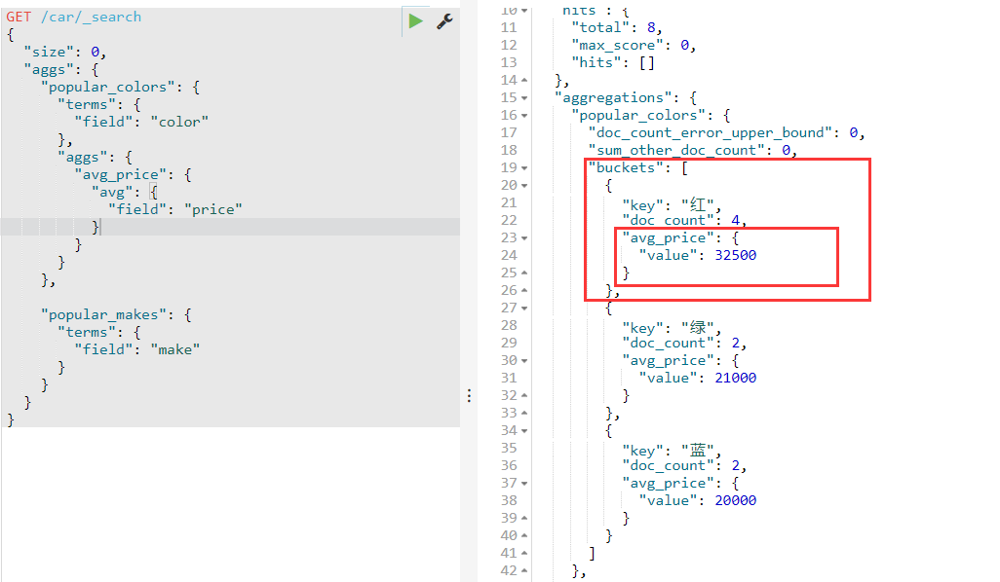

每个桶中都有自己的 avg_price 字段，这是度量聚合的结果  


# 10.Elasticsearch集群  


## 10.1.单点的问题  

单点的elasticsearch存在哪些可能出现的问题？

- 单台机器**存储容量**有限，无法实现**高存储**
- 单服务器容易出现**单点故障**，无法实现**高可用**
- 单服务的**并发处理能力**有限，无法实现**高并发**


所以，为了应对这些问题，我们需要对elasticsearch搭建集群  


## 10.2.集群的结构  


### 数据分片  


首先，我们面临的第一个问题就是**数据量太大**，**单点存储量有限**的问题。  


可以把数据拆分成多份，每一份存储到不同机器节点（node），从而实现**减少每个节点数据量**的目的。这就是**数据的分布式存储**，也叫做： **数据分片（Shard）** 。  


假如只有三个分片：将每一个分片放到不同的集群节点中，以此实现高存储

例如：每个节点都存放10T的索引库，这样，es集群就拥有了30T的数据存储


**问题？**

例如node3**宕机**了，那么整个集群构成的索引库就**不完整了**，有些数据就无法检索到。


### 数据备份  


数据分片解决了海量数据存储的问题，但是如果出现**单点故障**，那么**分片数据就不再完整**，这又该如何解决呢？
没错，就像备份手机数据，会额外存储一份到移动硬盘一样。我们可以**给每个分片数据进行备份**，**存储到其它节点**，**防止数据丢失**，这就是数据备份，也叫 **数据副本（replica）** 。
数据备份可以保证高可用，但是每个分片备份一份，所需要的节点数量就会翻一倍，成本实在是太高了！


为了在**高可用和成本**间寻求平衡，我们可以这样做：
首先对数据分片，存储到不同节点
然后对每个分片进行备份，放到对方节点，完成**互相备份**
这样可以大大减少所需要的服务节点数量，如图，我们以3分片，每个分片备份一份为例  

每个节点上备份一份数据，集群的**每个节点备份的数据互不相同**。


在这个集群中，如果出现**单节点故障**，并**不会导致数据缺失**，所以保证了**集群的高可用**，同时也减少了节点中数据存储量。并且因为是多个节点存储数据，因此用户请求也会分发到不同服务器，并发能力也得到了一定的提升。  


## 10.3 搭建集群  


集群需要**多台机器**，我们这里用**一台机器来模拟**，因此我们需要在一台虚拟机中**部署多个elasticsearch节点**，**每个elasticsearch的端口都必须不一样。**

一台机器进行模拟：将我们的ES的安装包复制三份，修改端口号，data和log存放位置的不同。

实际开发中：将每个ES节点放在不同的服务器上。


我们计划集群名称为：hcr-elastic，部署3个elasticsearch节点，分别是：
node-01：http端口9201，TCP端口9301
node-02：http端口9202，TCP端口9302
node-03：http端口9203，TCP端口9303


- http：表示使用**http协议进行访问时使用 端口**，elasticsearch-head、kibana、postman，默认端口号是**9200**。
- tcp：集群间的**各个节点进行通讯**的端口，默认**9300**  


1. 复制粘贴es软件3次


2. 修改每一个节点的配置文件 config下的elasticsearch.yml 。


node1：

```yaml
#允许跨域名访问
http.cors.enabled: true
#当设置允许跨域，默认为*,表示支持所有域名
http.cors.allow-origin: "*"
#允许所有节点访问
network.host: 0.0.0.0
# 集群的名称，同一个集群下所有节点的集群名称应该一致
cluster.name: hcr-elastic
#当前节点名称 每个节点不一样
node.name: node-01
#数据的存放路径 每个节点不一样，不同es服务器对应的data和log存储的路径不能一样
path.data: E:\elasticsearch\es-9201\data
#日志的存放路径 每个节点不一样
path.logs: E:\elasticsearch\es-9201\log
# http协议的对外端口 每个节点不一样，默认：9200
http.port: 9201
# TCP协议对外端口 每个节点不一样，默认：9300
transport.tcp.port: 9301
#三个节点相互发现，包含自己，使用tcp协议的端口号
discovery.zen.ping.unicast.hosts: ["127.0.0.1:9301","127.0.0.1:9302","127.0.0.1:9303"]
#声明大于几个的投票主节点有效，请设置为（nodes / 2） + 1
discovery.zen.minimum_master_nodes: 2
# 是否为主节点
node.master: true
```


node2:

```yaml
#允许跨域名访问
http.cors.enabled: true
#当设置允许跨域，默认为*,表示支持所有域名
http.cors.allow-origin: "*"
#允许所有节点访问
network.host: 0.0.0.0
# 集群的名称，同一个集群下所有节点的集群名称应该一致
cluster.name: hcr-elastic
#当前节点名称 每个节点不一样
node.name: node-02
#数据的存放路径 每个节点不一样，不同es服务器对应的data和log存储的路径不能一样
path.data: E:\elasticsearch\es-9202\data
#日志的存放路径 每个节点不一样
path.logs: E:\elasticsearch\es-9202\log
# http协议的对外端口 每个节点不一样，默认：9200
http.port: 9202
# TCP协议对外端口 每个节点不一样，默认：9300
transport.tcp.port: 9302
#三个节点相互发现，包含自己，使用tcp协议的端口号
discovery.zen.ping.unicast.hosts: ["127.0.0.1:9301","127.0.0.1:9302","127.0.0.1:9303"]
#声明大于几个的投票主节点有效，请设置为（nodes / 2） + 1
discovery.zen.minimum_master_nodes: 2
# 是否为主节点
node.master: true
```


node3:

```yaml
#允许跨域名访问
http.cors.enabled: true
#当设置允许跨域，默认为*,表示支持所有域名
http.cors.allow-origin: "*"
#允许所有节点访问
network.host: 0.0.0.0
# 集群的名称，同一个集群下所有节点的集群名称应该一致
cluster.name: hcr-elastic
#当前节点名称 每个节点不一样
node.name: node-03
#数据的存放路径 每个节点不一样，不同es服务器对应的data和log存储的路径不能一样
path.data: E:\elasticsearch\es-9203\data
#日志的存放路径 每个节点不一样
path.logs: E:\elasticsearch\es-9203\log
# http协议的对外端口 每个节点不一样，默认：9200
http.port: 9203
# TCP协议对外端口 每个节点不一样，默认：9300
transport.tcp.port: 9303
#三个节点相互发现，包含自己，使用tcp协议的端口号
discovery.zen.ping.unicast.hosts: ["127.0.0.1:9301","127.0.0.1:9302","127.0.0.1:9303"]
#声明大于几个的投票主节点有效，请设置为（nodes / 2） + 1
discovery.zen.minimum_master_nodes: 2
# 是否为主节点
node.master: true
```

**一定要注意每个节点的目录不同，http和tcp端口都不同！**


3. 启动集群

在 `elasticsearch-head`插件中查看集群信息：


## 10.4 测试集群中创建索引库  


修改kibana的配置，再重启  


```
PUT /hcr
{
    "settings": {
        "number_of_shards": 3,
        "number_of_replicas": 1
    }
}
```

settings：就是索引库设置，其中可以定义索引库的各种属性，目前我们可以不设置，都走默认。  

- number_of_shards：分片数量，这里设置为3  

- number_of_replicas：副本数量，这里设置为1，每个分片一个备份，一个原始数据，共2份  


---


搭建集群以后就要创建索引库了，那么问题来了，当我们创建一个索引库后，数据会保存到哪个服务节点上呢？如果我们对索引库分片，那么每个片会在哪个节点呢？  

在head插件中新建索引：


**并且原始分片和副本分片不可能存储在一个节点上，保证高可用**


编辑操作针对原始分片，如果原始分片宕机？副本分片就变成原始分片

如果分成5个分片呢？


各个分片和副本分片也会 **尽可能均匀分布**

在head插件可以很轻松删除、创建索引。


查询也很方便！


## 10.5 集群工作原理  


### shard与replica机制  


（1）一个index包含**多个shard**,也就是**一个index存在多个服务器上**

（2）每个shard都是一个最小工作单元，**承载部分数据**，比如有三台服务器,现在有三条数据,这三条数据在三台服务器上**各放一条**.

（3）增减节点时，shard会自动在nodes中**负载均衡**

（4）primary shard（主分片）和replica shard（副本分片），**每个document肯定只存在于某一个primary shard以及其对应的replica shard中，不可能存在于多个primary shard**

（5）replica shard是primary shard的**副本**，负责**容错**，以及承担**读请求**负载。**只会写在主分片上，同步到副本分片，但可以从副本分片上读取！**

（6）primary shard的数量在**创建索引的时候就固定**了，replica shard的数量可以**随时修改**

（7）**primary shard的默认数量是5，replica默认是1**（*每个主分片一个副本分片* ），默认有10个
shard，5个primary shard，5个replica shard

（8）primary shard不能和自己的replica shard放在**同一个节点**上（否则节点宕机，primary shard和副本**都丢失，起不到容错的作用**），但是可以和**其他**primary shard的replica shard放在同一个节点上  


### 集群写入数据  

`post document`

1. 客户端**选择一个node发送请求**过去，这个node就是**coordinating node** (**协调节点**)
2. coordinating node，**对document进行路由**，将请求**转发给对应的node**。（根据一定的算法**选择对应的节点进行存储**）
3. 实际上的node上的**primary shard**处理请求**将数据保存在本地**，然后将数据**同步到replica node**
4. coordinating node，如果发现primary node和所有的replica node**都搞定之后**，就会**返回请求**到客户端  

**任何一个节点都可以接收请求，但不确定是谁最终处理**

选择存储在哪台节点上：

**这个路由简单的说就是取模算法,比如说现在有3台服务器,这个时候传过来的id是5,那么5%3=2,就
放在第2台服务器  **


### ES查询数据  


- **倒排序算法**

查询有个算法叫倒排序:简单的说就是:通过分词把**词语出现的文档id**进行记录下来,再查询的时候先去查到**哪些id包含这个数据,**然后再**根据id把数据查出来**


- **查询过程**

1. 客户端发送一个请求给coordinate node协调节点

2. 协调节点将搜索的请求**转发**给**所有的shard**对应的primary shard 或replica shard
3. **query phase（查询阶段）**：每一个shard 将**自己搜索的结果**（其实也就是一些唯一标识），返回给**协调节点**，由**协调节点**进行数据的**合并，排序，分页**等操作，产出最后的结果

4. fetch phase（获取阶段）：接着由**协调节点**，根据唯一标识去各个节点进行**拉取数据**，最终返回给客户端  


# 11. Elasticsearch客户端  


## 11.1 客户端介绍  

提供了各种语言的客户端 ：

https://www.elastic.co/guide/en/elasticsearch/client/index.html  


## 11.2 创建demo工程


- 新建springboot项目


依赖：

```xml
<dependency>
   <groupId>com.google.code.gson</groupId>
   <artifactId>gson</artifactId>
   <version>2.8.5</version>
</dependency>
<dependency>
   <groupId>org.apache.commons</groupId>
   <artifactId>commons-lang3</artifactId>
   <version>3.8.1</version>
</dependency>
<!--Apache开源组织提供的用于操作JAVA BEAN的工具包-->
<dependency>
   <groupId>commons-beanutils</groupId>
   <artifactId>commons-beanutils</artifactId>
   <version>1.9.1</version>
</dependency>
<!--ES高级Rest Client-->
<dependency>
   <groupId>org.elasticsearch.client</groupId>
   <artifactId>elasticsearch-rest-high-level-client</artifactId>
   <version>6.4.3</version>
</dependency>
```


## 11.3 创建索引库及映射


创建索引库的同时，我们也会创建type及其映射关系，但是这些操作不建议使用java客户端完成，原因
如下：
索引库和映射往往是初始化时完成，不需要频繁操作，不如提前配置好
官方提供的创建索引库及映射**API非常繁琐，需要通过字符串拼接json结构**  


**非常麻烦，还是使用kibana或者eshead来创建索引**

----

实体：

```java
@Data
@AllArgsConstructor
@NoArgsConstructor
@ToString
public class Product {
    private Long id;
    private String title; //标题
    private String category;// 分类
    private String brand; // 品牌
    private Double price; // 价格
    private String images; // 图片地址
}
```


- id：可以认为是**主键**，将来判断数据是否重复的标示，**不分词**，可以使用**keyword**类型
- title：**搜索字段**，**需要分词**，可以用**text**类型
- category：商品分类，这个是整体，不分词，可以使用**keyword**类型
- brand：品牌，与分类类似，**不分词**，可以使用**keyword**类型
- price：价格，这个是**double**类型
- images：图片，用来展示的字段，**不搜索**，index为false，**不分词**，可以使用keyword类型  


---


```json
PUT /hcr
{
    "settings": {
        "number_of_shards": 3,
        "number_of_replicas": 1
    },
    "mappings": {
      "item":{
        "properties": {
          "id":{
            "type": "keyword"
          },
          "title":{
            "type": "text",
            "analyzer": "ik_max_word"
          },
          "category":{
            "type": "keyword"
          },
          "brand":{
            "type": "keyword"
          },
          "images":{
            "type": "keyword",
            "index": false
          },
          "price":{
            "type": "double"
          }
        }
      }
    }
}
```


## 11.4 索引数据操作  


**版本选择：**

```xml
<groupId>org.springframework.boot</groupId>
<artifactId>spring-boot-starter-parent</artifactId>
<version>2.1.18.RELEASE</version>

<dependency>
    <groupId>org.elasticsearch.client</groupId>
    <artifactId>elasticsearch-rest-high-level-client</artifactId>
    <version>6.4.3</version>
</dependency>
```

**使用最新版会有异常，先使用旧版本~**


### 初始化客户端


```java
@RunWith(SpringRunner.class)
@SpringBootTest
public class EsclientApplicationTests {


   private RestHighLevelClient restHighLevelClient;

   /**
    * 初始化客户端rest high client对象
    */
   @Before
   public void init(){
      //传入集群的地址
      RestClientBuilder restClientBuilder =
            RestClient.builder(new HttpHost("127.0.0.1",9201,"http"),
                  new HttpHost("127.0.0.1",9202,"http"),
                  new HttpHost("127.0.0.1",9203,"http"));
      restHighLevelClient = new RestHighLevelClient(restClientBuilder);
   }

   /**
    * 释放客户端资源
    */
   @After
   public void close() throws IOException {
      restHighLevelClient.close();
   }

   @Test
   public void test() {
      System.out.println(restHighLevelClient);
   }

}
```


### 新增文档


```java
private Gson gson = new Gson();

/**
 * 插入文档
 */
@Test
public void testInsert() throws IOException {
   //1.文档数据
   Product product = new Product(1L, "华为P40真不错", "手机", "Huawei", 5999.99, "huawei.jpg");
   //2.将文档数据转换为json格式
   String source = gson.toJson(product);
   //3.创建索引请求对象，访问哪个索引库，哪个type，指定文档ID
   IndexRequest request = new IndexRequest("hcr","item",product.getId().toString());
   request.source(source, XContentType.JSON);//表示前面字符串的内容格式为json
   //4.发出请求
   IndexResponse response = restHighLevelClient.index(request, RequestOptions.DEFAULT);
   System.out.println(response);
}
```


### 查看文档


根据rest风格，查看应该是根据id进行get查询，难点是结果的解析


```java
@Test
public void search() throws IOException {
   //初始化GetRequest对象，指明索引、类型、id
   GetRequest request = new GetRequest("hcr","item","1");
   //执行查询
   GetResponse response = restHighLevelClient.get(request, RequestOptions.DEFAULT);
   //取出数据
   String source = response.getSourceAsString();
   Product product = gson.fromJson(source, Product.class);
   System.out.println(product);
}
```


### 修改文档


新增时，如果**传递的id是已经存在的**，那么就是**修改**文档。如果不存在，则是新增。  


### 删除文档


```java
@Test
public void delete() throws IOException {
   DeleteRequest deleteRequest = new DeleteRequest("hcr","item","1");
   //发起请求
   DeleteResponse delete = restHighLevelClient.delete(deleteRequest, RequestOptions.DEFAULT);
   System.out.println(delete);
}
```


## 11.5 搜索数据  


### 查询所有match_all  


**只需要获取hits中的hits中的每一条文档数据的source数据，**


```java
@Test
public void match_all() throws IOException {
   //创建搜索对象
   SearchRequest searchRequest = new SearchRequest();
   //查询构建工具
   SearchSourceBuilder searchSourceBuilder = new SearchSourceBuilder();
   //添加查询条件，通过QueryBuilders获取各种查询类型
   searchSourceBuilder.query(QueryBuilders.matchAllQuery());
   searchRequest.source(searchSourceBuilder);

   //执行查询
   SearchResponse response = restHighLevelClient.search(searchRequest, RequestOptions.DEFAULT);

   //获得查询结果 解析response
   SearchHits hits = response.getHits();
   SearchHit[] hitsHits = hits.getHits();
   for(SearchHit searchHit : hitsHits){
      String json = searchHit.getSourceAsString();//获得source
      String docId = searchHit.getId();//获得文档id
      Product product = gson.fromJson(json, Product.class);
      System.out.println(docId + " " + product);
   }
}
```


**指定查询条件：使用match_all方法查询**

**` searchSourceBuilder.query(QueryBuilders.matchAllQuery());`**


注意，上面的代码中，搜索条件是通过 `sourceBuilder.query(QueryBuilders.matchAllQuery())`
来添加的。这个 query() 方法接受的参数是： **QueryBuilder 接口类型**。

这个接口提供了**很多实现类**，分别对应之前学习的**不同类型的查询**，例如：**term查询、match查询、range查询、boolean查询**等，如图  ：


因此，我们如果要使用**各种不同查询**，其实仅仅是传递给 `sourceBuilder.query()` 方法的参数不同而已。而这些实现类不需要我们去 new ，官方提供了 `QueryBuilders` 工具类帮我们直接返回各种实现类（查询方法）：  


### 关键字搜索match  


其实搜索类型的变化，仅仅是**利用QueryBuilders构建的查询对象不同**而已，其他代码基本一致  


**传入需要查询的   字段名和值**

```java
public static MatchQueryBuilder matchQuery(String name, Object text) {
    return new MatchQueryBuilder(name, text);
}
```


```java
@Test
public void match() throws IOException {
   //创建搜索对象
   SearchRequest searchRequest = new SearchRequest();
   //查询构建工具
   SearchSourceBuilder searchSourceBuilder = new SearchSourceBuilder();
   //添加查询条件，通过QueryBuilders获取各种查询类型
   searchSourceBuilder.query(QueryBuilders.matchQuery("title", "小米"));
   searchRequest.source(searchSourceBuilder);

   //执行查询
   SearchResponse response = restHighLevelClient.search(searchRequest, RequestOptions.DEFAULT);

   //获得查询结果 解析response
   SearchHits hits = response.getHits();
   SearchHit[] hitsHits = hits.getHits();
   for(SearchHit searchHit : hitsHits){
      String json = searchHit.getSourceAsString();//获得source
      String docId = searchHit.getId();//获得文档id
      Product product = gson.fromJson(json, Product.class);
      System.out.println(docId + " " + product);
   }
}
```


### 抽取出查询的公共部分


SearchSourceBuilder中指定需要查询的条件/查询方法，传入基础查询部分即可。

```java
@Test
public void match() throws IOException {
   SearchSourceBuilder searchSourceBuilder = new SearchSourceBuilder();
   //添加查询条件，通过QueryBuilders获取各种查询类型
   searchSourceBuilder.query(QueryBuilders.matchQuery("title", "华为"));

   //调用基础查询方法，传入searchSourceBuilder
   basicQuery(searchSourceBuilder);
}


//抽取出公共查询模板
public void basicQuery(SearchSourceBuilder searchSourceBuilder) throws IOException {
   //创建搜索对象
   SearchRequest searchRequest = new SearchRequest();

   searchRequest.source(searchSourceBuilder);

   //执行查询
   SearchResponse response = restHighLevelClient.search(searchRequest, RequestOptions.DEFAULT);

   //获得查询结果 解析response
   SearchHits hits = response.getHits();
   SearchHit[] hitsHits = hits.getHits();
   for(SearchHit searchHit : hitsHits){
      String json = searchHit.getSourceAsString();//获得source
      String docId = searchHit.getId();//获得文档id
      Product product = gson.fromJson(json, Product.class);
      System.out.println(docId + " " + product);
   }
}
```


### 范围查询range  


`RangeQueryBuilder rangeQueryBuilder = QueryBuilders.rangeQuery("price");  `

| 方法             | 说明     |
| ---------------- | -------- |
| gt(Object from)  | 大于     |
| gte(Object from) | 大于等于 |
| lt(Object from)  | 小于     |
| lte(Object from) | 小于等于 |


```java
@Test
public void range() throws IOException {
   SearchSourceBuilder searchSourceBuilder = new SearchSourceBuilder();
   //添加查询条件，通过QueryBuilders获取各种查询类型
   searchSourceBuilder.query(QueryBuilders.rangeQuery("price").gte(5999).lte(6000));

   //调用封装，传入searchSourceBuilder
   basicQuery(searchSourceBuilder);
}
```


### source过滤  


_source:存储原始文档  

默认情况下，索引库中**所有数据都会返回**，如果我们想只返回**部分字段**，可以通过source filter来控制。  


```java
@Test
public void sourcefilter() throws IOException {
   SearchSourceBuilder searchSourceBuilder = new SearchSourceBuilder();
   //添加查询条件，通过QueryBuilders获取各种查询类型
   searchSourceBuilder.query(QueryBuilders.matchAllQuery());
   searchSourceBuilder.fetchSource(new String[]{"title","brand","category","price"}, new String[]{"category"});

   //调用封装，传入searchSourceBuilder
   basicQuery(searchSourceBuilder);
}
```

**includes/excludes 可以为null**


## 11.6 排序  


依然是通过`SearchSourceBuilder` 来配置：  


```java
@Test
public void sort() throws IOException {
   SearchSourceBuilder searchSourceBuilder = new SearchSourceBuilder();
   searchSourceBuilder.query(QueryBuilders.matchAllQuery());
    //指定排序的字段，排序的方法 升序ASC/降序DESC
   searchSourceBuilder.sort("price", SortOrder.ASC);
    
   basicQuery(searchSourceBuilder);
}
```


## 11.7 分页  


mysql分页需要视图层传递两个参数给我们：
	当前页：page
	每页大小：size


而elasticsearch中需要的不是当前页，而是**起始位置from和每页大小size**，有公式可以计算出：

**from-->起始位置**，0表示第一条
起始位置：from = (page - 1) * size

第一页：（1-1）* 5 = 0

第二页：（2-1）* 5 = 5  

...


```java
@Test
public void page() throws IOException {
   SearchSourceBuilder searchSourceBuilder = new SearchSourceBuilder();
   searchSourceBuilder.query(QueryBuilders.matchAllQuery());
   searchSourceBuilder.sort("price", SortOrder.ASC);

   int size = 3;
   int page = 1;
   int from = (page - 1) * size;
   searchSourceBuilder.from(from);
   searchSourceBuilder.size(size);

   basicQuery(searchSourceBuilder);
}
```

第一页：


第二页：


# 12. Spring Data Elasticsearch  


## 12.1 什么是SpringDataElasticsearch  


Spring Data Elasticsearch（SDE）是**Spring Data项目**下的一个子模块。

Spring Data 的使命是**给各种数据访问提供统一的编程接口**，**不管是关系型数据库（如MySQL），还是非关系数据库（如Redis），或者类似Elasticsearch这样的索引数据库**。从而简化开发人员的代码，提高开发效率。


Spring Data Elasticsearch的页面：https://spring.io/projects/spring-data-elasticsearch

特征：

- 支持Spring的基于 **@Configuration** 的java配置方式，或者XML配置方式
- 提供了用于操作ES的便捷工具类 **ElasticsearchTemplate** 。包括实现**文档到POJO之间的自动智能映射**。
- 利用Spring的**数据转换服务**实现的**功能丰富的对象映射**  
- 基于**==注解==**的元数据映射方式，而且可扩展以支持更多不同的数据格式，可以定义JavaBean：类
  名、属性
- **根据持久层接口自动生成对应实现方法**，无需人工编写基本操作代码（类似mybatis，根据接口自动得到实现）。当然，也支持人工定制查询  


## 12.2 配置SpringDataElasticsearch  


在pom文件中，引入SpringDataElasticsearch的启动器  

```xml
<dependency>
   <groupId>org.springframework.boot</groupId>
   <artifactId>spring-boot-starter-data-elasticsearch</artifactId>
</dependency>
```


只需要在resources下新建application.yml文件，引入elasticsearch的host和port即可：  

```yaml
spring:
  data:
    elasticsearch:
      cluster-name: hcr-elastic
      cluster-nodes: 127.0.0.1:9301,127.0.0.1:9302,127.0.0.1:9303
```


需要注意的是，SpringDataElasticsearch底层使用的**不是Elasticsearch提供的RestHighLevelClient**，而是`TransportClient`，并**不采用Http协议通信**，而是访问elasticsearch对外开放的**tcp端口**，我们之前集群配置中，设置的分别是：**9301,9302,9303**  


SpringBoot已经帮我们配置好了各种SDE配置，并且**注册了一个ElasticsearchTemplate供我们使用**  


### 新版配置文件过时


官方将在未来的8.0版本后移除之前的api 推荐使用**RestHighLevelClient**


**通过配置文件配置：**

```java
@Configuration
@EnableElasticsearchRepositories
public class RestClientConfig extends AbstractElasticsearchConfiguration {

    @Override
    @Bean
    public RestHighLevelClient elasticsearchClient() {

        final ClientConfiguration clientConfiguration = ClientConfiguration.builder()
                .connectedTo("localhost:9200")
                .build();

        return RestClients.create(clientConfiguration).rest();
    }
}
```


## 12.3 索引库操作  


### 创建索引库和映射


使用上面的Product实体类


在测试类中注入`ElasticsearchTemplate`

```java
@Autowired
private ElasticsearchTemplate elasticsearchTemplate;

@Test
public void createIndex(){
    elasticsearchTemplate.createIndex(Product.class);
}
```


创建索引库需要指定的信息，比如：**索引库名、类型名、分片、副本数量、还有映射信息**都
没有填写，这是怎么回事呢？

实际上，与我们自定义工具类类似，SDE也是**通过实体类上的注解来配置索引库信息**的，我们需要在Product上添加下面的一些注解：  

```java
@Data
@AllArgsConstructor
@NoArgsConstructor
@ToString
@Document(indexName = "hcr",type = "product",shards = 3,replicas = 1)
//除了要配置类型的名称，还需要配置类型中的field域
public class Product {
    @Id //表示作为document的id
    private Long id;
    @Field(type = FieldType.Text, analyzer = "ik_max_word")
    private String title; //标题
    @Field(type = FieldType.Keyword)
    private String category;// 分类
    @Field(type = FieldType.Keyword)
    private String brand; // 品牌
    @Field(type = FieldType.Double)
    private Double price; // 价格
    @Field(type = FieldType.Keyword, index = false)
    private String images; // 图片地址
}
```


```java
@Test
public void createIndex(){
    //只是创建索引，其中没有字段mapping
    elasticsearchTemplate.createIndex(Product.class);
}
```


**创建索引的时候并不会创建type，尽管在product实体类中有type的描述，也不会！。。。只会读取`@Document`中的信息**

**还需要再创建映射**

```java
@Test
public void createMapping(){
    elasticsearchTemplate.putMapping(Product.class);//创建映射
}
```


**创建索引库类型的字段**

---

几个用到的注解：

- @Document：声明索引库配置
  - indexName：索引库名称
  - type：**类型名称**，**默认**是“docs”
  - shards：分片数量，默认5
  - replicas：副本数量，默认1
- @Id：声明实体类的id
- @Field：声明字段属性
  - type：字段的数据类型
  - analyzer：指定分词器类型
  - index：是否创建索引   


## 12.4 索引数据CRUD  


ElasticsearchTemplate只是完成创建索引、映射等工作，crud由接口来操作。

SDE的索引数据CRUD**并没有封装在ElasticsearchTemplate中**，而是有一个叫做**`ElasticsearchRepository`的接口**：  

```java
/**
 * 当SDE访问索引库时，需要定义一个持久层的接口去继承ElasticsearchRepository<Product, Long>即可，
 * 无需实现！
 */
public interface ProductReposotory extends ElasticsearchRepository<Product, Long> {
}
```

**注入到了容器中，可以直接autowired自动注入**

**这里面定义了很多方法！直接使用即可**


### 添加文档

单条数据添加：

```java
@Test
public void insertDocumnet(){
    Product product = new Product(1L,"华为P40","手机","华为",4599.9,"xxx.jpg");
    productReposotory.save(product);
    System.out.println("save success!");
}
```


批量保存：

```java
@Autowired
private ProductReposotory productReposotory;

@Test
public void insertDocumnet(){
    Product product = new Product(1L,"华为P40","手机","华为",5599.9,"xxx.jpg");
    Product product2 = new Product(2L,"华为P30","手机","华为",3599.9,"xxx.jpg");
    Product product3 = new Product(3L,"小米10","手机","小米",4599.9,"xxx.jpg");
    Product product4 = new Product(4L,"小米8","手机","小米",3399.9,"xxx.jpg");
    Product product5 = new Product(5L,"苹果手机","手机","苹果",5999.9,"xxx.jpg");
    Product product6 = new Product(6L,"魅族手机","手机","魅族",2599.9,"xxx.jpg");

    List<Product> list = new ArrayList<>();
    list.add(product);
    list.add(product2);
    list.add(product3);
    list.add(product4);
    list.add(product5);
    list.add(product6);
    productReposotory.saveAll(list);
    System.out.println("save success!");
}
```


### 查询索引数据  


默认提供了**根据id查询**，**查询所有**  两个功能：  


- 根据id查询：

```java
@Test
public void search(){
    Optional<Product> optional = productReposotory.findById(2L);
    //高可用设计，取出数据:
    //如果没有查到id=3L的数据，就返回orElse的参数，这里设定返回null
    Product product = optional.orElse(null);
    System.out.println(product);
}
```


- 查询所有  ：

```java
@Test
public void search(){
    Iterable<Product> products = productReposotory.findAll();
    Iterator<Product> iterator = products.iterator();
    while(iterator.hasNext()){
        Product product = iterator.next();
        System.out.println(product);
    }
}
```


### 自定义方法查询  


ProductRepository提供的**查询方法有限**，但是它却提供了非常强大的**自定义查询功能**：

只要遵循SpringData提供的语法，我们可以任意定义方法声明

无需写实现，SDE会自动帮我们实现该方法，我们只需要用即可  

**自动提示66666.....**


```java
/**
 * 当SDE访问索引库时，需要定义一个持久层的接口去继承ElasticsearchRepository<Product, Long>即可，
 * 无需实现！
 */
public interface ProductReposotory extends ElasticsearchRepository<Product, Long> {

    /**
     * 根据价格区间查询
     * @param from 开始价格
     * @param to 结束价格
     * @return 符合条件的product
     */
    List<Product> findByPriceBetween(double from, double to);
}
```


```java
@Test
public void QueryByPrice(){
    List<Product> products = productReposotory.findByPriceBetween(3000d, 5000d);
    products.forEach(System.out::println);
}
```


### 自定义查询的规范


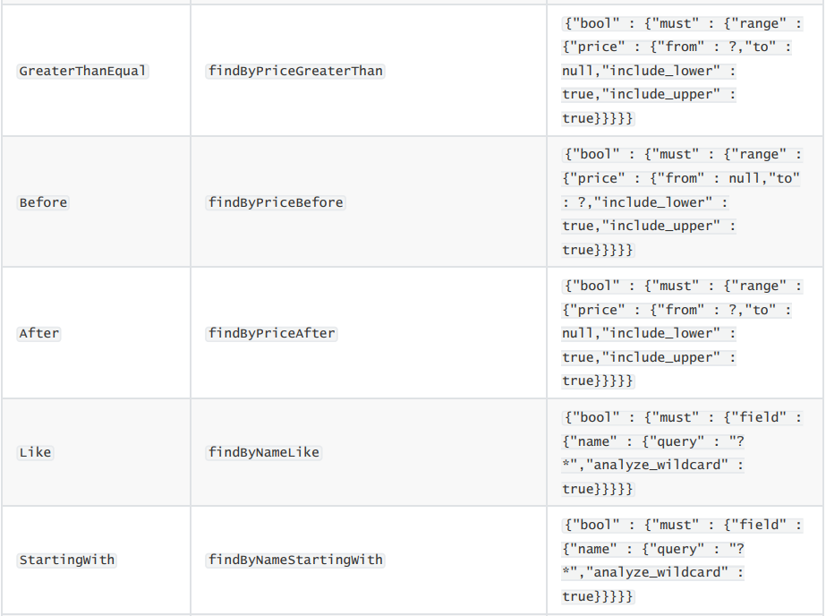


## 12.5 原生查询  


如果觉得上述接口依然不符合你的需求，SDE也支持原生查询，这个时候还是使用
ElasticsearchTemplate
而查询条件的构建是通过一个名为 `NativeSearchQueryBuilder` 的类来完成的，不过这个类的底层还是使用的原生API中的 `QueryBuilders` 、 `AggregationBuilders` 、 `HighlightBuilders` 等工具。

需求：
查询title中包含小米手机的商品，以价格升序排序，分页查询：每页展示2条，查询第1页。
对查询结果进行聚合分析：获取品牌及个数  


```java
@Test
public void nativeQuery(){
    /**
     * 查询title中包含手机的商品，以价格升序排序，分页查询，每页展示3条，查询第一页
     * 对查询结果进行聚合分析，获取品牌及个数
     */

    //构建原生查询器
    NativeSearchQueryBuilder queryBuilder = new NativeSearchQueryBuilder();
    //source过滤
    queryBuilder.withSourceFilter(new FetchSourceFilter(new String[0],new String[0]));
    //设置查询条件
    queryBuilder.withQuery(QueryBuilders.matchQuery("title", "小米手机"));
    //设置分页  和排序规则排序
    queryBuilder.withPageable(PageRequest.of(0, 3, Sort.by(Sort.Direction.ASC,"price")));
    //高亮显示

    //通过品牌聚合
    queryBuilder.addAggregation(AggregationBuilders.terms("brandAgg").field("brand"));

    //查询
    AggregatedPage<Product> queryForPage = elasticsearchTemplate.queryForPage(queryBuilder.build(), Product.class);
    //获取结果
    long total = queryForPage.getTotalElements();//获取结果
    int pages = queryForPage.getTotalPages();//页码
    //获得本页数据集合
    List<Product> products = queryForPage.getContent();
    System.out.println(total +" "+ pages);
    products.forEach(System.out::println);

    //获得聚合结果
    Aggregations aggregations = queryForPage.getAggregations();
    Terms terms = aggregations.get("brandAgg");
    //获取桶并遍历桶中的内容
    terms.getBuckets().forEach(b-> {
        System.out.println("品牌："+b.getKeyAsString());
        System.out.println("个数："+b.getDocCount());
    });
```


**aggregations -> bucketName -> buckets  -> key/doc_count**

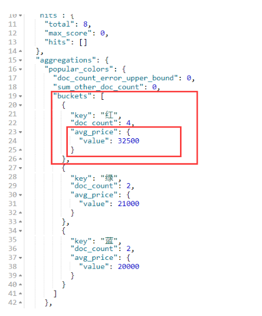


将“小米手机”分词，分为小米 和  手机，共查询到4个结果


## 高亮


1. 自定义搜索结果映射

`SearchResultMapper mapper`


```java
@Test
public void nativeQuery(){
    /**
     * 查询title中包含手机的商品，以价格升序排序，分页查询，每页展示3条，查询第一页
     * 对查询结果进行聚合分析，获取品牌及个数
     */

    //构建原生查询器
    NativeSearchQueryBuilder queryBuilder = new NativeSearchQueryBuilder();
    //source过滤
    queryBuilder.withSourceFilter(new FetchSourceFilter(new String[0],new String[0]));
    //设置查询条件
    queryBuilder.withQuery(QueryBuilders.matchQuery("title", "小米手机"));
    //设置分页  和排序规则排序
    queryBuilder.withPageable(PageRequest.of(0, 3, Sort.by(Sort.Direction.ASC,"price")));
    //设置高亮显示
    HighlightBuilder.Field field = new HighlightBuilder.Field("title");
    field.preTags("<font style='color:red'>");
    field.postTags("</font>");
    queryBuilder.withHighlightFields(field);

    //通过品牌聚合
    queryBuilder.addAggregation(AggregationBuilders.terms("brandAgg").field("brand"));

    //查询
    AggregatedPage<Product> queryForPage = elasticsearchTemplate.queryForPage(queryBuilder.build(), Product.class, new ESSearchResultMapper());
    //获取结果
    long total = queryForPage.getTotalElements();//获取结果
    int pages = queryForPage.getTotalPages();//页码
    //获得本页数据集合
    List<Product> products = queryForPage.getContent();
    System.out.println(total +" "+ pages);
    products.forEach(System.out::println);
    
}
```


```java
public class ESSearchResultMapper implements SearchResultMapper {
    /**
     * 完成结果映射
     * 将原有结果取出来：_source,放入高亮的数据
     * @param searchResponse
     * @param aClass
     * @param pageable
     * @param <T>
     * @return AggregatedPage需要三个参数进行构建,pageable,List<Product>,总记录数
     */
    @Override
    public <T> AggregatedPage<T> mapResults(SearchResponse searchResponse, Class<T> aClass, Pageable pageable) {
        //获得总记录数
        long totalHits = searchResponse.getHits().totalHits;
        //记录列表
        List<T> list = new ArrayList<>();
        //获取原始的搜索结果
        SearchHits hits = searchResponse.getHits();
        if (hits.getHits().length <= 0){
            return null;
        }
        for(SearchHit hit : hits){
            //获得_source属性中的所有数据  每一个map封装了一条文档数据
            Map<String, Object> sourceAsMap = hit.getSourceAsMap();
            //获得高亮的字段
            Map<String, HighlightField> highlightFields = hit.getHighlightFields();
            //每个高亮字段都需要进行设置
            for(Map.Entry<String, HighlightField> highlightFieldEntry : highlightFields.entrySet()){
                //获得高亮的key，高亮的字段
                String key = highlightFieldEntry.getKey();
                //获得value，高亮之后的效果
                HighlightField value = highlightFieldEntry.getValue();
                //将高亮字段和文本效果放入到map中  这里需要将text转换为string
                sourceAsMap.put(key, value.getFragments()[0].toString());
            }
            //将map转换为list   ，先转成Product对象
            Gson gson = new Gson();
            //map->json->Product（泛型T）
            T t = gson.fromJson(gson.toJson(sourceAsMap), aClass);
            list.add(t);
        }
        return new AggregatedPageImpl<>(list,pageable,totalHits);
    }
}
```


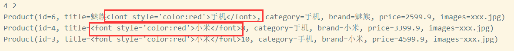


----

打印下每个hit和高亮数据：

```java
for(SearchHit hit : hits){
    //获得_source属性中的所有数据
    Map<String, Object> sourceAsMap = hit.getSourceAsMap();
    System.out.println(hit);
    //获得高亮的字段
    Map<String, HighlightField> highlightFields = hit.getHighlightFields();
    System.out.println(highlightFields);
```

将原本title中包含的数据拿出来并切分，对title字段和查询语句切分词后的词语比较，如果相等，则使用我们自定义的高亮方式来对title字段进行高亮, 取出高亮map中的数据信息，随后放回到sourcemap中。

```json
{
  "_index" : "hcr",
  "_type" : "product",
  "_id" : "6",
  "_version" : 2,
  "_score" : null,
  "_source" : {
    "id" : 6,
    "title" : "魅族手机",
    "category" : "手机",
    "brand" : "魅族",
    "price" : 2599.9,
    "images" : "xxx.jpg"
  },
  "highlight" : {
    "title" : [
      "魅族<font style='color:red'>手机</font>"
    ]
  },
  "sort" : [
    2599.9
  ]
}
{title=[title], fragments[[魅族<font style='color:red'>手机</font>]]}
{
  "_index" : "hcr",
  "_type" : "product",
  "_id" : "4",
  "_version" : 2,
  "_score" : null,
  "_source" : {
    "id" : 4,
    "title" : "小米手机",
    "category" : "手机",
    "brand" : "小米",
    "price" : 3399.9,
    "images" : "xxx.jpg"
  },
  "highlight" : {
    "title" : [
      "<font style='color:red'>小米</font><font style='color:red'>手机</font>"
    ]
  },
  "sort" : [
    3399.9
  ]
}
{title=[title], fragments[[<font style='color:red'>小米</font><font style='color:red'>手机</font>]]}
{
  "_index" : "hcr",
  "_type" : "product",
  "_id" : "3",
  "_version" : 2,
  "_score" : null,
  "_source" : {
    "id" : 3,
    "title" : "小米10",
    "category" : "手机",
    "brand" : "小米",
    "price" : 4599.9,
    "images" : "xxx.jpg"
  },
  "highlight" : {
    "title" : [
      "<font style='color:red'>小米</font>10"
    ]
  },
  "sort" : [
    4599.9
  ]
}
{title=[title], fragments[[<font style='color:red'>小米</font>10]]}
```


每一个hit是hits里面的hits，代表了一条文档的索引信息，如：索引库，类型，id，score，还有最重要的source


