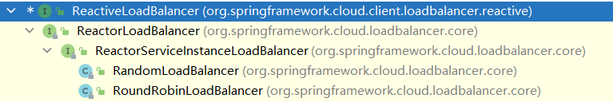
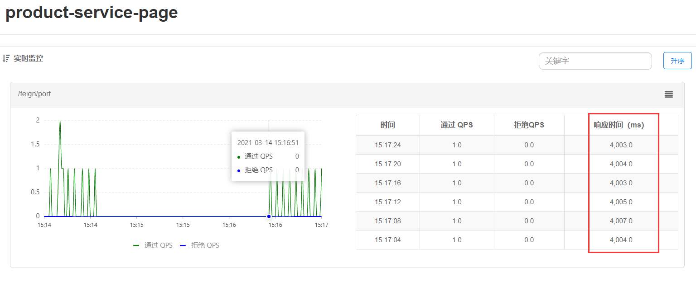
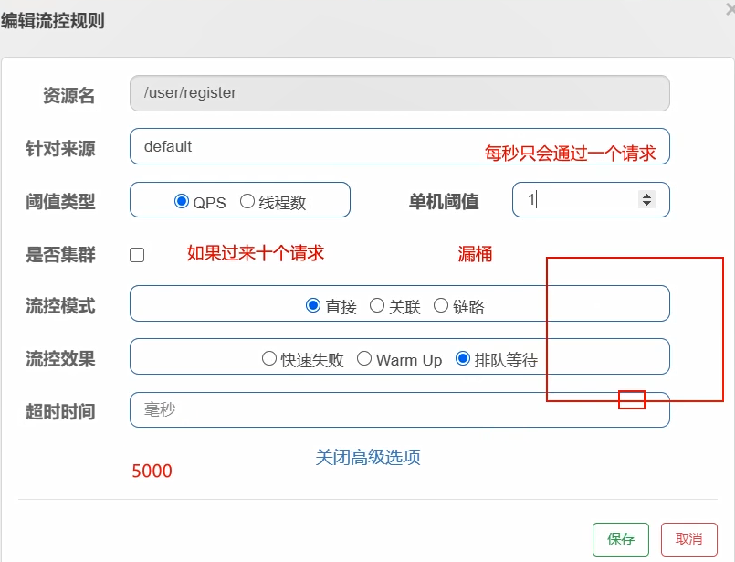

# SpringCloud 微服务


# 1. 微服务架构


## 1.1 互联网应用架构演进


用户群体逐渐扩大，网站的流量成倍增长，单体架构无法满足请求压力和业务的快速迭代，架构的变化势在必行。

淘宝：LAMP，Linux Apache MySQL PHP->Java


### 1.1.1 单体应用架构

项目的功能模块都放在一个工程中编码、编译、打包，且部署在一个Tomcat容器中的架构模式就是单体应用架构，简单实用，便于维护，成本低。


优点：

- 高效开发：开发节奏快
- 架构简单：MVC
- 易于测试：单元测试或者浏览器完成
- 易于部署：打包成单一可执行的jar或者打成war包放到容器内启动


**随着需求不断增加，越来越多的人加入到开发团队，代码库膨胀，变得越来越臃肿，可维护性、灵活性逐渐降低，维护成本越来越高**

缺点：

- 可靠性差：某个应用bug会导致整个应用的崩溃(没有拆分)
- 复杂性高：整个项目包含的模块多、模块的边界模糊、依赖关系不清晰、代码质量参差不齐，混乱堆砌
- 扩展能力受限：单体应用只能**作为一个整体**进行扩展，**无法根据业务模块的需要进行伸缩**。有的模块是计算密集型，需要强劲cpu，有的模块式IO密集，需要更大内存。由于这些模块部署在一起，需要对硬件的选择上进行妥协


应用集群部署、使用Nginx进行负载均衡、增加缓存服务器、增加文件服务器、数据集群并做读写分离等。增强应对高并发的能力，但依然属于单体应用架构。


### 1.1.2 垂直应用架构


为了避免上面提到的问题，开始做模块的垂直划分，做垂直划分的原则是基于现有业务特性，为了业务之间互不影响。研发团队壮大后提高效率，减少组件之间的依赖


**不同业务之间不依赖**


优点：

- 系统拆分实现了流量分担，解决了并发问题，给予更多节点

- 可以针对不同的模块进行优化
- 方便水平扩展，负载均衡，容错率提高
- 系统间互相独立，互不影响，新的业务迭代更加高效


缺点：

- 服务之间相互调用，如果某个服务的端口或者ip地址发生改变，调用的系统得手动改变
- 搭建集群之后，实现负载均衡比较复杂，如：内网负载、在迁移机器时会影响调用方的路由，导致线上故障
- 服务之间调用方式不统一，给予httpclient，webservice，接口协议不统一
- 服务监控不到位，除了依赖端口、进程的监控，而调用的成功率、失败率、总耗时等等这些键控制表示没有的


### 1.1.3 SOA应用架构


在做了垂直划分以后，模块随之增多，维护成本变高，一些通用的业务和模块重复的越来越多，为了解决上面提高的接口协议不统一、服务无法监控、服务的负载均衡，引入了阿里巴巴开源的Dubbo，高性能、轻量级的开源Java RPC框架，可以和Spring框架无缝集成，它提供了三大核心能力：**面向接口**的远程方法调用，智能容错和负载均衡，以及服务自动注册和发现（Zookeeper）


SOA（Service-Oriented Architexture）即面向服务的架构，根据实际业务，把西永拆分成合适的、独立部署的模块，模块之间相互独立（通过Webservice/Dubbo等技术进行通信）


优点：分布式、松耦合（组件之间解耦）、扩展灵活、可重用（避免重复代码，多处都调用一个接口）

缺点：**服务抽取粒度较大**，服务**调用方和提供方**耦合度较高（**接口耦合度 ---> dubbo需要接口名、包名相同才可进行远程调用**）


### 1.1.4 微服务应用架构


微服务架构可以说是SOA架构的一种拓展，这种架构模式下它 **拆分粒度更小，服务更独立**，把应用拆分成为一个个微小的服务。不同的服务可以使用不同的开发语言和存储，服务之间往往通过**Restful等轻量级通信**，微服务架构关键在于 **微小、独立、轻量级通信**

> micro service

微服务实在SOA上做的升华，**粒度更加细致**，微服务架构强调的一个重点是 **业务需要彻底的组件化和服务化**


在网关可以记录日志，分析客户行为；鉴权；认证；流量控制。

路由到前台模块，交给微服务处理具体请求。形成调用链（原本可能只需要一个服务）

Eureka：服务注册中心。所有微服务启动之后，都要到Eureka进行登记注册。

config配置中心：提取出共有配置。


> 微服务架构和SOA架构相似又不同
>
> 微服务架构和SOA架构很明显的一个区别就是 **服务拆分粒度的不同**，并且可以使用SpringCloud全家桶，更好地进行**服务治理**

栗子：

在SOA架构的初期，“简历投递模块”和“人才搜索模块”**都有简历内容展示的需求**，只不过可能略有区别，一开始在两个模块中**各维护了一套建立查询和展示的代码**，后期我们将服务**更细粒度拆分**，**拆分出简历基础服务**，那么不同模块调用这个基础服务即可。


## 1.2 微服务架构体现的思想及优缺点


微服务架构设计的核心是“**微**”，拆分的粒度相对比较小，这样的话**单一职责、微小的功能**可以独立部署扩展，灵活性强，升级改造影响范围小，实现高可用（一个服务出现问题，绝大程序都没问题）


**微服务架构的优点：**

- 微服务很小，便于**特定业务功能**的聚焦
- 微服务很小，每个微服务都可以被一个小团队**单独**实施，（开发，测试，部署上线，运维），团队合作一定程度解耦，便于实施敏捷开发
- 微服务很小，便于**重用**和模块之间的**组装**
- 微服务很独立，那么不同的微服务可以使用不同的语言开发，松耦合
- 微服务很独立，更容易引入新技术，(受影响的只有当前服务)


缺点：

- 微服务架构下，分布式复杂难以管理，当服务数量增加，管理越来越复杂
- 分布式链路跟踪难  **请求的调用链路变长**，难以追踪： A->C->B->D->E.....


## 1.3 微服务架构中的核心概念


- **服务注册与服务发现**

  > 栗子：职位搜索 -> 简历服务
  >
  > ​	**服务提供者：简历服务**
  >
  > ​	**服务消费者：职位搜索**

  - **服务注册**：服务提供者将所提供的服务的信息（服务器ip和端口，服务访问协议等）注册/登记到注册中心
  - **服务发现**：服务消费者能够从注册中心**获取到较为实时的服务列表**，然后根据一定的策略**选择一个服务访问**

**服务消费者启动时也需要将自己注册到服务注册中心。**


- **负载均衡**

负载均衡即：将请求压力分配到多个服务器（应用服务器、数据库服务器等），以此来提高服务的性能、可靠性


- **熔断**

熔断，即短路保护（类似保险丝），微服务架构中，如果**下游服务**因访问压力过大而相应变慢或失败，**上游服务**为了**保护系统整体可用性**，可以暂时打断对下游服务的调用，这种**牺牲局部，保全整体**的措施就叫做熔断


在服务B做熔断器，1.熔断  2.服务降级(返回默认数据/缓存)


- **链路追踪**

微服务架构越发流星，一个项目往往**拆分成很多个服务**，那么**一次请求**就需要**涉及到很多个服务**，不同的微服务可能是由不同的团队开发，可能使用不同的编程语言实现，整个项目也有可能部署在了很多服务器上（甚至百台、千台）横跨多个不同的数据中心，所谓链路追踪，就是对一次请求涉及的很多个**服务链路进行日志记录，性能监控**

推算出服务的瓶颈在哪？性能如何？进行重点监控


- **API网关**

微服务架构下，不同的微服务往往会有不同的访问地址，客户端可能需要调用多个服务的接口才能完成一个业务需求，如果**让客户端直接与某个微服务通信**，可能出现：

1. 客户端需要调用**不同的url地址**，增加了维护调用难度(宕机？)
2. 在一定的场景下，也存在**跨域请求**的问题（前后端分离碰到的问题，原本在后端采用Cors就能解决，现在利用网关，那么就放在网关这层做好了）
3. 每个微服务都需要进行**单独的身份认证**


那么API网关就可以较好的统一处理上述问题，API请求调用统一接入API网关层，由网关转发请求，API网关更专注在安全、路由、流量等问题的处理上

1. 统一接入（路由）

2. 安全防护（统一鉴权，负责网关访问身份认证验证，与“访问认证中心”通信，实际认证业务逻辑交移“访问认证中心”处理）

3. 黑白名单（实现**通过IP地址控制禁止访问网关功能**，控制访问）
4. 协议适配（通信协议校验、**适配转换**）

5. 流量监控（**限流，流量削峰**）

6. 长短链接支持

7. **容错**能力（**负载均衡**）


# 2. Spring Cloud综述


## 2.1 Spring Cloud是什么


是**一系列框架的有序集合**，利用**springboot的开发便利性**巧妙地简化了分布式系统基础设施的开发，如服务发现注册、配置中心、消息总线、负载均衡、断路器、数据监控等，做到一键启动和部署，**SpringCloud并没有重复制造轮子，它只是将目前各家公司开发的比较成熟，经得起实际考研的服务框架组合起来，通过Springboot风格进行再封装，并屏蔽掉了复杂的配置和实现原理，最终给开发者流出了一套简单易懂，易部署和易维护的分布式系统开发工具包**


> - SpringCloud是一系列框架的有序集合，**spring cloud是一个规范**
> - 服务发现注册、配置中心、消息总线、负载均衡、断路器、数据监控等
> - 利用**springboot的开发便利性**巧妙地简化了分布式系统基础设施的开发--自动装配


SpringCloud其实是一套规范，用于构建微服务架构的规范，并不是一个可以拿来即用的框架（规范：应该有哪些功能组件，然后组件之间怎么配合，共同完成什么事情）。**Netflix公司开发了一些组件(SCN)**，Spring官方开发了一些框架/组件，包括第三方的Alibaba开发了一套框架/组件集合SpringCloud Alibaba（SCA），这些都是**SpringCloud规范的实现**

学习的都是开发出的实现了规范的框架。


## 2.2 Spring Cloud解决什么问题


Spring Cloud**规范**及**实现意图**要解决的问题其实就是微服务架构实施过程中存在的一些问题，比如**微服务架构的服务注册发现问题，网络问题（比如熔断场景），统一认证安全模拟问题，负载均衡问题、链路追踪等问题**

- 分布式/版本化配置，统一管理配置文件
- 服务注册和发现
- 智能路由，API GateWay
- 服务调用，统一协议  feign组件
- 负载均衡，访问集群
- 熔断器
- 全局锁，分布式事务
- 选举与集群状态管理
- 分布式消息传递平台


## 2.3 Spring Cloud 架构


SpringCloud规范意图为搭建微服务架构一通一站式服务，**采用组件（框架）化机制**定义一系列组件，各类组件针对性的处理为服务中的特定问题，这些组件共同来构成 **SpringCloud微服务技术栈**


### 2.3.1 SpringCloud核心组件


第一代SpringCloud组件和第二代SpringCloud组件


### 2.3.2 SpringCloud 体系结构（组件协同工作机制）


SpringCloud中的各组件协同工作，才能够支持一个完整的微服务架构

- 注册中心负责服务的**注册与发现**，很好地**将各服务连接起来**
- API网关负责 **转发所有外来的请求**
- 断路器负责监控服务之间的调用情况，连续多次失败进行熔断保护
- **配置中心(集群)**提供了统一的配置信息管理服务，可以实时的通知各个服务获取最新的配置信息
- 消息总线 BUS，


## 2.4 Spring Cloud  与 Dubbo对比


Dubbo是阿里巴巴开源的一个高性能优秀的服务框架，基于RPC调用，(**底层使用的是TCP协议，也可以使用http**，越底层越快)，对于目前使用率较高的Spring Cloud Netflix来说，它是基于Http的，所以效率上没有Dubbo高，但问题在于**Dubbo体系的组件不全**，**不能提供一站式解决方案**，比如**服务注册与发现需要借助于Zookeeper等实现**，而SpringCloud Netflix则是真正的**提供了一站式服务化解决方案**，且有spring大家族背景


## 2.5 SpringCloud 与 Springboot的关系


SpringCloud只是李同乐Springboot的特点，然我们能够快速的实现微服务组件开发，佛欧泽不使用Springboot的话，我们在使用SpringCloud时，每一个组件的相关jar包都需要自己导入配置以及需要开发人员考虑兼容性等各种情况，所以Springboot是我们快速把SpringCloud微服务技术应用起来的一种方式


# 3. 案例准备


## 3.1 案例说明


以普通方式模拟一个微服务之间的调用，后续会使用SpringCloud的组件对案例进行改造

需求：

**静态化微服务**：生成静态页。在望山系统中，通常我们点击其中一个，此时打开的网页其实是一个静态页，由一个网页的模板加上**商品的数据**组成，电商系统中每一个商品的上架时都会生成静态页。（服务消费者）

**商品微服务**：商品管理。（服务提供者）

**商品微服务拿到id后再数据库中查询id对应的商品信息，返回给(商品)静态化微服务**


完整业务流程图：

发送消息到消息中间件，静态页微服务 **监听**商品上架队列，获取上架商品的id，调用商品微服务，拿到商品对象，生成商品静态页


## 3.2 数据库环境准备


```mysql
create table products(
	id int primary key auto_increment,
    name varchar(50),
    price double,
    flag varchar(2), #上架状态
    goods_desc varchar(100), #商品概述
    images varchar(400), #商品图片
    goods_stock int, #商品库存
    goods_type varchar(20) #商品类型
)
```


## 3.3 案例工程


springboot来构造工程环境


公共模块中存放一些实体类。


### 3.3.1 父工程 product-parent

**打包成pom插件**

```xml
<groupId>com.hcr</groupId>
    <artifactId>product-parent</artifactId>
    <version>1.0-SNAPSHOT</version>

<!--    父工程打包方式改为pom-->
    <packaging>pom</packaging>

<!--    springboot 父启动器依赖-->
    <parent>
        <groupId>org.springframework.boot</groupId>
        <artifactId>spring-boot-starter-parent</artifactId>
        <version>2.4.3</version>
    </parent>

    <dependencies>
<!--        web依赖-->
        <dependency>
            <groupId>org.springframework.boot</groupId>
            <artifactId>spring-boot-starter-web</artifactId>
        </dependency>
<!--        日志依赖-->
        <dependency>
            <groupId>org.springframework.boot</groupId>
            <artifactId>spring-boot-starter-logging</artifactId>
        </dependency>
<!--        测试依赖-->
        <dependency>
            <groupId>org.springframework.boot</groupId>
            <artifactId>spring-boot-starter-test</artifactId>
        </dependency>
        <dependency>
            <groupId>org.projectlombok</groupId>
            <artifactId>lombok</artifactId>
        </dependency>
        <dependency>
            <groupId>org.springframework.boot</groupId>
            <artifactId>spring-boot-starter-actuator</artifactId>
        </dependency>
<!--        热部署-->
        <dependency>
            <groupId>org.springframework.boot</groupId>
            <artifactId>spring-boot-devtools</artifactId>
            <optional>true</optional>
        </dependency>

    </dependencies>

    <build>
        <plugins>
            <plugin>
<!--                编译插件-->
                <groupId>org.apache.maven.plugins</groupId>
                <artifactId>maven-compiler-plugin</artifactId>
                <version>3.8.1</version>
                <configuration>
                    <source>11</source>
                    <target>11</target>
                    <encoding>utf-8</encoding>
                </configuration>
            </plugin>

<!--            打包插件-->
            <plugin>
                <groupId>org.springframework.boot</groupId>
                <artifactId>spring-boot-maven-plugin</artifactId>
                <version>2.4.3</version>
                <executions>
                    <execution>
                        <goals>
                            <goal>repackage</goal>
                        </goals>
                    </execution>
                </executions>
            </plugin>
        </plugins>
    </build>
```


### 3.3.2 公共组件微服务  product-service-common


在父工程上new一个新的maven module

```xml
    <dependencies>
        <dependency>
            <groupId>com.baomidou</groupId>
            <artifactId>mybatis-plus-boot-starter</artifactId>
            <version>3.3.2</version>
        </dependency>
<!--        pojo持久化使用-->
        <dependency>
            <groupId>javax.persistence</groupId>
            <artifactId>javax.persistence-api</artifactId>
            <version>2.2</version>
        </dependency>
        <dependency>
            <groupId>mysql</groupId>
            <artifactId>mysql-connector-java</artifactId>
        </dependency>
    </dependencies>
```


直接生成实体类


```java
import lombok.Data;

import javax.persistence.Id;
import javax.persistence.Table;

@Data
@Table(name = "products")
public class Products {

  @Id
  private long id;
  private String name;
  private double price;
  private String flag;
  private String goodsDesc;
  private String images;
  private long goodsStock;
  private String goodsType;

}
```


### 3.3.3 商品微服务 product-service-product

商品的微服务是服务的**提供者**，页面静态化是服务的**消费者**

创建商品微服务 `product-service-product` ,继承parent

1. 在商品微服务的pom文件中，引入公共组件common坐标

```xml
<dependencies>
    <dependency>
        <groupId>com.hcr</groupId>
        <artifactId>product-service-common</artifactId>
        <version>1.0-SNAPSHOT</version>
    </dependency>
</dependencies>
```


2. 在yaml文件中配置端口，应用名，数据库连接等信息


```yaml
server:
  port: 9000  #在微服务集群环境中，通常会为每一个微服务叠加(product微服务)
spring:
  application:
    name: product-service-product #微服务唯一标识，包括在注册中心
  datasource: #配置数据源信息
    driver-class-name: com.mysql.cj.jdbc.Driver
    url: jdbc:mysql://localhost:3306/cloud?useSSL=false&serverTimezone=GMT%2B8
    username: root
    password: huangchenrui20
```


3. 启动类

```java
@SpringBootApplication
@MapperScan("com.hcr.product")
public class ProductApplication {
    public static void main(String[] args) {
        SpringApplication.run(ProductApplication.class, args);
    }
}
```


4. Service层

**商品微服务接收页面静态化服务传过来的id，返回商品的对象**


```java
public interface ProductService {

    /**
     * 通过商品id查询商品信息
     */
    Products queryById(Integer id);
}
```


```java
@Service
public class ProductServiceImpl implements ProductService {
    @Autowired
    private ProductMapper productMapper;

    @Override
    public Products queryById(Integer id) {
        return productMapper.selectById(id);
    }
}
```


5. mapper接口

```
/**
 * 现在使用的是mybatisplus组件，该组件是mybatis的加强版
 * 能够与springboot进行非常友好的整合，对比mybatis框架只有使用便捷的改变
 * 没有具体功能的改变
 * 具体使用：只需要让具体的Mapper接口继承BaseMapper接口即可
 */
public interface ProductMapper extends BaseMapper<Products> {

//    public void deleteByProductName 也可以自定义

}
```


6. Controller


```java
@RestController
@RequestMapping("/product")
public class ProductController {

    @Autowired
    private ProductService productService;

    @GetMapping("/query/{id}")
    public Products queryByID(@PathVariable("id") Integer id){
        return productService.queryById(id);
    }
}
```


500运行错误


**在指定mapper包扫描时需要指定出mapper包，若只写product包，则只会扫描启动类**

```java
@MapperScan("com.hcr.product.mapper")
```


### 3.3.4 页面静态化微服务

引入commons依赖

```xml
<artifactId>product-service-page</artifactId>

<dependencies>
    <dependency>
        <groupId>com.hcr</groupId>
        <artifactId>product-service-common</artifactId>
        <version>1.0-SNAPSHOT</version>
    </dependency>
</dependencies>
```


> 只要引入了common依赖，**common中配置了mybatis**，**必须要进行数据源的配置**
>


```yaml
server:
  port: 9001
spring:
  application:
    name: product-service-page
  datasource:
    driver-class-name: com.mysql.cj.jdbc.Driver
    url: jdbc:mysql://localhost:3306/cloud?useSSL=false&serverTimezone=GMT%2B8
    username: root
    password: huangchenrui20
```


启动类：向容器中注入RestTemplate


```java
@SpringBootApplication
public class pageApplication {
    public static void main(String[] args) {
        SpringApplication.run(pageApplication.class, args);
    }
    
    //向容器中注入RestTemplate  封装了HTTPclient
    @Bean
    public RestTemplate restTemplate(){
        return new RestTemplate();
    }
}
```


controller层:

**调用商品微服务来进行查询**

```java
@RestController
@RequestMapping("/page")
public class PageController {

    @Autowired
    private RestTemplate restTemplate;

    @GetMapping("/getProduct/{id}")
    public Products getProduct(@PathVariable("id") Integer id){
        //发送http请求给商品微服务，将id传过去，获取到id所对应的products对象
        String url = "http://localhost:9000/product/query/";
        Products products = restTemplate.getForObject(url + id, Products.class);
        return products;
    }
}
```


http://localhost:9001/page/getProduct/1


**本质上是http的远程调用**


## 3.4 案例代码问题分析


我们在页面静态化微服务中使用RestTemplate调用商品微服务的商品状态接口时（Restful API接口），在微服务 **分布式集群环境**下会存在什么问题，怎么解决？

存在的问题：

1. 在服务消费者中，我们把 **url地址硬编码到代码中，不方便后期维护 --->  将url地址写死**
2. 服务提供者只有一个服务，即便服务提供者形成集群，服务消费者还需要自己实现负载均衡
3. 在消费者微服务中，不清楚**服务提供者的状态**
4. 服务消费者调用服务提供者时候，如果出现故障能够**及时发现并不向用户抛出异常页面**
5. RestTemplate这种请求调用方式是否还有优化空间？能不能类似于Dubbo那样
6. 这么多微服务统一认证如何实现？
7. 配置文件每次都修改好多个很麻烦！


如何解决：

1. 服务管理：**自动注册与发现**，状态监管，**通过应用名称进行调用，可以动态获得ip地址端口号等**

2. 服务负载均衡 
3. 熔断
4. 远程过程调用RPC，Feign
5. 网关拦截，路由转发
6. 统一认证
7. 集中式配置管理，配置信息实时自动更新


# 4. 第一代 Spring Cloud 核心组件


使用SpringCloud Gateway代替zuul

- Gateway网关：所有服务的入口，每个请求都首先会到达网关，可以做日志、黑白名单、鉴权。 **使用转发(not redirect)**

- Eureka注册中心：每个微服务的application_name，IP，端口号，都会注册到注册中心中。若有一台服务器宕机，有心跳监测机制，从注册中心的表中移除
- Config配置中心：搭建配置中心微服务，实现对配置文件的统一管理。**借助消息总线BUS可以实现自动更新**


- RestTemplate： 远程调用
- Ribbon：实现负载均衡
- Hystrix：熔断器，进行服务熔断/拒绝/降级
- Feign：Feign代替前面三个，远程调用，支持负载均衡和熔断


## 4.1 Eureka服务注册中心


常用的服务注册中心：Eureka，Nacos，Zookeeper，Consul


### 4.1.1 关于服务注册中心


**注意：服务注册中心本质上是为了解耦服务提供者和服务消费者**

~~服务消费者  -->  服务提供者~~

服务消费者  -->  服务注册中心  -->  服务提供者

对于任何一个微服务，原则上都应存在或者支持**多个提供者**，比如商品微服务**部署多个实例**，这是由微服务的**分布式属性**决定的


更进一步，为了支持**弹性扩容/缩容**特性，一个微服务的提供者的数量和分布往往是**动态变化**的，也是无法预先确定的，因此，原本在单体应用阶段常用的静态LB机制就不再适用了，需要引入额外的组件来管理微服务提供者的注册与发现，而这个组件就是服务注册中心


#### 注册中心实现原理


分布式微服务架构中，服务注册中心用于存储服务提供者地址信息、服务发布相关的属性信息，消费者通过主动查询和被动通知的方式获取服务提供者的地址信息，而不再需要通过硬编码方式的到提供者的地址信息、消费者只需要知道当前西永发布了哪些服务，而**不需要知道服务具体存在于什么位置**，这就是**透明化路由**

1. 服务提供者（**集群**）启动

2. 服务提供者将相关服务信息主动注册到注册中心

3. 服务消费者获取服务注册信息

   pull模式：服务消费者可以**主动拉取**可用的服务提供者信息

   push模式：服务消费者**订阅**服务（当服务提供者有变化时，注册中心也会**主动推送**更新后的服务清单给消费者）

4. 服务消费者直接调用服务提供者

另外，注册中心也需要完成**服务提供者的健康监控(心跳监测机制)**，当发现服务提供者失效时需要及时删除，同时更新服务列表


#### 主流服务中心对比


- Zookeeper

  Dubbo + Zookeeper

  Zookeeper是一个分布式服务框架，apache hadoop的一个子项目，用来解决分布式应用中经常遇到的一些数据管理问题，如：统一命名服务、状态同步服务、集群管理、分布式应用配置项的管理等

  Zookeeper本质 = 存储 + 监听通知

  搭建Zookeeper集群，保持高可用。需要有一个leader进行管理（选举机制），**最少3个节点**。

- Eureka

  Netflix开源，基于RestfulAPI风格开发的服务注册与发现组件

- Consul

  Go开发的，采用Raft算法保证服务的一致性，支持健康检查

- Nacos

  易于构建云原生应用的动态服务发现、配置管理和服务管理平台。注册中心+配置中心，


CAP定理，分布式系统中，Available可用性，Consistency一致性，Partition tolerance分区容错性，最多只能同时三个特性中的两个，三者不可兼得，要么是AP，要么是CP

> 原因见Zookeeper笔记
>

**Eureka实在服务上线后统一进行服务注册，不过分依赖一致性，但一定需要可用性**


### 4.1.2 服务注册中心组件Eureka

---

Eureka基础架构

- Eureka Server：需要我们手动搭建一个工程，需要**引入Eureka Server的依赖**，进行对应的配置文件的设置
- 服务消费者和提供者都是Eureka Client实例，都需要注册到注册中心，**需要引入Eureka Client依赖，并且配置Eureka Server的信息**
- 服务提供者需要定期进行renew更新（**心跳检测**），实时知道服务提供者的状态，每30s进行续约，发送心跳程序。如果90s内没收到续约，就会**将client实例从服务列表中剔除**  
- 消费者调用提供者进行消费，**定期拉取消费列表**，并**缓存**在本地


---

Eureka交互流程及原理

- Eureka Server：需要保持**高可用**，通常搭建**集群(可能在不同地区的机房)**，集群之间**数据复制，保持集群数据一致性**，图中每一个Eureka Server都是一个集群，共同组成大集群
- Application Server：服务提供者，Register注册到注册中心，Renew发送心跳来续约自己的信息(每30s)，Cancel如果在一定时间内(90s)没接收到心跳 --> 注销服务，get Registry获取
- Application Client：服务消费者，Make Remote Call
- E**ureka Server同时也是 Eureka Client**，多个Eureka Server之间通过复制的方式完成服务注册列表的同步，（**注册到另一个Eureka Server中，才能获取服务列表信息进行同步**）
- Eureka Client会**缓存Eureka Server中的信息**，即使所有的Eureka Server节点都宕掉，服务消费者依然可以**使用缓存中的信息找到服务提供者**


**Eureka通过心跳检测、健康检查和客户端缓存等机制，提高系统的灵活性、可伸缩性和高可用性**


### 4.1.3 搭建单例Eureka Server服务注册中心


实现过程：

1. 单实例Eureka Server  -->  访问管理界面
2. 服务提供者（商品微服务注册到集群）
3. 服务消费者（页面静态化微服务注册到Eureka / 从Eureka Server获取服务信息）
4. 完成调用


#### 搭建Eureka Server服务 product-cloud-eureka

1. 依赖

SpringCloud是一个综合的项目，下面有很多子项目，比如Eureka子项目

**引入parent中进行依赖管理，子项目引入Eureka Client/Server依赖时不需要进行版本管理，直接使用这里设定好的版本即可**

```xml
<dependencyManagement>
    <dependencies>
        <dependency>
            <groupId>org.springframework.cloud</groupId>
            <artifactId>spring-cloud-dependencies</artifactId>
            <version>Greenwich.RELEASE</version>
            <type>pom</type>
            <scope>import</scope>
        </dependency>
    </dependencies>
</dependencyManagement>
```

- 2020.0.0/Greeneich/...：一系列组件，每个都有自己的版本号，


**Eureka需要在SpringCloud环境下进行工作，所以在父工程中引入SpringCloud依赖**


在Eureka Server中引入Server依赖

```xml
<dependencies>
    <dependency>
        <groupId>org.springframework.cloud</groupId>
        <artifactId>spring-cloud-starter-netflix-eureka-server</artifactId>
    </dependency>
</dependencies>
```


> 因为新版本不好使。。。就用了springboot2.1.6版本。。学习使用


在父工程引入（其实已经在Eureka-server依赖中引入了）

```xml
        <dependency>
            <groupId>com.sun.xml.bind</groupId>
            <artifactId>jaxb-core</artifactId>
            <version>2.2.11</version>
        </dependency>
        <dependency>
            <groupId>javax.xml.bind</groupId>
            <artifactId>jaxb-api</artifactId>
        </dependency>
        <dependency>
            <groupId>com.sun.xml.bind</groupId>
            <artifactId>jaxb-impl</artifactId>
            <version>2.2.11</version>
        </dependency>
        <dependency>
            <groupId>org.glassfish.jaxb</groupId>
            <artifactId>jaxb-runtime</artifactId>
        </dependency>
        <dependency>
            <groupId>com.sun.activation</groupId>
            <artifactId>jakarta.activation</artifactId>
            <version>1.2.2</version>
        </dependency>
```


配置文件：

```yaml
server:
  port: 9002
spring:
  application:
    name: product-cloud-eureka

eureka:
  client: #eureka server本身也是一个client,因为在集群下需要与其他Eureka Server进行数据的同步
    register-with-eureka: false # 是否注册到Eureka server中  因为自己就是Eureka Server，不进行注册,默认为true
    fetch-registry: false # 表示是否查询/拉取Eureka Server服务注册列表,默认为true
    service-url: {defaultZone: http://localhost:9002/eureka}      #需要定义eureka server url  这里需要一个map类型，记得k: v之间有空格
  instance:
    hostname: localhost   #表示当前Eureka实例的主机名
    prefer-ip-address: true #使用ip注册，新版本都使用ip
    instance-id: ${spring.cloud.client.ip-address}:${spring.application.name}:${server.port}:@project.version@
    # 默认显示前面的那些
```


**启动类中标识自己是一个Eureka Server**

```java
@SpringBootApplication
@EnableEurekaServer   //标识当前项目为Eureka Server
public class EurekaApplication {
    public static void main(String[] args) {
        SpringApplication.run(EurekaApplication.class, args);
    }
}
```


http://localhost:9002/


#### 将商品微服务和页面静态化微服务注册到Eureka

添加Eureka client依赖

```xml
<dependency>
    <groupId>org.springframework.cloud</groupId>
    <artifactId>spring-cloud-starter-netflix-eureka-client</artifactId>
</dependency>
```


服务端Eureka配置

```yaml
eureka:
  client: #eureka server本身也是一个client,因为在集群下需要与其他Eureka Server进行数据的同步
    service-url:
      defaultZone: http://127.0.0.1:8080/eureka #需要定义eureka server url  这里需要一个map类型
  instance:
    prefer-ip-address: true #使用ip注册，新版本都使用ip
    instance-id: ${spring.cloud.client.ip-address}:${spring.application.name}:${server.port}:@project.version@
      #实例信息 默认显示前面的那些
```


`@EnableDiscoveryClient`：也可以将当前项目标识为注册中心的客户端，向注册中心进行注册

 `@EnableEurekaClient` **表示将当前项目作为Eureka Client注册到Eureka Server**

区别：`@EnableEurekaClient` 只能注册Eureka，有局限性； `@EnableEurekaClient` 可以在所有的服务注册中心环境使用，可以在阿里的nacos中使用

```java
@SpringBootApplication
@EnableEurekaClient
public class pageApplication {
    public static void main(String[] args) {
        SpringApplication.run(pageApplication.class, args);
    }

    //向容器中注入RestTemplate  封装了HTTPclient
    @Bean
    public RestTemplate restTemplate(){
        return new RestTemplate();
    }
}
```


### 4.1.4 搭建Eureka Server高可用集群

> 当Eureka挂了后，里面注册的服务就都自动消失了。
>


服务实例很少有单个的，如果Eureka Server只有一个实例，该实例挂掉，正好本地缓存列表中的服务实例也不可用，那么这时候整个系统都会受到影响

生产环境中，会配置Eureka Server集群实现高可用，Eureka Server集群之中的节点通过P2P通信的方式共享服务注册表

由于是在个人计算机中进行测试很难模拟多主机的情况，Eureka配置Server集群时需要执行host地址，所以需要修改个人电脑中hosts地址

ProductCloudEurekaServerA/B就可以表示主机地址了。**只是设置个别名，方便查看**

```
127.0.0.1	ProductCloudEurekaServerA
127.0.0.1	ProductCloudEurekaServerB
```


复制一份product-cloud-eureka为product-cloud-eureka-8081，修改对应名称。

**eureka的name不修改，所有的Eureka都是一个名称**

这时还需要在父工程中对其进行导入才可以作为parent的模块


- **将两个Eureka Server相互关联**，**相互注册！**


若还有个C，在后面追加

```
service-url:
  defaultZone: http://ProductCloudEurekaServerB:8081/eureka, defaultZone: http://ProductCloudEurekaServerC:8082/eureka
```

集群情况下，service-url.defaultZone设置为集群下的别的Eureka的地址，多个地址用","隔开即可

**客户端不需要任何变动**


**保险起见，两个Server都配置, 只配置一个就可以**

```yaml
eureka:
  client: #eureka server本身也是一个client,因为在集群下需要与其他Eureka Server进行数据的同步
    register-with-eureka: true # 是否注册到Eureka server中  因为自己就是Eureka Server，不进行注册,默认为true
    fetch-registry: true # 表示是否查询/拉取Eureka Server服务注册列表,默认为true
    service-url:
      defaultZone: http://ProductCloudEurekaServerB:8081/eureka, http://ProductCloudEurekaServerA:8080/eureka #需要定义eureka server url  这里需要一个map类型
  instance:
    #hostname: localhost   #表示当前Eureka实例的主机名
    prefer-ip-address: true #使用ip注册，新版本都使用ip
    instance-id: ${spring.cloud.client.ip-address}:${spring.application.name}:${server.port}:@project.version@
    #自定义显示实例信息 默认显示前面的那些
```


**别忘了保存hosts文件。。。。。。**

B的副本信息是A


**PRODUCT-CLOUD-EUREKA表示Eureka Server，集群中的Eureka Server都使用同一个名称**


#### 改造服务消费者调用服务提供者


```java
@RestController
@RequestMapping("/page")
public class PageController {

    @Autowired
    private RestTemplate restTemplate;

    //服务注册中心的客户端对象，用来获得对应的服务实例
    @Autowired
    private DiscoveryClient discoveryClient;

    @GetMapping("/getProduct/{id}")
    public Products getProduct(@PathVariable("id") Integer id){

        //获得product-service-product在服务注册中心注册的服务实例列表
        List<ServiceInstance> instances = discoveryClient.getInstances("product-service-product");
        //返回的是实例的集合-->集群, 获得唯一的服务实例
        ServiceInstance serviceInstance = instances.get(0);
        //获得商品微服务的主机地址&端口号
        String host = serviceInstance.getHost();
        int port = serviceInstance.getPort();
        //拼url地址
        String url = "http://"+host+":"+port+"/product/query/"+id;
        
        System.out.println(url);//http://172.23.85.120:9000/product/query/1
        
        //发送http请求给商品微服务，将id传过去，获取到id所对应的products对象
//        String url = "http://localhost:9000/product/query/";
        
        Products products = restTemplate.getForObject(url, Products.class);
        return products;
    }
}
```


### 4.1.5 Eureka细节详解


#### Eureka元数据详解


Eureka的元数据有两种：标准元数据和自定义元数据

- **标准元数据**：主机名，IP地址，端口号等信息，这些信息都会被发布在服务注册表中，用于服务之间的调用
- **自定义元数据**：可以使用eureka.instance.metadata-map属性中配置，符合KEY/VALUE的存储格式，这些元数据可以再远程客户端中访问


在商品微服务中配置元数据

```yaml
eureka:
  client: #eureka server本身也是一个client,因为在集群下需要与其他Eureka Server进行数据的同步
    register-with-eureka: true # 是否注册到Eureka server中  因为自己就是Eureka Server，不进行注册,默认为true
    fetch-registry: true # 表示是否查询/拉取Eureka Server服务注册列表,默认为true
    service-url:
      defaultZone: http://ProductCloudEurekaServerB:8081/eureka, http://ProductCloudEurekaServerA:8080/eureka #需要定义eureka server url  这里需要一个map类型
  instance:
    #hostname: localhost   #表示当前Eureka实例的主机名
    prefer-ip-address: true #使用ip注册，新版本都使用ip
    instance-id: ${spring.cloud.client.ip-address}:${spring.application.name}:${server.port}:@project.version@
    #实例信息 默认显示前面的那些
    metadata-map:  #自定义元数据，会和标准元数据一起注册到服务注册中心，可以被注册中心所有的Client获取
      name: hcrui
      age: 21
      school: tju
      password: 123456
```


在页面静态化微服务中获取到商品微服务中的元数据

可以获取到服务实例的各种数据：


`HashMap<String, String> metadata = serviceInstance.getMetadata();`

**只要在Eureka配置文件中定义的元数据，一定会注册到注册中心中，只要能够和注册中心通信，就能够拉取到元数据**


#### Eureka客户端详解 client


服务提供者（客户端），要向EurekaServer注册服务，并完成服务续约等工作

---

- **服务注册详解（服务提供者）**

1. 导入Eureka Client依赖坐标，配置Eureka服务注册中心地址
2. 服务在启动时会向注册中心发起注册请求，携带服务元数据信息
3. Eureka注册中心会把服务的信息保存在Map中, **服务的注册表**。**Eureka Client每隔30s拉取服务最新的注册表并缓存到本地**


---

- **服务续约详解（服务提供者）**

  在Eureka Client的配置文件中配置，如果Eureka Server

  服务(Eureka Client)每隔30s会向注册中心续约（心跳）一次，并**在Eureka Server中更新自己的状态**，如果没有续约，租约将在90s后到期，然后服务会被(Eureka Server)失效，从服务注册表Map中剔除，每隔30s续约操作称之为心跳检测

  往往不需要我们调整这两个配置

```yaml
instance:
  #hostname: localhost   #表示当前Eureka实例的主机名
  prefer-ip-address: true #使用ip注册，新版本都使用ip
  instance-id: ${spring.cloud.client.ip-address}:${spring.application.name}:${server.port}:@project.version@
  #实例信息 默认显示前面的那些
  metadata-map:  #自定义元数据，会和标准元数据一起注册到服务注册中心，可以被注册中心所有的Client获取
    name: hcrui
    age: 21
    school: tju
    password: 123456
  lease-expiration-duration-in-seconds: 90 # 租约作废，从注册表中剔除时间默认90s
  lease-renewal-interval-in-seconds: 30 # 租约更新间隔，默认30s
```


---

- **获取服务列表详解（服务消费者）**

  每隔30s服务会从服务注册中心拉取一份服务列表，这个时间可以通过配置修改，往往不需要我们修改


**在eureka.client属性中定义**


#### Eureka服务端详解 Server


- **服务下线**
  1. 当服务正常关闭操作时，会发送服务下线的REST请求给EurekaServer
  2. 服务中心接收到请求后，将该服务置为下线状态


- **失效剔除**

  Eureka Server会定时(间隔值是eureka.server.eviction-interval-timer-in-ms，默认60s)**进行检查**，如果发现实例在一定时间（90s）内没有收到心跳，则要注销此实例


---

> 如果Server网络状况不好收不到心跳，把client都剔除了。。。。

- **自我保护机制**

  **自我保护模式真是一种针对网络异常波动的安全保护措施，使用自我保护模式能使Eureka集群更加的健壮，稳定的运行**

  自我保护机制的工作机制是：**如果在15分钟内超过85%的客户端节点都没有正常的心跳，那么Eureka就认为客户端与注册中心出现了网络故障，Eureka Server自动进入自动保护机制，此时会出现以下几种情况**：

  - Eureka Server**不再从注册列表中移除**因为长时间没收到心跳而应该过期的服务
  - Eureka Server仍然**能够接受新服务的注册和查询请求**，但是**不会被同步到其他节点上**，保证当前节点依然可用（**高可用**）
  - 当网络稳定时，当前Eureka Server**新的**注册信息会被同步到其他节点中


**Eureka Server而可以很好的应对网络故障导致部分节点失联的情况，而不会像Zookeeper那样如果有一般不可用的情况会导致整个集群不可用而变成瘫痪**


---

- **为什么会有自我保护机制**


正常情况下，90s没有收到心跳，就移除该实例。但是当网络分区故障发生时，微服务与Eureka Server之间无法正常通信，而**微服务本身却是正常运行的**，此时**不应该移除这个微服务**，所以引入了**自我保护机制**


**在服务端可以进行关闭（客户端不能进行server配置）（不推荐）**

```yaml
eureka:
    server:
    	enable-self-preservation: true #缺省为打开
```


将其他服务都停掉。。进入自我保护机制

**虽然剩下三个服务都已经停止了，但自我保护机制使得他们不被剔除**


## 4.2 Ribbon 负载均衡


### 4.2.1 关于负载均衡


- **服务器负载均衡**：Nginx，F5(硬件)，HAProxy，请求到达**服务器**之后由这些负载均衡器根据一定的算法将请求路由到目标服务器处理

- **客户端负载均衡**：比如Ribbon，**服务消费者**客户端会有一个**微服务的服务器地址列表**，调用方在请求前通过一定的负载均衡算法**选择一个服务器**进行访问，**负载均衡算法的执行是在请求客户端(微服务消费者处)进行。**


### 4.2.2 Ribbon高级应用


**需求：**

​	复制商品微服务9000，在9000和8999编写Controller，返回服务实例端口(查看是否实现负载均衡)

​	Page微服务中通过负载句话呢个策略调用product-service-product的Controller


**在新版中，Eureka Client中自动引入的负载均衡包从Ribbon换成了Loadbalancer**

那就尝试自己引入依赖来测试

**配置到消费者服务方的依赖中**

```xml
<dependency>
    <groupId>org.springframework.cloud</groupId>
    <artifactId>spring-cloud-starter-netflix-ribbon</artifactId>
    <version>RELEASE</version>
</dependency>
```


**需要在页面静态化微服务中配置负载均衡**


两台商品微服务都已经注册到了注册中心中


```xml
        <dependency>
            <groupId>org.springframework.cloud</groupId>
            <artifactId>spring-cloud-starter-netflix-eureka-client</artifactId>
<!--            <exclusions>-->
<!--                <exclusion>-->
<!--                    <groupId>org.springframework.cloud</groupId>-->
<!--                    <artifactId>spring-cloud-starter-loadbalancer</artifactId>-->
<!--                </exclusion>-->
<!--            </exclusions>-->
        </dependency>

<!--        <dependency>-->
<!--            <groupId>org.springframework.cloud</groupId>-->
<!--            <artifactId>spring-cloud-starter-netflix-ribbon</artifactId>-->
<!--            <version>RELEASE</version>-->
<!--        </dependency>-->
```

```java
@SpringBootApplication
//@EnableEurekaClient
@EnableDiscoveryClient
public class pageApplication {
    public static void main(String[] args) {
        SpringApplication.run(pageApplication.class, args);
    }

    //向容器中注入RestTemplate  封装了HTTPclient
    @Bean
    @LoadBalanced //启用请求的负载均衡
    public RestTemplate restTemplate(){
        return new RestTemplate();
    }
}
```


```java
@RestController
@RequestMapping("/page")
public class PageController {

    @Autowired
    private RestTemplate restTemplate;

    //服务注册中心的客户端对象，用来获得对应的服务实例
    @Autowired
    private DiscoveryClient discoveryClient;

    @GetMapping("/getProduct/{id}")
    public Products getProduct(@PathVariable("id") Integer id){

        //获得product-service-product在服务注册中心注册的服务实例列表
//        List<ServiceInstance> instances = discoveryClient.getInstances("product-service-product");
//        //返回的是实例的集合-->集群, 获得唯一的服务实例
//        ServiceInstance serviceInstance = instances.get(0);
//        //获得商品微服务的主机地址&端口号
//        String host = serviceInstance.getHost();
//        int port = serviceInstance.getPort();
        //拼url地址
        //String url = "http://"+host+":"+port+"/product/query/"+id;
        String url = "http://product-service-product/product/query/"+id;
        System.out.println(url);//http://172.23.85.120:9000/product/query/1
        //发送http请求给商品微服务，将id传过去，获取到id所对应的products对象
//        String url = "http://localhost:9000/product/query/";
        Products products = restTemplate.getForObject(url, Products.class);
        return products;
    }

    @GetMapping("/port")
    public String getPort(){
//        List<ServiceInstance> instances = discoveryClient.getInstances("product-service-product");
//        ServiceInstance serviceInstance = instances.get(0);
//        String host = serviceInstance.getHost();
//        int port = serviceInstance.getPort();
        //不用再获取host了，是通过注册表中实例的名称来获取各个服务器的端口/host等信息，来实现负载均衡
        String url = "http://product-service-product/port";
//        String url = "http://"+ host + ":"+port+"/port";
        return restTemplate.getForObject(url, String.class);
    }
}
```


500错误：没有有效的实例


不需要再通过 `discoveryClient`来获取，直接写服务的名称就可以

`url = "http://product-service-product/port"`


> Ribbon还是会报错。。干脆还是使用SpringCloud的loadBalancer。。。**配置方面不需要改变**

```java
    @GetMapping("/port")
    public String getPort(){
//        List<ServiceInstance> instances = discoveryClient.getInstances("product-service-product");
//        ServiceInstance serviceInstance = instances.get(0);
//        String host = serviceInstance.getHost();
//        int port = serviceInstance.getPort();
        //不用再获取host了，是通过注册表中实例的名称来获取各个服务器的端口/host等信息，来实现负载均衡
        String url = "http://product-service-product/port";
//        String url = "http://"+ host + ":"+port+"/port";
        String s1 = restTemplate.getForObject(url, String.class);
        String s2 = restTemplate.getForObject(url, String.class);
        String s3 = restTemplate.getForObject(url, String.class);
        String s4 = restTemplate.getForObject(url, String.class);
        return s1 + " " + s2 + " " + s3 + " " + s4;
    }
}
```

**实现了负载均衡**


### 4.2.3 Ribbon负载均衡策略


Ribbon内置了多种负载均衡策略，内部负责复杂均衡的顶级借口为com.netflix.loadbalancer.IRule


根据对应的key选择要调用的Server（目标微服务的实例）

`choose one alive server from allservers or upservers`


**zoneaviodancerule：先过滤再轮询**

random随机策略：


改变负载均衡策略


----

springcloud loadbalancer 貌似只有两种策略？




### 4.2.4 Ribbon工作原理


`org.springframework.cloud.client.loadbalancer.LoadBalancerAutoConfiguration`


从容器中注入RestTemplate


拦截器中的intercept方法：`org.springframework.cloud.client.loadbalancer.LoadBalancerInterceptor#intercept`


这里调用了 `org.springframework.cloud.loadbalancer.blocking.client.BlockingLoadBalancerClient#execute(java.lang.String, org.springframework.cloud.client.loadbalancer.LoadBalancerRequest<T>)`

也就是SpringCloud的loadbalancer包中的execute方法

如果引入了ribbon包：


ribbon工作原理：

**其实就是帮RestTemplate注入了拦截器，在拦截器中经过负载均衡算法帮他选择了对应的目标微服务，**


## 4.3 Hystrix熔断器

保险丝


### 4.3.1 微服务中的雪崩效应


当山坡积雪内部的内聚力抵抗不了它所受到的重力，引起雪体崩塌——雪崩

微服务中，一个请求可能需要多个微服务接口才能实现，会形成复杂的调用链路

**服务雪崩效应：是一种因“提供者的不可用”(原因)导致“服务调用者不能用”(结果)，并将不可用逐渐放大的现象**


**最下层微服务出现问题，响应时间过长，大量请求阻塞，大量线程不会释放，会导致服务器资源耗尽，最终导致上游服务甚至整个系统瘫痪。**


- 扇入：代表着该微服务被调用的次数，扇入大，说明该模块**复用性好**

- 扇出：该微服务调用其他微服务的个数，扇出大，说明**业务逻辑复杂**
- **扇入大是好使，扇出大不一定是好事**


在微服务架构中，一个应用内可能会有多个微服务组成，微服务之间的数据交互通过远程调用过程完成，带来一个问题？

假设微服务A调用B和C，B和C又调用其他的微服务，这就是"扇出"，如果扇出的链路上某个微服务的调用响应时间过长或者不可用，对微服务A的调用就会占用越来越多的系统资源，进而引起系统崩溃，所谓的“雪崩效应”


**形成原因：**三个阶段

1. 服务提供者不可用
2. **重试**加大请求流量
3. 服务**调用者不可用**

服务雪崩的每个阶段都可能由不同的原因造成：


缓存击穿：java程序作为一级缓存——redis作为二级缓存——mysql数据库，一级、二级缓存都没有数据缓存，**不应该去mysql中查找**，要在缓存中找就需要尽可能避免去数据库中找（可以给一个default）。

用户大量请求-流量洪峰：Nginx、gateway限流，令牌桶、漏桶算法


### 4.3.2 雪崩效应解决方案


#### 服务熔断

熔断机制是应对雪崩效应的一种微服务链路保护机制。

如果某个地方的电压过高，熔断器就会熔断，对电路惊醒保护，股票交易中，如果股票指数过高，也会采用熔断机制，暂停股票交易。

在微服务架构中，熔断机制也是起着类似的作用，当**扇出链路的某个微服务不可用或者响应时间太长时**，熔断该节点微服务的调用，**进行服务的降级，快速返回错误的响应信息**，当检测到该节点微服务调用响应正常后，恢复调用链路


**注意：**

1. 服务熔断的重点在 **"断"**，**切断**对下游服务的调用
2. **服务熔断和服务降级是一起使用的**，Hystrix就是这样


#### 服务降级

整体资源不够用，先将一些无关紧要的服务停掉（需要调用的时候，返回一个预留的值，**兜底数据**），待渡过难关高峰过去，再把那些服务打开

服务降级一般是从整体考虑，当某个服务熔断后，**服务器将不再被调用**，准备一个**本地的fallback回调，返回一个缺省值**，虽然服务水平下降，但好歹可以用，比直接挂掉要强


#### 服务限流


服务降级是当服务出问题或者影响到核心流程的性能时，暂时将服务屏蔽掉，高峰或者问题解决后再打开。有些场景不能使用服务降级来解决，比如秒杀业务这样的核心功能，可以结合服务限流来限制这些场景的并发请求量

1. 限制总并发数（数据库连接池/线程池/...）
2. 限制瞬时并发数（Nginx）
3. 限制时间窗口内的平均速率（Guava的RateLimiter，Nginx的limit_req限制每秒的平均速率）
4. 限制**远程接口调用速**率，限制**MQ的消费速率**等


### 4.3.3 Hystrix简介


Hystrix：豪猪。。。

用于隔离访问远程系统、服务或者第三方库，实现延迟和容错的方法有：

- 包裹请求：使用HystrixCommand包裹对依赖的调用逻辑， @HystrixCommand添加Hystrix控制
- 跳闸机制：当某个服务的**错误率**超过一定的阈值，Hystrix可以跳闸，停止请求该服务一段时间
- 资源隔离：Hystrix每个依赖都**维护了一个小型的线程池**，（**舱壁模式**），如果线程池满了，**发往该依赖的请求就被立即拒绝**，而不是排队等待，加速失败判定
- 监控：Hystrix可以近乎实时地**监控运行指标和配置**的变化，成功、失败、超时、拒绝
- 回退机制：**兜底**，当请求失败、超时、拒绝，或断路器打开时，执行回**退逻辑**，回退逻辑由开发人员自行提供，**例如返回一个缺省值**
- 自我修复：**断路器打开一段时间后，自动进入“半开”状态**，（**探测服务是否可用**，如还是不可用，再次退回打开状态）


### 4.3.4 Hystrix应用


#### 熔断处理


**目的：**商品微服务长时间没有响应，服务消费者——> **页面静态化微服务快速失败给用户提示**

**引入依赖在：**微服务消费者工程（页面静态化微服务）中引入Hystrix依赖坐标


> 新版SpringCloud-Netflix中移除了Hystrix。。。
>
> 

自己添加依赖，使用RELEASE版本（2.2.7.RELEASE）

```xml
<dependency>
    <groupId>org.springframework.cloud</groupId>
    <artifactId>spring-cloud-starter-netflix-hystrix</artifactId>
    <version>RELEASE</version>
</dependency>
```


- 开启熔断：服务消费者工程（静态化页面微服务）的**启动类添加熔断器开启注解`@EnableCircuitBreaker`**


- 服务提供者休眠5s

```java
@GetMapping("/port")
public String getPort() throws InterruptedException {
    Thread.sleep(5000);
    return port;
}
```


- 设置超时时间不超过2s

```java
    /**
     * 模拟服务超时熔断处理  只需要加在需要用熔断的方法上
     * 针对熔断处理，Hystrix默认维护一个线程池，默认大小为10
     */
    @GetMapping("/port2")
    @HystrixCommand(
            threadPoolKey = "getPort2",//默认所有的请求共同维护一个线程池，实际每个方法维护一个线程池，且名字key不能相同 
            threadPoolProperties = {  //设置线程池的属性
                //需要装入HystrixProperty类型的数据
                    @HystrixProperty(name = "coreSize", value = "1"), //并发线程数
                    @HystrixProperty(name = "maxQueueSize", value = "20"),//默认线程等待队列值是-1，默认不开启，开启线程缓存等待队列
            },  //每一个属性对应的都是一个HystrixProperty
            commandProperties = {
                    @HystrixProperty(name = "execution.isolation.thread.timeoutInMilliseconds", value = "2000") //设置请求的超时时间，一旦请求超过此时间，都按照超时处理
            }
    )
    public String getPort2(){
        String url = "http://product-service-product/port";
        String s = restTemplate.getForObject(url, String.class);
        return s;
    }
}
```

**默认超时时间为1s**

请求超时！


**发生了超时并且回滚失败**


(降级就是回滚操作)


#### 降级处理

> fallback还有个意思是：**应变处理**

下面场景：

如果产生了熔断？那么用户可能会终止注册。。。损失很大。

**可以使用兜底数据响应给用户**


配置`@HystrixCommand`注解，自己**定义降级处理方法**


```java
/**
 * 服务降级演示
 * 在服务熔断之后的兜底操作
 */
@GetMapping("/port3")
@HystrixCommand(
        commandProperties = {
                @HystrixProperty(name = "execution.isolation.thread.timeoutInMilliseconds", value = "2000") //设置请求的超时时间，一旦请求超过此时间，都按照超时处理
        },
        fallbackMethod = "getPort3FallBack"//设置回退方法
)
public String getPort3(){
    String url = "http://product-service-product/port";
    String s = restTemplate.getForObject(url, String.class);
    return s;
}

/**
 * 定义回退方法，当请求触发熔断后执行，
 * 1.方法的形参和原方法保持一致
 * 2.方法的返回值和原方法要保持一致
 */
public String getPort3FallBack(){
    return "-1";
}
```

触发熔断和降级策略，返回 **兜底数据**


### 4.3.5 Hystrix舱壁模式


即：线程池隔离策略

如果不进行任何设置，**所有熔断方法(所有带有@HystrixCommand注解的方法)使用一个Hystrix线程池**（10个线程），那么这样会导致问题。**并不是扇出链路微服务不可用导致的**，而是线程机制导致的，如果方法1的请求（请求A服务）把10个线程都用了，==***方法2的请求处理的时候压根都没法去访问B，因为线程池没有多余的线程可用，并不是B服务不可用***==


**不管加有@HystrixCommand的方法有多少，这些方法都会共同维护一个线程池，默认线程池中有10个线程**

**Hystrix默认的线程池的实现不适合在生产环境中使用，因为多个方法共同维护一个线程池，10个线程。默认的线程池队列的值设置为-1->不开启**


为了**避免问题服务请求过多导致其他正常服务无法访问**，Hystrix不是采用增加线程数，而是单独的为每一个控制方法创建一个线程池的方式，这种模式就叫做 “**舱壁模式**”，也是 **线程隔离**的手段

**一个服务出问题，剩下服务不会受到影响**               


只要在**`@HystrixCommand`定义了`threadPoolKey`**，就意味着开启了舱壁模式（线程隔离），该方法就会**自己维护一个线程池**

**线程池有唯一标识：`threadPoolKey`**

```java
@HystrixCommand(
        threadPoolKey = "getPort2",//默认所有的请求共同维护一个线程池，实际每个方法维护一个线程池，且名字key不能相同
        threadPoolProperties = {
                //需要装入HystrixProperty类型的数据
                @HystrixProperty(name = "coreSize", value = "1"), //并发线程数
                @HystrixProperty(name = "maxQueueSize", value = "20"),//默认线程队列值是-1，默认不开启
        },  //每一个属性对应的都是一个HystrixProperty
        commandProperties = {
                @HystrixProperty(name = "execution.isolation.thread.timeoutInMilliseconds", value = "2000") //设置请求的超时时间，一旦请求超过此时间，都按照超时处理
        }
)
```


### 4.3.6 Hystrix工作流程与高级应用


在10s的时间窗内统计调用次数是否达到最小请求数

**熔断后将该服务进入*休眠状态*，默认窗口为5s，在这5s内，对这个服务的调用直接返回设置的默认值，但是同时系统也执行自我修复机制↓**

5s的活动窗口执行 **自我修复机制**，**每隔5s，Hystrix会让一个请求通过**，到达那个问题服务，看是否调用成功。

> 可以自定义断路器行为？
>
> 1. 出现错误时，时间窗长度
> 2. 最小请求数
> 3. 错误请求的百分比
> 4. 跳闸后，活动窗口的长度


```java
@HystrixCommand(
        commandProperties = {
                @HystrixProperty(name = "execution.isolation.thread.timeoutInMilliseconds", value = "2000"), //设置请求的超时时间，一旦请求超过此时间，都按照超时处理
                //统计窗口时间的设置
                @HystrixProperty(name = "metrics.rollingStats.timeInMilliseconds", value = "8000"),
                //统计窗口内的最小请求数
                @HystrixProperty(name = "circuitBreaker.requestVolumeThreshold", value = "2"),
                //统计窗口内错误请求阈值的设置  表示50%  达到阈值后跳闸
                @HystrixProperty(name = "circuitBreaker.errorThresholdPercentage", value = "50"),
                //自我修复的活动窗口时间
                @HystrixProperty(name = "circuitBreaker.sleepWindowInMilliseconds", value = "3000"),
        },
        fallbackMethod = "getPort3FallBack"//设置回退方法
)
```


配置文件中配置

```yaml
hystrix:
  commond:
    default:
      circuitBreaker:
        # 强制打开熔断器，如果将属性设置为true，强制断路器进入打开状态，将会拒绝所有的请求，默认false关闭
        forceOpen: false
        # 触发熔断错误比例与之 默认值50%
        errorThresholdPercentage: 50
        # 熔断后休眠时长，默认值5s
        sleepWindowInMilliseconds: 3000
        # 熔断触发最小请求次数，默认值20个
        requestVolumeThreshold: 2
      executions:
        isolation:
          thread:
            # 熔断超时设置 默认为1s
            timeInMilliseconds: 2000
```


基于springboot的健康检查观察跳闸状态（自动投递微服务暴露健康检查细节）

```yaml
management:
  endpoint:
    health:
      show-details: always
  endpoints:
    web:
      exposure:
        include: "*" #默认为 health和info
```


访问：`http://172.23.85.120:9001/actuator/health`

表明现在熔断器正常运行


使其熔断：

在postman中


发送多个请求：


开启了熔断机制，

意味着：在一个请求调用错误后，在8s内至少出现了2个的请求，并且至少一半都出错了，错误数量达到阈值，进入熔断状态


若有一个服务（在这里将一个商品微服务不设置sleep，另一个sleep 5s）能在熔断器设置的超时时间内正常访问到了，那么熔断器就会重置并关闭->up状态，继续正常访问！


#### hystrix线程池队列配置案例


生产环境：内部系统调用时出现了Hystrix调用异常，开发过程中，因为核心线程（coreSize并发线程数）数设置的比较大，并且没有出现过这种异常。

后来调整`maxQueueSize`（等待队列）属性，有所改善，但还会出现这种情况

为什么maxQueueSize属性不起作用，后来发现Hystrix还有一个`queueSizeRejectionThreshold`属性，这个属性是控制队列最大阈值的，而Hystrix**默认只配置了5个**，因此就算我们把maxQueueSize设置很大，也是不起作用的，两个属性必须用是配置

只要达到了 `queueSizeRejectionThreshold`，也会被拒绝

```yaml
hystrix:
  command:
    default:
      circuitBreaker:
        # 强制打开熔断器，如果将属性设置为true，强制断路器进入打开状态，将会拒绝所有的请求，默认false关闭
        forceOpen: false
        # 触发熔断错误比例与之 默认值50%
        errorThresholdPercentage: 50
        # 熔断后休眠时长，默认值5s
        sleepWindowInMilliseconds: 3000
        # 熔断触发最小请求次数，默认值20个
        requestVolumeThreshold: 2
      execution:
        isolation:
          thread:
            # 熔断超时设置 默认为1s
            timeoutInMilliseconds: 2000
  threadpool:
    default:
      coreSize: 10
      maxQueueSize: 1500
      queueSizeRejectionThreshold: 1000 # 默认为5
```

**正确配置：将核心线程数调低(cpu核数)，最大队列数和队列拒绝阈值的值都设置大一些**

根据系统情况动态调整这个 `queueSizeRejectionThreshold`阈值


## 4.4 Feign远程调用组件


在之前的案例中，服务消费者调用服务提供者的时候使用RestTemplate技术


还是会出现硬编码的情况


### 4.4.1 Feign简介


**Feign是Nginx开发的一个轻量级RESTful的HTTP服务客户端（用它来发起请求，远程调用）**，是以**java接口注解**的方式**调用Http请求**，而不用像java中通过**封装HTTP请求报文的方式**直接调用，Feign被广泛应用在SpringCloud的解决方案中。

类似于Dubbo，服务消费者拿到服务提供者的**接口**，然后**像调用本地接口方法一样去调用**，实际发出的是**远程的请求**

- Feign可帮助我们更加便捷，优雅的调用HTTP API：不需要我们区拼接url然后去调用RestTemplate的api，使用feign非常简单，创建一个接口（**在消费者服务调用方一端**），并在接口上添加注解
- SpringCloud对Feign进行了增强，使feign支持了SpringMVC注解（OpenFeign）


> **本质：封装了Http调用流程，更符合面向接口的编程习惯，类似于Dubbo的服务调用**


### 4.4.2 Feign配置应用


在服务调用这工程（消费）创建接口（添加注解）

**效果：Feign = RestTemplate + Ribbon + Hystrix**


- 服务消费者工程（页面静态化微服务）中引入Feign依赖（或者父工程）

  version: 3.0.0

```xml
<dependency>
    <groupId>org.springframework.cloud</groupId>
    <artifactId>spring-cloud-starter-openfeign</artifactId>
</dependency>
```


- 启动类，启动feign，**并关闭启用熔断Hystrix的注解，因为Feign会自动引入**

```java
@SpringBootApplication
//@EnableEurekaClient
@EnableDiscoveryClient
//@EnableCircuitBreaker  引入feign后，自动启用熔断
@EnableFeignClients //开启feign客户端功能
public class pageApplication {
```


- 在消费者微服务中创建Feign接口

```java
/**
 * 自定义的Feign接口，调用Product微服务的所有接口方法都在此进行定义
 * 通过服务名称找到对应的host，port信息，通过负载均衡发出请求
 */
@FeignClient(name = "product-service-product", fallback = FallBack.class)
public interface ProductFeign {

    /**
     * 通过商品id查询商品对象，远程调用--
     * 这个url需要是全路径
     */
    @GetMapping("/product/query/{id}")
    public Products queryByID(@PathVariable("id") Integer id);

    @GetMapping("/port")
    public String getPort();
}
```


**注意：**

1. @FeignClient注解的name属性用于指定**要调用的服务提供者名称**，和服务提供者yaml文件中spring.application.name保持一致

2. 接口中的接口方法，就好比是远程服务提供者Controller中的Handler方法（只不过如同本地调用），那么在进行参数绑定的时候，**可以使用@PathVariable，@RequestParam,@RequestHeader等，这也是OpenFeign对SpringMVC注解的支持**，但是需要注意value必须设置，否则会抛出异常
3. @FeignClient(name="product-service-product")，**name在消费者微服务中只能出现一次**，**最好将调用一个微服务的信息都定义在一个Feign接口中**


- 在Controller中调用

```java
@RestController
@RequestMapping("/feign")
public class FeignController {

    @Autowired
    private ProductFeign feign;

    @GetMapping("/getProduct/{id}")
    public Products getProduct(@PathVariable("id") Integer id){
        return feign.queryByID(id);
    }

    @GetMapping("/port")
    public String getPort(){
        return feign.getPort();
    }
}
```


**并且Feign已经实现了负载均衡   &  支持熔断机制！！！**


### 4.4.3 Feign对负载均衡的支持


Feign本身已经集成了Ribbon依赖和自动配置，因此我们不需要额外引入依赖，可以供过ribbon.xx来进行全局配置，也可以通过服务名.ribbon.xx来对服务进行细节配置

**Feign默认的请求处理超时时长1s，如果配置Ribbon的超时，则会以Ribbon的为准！覆盖了Feign自己的默认配置**


```yaml
product-service-product:
  ribbon:
    ConnectTimeout: 2000 #请求连接超时时间
    ReadTimeout: 2000 #请求处理超时时间
    OkToRetryOnAllOperation: true # 进行重试
    MaxAutoRetries: 0 # 第一次访问失败，重试的次数
    MaxAutoRetriesNextServer: 0 # 切换实例的重试次数
```

**好像对新版不起作用？**

```yaml
feign:
  client:
    config:
      default:
        connectTimeout: 8000 #连接超时时间
        readTimeout: 2000    #请求与响应的时间间隔阈值
```

使用这种方法配置生效！


### 4.4.4 Feign对熔断器的支持


```yaml
feign:
  hystrix:
    enabled: true
```


如果关闭了Hystrix：则是ribbon配置生效


**注意：**

1. 开启Hystrix之后，feign中的方法都会被**进行一个管理了**，一旦出现问题就**进入对应的回退逻辑处理**
2. 针对超时这一点，当前有两个超时时间设置（hystrix/ribbon），熔断的时候就是根据这两个时间的**最小值来进行**的，即处理时长超过最短的那个超时时间了，就**熔断进入回退降级逻辑**


这时会根据短的那个超时时长：1000ms，熔断并降级，


**两个中小的生效！！！**


别忘了编写一个fallback：**需要实现Feign接口，并注入到容器中, 并在Feign接口中设置fallback类**

```java
//熔断器触发之后的回调逻辑！
@Component//别忘了放入容器中，否则找不到bean
public class FallBack implements ProductFeign {
    @Override
    public Products queryByID(Integer id) {
        return null;
    }

    @Override
    public String getPort() {
        return "超时了！！熔断并Fallback!!";
    }
}
```

**为调用 微服务提供者的每个一个方法都提供一个兜底逻辑**

```java
@FeignClient(name = "product-service-product", fallback = FallBack.class)
public interface ProductFeign
```


#### 配置文件hytrix/ribbon

```yaml
hystrix:
  command:
    default:
      circuitBreaker:
        # 强制打开熔断器，如果将属性设置为true，强制断路器进入打开状态，将会拒绝所有的请求，默认false关闭
        forceOpen: false
        # 触发熔断错误比例与之 默认值50%
        errorThresholdPercentage: 50
        # 熔断后休眠时长，默认值5s,这时候默认返回兜底值，底层进行自我修复，若这3s内服务恢复，则熔断器停止，服务正常
        sleepWindowInMilliseconds: 3000
        # 熔断触发最小请求次数，默认值20个
        requestVolumeThreshold: 2
      execution:
        isolation:
          thread:
            # 熔断超时设置 默认为1s
            timeoutInMilliseconds: 4000
  threadpool:
    default:
      coreSize: 10
      maxQueueSize: 1500
      queueSizeRejectionThreshold: 1000


feign:
  hystrix:
    enabled: true

product-service-product:
  ribbon:
    ConnectTimeout: 2000 #请求连接超时时间
    ReadTimeout: 1000 #请求处理超时时间
    OkToRetryOnAllOperation: true # 进行重试
    MaxAutoRetries: 0 # 第一次访问失败，重试的次数
    MaxAutoRetriesNextServer: 0 # 切换实例的重试次数
    MFLoadBanancerRuleClassName: com.netflix.loadbalancer.RandomRule #负载均衡策略
```


#### 新版本OpenFeign

https://docs.spring.io/spring-cloud-openfeign/docs/3.0.0/reference/html/#spring-cloud-feign-circuitbreaker


```yaml
feign:
  httpclient:
    connection-timeout: 3000
  client:
    config:
      default:
        connectTimeout: 8000 #连接超时时间
        readTimeout: 4000    #请求与响应的时间间隔阈值  这个是普通连接超时时间，并非熔断时间，在没开启circuitbreaker时，使用这个
  circuitbreaker:
    enabled: true
```

**开启断路器支持**


Feign接口，设置fallback的类

```java
/**
 * 自定义的Feign接口，调用Product微服务的所有接口方法都在此进行定义
 * 通过服务名称找到对应的host，port信息，通过负载均衡发出请求
 */
@FeignClient(name = "product-service-product", fallback = FallBack.class)
public interface ProductFeign {

    /**
     * 通过商品id查询商品对象，远程调用--
     * 这个url需要是全路径
     */
    @GetMapping("/product/query/{id}")
    public Products queryByID(@PathVariable("id") Integer id);

    @GetMapping("/port")
    public String getPort();
}
```

实现feign接口，作为fallback，每个方法都对应接口方法调用被熔断后的fallback。

```java
@Component//别忘了放入容器中，否则找不到bean
public class FallBack implements ProductFeign {
    @Override
    public Products queryByID(Integer id) {
        return null;
    }

    @Override
    public String getPort() {
        return "超时了！！熔断并Fallback!!";
    }
}
```


### 4.4.5 Feign对请求压缩和响应的支持

数据量很大！！压缩也需要耗费资源！

Feign支持对请求和响应进行GZIP雅座，以减少通信过程中的性能损耗，通过下面的参数可以开启请求与响应的压缩功能


```yaml
feign:
  hystrix:
    enabled: true
  # 开启请求和响应的压缩
  compression:
    request:
      enabled: true
      # mime-types: text/xml 有默认值
      min-request-size: 2048 # 开始进行压缩的下限
    response:
      enabled: true
```


默认要压缩的类型

```java
private String[] mimeTypes = new String[]{"text/xml", "application/xml", "application/json"};
```


## 4.5 GateWay 网关组件


网关：微服务架构中的重要组成部分

局域网接收或者发送数据出去通过这个网关，比如Vmware虚拟机软件搭建虚拟机集群的时候，往往需要选择IP段中的一个IP作为网关地址

Gateway -> SpringCloud GateWay（只是众多网关中的一种）


### 4.5.1 GateWay简介


SpringCloud GateWay是SpringCloud的一个全新项目，目标是取代Netflix的Zuul（新版本中已经取代），基于Spring5.0 + SpringBoot2.0 + WebFlux（基于高性能的Reactor模式响应式通信框架Netty，异步非阻塞模型）等技术开发，性能很高！是Zuul的1.6倍。旨在为微服务架构提供一种简单有效的统一API路由管理方式


SpringCloud GateWay不仅提供 **统一的路由方式（反向代理），并且基于Filter(定义过滤器对请求过滤)链的方式提供了网关基本的功能，如：鉴权、流量控制、熔断、路径重写、日志监控等**

- 访问一个鉴权一次？？？通过网关鉴权，判断是否有权利访问。

- 负载均衡也可以进行流量控制，网关作为服务的入口，进行流量削峰
- 对url进行重写
- 记录日志


### 4.5.2 GateWay核心概念


SpringCloud GateWay是 **异步非阻塞**


一个请求 ——>  网关**根据一定的条件匹配**——匹配成功后将请求转发到指定的服务地址：而在这个过程中，我们可以进行一些比较具体的**控制**（限流、日志、黑白名单）


- 路由route：**网关最基础的部分**，也是网关比较基础的工作单元，路由由一个ID，一个目标URL（最终路由到的地址）、一系列的断言（匹配条件判断）、Filter过滤器（精细化控制）组成。如果断言为true，则匹配该路由
- 断言predicates：参考java中的断言predicate，可以匹配http请求中的所有内容（header,参数...）
- 过滤器Filter：一个标准的Spring webFilter，使用过滤器，可以在请求之前或者之后执行业务逻辑


客户端向SpringCloud GateWay发出请求，

然后在GateWay Handler Mapping(网关控制器映射)，找到与请求相匹配的路由，

将其发送到GateWay Web Handler(控制器)，通过指定的**过滤器**将请求发送到实际的服务执行业务逻辑，然后返回

过滤器在执行之前和之后都会执行，鉴权、参数校验、流量削峰、日志记录、......   /   修改响应内容(修改响应头/响应内容)记录日志


### 4.5.4 GateWay应用

使用网关对静态化微服务进行代理（添加在他的上游，相当于隐藏了具体微服务的信息，对外暴露的是网关）


- 创建工程product-cloud-gateway-server,尽量和原有微服务进行独立，但maven会报错，那么就排除对spring-boot-starter-web的依赖！

```xml
    <parent>
        <artifactId>product-parent</artifactId>
        <groupId>com.hcr</groupId>
        <version>1.0-SNAPSHOT</version>
    </parent>

    <dependencies>
        <dependency>
            <groupId>org.springframework.boot</groupId>
            <artifactId>spring-boot-starter-web</artifactId>
            <scope>test</scope>
        </dependency>

        <dependency>
            <groupId>org.springframework.cloud</groupId>
            <artifactId>spring-cloud-commons</artifactId>
        </dependency>
        <dependency>
            <groupId>org.springframework.cloud</groupId>
            <artifactId>spring-cloud-starter-gateway</artifactId>
        </dependency>
        <dependency>
            <groupId>org.springframework.cloud</groupId>
            <artifactId>spring-cloud-starter-netflix-eureka-client</artifactId>
        </dependency>
        <dependency>
            <groupId>org.springframework.boot</groupId>
            <artifactId>spring-boot-starter-webflux</artifactId>
        </dependency>
    </dependencies>

  
```


- gateway配置文件

```yaml
server:
  port: 9300

eureka:
  client: #eureka server本身也是一个client,因为在集群下需要与其他Eureka Server进行数据的同步
    service-url:
      defaultZone: http://ProductCloudEurekaServerB:8081/eureka, http://ProductCloudEurekaServerA:8080/eureka #需要定义eureka server url  这里需要一个map类型
  instance:
    prefer-ip-address: true #使用ip注册，新版本都使用ip
    instance-id: ${spring.cloud.client.ip-address}:${spring.application.name}:${server.port}:@project.version@
    #自定义实例信息 默认显示前面的那些

spring:
  application:
    name: product-cloud-gateway
  #网关的配置
  cloud:
    gateway:
      #配置路由
      routes:
        - id: service-page-router
          uri: http://127.0.0.1:9001
          predicates:
            - Path=/page/**
        - id: service-product-router
          uri: http://127.0.0.1:9000
          predicates:
            - Path=/product/**
```


- 启动类，开启Eureka Client

```java
@SpringBootApplication
@EnableDiscoveryClient
public class GateWayServerApplication {
    public static void main(String[] args) {
        SpringApplication.run(GateWayServerApplication.class, args);
    }
}
```


**一定要和配置文件中配置的前缀路径相等**

这里的page和product既作为断言，也是请求的一部分，如果请求的url以/page开头，那么就转发向 `http://127.0.0.1:9001/page/...`，在页面静态化微服务中一定也要以/page/开头


有时候不一定能匹配上！

**当断言成功后，交给某个微服务处理时，使用的是"转发"！**


#### 解决前缀问题

```yaml
- id: service-product2-router
  uri: http://127.0.0.1:8999
  predicates:
    - Path=/product2/**
  filters:
    # 将具体请求中的第一段移除出去
    # http://127.0.0.1:9300/product2/port -> http://127.0.0.1:8999/port --> 商品微服务端口
    - StripPrefix=1
```


**访问请求中加上product2是为了满足断言，**

**而断言成功后需要交给具体的uri所对应的微服务处理，将uri中的第一个参数去掉，即去掉product2，只取/product2后的地址映射名**


**每一个Controller都对应一个uri，如果不做过滤，就无法访问不同controller映射前缀中的方法**


### 4.5.5 GateWay路由规则详解


### 4.5.6 GateWay动态路由详解


GateWay吃自动从注册中心获取服务列表并访问，即所谓的动态路由

步骤如下：

1. pom.xml中添加注册中心Eureka-Client


```yaml
spring:
  application:
    name: product-cloud-gateway
  #网关的配置
  cloud:
    gateway:
      #配置路由
      routes:
        - id: service-page-router
          uri: lb://product-service-page
          predicates:
            - Path=/page/**
        - id: service-product-router
          # 动态路由，从注册中心获取对应服务的实例
          uri: lb://product-service-product
          predicates:
            - Path=/product/**
          filters:
            - StripPrefix=1
```

lb：loadbalancer，实现了负载均衡。


**动态路由设置时，url以 `lb:`开头，代表从注册中心获取服务，后面是注册中心的服务名称**


### 4.5.7 GateWay过滤器


#### 过滤器简介


- 生命周期的角度来说，主要有两个：pre和post


- 从过滤器类型的角度，SpringCloud GateWay的过滤器分为GateWayFilter和GlobalFilter


如GateWay Filter可以去掉url中的占位后，再转发路由，比如：


#### 自定义全局过滤器实现IP访问限制(黑白名单)

**Global Filter全局过滤器是使用比较多的过滤器**


请求过来时，判断发送请求的客户端的ip，如果在黑名单中，拒绝访问

自定义GateWay全局过滤器时，实现GlobalFilter接口，通过全局过滤器可以实现黑白名单、限流等功能


```java
/**
 * 通常情况下，在进行网关自定过滤器时，要实现两个接口，GlobalFilter，
 * Ordered：指定过滤器执行的顺序
 */
@Component
public class BlackListFilter implements GlobalFilter, Ordered {

    //加载黑名单列表 MYSQL-> Redis -> 内存
    private  static List<String> blackList = new ArrayList<>();
    static {
        blackList.add("127.0.0.1");//将本机地址加入黑名单中
    }

    /**
     * 过滤器的核心逻辑
     * exchange:封装了request和response上下文
     * chain：网关过滤器链
     */
    @Override
    public Mono<Void> filter(ServerWebExchange exchange, GatewayFilterChain chain) {
        //获得请求和响应对象
        ServerHttpRequest request = exchange.getRequest();
        ServerHttpResponse response = exchange.getResponse();
        //获取来访者的IP地址
        String clientip = request.getRemoteAddress().getHostString();
        //判断是否在黑名单中
        if(blackList.contains(clientip)){
            //拒绝访问
            response.setStatusCode(HttpStatus.UNAUTHORIZED);//未授权
            String data = "request be denied";
            DataBuffer wrap = response.bufferFactory().wrap(data.getBytes());
            return response.writeWith(Mono.just(wrap));
        }
        return chain.filter(exchange);
    }

    /**
     * 定义过滤的顺序，getOrder()返回值的大小决定了过滤器执行的优先级，越小优先级越高
     * @return
     */
    @Override
    public int getOrder() {
        return 0;
    }
}
```


### 4.5.8 GateWay高可用


网关作为 **非常核心的一个部件**，如果挂掉，那么所有请求都可能无法路由处理，因此我们需要做GateWay的高可用

**GateWay的高可用很简单：启动多个GateWay实例来实现高可用，在GateWay的上游使用Nginx等负载均衡设备进行负载转发以达到高可用的目的**

对这些GateWay集群设置不同端口。

Nginx.conf：

```nginx
upstream gateway{
	server 127.0.0.1:9300
	server 127.0.0.1:9301
}
location / {
	proxy_pass http://gateway; #转发到gateway中的GateWay集群的url地址进行负载均衡
}
```


## 4.6 SpringCloud Config 分布式配置中心


### 4.6.1 分布式配置中心应用场景

往往，我么使用配置文件管理一些配置信息，如：application.yaml

**单体应用架构**，配置信息的管理、维护并不是特别麻烦，手动操作就可以

**微服务架构**，因为我们的分布式集群环境中可能有很多个微服务，我们不可能一个一个去修改配置然后重启生效，需要在运行期间动态调整配置信息，如：根据各个微服务的负载情况，动态调整数据源连接池的大小，我们希望配置内容发生变化的时候，微服务可以自动更新

- 集中配置管理，一个微服务架构中可能有成百上千个微服务，所以集中配置管理是很重要的，(一次修改，到处生效)
- 不同环境不同配置，比如数据源配置在不同环境（开发dev，测试test，生产prod）中是不同的
- 运行期间可动态调整，例如：可根据各个微服务的**负载情况**，**动态调整数据源连接池大小**等配置修改后可自动更新
- 如果配置内容发生变化，微服务可以自动更新配置

需要对配置文件进行 **集中式管理**，这也是分布式配置中心的作用


### 4.6.2 SpringCloud Config


#### config简介

SpringCloud Config是一个分布式配置管理方案，包含了Server端和Client端两个部分


- 。Config Server是一个微服务，需要手动搭建，可以托管到github中。提供配置文件的存储，以接口的形式将配置文件的内容提供出去，通过使用@EnableConfigServer注解在SpringBoot应用中非常简单的嵌入
- 每个微服务都是Config Client。通过接口获取配置数据并初始化自己的应用


#### Config分布式配置应用

默认使用Git存储配置文件内容，也可以SVN

比如我们要对“静态化微服务或者商品微服务”的application.yaml进行管理（区分开发化境、测试环境、生产环境）


1. 创建github/gitee项目 product-config

2. 上传yaml配置文件，命名规则：profile指的是环境（用于区分开发化境、测试环境、生产环境）

   如：product-service-page-dev.yaml

   

   

   

3. 构建Config Server统一配置中心  product-cloud-config


- 依赖：

```xml
<dependencies>
    <dependency>
        <groupId>org.springframework.cloud</groupId>
        <artifactId>spring-cloud-starter-netflix-eureka-client</artifactId>
    </dependency>
    <dependency>
        <groupId>org.springframework.cloud</groupId>
        <artifactId>spring-cloud-config-server</artifactId>
    </dependency>
</dependencies>
```

- 启动类： 

```java
@SpringBootApplication
@EnableDiscoveryClient
@EnableConfigServer //开启配置服务器功能
public class ConfigServerApplication {
    public static void main(String[] args) {
        SpringApplication.run(ConfigServerApplication.class, args);
    }
}
```

- 配置文件---使用gitee仓库保存配置文件

```yam
server:
  port: 9400

eureka:
  client: #eureka server本身也是一个client,因为在集群下需要与其他Eureka Server进行数据的同步
    service-url:
      defaultZone: http://ProductCloudEurekaServerB:8081/eureka, http://ProductCloudEurekaServerA:8080/eureka #需要定义eureka server url  这里需要一个map类型
  instance:
    prefer-ip-address: true #使用ip注册，新版本都使用ip
    instance-id: ${spring.cloud.client.ip-address}:${spring.application.name}:${server.port}:@project.version@
spring:
  application:
    name: product-cloud-config
  cloud:
    config:
      server:
        # git配置
        git:
          uri: https://gitee.com/Cuaaa/product-config.git #配置git地址
          username:  1587723729@qq.com
          password: huangchenrui20..
          search-paths:
            - product-config
      label: master #分支
```


http://127.0.0.1:9400/master/product-service-page-dev.yaml

`master`：分支名称

`product-service-page-dev.yaml`：文件名


#### 构建Client客户端

在页面静态化微服务中：

添加依赖

```xml
<dependency>
    <groupId>org.springframework.cloud</groupId>
    <artifactId>spring-cloud-config-client</artifactId>
</dependency>
```


改名为bootstrap.yaml

```yaml
cloud:
  config:  #针对config分布式配置中心的配置 config server
    name: product-service-page # product-service-page-dev.yaml 不写后缀！
    profile: dev  # 环境
    label: master # 分支名称
    uri: http://127.0.0.1:9400 # config server的地址
```

**文件名不写后缀！！！！！！直接写去除名字就行！**


```java
@RestController
@RequestMapping("/config")
public class ConfigClientController {
    @Value("${person.name}")
    private String name;
    @Value("${mysql.user}")
    private String user;

    @GetMapping("/query")
    private String getConfigInfo(){
        return user + "," + name;
    }
}
```


启动的时候就已经读取到了配置中心的配置


### 4.6.3 Config配置手动刷新


不用重启微服务，只需要手动的做一些其他的操作（访问一个地址/refresh）刷新，之后再访问即可

此时，客户端取到了配置中心的值，但当我们修改gitee上的值时在**服务端可以实时的获取到最新的值**，但**客户端暂时还不能拿到最新的数据**。**缓存机制！！**读取到的数据都是在启动那一刻加载到的数据

SpringCloud为我们解决了这个问题，就是客户端使用post去触发refresh，获取最新数据

1. Client客户端添加依赖springboot-starter-actuator
2. Client客户端bootstrap.yaml中添加配置（暴露通信端点）


```yaml
management:
  endpoint:
    health:
      show-details: always
  endpoints:
    web:
      exposure:
        include: "*" #默认为 health和info  添加refresh功能或者暴露所有的端口
```


3. 使用到配置信息的类上添加 `@RefreshScope`注解

```java
@RestController
@RequestMapping("/config")
@RefreshScope
public class ConfigClientController {
    @Value("${person.name}")
    private String name;
    @Value("${mysql.user}")
    private String user;

    @GetMapping("/query")
    private String getConfigInfo(){
        return user + "," + name;
    }
}
```


4. 手动向client客户端发出**post请求**

http://127.0.0.1:9001/actuator/refresh

表示此次刷新了person.name中的数据,mysql.user没有改变


随后可以获得到最新数据！


**注意：手动刷新方式避免了服务重启**

可否使用广播机制，一次通知，处处生效，方便**大范围配置刷新**？

（当前只是通过refresh来刷新**当前微服务的配置** http://127.0.0.1:9001/actuator/refresh，而不能一次性刷新所有微服务的配置）


### 4.6.4 Config配置自动更新


实现一次通知，处处生效

在微服务架构中，我们可以结合消息总线 Bus实现分布式配置的自动更新


#### 消息总线Bus

即我们经常会使用MQ消息代理构建一个共用的**Topic**，通过这个Topic**连接各个微服务实例**，**MQ广播的消息**会**被所有在注册中心的微服务实例监听和消费**，换言之就是**通过一个主题连接各个微服务，打通脉络**

SpringCloud Bus(是**基于MQ**的，支持RabbitMQ/Kafka)是SpringCloud中的消息总线方案，SpringCloud Config + SpringCloud + SpringCloud Bus 结合可以**实现配置信息的自动更新。**


#### 实现自动更新


MQ消息代理，我们选择使用RabbitMQ，configServer和ConfigClient都添加消息总线的支持以及RabbitMQ的连接信息

1. 服务端和客户端都引入二合一的依赖：

```xml
<dependency>
    <groupId>org.springframework.cloud</groupId>
    <artifactId>spring-cloud-starter-bus-amqp</artifactId>
</dependency>
```


2. **Config Server和客户端都**添加RabbitMQ配置

**启动RabbitMQ集群.....试一试**


```yaml
spring：
    rabbitmq:
      host: 192.168.150.128
      port: 5672
      username: hcr
      password: 123456
```

3. 暴露**服务端(不是客户端！)的actuator**端口 

```yaml
management:
  endpoint:
    health:
      show-details: always
  endpoints:
    web:
      exposure:
        include: "*" #默认为 health和info  添加refresh功能或者暴露所有的端口 ,暴露bus-refresh
```


4. 重启微服务


这时候在RabbitMQ中可以看到SpringBus的路由和消息队列：


5. 修改配置中心的配置文件


这时可以直接在配置中心得到更新后的配置：


但客户端没有更新：


6. 向配置中心服务端发送post请求，各个客户端即可自动刷新

http://127.0.0.1:9400/actuator/bus-refresh


客户端得到了更新后的请求：


# 5. 第二代SpringCloud核心组件 (SCA)


和SpringCloud一样，SpringCloud Alibaba也是一套微服务解决方案，包含开发分布式应用微服务的必需组件，方便开发者通过SpringCloud编程模型轻松使用这些组件来开发分布式应用服务，只需要添加一些注解和少量配置，就可以将SpringCloud应用接入阿里微服务解决方案，通过阿里中间件来迅速搭建分布式应用系统


## 5.1 Nacos服务注册和配置中心


### 5.1.1 Nacos介绍

Dynamic Naming and Configuration Service，是阿里巴巴开源的一个针对微服务架构中服务发现、配置管理和服务管理平台

Nacos = Eureka + Config + Bus。

**下载本地的包，跑起来作为一个项目，不需要自己搭建**


**Nacos功能特性：**

- 服务发现与健康检查
- 动态配置管理
- 动态DNS服务
- 服务和元数据管理（也有一个ui页面），动态的服务权重调整、动态服务优雅下线，


### 5.1.2 Nacos单例服务部署


下载zip包并解压。


windows环境下使用startup.cmd来启动。


```
unix:startup.sh -m standalone
windows:cmd startup.cmd
```


> windows下可能需要修改startup.cmd文件中的配置，将默认的集群cluster启动改为单例standalone


- 访问Nacos控制台

http://127.0.0.1:8848/nacos/index.html#/login

默认用户名和密码：nacos,nacos


### 5.1.3 微服务注册到Nacos

在父工程pom中引入SCA依赖

```xml
<dependencyManagement>
    <dependencies>
        <dependency>
            <groupId>org.springframework.cloud</groupId>
            <artifactId>spring-cloud-dependencies</artifactId>
            <version>Greenwich.RELEASE</version>
            <type>pom</type>
            <scope>import</scope>
        </dependency>

        <dependency>
            <groupId>com.alibaba.cloud</groupId>
            <artifactId>spring-cloud-alibaba-dependencies</artifactId>
            <version>2.1.0.RELEASE</version>
            <type>pom</type>
            <scope>import</scope>
        </dependency>
    </dependencies>
</dependencyManagement>
```


在微服务中引入nacos客户端依赖来注册到nacos注册中心，**必须剔除eureka-client依赖**

```xml
<!--        <dependency>-->
<!--            <groupId>org.springframework.cloud</groupId>-->
<!--            <artifactId>spring-cloud-starter-netflix-eureka-client</artifactId>-->
<!--        </dependency>-->

        <dependency>
            <groupId>com.alibaba.cloud</groupId>
            <artifactId>spring-cloud-starter-alibaba-nacos-discovery</artifactId>
        </dependency>
```


- application.yaml修改，添加nacos配置信息，**别忘了删去注册到Eureka中和调用config的配置**

```yaml
spring:
    cloud:
      nacos:
        discovery:
          server-addr: 127.0.0.1:8848
```


服务已经注册到了nacos注册中心中！


**不需要我们手动搭建注册中心项目！**


### 5.1.4 服务列表解析


- 触发保护阈值：true表示已经触发保护阈值 
- 实例数：单个服务的集群下有多少个实例

可以创建服务，但创建出的是空服务。

----

可以修改集群和每个服务实例的属性（权重/阈值/...）

可以将不需要的服务实例下线，不再进行服务的处理，但项目还在运行中


#### 阈值


nacos是服务注册中心，消费者从nacos中获取服务实例

假如当前有100台商品微服务(集群)，有90台处于不健康状态，正好碰上高并发大流量，剩下10台健康的进行处理。？nonono，扛不住啊，说不定还会触发雪崩。。

**保护阈值：当微服务集群中有一半都处于不健康状态->true，只要有请求过来，健康和不健康的都参与处理请求。牺牲了一些请求，总比造成雪崩要强**

并且这个参数可以**动态调整**，**立即生效！**


### 5.1.5 负载均衡

Nacos客户端引入的时候，会引入ribbon的依赖包，我们使用OpenFeign的时候也会引入ribbon的依赖。ribbon包括Hystrix都按照原来方式进行配置即可。

使用商品微服务集群来测试负载均衡


在将服务注册到Nacos后，通过以前的RestTemplate访问：`http://product-service-product/port`，**已经实现了负载均衡**


> 需要说明一下：
>
> Nacos自带ribbon负载均衡，并且通过OpenFeign远程调用微服务的时候，因为OpenFeign配置了fallback和熔断机制，配置如下：原先配置的Hystrix可以生效，并且ribbon配置也会生效

```yaml
hystrix:
  command:
    default:
      circuitBreaker:
        # 强制打开熔断器，如果将属性设置为true，强制断路器进入打开状态，将会拒绝所有的请求，默认false关闭
        forceOpen: false
        # 触发熔断错误比例与之 默认值50%
        errorThresholdPercentage: 50
        # 熔断后休眠时长，默认值5s
        sleepWindowInMilliseconds: 3000
        # 熔断触发最小请求次数，默认值20个
        requestVolumeThreshold: 2
      execution:
        isolation:
          thread:
            # 熔断超时设置 默认为1s
            timeoutInMilliseconds: 4000
  threadpool:
    default:
      coreSize: 10
      maxQueueSize: 1500
      queueSizeRejectionThreshold: 1000


feign:
  hystrix:
    enabled: true
  # 开启请求和响应的压缩
  compression:
    request:
      enabled: true
      # mime-types: text/xml 有默认值
      min-request-size: 2048 # 开始进行压缩的下限
    response:
      enabled: true

product-service-product:
  ribbon:
    ConnectTimeout: 2000 #请求连接超时时间
    ReadTimeout: 4000 #请求处理超时时间
    OkToRetryOnAllOperation: true # 进行重试
    MaxAutoRetries: 0 # 第一次访问失败，重试的次数
    MaxAutoRetriesNextServer: 0 # 切换实例的重试次数
    MFLoadBanancerRueClassName: com.netflix.loadbalancer.RandomRule #负载均衡策略
```


### 5.1.6 Nacos数据模型（领域模型）


NameSpace命名空间，Group分组、集群这些都是为了进行归类管理，**把服务和配置文件**进行归类，归类之后可以实现一定的效果，比如**隔离**。

对于服务来说，**不同命名空间中的服务不能够互相访问调用**


- Namespace：命名空间，对不同的**环境**进行隔离，比如隔离开发/测试/生产 环境。一个命名空间中可以定义多个group，各个分组之间是相互隔离的

- Group：将若干个服务或者若干个配置集归为一组，通常一个系统归为一个组。
- Service：某一个服务
- Dataid：配置集或者可以认为是一个配置文件


**Namespace + Group + Service，如同Maven中的GAV坐标锁定某个jar依赖，这里是为了锁定某个微服务**

**Namespace + Group + Dataid ，如同Maven中的GAV坐标锁定某个jar依赖，这里是为了锁定配置文件**


**最佳实践**

Nacos抽象出了Namespace，Group，Service，Dataid等概念，具体代表什么拒绝鱼怎么用，推荐用法：


| 概念      | 描述                                              |
| --------- | ------------------------------------------------- |
| Namespace | 代表不同的环境，如开发dev，测试test，生产环境prod |
| Group     | 代表某项目，比如xx商城项目...                     |
| Service   | 某个项目中具体xxx微服务                           |
| Dataid    | 某个项目中具体的xxx配置文件                       |


### 5.1.7 Nacos配置中心


之前：SpringCloud Config + SpringCloud Bus，实现配置的自动更新

1. 在Gitee上添加配置文件
2. 创建Config Server配置中心  ->从git上下载配置信息
3. 具体的微服务最终通过 Config Client  连接到 Config Server，获取到的gitee上的配置信息


有Nacos后，分布式配置就简单很多，Github不需要了，配置信息配置在Nacos Server中，Bus也不需要了（依然可以完成动态刷新）


1. 在Nacos Server中添加配置信息（可以导入外部配置或新建）
2. 改造微服务，使其成为Nacos Config Client，从Nacos Server中获得配置信息


添加nacos config依赖：可以从nacos配置中心获得配置信息

```xml
<dependency>
    <groupId>com.alibaba.cloud</groupId>
    <artifactId>spring-cloud-starter-alibaba-nacos-config</artifactId>
</dependency>
```


微服务中如何锁定Nacos Server中的配置文件（dataid）

Namespace+Group+dataid来锁定配置文件

```
${prefix}-${spring.profile.active}.${file-extension}
```

- prefix默认为spring.application.name的值，也可以通过配置项`spring.cloud.nacos.config.prefix`来配置 。**默认就是项目名**

- `spring.profile.active`即为当前环境对应的profile，**注意：当 `spring.profile.active`为空时，对应的连接符 - 也将不存在，dataid的拼接格式变成 `${prefix}.${file-extension}`**

- `file-extension`为配置内容的数据格式，通过spring.cloud.nacos.config.file-extension来配置，目前只支持pro和yaml类型


```yaml
cloud:
  nacos:
    discovery:
      server-addr: 127.0.0.1:8848
    config:
      server-addr: 127.0.0.1:8848
      # namespace: public没有命名空间id
      # group 默认DEFAULT GROUP 可以不设置
      file-extension: yaml
```


```java
@RestController
@RequestMapping("/nacosconfig")
@RefreshScope
public class NacosConfigController {

    @Value("${hcr.message}")
    private String message;

    @RequestMapping("/query")
    public String getNacosConfig(){
        return message;
    }
}
```


需要**将配置文件改为bootstrap.yaml，在启动时加载！**


更改配置：**直接实现了自动刷新，无需手动刷新**


一个微服务从配置中心Nacos Config获取多个配置文件？

**扩展配置文件**

```yaml
cloud:
  nacos:
    discovery:
      server-addr: 127.0.0.1:8848
    config:
      server-addr: 127.0.0.1:8848
      # namespace: public没有命名空间id
      # group 默认DEFAULT GROUP 可以不设置
      file-extension: yaml
      #指定扩展的配置文件
      ext-config:
        - dataId: pagea.yaml
          refresh: true #启用自动更新
        - dataId: pageb.yaml
          refresh: true
```


```java
@RestController
@RequestMapping("/nacosconfig")
@RefreshScope
public class NacosConfigController {

    @Value("${hcr.message}")
    private String message;
    @Value("${pagea}")
    private String pagea;
    @Value("${pageb}")
    private String pageb;

    @RequestMapping("/query")
    public String getNacosConfig(){
        return message + "," + pagea + "," + pageb;
    }
}
```


**扩展配置文件也可以实现自动更新**


## 5.2 SCA Sentinel 分布式系统的流量防卫兵


### 5.2.1 Sentinel介绍


Sentinel是一个面向云原生微服务的**流量控制，熔断降级**组件

替代Hystrix，针对问题：服务营销、服务降级、服务熔断、服务限流


Hystrix：

服务消费者（静态化微服务）——> 调用服务提供者（商品微服务）


减少代码开发，通过UI界面配置即可完成细粒度控制。独立部署Dashboard控制台组件（直接运行jar文件即可）。


Sentinel分为两个部分：

- 核心库：java客户端，不依赖任何框架/库，能够运行所有java运行时环境，同时对dubbo和SpringCloud等框架也有较好的支持
- 控制台：Dashboard，基于springboot开发，打包后可以直接运行，不需要额外的tomcat等应用容器（springboot内置服务器）


Sentinel生态：


### 5.2.2 Sentinel Dashboard部署


- 安装Dashboard

下载：https://github.com/alibaba/Sentinel/releases

运行该jar包

用户名&密码：sentinel

http://localhost:8080/#/dashboard


### 5.2.3 服务改造

对静态化微服务进行熔断降级等控制。


```xml
<dependency>
    <groupId>com.alibaba.cloud</groupId>
    <artifactId>spring-cloud-starter-alibaba-sentinel</artifactId>
</dependency>
```


修改配置文件（配置sentinel dashboard，暴露端点依然要有，删除原有Hystrix配置，删除OpenFeign降级配置）

```yaml
server:
  port: 9002
spring:
  main:
    allow-bean-definition-overriding: true # 解决bean重复注册问题
  application:
    name: product-service-page
  datasource:
    driver-class-name: com.mysql.cj.jdbc.Driver
    url: jdbc:mysql://localhost:3306/cloud?useSSL=false&serverTimezone=GMT%2B8
    username: root
    password: huangchenrui20
  cloud:
    nacos:
      discovery:
        server-addr: 127.0.0.1:8848
      config:
        server-addr: 127.0.0.1:8848
        # namespace: public没有命名空间id
        # group 默认DEFAULT GROUP 可以不设置
        file-extension: yaml
        #指定扩展的配置文件
        ext-config:
          - dataId: pagea.yaml
            refresh: true #启用自动更新
          - dataId: pageb.yaml
            refresh: true
    sentinel:
      transport:
        dashboard: 127.0.0.1:8080 # 指定sentinel控制台地址
        port: 8719 # 在微服务运行期间，会启动一个httpserver，所用：与sentinel Dashboard进行交互 push模式


management:
  endpoint:
    health:
      show-details: always
  endpoints:
    web:
      exposure:
        include: "*" #默认为 health和info  添加refresh功能或者暴露所有的端口 ,暴露bus-refresh
```

上述配置后，发现sentinel控制台没有任何变化，**因为懒加载**，需要发起一次请求触发即可




sentinel默认的超时降级时间是4s。


### 5.2.4 Sentinel关键概念


| 概念 | 概述                                                         |
| ---- | ------------------------------------------------------------ |
| 资源 | 可以是java中的任何内容，例如：由应用程序提供的服务，或由应用调用的其他应用提供的服务。**我们请求的API接口就是资源** |
| 规则 | 围绕资源的实时状态设定的规则，流量控制规则，熔断降级规则以及系统保护规则，**都可以动态实时调整** |


### 5.2.5 Sentinel 流量规则模块

系统并发能力有限，可能有的系统支持的QPS为1，太多请求过来，就应该进行流量控制了，比如直接拒绝


成功进行了流量控制并阻塞：


- 资源名：默认请求路径
- QPS：每秒钟请求数量，当调用该资源的QPS达到阈值时进行限流
- 线程数：当**调用该资源**的**线程数**达到阈值的时候进行限流，如果说业务逻辑执行的时间很长，流量洪峰来临时，会耗费很多**线程资源**，这些线程资源会**堆积**，最终造成服务不可用，进一步上游服务不可用，最终可能雪崩

- 流控模式：
  - 直接：资源调用达到限流条件时，直接限流
  - 关联：**关联的资源**调用达到阈值时限流自己
  - 链路：只记录指定链路上的流量


#### 测试线程流量限制


同时发出两个请求：第二个请求直接被拒绝


#### 测试关联


对validateID发出大量请求


这时候register请求就被限流： **因为validateID流量过大而导致register失败！**


#### 链路限流


链路指的是**请求链路（调用链）**

同一个资源会被不同的调用链路进行调用

链路模式下会控制该资源所在的调用链路 **入口的流量**，需要在规则中**配置入口资源**，即该调用链路**入口**的上下文名称

**可能一个资源A被多条链路调用，但我们可以只监控其中一条的入口流入到A的流量，另一个链路到A的流量不进行统计**


#### 流控效果之Warm Up


预热？

 预热时长：默认单位为s，10s内都属于预热期。预热期不能正常访问。在预热期内阈值是设定阈值的1/3，10s后恢复正常。

第一次访问后才会加载缓存。往往是在刚部署完项目，进入预热期，目的是**在预热期内加载缓存。**


#### 排队等待


排队等待模式下，会严格控制请求通过的间隔时间，即请求会 **匀速通过**，允许部分请求**排队等待**，通常用于消息队列削峰填谷等场景，需要设置**具体的超时时间**，当计算的等待时间超过超时时间时请求就会被拒绝

> 超时时间指的是当前即将处理该请求（此时还在队列中，但是在队列头），但若在等**待了超时时间还是无法执行该请求（单机阈值1s一个），则将该请求作废**
>
> 比如：在100ms时发来一个请求，此时请求在队列中，但在0s时已经有一个请求执行，每秒只能执行一个请求，那么此时设置这个超时时间为900ms，正好在该请求等待了900ms的时候，可以执行这个请求！
>
> 又如：同时发来10个请求，超时时间为900ms，那么第一个请求执行完后其他请求 **理论来说都无法执行，但请求执行也需要时间，可能可以执行其中的一两条请求**




发送10个请求：

**请求没有被拒绝，都存在队列中，每秒只能执行一个请求！**


### 5.2.6 Sentinel 降级规则模块

流量控制是对**外部来的大流量**进行控制，**熔断降级的视角是对内部问题进行处理**

Sentinel降级会在调用链路中某个资源出现不稳定状态时（超时、异常），对这个资源的调用进行限制，**让请求快速失败，避免影响到其他的资源而导致级联错误**。当资源被降级后，在接下来的降级时间窗口之内，对该资源的调用都自动熔断，**这里的降级其实是Hystrix中的熔断**


#### 策略

Sentinel不会像Hystrix那样放过一个请求**尝试自我修复**，就是明确按照时间窗口来，熔断触发后，**时间窗口内拒绝请求，时间窗口后就恢复**


- **RT-平均响应时间**

  **1s内至少要进入5个请求，**


新版本能像Hystrix一样设置更多属性。


- 异常比例

当资源的每秒请求>=5 ,并且每秒异常总数占通过量的比值超过阈值之后，资源进入降级状态，在接下来的时间窗口内，对这个方法的调用都会自动返回


在触发这个降级后，**5s的时间窗内**，对该请求的调用**都直接拒绝。**


- 异常数

当资源近1分钟的异常数超过阈值时，会进行熔断，注意统计时间窗口是分钟级别的，若timewindow小于60s，则结束熔断状态后仍然可能再次进入熔断状态，**时间窗口应该>=60s**

如果时间窗口还是5s，那么结束熔断后，再次统计发现60s内异常次数还是超过了阈值，继续熔断......


# 框架版本


这个版本比较老，但支持很多新版本不支持的组件！

```xml
<!--    springboot 父启动器依赖-->
    <parent>
        <groupId>org.springframework.boot</groupId>
        <artifactId>spring-boot-starter-parent</artifactId>
        <version>2.1.8.RELEASE</version>
    </parent>
```

```xml
<dependencyManagement>
    <dependencies>
        <dependency>
            <groupId>org.springframework.cloud</groupId>
            <artifactId>spring-cloud-dependencies</artifactId>
            <version>Greenwich.RELEASE</version>
            <type>pom</type>
            <scope>import</scope>
        </dependency>
        <dependency>
            <groupId>com.alibaba.cloud</groupId>
            <artifactId>spring-cloud-alibaba-dependencies</artifactId>
            <version>2.1.0.RELEASE</version>
            <type>pom</type>
            <scope>import</scope>
        </dependency>
    </dependencies>
</dependencyManagement>
```


# 坑


## Eureka无法注册到注册中心


**这里需要传入一个map类型，yaml文件中，在`key: value`之间需要加一个空格.....space  space  space  space！！！！**

或者使用这种写法：


## SpringCloud2.0.0使用ribbon找不到服务


通过debug发现，在execute这一步，ribbon无法通过传入的服务名来解析得到服务的host和端口号，而使用SpringCloud loadbalancer，可以解析出具体地址


找不出问题。。。就先用着loadbalancer吧


---


使用老版本框架，就完全没问题。。。

```java
product-service-product:
  ribbon:
    ConnectTimeout: 2000 #请求连接超时时间
    ReadTimeout: 2000 #请求处理超时时间
    OkToRetryOnAllOperation: true # 进行重试
    MaxAutoRetries: 0 # 第一次访问失败，重试的次数
    MaxAutoRetriesNextServer: 0 # 切换实例的重试次数
    MFLoadBanancerRuleClassName: com.netflix.loadbalancer.RandomRule #负载均衡策略
```

```xml
<dependency>
    <groupId>org.springframework.cloud</groupId>
    <artifactId>spring-cloud-starter-netflix-ribbon</artifactId>
</dependency>
```


## GateWay无法启动


**不能同时引入webflux和web依赖！！**

如果继承了父项目，那么将web的scope设置为test


## Config无法连接到github


找不到解决方法。。。

换成gitee。。。

```yaml
spring:
  application:
    name: product-cloud-config
  cloud:
    config:
      server:
        # git配置
        git:
          uri: https://gitee.com/Cuaaa/product-config.git #配置git地址
          username: 1587723729@qq.com
          password: huangchenrui20..
          search-paths:
            - product-config
      label: master #分支
```

OK!


## 使用@RefreshScope后无法访问配置中心的数据


修改设置：

```java
@RefreshScope(proxyMode = ScopedProxyMode.DEFAULT)
```


功能恢复正常！


## Nacos启动报错


1. Nacos默认是集群启动，将cluster改为`set MODE=“standalone”`


2. 可能出现数据库错误（暂时没发生）

> 在MySQL中创建nacos数据库，进入nacos\conf目录下,使用 nacos-mysql.sql 初始化数据库。
>
> 修改 application.properties中的配置信息：
>
> ```
> ###Count of DB:
> 
> ##打开注释
> db.num=1
> ```
>
> ```
> ### Connect URL of DB:
> 
> ##修改数据库配置信息
> db.url.0=jdbc:mysql://192.168.235.137:3306/nacos?characterEncoding=utf8&connectTimeout=1000&socketTimeout=3000&autoReconnect=true&useUnicode=true&useSSL=false&serverTimezone=UTC
> db.user.0=root
> db.password.0=root
> ```
>
> ————————————————
> 版权声明：本文为CSDN博主「Let_me_tell_you」的原创文章，遵循CC 4.0 BY-SA版权协议，转载请附上原文出处链接及本声明。
> 原文链接：https://blog.csdn.net/Let_me_tell_you/article/details/114462754


## Nacos配置中心无法正常访问，报错


```
org.springframework.beans.factory.BeanCreationException: Error creating bean with name ‘scopedTarget.nacosConfigController’: Injection of autowired dependencies failed; nested exception is java.lang.IllegalArgumentException: Could not resolve placeholder ‘config.info’ in value "${hcr.message}"

The web application [ROOT] appears to have started a thread named [com.alibaba.nacos .naming.client.listener] but has failed to stop it…
```

内存泄漏，栈溢出。。。

**重启Nacos**就好了！


## Sentinel启动异常


**Feign接口对应的微服务**已经被使用，无法再次注册这个组件了

每个Feign接口在程序中只能注册一次。


**需要允许进行覆盖注册！！解决bean重复注册问题**

```yaml
spring:
  main:
    allow-bean-definition-overriding: true # 解决bean重复注册问题
```