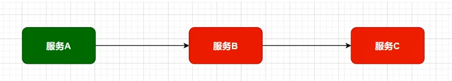

# SpringCloud 微服务

# 1. 微服务架构

## 1.1 互联网应用架构演进

用户群体逐渐扩大，网站的流量成倍增长，单体架构无法满足请求压力和业务的快速迭代，架构的变化势在必行。

淘宝：LAMP，Linux Apache MySQL PHP->Java

### 1.1.1 单体应用架构

项目的功能模块都放在一个工程中编码、编译、打包，且部署在一个Tomcat容器中的架构模式就是单体应用架构，简单实用，便于维护，成本低。

优点：

- 高效开发：开发节奏快
- 架构简单：MVC
- 易于测试：单元测试或者浏览器完成
- 易于部署：打包成单一可执行的jar或者打成war包放到容器内启动

**随着需求不断增加，越来越多的人加入到开发团队，代码库膨胀，变得越来越臃肿，可维护性、灵活性逐渐降低，维护成本越来越高**

缺点：

- 可靠性差：某个应用bug会导致整个应用的崩溃(没有拆分)
- 复杂性高：整个项目包含的模块多、模块的边界模糊、依赖关系不清晰、代码质量参差不齐，混乱堆砌
- 扩展能力受限：单体应用只能**作为一个整体**进行扩展，**无法根据业务模块的需要进行伸缩**。有的模块是计算密集型，需要强劲cpu，有的模块式IO密集，需要更大内存。由于这些模块部署在一起，需要对硬件的选择上进行妥协

应用集群部署、使用Nginx进行负载均衡、增加缓存服务器、增加文件服务器、数据集群并做读写分离等。增强应对高并发的能力，但依然属于单体应用架构。

### 1.1.2 垂直应用架构

为了避免上面提到的问题，开始做模块的垂直划分，做垂直划分的原则是基于现有业务特性，为了业务之间互不影响。研发团队壮大后提高效率，减少组件之间的依赖

**不同业务之间不依赖**

优点：

- 系统拆分实现了流量分担，解决了并发问题，给予更多节点

- 可以针对不同的模块进行优化
- 方便水平扩展，负载均衡，容错率提高
- 系统间互相独立，互不影响，新的业务迭代更加高效

缺点：

- 服务之间相互调用，如果某个服务的端口或者ip地址发生改变，调用的系统得手动改变
- 搭建集群之后，实现负载均衡比较复杂，如：内网负载、在迁移机器时会影响调用方的路由，导致线上故障
- 服务之间调用方式不统一，给予httpclient，webservice，接口协议不统一
- 服务监控不到位，除了依赖端口、进程的监控，而调用的成功率、失败率、总耗时等等这些键控制表示没有的

### 1.1.3 SOA应用架构

在做了垂直划分以后，模块随之增多，维护成本变高，一些通用的业务和模块重复的越来越多，为了解决上面提高的接口协议不统一、服务无法监控、服务的负载均衡，引入了阿里巴巴开源的Dubbo，高性能、轻量级的开源Java RPC框架，可以和Spring框架无缝集成，它提供了三大核心能力：**面向接口**的远程方法调用，智能容错和负载均衡，以及服务自动注册和发现（Zookeeper）

SOA（Service-Oriented Architexture）即面向服务的架构，根据实际业务，把西永拆分成合适的、独立部署的模块，模块之间相互独立（通过Webservice/Dubbo等技术进行通信）

优点：分布式、松耦合（组件之间解耦）、扩展灵活、可重用（避免重复代码，多处都调用一个接口）

缺点：**服务抽取粒度较大**，服务**调用方和提供方**耦合度较高（**接口耦合度 ---> dubbo需要接口名、包名相同才可进行远程调用**）

### 1.1.4 微服务应用架构

微服务架构可以说是SOA架构的一种拓展，这种架构模式下它 **拆分粒度更小，服务更独立**，把应用拆分成为一个个微小的服务。不同的服务可以使用不同的开发语言和存储，服务之间往往通过**Restful等轻量级通信**，微服务架构关键在于 **微小、独立、轻量级通信**

> micro service

微服务实在SOA上做的升华，**粒度更加细致**，微服务架构强调的一个重点是 **业务需要彻底的组件化和服务化**

在网关可以记录日志，分析客户行为；鉴权；认证；流量控制。

路由到前台模块，交给微服务处理具体请求。形成调用链（原本可能只需要一个服务）

Eureka：服务注册中心。所有微服务启动之后，都要到Eureka进行登记注册。

config配置中心：提取出共有配置。

> 微服务架构和SOA架构相似又不同
>
> 微服务架构和SOA架构很明显的一个区别就是 **服务拆分粒度的不同**，并且可以使用SpringCloud全家桶，更好地进行**服务治理**

栗子：

在SOA架构的初期，“简历投递模块”和“人才搜索模块”**都有简历内容展示的需求**，只不过可能略有区别，一开始在两个模块中**各维护了一套建立查询和展示的代码**，后期我们将服务**更细粒度拆分**，**拆分出简历基础服务**，那么不同模块调用这个基础服务即可。

## 1.2 微服务架构体现的思想及优缺点

微服务架构设计的核心是“**微**”，拆分的粒度相对比较小，这样的话**单一职责、微小的功能**可以独立部署扩展，灵活性强，升级改造影响范围小，实现高可用（一个服务出现问题，绝大程序都没问题）

**微服务架构的优点：**

- 微服务很小，便于**特定业务功能**的聚焦
- 微服务很小，每个微服务都可以被一个小团队**单独**实施，（开发，测试，部署上线，运维），团队合作一定程度解耦，便于实施敏捷开发
- 微服务很小，便于**重用**和模块之间的**组装**
- 微服务很独立，那么不同的微服务可以使用不同的语言开发，松耦合
- 微服务很独立，更容易引入新技术，(受影响的只有当前服务)

缺点：

- 微服务架构下，分布式复杂难以管理，当服务数量增加，管理越来越复杂
- 分布式链路跟踪难  **请求的调用链路变长**，难以追踪： A->C->B->D->E.....

## 1.3 微服务架构中的核心概念

- **服务注册与服务发现**

  > 栗子：职位搜索 -> 简历服务
  >
  > ​	**服务提供者：简历服务**
  >
  > ​	**服务消费者：职位搜索**

  - **服务注册**：服务提供者将所提供的服务的信息（服务器ip和端口，服务访问协议等）注册/登记到注册中心
  - **服务发现**：服务消费者能够从注册中心**获取到较为实时的服务列表**，然后根据一定的策略**选择一个服务访问**

**服务消费者启动时也需要将自己注册到服务注册中心。**

- **负载均衡**

负载均衡即：将请求压力分配到多个服务器（应用服务器、数据库服务器等），以此来提高服务的性能、可靠性

- **熔断**

熔断，即短路保护（类似保险丝），微服务架构中，如果**下游服务**因访问压力过大而相应变慢或失败，**上游服务**为了**保护系统整体可用性**，可以暂时打断对下游服务的调用，这种**牺牲局部，保全整体**的措施就叫做熔断

在服务B做熔断器，1.熔断  2.服务降级(返回默认数据/缓存)

- **链路追踪**

微服务架构越发流星，一个项目往往**拆分成很多个服务**，那么**一次请求**就需要**涉及到很多个服务**，不同的微服务可能是由不同的团队开发，可能使用不同的编程语言实现，整个项目也有可能部署在了很多服务器上（甚至百台、千台）横跨多个不同的数据中心，所谓链路追踪，就是对一次请求涉及的很多个**服务链路进行日志记录，性能监控**

推算出服务的瓶颈在哪？性能如何？进行重点监控

- **API网关**

微服务架构下，不同的微服务往往会有不同的访问地址，客户端可能需要调用多个服务的接口才能完成一个业务需求，如果**让客户端直接与某个微服务通信**，可能出现：

1. 客户端需要调用**不同的url地址**，增加了维护调用难度(宕机？)
2. 在一定的场景下，也存在**跨域请求**的问题（前后端分离碰到的问题，原本在后端采用Cors就能解决，现在利用网关，那么就放在网关这层做好了）
3. 每个微服务都需要进行**单独的身份认证**

那么API网关就可以较好的统一处理上述问题，API请求调用统一接入API网关层，由网关转发请求，API网关更专注在安全、路由、流量等问题的处理上

1. 统一接入（路由）

2. 安全防护（统一鉴权，负责网关访问身份认证验证，与“访问认证中心”通信，实际认证业务逻辑交移“访问认证中心”处理）

3. 黑白名单（实现**通过IP地址控制禁止访问网关功能**，控制访问）
4. 协议适配（通信协议校验、**适配转换**）

5. 流量监控（**限流，流量削峰**）

6. 长短链接支持

7. **容错**能力（**负载均衡**）

# 2. Spring Cloud综述

## 2.1 Spring Cloud是什么

是**一系列框架的有序集合**，利用**springboot的开发便利性**巧妙地简化了分布式系统基础设施的开发，如服务发现注册、配置中心、消息总线、负载均衡、断路器、数据监控等，做到一键启动和部署，**SpringCloud并没有重复制造轮子，它只是将目前各家公司开发的比较成熟，经得起实际考研的服务框架组合起来，通过Springboot风格进行再封装，并屏蔽掉了复杂的配置和实现原理，最终给开发者流出了一套简单易懂，易部署和易维护的分布式系统开发工具包**

> - SpringCloud是一系列框架的有序集合，**spring cloud是一个规范**
> - 服务发现注册、配置中心、消息总线、负载均衡、断路器、数据监控等
> - 利用**springboot的开发便利性**巧妙地简化了分布式系统基础设施的开发--自动装配

SpringCloud其实是一套规范，用于构建微服务架构的规范，并不是一个可以拿来即用的框架（规范：应该有哪些功能组件，然后组件之间怎么配合，共同完成什么事情）。**Netflix公司开发了一些组件(SCN)**，Spring官方开发了一些框架/组件，包括第三方的Alibaba开发了一套框架/组件集合SpringCloud Alibaba（SCA），这些都是**SpringCloud规范的实现**

学习的都是开发出的实现了规范的框架。

## 2.2 Spring Cloud解决什么问题

Spring Cloud**规范**及**实现意图**要解决的问题其实就是微服务架构实施过程中存在的一些问题，比如**微服务架构的服务注册发现问题，网络问题（比如熔断场景），统一认证安全模拟问题，负载均衡问题、链路追踪等问题**

- 分布式/版本化配置，统一管理配置文件
- 服务注册和发现
- 智能路由，API GateWay
- 服务调用，统一协议  feign组件
- 负载均衡，访问集群
- 熔断器
- 全局锁，分布式事务
- 选举与集群状态管理
- 分布式消息传递平台

## 2.3 Spring Cloud 架构

SpringCloud规范意图为搭建微服务架构一通一站式服务，**采用组件（框架）化机制**定义一系列组件，各类组件针对性的处理为服务中的特定问题，这些组件共同来构成 **SpringCloud微服务技术栈**

### 2.3.1 SpringCloud核心组件

第一代SpringCloud组件和第二代SpringCloud组件

### 2.3.2 SpringCloud 体系结构（组件协同工作机制）

SpringCloud中的各组件协同工作，才能够支持一个完整的微服务架构

- 注册中心负责服务的**注册与发现**，很好地**将各服务连接起来**
- API网关负责 **转发所有外来的请求**
- 断路器负责监控服务之间的调用情况，连续多次失败进行熔断保护
- **配置中心(集群)**提供了统一的配置信息管理服务，可以实时的通知各个服务获取最新的配置信息
- 消息总线 BUS，

## 2.4 Spring Cloud  与 Dubbo对比

Dubbo是阿里巴巴开源的一个高性能优秀的服务框架，基于RPC调用，(**底层使用的是TCP协议，也可以使用http**，越底层越快)，对于目前使用率较高的Spring Cloud Netflix来说，它是基于Http的，所以效率上没有Dubbo高，但问题在于**Dubbo体系的组件不全**，**不能提供一站式解决方案**，比如**服务注册与发现需要借助于Zookeeper等实现**，而SpringCloud Netflix则是真正的**提供了一站式服务化解决方案**，且有spring大家族背景

## 2.5 SpringCloud 与 Springboot的关系

SpringCloud只是李同乐Springboot的特点，然我们能够快速的实现微服务组件开发，佛欧泽不使用Springboot的话，我们在使用SpringCloud时，每一个组件的相关jar包都需要自己导入配置以及需要开发人员考虑兼容性等各种情况，所以Springboot使我们快速吧SpringCloud微服务技术应用起来的一种方式

