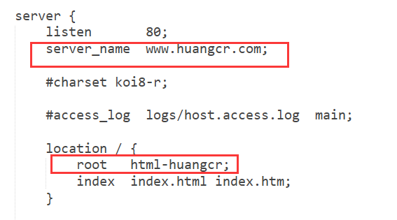
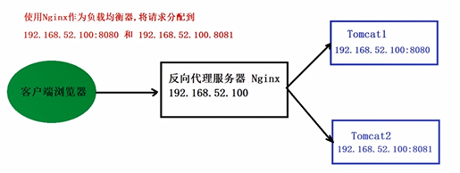
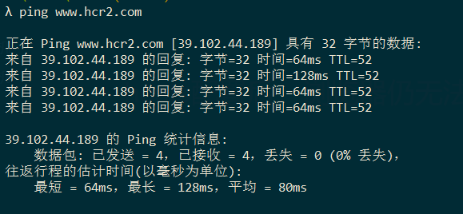
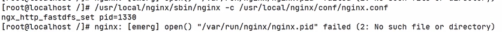

# NGINX优点

1. 占用内存少，并发能力强
2. Nginx转为性能优化而开发，在高连接并发的情况系，能够支持高达50000个并发连接的响应
3. Nginx支持热部署，可以在不间断服务的情况下，对软件版本进行升级


# 应用场景


1. **http服务器**：Nginx是一个http服务可以独立提供http服务。可以做网页静态服务器
2. **虚拟主机**：可以实现在一台服务器**虚拟出多个网站**，例如个人网站使用的虚拟主机。**根据域名来分发请求**
3. **反向代理，负载均衡**：当网站的访问量达到一定程度后，单台服务器不能满足用户的请求时，需要用多台服务器集群可以使用Nginx做反向代理。并且多台服务器可以平均分担负载，不会因为某台服务器负载高宕机而某台服务器闲置的情况


# Nginx安装


Nginx在Linux下安装，只提供了源代码，所以需要进行编译


## 安装环境配置


1. 因为Nginx是C语言编写的，所以需要配置C语言编译环境


需要安装gcc的环境，执行命令：

```bash
 yum install gcc-c++
```


2. 第三方的开发包，在编译之前需要安装这些第三方包：

   - PCRE

     - Nginx的http模块使用pcre来解析正则表达式

     - ```bash
       yum install -y pcre pcre-devel
       ```

   - zlib

     - 使用zlib对http包的内容进行gzip

     - ```bash
        yum install -y zlib zlib-devel
       ```

   - openssl

     - Openssl是一个强大的安全套接字层密码库，Nginx不仅支持http协议，还支持https

     - ```bash
       yum install -y openssl openssl-devel
       ```

       

## 安装Nginx步骤


1. 将nginx的tar包上传到linux

2. 解压Nginx

   ```shell
   tar -xvf nginx.tar
   ```

3. 进入解压后的目录

4. 执行命令configure，生成Makefile文件

   ```shell
   ./configure --prefix=/usr/local/nginx # 检查平台安装环境
     # --prefix=/usr/local/nginx  是 nginx 编译安装的目录（推荐），安装完后会在此目录下生成相关文件
   ```

5. 执行  `make`     进行编译

6. `make install`    安装


- 启动服务

```bash
 ./nginx
 /usr/local/nginx/sbin/nginx
```

- 重新加载服务

```shell
 /usr/local/nginx/sbin/nginx -s reload
```

- 停止服务

```shell
 /usr/local/nginx/sbin/nginx -s stop
```


```shell
ps -ef | grep nginx # 查看服务进程
```


**安装成功**


此时已经开启了Nginx服务器，访问ip:80端口

成功！


# 配置虚拟主机


虚拟主机指的是：在一台服务器中，我们使用Nginx来配置多个网站


如何区分不同的网站：

1. 端口不同
2. 域名不同


## 通过端口区分不同的虚拟主机


### Nginx配置文件


1. Nginx配置文件的配置


```nginx
#user  nobody;
worker_processes  1;  # word的进程数，默认为1

#error_log  logs/error.log;
#error_log  logs/error.log  notice;
#error_log  logs/error.log  info;

#pid        logs/nginx.pid;

# 单个worker的最大并发连接数
events {
    worker_connections  1024;
}

# http块时诶之最频繁的部分，可以嵌套多个server，配置代理、缓存、日志定义等绝大多数功能
http {
    # 引入mime类型定义文件
    include       mime.types;
    default_type  application/octet-stream;

    #log_format  main  '$remote_addr - $remote_user [$time_local] "$request" '
    #                  '$status $body_bytes_sent "$http_referer" '
    #                  '"$http_user_agent" "$http_x_forwarded_for"';

    #access_log  logs/access.log  main;

    sendfile        on;
    #tcp_nopush     on;

    #keepalive_timeout  0;
    keepalive_timeout  65; # 超时时间

    # server配置虚拟主机的相关参数，可以有多个，一个server就是一个虚拟主机
    server {
        # 默认监听的端口
        listen       80;
        # 监听地址
        server_name  localhost;
        # 默认请求配置
			location / {
            root   html; # 默认网站根目录  这里指的是nginx目录下的html目录
            index  index.html index.htm; # 欢迎页  这里是html目录下的index.html
        }

        #error_page  404              /404.html;

        # redirect server error pages to the static page /50x.html
        # 错误提示页面
        error_page   500 502 503 504  /50x.html;
        location = /50x.html {
            root   html;
        }
    }
}

```


**一个server就代表一个虚拟主机**


```nginx
# 配置新的server
server {
        # 修改端口
        listen       81;
        # 监听地址
        server_name  localhost;
        # 默认请求配置
			location / {
            root   html81; # 默认网站根目录  这里指的是nginx目录下的html目录
            index  index.html index.htm; # 欢迎页  这里是html目录下的index.html
        }

        #error_page  404              /404.html;

        # redirect server error pages to the static page /50x.html
        # 错误提示页面
        error_page   500 502 503 504  /50x.html;
        location = /50x.html {
            root   html;
        }
    }
```

 **重新加载配置文件**

```
./nginx -s reload
```


## 通过域名区分不同的虚拟主机


域名：网站的地址，由域名提供商提供，一般需要购买


域名级别：

- 一级域名：com，org，cn
- 二级域名：baidu.com   zhihu.com
- 三级域名：www.    image.


### 域名绑定


- 一个域名对应一个ip地址（**被dns服务器解析为ip地址**），一个ip地址可以被多个域名绑定
- 通过DNS服务器去解析域名


### 配置域名映射


1. 本地测试可以修改hosts文件。修改windows的hosts文件 `C:\Windows\System32\drivers\etc`

修改hosts文件：


**将域名映射为指定的ip地址**


现在通过不同的域名都可以访问到nginx服务器


---


**需要将不同的域名  映射到nginx的不同的服务器中的项目**


准备两个不同的域名：


修改nginx.conf的server_name来配置：**访问这个name时(原先为localhost，即直接访问本机ip地址，现在是本地hosts自定义域名)，映射到本地的哪一个目录下**




**虽然只有一台服务器，但能访问到不同网站的内容**


# 反向代理


## 什么是代理


代理其实就是一个中介，A和B本来可以**直连**，中间插入一个C，**C就是中介**，刚开始的时候，代理多数是帮助***内网client访问外网server*** 用的

> 客户端在发送请求时，不会直接发送给目的主机，而是先发送给**代理服务器**，代理服务接受客户机请求之后，再**向主机发出**，并接受目的主机返回的数据再发送给客户机


## 正向代理


国内无法直接访问到谷歌，可以通过一个正向代理服务器，先**将请求发送到代理服务器**，**代理服务器能够访问谷歌**，这样由代理去谷歌取到返回数据，再返回给我们，就能访问到谷歌了。


> **正向代理的是客户端，服务端不知道*实际发起请求* 的客户端**，可能一个代理服务器代理很多客户端


**代理的是客户端**   


## 反向代理


反向代理和正向代理的区别就是：正向代理 代理客户端，**反向代理 代理服务器**


反向代理是指用**代理服务器接收客户端的请求**，然后将请求转发给**网站内部应用服务器**，并将从服务器上得到的结果返回给客户端


**访问的都是反向代理服务器，而不是网站应用服务器**


## Nginx实现反向代理


**Nginx作为反向代理服务器安装在服务端**，Nginx的功能就是**把请求转发给后面的应用服务器**


首先：

创建两台tomcat服务器


将tomcat02的端口进行修改：


**同样，需要打开防火墙**


访问成功！


> **现在是直接将请求发送给tomcat服务器**


---


加一个反向代理服务器


配置**nginx.conf**

```nginx
# 反向代理配置

    #同名upstream
    upstream hcr1{
    	#用server定义http地址
    	server 39.102.44.189:8080;
    }
    server {
        listen       80;
        server_name  www.hcr1.com;


        location / {
        	# proxy可以将我们的请求代理到对应的 upstream(hcr1)
            proxy_pass http://hcr1; #转发的地址
            index  index.html index.htm;
        }
    }

        # 反向代理配置

    #同名upstream
    upstream hcr2{
    	#用server定义http地址
    	server 39.102.44.189:8081;
    }
    server {
        listen       80;
        server_name  www.hcr2.com;


        location / {
        	# proxy可以将我们的请求代理到对应的 upstream(hcr2)
            proxy_pass http://hcr2; #转发的地址
            index  index.html index.htm;
        }
    }
```


```
39.102.44.189 	www.hcr1.com
39.102.44.189 	www.hcr2.com
```


经由nginx反向代理，请求tomcat服务器的资源


反向代理成功！


**可以看到是nginx服务器发送回来的response**


# 负载均衡


## 什么是负载均衡


当一个请求发送过来的时候，Nginx作为反向代理服务器，会根据请求找到后面的目标服务器去处理请求，这就是反向代理。

那么如果目标服务器有多台的话，找哪一个服务器去处理当前请求呢？这个合理分配请求到服务器的过程就叫做负载均衡


## 为什么用负载均衡


当系统面临大量用户访问，负载过高的时候，通常会使用增加服务器数量来进行横向扩展，负载均衡主要是为了分担访问量，将请求合理分发给不同的服务器，避免临时的网络堵塞





## 负载均衡策略


### 轮询

- 默认策略：每个请求按照时间顺序注意分配到不同的服务器，如果某一个服务器下线，能自动删除


```nginx
#同名upstream
    upstream hcrngi{
    	#用server定义http地址
    	#再添加一个server就可以实现负载均衡
    	server 39.102.44.189:8080;
    	server 39.102.44.189:8081;
    }
    server {
        listen       80;
        server_name  www.hcrngi.test;
        location / {
        	# proxy可以将我们的请求代理到对应的 upstream(hcrngi)
            proxy_pass http://hcrngi; #转发的地址
            index  index.html index.htm;
        }
    }
```


hosts： `39.102.44.189 www.hcrngi.test`


**实现了负载均衡**


### weight


- 可以根据服务器的实际情况调整服务器权重，权重越高分配的请求越多，权重越低，请求越少，默认都是1


```nginx
    upstream hcrngi{
    	#用server定义http地址
    	#再添加一个server就可以实现负载均衡
    	server 39.102.44.189:8080 weight=1;
    	server 39.102.44.189:8081 weight=10;
    }
```


相比平均分配，可以看出2的权重更大


# 坑


## 无法访问81端口


在配置81端口的srever后，还是无法访问使用81端口项目的根目录，


关键在于没有对外暴露81端口，**就是开启了防火墙**


开放81端口的访问权限后，成功访问81端口


## 安装jdk

**一定注意要下载对应系统的jdk包**


新版本jdk中没有jre目录

需要手动安装

```bash
bin/jlink --module-path jmods --add-modules java.desktop --output jre
```


```
vim /etc/profile
```


配置java环境变量

添加：

```properties
#set java environment
JAVA_HOME=/usr/java/jdk/jdk-11.0.10
JRE_HOME=/usr/java/jdk/jdk-11.0.10/jre
export PATH=$PATH:$JAVA_HOME/bin:$JRE_HOME/bin
export CLASSPATH=.:$JAVA_HOME/lib/dt.jar:$JAVA_HOME/lib/tools.jar:$JRE_HOME/lib
```


刷新配置

```
source /etc/profile
```


## hosts配置后，浏览器仍无法访问


在hosts中配置映射，可以ping通




但浏览器因为缓存还是各种原因，无法访问


。。。被植入了广告？


总之就是可以ping通，连接到服务器，但浏览器不显示页面


# 坑


## 找不到pid文件




修改默认的pid文件路径：在nginx.conf中修改：


