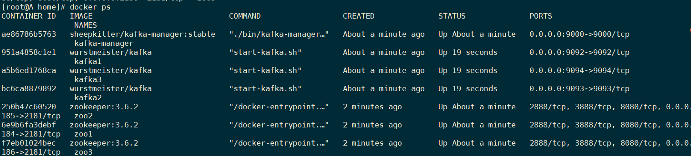
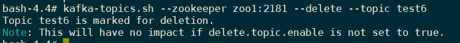

# 1. 消息队列MQ


## 消息队列的两种模式


### 点对点模式


点对点模式下包括三个角色

- 消息队列
- 发送者 (生产者)
- 接收者（消费者）  


点对点模式特点：

- **每个消息只有一个消费者**，一旦被消费，消息就不再在消息队列中；
- 发送者和接收者间**没有依赖性**，发送者发送消息之后，不管有没有接收者在运行，都不会影响发送者下次发送消息；
- 接收者在成功接收消息之后需**向队列应答成功**，以便**消息队列删除当前接收的消息**；  


### 发布/订阅模式


发布/订阅模式下包括三个角色：

- **角色主题（Topic）**  

- 发布者(Publisher)
- 订阅者(Subscriber)  


消息生产者（发布）将消息**发布到topic**中，同时有多个消息消费者（订阅）消费该消息。和点对点方式不同，发布到topic的消息会被**多个订阅者**消费。  


- 每个消息可以有**多个订阅者**；
- 发布者和订阅者之间有**时间上的依赖性**。对于某个交换机的订阅者，必须**创建一个订阅**后，才能消费发布者的消息
- 为了消费消息，订阅者必须保持在线运行。  


## 消息队列实现机制


### JMS


JMS（JAVA Message Service，Java消息服务）是一个Java平台中关于面向消息中间件的API

允许应用程序组件基于JavaEE平台创建、发送、接收和读取消息

是一个消息服务的标准或者说是规范，是 Java 平台上有关面向消息中间件的技术规范

便于消息系统中的 Java 应用程序进行消息交换,并且通过提供标准的产生、发送、接收消息的接口，简化企业应用的开发。

JMS 消息机制主要分为两种模型：PTP 模型和 Pub/Sub 模型。

实现产品：Apache ActiveMQ  


### AMQP


AMQP，即Advanced Message Queuing Protocol，一个提供统一消息服务的**应用层标准高级消息队列协议**，是**应用层**协议的一个开放标准，为面向消息的中间件设计。基于此协议的客户端与消息中间件可传递消息，并不受客户端/中间件**不同产品，不同的开发语言等条件的限制**。

Erlang中的实现有RabbitMQ等。  


|               | JMS                                                          | AMQP                                                         |
| ------------- | ------------------------------------------------------------ | ------------------------------------------------------------ |
| 定义          | Java api                                                     | Wire-protocol                                                |
| 跨语言        | 否                                                           | 是                                                           |
| 跨平台        | 否                                                           | 是                                                           |
| Model         | 提供两种消息模型/模式：（1）、Peer-2- Peer（2）、Pub/sub     | 提供了**五种消息模型**：（1）direct exchange（2）fanout exchange（3）topic change（4）headers exchange（5）system exchange。本质来讲，后四种和JMS的pub/sub模型没有太大差别，仅是在路 由机制上做了更详细的划分； |
| 支持消 息类型 | 多种消息类型：TextMessage、 MapMessage、BytesMessage、 StreamMessage、ObjectMessage、 Message （只有消息头和属性） | **byte[]**当实际应用时，有复杂的消息，可以将消息序列化后发送。 |
| 综合评 价     | JMS 定义了JAVA API层面的标准；在java 体系中，多个client均可以通过JMS进行交 互，不需要应用修改代码，但是其对跨平 台的支持较差； | AMQP定义了wire-level层的协议标准；天然具有跨平台、跨语言特性。 |

RabbitMQ：队列可以绑定到交换机，消息发送到交换机上，对应的队列就可以接受到


## 常见的消息队列产品  


- **RabbitMQ**
  RabbitMQ 2007年发布，是一个在AMQP(高级消息队列协议)基础上完成的，可复用的企业消息系统，是当前最主流的消息中间件之一。


- **ActiveMQ**
  ActiveMQ是由Apache出品，ActiveMQ 是一个完全支持JMS1.1和J2EE 1.4规范的 JMS Provider实现。它非常快速，支持多种语言的客户端和协议，而且可以非常容易的嵌入到企业的应用环境中，并有许多高级功能


- **RocketMQ**
  RocketMQ出自 阿里公司的开源产品，用 **Java 语言实现**，在设计时**参考了 Kafka**，并做出了自己的一些改进，消息可靠性上比 Kafka 更好。RocketMQ在阿里集团被广泛应用在订单，交易，充值，流计算，消息推送，日志流式处理等


- **Kafka**
  Apache Kafka是一个分布式消息发布订阅系统。它最初由LinkedIn公司基于独特的设计实现为一个分布式的提交日志系统( a distributed commit log)，之后成为Apache项目的一部分。Kafka系统快速、可扩展并且可持久化。它的分区特性，可复制和可容错都是其不错的特性。  


# kafka的基本介绍


## 2.1 什么是Kafka  


官网：http://kafka.apache.org/  


**分布式、分区的、多副本的、多订阅者**，**基于zookeeper协调**的分布式日志系统（也可以当做
MQ系统），常见可以用于web/nginx日志、访问日志，消息服务等等  


主要应用场景是：日志收集系统和消息系统。  


Kafka主要设计目标如下：

- 以时间复杂度为**O(1)**的方式提供**消息持久化**能力，即使对**TB级**以上数据也能保证**常数时间**的访问性能。 

- **高吞吐率**。即使在非常廉价的商用机器上也能做到单机支持每秒100K(10w)条消息的传输。
  - 支持普通服务器每秒百万级写入请求
  - **==Memory mapped Files==**
- 支持Kafka Server间的**消息分区**，及**分布式消费**，同时保证**每个partition**内的**消息顺序传输**。
- 同时支持**离线数据处理和实时数据处理**。
- Scale out:支持在线**水平扩展**  


## 2.2 kafka的特点  


（1）**解耦**。Kafka具备消息系统的优点，只要生产者和消费者数据两端遵循**接口约束**，就可以**自行扩展或修改数据处理的业务过程**。

（2）高吞吐量、低延迟。即使在非常廉价的机器上，Kafka也能做到每秒处理几十万条消息，而它的延迟最低只有几毫秒。

（3）持久性。Kafka可以将消息直接**持久化**在普通磁盘上，且磁盘读写性能优异。

（4）**扩展性**。Kafka集群支持**热扩展**，Kaka集群启动运行后，用户可以直接向集群添加节点。

（5）容错性,高可用。Kafka会将数据**备份**到多台服务器节点中，即使Kafka集群中的某一台加新的Kafka服务节点宕机，也**不会影响整个系统的功能**。

（6）支持**多种客户端语言**。Kafka支持Java、.NET、PHP、Python等多种语言。

（7）支持多生产者和多消费者。  


## 2.3 kafka的主要应用场景  


**消息处理（MQ）**：

KafKa可以代替传统的消息队列软件，使用KafKa来实现队列有如下优点 ：

- KafKa的append来实现**消息的追加**,保证消息都是有序的有**先来后到的顺序**  
- **稳定性强**。队列在使用中最怕丢失数据,KafKa能做到理论上的**写成功不丢失**  
- 分布式**容灾好**
- **容量大**。相对于内存队列,KafKa的容量受硬盘影响  
- 数据量**不会影响到KafKa的速度**  


---


**分布式日志系统(Log)**：

在很多时候我们需要对一些**庞大的数据进行存留**，日志存储这块会遇到巨大的问题，日志不能丢，日志存文件不好找，**定位一条消息成本高**（遍历当天日志文件）,实时**显示给用户**难，这几类问题KafKa都能游刃有余

- KafKa的**集群备份机制**能做到**n/2的可用**,当n/2以下的机器宕机时**存储的日志不会丢失**，一半的机器存储的是数据副本。
- KafKa可以对消息进行**分组分片**（分布式）
- KafKa非常容易做到**实时日志查询**  


----


**流式处理**：

流式处理就是指**实时地**处理一个或多个**事件流**。

流式的处理框架(spark, storm , flink) **从主题中读取数据, 对其进行处理, 并将处理后的结果数据写入新的主题**, 供用户和应用程序使用,kafka的强耐久性在流处理的上下文中也非常的有用  


# 3. kafka的架构


## 3.1 架构案例  


- **不同的消息生产者生产不同的消息**
- Kafka集群，可以有很多个实例，每一个实例都是一个broker
- topic主题：**一类消息**，订单主题/用户管理主题/....   
-   **分而治之，分散存储，分散计算，结果合并**


- Kafka Cluster：由多个服务器组成。每个服务器单独的名字broker（代理人）。
- kafka broker：kafka集群中包含的服务器
- Kafka Producer：消息生产者、发布消息到 kafka 集群的终端或服务。
- Kafka consumer：消息消费者、负责消费数据。
- Kafka Topic: 主题，一类消息的名称。存储数据时将**一类数据**存放在某个topic下，消费数据也是**消费一类数据**。
  - 订单系统：创建一个topic，叫做order。
  - 用户系统：创建一个topic，叫做user。
  - 商品系统：创建一个topic，叫做product。


**注意：Kafka的元数据都是存放在zookeeper中。  **


## 3.2 架构剖析  


**producer、consumer、broker 都需要向zookeeper注册中心进行注册！**

kafka支持**消息持久化**，消费端为**拉模型**来**拉取数据**，消费状态和订阅关系有客户端负责维护，消息消费完 后，不会立即删除，会**保留历史消息**。因此支持多订阅时，消息只会存储一份就可以了。

- **Broker**：kafka集群中包含一个或者多个服务实例，这种**服务实例被称为Broker**
- **Topic**：每条发布到kafka集群的消息都有**一个类别**，这个**类别就叫做Topic**
- **Partition**：分区，**物理**上的概念，每个**topic包含一个或多个partition**，一个partition对应一个文件夹，这个文件夹下存储**partition的数据和索引文件**，每个partition**内部是有序的**  

**每个topic分为多个partition，每个partition在其他机器上也都有备份**


## 3.3 关系解释


**Topic & Partition**  


- Topic 就是数据主题，是数据记录发布的地方,可以用来**区分业务系统**。
- Kafka中的Topics总是**多订阅者**模式，一个topic可以拥有一个或者多个消费者来**订阅它的数据**。
- 一个topic为**一类消息**，**每条消息必须指定一个topic**。
- 对于每一个topic， Kafka集群都会维持一个**==分区日志==**。如下图
- 每个分区都是**有序且顺序不可变的==记录集==**，并且不断地**==追加==**到结构化的commit log文件。
- 分区中的每一个记录都会分配一个**id号**来**==表示顺序==**，称之为**offset**，offset用来**==唯一的标识分区中每一条记录==**。  


在每一个消费者中**唯一保存的元数据是offset**（偏移量）即**消费在log中的位置**，偏移量**由消费者所控制：通常在读取记录后，消费者会以线性的方式增加偏移量**

**offset就是个==索引==，直接索引到下一个需要读取的消息。**

但是实际上，由于这个位置由消费者控制，所以消费者可以**采用任何顺序来消费记录**。例如，一个消费者可以**重置到一个旧的偏移量**，从而**重新处理过去的数据**；也可以**跳过**最近的记录，从"现在"开始消费。

这些细节说明Kafka 消费者是非常廉价的—消费者的增加和减少，**==对集群或者其他消费者没有多大的影响==**。  


> 类比数组，kafka里面存着**消息的数组**，***offset类似于数组下标***。Kafka与其它队列的一个区别是**offset是在消费端**进行维护，而不是服务端，因此**多个消费端可以消费同一个队列里的数据**，**并自行控制消费位置**
>
> offset其实是**消息消费的指针**，类似于java的list中的下标值，比如get(0),get(1)

**并且在新消息到来partition时，分区日志不会修改前面的数据，只会==不断向后追加==，而消费者端根据自己消费的情况维护着一个自己的offset值。每一个消费者只能绑定一个partition，一个topic可以被多个消费者绑定->取决于patition的数量？  。**

**那么就只会有一个消费者在消费当前这个partition的数据，那么这个消费者维护自己的offset来消费进入当前partition的消息就ok！**


# 4. kafka集群环境搭建  


ZooKeeper 作为给分布式系统**==提供协调服务==**的工具被 kafka 所依赖。在分布式系统中，消费者需要知道有哪些生产者是可用的，而如果每次消费者都需要和生产者建立连接并测试是否成功连接，那效率也太低了，显然是不可取的。而通过使用 ZooKeeper 协调服务，**Kafka就能将 Producer，Consumer，Broker 等结合在一起**，同时借助 ZooKeeper，Kafka 就能够将所有组件在无状态的条件下建立起**生产者和消费者的订阅关系**，**实现负载均衡**。  


## 4.1 集群准备 


准备三台服务器, 安装jdk ,其中每一台虚拟机的hosts文件中都需要配置三个节点的host名和ip映射，这里就使用之前RabbitMQ的A，B，C节点：


- 为kafka创建目录：

```
安装包存放的目录：/export/software
安装程序存放的目录：/export/servers
数据目录：/export/data
日志目录：/export/logs


创建各级目录命令:
mkdir -p /export/servers/
mkdir -p /export/software/
mkdir -p /export/data/
mkdir -p /export/logs/
```


- 配置zookeeper集群

  > 见zookeeper笔记。。。

成功启动zookeeper集群：


## 4.2 kafka安装


https://kafka.apachecn.org/downloads.html


```
将安装包上传至 /export/software

解压安装包到指定目录下
tar -zxvf kafka_2.11-1.0.0.tgz -C /export/servers/

cd /export/servers/

重命名(由于名称太长)
mv kafka_2.11-1.0.0 kafka
```


## 4.3 修改kafka的核心配置文件  


```
cd /export/servers/kafka/config/
vi server.properties
```


主要修改6个地方:
1) broker.id 需要保证每一台kafka都有一个独立的broker
2) log.dirs 数据存放的目录
3) zookeeper.connect zookeeper的连接地址信息
4) delete.topic.enable 是否直接删除topic
5) host.name 主机的名称
6) 修改: listeners=PLAINTEXT://A:9092  


```shell
#broker.id 标识了kafka集群中一个唯一broker。
broker.id=0
# 存放生产者生产的数据 数据一般以topic的方式存放
log.dirs=/export/data/kafka
# zk的信息
zookeeper.connect=A:2181,B:2181,C:2181
delete.topic.enable=true
host.name=node1
```


## 4.4 将配置好的kafka分发到其他二台主机  


```
cd /export/servers
scp -r kafka/ B:$PWD
scp -r kafka/ B:$PWD
```

> Linux scp 命令用于 Linux 之间复制文件和目录。
> scp 是 secure copy 的缩写, scp 是 linux 系统下基于 ssh 登陆进行安全的远程文件拷贝命令  


拷贝后, 需要修改每一台的broker.id 和 host.name和listeners  

```
ip为128的服务器: broker.id=0 , host.name=A listeners=PLAINTEXT://A:9092
ip为129的服务器: broker.id=1 , host.name=B listeners=PLAINTEXT://B:9092
ip为130的服务器: broker.id=2 , host.name=C listeners=PLAINTEXT://C:9092
```


在每一台的服务器执行创建数据文件的命令  

```
mkdir -p /export/data/kafka
```


## 4.5 启动集群  


**注意事项：在kafka启动前，一定要让zookeeper启动起来  **


```bash
cd /export/servers/kafka/bin
#前台启动
./kafka-server-start.sh /export/servers/kafka/config/server.properties
#后台启动
nohup ./kafka-server-start.sh /export/servers/kafka/config/server.properties 2>&1 &
注意：可以启动一台broker，单机版。也可以同时启动三台broker，组成一个kafka集群版
#kafka停止
./kafka-server-stop.sh
```


可以通过 jps 查看 kafka进程是否已经启动了  


三台机器都启动成功


登录的前提是, 通过jps是可以看到kafka的进程

```
登录zookeeper客户端: zkCli.sh
执行: ls /brokers/ids
```


kafka集群启动成功！！在zookeeper中已经进行了注册！


> 启动遇到的bug见坑。。


## 4.6 Docker环境下的Kafka集群搭建  


| hostname      | ip addr         | port      | listener |
| ------------- | --------------- | --------- | -------- |
| zoo1          | 192.168.0.11    | 2184:2181 |          |
| zoo2          | 192.168.0.12    | 2185:2181 |          |
| zoo3          | 192.168.0.13    | 2186:2181 |          |
| kafka1        | 192.168.0.14    | 9092:9092 | kafka1   |
| kafka2        | 192.168.0.15    | 9093:9092 | kafka1   |
| kafka3        | 192.168.0.16    | 9094:9092 | kafka1   |
| kafka-manager | 192.168.0.17    | 9000:9000 |          |
| 宿主机        | 192.168.150.128 |           |          |


### 安装docker - compose  


Compose 是用于定义和运行多容器 Docker 应用程序的工具。

如果我们还是使用原来的方式操作docker，那么就需要**下载三个镜像**：Zookeeper、Kafka、Kafka-Manager，需要对**Zookeeper安装三次并配置集群**、需要**对Kafka安装三次，修改配置文件**，Kafka-Manager安装一次，但是需要配置端口映射机器Zooker、Kafka容器的信息。

但是引入Compose之后可以使用**yaml格式的配置文件**配置好这些信息，**每个image只需要编写一个yaml文件**，可以**在文件中定义集群信息、端口映射等信息**，运行该文件即可创建完成集群。

通过 Compose，您可以使用 YML 文件来**配置应用程序需要的所有服务**。然后，使用一个命令，就可以从 YML 文件配置中**创建并启动所有服务**。

----

Compose 使用的两个步骤：

- 使用 docker-compose.yml **定义构成应用程序的服务**，这样它们**可以在隔离环境中一起运行**。
- 执行 docker-compose up 命令来**启动并运行整个应用程序**。  


```bash
#curl 是一种命令行工具，作用是发出网络请求，然后获取数据
curl -L https://github.com/docker/compose/releases/download/1.8.0/run.sh > /usr/local/bin/docker-compose
#chmod（change mode）命令是控制用户对文件的权限的命令
chmod +x /usr/local/bin/docker-compose
#查看版本
docker-compose --version
```


----

拉取镜像：

```
docker pull zookeeper:3.6.2
docker pull wurstmeister/kafka:latest
docker pull sheepkiller/kafka-manager:stable
```


---

**创建集群网络**

基于linux宿主机，也是在linux宿主机创建，创建之后docker中的各个应用程序可以使用该网络

```
#创建
docker network create --driver bridge --subnet 192.168.0.0/24 --gateway 192.168.0.1 kafka
#查看
docker network ls
```


---

**网络设置**


新建网段之后可能会出现：WARNING: IPv4 forwarding is disabled. Networking will not work.
解决方式：
第一步：在宿主机上执行： echo "net.ipv4.ip_forward=1" >>/usr/lib/sysctl.d/00-system.conf
第二步：重启network和docker服务
[root@localhost /]# systemctl restart network && systemctl restart docker  


### 搭建过程  


**每个镜像一个Yml文件**，Zookeeper、Kafka、Kafka-Manager各一个


编写yml文件  ：

----

- docker-compose-zookeeper.yml  


Zookeeper**各个节点的信息，端口映射，集群信息，网络配置**  


```yaml
version: '2' #指定 compose 文件的版本
services: #通过镜像安装容器的配置
  zoo1:
    image: zookeeper:3.4 #使用的镜像
    restart: always #当Docker重启时，该容器重启
    hostname: zoo1 #类似于在基于Linux虚拟机Kafka集群中hosts文件的值
    container_name: zoo1
    ports:
      - 2181:2181 #端口映射
    environment: #集群环境
      ZOO_MY_ID: 1 #当前Zookeeper实例的id
      ZOO_SERVERS: server.1=0.0.0.0:2888:3888 server.2=zoo2:2888:3888 server.3=zoo3:2888:3888 #集群节点
    networks: #使用的网络配置
      kafka:
        ipv4_address: 192.168.0.11
  zoo2:
    image: zookeeper:3.4
    restart: always
    hostname: zoo2
    container_name: zoo2
    ports:
      - 2181:2181
    environment:
      ZOO_MY_ID: 2
      ZOO_SERVERS: server.1=zoo1:2888:3888 server.2=0.0.0.0:2888:3888 server.3=zoo3:2888:3888
    networks:
      kafka:
        ipv4_address: 192.168.0.12
  zoo3:
    image: zookeeper:3.4
    restart: always
    hostname: zoo3
    container_name: zoo3
    ports:
      - 2181:2181
    environment:
      ZOO_MY_ID: 3
      ZOO_SERVERS: server.1=zoo1:2888:3888 server.2=zoo2:2888:3888 server.3=0.0.0.0:2888:3888
    networks:
      kafka:
        ipv4_address: 192.168.0.13
networks:
  kafka:
    external:
      name: kafka
```


---

- docker-compose-kafka.yml  

```yaml
version: '2'
services:
  kafka1:
    image: wurstmeister/kafka #image
    restart: always
    hostname: kafka1
    container_name: kafka1
    privileged: true
    ports:
      - 9092:9092
    environment: #集群环境配置
      KAFKA_ADVERTISED_HOST_NAME: kafka1
      KAFKA_LISTENERS: PLAINTEXT://kafka1:9092
      KAFKA_ADVERTISED_LISTENERS: PLAINTEXT://kafka1:9092
      KAFKA_ADVERTISED_PORT: 9092
      KAFKA_ZOOKEEPER_CONNECT: zoo1:2181,zoo2:2181,zoo3:2181
    external_links: # 配置Zookeeper集群的地址
      - zoo1
      - zoo2
      - zoo3
    networks:
      kafka:
        ipv4_address: 192.168.0.14
  kafka2:
    image: wurstmeister/kafka
    restart: always
    hostname: kafka2
    container_name: kafka2
    privileged: true
    ports:
      - 9093:9093
    environment:
      KAFKA_ADVERTISED_HOST_NAME: kafka2
      KAFKA_LISTENERS: PLAINTEXT://kafka2:9093
      KAFKA_ADVERTISED_LISTENERS: PLAINTEXT://kafka2:9093
      KAFKA_ADVERTISED_PORT: 9093
      KAFKA_ZOOKEEPER_CONNECT: zoo1:2181,zoo2:2181,zoo3:2181
    external_links:
      - zoo1
      - zoo2
      - zoo3
    networks:
      kafka:
        ipv4_address: 192.168.0.15
  kafka3:
    image: wurstmeister/kafka
    restart: always
    hostname: kafka3
    container_name: kafka3
    privileged: true
    ports:
      - 9094:9094
    environment:
      KAFKA_ADVERTISED_HOST_NAME: kafka3
      KAFKA_LISTENERS: PLAINTEXT://kafka3:9094
      KAFKA_ADVERTISED_LISTENERS: PLAINTEXT://kafka3:9094
      KAFKA_ADVERTISED_PORT: 9094
      KAFKA_ZOOKEEPER_CONNECT: zoo1:2181,zoo2:2181,zoo3:2181
    external_links:
      - zoo1
      - zoo2
      - zoo3
    networks:
      kafka:
        ipv4_address: 192.168.0.16
networks:
  kafka:
    external:
      name: kafka
```


docker-compose-manager.yml  

```yaml
version: '2'
services:
  kafka-manager:
    image: sheepkiller/kafka-manager:stable
    restart: always
    container_name: kafka-manager
    hostname: kafka-manager
    ports:
      - 9000:9000
    environment: #可以管理zoo集群和kafka集群
      ZK_HOSTS: zoo1:2181,zoo2:2181,zoo3:2181
      KAFKA_BROKERS: kafka1:9092,kafka2:9092,kafka3:9092
      APPLICATION_SECRET: letmein
      KM_ARGS: -Djava.net.preferIPv4Stack=true
    networks:
      kafka:
        ipv4_address: 192.168.0.17
networks:
  kafka:
    external:
      name: kafka
```


将yaml文件上传到Docker宿主机中  

上传到指定目录  


开始部署
使用命令：`docker-compose up -d`
参数说明： up表示启动， -d表示后台运行

参数说明： -f:表示加载指定位置的yaml文件

```
docker-compose -f /home/docker-compose-zookeeper.yml up -d
docker-compose -f /home/docker-compose-kafka.yml up -d
docker-compose -f /home/docker-compose-manager.yml up -d  
```





测试
浏览器访问宿主机：http://192.168.150.128:9000/  


这时候无法访问！

需要手动添加zookeeper集群信息：


查看kafka集群：


创建一个topic：


# 5. kafka的基本操作  

在docker环境中演示  


## 5.1 创建topic  


创建一个名字为test的主题， 有一个分区，有三个副本。一个主题下可以有多个分区，每个分区可以用对应的副本。  


```bash
#登录到Kafka容器
docker exec -it kafka1 /bin/bash
#切换到bin目录
cd opt/kafka/bin/
#执行创建
kafka-topics.sh --create --zookeeper zoo1:2181 --replication-factor 3 --partitions 1 --topic test
```


--create：新建命令
--zookeeper：Zookeeper节点，一个或多个都可以，集群同步
--replication-factor：指定副本，**每个分区有三个副本**。
--partitions：1  


```
kafka-topics.sh --create --zookeeper zoo1:2181 --replication-factor 1 --partitions 3 --topic test3
```


3个分区，每个分区有一个副本


## 5.2 查看主题命令  


查看kafka当中存在的主题  ：

```
kafka-topics.sh --list --zookeeper zoo1:2181,zoo2:2181,zoo3:2181
```


__consumer_offsets 这个topic是由kafka自动创建的，默认50个分区，存储消费位移信息（offset），老版本架构中是存储在Zookeeper中。  


## 5.3 生产者生产数据  


模拟生产者来生产数据：

Kafka**自带一个命令行客户端**，它从文件或标准输入中获取输入，并将其**作为message**（消息）发送到Kafka集群。

默认情况下，每行将作为单独的message发送。

运行 producer，然后在控制台输入一些消息以发送到服务器  

```
kafka-console-producer.sh --broker-list kafka1:9092,kafka2:9093,kafka3:9094 --topic test
This is a message
This is another message
```


## 5.4 消费者消费数据  


```
kafka-console-consumer.sh --bootstrap-server kafka1:9092, kafka2:9093, kafka3:9094 --topic test --from-beginning
```


在使用的时候会用到`bootstrap-server`与`broker-list`其实是实现一个功能，broker.list是旧版本命令。  


**顺序被打乱了！如果当前topic只有一个分区，那么一定是有序的。如果多个分区，只能保证在某个==分区内部==的消息是有序的，但当前三个消息分布在了多个分区中，无法保证**

- 确保消费者消费的消息是顺序的，需要把消息存放在**同一个**topic的**同一个分区**
- 一个主题多个分区，**分区内消息有序**。  


## 5.5 运行describe的命令  


运行describe查看topic的相关详细信息  

```
#查看topic主题详情，Zookeeper节点写一个和全部写，效果一致

kafka-topics.sh --describe --zookeeper zoo1:2181,zoo2:2181,zoo3:2181 --topic test5

Topic: test5    PartitionCount: 2       ReplicationFactor: 2    Configs:

Topic: test5    Partition: 0    Leader: 1002    Replicas: 1002,1003     Isr: 1003,1002
Topic: test5    Partition: 1    Leader: 1003    Replicas: 1003,1001     Isr: 1003,1001

```

第一行给出了所有**分区的摘要**，每个附加行提供有关**一个分区**的信息。有几个分区，下面就显示几行：

leader：是负责给定分区的**所有读取和写入的节点**。每个节点将成为随机选择的分区部分的领导者。

replicas：显示给定partiton**所有副本（就是这个partition在集群中存在几份数据，包括leader和副本）**所存储节点的节点列表，不管该节点**是否是leader或者是否存活**。

isr：副本都**已同步**的的节点集合，这个集合中的所有节点都是**存活状态**，并且**跟leader同步**  。**真实存在的且有效的副本节点**


## 5.6 增加topic分区数  


任意kafka服务器执行以下命令可以增加topic分区数  


```
kafka-topics.sh --zookeeper zoo1:2181 --alter --topic test --partitions 8
```


## 5.7 增加配置  

fsync：同步内存中所有已修改的文件数据到储存设备

`flush.messages`：此项配置指定**时间间隔**：强制进行fsync日志，默认值为None。

例如，如果这个选项设置为1，那么**每条消息**之后都需要进行**fsync**，如果设置为5，则**每5条消息**就需要进行一次fsync。

一般来说，建议不要设置这个值。此参数的设置,需要在**"数据可靠性"与"性能"**之间做必要的权衡

- 如果此值过大,将会导致**每次"fsync"的时间较长**(IO阻塞)。
- 如果此值过小,将会导致"fsync"的次数较多，这也意味着整体的client请求有一定的延迟，物理server故障，将会导致没有fsync的消息丢失。  

**消费者生产消息->Kafka->先放在内存中**

```
kafka-topics.sh --zookeeper zoo1:2181 --alter --topic test --config flush.messages=1
```


## 5.8 删除配置  

动态删除kafka集群配置  

```
kafka-topics.sh --zookeeper zoo1:2181 --alter --topic test --delete-config flush.messages
```


## 5.9 删除topic  


目前删除topic在默认情况只是打上一个**删除的标记**，在磁盘中仍然存在的，在重新启动kafka后才删除。如果需要立即删除，则需要在`server.properties`中配置：

`delete.topic.enable=true`，默认为false（集群中的所有实例节点，在搭建虚拟机集群的时候设置过），一个主题会在不同的kafka节点中分配**分组信息和副本信息**，然后执行以下命令进行删除topic 的所有partition和replica

```
kafka-topics.sh --zookeeper zoo1:2181 --delete --topic test6
```



**只是标记为删除**

这时候也无法看到并且访问


# 6. Java API操作kafka


> 宿主ip地址有改变：192.168.150.128

**通过访问centos的ip地址来访问kafka容器，对kafka容器做了端口映射，通过每个kafka容器对应的端口，使用centos宿主机的对应端口来访问kafka容器**


**将kafka的hostname定义一份在windows的hosts文件中，**

修改Windows的Hosts文件：  

```
192.168.150.128 kafka1
192.168.150.128 kafka2
192.168.150.128 kafka3
```


- 导入kafka相关的依赖  

```xml
<dependency>
   <groupId>org.apache.kafka</groupId>
   <artifactId>kafka-clients</artifactId>
   <version>1.0.0</version>
</dependency>
```


## 6.1 消息生产者


```java
/**
 * 消息生产者
 */
public class Producer {

    public static void main(String[] args) throws InterruptedException {
        Properties properties = new Properties();
        //要构造一个消息生产者对象，关于kafka集群等相关配置，可以从properties文件中加载，也可以从properties对象中加载
        //指定kafka的集群节点
        properties.put(ProducerConfig.BOOTSTRAP_SERVERS_CONFIG,"192.168.150.128:9092,192.168.150.128:9093,192.168.150.128:9094");
        //发送消息，涉及到网络传输，需要对key和value指定对应的序列化类
        properties.put(ProducerConfig.KEY_SERIALIZER_CLASS_CONFIG, StringSerializer.class);
        properties.put(ProducerConfig.VALUE_SERIALIZER_CLASS_CONFIG, StringSerializer.class);
        //创建消息生产者对象，配置连接信息.....
        KafkaProducer<String, String> producer = new KafkaProducer<String, String>(properties);

        //主题
        String topic = "hcr";
        //发送出100条消息
        for(int i = 0; i < 100; i++){
            //设置消息的内容
            String msg = "hello kafka " + i;
            //构建消息对象，主题+消息，若主题不存在，kafka会帮我们创建一个：1个分区，1个副本的topic
            ProducerRecord<String, String> record = new ProducerRecord<>(topic, msg);
            //发送
            producer.send(record);
            Thread.sleep(100);
        }
        System.out.println("消息发送成功！");
        //关闭生产者
        producer.close();
    }
}
```


## 6.2 消息消费者


```java
public class Consumer {

    public static void main(String[] args) {
        Properties properties = new Properties();
        properties.put(ProducerConfig.BOOTSTRAP_SERVERS_CONFIG,"192.168.150.128:9092,192.168.150.128:9093,192.168.150.128:9094");
        //反序列化
        properties.put(ConsumerConfig.KEY_DESERIALIZER_CLASS_CONFIG, StringDeserializer.class);
        properties.put(ConsumerConfig.VALUE_DESERIALIZER_CLASS_CONFIG, StringDeserializer.class);
        //指定分组名称
        properties.put(ConsumerConfig.GROUP_ID_CONFIG, "hcrgroup");
        KafkaConsumer<String,String> kafkaConsumer = new KafkaConsumer<String, String>(properties);

        //订阅消息  选择一个或多个topic进行订阅
        String topic = "hcr";
        kafkaConsumer.subscribe(Collections.singletonList(topic));

        //获取消息的方法是一个阻断式方法
        while(true){
            //拉取数据  如果没有新消息就在这里一直等待
            ConsumerRecords<String, String> records = kafkaConsumer.poll(500);
            for(ConsumerRecord<String,String> record : records){
                System.out.println("主题："+record.topic()+ "   偏移量："+record.offset()+"   msg："+record.value());
            }
        }
    }
}
```


需要指定组名

如果20个分区，3个副本

同一个分组下的，防止这些消费者在读取的时候进行 **重复读取**。

**防止多个消费者同时消费一个partition中的消息，但是同时一个消费者是可以订阅多个partition的，topic将自己的partitions均匀的分给这个组中的消费者来处理消息**


消费者受到消息：


利用率为1/3，因为默认只创建了1个partition。


# 7. Apache Kafka原理


## 7.1 分区副本机制


kafka；有三层结构：**kafka有多个主题，每个主题有多个分区&副本，每个分区又有多条消息**

分区机制：主要解决了 **单台服务器存储容量有限 和 单台服务器并发数限制**的问题，一个分片的不同副本**不能放到同一个broker**上

当主题数据量非常大时，一个服务器存放不下，就将数据分成两个或者多个部分，存放在多台服务器上，每个服务器上的数据，叫做一个分片partition。


**分区对于 Kafka 集群的好处是：**

- **实现负载均衡**

- **高存储能力**

- **高伸缩性**

**分区对于消费者来说，可以提高并发度，提高效率。  **


----

**副本**：副本备份机制解决了**数据存储的高可用**问题

当数据只保存一份的时候，有丢失的风险。为了更好的**容错和容灾**，将数据拷贝几份，保存到不同的机器上。  


多个follower副本通常存放在和leader副本**==不同的==**broker中。通过这样的机制实现了**高可用**，当某台机器挂掉后，其他follower副本也能**迅速”转正“**，开始**对外提供服务**。  


- kafka的副本都有哪些作用？

  在kafka中，实现副本的目的就是**冗余备份**，且**==仅仅是冗余备份==**，**==所有的读写请求都是由leader副本进行处理的==**。follower副本仅有一个功能，那就是从leader副本**拉取消息**，尽量让自己跟leader副本的***内容一致***。  


- 说说follower副本为什么不对外提供服务(读取)？

  这个问题本质上是对**性能和一致性**的取舍。试想一下，如果follower副本也对外提供服务那会怎么样呢？首先，性能是肯定会有所提升的。但同时，会出现一系列问题。类似数据库事务中的**幻读，脏读**。  


> 比如你现在写入一条数据到kafka主题a，消费者b从主题a消费数据，却发现消费不到，因为消费者b去**读取的那个分区**副本中，**最新消息还没写入**。而这个时候，另一个消费者c却可以消费到最新那条数据，因为它**消费了leader副本**。多个副本间的数据总会有不一致的时候，同步需要消耗时间！！所以保证只有一个***leader副本来进行所有操作***，其他follower副本只是**作为备份，及时同步数据**即可。
>
> 为了提高那么些性能而导致出现**数据不一致**问题，那显然是不值得的  
>


---


**1个partition（多个副本中的leader）只能被==同组==的==一个consumer==消费，同组的其他consumer则起到均衡效果，其他的consumer只能消费这个主题的其他partition的leader分片**

**当同组消费者数量多于partition的数量时，多余的消费者空闲**


**也就是说如果只有一个partition你在同一组启动多少个consumer都没用，==partition的数量决定了此topic在同一组中被可被均衡的程度==，例如partition=4，则可在同一组中被最多4个consumer均衡消费。**消费者少于和等于partition


如果是不同组的消费者，那么不论当前这个topic的partition是否被其他组的消费者消费了，当前组的消费者仍然可以继续消费这个partition，**并记录着自己的offset来读取消息，和别的组的消费者不冲突**


## 7.2 kafka保证数据不丢失机制  


从Kafka的大体角度上可以分为**数据生产者**，**Kafka集群**，还有就是**消费者**，而要保证数据的不丢失也要从这**三个角度**去考虑。  


### 消息生产者


消息生产者保证数据不丢失：消息确认机制（ACK机制）,参考值有三个：0,1，-1  


```java
//producer无需等待来自broker的确认而继续发送下一批消息。
//这种情况下数据传输效率最高，但是数据可靠性确是最低的。
properties.put(ProducerConfig.ACKS_CONFIG,"0");

//producer只要收到  一个分区副本成功写入->leader的通知就认为推送消息成功了。
//这里有一个地方需要注意， 这个副本必须是leader副本。
//只有leader副本成功写入了，producer才会认为消息发送成功。
properties.put(ProducerConfig.ACKS_CONFIG,"1");

//ack=-1，简单来说就是，producer只有收到分区内所有副本的成功写入的通知才认为推送消息成功了。
properties.put(ProducerConfig.ACKS_CONFIG,"-1");
```


### 消费者


kafka消费消息的模型:  


什么时候消费者丢失数据呢？

由于Kafka consumer默认是**自动提交位移**的（**==先更新位移，再消费消息==**），如果消费程序出现故障，**没消费完毕，则丢失了消息**，此时，**broker并不知道**。  


- 解决方案：

`enable.auto.commit=false` 关闭自动提交位移

在消息**被完整处理之后再手动提交位移**  

```java
properties.put(ConsumerConfig.ENABLE_AUTO_COMMIT_CONFIG,"false");
```


## 7.3 消息存储及查询机制  


kafka 使用**日志文件**的方式来保存生产者消息，每条消息都有一个 offset 值来表示它在分区中的偏移量。

Kafka 中存储的一般都是海量的消息数据，为了避免日志文件过大，**一个分片** 并不是直接对应在一个磁盘上的日志文件，而是**对应磁盘上的一个目录**，这个目录的命名规则是`<topic_name>_<partition_id>`。

kafka容器数据目录：
/kafka/kafka-logs-kafka1  


当前只有一个partition，存储在1002这个节点上，


在这里！


### 7.3.1 消息存储机制


只负责消息的**临时存储**，需要删除过期数据。将一个partition的数据切分成多个有时间标记的文件，便于大段数据的删除


**log分段：**

每个**==分片==**目录中，kafka 通过**==分段==**的方式将 **数据分为多个 LogSegment**。

一个 LogSegment 对应磁盘上的一个日志文件（00000000000000000000.log）和一个索引文件(00000000000000000000.index)。

其中**日志文件是用来记录消息**的。**索引文件是用来保存消息的索引**。

每个LogSegment 的大小可以在`server.properties 中log.segment.bytes=107370` （设置分段大小,默认是1gb）选项进行设置。

当log文件等于1G时，**新的会写入到下一个segment中**。  


timeindex文件，是kafka的具体时间日志  

**通过文件名称，可以找到offset具体在哪个日志文件中**


### 7.3.2 通过 offset 查找 message  


存储的结构：**==一个主题 --> 多个分区 ----> 多个日志段==**（多个日志文件）


第一步：查询segment file：  **通过topic+partition绑定一个存储日志文件的文件夹**
segment file命名规则跟offset有关，根据segment file可以知道它的起始偏移量，因为**Segment file的命名规则**是上一个segment文件最后一条消息的offset值。所以只要**根据offset 二分查找文件列表，就可以快速定位到具体文件**。

比如：

- 第一个segment file是00000000000000000000.index表示最开始的文件，**起始偏移量(offset)为0。**
- 第二个是00000000000000091932.index：代表消息量起始偏移量为**91933** = 91932 **+ 1**。那么offset=5000时应该定位00000000000000000000.index索引文件，offset=91934应该定位在00000000000000091932.index文件中


第二步：通过segment file**查找message**：
通过第一步定位到segment file，当offset=5000时，依次定位到00000000000000000000.index的**元数据物理位置**和00000000000000000000.log的**物理偏移地址**，然后再通过00000000000000000000.log**顺序查找直到offset=5000**为止。  


## 7.4 生产者消息分发策略


一个消息到底是发送给topic的哪一个分区呢？p1? p2? p3?

kafka在数据生产的时候，有一个数据分发策略。默认的情况使用`DefaultPartitioner.class`类。 

默认实现类：org.apache.kafka.clients.producer.internals.DefaultPartitioner   

`public class DefaultPartitioner implements Partitioner `

```java
public interface Partitioner extends Configurable, Closeable {
    int partition(String var1, Object var2, byte[] var3, Object var4, byte[] var5, Cluster var6);

    void close();
}
```


1） 如果是用户**指定了partition**，生产就不会调用DefaultPartitioner.partition()方法

数据分发策略的时候，**可以指定数据发往哪个partition**。

当ProducerRecord 的**构造参数**中有partition的时候，就可以**发送到对应partition上**  


---

2） DefaultPartitioner源码

如果指定key，是**取决于key(通过 `ProducerRecord `构造方法传入的key) 的hash值**

如果**不指定key，轮询分发**  

```java
public int partition(String topic, Object key, byte[] keyBytes, Object value, byte[] valueBytes, Cluster cluster) {
    //获取topic的分区列表
    List<PartitionInfo> partitions = cluster.partitionsForTopic(topic);
    int numPartitions = partitions.size();
    //如果传入的key值为null，那么就是轮询机制
    if (keyBytes == null) {
        //维护一个key为topic的ConcurrentHashMap，并通过CAS操作的方式对value值执行递增+1操作  nextValue就是这个map的value，对这个数进行取模操作来进行轮询
        int nextValue = this.nextValue(topic);
        //获取该topic的可用分区列表
        List<PartitionInfo> availablePartitions = cluster.availablePartitionsForTopic(topic);
        if (availablePartitions.size() > 0) {
            
            int part = Utils.toPositive(nextValue) % availablePartitions.size();
            return ((PartitionInfo)availablePartitions.get(part)).partition();
        } else {
            //没有可用分区的话，就随便给出一个不可用分区
            return Utils.toPositive(nextValue) % numPartitions;
        }
    } else {
        //指定了key，通过计算key的hash值，确定消息分区。murmur2是个哈希算法
        return Utils.toPositive(Utils.murmur2(keyBytes)) % numPartitions;
    }
}
```


## 7.5 消费者负载均衡机制  


==同一个分区中的数据，只能被一个消费者组中的一个消费者所消费。==

例如 P0分区中的数据不能被Consumer Group A中C1与C2**同时消费**。

消费组：**一个消费组中可以包含多个消费者**，`properties.put(ConsumerConfig.GROUP_ID_CONFIG,"groupName")；`

如下图：如果该消费组有四个消费者，主题有四个分区，那么**每人一个**。多个消费**组**可以**重复消费消息**。**一个消费组不能重复消费消息**  

如果该消费组只有2个消费者，同时主题有4个分区，那么一个消费者分配两个partition。


- 如果有**2个Partition**, p0/p1，同一个消费组有**3个消费者**，c0/c1/c3，则其中有一个消费者**==空闲==**，另外2个消费者消费分别**各自消费一个分区**的数据；  


# 8. kakfa配置文件说明  


**server.properties**  


1. broker.id=0：  

kafka集群是由多个节点组成的，每个节点称为一个broker，中文翻译是代理。**每个broker都有一个不同的brokerId**，由`broker.id`指定，是一个不小于0的整数，**各brokerId必须不同**，但不必连续。如果我们想扩展kafka集群，**只需引入新节点**，**分配一个不同的broker.id**即可。

启动kafka集群时，每一个broker都会实例化并启动一个kafkaController，并将该broker的brokerId注册到zooKeeper的相应节点中。集群各broker会根据选举机制**选出其中一个broker作为leader**，即leader kafkaController。leader kafkaController**==负责主题的创建与删除、分区和副本的管理==**等。当leader kafkaController宕机后，其他broker会**再次选举**出新的leader kafkaController。  


当前kafka容器集群的broker.id=-1，说明是使用kafka自动生成的id


2. log.dir = /export/data/kafka/  

broker持久化消息到哪里，数据目录  


3. log.retention.hours = 168  

**log文件最小存活时间**，默认是168h，即7天。相同作用的还有`log.retention.minutes、log.retention.ms`。**retention是保存**的意思。数据存储的最大时间超过这个时间会根据`log.cleanup.policy`设置的策略处理数据，也就是消费端能够多久去消费数据。log.retention.bytes（文件大小）和log.retention.hours任意一个达到要求，**都会执行删除**，会被**topic创建时的指定参数**覆盖。  


4. log.retention.check.interval.ms

**多长时间检查一次**是否有log文件要删除。默认是300000ms，即5分钟。  


5. log.retention.bytes  

限制**单个分区的log文件**的最大值，超过这个值，将**删除旧的log**，以满足log文件不超过这个值。默认是-1，即不限制。  


6. log.roll.hours

**多少时间**会生成一个**新的log segment**，默认是168h，即7天。相同作用的还有log.roll.ms、segment.ms。  


7. log.segment.bytes

**log segment多大**之后会生成一个**新的log segment**，默认是1073741824，即**1G**。  


8. **log.flush.interval.messages**

指定broker每收到几个消息就把消息**从内存刷到硬盘**（刷盘）。默认是9223372036854775807 好大。

kafka官方**不建议使用**这个配置，建议使用**副本机制**和**操作系统的后台刷新功能**，因为这更高效。这个配置可以**根据不同的topic设置不同的值**，即在**创建topic的时候**设置值。  


> 在Linux操作系统中，当我们把数据写入到文件系统之后，数据其实**在操作系统的page cache里面，并没有刷到磁盘上去**。如果此时操作系统挂了，其实**数据就丢了**。
>
> 1、kafka是**多副本**的，当你配置了同步复制之后。**多个副本的数据都在page cache**里面，出现多个副本同时挂掉的概率比1个副本挂掉，概率就小很多了
>
> 2、操作系统有**==后台线程，定期刷盘==**。如果应用程序每写入1次数据，都调用一次fsync，那**性能损耗**就很大，所以一般都会在**性能和可靠性**之间进行权衡。因为对应一个应用来说，虽然应用挂了，只要操作系统不挂，数据就不会丢。  


9. log.flush.interval.ms

指定broker**每隔多少毫秒**就把消息从内存刷到硬盘。默认值同log.flush.interval.messages一样， 9223372036854775807。
同log.flush.interval.messages一样，kafka官方**不建议**使用这个配置。  


10. delete.topic.enable=true

是否允许**从物理上删除topic**  ，默认是从逻辑上删除，但实际存储的分片数据并没有删除


# 9. kafka监控与运维  


## 9.1 kafka-eagle概述  


在生产环境下，在Kafka集群中，**消息数据变化**是我们关注的问题，当业务前提不复杂时，我们可以使用Kafka 命令提供带有**Zookeeper客户端**工具的工具，可以轻松完成我们的工作。随着业务的复杂性，**增加Group和 Topic**，那么我们使用Kafka提供命令工具，已经感到无能为力，那么Kafka监控系统目前尤为重要，我们需要观察 消费者应用的细节。

为了简化开发者和服务工程师维护Kafka集群的工作有一个监控管理工具，叫做 **Kafka-eagle**。这个管理工具可以**很容易地发现分布在集群中的哪些topic分布不均匀**，或者是**分区在整个集群分布不均匀**的的情况。它**支持管理多个集群、选择副本、副本重新分配以及创建Topic**。同时，这个管理工具也是一个非常好的可以**快速浏览这个集群**的工具


## 9.2 搭建安装 kafka-eagle  


需要安装jdk，启动zk以及kafka的服务  


```
# 启动Zookeeper
./zkServer.sh start

#启动Kafka
nohup ./kafka-server-start.sh /export/servers/kafka/config/server.properties 2>&1 &
```


修改hosts：

```
192.168.150.128 A
192.168.150.129 B
192.168.150.130 C
```


1. 下载kafka-eagle的源码包
   kafka-eagle官网：
   http://download.kafka-eagle.org/
   我们可以从官网上面直接下载最新的安装包即可kafka-eagle-bin-1.3.2.tar.gz这个版本即可
   代码托管地址：
   https://github.com/smartloli/kafka-eagle/releases


2. 上传安装包并解压:
   这里我们选择将kafak-eagle安装在第三台
   如果要解压的是zip格式，需要先安装命令支持。  

`unzip解压`

```
cd kafka-eagle-web/target
tar -zxf kafka-eagle-web-2.0.1-bin.tar.gz -C /export/servers
```


3. 准备数据库:
   kafka-eagle需要使用一个数据库来保存一些元数据信息，我们这里直接使用msyql数据库来保存即可，在A服务器执行以下命令创建一个mysql数据库即可  

```
--进入mysql客户端:
create database eagle;
```


4. 修改kafka-eagle配置文件  


```
cd /export/servers/kafka-eagle-web-2.0.1/conf
vim system-config.properties


#内容如下:
kafka.eagle.zk.cluster.alias=cluster1
cluster1.zk.list=A:2181,B:2181,C:2181

kafka.eagle.driver=com.mysql.jdbc.Driver
kafka.eagle.url=jdbc:mysql://192.168.150.129:3306/eagle?useSSL=false&serverTimezone=GMT%2B8
kafka.eagle.username=root
kafka.eagle.password=Hcr123..
```


**这里最好使用mysql5.7，mysql8版本会导致无法连接的问题**

将存储在zookeeper这个配置去掉，新版本的offset存储在kafka中。


> 默认情况下MySQL只允许本机连接到MYSQL实例中，所以如果要远程访问，必须开放权限：
>
> update user set host = '%' where user ='root'; //修改权限
> flush privileges; //刷新配置  


5. 配置环境变量

kafka-eagle必须配置环境变量，node03服务器执行以下命令来进行配置环境变量  


```
vi /etc/profile


#内容如下:
export KE_HOME=/export/servers/kafka-eagle-bin-1.3.2/kafka-eagle-web-1.3.2
export PATH=:$KE_HOME/bin:$PATH
#让修改立即生效，执行
source /etc/profile
```


6. 启动kakfa-eagle  

```
cd /export/servers/kafka-eagle-web-2.0.1/bin
chmod u+x ke.sh
./ke.sh start
```


`chmod 777 jar`


7. 访问kafka eagle界面

http://192.168.150.128:8048/account/signin?/ke/account/signin?/ke/

用户名：admin
密码：123456  


慢的令人发指。。。


辛苦您了。。


# 分区和副本解析

下图：


3个brokers，2个partitions，每个分区2个副本。

- partition0分布在：2 ，3号broker上，其中2号为这两个分片的leader

- partition1分布在：1， 3号broker上，其中3号为这两个分片的leader


**副本数 `--replication-factor`  至少设置为2，如果设为1，那么一共就一个分片，没有另外的副本**


每个副本肯定分布在不同的kafka节点(broker)上！

**故而：副本的数量不能超过broker的数量，否则创建主题时会失败。——>  如果有broker数量+1的副本数量，那么肯定有一台kafka节点上有两个相同的副本。不允许出现这种情况！**


# 坑


## kafka启动报错


`bin/kafka-run-class.sh`中：

```
JAVA_MAJOR_VERSION=$($JAVA -version 2>&1 | sed -E -n 's/.* version "([^.-]*).*"/\1/p')
```

This makes the `if [[ "$JAVA_MAJOR_VERSION" -ge "9" ]]` condition fail to identify the correct Java version, and adds some unsupported GC options.

Changing the line above to this solved my problem:

```
JAVA_MAJOR_VERSION=$($JAVA -version 2>&1 | sed -E -n 's/.* version "([^.-]*).*/\1/p')
```

去掉那个引号。。。。


启动成功！

国外大神是真的猛。。

https://stackoverflow.com/questions/36970622/kafka-unrecognized-vm-option-printgcdatestamps


## zookeeper3.6.2版本镜像版本无法正常启动

多个节点之间无法正常通信。。。。

切换回3.4就好了。。。神来之笔。。很难受


