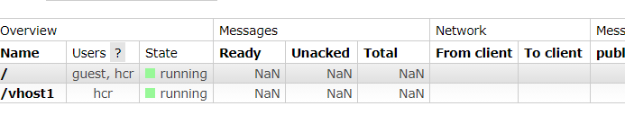
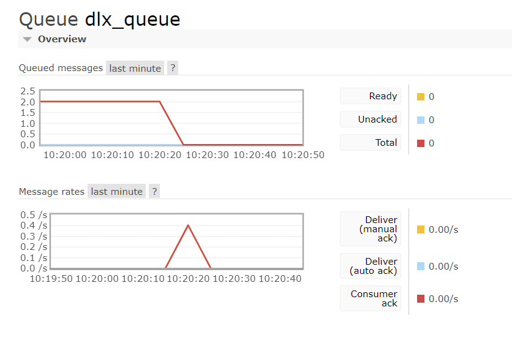

# RabbitMQ详解


# 1. 什么是RabbitMQ


## 1.1 MQ(Message Queue)消息队列


- 消息队列**中间件(将两个模块==连接在一起==  -> 分布式模块)**，是分布式系统中的重要组件
- 主要解决，**异步处理，应用解耦，流量削峰**等问题
- 从而实现高性能、高可用、可伸缩和最终一致性的架构
- 使用较多的消息队列产品：RabbitMQ，RocketMQ，ActiveMQ，ZeroMQ，Kafka等


### 1.1.1 异步处理

- 用户处理后，需要发送验证邮箱和手机验证码
- 将注册信息写入数据库，发送验证邮件，发送手机验证码，三个步骤全部完成后，返回给客户端


让消息队列来异步发送。这样服务器的耗时就减少了很多（节省了服务器**亲自发送验证码**的时间）


### 1.1.2 应用解耦


- 场景：订单系统需要通知库存系统
- 如果**库存系统**异常，则**订单调用库存**失败，导致下单失败
  - 原因：订单系统和库存系统**耦合度太高**


- 订单系统：用户下单后，订单系统完成**持久化**处理，将消息**写入消息队列**，返回用户，下单成功
- 库存系统：**订阅**下单的消息，**获取下单信息**，库存系统根据下单信息，**再进行库存操作**
- 例如：下单的时候，库存系统不能正常运行，也**不会影响下单**，因为下单后，订单系统写入消息队列***就不再关心其他的后续操作了***，实现了**订单系统和库存系统的应用解耦**
- 所以说：消息队列是典型的：**生产者消费者模型**
- 生产者不断地向消息队列中生产消息，消费者不断地从队列中获取消息
- 因为消息的生产和消费都是**异步**的，而且只关心**消息**的发送和接收，没有业务逻辑的入侵，这样就实现了**生产者和消费者的解耦**


### 1.1.3 流量削峰


- 抢购、秒杀等业务，针对高并发的场景
- 因为流量过大，暴增会导致应用挂掉，为解决这个问题，在前端加入消息队列


- 用户的请求，服务器接受后，首先**写入消息队列**，如果**超过队列的长度**，就抛弃，甩一个秒杀结束的页面。。。。。。
- 说白了，秒杀成功的就是**进入队列**的用户。。。


## 1.2 背景知识介绍


### 1.2.1 AMQP高级消息队列协议


- 即：Advanced Message Queuing Protocol，一个提供**统一消息服务**的**应用层**标准**高级消息队列*协议***
- 协议：数据在传输的过程中必须要遵守的规则
- 基于此协议的客户端可以**与消息中间件传递消息**
- 并不受产品、开发语言等条件的限制


### 1.2.2 JMS

- Java Message Server，**java消息队列服务应用程序接口**，一种**规范**，和jdbc担任的角色类似
- 是一个java平台中关于**面向消息中间件的API**，用于在两个应用程序之间，或分布式系统中**发送消息**，进行异步通信


### 1.2.3 二者的联系

- JMS是定义了统一接口，***统一消息操作***(重点在操作)；AMQP通过协议**统一数据交互格式**
- JMS必须是java语言；AMQP只是协议，与语言无关


### 1.2.4 Erlang语言


- Erlang是一种通用的面向 **并发**的编程语言，爱立信开发，目的是创造一种可以应对大规模并发活动的编程语言和运行环境
- 本来是专门**为了通信应用设计**的，非常适合构建分布式，实时软并行计算系统
- Erlang运行时环境是一个虚拟机，有点像java的虚拟机，代码一经编译，随处运行


## 1.3 为什么选择RabbitMQ


- 消息队列产品那么多，为什么偏偏选择RabbitMQ呢？
- 兔子。。。行动非常迅速，繁殖起来也非常疯狂
- Erlang语言开发，AMQP的最佳搭档，安装部署简单，上手门槛低
- 企业级消息队列，经过**大量实践考验的高可靠**，**大量成功的应用案例**，例如阿里、网易等一线大厂都有使用
- 有强大的WEB管理页面
- 强大的社区支持，为技术进步提供动力
- **支持消息持久化，支持消息确认机制，灵活的任务分发机制**等，支持功能非常丰富
- **集群扩展**很容易，并且可以通过**增加节点实现成倍的性能提升**


**总结：如果希望使用一个可靠性高、功能性强、易于管理的消息队列系统，那么久选择RabbitMQ，如果想用一个*性能高*，但偶尔丢点数据不是很在乎，可以使用Kafka或者zeroMQ**

- kafka和zeroMQ的**性能炸裂**，绝对可以压RabbitMQ一头，主要是大数据方面用


## 1.4  RabbitMQ各组件功能


- **Broker**：消息队列服务器实体
- **Virtual Host**：虚拟主机
  - 表示一批**交换机、消息队列和相关对象**，形成的整体
  - 虚拟主机是**共享**相同的**身份认证和加密环境**的**独立服务器域**
  - 每个virtual host本质上就是一个**min版的RabbitMQ服务器**，拥有自己的队列、交换器、绑定和权限机制
  - virtual host是AMQP概念的基础，RabbitMQ默认的vhost是 / ,必须在连接时指定
- **Exchange**：交换器（路由）
  - 用来接收生产者发送的消息并将这些**消息路由给服务器中的队列**

- **Queue**：消息队列
  - 用来**保存消息**直到发送给消费者
  - 它是消息的**容器**，也是消息的**终点**
  - 一个消息可投入**一个或多个队列**
  - 消息一直在队列里面，**等待消费者**连接到这个队列**将其取走**
- **Banding**：绑定，用于消息队列和交换机之间的关联。将路由的消息交给消息队列。**必须要做一个绑定，消息队列才能从路由中获取消息**
- **Channel**：通道（信道）
  - **多路复用**连接中的一条独立的双向数据流通道
  - 信道是建立在真实的TCP连接**内**的 **虚拟连接**
  - AMQP命令都是**通过信道**发出去的，不管是发布消息、订阅队列还是接收消息，都是**通过信道**完成的
  - 因为对于操作系统来说，建立和销毁TCP连接都是非常昂贵的开销，所以**引入了信道的改变，用来复用TCP连接（大连接中的小连接/通道）**

- **Connection**：网络连接，比如一个TCP连接
- **Publisher**：消息的生产者，也是一个向交换机**发布消息**的客户端应用程序
- **Consumer**：消息的消费者，表示一个从消息队列中**取得消息**的客户端应用程序
- **Message**：消息（快递包）
  - 消息是**不具名**的，它是由消息头和消息体组成
  - 消息体是**不透明**的，而消息头则是由一系列的**可选属性**组成，这些属性包括：routing key(路由键)、priority（优先级）、delivery-mode（消息可能需要持久性存储[消息的路由模式]）等  ( **发件人和收件人**)


# 2. 怎么用RabbitMQ


查看匹配的版本：

https://www.rabbitmq.com/which-erlang.html


- **想要安装RabbitMQ，必须先安装Erlang语言环境**(类似安装tomcat，必须先安装jdk)


erlang下载：http://dl.bintray.com/rabbitmq-erlang/rpm/erlang/

socat下载：http://repo.iotti.biz/CentOS/7/x86_64/socat-1.7.3.2-5.el7.lux.x86_64.rpm

RabbitMQ下载：


## 2.1 RabbitMQ安装启动


```
rpm -ivh ...
```


### 启动后台管理插件


```
rabbitmq-plugins enable rabbitmq_management
```


### 启动rabbitmq


```
systemctl start rabbitmq-server.service
```


`status`查看运行状态


`restart`

`stop`


### 查看进程

```
ps -ef | grep rabbitmq
```


### 测试

关闭防火墙

http://192.168.150.128:15672/

默认账号密码：guest，guest用户默认不允许远程连接


- 创建账号

  ```
  rabbitmqctl add_user hcr 123456
  ```

  

- 设置用户角色

  ```
  rabbitmqctl set_user_tags hcr administrator
  ```

- 设置用户权限（分配所有权限）

  ```
  rabbitmqctl set_permissions -p "/" hcr ".*" ".*" ".*"
  ```

- 查看当前用户和角色

  ```
  rabbitmqctl list_users
  ```

- 修改密码

  ```
  rabbitmqctl change_password hcr 123456
  ```

  


登录到管理页面中：


- overview：概览
- Connections：查看连接情况
- channels：管道（信道）情况
- Exchanges：交换机（路由），默认4类7个交换机
- Queues：消息队列情况
- admin：管理员列表


- **端口：**
  - **5672**：RabbitMQ提供给编程语言客户端连接的端口
  - **15672：**RabbitMQ管理界面的端口
  - **25672：**RabbitMQ几群的端口


## 2.2 RabbitMQ快速入门


### 2.2.1 依赖


```xml
<dependency>
    <groupId>com.rabbitmq</groupId>
    <artifactId>amqp-client</artifactId>
</dependency>
<dependency>
    <groupId>org.slf4j</groupId>
    <artifactId>slf4j-log4j12</artifactId>
</dependency>
<dependency>
    <groupId>org.apache.commons</groupId>
    <artifactId>commons-lang3</artifactId>
</dependency>
```


### 2.2.2创建连接


> **连接的时候必须指定要连接哪个虚拟主机**

- 先创建好虚拟主机





```java
/**
 * 专门与RabbitMQ获得连接
 */
public class ConnectionUtil {
    public static Connection getConnection() throws IOException, TimeoutException {
        //1.创建连接工厂
        ConnectionFactory factory = new ConnectionFactory();

        //2.在工厂对象中设置RabbitMQ的连接信息（ip，端口，vhost，username，password）
        factory.setHost("192.168.150.128");
        factory.setPort(5672);
        factory.setVirtualHost("/vhost1");//设置虚拟主机
        factory.setUsername("hcr");
        factory.setPassword("123456");

        //3.通过工厂获得与RabbitMQ的连接
        Connection connection = factory.newConnection();
        return connection;
    }

    public static void main(String[] args) throws IOException, TimeoutException {
        Connection connection = getConnection();
        System.out.println("connection = " + connection);
        //connection = amqp://hcr@192.168.150.128:5672//vhost1
        connection.close();
    }
}
```


## 2.3 RabbitMQ模式


- RabbitMQ提供了6中消息模型，但是第六种其实是RPC，并不是MQ，因此只看前五种

https://www.rabbitmq.com/getstarted.html


4.路由模式


5.通配符模式（接收特定主题:后缀/...）


6.rpc模式


---

5种消息模型，大体分为两类：

- 1和2属于**点对点**
- 3,4,5 属于**发布订阅**模式（一对多）


**点对点模式**：P2P模式包含三个角色：

- 消息队列Queue，发送者sender，接受者receiver
- 每个消息发送到一个**特定的队列**中，接收者从中获得消息
- 队列中保留这些消息，直到他们被**消费/超时**
- 特点：
  - 每个消息只有一个消费者，一旦消费，消息就不在队列中了
  - 发送者和接收者之间**没有依赖型**，发送者发送完成，不管接收者是否运行，都**不会影响消息发送到队列中**（我给你发微信，不管你看不看手机，反正发出去了）
  - 接收者成功接收消息之后需向对象**应答成功**（手动/自动确认）
- 如果希望发送的每个消息都会被成功处理，需要P2P

**↑性能较差**，只能实现一对一，不能一对多发送消息


**发布订阅模式：**publish/subscribe

- pub/sub模式包含三个角色：**交换机**Exchange，**发布者**publisher，**订阅者**subscriber
- 多个发布者将消息发送到交换机，系统将这些消息传递给多个订阅者
- 特点：
  - 每个消息可以有**多个订阅者**
  - 发布者和订阅者之间在**时间上有依赖**，对于某个交换机的订阅者，必须**创建一个订阅**后，才能消费发布者的消息
  - 为了消费消息，订阅者必须**保持运行状态**（类似看直播）
- 如果希望**发送的消息被多个消费者处理**，可使用本模式


### 2.3.1 简单模式


> RabbitMQ是一个消息代理，它接收和转发消息，你可以把它想象成一个邮局：当你把你想要寄的邮件放到一个邮箱里，你可以确定邮递员最终会把邮件送到你的收件人邮箱，在这个类比重，RabbitMQ是一个邮箱、一个邮局和一个邮递员

RabbitMQ本身只是接收，存储和转发信息，**并不会对信息进行处理！**

类似邮局，处理新建的应该是收件人而不是邮局


####  生产者P


```java
/**
 * 消息生产者，发送信息
 */
public class MessageSender {
    public static void main(String[] args) throws IOException, TimeoutException {
        String msg = "I said: Hello RabbitMQ";

        //1.获得连接
        Connection connection = ConnectionUtil.getConnection();

        //2.在连接中创建信道
        Channel channel = connection.createChannel();

        //3.创建消息队列
        /**
         * 参数：
         * 1.队列名称
         * 2.队列中的数据是否持久化
         * 3.是否排外（是否支持扩展，当前队列只能自己用，不能给别人用）
         * 4.是否自动删除(当队列的连接数为0时，队列会销毁，不管队列中是否还保存数据)
         * 5.队列参数，目前无
         */
        channel.queueDeclare("queue1", false, false, false, null);

        //4.向指定的消息队列发送消息
        /**
         * 参数：
         * 1.交换机名称，当前是简单模式，也就是p2p模式，没有交换机，所以名称为""
         * 2.目标队列的名称
         * 3.设置消息的属性，没有属性则为null
         * 4.消息的内容，必须是字节数组
         */
        channel.basicPublish("", "queue1", null, msg.getBytes());
        System.out.println("已发送：" + msg);

        //5.释放资源
        channel.close();
        connection.close();
    }
}
```


#### 消费者 C


```java
//消息消费者,接收者
public class MessageConsumer {
    public static void main(String[] args) throws IOException, TimeoutException {
        //1.获得连接
        Connection connection = ConnectionUtil.getConnection();

        //2.在连接中创建信道
        Channel channel = connection.createChannel();

        //3.从信道中获得消息
        DefaultConsumer consumer = new DefaultConsumer(channel){
            @Override
            /**
             * 交付处理
             * consumerTag：收件人信息
             * envelope：信封，包裹上的快递标签
             * properties：协议的配置
             * body：从队列中获取的消息体
             */
            public void handleDelivery(String consumerTag, Envelope envelope, AMQP.BasicProperties properties, byte[] body) throws IOException {
                System.out.println("接收的消息：" + new String(body));
            }
        };

        //4.监听队列  true:自动消息确认
        channel.basicConsume("queue1", true, consumer);

    }
}
```


有一条数据在queue中，还没有被消费


消费者消费后，自动变成0


发送的同时消费者也接收到了消息：（**监听队列**）


#### 消息确认机制ACK


```java
//监听队列  true:自动消息确认
channel.basicConsume("queue1", true, consumer);
```

通过案例可以看出，消息一旦被消费，消息就会立刻从队列中移除

RabbitMQ是如何得知消息被消费者接收？

- 如果消费者接收消息后，还没执行操作就抛异常宕机**导致消费失败**，但是***RabbitMQ无从得知，这样消息就丢失了***
- 因此，RabbitMQ有一个 **ACK机制**，当消费者获取消息后，会向RabbitMQ发送 **回执ACK**，**告知消息已经被接收**
- ACK：Acknowledge character，即是**确认字符**，在数据通信中，接收站发给发送站的一种传输类控制字符，**表示发来的数据已确认接收无误**，在使用http请求的时候，http的状态码200就是告诉我们服务器执行成功
- 整个过程就像快递员将包裹送到你手里，并且需要你的签字，并拍照回执
- 不过这种回执ACK分为两种情况
  - **自动ACK：**消息接收后，消费者立刻自动发送ACK
  - **手动ACK：**消息接收后，不会发送ACK，需要手动调用
- 两种情况如何选择，需要看消息的重要性：
  - 如果消息不太重要，丢失也没有影响，自动ACK会比较方便
  - 如果消息**非常重要**，最好消费完成后手动ACK。
  - 如果自动ACK消费后，RabbitMQ就会把消息从队列中删除，如果此时消费者抛异常宕机，那么**消息就永久丢失了**


---


修改手动消息确认

```java
//false: 手动消息确认
channel.basicConsume("queue1", false, consumer);
```


虽然Consumer得到并输出了消息，但因为没有确认发送ack，会显示**unacked**


```java
//消息消费者,接收者
public class MessageConsumer {
    public static void main(String[] args) throws IOException, TimeoutException {
        //1.获得连接
        Connection connection = ConnectionUtil.getConnection();

        //2.在连接中创建信道
        Channel channel = connection.createChannel();

        //3.从信道中获得消息
        DefaultConsumer consumer = new DefaultConsumer(channel){
            @Override
            /**
             * 交付处理
             * consumerTag：收件人信息
             * envelope：信封，包裹上的快递标签
             * properties：协议的配置
             * body：从队列中获取的消息体
             */
            public void handleDelivery(String consumerTag, Envelope envelope, AMQP.BasicProperties properties, byte[] body) throws IOException {
                System.out.println("接收的消息：" + new String(body));
                //手动确认（收件人信息，是否同时确认多个消息）
                channel.basicAck(envelope.getDeliveryTag(), false);
            }
        };

        //4.监听队列  true:自动消息确认
        channel.basicConsume("queue1", false, consumer);
    }
}
```


### 2.3.2 工作队列模式


- 之前使用的简单模式，一个消费者来处理信息，如果**生产者生产消息过快过多**，而**消费者的能力有限**，就会产生**消息在队列中堆积**（滞销）
- 多个消费者来共同消费，消息队列中的任务会被众多消费者共享，但**其中某一个消息只会被一个消费者获取**，***不能一个消息被多个消费者消费***


#### 生产者P


```java
public class MessageSender {
    public static void main(String[] args) throws IOException, TimeoutException {
        //1.获得连接
        Connection connection = ConnectionUtil.getConnection();
        //2.在连接中创建信道
        Channel channel = connection.createChannel();
        channel.queueDeclare("test_work_queue", false, false, false, null);
        for(int i = 0; i < 100; i++){
            String msg = "羊肉串 --> " + i;
            channel.basicPublish("", "test_work_queue", null, msg.getBytes());
            System.out.println("新鲜出炉：" + msg);
        }
        channel.close();
        connection.close();

    }
}
```


#### 消费者1


```java
public class Consumer1 {
    static int i = 1;//总计吃掉羊肉串的数量
    public static void main(String[] args) throws IOException, TimeoutException {
        Connection connection = ConnectionUtil.getConnection();

        Channel channel = connection.createChannel();
        DefaultConsumer consumer = new DefaultConsumer(channel){
            @SneakyThrows
            @Override
            public void handleDelivery(String consumerTag, Envelope envelope, AMQP.BasicProperties properties, byte[] body) throws IOException {
                String s = new String(body);
                System.out.println("顾客1号吃掉 "+ s + "! 总共吃 "+ i++ +  " 串");
                //模拟网络延迟
                Thread.sleep(200);
                channel.basicAck(envelope.getDeliveryTag(), false);
            }
        };
        //监听队列
        channel.basicConsume("test_work_queue", false, consumer);
    }
}
```


#### 消费者2


```java
public class Consumer2 {
    static int i = 1;//总计吃掉羊肉串的数量
    public static void main(String[] args) throws IOException, TimeoutException {
        Connection connection = ConnectionUtil.getConnection();

        Channel channel = connection.createChannel();
        DefaultConsumer consumer = new DefaultConsumer(channel){
            @SneakyThrows
            @Override
            public void handleDelivery(String consumerTag, Envelope envelope, AMQP.BasicProperties properties, byte[] body) throws IOException {
                String s = new String(body);
                System.out.println("顾客2号吃掉 "+ s + "! 总共吃 "+ i++ +  " 串");
                //模拟网络延迟
                Thread.sleep(900);
                channel.basicAck(envelope.getDeliveryTag(), false);
            }
        };
        //监听队列
        channel.basicConsume("test_work_queue", false, consumer);
    }
}
```


> 一个消费奇数的串串，一个消费偶数的串串


**每个消费者只能消费一半数量的消息，虽然效率不同，但是量是一样的**


**消费者2速度较慢，但也可以消费掉一半的消息**


> `channel.queueDeclare("test_work_queue", false, false, false, null);`
>
> **此方法有双重作用：**
>
> - 如果队列不存在则创建
> - 如果队列已存在，则获取
>
> **可以写在消费者处，防止因找不到队列而报错**


#### Fair Dispatch：公平分配


- 虽然两个消费者的消费速度不一致（线程休眠时间），但是消费的数量确实一样的，各消费50个消息
  - 例如：工作中，A同学编码速率高，B同学编码速率低，两个人同时开发一个项目，A10天完成，B30天完成，A完成自己的编码部分，就没事干了，坐等B完成。为了节约时间，应该“能者多劳”(不推荐。。)
  - 效率高的多干点，效率低的少干点，节约时间


> 公平的分配
>
> RabbitMQ会均匀地分派消息。
>
> 因为RabbitMQ只在**消息进入队列时发送消息（直接将消息平均派发给两个消费者）**，它不查看**用户未确认的消息数量**，它只是盲目地**平均**将每条消息分派给n个消费者
>
> 为了克服这个问题，我们可以使用设置为`prefetchCount = 1的 basicQos`方法，这告诉RabbitMQ**一次不要给一个worker发送一条以上的消息**，或者，换句话说，在worker处理并**确认前一个消息之前**，**不要向他发送新消息**，相反，它将把它分派到**下一个不繁忙的worker**。


> RabbitMQ会逐个发送消息到在**序列中的下一个消费者**(而不考虑每个任务的时长等等，且是**提前一次性分配**，并非一个一个分配)。平均每个消费者获得相同数量的消息，这种方式分发消息机制称为**Round-Robin（轮询）**。

```java
//声明队列（此处为消费者，不是声明创建队列，而是获取）
int prefetchCount = 1
//快速的一个一个送，送一个再送下一个，速度快的送的消息多
channel.basicQos(prefetchCount);
```


```java
public class Consumer1 {
    static int i = 1;//总计吃掉羊肉串的数量
    public static void main(String[] args) throws IOException, TimeoutException {
        Connection connection = ConnectionUtil.getConnection();

        Channel channel = connection.createChannel();
        //声明队列（此处为消费者，不是声明创建队列，而是获取）
        int prefetchCount = 1;
        //快速的一个一个送，送一个再送下一个，速度快的送的消息多
        channel.basicQos(prefetchCount);
        DefaultConsumer consumer = new DefaultConsumer(channel){
            @SneakyThrows
            @Override
            public void handleDelivery(String consumerTag, Envelope envelope, AMQP.BasicProperties properties, byte[] body) throws IOException {
                String s = new String(body);
                System.out.println("顾客1号吃掉 "+ s + "! 总共吃 "+ i++ +  " 串");
                //模拟网络延迟
                Thread.sleep(200);
                channel.basicAck(envelope.getDeliveryTag(), false);
            }
        };
        //监听队列
        channel.basicConsume("test_work_queue", false, consumer);
    }
}
```

Consumer2相同↑


结果：能吃多少吃多少，越快吃的越多


> 如果使用"能者多劳"方式， 这里**必须使用手动确认ack**的机制
>
> 如果使用自动确认：
>
> - **自动ACK：**消息接收后，消费者立刻自动发送ACK
> - 那么还是会造成公平分配的效果，因为消费者还没有确认执行了该消息就已经对来的每一个消息进行了ack，队列会一直给两个消费者发送消息 --> 均分


#### 面试题：避免消息堆积？

1. workqueue，**多个消费者监听同一个队列**
2. 接收到消息后，通过线程池（消息具体需要执行的操作，**使用多个线程**来**完成消费操作**），异步消息


### 2.3.3 发布订阅模式


> 工作队列背后的假设是，每个人物都被准确地交付给一个工作者，在这一步分钟，我们将做一些完全不同的事情——**将消息传递给多个消费者**，此模式成为“发布/订阅”
>
> 构建一个简单的日志记录系统，它将由两个程序组成——第一个将发送日志消息，第二个将接收和打印他们
>
> 接收程序的每一个正在运行的副本都将获得消息，这样我们就可以运行**一个接收器并将日志指向磁盘**，与此同时，我们可以运行**另一个接收器在屏幕上看到日志**
>
> 基本上，发布的日志将广播到所有接收方

**栗子：众多粉丝关注一个up主，up主发布视频，所有粉丝都可以得到视频通知**


- X路由：视频主，消息队列：粉丝，  up主 -> binding绑定  -> 粉丝

- **P生产者发送信息给X路由，X将信息转发给绑定X的队列**


- X队列将信息用过信道发送给消费者，从而进行消费
- 整个过程，**必须先创建路由Exchange**
  - 路由**在生产者程序中创建**

  - 因为路由没有存储消息的能力，当生产者将信息发送给路由后，消费者还没有运行，所以没有队列，**路由并不知道将信息发送给谁**

    > 运行程序的顺序：
    >
    > 1. MessageSender
    > 2. MessageReceiver1和MessageReceiver2
    > 3. MessageSender

- **先运行发送者，才会创建路由exchange，**

- **然后运行消费者，消费者创建消息队列，绑定到已经创建的路由上 **


#### 生产者


```java
public class MessageSender {

    public static void main(String[] args) throws IOException, TimeoutException {
        //1.获得连接
        Connection connection = ConnectionUtil.getConnection();
        //2.在连接中创建信道
        Channel channel = connection.createChannel();
        //生产者首先需要创建路由
        /**
         * 1.路由名称
         * 2.路由类型 fanout  共有四种路由类型
         * fanout: 不处理路由键 ---> 只需要将队列绑定到路由上，发送到路由的消息就都会被转发到与该路由绑定的所有队列上
         */
        channel.exchangeDeclare("test_exchange_fanout", "fanout");
//        channel.queueDeclare("test_pub_sub", false, false, false, null);

        String msg = "hello everyone";
        //第一个参数是路由名 先不写队列，暂时不知道哪些队列会绑定到路由上
        channel.basicPublish("test_exchange_fanout", "", null, msg.getBytes());
        System.out.println("生产者：" + msg);

        channel.close();
        connection.close();
    }
}
```


#### 消费者


```java
public class Consumer1 {

    public static void main(String[] args) throws IOException, TimeoutException {
        Connection connection = ConnectionUtil.getConnection();
        Channel channel = connection.createChannel();
        //声明队列
        channel.queueDeclare("test_exchange_fanout_queue_1", false, false, false, null);
        //绑定路由
        channel.queueBind("test_exchange_fanout_queue_1", "test_exchange_fanout", "");
        DefaultConsumer consumer = new DefaultConsumer(channel){
            @SneakyThrows
            @Override
            public void handleDelivery(String consumerTag, Envelope envelope, AMQP.BasicProperties properties, byte[] body) throws IOException {
                String s = new String(body);
                System.out.println("消费者1 get：" + s);
                channel.basicAck(envelope.getDeliveryTag(), false);
            }
        };
        //监听队列
        channel.basicConsume("test_exchange_fanout_queue_1", false, consumer);
    }
}
```


Consumer2同上↑


运行生产者：


**看到路由创建成功**


再运行两个消费者：


**两个队列创建成功**

看到队列绑定到路由：


再次运行生产者：消费者得到路由转发的消息


### 2.3.4 路由模式


**路由会根据类型进行*定向分发* 消息给不同的队列**


**这里的路由类型是direct**：定向分发


可以理解为快递公司的**分拣中心**，整个小区，东面的楼小张送货，西面的楼小王送货


#### 生产者


```java
public class SendMessage {
    public static void main(String[] args) throws IOException, TimeoutException {
        //1.获得连接
        Connection connection = ConnectionUtil.getConnection();
        //2.在连接中创建信道
        Channel channel = connection.createChannel();
        //生产者首先需要创建路由
        /**
         * 1.路由名称
         * 2.路由类型 direct  共有四种路由类型
         * direct: 根据路由键进行定向分发消息
         */
        channel.exchangeDeclare("test_exchange_direct", "direct");
//        channel.queueDeclare("test_pub_sub", false, false, false, null);

        String msg = "用户注册，[userid=S101]";
        //第一个参数是路由名 先不写队列，暂时不知道哪些队列会绑定到路由上
        //routingKey路由键：insert
        channel.basicPublish("test_exchange_direct", "insert", null, msg.getBytes());
        System.out.println("用户系统：" + msg);
        channel.close();
        connection.close();
    }
}
```


#### 消费者1


```java
public class Consumer1 {

    public static void main(String[] args) throws IOException, TimeoutException {
        Connection connection = ConnectionUtil.getConnection();
        Channel channel = connection.createChannel();
        //声明队列
        channel.queueDeclare("test_exchange_direct_queue_1", false, false, false, null);
        //绑定路由
        //队列绑定到路由上，当前队列都处理 哪些 路由键的消息？insert/update/delete
        //增删改的操作都给消息队列1处理
        channel.queueBind("test_exchange_direct_queue_1", "test_exchange_direct", "insert");
        channel.queueBind("test_exchange_direct_queue_1", "test_exchange_direct", "update");
        channel.queueBind("test_exchange_direct_queue_1", "test_exchange_direct", "delete");
        DefaultConsumer consumer = new DefaultConsumer(channel){
            @SneakyThrows
            @Override
            public void handleDelivery(String consumerTag, Envelope envelope, AMQP.BasicProperties properties, byte[] body) throws IOException {
                String s = new String(body);
                System.out.println("消费者1 get：" + s);
                channel.basicAck(envelope.getDeliveryTag(), false);
            }
        };
        //监听队列
        channel.basicConsume("test_exchange_direct_queue_1", false, consumer);
    }
}
```


#### 消费者2


```java
public class Consumer2 {

    public static void main(String[] args) throws IOException, TimeoutException {
        Connection connection = ConnectionUtil.getConnection();
        Channel channel = connection.createChannel();
        //声明队列
        channel.queueDeclare("test_exchange_direct_queue_2", false, false, false, null);
        //绑定路由
        //队列绑定到路由上，当前队列都处理 哪些 路由键的消息？select
        //查询操作都给消息队列2处理
        channel.queueBind("test_exchange_direct_queue_2", "test_exchange_direct", "select");
        DefaultConsumer consumer = new DefaultConsumer(channel){
            @SneakyThrows
            @Override
            public void handleDelivery(String consumerTag, Envelope envelope, AMQP.BasicProperties properties, byte[] body) throws IOException {
                String s = new String(body);
                System.out.println("消费者1 get：" + s);
                channel.basicAck(envelope.getDeliveryTag(), false);
            }
        };
        //监听队列
        channel.basicConsume("test_exchange_direct_queue_2", false, consumer);
    }
}
```


1. **运行程序的顺序同 订阅发布模式，需要先创建路由器**
2. **有了路由器之后，再创建两个消费者，进行队列绑定**
3. 再次运行生产者，发出消息


"insert"类型：

只有消费者1 **接收到了根据路由键转发来的消息**


### 2.3.5 通配符模式


- 和路由模式90%是一样的

- 唯独的区别就是路由键支持**模糊匹配**

- 匹配符号

  - ***：只能匹配一个词  --> 不多不少正好一个词，不能为空**
  - **#：匹配0个或更多个词**

- 官网案例：

  - Q1绑定了路由键 `*.orange.*`    
  - Q2绑定了路由键 `*.*.rabbit` 和 `lazy.#`

  > - Q1 is interested in all the orange animals.
  > - Q2 wants to hear everything about rabbits, and everything about lazy animals.

```
quick.orange.rabbit				Q1 Q2
lazy.orange.elephant			Q1 Q2	
uick.orange.fox					Q1
lazy.brown.fox					Q2
lazy.pink.rabbit				Q2
quick.brown.fox					Q2		
orange							无	
quick.orange.male.rabbit		无	
lazy.orange.male.rabbit			Q2
```


#### 生产者


```java
public class MessageSend {
    public static void main(String[] args) throws IOException, TimeoutException {
        //1.获得连接
        Connection connection = ConnectionUtil.getConnection();
        //2.在连接中创建信道
        Channel channel = connection.createChannel();
        //生产者首先需要创建路由
        /**
         * 1.路由名称
         * 2.路由类型 direct  共有四种路由类型
         * direct: 根据路由键进行定向分发消息
         */
        channel.exchangeDeclare("test_exchange_topic", "topic");
//        channel.queueDeclare("test_pub_sub", false, false, false, null);

        String msg = "新增订单";
        //第一个参数是路由名 先不写队列，暂时不知道哪些队列会绑定到路由上
        //routingKey路由键：insert
        channel.basicPublish("test_exchange_topic", "order.addOrder", null, msg.getBytes());
        System.out.println("系统：" + msg);
        channel.close();
        connection.close();
    }
}
```


#### 消费者1


```java
public class Consumer1 {

    public static void main(String[] args) throws IOException, TimeoutException {
        Connection connection = ConnectionUtil.getConnection();
        Channel channel = connection.createChannel();
        //声明队列
        channel.queueDeclare("test_exchange_topic_queue_1", false, false, false, null);
        //绑定路由
        //队列绑定到路由上，用户相关的消息都绑定在队列1上
        channel.queueBind("test_exchange_topic_queue_1", "test_exchange_topic", "user.*");
        DefaultConsumer consumer = new DefaultConsumer(channel){
            @SneakyThrows
            @Override
            public void handleDelivery(String consumerTag, Envelope envelope, AMQP.BasicProperties properties, byte[] body) throws IOException {
                String s = new String(body);
                System.out.println("消费者1 get：" + s);
                channel.basicAck(envelope.getDeliveryTag(), false);
            }
        };
        //监听队列
        channel.basicConsume("test_exchange_topic_queue_1", false, consumer);
    }
}
```


#### 消费者2


```java
public class Consumer2 {

    public static void main(String[] args) throws IOException, TimeoutException {
        Connection connection = ConnectionUtil.getConnection();
        Channel channel = connection.createChannel();
        //声明队列
        channel.queueDeclare("test_exchange_topic_queue_2", false, false, false, null);
        //绑定路由
        //队列绑定到路由上，商品和订单相关的消息都绑定在队列2上
        channel.queueBind("test_exchange_topic_queue_2", "test_exchange_topic", "product.*");
        channel.queueBind("test_exchange_topic_queue_2", "test_exchange_topic", "order.*");
        DefaultConsumer consumer = new DefaultConsumer(channel){
            @SneakyThrows
            @Override
            public void handleDelivery(String consumerTag, Envelope envelope, AMQP.BasicProperties properties, byte[] body) throws IOException {
                String s = new String(body);
                System.out.println("消费者2 get：" + s);
                channel.basicAck(envelope.getDeliveryTag(), false);
            }
        };
        //监听队列
        channel.basicConsume("test_exchange_topic_queue_2", false, consumer);
    }
}
```


`user.register`：

只有消费者1得到消息


`order.addOrder`：

消费者2得到消息


## 2.4 持久化


- 消息的可靠性是RabbitMQ的一大特色，那么RabbitMQ是如何避免消息丢失？
  - 消费者的**ACK确认机制**，可以防止消费者丢失消息
  - 万一在消费者消费之前，**RabbitMQ服务器宕机了**，那消息也会**丢失**


重启后，定义的消息队列/路由都没了，原先的数据都被清空


分别持久化：路由、消息、队列都持久化


在路由和发送消息中设置为持久化：true  &  `MessageProperties.PERSISTENT_TEXT_PLAIN`

```java
channel.exchangeDeclare("test_exchange_topic", "topic", true);
//        channel.queueDeclare("test_pub_sub", false, false, false, null);

        String msg = "新增订单";
        //第一个参数是路由名 先不写队列，暂时不知道哪些队列会绑定到路由上
        //routingKey路由键：insert
        channel.basicPublish("test_exchange_topic", "order.addOrder", MessageProperties.PERSISTENT_TEXT_PLAIN, msg.getBytes());
        
```

声明队列第二个参数为真表明支持持久化

```java
//声明队列
channel.queueDeclare("test_exchange_topic_queue_1", true, false, false, null);
```


> 如果预先创建了非持久化的队列2，那么无法再次创建持久化的队列2，需要先删除再进行创建
>


重启后，队列和路由都被保存下来，


## 2.4 Spring整合RabbitMQ


- 五种消息模型，应用最广泛的是最后一种，定向匹配topic
- Spring AMQP是基于Spring框架的SMQP消息解决方案，提供模板化的发送和接收消息的抽象层，提供基于消息驱动的POJO的消息监听等，简化了我们对于RabbitMQ相关程序的开发


### 2.4.1 生产端工程


```xml
<dependency>
    <groupId>org.springframework.amqp</groupId>
    <artifactId>spring-rabbit</artifactId>
</dependency>
<dependency>
    <groupId>org.slf4j</groupId>
    <artifactId>slf4j-log4j12</artifactId>
</dependency>
<dependency>
    <groupId>org.apache.commons</groupId>
    <artifactId>commons-lang3</artifactId>
</dependency>
```


配置文件：

```xml
<?xml version="1.0" encoding="UTF-8"?>
<beans xmlns="http://www.springframework.org/schema/beans"
       xmlns:xsi="http://www.w3.org/2001/XMLSchema-instance"
       xmlns:rabbit="http://www.springframework.org/schema/rabbit"
       xsi:schemaLocation="
       http://www.springframework.org/schema/beans
       http://www.springframework.org/schema/beans/spring-beans.xsd
       http://www.springframework.org/schema/rabbit
       http://www.springframework.org/schema/rabbit/spring-rabbit.xsd
">

<!--配置连接-->
    <rabbit:connection-factory id="connectionFactory"  host="192.168.150.128"  port="5672"  username="hcr"  password="123456"  virtual-host="/vhost1"/>
    <!--    配置队列-->
    <rabbit:queue name="test_spring_queue_1"/>
    <!--    配置配置rabbitadmin  主要用于在java代码中对队列的管理，用来创建、绑定、删除队列与交换机，发送消息等操作-->
    <rabbit:admin connection-factory="connectionFactory"/>
    <!--    配置交换机 topic类型-->
    <rabbit:topic-exchange name="spring_topic_exchange">
<!--        绑定队列-->
        <rabbit:bindings>
            <rabbit:binding pattern="msg.#" queue="test_spring_queue_1"/>
        </rabbit:bindings>
    </rabbit:topic-exchange>
    <!--    配置json转换的工具 将消息转换为json-->
    <bean id="jackson2JsonMessageConverter" class="org.springframework.amqp.support.converter.Jackson2JsonMessageConverter"/>
    <!--    配置rabbitmq的模板-->
    <rabbit:template id="rabbitTemplate" connection-factory="connectionFactory" exchange="spring_topic_exchange" message-converter="jackson2JsonMessageConverter"/>
</beans>
```

**最好使用xml方式配置**


通过ur来获得name和email，并且可以从容器中自动注入在配置文件中配置的 `RabbitTemplate` 对象。(使用springboot搭建)无需再解析配置文件

```java
@RestController
public class Sender {

    @Autowired
    RabbitTemplate rabbitTemplate;

    @GetMapping("/send")
    public void send(@RequestParam("name") String name,
                     @RequestParam("email") String email) {
        //创建spring容器并从容器中获得rabbittemplate对象
//        ClassPathXmlApplicationContext applicationContext = new ClassPathXmlApplicationContext("classpath:spring.xml");
//        RabbitTemplate rabbitTemplate = applicationContext.getBean(RabbitTemplate.class);
        //发消息
        Map<String, String> map = new HashMap<>();
        map.put("name", name);
        map.put("email", email);
        //定义路由键
        rabbitTemplate.convertAndSend("msg.user",map);
    }
}
```


### 消费端工程


- MessageListener接口用于spring容器接收到消息后处理消息
- 如果需要使用自己定义的类型 来实现处理消息时，必须事先改接口，并重写onMessage()方法
- 当spring容器接收消息时，会自动交由onMessage进行处理


```xml
<?xml version="1.0" encoding="UTF-8"?>
<beans xmlns="http://www.springframework.org/schema/beans"
       xmlns:xsi="http://www.w3.org/2001/XMLSchema-instance"
       xmlns:rabbit="http://www.springframework.org/schema/rabbit"
       xmlns:context="http://www.springframework.org/schema/context"
       xsi:schemaLocation="
       http://www.springframework.org/schema/beans
       http://www.springframework.org/schema/beans/spring-beans.xsd
       http://www.springframework.org/schema/rabbit
       http://www.springframework.org/schema/rabbit/spring-rabbit.xsd
       http://www.springframework.org/schema/context
       http://www.springframework.org/schema/context/spring-context.xsd
">

<!--配置连接-->

    <rabbit:connection-factory  id="connectionFactory"  host="192.168.150.128"  port="5672"  username="hcr"  password="123456"  virtual-host="/vhost1"/>
    <!--    配置队列-->
    <rabbit:queue name="test_spring_queue_1"/>
    <!--    配置配置rabbitadmin  主要用于在java代码中对队列的管理，用来创建、绑定、删除队列与交换机，发送消息等操作-->
    <rabbit:admin connection-factory="connectionFactory"/>

<!--    配置扫描包(springioc)-->
    <context:component-scan base-package="com.example.rabbitmqconsumer.listener"/>
<!--    配置监听-->
    <rabbit:listener-container connection-factory="connectionFactory">
        <rabbit:listener ref="consumerListener" queue-names="test_spring_queue_1"/>
    </rabbit:listener-container>

</beans>
```


放入容器中并实现监听

```java
//消费者监听队列
@Component
public class ConsumerListener implements MessageListener {
    // jackson提供序列化和反序列中使用最多的类，用来转换json的
    private static final ObjectMapper MAPPER = new ObjectMapper();

    @Override
    //message对象就是发送过来的map对象
    //在这里面实现对接收到的消息的操作
    public void onMessage(Message message) {
        // 将message对象转换为json
        try {
            JsonNode jsonNode = MAPPER.readTree(message.getBody());
            String name = jsonNode.get("name").asText();
            String email = jsonNode.get("email").asText();
            System.out.println("从队列中获取："+ name + " 的邮箱是 " + email);
        } catch (IOException e) {
            e.printStackTrace();
        }
    }
}
```


加载配置文件，使**程序一直运行**-->即一直监听着队列中有无新消息

```java
public class Consumer {

    public static void main(String[] args) throws IOException {
        //获得容器
        ClassPathXmlApplicationContext applicationContext = new ClassPathXmlApplicationContext("classpath:spring.xml");
        //让程序一直运行，不要终止
        System.in.read();
    }
}
```


持续监听：


## 2.5 消息成功确认机制


在实际场景下有的生产者发送的消息(查询可以不一定成功，下订单一定要成功)是必须保证成功发送到消息队列中，那么如何保证成功投递呢？

- 事务机制
- 发布确认


### 2.5.1 事务机制


- AMQP协议提供的一种保证消息成功投递的方式，**通过信道开启transactional模式**
- 并利用信道的三个方法来实现以事务方式 发送消息，若发送失败，**通过异常处理回滚事务，确保消息成功投递**
  - channel.txSelect(): 开启事务
  - channel.txCommit()：提交事务
  - channel.txRollback()：回滚事务


- Spring已经对上面三个方法进行了封装，所以使用原始的代码演示


```java
public class MessageSender {
    public static void main(String[] args) throws IOException, TimeoutException {
        //1.获得连接
        Connection connection = ConnectionUtil.getConnection();
        //2.在连接中创建信道
        Channel channel = connection.createChannel();
        //生产者首先需要创建路由
        /**
         * 1.路由名称
         * 2.路由类型 direct  共有四种路由类型
         * direct: 根据路由键进行定向分发消息
         */
        channel.exchangeDeclare("test_exchange_tx", "topic", false);

        channel.txSelect();//开启事务

       try {
           channel.basicPublish("test_exchange_tx", "order.addOrder",null, "新增订单1".getBytes());
           int i = 1/0;//只能得到第一条消息，加入事务使他们一起成功/失败
           channel.basicPublish("test_exchange_tx", "order.addOrder",null, "新增订单2".getBytes());

           channel.txCommit();//提交事务，一起成功
           System.out.println("生产者消息已全部发送 一起成功");
       }catch (Exception e){
           System.out.println("消息全部撤销！");
           channel.txRollback();//事务回滚，一起失败
           e.printStackTrace();
       }finally {
           channel.close();
           connection.close();
       }
    }
}
```

对发送消息进行try-catch。

- **若抛出异常，则进行回滚。**

- **若没有异常，则继续执行，提交事务**


```java
public class Consumer {

    public static void main(String[] args) throws IOException, TimeoutException {
        Connection connection = ConnectionUtil.getConnection();
        Channel channel = connection.createChannel();
        //声明队列
        channel.queueDeclare("test_exchange_tx_queue_1", false, false, false, null);
        //绑定路由
        //队列绑定到路由上，订单相关的消息都绑定在队列1上
        channel.queueBind("test_exchange_tx_queue_1", "test_exchange_tx", "order.*");
        DefaultConsumer consumer = new DefaultConsumer(channel){
            @SneakyThrows
            @Override
            public void handleDelivery(String consumerTag, Envelope envelope, AMQP.BasicProperties properties, byte[] body) throws IOException {
                String s = new String(body);
                System.out.println("消费者1 get：" + s);
                channel.basicAck(envelope.getDeliveryTag(), false);
            }
        };
        //监听队列
        channel.basicConsume("test_exchange_tx_queue_1", false, consumer);
    }
}
```


### 2.5.2 Confirm发布确认机制


- RabbitMQ为了保证消息的成功投递，采用通过AMQP协议层面为我们提供事务机制的方案，但是采用事务会大大降低消息的吞吐量
- 经测试：10w条消息未开启事务，大约8s发送完毕；而开启了事务后，需要将近310s，差了30多倍
- 官网：**开启事务性能最大损失超过250倍**
- 那么有没有更加高效的解决方式呢？答案就是采用Confirm模式
- 事务效率为什么会这么低呢？试想一下，10条消息，前9条发送成功，如果第10条失败，那么9条消息要全部撤销回滚，**太浪费**
- 而 **confirm模式则采用 ==补发== 第10条消息的措施来完成第10条消息的送达**


#### 在spring中应用


消费者

```xml
<?xml version="1.0" encoding="UTF-8"?>
<beans xmlns="http://www.springframework.org/schema/beans"
       xmlns:xsi="http://www.w3.org/2001/XMLSchema-instance"
       xmlns:rabbit="http://www.springframework.org/schema/rabbit"
       xmlns:context="http://www.springframework.org/schema/context"
       xsi:schemaLocation="
       http://www.springframework.org/schema/beans
       http://www.springframework.org/schema/beans/spring-beans.xsd
       http://www.springframework.org/schema/rabbit
       http://www.springframework.org/schema/rabbit/spring-rabbit.xsd
       http://www.springframework.org/schema/context
       http://www.springframework.org/schema/context/spring-context.xsd
">

<!--配置连接-->

    <rabbit:connection-factory  id="connectionFactory"  host="192.168.150.128"  port="5672"  username="hcr"  password="123456"  virtual-host="/vhost1"/>
    <!--    配置队列-->
    <rabbit:queue name="test_spring_queue_1"/>
    <!--    配置配置rabbitadmin  主要用于在java代码中对队列的管理，用来创建、绑定、删除队列与交换机，发送消息等操作-->
    <rabbit:admin connection-factory="connectionFactory"/>

<!--    配置扫描包(springioc)-->
    <context:component-scan base-package="com.example.rabbitmqconsumer.listener"/>
<!--    配置监听-->
    <rabbit:listener-container connection-factory="connectionFactory">
        <rabbit:listener ref="consumerListener" queue-names="test_spring_queue_1"/>
    </rabbit:listener-container>

</beans>
```


```java
//消费者监听队列
@Component
public class ConsumerListener implements MessageListener {
    // jackson提供序列化和反序列中使用最多的类，用来转换json的
    private static final ObjectMapper MAPPER = new ObjectMapper();

    @Override
    //message对象就是发送过来的map对象
    public void onMessage(Message message) {
        // 将message对象转换为json
        try {
            JsonNode jsonNode = MAPPER.readTree(message.getBody());
            String name = jsonNode.get("name").asText();
            String email = jsonNode.get("email").asText();
            System.out.println("从队列中获取："+ name + " 的邮箱是 " + email);
        } catch (IOException e) {
            e.printStackTrace();
        }
    }
}
```


```java
public class Consumer {

    public static void main(String[] args) throws IOException {
        //获得容器
        ClassPathXmlApplicationContext applicationContext = new ClassPathXmlApplicationContext("classpath:spring.xml");
        //让程序一直运行，不要终止
        System.in.read();
    }
}
```


---


生产者


```xml
<?xml version="1.0" encoding="UTF-8"?>
<beans xmlns="http://www.springframework.org/schema/beans"
       xmlns:xsi="http://www.w3.org/2001/XMLSchema-instance"
       xmlns:rabbit="http://www.springframework.org/schema/rabbit"
       xsi:schemaLocation="
       http://www.springframework.org/schema/beans
       http://www.springframework.org/schema/beans/spring-beans.xsd
       http://www.springframework.org/schema/rabbit
       http://www.springframework.org/schema/rabbit/spring-rabbit.xsd
">

<!--配置连接  启动生产者确认机制：已过时，选择使用配置属性方式spring.rabbitmq.publisher-confirm-type=correlated 或 confirm-type="CORRELATED"-->
    <rabbit:connection-factory id="connectionFactory"
                               host="192.168.150.128"
                               port="5672"
                               username="hcr"
                               password="123456"
                               virtual-host="/vhost1"
                               confirm-type="CORRELATED"/>

    <!--    配置队列-->
    <rabbit:queue name="test_spring_queue_1"/>
    <!--    配置配置rabbitadmin  主要用于在java代码中对队列的管理，用来创建、绑定、删除队列与交换机，发送消息等操作-->
    <rabbit:admin connection-factory="connectionFactory"/>
    <!--    配置交换机 topic类型-->
    <rabbit:topic-exchange name="spring_topic_exchange">
<!--        绑定队列-->
        <rabbit:bindings>
            <rabbit:binding pattern="msg.#" queue="test_spring_queue_1"/>
        </rabbit:bindings>
    </rabbit:topic-exchange>
    <!--    配置json转换的工具 将消息转换为json-->
    <bean id="jackson2JsonMessageConverter" class="org.springframework.amqp.support.converter.Jackson2JsonMessageConverter"/>

    
    
    <!--    确认机制的处理类-->
    <bean id="messageConfirm" class="com.example.rabbitmqproduct.confirm.MessageConfirm"/>

    <!--    配置rabbitmq的模板 添加确认回调处理类confirm-callback="messageConfirm"  -->
    <rabbit:template
            id="rabbitTemplate"
            connection-factory="connectionFactory"
            exchange="spring_topic_exchange"
            message-converter="jackson2JsonMessageConverter"
            confirm-callback="messageConfirm"/>
</beans>
```


```java
//消息确认处理
//@Component
public class MessageConfirm implements RabbitTemplate.ConfirmCallback {

    @Override
    /**
     * CorrelationData:消息相关的数据对象，封装了消息的唯一id
     * b：消息是否确认成功
     * s：异常信息
     */
    public void confirm(CorrelationData correlationData, boolean b, String s) {
        if(b){
            System.out.println("消息确认成功！");
        }else{
            System.out.println("xxxxxxxx 消息确认失败！xxxxxxxxxx");
            System.out.println(s);
            //如果本条消息一定要发送到队列中，例如下订单消息，我们可以采用补发
            // 1.采用递归（限制递归次数）
            // 2.redis+定时任务 (jdk的timer，或者定时任务框架) Quartz
        }
    }
}
```


```java
@RestController
public class Sender {

    @Autowired
    RabbitTemplate rabbitTemplate;

    @GetMapping("/send")
    public void send(@RequestParam("name") String name,
                     @RequestParam("email") String email) {
        //创建spring容器并从容器中获得rabbittemplate对象
//        ClassPathXmlApplicationContext applicationContext = new ClassPathXmlApplicationContext("classpath:spring.xml");
//        RabbitTemplate rabbitTemplate = applicationContext.getBean(RabbitTemplate.class);
        //发消息
        Map<String, String> map = new HashMap<>();
        map.put("name", name);
        map.put("email", email);
//        rabbitTemplate.setConfirmCallback(new RabbitTemplate.ConfirmCallback() {
//            @Override
//            public void confirm(CorrelationData correlationData, boolean b, String s) {
//                if(b){
//                    System.out.println("消息确认成功！");
//                }else{
//                    System.out.println("xxxxxxxx 消息确认失败！xxxxxxxxxx");
//                    System.out.println(s);
//                }
//            }
//        });
        //定义路由键
        //指明发给哪个路由   不存在的路由-->发送不成功
        rabbitTemplate.convertAndSend("spring_topic_exchangeeee", "msg.user",map);
        System.out.println("消息已发出");
    }
}
```


> spring.rabbitmq.publisher-confirm在springboot2.2.0.RELEASE版本之前是amqp正式支持的属性，用来配置消息发送到交换器之后是否触发回调方法，在2.2.0及之后使用spring.rabbitmq.publisher-confirm-type属性配置代替，用来配置更多的确认类型；
>
> 其中：
>
> NONE值是禁用发布确认模式，是默认值
> CORRELATED值是发布消息成功到交换器后会触发回调方法
> SIMPLE值经测试有两种效果，其一效果和CORRELATED值一样会触发回调方法，其二在发布消息成功后使用rabbitTemplate调用waitForConfirms或waitForConfirmsOrDie方法等待broker节点返回发送结果，根据返回结果来判定下一步的逻辑，要注意的点是waitForConfirmsOrDie方法如果返回false则会关闭channel，则接下来无法发送消息到broker;
> ————————————————
> 版权声明：本文为CSDN博主「脉脉情缘」的原创文章，遵循CC 4.0 BY-SA版权协议，转载请附上原文出处链接及本声明。
> 原文链接：https://blog.csdn.net/qingyuan2014/article/details/113916449


## 2.6 消费端限流


- 在沙漠中行走，3天不喝水，突然和谁，如果使劲喝，容易猝死，要一口一口喝
- RabbitMQ服务器**积压**了成千上万条未处理的消息，然后，随便打开一个消费者客户端，就会出现这样的情况：**巨量的消息瞬间全部喷涌推送过来**，但是单个客户端**无法同时处理**这么多数据，就会被压垮崩溃
- 所以，当数据量特别大的时候，我们**对生产端限流肯定是不科学**的，因为有时候并发量就是特别大，有时候并发量又特别少，这是**用户的行为，我们无法约束**
- RabbitMQ提供了一种Qos（Quality of Service服务质量）服务质量保证功能
  - 即**在非自动确认消息的前提下，如果一定数目的消息未被确认前，不再进行消费新的消息**
- 生产者使用循环发出多条消息


向队列中发100条消息：

```java
for(int i = 0; i < 100; i++){
    rabbitTemplate.convertAndSend("spring_topic_exchange", "msg.user",map);
    System.out.println("消息发送成功！ " + i);
}
```


**设置为手动确认，prefetch=3表示一次性消费的数量为3,。会告诉RabbitMQ不要同时给一个消费者推送多余3个消息，一旦有3个消息还没有ack，则该Consumer将阻塞**

```xml
<!--    配置监听-->
    <rabbit:listener-container connection-factory="connectionFactory" acknowledge="manual" prefetch="3">
        <rabbit:listener ref="consumerListener2" queue-names="test_spring_queue_1"/>
    </rabbit:listener-container>
```


实现接口  ChannelAwareMessageListener ，实现onMessage方法

**使用channel来实现确认机制，手动进行ack**

```java
@Component
public class ConsumerListener2 implements ChannelAwareMessageListener {

    private static final ObjectMapper MAPPER = new ObjectMapper();

    @Override
    public void onMessage(Message message, Channel channel) throws Exception {
        // 将message对象转换为json
        try {
            JsonNode jsonNode = MAPPER.readTree(message.getBody());
            String name = jsonNode.get("name").asText();
            String email = jsonNode.get("email").asText();
            System.out.println("从队列中获取："+ name + " 的邮箱是 " + email);
            /**
             * 手动确认消息
             * 参数1：RabbitMQ向该channel投递的这条消息的唯一标识id，此id是一个单调递增的正整数
             * 参数2：为了减少网络流量，手动确认可以被批量处理，即一次将接收到的prefetch条数消息全部确认
             */
            channel.basicAck(message.getMessageProperties().getDeliveryTag(), true);
            System.out.println("--------------休息3s后再接收消息-----------------");
            Thread.sleep(3000);
        } catch (Exception e) {
            e.printStackTrace();
        }
    }
}
```


队列中现在有100条消息：


开启消费者：

一次只能接收3条消息


**总是有3个未确认的消息：**因为一次只能发出3个消息


## 2.7 过期时间

- Time To Live：生存时间，还能活多久，单位 **毫秒**
- 在这个周期内，消息可以被消费者正常消费，超过这个时间，则自动删除（其实被称为dead message并投入到死信队列，无法消费该消息）
- RabbitMQ可以对 **消息和队列设置TTL**
  - 通过**队列**设置，队列中**所有消息都有==相同的==过期时间**
  - 对消息**单独设置**，每条消息的TTL**==可以不同==**（更颗粒化）


### 2.7.1 设置队列TTL


- spring.xml:

```xml
<!--    对队列中的消息设置过期时间  自动声明-->
    <rabbit:queue name="test_spring_queue_ttl" auto-declare="true">
        <rabbit:queue-arguments>
            <entry key="x-message-ttl" value-type="long" value="5000"/>
        </rabbit:queue-arguments>
    </rabbit:queue>
    
    
    <!--    配置交换机 topic类型-->
    <rabbit:topic-exchange name="spring_topic_exchange">
<!--        绑定队列-->
        <rabbit:bindings>
            <rabbit:binding pattern="msg.#" queue="test_spring_queue_ttl"/>
        </rabbit:bindings>
    </rabbit:topic-exchange>
```

设置整个队列的过期时间为5s。


过5s后队列中就没消息了。自动删除


### 2.7.2 设置消息ttl

- 设置某条消息ttl，只需要在创建发送消息时制定即可


```java
//创建消息的配置对象
MessageProperties messageProperties = new MessageProperties();
//设置过期时间3s
messageProperties.setExpiration("6000");
//创建消息
Message message = new Message("测试过期时间".getBytes(), messageProperties);
rabbitTemplate.convertAndSend( "msg.user", message);
```


**太过于颗粒化，如果不是每个都不一样，设置整个队列消息的生命周期即可**

> 如果同时设置队列和消息的ttl值，则二者中**较小的才会起作用**


## 2.8 死信队列


- DLX (Dead Letter Exchanges)：死信交换机/死信邮箱，当消息在队列中由于某些原因没有被及时消费而变成死信（dead message）后，这些消息就会被**分发到DLX交换机**中，而**绑定DLX交换机的队列**，称之为：**“死信队列”**


- 消息没有被及时消费的原因：
  - 消息**被拒绝**（basic.reject() / basic.nack()）并且不再重新投递`requeue=false`
  - 消息**超时**未消费
  - 达到**最大队列长度**


### 配置文件


```xml
<?xml version="1.0" encoding="UTF-8"?>
<beans xmlns="http://www.springframework.org/schema/beans"
       xmlns:xsi="http://www.w3.org/2001/XMLSchema-instance"
       xmlns:rabbit="http://www.springframework.org/schema/rabbit"
       xsi:schemaLocation="
       http://www.springframework.org/schema/beans
       http://www.springframework.org/schema/beans/spring-beans.xsd
       http://www.springframework.org/schema/rabbit
       http://www.springframework.org/schema/rabbit/spring-rabbit.xsd
">

<!--配置连接  启动生产者确认机制：已过时，选择使用配置属性方式spring.rabbitmq.publisher-confirm-type=correlated 或 confirm-type="CORRELATED"-->
    <rabbit:connection-factory id="connectionFactory"
                               host="192.168.150.128"
                               port="5672"
                               username="hcr"
                               password="123456"
                               virtual-host="/vhost1"/>


    <!--    配置配置rabbitadmin  主要用于在java代码中对队列的管理，用来创建、绑定、删除队列与交换机，发送消息等操作-->
    <rabbit:admin connection-factory="connectionFactory"/>


    <!--    配置rabbitmq的模板 添加确认回调处理类confirm-callback="messageConfirm"  -->
    <rabbit:template id="rabbitTemplate"
            connection-factory="connectionFactory" exchange="my_exchange"/>

<!--    #######################################################################################-->
    
<!--    定义定向的测试消息的交换机-->
    <rabbit:direct-exchange name="my_exchange">
        <rabbit:bindings>
            <rabbit:binding key="dlx_ttl" queue="test_ttl_queue"/>
            <rabbit:binding key="dlx_max" queue="test_max_queue"/>
        </rabbit:bindings>
    </rabbit:direct-exchange>

<!--    声明测试过期的消息队列-->
    <rabbit:queue name="test_ttl_queue">
        <rabbit:queue-arguments>
<!--            设置队列的过期时间，如果消息超时，就将消息投递给死信交换机-->
            <entry key="x-message-ttl" value-type="long" value="6000"/>
            <entry key="x-dead-letter-exchange" value="dlx_exchange"/>
        </rabbit:queue-arguments>
    </rabbit:queue>

<!--    声明测试超出最大长度的消息队列-->
    <rabbit:queue name="test_max_queue">
        <rabbit:queue-arguments>
<!--            设置队列的额定长度 本队列最多装2个消息，如果超出长度，将消息投递给死信交换机-->
            <entry key="x-max-length" value-type="long" value="2"/>
            <entry key="x-dead-letter-exchange" value="dlx_exchange"/>
        </rabbit:queue-arguments>
    </rabbit:queue>


<!--    死信交换机 定向的死信交换机-->
    <rabbit:direct-exchange name="dlx_exchange">
        <rabbit:bindings>
            <rabbit:binding key="dlx_ttl" queue="dlx_queue"/>
            <rabbit:binding key="dlx_max" queue="dlx_queue"/>
        </rabbit:bindings>
    </rabbit:direct-exchange>


    <!--    声明死信队列-->
    <rabbit:queue name="dlx_queue"/>


</beans>
```


### 测试两种死信


```java
//测试超时 路由键：dlx_ttl 路由将消息交给队列 test_ttl_queue
rabbitTemplate.convertAndSend("my_exchange", "dlx_ttl", "测试超时".getBytes());
```


↓超时，进入了死信队列中：


两条超时的消息：


-----


```java
//测试长度  额外的一条挤出去，进入死信队列
rabbitTemplate.convertAndSend("my_exchange", "dlx_max", "测试长度1".getBytes());
rabbitTemplate.convertAndSend("my_exchange", "dlx_max", "测试长度2".getBytes());
rabbitTemplate.convertAndSend("my_exchange", "dlx_max", "测试长度3".getBytes());
```


**只能装2条消息**


**最先进入队列的一条消息被挤出去**


## 2.9 延迟队列


- 延迟队列：TTL + 死信队列的合体
- 死信队列只是一种特殊的队列，**里面的消息仍然可以消费** 
- 在电商开发部分中，都会涉及到延时关闭订单，此时延迟队列正好可以解决这个问题

消息如果超时/被拒绝/没位置, 在死信队列暂时保存。仍然可以进行消费。


### 2.9.1 生产者

沿用上面死信队列案例的超时测试，超时时间改为订单关闭的时间即可

修改为订单超时时间：


### 2.9.2 消费者


**只需要监听死信队列即可**


```xml
<?xml version="1.0" encoding="UTF-8"?>
<beans xmlns="http://www.springframework.org/schema/beans"
       xmlns:xsi="http://www.w3.org/2001/XMLSchema-instance"
       xmlns:rabbit="http://www.springframework.org/schema/rabbit"
       xmlns:context="http://www.springframework.org/schema/context"
       xsi:schemaLocation="
       http://www.springframework.org/schema/beans
       http://www.springframework.org/schema/beans/spring-beans.xsd
       http://www.springframework.org/schema/rabbit
       http://www.springframework.org/schema/rabbit/spring-rabbit.xsd
       http://www.springframework.org/schema/context
       http://www.springframework.org/schema/context/spring-context.xsd
">

<!--配置连接-->

    <rabbit:connection-factory  id="connectionFactory"  host="192.168.150.128"  port="5672"  username="hcr"  password="123456"  virtual-host="/vhost1"/>
    <!--    配置队列-->
    <rabbit:queue name="test_spring_queue_1"/>
    <!--    配置配置rabbitadmin  主要用于在java代码中对队列的管理，用来创建、绑定、删除队列与交换机，发送消息等操作-->
    <rabbit:admin connection-factory="connectionFactory"/>

<!--    配置扫描包(springioc)-->
    <context:component-scan base-package="com.example.rabbitmqconsumer.listener"/>
<!--    配置监听-->
    <rabbit:listener-container connection-factory="connectionFactory" acknowledge="manual" prefetch="3">
<!--        <rabbit:listener ref="consumerListener" queue-names="test_spring_queue_1"/>-->
<!--        <rabbit:listener ref="consumerListener2" queue-names="test_spring_queue_1"/>-->
<!--        监听死信队列-->
        <rabbit:listener ref="consumerListener2" queue-names="dlx_queue"/>
    </rabbit:listener-container>

</beans>
```


### 测试&确认问题


**死信队列中的消息没有经过确认**


```java
@Component
public class ConsumerListener2 implements ChannelAwareMessageListener {
    @Override
    public void onMessage(Message message, Channel channel) throws Exception {

        String s = new String(message.getBody());
        System.out.println("死信队列中的消息 ： " + s);
        //确认死信队列中的消息
        channel.basicAck(message.getMessageProperties().getDeliveryTag(), true);
    }
}
```

get it！


# 3.RabbitMQ集群


**高可用**

RabbitMQ有3中模式，但集群模式是后2种：

- 单一模式：即单机情况不做集群，就单独运行一个rabbitmq而已，之前我们一直在用
- 普通模式：默认模式，以两个结点（A,B）为例进行说明：
  - 当消息进入A节点的Queue后，Consumer从B节点消费时，RabbitMQ会**在A和B之间创建临时通道进行消息传输**，**把A中的消息实体取出并经过通道交给B发送给Consumer**
  - 当**A故障**后，B就无法取到A节点中未消费的消息实体
    - 如果做了消息持久化，那么得**等A节点恢复**，然后才可被消费
    - 如果没有持久化的话，就会产生**消息丢失**的现象
  - **消息实体只有一份！没有备份，一个挂了，什么都没了。**
- 镜像模式：非常经典的**mirror镜像模式**，保证**100%数据不丢失**
  - 高可靠性解决方案，主要就是**实现数据的同步**，一般来讲是**2-3个节点实现数据同步**
  - 对于**100%数据可靠性解决方案**，一般是采用**3个节点**
  - 在实际工作中也是用得最多的，并且实现非常的简单，一般都会构建这种镜像集群模式
- 还有主备模式、远程模式、多活模式...


## 3.1 集群搭建


前置条件：准备二/三台linux，并已经安装好rabbitmq


- 集群步骤如下

1. 修改三台服务器的`/etc/hosts` 映射文件

   

   

   

   

2. 重启服务器 `reboot`

   

   变成这样了。。

3. 相互通信，cookie必须保持一致，同步rabbitmq的cookie文件（**需要同步多台服务器中该文件中的内容**）：跨服务器拷贝.erlang.cookie （隐藏文件，使用ls -all显示）

   ```
   scp /var/lib/rabbitmq/.erlang.cookie 192.168.150.129:/var/lib/rabbitmq
   scp /var/lib/rabbitmq/.erlang.cookie 192.168.150.130:/var/lib/rabbitmq
   ```

   此时三个服务器中的文件内容相同

4. 再次重启服务器 `reboot`

5. 停止防火墙，启动rabbitmq服务

   ```
   systemctl stop firewalld
   systemctl start rabbitmq-server
   ```

   

6. 加入集群节点

**B：加入进群到A里面去**

```
B&C:rabbitmqctl stop_app
B&C:rabbitmqctl join_cluster rabbit@A（A的rabbitmqctl app需要开启start_app）
B&C:rabbitmqctl start_app
```

7. 查看节点状态

```
rabbitmqctl cluster_status
```


8. **刚搭建完集群，用户、交换机等都会消失(属于单一结构，都被隐藏起来)**，此时需要重新创建用户。**任意节点添加，三台服务器的用户也会同步**

   

9. 访问admin，看到集群nodes：


**这时候的集群是普通模式，还不是镜像模式** 


### 所有数据隐藏

> **注意：**
>
> **刚搭建完集群，用户、交换机、队列等都会消失(原本属于单一结构，都被隐藏起来)**，在新的集群环境中是不能用的
>
> 此时需要重新创建用户，**任意节点添加，所有节点共享**
>
> 当节点脱离集群还原成单一结构后，交换机、队列、用户等都会回来。
>
> **只是暂时被隐藏起来了**


## 3.2 镜像模式


- 将所有队列设置为镜像队列，即队列会被复制到各个节点，各个节点状态一致

  - 语法： `ser_policy(name) (pattern) (definition)`

    - name: 策略名，可自定义(xall)

    - pattern：队列的匹配模式（正则表达式）

      - "^"可以使用正则表达式，**比如`^queue_`表示队列名称以"queue_"开头的所有队列进行镜像，而只写一个 `^`表示匹配所有的队列**

    - definition：镜像定义，包括三个部分ha-mode，ha-params，ha-sync-mode

      - ha-mode：High Available，高可用模式，指明经向队列的模式，有效值为all/exactly/nnodes，当前策略模式为all，**即复制到所有结点，包括新增节点**

        > all: 表示**在集群中所有的节点上进行镜像**
        >
        > exactly：表示在指定个数的节点上进行镜像，**节点的个数由ha-params指定**
        >
        > nodes: 表示在指定的节点上进行镜像，**节点名称通过ha-params指定**

      - ha-params：ha-mode模式需要用到的参数

      - ha-sync-mode：进行队列中消息的同步方式，有效值为automatic和manual

```
rabbitmqctl set_policy xall "^" '{"ha-mode":"all"}'
```


- 或者通过管理端设置镜像策略


## 3.3 测试镜像模式集群

> 别忘记修改虚拟主机名称

**暂停2号服务器**


继续发送消息

重新启动2号节点。消息数据实现同步。

启动消费者消费正常，(记得手动确认)，三个节点数据同步




## 3.4 HAProxy实现镜像队列的负载均衡


- 虽然我们在程序中访问A服务器，可以实现消息的同步，虽然在同步，但都是A服务器在接收消息，A太累
- 是否可以跟Nginx一样，做负载均衡，A、B、C轮流接收消息，再镜像同步


### 3.4.1 HAProxy简介


- HA，High Available，高可用，Proxy：代理
- HAProxy是一款提供**高可用性，负载均衡**，并且基于TCP和HTTP应用的代理软件
- HAProxy完全免费
- 支持数以万计的并发连接
- HAProxy可以简单又安全的整合进架构中，同时还**保护web服务器不被暴露到网络上**


### 3.4.2 HAProxy与Nginx


OSI：Open System Interconnection，开放式系统互联，是把网络通信的工作分为7层，分别是物理层，数据链路层，网络层，传输层，会话层，表示层和应用层（七层网络模型）


- Nginx的优点
  - 工作**在OSI第七层**，可以**针对http应用**做一些分流的策略
  - Nginx对网络的以来非常小，理论上能ping通就能进行负载均衡，**绝对优势**
  - Nginx安装和配置比较简单，测试起来比较方便
  - Nginx不仅仅是一款优秀的**负载均衡器/反向代理**软件，同时也是功能强大的**web应用服务器**

- HAProxy的优点
  - 工作在网络第4层和第7层，**支持TCP与HTTP协议**
  - 它仅仅就只是一款负载均衡软件，单纯从效率上来讲HAProxy更会比Nginx有**更出色的负载均衡速度**，**在并发处理上也是由于Nginx的**
  - 支持8种负载均衡策略，支持心跳检测


- 性能上HA更强大，功能性和便利性上Nginx更强大
- **对于Http协议，HAProxy处理效率比Nginx高**，所以，没有特殊要求的时候或者一般场景，建议使用HAProxy来做http协议负载均衡
- 但如果是**web应用，那么建议使用Nginx**


### 3.4.3 安装和配置


http://www.haproxy.org/#down


1. 解压： `tar -zxvf`

2. make时需要使用Target指定内核及版本

   ```
   [root@A haproxy]# uname -r
   3.10.0-1160.el7.x86_64
   ```


3. 编译，安装

   ```
   make TARGET=linux2628 PREFIX=/usr/local/haproxy
   改用make TARGET=linux-glibc PREFIX=/usr/local/haproxy
   make install PREFIX=/usr/local/haproxy
   ```

   

4. 安装成功后，查看版本

   ```
   /usr/local/haproxy/sbin/haproxy -v
   ```

5. 配置启动文件，赋值haproxy/sbin中haproxy文件到/usr/sbin下，复制haproxy脚本，到/etc/init.d下

   ```
   cp /usr/local/haproxy/sbin/haproxy /usr/sbin
   cp /opt/haproxy/examples/haproxy.init /etc/init.d/haproxy
   chmod 755 /etc/init.d/haproxy
   ```

6. 创建系统账号

   ```
   useradd -r haproxy
   ```

7. haproxy.cfg配置文件需要自行创建

   ```
   mkdir /etc/haproxy
   vim /etc/haproxy/haproxy.cfg
   ```

   ```
   #全局配置
   global
           #设置日志
           log 127.0.0.1 local0 info
           #
           chroot /usr/local/haproxy
           #用户与用户组
           user haproxy
           group haproxy
           #运行进程
           uid 99
           gid 99
           #守护进程启动
           daemon
           #最大连接数
           maxconn 4096
   
   #默认配置
   defaults
           #
           log global
           #默认的模式mode tcp|http|health TCP是4层，HTTP是7层，health只返回ok
           mode tcp
           option tcplog
           option dontlognull
           #3次失败则认为服务不可用
           retries 3
           #每个进程的可用的最大连接数
           maxconn 2000
           timeout connect 5s
           timeout client 30s
           timeout server 15s
   
   
   #绑定rabbitmq集群
   listen rabbitmq_cluster
           # 代理节点
           bind 192.168.150.131:5672
           # 配置TCP模式
           mode tcp
           # 简单轮询
           balance roundrobin
           #RabbitMQ集群节点配置，每隔五秒对mq集群做检查，2次正确证明服务可用，3次失败证明服务不可用
           server A 192.168.150.128:5672 check inter 5000 rise 2 fall 3
           server B 192.168.150.129:5672 check inter 5000 rise 2 fall 3
           server C 192.168.150.130:5672 check inter 5000 rise 2 fall 3
   
   
   #haproxy监控页面地址
   listen monitor
           bind 192.168.150.131:8100
           mode http
           option httplog
           stats enable
           #监控页面地址 http://192.168.150.131:8100/monitor
           stats uri /monitor
           stats refresh 5s
   
   ```

8. 启动HAProxy

   ```
   service haproxy start
   ```

> 最好是在另一台单独的服务器上运行HAProxy服务


好多拼写错误。。。

成功启动：


访问监控页面

地址：http://192.168.150.131:8100/monitor


---


- 项目发送消息，只需要将rabbitmq节点的地址改为 `192.168.150.131:5672`就可以，其余不变

  

- **所有的请求否会交给HAProxy，其通过负载均衡转发给每个rabbitmq服务器**

运行前：


运行后：


**三个rabbitmq节点都被分发了请求进行处理**


## 3.4 KeepAlived搭建高可用的HAProxy集群


最后的一个问题暴露出来了，如果HAProxy服务器宕机，rabbitmq就不可用了，所以我们需要对HAProxy也要做高可用的集群


### 3.4.1 概述

- Keepalived是linux下一个轻量级别的**高可用热备解决方案**
- Keepalived的作用是**检测服务器的状态**，它根据TCP/IP参考模型的  第三，第四，第五层交换机制检测每个服务节点的状态，如果有一台web服务器宕机，或工作出现故障，Keepalived将检测到，并**将有故障的服务器从系统中剔除**，同时使用其他服务器**代替**该服务器的工作，当服务器公祖正常后，Keepalived**自动将服务器加入到服务器群中**，这些工作全部自动完成，不需要人工干涉，需要人工做的只是修复故障的服务器
- Keepalived基于vrrp(virtual router redundancy protocol 虚拟路由冗余协议)，vrrp它是一种**主备（主机和备用机）模式**，通过vrrp可以再网络发生故障时**透明的进行设备切换**而不影响主机之间的数据通信
- 两台主机之间生成一个**虚拟的ip，称为漂移ip**，漂移ip由主服务器承担，一旦主服务器宕机，**备份服务器就会==抢夺==漂移ip**，继续工作，有效的解决了**集群中的单点故障**
- 说白了，将多态路由器设备 **虚拟成** 一个设备，**对外提供统一ip**


`192.168.1.66`在这里就是漂移ip，可被主机和备用机使用。


### 3.4.2 安装Keepalived


https://www.keepalived.org/download.html

- 修改hosts文件的地址映射，A，B，C为rabbitmq集群，D，E为两个Keepalived节点


- 安装keepalived

  ```
  yum install -y keepalived
  ```

  

- 修改配置文件

```
rm -rf /etc/keepalived/keepalived.conf
vim /etc/keepalived/keepalived.conf
```


```shell
global_defs {
        router_id D/E #标识本机的hostname
}

# 定义用于实例执行的脚本内容，比如可以在线降低优先级，用于强制切换
vrrp_script chk_haproxy {
        script "/etc/keepalived/haproxy_check.sh" #执行的脚本位置
        interval 2
        weight -20
}

# 一个vrrp_instance就是定义一个虚拟路由器的，实例名称
vrrp_instance VI_1 {
    # 定义初始状态，可以是MASTER或者BACKUP
    state MASTER/BACKUP #标识主机，备用机为BACKUP

   # 工作接口，通告选举使用哪个接口进行 网卡名
    interface ens33

    # 虚拟路由ID，如果是一组虚拟路由就定义一个ID，如果是多组就要定义多个，而且这个虚拟
    # ID还是虚拟MAC最后一段地址的信息，取值范围0-255
    virtual_router_id 66 # 主备节点要相同

    # 如果你上面定义了MASTER,这里的优先级就需要定义的比其他的高
    priority 100 # 主机的大于备用机
    # 主机和备用机之间 通告频率，单位为秒
    advert_int 1 #两个节点必须一致
    # 通信认证机制，这里是明文认证还有一种是加密认证
    authentication {  # 主备必须使用相同的密码才能正常通信
        auth_type PASS
        auth_pass 1111
    }
    track_script {
        chk_haproxy ## 检查HAProxy健康状况的脚本
    }
    # 设置虚拟VIP地址，一般就设置一个，在LVS中这个就是为LVS主机设置VIP的，这样你就不用自己手动设置了
    virtual_ipaddress {
        # IP/掩码 dev 配置在哪个网卡
        192.168.150.66/24 # 虚拟ip地址，可以指定多个，以后连接mq就用这个虚拟ip
    }
}


# 虚拟ip的详细配置
virtual_server 192.168.150.66 5672 {
    delay_loop 6 # 健康检查间隔
    # 调度算法
    lb_algo rr  ## |wrr|lc|wlc|lblc|sh|dh
    # LVS的模式
    lb_kind NAT #负载均衡的转发规则，一般包括DR，NAT，TUN三种
    # 子网掩码，这个掩码是VIP的掩码
    # nat_mask 255.255.255.0
    # 定义协议
    protocol TCP

    # 后端应用服务器 IP PORT  本机的真实ip
    real_server 192.168.150.131/132 5672 {
        # 权重
        weight 1 #默认为1 0为失效
    }
}

```


**通过虚拟IP访问主机，再访问HAProxy，**

**健康检查-->如果HAProxy挂掉了，就访问另一个HAProxy**


- 创建执行脚本 `/etc/keepalived/haproxy_check.sh`

```
COUNT=`ps -C haproxy --no-header |wc -l`
if [$COUNT -eq 0 ]:then
        /usr/local/haproxy/sbin/haproxy -f /etc/haproxy/haproxy.cfg
        sleep 2
        if [ `ps -C haproxy --no-header |wc -l` -eq 0]:then
                killall keepalived
        fi
fi

```

Keepalived组之间的心跳检查并不能察觉到HAProxy负载是否正常，所以需要使用此脚本。**只能觉察到主机、备用机运行是否正常**

在Keepalived主机上，开启此脚本检测HAProxy是否正常工作，如正常工作，记录日志

如进程不存在，则**尝试重启HAProxy**，2s后检测，如果还没有，则关掉主Keepalived->代表着当前主服务器挂掉了，此时备用Keepalived**检测到主Keepalived挂掉，接管vip，继续服务**


- 授权，否则不能执行

  ```
  chmod +x /etc/keepalived/haproxy_check.sh
  ```

- 启动keepalived **两台都启动**

  ```
  service keepalived start | stop | status | restart
  ```


出了本机ip之外，会显示虚拟ip地址 `192.168.150.66`


> 其中网段中的150和**广播地址中的150**，要保持一致
>
> /24 也需要保持一致


---


- 启动131服务器的HAProxy后 `service haproxy start` ，在128服务器上运行 `curl 192.168.150.131:5672`

  

  **表示提供amqp服务**

- `curl 192.168.150.66:5672`

  

**说明虚拟ip66完全可以使用**


---


### 设置第二台服务器

 `vim /etc/keepalived/keepalived.conf`


启动HAProxy：

出错：


原来是没修改主机的ip：

修改haproxy配置文件： `vim /etc/haproxy/haproxy.cfg`


修改后，启动HAProxy成功


- 接下来启动Keepalived `service keepalived start`

**这时候漂移ip出现在132服务器上，虚拟ip同一时刻只允许出现在一台服务器上**

132：


131：


**经常在轮换。。**

- 停止备用机 `service keepalived stop`，虚拟ip漂移到了主机上。。

  

- 再启动备用机。虚拟ip又飘回去了。。。。。。。。。。。好家伙


- **一边死了，虚拟ip就会飘到另一台服务器上**


### 程序测试Keepalived


- 首先发送到128-rabbitmq节点, 没问题

  

- 使用HAProxy 131 / 132节点

  

- 使用keepalived的虚拟ip

  `host="192.168.150.66"`

  

  成功


# RabbitMQ集群架构


> rabbitmq集群架构
>
> - `192.168.150.128`：rabbitmq服务器A
> - `192.168.150.129`：rabbitmq服务器B
> - `192.168.150.130`：rabbitmq服务器C
>
> **A & B & C为RabbitMQ集群**
>
> - `192.168.150.131`：HAProxy节点D ，为RabbitMQ集群做负载均衡，Keepalived主机
> - `192.168.150.132`：HAProxy节点E ， 为RabbitMQ集群做负载均衡，Keepalived备用机
>
> **其中 D & E 共同通过Keepalived使用虚拟ip：`192.168.150.66`来保证HAProxy的高可用**


# 坑


## 启动Keepalived配置文件错误


> **一定要记得在每个属性后 加一个空格space 再加 {}，否则会认为是一个单词**


## 无法找到xml中元素的声明


**这两条语句的顺序不能写反**


