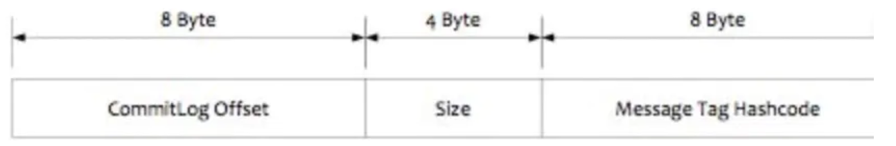

https://help.aliyun.com/document_detail/440309.html

## Topic && Tag

---

**什么时候用Topic & Tag？**

- 消息类型是否一致？如普通消息、事务消息、定时（延时）消息、顺序消息。不同的**消息类型**需要使用不同的topic，无法通过Tag进行区分
- **业务是否相关联**？没有直接关联的消息，如淘宝交易消息，京东物流消息使用不同的 Topic 进行区分；而同样是天猫交易消息，电器类订单、女装类订单、化妆品类订单的消息可以用 Tag 进行区分。
- **消息优先级**是否一致？如同样是物流消息，盒马必须小时内送达，天猫超市 24 小时内送达，淘宝物流则相对会慢一些，不同优先级的消息用不同的 Topic 进行区分。
- **消息量级**是否相当：有些业务消息虽然量小但是实时性要求高，如果跟某些万亿量级的消息使用同一个 Topic，则有可能会因为过长的等待时间而“饿死”，此时需要将**不同量级的消息进行拆分，使用不同的 Topic。**

> 不同的 Topic 之间的消息没有必然的联系，而 **Tag 则用来区分同一个 Topic 下相互关联的消息**，例如全集和子集的关系、流程先后的关系。

----

**Tag如何实现消息过滤**

RocketMQ分布式消息队列的消息过滤方式有别于其它MQ中间件，是在**Consumer端**订阅消息时再**做消息过滤**的。

RocketMQ这么做是在于其Producer端写入消息和Consumer端订阅消息采用**分离存储的机制**来实现的

Consumer端订阅消息是需要**通过ConsumeQueue这个消息消费的逻辑队列拿到一个索引**，然后再从**CommitLog（消息真正的物理存储文件）里面读取真正的消息实体内容**，所以说到底也是还绕不开其存储结构。其ConsumeQueue的存储结构如下，可以看到其中有8个字节存储的Message Tag的哈希值，**基于Tag的消息过滤**正是基于这个字段值的。

---

**Tag过滤方式**

Consumer端在订阅消息时除了指定Topic还可以指定Tag，如果一个消息有多个TAG，可以用||分隔。其中，Consumer端会将这个**<u>订阅请求</u>**构建成一个 SubscriptionData，发送一个**Pull消息的请求给Broker端**。

Broker端从RocketMQ的文件存储层—Store读取数据之前，会用这些数据先构建一个MessageFilter，然后传给Store。Store从 **ConsumeQueue**读取到一条记录后，会用它记录的消息tag hash值去做过滤，由于在服务端只是根据hashcode进行判断，无法精确对tag原始字符串进行过滤，故在消息消费端拉取到消息后，还需要**<u>对消息的原始tag字符串进行比对</u>**，如果不同，则丢弃该消息，不进行消息消费。

