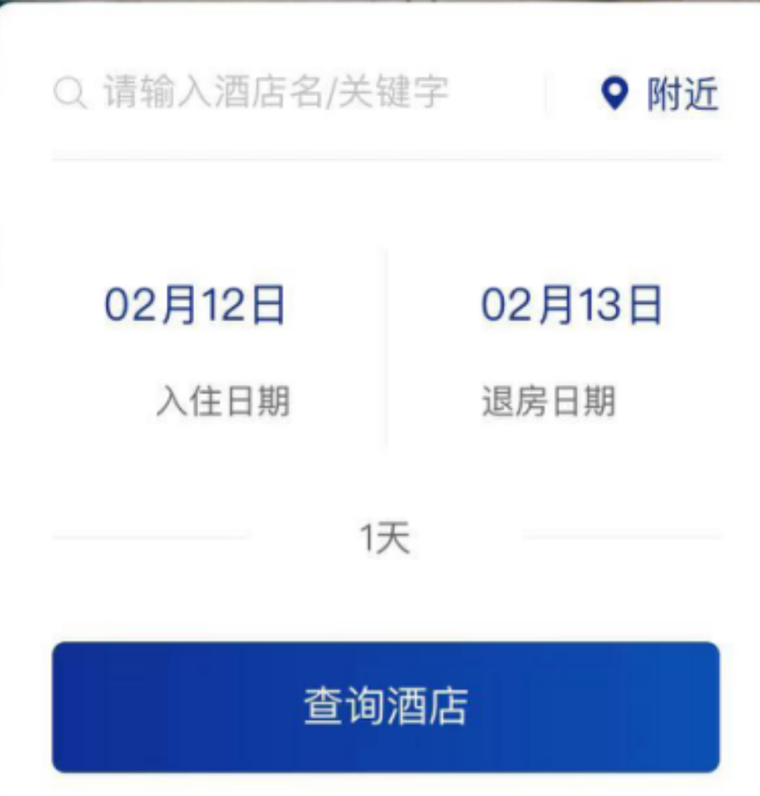
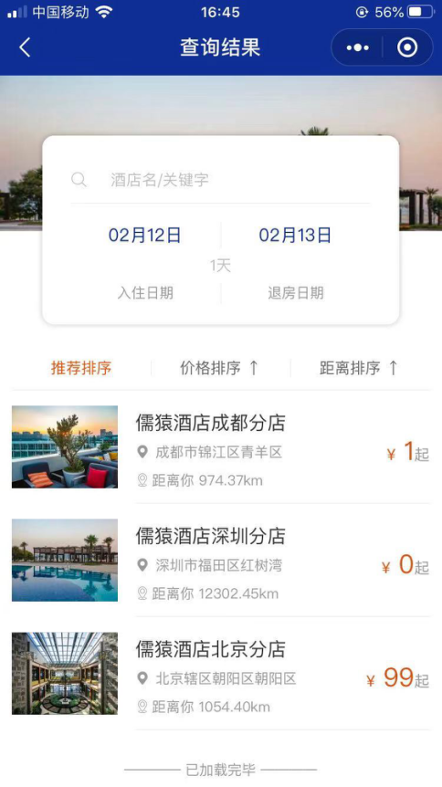
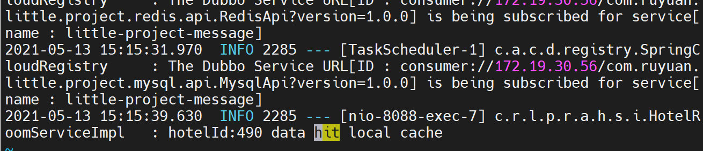
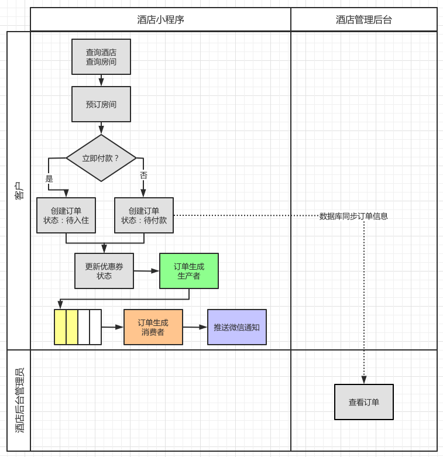
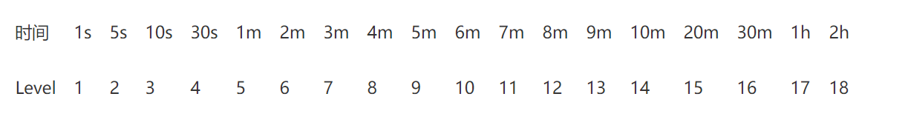
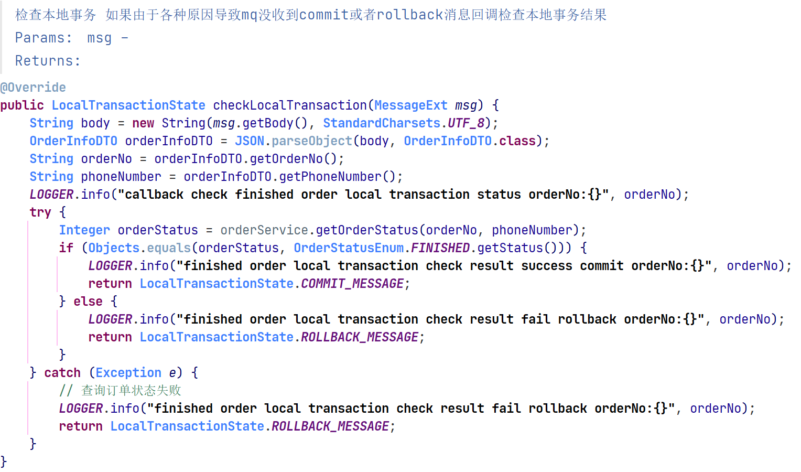
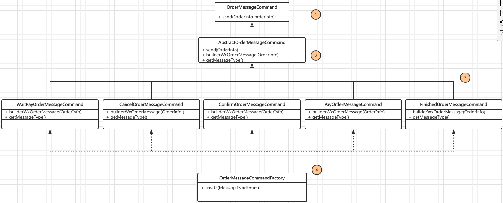
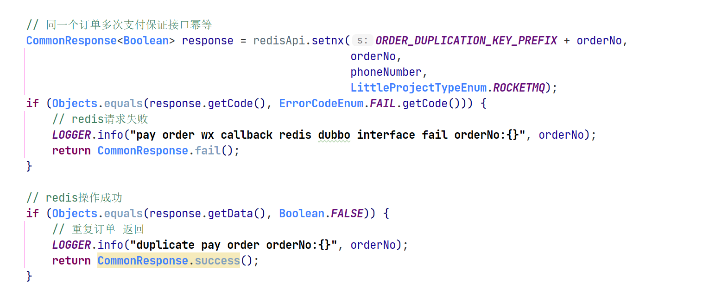

在高并发、大流量的系统架构中，MQ（Message Queue）消息队列的应用是非常广泛的。从读写分离到服务之间的解耦，从高并发的削峰到热点数据的请求，MQ 的应用是无处不在。

RocketMQ 作为一款分布式的消息中间件，经历了 Metaq1.x、Metaq2.x 的发展和淘宝双十一的洗礼，成为市面上比较流行的 MQ 产品，被各大厂商争相采用。


# 项目架构


## 功能结构图


本项目主要针对“互联网酒店预约系统”开发的，其中酒店的管理人员可以在“酒店管理后台”进行酒店房间的管理，如图1 所示，例如：添加、修改房间。


如图 2 所示，后台管理人员可以通过订单管理列表看到用户的订单信息，从而进行入住和退房操作。


总体而言“酒店管理后台”主要是给酒店的管理人员使用的，包括：**分店管理，房间管理，订单管理，优惠券管理等部分**。

其次，客人可以通过“酒店小程序”进行酒店房间的查询，接着预定、下单、查看优惠卷等动作。如图3 所示，客人可以通过小程序查询酒店，根据列表中显示的酒店，选择位置和价格都适中的，并且针对合适的房型进行预订。


**“酒店小程序“负责提供给客人查找和预订等功能，而“酒店管理后台”负责房型的管理和订单相关操作。**


互联网酒店预订系统的内容分为两块，分别是上面桔红色的“酒店小程序”，这部分是提供给客人使用的。主要功能包括：登录、查看优惠券、预订下单、支付订单、取消订单。

这些功能涵盖了预订房间的整个生命周期，其操作顺序是：用户“登录”，“搜索分店”，“选择分店”、“查看房型”、“选择房型”、“预定下单”，以及“支付订单“或者“取消订单”

与此同时，用户登录以后可以在“优惠券管理”中查看“优惠券”，“我的订单”中查看“待支付订单“和”取消订单“

下面的绿色部分是“酒店管理后台”，主要是给酒店管理人员使用的，其包括：添加房型、修改房型、确认订单（入住）以及结束订单（退房）

这些功能基本上可以总结为房型管理和订单管理。其操作流程是：在“分店管理”中添加分店，在“房间管理”中给指定分店添加房间。在“订单管理”中针对具体订单进行“入住”或者“退房”操作。也就是这些后台操作与小程序中的功能相映成趣，完成整个订单流程。


## 业务流程


### 用户登录


用户通过小程序进行登录，这里会通过**微信授权登录方法**来调用后端登录接口登录，同时也会有**手机号**的授权


如图1所示，在登录“酒店小程序”的时候，会请求“小程序后台”判断**是否“第一次登录？“：如果“是”，会给用户发放优惠券。同时用户会在”我的优惠券“中找到对应的优惠券信息。如果不是第一次登录，那么不会走“发放优惠券”的流程。**

无论是否“第一次登录”，都会在“小程序后台”通过**“验证登录信息”**，返回给客户登录的结果。客户在获得登录结果以后，登录系统或者由于后端服务异常，返回登陆失败（微信授权失败）。


### 搜索房型以及下单


用户在登录以后会进行哪些业务流程呢？如图2所示，泳道的从左到右依次列出了**“酒店小程序”和“酒店管理后台”**，从上往下流出了“客户”和“酒店管理人员”。可以方便了解，在不同流程的参与者和操作的平台。


有部分配置信息是“酒店管理员”事先在“酒店管理后台”配置好的，这里用黄色表示，同时在执行流程过程中如果**需要调用这部分信息**时，会通过蓝色的箭头表示。

------

我们顺着箭头从上往下来看流程，先从“查询酒店”开始。客户登录“酒店小程序”以后，会通过时间范围等搜索条件**查询酒店信息**，在此基础上“**选择分店**”，**“分店信息”是由酒店管理者在“酒店管理后台”事先配置好的**。

针对每个分店有对应的房型信息**“选择房型”**，同样该信息也是配置好的，**直接获取**就好了。之后，通过**“预订”功能“填写入住信息”**，最后通过**“付款”**完成交易。

需要注意的是，付款的时候会**获取优惠券的信息**，还记得在登录时发放的优惠券吗？在这里就派上用场了。到这里客户在小程序上面操作的流程就完了。用户可以在**小程序的“我的”中实时查看订单的状态**。接下来就轮到**“酒店管理人员”上场了。**

客户付款以后会“记录预订”，以订单的形式，让“酒店管理人员”在**“查询订单信息”中找到对应的订单**。在根据对应的订单进行“确定入住”操作，也就是当客户到达酒店以后进行Check in的时候执行。

当然，客户离开酒店的时候，我们的管理人员也可以执行**“确定退房”的操作**。上述的这些操作都是在**酒店管理后台完成**。整个**订单的状态变更可以在小程序上看到。**


## 逻辑架构

有了业务的指导后再**根据业务进行系统的搭建**，逻辑架构图就是**根据业务流程和功能实现技术架构的基础**。逻辑架构就是对功能的技术抽象，告诉架构师为了实现这些业务功能需要用到哪些技术，例如：**客户端、网关、服务、存储等等。**

有了功能和流程形成了业务的骨架，这个骨架需要落地成为“活生生的人”就需要进行逻辑设计。


逻辑设计就是设计人的血肉，在原来的骨架上进行实体的填充，包括使用到的技术，功能模块的划分。在逻辑架构中**可以不提及具体的实现技术工具，但是要对技术要点进行分析**，也就是“造人”的可行性分析。这里一起来看看架构图，如图1 所示，我们将本系统分为四层，从上往下分别是“访问层”、“接入层”、“服务层”、“数据层”。

从上往下也是用户请求的方向，用户请求从“访问层”接触到系统，请求通过“接入层”访问到具体的业务服务。业务服务在**“服务层”中提供“访问层”需要的服务，并且对服务进行模块划分**。最后数据的持久化和缓存需要数据层提供。


---

- 访问层

用户会通过这层提供的应用访问到整个系统，这里会继承系统中功能的访问接口。由于本系统有两类用户，分别是“客户”和“酒店管理人员”，因此这里提供了两个访问的入口，分别是**“预订客户端”（“酒店小程序”）和“酒店管理后台”。**

之所以这里不直接说小程序和Web管理网站，是因为在这一层需要做**抽象**。根据具体的使用场景不同，小程序可以被Android 、IOS所替代；管理后台也有可能需要接入其他系统或者使用其他技术。这也是**逻辑层存在的价值**，帮助大家使用**抽象思维架构系统**。


---

- 接入层

有了访问层，**请求会通过HTTP/HTTPS请求进入到系统的内部**。在进入之前会经过访问层，由于我们的系统有可能暴露在公网环境下，而内部的服务和公网用户访问需要有一个**缓冲或者保护机制**。

这里使用**反向代理**的方式，将**外部的请求代理到内部的服务中**，**对流量进行了管理、也隔离了网络**。同时使用网关的机制，也可**以对请求进行过滤和鉴权**。例如：用户**访问权限、重复发送请求、恶意请求、大流量控制**都可以在这一层完成。


----

- 服务层

这个是系统的大头，基本所有的服务都是在这里提供。从图中绿色的部分可以看到包括三个紫色的框图。将服务分为了三类：**基础信息管理、订单管理和系统管理。**

基础信息管理，主要包括**分店信息、房型信息、优惠券信息**这些信息属于系统基础信息，系统正常运行会依赖这部分的信息，在系统构建之后需要第一时间建立。

订单管理包括系统中的**主要业务信息**，包括：订单预订、订单付款、确认入住、确认退房，也是业务流程中的主要操作。

系统管理中的**用户登录和消息推送**，属于系统级别的功能和业务可以解耦。


---

- 数据层

为了实现数据的持久化，这一层通常用来存储业务数据。同时在必要的时候还会为系统提供缓存服务。


## 技术架构


---

- 访问层

使用了微信小程序和H5的方式提供给“客户”和“酒店管理人员”进行操作。这里的技术选型和使用场景相关。

“客户”通常预订房间多是在旅途中，**使用移动终端的场景会多些**，由于微信的普及率较广，使用小程序作为入口推广成本较低。同样，“酒店管理人员”移动办公需求较少，同时还**需要处理各种表格数据，PC端使用H5的方式是不错的选择，符合使用场景匹配的原则。**


---

- 接入层

是连接客户和服务的纽带，这里使用了**Nginx 作为反向代理**，反向代理不仅使**外网和内网进行了有效的隔离**，同时进行了IP的转化。

Nginx 结合OpenResty的脚本功能还可以和缓存队列等技术有机结合，而且为以后的水平扩展也提供了可能性。启用“儒猿自研网关”**对请求进行过滤和鉴权**，针对**流量限制**，**用户权限控制**等功能可以放在这里完成。


---

- 服务层

服务层内容比较多，先从下面四个独立的模块开始**。Spring Boot 作为脚手架搭建基本服务架构**，理清组件包之间的依赖关系，快速搭建后台应用程序。**MyBatis 作为数据库访问**的利器，支持ORM和手动SQL的方式对数据库进行操作。

**Spring Web MVC 是提供RESTFUL API**的主力军，其网络请求的处理能力使它成为本架构的不二之选。

- 最后是**Elastic Search ，其将数据库中的信息转化为索引文件**，提供**高效的数据检索功能**，非常适合酒店搜索功能。在四个模块的右边有三个竖条分别是RocketMQ、Redis 和Nacos。

- RocketMQ提供了服务之间**消息流转的通道**，将服务之间关系进行**解耦**，让架构真正做到**高内聚、低耦合。**

- Redis 作为**进程外缓存**，提高请求的响应时间，增强用户体验。

- Nacos的加入作为**服务之间的注册中心**，不仅理清了服务之间的调用关系，也提供了分布式服务部署的可能性。

接着再看右边粉色的条形，slf4j （Simple Logging Facade for Java）作为日志的利器，**保存运行时的日志信息**，是debug的好帮手。

中间紫色区域的**“业务服务”包括“基础信息管理”、“订单管理”以及“系统管理”三大服务模块**，是系统需要实现的服务主体，作为业务描述放在这里与逻辑架构中的业务部分相对应。

最后是上方的Tomcat 应用服务器，作为应用服务的容器承载服务请求与响应的主要工作。


---

- 数据层

数据层的内容相对简单，MySQL老牌的关系型数据库负责存放客户、酒店、房型、配置等业务信息。**Redis的持久化功能**增加了Redis缓存的可靠性。


## 项目大图


### 修改房间场景


通过用户请求的过程将每个技术组件串联起来


修改房间执行流程：

1. “酒店管理人员”通过“酒店管理后台”访问房间详情的配置信息。这里的入口是H5，也就是管理后台的具体实现。
2. 此时请求通过H5请求到系统的入口，作为**反向代理和负载均衡的Nginx**接受到请求会将其转交给“儒猿自研网关”。
3. 在“儒猿自研网关”可以进行**用户验证、流量限制**等工作，最终通过服务层请求对应的服务。
4. 由于**每个服务都是Host在Tomcat之上**的，这里会**通过Tomcat请求每个服务**。这里的Tomcat对应的是“酒店管理后台”，需要与后面提到的**小程序后台Tomcat**作区分。
5. 在请求服务之前会经过Spring Web MVC**对HTTP请求进行解析，转化为请求对象**。
6. 将解析请求以后会调用“基础信息管理“中的”房间详情“服务，并且根据请求内容进行房间信息的修改。
7. 修改信息通过MyBatis 更新到MySQL中完成数据的更新。
8. 之后再将更新的房间信息**发送给Redis缓存**起来，如果此时有请求访问时就不用从数据库中获取了。
9. 接下来就是通过**RocketMQ队列分发修改房间信息的消息**，并且**通知订阅该消息的其他服务。**
10. 订阅消息的服务获取**消息通知**以后，会**更新服务本身JVM的缓存**，同样也是为了提高用户的访问效率。
11. 最后，将这一连串的操作记录成日志存档。


### 查看房间场景


查询操作实际上与上面的修改操作形成对比，刚才保存的数据也就是为这里查询使用的。

如图2所示，系统架构和技术组件都没有改变，不同的是业务的流程和请求的路径发生变化。


**查询房间执行流程 **

1. “客户”通过微信小程序访问酒店预订系统，此时小程序作为系统的入口。
2. 访问接入层的Nginx。
3. 通过“儒猿自研网关”的**过滤**。
4. 这里访问的是**小程序后台的Tomcat**，其**承载着小程序需要的服务API**。
5. 依旧是通过Spring Web MVC访问具体的服务。
6. 房间信息存放在基础信息管理服务中，从这里开始流程会有所不同。
7. 服务在获取用户请求的时候，会**先去检查本地JVM缓存中是否有房间详情的信息，如果有的话将会直接返回给客户。**
8. 如果在JVM缓存中不存在房间详情，**会从Redis 缓存中获取**。
9. 如果Redis缓存中依旧不存在该信息，才**回源到MySQL数据库**，同样也是使用MyBatis来访问。
10. 完成查询操作以后依旧会记录日志归档。


# 项目概述


## 基础服务

通过SpringCloud Alibaba 创建了项目

通用功能的使用，例如：数据库的访问、缓存使用和消息发送。这些功能作为课程的基础，辅助我们实现RocketMQ的应用场景，但比起RocketMQ而言并不是核心功能。

介绍下这几个组件：

-  little-project-common

主要封装了请求的响应体，以及枚举响应码的信息。在Controller中完成请求返回的时候经常被用到。

CommonResponse就是出自于“little-project-common”组件，作为标准的响应返回体。

- little-project-mysql-api


little-project-mysql-api”组件作为**访问MySQL数据库的API**，是一个**dubbo服务**，它在获取数据库信息的时候会被用到。

在需要访问数据库之前先**定义MysqlApi类型的变量**，使用MysqlApi 中的Query方法，传入查询的DTO对象，从而获取返回的结果。

- little-project-redis-api


little-project-redis-api”是用来访问Redis的组件，也是一个**dubbo服务**，用来对Redis缓存进行操作。

- little-project-message-api

little-project-message-api”组件是微信推送消息的API，也是**dubbo组件**，在**完成某些业务场景**的时候会调用其**进行微信消息的推送**。

通过调用WxSubscribeMessageApi 中的send方法**负责微信消息推送**，其输入参数是包含推送消息的DTO对象。

将订单的微信消息的推送封装到抽象类中，其中针对“WxSubscribeMessageApi”类声明变量，用来消息发送。


## 整体划分


### 后台系统的划分


整个系统由酒店小程序、酒店管理后台，这**两套系统分别对应两个后台的服务**，它们分别是：小程序后台API和酒店管理后台API。

如图所示，上方虚线框部分已经有儒猿团队提供给大家了，作为学员我们需要关注下方实线框的部分，**小程序后台API和酒店后台管理API是这次课程的主体**，我们的大部分代码都在这里完成。

后台的结构划分：


### 代码模块的划分


从业务出发我们需要将每个业务划分为不同的模块，每个模块对应一个或者多个服务从而支撑模块的运行

> 实际工作中这些服务有可能分开开发和部署，分别部署为多个微服务

我们在liitle-project-rocketmq项目中建立了admin和api两个包，**admin用来为酒店后台管理提供API服务**，而  **api 为酒店小程序提供API服务**。其中api包中分别包含如下几个包：

- coupon：包含优惠券相关的DTO、服务、Listener以及MQ消费者。
- hotel：包含房间相关的DTO、服务、Controller、Listener以及MQ消费者。
- login：包含登录相关的DTO、服务、Controller、Listener 、枚举状态、MQ生产者以及MQ消费者。
- message：包含消息推送相关的DTO、Listener 、消息命令以及MQ消费者。
- order：包含订单相关的DTO、服务、Controller、Listener 、枚举状态、MQ生产者以及MQ消费者。
- pay：包含消息支付相关的DTO、常量定义、Controller、服务。


# 部署服务到RocketMQ集群


## 打包服务


分配了对应的服务器，那么就可以讲我们前几节课中提到的应用服务部署上去了。

输入“mvn clean package” 的命令，这里表明通过Maven进行打包，打包的是生产环境（prod）。


## 上传服务


在上传服务（jar包）之前需要保证，在对应的ECS中建立服务运行的目录如下：

/home/admin/little-project-rocketmq/target


其中“/home/admin/little-project-rocketmq”是用来存放部署脚本的，注意我们这里使用的deploy.sh 脚本已经由儒猿团队上传了。

“/home/admin/little-project-rocketmq/target”目录是存放服务的jar包的，这个jar包是需要我们自己上传的。

在ECS上建立好目录结构以后，再回到本地的项目中，依旧是在IntelliJ IDEA的命令行中输入以下命令：

```
scp target/little-project-rocketmq.jar root@47.102.130.27:/home/admin/littl
e-project-rocketmq/target

命令的意思是通过scp命令将刚才打包的“little-project-rocketmq.jar”文件copy 到对应ECS服务器的“/home/admin/little-project-rocketmq/target”目录中。
```

这里需要特别说明一下，由于我在执行命令的根目录在“little-project-rocketmq”项目下面，如果你在其他的地方执行上述两条命令，需要指定好源文件的目录。

同时在使用scp命令以后会让大家输入服务器的密码，该密码可以从实战云平台上获取。

完成上面两个命令以后，服务就已经部署到ECS了。


## 启动服务


完成部署以后，需要到ECS 服务器上面启动部署的酒店管理后台的服务。还是登录ECS服务器，通过以下命令进入到“deploy.sh”文件所在的目录。

```
cd /home/admin/little-project-rocketmq
```


deploy.sh 文件是儒猿团队为大家生成的发布的脚本文件，通过Linux shell脚本完成发布的参数配置和启动命令。

包括启动应用等待的时间、应用端口号、健康检查的URL以及jar包的目录和日志信息。有兴趣的同学可以打开看看，这里就不做展开的介绍了。

保证当前目录下面存在“deploy.sh”文件，使用如下命令启动服务。

```
sh deploy.sh restart
```

命令使用了“restart”作用与“start”是一致的，用“restart”的目的以免在重复发布过程中，学员忘记是否启动过服务。因此使用“restart”，这样即便是已经启动过服务，也会重新加载服务。

另外，deploy.sh中已经加了自动化脚本，用来防止用户未指定成prod环境和更改rocketmq.namesrv.address地址的配置，默认了prod环境和当前ECS的地址:9876为namesrv的地址。这些大家只需要了解就可以了，不用做任何更改。

运行命令在看到所示的“success”字样的时候，就说明服务启动成功了。


## RocketMQ   Console的功能介绍


不过RocketMQ的服务是儒猿团队已经安装到ECS服务器上的，我们可以通过如下方式访问：

http://47.102.130.27:8080/


这里是RocketMQ的控制台，包括日常的OPS信息、集群（Cluster）、Topic、Consumer、Producer、Message的信息


# 数据的初始化


- 基础门店数据：

客户需要选择酒店以后在指定房间，随后才能完成预定的操作。其中酒店和房间的基本信息需要事先在“酒店管理后台”配置好，不过针对酒店的信息由于和主体的业务操作耦合没有那么紧密，已经由儒猿团队为大家配置好了。

如图1 所示，儒猿团队已经在后台配置好了三家酒店，分别是“儒猿酒店成都分店”、“儒猿酒店深圳分店”和“儒猿酒店北京分店”，其基本信息如图中所示。这部分的配置功能就不给大家开放了，也让大家把更多精力放在核心业务上面。


----


- 添加房间数据：

上面的酒店分店数据不用我们自己添加，儒猿平台已经帮我们加好了。房间的数据会作为我们一个实战的场景，所以对应的功能是对我们学员来开放的，这里我们先初始化一下房间数据，后面在进行详细的介绍。

如图2 所示，回到小实战平台，在“房间管理”中会显示所有添加房间的列表。点击右边的按钮，选择“新增房间”就可以初始化房间的数据了。


# 登录逻辑


## 登录逻辑的业务流程


登录酒店小程序的业务逻辑：


客户通过“酒店小程序”进行登录，此时会将请求提交给“小程序后台”，后台在判断是否是第一次登录以后，会出现两个流程分支。

如果是第一次登录：会**给对应的客户发放优惠券**，同时客户可以在小程序中**查询到优惠券**的信息。

如果不是第一次登录：跳过发放优惠券的流程进入下面**验证登录信息**的处理。

无论是否是第一次登录，最后流程都会**对用户进行登录验证的操作**，最后返回登录结果给客户。


有三件事是需要做的：

- 判断**是否第一次登录**：这个好理解，客户每次登录都**在数据库中记录一个状态**，下次登录的时候**与这个状态进行比较**就可以知道是否第一次登录。如果更加细致一点其实是两个操作：***检查登录状态和更新登录状态*** 。
- 发放优惠券：可以**单独作为一个功能存在**，就是向用户发放优惠券，这里使用的是**同步调用**。在这个场景中是第一次登录就发放。当然这个功能也可以用到其他场景中，例如：消费多少金额，发放优惠券。为了能够将此功能解耦，会单独将其提出来。
- 验证登录信息：由于大家是使用微信登录系统，因此会**封装微信登录的模块**。由于小程序的部分功能使用开源的PHP完成，因此这部分代码不需要大家做修改，已经由系统完成。我们可以在登录的时候打上日志，方便跟踪和理解这部分功能。


## **微信登录**


### 小程序登录授权


小程序登录授权的流程包括三个步骤，分别是   **登录小程序、获取手机号和解密手机号。**


登录的目的是为了获得登录的凭证，**保证登录小程序的合法性**。 接下来就是手机号授权，由于安全性问题小程序中是无法直接获取学员手机号的，因此需要得到使用者，也就是学员的授权。

授权通过以后，**手机号会通过加密的方式传到后端**，此时有一个解密的过程，由我们的PHP开源代码完成这个过程。并且**把手机号的明文传给服务器端**，服务器**通过手机号来识别对应学员申请的ECS 以及部署的应用**，从而继续后面的实验。 


登录授权的目的是通过微信官方的登录能力获取微信的用户身份标识，快速建立小程序内的用户体系。


如图 3 所示，这里从开发者的角度描述了小程序授权的全过程。我们顺着箭头的方向从左往右看一下。在获取**用户授权**的时候，小程序会通过**wx.login（）方法获取一个code**，并且把它发往**开发者服务器（我们自己的后端）**，其通过已经申请好的**appid和appsecret** 加上这个code去**向微信接口服务获取对应的session_key和openid。**

同时将返回的信息与openid，session_key 进行管理，返回***自定义登录状态***。

**小程序**拿到自定义登录状态以后**保存在本地的storage**中，在每次发起服务端请求的时候，都会**携带上这个登录态**，开发者服务器也**通过这个登录态去查询用户的openid和session_key**，也就是最开始用户授权时生成的信息。在**通过验证以后返回业务数据**，整个过程保证用户数据传输的安全。


----

- 获取手机号

前面获取了用户的授权，但是不等于能够获得用户的手机号。微信小程序如果要获取用户的手机号，也需要**用户的授权（安全性要求）**。由于手机号会和学员的**ECS IP以及发布的服务相关，这里必须获取，于是就有了获取手机号的部分。**

如图4所示，在小程序授权之后，接着会弹出手机号授权的框，其目的就是为了获取用户的手机号。


获取微信用户绑定的手机号，需先调用[wx.login](https://developers.weixin.qq.com/miniprogram/dev/api/open-api/login/wx.login.html)接口。

由于需要**用户主动触发**才能发起获取手机号接口，所以该功能不由 API 来调用，需用 [button](https://developers.weixin.qq.com/miniprogram/dev/component/button.html) 组件的点击来触发。

也就是在图4的“手机号”[button](https://developers.weixin.qq.com/miniprogram/dev/component/button.html) 组件的 open-type 的值设置为 `getPhoneNumber`，当用户点击并同意之后，可以通过 `bindgetphonenumber` 事件回调**获取到微信服务器返回的加密数据**， 然后在第三方服务端**结合 session_key 以及 app_id 进行解密获取手机号**。


---

- 解密手机号

由于获取的手机号为了安全性，本身是进行加密的这一点可以从获取手机号的返回参数看出。如图5所示，在返回参数中包括encryptedData的用户加密信息，以及iv的机密算法的初始向量，还有couldID敏感数据对应的云ID。


尽管返回的手机号是加过密的，但是我们不必担心，因为我们使用的开源PHP程序已经帮助我们处理这些机密信息了。在后台获得小程序请求的时候，我们将看到明文的手机号。


## MQ对登录系统核心流程异步化改造


### 传统登录流程


当用户登录的时候，会判断“是否第一次登录？”当用户满足第一次登录条件以后，后台会在数据库中记录登录的信息，然后发放优惠券。


这里注意：**“记录第一次登录信息”和“发放优惠券”是有先后顺序的**，将两个功能放到一个模块里面进行。


> **为了服务的高内聚、低耦合，或者通过分布式提高服务的高并发能力，将模块或者服务切分，如：将登录模块和优惠券模块拆分成两个服务**

服务拆分以后，服务内部保证实现对应的功能，服务的执行先后顺序可以根据业务需求进行调整。例如：可以在“记录第一次登录信息”的同时就“发放优惠券”，**不用等待记录成功才进行优惠券的发放**。让系统效率最优，同时让更多的服务之间可以进行组合。


### 异步化登录流程


登录完毕更新状态再发送优惠券，同步的方式本身就带来性能问题。为了提升登录接口的性能，同时兼顾服务的高内聚、低耦合，分布式的要求，就有了异步化的登录流程。


我们将原来的一个小程序后台拆分成两个服务，分别是**登录服务和优惠券服务**，在图中用红色字体表现出来。注意：这里的服务分割是逻辑上的，为了整个项目方便操作和演示，我们还是将两个服务放到了一个项目中，只是通过包名来区分服务。


登录服务包含了`LoginService（登录服务）`，其主要负责**判断**第一次登录以及记录第一次登录的**信息**。在完成这些操作之后会通过`LoginProducer（登录消息生产者）`发送登录的消息。

登录消息会被发送到RocketMQ的消息队列，这里RocketMQ就充当了**服务解耦的中介者**。在`CouponCunsumer（优惠券消息消费者）`这边，会**订阅登录的消息**并且获取对应的消息，进行后续优惠券的发放。

> 这样在向消息队列发送了登录消息后，优惠券服务在收到订阅的消息后，异步发送优惠券，无需等待登录成功响应返回再去同步发出优惠券


## **基于MQ对登录系统核心流程进行异步化改造**


### 会员数据库表结构

首先要定义会员的数据库表结构，和其他的表定义一样，我们这里将定义展示如图1所示，这里不逐一给大家做介绍，因为这部分的表已经在数据库后台由儒猿团队为大家建立好了。

会员数据库表结构：


----


### 登录RocketMQ参数定义

我们要使用RocketMQ的功能发送消息，需要对其的基本参数进行定义，

这里**定义了RocketMQ topic、producer和consumer的group参数**，同时也定义了RocketMQ的namesrv的地址。

需要注意的是，这个服务器的地址不需要大家手动修改了，在部署项目的时候已经在deploy.sh 文件中自动为大家做修改了。这里配置出来是让大家知道，RocketMQ服务器的地址也是必填项。 


```properties
# 登录消息的topic
rocketmq.login.topic=login_notify_topic
rocketmq.login.producer.group=login_notify_producer_group
rocketmq.login.consumer.group=login_notify_consumer_group

# 第一次登陆下发的登录优惠券id
first.login.couponId=738
# 优惠券有效时间30天
first.login.coupon.day=30
# 当前部署的服务器的外网ip地址 每次重新部署时修改  这里在deploy.sh文件中已经自动做了修改，不需要手动配置
# rocket.namesrv.address=xxxxxx
```


----


### 登录消息生产者


```java
//用来启动loginMqProducer，也就是登陆消息的生产者，启动producer以后就能通过这个生产者在需要的时候发送MQ消息了
//这里面的loginMqProducer的MQ的地址和组 已经配置完成，使用的时候可以直接注入然后发送消息即可
@Configuration
public class LoginProducerConfiguration {

    //RocketMQ服务器的地址，会去读配置文件
    @Value("${rocket.namesrv.address}")
    private String namesrvAddress;

    //MQ生产者（Producer）的组（Group）
    @Value("${rocketmq.login.producer.group}")
    private String loginProducerGroup;

    //它被注册成为一个Java Bean
    @Bean(value = "loginMqProducer")
    public DefaultMQProducer loginMqProducer() throws MQClientException {
        //传入当前producer所属的group
        DefaultMQProducer producer = new DefaultMQProducer(loginProducerGroup);
        producer.setNamesrvAddr(namesrvAddress);
        producer.start();
        return producer;
    }
}
```


### 登录服务(LoginService)


```java
//登录接口service组件
public interface LoginService {

    /**
     * 第一次登录需要分发优惠券
     * @param loginRequestDTO 登录信息
     */
    void firstLoginDistributeCoupon(LoginRequestDTO loginRequestDTO);

    /**
     * 调用这个方法可以将用户的第一次登陆状态重置，主要是方便我们反复测试“第一次登录”的功能。
     * @param phoneNumber 手机号
     */
    void resetFirstLoginStatus(String phoneNumber);

}
```


登录核心业务：

```java
@Service
public class LoginServiceImpl implements LoginService {


    //日志组件
    private static final Logger LOGGER = LoggerFactory.getLogger(LoginServiceImpl.class);

    @Autowired
    @Qualifier(value = "loginMqProducer")
    private DefaultMQProducer loginMqProducer;

    @Value("${rocketmq.login.topic}")
    private String loginTopic;

    /**
     * mysql dubbo api接口
     */
    @Reference(version = "1.0.0",
            interfaceClass = MysqlApi.class,
            cluster = "failfast")
    private MysqlApi mysqlApi;

    /**
     * redis dubbo服务
     */
    @Reference(version = "1.0.0",
            interfaceClass = RedisApi.class,
            cluster = "failfast")
    private RedisApi redisApi;


    @Override
    public void firstLoginDistributeCoupon(LoginRequestDTO loginRequestDTO) {

        //不是第一次登录，返回
        if(!isFirstLogin(loginRequestDTO)){
            LOGGER.info("userid:{} not first login", loginRequestDTO.getUserId());
            return;
        }
        //是第一次登录：

        //更新第一次登录的标识位，根据手机号更新 登录状态为 "已登录过"
        this.updateFirstLoginStatus(loginRequestDTO.getPhoneNumber(), FirstLoginStatusEnum.NO);
        //发送第一次登录成功的消息
        this.sendFirstLoginMessage(loginRequestDTO);
    }

    /**
     * 校验是否是第一次登陆
     *
     * @param loginRequestDTO 登陆信息
     * @return
     */
    private boolean isFirstLogin(LoginRequestDTO loginRequestDTO) {
        MysqlRequestDTO mysqlRequestDTO = new MysqlRequestDTO();
        mysqlRequestDTO.setSql("select first_login_status from t_member where id = ? ");
        ArrayList<Object> params = new ArrayList<>();
        params.add(loginRequestDTO.getUserId());
        mysqlRequestDTO.setParams(params);
        mysqlRequestDTO.setPhoneNumber(loginRequestDTO.getPhoneNumber());
        mysqlRequestDTO.setProjectTypeEnum(LittleProjectTypeEnum.ROCKETMQ);

        LOGGER.info("start query first login status param:{}", JSON.toJSONString(mysqlRequestDTO));
        //远程调用mysqlapi查询结果
        CommonResponse<List<Map<String, Object>>> response = mysqlApi.query(mysqlRequestDTO);
        LOGGER.info("end query first login status param:{}, response:{}", JSON.toJSONString(mysqlRequestDTO), JSON.toJSONString(response));
        if (Objects.equals(response.getCode(), ErrorCodeEnum.SUCCESS.getCode())
                && !CollectionUtils.isEmpty(response.getData())) {
            Map<String, Object> map = response.getData().get(0);
            //判断登录状态是否是 "未登陆过"
            return Objects.equals(Integer.valueOf(String.valueOf(map.get("first_login_status"))),
                    FirstLoginStatusEnum.YES.getStatus());
        }
        return false;
    }

    /**
     * 更新第一次登陆的标志位
     *
     * @param phoneNumber          用户手机号
     * @param firstLoginStatusEnum 登录状态 {@link FirstLoginStatusEnum}
     */
    private void updateFirstLoginStatus(String phoneNumber, FirstLoginStatusEnum firstLoginStatusEnum) {
        MysqlRequestDTO mysqlRequestDTO = new MysqlRequestDTO();
        mysqlRequestDTO.setSql("update t_member set first_login_status = ? WHERE beid = 1563 and mobile = ?");
        ArrayList<Object> params = new ArrayList<>();
        params.add(firstLoginStatusEnum.getStatus());
        params.add(phoneNumber);
        mysqlRequestDTO.setParams(params);
        mysqlRequestDTO.setPhoneNumber(phoneNumber);
        mysqlRequestDTO.setProjectTypeEnum(LittleProjectTypeEnum.ROCKETMQ);

        LOGGER.info("start query first login status param:{}", JSON.toJSONString(mysqlRequestDTO));
        CommonResponse<Integer> response = mysqlApi.update(mysqlRequestDTO);
        LOGGER.info("end query first login status param:{}, response:{}", JSON.toJSONString(mysqlRequestDTO), JSON.toJSONString(response));
    }


    /**
     * 调用login的producer 往RocketMQ的队列中发送登录消息
     * @param loginRequestDTO 登录请求信息
     */
    private void sendFirstLoginMessage(LoginRequestDTO loginRequestDTO){

        //场景一：性能提升   异步发送一个登录成功的消息到mq中
        //定义了RocketMQ Message的实体，并且设置了对应的topic（loginTopic）
        Message message = new Message();
        message.setTopic(loginTopic);

        //消息内容用户id，需要发送字节流数组
        message.setBody(JSON.toJSONString(loginRequestDTO).getBytes(StandardCharsets.UTF_8));
        try {
            LOGGER.info("start send login success notify message");
            //使用生产者对象发送消息,等待下游服务中的consumer进行消费
            SendResult sendResult = loginMqProducer.send(message);
            LOGGER.info("end send login success notify message, sendResult:{}", JSON.toJSONString(sendResult));
        }catch (Exception e){
            LOGGER.error("send login success notify message fail, error message:{}", e);
        }

    }


    @Override
    public void resetFirstLoginStatus(String phoneNumber) {
        //重置登录状态为 “未登陆过”
        this.updateFirstLoginStatus(phoneNumber, FirstLoginStatusEnum.YES);
    }
}
```


```
mvn clean install
打包完成后发布到ECS服务器上
scp target/little-project-rocketmq.jar root@47.102.130.27:/home/admin/littl
e-project-rocketmq/target
```

部署到ecs服务器上，

这里注意需要加上这个属性：否则在编译时会报错。


这里看到dubbo的地址，其实就是该ecs的内网地址，mysql，redis等dubbo服务是部署在分配的云服务器上的


向nacos中寻找所需服务：


# 优惠券服务


## 优惠券管理模块


### 发放优惠券的业务流程


在客户登录“微信小程序”以后，判断是否第一次登录，然后记录第一次登录的信息。随后，会通过LoginProducer发起一次消息，这个消息会通过消息队列RocketMQ发送到CouponConsumer中。

此时，**`CouponConsumer`**作为**优惠券消费者**接收到这个消息，会进行**“消费第一次登录消息”**的动作，从而调用**`CouponService`**去执行**“发放优惠券”**的动作。在“发放优惠券”以后，**客户就可以通过微信小程序看到对应的优惠券信息了。**

不过这部分的功能没有画在下图中，代码的实现已经由儒猿团队在PHP端实现了。大家可以理解为“发放优惠券”会**将优惠券保存到用户优惠券表中了**，PHP代码只是做了简单的**查询**动作。


### 优惠券初始化


针对初始化的操作不需要大家进行任何操作，已经有儒猿团队完成。在儒猿团队提供的后台中可以添加优惠券信息。


在点击“添加优惠券”之后会弹出如图3的内容，可以选择优惠券的种类、类别、类型、名称、参数设置、有效期、数量、状态、使用范围、优惠说明、排序等一些列信息。


在完成添加以后，会通过图4中的内容，在优惠券的列表中会显示刚刚添加的优惠券。


## 给首次登录的用户发一张优惠券


- 数据库表设计与实体类


如果说coupon表是记录优惠券基本信息的话，那么coupon user 表就是**记录优惠券与用户关系**的。如图2 所示，"t_coupon_user“表的表结构中，记录 phone_number 和coupon_id 的信息，这张表就建立了用户和优惠券的关联。换句话说当把优惠券发放给某个人时，就会在这张表中进行记录。


在“/api/coupon/dto”下面定义了“FirstLoginMessageDTO”的实体类，从名字上看它是用来获取RocketMQ中关于第一次登录消息的。Message包含：userId（用户ID）、nickName（用户名称）、beid（小程序id）以及phoneNumber（用户手机号）。


- 优惠券消费者**CouponConsumer**


实体类定义的是第一次登录的队列消息（FirstLoginMessageDTO），为了接受这个订阅消息需要定义与之对应的CouponConsumer，也就是优惠券消费者。如图4所示，在”coupon/consumer/“中定义CouponConsumerConfiguration”，用配置的方式初始化一个“DefaultMQPushConsumer“。

在类中定义了一个loginConsumer方法，在@Bean的annotaion中可以得到是用来监听登录消息的。需要注意的是在@ Qualifier的annotation中定义了具体的监听器名称：“firstLoginMessageListener”。也就是说在CouponConsumer启动以后，是由这个监听器来处理具体RocketMQ的登录消息的。


```java
/** * 登录消息的consumer bean * * @return 登录消息的consumer bean */@Bean(value = "loginConsumer")public DefaultMQPushConsumer loginConsumer(@Qualifier(value = "firstLoginMessageListener") FirstLoginMessageListener firstLoginMessageListener) throws MQClientException {    DefaultMQPushConsumer consumer = new DefaultMQPushConsumer(loginConsumerGroup);    consumer.setNamesrvAddr(namesrvAddress);    //订阅mq的login topic上的所有消息    consumer.subscribe(loginTopic, "*");    //通过“firstLoginMessageListener”的监听方法获取登录发过来的信息    consumer.setMessageListener(firstLoginMessageListener);    consumer.start();    return consumer;}
```


- 实施消息监听（**FirstLoginMessageListener）**

有了CouponConsumer 作为第一次登录消息的消费者，就要提供一个**处理消息的监听者FirstLoginMessageListener**，说白了**它需要对消息进行处理**。如图5所示，在api/coupon/listener下面定义了FirstLoginMessageListener类，其中有一个`consumerMessage`方法，就是用来对消息进行处理的。

在传入参数是一个Message的List，通过for函数**对这个List进行遍历**，**解析Message的内容**为FirstLoginMessageDTO，从而获取userId（用户id）、phoneNumber（手机号）等信息，通过调用couponService中的DistributeCoupon方法进行优惠券的分发。


- 分发优惠券（**DistributeCoupon）**


## 优惠券重复发放


但是如果过多发放优惠券，特别是一次登录重复发放多张优惠券就损失酒店的利益了


---

**生产者重复发送消息**


这里由于网络抖动，LoginProducer 就发送了两条“登录消息”，分别是“登录消息1”和“登录消息2”。因此，RocketMQ中也保存了上述的两条消息，在CouponConsumer这一端就会监听到两条信息，并且依次对两条消息进行处理。

处理的过程在前面也有讲过是记录用户与优惠券之间的关联，由于处理两次消息，自然就记录了两条关联记录。因此，最后的结果就是CouponService为“第一次登录”分配了两张优惠券。


---

**消费者重复处理消息**


CouponConsumer在消费完“第一次登录”的消息之后会**给RocketMQ的broker返回CONSUMER_SUCCESS**，即当前consumer消费了登录topic中的消息，成功提交消息offset；

但是当CouponService组件下发优惠券成功后，consumer端返回broker CONSUMER_SUCCESS时**网络抖动或者consumer消费消息后故障**，导致**broker没收到消费成功的响应**，即**消费者提交offset失败。**

当网络恢复或者CouponConsumer**重新启动**的时候，发现**队列指向的offset依旧指着刚才处理的那条“登录消息1”**，因此又将该消息处理了一次。因此就造成了在CouponService 中发放了两次优惠券的情况。


---

**处理消息的幂等机制**


***无论消息被发送多少次，或者消息被反复处理多少次，最后只对同一条消息进行一次处理。***

换句话说**即便是RocketMQ的消息队列中积累了上百条消息，只要他们是相同的消息**，例如：针对**同一个账号的第一次登录**，优惠券只会发送一次，永远不会重复。


## 基于redis幂等机制


解决优惠券发放幂等性的问题需要回到消费者处理消息本身。作为优惠券消息的消费者CouponConsumer需要从RocketMQ的队列中获取消息，在上节课中介绍的两种情况中：

1. 因为网络抖动生产者（LoginProducer）产生了重复的消息，CouponConsumer会重复消费两条消息。
2. 消费者（CouponConsumer本身）由于下线没有通知broker CONSUMER_SUCCESS，导致重启后重复消费。

如图1所示，如果在消费者（CouponConsumer）每次处理消息的时候都将这个消息存放到Redis上进行缓存，**在每次发放优惠券之前都会询问“是否存在相同消息？”**，只有**在“否”的情况下才执行“发放优惠券”**。这里的“否”也就是**不存在相同优惠券**的意思，于是就避免了优惠券的重复发放。


通过redisApi.setnx方法（已经由儒猿团队进行封装）将消息信息保存到Redis中。设置了“第一次重复登录”的前缀+用户Id（userId）作为Key，后面的用户名（userId）、电话号码（phoneNumber）作为Value。


利用setnx的函数特性，当reponse返回成功“SUCCESS”并且data为”FALSE“说明Redis中对应的Key已经有Value 了，也就说明Redis中已经存在这条消息了，消费者已经处理过这条“第一次登录”的记录了。这种情况下，只记录一个日志，而不进行后续的操作。

如果返回的是“SUCCESS”并且data为“true”，说明Redis没有记录这条消息，也就是消费者第一次处理这个消息，那么就需要更新数据库中用户和优惠券的关系，从而完成给用户发放优惠券的操作。


```java
public ConsumeConcurrentlyStatus consumeMessage(List<MessageExt> msgs, ConsumeConcurrentlyContext context) {
    Integer userId = null;
    String phoneNumber = null;
    for (MessageExt msg : msgs) {
        String body = new String(msg.getBody(), StandardCharsets.UTF_8);
        try {
            LOGGER.info("received login success message:{}", body);
            // 第一次登陆消息内容
            FirstLoginMessageDTO firstLoginMessageDTO = JSON.parseObject(body, FirstLoginMessageDTO.class);
            // 用户id
            userId = firstLoginMessageDTO.getUserId();
            // 手机号
            phoneNumber = firstLoginMessageDTO.getPhoneNumber();

            // 通过redis保证幂等
            CommonResponse<Boolean> response = redisApi.setnx(RedisKeyConstant.FIRST_LOGIN_DUPLICATION_KEY_PREFIX + userId, //这是key
                                                              String.valueOf(userId),//userId和phone是value
                                                              phoneNumber,
                                                              LittleProjectTypeEnum.ROCKETMQ);
            //redis中已经有这个优惠券数据了，
            if (Objects.equals(response.getCode(), ErrorCodeEnum.FAIL.getCode())) {
                // 请求redis dubbo接口失败
                LOGGER.info("consumer first login message redis dubbo interface fail userId:{}", userId);
                return ConsumeConcurrentlyStatus.RECONSUME_LATER;
            }

            // redis操作成功
            if (Objects.equals(response.getCode(), ErrorCodeEnum.SUCCESS.getCode())
                    && Objects.equals(response.getData(), Boolean.FALSE)) {
                // 重复消费登录消息 返回
                LOGGER.info("duplicate consumer first login message userId:{}", userId);
            } else {
                // 未重复消费 调用service分发优惠券
                couponService.distributeCoupon(firstLoginMessageDTO.getBeid(),
                                               firstLoginMessageDTO.getUserId(),
                                               firstLoginCouponId,
                                               firstLoginCouponDay,
                                               0,
                                               phoneNumber);
                LOGGER.info("distribute userId:{} first login coupon end", userId);
            }
        } catch (Exception e) {
            // 消费失败，删除redis中幂等key
            if (userId != null) {
                redisApi.del(RedisKeyConstant.FIRST_LOGIN_DUPLICATION_KEY_PREFIX + userId,
                             phoneNumber,
                             LittleProjectTypeEnum.ROCKETMQ);
            }
            // 消费失败
            LOGGER.info("received login success message:{}, consumer fail", body);
            // Failure consumption,later try to consume 消费失败，以后尝试消费
            return ConsumeConcurrentlyStatus.RECONSUME_LATER;
        }
    }
    //消费成功，向broker返回成功消息，offset右移
    return ConsumeConcurrentlyStatus.CONSUME_SUCCESS;
}
```


## 测试


----

- 无redis版本

在登录小程序之前，通过Postman请求resetlogin的API，重置登录信息，保证此次是“第一次登录”。

```
http://139.224.52.148:8088/api/login/resetLoginStatus?phoneNumber=xxx
```

那么每次进行这个操作再重新进行登录都会得到一张优惠券，**这就是没有进行幂等性的结果**（这里只是模拟网络抖动等故障重复发送/消费消息的情况）


---

- **有redis版本**

无论重复第一次登录这个行为多少次都不会多发送优惠券


会出现重复消费消息的提示，因为**此时redis中已经保存了这个userId的《第一次登录优惠券》的信息，**如果处理过，就不用再次发放了，同时抛出上面这句话作为日志记录下来。


# 客房管理模块


## 酒店管理模块


存在**酒店后台管理**和**酒店小程序**两个操作入口，酒店后台管理员会通过酒店后台管理系统对酒店管理和房间管理模块进行操作。


管理员通常会将这两部分的数据进行配置，其中酒店管理的配置已经由儒猿团队实现初始化好了，不用学员进行额外配置。

从图中可以看出房间管理由一条红线连接到酒店管理，**说明房间管理依赖于酒店管理，学员在添加房间的时候会选择对应的酒店信息。**


在客户登录酒店小程序的时候，会通过查询酒店调用酒店管理模块获取酒店的基本信息，然后通过查询房间模块获取房间管理的信息。图中右下方的两个蓝色模块会对左上方两个橙色模块产生数据上的依赖


正如上面提到的酒店管理模块作为基础数据模块已经由儒猿团队完成初始化，如图2 所示，我们可以看到这里已经生成了三个基本的酒店信息，分别是儒猿酒店成都分店、深圳分店和北京分店。


这里是添加分店的页面，可以输入分店名称、排序信息、营业状态、分店头像、分店图片、服务标签、客服电话、详情介绍、分店地址、详细地址等信息。对分店进行描述，**这个界面从儒猿小实战平台是无法看到的，大家对此有一定了解就可以了**。在实际应用中，**这些基础配置界面都是需要开发的。**


房间的列表信息，如图5所示，这里列出房间的基本信息：分店名称、房型名称、房型图片、房型状态、售价价格、库存，在最左边还提供了编辑和删除的功能。房间管理中的分店信息就是在图2的时候已经配置好的，这里直接使用了。同时如果需要添加房间可以点击右上角的按钮。


添加房间：在弹出的窗体中列出添加房间需要输入的基本信息。包括所属分店、房型名称、价格、每日库存、减库存方式、房型图片等。输入对应信息以后点击提交就可以添加房间了。


## 客房管理模块


在酒店小程序中会使用酒店管理后台系统中提供的分店信息和房间信息，其执行的流程也比较简单：首先根据条件查询酒店，在列出的分店列表中**选择分店**，然后在**房间列表**中选中对应的房间。下面就在小程序中把上面的流程走一遍。

如图1 所示，进入小程序以后登录授权和获取手机之后，会看到**酒店查询界面**。其中，可以通过**酒店名称或者关键字、附近信息以及入住和退房日期等查询信息来获取的酒店信息**。在选择好查询条件以后，点击“查询酒店”便进入酒店列表。




点击“查询酒店”以后就进入了酒店列表页面，在这里列出了所有满足条件的酒店信息。如图2所示，下列的三个分店都是儒猿团队在后台初始化好的，每条酒店记录都由**酒店图片、酒店名称、酒店地址、距离以及房间起价**几个字段组成的。同时可以**根据价格和距离对其进行排序**。




在查询出来的酒店列表中选择一个酒店便可以看到其具体的房间信息，如图3所示，我们点击“儒猿酒店北京分店”，在酒店详细信息包括酒店名称、酒店地址和联系电话。同时将查询时的入住和退房时间也一并显示出来。

在“房型列表”中列出该酒店所包括的房型信息，这个信息是在酒店后台管理后台中由学员自行配置的，这里我们配置了一个房型记录为“test01”，**可以看到房型图片、房间面积、床的类型、以及早餐数量和价格信息等。**


通过上述的查询酒店->酒店列表->房型列表三个步骤的操作就能够查询到房间信息。***其中酒店信息和房间信息是已经在酒店管理后台中已经配置好的，这里只是显示对应的内容。***


## **客房详情数据在高并发查询下的热key问题**


- 传统获取房间信息的方法

在酒店小程序端向酒店程序后台API**发起获取房间信息的请求**，后台API通过`HotelRoomService`的服务通过数据库**返回对应的房间信息**。其过程如下：

1. 酒店小程序发起获取房间信息请求。

2. 酒店小程序后台API，通过服务HotelRoomService**查找房间信息**，从数据库中得到信息并且**返回给小程序**。


这种方法直接从数据库中获取信息，**一旦请求并发亮上来了，数据库无疑就成为系统的瓶颈。**


---

- **使用redis缓存房间信息**

通过改造在酒店小程序后台API这一层加入Redis缓存，用来缓存酒店房间的信息。这样HotelRoomService**不用先请求数据库，而是就近请求Redis缓存**。由于Redis缓存**在内存中**，因此比磁盘上的数据库有**更高的响应能力**。

如图2 所示，房间信息请求顺序如下：

1. 酒店小程序通过酒店小程序后台API中的HotelRoomService获取房间信息。
2. HotelRoomService首先去询问Redis缓存中是否存在该房间信息，如果**存在房间信息就直接返回给小程序。**
3. 如果Redis中不包含房间信息，再请求数据库，并且返回信息。


---

- **使用JVM 进程内缓存房间信息**


众所周知数据存放在**离客户最近的地方**就能更快地响应客户的请求，上面我们讲数据从磁盘搬到了内存中，**`但毕竟HotelRoomService和Redis属于两个不同的进程`**。***HotelRoomService运行在JVM中，而Reids 有自己的进程，在跨进程的数据获取也会面临损耗***。

顺着这个思路，我们将缓存的数据从Redis搬到JVM的本地缓存中，于是就有了图3所示，这里将请求步骤分为了4步：

1. 酒店小程序通过**酒店小程序后台API**中的HotelRoomService获取房间信息。
2. 由于HotelRoomService运行在JVM中，因此会先请求JVM的本地缓存，是否存在酒店房间的信息，如果存在就将其返回给小程序。
3. 如果HotelRoomService所在JVM中不存在房间的缓存信息，再去询问Redis缓存中是否存在该房间信息，如果存在房间信息就直接返回给小程序。
4. 最后，Redis中也不包含房间信息，再请求数据库，并且返回信息。


最后加入了JVM 缓存信息以后让数据响应效率得到进一步的提升。不过JVM的缓存大小取决于JVM的大小，这里**推荐存放不是太大的数量，这些数据最好是热点数据。**，存的太多会导致应用OOM异常


## **多级缓存机制**


存放**分店信息**的表“t_shop_categroy”，如图1 所示，该表定义了name（分类名称）、thumb（分类图片）、detail_image（图片详情），area（地区）、phone（电话）等信息。


**房间信息表**”t_shop_goods”其中定义了，phone_number（手机号）、comment（详情图）、marketprice（市场价）、productprice（本店售价）等信息。


## 测试**热点查询问题**


第一次查询：


1. 先检查JVM缓存是否命中，发现JVM没有命中，于是查询Redis缓存
2. 查找Redis缓存发现没有命中，去查找数据库。
3. JVM和Redis都没有命中的情况下从数据库中获取数据。


第二次再查询：直接命中 jvm堆中的缓存：




重启服务： `sh deploy.sh restart`

jvm中的缓存由于重启失效了，但redis中的缓存还保留着：


## **如何保证多级缓存的数据一致性**


- 多级缓存的问题

为了提供用户更快的响应速度，我们会增加Redis和JVM本地缓存机制。***用户在请求数据按照 JVM本地缓存   -->  Redis缓存   -->   数据库的顺序进行***。这样的好处是**让缓存数据离用户足够近，响应足够迅速，特别是在高并发场景下，每多一次调用都会带来系统的损耗**。

上面描述的都是数据读取的场景，**缓存的数据是如何写入的**？在写入缓存数据的时候如何**保持Redis缓存和JVM本地缓存的一致性呢？**如果Redis缓存发生了改变，而**没有及时通知JVM本地缓存，导致其没有改变**，刚好**此时用户访问时根据房间ID命中了JVM缓存**，岂不是拿到的数据就是不正确的了。


为了解决这个问题，我们**使用了RocketMQ作为Redis与JVM缓存之间的“通信员”**，当修改Redis缓存的同时也**发送RocketMQ的广播消息，通知缓存信息修改了**，消息的消费者如果接到该信息以后**再去对JVM缓存进行修改，如此这般就可以保持数据的一致性了**。


---

- 多级缓存的数据一致性

对酒店项目的程序进行了升级

将缓存数据同步的部分画上了标号

1. 当酒店管理员通过酒店管理后台对房间信息进行修改或者添加的时候，会调用酒店后台API中的**房间管理服务**。

2. 房间管理服务除了对房间进行修改**保存到数据库之外**，还有一个任务就是***将修改后的房间信息保存到Redis缓存中***。

3. 在保存信息到Redis之后，房间管理服务还充当了**消息的生产者**，这里它会**发送房间更新的消息到RocketMQ的队列中**，以***供消费者消费该房间更新消息***。

4. 作为消费者的`HotelRoomUpdateMessageListener`来说，它位于酒店小程序后台的后台API的房间管理模块中，它会一直**监听房间更新的消息**。

5. 一旦监听到房间更新消息以后会**根据对应的房间ID从Redis中获取房间信息**。

6. 并**将房间信息保存到JVM本地的缓存中（**。这样当客户通过酒店小程序调用JVM缓存获取房间信息时，就可以获取最新的房间信息了。**保证了JVM和Redis中数据的一致性**。

> 消息队列中的 <房间更新消息> 只是通知   酒店小程序的后台API去**找redis中的数据**，来进行**更新自身jvm缓存中的数据**
>
> 将管理后台中修改的房间信息**保存到Redis的同时**，发送消息给RocketMQ，从而通知小程序后台API**去更新JVM的缓存**。这样在用户请求小程序后台API获取房间信息的时候，就可以获取最新的缓存信息了。


## **基于MQ的广播消息，实现客房数据的缓存一致性**


房间管理后台作为房间更新消息的发送者，在添加房间时会**保存数据到数据库**和存储房间缓存到**redis中**，修改房间的时候修改数据库，更新缓存，同时发送房间更新的消息到RocketMQ的message队列中。这个消息是用来**通知消费者，酒店房间已经修改**，当消费者接受到该消息以后就会**查询Redis缓存，更新JVM本地缓存的操作了**。


酒店管理后台需要发送房间更新的消息，那么需要一个消息的载体，如图1 所示，在/api/hotel/dto 下面定义了HotelRoomMessage，其中包括roomId（房间ID）和phoneNumber（手机号）的信息。这个实体会在产生Redis缓存更新的时候从Producer发送给RocketMQ，最终由Consumer接收了。


有了房间消息就一定有对应的消费者，HotelRoomConsumerConfiguration，其中定义了RokcetMQ的name server、hotelRoom的topic以及对应的group，相关配置信息在application.properties文件中。通过@Bean 方式初始化hotelRoomConsumer 的bean对象，并依赖注入HotelRoomUpdateMessageListener Bean对象实例，在将其作为consumer消费的listener。


定义HotelRoomUpdateMessageListener类，其中有一个consumeMessage的方法需要注意，和其他消费者一样它也会接受List<MessageExt>信息。

从代码中可以看出，方法中会遍历List中的消息，通过解析消息获取roomId的信息，并且通过roomId从Redis中获取房间信息。最后，通过HotelRoomCacheManager的updateLocalCache方法将其更新到JVM的本地缓存中，完成Redis与JVM缓存一致性的操作。


## **验证系统的多级缓存数据是否一致**


在管理端后台修改了房间的价格为999后，首先更新数据库中对应的房间表信息


然后更新redis中的房间信息，并**向消息队列中  发送更新房间信息的消息**，**通知酒店小程序更新jvm本地缓存**


酒店小程序接收到房间信息更新的消息，从Redis中获取房间信息，并更新JVM的本地缓存信息


# 订单系统


## 订单业务整体流程


订单的下发是互联网酒店预订系统的重要组成部分。如图1 所示，在酒店小程序这端，客户完成登录以后，会通过**查询酒店和查询房间的功能找到心仪的房间**。

从“预订房间”（橙色的模块）开始就进入下单的流程，客户会对房间进行付款，如果付款成功会**创建订单**，并且**将订单状态设置为“待入住”**。如果没有付款，也会创建订单，同时将状态设置为**“待付款”**。

这部分的订单信息，会**保存到数据库中**，后续给酒店管理人员查看。如果**使用了优惠券**，还会去更新优惠券的使用信息。完成订单创建的工作之后，会**推送下单成功的微信消息给客户**。


## 基于MQ对订单系统中进行异步化改造


### 同步方式的下单流程


查询房间、预订房间、生成订单，更新优惠券，最后推送微信的消息通知。属于下单主要流程的是**生成订单、更新优惠券**，而**查询和预订房间的步骤属于下单之前的预备动作**。

再看**推送微信消息通知**可以作为**下单之后的后续动作**，虽然和下单相关，但是即便不同步发送或者稍有延迟地推送对下单本身也没有特别的影响。

在图1 的设计中推送微信消息的功能是在下单流程中同步完成的，也就是**当消息推送成功以后下单才能完成**。

> 而微信推送本身要使用网络IO，也需要**调用第三方系统**，这样会**影响订单系统的稳定性和执行效率。**

在高并发的场景中，为了提高系统的吞吐量，需要将推送微信消息这类功能进行异步化处理。处理方式不言而喻就是使用RocketMQ对其进行解耦。


### 异步方式的下单流程


异步化处理的方式需要对推送微信消息功能进行拆解。如图2 所示，我们把推送微信消息进行如下拆解，主要关注拆解后带颜色的部分，其他无关的功能流程暂时用灰色表示。

在下单完成以后**一定会生成对应的订单**，此时通过订单生产者（绿色）生成订单的信息，将这个信息发送到RocketMQ的队列中。同时由**订阅订单消息的消费者（橙色）去接受这个信息，然后执行推送微信通知（紫色）的功能。**

通过RocketMQ异步化的方式，将订单消息生产者、RocketMQ、订单消息消费者、推送微信通知等几个功能与上面的下单功能进行了异步化的处理。


> 就是**订单生成以后订单的流程就结束了**（而不必同步等待推送微信通知后订单流程才结束，调用<微信通知远程服务>可能会很长时间），系统可以**处理其他创建订单的请求**。系统只需要发送一个订单创建的消息到RocketMQ中，**推送微信通知的功能就交给消费服务去执行了**。不用同步等待推送微信消息成功后才返回结果，来**提高系统的吞吐量。**


将下单的同步流程改成了异步，主要是将微信消息通知的模块通过RocketMQ方式和原来的下单流程进行解耦，解耦以后下单和发送消息可以独立运行，互相不会依赖，提高执行效率从而应对高并发的场景。


## 订单业务相关代码


”t_shop_order” 就是订单表，其中包括订单Id，手机号、订单所属平台、用户Id等信息。


订单项表，”t_shop_order_goods”，主要描述订单里面包含商品的具体内容。对于本案例来说就是房间的信息。其包括了订单Id（与订单表进行关联），手机号、预订天数、商品详情、商品SKU等信息。


添加订单：OrderInfoDTO是前端传入的一些信息，订单号，店铺id，酒店id，使用的优惠券id和金额等信息，直接交给后台处理


- 订单消息生产者：

定义完订单消息，这里需要定义订单消息的生产者，顾名思义就是用来产生订单消息的producer


- 创建订单消息管理组件

有了订单消息的生产者以后，需要**执行订单发送的执行者**，这个执行者会**调用生产者去发送订单消息**。在“api/order/service”下定义OrderEventInformManager接口，在这个接口中定义了informCreateOrderEvent方法，传入的参数是OrderInfoDTO。

同样在“api/order/service/impl”定义了OrderEventInformManagerImpl 实现了上述接口的方法。其中的sendOrderMessage的私有方法实现了具体的发送的功能。这个方法会传入MessageTypeEnum和OrderInfoDTO作为参数，用来创建消息体。

通过调用orderMQProducer中的send方法将消息发送到队列中。最终再由informCreateOrderEvent进行调用，完成消息的发送。


刚创建订单时，**消息类型：订单待付款通知**


selector：根据订单id，来选择发送到哪个消息队列中，


## 推送订单消息到用户微信


息能力是小程序能力中的重要组成，微信小程序为开发者提供了订阅消息能力。这种能力可以包括如下几个部分的内容。

- 订阅消息推送位置：**服务通知**
- 订阅消息下发条件：**用户自主订阅**
- 订阅消息卡片跳转能力：点击查看详情可**跳转至该小程序的页面**

如图1 所示，当用户登录微信小程序的时候，程序就会询问用户**是否接受消息订阅**。在选择“允许”以后，用户就会收到来自小程序的消息推送了。


订阅消息包括以下两种类型：

- 一次性订阅消息用于解决用户使用小程序后，后续服务环节的**通知**问题。用户自主订阅后，开发者可不限时间地下发一条对应的服务消息；**每条消息可单独订阅或退订**。通常来说针对某一种业务进行**一次性的消息订阅和推送**。
- 长期订阅消息是为了满足**下线长期服务的场景**，如航班延误，需根据航班实时动态来多次发送消息提醒。为便于服务，我们提供了**长期性订阅消息**，用户订阅一次后，开发者可长期下发多条消息。

由于我们的酒店小程序是在每次订单生成的时候进行消息推送，属于一次性订阅消息的场景。我们在选择订阅类型的时候，也需要关注小程序使用的场景灵活选择。


----

实现订阅的三个步骤

- 步骤一：获取模板 ID

在微信公众平台手动配置获取模板 ID：登录 [https://mp.weixin.qq.com](https://mp.weixin.qq.com/) 获取模板，如果没有合适的模板，可以申请添加新模板，审核通过后可使用。

如图2所示，这是儒猿团队为大家生成好的模版。其中包括：订单待付款提醒、订单确认通知、支付成功通知、订单取消通知、订单结束提醒。根据使用场景，它们的类型都是一次性订阅。


- 步骤二：获取下发权限

需要通过小程序端消息订阅接口 `wx.requestSubscribeMessage`，进行权限的下发，它主要完成以下工作：

- 调起**客户端小程序订阅消息界面**，返**回用户订阅消息的操作结果**。
- 当用户勾选了订阅面板中的“总是保持以上选择，不再询问”时，模板消息会被添加到用户的小程序设置页，通过 [wx.getSetting](https://developers.weixin.qq.com/miniprogram/dev/api/open-api/setting/wx.getSetting.html) 接口可**获取用户对相关模板消息的订阅状态**。

这个过程说白了就是**让用户授权给小程序去发送消息**。

- 步骤三：调用接口下发订阅消息

在获取下发消息的权限以后就可以通过接口下发消息了，这里需要使用**服务端消息发送接口** `subscribeMessage.send`。这个发送的工作已经由儒猿团队封装成**dubbo 服务**完成了，如果对之前的介绍有印象的话，这个功能就在**little-project-message**的依赖包中。在后续的代码实现中，我会带大家调用这个包中的方式，实现这个功能，因此在后面还会提到。


## 将订单消息实时推送到用户微信


message包，主要负责对消息推送的处理。

OrderMessage中定义了消息内容和消息类型

MessageConsumerConfiguration，其中定义了RokcetMQ的name server、order的topic以及对应的group。通过@Bean 方式初始化orderConsumer 的bean对象，并**依赖注入orderMessageListener Bean对象实例，在将其作为consumer消费的listener**。在启动初始化configuration的时候会初始化orderConsumer，并且将它启动。


## 超时取消订单


客户通过登录酒店小程序经过查询酒店、房间的功能生成订单，创建的订单有**待入住/待付款**的状态，然后更新优惠券信息，最后发送微信消息通知。




将整个“下单流程”进行了浓缩，形成了一个模块放在最上面，紧接着就是生成订单，可以理解为实际的订单。

同样它是需要和管理后台的数据进行同步的。接下来就是取消订单的流程，我们用有颜色的模块标示出来，大家可以顺着执行的步骤一起来看：

1. 在订单生成完毕以后，客户是可以**手动取消订单**的，这种操作**在小程序上就可以实施**，属于***显性操作***。

2. 还有一种情况就是在订单创建30分钟以后依旧**没有对订单进行付款**，此时系统会**自动取消订单**，把购买的机会让给其他客户。通常的做法，会在系统中设置一个***“扫描订单支付状态”的Job，这个Job每隔一段时间会扫描订单表。***

3. 扫描时筛选条件为  

   1.***订单状态待支付***   ;   2. 同时**订单超过30分钟未支付**

   此时会执行“**自动取消订单”的业务**，我们把这个自动取消的动作可以理解为***隐性动作***，是在满足一定条件下触发的动作。


## 未引入mq时，大量订单超时的取消逻辑


完成下单流程以后，客户通常是会进行付款操作的，但也有例外情况，例如：看中了其他的房间、或者对周边环境的要求更换了居住的酒店等等。无论出现何种情况，**生成的订单都处于“未支付”状态。**


一般而言这种已经下单的房间，酒店会为客人保留一段时间，在这段时间内**其他客人是无法预订当前房间**。正因为有这样的规定，酒店预订系统中一般会**设计30分钟支付的业务流程**。客户**在下单的30分钟之内如果进行支付，那么这个房间就是你的了**。

反之，如果超过30分钟没有支付，酒店系统就会**释放掉房间资源让其他客户进行预订**，这里体现的操作就是***“自动取消订单”***。

与“手动取消订单”不同的是，“自动取消订单”是由***系统通过检查订单状态和超时时间来完成的。***


----

- 定时任务扫描订单表


那么如何实现自动取消订单逻辑呢？通常来说我们会建立一个***定时任务*** ，如图1 所示，下方蓝色的模块就是定时任务，让我们顺着图中的序号，一起看看它们是如何工作的吧：

1. 创建订单以后，订单信息会保存到数据库中。
2. 如果此时**有支付订单的行为**，一定会更新数据库中订单的状态为“已支付”。
3. 定时任务会***不断扫描订单表***。
4. 定时任务在筛选订单数据时会设置两个条件，***第一个订单状态是否是“未支付”，第二个是创建订单的时间到当前的时间是否超过了30分钟***。只有满足以上两个条件才执行“取消订单”的操作。
5. 定时任务**调用取消订单的接口**，紧接着**更新数据库中订单的信息**，完成**自动取消订单的流程。**


---

- 定时任务的问题

虽然定时任务能满足自动取消超时订单的逻辑，但是这种实现方式实际上并不是很好。

一个原因是**未支付状态的订单可能是比较多**的，然后你**需要不停的扫描他们**，可能**每个未支付状态的订单要被扫描N多遍，才会发现他已经超过30分钟没支付了**。

主要是分布式的问题：

另外一个是很难去***分布式并行扫描***你的订单。因为假设你的订单数据量特别的多，然后你要是打算用**多台机器部署订单扫描服务**，但是**每台机器扫描哪些订单？怎么扫描？什么时候扫描？**这都是一系列的麻烦问题。

实际上可以通过**RocketMQ延时消息**来解决这个问题，这也是我们下节课要讲到的内容。


## **MQ延时消息**


引入RocketMQ接收订单生成的消息，同时***发送一个延迟30分钟的消息给消费者***。在30分钟以后***消费者接受到消息在进行订单状态的判断***，不仅减少了扫表的工作，而且简化的实现逻辑，同时还**将两个功能进行了解耦**，不是挺好吗。


顺着这个思路思考，我们通过引入RocketMQ的方式在**创建订单的时候就发送一个延迟消息**，这个消息会发送到RocketMQ内部**延时的topic**中，在30分钟后RocketMQ内部会重新投递到原topic给订阅该订单延时topic消费者消费，在消费的时候去判断订单是否被支付，如果没有支付就取消订单。


实现：

1. 在创建订单的时候，就调用消息生产者生成一条**延迟消息**。
2. 这个延迟消息生产者的任务就是发送一条消息，**消息在30分钟以后会被消费**。
3. 延迟消息消费者会**在30分钟以后获取消息通知**，此时**判断“订单是否支付？**”
4. 如果此时订单没有支付，就满足了订单创建以后30分钟都没有支付的条件，于是调用**取消订单**的操作。完成系统自动取消订单的功能。


---

- 业务流程：


由于定时任务面对**大量**超时未付款订单的处理效率问题，我们将其替换成了RocketMQ的方案。如图2 所示，方案按照以下几个步骤进行：

1. 订单生成之后通过**延迟消息生产者**发送延迟消息，也就是上面提到的30分种被消费的订单消息，这个消息会被发送到RocketMQ的队列中。
2. 在30分钟的延迟时间以后，**延迟消息消费者会获取到这个消息**，并且对消息内容进行判断，如果还没有支付。
3. 那么就满足了30分种以后依旧没有支付的订单条件，于是执行取消订单的操作。


## 代码实现： **通过延时消息取消订单、退回优惠券、推送消息**


### 取消订单


向消息队列中发送取消订单的消息，其中包括订单状态：取消订单


### 延时消息


有了延迟消息的发送者就有消息的消费者，在“api/order/consumer”下面建立OrderDelayConsumerConfiguration类，其中定义了name server address、topic和group的信息。和producer 一样也，通过@Bean的annotation 定义了orderDelayConsumer，并且定义orderDealyMessageListener作为订阅消息的Listener，同时启动orderDelayConsumer消费者。

定义这个延时消息消费者 监听 延时消息的 topic


- 延迟消息监听者：

在“api/order/listener”中创建OrderDelayMessageListener类，该类实现MessageListenerConcurrently 接口中的consumeMessage方法，**对接收到的message进行处理**。由于producer发送的是延迟消息，**因此consumeMessage是在延迟以后接受到的消息**。

方法中会通过message中解析出订单信息，**通过redis加入分布式锁，防止在取消订单的时候同时客户进行支付订单，让取消和支付动作串行化，保证数据的正确性**。然后就是调用orderService中的cancelOrder方法传入订单号和手机号，对订单进行取消操作。


发送订单付款的延时消息，这里设置为3分钟





## 测试微信消息发送、取消订单、超时自动取消订单


手动取消订单：


发送延时消息：


1. 收到3分钟后的延时消息
2. 获得了redis锁
3. 进入cancelOrder方法，重新查询订单的状态
4. 退回使用的优惠券
5. 向微信发送通知消息，`informCancelOrderEvent`，消息类型为：**<订单取消通知>**，


手动取消：


自动取消：


正好3分钟，自动取消


# 订单支付


## **支付订单的整体业务逻辑**


- 订单支付主要流程


将之前介绍过的下单流程、取消订单流程以及生成订单的动作进行简化处理，用灰色的模块表示。因此，将重点放到有颜色的部分，也就是**订单的支付流程**。依旧按照箭头从上往下的顺序依次给大家介绍：

1. 在完成订单以后，有两个选择一个是**取消订单**，另外一个是**支付订单**。在点击“支付订单”按钮的时候，首先会调用**微信支付接口**，由于是**第三方接口需要等待接口返回支付是否成功**。因此这里会涉及到***回调服务的设计***，后面章节会具体展开。另外，为了让大家顺利进行实验，儒猿团队对支付过程进行了简化，弹框显示是否支付，**点击确认支付则回调支付接口。**
2. 在获得微信支付的回调以后，会**判断支付是否成功**。**如果失败就通知用户，如果成功就会保存支付的流水信息。**
3. 此后就会进入**支付幂等性的判断环节**，主要原因是***对同一个订单的支付不会重复执行***。
4. 支付完成以后会更新订单状态，将其**修改为“已支付（待入住）”的状态**。
5.  最后还会给客户推送**“支付成功”的微信消息推送**，依旧会带上对应的**支付信息和订单信息**作为参考。


## **微信小程序订单如何支付的**


**小程序调起支付API**


前端是通过微信小程序完成的，如果在其中实现支付的功能需要使用**小程序支付API**。通过小程序下单接口获取到发起支付的必要参数prepay_id，可以按照接口定义中的规则，使用微信支付提供的SDK调起小程序支付。

在小程序中调用`wx.requestPayment(OBJECT)`**发起微信支付**，这里的OBJECT就是我们**需要传入的关于支付的对象**。如图1 所示，传入的OBJECT包括如下部分：

时间戳（timeStamp），表示发起支付的当前**时间**，通过字符串类型显示。

随机字符串（nonceStr），是一个不长于32位的随机数字，是为了**随机算法**而使用的。

订单详情扩展字符串（package），这个是统一下单接口返回的prepay_id参数值。具体到本项目，也就是**预下单的订单Id**。

**签名方式**（signType），为了安全性考虑，会通过appId、timeStamp、nonceStr和package生成签名，这里的signType就是签名算法，默认情况下是**RSA算法**。

签名（paySign），每次支付请求都会通过通过**appId、timeStamp、nonceStr和package生成签名**，生成的是一个**无法阅读的字符串**。


---

- 签名算法


在调用小程序支付接口的时候需要传入OBJECT，其中需要将一些信息进行签名处理，其目的就是为了解决安全问题。因此需要经历如下几个步骤：

1、构造签名串

签名串一共有四行，每一行为一个参数。行尾以\n（换行符，ASCII编码值为0x0A）结束，包括最后一行。

如果参数本身以\n结束，也需要附加一个\n

参与签名字段及格式：

APPID（小程序ID）

时间戳（TimeStamp）

随机字符串（NonceStr）

订单详情扩展字符串（package）

```
数据举例：

APPID（小程序ID）：wx8888888888888888

时间戳（TimeStamp）：1414561699

随机字符串（NonceStr）：5K8264ILTKCH16CQ2502SI8ZNMTM67VS

订单详情扩展字符串（package）：prepay_id=wx201410272009395522657a690389285100
```


2、计算签名值（paySign）

PaySign的生成就是通过**签名方式（signType）**加上上述资格参数生成的，这里不具体深入算法原理。算法会生成如下的字符串。

```
oR9d8PuhnIc+YZ8cBHFCwfgpaK9gd7vaRvkYD7rthRAZ\/X+QBhcCYL21N7cHCTUxbQ+EAt6Uy+lwSN22f5YZvI45MLko8Pfso0jm46v5hqcVwrk6uddkGuT+Cdvu4WBqDzaDjnNa5UK3GfE1Wfl2gHxIIY5lLdUgWFts17D4WuolLLkiFZV+JSHMvH7eaLdT9N5GBovBwu5yYKUR7skR8Fu+LozcSqQixnlEZUfyE55feLOQTUYzLmR9pNtPbPsu6WVhbNHMS3Ss2+AehHvz+n64GDmXxbX++IOBvm2olHu3PsOUGRwhudhVf7UcGcunXt8cqNjKNqZLhLw4jq\/xDg==
```


---

- 微信小程序支付调用栗子


timeStamp传入了时间戳信息，nonceStr是**随机字符串**、package是prepay_id（**预订单）的ID号**，signType是**签名的加密算法RSA**，上述信息**加密以后最终生成paySign**。

这些信息在请求以后微信的支付接口会返回支付的结果。分别是**success成功、fail失败和complete完成。**

之前和大家提供这里支付的细节已经由儒猿团队处理过了，因此我们聚焦到支付成功的情况，在图中标注出success的情况下会***调用我们项目提供的API的访问地址***。这个具体的访问地址已经封装成了**RESTFUL API**，并且**以PayController的方式暴露出去了**，


## **通过MQ来通知微信支付订单成功**


由于***订单支付需要记录支付的流水情况***，就好像银行流水一样需要将客户进行的每一笔交易都记录下来。如图1 所示，**根据支付业务建立“pay_transaction”表**，包括交易流水号、订单号、订单总金额、订单优惠金额、订单应付金额、交易渠道、用户支付账号以及手机号、交易时间等信息。


编写对应的交易逻辑，于是在“api/pay/service”和“api/pay/service/impl”下面分别建立PayTransactionService接口和PayTransactionServiceImpl的实现。

如图4所示，其主要目的就是**更新“pay_transaction”表的内容**，记录每一笔的支付交易。其中建立了save方法传入PayTransaction和phoneNumber参数，**插入订单号、订单量、支付金额、支付账户、支付渠道、流水号、支付时间、返回码、以及状态等信息**。


- 订单支付回调入口


由于我们是通过调用微信的支付接口完成支付的，在**请求支付的时候就会指定回调函数**。这里的**PayController提供的RESTFUL API就是回调函数**。 如图5 所示，wxCallBack方法对应“wx/callback”的url，接受QueryPayStatusResponse作为参数，**这个对象就是微信支付完成以后传给调用方的。**

从中可以获取订单号、用户账号、流水号、订单完成时间、返回码、支付渠道、以及支付金额和状态的信息。并且通过执行payTransactionService中的save方法**将订单流水进行保存**。同时在订单支付成功以后会**调用orderService中的informPayOrderSuccessed方法发送通知。**


```java
/**
 * 微信支付回调接口
 *
 * @param queryPayStatusResponse 支付回调响应
 * @return 结果 订单id
 */
@PostMapping(value = "wx/callback")
public CommonResponse<Integer> wxCallback(QueryPayStatusResponse queryPayStatusResponse) {

    String orderNo = queryPayStatusResponse.getOrderNo();
    String phoneNumber = queryPayStatusResponse.getPhoneNumber();

    // 同一个订单多次支付保证接口幂等
    CommonResponse<Boolean> response = redisApi.setnx(ORDER_DUPLICATION_KEY_PREFIX + orderNo,
                                                      orderNo,
                                                      phoneNumber,
                                                      LittleProjectTypeEnum.ROCKETMQ);
    if (Objects.equals(response.getCode(), ErrorCodeEnum.FAIL.getCode())) {
        // redis请求失败
        LOGGER.info("pay order wx callback redis dubbo interface fail orderNo:{}", orderNo);
        return CommonResponse.fail();
    }

    // redis操作成功
    if (Objects.equals(response.getData(), Boolean.FALSE)) {
        // 重复订单 返回
        LOGGER.info("duplicate pay order orderNo:{}", orderNo);
        return CommonResponse.success();
    }

    PayTransaction payTransaction = new PayTransaction();
    payTransaction.setOrderNo(orderNo);
    payTransaction.setUserPayAccount(queryPayStatusResponse.getUserPayAccount());
    payTransaction.setTransactionNumber(queryPayStatusResponse.getTransactionNumber());
    payTransaction.setFinishPayTime(DateUtil.format(queryPayStatusResponse.getFinishPayTime(), DateUtil.FULL_TIME_SPLIT_PATTERN));
    payTransaction.setResponseCode(queryPayStatusResponse.getResponseCode());
    payTransaction.setTransactionChannel(PayTypeConstant.WX);
    payTransaction.setPayableAmount(queryPayStatusResponse.getPayableAmount());
    Integer status = queryPayStatusResponse.getPayTransactionStatus();
    payTransaction.setStatus(status);
    // 保存支付流水
    if (!payTransactionService.save(payTransaction, phoneNumber)) {
        // 失败 等待微信重试
        return CommonResponse.fail();
    }

    Integer orderId = null;
    if (Objects.equals(status, PayTransactionStatusConstant.SUCCESS)) {
        // 支付成功
        try {
            orderId = orderService.informPayOrderSuccessed(payTransaction.getOrderNo(), phoneNumber);
        } catch (Exception e) {
            // 支付订单异常 删除 幂等的key
            redisApi.del(ORDER_DUPLICATION_KEY_PREFIX + orderNo,
                         phoneNumber,
                         LittleProjectTypeEnum.ROCKETMQ);
            return CommonResponse.fail();
        }
    }

    return CommonResponse.success(orderId);
}
```


订单支付服务之前就已经有了只是加入了新方法informPayOrderSuccessed，供支付完成回调使用。如图6所示，在OrderService和OrderServiceImpl中分别加入informPayOrderSuccessed方法，传入订单号和手机号作为参数。在获取订单信息的同时，进行更新订单状态的操作，通过updateOrderStatusAndPayTime方法将订单状态更新为“已支付（“待入住”）”。

> 需要注意的是为了更新订单状态的时候防止取消订单，使用了Redis作为同步锁，让对订单支付操作和**自动取消操作**串行化。

可能在支付成功后，还没有修改数据库中的订单状态时，正好触发了 **自动取消操作**，所以需要先获得redis的分布式锁，防止被修改为取消状态


## 订单在什么情况下会重复支付


### 页面**重复点击**的场景


在实际使用支付接口的场景有可能是微信小程序或者是H5页面，也有可能是IOS或者Android的客户端，无论是那种调用方式都会遇到**页面重复点击**的情况。此时会**发起多次对微信接口的请求，从而导致重复付款的问题。**

不过这种情况可以通过前端控制的方式避免，例如点击“支付”按钮以后按钮就设置为无法使用，**直到支付结果返回才生效**。又或者在前端设置，针对同一个订单号的请求支付动作会做记录，只能进行一次。

不过作为Java的后台程序员来说，不能把控制完全放到前端，即便是在前端有控制的情况下也需要**在支付记录流水的时候避免重复支付的场景**，也就是我们所说的**支付幂等性**。


### 支付回调重复多次场景


上面提到了支付幂等性的问题，也就是同一订单的多次支付动作都视为一次，特别在支付回调的时候。大家都知道支付完成以后**微信接口会调用我们系统的支付回调方法**，也就是本例中`PayController`，`PayController`***处理完毕以后也会给微信接口进行响应***。

但由于网络关系这个响应可能没有及时发送到，此时微信接口会**重复调用PayController再次进行尝试**，如果此时不考虑支付幂等性的问题，我们的系统中有可能就**记录了两条支付信息**。造成的结果就是**在流水中有两条交易记录**，一般电商平台在最终对账的时候会发现交易的流水和实际出货量不一致。这也是为什么系统需要考虑支付幂等性的问题。


## 基于redis幂等机制，解决订单重复支付问题


从幂等性原理上来说，就是这个操作无论执行多少次起结果都是一样的。回到订单支付的功能上来看，一个订单无论执行多少次支付，都只能扣一次钱、执行一次支付流水的记录。因为这个**支付流水是要用来做对账核销操作的**，是不允许出错的。

如图1所示，修改“api/pay/controller/PayController”类，在wxCallback方法的中，记录订单支付流水之前加入红框中的代码。加入存入Redis的部分，通过redisApi.setnx方法（已经由儒猿团队进行封装）将消息信息保存到Redis中。设置订单号作为Key，后面的订单号、电话号码作为Value。

利用setnx的函数特性，当response返回成功“SUCCESS”同时返回值为“FALSE”说明Redis中对应的Key已经有Value 了，也就**说明Redis中已经存在这个订单号**，表明系统已经处理过这个订单的支付流水了。这种情况下，**只记录一个日志，而不进行后续的操作**（不再保存支付流水）。

反而如果返回的是“SUCCESS”并且返回值为“TRUE”，说明Redis没有记录这条消息，也就是第一次支付订单，那么就需要新增一条订单支付的流水信息。


将每次订单支付信息都在Redis进行记录，这样一来即便是**对同一订单的多次支付请求回调**，都会**判断在Redis中是否存在订单支付的记录**，一旦发现就不予处理。程序根本就不会进入到下**面的支付流水的记录和订单状态保存的部分**。充分地**保证了支付的幂等性**，防止了重复支付的情况发生。

在很多涉及到**关键信息**的操作时，例如：现金、积分、优惠券都需要保证幂等性，这种方式也是工业级应用中常见的。


# 入住业务


当客户达到酒店办理入住事宜的时候，管理人员在与客户核实订单信息以后就可以给客户办理入住手续了。

如图1 所示，我们依旧将前面几个章节中已经讲过的部分用灰色模块表示，目的是简化业务流程操作，同时也让大家看到整体业务的走向。本节课从支付订单之后的流程说起，将其分为以下几个步骤：

1. 支付订单完成以后，酒店后台管理人员可以**登录酒店管理后台查看到对应的订单状态，此时的订单状态为“待入住”。**
2. 当客户到店进行入住手续办理时，酒店后台管理人员会**核实订单信息，进行“确认入住”**，此后客人就可以入住酒店了。
3. 在“确认入住”完成以后，也会**向酒店小程序端发送一条“确认入住”的消息，此时客户可以查看确认入住消息。**
4. 同时，客户在小程序端查看订单状态的时候，其**状态也修改为“已入住”**，从而完成入住的业务流程。


从整个用户入住流程来看主要是小程序端与管理后台进行交互，属于**系统或者应用之间的沟通**，在实战过程中会使用不同的包结构来代表不同的应用，**在消息通知的部分依旧会使用RocketMQ作为桥梁。**


## 管理端订单服务


调用订单服务的这个方法，修改订单的状态为已入住(<待退房>)，并且向微信发送消息通知


updateOrderStatus方法中实际上是对“t_shop_order”表的更新，其主要目的就是根据订单号，将订单状态更新为“CONFIRM”。

在更新完订单状态之后，会调用OrderEventInformManager接口中的inforConfirmOrderEvent方法进行微信通知。——<订单确认通知>


由于在酒店后台管理系统中进行用户入住的操作，因此需要在admin中提供一个controller作为API服务(**酒店后台会调用这个接口来确认当前订单的状态**)。在“admin/controller”中建立AdminOrderController，对应的访问路径为“/admin/order”，同时建立confirmOrder的方法，其访问方式为get、访问路径为“/confirmOrder”，传入参数为订单号和手机号，在方法内部直接调用adminOrderService接口中的confirmOrder方法。


## 测试


# 退房业务


## 用户退房业务逻辑


在完成登录、授权、获取手机号等操作之后，通过查询酒店和房间进行下单。生成订单以后可以取消也可以走支付流程，支付完成以后客户到酒店入住，酒店的管理人员会对其进行确认，此时完成订单入住操作，同时客户也会接受到消息推送。

今天从确认入住往下介绍，用户在结束旅程之后会在完成登录、授权、获取手机号等操作之后，通过查询酒店和房间进行下单。生成订单以后可以取消也可以走支付流程，支付完成以后客户到酒店入住，酒店的管理人员会对其进行确认，此时完成订单入住操作，同时客户也会接受到消息推送。

今天从确认入住往下介绍，**用户在结束旅程之后会进行退房的操作，这个操作由酒店后台管理人员完成**，在这之后会**修改订单状态为“已完成”**，并且**下发优惠券**，同时也会发送微信的消息通知。如图1 所示：

1. 确认入住以后，用户将度过美好的假期，当房间到期的时候会到酒店前台进行退房操作。此时酒店后台管理系统的管理人员会进行“退房”操作。

2. 退房之后会修改订单状态，将其修改为“已完成”。

   

3. 同时会下发优惠券，通过这种方式引导用户再次入住。

4. 最后，**发送微信的消息通知**，告诉用户已经完成退房的操作。

，


退房操作起点在酒店后台管理系统，执行者是酒店后台管理人员。该功能是在管理后台，不过调用了酒店小程序后台API的部分功能。例如：**修改订单状态、下发优惠券以及通用模块发送微信消息通知。**


## 代码：用户退房


方法finishedOrder，传入订单号和手机号的信息。由于使用的是订单的业务，因此需要调用orderService的informFinishedOrder方法并且传入两个参数。


调用订单业务，方法通过订单号和手机号获取订单信息，通过updateOrderStatus方法将订单状态修改为“FINISHED”，再调用couponService中的distributeCoupon方法给用户下发优惠券，其中需要传入用户Id、优惠券Id和优惠券有效天数等信息。最后，再通过orderEventInformManager中的informOrderFinishEvent方法进行微信的消息通知。 


**这都是同步调用的**


## 退房成功但优惠券没到账


在酒店后台管理系统中进行退房之后，会进行“修改订单状态”和“下发优惠券”两个操作。

会存下如下可能性，当“修改订单状态”成功以后，因为**服务宕机**导致“下发优惠券”服务无法正常运行。导致的结果就是**“修改订单状态”成功，但是优惠券没有下发**。

因此这里需要考虑将两个操作放到**同一个事务**里面执行，如果遇到“修改订单状态”成功而“下发优惠券”不成功的情况，需要将“修改订单状态”操作进行回滚。也就是说要么两个操作同时成功，要么两个操作都不执行。


同时：订单服务和优惠券服务是同步调用的，高度耦合，当优惠券服务宕机时整个订单退房流程将不可用

此需要基于RocketMQ进行解耦，也就是在“修改订单”成功以后发送消息给“下发优惠券”服务，**“下发优惠券”服务在接受到消息以后在执行对应的功能**。

仔细想想虽然订单服务和优惠券解耦了，但是存在**mq不可用**，导致**退房消息发送失败**情况，需要不断的重试。为了解决以上问题，我们提出下面RocketMQ的分布式事务的方案。


---

- **基于RocketMQ分布式事务优化退房流程**


将订单服务和优惠券服务进行解耦，同时**在发送消息的时候还要保证两个服务中的操作的一致性，也就是分布式事务**。因此我们作出如下方案设计，如图2所示：

1. 订单服务在执行退房订单的时候先向RocketMQ队列发送一个**half消息，用来确定MQ的可用性。**
2. 在接受到half消息以后**，MQ会返回一个成功的响应**。
3. 如果此时MQ不可用，那么订单服务就不需要继续执行更新订单的操作了。假设MQ运行正常，订单服务会去**执行本地事务完成“更新订单状态”的操作**。
4. 订单服务**执行的本地事务**成功与否，会发给MQ不同的信息。当本地事务成功了，会发送Commit消息，MQ内部会**将消息投递到完成订单的topic中**，也就是**优惠券服务的消费者可以看到订单服务发送的消息**。如果本地事务没有成功，就需要**发送rollback消息**，告诉MQ删除之前发送的half消息，意思是：“我的事务执行出错了，就当没有这回事，你该干嘛干嘛！”。
5. 但是有一种情况，订单服务执行本地事务以后在返回commit或者rollback结果MQ时，由于网络问题MQ没有收到，过一段时间以后**MQ就会回调订单服务的接口**，判断消息状态，询问是commit消息还是rollback消息。
6. 这里假设订单服务的本地事务执行成功发送给MQ commit信息。MQ收到以后内部会将消息投递到**完成订单的topic中**。
7. **优惠券服务中会有一个consumer一直监听这个消息。**
8. 当收到完成订单消息以后就**执行下发优惠券的操作**，从而保证用户能够收到优惠券。


## **引入mq的事务消息，保证优惠券能够到账**


- 订单服务

由于管理后台在进行退房的时候，会调用订单服务，所以需要对该服务进行修改。如图1 所示，将之前修改订单、下发优惠券以及发送通知的代码***替换成发送message的代码***。这里通过调用orderFinishedTransactionMqProducer中的sendMessageInTransaction方法，将包含订单信息的orderInfoDTO对象发送出去。


----

- 订单事务生产者


由于订单服务中调用了`orderFinishedTransactionMqProducer`是其发送订单完成的消息，因此需要对其进行**初始化和启动**。在“api/order/producer”中的OrderProducerConfiguration中创建`orderTransactionMqProducer`方法，并且**定义对应的监听器**为finishedOrderTransactionListener，在方法中初始化producer 并且设置了对应的name server address以及**事件回调线程池处理**。

需要注意的是，这里的`finishedOrderTransactionListener`是用来***接受MQ回调的   listener***，它的定义在下面会展开介绍。


---

- RocketMQ回调的Listener


为了处理MQ回调我们会创建对应响应回调的Listener，如图3所示，在“api/order/listener”中建立`FinishedOrderTransactionListener`类，该类会**实现`TransactionListener`的接口**，其中会override方法`excuteLocalTransaction`。这个方法**在  half  消息发送成功之后供MQ回调**。方法中会**对订单的状态进行修改，并且发送消息通知**。


这个类中还override另外一个方法checkLocalTransaction，如图4所示，它是在MQ没有收到commit或者rollback消息时回调订单服务的方法。它会判断订单服务本地事务的执行情况，如果执行成功会发送commit消息，否则会发送rollback消息。

检查本地事务执行情况：如果本地事务成功，订单状态为：<已完成>，向mq返回commit




---

- 优惠券消费者


由于订单完成以后会发送message，一旦订单服务的本地事务完成以后，优惠券这边的consumer就可以结束后到message了。

如图5所示，在“/api/coupon/consumer”的CouponConsumerConfiguration中添加一个finishedConsumer方法，对consumer进行初始化并且设置name server address和对应的topic。同时将其在应用启动时注入并且启动consumer。

处理订单退房消息的消费者


在“api/coupon/listener”中建立orderFinishedMessageListener。在override方法cosumeMessage中，主要处理下发优惠券的逻辑。能够进入到这个方法，说明已经收到“完成订单”的消息了，此时会解析订单消息。

通过redisApi.setnx的方法确保退房订单的幂等性，保证同一个订单不会执行多次，而导致用户领取多张优惠券。在保证幂等性之后，会通过调用couponService中的distributeCoupon方法执行优惠券的下发工作，包括定义优惠券Id、有效天数、用户Id、电话等信息。


# 基于设计模式重构订单消息推送功能


在“api/message/lisenter”下面的OrderMessageLisenter类主要实现消息推送的功能。

其中的consumerMessage方法在接受到消息（订单服务向消息队列中发送订单的状态消息及其信息，message服务的消费者接收到这个消息并解析出，调用dubbo服务发送这个消息）以后会创建订单消息和订单内容，然后通过send方法进行发送。从红框的部分需要通过MessageTypeEnum来判断不同的消息类型，例如：创建订单、取消订单、支付订单等，来组件消息的内容。


---

- 加入工厂模式


除了消息类型和消息体内容不同，整个***生产消息发送消息的动作都是相同的***。只要创建一种机制能够**创建不同的消息**就可以了。这里让人联想到了工厂模式，如图2所示：

- Factory：工厂类，简单工厂模式的核心，它负责实现创建所有实例的内部逻辑。工厂类的创建产品类的方法可以被外界直接调用，**创建所需的产品对象**。
- IProduct：抽象产品类，简单工厂模式所创建的**所有对象的父类**，它负责**描述所有实例所共有的公共接口。**
- Product：具体产品类，是**简单工厂模式的创建目标**。


1. 首先，将消息推送功能进行抽象，这里定义了接口OrderMesageCommand，其中定义了抽象方法send，传入参数是OrderInfo。
2. 然后，根据这个接口定义一个Abstract类，这个类需要实现send方法。除了send 方法之外，还定义了两个抽象方法分别是`builderWxOrderMessage`和`getMessageType`。**builderWxOrderMessage用来实现订单消息体的创建**，getMessageType用来**设定消息类型**（创建订单、取消订单等）。同样这两个方法需要具体的消息类（Command）来实现。
3. 接下来，就是具体消息类的实现了，这里列出了5个消息类，分别代表了5类订单消息推送。WaitPayOrderMessageCommand：创建订单；CancelOrderMessageCommand：取消订单；ConfirmOrderMessageCommand：确认订单；PayOrderMessageCommand：支付订单；FinishedOrderMessageCommand：完成订单。**在这5个类中需要实现builderWxOrderMessage和getMessageType方法。**
4. AbstractOrderMessageCommand抽象类实现了doSend()方法，每个具体消息类型的发送方式是一样的，但
5. 最后，就是OrderMessageCommandFactory类了，它作为工厂类是用来生成不同订单消息（产品）的，其中定义了create方法**传入参数是messageTypeEnum，也就是订单类型**。返回的结果是**OrderMessageCommand**，在使用工厂类的时候**只需要通过create生成订单类**，这个类的实体取决于传入的订单类型参数，然后**直接调用OrderMessageCommand的send方法就完成消息发送。**




---


- 加入模板方法模式


有了工厂模式以后就可以根据不同订单生成对应的消息推送，有新的订单消息就建立一个新的command和对应的订单类型，在工厂中定义对应的订单实现类，工厂可以根据订单类型生产出对应的订单消息类。

再把目光看下**订单发送的过程**，其中有两个步骤必不可少，分别是：**生成订单消息体和发送消息**。可以将这两个步骤进行抽象，**让具体的订单实现类完成自身消息体的构建就可以了**。这让人联想到了**模版方法设计模式**。

如图4所示，**抽象类定义了算法的结构**，每个算法结构的Process中包含了多个步骤：Step1、Step2、Step3。但是这些步骤并不是固定的，比如**不同的订单类型生成消息体的内容就不一样**，因此需要**将这些步骤抽象出去对其进行解耦**，让具体的实现子类去完成。在Concrete Class的实现类中去实现Abstract Class中对应的Step 步骤，例如：Step2、Step3.


在`AbstractOrderMessageCommand`中定义了`发送方法send()`，可以理解为模版方法中的算法接口，其包括两个Step：Step1 通过builderWxOrderMessage创建订单消息体，Step2 调用微信推送的API发送消息。

对于Step2 来说是**微信发送的通用方法**，因此可以放到抽象类AbstractOrderMessageCommand中实现，不用区分具体的实现类。对于Step1 来说，需要**实现类创建对应的消息体**，因此ConfirmOrderMessageCommand**作为具体的消息推送实现类就需要实现builderWxOrderMessage方法。**


先构建消息体，再发送消息。


# 整体测试


向微信推送支付成功消息：


测试订单重复支付保存的问题：




入住测试


退房：


微信端收到服务提示：订单结束


订单结束的优惠券也发放了：


整个系统测试成功!


# 总结


- **优化性能**

在用户第一次微信登录小程序之后，系统自动给用户发放优惠券。一般的做法都是在**微信小程序登录时进行授权，之后判断是否第一次登录，后台再根据判断结果发放优惠券**。

在课程中将微信登录之后，将其登录消息发送到RocketMQ中之后**接着进行后面的业务流程。这样用户操作就不会感到明显的阻塞，后台系统也能处理的更快，直接处理下一个请求**

由对应的Consumer去处理登录消息，根据业务作出后续的操作，例如：发放优惠券。这种做法**提升了登录接口的性能**，让其在大流量的场景下处理更多的请求，RocketMQ充当的系统的缓冲区，从而提升系统整体性能。

---

- **解耦系统**

传统的系统架构都是将所有业务逻辑放在一起，通过单应用的方式支撑所有业务。随着业务的复杂度提升，以及大流量高并发的场景频发，导致系统的开发部署都成分布式的趋势。

因此会**将系统根据业务进行拆解**，按照模块划分应用由于**模块运行在不同的进程甚至是服务器**，那么**模块之间的沟通和信息同步就显得尤为重要**，***RocketMQ恰恰可以成为这些模块之间的桥梁***。

例如用户登录模块处理完登录以后，会往MQ发一条信息，**优惠券模块会监听这个信息**，进行发放优惠券的操作，而**消息通知模块**利用这条消息可以发起**微信消息通知**，告知用户登录的情况。

大家可以发挥想象，利用MQ解耦以后可以让支付模块、物流模块、积分模块各司其职又保持信息沟通的通常。

---

- **延迟消息**

在取消订单那个章节提到了在下单超过一定时间（30分钟），用户如果还没有支付，系统会自动取消订单。

> **传统的做法需要通过Job扫表的方式才能完成以上功能。**

有了**RocketMQ的延迟消息**以后，用户下单预定时就会往MQ中**发送一条30分钟的延迟消息**，***Consumer在30分钟以后接受到消息***，判断订单状态是否为待支付，是则取消订单。

***大大节省了系统轮询的开销，提高系统运行效率。***

---

- **顺序消息**

预定客户下单之后，订单数据会推送到MQ供其他系统消费，从而达到进行解耦的目的。而订单状态比如下单成功、支付成功、取消预订、成功入住、成功退房等，会随着用户下单、支付、入住、退房等业务功能被更新，也就是**通过订单状态的更新让订单流转起来**。

**根据订单号发送到RocketMQ订单topic的同一个MessageQueue中**，保证订单消息的顺序性，这样**消费服务受到的订单消息同样也是有序**，保证推送用户订单状态不会错乱，同时可以和系统解耦场景配合起来使用。

如果发到不同的MessageQueue中，消费者在消费的时候可能会顺序错误，导致微信收到的消息通知的顺序是错乱的


---

- **消息幂等性处理**

在系统中经常遇到幂等性的问题，例如：重复登录是否**发放多次优惠券**、**订单支付是否存在重复支付**的情况。

在系统设计中我们使用Redis的方式，将这部分信息保存到缓存中，在执行操作的时候**从缓存中获取这部分信息，并将其与当前请求信息对比**，**保证操作的幂等性**。保存的信息中**把唯一确定记录的信息作为Key**，例如：**手机号、订单号**，将保存的内容作为Value，例如：**登录信息、订单信息**。


---

- **事务消息**

当RocketMQ连接两个**关联性较高**的操作时，需要使用事务消息保证事务执行的一致性。记得在退房功能描述的时候，**用户完成订单和发放优惠券需要一同完成。**

但是由于网络或者MQ可用性等问题，**有可能造成一个操作完成**，发送消息此时**MQ挂掉**，导致**另外一个操作接受不到消息**，从而不能执行后续步骤，最终导致订单完成了但是优惠券没有收到的尴尬局面。

在加入RocketMQ的事物消息以后，完成订单状态更新以后会**发送 half 消息确定MQ运行正常**，然后再执行本地事务，**在事务提交之后再执行发送消息的操作**。这样不仅保证了MQ的可用性，也保证了整个事务的一致性。


这个订单事务消息生产者先发送half消息验证mq可用性，随后对要进行的事务进行控制，然后使用orderMqProducer来向消息队列中发送消息通知message服务。在FinishedOrderTransactionListener中，executeLocalTransaction()方法接收到参数msg就是orderFinishedTransactionMqProducer发送的消息，但当前没有实际发出，在listener进行监听到half返回结果，对事务进行控制并执行本地事务，在本地事务执行完成并返回COMMIT后，orderFinishedTransactionMqProducer才会发送自己的消息，即：向优惠券服务发送消息，通知发送优惠券


发送half消息确认mq运行正常，然后执行本地事务。如果本地事务执行失败，回滚所有操作。

> 就不会出现本地事务执行失败，但因为mq不可用导致优惠券服务执行失败，最终整个业务逻辑不完整的情况。需要保证mq可用，然后执行本地事务，本地事务执行成功后，发送消息通知优惠券服务，如果优惠券服务执行失败，返回失败消息，那么本地的producer也会进行消息回滚，保证事务的原子性


优惠券服务的消费者在监听这个topic，消息发出后，就执行这个消息


