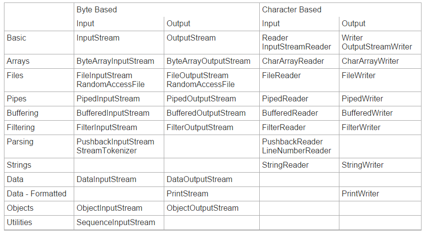
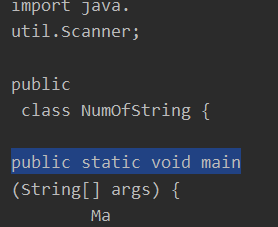
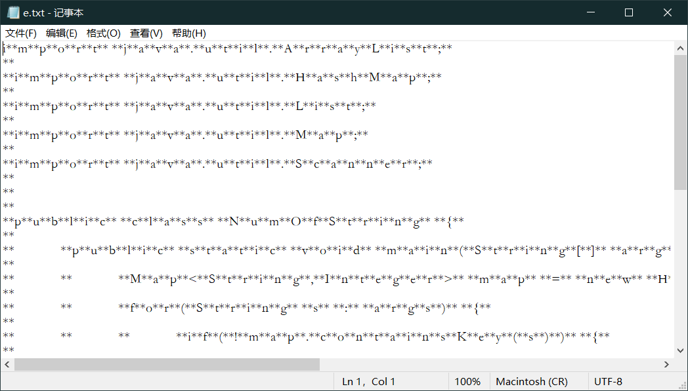
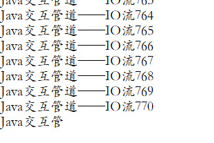
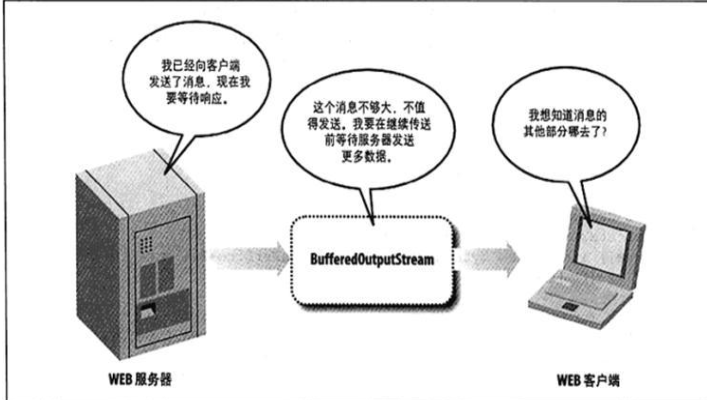
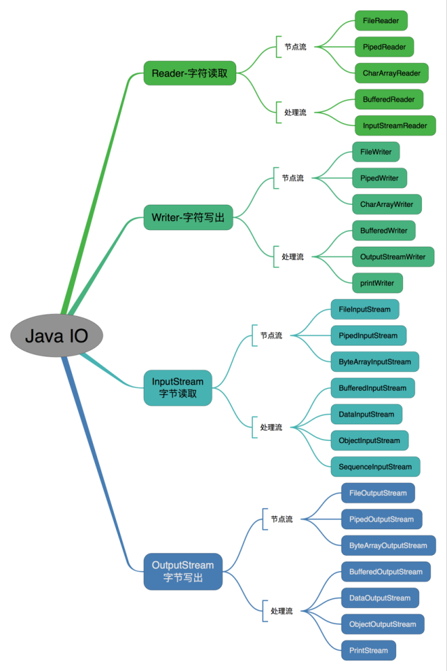
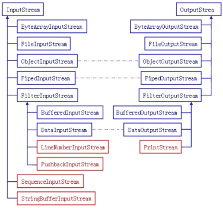
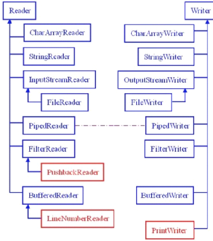
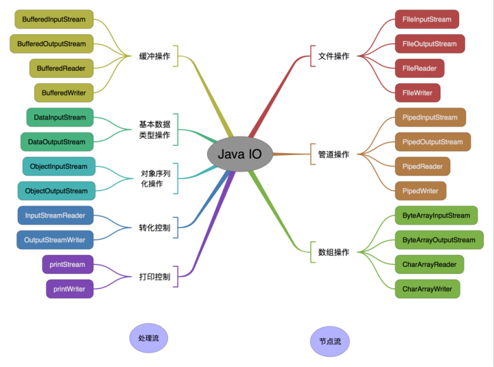
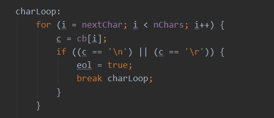

# JavaIO流
## IO概述

---

**输入和输出**

术语“输入”和“输出”有时候会有一点让人疑惑。一个应用程序的输入往往是另外一个应用程序的输出
那么OutputStream流到底是一个输出到目的地的流呢，还是一个产生输出的流？InputStream流到底会不会**输出它的数据给读取数据的程序**呢？就我个人而言，在第一天学习Java IO的时候我就感觉到了一丝疑惑。
试着给输入和输出起一些不一样的别名，让它们从概念上与数据的来源和数据的流向相联系。

Java的IO包主要关注的是从**原始数据源**的读取以及**输出**原始数据到**目标媒介**
最典型的数据源和目标媒介：

 - 文件
 - 管道
 - 网络连接
 - 内存缓存
 - System.in, System.out, System.error(注：Java标准输入、输出、错误输出)


---

**流**
在Java IO中，==流==是一个核心的概念。流从概念上来说是一个**连续的数据流**。你既可以**从流中读取数据，也可以往流中写数据**。流与数据源或者数据流向的媒介相关联。在Java IO中流既可以是**==字节流==**(以字节为单位进行读写)，也可以是**==字符流==**(以字符为单位进行读写)。

类**InputStream, OutputStream, Reader 和Writer** 一个程序需要InputStream或者Reader从数据源读取数据，需要OutputStream或者Writer将数据写入到目标媒介中。
InputStream和Reader与数据源相关联，OutputStream和writer与目标媒介相关联。

**Java IO的用途和特征**
Java IO中包含了许多InputStream、OutputStream、Reader、Writer的**子类**。这样设计的原因是让每一个类都负责不同的功能。这也就是为什么IO包中有这么多不同的类的缘故。各类用途汇总如下：

>  - 文件访问
>  - 网络访问
>  - 内存缓存访问
>  - 线程内部通信(管道)
>  - 缓冲
>  - 过滤
>  - 解析
>  - 读写文本 (Readers / Writers)
>  - 读写基本类型数据 (long, int etc.)
>  - 读写对象

不同的类用于针对不同业务场景。




---

**什么是JavaIO流**

Java IO流是既可以从中读取，也可以写入到其中的数据流  流通常会与数据源、数据流向目的地相关联，比如**文件、网络**等等。

流和数组不一样，**不能通过索引读写数据**。在流中，你也不能像数组那样**前后移动读取数据**，除非使用RandomAccessFile 处理文件。流仅仅只是一个**连续的数据流**。

某些类似PushbackInputStream 流的实现允许你将数据**重新推回**到流中，以便重新读取。然而你只能把有限的数据推回流中，并且你不能像操作数组那样随意读取数据。==流中的数据只能够顺序访问==。

> Java IO流通常是基于**字节或者基于字符**的。
**<u>==字节流==</u>** 通常以“stream”命名，比如InputStream和OutputStream。
除了DataInputStream和DataOutputStream 还能够读写int, long, float和double类型的值以外，其他流在一个操作时间内只能读取或者写入一个原始字节。
> ==字符流==通常以**“Reader”或者“Writer”**命名。字符流能够读写**字符**(比如Latin1或者Unicode字符)。
浏览JavaReaders and Writers获取更多关于字符流输入输出的信息。

**InputStream**

java.io.InputStream类是`所有Java IO输入流的基类`。如果你正在开发一个从流中读取数据的组件，请尝试**<u>用InputStream</u>**替代任何它的子类(比如FileInputStream)进行开发。这么做能够让你的代码<u>*兼容任何类型而非某种确定类型的输入流*</u>。


---

***组合流***

将流整合起来以便实现更高级的输入和输出操作。==一次读取一个字节是很慢的，所以可以从磁盘中**一次读取一大块数据**，然后从读到的**数据块中获取字节**。为了实现缓冲，可以**<u>把InputStream包装到BufferedInputStream中</u>**。==

InputStream input = new BufferedInputStream(New FileInputStream("D: \ ... \ ..."))

> 缓冲同样可以应用到OutputStream中。你可以实现将**大块数据批量地写入到磁盘**(或者*相应的流*)中，这个功能由BufferedOutputStream实现。
>
> 缓冲只是通过流整合实现的其中一个效果。你可以把InputStream==包装到PushbackInputStream==中，之后可以**将读取过的数据推回到流中**重新读取，在解析过程中有时候这样做很方便。或者，你可以将**两个InputStream**整合成一个SequenceInputStream。
>
> 将不同的流整合到一个==链==中，可以实现更多种高级操作。通过编写包装了标准流的类，可以实现你想要的效果和过滤器。


**IO文件**

---


**通过Java IO读文件**


> 如果你需要在不同端之间读取文件，你可以根据该文件是**二进制文件还是文本文件**来选择使用==FileInputStream或者FileReader==。
>
> 这两个类允许你从文件==开始到文件末尾==一次读取**一个字节**或者字符，或者将读取到的字节写入到**字节数组或者字符数组**。你不必一次性读取整个文件，相反你可以**按顺序**地读取文件中的字节和字符。

*跳跃式*地读取文件其中的某些部分，可以使用*RandomAccessFile*


**通过Java IO写文件**

> 如果你需要在不同端之间进行文件的写入，你可以根据你要写入的数据是**二进制**型数据还是**字符型**数据选用**FileOutputStream**或者**FileWriter**。
>
> 你可以一次写入一个字节或者字符到文件中，也可以直接写入一个字节数组或者字符数据。数据按照写入的顺序存储在文件当中。


**通过Java IO随机存取文件**

正如我所提到的，你可以通过RandomAccessFile对文件进行随机存取。

> 随机存取并不意味着你可以在真正随机的位置进行读写操作，它只是意味着你可以**跳过文件中某些部分**进行操作，并且支持同时读写，不要求特定的存取顺序。
>
> 这使得RandomAccessFile可以覆盖一个文件的某些部分、或者追加内容到它的末尾、或者删除它的某些内容，当然它也可以从文件的任何位置开始读取文件。


```java
@Test
public void test1() {
try {
FileInputStream fileInputStream = new FileInputStream(new File("D:/desktop/NumOfString.txt"));
FileOutputStream fileOutputStream = new FileOutputStream(new File("D:/desktop/a.txt"));
byte[] buffer = new byte[128];

while (fileInputStream.read(buffer)!= -1) {
	fileOutputStream.write(buffer);
}
//随机读写，通过mode参数来决定读或者写
RandomAccessFile randomAccessFile = new RandomAccessFile(new File("D:/desktop/b.txt"), "rw");
} 
catch (FileNotFoundException e){
e.printStackTrace();
}
catch (IOException e) {
e.printStackTrace();
}
```


---

**字符流和字节流**

Java IO的Reader和Writer除了基于**字符**之外，其他方面都与InputStream和OutputStream非常类似。他们被用于读写文本。InputStream和OutputStream是**基于字节**的，还记得吗？

Reader类是Java IO中所有Reader的**基**类。子类包括  BufferedReader，PushbackReader，InputStreamReader，StringReader和其他Reader。

Writer类是Java IO中所有Writer的**基**类。子类包括  BufferedWriter和PrintWriter等等。


```
Reader reader = new FileReader("c:\\data\\myfile.txt");
int data = reader.read();
while(data != -1){
    char dataChar = (char) data;
    data = reader.read();
}
```

通常会使用Reader的子类，而不会直接使用Reader。Reader的子类包括InputStreamReader，CharArrayReader，FileReader等等。可以查看Java IO概述浏览完整的Reader表格。


---

**==整合Reader与InputStream==**


一个Reader可以和一个InputStream相结合。如果你有一个InputStream输入流，并且想从**其中(inputstream)读取*字符***，可以把这个**InputStream包装到InputStreamReader中**。把InputStream传递到InputStreamReader的构造函数中：

```
Reader reader = new InputStreamReader(inputStream);
```


Writer类是Java IO中所有Writer的基类。子类包括BufferedWriter和PrintWriter等等。这是一个Java IO Writer的例子：

```java
Writer writer = new FileWriter("c:\\data\\file-output.txt"); 
writer.write("Hello World Writer"); 
writer.close();
```

同样，**最好使用Writer的子类**，*不需要直接使用Writer*，因为子类的==实现更加明确==，更能表现你的意图。常用子类包括*OutputStreamWriter，CharArrayWriter，FileWriter*等。Writer的write(int c)方法，会将传入参数的<u>低16位</u>写入到Writer中，忽略高16位的数据。


**整合Writer和OutputStream**

与Reader和InputStream类似，一个Writer可以和一个OutputStream相结合。把OutputStream包装到OutputStreamWriter中，**所有写入到OutputStreamWriter的字符都将会传递给OutputStream==??????==**。这是一个OutputStreamWriter的例子：

```
Writer writer = new OutputStreamWriter(outputStream);
```


---


**IO管道**

IO管道为运行在==同一个JVM==中的**两个线程**提供了通信能力，管道也可以作为**数据源以及目标媒介**

你不能利用管道与**不同的JVM中的线程通信**(==不同的进程==)。在概念上，Java的管道不同于Unix/Linux系统中的管道。在Unix/Linux中，运行在*不同地址空间*的两个*进程*可以通过管道通信。在Java中，通信的双方应该是运行在**<u>同一进程中的不同线程</u>**。


> 可以通过Java IO中的PipedOutputStream和PipedInputStream创建管道。一个PipedInputStream流应该和一个PipedOutputStream流==相关联。==
>
> 一个线程通过PipedOutputStream写入的数据可以被**另一个线程**通过相关联的PipedInputStream读取出来。


如何将PipedInputStream和PipedOutputStream关联起来

```
//使用管道来完成两个线程间的数据点对点传递
    @Test
    public void test2() throws IOException {
        PipedInputStream pipedInputStream = new PipedInputStream();
        PipedOutputStream pipedOutputStream = new PipedOutputStream(pipedInputStream);
        new Thread(new Runnable() {
            @Override
            public void run() {
                try {
                    pipedOutputStream.write("hello input".getBytes());
                    pipedOutputStream.close();
                } catch (IOException e) {
                    e.printStackTrace();
                }
            }
        }).start();
        new Thread(new Runnable() {
            @Override
            public void run() {
                try {
                    byte []arr = new byte[128];
                    while (pipedInputStream.read(arr) != -1) {
                        System.out.println(new String(arr));
                    }
                    pipedInputStream.close();
                } catch (IOException e) {
                    e.printStackTrace();
                }
            }
        }).start();
```

==要输出char[]  或者byte[]  使用String字符串构造方式   <u>Arrays.toString不行</u>==


管道和线程 请记得，当使用两个相关联的管道流时，务必将它们分配给**不同的线程**。read()方法和write()方法调用时会导致==流阻塞==，这意味着如果你尝试在一个线程中同时进行读和写，可能会导致==线程死锁==。

管道的替代   除了管道之外，一个JVM中**不同线程**之间还有许多通信的方式。实际上，线程在大多数情况下会**传递完整的对象信息**而非原始的字节数据。但是，如果你需要在线程之间传递字节数据，Java IO的管道是一个不错的选择。


---

**Java IO：网络**

当两个进程之间建立了**网络连接**之后，他们通信的方式如同操作文件一样：利用InputStream读取数据，利用OutputStream写入数据。换句话来说，Java网络API用来在不同进程之间建立网络连接，而Java IO则用来在建立了连接之后的进程之间交换数据。

基本上意味着如果你有一份能够**对文件进行写入**某些数据的代码，那么这些数据也可以很容易地**写入到网络连接**中去。你所需要做的仅仅只是在代码中**利用OutputStream替代FileOutputStream**进行数据的写入。因为FileOutputStream是OuputStream的子类，所以这么做并没有什么问题。

```
//从网络中读取字节流也可以直接使用OutputStream
public void test3() {
    //读取网络进程的输出流
    OutputStream outputStream = new OutputStream() {
        @Override
        public void write(int b) throws IOException {
        }
    };
}
public void process(OutputStream ouput) throws IOException {
    //处理网络信息
    //do something with the OutputStream
}
```


---

**字节和字符数组**

从InputStream或者Reader中读入数组

从OutputStream或者Writer中写数组

在java中常用**==字节和字符数组==**在应用中临时存储数据。而这些数组又是通常的数据读取来源或者写入目的地。如果你需要在程序运行时需要大量读取文件里的内容，那么你也可以**把一个文件加载到数组**中。

前面的例子中，字符数组或字节数组是用来缓存数据的临时存储空间，不过它们同时也可以**作为数据来源或者写入目的地**。 举个例子：

```
//字符数组和字节数组在io过程中的作用
    public void test4() {
        //arr和brr分别作为数据源
        char []arr = {'a','c','d'};
        CharArrayReader charArrayReader = new CharArrayReader(arr);
        byte []brr = {1,2,3,4,5};
        ByteArrayInputStream byteArrayInputStream = new ByteArrayInputStream(brr);
    }
```


---


**System.in, System.out, System.err**

System.in, System.out, System.err这3个流同样是常见的数据来源和数据流目的地。使用最多的可能是在控制台程序里利用System.out将输出打印到控制台上。

JVM启动的时候通过Java运行时初始化这3个流，所以你**不需要初始化它们**(尽管你可以在运行时替换掉它们)。

> System.in
> System.in是一个典型的连接控制台程序和键盘输入的InputStream流。通常当数据通过命令行参数或者配置文件传递给命令行Java程序的时候，System.in并不是很常用。图形界面程序通过界面传递参数给程序，这是一块单独的Java IO输入机制。
>
> System.out
> System.out是一个PrintStream流。System.out一般会把你写到其中的数据输出到控制台上。System.out通常仅用在类似命令行工具的控制台程序上。System.out也经常用于打印程序的调试信息(尽管它可能并不是获取程序调试信息的最佳方式)。
>
> System.err
> System.err是一个PrintStream流。System.err与System.out的运行方式类似，但它更多的是用于**打印错误文本**。一些类似Eclipse的程序，为了让错误信息更加显眼，会将错误信息以  **红色文本**  的形式通过System.err输出到控制台上。


---

**字符流的Buffered和Filter**

BufferedReader能为字符输入流**提供缓冲区**，可以提高许多==IO处理的速度==。你可以一次读取一大块的数据，而不需要每次从网络或者磁盘中一次读取一个字节。特别是在访问大量磁盘数据时，缓冲通常会让IO快上许多。

BufferedReader和BufferedInputStream的主要区别在于，BufferedReader操作**字符，**而BufferedInputStream操作**原始字节**。只需要==把Reader包装到BufferedReader中==，就可以==为Reader添加缓冲区==(译者注：默认**缓冲区大小**为8192字节，即8KB)。

```
Reader input = new BufferedReader(new FileReader("c:\\data\\input-file.txt"));
```

也可以通过传递构造函数的第二个参数，指定缓冲区大小

```
Reader input = new BufferedReader(new FileReader("c:\\data\\input-file.txt"), 8 * 1024);
```

BufferedReader还有一个额外readLine()方法，可以方便地一次性读取一整行字符。


**BufferedWriter**

与BufferedReader类似，可以为输出流提供缓冲区。可以构造一个使用默认大小缓冲区的BufferedWriter 8 * 1024b

```
Writer writer = new BufferedWriter(new FileWriter("...."))
Writer writer = new BufferedWriter(new FileWriter("c:\\data\\output-file.txt"), 8 * 1024);
```

**建议把缓冲区大小设置成1024的整数倍**

同样多提供了writeLine()方法


**值得注意：需要手动flush()确保写入到此输出流的数据真正写入到磁盘或者网络中**


FilterReader

与FilterInputStream类似，FilterReader是实现**自定义过滤输入字符流的基类**，基本上它仅仅只是简单覆盖了Reader中的所有方法。

没发现这个类明显的用途。除了**构造函数取一个Reader变量**作为参数之外，我没看到FilterReader任何对Reader新增或者修改的地方。如果你选择继承FilterReader实现自定义的类，同样也可以直接继承自Reader从而避免额外的类层级结构。


---

## JavaIO流面试题


*什么是IO流？*

它是一种数据的流从源头I  流到 目的地O。比如文件拷贝，同时包括输入流和输出流。输入流从文件中读取数据**存储到进程**(process)中，输出流从进程中读取数据然后写入目标文件


*字节流和字符流的区别*

字节流在jdk1.0中就引进，用于操作包含ASCII字符的文件。

JAVA也支持其他的**字符**如Unicode，为了读取包含Unicode字符的文件，Java语言设计者在jdk1.1中引入了字符流。ASCII作为Unicode的子集，对于**英语字符**的文件，**可以使用字节流也可以使用字符流**


*Java中流类的超类主要有哪些*

* java.io.InputStream
* java.io.OutputStream
* java.io.Reader
* java.io.Writer


*FileInputStream和FileOutputStream是什么*

这是**在拷贝文件操作**的时候，经常用到的两个类。在处理小文件的时候，它们性能表现还不错，在大文件的时候，最好使用BufferedInputStream (或 BufferedReader) 和 BufferedOutputStream (或 BufferedWriter)


*System.out.println()是什么？*

println是PrintStream的一个方法。out是一个**静态**PrintStream类型的==**成员变量**==，System是一个java.lang包中的类，用于和**底层的操作系统**进行交互。


*什么是Filter流？*

Filter Stream是一种IO流主要作用是用来**对存在的流增加一些额外的功能**，像给目标文件增加源文件中不存在的行数，或者增加拷贝的性能。

在java.io包中主要有4个可用的**filter Stream**。两个字节filter stream，两个字符filter stream. 分别是FilterInputStream, FilterOutputStream, FilterReader and FilterWriter.这些类是==**抽象类**==，不能被实例化的。


*有哪些Filter流的子类？*

四类：

1. LineNumberInputStream(额外的功能是它增加了目标文件中的行号),
2. DataInputStream(包含如readInt这样的特殊方法(), readDouble()和readLine()等,可以阅读int,双,一次一个字符串),
3. BufferedInputStream(使缓冲效果,增加性能峰值) **extends FilterInputStream  -> extends InputStream** 
4. PushbackInputStream(推所需的字符回系统)。

> BufferedReader 不是Filter的子类 继承 Reader
>
> FilterReader extends Reader
>
> FilterInputStream extends InputStream


*在文件拷贝的时候，那一种流可用提升更多的**性能**？*

在字节流的时候，使用BufferedInputStream和BufferedOutputStream。 在字符流的时候，使用BufferedReader 和 BufferedWriter


*说说管道流(Piped Stream)*

有四种管道流， PipedInputStream, PipedOutputStream, PipedReader 和 PipedWriter.在多个**线程或进程**中传递数据的时候管道流非常有用。


*说说File类*

它<u>不属于 IO流，也不是用于文件操作</u>的，它主要用于**知道一个文件的属性，读写权限，大小等信息**。


*说说RandomAccessFile?*

它在java.io包中是一个特殊的类，<u>既不是输入流也不是输出流</u>，它**两者都可以做到**。他是Object的==直接子类==。通常来说，一个流只有一个功能，要么读，要么写。但是RandomAccessFile==既可以读文件，也可以写文件==。 DataInputStream 和 DataOutStream有的方法，**在RandomAccessFile中都存在。**


*SequenceInputStream的功能是什么?*

在拷贝**多个文件**到**一个目标**文件时很有用

```
FileInputStream fileInputStream1 = new FileInputStream("D:/desktop/a.txt");
FileInputStream fileInputStream2 = new FileInputStream("D:/desktop/fff.txt");

SequenceInputStream sequenceInputStream = new SequenceInputStream(fileInputStream1, fileInputStream2);
FileOutputStream fileOutputStream = new FileOutputStream("D:/desktop/ggg.txt");

int temp;
while ((temp = sequenceInputStream.read()) != -1){
    System.out.print(temp);
    fileOutputStream.write(temp);
}
fileInputStream1.close();
fileInputStream2.close();
sequenceInputStream.close();
fileOutputStream.close();
```


***PrintStream和PrintWriter的异同?***

它们在功能上是相同的，但属于两个不同的类别——字节流和字符流。**println()**方法存在于这两个类中。


---


## 解析文件处理

文件类：**File类**

File类用于封装系统的文件和目录的相关信息。在该类中定义了一些与平台无关的方法来操作文件。例如文件的大小、修改时间、文件路径等。

**创建 File 对象可以通过下面3种方式：**

* new File(String pathName)
* File file = new File("E://1.txt")
* new File(String parent, String child) //parent:**父抽象路径名 例如D:/desktop**；child：**子路径名字符串 a.txt**


**如何获取文件信息**

File类是对文件和文件夹的抽象，包含了对文件和文件夹的多种属性和操作方法

| 返回      | 方法            | 说明                                                         |
| --------- | --------------- | ------------------------------------------------------------ |
| String    | getName         | 获取文件名称                                                 |
| String    | getParent       | 获取文件的父路径字符串                                       |
| String    | getPath         | 获取文件的相对路径字符串                                     |
| String    | getAbsolutePath | 获取文件的绝对路径字符串                                     |
| boolean   | exists          | 判断文件或者文件夹是否存在                                   |
| boolean   | isFile          | 判断是不是文件类型                                           |
| boolean   | isDirectory     | 判断是不是文件夹类型                                         |
| boolean   | delete          | 删除文件或文件夹，如果删除成功返回结果为true                 |
| boolean   | mkdir           | 创建文件夹，创建成功返回true                                 |
| boolean   | setRoadOnly     | 设置文件或文件夹的只读属性                                   |
| long      | length          | 获取文件的长度                                               |
| long      | lastModified    | 获取文件的最后修改时间                                       |
| String[ ] | list            | **获取文件夹中的文件和子文件夹的名称，并存放到字符串数组中** |

**在使用delete()方法删除File对象时，如果删除的对象是目录，该目录中的内容必须为空**


## 使用字节输入输出流

字节流用来处理 **二进制数据的读取和写入，以字节为单位，InputStream和OutPutStream**是字节流的==抽象类==。


1、字节输入流*抽象*类 InputStream 


| return       | 方法                   | 说明                                                         |
| ------------ | ---------------------- | ------------------------------------------------------------ |
| int          | available()            | 返回当前输入流的数据读取方法**可以读取的有效字节数量**       |
| Abstract int | read()                 | 从当前数据流中读取一个字节。若已达到流结尾，返回-1           |
| **int**      | read(**Byte[] bytes**) | 从当前输入流读取一定的byte数据，并存储在数组中，然后返回==读取的byte数据的数量==，若已达到流结尾，返回-1 |
| void         | reset()                | 将当前的输入流重新定位到最后一次调用mark()方法时的位置       |
| void         | mark(int readlimit)    | 在当前输入流中做**标记位置**，当调用reset()将返回到该位置，从标记位置开始，到**再读入readlimit个字符**位置，这个标记都维持有效 |
| Boolean      | markSupported()        | 测试当前输入流是否支持mark() reset()方法 其中一个不支持返回false |
| long         | skip(long n)           | 跳过和丢弃当前输入的n个字节数据                              |
| void         | close()                | 关闭当前输入流，并释放任何与之相关联的系统资源               |

 ==InputStream 类是**抽象类**，不能通过new关键字来创建该实例对象，需要其子类创建该实例对象。下面通过实例如何使用InputStream从控制台获取用户输入的数据信息。==

```
/**
 * 创建InputStream实例inp，并将其赋值为System类的in属性，定义为控制台输入流，从inp输入流中获取字节信息
 * 用这些字节信息创建字符串，并将其在控制台上输出
 */
public static void main(String[] args) throws IOException {
    InputStream inputStream = System.in;
    byte[] bytes = new byte[1024];

    while(inputStream.read(bytes) != -1){
        String str = new String(bytes).trim();
        System.out.println(str);
    }
    inputStream.close();
}
```


---


2、字节输出流*抽象*类OutputStream类

| 返回          | 方法                              | 说明                                                  |
| ------------- | --------------------------------- | ----------------------------------------------------- |
| void          | write(byte[] b)                   | 将byte[]数组中的数据写入当前输出流                    |
| void          | write(byte[] b, int off, int len) | 将byte[ ]数组下标off开始的len长度的数据写入当前输出流 |
| Abstract void | write（int b)                     | 写入一个byte数据到当前输出流                          |
| void          | flush()                           | 刷新当前输出流，并强制写入所有缓冲的字节数据          |
| void          | close()                           |                                                       |

 和InputStream类一样，OutputStream 类**是抽象类**，不能通过**new关键字**来创建该实例对象，需要**其子类**创建该实例对象

```
创建OutputStream实例out,并将其赋值为System.out标准输出流。通过write()方法向流写入数据

public static void main(String[] args) throws IOException {
    OutputStream outputStream = System.out; //输出目标为控制台
    byte[] bytes = "使用OutputStream输出流在控制台输出字符串\n".getBytes();

    outputStream.write(bytes);

    bytes = "输出内容：\n".getBytes();
    outputStream.write(bytes);

    bytes = "Java数据交互管道——IO流 \n".getBytes();
    outputStream.write(bytes);
    outputStream.close();
}
```


---


**3、文件字节输入流类：FileInputStream类**


文件字节输入流可以从<u>指定路径的文件</u>中读取字节数据

文件字节输入流类继承**InputStream**类，并实现了**读取输入流的各种方法**。

​       创建文件字节输入流创建的构造方法语法如下：

语法1：以==File对象为参数==创建FileInputStream实例

```
new FileInputStream（File file）
```

语法2：以==文件对象的绝对路径为参数==创建FIleInputStream实例

```
new FileInputStream（String filepath）
```


---

4、文件字节输出流类：FileOutputStream

文件字节输出流关联指定文件路径的文件，数据通过文件字节输出流以字节为单位输出并保存到文件中。文件字节输出流继承自OutputStream类，并实现OutputStream类的各种方法。

构造方法：

```
new FileOutputStream(File file)

new FileOutputStream(String filepath)
```


```
File file = new File("D:/desktop/a.txt");

try {
if(!file.exists()){
    file.createNewFile();
    FileOutputStream outputStream = new FileOutputStream(file);

    byte[] bytes = "Java数据交流管道——IO流".getBytes();

    outputStream.write(bytes);
    outputStream.close();
}

} catch (IOException e) {
	e.printStackTrace();
}

try{
    FileInputStream fileInputStream = new FileInputStream(file);

    byte[] bytes2 = new byte[1024];
    int len = fileInputStream.read(bytes2);

    System.out.println("文件中的信息是 \n" + new String(bytes2, 0, len));
    fileInputStream.close();
} catch (Exception e) {
	e.printStackTrace();
}
```


## 使用字符输入输出流

字符输入输出流 与 字节输入输出流有相同的功能，但**传送数据的方式不一样**，字节流以==字节为单位==传送数据，可以使==任何类型==的数据，例如文本、音频、视频、图片等。*字符流*以字符为单位传送数据，==只能传送文本类型的数据==。使用字符输入输出流的好处是，当*读取中文时不会出现乱码问题*，而使用*字节输入输出流时，却不能保证这一点*。


1、字符输入流抽象类：Reader类

| 返回          | 方法                                | 说明                                                         |
| ------------- | ----------------------------------- | ------------------------------------------------------------ |
| boolean       | ready()                             | 判断此数据流是否准备好                                       |
| int           | read()                              | 读入**一个字符**，若已读到流结尾，返回值-1                   |
| int           | read(char[])                        | 读入一些字符到char[]数组内，并返回所**读入的字符的数量**，若已到达流结尾，返回-1 |
| Abscract int  | read(char[ ] chars,int off,int len) | 读取一些字符到char[ ]数组**下标从off开始到off+len的位置**，并返回**所读入的字符的数量**，若已到达流结尾，则返回-1； |
| void          | reset()                             | 将当前输入流重新定位到最后一次mark（）方法时的位置           |
| void          | mark(int readLimit)                 | 将当前输入流中做标记，当调用reset方法时将返回到该位置，从标记位置开始，到再读入readLimit个字符为止，这个标记都维持有效 |
| boolean       | markSupported                       | 测试当前输入流是否支持mark()方法和reset()方法。只要有一个方法不支持，则返回-1 |
| long          | skip(long n)                        | 跳过参数n指定的字符数量，并返回所跳过字符的数量              |
| Abstract void | close()                             |                                                              |


2、字符输出流类Writer类

 Writer 类主要是用于解决字符输入流的类，其地位与Reader类在输入流的地位和作用是相同的，也是所有字符输出流的流类。


| 返回          | 方法                                 | 说明                                                         |
| ------------- | ------------------------------------ | ------------------------------------------------------------ |
| void          | write(char[] cbuf)                   | 将字符数组的数据写入字符输出流                               |
| Abstract void | write(char[ ] cbuf int off ,int len) | 将字符数组从下标off 开始向输入流写入长度为len的数据          |
| void          | write(int c )                        | 向字符输入流中写入一个字符数据                               |
| void          | write(String str )                   | 向输入流中写入一个字符串数据                                 |
| void          | write(String str , int off ,int len) | 向输入流中写入一个字符串从off 开始长度为len的数据            |
| Abstract void | flush()                              | 刷新当前输出流，并强制写入所有**缓冲区**的字节数据           |
| void          | close()                              | 向输出流中写入缓冲区的数据，然后关闭当前输出流，释放所有与当前输出流相关联的系统资源 |


---

3、文件字符输入流FileReader

​    文件**字符输入流**与文件**字节输入流**的功能相似，但是传送数据的方式不一样，字节流以字节为单位传送数据，可以使文本、视频、音频、图片等。字符流以字符为单位传送数，==只能传送文本类型==的数据。


```
new FileReader(File file)
new FileReader(String path)
```


```
File file = new File("D:/desktop/a.txt");

if(!file.exists()){
	System.out.println("对不起，不包含指定路径的文件");
}else{
    try{
    FileReader fileReader = new FileReader(file);
    char[] chars = new char[23];
    int length = 0;
    while((length = fileReader.read(chars)) > 0){
    	String str = new String(chars, 0, length);
    	System.out.println(str);
	 }
fileReader.close();
} catch (Exception e) {
e.printStackTrace();
}
}
```



**修改一下char数组的容量**？

就能装得下~~


---

4、文件字符输出流FileWriter


文件字符输出流继承自==Writer类==，提供了向文件输出的各种方法，数据通过文件字符输出流以==字符==为单位输出并==保存到文件中==。


```
File file = new File("D:/desktop/e.txt");
        try{
            if(!file.exists()){
                file.createNewFile();
            }
            FileReader fileReader = new FileReader("D:/desktop/a.txt");

            FileWriter fileWriter = new FileWriter(file);

            int length = 0;

            while((length = fileReader.read()) != -1){
                fileWriter.write(length);
                fileWriter.write("**");
            }

            fileReader.close();
            fileWriter.close();
        } catch (IOException e) {
            e.printStackTrace();
        }
```


通过对读写加入断点分析，int read()  和  write(int index)方法是==每次读入和写入一个字符的数据==




## IO流实战


==1、Java IO流实现复制文件夹==

通过IO不仅可以复制文件，还可以复制文件夹，文件夹中包含其他文件夹。需要分别复制

```
public static void main(String[] args) {
    File file1 = null;
    File file2 = null;

    String f1 = "D:/desktop/test";
    String f2 = "D:/desktop/copy";

    file1 = new File(f1);
    if(!file1.isDirectory() || !file1.exists()){
        //file1既不是文件夹也不是文件
        System.out.println("源文件夹不存在");
    }else {
        file2 = new File(f2);
        file2.mkdir();
        copy(file1.listFiles(), file2);
        System.out.println("文件夹复制成功！");
    }
}

/**
 * 创建copy方法，该方法接受文件数组和目标文件夹两个参数，如果目标文件夹不存在，则调用mkdir方法创建文件夹
 * 然后在循环中将文件数组中的每个文件对象写到目标文件夹中
 */
public static void copy(File[] files, File file){
    if(!file.exists()){
        //如果文件夹不存在
        file.mkdir();
    }

    for(int i = 0; i < files.length; i++){
        if(files[i].isFile()){
            //如果是文件类型，则复制文件
            try{
                FileInputStream fileInputStream = new FileInputStream(files[i]);

                FileOutputStream fileOutputStream = new FileOutputStream(
                        new File(file.getPath() + File.separator + files[i].getName()));

                int count = fileInputStream.available();
                byte[] bytes = new byte[count];

                if(fileInputStream.read(bytes)!= -1){
                    fileOutputStream.write(bytes);
                }
            } catch (FileNotFoundException e) {
                e.printStackTrace();
            } catch (IOException e) {
                e.printStackTrace();
            }
        }

        if(files[i].isDirectory()){
            //如果是文件夹类型
            File des = new File(file.getPath() + File.separator + files[i].getName());
            des.mkdir();//在目标文件夹中创建相同的文件夹
            copy(files[i].listFiles(), des);
        }
    }
}
```


**复制整个文件夹的本质  就是递归进入文件夹   再判断是文件还是文件夹 到头了就返回  每进入一个新文件夹用for遍历所有文件/文件夹**

*文件夹：新建一个文件夹  然后将其中的东西拷贝过来*

*文件：FileOutputStream生成一个新文件*


---

2、Java IO流实现分行向文件中写入数据

FilterWriter类可以向文件写入==字符==数据，如果将FileWriter类封装到bufferWriter类的缓冲字符流中，能够实现缓冲字符输出流，并且可以通过读输出流的newLine()方法，来实现数据的分行写入


```
String filePath = "D:/desktop/fff.txt";
File file = new File(filePath);
try{
    if(!file.exists()){
        file.createNewFile();
    }
    FileWriter fileWriter = new FileWriter(file);

    BufferedWriter bufferedWriter = new BufferedWriter(fileWriter);

    for(int i = 0; i < 100; i++){
        bufferedWriter.write(("Java交互管道——IO流" + i).toCharArray() );
        bufferedWriter.newLine();  //写入换行符
        bufferedWriter.flush();   //刷新缓冲区
    }
    System.out.println("成功写入数据！");
} catch (Exception e) {
    e.printStackTrace();
}
```

**flush()**

不加flush() 文件中没有任何东西

也可以：

```
for(int i = 0; i < 100; i++){
    bufferedWriter.write(("Java交互管道——IO流" + i).toCharArray() );
    bufferedWriter.newLine();  //写入换行符
   // bufferedWriter.flush();   //刷新缓冲区
}
bufferedWriter.flush();
```

在所有信息都加入了缓存后，**使用flush()从buffer缓存一次性写入文件**

==可能是数据量太小，不够塞满buffer==

循环一千次：



最后再flush  就能彻底清空缓存但没写入文件的数据！！

---

3、删除指定文件

File类的delete()方法可以实现删除指定的文件，首先使用目标文件路径创建File类的实例对象，然后再调用File类的delete()方法


### Java中输出流flush()方法

flush()是清空的意思，用于清空缓冲区的数据流，进行流的操作时，数据先被**读到内存**中，再用数据写到文件中

当数据读完时，我们如果这是调用close方法关闭读写流，这时就可能造成**数据丢失**   为啥呢？**读入数据完成时不代表写入数据完成，一部分数据可能会留在缓存区中**

```
 public void flush() throws IOException {
        synchronized (lock) {
            flushBuffer();
            out.flush();
        }
    }
    
   void flushBuffer() throws IOException {
        synchronized (lock) {
            ensureOpen();
            if (nextChar == 0)
                return;
            out.write(cb, 0, nextChar);
            nextChar = 0;
        }
    }
    
private void ensureOpen() throws IOException {
    if (out == null)
    	throw new IOException("Stream closed");
}
```

**ensureOpen()用于确保该流没有被关闭**


read()方法和write()是**线程阻塞**的，也就是说，当某个线程试图向另一端网络节点读取或写入数据时，有可能会发生网络连接异常或者是服务器短期内没有响应，这将会导致该线程阻塞，同样地，在**无数据状态进行读取**，**数据已满进行写操作**时，同样会发生阻塞，这时，其他线程抢占资源后继续执行。如果出现此现状，读取到缓冲池中的数据不能够及时的发送到另一端的网络节点，需要该线程**再次竞争**到CPU资源才可正常发送。

还有一种情况，当我们将数据预存到缓冲池中时，当数据的长度**满足缓冲池中的大小**后，才会将缓冲池中的数据**成块的发送**，若数据的长度**不满足缓冲池中的大小**，需要继续存入，待数据**满足预存大小后再成块的发送**。往往在发送文件过程中，文件==末尾的数据大小不能满足缓冲池的大小==。最终导致这部分的数据==停留在缓冲池无法发送==。

这时，就需要我们在write()方法后，手动调用flush()方法，强制刷出缓冲池中的数据，（即使==数据长度不满足缓冲池的大小==）从而保证数据的正常发送。当然，当我们调用流的close()方法后，系统也会自动将输出流缓冲区的数据刷出，同时可以保证流的物理资源被回收。



 上图中WEB服务器通过输出流向客户端响应了一个300字节的信息，但是，这时的输出流有一个1024字节的缓冲区。所以，输出流就一直等着WEB服务器继续向客户端响应信 息，当WEB服务器的响应信息把输出流中的缓冲区填满时，这时，输出流才向WEB客户端响应消息。

  为了解决这种尴尬的局面，flush()方法出现了。flush()方法可以**强迫输出流(或缓冲的流)发送数据，即使此时缓冲区还没有填满，以此来打破这种死锁的状态。**

  当我们使用输出流发送数据时，当数据==不能填满==输出流的缓冲区时，这时，数据就会被存储在输出流的缓冲区中。如果，我们这个时候调用关闭(close)输出流，存储在输出流的缓冲区中的数据就会丢失。所以说，关闭(close)输出流时，应先刷新(flush)换冲的输出流，换句话说就是：“**迫使所有缓冲的输出数据被写出到底层输出流中**”。

**通过out.write()将数据写入底层输出流**


# 按操作方式
* 字节流和字符流
    * 字节流：以字节为单位，每次次读入或读出是8位数据。可以读任何类型数据。
    * 字符流：以字符为单位，每次次读入或读出是16位数据。其只能读取字符类型数据。
* 输出流和输入流：
    * 输出流：从内存读出到文件。写操作
    * 输入流：从文件读入到内存。只能进行读操作


==注意：这里的出和入，都是相对于系统内存而言的。==
* 节点流和处理流：
    * 节点流：==直接与数据源相连==，读入或读出
    * 处理流：与节点流一块使用，在==节点流的基础==上，==再套接一层==，套接在节点流上的就是处理流。
> 为什么要有处理流？直接使用节点流，读写不方便，为了==更快==的读写文件，使用处理流





* 输入字节流InputStream：
  * FileInputStream： 是三种基本的**介质流**，它们分别从Byte 数组、StringBuffer、和本地文件中读取数据。
  * ByteArrayInputStream
  * PipedInputStream： 是从与**其它线程**共用的**管道**中读取数据。PipedInputStream的一个实例要和PipedOutputStream的一个实例共同使用，共同完成**管道的读取写入**操作。主要用于**线程操作**。
  * ObjectInputStream 和所有FilterInputStream 的子类都是装饰流（装饰器模式的主角）
* 输出字节流OutputStream：
  * FIleOutputStream：是两种基本的介质流
  * ByteArrayOutputStream： 是两种基本的介质流，它们分别向Byte 数组、和本地文件中写入数据。
  * PipedOutputStream：是向与其它线程共用的管道中写入数据。
  * ObjectOutputStream 和所有FilterOutputStream 的子类都是装饰流。


**字节流的输入和输出对照图**




* 字符输入流Reader：

  * FileReader

  * PipedReader：是从与其它线程共用的管道中读取数据

  * CharArrayReader：

  * CharReader、StringReader 是两种基本的**介质流**，它们分别将Char 数组、String中读取数据。

  * BufferedReader 很明显就是一个装饰器，它和其子类负责**装饰其它Reader 对象**。

  * FilterReader 是所有自定义具体装饰流的父类，其子类PushbackReader 对Reader 对象进行装饰，会增加一个行号。

  * InputStreamReader： 是一个==连接字节流和字符流的桥梁==，它将*==字节流转变为字符流==*。FileReader 可以说是一个达到此功能、常用的工具类，在其源代码中明显使用了**将FileInputStream 转变为Reader** 的方法。我们可以从这个类中得到一定的技巧。Reader 中各个类的用途和使用方法基本和InputStream 中的类使用**一致**。后面会有Reader 与InputStream 的对应关系。

    

* 字符输出流Writer：
  * FileWriter:
  * PipedWriter:是向与其它线程共用的管道中写入数据
  * CharArrayWriter:
  * CharArrayWriter、StringWriter 是两种基本的介质流，它们分别向Char 数组、String 中写入数据。
  * **BufferedWriter 是一个装饰器，为Writer 提供缓冲功能。**
  * **PrintWriter** 和**PrintStream** 极其类似，功能和使用也非常相似。
  * OutputStreamWriter： 是==OutputStream 到Writer 转换==的桥梁，它的==子类FileWriter== 其实就是一个==实现此功能的具体类==（具体可以研究一SourceCode）。功能和使用和OutputStream 极其类似，后面会有它们的对应图。




**字符流和字节流转换：**


转换流的特点：

* 是字符流和字节流之间的桥梁
* 可对读取到的字节数据经过指定编码转换成字符
* 可对读取到的字符数据经过指定编码转换成字节


何时使用转换流：

1. 字节和字符之间有转换动作时
2. 流操作的数据需要编码或解码时


OutputStreamWriter:*输出流转到写流  OutputStream->Writer*

```
String fileName= "d:"+File.separator+"hello.txt";
File file=new File(fileName);
Writer out=new OutputStreamWriter(new FileOutputStream(file));
out.write("hello");
out.close();
```

**Writer子类也可以传入String数组进行文件write  FileWriter**


InputStreamReader:输入*流转到读流；*


```
public void StreamToReader() throws IOException {
    String fileName = "d:" + File.separator + "desktop" + File.separator + "fff.txt";
    File file = new File(fileName);
    Reader  reader = new InputStreamReader(new FileInputStream(file));

    char[] chars = new char[100];
   // int len = reader.read(chars);
    // System.out.println(new String(chars, 0, len));
    reader.read(chars);
    System.out.println(new String(chars));
    
    reader.close();
}
```

**用char数组类构造一个String    而不是使用Arrays.toString  这样输出的是单个字符隔开的字符数组整体**


# 按操作对象




* 对文件进行操作(**节点流)**

  * FileInputStream（字节输入流）
  * FileOutputStream（字节输出流）
  * FileReader（字符输入流）
  * FileWriter（字符输出流）

* 对管道进行操作（**节点流**）

  * PipedInputStream（字节输入流）
  * PipedOutStream（字节输出流）
  * PipedReader（字符输入流）
  * PipedWriter（字符输出流）
  * PipedInputStream的一个实例要和PipedOutputStream的一个实例共同使用，共同完成管道的读取写入操作。主要用于线程操作。

* 字节/字符**数组**流（**节点流**）：

* - ByteArrayInputStream，
  - ByteArrayOutputStream，
  - CharArrayReader，
  - CharArrayWriter；
    是==在内存中开辟了一个字节或字符数组==。


**除了上述三种是节点流 其余都是==处理流==  需要跟节点流配合使用**


* Buffered缓冲流（处理流）：
  * BufferedInputStream，
  * BufferedOutputStream，
  * BufferedReader,
  * BufferedWriter,
    是带缓冲区的处理流，缓冲区的作用的主要目的是：避免每次和硬盘打交道，提高数据访问的效率。

* 转化流（处理流）：

* - InputStreamReader：把字节转化成字符；
  - OutputStreamWriter：把字节转化成字符。


* 基本类型数据流（处理流）：用于操作**基本数据类型**值。

  - DataInputStream，
  - DataOutputStream。
    因为平时若是我们输出一个*8个字节的long类型或4个字节的float类型*，那怎么办呢？可以一个字节一个字节输出，也可以把转换成字符串输出，但是这样转换费时间，若是==直接输出==该多好啊，因此这个数据流就解决了我们==输出数据类型==的困难。数据流可以直接输出float类型或long类型，提高了数据读写的效率。

* 打印流（处理流）：

* - PrintStream，
  - PrintWriter，
    一般是打印到控制台，可以进行控制打印的地方。


* 对象流（处理流）：

* - ObjectInputStream，==对象反序列化==；
  - ObjectOutputStream，对象==序列化==；
    把==封装的对象直接输出，而不是一个个在转换成字符串再输出==。


* 合并流（处理流）：

* - SequenceInputStream：可以认为是一个工具类，将两个或者多个输入流当成一个输入流==依次读取==。


# 典型使用案例


```
InputStream input = new FileInputStream(file1);
OutputStream output = new FileOutputStream(file2);
if ((input != null) && (output != null)) {
    int temp = 0;
    while ((temp = input.read()) != (-1)) {
    	output.write(temp);
	 }
}
```

**此处temp是用int来表示字节的ascii码表示 **

*在reader中也可以这么实用*

```
 while((length = fileReader.read()) != -1){
     fileWriter.write(length);
     fileWriter.write("**");
 }
```


- FileInputStream.read()：
  这个方法是对这个流==一个一个字节的读==，返回的结果就是==这个字节的int表示方式==；
  当已经没有内容时，返回的结果为**-1**；
- FileOutputStream.write()：
  将内容写到文件。


---

2.不使用File，将流中的字符转换大小写

```
public void Convert() throws IOException {
    String str = "ABCDEFGHIGK";
    ByteArrayInputStream inputStream =  new ByteArrayInputStream(str.getBytes());
    ByteArrayOutputStream outputStream = new ByteArrayOutputStream();

    int temp = 0;

    while((temp = inputStream.read()) != -1){
        System.out.println(temp);   //ASCII码表示单个字符
        char ch = (char) temp;
        outputStream.write(Character.toLowerCase(ch));
    }

    String outStr = outputStream.toString();
    inputStream.close();
    outputStream.close();
    System.out.println(outStr);
}
```


---

3.使用管道流在多个线程间通信


例1：

```
public void test3() throws IOException {
        PipedInputStream pipedInputStream = new PipedInputStream();
        PipedOutputStream pipedOutputStream = new PipedOutputStream(pipedInputStream);
        new Thread(new Runnable() {
            @Override
            public void run() {
                try{
                    pipedOutputStream.write("hello input!".getBytes());
                    //System.out.println("hello input!".getBytes());
                    pipedOutputStream.close();
                } catch (Exception e) {
                    e.printStackTrace();
                }
            }
        }).start();

        new Thread(new Runnable() {
            @Override
            public void run() {
                try{
                    byte[] arr = new byte[128];
                    while (pipedInputStream.read(arr) != -1){
                        System.out.println(new String(arr));
                    }
                    pipedInputStream.close();
                } catch (Exception e) {
                    e.printStackTrace();
                }
            }
        }).start();
    }
```


例2：

```
/**
 * 消息发送类
 * */
class Send implements Runnable {
    private PipedOutputStream out = null;

    public Send() {
        out = new PipedOutputStream();
    }

    public PipedOutputStream getOut() {
        return this.out;
    }

    public void run() {
        String message = "hello , Rollen";
        try {
            out.write(message.getBytes());
        } catch (Exception e) {
            e.printStackTrace();
        }
        try {
            out.close();
        } catch (Exception e) {
            e.printStackTrace();
        }
    }
}

/**
 * 接受消息类
 */
class Recive implements Runnable {
    private PipedInputStream input = null;

    public Recive() {
        this.input = new PipedInputStream();
    }

    public PipedInputStream getInput() {
        return this.input;
    }

    public void run() {
        byte[] b = new byte[1000];
        int len = 0;
        try {
            len = this.input.read(b);
        } catch (Exception e) {
            e.printStackTrace();
        }
        try {
            input.close();
        } catch (Exception e) {
            e.printStackTrace();
        }
        System.out.println("接受的内容为 " + (new String(b, 0, len)));
    }
}

/**
 * 测试类
 */
class hello {
    public static void main(String[] args) throws IOException {
        Send send = new Send();
        Recive recive = new Recive();
        try {
            //管道连接
            send.getOut().connect(recive.getInput());
        } catch (Exception e) {
            e.printStackTrace();
        }
        new Thread(send).start();
        new Thread(recive).start();
    }
}
```


---

4.使用缓冲区从键盘上读入内容


```
public static void main(String... args) throws IOException {
    BufferedReader bufferedReader = new BufferedReader(new InputStreamReader(System.in));
    String str = null;
    System.out.println("please input sth: ");
    str = bufferedReader.readLine();
    System.out.println("what you input is : " + str);
}
```

**用System.in 来创建一个从Stream转换为Reader的字符流Reader**

创建时无需输入

*在调用readLine时从编译器的控制台读取输入数据（通过System.in）*


---

5.将系统输出定向到文件

```
public void redirecttofile() throws FileNotFoundException {
    File file = new File("D:/desktop/f.txt");
    //此刻是输出到屏幕
    System.out.println("hello");
    System.setOut(new PrintStream(new FileOutputStream(file)));
    System.out.println("这些内容在文件中才能看到！！");
}
```


其他类：RandomAccessFile

该对象并不是流体系中的一员，其封装了字节流，同时还**封装了一个缓冲区**（字符数组），通过内部的指针来操作字符数组中的数据。 该对象特点：

1. 该对象==只能操作文件==，所以构造函数接收两种类型的参数file：a.字符串文件路径；b.File对象。
2. 该对象既可以对文件进行==读==操作，也能进行==写==操作，在进行对象实例化时可==指定操作模式(r,rw)==。

> **注意：**
> 该对象在实例化时，如果要操作的文件不存在，会自动创建；如果文件存在，写数据未指定位置，会从头开始写，即覆盖原有的内容。 可以用于多线程下载或多个线程同时写数据到文件


## readLine(BufferedReader)


BufferedReader/BufferedInputStream

* 它有一个很特别的方法：readLine()，使用起来特别方便，每次读回来的都是一行，省了很多手动拼接buffer的琐碎；
* 它比较高效，相对于一个字符/字节地读取、转换、返回来说，它有一个缓冲区，读满缓冲区才返回；一般情况下，都建议使用它们把其它Reader/InputStream包起来，使得读取数据更高效。
* 对于文件来说，经常遇到一行一行的，特别相符情景。


**BufferedInputStream没有readLine**

==例如 socket  一直没有数据发送过来就会堵塞==


* 误以为readLine()是**读取到没有数据时就返回null**(因为其它read方法当读到没有数据时返回-1)，而实际上readLine()是一个==阻塞==函数，当==没有数据（而不是读出来为空数据）==读取时，就一直会阻塞在那，而不是返回null；因为readLine()阻塞后，System.out.println(message)这句根本就不会执行到，所以在接收端就不会有东西输出。要想执行到System.out.println(message)，一个办法是发送完数据后就关掉流，这样readLine()结束阻塞状态，而能够得到正确的结果，但显然不能传一行就关一次数据流；另外一个办法是把System.out.println(message)放到while循环体内就可以。
* readLine()只有在数据流发生异常或者另一端被close()掉时，才会返回null值。
* 如果不指定buffer大小，则readLine()使用的buffer有8192个字符。在达到buffer大小之前，只有遇到"/r"、"/n"、"/r/n"才会返回。
  




从上面看出，readLine()是调用了read(char[] cbuf, int off, int len) 来读取数据，后面再根据"/r"或"/n"来进行数据处理。


小结，使用readLine()一定要注意：

1. ==读入的数据要注意有/r或/n或/r/n==
2. ==没有数据时会阻塞==，在数据流异常或==断开时==才会==返回null==
3. 使用socket之类的数据流时，要避免使用readLine()，以免为了等待一个换行/回车符而一直阻塞