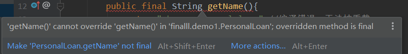
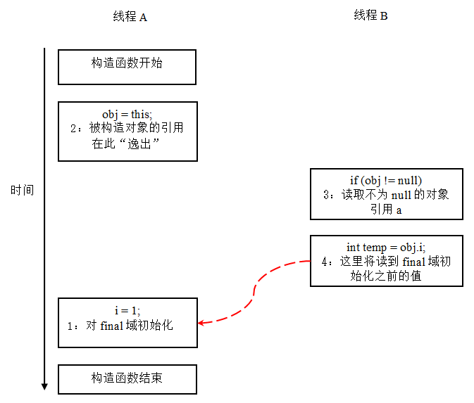

# final使用

final变量有成员变量或者是本地变量(方法内的局部变量)，在类成员中final经常和static一起使用，作为类常量使用。

**其中==类常量==必须在==声明时初始化==，final==成员常量==可以在==构造函数==初始化。**

```
public class demo1 {
    public final int i;
    public static final int j; //报错，必须初始化 因为常量在常量池中就存在了，调用时不需要类的初始化，所以必须在声明时初始化
    demo1(){  //构造函数初始化
        i = 2;  }}
```

对于*<u>类常量</u>*，JVM会<u>*缓存在常量池中*</u>，在<u>*读取*</u>该变量时*<u>不会加载这个类 -> 就是==不会调用构造函数==</u>*

```
public class Main {
    public static final int i = 2;
    Main() {
        System.out.println("调用构造函数"); // 该方法不会调用
    }
    public static void main(String[] args) {
        System.out.println(Main.i);
    }
}
```


---

final修饰基本类型和引用

```java
public void final修饰基本类型变量和引用() {
    final int a = 1;
    final int[] b = {1};
    final int[] c = {1};
			//  b = c;报错
    b[0] = 1;
    final String aa = "a";
    final Fi f = new Fi();
   		 //aa = "b";报错
    	// f = null;//报错
    f.a = 1;
}
```

**可以修改引用==指向位置的  数据==  **

final方法表示该**方法**不能被子类的方法==**重写**==，将方法声明为final，在编译的时候就已经**静态绑定**了，不需要在运行时动态绑定




---

**final类**

final类不能被继承

```java
class Si{
    //一般情况下final修饰的变量   一定要被初始化。
    //只有下面这种情况例外，要求该变量   必须在构造方法中被初始化。
    //并且不能有  无参数的构造方法。
    //这样就可以让每个实例都有一个不同的变量，并且这个变量在每个实例中只会被初始化一次
    
    ----------就是说在每个实例中都要进行  传参数进行构造  每个实例中i这个final类型的值都可以构造为不同的值
    
    //于是这个变量在单个实例里就是常量了。
    final int s ;
    Si(int s) {
        this.s = s;
    }
}
class Bi {
    final int a = 1;
    final void go() {
        //final修饰方法无法被继承
    }
}
class Ci extends Bi {
    final int a = 1;
//        void go() {
//            //final修饰方法无法被继承
//        }
}
final char[]a = {'a'};
final int[]b = {1};
```


```java
public void final修饰类() {
    //引用没有被final修饰，所以是可变的。
    //final只修饰了Fi类型，即Fi实例化的对象在堆中内存地址是不可变的。
    //虽然内存地址不可变，但是可以对内部的数据做改变。
    Fi f = new Fi();
    f.a = 1;
    System.out.println(f);
    f.a = 2;
    System.out.println(f);
    //改变实例中的值并不改变内存地址。

    Fi ff = f;
    //让引用指向新的Fi对象，原来的f对象由新的引用ff持有。
    //引用的指向改变也不会改变原来对象的地址
    f = new Fi();
    System.out.println(f);
    System.out.println(ff);
}
```


---

**final关键字的知识点**

1. final**成员变量**必须在声明的时候初始化或者在**构造器**中初始化，否则就会报编译错误。final变量一旦被初始化后不能再次赋值。
2. 本地变量必须在声明时赋值。 因为**没有初始化的过程**
3. 在匿名类中所有变量都必须是final变量。
4. final方法不能被重写, final类不能被继承
5. 接口中声明的所有**变量本身是final的**。类似于匿名类
6. final和abstract这两个关键字是反相关的，**final类就不可能是abstract的**。
7. final方法在编译阶段绑定，称为**静态绑定**(static binding)。
8. 将类、方法、变量声明为final能够**提高性能**，这样JVM就有机会进行估计，然后**优化**。


**final方法的好处:**

1. 提高了性能，JVM在==常量池==中会缓存final变量
2. final变量在多线程中==并发安全==，无需==额外的同步开销==（因为不可变）
3. final方法是**静态编译**的，提高了调用速度
4. **final类创建的对象是==只可读==的，在多线程可以安全共享**


# final关键字的最佳实践

final 对于==常量==来说，意味着**值**不能改变，例如 final int i=100。这个i的值永远都是100。 但是对于==变量==来说又不一样，只是标识这个**引用不可被改变**，例如 final File f=new File("c:\test.txt");

那么这个f一定是不能被改变的，如果f本身有方法修改其中的成员变量，例如是否可读，是允许修改的。有个形象的比喻：一个女子定义了一个final的老公，这个老公的职业和收入都是允许改变的，只是这个女人不会换老公而已。


---

**关于空白final**

==静态变量、实例变量和局部变量==

final变量定义的时候，可以**先声明，而不给初值**，这中变量也称为==final空白==，无论什么情况，编译器都确保空白final在**使用之前**必须被初始化。 　 但是，final空白在final关键字final的使用上提供了更大的灵活性，为此，一个类中的final数据成员就可以实现**依对象而有所不同**，却有保持其恒定不变的特征。


```java
public class FinalTest { 
    final int p; 
    final int q=3; 
    FinalTest(){ 
    	p=1; 
    } 
    
    FinalTest(int i){ 
        p=i;//可以赋值，相当于直接定义p 
        q=i;//不能为一个final变量赋值 
    } 
} 
```

**q已经赋值了  就不能再改变其初值**


---

**final内存分配**


调用一个函数除了函数本身的执行时间之外，还需要额外的时间去==寻找这个函数==（类内部有一个**函数签名和函数地址的映射表**）。所以**减少函数调用次数就等于降低了性能消耗**。

final修饰的函数会==被编译器优化==，优化的结果是==减少了函数调用的次数==。如何实现的，举个例子给你看：

```java
public class Test{ 
	final void func(){System.out.println("g");}; 
    
	public void main(String[] args){ 
		for(int j=0;j<1000;j++)   
		func(); 
	}	
} 
经过编译器优化之后，这个类变成了相当于这样写： 
    
public class Test{ 
	final void func(){System.out.println("g");}; 
	public void main(String[] args){ 
		for(int j=0;j<1000;j++)  
		{System.out.println("g");} 
	}
} 
```


编译器直接将func的函数体==内嵌==到了==调用函数的地方==，这样的结果是节省了1000次函数调用，当然编译器处理成字节码，只是我们可以想象成这样，看个明白。

函数体**太长**的话，用final可能适得其反，因为经过编译器内嵌之后代码长度大大增加，于是就增加了**jvm解释字节码的时间**。


---

**使用final修饰变量会让变量的值不能被改变吗**

```
public class Final   
{   
    public static void main(String[] args)   
    {   
        Color.color[3] = "white";   
        for (String color : Color.color)   
            System.out.print(color+" ");   
    }   
}   
  
class Color   
{   
    public static final String[] color = { "red", "blue", "yellow", "black" };   
}  


执行结果： 
red blue yellow white 
看！，黑色变成了白色。 
```

 在使用findbugs插件时，就会提示public static String[] color = { "red", "blue", "yellow", "black" };这行代码**不安全**，但**加上final修饰**，这行代码仍然是不安全的，因为final==没有做到保证变量的值不会被修改==！
 原因是：final关键字只能保证变量本身不能被赋与新值，而不能保证变量的内部结构不被修改。例如在main方法有如下代码Color.color = new String[]{""};就会报错了。


---

**如何保证数组内部不被修改**

那可能有的同学就会问了，加上final关键字不能保证数组**不会被外部修改**，那有什么方法能够保证呢？答案就是==降低访问级别==，把==数组设为private==。这样的话，就解决了数组==在外部被修改的不安全性==，但也产生了另一个问题，那就是这个数组==要被外部使用==的。 


解决方法：

```java
import java.util.AbstractList;   
import java.util.List;   

public class Final   
{   
    public static void main(String[] args)   
    {   
        for (String color : Color.color)   
            System.out.print(color + " ");   
        Color.color.set(3, "white");   
    }   
}   
  
class Color   
{   
    private static String[] _color = { "red", "blue", "yellow", "black" };   
    public static List<String> color = 
        new AbstractList<String>()   {   
        
        @Override  
        public String get(int index)   
        {   
            return _color[index];   
        }   
        @Override  
        public String set(int index, String value)   
        {   
            throw new RuntimeException("为了代码安全,不能修改数组");   
        }   
        @Override  
        public int size()   
        {   
            return _color.length;   
        }   
    };  
}
```

**注意：**

private对象 _color无法被外部类访问

==重新声明了一个类静态变量==

**并重写了方法   返回   _color数组的内容  可以被外部类访问**


既保证了代码安全，又能让数组中的元素被访问了。


---


## final方法的三条规则


规则1：final修饰的方法不可以被重写。

规则2：final修饰的**方法**仅仅是不能重写，但它完全==可以被重载==。

规则3：父类中**private final**方法，子类可以==重新定义，这种情况不是重写==。


```java
public class PrivateFinalMethodTest
{
	private final void test(){}
}
class Sub extends PrivateFinalMethodTest
{
	// 下面方法定义将不会出现问题
	public void test(){}
}
```


# final和jvm的关系

对 final 域的**读和写**更像是普通的**变量访问**。对于 final 域，编译器和处理器要遵守两个重排序规则：

1. **构造函数内对一个 final 域的写入**，与随后把这个被构造对象的引用**赋值给一个引用变量**，这两个操作之间**不能重排序**。
2. 初==次读一个包含 **final** 域的对象的**引用**，与随后初次读这个 final 域，这两个操作之间不能重排序。==


```java
public class FinalExample {
    int i;                          // 普通变量 
    final int j;                      //final 变量 
    static FinalExample obj;

    public void FinalExample () { // 构造函数 
        i = 1;                        // 写普通域 
        j = 2;                        // 写 final 域 
    }
    
    public static void writer () {    		// 写线程 A 执行 
        obj = new FinalExample ();
    }
    
    public static void reader () {       // 读线程 B 执行 
        FinalExample object = obj;       // 读对象引用 
        int a = object.i;                // 读普通域 
        int b = object.j;                // 读 final 域 
    }
}
```

**这里假设一个线程 A 执行 writer () 方法，随后另一个线程 B 执行 reader () 方法。下面我们通过这两个线程的交互来说明这两个规则。**


### 写 final 域的重排序规则


写final域的重排序规则    **禁止把final域的==写==**   重排序到   **构造函数之外**：

- JVM 禁止编译器把 **final 域的写**重排序到构造函数**之外**。

- 编译器会在 ==final 域的写(就是对<u>final域</u>的构造赋值)==之后，==构造函数 return 之前==，插入一个 StoreStore 屏障。

  **<u>这个屏障禁止处理器把 final 域的写重排序到构造函数之外。</u>**


现在让我们分析 writer () 方法。writer () 方法只包含一行代码：`finalExample = new FinalExample ()`。这行代码包含两个步骤：

1. 构造一个 FinalExample 类型的对象；
2. 把这个**对象的引用**赋值给**引用变量 obj**。

假设线程 B 读对象引用与读对象的成员域之间没有重排序（马上会说明为什么需要这个假设），下图是一种可能的执行时序：


在上图中，写普通域的操作被编译器重排序到了==构造函数之外==，读线程 B 错误的读取了普通变量 **i 初始化之前**的值。而写 final 域的操作，被写 final 域的重排序规则“限定”在了构造函数之内，读线程 B **正确的读取了 final 变量初始化之后**的值。

写 final 域的重排序规则可以确保：**在对象引用为任意线程可见之前，对象的 final 域已经被正确初始化过了**，<u>*而普通域不具有这个保障*</u>。以上图为例，在读线程 B“看到”对象引用 obj 时，很可能 obj 对象==还没有构造完成==（对普通域 i 的写操作被重排序到构造函数外，此时初始值 2 还没有写入普通域 i）。


### 读 final 域的重排序规则


读 final 域的重排序规则如下：

- 在一个线程中，初次**==读对象引用==**与初次**==读该对象包含的 final 域==**，JMM 禁止处理器重排序这两个操作（注意，这个规则仅仅针对处理器）。编译器会在==读 final 域操作的前面==插入一个 ==LoadLoad 屏障==。


初次读对象引用与初次读该对象包含的 final 域，这两个操作之间存在**间接依赖**关系。由于编译器遵守  间接依赖关系，因此==编译器不会重排序==这两个操作。大多数处理器也会遵守间接依赖，大多数处理器也不会重排序这两个操作。但有少数处理器允许对存在间接依赖关系的操作做重排序（比如 alpha 处理器），这个规则就是专门用来针对这种处理器。

reader() 方法包含三个操作：

1. 初次读引用变量 obj;
2. **初**次读引用变量 obj 指向对象的**普通域 j**。
3. 初次读引用变量 obj 指向对象的**final 域  i**。

现在我们假设写线程 A 没有发生任何重排序，同时程序在不遵守间接依赖的处理器上执行，下面是一种可能的执行时序：


读对象的普通域的操作被处理器重排序到**读对象引用之前**。读普通域时，该域还没有被写线程 A 写入，这是一个错误的读取操作。而读 final 域的重排序规则会把读对象 final 域的操作“限定”在读对象引用**之后**，此时该 final 域已经被 A 线程**初始化过了，这是一个正确的读取操作**。

==读 final 域的重排序规则可以确保：在读一个对象的 final 域之前，一定会先读包含这个 final 域的对象的引用。在这个示例程序中，如果该引用不为 null，那么引用对象的 final 域一定已经被 A 线程初始化过了。==


**上面的final域是基础数据类型  如果是引用型？**


```java
public class FinalReferenceExample {
    final int[] intArray;                     //final 是引用类型 
    static FinalReferenceExample obj;

    public FinalReferenceExample () {        // 构造函数 
        intArray = new int[1];              //1
        intArray[0] = 1;                   //2
    }

    public static void writerOne () {          // 写线程 A 执行 
        obj = new FinalReferenceExample ();  //3
    }

    public static void writerTwo () {          // 写线程 B 执行 
        obj.intArray[0] = 2;                 //4
    }

    public static void reader () {              // 读线程 C 执行 
        if (obj != null) {                    //5
            int temp1 = obj.intArray[0];       //6
        }
    }
}
```


对于引用类型，写 final 域的重排序规则对编译器和处理器增加了如下约束：

==在**构造函数内**对一个 **final 引用的对象的成员域的写入**，与随后在构造函数外把这个被构造对象的引用**赋值给一个引用变量**，这两个操作之间不能重排序。==


我们假设首先线程 A 执行 writerOne() 方法，执行完后线程 B 执行 writerTwo() 方法，执行完后线程 C 执行 reader () 方法。下面是一种可能的线程执行时序


在上图中，1 是对 final 域的写入，2 是对这个 final 域引用的对象的成员域的写入，3 是把被构造的对象的引用赋值给某个引用变量。这里除了前面提到的 1 不能和 3 重排序外，2 和 3 也不能重排序。

JMM 可以确保读线程 C 至少能看到写线程 A 在构造函数中对 final 引用对象的成员域的写入。即 C 至少能看到数组下标 0 的值为 1。而**写线程 B** 对数组元素的写入，读线程 C 可能看的到，也可能看不到。JMM 不保证线程 B 的写入对读线程 C 可见，因为写线程 B 和读线程 C 之间存在数据竞争，此时的执行结果不可预知。

如果想要确保读线程 C 看到写线程 B 对数组元素的写入，写线程 B 和读线程 C 之间需要使用同步原语（lock 或 volatile）来确保内存可见性。


**为什么final引用不能从构造函数内==逸出==？**


写 final 域的重排序规则可以确保：在引用变量为任意线程可见之前，该引用变量指向的对象的 final 域==已经在构造函数中被正确初始化过了==。其实要得到这个效果，还需要一个保证：在构造函数内部，**不能让这个被构造对象的==引用==为其他线程可见**，也就是对象引用不能在构造函数中“逸出”


```java
public class FinalReferenceEscapeExample {
    final int i;
    static FinalReferenceEscapeExample obj;

    public FinalReferenceEscapeExample () {
        i = 1;                              //1 写 final 域 
        obj = this;                          //2 this 引用在此“逸出”
    }

    public static void writer() {
        new FinalReferenceEscapeExample ();
    }

    public static void reader {
        if (obj != null) {                     //3
            int temp = obj.i;                 //4
        }
    }
}
```


假设一个线程 A 执行 writer() 方法，另一个线程 B 执行 reader() 方法。这里的操作 2 使得对象**还未完成构造前就为线程 B 可见**。即使这里的操作 2 是构造函数的最后一步，且即使在程序中操作 2 排在操作 1 后面，==执行 read() 方法的线程仍然可能无法看到 final 域被初始化后的值==，因为这里的**操作 1 和操作 2** 之间==<u>可能被重排序</u>==。实际的执行时序可能如下图所示：

==因为没有规则约束  可能会发生重排==





从上图我们可以看出：在构造函数**返回前**，==被构造对象的引用不能为其他线程可见==，因为此时的 ==final 域可能还没有被初始化==。在构造函数==返回后==，任意线程==都将保证能看到 final 域正确初始化之后的值==。


---

## final 语义在处理器中的实现

现在我们以 x86 处理器为例，说明 final 语义在处理器中的具体实现。

上面我们提到，写 final 域的重排序规则会要求译编器在 final 域的写之后，构造函数 return 之前，插入一个 StoreStore 障屏。读 final 域的重排序规则要求编译器在读 final 域的操作前面插入一个 LoadLoad 屏障。

由于 x86 处理器不会对**写 - 写操作**做重排序，所以在 x86 处理器中，写 final 域需要的 **StoreStore 障屏**会被省略掉。同样，由于 x86 处理器不会对存在间接依赖关系的操作做重排序，所以在 x86 处理器中，读 final 域需要的 LoadLoad 屏障也会被省略掉。也就是说在 x86 处理器中，final 域的读 / 写不会插入任何内存屏障！

## JSR-133 为什么要增强 final 的语义

在旧的 Java 内存模型中 ，最严重的一个缺陷就是线程可能看到 final 域的值会改变。比如，一个线程当前看到一个整形 final 域的值为 0（还**未初始化之前**的默认值），过一段时间之后这个线程再去读这个 final 域的值时，却发现值变为了 1（被某个线程初始化之后的值）。最常见的例子就是在旧的 Java 内存模型中，String 的值可能会改变（参考文献 2 中有一个具体的例子，感兴趣的读者可以自行参考，这里就不赘述了）。

为了修补这个漏洞，JSR-133 专家组增强了 final 的语义。通过为 final 域增加写和读重排序规则，可以为 java 程序员提供初始化安全保证：只要对象是正确构造的（被构造对象的引用在==构造函数中==没有“逸出”），那么不需要使用同步（指 lock 和 volatile 的使用），就可以保证任意线程都能看到这个 final 域在构造函数中被初始化之后的值。


# static

父类中static修饰的静态**方法**，**不能覆盖  不能继承**


父类中static修饰的变量或常量，==能覆盖，不能继承==


static修饰的变量和方法，**==只属于类本身，不属于对象==**；当声明一个对象时，并不产生static变量和方法的拷贝。也就是说，用static修饰的变量和方法在==类加载==的时候，会==分配一块存储空间==，所有此类的对象**都可以操控此块存储空间**；

​    注意：当子类没有与父类同名的static变量（或方法时），子类的对象也可操控这块内存空间。但是，子类**<u>并没有继承</u>**父类中static修饰的变量和方法。这是因为static修饰的变量和方法是**<u>属于父类本身</u>**的。


**static静态方法可以继承但是不能重写，如果父子类静态方法名相同，则会隐藏父类方法**


