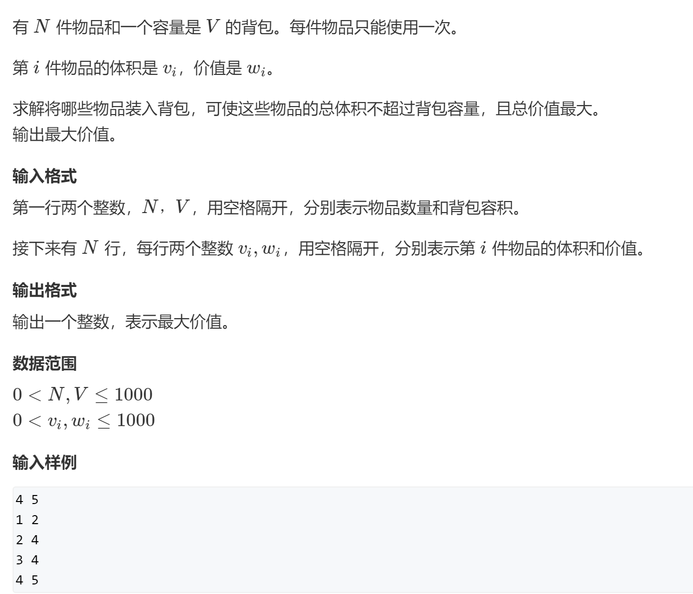
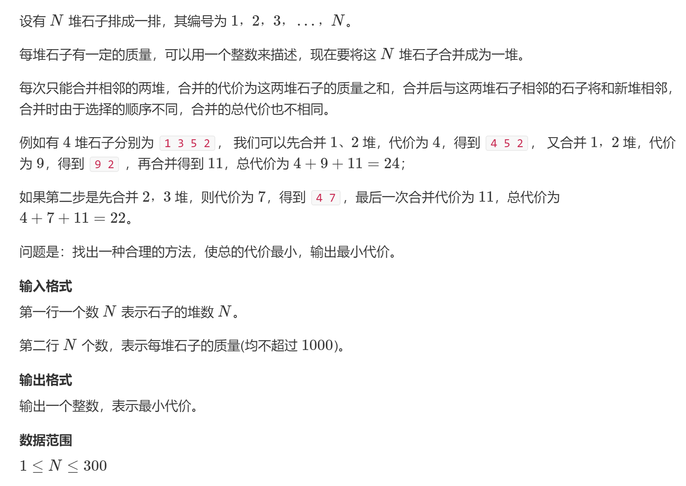

# 闫式dp分析法


从集合角度分析dp问题

有限集的最值或者个数


两个阶段：

- 化零为整：状态表示
  - 集合（f(i)表示的是哪个集合）
  - 属性（max /min /count）
  - **用一个属性来表示一类集合**
- 化整为零：状态计算
  - 将f(i)集合划分为若干个子集，不重复（数量不重复，最大最小值可以重复），**不遗漏**
  - **找最后一个不同点**
  - 根据f(i)的属性来整理所有子集得到结果


----

**划分集合的依据：寻找最后一个不同点**

## [01背包问题](https://www.acwing.com/problem/content/2/)




最多2^N种


从两个角度：

- 状态表示  f(i, j)
  - 集合：只考虑前i个物品，并且总体积不超过 j 的选法的集合
  - 属性：集合中每个方案的最大价值： f(N, V)中的最大值

- 状态计算

  ***最后一个不同点：***

  f(i, j)划分为两个子集，分别处理：

  1. 所有**不选**第i个物品的方案  `f(i-1, j)`
  2. 所有**选择**第i个物品的方案  `f(i-1, j-vi) + wi`
     - 变化部分：不包含i的部分，`f(i-1, j-vi)`，总体积 <= j - v[i]
     - 不变部分：wi

  两个子集的最大值

  
  
  状态转移方程：

```
f(i,j) = max(f(i-1,j), f(i-1, j-vi) + wi)
```


---


```java
import java.util.Scanner;

class Main{
    public static void main(String[] args){
        int[][] f = new int[1010][1010];
        Scanner sc = new Scanner(System.in);
        int n = sc.nextInt(), m = sc.nextInt();
        int[] v = new int[1010], w = new int[1010];
        for(int i = 1; i <= n; i++){
            v[i] = sc.nextInt();
            w[i] = sc.nextInt();
        }

        //前i个物品，总体积不超过j方案的集合
        for(int i = 1; i <= n; i++){
            for(int j = 0; j <= m; j++){

                f[i][j] = f[i - 1][j]; //左半边的子集
                //右半边不一定存在！
                if(j >= v[i]){
                    f[i][j] = Math.max(f[i][j], f[i - 1][j - v[i]] + w[i]);
                }
            }

        }
        System.out.println(f[n][m]);
    }
}
```


----

**空间优化**

> 代码的等价变形，和逻辑无关


i层只会用到i-1层，使用滚动数组。

j要么用自己，要么用j-vi

***需要 j 从大到小循环:***

```
for(j = v; j >= vi; j--)
```

变为一维：

```
f(j) = min(f(j),f(j-vi) + wi)
```

因为此时的 *f(j-vi)* 还没有在第i层被更新过，所以用的是第 *i-1* 层的  *f(j-vi)*，即  *f(i-1, j-vi)*


```java
import java.util.Scanner;

class Main{
    public static void main(String[] args){
        int[] f = new int[1010];
        Scanner sc = new Scanner(System.in);
        int n = sc.nextInt(), m = sc.nextInt();
        int[] v = new int[1010], w = new int[1010];
        for(int i = 1; i <= n; i++){
            v[i] = sc.nextInt();
            w[i] = sc.nextInt();
        }

        for(int i = 1; i <= n; i++){
            for(int j = m; j >= 0; j--){

                // f[i][j] = f[i-1][j]，右边的值还没更新过，是等价的
                f[j] = f[j]; //左半边的子集
                
                if(j >= v[i]){
                    // f[i][j] = Math.max(f[i][j], f[i - 1][j - v[i]] + w[i]);
                    // 如果j从小到大循环，那么会先计算出f[j - v[i]]，这时候用的就不是上一层 第i-1层的f[i - 1][j - v[i]]，而是被更新过后的i层的f[j - v[i]]
                    // j从大到小循环，先算f[j],再算 f[j-v[i]]
                    f[j] = Math.max(f[j], f[j - v[i]] + w[i]);
                }
            }

        }
        System.out.println(f[m]);
    }
}
```


## [完全背包问题](https://www.acwing.com/problem/content/3/)


完全背包问题和01背包问题完全不一样

但只需要修改一点代码就可以。。

将j循环顺序变为从小到大就可以

----

每个物品可以用无限次


状态表示：

- f(i, j)
  - 集合：所有只从前 i 个物品中选  、  总体积不超过 j 的方案的集合
  - 属性：总价值的最大值max


状态计算：

根据**第 i 个物品选的个数**，划分为若干个子集：

- 选0个 ： 1~i，<=j => f(i - 1, j)
- 选1个 ： f(i - 1, j) + 
- 选2个
- ....
- 选k个 ：
  - 变化的部分：f(i - 1, j) ，**求这部分的最大值**
    - 从1~ i-1 中选，且**总体积 <= j - k * v[i]  => f(i - 1, j - k*v[i])**
  - 不变的部分： k * w[i]，这是固定的
- ...
- 直到体积超过j为止

每一类都选出来，取max

朴素方程：

```
f(i, j) = max( f(i-1, j) , f(i - 1, j - vi) + wi, f(i - 1, j - 2vi) + 2wi , ...  )
```

需要三重循环？

中间省略了一步：

```
f(i, j) = max( f(i-1, j) , f(i - 1, j - vi) + wi, f(i - 1, j - 2vi) + 2wi , ...  )

f(i, j - vi) = max (f(i - 1, j - vi), f(i-1, j-2vi) + wi, f(i-1, j-3vi) + 2wi ,... )

除去第一项，每一项都比下面多个w

f(i, j) = max ( f(i-1, j), f(i, j-v) + w)  =>  变为二重循环
```


对比

```
01背包
f[i][j] = max(f[i-1][j], f[i-1][j-v] + w)，

完全背包
f[i][j] = max(f[i-1][j], f[i][j-v] + w)

在优化空间时，01背包需要从大到小枚举体积j（使用第i-1层），而完全背包需要从小到大枚举体积j（因为f[j]需要使用当前层第i层的f[j-v]，那么就需要优先更新f[j-v]，然后才能更新f[j]）
```


```java
import java.util.Scanner;

class Main{
    public static void main(String[] args){
        int[][] f = new int[1010][1010];
        Scanner sc = new Scanner(System.in);
        int n = sc.nextInt(), m = sc.nextInt();
        int[] v = new int[1010], w = new int[1010];
        for(int i = 1; i <= n; i++){
            v[i] = sc.nextInt();
            w[i] = sc.nextInt();
        }

        //前i个物品，总体积不超过j方案的集合
        for(int i = 1; i <= n; i++){
            for(int j = 0; j <= m; j++){

                f[i][j] = f[i - 1][j]; //选0个
                //右半边不一定存在
                if(j >= v[i]){
                    f[i][j] = Math.max(f[i][j], f[i][j - v[i]] + w[i]);
                }
            }

        }
        System.out.println(f[n][m]);
    }
}
```


优化空间：

```java
import java.util.Scanner;

class Main{
    public static void main(String[] args){
        int[] f = new int[1010];
        Scanner sc = new Scanner(System.in);
        int n = sc.nextInt(), m = sc.nextInt();
        int[] v = new int[1010], w = new int[1010];
        for(int i = 1; i <= n; i++){
            v[i] = sc.nextInt();
            w[i] = sc.nextInt();
        }

        //前i个物品，总体积不超过j方案的集合
        for(int i = 1; i <= n; i++){
            for(int j = v[i]; j <= m; j++){

                // f[i][j] = f[i-1][j] 保持了顺序
                //f[j] = f[j]; //选0个
                //右半边不一定存在
                // f[i][j] = Math.max(f[i][j], f[i][j - v[i]] + w[i]); 也可以保持顺序，算f[j]的时候，f[j - v[i]]已经被算出来了，就说明此时f[j - v[i]]是第i层的f[j - v[i]]
                f[j] = Math.max(f[j], f[j - v[i]] + w[i]);
                
            }

        }
        System.out.println(f[m]);
    }
}
```


## [石子合并](https://www.acwing.com/problem/content/284/)




如果不限制"相邻"，就成了贪心问题


最后一定是某两大堆合并为一堆，两个堆都是连续的几个堆合成的


---

闫式dp分析法：

> (n-1)!这么多合并顺序，有限，不能枚举

状态表示：

- f(i, j)
  - 集合：所有将 i~j 区间合并成一堆的方案的集合   (j - i) !种
  - 属性：集合中所有方案的缩小代价 min

---

状态计算：

**划分成很多很多类：每个问题分别处理**  

最后一步一定是左边的一堆和右边的部分来合并：

枚举左边的最后一堆：可以是 `i ， i+1, ... , j - 1`，这就是j - i 类，每一类分别求一个最小值，再求总的最小值，就是f(i, j)

选择分界点 k ：

`i --- k,  k+1 --- j` 这两大堆来合并

第k类：`i~k,  k+1~j`，二者**毫无影响，完全独立**，那么**都取min**

- 左边的最小值：`f(i, k)`

- 右边的最小值：`f(k+1, j)`

- 合并：`f(i, j) = min( f(i, k) + f(k+1, j) + s(j) - s(i - 1)  ) k=i,i+1,...,j`

状态：n^2，然后枚举k次，n^3复杂度


```java
import java.util.Scanner;

class Main{
    public static void main(String[] args){
        Scanner sc = new Scanner(System.in);
        
        int n = sc.nextInt();
        int[] s = new int[n + 1];//前缀和
        for(int i = 1; i <= n; i++){
            int x = sc.nextInt();
            s[i] = s[i - 1] + x;
        }
        int[][] f = new int[n + 1][n + 1];
        
        for(int len = 2; len <= n; len++){ //枚举区间长度
            for(int i = 1; i + len - 1 <= n; i++){ // 枚举左端点，右端点小于等于n
                int j = i + len - 1;//右端点
                
                f[i][j] = Integer.MAX_VALUE;
                for(int k = i; k < j; k++){//枚举i,j区间的每个子类，以左边结束的堆为分割：i~j-1
                    f[i][j] = Math.min(f[i][j], f[i][k] + f[k + 1][j] + s[j] - s[i - 1]);
                }
            }
        }
        System.out.println(f[1][n]);
    }
}
```


枚举的顺序：**保证每种状态都被提前计算即可**


```java
import java.util.Scanner;

class Main{
    public static void main(String[] args){
        Scanner sc = new Scanner(System.in);
        
        int n = sc.nextInt();
        int[] s = new int[n + 1];//前缀和
        for(int i = 1; i <= n; i++){
            int x = sc.nextInt();
            s[i] = s[i - 1] + x;
        }
        int[][] f = new int[n + 1][n + 1];
        
        
        //这样枚举顺序是错误的，在计算f[i][j]时f[i][k] 和 f[k + 1][j]还没有被计算出来，
        //如果按照区间枚举，那么每次枚举k时，f[i][k]是小于当前len的区间的，总是已经被计算出来的
        //尝试倒着枚举i
        // for(int i = 1; i <= n - 1; i++){
        //     for(int j = i + 1; j <= n; j++){
        //         f[i][j] = Integer.MAX_VALUE;
        //         for(int k = i; k < j; k++){
        //             f[i][j] = Math.min(f[i][j], f[i][k] + f[k + 1][j] + s[j] - s[i - 1]);
        //         }
        //     }
        // }
        
        //除了按长度枚举，也可以倒着枚举，因为只要保证每种状态都被提前计算即可
        //这样枚举，在需要f[i][k] 和 f[k + 1][j]时，就可以得到前面已经计算出的状态结果了，也就是说需要保证i-j区间内，每个子区间的结果都需要提前先计算出来才可以
        for(int i = n - 1; i >= 1; i--){
            for(int j = i + 1; j <= n; j++){
                f[i][j] = Integer.MAX_VALUE;
                for(int k = i; k < j; k++){//枚举i,j区间的每个子类，以左边结束的堆为分割：i~j-1
                    f[i][j] = Math.min(f[i][j], f[i][k] + f[k + 1][j] + s[j] - s[i - 1]);
                }
            }
        }
        
        //区间 DP 枚举套路：长度+左端点
        for(int len = 2; len <= n; len++){ //枚举区间长度，从根据区间长度来从小到大枚举每个区间，得出他们的值，最终得出f[1][n]
            for(int i = 1; i + len - 1 <= n; i++){ // 枚举左端点，右端点小于等于n
                int j = i + len - 1;//右端点
                
                f[i][j] = Integer.MAX_VALUE;
                for(int k = i; k < j; k++){//枚举i,j区间的每个子类，以左边结束的堆为分割：i~j-1
                    f[i][j] = Math.min(f[i][j], f[i][k] + f[k + 1][j] + s[j] - s[i - 1]);
                }
            }
        }
        System.out.println(f[1][n]);
    }
}
```


## 区间dp


区间 DP 常用模版
所有的区间dp问题，第一维都是枚举区间长度，一般 len = 1 用来初始化，枚举从 len = 2 开始，第二维枚举起点 i （右端点 j 自动获得，j = i + len - 1）

```c++
for (int i = 1; i <= n; i++) {
    dp[i][i] = 初始值
}
for (int len = 2; len <= n; len++)           //区间长度
    for (int i = 1; i + len - 1 <= n; i++) { //枚举起点
        int j = i + len - 1;                 //区间终点
        for (int k = i; k < j; k++) {        //枚举分割点，构造状态转移方程
            dp[i][j] = max(dp[i][j], dp[i][k] + dp[k + 1][j] + w[i][j]);
        }
    }
```


## [897. 最长公共子序列](https://www.acwing.com/problem/content/899/)


子序列：不连续


---

有限集的最优化

有限集中的元素：A和B的所有公共子序列的最长的子序列

**A和B的所有公共子序列的最长的子序列的长度**

A=B，长度为n的字符串，会有 2^n 个不同的子序列


---

- 状态表示
  - f(i, j)
    - 集合 ：所有A[1 - i] 与 B[1 - j]的公共子序列的集合
    - 属性 ：最大值，所有公共子序列的最大值


- 状态计算

对f(i, j)划分：A[i] , B[j] 是否包含在子序列中，00， 01， 10， 11

- 11: 同时包含 A[i] == B[j]
  - 变化的部分A[1, i-1]，B[1, j-1]，求其公共子序列的最大值：**就是f(i-1, j-1)**
  - 不变的部分A[i] ， B[j]

- 00：不包含A[i] ， B[j]，A[1, i-1], B[1, j-1], **就是f(i-1, j-1)**，被f(i-1, j)  f(i, j-1)包含，不需要再求一遍这种情况

- 01：
  - 不包含A[i] ，包含 B[j] ，不等价于f(i-1, j)，因为f(i-1, j)包括两种情况：包含B[j]；不包含B[j]
  - 可以使用f(i-1, j) = max( f(i-1, j-1), f(i-2, j), f(i-1, j-1)+1 )，可见已经包括了00这种情况
- 10：f(i, j-1)完全包含01这个子集，使用f(i, j-1)来覆盖这个方案


> **求数量需要保证不重不漏，求最值时可以重复不遗漏，不影响最终结果**


```java
import java.util.Scanner;
class Main{
    
    public static void main(String[] args){
        
        Scanner sc = new Scanner(System.in);
        int n = sc.nextInt(), m = sc.nextInt();
        
        String a = sc.next(), b = sc.next();
        int[][] f = new int[n + 1][m + 1];
        
        for(int i = 1; i <= n; i++){
            for(int j = 1; j <= m; j++){
                // 01, 10两种情况
                f[i][j] = Math.max(f[i-1][j], f[i][j - 1]);
                if(a.charAt(i - 1) == b.charAt(j - 1)){
                    f[i][j] = Math.max(f[i][j], f[i - 1][j - 1] + 1);
                }
            }
        }
        System.out.println(f[n][m]);
    }
}
```


# Tip


## 理解状态表达函数


诸如：f(i, j), f(i)等等表达状态的函数，都有其自身意义：表示的是哪个集合的哪种属性，**用一个属性来表达一个集合**


栗子：

- 01背包问题


