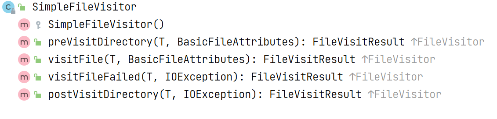
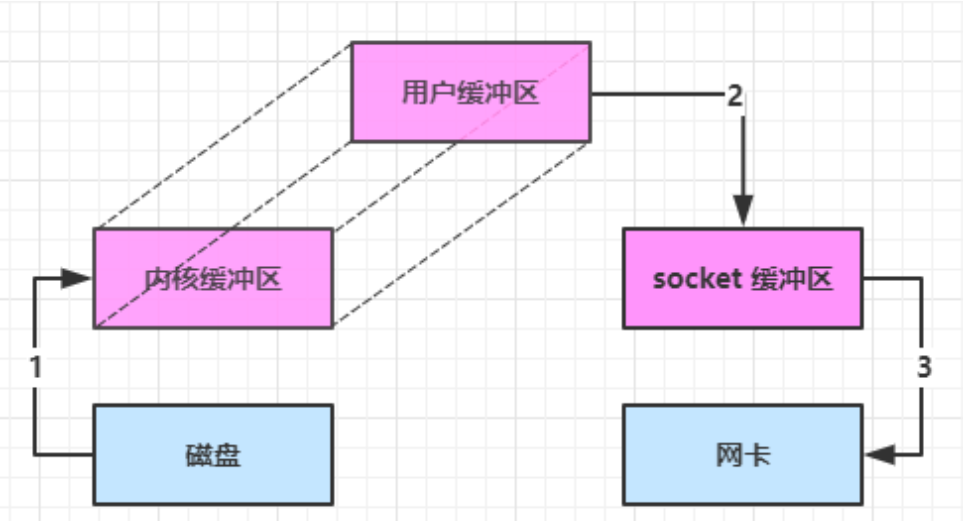
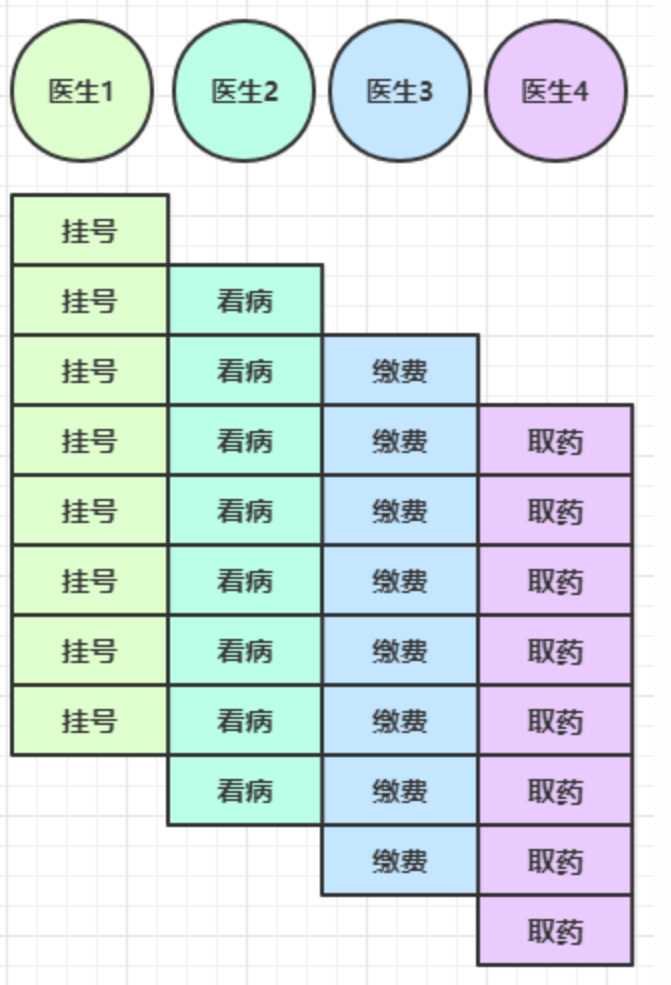
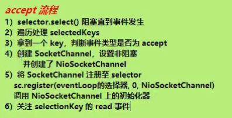

# NIO基础


**non-blocking io 非阻塞 IO**


## 三大组件


### Channel & Buffer


channel 有一点类似于 **stream**，它就是读写数据的***双向通道***，可以从 channel **将数据读入 buffer(内存缓冲区)**，也可以将 buffer 的数据写入 channel，而之前的 stream 要么是输入，要么是输出，**channel 比 stream 更为底层**


常见的 Channel 有

* FileChannel
* DatagramChannel
* SocketChannel
* ServerSocketChannel


buffer 则用来**缓冲读写数据**，常见的 buffer 有

* ByteBuffer
  * MappedByteBuffer
  * DirectByteBuffer
  * HeapByteBuffer
* ShortBuffer
* IntBuffer
* LongBuffer
* FloatBuffer
* DoubleBuffer
* CharBuffer


### Selector

（选择器）


selector 单从字面意思不好理解，需要结合**服务器的设计**演化来理解它的用途


----

**多线程版设计**


----

:warning:**多线程版缺点**

* 内存占用高——请求越多，开动的线程越多
* 线程**上下文切换**成本高——多于cpu线程数，就会发生切换
* 只适合连接数少的场景


----

**线程池版设计**


---

**线程池版缺点**

* **阻塞模式下**，线程仅能**处理一个 socket 连接**

* 仅适合**短连接**场景

  > 如果一个socket连接的时间太长，并且什么也不做，该线程就被闲置了，该线程会被持续占用，整个系统可能会卡死


---

**Selector版设计**

selector 的作用就是***配合一个线程来管理多个 channel***，获取这些 **channel 上发生的事件**，这些 **channel 工作在非阻塞**模式下，***<u>不会让线程吊死在一个 channel 上</u>***。

利用率得到了提高

适合**连接数特别多，但流量低**的场景（low traffic）


调用 selector 的 select() 会**阻塞直到 (多个)channel中是否 发生了读写就绪事件**，这些事件发生，select 方法就会返回这些事件交给 thread 来处理


## ByteBuffer


```xml
 <dependencies>
        <dependency>
            <groupId>io.netty</groupId>
            <artifactId>netty-all</artifactId>
            <version>4.1.39.Final</version>
        </dependency>
        <dependency>
            <groupId>org.projectlombok</groupId>
            <artifactId>lombok</artifactId>
            <version>1.16.18</version>
        </dependency>
        <dependency>
            <groupId>com.google.code.gson</groupId>
            <artifactId>gson</artifactId>
            <version>2.8.5</version>
        </dependency>
        <dependency>
            <groupId>com.google.guava</groupId>
            <artifactId>guava</artifactId>
            <version>19.0</version>
        </dependency>
        <dependency>
            <groupId>ch.qos.logback</groupId>
            <artifactId>logback-classic</artifactId>
            <version>1.2.3</version>
        </dependency>
        <dependency>
            <groupId>com.google.protobuf</groupId>
            <artifactId>protobuf-java</artifactId>
            <version>3.11.3</version>
        </dependency>
    </dependencies>
```


```java
public static void main(String[] args) {
    // FileChannel
    //1. 输入输出流 2.RandomAccessFile
    try (FileChannel channel = new FileInputStream("data.txt").getChannel()) {
        //准备缓冲区
        ByteBuffer buffer = ByteBuffer.allocate(10); //一次read只能读前10个字节，需要分多次读取
        while(true){
            //从channel 读取数据，向缓冲区buffer写入
            int read = channel.read(buffer);
            log.info("读取到的字节：{}",read);
            if(read == -1){
                break; //没有内容，退出
            }
            //打印buffer内容
            buffer.flip(); //切换至 读模式，才能够读取其中数据
            while(buffer.hasRemaining()){ //是否还有剩余未读数据
                byte b = buffer.get();
                System.out.println((char) b);
            }
            //buffer切换为写模式，需要写入数据
            buffer.clear();
        }

    } catch (IOException e){

    }
}
```


### ByteBuffer 正确使用姿势


1. 向 buffer 写入数据，例如调用 channel.read(buffer)
2. 调用 flip() 切换至**读模式**
3. 从 buffer 读取数据，例如调用 `buffer.get()`
4. 调用 clear() 或 compact() 切换至**写模式**
5. 重复 1~4 步骤


### ByteBuffer 结构


ByteBuffer 有以下重要属性

* capacity  容量
* position  读写指针
* limit  读写限制

一开始


**写模式下**，position 是**写入位置**，**limit 等于容量**，下图表示写入了 4 个字节后的状态


**flip** 动作发生后，position 切换为**读取位置**，**limit 切换为读取限制**


读取 4 个字节后，状态： 读指针移动到读取限制limit


**clear** 动作发生后，状态：清空buffer，从头开始，执行写入操作


**compact 方法**，是把未读完的部分**向前压缩**，**然后切换至写模式**


```java
package com.hcr.netty;

import io.netty.util.internal.StringUtil;

import java.nio.ByteBuffer;

import static io.netty.util.internal.MathUtil.isOutOfBounds;
import static io.netty.util.internal.StringUtil.NEWLINE;

public class ByteBufferUtil {
    private static final char[] BYTE2CHAR = new char[256];
    private static final char[] HEXDUMP_TABLE = new char[256 * 4];
    private static final String[] HEXPADDING = new String[16];
    private static final String[] HEXDUMP_ROWPREFIXES = new String[65536 >>> 4];
    private static final String[] BYTE2HEX = new String[256];
    private static final String[] BYTEPADDING = new String[16];

    static {
        final char[] DIGITS = "0123456789abcdef".toCharArray();
        for (int i = 0; i < 256; i++) {
            HEXDUMP_TABLE[i << 1] = DIGITS[i >>> 4 & 0x0F];
            HEXDUMP_TABLE[(i << 1) + 1] = DIGITS[i & 0x0F];
        }

        int i;

        // Generate the lookup table for hex dump paddings
        for (i = 0; i < HEXPADDING.length; i++) {
            int padding = HEXPADDING.length - i;
            StringBuilder buf = new StringBuilder(padding * 3);
            for (int j = 0; j < padding; j++) {
                buf.append("   ");
            }
            HEXPADDING[i] = buf.toString();
        }

        // Generate the lookup table for the start-offset header in each row (up to 64KiB).
        for (i = 0; i < HEXDUMP_ROWPREFIXES.length; i++) {
            StringBuilder buf = new StringBuilder(12);
            buf.append(NEWLINE);
            buf.append(Long.toHexString(i << 4 & 0xFFFFFFFFL | 0x100000000L));
            buf.setCharAt(buf.length() - 9, '|');
            buf.append('|');
            HEXDUMP_ROWPREFIXES[i] = buf.toString();
        }

        // Generate the lookup table for byte-to-hex-dump conversion
        for (i = 0; i < BYTE2HEX.length; i++) {
            BYTE2HEX[i] = ' ' + StringUtil.byteToHexStringPadded(i);
        }

        // Generate the lookup table for byte dump paddings
        for (i = 0; i < BYTEPADDING.length; i++) {
            int padding = BYTEPADDING.length - i;
            StringBuilder buf = new StringBuilder(padding);
            for (int j = 0; j < padding; j++) {
                buf.append(' ');
            }
            BYTEPADDING[i] = buf.toString();
        }

        // Generate the lookup table for byte-to-char conversion
        for (i = 0; i < BYTE2CHAR.length; i++) {
            if (i <= 0x1f || i >= 0x7f) {
                BYTE2CHAR[i] = '.';
            } else {
                BYTE2CHAR[i] = (char) i;
            }
        }
    }

    /**
     * 打印所有内容
     * @param buffer
     */
    public static void debugAll(ByteBuffer buffer) {
        int oldlimit = buffer.limit();
        buffer.limit(buffer.capacity());
        StringBuilder origin = new StringBuilder(256);
        appendPrettyHexDump(origin, buffer, 0, buffer.capacity());
        System.out.println("+--------+-------------------- all ------------------------+----------------+");
        System.out.printf("position: [%d], limit: [%d]\n", buffer.position(), oldlimit);
        System.out.println(origin);
        buffer.limit(oldlimit);
    }

    /**
     * 打印可读取内容
     * @param buffer
     */
    public static void debugRead(ByteBuffer buffer) {
        StringBuilder builder = new StringBuilder(256);
        appendPrettyHexDump(builder, buffer, buffer.position(), buffer.limit() - buffer.position());
        System.out.println("+--------+-------------------- read -----------------------+----------------+");
        System.out.printf("position: [%d], limit: [%d]\n", buffer.position(), buffer.limit());
        System.out.println(builder);
    }

    private static void appendPrettyHexDump(StringBuilder dump, ByteBuffer buf, int offset, int length) {
        if (isOutOfBounds(offset, length, buf.capacity())) {
            throw new IndexOutOfBoundsException(
                    "expected: " + "0 <= offset(" + offset + ") <= offset + length(" + length
                            + ") <= " + "buf.capacity(" + buf.capacity() + ')');
        }
        if (length == 0) {
            return;
        }
        dump.append(
                "         +-------------------------------------------------+" +
                        NEWLINE + "         |  0  1  2  3  4  5  6  7  8  9  a  b  c  d  e  f |" +
                        NEWLINE + "+--------+-------------------------------------------------+----------------+");

        final int startIndex = offset;
        final int fullRows = length >>> 4;
        final int remainder = length & 0xF;

        // Dump the rows which have 16 bytes.
        for (int row = 0; row < fullRows; row++) {
            int rowStartIndex = (row << 4) + startIndex;

            // Per-row prefix.
            appendHexDumpRowPrefix(dump, row, rowStartIndex);

            // Hex dump
            int rowEndIndex = rowStartIndex + 16;
            for (int j = rowStartIndex; j < rowEndIndex; j++) {
                dump.append(BYTE2HEX[getUnsignedByte(buf, j)]);
            }
            dump.append(" |");

            // ASCII dump
            for (int j = rowStartIndex; j < rowEndIndex; j++) {
                dump.append(BYTE2CHAR[getUnsignedByte(buf, j)]);
            }
            dump.append('|');
        }

        // Dump the last row which has less than 16 bytes.
        if (remainder != 0) {
            int rowStartIndex = (fullRows << 4) + startIndex;
            appendHexDumpRowPrefix(dump, fullRows, rowStartIndex);

            // Hex dump
            int rowEndIndex = rowStartIndex + remainder;
            for (int j = rowStartIndex; j < rowEndIndex; j++) {
                dump.append(BYTE2HEX[getUnsignedByte(buf, j)]);
            }
            dump.append(HEXPADDING[remainder]);
            dump.append(" |");

            // Ascii dump
            for (int j = rowStartIndex; j < rowEndIndex; j++) {
                dump.append(BYTE2CHAR[getUnsignedByte(buf, j)]);
            }
            dump.append(BYTEPADDING[remainder]);
            dump.append('|');
        }

        dump.append(NEWLINE +
                "+--------+-------------------------------------------------+----------------+");
    }

    private static void appendHexDumpRowPrefix(StringBuilder dump, int row, int rowStartIndex) {
        if (row < HEXDUMP_ROWPREFIXES.length) {
            dump.append(HEXDUMP_ROWPREFIXES[row]);
        } else {
            dump.append(NEWLINE);
            dump.append(Long.toHexString(rowStartIndex & 0xFFFFFFFFL | 0x100000000L));
            dump.setCharAt(dump.length() - 9, '|');
            dump.append('|');
        }
    }

    public static short getUnsignedByte(ByteBuffer buffer, int index) {
        return (short) (buffer.get(index) & 0xFF);
    }
}
```


```java
public static void main(String[] args) {
        ByteBuffer buffer = ByteBuffer.allocate(10);

        buffer.put((byte) 0x61);
        debugAll(buffer);
        buffer.put(new byte[]{0x62, 0x63, 0x64});
        debugAll(buffer);
//        System.out.println(buffer.get());  0
        buffer.flip();
        System.out.println(buffer.get());
        debugAll(buffer);
        buffer.compact(); //只是往前移动了，但原先位置上的并没有清零，position会覆盖原先的
        debugAll(buffer);
        buffer.put(new byte[]{0x65, 0x66, 0x67});
        debugAll(buffer);
    }
```


### ByteBuffer 常见方法


- **分配空间**

可以使用 allocate 方法为 ByteBuffer 分配空间，其它 buffer 类也有该方法

```java
Bytebuffer buf = ByteBuffer.allocate(16);
```


堆内存：就是jvm堆中的内存，会受到GC的影响（内存移动，复制），读写效率较低，

直接内存：系统内存，不会被GC，读写效率高（少一次拷贝），分配内存比较低，使用不当会造成内存泄漏


- 向buffer写入数据

有两种办法

* 调用 channel 的 read 方法
* 调用 buffer 自己的 put 方法

```java
int readBytes = channel.read(buf);
```

和

```java
buf.put((byte)127);
```


- 从buffer读取数据

同样有两种办法

* 调用 channel 的 write 方法
* 调用 buffer 自己的 get 方法

```java
int writeBytes = channel.write(buf);
```

和

```java
byte b = buf.get();
```

get 方法会让 position **读指针向后走**，如果想**重复读取数据**

* 可以调用 **rewind** 方法将 position 重新置为 0
* 或者调用 **get(int i)** 方法获取**索引 i 的内容**，它不会移动读指针


- mark & reset

mark 是在读取时，做一个标记，即使 position 改变，只要调用 reset 就能回到 mark 的位置

> **注意**
>
> rewind 和 flip 都会清除 mark 位置


```java
public static void main(String[] args) {
    ByteBuffer buffer = ByteBuffer.allocate(10);
    buffer.put(new byte[]{'a','b','c','d'});
    buffer.flip();

    ByteBuffer buffer1 = buffer.get(new byte[4]);
    debugAll(buffer);//position: [4]
    buffer.rewind();
    buffer.get();
    debugAll(buffer);//position: [1]

    //mark 做一个标记，记录position位置  & reset 重置到mark的位置
    buffer.get();//2
    buffer.mark();//在索引2的位置设置mark
    buffer.get();//3
    buffer.reset();//position: [2] 重置为2
    debugAll(buffer);
    buffer.get(3);
    debugAll(buffer);//pos不会改变
}
```


- 字符串与 ByteBuffer **互转**


```java
public static void main(String[] args) {
    ByteBuffer buffer = ByteBuffer.allocate(16);

    //字符串转为bytebuffer
    buffer.put("hello".getBytes(StandardCharsets.UTF_8));
    debugAll(buffer);

    //charset
    ByteBuffer hello = StandardCharsets.UTF_8.encode("hello");
    debugAll(hello); //区别：变成读模式

    //wrap
    ByteBuffer wrap = ByteBuffer.wrap("hello".getBytes());
    debugAll(wrap);//同charset


    //写模式的不能直接转换，需要切换成读模式
    buffer.flip();
    String s = StandardCharsets.UTF_8.decode(buffer).toString();
    System.out.println(s);

}
```


- ⚠️ Buffer 的线程安全

  > Buffer 是***非线程安全的***


### Scattering Reads分散读


分散读取，有一个文本文件 3parts.txt

```
onetwothree
```

使用如下方式读取，可以将数据填充至多个 buffer

```java
try (RandomAccessFile file = new RandomAccessFile("3parts.txt", "rw")) {
    FileChannel channel = file.getChannel();
    ByteBuffer a = ByteBuffer.allocate(3);
    ByteBuffer b = ByteBuffer.allocate(3);
    ByteBuffer c = ByteBuffer.allocate(5);
    channel.read(new ByteBuffer[]{a, b, c});
    a.flip();
    b.flip();
    c.flip();
    debugAll(a);
    debugAll(b);
    debugAll(c);
} catch (IOException e) {
    e.printStackTrace();
}
```


### Gathering Writes集中写入

使用如下方式写入，可以将多个 buffer 的数据填充至 channel


```java
try (RandomAccessFile file = new RandomAccessFile("3parts.txt", "rw")) {
    FileChannel channel = file.getChannel();
    ByteBuffer d = ByteBuffer.allocate(4);
    ByteBuffer e = ByteBuffer.allocate(4);
    channel.position(11);//从channel的第11个位置开始写

    d.put(new byte[]{'f', 'o', 'u', 'r'});
    e.put(new byte[]{'f', 'i', 'v', 'e'});
    //要读取buffer中的内容，需要切换为读模式
    d.flip();
    e.flip();
    debugAll(d);
    debugAll(e);
    channel.write(new ByteBuffer[]{d, e});
} catch (IOException e) {
    e.printStackTrace();
}
```


分散读和集中写入就是利用channel的read和write方法，来传入一个ByteBuffer数组，向数组的每个ByteBuffer写入或从中读取


### 练习


网络上有多条数据发送给服务端，数据之间使用 \n 进行分隔
但由于某种原因这些数据在接收时，被进行了重新组合，例如原始数据有3条为

* Hello,world\n
* I'm zhangsan\n
* How are you?\n

变成了下面的两个 byteBuffer (黏包，半包)

* Hello,world\nI'm zhangsan\nHo
* w are you?\n

现在要求你编写程序，**将错乱的数据恢复成原始的按 \n 分隔的数据**


网络编程中很常见：**黏包、半包**

黏包：效率，一起发送效率更高

半包：服务器缓冲区大小限制，放不下了


```java
public static void main(String[] args) {
    ByteBuffer source = ByteBuffer.allocate(32);
    //                     11            24
    source.put("Hello,world\nI'm zhangsan\nHo".getBytes());
    split(source);

    source.put("w are you?\nhaha!\n".getBytes());
    split(source);
}

private static void split(ByteBuffer source) {
    source.flip();
    for (int i = 0; i < source.limit(); i++) {
        //找到一条完整消息
        if (source.get(i) == '\n') {
            //存入新的ByteBuffer
            //消息长度  position在该条消息的开头处
            int length = i - source.position() + 1;
            ByteBuffer target = ByteBuffer.allocate(length);
            //从source读，向target写
            for (int j = 0; j < length; j++){
                byte b = source.get();
                target.put(b);
            }
            debugAll(target);
        }
    }
    source.compact(); //留下下次处理  Ho移动到buffer头部，继续在其后面写入其他字节

}
```


## 文件编程


### FileChannel


**⚠️ FileChannel 工作模式**

> FileChannel 只能工作在阻塞模式下


- **获取**

不能直接打开 `FileChannel`，必须通过 FileInputStream、FileOutputStream 或者 `RandomAccessFile` 来获取 `FileChannel`，它们都有 **`getChannel` 方法**

* 通过 FileInputStream 获取的 channel **只能读**
* 通过 FileOutputStream 获取的 channel **只能写**
* 通过 **RandomAccessFile 是否能读写根据构造 RandomAccessFile 时的读写模式决定**

```java
new RandomAccessFile("3parts.txt", "rw")
```


- **读取**

会***从 channel 读取数据填充 ByteBuffer***，返回值表示**读到了多少字节**，**-1 表示到达了文件的末尾**

```java
int readBytes = channel.read(buffer);
```


- **写入**

写入的正确姿势如下， 使用更多的是SocketChannel，不可能一次将很大的buffer都写入channel，channel写入的能力是有上限的，如果一次没能写完所有buffer中的数据，需要多次读取，**检查buffer中是否有剩余数据**

```java
ByteBuffer buffer = ...;
buffer.put(...); // 存入数据
buffer.flip();   // 切换读模式

while(buffer.hasRemaining()) {
    channel.write(buffer);
}
```

在 while 中调用 channel.write 是**因为 write 方法并不能保证一次将 buffer 中的内容全部写入 channel**


- **关闭**

channel 必须关闭，不过调用了 FileInputStream、FileOutputStream 或者 RandomAccessFile 的 close 方法会**间接地调用 channel 的 close 方法**

使用tryWithResource语法，会自动释放资源


- **位置**

获取当前位置

```java
long pos = channel.position();
```

设置当前位置

```java
long newPos = ...;
channel.position(newPos);
```

设置当前位置时，如果设置为文件的末尾

* 这时**读取会返回 -1** 
* 这时**写入，会追加内容**，但要注意如果 position 超过了文件末尾，再写入时在新内容和原末尾之间会有**空洞**（00）


- **大小**

使用 size 方法获取文件的大小


- **强制写入**

操作系统出于性能的考虑，会将数据缓存（写入操作系统的缓存中），不是立刻写入磁盘。可以调用 `force(true)`  方法将文件内容和元数据（文件的权限等信息）**立刻写入磁盘**


### 两个 Channel 传输数据


```java
try (FileChannel from = new FileInputStream("data.txt").getChannel();
     FileChannel to = new FileOutputStream("to.txt").getChannel()
) {
    from.transferTo(0, from.size(), to);

} catch (Exception e){
    e.printStackTrace();
}
```

文件复制，效率也很高，比使用stream效率要高

`transferTo`：**底层会利用操作系统的零拷贝进行优化**

一次最多传2g的数据，分多次传输

```java
public class TestFileChannelTransferTo {
    public static void main(String[] args) {
        try (
                FileChannel from = new FileInputStream("data.txt").getChannel();
                FileChannel to = new FileOutputStream("to.txt").getChannel();
        ) {
            // 效率高，底层会利用操作系统的零拷贝进行优化
            long size = from.size();
            // left 变量代表还剩余多少字节
            for (long left = size; left > 0; ) {
                System.out.println("position:" + (size - left) + " left:" + left);
                left -= from.transferTo((size - left), left, to);
            }
        } catch (IOException e) {
            e.printStackTrace();
        }
    }
}
```


### Path


jdk7 引入了 **Path 和 Paths 类**

* Path 用来表示**文件路径**
* Paths 是**工具类，用来获取 Path 实例**

```java
Path source = Paths.get("1.txt"); // 相对路径 使用 user.dir 环境变量来定位 1.txt

Path source = Paths.get("d:\\1.txt"); // 绝对路径 代表了  d:\1.txt

Path source = Paths.get("d:/1.txt"); // 绝对路径 同样代表了  d:\1.txt

Path projects = Paths.get("d:\\data", "projects"); // 代表了  d:\data\projects
```

* `.` 代表了当前路径
* `..` 代表了上一级路径

例如目录结构如下

```
d:
	|- data
		|- projects
			|- a
			|- b 
```

代码

```java
Path path = Paths.get("d:\\data\\projects\\a\\..\\b");
System.out.println(path);
System.out.println(path.normalize()); // 路径正常化
```

会输出

```
d:\data\projects\a\..\b
d:\data\projects\b
```


### Files

---

检查文件是否存在

```java
Path path = Paths.get("helloword/data.txt");
System.out.println(Files.exists(path));
```

---

**创建一级目录**

```java
Path path = Paths.get("helloword/d1");
Files.createDirectory(path);
```

* 如果目录已存在，会抛异常 FileAlreadyExistsException
* **不能一次创建多级目录**，否则会抛异常 NoSuchFileException

---

**创建多级目录**用

```java
Path path = Paths.get("helloword/d1/d2");
Files.createDirectories(path);
```

---

拷贝文件

```java
Path source = Paths.get("helloword/data.txt");
Path target = Paths.get("helloword/target.txt");

Files.copy(source, target);
```

* 如果文件已存在，会抛异常 FileAlreadyExistsException

如果希望用 source **覆盖**掉 target，需要用 StandardCopyOption 来控制

```java
Files.copy(source, target, StandardCopyOption.REPLACE_EXISTING);
```

---

移动文件

```java
Path source = Paths.get("helloword/data.txt");
Path target = Paths.get("helloword/data.txt");

Files.move(source, target, StandardCopyOption.ATOMIC_MOVE);
```

* StandardCopyOption.ATOMIC_MOVE 保证文件移动的原子性

---

删除文件

```java
Path target = Paths.get("helloword/target.txt");

Files.delete(target);
```

* 如果文件不存在，会抛异常 NoSuchFileException

---

删除目录

```java
Path target = Paths.get("helloword/d1");

Files.delete(target);
```

* 如果**目录还有内容**，会抛异常 DirectoryNotEmptyException，只能删空目录


---




遍历目录文件：

```java
public static void main(String[] args) throws IOException {
    AtomicInteger dircount = new AtomicInteger();
    AtomicInteger filecount = new AtomicInteger();

    //遍历目录
    Files.walkFileTree(Paths.get("E:/desktop"), new SimpleFileVisitor<Path>(){
        @Override
        public FileVisitResult preVisitDirectory(Path dir, BasicFileAttributes attrs) throws IOException {
            System.out.println("====>" + dir);
            //匿名类引用外部局部变量，相当于是final的，无法改变值
            dircount.incrementAndGet();
            return super.preVisitDirectory(dir, attrs);
        }

        @Override
        public FileVisitResult visitFile(Path file, BasicFileAttributes attrs) throws IOException {
            filecount.incrementAndGet();
            System.out.println("====>" + file);
            return super.visitFile(file, attrs);
        }
    });
    System.out.println("dircount = " + dircount);
    System.out.println("filecount = " + filecount);
}
```


---

统计 jar 的数目

```java
public static void main(String[] args) throws IOException {
    AtomicInteger jarCount = new AtomicInteger();
    AtomicInteger filecount = new AtomicInteger();

    //遍历jar包
    Files.walkFileTree(Paths.get("D:/mavenRepository"), new SimpleFileVisitor<Path>(){
        @Override
        public FileVisitResult visitFile(Path file, BasicFileAttributes attrs) throws IOException {
            if (file.toString().endsWith(".jar")) {
                System.out.println("file = " + file);
                jarCount.incrementAndGet();
            }
            return super.visitFile(file, attrs);
        }
    });
    System.out.println("jarCount = " + jarCount);
}
```


----

删除多级目录

先删除目录中的文件，后删除文件夹，再删除父文件夹

```java
Path path = Paths.get("d:\\a");
Files.walkFileTree(path, new SimpleFileVisitor<Path>(){
    @Override
    public FileVisitResult visitFile(Path file, BasicFileAttributes attrs) 
        throws IOException {
        Files.delete(file);
        return super.visitFile(file, attrs);
    }

    @Override
    public FileVisitResult postVisitDirectory(Path dir, IOException exc) 
        throws IOException {
        Files.delete(dir);
        return super.postVisitDirectory(dir, exc);
    }
});
```


⚠️ 删除很危险

> 删除是危险操作，**确保要递归删除的文件夹没有重要内容**


---

拷贝多级目录

```java
long start = System.currentTimeMillis();
String source = "D:\\Snipaste-1.16.2-x64";
String target = "D:\\Snipaste-1.16.2-x64aaa";

Files.walk(Paths.get(source)).forEach(path -> {
    try {
        String targetName = path.toString().replace(source, target);
        // 是目录->创建目录
        if (Files.isDirectory(path)) {
            Files.createDirectory(Paths.get(targetName));
        }
        
        // 是普通文件->拷贝文件
        else if (Files.isRegularFile(path)) {
            Files.copy(path, Paths.get(targetName));
        }
    } catch (IOException e) {
        e.printStackTrace();
    }
});
long end = System.currentTimeMillis();
System.out.println(end - start);
```


## 网络编程


### 非阻塞 vs 阻塞


#### 阻塞

* 阻塞模式下，相关方法都会导致线程暂停
  * ServerSocketChannel.accept 会在**没有连接建立时让线程暂停**
  * SocketChannel.read 会在**没有数据可读时让线程暂停**
  * ***阻塞的表现其实就是线程暂停了，暂停期间不会占用 cpu，但线程相当于闲置***


* 单线程下，阻塞方法之间相互影响，几乎不能正常工作，需要多线程支持


* 但多线程下，有新的问题，体现在以下方面
  * 32 位 jvm 一个线程 320k，64 位 jvm 一个线程 1024k，如果连接数过多，必然导致 OOM，并且线程太多，反而会因为频繁上下文切换导致性能降低
  * 可以采用**线程池**技术来减少线程数和线程上下文切换，但治标不治本，如果有很多连接建立，但长时间 inactive，**会阻塞线程池中所有线程**，因此**不适合长连接，只适合短连接**


```java
public static void main(String[] args) throws IOException {
        //使用nio来理解阻塞模式，单线程

        final ByteBuffer buffer = ByteBuffer.allocate(16);

        //创建了服务器
        ServerSocketChannel ssc = ServerSocketChannel.open();

        //绑定监听端口
        ssc.bind(new InetSocketAddress(8080));

        List<SocketChannel> channels = new ArrayList<>();
        while (true){
            //accept 建立连接 SocketChannel用来与客户端之间通信
            log.info("connecting......");
            SocketChannel accept = ssc.accept(); //阻塞方法，让线程暂停，连接建立后，线程恢复
            log.info("connected......" + accept);

            channels.add(accept);

            //接收客户端发送的数据
            for (SocketChannel channel : channels) {
                log.info("before reading......" + channel);

                channel.read(buffer);//read方法再次阻塞，线程停止运行，客户端没有发送数据
                buffer.flip();
                debugRead(buffer);
                buffer.clear();
                log.info("after reading......" + channel);
            }

        }

    }
```

```java
public static void main(String[] args) throws IOException {
        SocketChannel client = SocketChannel.open();

        client.connect(new InetSocketAddress("localhost", 8080));

//      //client.write(Charset.defaultCharset().encode("hello server"));
        System.out.println("waiting.......");
    }
```


一个线程处理多个连接——很困难


#### 非阻塞

* 非阻塞模式下，相关方法***都不会让线程暂停***
  * 在 ServerSocketChannel.accept 在没有连接建立时，会返回 null，继续运行
  * SocketChannel.read 在没有数据可读时，会返回 0，但线程不必阻塞，可以去执行其它 SocketChannel 的 read 或是去执行 ServerSocketChannel.accept 
  * 写数据时，线程只是等待数据写入 Channel 即可，无需等 Channel 通过网络把数据发送出去
* 但非阻塞模式下，即使没有连接建立，和可读数据，线程仍然在不断运行，**白白浪费了 cpu**
* 数据复制过程中，线程实际还是阻塞的（AIO 改进的地方）


```java
public static void main(String[] args) throws IOException {
        //使用nio来理解阻塞模式，单线程

        final ByteBuffer buffer = ByteBuffer.allocate(16);

        ServerSocketChannel ssc = ServerSocketChannel.open();

        ssc.configureBlocking(false);//改为非阻塞模式，accept方法变为非阻塞

        //绑定监听端口
        ssc.bind(new InetSocketAddress(8080));

        List<SocketChannel> channels = new ArrayList<>();
        while (true){
            //accept 建立连接 SocketChannel用来与客户端之间通信
//            log.info("connecting......");
            //非阻塞，线程还会继续运行？如果没有连接建立，返回null
            SocketChannel accept = ssc.accept();
            if(accept != null){
                log.info("connected......" + accept);
                accept.configureBlocking(false);//将SocketChannel设置为非阻塞，read方法非阻塞
                channels.add(accept);
            }


            //接收客户端发送的数据
            for (SocketChannel channel : channels) {
//                log.info("before reading......" + channel);

                int read = channel.read(buffer);//read非阻塞，不会使线程暂停，如果没有读到数据，read返回0
                if(read > 0){
                    buffer.flip();
                    debugRead(buffer);
                    buffer.clear();
                    log.info("after reading......" + channel);
                }

            }

        }

    }
```

```java
public static void main(String[] args) throws IOException {
        SocketChannel client = SocketChannel.open();

        client.connect(new InetSocketAddress("localhost", 8080));

//      //client.write(Charset.defaultCharset().encode("hello server"));
        System.out.println("waiting.......");
    }
```


不管多少个客户端连接，单线程依然能处理多个socket连接


**这个线程一直在跑，属实太累了**，一直在跑，造成cpu资源浪费


改进↓


#### 多路复用

> 单线程可以配合 **Selector** 完成对**多个 Channel 可读写事件的监控**，这称之为**多路复用**

* 多路复用**<u>仅针对网络 IO</u>**、普通文件 IO 没法利用多路复用
* 如果不用 Selector 的非阻塞模式，线程大部分时间都在做无用功，而 Selector 能够保证
  * **有可连接事件时才去连接**
  * **有可读事件才去读取**
  * **有可写事件才去写入**
    * 限于网络传输能力，Channel 未必时时可写，一旦 Channel 可写，会触发 Selector 的可写事件


### Selector


好处

* **一个线程配合 selector** 就可以**监控多个 channel 的事件**，事件发生线程才去处理。**避免非阻塞模式下一直循环 ，做无用功**
* 让这个线程能够被充分利用
* 节约了线程的数量
* 减少了线程上下文切换


#### 创建

```java
Selector selector = Selector.open();
```


#### 绑定 Channel 事件

也称之为注册事件，绑定的事件 selector 才会关心 

```java
channel.configureBlocking(false);
SelectionKey key = channel.register(selector, 绑定事件);
```

* channel 必须工作在**非阻塞模式**
* FileChannel 没有非阻塞模式，因此不能配合 selector 一起使用
* 绑定的事件类型可以有
  * connect - 客户端**连接成功时触发**
  * accept - **服务器端成功接受连接时触发**
  * read - **数据可读入时触发**，有因为接收能力弱，数据暂不能读入的情况
  * write - **数据可写出时触发**，有因为发送能力弱，数据暂不能写出的情况


#### 监听 Channel 事件

可以通过下面三种方法来监听是否有事件发生，方法的返回值代表有多少 channel 发生了事件

- 方法1，**阻塞直到绑定事件发生**

```java
int count = selector.select();
```

- 方法2，阻塞直到绑定事件发生，或是**超时**（时间单位为 ms）

```java
int count = selector.select(long timeout);
```

- 方法3，不会阻塞，也就是不管有没有事件，立刻返回，**自己根据返回值检查是否有事件**

```java
int count = selector.selectNow();
```


#### 💡 select 何时不阻塞

> * **事件发生时**
>   * 客户端<u>发起连接请求，会触发 accept 事件</u>
>   * 客户端发送数据过来，客户端正常、异常关闭时，都会触发 <u>read 事件</u>，另外如果<u>发送的数据大于 buffer 缓冲区，会触发多次读取事件</u>
>   * channel 可写，会触发 write 事件
>   * 在 linux 下 nio bug 发生时
> * 调用 selector.wakeup()
> * 调用 selector.close()
> * selector 所在线程 interrupt


### 处理 accept 事件


```java
public static void main(String[] args) throws IOException {

    //创建selector，管理多个channel
    Selector selector = Selector.open();

    ByteBuffer buffer = ByteBuffer.allocate(16);

    ServerSocketChannel ssc = ServerSocketChannel.open();

    ssc.configureBlocking(false);

    //建立selector和channel的联系，注册
    //SelectionKey 事件发生时，通过它可以得到事件，和是哪个channel的事件
    SelectionKey sscKey = ssc.register(selector, 0, null);
    // sscKey 只关注 accept事件
    sscKey.interestOps(SelectionKey.OP_ACCEPT);
    log.info("register key:" + sscKey);

    ssc.bind(new InetSocketAddress(8080));

    while (true){
       //select方法,select是阻塞的，没有事件发生就阻塞，
        selector.select();

        //处理事件：selectionKeys内部包含了所有发生的事件
        Set<SelectionKey> selectionKeys = selector.selectedKeys();
        Iterator<SelectionKey> iterator = selectionKeys.iterator();
        while(iterator.hasNext()){
            SelectionKey key = iterator.next(); // 这里就是上面关注的accept事件的sscKey
            log.info("key:" + key);
            ServerSocketChannel channel = (ServerSocketChannel) key.channel();
            SocketChannel sc = channel.accept();// 这里是新建的客户端连接channel，每个都不同
            log.info("sc:" + sc);
        }

    }

}
```


这个key就是**专门关注accept事件的**，其他的客户端连接请求来了，还是这个key，只不过建立的channel是新的


#### 💡 事件发生后能否不处理

> 事件发生后，要么处理，要么取消（cancel），不能什么都不做，否则下次该事件仍会触发，这是因为 nio 底层使用的是水平触发


### 处理 read 事件


```java
public static void main(String[] args) throws IOException {

        //创建selector，管理多个channel
        Selector selector = Selector.open();

        ByteBuffer buffer = ByteBuffer.allocate(16);

        ServerSocketChannel ssc = ServerSocketChannel.open();

        ssc.configureBlocking(false);

        //建立selector和channel的联系，注册
        //SelectionKey 事件发生时，通过它可以得到事件，和是哪个channel的事件
        SelectionKey sscKey = ssc.register(selector, 0, null);
        // sscKey 只关注 accept事件
        sscKey.interestOps(SelectionKey.OP_ACCEPT);
        log.info("register key:" + sscKey);

        ssc.bind(new InetSocketAddress(8080));

        while (true){
            //select方法——是阻塞的，没有事件发生就阻塞，
            //如果拿到的事件没有处理，将上次的事件加入处理集合，
            //有未处理事件时不会阻塞，事件发生后，要么处理，要么取消，不能置之不理
            selector.select();

            //处理事件：selectedKeys内部包含了所有 发生了事件 的SelectionKey对象
            //==========selector会在发生事件后，向集合中添加key对象，但不会删除============
            Set<SelectionKey> selectionKeys = selector.selectedKeys();
            Iterator<SelectionKey> iterator = selectionKeys.iterator();
            while(iterator.hasNext()){
                SelectionKey key = iterator.next(); // 这里就是上面关注的accept事件的sscKey
                //处理key的时候，要从selectionKeys集合中删除，否则下次再处理时，key上没有事件，就会报错
                iterator.remove();
                log.info("key:" + key);

                //事件集合中可能有read事件，也可能有accept事件
                //区分事件类型
                if (key.isAcceptable()) { //如果是accept事件，那么就新建连接，并绑定到selector上
//                    key.cancel(); //取消事件，不会再加入未处理事件集合中
                    ServerSocketChannel channel = (ServerSocketChannel) key.channel();
                    SocketChannel sc = channel.accept();// 这里是新建的客户端连接channel，每个都不同，这里是处理了可连接事件
                    sc.configureBlocking(false);
                    //selector中加入scKey，由selector来管理整个key
                    //sc这个channel由scKey来管理，有事件了就能获取到事件
                    SelectionKey scKey = sc.register(selector, 0, null);
                    scKey.interestOps(SelectionKey.OP_READ);//关注read读事件
                    log.info("sc:" + sc);
                    log.info("scKey:" + scKey);
                } else if(key.isReadable()){ //如果是read事件

                    try {
                        SocketChannel channel = (SocketChannel) key.channel(); //拿到触发事件的channel
                        ByteBuffer readBuffer = ByteBuffer.allocate(16);
                        int read = channel.read(readBuffer);//客户端正常断开，read方法返回-1
                        if(read == -1){
                            key.cancel();
                        }else{
                            readBuffer.flip();
                            debugRead(readBuffer);
                        }

                    } catch (IOException e) {
                        //远程主机强迫关闭了一个现有的连接。 异常，不断循环
                        //客户端关闭会引发read事件(不论正常断开还是强行断开)
                        e.printStackTrace();
                        key.cancel(); //因为客户端连接都断开了， 将这个key取消，从Selector的key集合中真正删除key

                    }
                    /**
                     * 空指针异常?
                     * 将scKey加入selectedKeys中，因为触发了它关心的read事件
                     * 这时候又处理了一次 accept事件
                     * 这时候没有连接可以建立
                     * channel.accept() 返回null
                     * 如果处理完一个key，需要自己将它移除，否则下次再处理这个事件就会
                     */

                }
            }

        }

    }
```


#### 💡 为何要 iter.remove()

> 因为 select 在**事件发生后**，就会***将相关的 key 放入 selectedKeys 集合***，但不会在处理完后从 selectedKeys 集合中移除，需要我们自己编码删除。例如
>
> * 第一次触发了 ssckey 上的 accept 事件，没有移除 ssckey 
> * 第二次触发了 sckey 上的 read 事件，但这时 selectedKeys 中还有上次的 ssckey ，在处理时因为没有真正的 serverSocket 连上了，就会导致空指针异常


#### 💡 cancel 的作用

> cancel 会取消注册在 selector 上的 channel，并从 keys 集合中删除 key 后续不会再监听事件


#### ⚠️  不处理边界的问题

以前有同学写过这样的代码，思考注释中两个问题，以 bio 为例，其实 nio 道理是一样的

```java
public class Server {
    public static void main(String[] args) throws IOException {
        ServerSocket ss=new ServerSocket(9000);
        while (true) {
            Socket s = ss.accept();
            InputStream in = s.getInputStream();
            // 这里这么写，有没有问题
            byte[] arr = new byte[4];
            while(true) {
                int read = in.read(arr);
                // 这里这么写，有没有问题
                if(read == -1) {
                    break;
                }
                System.out.println(new String(arr, 0, read));
            }
        }
    }
}
```

客户端

```java
public class Client {
    public static void main(String[] args) throws IOException {
        Socket max = new Socket("localhost", 9000);
        OutputStream out = max.getOutputStream();
        out.write("hello".getBytes());
        out.write("world".getBytes());
        out.write("你好".getBytes());
        max.close();
    }
}
```

输出

```
hell
owor
ld�
�好

```

为什么？


#### 处理消息的边界


* 一种思路是**固定消息长度**，数据包大小一样，服务器按预定长度读取，缺点是**浪费带宽**
* 另一种思路是**按分隔符拆分**，缺点是**效率低**——半包，黏包
* TLV 格式，即 Type 类型、Length 长度、Value 数据，类型和长度已知的情况下，就可以方便获取消息大小**，分配合适的 buffer**，缺点是 buffer 需要提前分配，如果内容过大，则影响 server 吞吐量
  * Http 1.1 是 TLV 格式
  * Http 2.0 是 LTV 格式

> 分成两部分（三部分，+消息类型）：一部分，存储后续内容的长度，服务器分两步（两个ByteBuffer）来接收，根据长度来分配buffer的长度。


#### 扩容问题


解决方法：


**每个SocketChannel拥有一个自己的ByteBuffer**：附件attachment


```java
private static void split(ByteBuffer source) {
        source.flip();
        for (int i = 0; i < source.limit(); i++) {
            // 找到一条完整消息
            if (source.get(i) == '\n') {
                int length = i + 1 - source.position();
                // 把这条完整消息存入新的 ByteBuffer
                ByteBuffer target = ByteBuffer.allocate(length);
                // 从 source 读，向 target 写
                for (int j = 0; j < length; j++) {
                    target.put(source.get());
                }
                debugAll(target);
            }
        }
        //compact() 使position变为剩余未读的字节数，此时什么都没读，就是buffer的limit，
        source.compact(); //没有拆分出完整消息，移不动啊，就需要扩容了！ 条件：limit=position
    }

    public static void main(String[] args) throws IOException {

        //创建selector，管理多个channel
        Selector selector = Selector.open();


        ServerSocketChannel ssc = ServerSocketChannel.open();

        ssc.configureBlocking(false);

        //建立selector和channel的联系，注册
        //SelectionKey 事件发生时，通过它可以得到事件，和是哪个channel的事件
        SelectionKey sscKey = ssc.register(selector, 0, null);
        // sscKey 只关注 accept事件
        sscKey.interestOps(SelectionKey.OP_ACCEPT);
        log.info("register key:" + sscKey);

        ssc.bind(new InetSocketAddress(8080));

        while (true){
            //select方法——是阻塞的，没有事件发生就阻塞，
            //如果拿到的事件没有处理，将上次的事件加入处理集合，
            //有未处理事件时不会阻塞，事件发生后，要么处理，要么取消，不能置之不理
            selector.select();

            //处理事件：selectedKeys内部包含了所有 发生了事件 的SelectionKey对象
            //==========selector会在发生事件后，向集合中添加key对象，但不会删除============
            Set<SelectionKey> selectionKeys = selector.selectedKeys();
            Iterator<SelectionKey> iterator = selectionKeys.iterator();
            while(iterator.hasNext()){
                SelectionKey key = iterator.next(); // 这里就是上面关注的accept事件的sscKey
                //处理key的时候，要从selectionKeys集合中删除，否则下次再处理时，key上没有事件，就会报错
                iterator.remove();
                log.info("key:" + key);

                //事件集合中可能有read事件，也可能有accept事件
                //区分事件类型
                if (key.isAcceptable()) { //如果是accept事件，那么就新建连接，并绑定到selector上
//                    key.cancel(); //取消事件，不会再加入未处理事件集合中
                    ServerSocketChannel channel = (ServerSocketChannel) key.channel();
                    SocketChannel sc = channel.accept();// 这里是新建的客户端连接channel，每个都不同，这里是处理了可连接事件
                    sc.configureBlocking(false);

                    ByteBuffer readBuffer = ByteBuffer.allocate(4);//attachment 附件
                    //将byteBuffer作为附件关联到SelectionKey上，相同生命周期
                    SelectionKey scKey = sc.register(selector, 0, readBuffer);
                    scKey.interestOps(SelectionKey.OP_READ);//关注read读事件
                    log.info("sc:" + sc);
                    log.info("scKey:" + scKey);
                } else if(key.isReadable()){ //如果是read事件

                    try {
                        SocketChannel channel = (SocketChannel) key.channel(); //拿到触发事件的channel
                        //ByteBuffer不能是一个局部变量，在两次读事件发生时，使用的是同一个ByteBuffer
                        //获取key关联的附件
                        ByteBuffer readBuffer = (ByteBuffer) key.attachment();
                        int read = channel.read(readBuffer);//客户端正常断开，read方法返回-1
                        if(read == -1){
                            key.cancel();
                        }else{
                            split(readBuffer);//按照分隔符进行拆分
                            if(readBuffer.position() == readBuffer.limit()){
                                //compact后判断：一个都没读取
                                ByteBuffer newBuffer = ByteBuffer.allocate(readBuffer.capacity() * 2);
                                readBuffer.flip();
                                newBuffer.put(readBuffer); //拷贝到newBuffer
                                key.attach(newBuffer); //替换readBuffer
                            }
                        }

                    } catch (IOException e) {
                        //远程主机强迫关闭了一个现有的连接。 异常，不断循环
                        //客户端关闭会引发read事件(不论正常断开还是强行断开)
                        e.printStackTrace();
                        key.cancel(); //因为客户端连接都断开了， 将这个key取消，从Selector的key集合中真正删除key

                    }
                }
            }

        }

    }
```


#### ByteBuffer 大小分配

* 每个 channel 都需要**记录可能被切分的消息(多次读取)**，因为 **ByteBuffer 不能被多个 channel 共同使用（数据错乱）**，因此需要**为每个 channel 维护一个独立的 ByteBuffer**
* ByteBuffer **不能太大**，比如一个 ByteBuffer 1Mb 的话，要支持**百万连接**就要 1Tb 内存，因此需要**设计大小可变的 ByteBuffer**
  * 一种思路是首先分配一个较小的 buffer，例如 4k，如果发现数据不够，再分配 8k 的 buffer，将 4k buffer 内容拷贝至 8k buffer，优点是消息连续容易处理，缺点是***数据拷贝耗费性能*** ，参考实现 [http://tutorials.jenkov.com/java-performance/resizable-array.html](http://tutorials.jenkov.com/java-performance/resizable-array.html)
  * 另一种思路是用**多个数组组成 buffer**，一个数组不够，把**多出来的内容写入新的数组**，与前面的区别是**消息存储不连续解析复杂**，优点是**避免了拷贝引起的性能损耗**


### 处理 write 事件


#### 一次无法写完例子

* 非阻塞模式下，无法保证把 buffer 中所有数据都写入 channel，因此需要追踪 write 方法的返回值（代表实际写入字节数）
* 用 selector **监听所有 channel 的可写Write事件**，每个 channel 都需要一个 key 来跟踪 buffer，但这样又会导致占用内存过多，就有两阶段策略
  * 当消息处理器第一次写入消息时，***如果一次性没能全写完？***才将 channel 注册到 selector 上
  * selector **检查 channel 上的可写事件**，如果所有的数据写完了，就**取消 channel 的注册**
  * 如果不取消，会每次可写均会触发 write 事件


一直循环写的栗子：

无法一次发完：缓冲区写满了，0：缓冲区满了，这次没写进去


**不符合非阻塞的思想，只要内容没发完，就会一直循环，其他连接就无法发送**


```java
public class WriteServer {

    public static void main(String[] args) throws IOException {


        ServerSocketChannel ssc = ServerSocketChannel.open();
        ssc.configureBlocking(false);
        Selector selector = Selector.open();
        ssc.register(selector, SelectionKey.OP_ACCEPT);

        ssc.bind(new InetSocketAddress(8080));

        while (true){
            selector.select();

            Iterator<SelectionKey> iterator = selector.selectedKeys().iterator();
            while (iterator.hasNext()) {
                SelectionKey key = iterator.next();
                iterator.remove();

                if(key.isAcceptable()){
                    //不需要再获得ServerSocketChannel了，直接使用ServerSocketChannel来accept就行
                    SocketChannel sc = ssc.accept();//只有这一个连接事件
                    sc.configureBlocking(false);
                    SelectionKey scKey = sc.register(selector, 0, null);
                    scKey.interestOps(SelectionKey.OP_READ);

                    //向客户端发送大量数据
                    StringBuilder sb = new StringBuilder();
                    for (int i = 0; i < 30000000; i++) {
                        sb.append("a");
                    }
                    ByteBuffer buffer = Charset.defaultCharset().encode(sb.toString());

                    //返回值代表实际写入的字节数
                    int write = sc.write(buffer);
                    System.out.println("write = " + write);
                    //判断是否有剩余内容？
                    if (buffer.hasRemaining()){
                        //关注可写事件write
                        //累加事件，可以区分出两个事件相加  OP_WRITE = 1 << 2;  OP_READ = 1 << 0;
                        scKey.interestOps(scKey.interestOps() + SelectionKey.OP_WRITE);

                        //把未写完的数据挂到scKey上
                        scKey.attach(buffer);
                    }
                }else if(key.isWritable()){
                    //取出挂在scKey上的未写完的数据
                    ByteBuffer buffer = (ByteBuffer) key.attachment();
                    SocketChannel sc = (SocketChannel) key.channel();

                    int write = sc.write(buffer);
                    System.out.println("write = " + write);
                    //这一次还写不完？还会触发可写事件
                    //清理操作
                    if(!buffer.hasRemaining()){
                        //如果内容写完，清除buffer，并不再关注可写事件
                        key.attach(null);
                        key.interestOps(key.interestOps() - SelectionKey.OP_WRITE);
                    }
                }
            }
        }
    }
}
```

```java
public class WriteClient {

    public static void main(String[] args) throws IOException {
        SocketChannel sc = SocketChannel.open();
        sc.connect(new InetSocketAddress("localhost", 8080));

        //接收数据
        int count = 0;
        while(true){
            ByteBuffer buffer = ByteBuffer.allocate(1024 * 1024);
            count += sc.read(buffer);
            System.out.println("count = " + count);
            buffer.clear();
        }
    }
}
```


不会一直while true循环去写入了


#### 💡 write 为何要取消

只要向 channel 发送数据时，socket 缓冲可写，这个事件会频繁触发，因此应当只在 socket **缓冲区写不下时再关注可写事件，数据写完之后再取消关注**


### 更进一步->多线程


#### 💡 利用多线程优化

> 现在都是多核 cpu，设计时要充分考虑别让 cpu 的力量被白白浪费


前面的代码只有一个选择器，没有充分利用多核 cpu，如何改进呢？

**分两组选择器**

* 单线程配一个选择器，专门处理 accept 事件
* 创建 **cpu 核心数的线程**，**每个线程配一个选择器**，轮流处理 read 事件


- Boss负责建立连接，关注accept事件
- worker负责读写数据，关注Read，Write事件


- **使用队列来优化**

```java
public class MultiThreadServer {

    public static void main(String[] args) throws IOException {
        Thread.currentThread().setName("boss");
        ServerSocketChannel ssc = ServerSocketChannel.open();
        ssc.configureBlocking(false);
        Selector boss = Selector.open();
        ssc.register(boss, SelectionKey.OP_ACCEPT);

        ssc.bind(new InetSocketAddress(8080));
        //创建固定数量的worker，不能每个连接都创建一个worker
        Worker worker0 = new Worker("worker-0");

        while (true) {
            boss.select();

            Iterator<SelectionKey> iterator = boss.selectedKeys().iterator();
            while (iterator.hasNext()) {
                SelectionKey key = iterator.next();
                iterator.remove();

                if (key.isAcceptable()) {
                    SocketChannel sc = ssc.accept();
                    sc.configureBlocking(false);
                    log.info("connected...." + sc.getRemoteAddress());
                    //将SocketChannel和worker中的selector关联，读写事件都由worker来处理
                    log.info("before register...." + sc.getRemoteAddress());
                    worker0.register(sc);//boss调用，在boss线程中执行

                    //使用的是同一个selector，会相互影响，上面的select先执行并且阻塞了，影响到register中注册到selector
//                    sc.register(worker0.selector, SelectionKey.OP_READ, null);//在主线程执行
                    log.info("after register...." + sc.getRemoteAddress());

                }
            }
        }
    }

    static class Worker implements Runnable{
        private Thread thread;
        private Selector selector;
        private String name;
        private volatile boolean start = false; //还未初始化
        private ConcurrentLinkedQueue<Runnable> queue = new ConcurrentLinkedQueue<>();

        public Worker(String name) {
            this.name = name;
        }

        //初始化线程和selector,只能执行一遍
        public void register(SocketChannel sc) throws IOException {
            if(!start){
                selector = Selector.open();
                thread = new Thread(this, name);
                thread.start();
                start = true;
            }
            //向队列添加任务，但这个任务并没有立刻执行（在boss线程执行添加队列操作）
            queue.add(()->{
                try {
                    sc.register(selector, SelectionKey.OP_READ, null);//仍然是在boss线程执行的，需要在worker线程中执行
                } catch (ClosedChannelException e) {
                    e.printStackTrace();
                }
            });
            selector.wakeup(); //这时候worker0线程已经启动了，但没有事件，阻塞在select，这时在boss线程唤醒worker的 selector，从队列中获取内容，注册连接并关注read事件
            
        }

        @Override
        public void run() { //run方法中的内容才是在worker线程执行的
            //worker的职责
            while(true){
                try {

//                    Thread.sleep(1000); //先sleep一下，先将read事件注册到worker的selector上，才能监听到read事件，并读取
                    selector.select();//先执行，阻塞，影响boss线程的register方法，wakeup
                    //目前是可行，但worker-0线程停在了select方法上，如果新建立一个客户端，就无法执行boss线程的register方法了，因为select已经阻塞了
                    //新连接被阻塞了！无法注册到worker0.selector
                    Runnable task = queue.poll();
                    if(task != null){
                        task.run(); //执行register注册任务
                    }

                    Iterator<SelectionKey> iterator = selector.selectedKeys().iterator();
                    while (iterator.hasNext()){
                        SelectionKey key = iterator.next();
                        iterator.remove();
                        if(key.isReadable()){
                            ByteBuffer byteBuffer = ByteBuffer.allocate(16);
                            SocketChannel sc = (SocketChannel) key.channel();
                            log.info("read...." + sc.getRemoteAddress());
                            sc.read(byteBuffer);
                            byteBuffer.flip();
                            debugAll(byteBuffer);
                        }
                    }
                } catch (IOException e) {
                    e.printStackTrace();
                }
            }

        }
    }
}
```


- 只用wakeup


wakeup->可以提前或者后面都能起作用。当要阻塞的时候发现wakeup过了，那么这一次select就不阻塞。也能正常执行register。


- 多worker

```java
public class MultiThreadServer {

    public static void main(String[] args) throws IOException {
        Thread.currentThread().setName("boss");
        ServerSocketChannel ssc = ServerSocketChannel.open();
        ssc.configureBlocking(false);
        Selector boss = Selector.open();
        ssc.register(boss, SelectionKey.OP_ACCEPT);

        ssc.bind(new InetSocketAddress(8080));


        //创建固定数量的worker，不能每个连接都创建一个worker
        System.out.println(Runtime.getRuntime().availableProcessors());
        //设置为cpu的线程数
        Worker[] workers = new Worker[Runtime.getRuntime().availableProcessors()];
        for (int i = 0; i < workers.length; i++){
            workers[i] = new Worker("worker-" + i);
        }

        AtomicInteger index = new AtomicInteger();
        while (true) {
            boss.select();

            Iterator<SelectionKey> iterator = boss.selectedKeys().iterator();
            while (iterator.hasNext()) {
                SelectionKey key = iterator.next();
                iterator.remove();

                if (key.isAcceptable()) {
                    SocketChannel sc = ssc.accept();
                    sc.configureBlocking(false);
                    log.info("connected...." + sc.getRemoteAddress());
                    //将SocketChannel和worker中的selector关联，读写事件都由worker来处理
                    log.info("before register...." + sc.getRemoteAddress());

                    //平均分配到每个worker上  round robin轮询
                    workers[index.incrementAndGet() % workers.length].register(sc);

                    //使用的是同一个selector，会相互影响，上面的select先执行并且阻塞了，影响到register中注册到selector
//                    sc.register(worker0.selector, SelectionKey.OP_READ, null);//在主线程执行
                    log.info("after register...." + sc.getRemoteAddress());

                }
            }
        }
    }

    static class Worker implements Runnable{
        private Thread thread;
        private Selector selector;
        private String name;
        private volatile boolean start = false; //还未初始化
        private ConcurrentLinkedQueue<Runnable> queue = new ConcurrentLinkedQueue<>();

        public Worker(String name) {
            this.name = name;
        }

        //初始化线程和selector,只能执行一遍
        public void register(SocketChannel sc) throws IOException {
            if(!start){
                selector = Selector.open();
                thread = new Thread(this, name);
                thread.start();
                start = true;
            }
            //向队列添加任务，但这个任务并没有立刻执行（在boss线程执行添加队列操作）
//            queue.add(()->{
//                try {
//                    sc.register(selector, SelectionKey.OP_READ, null);//仍然是在boss线程执行的，需要在worker线程中执行
//                } catch (ClosedChannelException e) {
//                    e.printStackTrace();
//                }
//            });
            selector.wakeup(); //这时候worker0线程已经启动了，但没有事件，阻塞在select，这时在boss线程唤醒worker的 selector，从队列中获取内容，注册连接并关注read事件
            sc.register(selector, SelectionKey.OP_READ, null);
        }

        @Override
        public void run() { //run方法中的内容才是在worker线程执行的
            //worker的职责
            while(true){
                try {
//                    Thread.sleep(1000); //先sleep一下，先将read事件注册到worker的selector上，才能监听到read事件，并读取
                    selector.select();//先执行，阻塞，影响boss线程的register方法，wakeup
                    //目前是可行，但worker-0线程停在了select方法上，如果新建立一个客户端，就无法执行boss线程的register方法了，因为select已经阻塞了
                    //新连接被阻塞了！无法注册到worker0.selector
//                    Runnable task = queue.poll();
//                    if(task != null){
//                        task.run(); //执行register注册任务
//                    }

                    Iterator<SelectionKey> iterator = selector.selectedKeys().iterator();
                    while (iterator.hasNext()){
                        log.info(Thread.currentThread().getName());
                        SelectionKey key = iterator.next();
                        iterator.remove();
                        if(key.isReadable()){
                            ByteBuffer byteBuffer = ByteBuffer.allocate(16);
                            SocketChannel sc = (SocketChannel) key.channel();
                            log.info("read...." + sc.getRemoteAddress());
                            sc.read(byteBuffer);
                            byteBuffer.flip();
                            debugAll(byteBuffer);
                        }
                    }
                } catch (IOException e) {
                    e.printStackTrace();
                }
            }

        }
    }
}
```


#### 💡 如何拿到 cpu 个数

> * Runtime.getRuntime().availableProcessors() 如果工作在 docker 容器下，因为容器不是物理隔离的，会拿到物理 cpu 个数，而不是容器申请时的个数
> * 这个问题直到 jdk 10 才修复，使用 jvm 参数 UseContainerSupport 配置， 默认开启


### UDP

* UDP 是**无连接**的，***client 发送数据不会管 server 是否开启***
* server 这边的 receive 方法会将接收到的数据存入 byte buffer，但如果数据报文超过 buffer 大小，多出来的数据会被默默抛弃

首先启动服务器端   `DatagramChannel`

```java
public class UdpServer {
    public static void main(String[] args) {
        try (DatagramChannel channel = DatagramChannel.open()) {
            channel.socket().bind(new InetSocketAddress(9999));
            System.out.println("waiting...");
            ByteBuffer buffer = ByteBuffer.allocate(32);
            channel.receive(buffer);
            buffer.flip();
            debug(buffer);
        } catch (IOException e) {
            e.printStackTrace();
        }
    }
}
```

输出

```
waiting...
```


运行客户端

```java
public class UdpClient {
    public static void main(String[] args) {
        try (DatagramChannel channel = DatagramChannel.open()) {
            ByteBuffer buffer = StandardCharsets.UTF_8.encode("hello");
            InetSocketAddress address = new InetSocketAddress("localhost", 9999);
            channel.send(buffer, address);
        } catch (Exception e) {
            e.printStackTrace();
        }
    }
}
```

接下来服务器端


## NIO vs BIO

### stream vs channel

* stream **不会自动缓冲数据**，channel 会利用系统提供的发送***缓冲区***、接收缓冲区（更为底层）
* stream 仅支持**阻塞 API**，**channel 同时支持阻塞、非阻塞 API**，尤其，网络 channel ***可配合 selector 实现多路复用***
* 二者均为**全双工**，即读写可以**同时进行**（Stream是单向的？读/写的同时也可以写/读）


### IO 模型

> **同步阻塞**
>
> **同步非阻塞**
>
> **同步多路复用**
>
> **异步阻塞（没有此情况）**
>
> **异步非阻塞**

* 同步：线程**自己**去获取结果（**一个线程**）
* 异步：线程**自己不去**获取结果，而是自己发起，但由  ***其它线程送来***  结果（**至少两个线程**）


----

当调用一次 `channel.read 或 stream.read` 后，会切换至操作**系统内核态**来完成**真正数据读取**，而**读取又分为两个阶段**，分别为：

* 等待数据阶段
* 复制数据阶段


- 阻塞 IO（用户线程被阻塞），等待数据到达网卡，数据从网卡复制到内存


- 非阻塞  IO（只要read不成功，就直接返回-1，表示数据还未到达，一直循环调用，直到发现有数据到达了，开始复制（这时会阻塞））


- 多路复用，select()方法阻塞，等待事件发生，有事件发生了？就调用相应的方法处理（read）


#### 多路复用和阻塞IO的区别？

阻塞IO：做一件事的时候，不能做其他事情，等待accept建立连接的时候，不能再去read


多路复用：一个selector监测多个channel上事件的发生，无论哪个事件发生，都会触发selector的select，不再阻塞，并将接收到的所有事件都得到，放入selectedKeys集合中，遍历每个事件并处理！一次性处理多个channel上的事件


#### 信号驱动


#### 异步

（阻塞IO、非阻塞IO、多路复用  都是同步的，发起read操作和接受read操作的线程都是自己）


* 异步 IO，**异步是不会阻塞的。。。**


### 零拷贝


#### 传统 IO 问题

传统的 IO 将一个文件通过 socket 写出

```java
File f = new File("data.txt");
RandomAccessFile file = new RandomAccessFile(file, "r");

byte[] buf = new byte[(int)f.length()];
file.read(buf);

Socket socket = ...;
socket.getOutputStream().write(buf);
```

内部工作流程是这样的：


1. java 本身并不具备 IO 读写能力，因此 read 方法调用后，要从 java 程序的**用户态**切换至**内核态**，去调用操作系统（Kernel）的读能力，将数据读入**内核缓冲区**。这期间用户线程阻塞，操作系统使用 DMA（Direct Memory Access）来实现文件读，其间也不会使用 cpu

   > ***DMA 也可以理解为硬件单元，用来解放 cpu 完成文件 IO***

2. 从**内核态**切换回**用户态**，将数据从**内核缓冲区**读入**用户缓冲区**（即 byte[] buf），这期间 **cpu 会参与拷贝**，无法利用 DMA

3. 调用 write 方法，这时将数据从**用户缓冲区**（byte[] buf）写入 **socket 缓冲区**，**cpu 会参与拷贝**

4. 接下来要**向网卡写数据**，这项能力 java 又不具备，因此又得从**用户态**切换至**内核态**，调用操作系统的写能力，使用 DMA 将 **socket 缓冲区**的数据写入网卡，不会使用 cpu


可以看到中间环节较多，java 的 IO 实际不是物理设备级别的读写，而是缓存的复制，底层的真正读写是操作系统来完成的

* 用户态与内核态的**切换发生了 3 次**，这个操作比较重量级
* **数据拷贝了共 4 次**


#### NIO 优化

通过 DirectByteBuf 

* `ByteBuffer.allocate(10)`  **HeapByteBuffer 使用的还是 java 内存**
* `ByteBuffer.allocateDirect(10)  DirectByteBuffer` **使用的是（直接）操作系统内存**，操作系统也可以访问这一块内存




大部分步骤与优化前相同，不再赘述。唯有一点：java 可以***使用 DirectByteBuf 将   堆外内存映射到 jvm 内存     中来直接访问使用***，数据拷贝少了一次

* 这块内存不受 jvm 垃圾回收的影响，因此**内存地址固定**，有助于 IO 读写
* java 中的 DirectByteBuf 对象仅维护了此内存的***虚引用***，内存回收分成两步
  * DirectByteBuf 对象被垃圾回收，将虚引用**加入引用队列**
  * 通过专门线程访问引用队列，**根据虚引用释放堆外内存**
* 减少了一次数据拷贝，用户态与内核态的切换次数没有减少

---

进一步优化（底层采用了 linux 2.1 后提供的 **`sendFile`** 方法），java 中对应着两个 channel 调用 **`transferTo/transferFrom`** 方法拷贝数据（filechannel 文件传输）


1. java 调用 transferTo 方法后，要从 java 程序的**用户态**切换至**内核态**，使用 DMA将数据读入**内核缓冲区**，不会使用 cpu
2. 数据从**内核缓冲区**传输到 **socket 缓冲区**，cpu 会参与拷贝
3. 最后使用 DMA 将 **socket 缓冲区**的数据写入网卡，不会使用 cpu

可以看到

* **只发生了一次用户态与内核态的切换**
* 数据拷贝了 3 次

-----

进一步优化（linux 2.4）


1. java 调用 transferTo 方法后，要从 java 程序的**用户态**切换至**内核态**，使用 DMA将数据读入**内核缓冲区**，不会使用 cpu
2. **只会将一些 offset 和 length 信息**拷入 **socket 缓冲区**，几乎无消耗
3. 使用 DMA 将 **内核缓冲区**的数据写入网卡，不会使用 cpu

整个过程仅只发生了一次用户态与内核态的切换，数据拷贝了 2 次。所谓的【零拷贝】，并不是真正无拷贝，**而是在不会拷贝重复数据到 jvm 内存中，都发生在操作系统层面上**，零拷贝的优点有

* 更少的用户态与内核态的切换
* 不利用 cpu 计算，减少 cpu 缓存伪共享，**DMA是个专门负责数据传输的硬件**
* 零拷贝适合小文件传输


### AIO 异步IO

AIO 用来解决数据复制阶段的**阻塞问题**

* 同步意味着，在进行读写操作时，**线程需要 -> 等待结果，还是相当于闲置**
* 异步意味着，在进行读写操作时，线程不必等待结果，而是将来由操作系统来通过**回调方式由另外的线程来获得结果**

> 异步模型需要底层操作系统（Kernel）提供支持
>
> * Windows 系统通过 IOCP 实现了**真正的异步 IO**
> * Linux 系统异步 IO 在 2.6 版本引入，但其底层实现还是**用多路复用模拟了异步 IO，性能没有优势**


#### 文件 AIO

先来看看 AsynchronousFileChannel


```java
public class AioFileChannel {

    public static void main(String[] args) {
        try (AsynchronousFileChannel channel = AsynchronousFileChannel.open(Paths.get("data.txt"),
                StandardOpenOption.READ)) {
            //ByteBuffer ，读取的起始位置，附件，包含回调方法的回调对象CompletionHandler
            ByteBuffer buffer = ByteBuffer.allocate(16);
            System.out.println("read begins..." + Thread.currentThread());

            channel.read(buffer, 0, buffer, new CompletionHandler<Integer, ByteBuffer>() {
                @Override
                //文件正确读取完毕后
                public void completed(Integer result, ByteBuffer attachment) {
                    System.out.println("read completed..."+ result + Thread.currentThread());
                    attachment.flip();
                    debugAll(attachment);
                }

                @Override
                //read出现异常
                public void failed(Throwable exc, ByteBuffer attachment) {
                    exc.printStackTrace();
                }
            });
            System.out.println("read end..." + Thread.currentThread());//比读取要早执行，主线程不会被阻塞住
            //主线程结束了，守护线程也同时结束了，没来得及打印结果
            System.in.read();
        }catch (Exception e){
            e.printStackTrace();
        }

    }
}
```


#### 💡 守护线程

默认文件 AIO 使用的线程都是守护线程，所以最后要执行 `System.in.read()` 以避免守护线程意外结束


#### 网络IO


```java
public class AioServer {
    public static void main(String[] args) throws IOException {
        AsynchronousServerSocketChannel ssc = AsynchronousServerSocketChannel.open();
        ssc.bind(new InetSocketAddress(8080));
        ssc.accept(null, new AcceptHandler(ssc));
        System.in.read();
    }

    private static void closeChannel(AsynchronousSocketChannel sc) {
        try {
            System.out.printf("[%s] %s close\n", Thread.currentThread().getName(), sc.getRemoteAddress());
            sc.close();
        } catch (IOException e) {
            e.printStackTrace();
        }
    }

    private static class ReadHandler implements CompletionHandler<Integer, ByteBuffer> {
        private final AsynchronousSocketChannel sc;

        public ReadHandler(AsynchronousSocketChannel sc) {
            this.sc = sc;
        }

        @Override
        public void completed(Integer result, ByteBuffer attachment) {
            try {
                if (result == -1) {
                    closeChannel(sc);
                    return;
                }
                System.out.printf("[%s] %s read\n", Thread.currentThread().getName(), sc.getRemoteAddress());
                attachment.flip();
                System.out.println(Charset.defaultCharset().decode(attachment));
                attachment.clear();
                // 处理完第一个 read 时，需要再次调用 read 方法来处理下一个 read 事件
                sc.read(attachment, attachment, this);
            } catch (IOException e) {
                e.printStackTrace();
            }
        }

        @Override
        public void failed(Throwable exc, ByteBuffer attachment) {
            closeChannel(sc);
            exc.printStackTrace();
        }
    }

    private static class WriteHandler implements CompletionHandler<Integer, ByteBuffer> {
        private final AsynchronousSocketChannel sc;

        private WriteHandler(AsynchronousSocketChannel sc) {
            this.sc = sc;
        }

        @Override
        public void completed(Integer result, ByteBuffer attachment) {
            // 如果作为附件的 buffer 还有内容，需要再次 write 写出剩余内容
            if (attachment.hasRemaining()) {
                sc.write(attachment);
            }
        }

        @Override
        public void failed(Throwable exc, ByteBuffer attachment) {
            exc.printStackTrace();
            closeChannel(sc);
        }
    }

    private static class AcceptHandler implements CompletionHandler<AsynchronousSocketChannel, Object> {
        private final AsynchronousServerSocketChannel ssc;

        public AcceptHandler(AsynchronousServerSocketChannel ssc) {
            this.ssc = ssc;
        }

        @Override
        public void completed(AsynchronousSocketChannel sc, Object attachment) {
            try {
                System.out.printf("[%s] %s connected\n", Thread.currentThread().getName(), sc.getRemoteAddress());
            } catch (IOException e) {
                e.printStackTrace();
            }
            ByteBuffer buffer = ByteBuffer.allocate(16);
            // 读事件由 ReadHandler 处理
            sc.read(buffer, buffer, new ReadHandler(sc));
            // 写事件由 WriteHandler 处理
            sc.write(Charset.defaultCharset().encode("server hello!"), ByteBuffer.allocate(16), new WriteHandler(sc));
            // 处理完第一个 accpet 时，需要再次调用 accept 方法来处理下一个 accept 事件
            ssc.accept(null, this);
        }

        @Override
        public void failed(Throwable exc, Object attachment) {
            exc.printStackTrace();
        }
    }
}
```


# Netty 入门


## 1. 概述

### Netty 是什么？

```
Netty is an asynchronous event-driven network application framework
for rapid development of maintainable high performance protocol servers & clients.
```

Netty 是一个***异步的***、基于**事件驱动**的**网络应用框架**，用于快速开发可维护、高性能的**网络服务器和客户端**

Netty**没有使用异步IO**，而是使用的多线程，**调用时的异步**

基于多路复用


### Netty 的地位

Netty 在 Java 网络应用框架中的地位就好比：Spring 框架在 JavaEE 开发中的地位

以下的框架都使用了 Netty，因为**它们有网络通信需求**！

* Cassandra - nosql 数据库（分布式，通信）
* Spark - 大数据分布式计算框架
* Hadoop - 大数据分布式存储框架
* RocketMQ - 阿里开源的消息队列
* ElasticSearch - 搜索引擎
* gRPC - rpc框架
* Dubbo - rpc框架
* Spring 5.x - flux api 完全抛弃了 tomcat ，使用 netty 作为服务器端
* Zookeeper - 分布式协调框架


### Netty 的优势

* Netty vs NIO，工作量大，bug 多
  * 需要自己构建协议
  * **解决 TCP 传输问题，如粘包、半包**
  * epoll **空轮询**导致 CPU 100%
  * 对 API 进行增强，使之更易用，如 FastThreadLocal => ThreadLocal，  ByteBuf => ByteBuffer
* Netty vs 其它网络应用框架
  * Mina 由 apache 维护，将来 3.x 版本可能会有较大重构，破坏 API 向下兼容性，Netty 的开发迭代更迅速，API 更简洁、文档更优秀
  * 久经考验，16年，Netty 版本
    * 2.x 2004
    * 3.x 2008
    * 4.x 2013
    * 5.x 已废弃（没有明显的性能提升，维护成本高）


## Hello World

### 目标

开发一个简单的服务器端和客户端

* 客户端向服务器端发送 hello, world
* 服务器仅接收，不返回


加入依赖

```xml
<dependency>
    <groupId>io.netty</groupId>
    <artifactId>netty-all</artifactId>
    <version>4.1.39.Final</version>
</dependency>
```


```java
public class HelloServer {
    public static void main(String[] args) {
        //服务器端启动器，负责组装netty组件，启动服务器
        ChannelFuture channelFuture = new ServerBootstrap()
                //添加NioEventLoopGroup组件，EventLoop(selector,thread),group 组, 创建 NioEventLoopGroup，可以简单理解为 线程池 + Selector 
                .group(new NioEventLoopGroup())
                //选择服务器的ServerSocketChannel的实现，基于NIO的NioServerSocketChannel
                .channel(NioServerSocketChannel.class) //NIO OIO->BIO epoll kqueue
                //boss：处理连接，worker（child）：处理读写，指定child都需要执行哪些操作（handler）
                //ChannelInitializer: 代表和客户端进行数据读写的通道 （channel）  Initializer：负责添加别的handler
            /*
            为啥方法叫 childHandler，是接下来添加的处理器都是给 SocketChannel 用的，而不是给 ServerSocketChannel。ChannelInitializer 处理器（仅执行一次），它的作用是待客户端 SocketChannel 建立连接后，执行 initChannel 以便添加更多的处理器
            */
                .childHandler(new ChannelInitializer<NioSocketChannel>() {
                    @Override
                    //连接建立后，调用初始化方法
                    protected void initChannel(NioSocketChannel ch) throws Exception {
                        //添加具体handler：
                        //解码，将ByteBuf转为字符串
                        ch.pipeline().addLast(new StringDecoder());
                        //ChannelInboundHandlerAdapter自定义handler，
                        ch.pipeline().addLast(new ChannelInboundHandlerAdapter(){
                            @Override
                            //读事件发生后操作
                            public void channelRead(ChannelHandlerContext ctx, Object msg) throws Exception {
                                //打印上一步转换好的字符串
                                System.out.println(msg);
                            }
                        });
                    }
                })
                //绑定监听端口
                .bind(8080);
    }
}
```


```java
public class HelloClient {
    public static void main(String[] args) throws InterruptedException {
        //启动类
        new Bootstrap()
                //添加eventloop
                .group(new NioEventLoopGroup())
                //选择客户端的channel实现
                .channel(NioSocketChannel.class)
                //添加处理器
            /*
            添加 SocketChannel 的处理器，ChannelInitializer 处理器（仅执行一次），它的作用是待客户端 SocketChannel 建立连接后，执行 initChannel 以便添加更多的处理器
            */
                .handler(new ChannelInitializer<NioSocketChannel>() {
                    @Override
                    //在连接建立后被调用
                    protected void initChannel(NioSocketChannel ch) throws Exception {
                        //消息会经过通道 handler 处理，这里是将 String => ByteBuf 发出
                        ch.pipeline().addLast(new StringEncoder());//客户端编码器，服务端解码器

                    }
                })
                //连接到服务器
                .connect(new InetSocketAddress("localhost", 8080))
            	//Netty 中很多方法都是异步的，如 connect，这时需要使用 sync 方法等待 connect 建立连接完毕，sync方法是阻塞方法，直到连接建立。
                .sync()
            	//获取 channel 对象，它即为通道抽象，可以进行数据读写操作,代表连接对象
                .channel()
                //向服务器发送数据，写入消息并清空缓冲区，然后都要走到handler中执行StringEncoder方法，进行编码
                .writeAndFlush("hello world");

    }
}
```

数据经过网络传输，到达服务器端，服务器端 设置的两个的handler 先后被触发，走完一个流程。


### 流程梳理


#### 💡 提示

> 一开始需要树立正确的观念
>
> * 把 channel 理解为**数据的通道**
> * 把 msg 理解为**流动的数据**，最开始输入是 **ByteBuf**，但经过 ***pipeline 的加工***，会变成其它类型对象，最后输出又变成 ByteBuf
> * 把 handler 理解为**数据的处理工序**
>   * 工序有多道，**合在一起就是 pipeline->流水线**，pipeline 负责**发布事件**（读、读取完成...）**传播给每个 handler**， handler 对自己感兴趣的事件进行处理（**重写了相应事件处理方法**）
>   * handler 分 `Inbound`入站 & `Outbound`出站 两类
> * 把 eventLoop 理解为**处理数据的工人**
>   * 工人可以管理**多个 channel 的 io 操作**，并且一旦工人**负责了某个 channel**，就要负责到底（绑定）（一个selector管理多个channel，并且IO操作是**绑定**一个channel）
>   * 工人既可以执行 io 操作，也可以进行**任务处理**，每位工人有**任务队列**，队列里可以堆放多个 channel 的待处理任务，任务分为**普通任务、定时任务**
>   * 工人按照 **pipeline 顺序**，依次**按照 handler 的规划（代码）处理数据**，可以为每道工序指定不同的工人


## 组件


### 1.EventLoop

**事件循环对象**

EventLoop 本质是一个**单线程执行器**（同时维护了一个 **Selector**），里面有 run 方法处理 ——> ***Channel 上源源不断的 io 事件***

它的继承关系比较复杂：

* 一条线是继承自 j.u.c.ScheduledExecutorService 因此包含了**线程池中所有的方法**，执行定时任务的线程池
* 另一条线是继承自 netty 自己的 OrderedEventExecutor，**有序的**
  * 提供了 boolean inEventLoop(Thread thread) 方法判断一个线程是否属于此 EventLoop
  * 提供了 parent 方法来看看自己属于哪个 EventLoopGroup


----

**事件循环组**

EventLoopGroup 是一组 EventLoop，Channel 一般会调用 EventLoopGroup 的 register 方法来**绑定其中一个 EventLoop**，***后续这个 Channel 上的 io 事件都由此 EventLoop 来处理（保证了 io 事件处理时的线程安全）***，IO操作的出口入口都是同一个eventloop

* 继承自 netty 自己的 EventExecutorGroup
  * 实现了 Iterable 接口提供**遍历 EventLoop** 的能力
  * 另有 next 方法获取集合中下一个 EventLoop


轮询效果，和之前手动写的是一样的：


```java
public class TestEventLoop {

    public static void main(String[] args) {
        //创建时间循环组
        EventLoopGroup group = new NioEventLoopGroup(2); //io事件，普通任务，定时任务
//        DefaultEventLoop  普通任务，定时任务
        /* 线程池的大小，默认为核心线程数
        DEFAULT_EVENT_LOOP_THREADS = Math.max(1, SystemPropertyUtil.getInt(
                "io.netty.eventLoopThreads", NettyRuntime.availableProcessors() * 2));
         */
//        System.out.println(NettyRuntime.availableProcessors());//16
        //获取下一个事件循环对象
        System.out.println(group.next());//t1
        System.out.println(group.next());//t2
        System.out.println(group.next());//t1   实现了轮询的效果
        System.out.println(group.next());//t2

        //执行普通任务——异步处理（线程池的方法）
        group.next().submit(()->{
            try {
                Thread.sleep(1000);
            } catch (InterruptedException e) {
                e.printStackTrace();
            }
            log.debug("ok......");
        });

        //定时任务
        group.next().scheduleAtFixedRate(()->{
            log.debug("ok");
        },2, 1, TimeUnit.SECONDS);//一秒执行一次
        
        log.debug("main......");

    }
}
```


#### 💡 优雅关闭

优雅关闭, `shutdownGracefully` 方法。该方法会首先切换 `EventLoopGroup` 到关闭状态从而拒绝新的任务的加入，然后在任务队列的任务都处理完成后，停止线程的运行。从而确保整体应用是在正常有序的状态下退出的


#### NioEventLoop 处理 io 事件


NIO的线程被暂停了，debug时只暂停当前main线程即可


还是同一个服务器线程（eventloop）来处理这个channel


```java
public class EventLoopServer {

    public static void main(String[] args) {
        //细分2：创建一个独立的eventloopgroup来处理指定的一个handler，会在nio线程和普通线程间发生线程切换，传递任务
        EventLoopGroup group = new DefaultEventLoopGroup();

        new ServerBootstrap()
                //细分1： boss处理ServerSocketChannel的accept(只有一个ServerSocketChannel，就绑定一个EventLoopGroup)，worker负责SocketChannel的读写操作
                .group(new NioEventLoopGroup(), new NioEventLoopGroup(2))
                .channel(NioServerSocketChannel.class)
                .childHandler(new ChannelInitializer<NioSocketChannel>() {
                    @Override
                    protected void initChannel(NioSocketChannel ch) throws Exception {
                        ch.pipeline().addLast("handler1",new ChannelInboundHandlerAdapter(){
                            @Override
                            //msg：ByteBuf类型
                            //NIO线程执行时间长，影响其他客户端的读写操作，
                            //——>因为多个channel的io事件绑定一个NioEventLoop，不会使用其他的
                            // 某个handler拖慢一个worker上监测的所有channel的操作
                            public void channelRead(ChannelHandlerContext ctx, Object msg) throws Exception {

                                ByteBuf byteBuf = (ByteBuf) msg;
                                log.debug(byteBuf.toString(Charset.defaultCharset()));
                                ctx.fireChannelRead(msg); //将消息传递给下一个handler
                            }
                        }).addLast(group,"handler2",new ChannelInboundHandlerAdapter(){
                            @Override
                            public void channelRead(ChannelHandlerContext ctx, Object msg) throws Exception {
                                ByteBuf byteBuf = (ByteBuf) msg;
                                log.debug(byteBuf.toString(Charset.defaultCharset()));
                            }
                        });                    }
                })
                .bind(8080);
    }
}
```


可以看到，**nio 工人和 非 nio 工人也分别绑定了 channel**（LoggingHandler 由 nio 工人执行，而我们自己的 handler 由非 nio 工人执行）


#### 💡 handler 执行中如何换人？

nio线程和普通线程之间切换

关键代码 `io.netty.channel.AbstractChannelHandlerContext#invokeChannelRead()`


```java
static void invokeChannelRead(final AbstractChannelHandlerContext next, Object msg) {
    final Object m = next.pipeline.touch(ObjectUtil.checkNotNull(msg, "msg"), next);
    // 下一个 handler 的事件循环是否与当前的事件循环是同一个线程
    
    //next.executor()返回下一个handler的eventloop（此处nio线程的next就是普通线程DefaultEventLoop）
    EventExecutor executor = next.executor();
    
    // 是同一个线程，直接调用
    if (executor.inEventLoop()) {
        next.invokeChannelRead(m);
    } 
    // 如果不是，将要执行的代码作为任务提交给下一个事件循环处理（换人）
    else {
        //不能当前在nio线程中调用，交给下一个handler线程，在上面指定了下一个处理handler线程是DefaultEventLoopGroup中的普通线程，那么就使用下一个group中的一个EventLoop来开启一个线程执行下面的handler操作
        executor.execute(new Runnable() {
            @Override
            public void run() {
                next.invokeChannelRead(m);
            }
        });
    }
}
```

* 如果两个 handler **绑定的是同一个线程**，那么就直接调用
  - `executor.inEventLoop()`：当前handler中的线程，是否和eventloop是同一个线程


* 否则，把要调用的代码**封装为一个任务对象**，由下一个 handler 的线程来调用


```java
ctx.fireChannelRead(msg); //将消息传递给下一个handler

/*
↓不是同一个线程，需要调用↑的方法，来传递给下一个handler处理（如果是同一个线程，也需要传递任务，只不过在这里面不需要切换线程了）
*/

@Override
public ChannelHandlerContext fireChannelRead(final Object msg) {
    invokeChannelRead(findContextInbound(MASK_CHANNEL_READ), msg);
    return this;
}
```


### 2.Channel

channel 的主要作用

* `close()` 可以用来关闭 channel
* `closeFuture()` 用来**处理** channel 的关闭
  * sync 方法作用是同步等待 channel 关闭
  * 而 addListener 方法是异步等待 channel 关闭
* `pipeline()` 方法添加处理器
* `write()` 方法将数据写入channel，但不会立刻发出。。需要调用flush()方法才能发出
* `writeAndFlush()` 方法将数据写入并刷出


#### ChannelFuture

客户端代码

```java
public static void main(String[] args) throws InterruptedException {
        //启动类
        ChannelFuture channelFuture0 = new Bootstrap()
                //添加eventloop
                .group(new NioEventLoopGroup())
                //选择客户端的channel实现
                .channel(NioSocketChannel.class)
                //添加处理器
                .handler(new ChannelInitializer<NioSocketChannel>() {
                    @Override
                    //在连接建立后被调用
                    protected void initChannel(NioSocketChannel ch) throws Exception {
                        ch.pipeline().addLast(new StringEncoder());//客户端编码器，服务端解码器

                    }
                })
                //连接到服务器
            	//异步非阻塞，main发起了调用，真正执行connect的是nio线程，可能需要1s才能连接成功
                .connect(new InetSocketAddress("localhost", 8080));

        channelFuture0.sync(); //去掉，服务器没收到数据
         //Thread.sleep(2000); 让主线程等一下就可以成功获取连接对象
    	//无阻塞执行获取channel对象
		Channel channel = channelFuture0.channel();
        ChannelFuture channelFuture2 = channel.writeAndFlush("hello world");

    }
```


:warning: 注意 **connect 方法是异步非阻塞的**，意味着不等连接建立，**方法执行就返回了**。因此 channelFuture0 对象中**不能【立刻】获得到正确的 Channel 对象**


---


ChannelFuture，Promise都是和异步方法配套使用，用来正确处理结果

1. 使用sync()方法来同步等待连接建立完成，阻塞住当前线程，直到nio线程连接建立完毕。

2. 除了用 sync 方法可以**让异步操作同步**以外，还可以使用回调的方式：


```java
channelFuture0.sync(); //服务器没收到数据
log.info(channelFuture0.channel() +""); //[main]线程接收到连接结果
Channel channel = channelFuture0.channel();
ChannelFuture channelFuture2 = channel.writeAndFlush("hello world");

//----------------------------------------------------------

//使用addListener 方法异步处理结果
//等结果的也不是主线程。。（sync方法等结果的是主线程）
//回调对象传递给connect的nio线程
channelFuture0.addListener(new ChannelFutureListener() {
    @Override
    //在nio线程连接建立好之后，会调用operationComplete方法
    public void operationComplete(ChannelFuture future) throws Exception {
        log.debug(future.channel() + "");//nioEventLoopGroup-2-1 交给nio线程调用
        future.channel().writeAndFlush("1111");
    }
});
```


#### CloseFuture

关闭操作是在nio线程执行的


```java
public static void main(String[] args) throws InterruptedException {
        //启动类
        ChannelFuture channelFuture0 = new Bootstrap()
                //添加eventloop
                .group(new NioEventLoopGroup())
                //选择客户端的channel实现
                .channel(NioSocketChannel.class)
                //添加处理器
                .handler(new ChannelInitializer<NioSocketChannel>() {
                    @Override
                    //在连接建立后被调用
                    protected void initChannel(NioSocketChannel ch) throws Exception {
                        ch.pipeline().addLast(new LoggingHandler(LogLevel.DEBUG));
                        ch.pipeline().addLast(new StringEncoder());//客户端编码器，服务端解码器

                    }
                })
                //连接到服务器
                .connect(new InetSocketAddress("localhost", 8080));

        channelFuture0.sync(); //服务器没收到数据
        Channel channel = channelFuture0.channel();
        log.debug(channel+"");
        new Thread(()->{
            Scanner sc = new Scanner(System.in);
            while(true){
                String s = sc.nextLine();
                if("q".equalsIgnoreCase(s)){
                    channel.close(); //异步操作 可能1s之后才关闭,写在下面也不正确
//                    log.debug("处理关闭之后的操作");
                    break;
                }
                channel.writeAndFlush(s);
            }
        },"input").start();
//        log.debug("处理关闭之后的操作");//不阻塞，直接打印，并没有等待关闭后才打印

        //获取 CloseFuture对象，同步处理关闭；异步处理关闭
        ChannelFuture closeFuture = channel.closeFuture();
        log.info("waiting close..."); //main
        closeFuture.sync(); //主线程执行到这停止阻塞，等待关闭后才继续执行
        log.debug("处理关闭之后的操作"); //main

    }
```


```java
//哪个线程关闭的channel，就来调用这个回调操作
closeFuture.addListener(new ChannelFutureListener() {
    @Override
    public void operationComplete(ChannelFuture future) throws Exception {
        log.debug("处理关闭之后的操作");//nioEventLoopGroup-2-1 就是执行close的nio线程
    }
});
```


channel关闭了，但这个java的进程并没有结束！

> ***NioEventLoopGroup中的线程还没有被释放***


优雅关闭 `shutdownGracefully` 方法。该方法会首先切换 `EventLoopGroup` 到**关闭状态从而拒绝新的任务的加入**，然后在**任务队列的任务都处理完成后**，停止线程的运行。从而确保整体应用是在**正常有序的状态**下退出的

```java
//哪个线程关闭的channel，就来调用这个回调操作
closeFuture.addListener(new ChannelFutureListener() {
    @Override
    public void operationComplete(ChannelFuture future) throws Exception {
        log.debug("处理关闭之后的操作");//nioEventLoopGroup-2-1 就是执行close的nio线程
        group.shutdownGracefully(); //不是立刻停止
    }
});
```


#### 💡 异步提升的是什么

* 有些同学看到这里会有疑问：为什么不在**一个线程**中去执行建立连接、去执行关闭 channel，那样不是也可以吗？非要用这么复杂的异步方式：比如一个线程发起建立连接，另一个线程去真正建立连接

* 还有同学会笼统地回答，因为 netty **异步**方式用了**多线程**、**多线程就效率高**。其实这些认识都比较片面，多线程和异步所提升的效率并不是所认为的


---

思考下面的场景，4 个医生(4个线程)给人看病，每个病人花费 20 分钟，而且医生看病的过程中是以病人为单位的，一个病人看完了，才能看下一个病人。假设病人源源不断地来，可以计算一下 4 个医生一天工作 8 小时，处理的病人总数是：`4 * 8 * 3 = 96`


---

经研究发现，看病可以细分为四个步骤，经拆分后每个步骤需要 5 分钟，如下


因此可以做如下优化，只有一开始，医生 2、3、4 分别要等待 5、10、15 分钟才能执行工作，但只要后续病人源源不断地来，他们就能够**满负荷工作**，并且处理病人的能力提高到了 `4 * 8 * 12` 效率几乎是原来的四倍


> 虽然这么说，但是每个小时能处理完病的人数几乎是不变的：不算开头的等待时间，每个小时能走完取药流程的病人也是12个。而四个医生单独处理全部工作每个小时也可以看12个病人。
>
> 那么效率提升在哪呢？
>
> ↓
>
> **并没有减少请求的响应时间**，提升的是每个线程单位时间处理的到来的请求数量，
>
> 并不是说提高了多少效率，而是将大任务拆分成小任务分给多个线程来异步，在碰到耗时间长的任务的时候不至于直接堵死无法接收新的任务
>
> **相比传统阻塞I/O，执行I/O操作后线程会被阻塞住, 直到操作完成；异步处理的好处是不会造成线程阻塞，线程在I/O操作期间可以执行别的程序，在高并发情形下会更稳定和更高的吞吐量。**可能后面还有其他任务，但这个IO操作就会阻塞住该线程，这样效率是很低的
>
> （**最主要的原因？netty的nio线程绑定了channel，如果一个nio线程阻塞执行的话其他的channel也会阻塞**====================================）
>
> 如果稳定的情况下利用这几个线程来同时开整个任务，性能其实是一样的，传统阻塞就是一次性开始接收多个任务，然后阻塞。
>
> 异步就是按一定的速率接受任务，但放在大时间下还是差不多的处理性能，只是能应对一些特殊情况（如某个任务处理时间过长阻塞其他后面到来的所有任务）
>
> ↓↓↓↓↓↓↓↓↓↓↓↓↓↓↓↓↓↓↓↓↓↓↓↓↓↓↓↓↓↓↓↓↓↓↓↓↓
>
> **一个线程在收到一个任务的时候，将其中一个步骤丢给另一个线程异步处理，自己可以再接收另一个任务，而不会阻塞等待整个任务完成后才能收到另一个任务，相对来说提高了吞吐量**
>
> ——>如果也是同样数量的线程阻塞处理，在时间序列下，不一定会一次性到来多个任务来使得所有线程满负荷运转，那么就达不到完美利用多个线程的目标。
>
> -------TODO，计算每个的平均等待时间？
>
> 阻塞：8个病人，前四个病人都在看病，剩下4个人每个人等待20分钟才能开始看病
>
> 异步：8个病人，等待的时间依次为：5,10,15,20,25,30,35,40 。但如果第一个步骤处理的很快（挂号），**那么等待的时间将会很短**，任务很快就能被系统**开始处理**




要点

* **单线程没法异步提高效率**，**必须配合多线程**、多核 cpu 才能发挥异步的优势
* 异步**并没有缩短*响应时间*，反而有所增加**，多线程异步协作产生耗时
* ***提高的是吞吐量——单位时间内处理请求的个数***
* 合理进行**任务拆分**，也是利用异步的关键


### 3.Future & Promise


在异步处理时，经常用到这两个接口

首先要说明 netty 中的 Future 与 jdk 中的 Future 同名，但是是两个接口，**netty 的 Future 继承自 jdk 的 Future**，而 **Promise 又对 netty Future 进行了扩展**

* jdk Future 只能同步等待任务结束（或成功、或失败）才能得到结果
* netty Future 可以**同步**等待任务结束得到结果，也可以**异步**方式得到结果，但都是要等任务结束
* netty Promise 不仅有 netty Future 的功能，而且**脱离了任务独立存在**，只作为**两个线程间传递结果的容器**

| 功能/名称   | jdk Future                         | netty Future                                                 | Promise          |
| ----------- | ---------------------------------- | ------------------------------------------------------------ | ---------------- |
| cancel      | 取消任务                           | -                                                            | -                |
| isCanceled  | 任务是否取消                       | -                                                            | -                |
| isDone      | 任务是否完成，**不能区分成功失败** | -                                                            | -                |
| get         | 获取任务**结果**，**阻塞等待**     | -                                                            | -                |
| getNow      | -                                  | 获取任务结果，**非阻塞，还未产生结果时返回 null**            | -                |
| await       | -                                  | 等待任务结束，如果任务失败，不会抛异常，而是通过 isSuccess 判断 | -                |
| sync        | -                                  | **等待任务结束**，如果任务失败，抛出异常                     | -                |
| isSuccess   | -                                  | 判断任务是否成功                                             | -                |
| cause       | -                                  | 获取**失败信息**，非阻塞，如果没有失败，返回null             | -                |
| addListener | -                                  | 添加回调，异步接收结果                                       | -                |
| setSuccess  | -                                  | -                                                            | **设置成功结果** |
| setFailure  | -                                  | -                                                            | 设置失败结果     |


---

Future-jdk

可以理解为一个空的"包"，另一个线程使用这个包，来装进线程的返回结果。**不能我们自己（main线程）主动往里面填数据，只能等待被动（线程池中的线程）填入**


```java
public static void main(String[] args) throws ExecutionException, InterruptedException {

    //线程池
    ExecutorService executorService = Executors.newFixedThreadPool(2);

    //提交任务
    Future<Integer> future = executorService.submit(new Callable<Integer>() {

        @Override
        public Integer call() throws Exception {
            log.debug("线程池执行计算");//pool-1-thread-1
            Thread.sleep(1000);
            return 50;
        }
    });

    //主线程通过 future 获取结果
    log.debug("等待结果");//main
    System.out.println(future.get()); //同步等待，返回给主线程
}
```


---

netty-future

```java
public static void main(String[] args) throws ExecutionException, InterruptedException {

    //每个eventloop只有一个线程
    NioEventLoopGroup group = new NioEventLoopGroup();

    EventLoop eventLoop = group.next();

    //netty.util.concurrent.Future;
    Future<Integer> future = eventLoop.submit(new Callable<Integer>() {
        @Override
        public Integer call() throws Exception {
            log.debug("执行计算");//nioEventLoopGroup-2-1
            return 70;
        }
    });

    //主线程获得结果
    log.debug("等待结果");
    //唤醒阻塞的主线程
    log.debug(future.get()+"");//main
    
    
    //异步
    //调用了回调方法，那么此时执行线程一定获取到了结果
        future.addListener(new GenericFutureListener<Future<? super Integer>>() {
            @Override
            public void operationComplete(Future<? super Integer> future) throws Exception {
                log.debug("异步等待结果" + future.getNow());//nioEventLoopGroup-2-1
            }
        });
    
    

}
```


----

netty-promise


```java
public static void main(String[] args) throws ExecutionException, InterruptedException {
    NioEventLoopGroup group = new NioEventLoopGroup();

    //可以主动创建promise对象，结果的容器。多个线程都可以往其中装入结果
    DefaultPromise<Integer> promise = new DefaultPromise<Integer>(group.next());

    //任意一个线程执行结算，向promise中填充结果
    new Thread(()->{
        log.info("开始计算");//Thread-0
        try {
            Thread.sleep(1000);
        } catch (InterruptedException e) {
            e.printStackTrace();
            promise.setFailure(e);
		}
        promise.setSuccess(666); //手动装入一个成功的结果
    }).start();

    //接收结果
    log.info("等待结果");
    log.info(promise.get()+"");//main线程阻塞等待

}
```


### 4.Handler & Pipeline

ChannelHandler 用来**处理 Channel 上的各种事件**，分为入站、出站两种。***所有 ChannelHandler 被连成一串，就是 Pipeline***

* 入站处理器通常是 `ChannelInboundHandlerAdapter` 的子类，主要用来**读取客户端数据**，写回结果
* 出站处理器通常是 `ChannelOutboundHandlerAdapter` 的子类，主要对**写回结果进行加工**

打个比喻，每个 Channel 是一个产品的加工车间，Pipeline 是车间中的流水线，ChannelHandler 就是流水线上的各道工序，而后面要讲的 ByteBuf 是原材料，经过很多工序的加工：先经过一道道入站工序，再经过一道道出站工序最终变成产品


```java
public static void main(String[] args) {
    ChannelFuture channelFuture = new ServerBootstrap()
            .group(new NioEventLoopGroup())
            .channel(NioServerSocketChannel.class)
            .childHandler(new ChannelInitializer<NioSocketChannel>() {
                @Override
                protected void initChannel(NioSocketChannel ch) throws Exception {
                    //通过channel拿到pipeline
                    ChannelPipeline pipeline = ch.pipeline();
                    //添加处理器 两个handler： head  -> h1 -> h2 -> h3 ->  tail 底层是双向链表
                    pipeline.addLast("h1", new ChannelInboundHandlerAdapter(){
                        @Override
                        public void channelRead(ChannelHandlerContext ctx, Object msg) throws Exception {
                            log.debug("1");
                            super.channelRead(ctx, msg);
                        }
                    });
                    pipeline.addLast("h2", new ChannelInboundHandlerAdapter(){
                        @Override
                        public void channelRead(ChannelHandlerContext ctx, Object msg) throws Exception {
                            log.debug("2");
                            super.channelRead(ctx, msg);
                        }
                    });
                    pipeline.addLast("h3", new ChannelInboundHandlerAdapter(){
                        @Override
                        public void channelRead(ChannelHandlerContext ctx, Object msg) throws Exception {
                            log.debug("3");
                            //如果没有写出，不会触发出站动作
                            ch.writeAndFlush(ctx.alloc().buffer().writeBytes("server...".getBytes(StandardCharsets.UTF_8)));
                            super.channelRead(ctx, msg);
                        }
                    });
                    //没有触发出站操作？只有向channel写入数据才会出发，读取数据不会触发
                    //出站是从tail往前传 6 -> 5 -> 4
                    pipeline.addLast("h4", new ChannelOutboundHandlerAdapter(){
                        @Override
                        public void write(ChannelHandlerContext ctx, Object msg, ChannelPromise promise) throws Exception {
                            log.debug("4");
                            //写入操作
                            super.write(ctx, msg, promise);
                        }
                    });
                    pipeline.addLast("h5", new ChannelOutboundHandlerAdapter(){
                        @Override
                        public void write(ChannelHandlerContext ctx, Object msg, ChannelPromise promise) throws Exception {
                            log.debug("5");
                            super.write(ctx, msg, promise);
                        }
                    });
                    pipeline.addLast("h6", new ChannelOutboundHandlerAdapter(){
                        @Override
                        public void write(ChannelHandlerContext ctx, Object msg, ChannelPromise promise) throws Exception {
                            log.debug("6");
                            super.write(ctx, msg, promise);
                        }
                    });
                }
            })
            .bind(8080);
}
```


入站处理器的作用？

```java
pipeline.addLast("h1", new ChannelInboundHandlerAdapter(){
                            @Override
                            public void channelRead(ChannelHandlerContext ctx, Object msg) throws Exception {
                                log.debug("1");
                                ByteBuf buf = (ByteBuf) msg;
                                String name = buf.toString(Charset.defaultCharset());
                                super.channelRead(ctx, name);
                            }
                        });
                        pipeline.addLast("h2", new ChannelInboundHandlerAdapter(){
                            @Override
                            public void channelRead(ChannelHandlerContext ctx, Object msg) throws Exception {
                                log.debug("2");
                                Student student = new Student((String) msg);
                                super.channelRead(ctx, student);
                            }
                        });
                        pipeline.addLast("h3", new ChannelInboundHandlerAdapter(){
                            @Override
                            public void channelRead(ChannelHandlerContext ctx, Object msg) throws Exception {
                                log.debug("3 加工的最终结果：" + msg.getClass() + (Student)msg);
                                //如果没有写出，不会触发出站动作
                                ch.writeAndFlush(ctx.alloc().buffer().writeBytes("server...".getBytes(StandardCharsets.UTF_8)));
//                                super.channelRead(ctx, msg);  不需要再唤醒其他的入站handler了
                            }
                        });
```


#### 调用链

使用：

```
super.channelRead(ctx, student)
```

或者使用：

```
ctx.fireChannelRead(student)
```

保持入站链的传递，将数据传递到下一个handler上

如果不调用，调用链就会断开

源码：


```java
static void invokeChannelRead(final AbstractChannelHandlerContext next, Object msg) {
    final Object m = next.pipeline.touch(ObjectUtil.checkNotNull(msg, "msg"), next);
    // 下一个 handler 的事件循环是否与当前的事件循环是同一个线程
    //next.executor()返回下一个handler的eventloop（此处nio线程的next就是普通线程）
    EventExecutor executor = next.executor();
    
    // 和当前handler是同一个线程，在当前线程（nio线程）直接调用
    if (executor.inEventLoop()) {
        next.invokeChannelRead(m);
    } 
    // 如果不是，将要执行的代码作为任务提交给下一个事件循环处理（换人）
    else {
        //不能当前在nio线程中调用，交给下一个handler线程，在上面指定了下一个处理handler线程是DefaultEventLoopGroup中的普通线程，那么就使用下一个group中的一个EventLoop来开启一个线程执行下面的handler操作
        executor.execute(new Runnable() {
            @Override
            public void run() {
                next.invokeChannelRead(m);
            }
        });
    }
}
```


----

#### 出站


```
ctx.writeAndFlush(ctx.alloc().buffer().writeBytes("server...".getBytes(StandardCharsets.UTF_8)));
```

从**当前的处理器，倒着**找出站处理器，3->2->1，出站的操作没有被执行到

```
ch.writeAndFlush(ctx.alloc().buffer().writeBytes("server...".getBytes(StandardCharsets.UTF_8)));
```

channel是**从tail开始倒着找**，

如下：可以打印出站处理器：4，但是不会再去寻找5和6


服务端 pipeline 触发的原始流程，图中数字代表了处理步骤的先后次序，直到pipeline上没有出站/入栈后才会停止


#### embedded handler

测试工具embedded handler

```java
public class TestEmbeddedChannel {

    public static void main(String[] args) {

        ChannelInboundHandlerAdapter h1 = new ChannelInboundHandlerAdapter() {
            @Override
            public void channelRead(ChannelHandlerContext ctx, Object msg) throws Exception {
                log.debug("1");
                super.channelRead(ctx, msg);
            }
        };
        ChannelInboundHandlerAdapter h2 = new ChannelInboundHandlerAdapter() {
            @Override
            public void channelRead(ChannelHandlerContext ctx, Object msg) throws Exception {
                log.debug("2");
                super.channelRead(ctx, msg);
            }
        };
        ChannelOutboundHandlerAdapter h3 = new ChannelOutboundHandlerAdapter() {
            @Override
            public void write(ChannelHandlerContext ctx, Object msg, ChannelPromise promise) throws Exception {
                log.debug("3");
                super.write(ctx, msg, promise);
            }
        };
        ChannelOutboundHandlerAdapter h4 = new ChannelOutboundHandlerAdapter() {
            @Override
            public void write(ChannelHandlerContext ctx, Object msg, ChannelPromise promise) throws Exception {
                log.debug("4");
                super.write(ctx, msg, promise);
            }
        };


        EmbeddedChannel channel = new EmbeddedChannel(h1, h2, h3, h4);
        //模拟入站操作
        channel.writeInbound(ByteBufAllocator.DEFAULT.buffer().writeBytes("hello".getBytes(StandardCharsets.UTF_8)));
        //模拟出站操作
        channel.writeOutbound(ByteBufAllocator.DEFAULT.buffer().writeBytes("out".getBytes(StandardCharsets.UTF_8)));
    }
}
```


### 5.ByteBuf

是对字节数据的封装

#### 1）创建

```java
ByteBuf buffer = ByteBufAllocator.DEFAULT.buffer(10);
log(buffer);
```

上面代码创建了一个默认的 ByteBuf（池化基于直接内存的 ByteBuf），初始容量是 10


```java
public static void main(String[] args) {
    ByteBuf buf = ByteBufAllocator.DEFAULT.buffer();
    log.info(buf+"");//widx: 0, cap: 256
    log(buf);
    StringBuilder sb = new StringBuilder();
    for(int i = 0; i < 300; i++){
        sb.append("a");
    }
    buf.writeBytes(sb.toString().getBytes(StandardCharsets.UTF_8));
    log.info(buf+"");//widx: 300, cap: 512 扩容为2倍
    log(buf);
}

private static void log(ByteBuf buffer) {
    int length = buffer.readableBytes();
    int rows = length / 16 + (length % 15 == 0 ? 0 : 1) + 4;
    StringBuilder buf = new StringBuilder(rows * 80 * 2)
            .append("read index:").append(buffer.readerIndex())
            .append(" write index:").append(buffer.writerIndex())
            .append(" capacity:").append(buffer.capacity())
            .append(NEWLINE);
    appendPrettyHexDump(buf, buffer);
    System.out.println(buf.toString());
}
```


#### 2）直接内存 vs 堆内存

默认调用buffer()是使用直接内存：

```java
public ByteBuf buffer() {
    if (directByDefault) {
        return directBuffer();
    }
    return heapBuffer();
}
```

可以使用下面的代码来创建**池化基于堆的 ByteBuf**

```java
ByteBuf buffer = ByteBufAllocator.DEFAULT.heapBuffer(10);
```

也可以使用下面的代码来创建**池化基于直接内存的 ByteBuf**

```java
ByteBuf buffer = ByteBufAllocator.DEFAULT.directBuffer(10);
```

* 直接内存创建和销毁的代价昂贵，但**读写性能高**（少一次**内存复制**），适合配合池化功能一起用
* 直接内存**对 GC 压力小**，因为这部分内存不受 JVM 垃圾回收的管理，但也要注意**及时主动释放**


#### 3）池化 vs 非池化

池化的最大意义在于可以***重用 ByteBuf***，优点有

* 没有池化，则每次都得**创建新的 ByteBuf 实例**，这个操作对***直接内存代价昂贵***，就算是堆内存，也会增加 GC 压力
* 有了池化，则可以重用池中 ByteBuf 实例，并且采用了与 jemalloc 类似的**内存分配算法提升分配效率**
* 高并发时，池化功能更节约内存，**减少内存溢出的可能**

池化功能是否开启（默认开启），可以通过下面的系统环境变量来设置

```java
-Dio.netty.allocator.type={unpooled|pooled}
```

* 4.1 以后，非 Android 平台默认启用池化实现，Android 平台启用非池化实现
* 4.1 之前，池化功能还不成熟，默认是非池化实现


#### 4）组成

ByteBuf 由四部分组成

可扩容部分：最大容量（Integer.MAX_VALUE）-  容量


最开始读写指针都在 0 位置

> ByteBuffer**读写共用一个指针**，要读？flip，要写？clear/compact，需要不停切换模式


#### 5）写入

方法列表，省略一些不重要的方法


| 方法签名                                                     | 含义                   | 备注                                                         |
| ------------------------------------------------------------ | ---------------------- | ------------------------------------------------------------ |
| writeBoolean(boolean value)                                  | 写入 boolean 值        | **用一字节 01\|00 代表 true\|false**                         |
| writeByte(int value)                                         | 写入 byte 值           |                                                              |
| writeShort(int value)                                        | 写入 short 值          |                                                              |
| writeInt(int value)                                          | 写入 int 值            | Big Endian，即 0x250，写入后 00 00 02 50，先写高位           |
| writeIntLE(int value)                                        | 写入 int 值            | Little Endian，即 0x250，写入后 50 02 00 00（按一个字节的长度来切分写入），先写低位的50 |
| writeLong(long value)                                        | 写入 long 值           |                                                              |
| writeChar(int value)                                         | 写入 char 值           |                                                              |
| writeFloat(float value)                                      | 写入 float 值          |                                                              |
| writeDouble(double value)                                    | 写入 double 值         |                                                              |
| writeBytes(ByteBuf src)                                      | 写入 netty 的 ByteBuf  |                                                              |
| writeBytes(byte[] src)                                       | 写入 byte[]            |                                                              |
| writeBytes(**ByteBuffer** src)                               | 写入 nio 的 ByteBuffer |                                                              |
| int writeCharSequence(CharSequence sequence, Charset charset) | 写入**字符串**         |                                                              |

> 注意
>
> * 这些方法的未指明返回值的，其返回值都是 ByteBuf，意味着可以链式调用
> * 网络传输，默认习惯是 Big Endian


先写入 4 个字节

```java
buffer.writeBytes(new byte[]{1, 2, 3, 4});
log(buffer);
```

结果是

```
read index:0 write index:4 capacity:10
         +-------------------------------------------------+
         |  0  1  2  3  4  5  6  7  8  9  a  b  c  d  e  f |
+--------+-------------------------------------------------+----------------+
|00000000| 01 02 03 04                                     |....            |
+--------+-------------------------------------------------+----------------+
```

再写入一个 int 整数，也是 4 个字节

```java
buffer.writeInt(5);
log(buffer);
```

结果是

```
read index:0 write index:8 capacity:10
         +-------------------------------------------------+
         |  0  1  2  3  4  5  6  7  8  9  a  b  c  d  e  f |
+--------+-------------------------------------------------+----------------+
|00000000| 01 02 03 04 00 00 00 05                         |........        |
+--------+-------------------------------------------------+----------------+
```

还有一类方法是 set 开头的一系列方法，也可以写入数据，但**不会改变写指针位置**


#### 6）扩容

再写入一个 int 整数时，容量不够了（初始容量是 10），这时会引发扩容

```java
buffer.writeInt(6);
log(buffer);
```

**扩容规则**：

* 如何写入后数据大小未超过 512，则选择**下一个 16 的整数倍**，例如写入后大小为 12 ，则扩容后 capacity 是 16
* 如果写入后数据大小超过 512，则**选择下一个 2^n**，例如写入后大小为 513，则扩容后 capacity 是 2^10=1024（2^9=512 已经不够了）
* 扩容不能超过 max capacity（Integer.MAX_VALUE） 会报错

结果是

```
read index:0 write index:12 capacity:16
         +-------------------------------------------------+
         |  0  1  2  3  4  5  6  7  8  9  a  b  c  d  e  f |
+--------+-------------------------------------------------+----------------+
|00000000| 01 02 03 04 00 00 00 05 00 00 00 06             |............    |
+--------+-------------------------------------------------+----------------+
```


#### 7）读取

例如读了 4 次，每次一个字节

```java
System.out.println(buffer.readByte());
System.out.println(buffer.readByte());
System.out.println(buffer.readByte());
System.out.println(buffer.readByte());
log(buffer);
```

读过的内容，就属于**废弃部分**了，再读只能读那些尚未读取的部分  `read index:4`

```
1 
2
3
4
read index:4 write index:12 capacity:16
         +-------------------------------------------------+
         |  0  1  2  3  4  5  6  7  8  9  a  b  c  d  e  f |
+--------+-------------------------------------------------+----------------+
|00000000| 00 00 00 05 00 00 00 06                         |........        |
+--------+-------------------------------------------------+----------------+
```

如果需要重复读取 int 整数 5，怎么办？

可以**在 read 前先做个标记 mark**

```java
buffer.markReaderIndex();
System.out.println(buffer.readInt());
log(buffer);
```

结果

```
5
read index:8 write index:12 capacity:16
         +-------------------------------------------------+
         |  0  1  2  3  4  5  6  7  8  9  a  b  c  d  e  f |
+--------+-------------------------------------------------+----------------+
|00000000| 00 00 00 06                                     |....            |
+--------+-------------------------------------------------+----------------+
```

这时要重复读取的话，**重置到标记位置 reset**

```java
buffer.resetReaderIndex();
log(buffer);
```

这时

```
read index:4 write index:12 capacity:16
         +-------------------------------------------------+
         |  0  1  2  3  4  5  6  7  8  9  a  b  c  d  e  f |
+--------+-------------------------------------------------+----------------+
|00000000| 00 00 00 05 00 00 00 06                         |........        |
+--------+-------------------------------------------------+----------------+
```

还有种办法是采用 get 开头的一系列方法，这些方法**不会改变 read index**


#### 8）retain & release

由于 Netty 中有堆外内存的 ByteBuf 实现，**堆外内存最好是手动来释放，而不是等 GC 垃圾回收**。

* UnpooledHeapByteBuf 使用的是 JVM 内存，只需等 GC 回收内存即可
* UnpooledDirectByteBuf 使用的就是直接内存了，需要特殊的方法来回收内存
* PooledByteBuf 和它的子类**使用了池化机制**，需要更复杂的规则来回收内存，将ByteBuf还回内存池


> 回收内存的源码实现，请关注下面方法的不同实现
>
> `protected abstract void deallocate()`


Netty 这里采用了**引用计数法**来控制回收内存，每个 ByteBuf 都实现了 **ReferenceCounted** 接口

* 每个 ByteBuf 对象的初始计数为 1
* 调用 **release 方法计数减 1**，如果**计数为 0，ByteBuf 内存被回收**
* 调用 retain 方法计数加 1，表示调用者没用完之前，其它 handler 即使调用了 release 也不会造成回收
* 当计数为 0 时，**底层内存会被回收**，这时即使 ByteBuf 对象还在，其各个方法均无法正常使用


谁来负责 release 呢？

不是我们想象的（一般情况下）

```java
ByteBuf buf = ...
try {
    ...
} finally {
    buf.release();
}
```

请思考，因为 pipeline 的存在，一般需要**将 ByteBuf 传递给下一个 ChannelHandler**，如果在 finally 中 release 了，就**失去了传递性**（当然，如果在这个 ChannelHandler 内这个 ByteBuf 已完成了它的使命，那么**便无须再传递**）

基本规则是，***谁是最后使用者，谁负责 release***，详细分析如下

* 起点，对于 NIO 实现来讲，在 io.netty.channel.nio.AbstractNioByteChannel.NioByteUnsafe#read 方法中首次创建 ByteBuf 放入 pipeline（line 163 pipeline.fireChannelRead(byteBuf)）
* **入站 ByteBuf 处理原则：**
  * 对原始 ByteBuf 不做处理，调用 ctx.fireChannelRead(msg) **向后传递，这时无须 release**
  * 将原始 ByteBuf 转换为其它类型的 Java 对象，这时 **ByteBuf 就没用了，必须 release**
  * 如果**不调用 ctx.fireChannelRead(msg) 向后传递，那么也必须 release**
  * 注意各种异常，如果 ByteBuf 没有成功传递到下一个 ChannelHandler，必须 release
  * 假设消息一直向后传，那么 **TailContext 会负责释放未处理消息（原始的 ByteBuf）**


* 出站 ByteBuf 处理原则：
  * 出站消息最终都会转为 ByteBuf 输出，一直向前传，**由 HeadContext flush 后 release**


* 异常处理原则
  * 有时候不清楚 ByteBuf 被引用了多少次，但又必须彻底释放，可以**循环调用 release 直到返回 true**


TailContext 释放未处理消息逻辑，出站释放操作同下（多了出站缓冲区）。

```java
// io.netty.channel.DefaultChannelPipeline#onUnhandledInboundMessage(java.lang.Object)
protected void onUnhandledInboundMessage(Object msg) {
    try {
        logger.debug(
            "Discarded inbound message {} that reached at the tail of the pipeline. " +
            "Please check your pipeline configuration.", msg);
    } finally {
        ReferenceCountUtil.release(msg);
    }
}
```

具体代码

```java
// io.netty.util.ReferenceCountUtil#release(java.lang.Object)
public static boolean release(Object msg) {
    if (msg instanceof ReferenceCounted) {
        return ((ReferenceCounted) msg).release();
    }
    return false;
}
```


#### 9）slice

【**零拷贝】的体现之一**，对原始 ByteBuf 进行**切片**成多个 ByteBuf，切片后的 ByteBuf **并没有发生内存复制**，还是使用原始 ByteBuf 的内存，**切片后的 ByteBuf 维护独立的 read，write 指针**，只是逻辑上分成两份，物理上还是同一块内存。


例，原始 ByteBuf 进行一些初始操作

```java
ByteBuf origin = ByteBufAllocator.DEFAULT.buffer(10);
origin.writeBytes(new byte[]{1, 2, 3, 4});
origin.readByte();//读一次
System.out.println(ByteBufUtil.prettyHexDump(origin));
```

输出

```
         +-------------------------------------------------+
         |  0  1  2  3  4  5  6  7  8  9  a  b  c  d  e  f |
+--------+-------------------------------------------------+----------------+
|00000000| 02 03 04                                        |...             |
+--------+-------------------------------------------------+----------------+
```

这时调用 slice 进行切片，无参 slice 是从原始 ByteBuf 的 **read index 到 write index 之间的内容进行切片**，切片后的 max capacity 被**固定为这个区间的大小，因此不能追加 write**，不能往切片中写入内容（可以修改），

```java
ByteBuf slice = origin.slice();
System.out.println(ByteBufUtil.prettyHexDump(slice));
// slice.writeByte(5); 如果执行，会报 IndexOutOfBoundsException 异常
```

输出

```
         +-------------------------------------------------+
         |  0  1  2  3  4  5  6  7  8  9  a  b  c  d  e  f |
+--------+-------------------------------------------------+----------------+
|00000000| 02 03 04                                        |...             |
+--------+-------------------------------------------------+----------------+
```


如果原始 ByteBuf 再次读操作（又读了一个字节）

```java
origin.readByte();
System.out.println(ByteBufUtil.prettyHexDump(origin));
```

输出

```
         +-------------------------------------------------+
         |  0  1  2  3  4  5  6  7  8  9  a  b  c  d  e  f |
+--------+-------------------------------------------------+----------------+
|00000000| 03 04                                           |..              |
+--------+-------------------------------------------------+----------------+
```

这时的 slice 不受影响，因为**它有独立的读写指针**

```java
System.out.println(ByteBufUtil.prettyHexDump(slice));
```

输出

```
         +-------------------------------------------------+
         |  0  1  2  3  4  5  6  7  8  9  a  b  c  d  e  f |
+--------+-------------------------------------------------+----------------+
|00000000| 02 03 04                                        |...             |
+--------+-------------------------------------------------+----------------+
```

如果 slice 的内容发生了更改

```java
slice.setByte(2, 5);
System.out.println(ByteBufUtil.prettyHexDump(slice));
```

输出

```
         +-------------------------------------------------+
         |  0  1  2  3  4  5  6  7  8  9  a  b  c  d  e  f |
+--------+-------------------------------------------------+----------------+
|00000000| 02 03 05                                        |...             |
+--------+-------------------------------------------------+----------------+
```

这时，***原始 ByteBuf 也会受影响，因为底层都是同一块内存***

```
System.out.println(ByteBufUtil.prettyHexDump(origin));
```

输出

```
         +-------------------------------------------------+
         |  0  1  2  3  4  5  6  7  8  9  a  b  c  d  e  f |
+--------+-------------------------------------------------+----------------+
|00000000| 03 05                                           |..              |
+--------+-------------------------------------------------+----------------+
```

若释放了原始内存，那么切片引用就不存在了，无法使用。使用`retain()`方法，使引用计数+1，那么如果原始buf释放后，就不会连同slice一起释放了


#### 10）duplicate

【零拷贝】的体现之一，就好比**截取了原始 ByteBuf 所有内容**，并且**没有 max capacity 的限制**，也是与原始 ByteBuf 使用**同一块底层内存，只是*读写指针是独立的***


#### 11）copy

会将**底层内存数据进行*深拷贝***，因此无论读写，**都与原始 ByteBuf 无关**


#### 12）CompositeByteBuf

【零拷贝】的体现之一，可以将多个 ByteBuf **合并为一个*逻辑上的*  ByteBuf，避免拷贝**


```java
public static void main(String[] args) {
        ByteBuf buf1 = ByteBufAllocator.DEFAULT.buffer(5);
        buf1.writeBytes(new byte[]{1, 2, 3, 4, 5});
        ByteBuf buf2 = ByteBufAllocator.DEFAULT.buffer(5);
        buf2.writeBytes(new byte[]{6, 7, 8, 9, 10});
//        ByteBuf buf = ByteBufAllocator.DEFAULT.buffer();

//        buf.writeBytes(buf1).writeBytes(buf2); //会发生两次数据复制
        CompositeByteBuf buf = ByteBufAllocator.DEFAULT.compositeBuffer();
        buf.addComponents(true,buf1,buf2); //默认不会调整写指针位置
    //也需要retain保留Components的引用计数

        System.out.println(ByteBufUtil.prettyHexDump(buf1));
        System.out.println(ByteBufUtil.prettyHexDump(buf2));
        System.out.println(ByteBufUtil.prettyHexDump(buf));

    }
```


CompositeByteBuf 是一个组合的 ByteBuf，它内部维护了一个 **Component 数组**，**每个 Component 管理一个 ByteBuf**，**记录了这个 ByteBuf 相对于整体偏移量等信息，代表着整体中某一段的数据。**

* 优点，对外是一个***虚拟视图***，组合这些 ByteBuf 不会产生内存复制
* 缺点，复杂了很多，**多次操作会带来性能的损耗**


#### 13）Unpooled

Unpooled 是一个工具类，类如其名，提供***了非池化的 ByteBuf 创建、组合、复制等操作***

这里仅介绍其跟【零拷贝】相关的 wrappedBuffer 方法，可以用来包装 ByteBuf

```java
ByteBuf buf1 = ByteBufAllocator.DEFAULT.buffer(5);
buf1.writeBytes(new byte[]{1, 2, 3, 4, 5});
ByteBuf buf2 = ByteBufAllocator.DEFAULT.buffer(5);
buf2.writeBytes(new byte[]{6, 7, 8, 9, 10});

// 当包装 ByteBuf 个数超过一个时, 底层使用了 CompositeByteBuf
ByteBuf buf3 = Unpooled.wrappedBuffer(buf1, buf2);
System.out.println(ByteBufUtil.prettyHexDump(buf3));
```

输出

```
         +-------------------------------------------------+
         |  0  1  2  3  4  5  6  7  8  9  a  b  c  d  e  f |
+--------+-------------------------------------------------+----------------+
|00000000| 01 02 03 04 05 06 07 08 09 0a                   |..........      |
+--------+-------------------------------------------------+----------------+
```

也可以用来**包装普通字节数组**，底层也不会有拷贝操作

```java
ByteBuf buf4 = Unpooled.wrappedBuffer(new byte[]{1, 2, 3}, new byte[]{4, 5, 6});
System.out.println(buf4.getClass());
System.out.println(ByteBufUtil.prettyHexDump(buf4));
```

输出

```
class io.netty.buffer.CompositeByteBuf

         +-------------------------------------------------+
         |  0  1  2  3  4  5  6  7  8  9  a  b  c  d  e  f |
+--------+-------------------------------------------------+----------------+
|00000000| 01 02 03 04 05 06                               |......          |
+--------+-------------------------------------------------+----------------+
```


#### 💡 ByteBuf 优势

* **池化** - 可以重用池中 ByteBuf 实例，更**节约内存**，减少内存溢出的可能
* **读写指针分离**，不需要像 ByteBuffer 一样切换读写模式
* 可以**自动扩容**
* 支持**链式调用**，使用更流畅：`buf.writeBytes(buf1).writeBytes(buf2)`
* 很多地方体现**零拷贝**，例如 slice、duplicate、CompositeByteBuf，**减少内存复制，提高性能**


## 双向通信

### 练习

实现一个 echo server：

```java
new ServerBootstrap()
    .group(new NioEventLoopGroup())
    .channel(NioServerSocketChannel.class)
    .childHandler(new ChannelInitializer<NioSocketChannel>() {
        @Override
        protected void initChannel(NioSocketChannel ch) {
            ch.pipeline().addLast(new ChannelInboundHandlerAdapter(){
                @Override
                public void channelRead(ChannelHandlerContext ctx, Object msg) {
                    ByteBuf buffer = (ByteBuf) msg;
                    System.out.println(buffer.toString(Charset.defaultCharset()));

                    // 在handler中建议使用 ctx.alloc() 创建 ByteBuf
                    ByteBuf response = ctx.alloc().buffer();
                    response.writeBytes(buffer);
                    //释放buffer
                    ctx.writeAndFlush(response);
                    //释放response

                    // 思考：需要释放 buffer 吗
                    // 思考：需要释放 response 吗
                }
            });
        }
    }).bind(8080);
```


编写 client

```java
NioEventLoopGroup group = new NioEventLoopGroup();
Channel channel = new Bootstrap()
    .group(group)
    .channel(NioSocketChannel.class)
    .handler(new ChannelInitializer<NioSocketChannel>() {
        @Override
        protected void initChannel(NioSocketChannel ch) throws Exception {
            ch.pipeline().addLast(new StringEncoder());
            ch.pipeline().addLast(new ChannelInboundHandlerAdapter() {
                @Override
                public void channelRead(ChannelHandlerContext ctx, Object msg) {
                    ByteBuf buffer = (ByteBuf) msg;
                    System.out.println(buffer.toString(Charset.defaultCharset()));

                    // 思考：需要释放 buffer 吗
                }
            });
        }
    }).connect("127.0.0.1", 8080).sync().channel();//同步等待连接完成获取channel

//异步监听关闭事件，优雅关闭
channel.closeFuture().addListener(future -> {
    group.shutdownGracefully();
});

//新线程向服务器发送数据
new Thread(() -> {
    Scanner scanner = new Scanner(System.in);
    while (true) {
        String line = scanner.nextLine();
        if ("q".equals(line)) {
            channel.close();
            break;
        }
        channel.writeAndFlush(line);
    }
}).start();
```


### 💡 读和写的误解


我最初在认识上有这样的误区，认为只有在 netty，nio 这样的**多路复用 IO 模型**时，读写才不会相互阻塞，才可以实现高效的双向通信，但实际上，**Java Socket 是全双工的**：在任意时刻，线路上存在`A 到 B` 和 `B 到 A` 的双向信号传输。即使是阻塞 IO，**读和写是可以同时进行的**，只要**分别采用读线程和写线程**即可，***读不会阻塞写、写也不会阻塞读***


例如

```java
public class TestServer {
    public static void main(String[] args) throws IOException {
        ServerSocket ss = new ServerSocket(8888);
        Socket s = ss.accept();

        new Thread(() -> {
            try {
                BufferedReader reader = new BufferedReader(new InputStreamReader(s.getInputStream()));
                while (true) {
                    System.out.println(reader.readLine());
                }
            } catch (IOException e) {
                e.printStackTrace();
            }
        }).start();

        new Thread(() -> {
            try {
                BufferedWriter writer = new BufferedWriter(new OutputStreamWriter(s.getOutputStream()));
                // 例如在这个位置加入 thread 级别断点，可以发现即使不写入数据，也不妨碍前面线程读取客户端数据
                for (int i = 0; i < 100; i++) {
                    writer.write(String.valueOf(i));
                    writer.newLine();
                    writer.flush();
                }
            } catch (IOException e) {
                e.printStackTrace();
            }
        }).start();
    }
}
```

客户端

```java
public class TestClient {
    public static void main(String[] args) throws IOException {
        Socket s = new Socket("localhost", 8888);

        new Thread(() -> {
            try {
                BufferedReader reader = new BufferedReader(new InputStreamReader(s.getInputStream()));
                while (true) {
                    System.out.println(reader.readLine());
                }
            } catch (IOException e) {
                e.printStackTrace();
            }
        }).start();

        new Thread(() -> {
            try {
                BufferedWriter writer = new BufferedWriter(new OutputStreamWriter(s.getOutputStream()));
                for (int i = 0; i < 100; i++) {
                    writer.write(String.valueOf(i));
                    writer.newLine();
                    writer.flush();
                }
            } catch (IOException e) {
                e.printStackTrace();
            }
        }).start();
    }
}
```


# Netty 进阶


## 零拷贝的实现原理


伪代码：

```java
File.read(file, buf, len);
Socket.send(socket, buf, len);
```

这种方式一共涉及4次数据拷贝


1、应用程序中调用`read()` 方法，这里会涉及到一次上下文切换（**用户态->内核态**），底层采用**DMA**（direct memory access）读取磁盘的文件，并把内容存储到内核地址空间的**读取缓存区**。

2、由于应用程序无法读取内核地址空间的数据，如果应用程序要操作这些数据，必须把这些内容**从读取缓冲区拷贝到用户缓冲区**。这个时候，`read()` 调用返回，且引发一次上下文切换（**内核态->用户态**），现在数据已经被拷贝到了用户地址空间缓冲区，这时，如果有需要，应用程序可以操作修改这些内容。

3、我们最终目的是把这个文件内容通过Socket传到另一个服务中，调用Socket的`send()`方法，这里又涉及到一次上下文切换（用户态->内核态），同时，文件内容被进行第三次拷贝，**被再次拷贝到内核地址空间缓冲区**，但是这次的缓冲区**与目标套接字相关联**，与读取缓冲区没有半点关系。

4、`send()`调用返回，引发第四次的上下文切换，同时进行**第四次的数据拷贝**，通过DMA**把数据从目标套接字相关的缓存区传到协议引擎进行发送。**

在整个过程中，过程1和4是由DMA负责，并不会消耗CPU，只有过程2和3的拷贝需要CPU参与


----

如果在应用程序中，不需要操作内容，过程2和3就是多余的，如果可以直接把内核态**读取缓存冲区数据直接拷贝到套接字相关的缓存区**，是不是可以达到优化的目的？


这种实现，可以有以下几点改进：

- 上下文切换的次数从四次减少到了**一次**
- 数据拷贝次数从四次减少到了三次（其中DMA copy 2次，CPU copy 1次）

"怎么实现？"

"在Java中，正好FileChannel的transferTo() 方法可以实现这个过程，该方法**将数据从文件通道传输到给定的可写字节通道**， 上面的`file.read()`和 `socket.send()` 调用动作可以替换为 `transferTo()` 调用"

```cpp
public void transferTo(long position, long count, WritableByteChannel target);
```


在 UNIX 和各种 Linux 系统中，此调用被传递到 `sendfile()` **系统调用**中，最终实现**将数据从一个文件描述符传输到了另一个文件描述符。**


如果底层网络接口卡支持收集操作的话，就可以进一步的优化。

在 Linux 内核 2.4 及后期版本中，针对套接字缓冲区描述符做了相应调整，**DMA自带了收集功能**，对于用户方面，用法还是一样的，但是内部操作已经发生了改变：


第一步，transferTo() 方法引发 DMA 将文件内容拷贝到内核读取缓冲区。

第二步，把包含数据位置和长度信息的描述符追加到套接字缓冲区，避免了内容整体的拷贝，DMA 引擎**直接把数据从内核缓冲区传到协议引擎**，从而**消除了最后一次 CPU参与的拷贝动作**。


**零拷贝：零次CPU参与的拷贝，都是使用的DMA来进行拷贝**


## Netty的零拷贝


Netty的“零拷贝”主要体现在如下三个方面：


> 1. Netty的接收和发送ByteBuffer采用**DIRECT BUFFERS**，使用**堆外直接内存**进行Socket读写，不需要进行字节缓冲区的二次拷贝。如果使用传统的堆内存（HEAP BUFFERS）进行Socket读写，JVM会**将堆内存Buffer拷贝一份到直接内存中，然后才写入Socket中**。相比于堆外直接内存，消息在发送过程中多了一次缓冲区的内存拷贝。
> 2. Netty提供了组合Buffer对象，可以**聚合多个ByteBuffer对象**，用户可以像操作一个Buffer那样方便的对组合Buffer进行操作，避免了传统通过内存拷贝的方式将几个小Buffer合并成一个大的Buffer。也可以使用slice等利用零拷贝的原理进行bytebuf的切分
> 3. Netty的文件传输采用了transferTo方法，它可以**直接将文件缓冲区的数据发送到目标Channel**，避免了传统通过循环write方式导致的内存拷贝问题。


## 粘包与半包

### 粘包/半包 现象


```java
@Slf4j
public class HelloWorldServer {
    void start() {
        NioEventLoopGroup boss = new NioEventLoopGroup(1);
        NioEventLoopGroup worker = new NioEventLoopGroup();
        try {
            ServerBootstrap serverBootstrap = new ServerBootstrap();
            serverBootstrap.channel(NioServerSocketChannel.class);
            //将缓冲区调小，出现半包现象
            serverBootstrap.option(ChannelOption.SO_RCVBUF, 10);
            serverBootstrap.group(boss, worker);
            serverBootstrap.childHandler(new ChannelInitializer<SocketChannel>() {
                @Override
                protected void initChannel(SocketChannel ch) throws Exception {
                    ch.pipeline().addLast(new LoggingHandler(LogLevel.DEBUG));
                    //READ: 160B，出现黏包现象，服务器把10次发送的结果一次接收到了
                    ch.pipeline().addLast(new ChannelInboundHandlerAdapter() {
                        @Override
                        public void channelActive(ChannelHandlerContext ctx) throws Exception {
                            log.debug("connected {}", ctx.channel());
                            super.channelActive(ctx);
                        }

                        @Override
                        public void channelInactive(ChannelHandlerContext ctx) throws Exception {
                            log.debug("disconnect {}", ctx.channel());
                            super.channelInactive(ctx);
                        }
                    });
                }
            });
            ChannelFuture channelFuture = serverBootstrap.bind(8080);
            log.debug("{} binding...", channelFuture.channel());
            channelFuture.sync();
            log.debug("{} bound...", channelFuture.channel());
            channelFuture.channel().closeFuture().sync();
        } catch (InterruptedException e) {
            log.error("server error", e);
        } finally {
            boss.shutdownGracefully();
            worker.shutdownGracefully();
            log.debug("stoped");
        }
    }

    public static void main(String[] args) {
        new HelloWorldServer().start();
    }
}
```


```java
public class HelloWorldClient {
    static final Logger log = LoggerFactory.getLogger(HelloWorldClient.class);
    public static void main(String[] args) {
        NioEventLoopGroup worker = new NioEventLoopGroup();
        try {
            Bootstrap bootstrap = new Bootstrap();
            bootstrap.channel(NioSocketChannel.class);
            bootstrap.group(worker);
            bootstrap.handler(new ChannelInitializer<SocketChannel>() {
                @Override
                protected void initChannel(SocketChannel ch) throws Exception {
                    log.debug("connetted...");
                    ch.pipeline().addLast(new ChannelInboundHandlerAdapter() {
                        @Override
                        //channel建立好后触发channelActive事件，在sync之后
                        public void channelActive(ChannelHandlerContext ctx) throws Exception {
                            log.debug("sending...");
                            Random r = new Random();
                            char c = 'a';
                            for (int i = 0; i < 10; i++) {
                                ByteBuf buffer = ctx.alloc().buffer();
                                buffer.writeBytes(new byte[]{0, 1, 2, 3, 4, 5, 6, 7, 8, 9, 10, 11, 12, 13, 14, 15});
                                ctx.writeAndFlush(buffer);
                            }
                        }
                    });
                }
            });
            ChannelFuture channelFuture = bootstrap.connect("127.0.0.1", 8080).sync();
            channelFuture.channel().closeFuture().sync();

        } catch (InterruptedException e) {
            log.error("client error", e);
        } finally {
            worker.shutdownGracefully();
        }
    }
}
```


> **注意**
>
> serverBootstrap.option(ChannelOption.SO_RCVBUF, 10) 影响的底层**接收缓冲区（即滑动窗口）大小**，仅决定了 **netty 读取的最小单位**，netty 实际每次读取的一般是它的整数倍


### 现象分析


粘包

* 现象，发送 abc  def，接收 abcdef
* 原因
  * **应用层**：接收方 **ByteBuf 设置太大**（Netty 默认 1024）
  * **滑动窗口（TCP层面）**：假设发送方  256 bytes 表示一个完整报文，但由于接收方处理不及时且**窗口大小足够大**，这 256 bytes 字节就会***缓冲在接收方的滑动窗口中，当滑动窗口中缓冲了多个报文就会粘包***
  * Nagle 算法（TCP层面）：会造成粘包。每一层都要加上**报头**，尽可能多的发送数据，否则报头会消耗很多资源

半包

* 现象，发送 abcdef，接收 abc def
* 原因
  * 应用层：**接收方 ByteBuf 小于实际发送数据量**
  * 滑动窗口：假设接收方的窗口只剩了 128 bytes，发送方的报文大小是 256 bytes，这时**放不下了，只能先发送前 128 bytes**，等待 **ack 后才能发送剩余部分**，这就造成了半包
  * MSS 限制（**链路层**）：当发送的数据**超过 MSS 限制**后，会将数据切分发送，就会造成半包


本质是因为 ***TCP 是流式协议，消息无边界，需要自己找出边界***


#### 滑动窗口

* TCP 以一个段（segment）为单位，每发送一个段就需要进行一次确认应答（ack）处理，但如果这么做，缺点是包的往返时间越长性能就越差


- 为了解决此问题，引入了**窗口概念**，窗口大小即决定了**无需等待应答而可以继续发送的数据最大值**
  - 第一个请求响应回来了，那么窗口就可以向下滑动一格，继续发送下一个请求........


- 窗口实际就起到一个**缓冲区的作用**，同时也能起到**流量控制**的作用

  * 图中深色的部分即要发送的数据，高亮的部分即窗口
  * 窗口内的数据才允许被发送，当**应答未到达前，窗口必须停止滑动**
  * 如果 1001~2000 这个段的数据 ack 回来了，窗口就可以向前滑动
  * **接收方**也会维护一个窗口，**只有落在窗口内的数据才能允许接收**


>  MSS 限制
>
>  * **链路层**对一次能够发送的最大数据有限制，这个限制称之为 MTU（maximum transmission unit），不同的链路设备的 MTU 值也有所不同，例如
>   * 以太网的 MTU 是 1500
>   * FDDI（光纤分布式数据接口）的 MTU 是 4352
>   * **本地回环地址**的 MTU 是 65535 - 本地测试不走网卡
>  * MSS 是**最大段长度**（maximum segment size），它是 **MTU 刨去 tcp 头和 ip 头后剩余能够作为数据传输的字节数**
>   * ipv4 tcp 头占用 20 bytes，ip 头占用 20 bytes，因此以太网 MSS 的值为 1500 - 40 = 1460
>   * TCP 在传递大量数据时，会按照 MSS 大小将数据进行分割发送
>   * MSS 的值在三次握手时**通知对方自己 MSS 的值**，然后在两者之间选择一个小值作为 MSS
>
>  


> Nagle 算法
>
> * 即使发送一个字节，也需要加入 tcp 头和 ip 头，也就是总字节数会使用 41 bytes，非常不经济。因此为了提高网络利用率，tcp 希望尽可能发送足够大的数据，这就是 Nagle 算法产生的缘由
> * 该算法是指发送端即使还有应该发送的数据，但如果这部分数据很少的话，则进行延迟发送
>   * 如果 SO_SNDBUF 的数据达到 MSS，则需要发送
>   * 如果 SO_SNDBUF 中含有 FIN（表示需要连接关闭）这时将剩余数据发送，再关闭
>   * 如果 TCP_NODELAY = true，则需要发送
>   * 已发送的数据都收到 ack 时，则需要发送
>   * 上述条件不满足，但发生超时（一般为 200ms）则需要发送
>   * 除上述情况，延迟发送


### 解决方案

1. 短链接，发一个包建立一次连接，这样连接建立到连接断开之间就是消息的边界，缺点效率太低，不会产生黏包的问题。但没法解决半包问题！

2. 每一条消息采用**固定长度，缺点浪费空间**

3. 每一条消息采用分隔符，例如 \n，缺点需要转义

4. 每一条消息分为 head 和 body，head 中包含 body 的长度


#### 短链接


每次发完数据就断开连接，可以解决粘包问题


数据虽然不会丢，还是会出现半包问题


#### 固定长度


让所有数据包长度固定（假设长度为 8 字节），服务器端加入（所有可能发送的消息的最长的长度值）

```java
ch.pipeline().addLast(new FixedLengthFrameDecoder(8));
```

客户端测试代码，注意, 采用这种方法后，客户端什么时候 flush 都可以

客户端测试代码，注意, 采用这种方法后，客户端什么时候 flush 都可以

```java
public class HelloWorldClient {
    static final Logger log = LoggerFactory.getLogger(HelloWorldClient.class);

    public static void main(String[] args) {
        NioEventLoopGroup worker = new NioEventLoopGroup();
        try {
            Bootstrap bootstrap = new Bootstrap();
            bootstrap.channel(NioSocketChannel.class);
            bootstrap.group(worker);
            bootstrap.handler(new ChannelInitializer<SocketChannel>() {
                @Override
                protected void initChannel(SocketChannel ch) throws Exception {
                    log.debug("connetted...");
                    ch.pipeline().addLast(new LoggingHandler(LogLevel.DEBUG));
                    ch.pipeline().addLast(new ChannelInboundHandlerAdapter() {
                        @Override
                        public void channelActive(ChannelHandlerContext ctx) throws Exception {
                            log.debug("sending...");
                            // 发送内容随机的数据包，但限制有固定长度，不足长度的也会自动填充
                            Random r = new Random();
                            char c = 'a';
                            ByteBuf buffer = ctx.alloc().buffer();
                            for (int i = 0; i < 10; i++) {
                                byte[] bytes = new byte[8];
                                for (int j = 0; j < r.nextInt(8); j++) {
                                    bytes[j] = (byte) c;
                                }
                                c++;
                                buffer.writeBytes(bytes);
                            }
                            ctx.writeAndFlush(buffer);
                        }
                    });
                }
            });
            ChannelFuture channelFuture = bootstrap.connect("localhost", 9090).sync();
            channelFuture.channel().closeFuture().sync();

        } catch (InterruptedException e) {
            log.error("client error", e);
        } finally {
            worker.shutdownGracefully();
        }
    }
}
```

结果：内容长度是不一样的，长度不足填充，客户端是黏包发送，但服务器通过**定长消息解码器**以8个字节为单位，切分数据。


会浪费很多流量、空间


#### 固定分隔符

服务端加入，默认以 \n 或 \r\n 作为分隔符，如果超出指定长度仍未出现分隔符，则抛出异常

```java
ch.pipeline().addLast(new LineBasedFrameDecoder(1024)); //行解码器
```

自定义分隔符解码器：


客户端在每条消息之后，加入 \n 分隔符

```java
public class HelloWorldClient {
    static final Logger log = LoggerFactory.getLogger(HelloWorldClient.class);

    public static void main(String[] args) {
        NioEventLoopGroup worker = new NioEventLoopGroup();
        try {
            Bootstrap bootstrap = new Bootstrap();
            bootstrap.channel(NioSocketChannel.class);
            bootstrap.group(worker);
            bootstrap.handler(new ChannelInitializer<SocketChannel>() {
                @Override
                protected void initChannel(SocketChannel ch) throws Exception {
                    log.debug("connetted...");
                    ch.pipeline().addLast(new LoggingHandler(LogLevel.DEBUG));
                    ch.pipeline().addLast(new ChannelInboundHandlerAdapter() {
                        @Override
                        public void channelActive(ChannelHandlerContext ctx) throws Exception {
                            log.debug("sending...");
                            Random r = new Random();
                            char c = 'a';
                            ByteBuf buffer = ctx.alloc().buffer();
                            for (int i = 0; i < 10; i++) {
                                for (int j = 1; j <= r.nextInt(16)+1; j++) {
                                    buffer.writeByte((byte) c);
                                }
                                buffer.writeByte(10);//发一个换行符
                                c++;
                            }
                            ctx.writeAndFlush(buffer);
                        }
                    });
                }
            });
            ChannelFuture channelFuture = bootstrap.connect("localhost", 9090).sync();
            channelFuture.channel().closeFuture().sync();

        } catch (InterruptedException e) {
            log.error("client error", e);
        } finally {
            worker.shutdownGracefully();
        }
    }
}
```


缺点，处理字符数据比较合适，但如果**内容本身包含了分隔符（字节数据常常会有此情况），那么就会解析错误**


#### 预设长度

**LTC解码器**

在发送消息前，**先约定用定长字节表示接下来数据的长度**

```java
// 最大长度，长度偏移，长度占用字节，长度调整，剥离字节数
ch.pipeline().addLast(new LengthFieldBasedFrameDecoder(1024, 0, 1, 0, 1));
```


长度字段结束后，还有几个字节开始是内容（这里是header的长度：2bytes）


长度段：2个字节，4个16进制位，short型的大小


```java
public static void main(String[] args) {
    EmbeddedChannel channel = new EmbeddedChannel(
            new LengthFieldBasedFrameDecoder(1024,
                    0,
                    4,
                    1, //长度后版本号的长度
                    5), //剥离长度部分 + 版本号部分
            new LoggingHandler(LogLevel.DEBUG)
    );

    //4个字节的内容长度， 实际内容
    ByteBuf buffer = ByteBufAllocator.DEFAULT.buffer();
    add(buffer, "Hello, World");
    add(buffer, "Hello, World1111");
    add(buffer, "Hello, W");
    channel.writeInbound(buffer); //buffer中的数据也是连续的，但可以根据长度头来切分出实际数据

}

private static void add(ByteBuf buffer, String s) {
    byte[] bytes = s.getBytes();//实际内容
    int length = bytes.length;//实际内容长度
    buffer.writeInt(length);
    buffer.writeByte(1); //版本号
    buffer.writeBytes(bytes);
}
```


## 协议设计与解析

### 为什么需要协议？


TCP/IP 中消息传输基于流的方式，没有边界。

协议的目的就是划定消息的边界，制定通信双方要共同遵守的通信规则


如何设计协议呢？其实就是给**网络传输的信息加上“标点符号”**。但**通过分隔符来断句**不是很好，因为分隔符本身如果用于传输，那么必须加以区分。因此，下面一种协议较为常用：

``` 
定长字节表示内容长度 + 实际内容
```


### redis 协议举例


```java
public class RedisTest {
    /*
    redis协议
    set name zhangsan
    *3 3个元素
    $3
    set set是3个字节
    $4
    name
    $8
    zhangsan
     */

    public static void main(String[] args) {
        NioEventLoopGroup worker = new NioEventLoopGroup();
        byte[] LINE = {13, 10};
        try {
            Bootstrap bootstrap = new Bootstrap();
            bootstrap.channel(NioSocketChannel.class);
            bootstrap.group(worker);
            bootstrap.handler(new ChannelInitializer<SocketChannel>() {
                @Override
                protected void initChannel(SocketChannel ch) {
                    ch.pipeline().addLast(new LoggingHandler());
                    ch.pipeline().addLast(new ChannelInboundHandlerAdapter() {
                        // 会在连接 channel 建立成功后，会触发 active 事件
                        @Override
                        public void channelActive(ChannelHandlerContext ctx) {
                            set(ctx);
                            get(ctx);
                        }
                        private void get(ChannelHandlerContext ctx) {
                            ByteBuf buf = ctx.alloc().buffer();
                            buf.writeBytes("*2".getBytes());
                            buf.writeBytes(LINE);
                            buf.writeBytes("$3".getBytes());
                            buf.writeBytes(LINE);
                            buf.writeBytes("get".getBytes());
                            buf.writeBytes(LINE);
                            buf.writeBytes("$3".getBytes());
                            buf.writeBytes(LINE);
                            buf.writeBytes("aaa".getBytes());
                            buf.writeBytes(LINE);
                            ctx.writeAndFlush(buf);
                        }
                        private void set(ChannelHandlerContext ctx) {
                            ByteBuf buf = ctx.alloc().buffer();
                            buf.writeBytes("*3".getBytes());
                            buf.writeBytes(LINE);
                            buf.writeBytes("$3".getBytes());
                            buf.writeBytes(LINE);
                            buf.writeBytes("set".getBytes());
                            buf.writeBytes(LINE);
                            buf.writeBytes("$3".getBytes());
                            buf.writeBytes(LINE);
                            buf.writeBytes("aaa".getBytes());
                            buf.writeBytes(LINE);
                            buf.writeBytes("$3".getBytes());
                            buf.writeBytes(LINE);
                            buf.writeBytes("bbb".getBytes());
                            buf.writeBytes(LINE);
                            ctx.writeAndFlush(buf);
                        }

                        @Override
                        public void channelRead(ChannelHandlerContext ctx, Object msg) throws Exception {
                            ByteBuf buf = (ByteBuf) msg;
                            System.out.println(buf.toString(Charset.defaultCharset()));
                        }
                    });
                }
            });
            ChannelFuture channelFuture = bootstrap.connect("192.168.150.129", 6380).sync();//连接redis server
            channelFuture.channel().closeFuture().sync();
        } catch (InterruptedException e) {
            log.error("client error", e);
        } finally {
            worker.shutdownGracefully();
        }
    }


}
```


### http 协议举例


```java
public static void main(String[] args) {
    NioEventLoopGroup boss = new NioEventLoopGroup();
    NioEventLoopGroup worker = new NioEventLoopGroup();
    try {
        ServerBootstrap serverBootstrap = new ServerBootstrap();
        serverBootstrap.channel(NioServerSocketChannel.class);
        serverBootstrap.group(boss, worker);
        serverBootstrap.childHandler(new ChannelInitializer<SocketChannel>() {
            @Override
            protected void initChannel(SocketChannel ch) throws Exception {
                ch.pipeline().addLast(new LoggingHandler(LogLevel.DEBUG));
                //编解码器的结合
                ch.pipeline().addLast(new HttpServerCodec());
                //解析成两部分：HttpRequest请求行，请求头，HttpContent请求体
                //SimpleChannelInboundHandler只关心HttpRequest类型的消息
                ch.pipeline().addLast(new SimpleChannelInboundHandler<HttpRequest>() {
                    @Override
                    protected void channelRead0(ChannelHandlerContext ctx, HttpRequest msg) throws Exception {
                        // 获取请求
                        log.debug(msg.uri());

                        // 返回响应
                        DefaultFullHttpResponse response =
                                new DefaultFullHttpResponse(msg.protocolVersion(), HttpResponseStatus.OK);

                        byte[] bytes = "<h1>Hello, world!</h1>".getBytes();
                        //需要指定响应的长度，否则浏览器会一直等待接收
                        response.headers().setInt(CONTENT_LENGTH, bytes.length);
                        response.content().writeBytes(bytes);

                        // 写回响应
                        ctx.writeAndFlush(response);
                    }
                });
        /*ch.pipeline().addLast(new ChannelInboundHandlerAdapter() {
            @Override
            public void channelRead(ChannelHandlerContext ctx, Object msg) throws Exception {
                log.debug("{}", msg.getClass());

                if (msg instanceof HttpRequest) { // 判断：请求行，请求头

                } else if (msg instanceof HttpContent) { //请求体

                }
            }
        });*/
            }
        });
        ChannelFuture channelFuture = serverBootstrap.bind(8080).sync();
        channelFuture.channel().closeFuture().sync();
    } catch (InterruptedException e) {
        log.error("server error", e);
    } finally {
        boss.shutdownGracefully();
        worker.shutdownGracefully();
    }
}
```


### 自定义协议要素

* **魔数**，用来在第一时间判定是否是**无效数据包**
* **版本号**，可以支持协议的升级，`msg.protocolVersion()`
* 序列化算法，消息正文到底采用哪种序列化反序列化方式，可以由此扩展，例如：**json**、protobuf、hessian、jdk对象流
* **指令类型**，是登录、注册、单聊、群聊... 跟业务相关
* 请求序号，为了**双工通信**，提供异步能力
* 正文**长度**：`CONTENT_LENGTH`
* 消息正文


#### 编解码器

根据上面的要素，设计一个登录请求消息和登录响应消息，并使用 Netty 完成收发


```java
public class MessageCodec extends ByteToMessageCodec<Message> {
    @Override
    protected void encode(ChannelHandlerContext ctx, Message msg, ByteBuf out) throws Exception {
        //4字节 的魔数
        out.writeBytes(new byte[]{1,2,3,4});
        //版本 1字节
        out.writeByte(1);
        //序列化算法, 一个字节 的序列化方式，0:jdk,1:json
        out.writeByte(0);
        //指令类型 1字节，来自消息对象的getMessageType
        out.writeByte(msg.getMessageType());
        // 请求序号 4字节
        out.writeInt(msg.getSequenceId());
        //无意义，对齐填充
        out.writeByte(0xff);

        //获取内容的字节数组
        ByteArrayOutputStream byteArrayOutputStream = new ByteArrayOutputStream();
        ObjectOutputStream outputStream = new ObjectOutputStream(byteArrayOutputStream);
        outputStream.writeObject(msg);
        byte[] bytes = byteArrayOutputStream.toByteArray();
        // 长度
        int length = bytes.length;
        out.writeInt(length);
        //除去内容一共15字节，加一个字节使其对齐
        //写入内容
        out.writeBytes(bytes);

    }

    @Override
    protected void decode(ChannelHandlerContext ctx, ByteBuf in, List<Object> out) throws Exception {

        int magicNum = in.readInt();
        byte version = in.readByte();
        byte serializerType = in.readByte();
        byte messageType = in.readByte();
        int sequenceId = in.readInt();
        in.readByte();
        int length = in.readInt();
        //读取内容
        byte[] bytes = new byte[length];
        in.readBytes(bytes,0,length);
        //反序列化成对象
//        if(serializerType == 0){
        ObjectInputStream inputStream = new ObjectInputStream(new ByteArrayInputStream(bytes));
        Message message = (Message) inputStream.readObject();

        log.debug("{},{},{},{},{},{}",magicNum,version,serializerType,sequenceId,messageType,length);
        log.debug("{}",message);
        out.add(message);
    }
}
```


编解码测试以及半包测试

```java
public class TestMEssageCodec {
    public static void main(String[] args) throws Exception {
        EmbeddedChannel channel = new EmbeddedChannel(
                new LoggingHandler(),
                new LengthFieldBasedFrameDecoder(1024,12,4,0,0), //解决半包黏包
                new MessageCodec());
        //encode
        LoginRequestMessage loginRequestMessage = new LoginRequestMessage("zhangsan", "123");
        channel.writeOutbound(loginRequestMessage);
        //decode
        ByteBuf byteBuf = ByteBufAllocator.DEFAULT.buffer();
        //向bytebuf中填充数据
        new MessageCodec().encode(null,loginRequestMessage, byteBuf);

        //发生半包？没有读完整，反序列化失败
        //模拟半包：若不加LengthFieldBasedFrameDecoder，
        //会报异常：java.lang.IndexOutOfBoundsException: readerIndex(16) + length(194) exceeds writerIndex(100)
        ByteBuf s1 = byteBuf.slice(0, 100);
        //IllegalReferenceCountException: refCnt: 0,引用计数减为0
        s1.retain();//引用计数+1 = 2
        ByteBuf s2 = byteBuf.slice(100, 110);
        channel.writeInbound(s1); //会调用release
        channel.writeInbound(s2);
    }
}
```


分两次接收，等待后续足够长度的数据过来，一起处理


#### 💡 什么时候可以加 @Sharable


可以被多线程共享使用


* 当 handler 不保存状态时，就可以安全地在多线程下被共享
* 但要注意对于编解码器类，不能继承 ByteToMessageCodec 或 CombinedChannelDuplexHandler 父类，他们的构造方法对 @Sharable 有限制
* 如果能确保编解码器不会保存状态，可以继承 MessageToMessageCodec 父类


```java
//这样抽取有问题
        //被多个eventloop用到，
        // worker1 ：1234（wait 5678），记录下来等待后续
        // worker2 ：会和worker1的数据一起拼接，记录的状态，线程不安全。
//        LengthFieldBasedFrameDecoder frameDecoder = new LengthFieldBasedFrameDecoder(1024, 12, 4, 0, 0);
```


```java
@ChannelHandler.Sharable
public class MessageCodec extends ByteToMessageCodec<Message> {
```

父类：子类不能被标注为@Sharable，安全保护


继承一个允许使用@Sharable的父类 `MessageToMessageCodec`

```java
/**
 * 必须和 LengthFieldBasedFrameDecoder 一起使用，确保接到的 ByteBuf 消息是完整的
 */
@Slf4j
@ChannelHandler.Sharable
//这个父类允许@Sharable
public class MessageCodecSharable extends MessageToMessageCodec<ByteBuf, Message> {

    @Override
    protected void encode(ChannelHandlerContext ctx, Message msg, List<Object> outList) throws Exception {
        ByteBuf out = ctx.alloc().buffer();
        //4字节 的魔数
        out.writeBytes(new byte[]{1,2,3,4});
        //版本 1字节
        out.writeByte(1);
        //序列化算法, 一个字节 的序列化方式，0:jdk,1:json
        out.writeByte(0);
        //指令类型 1字节，来自消息对象的getMessageType
        out.writeByte(msg.getMessageType());
        // 请求序号 4字节
        out.writeInt(msg.getSequenceId());
        //无意义，对齐填充
        out.writeByte(0xff);

        //获取内容的字节数组
        ByteArrayOutputStream byteArrayOutputStream = new ByteArrayOutputStream();
        ObjectOutputStream outputStream = new ObjectOutputStream(byteArrayOutputStream);
        outputStream.writeObject(msg);
        byte[] bytes = byteArrayOutputStream.toByteArray();
        // 长度
        int length = bytes.length;
        out.writeInt(length);
        //除去内容一共15字节，加一个字节使其对齐
        //写入内容
        out.writeBytes(bytes);
        outList.add(out);
    }

    @Override
    //上一步黏包半包处理器能传过来完整的ByteBuf in，不需要记录状态
    protected void decode(ChannelHandlerContext ctx, ByteBuf in, List<Object> out) throws Exception {

        int magicNum = in.readInt();
        byte version = in.readByte();
        byte serializerType = in.readByte();
        byte messageType = in.readByte();
        int sequenceId = in.readInt();
        in.readByte();
        int length = in.readInt();
        //读取内容
        byte[] bytes = new byte[length];
        in.readBytes(bytes,0,length);
        //反序列化成对象
//        if(serializerType == 0){
        ObjectInputStream inputStream = new ObjectInputStream(new ByteArrayInputStream(bytes));
        Message message = (Message) inputStream.readObject();

        log.debug("{},{},{},{},{},{}",magicNum,version,serializerType,sequenceId,messageType,length);
        log.debug("{}",message);
        out.add(message);
    }
}
```


## 聊天室案例


### 聊天室业务介绍


### 聊天室业务-空闲检测


#### 连接假死

原因

* 网络设备出现故障，例如网卡，机房等，底层的 TCP 连接已经断开了，但**应用程序没有感知到**，仍然占用着资源。
* 公网**网络不稳定**，出现丢包。如果连续出现丢包，这时现象就是客户端数据发不出去，服务端也一直收不到数据，就这么一直耗着
* 应用程序线程阻塞，**无法进行数据读写**

问题

* 假死的连接**占用的资源**不能自动释放
* 向假死的连接发送数据，得到的反馈是**发送超时**

**服务器端解决**

* 怎么判断客户端连接是否假死呢？如果能**收到客户端数据，说明没有假死**。因此策略就可以定为，每隔一段时间就**检查这段时间内是否接收到客户端数据**，没有就可以判定为连接假死

```java
// 用来判断是不是 读空闲时间过长，或 写空闲时间过长
// 5s 内如果没有收到 channel 的数据，会触发一个 IdleState#READER_IDLE 事件
ch.pipeline().addLast(new IdleStateHandler(5, 0, 0));
// ChannelDuplexHandler 可以同时作为入站和出站处理器
ch.pipeline().addLast(new ChannelDuplexHandler() {
    // 用来触发特殊事件
    @Override
    public void userEventTriggered(ChannelHandlerContext ctx, Object evt) throws Exception{
        IdleStateEvent event = (IdleStateEvent) evt;
        // 触发了读空闲事件
        if (event.state() == IdleState.READER_IDLE) {
            log.debug("已经 5s 没有读到数据了");
            ctx.channel().close();
        }
    }
});
```


客户端定时心跳

* **客户端可以定时向服务器端发送数据**，只要这个**时间间隔小于服务器定义的空闲检测的时间间隔**，那么就能防止前面提到的误判，客户端可以定义如下心跳处理器

```java
//3s内如果没有向服务器写数据，触发IdleStateWriterIdle事件
                    ch.pipeline().addLast(new IdleStateHandler(0, 3, 0));
                    ch.pipeline().addLast(new ChannelDuplexHandler(){
                        @Override
                        //用来触发特殊事件
                        public void userEventTriggered(ChannelHandlerContext ctx, Object evt) throws Exception {
                            IdleStateEvent event = (IdleStateEvent)evt;
                            //触发了读空闲事件
                            if (event.state() == IdleState.WRITER_IDLE) {
//                                log.debug("客户端已经 3s 没有写数据了，发送一个心跳包");
                                ctx.writeAndFlush(new PingMessage());
//                                ctx.channel().close(); 其实可能并没有故障
                            }
                        }
                    });
```


# 优化

## 优化

### 扩展序列化算法


序列化，反序列化主要用在**消息正文的转换上**

* 序列化时，需要**将 Java 对象变为要传输的数据**（可以是 byte[]，或 json 等，**最终都需要变成 byte[]**）
* 反序列化时，需要将传入的正文数据还原成 Java 对象，便于处理

目前的代码仅支持 Java 自带的序列化，反序列化机制，核心代码如下

```java
// 反序列化
byte[] body = new byte[bodyLength];
byteByf.readBytes(body);
ObjectInputStream in = new ObjectInputStream(new ByteArrayInputStream(body));
Message message = (Message) in.readObject();
message.setSequenceId(sequenceId);

// 序列化
ByteArrayOutputStream out = new ByteArrayOutputStream();
new ObjectOutputStream(out).writeObject(message);
byte[] bytes = out.toByteArray();
```


```java
/**
 * 用于扩展序列化、反序列化算法
 */
public interface Serializer {

    // 反序列化方法(jdk序列化的对象中包含对象信息)
    <T> T deserialize(Class<T> clazz, byte[] bytes);

    // 序列化方法
    <T> byte[] serialize(T object);

    enum Algorithm implements Serializer {

        Java {
            @Override
            public <T> T deserialize(Class<T> clazz, byte[] bytes) {
                try {
                    ObjectInputStream ois = new ObjectInputStream(new ByteArrayInputStream(bytes));
                    return (T) ois.readObject();
                } catch (IOException | ClassNotFoundException e) {
                    throw new RuntimeException("反序列化失败", e);
                }
            }

            @Override
            public <T> byte[] serialize(T object) {
                try {
                    ByteArrayOutputStream bos = new ByteArrayOutputStream();
                    ObjectOutputStream oos = new ObjectOutputStream(bos);
                    oos.writeObject(object);
                    return bos.toByteArray();
                } catch (IOException e) {
                    throw new RuntimeException("序列化失败", e);
                }
            }
        },

        Json {
            @Override
            public <T> T deserialize(Class<T> clazz, byte[] bytes) {
                Gson gson = new GsonBuilder().registerTypeAdapter(Class.class, new ClassCodec()).create();
                String json = new String(bytes, StandardCharsets.UTF_8);
                return gson.fromJson(json, clazz);
            }

            @Override
            public <T> byte[] serialize(T object) {
                Gson gson = new GsonBuilder().registerTypeAdapter(Class.class, new ClassCodec()).create();
                String json = gson.toJson(object);
                return json.getBytes(StandardCharsets.UTF_8);
            }
        }
    }
    class ClassCodec implements JsonSerializer<Class<?>>, JsonDeserializer<Class<?>> {

        @Override
        public Class<?> deserialize(JsonElement json, Type typeOfT, JsonDeserializationContext context) throws JsonParseException {
            try {
                String str = json.getAsString();
                return Class.forName(str);
            } catch (ClassNotFoundException e) {
                throw new JsonParseException(e);
            }
        }

        @Override             //   String.class
        public JsonElement serialize(Class<?> src, Type typeOfSrc, JsonSerializationContext context) {
            // class -> json
            return new JsonPrimitive(src.getName());
        }
    }
}
```


修改编解码器

```java
/**
 * 必须和 LengthFieldBasedFrameDecoder 一起使用，确保接到的 ByteBuf 消息是完整的
 */
public class MessageCodecSharable extends MessageToMessageCodec<ByteBuf, Message> {
    @Override
    public void encode(ChannelHandlerContext ctx, Message msg, List<Object> outList) throws Exception {
        ByteBuf out = ctx.alloc().buffer();
        // 1. 4 字节的魔数
        out.writeBytes(new byte[]{1, 2, 3, 4});
        // 2. 1 字节的版本,
        out.writeByte(1);
        // 3. 1 字节的序列化方式 jdk 0 , json 1
        out.writeByte(Config.getSerializerAlgorithm().ordinal());
        // 4. 1 字节的指令类型
        out.writeByte(msg.getMessageType());
        // 5. 4 个字节
        out.writeInt(msg.getSequenceId());
        // 无意义，对齐填充
        out.writeByte(0xff);
        // 6. 获取内容的字节数组
        byte[] bytes = Config.getSerializerAlgorithm().serialize(msg);
        // 7. 长度
        out.writeInt(bytes.length);
        // 8. 写入内容
        out.writeBytes(bytes);
        outList.add(out);
    }

    @Override
    protected void decode(ChannelHandlerContext ctx, ByteBuf in, List<Object> out) throws Exception {
        int magicNum = in.readInt();
        byte version = in.readByte();
        byte serializerAlgorithm = in.readByte(); // 0 或 1
        byte messageType = in.readByte(); // 0,1,2...
        int sequenceId = in.readInt();
        in.readByte();
        int length = in.readInt();
        byte[] bytes = new byte[length];
        in.readBytes(bytes, 0, length);

        // 找到反序列化算法
        Serializer.Algorithm algorithm = Serializer.Algorithm.values()[serializerAlgorithm];
        // 确定具体消息类型
        Class<? extends Message> messageClass = Message.getMessageClass(messageType);
        Message message = algorithm.deserialize(messageClass, bytes);
//        log.debug("{}, {}, {}, {}, {}, {}", magicNum, version, serializerType, messageType, sequenceId, length);
//        log.debug("{}", message);
        out.add(message);
    }
}
```


### 参数调优


#### 1）CONNECT_TIMEOUT_MILLIS

* 属于 SocketChannal 参数（客户端）
* 用在客户端建立连接时，如果**在指定毫秒内无法连接，会抛出 timeout 异常**
* SO_TIMEOUT 主要用在阻塞 IO（传统Socket阻塞IO编程），**阻塞 IO 中 accept，read 等都是无限等待的**，如果不希望永远阻塞，使用它调整超时时间


```java
@Slf4j
public class TestConnectionTimeout {
    public static void main(String[] args) {
        NioEventLoopGroup group = new NioEventLoopGroup();
        try {
            Bootstrap bootstrap = new Bootstrap()
                    .group(group)
                                   .option(ChannelOption.CONNECT_TIMEOUT_MILLIS, 300)//如果过长，会触发更底层的java.net.ConnectException异常
                    .channel(NioSocketChannel.class)
                    .handler(new LoggingHandler());
            ChannelFuture future = bootstrap.connect("127.0.0.1", 8080);
            future.sync().channel().closeFuture().sync(); // 断点1
        } catch (Exception e) {
            e.printStackTrace();
            log.debug("timeout");
        } finally {
            group.shutdownGracefully();
        }
    }
}
```

几种配置参数的方法：

- ServerBootStrap.option()：给ServerBootChannel配置参数
- ServerBootStrap.childOption()：给 SocketChannel配置参数
- BootStrap.option()：给SocketChannel配置参数


**连接超时，就是一个定时任务：根据设置的时间，去报异常，如果连接成功，就取消这个任务**

源码部分 `io.netty.channel.nio.AbstractNioChannel.AbstractNioUnsafe#connect`

```java
@Override
public final void connect(
        final SocketAddress remoteAddress, final SocketAddress localAddress, final ChannelPromise promise) {
    // ...
    // Schedule connect timeout.
    int connectTimeoutMillis = config().getConnectTimeoutMillis();
    if (connectTimeoutMillis > 0) {
        connectTimeoutFuture = eventLoop().schedule(new Runnable() {
            @Override
            public void run() {                
                ChannelPromise connectPromise = AbstractNioChannel.this.connectPromise;
                ConnectTimeoutException cause =
                    new ConnectTimeoutException("connection timed out: " + remoteAddress); // 创建异常对象
                //promise，通知主线程，此时主线程使用sync()方法在同步等待连接结果。且主线程
                if (connectPromise != null && connectPromise.tryFailure(cause)) {
                    close(voidPromise());
                }
            }
        }, connectTimeoutMillis, TimeUnit.MILLISECONDS);
    }
	// ...
}
```

主线程的future就是nio线程中的ChannelPromise，二者是一个promise对象，直接调用这个对象的方法，唤醒主线程执行异常处理。


- 线程间通信方式：使用Promise（这里是主线程和nio线程都使用的一个promise对象）


#### 2）SO_BACKLOG

* 属于 ServerSocketChannal 参数

**accept操作发生在三次握手之后**，将三次握手之后创建的连接信息放入全连接队列中。

**<u>如果accept处理不了那么多连接，才会在队列中堆积</u>**


1. 第一次握手，client 发送 SYN 到 server，状态修改为 SYN_SEND，server 收到，状态改变为 SYN_REVD，并将该请求放入 sync queue 队列
2. 第二次握手，server 回复 SYN + ACK 给 client，client 收到，状态改变为 ESTABLISHED，并发送 ACK 给 server
3. 第三次握手，server 收到 ACK，状态改变为 ESTABLISHED，将该请求从 sync queue 放入 accept queue

其中

* 在 linux 2.2 之前，**backlog 大小包括了两个队列的大小**，在 2.2 之后，分别用下面两个参数来控制

* **sync queue** - 半连接队列
  * 大小通过 /proc/sys/net/ipv4/tcp_max_syn_backlog 指定，在 `syncookies` 启用的情况下，逻辑上没有最大值限制，这个设置便被忽略
* **accept queue** - 全连接队列
  * 其大小通过 /proc/sys/net/core/somaxconn 指定，在使用 listen 函数时，内核会根据传入的 backlog 参数与系统参数，取二者的较小值。有多少个客户端可以存放在服务器
  * 如果 accpet queue 队列满了，server **将发送一个拒绝连接的错误信息到 client**

----

netty 中

可以通过  option(ChannelOption.SO_BACKLOG, 值) 来设置大小


通过下面源码查看默认大小

```java
public class DefaultServerSocketChannelConfig extends DefaultChannelConfig
                                              implements ServerSocketChannelConfig {

    private volatile int backlog = NetUtil.SOMAXCONN;
    // ...
}
```


调试关键断点为：`io.netty.channel.nio.NioEventLoop#processSelectedKey`

不让accept来处理，这样连接就全堆积在队列中

> 有很多个连接请求连接server，先进行三次握手，后进行创建channel等操作。如果高峰期并发量太大，处理速度减慢，会产生拒绝连接的异常，需要将队列容量设置的大一些

bio 中更容易说明

```java
public class Server {
    public static void main(String[] args) throws IOException {
        ServerSocket ss = new ServerSocket(8888, 2);
        Socket accept = ss.accept();
        System.out.println(accept);
        System.in.read();
    }
}
```

客户端启动 4 个

```java
public class Client {
    public static void main(String[] args) throws IOException {
        try {
            Socket s = new Socket();
            System.out.println(new Date()+" connecting...");
            s.connect(new InetSocketAddress("localhost", 8888),1000);
            System.out.println(new Date()+" connected...");
            s.getOutputStream().write(1);
            System.in.read();
        } catch (IOException e) {
            System.out.println(new Date()+" connecting timeout...");
            e.printStackTrace();
        }
    }
}
```

第 1，2，3 个客户端都打印，但除了第一个处于 accpet 外，其它两个都处于 accept queue 中

```java
Tue Apr 21 20:30:28 CST 2020 connecting...
Tue Apr 21 20:30:28 CST 2020 connected...
```

第 4 个客户端连接时

```
Tue Apr 21 20:53:58 CST 2020 connecting...
Tue Apr 21 20:53:59 CST 2020 connecting timeout...
java.net.SocketTimeoutException: connect timed out
```


#### 3）ulimit -n

* 属于操作系统参数，限制一个进程能同时打开的文件描述符的数量（fd），限制连接的上限


#### 4）TCP_NODELAY

* 属于 SocketChannal 参数，默认开启nagle算法，设置为true禁止Nagle算法造成的延迟


#### 5）SO_SNDBUF & SO_RCVBUF

发送/接收缓冲区，决定滑动窗口上限

* SO_SNDBUF 属于 SocketChannal 参数
* SO_RCVBUF 既可用于 SocketChannal 参数，也可以用于 ServerSocketChannal 参数（建议设置到 ServerSocketChannal 上）


#### 6）ALLOCATOR

* 属于 SocketChannal 参数
* 用来分配 ByteBuf， ctx.alloc()


#### 7）RCVBUF_ALLOCATOR


* 属于 SocketChannal 参数
* **控制 netty 接收缓冲区大小** 
* 负责入站数据的分配，决定入站缓冲区的大小（并可动态调整），**io读写操作统一采用 direct 直接内存**，具体池化还是非池化由 allocator 决定


# IO多路复用


传统的阻塞 IO：


所以，如果这个**连接的客户端(已连接成功)**一直不发数据，那么服务端线程将会一直**阻塞在 read 函数**上不返回，也无法接受其他客户端连接。

这肯定是不行的。


---

非阻塞的IO

关键在于改造这个 read 函数。

有一种聪明的办法是，**每次都创建一个新的进程或线程**，去调用 read 函数，并做业务处理。

```c
while(1) {
  connfd = accept(listenfd);  // 阻塞建立连接
  pthread_create（doWork);  // 创建一个新的线程
}
void doWork() {
  int n = read(connfd, buf);  // 阻塞读数据
  doSomeThing(buf);  // 利用读到的数据做些什么
  close(connfd);     // 关闭连接，循环等待下一个连接
}
```

这样，当给一个客户端建立好连接后，就可以**立刻等待新的客户端连接**，而**不用阻塞在原客户端的 read 请求上**。


不过，这不叫非阻塞 IO，只不过用了多线程的手段使得主线程没有**卡在 read 函数上不往下走**罢了。操作系统为我们提供的 read 函数仍然是阻塞的。


----

所以真正的非阻塞 IO，不能是通过我们用户层的小把戏，**而是要恳请操作系统为我们提供一个非阻塞的 read 函数**。

这个 read 函数的效果是，如果没有数据到达时（到达网卡并拷贝到了内核缓冲区），**立刻返回一个错误值（-1），而不是阻塞地等待。**

> 重要的是：使read函数不阻塞，不然开启再多线程，那个**线程连接的客户端一直不发送消息**，就会一直阻塞在read处，**线程资源浪费**了！


操作系统提供了这样的功能，只需要在调用 read 前，**将文件描述符设置为非阻塞即可**。

这样，就需要用户线程循环调用 read，直到返回值不为 -1，再开始处理业务。


非阻塞的 read，指的是在数据到达前，即数据还未到达网卡，或者到达网卡但还没有拷贝到内核缓冲区之前，这个阶段是非阻塞的。

当数据已到达内核缓冲区，此时调用 read 函数仍然是阻塞的，需要等待数据***从内核缓冲区拷贝到用户缓冲区，才能返回***。

整体流程如下图


----

**IO 多路复用**

为每个客户端创建一个线程，服务器端的线程资源很容易被耗光。


我们可以每 **accept 一个客户端连接**后，将这个**文件描述符（connfd）放到一个数组**里。


然后弄***一个新的线程***  去不断**遍历这个数组**，**调用每一个元素的非阻塞 read 方法**。

```c
while(1) {
  for(fd <-- fdlist) {
    if(read(fd) != -1) {
      doSomeThing();
    }
  }
}
```

这样就成功**用一个线程处理了多个客户端连接**。


----

你是不是觉得这有些多路复用的意思？

但这和我们用多线程去将阻塞 IO 改造成看起来是非阻塞 IO 一样，这种遍历方式也只是我们用户自己想出的小把戏，**每次遍历遇到 read 返回 -1 时仍然是一次浪费资源的系统调用。**

在 **while 循环里做系统调用**，就好比你做分布式项目时在 while 里做 rpc 请求一样，是不划算的。

所以，还是得恳请操作系统老大，**提供给我们一个有这样效果的函数**，我们将***<u>一批文件描述符通过一次系统调用传给内核，由内核层去遍历，才能真正解决这个问题。</u>***


----


**select**


select 是操作系统提供的**系统调用函数**，通过它，我们可以**把一个文件描述符的数组发给操作系统**， 让操作系统去遍历，**确定哪个文件描述符可以读写**， 然后告诉我们去处理：


select系统调用的函数定义如下。

```c
int select(
    int nfds,
    fd_set *readfds,
    fd_set *writefds,
    fd_set *exceptfds,
    struct timeval *timeout);
// nfds:监控的文件描述符集里最大文件描述符加1
// readfds：监控有读数据到达文件描述符集合，传入传出参数
// writefds：监控写数据到达文件描述符集合，传入传出参数
// exceptfds：监控异常发生达文件描述符集合, 传入传出参数
// timeout：定时阻塞监控时间，3种情况
//  1.NULL，永远等下去
//  2.设置timeval，等待固定时间
//  3.设置timeval里时间均为0，检查描述字后立即返回，轮询
```

服务端代码，这样来写。

首先**一个线程不断接受客户端连接**，

并**把 socket 文件描述符放到一个 list 里**。


```c
while(1) {
  connfd = accept(listenfd);
  fcntl(connfd, F_SETFL, O_NONBLOCK);
  fdlist.add(connfd);
}
```

然后，另一个线程不再自己遍历，而是调用 select，将这批文件描述符 list 交给操作系统去遍历。

```c
while(1) {
  // 把一堆文件描述符 list 传给 select 函数
  // 有已就绪的文件描述符就返回，nready 表示有多少个就绪的
  nready = select(list);
  ...
}
```

不过，当 select 函数返回后，用户依然需要遍历刚刚提交给操作系统的 list。

只不过，操作系统会将准备就绪的文件描述符做上标识，用户层将不会再有无意义的系统调用开销。

```c
while(1) {
    //需要阻塞等待结果
  nready = select(list);
  // 用户层依然要遍历，只不过少了很多无效的系统调用
  for(fd <-- fdlist) {
    if(fd != -1) {
      // 只读已就绪的文件描述符
      read(fd, buf);
      // 总共只有 nready 个已就绪描述符，不用过多遍历
      if(--nready == 0) break;
    }
  }
}
```

最终是这个效果：


可以看出几个细节：

1. select 调用需要传入 fd 数组，需要**拷贝一份到内核**，高并发场景下这样的拷贝消耗的资源是惊人的。**（可优化为不复制）**

2. select 在内核层仍然是通过遍历的方式**检查文件描述符的就绪状态**，是个同步过程，只不过**无系统调用切换上下文的开销**。**（内核层可优化为异步事件通知）**

3. select 仅仅返回可读文件描述符的个数，**具体哪个可读还是要用户自己遍历**。（**可优化为只返回给用户就绪的文件描述符，无需用户做无效的遍历）**


可以看到，这种方式，既做到了***<u>一个线程处理多个客户端连接（文件描述符）</u>***，又减少了**系统调用的开销**（多个文件描述符只有一次 select 的系统调用 + n 次**就绪状态的文件描述符的 read 系统调用**）。


----

**poll**

 

poll 也是操作系统提供的系统调用函数。

它和 select 的主要区别就是，去掉了 select 只能监听 1024 个文件描述符的限制。


----


**epoll**

epoll 是最终的大 boss，它解决了 select 和 poll 的一些问题。


还记得上面说的 select 的三个细节么？

1. select 调用需要传入 fd 数组，需要拷贝一份到内核，高并发场景下这样的拷贝消耗的资源是惊人的。**（可优化为不复制）**

2. select 在内核层仍然是通过遍历的方式检查文件描述符的就绪状态，是个同步过程，只不过无系统调用切换上下文的开销。（内核层可优化为**异步事件通知**）

3. select 仅仅返回可读文件描述符的个数，具体哪个可读还是要用户自己遍历。（可优化为只返回给用户就绪的文件描述符，无需用户做**无效的遍历**）


所以 epoll 主要就是针对这三点进行了改进。

1. 内核中保存一份文件描述符集合，**无需用户每次都重新传入**，只需**告诉内核修改的部分即可**。

2. 内核不再通过***轮询***  的方式找到就绪的文件描述符，而是**通过异步 IO 事件<u>唤醒</u>**。来了事件就返回对应的文件描述符，不需要再去轮询所有的文件描述符来发现是否有事件到来？

3. 内核仅会将**有 IO 事件的文件描述符**返回给用户，用户也**无需遍历整个文件描述符集合**。


----


一切的开始，都起源于这个 read 函数是操作系统提供的，而且是阻塞的，我们叫它 **阻塞 IO**。

为了破这个局，程序员在**用户态通过多线程**来防止主线程卡死。

后来操作系统发现这个需求比较大，于是在操作系统层面提供了**非阻塞的 read 函数**，这样程序员就可以在一个线程内完成多个文件描述符的读取，这就是 **非阻塞 IO**。

但多个文件描述符的读取就需要遍历，当高并发场景越来越多时，用户态遍历的文件描述符也越来越多，相当于在 **while 循环里进行了越来越多的系统调用。**

后来操作系统又发现这个场景需求量较大，于是又在**操作系统层面提供了这样的遍历文件描述符**的机制，这就是 **IO 多路复用**。

多路复用有三个函数，最开始是 select，然后又发明了 poll 解决了 select 文件描述符的限制，然后又发明了 epoll 解决 select 的三个不足。


所以，IO 模型的演进，其实就是时代的变化，倒逼着操作系统将更多的功能加到自己的内核而已。

如果你建立了这样的思维，很容易发现网上的一些错误。

比如好多文章说，多路复用之所以效率高，是因为用一个线程就可以监控多个文件描述符。

这显然是知其然而不知其所以然，多路复用产生的效果，完全可以由**用户态去遍历文件描述符并调用其非阻塞的 read 函数实现**。而多路复用快的原因在于，***操作系统提供了这样的系统调用***，使得原来的 ***while 循环里多次系统调用***，变成了***一次系统调用 + 内核层遍历这些文件描述符***。

就好比我们平时写业务代码，把原来 while 循环里调 http 接口进行批量添加，改成了让对方提供一个批量添加的 http 接口，然后我们一次 rpc 请求就完成了批量添加。

一个道理。


# Netty线程模型


#### 事件驱动模型

通常，我们设计一个事件处理模型的程序有两种思路

-  **轮询方式**
   线程不断轮询访问相关事件发生源有没有发生事件，有发生事件就调用事件处理逻辑。
-  **事件驱动方式**
   事件发生时**主线程**把事件放入事件队列，在**另外线程不断循环消费事件列表中的事件**，调用事件对应的处理逻辑处理事件。事件驱动方式也被称为消息通知方式，其实是设计模式中观察者模式的思路。


主要包括4个基本组件：
 **事件队列（event queue）：**接收事件的入口，**存储待处理事件**
 **分发器（event mediator）：**将不同的事件分发到不同的**业务逻辑单元**
 **事件通道（event channel）：**分发器与处理器之间的**联系渠道**
 **事件处理器（event processor）：**实现业务逻辑，处理完成后会发出事件，**触发下一步（下一个handler）操作**

可以看到，相对传统轮询模式，事件驱动有如下优点：
 **可扩展性好**，分布式的异步架构，事件处理器之间高度解耦，可以方便扩展事件处理逻辑
 **高性能**，基于队列暂存事件，能方便并行异步处理事件

下图描述了Netty进行事件处理的流程。Channel是连接的通道，是ChannelEvent的产生者，而ChannelPipeline可以理解为ChannelHandler的集合。


#### Reactor线程模型


在 Netty 以及 NIO 出现之前，我们写 IO 应用其实用的都是用 `java.io.*` 下所提供的包。

```java
ServerSocket serverSocket = new ServerSocket(8080);
Socket socket = serverSocket.accept() ;
BufferReader in = .... ;

String request ;
 
while((request = in.readLine()) != null){
	new Thread(new Task()).start()
}
```

大概是这样，其实主要想表达的是：**这样一个线程只能处理一个连接**。

如果是 100 个客户端连接那就得开 100 个线程，1000 那就得 1000 个线程。

要知道线程资源非常宝贵，每次的**创建都会带来消耗**，而且每个线程还得为它分配对应的**栈内存**。

即便是我们给 JVM 足够的内存，大量线程所带来的**上下文切换**也是受不了的。

> 并且传统 IO 是**阻塞模式**，每一次的响应必须的是发起 IO 请求，处理请求完成再同时返回，直接的结果就是性能差，吞吐量低。

----

因此业界常用的高性能 IO 模型是 `Reactor`。

它是一种**异步**、**非阻塞**的**事件驱动**模型。


Reactor是反应堆的意思，Reactor模型，是指通过一个或多个输入同时传递给服务处理器的服务请求的***事件驱动处理模式***。 服务端程序处理传入多路请求，并将它们**同步分派给请求对应的处理线程**，Reactor模式也叫Dispatcher模式，即**I/O多路复用统一监听事件，收到事件后分发(Dispatch给某进程)**

Reactor模型中有2个关键组成：

> - Reactor
>    Reactor在一个**单独的线程中运行**，负责**监听和分发事件**，分发给适当的处理程序来对IO事件做出反应。 它就像公司的电话接线员，它接听来自客户的电话并将线路转移到适当的联系人

> - Handlers
>    **处理程序执行I/O事件要完成的实际事件**，类似于客户想要与之交谈的公司中的实际官员。Reactor通过调度适当的处理程序来响应I/O事件，**处理程序执行非阻塞操作**

Reactor模型：


取决于Reactor的数量和Hanndler线程数量的不同，Reactor模型有3个变种

> - 单Reactor单线程
>
>   - 由一个线程来接收客户端的连接，并将该请求分发到对应的事件处理 handler（也是单线程） 中，整个过程完全是异步非阻塞的；并且完全不存在共享资源的问题。所以理论上来说吞吐量也还不错。
>
> - 单Reactor多线程
>
>   - 最大的改进就是将原有的**事件处理改为了多线程**。利用java线程池实现，在大量请求的处理上性能提示是巨大的
>   - but：**处理客户端连接的还是单线程**，因为大多数服务端应用或多或少在连接时都会处理一些业务，如鉴权之类的，当连接的客户端越来越多时这一个线程**依然会存在性能问题**。于是有了主从多线程
>
> - 主从Reactor多线程
>
>   - 将客户端**连接那一块的线程也改为多线程**，称为主线程。
>
>     同时也是**多个子线程来处理事件响应**，这样**无论是连接还是事件都是高性能的**。


可以这样理解，Reactor就是一个执行`while (true) { selector.select(); … }`循环的线程，会源源不断的产生新的事件

=>将收到的请求转为事件分派给对应的线程处理，称作反应堆很贴切。


 Reactor详细介绍可看[理解高性能网络模型](https://www.jianshu.com/p/2965fca6bb8f)


#### Netty线程模型

Netty主要**基于主从Reactors多线程模型**（如下图）做了一定的修改，其中主从Reactor多线程模型有多个Reactor：**MainReactor和SubReactor：**

> - MainReactor负责客户端的**连接请求**，并**将(读写等)请求转交给SubReactor**
> - SubReactor负责***相应通道(每个channel有其固定的eventloop来处理请求)***  的IO读写请求
> - 非IO请求（具体逻辑处理）的任务则会**直接写入队列**，等待worker threads进行处理

这里引用Doug Lee大神的Reactor介绍：Scalable IO in Java里面关于主从Reactor多线程模型的图


虽然Netty的线程模型基于**主从Reactor多线程**，借用了MainReactor和SubReactor的结构，但是实际实现上，**SubReactor和Worker线程在同一个线程池中（workerGroup负责处理所有非连接的请求事件）**：


单线程模型：

```java
private EventLoopGroup group = new NioEventLoopGroup();
ServerBootstrap bootstrap = new ServerBootstrap()
                .group(group)
                .childHandler(new ChannelInitializer<SocketChannel>() {...});
```

多线程模型：

```java
private EventLoopGroup boss = new NioEventLoopGroup(1); //这里负责连接的就1个线程
private EventLoopGroup work = new NioEventLoopGroup();
ServerBootstrap bootstrap = new ServerBootstrap()
                .group(boss,work)
                .childHandler(new ChannelInitializer<SocketChannel>() {...});
```

主从多线程：

```java
private EventLoopGroup boss = new NioEventLoopGroup(); //多线程负责连接请求
private EventLoopGroup work = new NioEventLoopGroup();
ServerBootstrap bootstrap = new ServerBootstrap()
                .group(boss,work)
                .childHandler(new ChannelInitializer<SocketChannel>() {...});
```


上面代码中的bossGroup 和workerGroup是Bootstrap构造方法中传入的两个对象，这两个group均是线程池

- bossGroup线程池则只是在bind某个端口后，获得其中一个线程作为MainReactor，**专门处理端口的accept事件**，***每个端口对应一个boss线程***
- workerGroup线程池会被各个SubReactor和worker线程充分利用


事实上，Netty的线程模型并非固定不变，通过在启动辅助类中创建不同的EventLoopGroup实例并通过适当的参数配置，就可以支持上述 三种Reactor线程模型。正是因为Netty 对Reactor线程模型的支持提供了灵活的定制能力，所以可以满足不同业务场景的性能诉求。

----

Netty 的线程模型之后能否对我们平时做高性能应用带来点启发呢？

我认为是可以的：

- **接口同步转异步处理**。
- **回调通知结果**。
- 多线程提高并发效率。


无非也就是这些，只是做了这些之后就会带来其他问题：

- 异步之后**事务如何保证**？
- **回调失败**的情况？
- 多线程所带来的**上下文切换**、共享资源的问题。


# RPC 框架


在原来聊天项目的基础上新增 Rpc 请求和响应消息


# 源码分析


## 启动剖析


我们就来看看 netty 中对下面的代码是怎样进行处理的

```java
//1 netty 中使用 NioEventLoopGroup （简称 nio boss 线程）来封装线程和 selector
Selector selector = Selector.open(); 

//2 创建 NioServerSocketChannel，同时会初始化它关联的 handler，以及为原生 ssc 存储 config
NioServerSocketChannel attachment = new NioServerSocketChannel();

//3 创建 NioServerSocketChannel 时，创建了 java 原生的 ServerSocketChannel
ServerSocketChannel serverSocketChannel = ServerSocketChannel.open(); 
serverSocketChannel.configureBlocking(false);

//4 启动 nio boss 线程执行接下来的操作

//5 注册（仅关联 selector 和 NioServerSocketChannel），未关注事件
SelectionKey selectionKey = serverSocketChannel.register(selector, 0, attachment);

//6 head -> 初始化器 -> ServerBootstrapAcceptor -> tail，初始化器是一次性的，只为添加 acceptor

//7 绑定端口
serverSocketChannel.bind(new InetSocketAddress(8080));

//8 触发 channel active 事件，在 head 中关注 op_accept 事件
selectionKey.interestOps(SelectionKey.OP_ACCEPT);
```


入口 `io.netty.bootstrap.ServerBootstrap#bind`


关键代码 `io.netty.bootstrap.AbstractBootstrap#doBind`

```java
//主线程运行
private ChannelFuture doBind(final SocketAddress localAddress) {
	// 1. 执行初始化和注册 regFuture 会由 initAndRegister 设置其是否完成，从而回调 3.2 处代码，nio线程执行
    final ChannelFuture regFuture = initAndRegister();
    final Channel channel = regFuture.channel();
    if (regFuture.cause() != null) {
        return regFuture;
    }

    // 2. 因为是 initAndRegister 异步执行，需要分两种情况来看，调试时也需要通过 suspend 断点类型加以区分
    // 2.1 如果已经完成
    if (regFuture.isDone()) {
        ChannelPromise promise = channel.newPromise();
        // 3.1 立刻调用 doBind0
        doBind0(regFuture, channel, localAddress, promise);
        return promise;
    } 
    // 2.2 还没有完成
    else {
        final PendingRegistrationPromise promise = new PendingRegistrationPromise(channel);
        // 3.2 nio线程 回调 doBind0
        regFuture.addListener(new ChannelFutureListener() {
            @Override
            public void operationComplete(ChannelFuture future) throws Exception {
                Throwable cause = future.cause();
                if (cause != null) {
                    // 处理异常...
                    promise.setFailure(cause);
                } else {
                    promise.registered();
					// 3. 由注册线程去执行 doBind0
                    doBind0(regFuture, channel, localAddress, promise);
                }
            }
        });
        return promise;
    }
}
```


关键代码 `io.netty.bootstrap.AbstractBootstrap#initAndRegister`

```java
final ChannelFuture initAndRegister() {
    Channel channel = null;
    try {
        //创建NioServerSocketChannel（.channel(NioServerSocketChannel.class)）
        channel = channelFactory.newChannel();
        // 1.1 初始化 - 做的事就是添加一个初始化器 ChannelInitializer
        init(channel);
    } catch (Throwable t) {
        // 处理异常...
        return new DefaultChannelPromise(new FailedChannel(), GlobalEventExecutor.INSTANCE).setFailure(t);
    }

    // 1.2 注册 - 做的事就是将原生 channel 注册到 selector 上
    ChannelFuture regFuture = config().group().register(channel);
    if (regFuture.cause() != null) {
        // 处理异常...
    }
    return regFuture;
}
```


关键代码 `io.netty.bootstrap.ServerBootstrap#init`

```java
// 这里 channel 实际上是 NioServerSocketChannel
void init(Channel channel) throws Exception {
    final Map<ChannelOption<?>, Object> options = options0();
    synchronized (options) {
        setChannelOptions(channel, options, logger);
    }

    final Map<AttributeKey<?>, Object> attrs = attrs0();
    synchronized (attrs) {
        for (Entry<AttributeKey<?>, Object> e: attrs.entrySet()) {
            @SuppressWarnings("unchecked")
            AttributeKey<Object> key = (AttributeKey<Object>) e.getKey();
            channel.attr(key).set(e.getValue());
        }
    }

    ChannelPipeline p = channel.pipeline();

    final EventLoopGroup currentChildGroup = childGroup;
    final ChannelHandler currentChildHandler = childHandler;
    final Entry<ChannelOption<?>, Object>[] currentChildOptions;
    final Entry<AttributeKey<?>, Object>[] currentChildAttrs;
    synchronized (childOptions) {
        currentChildOptions = childOptions.entrySet().toArray(newOptionArray(0));
    }
    synchronized (childAttrs) {
        currentChildAttrs = childAttrs.entrySet().toArray(newAttrArray(0));
    }
	
    // 为 NioServerSocketChannel  添加初始化器handler，未调用
    p.addLast(new ChannelInitializer<Channel>() {
        @Override
        public void initChannel(final Channel ch) throws Exception {
            final ChannelPipeline pipeline = ch.pipeline();
            ChannelHandler handler = config.handler();
            if (handler != null) {
                pipeline.addLast(handler);
            }

            // 初始化器的职责是将 ServerBootstrapAcceptor 加入至 NioServerSocketChannel
            ch.eventLoop().execute(new Runnable() {
                @Override
                public void run() {
                    pipeline.addLast(new ServerBootstrapAcceptor(
                            ch, currentChildGroup, currentChildHandler, currentChildOptions, currentChildAttrs));
                }
            });
        }
    });
}
```


关键代码 `io.netty.channel.AbstractChannel.AbstractUnsafe#register`

```java
//直到目前，都在主线程中运行
public final void register(EventLoop eventLoop, final ChannelPromise promise) {
    // 一些检查，略...
    AbstractChannel.this.eventLoop = eventLoop;

    //检查当前线程(main)是不是nio线程
    if (eventLoop.inEventLoop()) {
        register0(promise);
    //切换到nio线程
    } else {
        try {
            // 首次执行 execute 方法时，会启动 nio 线程，之后 注册等操作在 nio 线程上执行
            // 因为只有一个 NioServerSocketChannel 因此，也只会有一个 boss nio 线程
            // 这行代码完成的事实是 main -> nio boss 线程的切换
            eventLoop.execute(new Runnable() {
                @Override
                public void run() {
                    register0(promise);
                }
            });
        } catch (Throwable t) {
            // 日志记录...
            closeForcibly();
            closeFuture.setClosed();
            safeSetFailure(promise, t);
        }
    }
}
```


`io.netty.channel.AbstractChannel.AbstractUnsafe#register0`

```java
private void register0(ChannelPromise promise) {
    try {
        if (!promise.setUncancellable() || !ensureOpen(promise)) {
            return;
        }
        boolean firstRegistration = neverRegistered;
        // 1.2.1 原生的 nio channel 绑定到 selector 上，注意此时没有注册 selector 关注事件，附件为 NioServerSocketChannel
        doRegister();
        neverRegistered = false;
        registered = true;

        // 1.2.2 执行 NioServerSocketChannel 初始化器handler的 initChannel方法，加入了acceptor handler（在accept事件发生后建立连接），仍是在nio线程执行
        pipeline.invokeHandlerAddedIfNeeded();

        
        // 回调 3.2 io.netty.bootstrap.AbstractBootstrap#doBind0，这个promise就是doBind()中的regFuture对象，为其返回结果，触发回调->doBind0()
        safeSetSuccess(promise);
        pipeline.fireChannelRegistered();
        
        // 对应 server socket channel 还未绑定，isActive 为 false
        if (isActive()) {
            if (firstRegistration) {
                pipeline.fireChannelActive();
            } else if (config().isAutoRead()) {
                beginRead();
            }
        }
    } catch (Throwable t) {
        // Close the channel directly to avoid FD leak.
        closeForcibly();
        closeFuture.setClosed();
        safeSetFailure(promise, t);
    }
}
```


关键代码 `io.netty.channel.ChannelInitializer#initChannel`

```java
private boolean initChannel(ChannelHandlerContext ctx) throws Exception {
    if (initMap.add(ctx)) { // Guard against re-entrance.
        try {
            // 1.2.2.1 执行初始化
            initChannel((C) ctx.channel());
        } catch (Throwable cause) {
            exceptionCaught(ctx, cause);
        } finally {
            // 1.2.2.2 移除初始化器
            ChannelPipeline pipeline = ctx.pipeline();
            if (pipeline.context(this) != null) {
                pipeline.remove(this);
            }
        }
        return true;
    }
    return false;
}
```


关键代码 `io.netty.bootstrap.AbstractBootstrap#doBind0`

```java
// 3.1 或 3.2 执行 doBind0
private static void doBind0(
        final ChannelFuture regFuture, final Channel channel,
        final SocketAddress localAddress, final ChannelPromise promise) {

    channel.eventLoop().execute(new Runnable() {
        @Override
        public void run() {
            if (regFuture.isSuccess()) {
                channel.bind(localAddress, promise).addListener(ChannelFutureListener.CLOSE_ON_FAILURE);
            } else {
                promise.setFailure(regFuture.cause());
            }
        }
    });
}
```

关键代码 `io.netty.channel.AbstractChannel.AbstractUnsafe#bind`

```java
public final void bind(final SocketAddress localAddress, final ChannelPromise promise) {
    assertEventLoop();

    if (!promise.setUncancellable() || !ensureOpen(promise)) {
        return;
    }

    if (Boolean.TRUE.equals(config().getOption(ChannelOption.SO_BROADCAST)) &&
        localAddress instanceof InetSocketAddress &&
        !((InetSocketAddress) localAddress).getAddress().isAnyLocalAddress() &&
        !PlatformDependent.isWindows() && !PlatformDependent.maybeSuperUser()) {
        // 记录日志...
    }

    boolean wasActive = isActive();
    try {
        // 3.3 执行端口绑定
        doBind(localAddress);
    } catch (Throwable t) {
        safeSetFailure(promise, t);
        closeIfClosed();
        return;
    }

    if (!wasActive && isActive()) {
        invokeLater(new Runnable() {
            @Override
            public void run() {
                // 3.4 触发 active 事件
                pipeline.fireChannelActive();
            }
        });
    }

    safeSetSuccess(promise);
}
```

3.3 关键代码 `io.netty.channel.socket.nio.NioServerSocketChannel#doBind`

```java
protected void doBind(SocketAddress localAddress) throws Exception {
    if (PlatformDependent.javaVersion() >= 7) {
        //绑定端口
        javaChannel().bind(localAddress, config.getBacklog());
    } else {
        javaChannel().socket().bind(localAddress, config.getBacklog());
    }
}
```

3.4 关键代码 `io.netty.channel.DefaultChannelPipeline.HeadContext#channelActive`

```java
public void channelActive(ChannelHandlerContext ctx) {
    ctx.fireChannelActive();
     // 关注ACCEPT事件
	// 触发 read (NioServerSocketChannel 上的 read 不是读取数据，只是为了触发 channel 的事件注册)
    readIfIsAutoRead();
}
```


关键代码 `io.netty.channel.nio.AbstractNioChannel#doBeginRead`

```java
protected void doBeginRead() throws Exception {
    // Channel.read() or ChannelHandlerContext.read() was called
    final SelectionKey selectionKey = this.selectionKey;
    if (!selectionKey.isValid()) {
        return;
    }

    readPending = true;

    final int interestOps = selectionKey.interestOps();
    // readInterestOp 取值是 16（即Selection.Key.OP_ACCEPT=16），在 NioServerSocketChannel 创建时初始化好，代表关注 accept 事件
    if ((interestOps & readInterestOp) == 0) {
        selectionKey.interestOps(interestOps | readInterestOp);
    }
}
```


## NioEventLoop 剖析

**selector(UnwrappedSelector，使用数组底层来保存selectionKeys，优化遍历性能)，线程，任务队列，定时任务队列**


NioEventLoop 线程不仅要处理 **IO 事件**，还要处理 Task（包括**普通任务和定时任务**）


----

eventloop的nio线程何时启动？当首次调用execute()方法时，并且不会重复启动，线程只会启动一次，状态state=started


提交任务代码 `io.netty.util.concurrent.SingleThreadEventExecutor#execute`

```java
public void execute(Runnable task) {
    if (task == null) {
        throw new NullPointerException("task");
    }
	//当前线程是eventloop线程吗？(main == eventloop.thread?)
    boolean inEventLoop = inEventLoop();
    // 添加任务，其中队列使用了 jctools 提供的 mpsc 无锁队列
    addTask(task);
    if (!inEventLoop) {
        // inEventLoop 如果为 false 表示由其它线程来调用 execute，即  首次调用，这时需要向 eventLoop 提交  首个任务，启动死循环，会执行到下面的 doStartThread，修改状态为started，启动线程
        startThread();
        if (isShutdown()) {
            // 如果已经 shutdown，做拒绝逻辑，代码略...
        }
    }

    if (!addTaskWakesUp && wakesUpForTask(task)) {
        // 如果线程由于 IO select 阻塞了，添加的任务的线程需要负责唤醒 NioEventLoop 线程
        wakeup(inEventLoop);
    }
}
```


---

**提交普通任务会不会结束select阻塞？**yes


唤醒 select 阻塞线程`io.netty.channel.nio.NioEventLoop#wakeup`

```java
@Override
protected void wakeup(boolean inEventLoop) {
    //只有其他线程提交任务时，才会调用wakeup方法，nio线程提交任务有另一种方式
    //如果有多个其他线程提交任务，避免wakeup方法被频繁调用->compareAndSet设置失败，其中只有一个线程会成功！
    if (!inEventLoop && wakenUp.compareAndSet(false, true)) {
        selector.wakeup();//即使selector.accept()正在阻塞并且还没超时，也能及时唤醒nio线程的selector来执行任务
    }
}
```


启动 EventLoop 主循环 `io.netty.util.concurrent.SingleThreadEventExecutor#doStartThread`

```java
private void doStartThread() {
    assert thread == null;
    executor.execute(new Runnable() {
        @Override
        public void run() {
            // 将线程池的当前线程保存在nioeventloop成员变量中，以便后续使用
            thread = Thread.currentThread();
            if (interrupted) {
                thread.interrupt();
            }

            boolean success = false;
            updateLastExecutionTime();
            try {
                // 调用外部类 SingleThreadEventExecutor 的 run 方法，进入死循环，run 方法见下
                SingleThreadEventExecutor.this.run();
                success = true;
            } catch (Throwable t) {
                logger.warn("Unexpected exception from an event executor: ", t);
            } finally {
				// 清理工作，代码略...
            }
        }
    });
}
```


`io.netty.channel.nio.NioEventLoop#run` 主要任务是执行死循环，不断看有没有新任务，有没有 IO 事件

```java
protected void run() {
    for (;;) {
        try {
            try {
                // calculateStrategy 的逻辑如下：
                // 有任务，会执行一次 selectNow()，不会阻塞，立刻查看selector有无事件，清除上一次的 wakeup 结果，无论有没有 IO 事件，都会跳过 switch，顺便拿到IO事件，不进入select方法，执行任务和IO事件
                // 没有任务，会匹配 SelectStrategy.SELECT，看是否应当阻塞
                switch (selectStrategy.calculateStrategy(selectNowSupplier, hasTasks())) {
                    case SelectStrategy.CONTINUE:
                        continue;

                    case SelectStrategy.BUSY_WAIT:
					
                    //没有任务，会匹配 SelectStrategy.SELECT，看是否应当阻塞
                    case SelectStrategy.SELECT:
                        // 因为 IO 线程和提交任务线程都有可能执行 wakeup，而 wakeup 属于比较昂贵的操作，因此使用了一个原子布尔对象 wakenUp，它取值为 true 时，表示该由当前线程唤醒
                        // 进行 select 阻塞，并设置唤醒状态为 false
                        boolean oldWakenUp = wakenUp.getAndSet(false);
                        
                        // 如果在这个位置，非 EventLoop 线程抢先将 wakenUp 置为 true，并 wakeup
                        // 下面的 select 方法不会阻塞
                        // 等 runAllTasks 处理完成后，到再循环进来这个阶段新增的任务会不会及时执行呢?
                        // 因为 oldWakenUp 为 false，因此下面的 select 方法就会阻塞，直到超时
                        // 才能执行，让 select 方法无谓阻塞
                        select(oldWakenUp);

                        if (wakenUp.get()) {
                            selector.wakeup();
                        }
                    default:
                }
            } catch (IOException e) {
                rebuildSelector0();
                handleLoopException(e);
                continue;
            }

            cancelledKeys = 0;
            needsToSelectAgain = false;
            // ioRatio 默认是 50%，控制处理IO事件所占用的时间比例
            final int ioRatio = this.ioRatio;
            if (ioRatio == 100) {
                try {
                    processSelectedKeys();//先处理所有IO事件
                } finally {
                    // ioRatio 为 100 时，总是运行完所有非 IO 任务
                    runAllTasks();
                }
            } else {                
                final long ioStartTime = System.nanoTime();
                try {
                    //处理IO事件
                    processSelectedKeys();
                } finally {
                    // 记录执行 io 事件耗时
                    final long ioTime = System.nanoTime() - ioStartTime;
                    // 运行非 IO 普通任务，如果处理普通任务事件太长影响IO事件？一旦超时会退出 runAllTasks
                    //ioTime / ioRatio(总时间)  *  (100 - ioRatio)(执行普通任务的时间比例)  = 允许处理普通任务所耗时间
                    runAllTasks(ioTime * (100 - ioRatio) / ioRatio);
                }
            }
        } catch (Throwable t) {
            handleLoopException(t);
        }
        try {
            if (isShuttingDown()) {
                closeAll();
                if (confirmShutdown()) {
                    return;
                }
            }
        } catch (Throwable t) {
            handleLoopException(t);
        }
    }
}
```


### ⚠️ 注意

> 这里有个费解的地方就是 wakeup，它既可以由**提交任务的线程**来调用（比较好理解），也可以由 **EventLoop 线程**来调用（比较费解），这里要知道 wakeup 方法的效果：
>
> * 由非 EventLoop 线程调用，会**唤醒**当前在执行 **select 阻塞的 EventLoop 线程**
> * 由 EventLoop 自己调用，本次的 wakeup 会**取消下一次的 select 操作**


`io.netty.channel.nio.NioEventLoop#select`

```java
private void select(boolean oldWakenUp) throws IOException {
    Selector selector = this.selector;
    try {
        int selectCnt = 0;
        long currentTimeNanos = System.nanoTime();
        // 计算等待时间
        // * 没有 scheduledTask，超时时间为 1s
        // * 有 scheduledTask，超时时间为 `下一个定时任务执行时间 - 当前时间`
        long selectDeadLineNanos = currentTimeNanos + delayNanos(currentTimeNanos);

        for (;;) {
            long timeoutMillis = (selectDeadLineNanos - currentTimeNanos + 500000L) / 1000000L;
            // 如果超时，退出循环
            if (timeoutMillis <= 0) {
                if (selectCnt == 0) {
                    selector.selectNow();
                    selectCnt = 1;
                }
                break;
            }

            // 如果期间又有 task 退出循环，如果没这个判断，那么任务就会等到下次 select 超时时才能被执行
            // wakenUp.compareAndSet(false, true) 是让非 NioEventLoop 不必再执行 wakeup
            if (hasTasks() && wakenUp.compareAndSet(false, true)) {
                selector.selectNow();
                selectCnt = 1;
                break;
            }

            // ==================select 有限时阻塞
            // 注意 nio 有 bug，当 bug 出现时，select 方法即使没有事件发生，也不会阻塞住，导致不断空轮询，cpu 占用 100%
            int selectedKeys = selector.select(timeoutMillis);
            // 计数加 1
            selectCnt ++;

            // 醒来后，如果有 IO 事件（select()得到返回值selectedKeys）、或是由非 EventLoop 线程唤醒，或者有任务，退出循环
            if (selectedKeys != 0 || oldWakenUp || wakenUp.get() || hasTasks() || hasScheduledTasks()) {
                break;
            }
            if (Thread.interrupted()) {
               	// 线程被打断，退出循环
                // 记录日志
                selectCnt = 1;
                break;
            }

            long time = System.nanoTime();
            if (time - TimeUnit.MILLISECONDS.toNanos(timeoutMillis) >= currentTimeNanos) {
                // 如果超时，计数重置为 1，下次循环就会 break
                selectCnt = 1;
            } 
            // 计数超过阈值，由 io.netty.selectorAutoRebuildThreshold 指定，默认 512
            // 这是为了解决 nio 空轮询 bug，jdk在linux下才会出现的bug
            else if (SELECTOR_AUTO_REBUILD_THRESHOLD > 0 &&
                    selectCnt >= SELECTOR_AUTO_REBUILD_THRESHOLD) {
                // 重建 selector，替换了旧的selector，再出现bug再换一个
                selector = selectRebuildSelector(selectCnt);
                selectCnt = 1;
                break;
            }

            currentTimeNanos = time;
        }

        if (selectCnt > MIN_PREMATURE_SELECTOR_RETURNS) {
            // 记录日志
        }
    } catch (CancelledKeyException e) {
        // 记录日志
    }
}
```


处理IO事件： `io.netty.channel.nio.NioEventLoop#processSelectedKeys`

```java
private void processSelectedKeys() {
    //底层优化为数组形式，更快遍历：SelectionKey[] keys;
    if (selectedKeys != null) {
        // 通过反射将 Selector 实现类中的就绪事件集合替换为 SelectedSelectionKeySet 
        // SelectedSelectionKeySet 底层为数组实现，可以提高遍历性能（原本为 HashSet）
        processSelectedKeysOptimized();
    } else {
        processSelectedKeysPlain(selector.selectedKeys());
    }
}
```


`io.netty.channel.nio.NioEventLoop#processSelectedKey`

```java
private void processSelectedKey(SelectionKey k, AbstractNioChannel ch) {
    final AbstractNioChannel.NioUnsafe unsafe = ch.unsafe();
    // 当 key 取消或关闭时会导致这个 key 无效
    if (!k.isValid()) {
        // 无效时处理...
        return;
    }

    try {
        int readyOps = k.readyOps();
        // 连接事件
        if ((readyOps & SelectionKey.OP_CONNECT) != 0) {
            int ops = k.interestOps();
            ops &= ~SelectionKey.OP_CONNECT;
            k.interestOps(ops);

            unsafe.finishConnect();
        }

        // 可写事件
        if ((readyOps & SelectionKey.OP_WRITE) != 0) {
            ch.unsafe().forceFlush();
        }

        // 可读或可连接事件
        if ((readyOps & (SelectionKey.OP_READ | SelectionKey.OP_ACCEPT)) != 0 || readyOps == 0) {
            // 如果是可接入 io.netty.channel.nio.AbstractNioMessageChannel.NioMessageUnsafe#read
            // 如果是可读 io.netty.channel.nio.AbstractNioByteChannel.NioByteUnsafe#read
            unsafe.read();
        }
    } catch (CancelledKeyException ignored) {
        unsafe.close(unsafe.voidPromise());
    }
}
```


## accept 剖析


nio 中如下代码，在 netty 中的流程

```java
//1 阻塞直到事件发生
selector.select();

Iterator<SelectionKey> iter = selector.selectedKeys().iterator();
while (iter.hasNext()) {    
    //2 拿到一个事件
    SelectionKey key = iter.next();
    
    //3 如果是 accept 事件
    if (key.isAcceptable()) {
        
        //4 执行 accept
        SocketChannel channel = serverSocketChannel.accept();
        channel.configureBlocking(false);
        
        //5 注册到selector中，关注 read 事件
        channel.register(selector, SelectionKey.OP_READ);
    }
    // ...
}
```


先来看可接入事件处理（accept）

`io.netty.channel.nio.AbstractNioMessageChannel.NioMessageUnsafe#read`

```java
public void read() {
    assert eventLoop().inEventLoop();
    final ChannelConfig config = config();
    final ChannelPipeline pipeline = pipeline();    
    final RecvByteBufAllocator.Handle allocHandle = unsafe().recvBufAllocHandle();
    allocHandle.reset(config);

    boolean closed = false;
    Throwable exception = null;
    try {
        try {
            do {
			   // doReadMessages 中执行了 accept 并创建 NioSocketChannel 作为消息放入 readBuf
                // readBuf 是一个 ArrayList 用来缓存消息
                int localRead = doReadMessages(readBuf); //存放了一个NioSocketChannel
                if (localRead == 0) {
                    break;
                }
                if (localRead < 0) {
                    closed = true;
                    break;
                }
				// localRead 为 1，就一条消息，即接收一个客户端连接
                allocHandle.incMessagesRead(localRead);
            } while (allocHandle.continueReading());
        } catch (Throwable t) {
            exception = t;
        }

        int size = readBuf.size();
        for (int i = 0; i < size; i ++) {
            readPending = false;
            // 触发 read 事件，让 pipeline 上的 handler（acceptor） 处理，这时是处理
            // io.netty.bootstrap.ServerBootstrap.ServerBootstrapAcceptor#channelRead
            pipeline.fireChannelRead(readBuf.get(i));
        }
        readBuf.clear();
        allocHandle.readComplete();
        pipeline.fireChannelReadComplete();

        if (exception != null) {
            closed = closeOnReadError(exception);

            pipeline.fireExceptionCaught(exception);
        }

        if (closed) {
            inputShutdown = true;
            if (isOpen()) {
                close(voidPromise());
            }
        }
    } finally {
        if (!readPending && !config.isAutoRead()) {
            removeReadOp();
        }
    }
}
```


acceptor处理器： `io.netty.bootstrap.ServerBootstrap.ServerBootstrapAcceptor#channelRead`

```java
public void channelRead(ChannelHandlerContext ctx, Object msg) {
    // 这时的 msg 是 NioSocketChannel
    final Channel child = (Channel) msg;

    // NioSocketChannel 添加  childHandler 即初始化器
    child.pipeline().addLast(childHandler);

    // 设置选项
    setChannelOptions(child, childOptions, logger);

    for (Entry<AttributeKey<?>, Object> e: childAttrs) {
        child.attr((AttributeKey<Object>) e.getKey()).set(e.getValue());
    }

    try {
        // 注册 NioSocketChannel 到 nio worker 线程，接下来的处理也移交至 nio worker 线程
        // 使用childGroup来注册
        childGroup.register(child).addListener(new ChannelFutureListener() {
            @Override
            public void operationComplete(ChannelFuture future) throws Exception {
                if (!future.isSuccess()) {
                    forceClose(child, future.cause());
                }
            }
        });
    } catch (Throwable t) {
        forceClose(child, t);
    }
}
```


又回到了熟悉的 `io.netty.channel.AbstractChannel.AbstractUnsafe#register`  方法

```java
public final void register(EventLoop eventLoop, final ChannelPromise promise) {
    // 一些检查，略...

    AbstractChannel.this.eventLoop = eventLoop;

    //现在是ServerSocketChannel线程，但使用的是childGroup.register(child)来注册，child是NioSocketChannel
    if (eventLoop.inEventLoop()) {
        register0(promise);
    } else {
        try {
            // 这行代码完成的事实是 nio boss -> nio worker 线程的切换
            // SocketChannel使用新线程
            eventLoop.execute(new Runnable() {
                @Override
                public void run() {
                    register0(promise);
                }
            });
        } catch (Throwable t) {
            // 日志记录...
            closeForcibly();
            closeFuture.setClosed();
            safeSetFailure(promise, t);
        }
    }
}
```

`io.netty.channel.AbstractChannel.AbstractUnsafe#register0`

```java
private void register0(ChannelPromise promise) {
    try {
        if (!promise.setUncancellable() || !ensureOpen(promise)) {
            return;
        }
        boolean firstRegistration = neverRegistered;
        doRegister();//注册事件,原生socketchannel注册到selector上
        neverRegistered = false;
        registered = true;
		
        // 执行初始化器，执行前 pipeline 中只有 head -> 初始化器 -> tail
        pipeline.invokeHandlerAddedIfNeeded();
        // 执行后就是 head -> logging handler -> my handlers... -> -> tail

        safeSetSuccess(promise);
        pipeline.fireChannelRegistered();
        
        if (isActive()) {
            if (firstRegistration) {
                // 触发 pipeline 上 active 事件
                pipeline.fireChannelActive();
            } else if (config().isAutoRead()) {
                beginRead();
            }
        }
    } catch (Throwable t) {
        closeForcibly();
        closeFuture.setClosed();
        safeSetFailure(promise, t);
    }
}
```


回到了熟悉的代码 `io.netty.channel.DefaultChannelPipeline.HeadContext#channelActive`

```java
public void channelActive(ChannelHandlerContext ctx) {
    ctx.fireChannelActive();
	// 触发 read (NioSocketChannel 这里 read，只是为了触发 channel 的事件注册，还未涉及数据读取)
    readIfIsAutoRead();
}
```

`io.netty.channel.nio.AbstractNioChannel#doBeginRead`

```java
protected void doBeginRead() throws Exception {
    // Channel.read() or ChannelHandlerContext.read() was called
    final SelectionKey selectionKey = this.selectionKey;
    if (!selectionKey.isValid()) {
        return;
    }

    readPending = true;
	// 这时候 interestOps 是 0
    final int interestOps = selectionKey.interestOps();
    if ((interestOps & readInterestOp) == 0) {
        // 关注 read 事件
        selectionKey.interestOps(interestOps | readInterestOp);
    }
}
```




## read 剖析


再来看可读事件 `io.netty.channel.nio.AbstractNioByteChannel.NioByteUnsafe#read`，注意发送的数据未必能够一次读完，因此会**触发多次 nio read 事件**，一次事件内会触发多次 pipeline read，一次事件会触发一次 pipeline read complete

```java
public final void read() {
    final ChannelConfig config = config();
    if (shouldBreakReadReady(config)) {
        clearReadPending();
        return;
    }
    final ChannelPipeline pipeline = pipeline();
    // io.netty.allocator.type 决定 allocator 的实现
    final ByteBufAllocator allocator = config.getAllocator();
    // 用来分配 byteBuf，确定单次读取大小，使用直接内存
    final RecvByteBufAllocator.Handle allocHandle = recvBufAllocHandle();
    allocHandle.reset(config);

    ByteBuf byteBuf = null;
    boolean close = false;
    try {
        do {
            byteBuf = allocHandle.allocate(allocator);
            // 读取
            allocHandle.lastBytesRead(doReadBytes(byteBuf));
            if (allocHandle.lastBytesRead() <= 0) {
                byteBuf.release();
                byteBuf = null;
                close = allocHandle.lastBytesRead() < 0;
                if (close) {
                    readPending = false;
                }
                break;
            }

            allocHandle.incMessagesRead(1);
            readPending = false;
            
            // 触发 read 事件，让 pipeline 上的 handler 处理，这时是处理 NioSocketChannel 上的 handler
            pipeline.fireChannelRead(byteBuf);
            byteBuf = null;
        } 
        // 是否要继续循环
        while (allocHandle.continueReading());

        allocHandle.readComplete();
        // 触发 read complete 事件
        pipeline.fireChannelReadComplete();

        if (close) {
            closeOnRead(pipeline);
        }
    } catch (Throwable t) {
        handleReadException(pipeline, byteBuf, t, close, allocHandle);
    } finally {
        if (!readPending && !config.isAutoRead()) {
            removeReadOp();
        }
    }
}
```


`io.netty.channel.DefaultMaxMessagesRecvByteBufAllocator.MaxMessageHandle#continueReading(io.netty.util.UncheckedBooleanSupplier)`

```java
public boolean continueReading(UncheckedBooleanSupplier maybeMoreDataSupplier) {
    return 
           // 一般为 true
           config.isAutoRead() &&
           // respectMaybeMoreData 默认为 true
           // maybeMoreDataSupplier 的逻辑是如果预期读取字节与实际读取字节相等，返回 true
           (!respectMaybeMoreData || maybeMoreDataSupplier.get()) &&
           // 小于最大次数，maxMessagePerRead 默认 16
           totalMessages < maxMessagePerRead &&
           // 实际读到了数据
           totalBytesRead > 0;
}
```


# TIP


## future


`io.netty.util.concurrent.Future` 的一个特性，是异步操作返回的结果，可以调用它的addListener来监听这个异步操作的结果，直到异步操作完成，调用`operationComplete()`方法处理返回结果

```java
//使用addListener 方法异步处理结果
//等结果的也不是主线程。。（sync方法等结果的是主线程）
//回调对象传递给connect的nio线程
channelFuture0.addListener(new ChannelFutureListener() {
    @Override
    //在nio线程连接建立好之后，会调用operationComplete方法
    public void operationComplete(ChannelFuture future) throws Exception {
        log.debug(future.channel() + "");//nioEventLoopGroup-2-1 交给nio线程调用
        future.channel().writeAndFlush("1111");
    }
});
```


