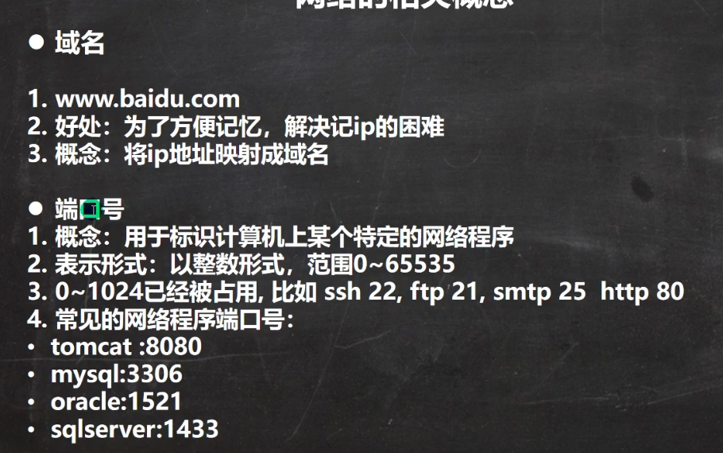

# 网络编程


# 网络基础


`java.net`包


ipv4地址分类：




端口号：用于标识一个特定进程，该进程和网络交流并得到数据都是通过当前端口。用来区分进程。


# java网络编程


## InetAddress


```java
//获取本机ip地址
InetAddress localHost = InetAddress.getLocalHost();
System.out.println(localHost); //LAPTOP-NE8H2DAN/172.23.99.163

//根据指定的主机名  获取InetAddress对象
InetAddress byName = InetAddress.getByName("LAPTOP-NE8H2DAN");
System.out.println(byName);//LAPTOP-NE8H2DAN/192.168.150.1


//根据域名返回一个InetAddress对象
InetAddress baidu = InetAddress.getByName("www.baidu.com");
System.out.println(baidu);//www.baidu.com/182.61.200.6

//通过InetAddress反向获取对应的地址
System.out.println(baidu.getHostAddress());//IP:182.61.200.6

//通过InetAddress反向获取主机名 / 域名
System.out.println(baidu.getHostName()); //www.baidu.com
```


## Socket


服务器处于监听的状态

当需要通讯时（**读写数据**） **两侧都有socket**

- socket.getOutputStream()
- socket.getInputStream()


 

- TCP编程：可靠

- UDP编程：不可靠


## TCP网络通信编程


### 字节流


> ServerSocket可以创建很多socket，**多个客户端都向该server发起socket连接**，通过`ServerSocket.accept()`来创建很多个socket。


```java
public class client {

    public static void main(String[] args) throws IOException {

        //连接服务端 （ip，端口）
        //连接服务器的9999端口，如果连接成功，返回一个socket对象
        Socket clientSocket = new Socket(InetAddress.getLocalHost(), 9999);

        System.out.println("客户端：" + clientSocket.getClass());

        //发送 hello server给服务端
        //得到和clientsocket对象关联的输出流对象，——>一定要是关联的OutputStream
        OutputStream outputStream = clientSocket.getOutputStream();
        outputStream.write("hello server".getBytes(StandardCharsets.UTF_8));

        //关闭流对象和socket
        outputStream.close();
        clientSocket.close();
        System.out.println("客户端退出了。。。。。。");


    }
}
```


```java
public class server {


    public static void main(String[] args) throws IOException {
        //在本机的9999端口监听
        //细节：要求9999端口没有被占用
        ServerSocket serverSocket = new ServerSocket(9999);
        System.out.println("服务端在9999端口监听，等待连接。。。");

        //当没有客户端连接9999端口时，程序会阻塞，等待连接
        //如果有客户端连接，则会返回Socket对象，程序继续
        Socket socket = serverSocket.accept();

        System.out.println("服务端：" + socket.getClass());

        //通过socket.getInputStream
        InputStream inputStream = socket.getInputStream();

        //IO读取
        byte[] buf = new byte[1024];
        int readLen = 0;
        while ((readLen = inputStream.read(buf)) != -1){
            //根据读取到的实际长度，显示内容
            System.out.println(new String(buf, 0, readLen));
        }

        //关闭流和socket
        inputStream.close();
        socket.close();
        System.out.println("服务端也退出了。。。。");
    }

}
```


- **服务器端是阻塞在读取吗？**

没有使用非阻塞的方式，如果服务端一直读不到，就会阻塞


----

服务端回传消息


**Socket和client都不知道对方什么时候读取结束**

**没有结束的标记**


***在发送完一个数据后，应该有一个结束的标记***

设置写入结束的标记：

`socket.shutdownOutput()`

**即：在手动关闭之前，发送数据的一方在手动close之前可以持续发送数据，接收方一直阻塞读取数据，直到：1.发送方关闭，停止读取；2.数据发送方发送了shutdownOutput指令，停止读取**

```java
public class server {


    public static void main(String[] args) throws IOException {
        //在本机的9999端口监听
        //细节：要求9999端口没有被占用
        ServerSocket serverSocket = new ServerSocket(9999);
        System.out.println("服务端在9999端口监听，等待连接。。。");

        //当没有客户端连接9999端口时，程序会阻塞，等待连接
        //如果有客户端连接，则会返回Socket对象，程序继续
        Socket socket = serverSocket.accept();

        System.out.println("服务端：" + socket.getClass());

        //通过socket.getInputStream
        InputStream inputStream = socket.getInputStream();

        //IO读取
        byte[] buf = new byte[1024];
        int readLen = 0;
        while ((readLen = inputStream.read(buf)) != -1){
            //根据读取到的实际长度，显示内容
            System.out.println(new String(buf, 0, readLen));
        }


        //服务端回传消息
        OutputStream outputStream = socket.getOutputStream();
        outputStream.write("hello,client!".getBytes(StandardCharsets.UTF_8));
        //结束标记
        socket.shutdownOutput();

        //关闭流和socket
        inputStream.close();
        outputStream.close();
        socket.close();
        System.out.println("服务端也退出了。。。。");
    }

}
```


```java
public class client {

    public static void main(String[] args) throws IOException {

        //连接服务端 （ip，端口）
        //连接服务器的9999端口，如果连接成功，返回一个socket对象
        Socket clientSocket = new Socket(InetAddress.getLocalHost(), 9999);

        System.out.println("客户端：" + clientSocket.getClass());

        //发送 hello server给服务端
        //得到和clientsocket对象关联的输出流对象，——>一定要是关联的OutputStream
        OutputStream outputStream = clientSocket.getOutputStream();
        outputStream.write("hello server".getBytes(StandardCharsets.UTF_8));
        outputStream.write("hello server111".getBytes(StandardCharsets.UTF_8));

        //设置结束标记
        clientSocket.shutdownOutput();


        //接收服务端回传的消息
        InputStream inputStream = clientSocket.getInputStream();
        //IO读取
        byte[] buf = new byte[1024];
        int readLen = 0;
        while ((readLen = inputStream.read(buf)) != -1){
            //根据读取到的实际长度，显示内容
            System.out.println(new String(buf, 0, readLen));
        }

        //关闭流对象和socket
        outputStream.close();
        inputStream.close();
        clientSocket.close();
        System.out.println("客户端退出了。。。。。。");
    }
}
```


---

### 字符流


**需要使用转换流：**

- **`OutputStreamWriter(OutputStream)`, **

- **`InputStreamReader(InputStream)`**


结束标记： 这样也可以设置一个结束标记

```
writer.newLine() 换行符
```

要求对方要**使用readLine来读取**才能生效！


**相当于在socket传输使用的字节流外面套层壳转换为字符流。**

实际上socket传输时使用的还是字节流，在读取时将字节流转换为字符流再读取....


```java
public class server {


    public static void main(String[] args) throws IOException {
        //在本机的9999端口监听
        //细节：要求9999端口没有被占用
        ServerSocket serverSocket = new ServerSocket(9999);
        System.out.println("服务端在9999端口监听，等待连接。。。");

        //当没有客户端连接9999端口时，程序会阻塞，等待连接
        //如果有客户端连接，则会返回Socket对象，程序继续
        Socket socket = serverSocket.accept();

        System.out.println("服务端：" + socket.getClass());

        //使用字符流读取
        InputStream inputStream = socket.getInputStream();
        BufferedReader bufferedReader = new BufferedReader(new InputStreamReader(inputStream));

        String s = bufferedReader.readLine();
        System.out.println(s);


        //服务端回传消息
        OutputStream outputStream = socket.getOutputStream();
        OutputStreamWriter writer = new OutputStreamWriter(outputStream);
        BufferedWriter bufferedWriter = new BufferedWriter(writer);

        bufferedWriter.write("hello, Client 字符流！");
        //设置结束标记  插入换行符，表示写入的内容结束
        bufferedWriter.newLine();

        bufferedWriter.flush();//如果使用字符流，需要手动刷新，否则数据不会写入数据通道

        //关闭流和socket
        //关闭外层的流
        bufferedReader.close();
        bufferedWriter.close();
        socket.close();
        System.out.println("服务端也退出了。。。。");
    }

}
```


```java
public class client {

    public static void main(String[] args) throws IOException, InterruptedException {

        //连接服务端 （ip，端口）
        //连接服务器的9999端口，如果连接成功，返回一个socket对象
        Socket clientSocket = new Socket(InetAddress.getLocalHost(), 9999);

        System.out.println("客户端：" + clientSocket.getClass());


        //发送 hello server给服务端
        OutputStream outputStream = clientSocket.getOutputStream();

        OutputStreamWriter writer = new OutputStreamWriter(outputStream);
        BufferedWriter bufferedWriter = new BufferedWriter(writer);

        bufferedWriter.write("hello, Server 字符流！");
        //设置结束标记  插入换行符，表示写入的内容结束
        bufferedWriter.newLine();

        bufferedWriter.flush();//如果使用字符流，需要手动刷新，否则数据不会写入数据通道


        //接收服务端回传的消息
        InputStream inputStream = clientSocket.getInputStream();
        BufferedReader bufferedReader = new BufferedReader(new InputStreamReader(inputStream));

        String s = bufferedReader.readLine();
        System.out.println(s);

        //关闭流对象和socket
        //关闭外层流
        bufferedWriter.close();
        bufferedReader.close();
        clientSocket.close();
        System.out.println("客户端退出了。。。。。。");
    }
}
```


