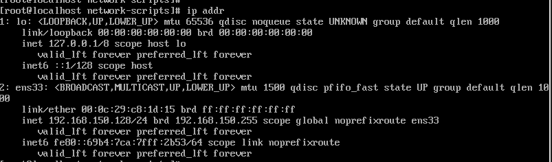

# 创建一台centos7虚拟机


选择2G内存


使用NAT模式：


## 配置静态ip


```bash
vi /etc/sysconfig/network-scripts/ifcfg-ens33
```


设置网卡引导协议为 `静态`

设置网卡启动方式为 `开机启动` 并且可以通过系统服务管理器 `systemctl` 控制网卡


网关：


ip地址范围，子网掩码


最主要的3个配置项[IP/子网掩码/网关]


**重启网络服务**

```bash
systemctl restart network
service network restart
```





ssh工具也可以成功连接了：


## java环境


**一定注意要下载对应系统的jdk包**


新版本jdk中没有jre目录

需要手动安装

```bash
bin/jlink --module-path jmods --add-modules java.desktop --output jre
```


```
vim /etc/profile
```


配置java环境变量

添加：

```properties
#set java environment
JAVA_HOME=/usr/java/jdk/jdk-11.0.10
JRE_HOME=/usr/java/jdk/jdk-11.0.10/jre
export PATH=$PATH:$JAVA_HOME/bin:$JRE_HOME/bin
export CLASSPATH=.:$JAVA_HOME/lib/dt.jar:$JAVA_HOME/lib/tools.jar:$JRE_HOME/lib
```


刷新配置

```
source /etc/profile
```


## 关闭防火墙


CentOS 7.0默认使用的是firewall作为防火墙

查看防火墙状态

```
firewall-cmd --state
```

停止firewall

```
systemctl stop firewalld.service
1
```

禁止firewall开机启动

```
systemctl disable firewalld.service 
```


## 安装mysql


下载并安装MySQL官方的 Yum Repository,Mysql版本8.0.20（5.7）

两个版本的安装方法：

```
wget -i -c ``http://dev.mysql.com/get/mysql80-community-release-el7-3.noarch.rpm

wget https://dev.mysql.com/get/mysql57-community-release-el7-11.noarch.rpm
```

下载后直接yum安装

```
yum -y install mysql80-community-release-el7-3.noarch.rpm

yum -y localinstall mysql57-community-release-el7-11.noarch.rpm
```

在线安装MySQL服务器

```
yum -y install mysql-community-server
```


安装完成后就会覆盖掉之前的mariadb


启动MySQL

```
systemctl start mysqld.service
```

查看MySQL运行状态

```
systemctl status mysqld.service
```


找出root初始密码

```
grep "password"/var/log/mysqld.log
vim /var/log/mysqld.log  中搜索
```

`S/u>j*3JV4h!`


l;ZlyZ?JL2%A

?NnpUW&x*9Ac

进入数据库：

```
mysql -uroot -p
```

输入密码（密码是上面查询到的 ,/wsw6gif;eH ），此时不能操作数据库，必须修改密码之后才能操作数据库

```
ALTER USER 'root'@'localhost' IDENTIFIED BY 'new password';
```

其中‘new password'替换成你要设置的密码，注意:密码设置必须要大小写字母数字和特殊符号（,/';:等）,不然不能配置成功


**开启mysql的远程访问**


执行以下命令开启远程访问限制（注意：下面命令开启的IP是 192.168.0.1，如要开启所有的，用%代替IP）,mysql8.0和以前的版本不一样，不能用原来的命令同时授权和创建用户：

```mysql
create user 'root'@'%' identified by 'Hcr123..';
grant all privileges on *.* to 'root'@'%' with grant option;
```

再输入以下两行命令

```mysql
flush privileges;
```


----


**Public Key Retrieval is not allowed**


https://blog.csdn.net/u013360850/article/details/80373604

在连接后面添加 `allowPublicKeyRetrieval=true`


# 坑


## 无法启动虚拟机


> 您的主机不满足在启用 Hyper-V 或 Device/Credential Guard 的情况下运行 VMware Workstation 的最低要求


解决办法：

修改注册表

https://blog.csdn.net/dling8/article/details/106809555?utm_medium=distribute.pc_relevant.none-task-blog-baidujs_title-0&spm=1001.2101.3001.4242


win+r ：msinfo32


这时就可以正常启动虚拟机了


