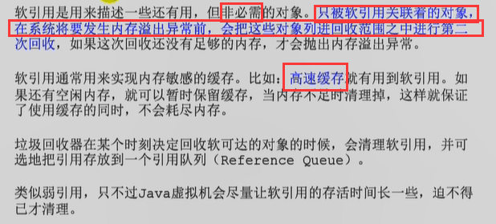
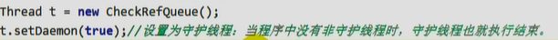

# 垃圾回收与算法

## 确定垃圾？

- **引用计数**，无法解决 **循环引用问题**
- **可达性分析**，通过一系列的 “GC Roots”对象作为起点搜索，如果一个对象不在引用链上，就称该对象是不可达的。  **不可达不等价于可回收，不可达对象变为可回收对象至少要经过两次标记过程**。

### GC Roots

- 虚拟机栈中的局部变量表中的局部变量、参数(方法接受的参数)

- 本地方法栈内引用的对象

- 方法区/堆 中**类静态属性**引用的对象，——> **引用类型的静态变量**

- 字符串常量池中的引用

- 类中使用final声明的**引用类型**字段（**final修饰 引用类型的变量，在对其初始化之后便不能再让其指向另一个对象。**）
- 被同步锁**synchronized**持有的对象
- java虚拟机内部的引用

  - 基本数据类型对应的Class对象，常驻的异常对象，系统类加载器AppClassLoader

## 垃圾回收算法

- 标记清除算法  Mark-Sweep
  - 两个阶段：标记（可达性分析，找到所有可达对象）和清除
  - 所谓的清除***并不是真正的置空***，而是把**需要清除的对象地址保存在空闲的地址列表**里。下次有新对象需要加载时，判断垃圾的位置空间是否够，如果够就存放，不够就OOM
  - **问题：内存碎片化严重，大对象找不到可利用的空间**

- 复制算法

  - 解决内存碎片化

  - 安内存容量将内存划分为等大小的两块，每次只使用其中一块

  - 在垃圾回收时，将**正在使用的内存中的存活对象复制到未被使用的内存块中**，之后**清除正在使用的内存块的所有对象**，交换两个内存的角色，最后完成垃圾回收

  - **问题：将可用内存压缩到了原本的一半，存活对象变多，复制算法的效率降低**

  - > 对于G1这种分拆成为大量region的GC，**复制**而不是移动，意味着GC需要维护region之间**对象引用关系（对象引用地址需要调整）**，不管是内存占用还是时间开销也不小

- 标记整理算法  Mark-Compact
  - 将存活的对象移向内存的一端，然后清除其他对象

- 分代收集算法
  - 根据区域不同选择不同的算法：老年代每次垃圾回收时只有少量对象需要被回收，新生代的特点是每次垃圾回收时都有大量垃圾需要被回收
  - 新生代===>复制算法，Eden，From， To，进行回收时，将Eden和From中存活的对象复制到另一块Survivor空间To中
  - 老年代===>标记整理算法
    - 对永久代的回收主要包括废弃常量和无用的类
    - 如果To Space无法存储某个对象，就会存储到老年代
    - 默认年龄达到15，就会被移到老年代中

## 四种引用类型

- 强引用
  - 强引用可以**直接访问目标对象**
  - 只要一个对象处于可达状态并且被强引用变量引用时，就不可能被垃圾回收机制回收，造成java内存泄漏的主要原因之一

- 软引用
  - 使用 `SoftReference`类来实现，内存足够时它不会被回收，不足时会被回收
  - **在第一次回收（不可触及的对象）后，还不够，那么就回收软引用。**
  - 在报OOM之前，GC会**回收软引用的可达对象**。

- 弱引用
  - `WeakReference`类，只要垃圾回收机制一运行，不管jvm的内存空间是否足够，总会回收该对象

- 虚引用
  - `PhantomReference`类，不能单独使用，必须和**引用队列联合使用。**
  - **无法通过虚引用get到对象**
  - 用于**跟踪对象被垃圾回收的状态**
  - 当垃圾回收器准备回收一个对象时，如果发现**它还有虚引用**，就会在回收对象**后**，**将这个虚引用加入引用队列，以   通知应用程序对象的回收情况！**

使用一个分线程来操作引用队列：

**当下面的gc操作执行的时候，一旦将obj对象回收掉了，就会将此虚引用存放到引用队列中，通过对该引用队列操作，可以获取到强引用对象obj的回收信息——实现追踪！**

主线程结束，守护线程执行结束！

## 分代收集 & 分区收集算法

