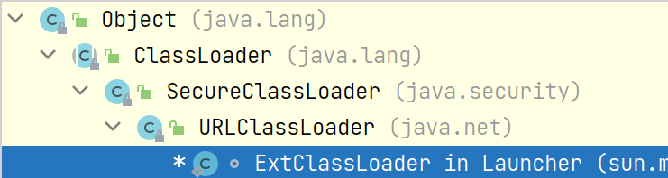

# JVM内存区域


线程私有区域：（**生命周期与线程相同**）

- 虚拟机栈
- 程序计数器
- 本地方法栈


线程共享区域：（**随虚拟机的启动/关闭而创建/销毁**）

- 方法区
- 堆


NIO可以直接使用`Native函数`直接分配**堆外内存**，使用DirectByteBuffer对象作为这块内存的引用进行操作，避免java堆和native堆中来回复制数据


**<u>本地方法栈</u>**为Native方法服务


方法区 and 永久代：

- **永久代逻辑上不属于堆，但物理上还是使用的堆空间**

- 存储类信息，常量，静态变量，即时编译器编译后的代码
- **使用堆的永久代来实现方法区**

- GC不会在主程序运行期间对永久代进行清理，永久代区域会随着加载的Class的增多而胀满，最终->**OOM**


元空间：

- **元空间使用本地内存**，大小仅受**本地内存**限制
- 类的元数据放入直接内存中
- **字符串常量池和类的静态变量放入java堆中**，这样可以加载多少类的元数据就可以由系统的实际可用空间来控制

- 元空间中存放：类常量(static final)，类型信息，域信息，方法信息


# 垃圾回收与算法


## 确定垃圾？


- **引用计数**，无法解决 **循环引用问题**
- **可达性分析**，通过一系列的 “GC Roots”对象作为起点搜索，如果一个对象不在引用链上，就称该对象是不可达的。  **不可达不等价于可回收，不可达对象变为可回收对象至少要经过「两次标记」过程**。


### GC Roots


- 虚拟机栈中的**局部变量表**中的局部变量、参数(方法接受的参数)

- 本地方法栈内引用的对象

- 方法区/堆 中**类静态属性**引用的对象，——> **「引用类型的静态变量」**

- 字符串常量池中的引用

- 类中使用final声明的**引用类型**字段（**final修饰 引用类型的变量，在对其初始化之后便不能再让其指向另一个对象，不可改变其引用。**）
- 被同步锁**synchronized**持有的对象
- java虚拟机内部的引用

  - 基本数据类型对应的Class对象，常驻的异常对象，系统**类加载器**AppClassLoader


## 垃圾回收算法


- 标记清除算法  Mark-Sweep
  - 两个阶段：标记（可达性分析，找到所有可达对象）和清除
  - 所谓的清除***并不是真正的置空***，而是把**需要清除的对象地址保存在空闲的「地址列表」**里。下次有新对象需要加载时，判断垃圾的位置空间是否够，如果够就存放，不够就OOM
  - **问题：「内存碎片化」严重，大对象找不到可利用的空间**


- 复制算法

  - 解决内存碎片化

  - 按内存容量将内存划分为等大小的两块，每次只使用其中一块

  - 在垃圾回收时，将**正在使用的内存中的存活对象复制到未被使用的内存块中**，之后**清除正在使用的内存块的所有对象**，交换两个内存的角色，最后完成垃圾回收

  - **问题：将可用内存压缩到了原本的一半，存活对象变多，复制算法的效率降低**

  - > 对于G1这种分拆成为大量region的GC，**复制**而不是移动，意味着GC需要维护region之间**对象引用关系（对象引用地址需要调整）**，不管是内存占用还是时间开销也不小


- 标记整理算法  Mark-Compact
  - 将存活的对象移向内存的一端，然后清除其他对象


- 分代收集算法
  - 根据区域不同选择不同的算法：老年代每次垃圾回收时只有少量对象需要被回收，新生代的特点是每次垃圾回收时都有大量垃圾需要被回收
  - **新生代===>复制算法**，分为三个部分：Eden，From， To，进行回收时，将Eden和From中存活的对象复制到另一块Survivor空间: To中
  - **老年代===>标记整理算法**
    - 对永久代(老年代)的回收主要包括废弃常量和无用的类
    - 如果To Space无法存储某个对象，就会存储到老年代
    - 默认年龄达到15，就会被移到老年代中


## 四种引用类型


- 强引用
  - 强引用可以**直接访问目标对象**
  - 只要一个对象处于可达状态并且被强引用变量引用时，就不可能被垃圾回收机制回收，造成java**内存泄漏**的主要原因之一


- 软引用
  - 使用 `SoftReference`类来实现，内存足够时它不会被回收，不足时会被回收
  - **在第一次回收（不可触及的对象）后，还不够，那么就回收软引用。**
  - 在报OOM之前，GC会**回收软引用的可达对象**。


- 弱引用
  - `WeakReference`类，只要垃圾回收机制一运行，不管jvm的内存空间是否足够，总会回收该对象


- 虚引用
  - `PhantomReference`类，不能单独使用，必须和**引用队列联合使用。**
  - **无法通过虚引用get到对象**
  - 用于**跟踪对象被垃圾回收的状态**
  - 当垃圾回收器准备回收一个对象时，如果发现**它还有虚引用**，就会在回收对象**后**，**将这个虚引用加入引用队列，以   通知应用程序对象的回收情况！**


使用一个分线程来操作引用队列：

**当下面的gc操作执行的时候，一旦将obj对象回收掉了，就会将此虚引用存放到引用队列中，通过对该引用队列操作，可以获取到强引用对象obj的回收信息——实现追踪！**


主线程结束，守护线程执行结束！


## 分代收集 & 分区收集算法


- 分代收集见上面。。。

- 分区收集算法
  - 将整个堆空间划分为**连续的不同小区间**，每个小区间**独立使用，独立回收**
  - 控制每次回收的量。每次合理回收若干个小区间，**不必一次回收整个堆，减少GC产生的停顿**


## GC垃圾收集器


新生代和老年代两部分   分别使用 <复制算法，标记清除算法>，<标记压缩算法>，因此提供了多种不同的垃圾收集器。


垃圾回收器组合：（更新到了jdk14）


- jdk7中这些组合都可以使用

- jdk8中红虚线被标记为deprecated，但仍然可以使用，jdk9中被removed，无法使用

- jdk14  绿色虚线被标记废弃，**CMS被移除**，

只剩下：

- Serial - Serial Old；

- Parallel Scavenge - Parallel Old；

- G1


---

- Serial垃圾收集器（**单线程，复制算法，新生代**）

进行垃圾收集的同时，暂停其他所有工作线程（STW），直到垃圾收集结束

适用于单线程


---

- ParNew垃圾收集器（**Serial + 多线程，新生代**）

Serial收集器的多线程版本，使用复制算法，**使用多线程进行垃圾收集**，也需要**暂停其他所有工作线程**

开启和CPU线程数目相同的线程数，`-XX:ParallelGCThreads`

除了多线程，和Serial收集器几乎完全一样。


---

- Parallel Scavenge收集器（**多线程复制算法，高效，新生代**）

**重点关注的是程序达到一个可控制的吞吐量**

**吞吐量Thoughput，CPU用于运行用户代码的时间 / CPU总消耗时间**，即吞吐量=运行用户代码时间  /  (运行用户代码时间+垃圾收集时间 )

最高效率利用CPU时间，尽快完成程序运行任务。

适用于后台运算，不需要太多交互的任务：***总的暂停时间可能较短，但一次暂停时间会更长，不适合交互任务***

> 若是注重低延迟，则需要频繁进行短暂的stw，那么总耗时肯定会更长


**<u>自适应调节策略</u>**


---

- Serial Old收集器（**单线程标记整理算法，老年代**）

运行在Client默认的java虚拟机默认的老年代垃圾收集器

作为CMS收集器的后备垃圾收集方案，也可以和新生代的Parallel Scavenge搭配使用

Serial + Serial Old搭配收集：


新生代收集器 Parallel Scavenge/ParNew  与 老年代 Serial Old搭配收集：


----

- Parallel Old收集器（**多线程标记整理算法**）

jdk1.6开始提供使用，在jdk1.6之前，Parallel Scavenge只能和Serial Old搭配使用，**只能保证新生代的吞吐量优先**，无法保证整体的吞吐量。

Parallel Old为了在老年代提供吞吐量优先。

系统对吞吐量要求高：

Parallel Scavenge 和 Parallel Old搭配使用：（**多线程收集，每次暂停时间可能较长，但能保证吞吐量**）


---

- CMS收集器（**多线程标记清除算法**）

Concurrent mark sweep，**老年代收集器**

**主要目标：获取最短垃圾回收停顿时间**。

和其他老年代使用标记整理算法不同————>它使用 **多线程的标记-清除算法**，最短的垃圾收集停顿实际那可以为***交互比较高***  的程序提高用户体验


> 第一款真正意义上的并发收集器，第一次实现了让垃圾收集线程与用户线程同时工作


- 初始标记  STW

- 并发标记

- 重新标记 STW

- 并发清理

- 重置线程


CMS的整个过程分为4个主要阶段：初始标记 、并发标记、重新标记、并发清除

- 初始标记阶段：在这个阶段中，程序中所有的工作线程都**会STW**，出现暂停。这个阶段的主要任务  **仅仅是标记处 GC Roots能<直接关联>到的对象**，一旦标记完成之后就会恢复之前被暂停的所有应用线程。由于直接关联对象比较小，***速度非常快*！**
- 并发标记阶段：从GC Roots的 **直接关联对象开始遍历整个对象图的过程**，这个过程 **耗时较长但是<*不需要停顿用户线程* >，用户线程可以与垃圾收集线程一起并发运行**
- 重新标记阶段：在并发标记阶段中，程序的工作线程会和垃圾收集线程**同时运行或者交叉运行**，因此为了  **<修正>并发标记期间，因用户程序继续运作而导致标记产生变动的那一部分对象的标记记录**，这个阶段的停顿时间通常会比初始标记阶段稍长一些，远比并发标记阶段的时间**短**。**这时候执行<STW>**
- 并发清除阶段：此阶段 **清理删除掉标记阶段判断的已经死亡的对象，释放内存空间**。由于***不需要移动存活对象***，所以**这个阶段也是可以与用户线程同时并发的**，不需要STW，问题——存在**内存碎片**


> 为啥说CMS是并发收集器呢？
>
> 因为耗时最长的  并发标记和并发清除过程中，垃圾收集线程可以和用户线程一起并发工作，**所以总体上来看CMS收集器的内存回收和用户线程是一起并发地执行**


---

- G1收集器（**年轻代+老年代，**）

> 当前内存和处理器不断增强变多，为了进一步降低暂停时间，**兼顾吞吐量**


相比CMS，Garbage First收集器的改进：

1. 基于 **标记-整理算法，不产生内存碎片**
2. 精确控制停顿时间，在不牺牲吞吐量的前提下，**实现低停顿垃圾回收**


G1收集器  **避免在整个堆中进行全区域的垃圾收集，把堆内存划分为大小固定的几个独立区域，跟踪这些区域的垃圾收集进度，维护一个优先级列表**，根据所允许的收集时间，**优先回收垃圾最多的区域**。

在**有限时间**获得最高的垃圾收集效率

使用CMS，在若干次CMS后进行碎片整理

Region之间是复制算法，保证腾出干净的Region


# IO


## 阻塞IO


用户线程发出IO请求后，内核回去查看数据是否就绪，阻塞等待数据就绪。

数据就绪之后，内核将数据拷贝到用户线程，返回结果。


## 非阻塞IO模型


发起read操作后，不等待，马上得到一个结果，while循环read()，直到返回值不为-1，将数据拷贝


非阻塞的 read，指的是在数据到达前，即数据还未到达网卡，或者到达网卡但还没有拷贝到内核缓冲区之前，这个阶段是非阻塞的。

当数据已到达内核缓冲区，此时调用 read 函数仍然是阻塞的，需要等待数据***从内核缓冲区拷贝到用户缓冲区，才能返回***。


**while循环需要不断去询问内核数据是否就绪，占用大量CPU资源**


## 多路复用IO模型


java NIO就是多路复用IO。

**有一个线程不断去轮询多个socket的状态，只有当socket真正有读写事件时，才会调用IO读写操作**


===> **一个线程管理多个socket**，不需要建立新的进程或者线程，有读写事件时，才会使用IO资源。

在NIO中，通过 `selector.select()`查询每个通道是否有到达事件，没有事件就 **一直阻塞**，**会导致用户线程的阻塞**。


> 最重要的一点，
>
> - 非阻塞IO模型是在while循环中，不断循环read()函数，询问socket状态，**通过用户态的while循环来进行系统调用**
> - IO多路复用是一次系统调用 + 内核层遍历文件描述符，轮询每个socket状态是在内核进行的，效率比用户线程高很多


缺点：IO多路复用通过<**轮询**>来检测是否有时间到达，并**对事件逐一响应。**一旦事件响应体很大，导致后续的事件迟迟得不到处理，影响新的事件轮询


## 信号驱动IO模型


给对应的socket注册一个信号函数，然后童虎新城会继续执行，当内核数据就绪时会发送一个信号给用户线程，用户线程收到信号后，在信号函数中调用IO读写操作


## 异步IO模型


用户发起read操作后，立刻去做其他的事。

从内核角度，当内核收到asynchronous read之后。立刻返回，说明read请求成功发起，**不会对用户线程产生任何block**。内核等待数据准备完成，将数据拷贝到用户线程，内核会给用户线程发送一个信号。

**用户线程完全不需要实际的整个IO操作如何进行的，只需要发起一个请求，接收内核返回的成功信号，然后就可以使用数据了**

用户线程不需要再次调用IO函数进行具体的读写，（信号驱动模型需要调用IO函数进行实际的读写操作），收到信号表示IO操作已经完成，不需要再在用户线程中调用IO函数进行实际的读写操作


> 异步IO需要操作系统的底层支持，jdk1.7中，提供了 Asynchronous IO


## Java IO包


## Java NIO


NIO有三大核心部分：Channel，Buffer，Selector。NIO基于Channel和Buffer进行操作，数据总是从**通道读取到缓冲区，或者从缓冲区写入到通道中**

> IO是面向流的，NIO是面向缓冲区的


---

传统IO意味着从流中读取字节，没有被缓存在任何地方，也不能前后移动流中的数据。NIO数据读取到一个缓冲区，可以在缓冲区中前后移动读取数据，**更加灵活**


---

IO的各种流是阻塞的，当线程调用read() / write()时，线程被阻塞，直到有数据被读取或数据完全写入。

NIO的非阻塞模式，使一个线程从某个channel发送请求读取数据，**它仅能得到目前可用的数据，如果没有数据可用，就读到个 -1**，然后这个线程继续进行下个动作，往往这些非阻塞的读写动作都是在while循环中，可以继续执行下个socket的读操作查看是否可读。下一轮如果这个socket可读就读取。

非阻塞IO的空闲时间就能用于在其他channel上执行IO操作，一个单独的线程现在可以管理多个输入和输出channel


## Channel


**Stream是单向的**，而Channel是双向的，读写都可以

NIO中的Channel：

1. FileChannel
2. DatagramChannel （udp）
3. SocketChannel
4. ServerSocketChannel  


## Buffer


**缓冲区，实际上是一个容器，是一个连续数组。Channel提供从文件、网络获取数据的渠道，但是读取或写入的数据都必须经由Buffer**


在 NIO 中， Buffer 是一个顶层父类，它是一个抽象类，常用的 Buffer 的子类有：ByteBuffer、 IntBuffer、 CharBuffer、 LongBuffer、 DoubleBuffer、 FloatBuffer、ShortBuffer  


## Selector


**Selector能够检测出多个注册的通道上是否有事件发生，如果有事件发生，获取事件然后针对每个事件进行响应的响应处理。**

只用一个单线程就可以管理多个通道，管理多个连接。也不必为每个连接都创建一个线程


# JVM类加载机制


加载  -> 链接（验证，准备，解析）-> 初始化


## 加载


加载阶段会在内存中生成一个**代表这个类的java.lang.Class对象**，作为**方法区**这个类的各种数据的入口，

也不一定必须从Class文件获取，ZIP，jar，war，运行时计算生成（**动态代理**），jsp文件转换成Class类都可以


## 链接


- 验证

**确保Class文件的字节流中包含的信息是否符合当前虚拟机的要求，并且不会危害虚拟机自身的安全**


- 准备

为类变量分配内存并设置类变量的初始值阶段，在**方法区中分配这些变量所使用的内存空间**，

```
public static int x = 8080
```

**那么这个变量x在准备阶段过后的初始值为0，而不是8080**，将x赋值为8080的 `put static`操作是在程序被编译后，**存放于类构造器<clinit>方法之中，负责对类变量进行初始化**


***这里不包含用 final修饰的 static，因为final在编译的时候就会分配了——>保存在class文件中的常量池，准备 prepare阶段会显式初始化***

```
public static final int x = 8080
```

在编译阶段会为 x 生成ConstantValue属性，在  **准备阶段**  虚拟机会根据ConstantValue属性将 x 赋值为8080


- 解析

**虚拟机将常量池中的符号引用替换为直接引用的过程**，符号引用就是class文件中的 CONSTANT_Class/Fieldref/Methodref_info，


---

- **字面量** & **符号引用**

常量池表中元素可能是这些常量类型的任何一个

使用标识tag在表中表示具体是哪个类型


- 符号引用
  - 类和接口的全限定名
  - 字段的名称和描述符
  - 方法的名称和描述符
  - 符号引用的目标并不一定要已经加载到内存中


- 直接引用
  - **指向目标的指针**
  - **相对偏移量或能简介定位到目标的句柄**
  - 有直接引用的话那么 **引用的目标必定已经在内存中存在**


----


## 初始化


类加载的最后一个阶段，除了在加载阶段可以自定义类加载器意外，其他操作都由jvm主导。初始阶段执行类中定义的java代码。


初始化阶段是 **执行类构造器<clinit>方法的过程**


<clinit>方法是 javac编译器自动收集类中的所有**类变量（static）的赋值动作和静态代码块（static）**中的语句合并而成。

> 并且：虚拟机会**保证子类<clinit>方法执行之前，父类的<clinit>方法已经执行完毕**，
>
> **如果一个类中没有对静态变量赋值也没有静态语句块，那么编译器可以不为这个类生成<clinit>方法**
>
> 父类的static变量总是比子类的static变量**更早初始化**


注意以下几种情况不会执行类初始化：

1. 通过子类**引用父类的静态字段**，只会触发父类的初始化，而不会触发子类的初始化。
2. 定义**对象数组**，不会触发该类的初始化。 `public static int[] x;`不会生成<clinit>方法
3. **常量 final**在编译期间会存入调用类的常量池中，本质上并没有直接引用定义常量的类，不会触发定义常量所在的类。
4. 通过**类名获取 Class 对象**，不会触发类的初始化。
5. 通过 `Class.forName` 加载指定类时，如果指定`参数initialize` 为 false 时，也不会触发类初始化，其实这个参数是告诉虚拟机，**是否要对类进行初始化。**
6.  通过 ClassLoader 默认的 loadClass 方法，也不会触发初始化动作  


## 类加载器


JVM中的加载类器只有两种：

- 引导类加载器 Bootstrap

  C和C++编写

- 自定义类加载器 User-Defined

  java编写，且继承自 java.lang.ClassLoader


---

启动类加载器 `Bootstrap ClassLoader`

- 使用C/C++语言实现，嵌套在JVM内部
- 用来接下载Java核心类库（JAVA_HOME/jre/lib/rt.jar、resources.jar），用于提供***JVM自身需要的类***
- 并不继承自`java.lang.ClassLoader`，没有父加载器
- 启动类加载器  **加载扩展类和应用程序类加载器**，并指定他们的父类加载器
- Bootstrap启动类加载器只加载包名为java,javax,sun等开头的类


---

**扩展类加载器（Extention ClassLoader）**

- **==Java语言编写==**，sun.misc.Luncher.ExtClassLoader（Luncher类的内部类）
- 派生于ClassLoader类
- 父加载器为启动类加载器，但在java代码中无法获取到这个启动类加载器对象（C语言编写）
- java.ext.dirs，jre/lib/ext子目录下加载类库。**如果用户创建的jar放在此目录下，也会自动由扩展类加载器加载**




---

**应用程序类加载器（系统类加载器，AppClassLoader）**

- **==Java语言编写==**，sun.misc.Luncher.AppClassLoader
- 派生于ClassLoader类
- 父加载器为扩展类加载器
- 复杂加载环境变量**==classpath==**或系统属性  java.class.path指定路径下的类库
- **该类加载器是程序中默认的类加载器**，一般来说，Java应用都是由它来完成加载
- 通过`getSystemClassLoader()`方法来获取


## 双亲委派


**当一个类收到了类加载请求，首先不会尝试自己去加载这个类，而是把这个请求委派给父类去完成**。每一层类加载器都是如此，因此所有的加载请求都应该传送到启动类加载器中，只有当 **父类加载器自己无法完成这个请求的时候（它的加载路径下没有找到所需加载的class文件），子类加载器才会尝试自己去加载**


双亲委派的好处：

加载位于rt.jar包中的类`java.lang.Object`，不管哪个加载器加载这个类，最终都是委派给顶层的Bootstrap类加载器进行加载，**保证了使用不同的类加载器最终得到的都是同样一个Object对象**


## OSGI


Open Service Gateway Initiative，面向java的动态模型系统，是java动态化系统的一系列规范


# Java的实例化顺序（程序执行顺序）


**静态和非静态分开处理**


静态加载：**按照代码先后顺序，**

- 静态变量
- 静态代码块

非静态加载顺序：书写顺序加载执行

静态方法，实例方法只有在调用的时候才会去执行

当静态加载中遇到需要**加载非静态**的情况： **先加载非静态再加载静态**。


-----

**不涉及父类子类的情况：**

1. 首先将所有静态成员加载进来，**但是不赋值，JVM会根据属性的数据类型第一时间赋「默认值」**
2. 然后再赋值，即：加载静态变量，分配内存赋值，静态变量，静态块的加载，没有优先级之分，按照书写先后顺序加载

> 「链接」阶段：
>
> - 「准备」：为类变量**分配内存**并且设置该类变量的默认初始值：**==零值==**
>
> 「初始化」阶段：
>
> - 执行类构造器方法`<clinit>()`
> - javac编译器自动收集类中的所有**类变量（static）的赋值动作和静态代码块（static）**中的语句合并而来


**涉及父类的情况：**

​	父静态 -> 子静态，加载时**不涉及构造方法**,只有使用new才会涉及到构造方法


### main


Java程序运行时，第一件事情就是试图访问main方法，因为main相等于程序的入口，如果没有main方法，程序将无法启动，**main方法更是占一个独立的线程**，

> 找到main方法后，是不是就会执行mian方法块里的第一句话呢？不是！

**main方法虽然也是一个特殊的静态方法，但还是静态方法，此时JVM会加载main方法所在的类，试图找到类中「其他静态部分」，即首先会找main方法所在的类。**


```java
public class JVMTest {
	
	static{
		System.out.println("Main 方法所在静态代码块 static1");
	}
	
    public static void main(String[] args) {
    	 System.out.println("main start");
        A a = new A();
        System.out.println(A.width);
        System.out.println(a.width);
    }
	static{
		System.out.println("Main 方法所在静态代码块 static2");
	}
}
 
class A{
    public static int width = 100;
 
    static{
        System.out.println("静态初始化类A");
        // 覆盖上面的100
        width = 30; 
    }
 
    public A(){
        System.out.println("创建A类的对象");
    }
}
```

```
Main 方法所在静态代码块 static1
Main 方法所在静态代码块 static2

main start

静态初始化类A
创建A类的对象

30
30
```


### 静态变量声明一定放在使用前面


### 父类、子类加载顺序


> 普通代码块就相当于一个 **「一定会运行的实例方法」**，在类构造函数之前运行


```java
public class JVMParent {
	
	 public static int width = 100;
	 
	 public static int count;
	 
      // 4.执行父类构造函数之前，先执行构造代码块
	 {
		 System.out.println("parent no static code block :" + count);
	 }
	 
	 static{
		 System.out.println("parent static's count:" + count); //1. 100
	 }
	 
	 JVMParent(int a){
		 System.out.println("parent init one parameter");
	 }
	 
     // 5.执行父类无参构造函数
	 JVMParent(){
		 System.out.println("parent init");
	 }
	 
}
```


```java
public class JVMSon extends JVMParent {
	
	 // 6.执行子类构造代码块  
     // count=0，子类可以访问父类的静态变量
	 {
		 System.out.println("son no static code block :" + count);
	 }
 	
    //2. 按顺序加载静态代码块
	static {
		System.out.println("son static 1"); 
	}
 
	public static int count1;
 
 	// 7.子类构造函数
	JVMSon() {
		System.out.println("son init:" + count);
	}
 
    //3.按顺序加载静态代码块
	static {
		System.out.println("son static 2");
	}
 	
    // 0.运行子类的main之前，「需要先加载父类的静态」
	public static void main(String[] args) {
		System.out.println("son main start");//4.
        //实例化子类，先实例化父类
		JVMSon a = new JVMSon();
 
	}
 
}
```


执行顺序：

1. 加载Main方法，先要加载包含Main方法的类，加载类就要先加载该类的父类静态变量，静态代码块（按照书写先后顺序），然后才是子类静态变量，静态代码块

2. 执行main方法

3. main方法中调用子类构造函数：

   父类代码块 -> 父类构造函数 -> 子类代码块 -> 子类构造函数  


-----

:chestnut:

```java
public class Text {
    
    //按顺序初始化静态变量和静态块 k=10
    public static int k = 10;
    public int a = print("a");
    // 1.k=11,此时i和n都是默认值0，「还没有初始化」
    public static int b = print("b");//print:11:b   i=0    n=0
    public static Text t1 = new Text("t1");
    public static Text t2 = new Text("t2");
    public static int i = print("i");
    public static int n = 99;
    public int j = print("j");
    public int m = print("m");
 
    {
        print("构造块");
    }
    static {
        print("静态块");
    }
    
    public int l = print("l");
    public static int o = print("o");
    
    public Text(String str) {
        System.out.println("构造:" + (++k) + ":" + str + "   i=" + i + "    n=" + n);
        ++i;
        ++n;
    }
 
    public static int print(String str) {
        System.out.println("print:" + (++k) + ":" + str + "   i=" + i + "    n=" + n);
        ++n;
        return ++i;
    }
    
    public int p = print("p");
 
    // 0.main函数，开始加载类
    public static void main(String args[]) {
        Text t = new Text("init");
    }
}
```


执行顺序：

1. JVM类加载机制，类连接阶段分为：「验证，准备，解析」中的准备阶段：

   为类的类变量（静态变量，非对象变量）分配内存，并设置默认初始值，准备类中每个字段、方法和实现接口所需的数据结构，这里的「初始值」就是默认值，并不是指定的初始值，经过准备工作，类变量（静态变量）的初始值为：k =0; b=0; t1=null; t2=null; i=0; n=0;

2. JVM在类连接以后进行类的初始化，即给类变量赋值，按照静态属性的书写顺序执行

   a).`public static int k = 10;`   --> k=10

   b).`public static int b = print("b")`;  -->调用print("b")  print:11:b  i=0  n=0

   c).`public static Text t1 = new Text("t1");`  当加载静态变量是需要先**「加载构造器」**， 那就转为先**加载所有「非静态属性」**

   此时按照书写的顺序加载非静态：

```
//每次调用print都会将k, i, n  ++
public int a = print("a");  --》print:12:a   i=1    n=1
public int j = print("j");  --》print:13:j   i=2    n=2
public int m = print("m");  --》print:14:m   i=3    n=3

{
	print("构造块");
}
public int j = print("j");  --》print:16:l   i=5    n=5
public int m = print("m");  --》print:17:p   i=6    n=6
```

​		然后执行构造器

```
public Text(String str) {
    System.out.println("构造:" + (++k) + ":" + str + "   i=" + i + "    n=" + n);
    ++i;
    ++n;
}
--》构造:18:t1   i=7    n=7 
```

​	d). `public static Text t2 = new Text("t2");` 和c的过程一模一样， **「非静态的每次new新对象都加载一次」**

```
print:19:a   i=8    n=8
print:20:j   i=9    n=9
print:21:m   i=10    n=10
print:22:构造块   i=11    n=11
print:23:l   i=12    n=12
print:24:p   i=13    n=13
构造:25:t2   i=14    n=14
```

​	e). 两个静态的引用类型变量都初始化完成，继续静态变量的初始化

​		`public static int i = print("i"); `  ==> print:26:i  i=15  n=15

​	f). `public static int n = 99;`  ==> n=99

​	g). 静态块：

```
static {
	print("静态块");
}
==>print:27:静态块   i=16    n=99
```

​	h). `public static int o = print("o");` ==> print:28:o  i=17  n=100

​	i). 进入main函数中：

​	`Text t = new Text("init"); `

```
print:29:a   i=18    n=101

print:30:j   i=19    n=102

print:31:m   i=20    n=103

print:32:构造块   i=21    n=104

print:33:l   i=22    n=105

print:34:p   i=23    n=106

构造:35:init   i=24    n=107
```


# 各种代码块的作用和区别


## 构造代码块

在类中直接定义没有任何修饰符、前缀、后缀的代码块即为构造代码块。

**可以给对象进行初始化**


- new一个对象的时候**总是先执行构造代码块，再执行构造函数**
- :warning: 构造代码**不是在构造函数之前运行的**，它是**依托构造函数执行的**，**只有构造函数被调用，构造代码块才会执行**
- 可以「给所有对象进行初始化」

```java
public class demo1 {
    public static void main(String[] args) {
        Test test = new Test(3);  //构造代码块会在构造函数被调用时执行， 且在这个例子中比"this.id=id;"语句先执行，作用是给对象统一初始化数据;
        System.out.println(test);
    }
}
class Test{
    int id;
    String name;
    
    {
        // 会被后面构造函数中的覆盖，如果没有被覆盖，那成员变量就是这里赋的值
        this.id= 5;
        this.name = "测试";
        System.out.println("这是构造代码块");
    }
    
    public Test(int id){
        this.id = id;
    }

    public String toString(){
        return "name: "+this.name +"  ,   "+"id: "+ this.id ;
    }
    
}
```

```
这是构造代码块
name：测试，id：3
```


## 静态代码块


用static修饰的、{}括起来的代码段，用于对静态属性进行初始化

- **随着类的加载而执行，「只执行一次」，优先于构造函数**
- 静态代码块是给**「类」**初始化的，而构造代码块是给**「对象 / 实例」**初始化的
- 一个类可以有多个静态代码块


1. 静态代码块不能存在于任何方法体内。
2. 静态代码块不能直接访问静态「**实例变量和实例方法**」，需要通过「**类的实例对象**」来访问。


```java
public class demo01 {
    public static void main(String[] args) {
 
        Test t=new Test();
    }
}
class Test{
    {
        System.out.println("构造代码块");//2
    }
    public Test(){
        System.out.println("我是构造方法");//3
    }
    static {
        System.out.println("我是静态代码块");//1
    }
}
```


## 局部代码块


**在方法内部**


**用于限定变量的声明周期，及早释放变量，提高内存利用率**

```java
public void show(){
    {
        System.out.println("局部代码块运行！");
    }
}
```


