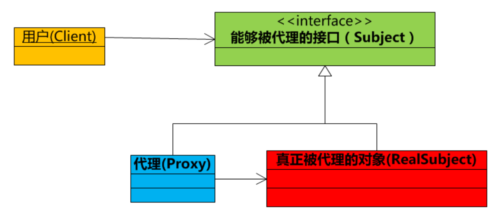

# Java异常


程序执行出现异常，退出方法，抛出一个封装了错误信息的对象。方法会立刻退出，后面的代码都无法执行了。


## 异常分类


Throwable 是 Java **所有错误或异常的超类，下一层分为 Error 和 Exception**


- Error

Error类是指 Java 运行时系统的内部错误和资源耗尽错误。**应用程序不会抛出该类对象**。如果出现了这样的错误，除了告知用户，剩下的就是**尽力使程序安全的终止**

----

- Exception（RunTimeException(UncheckedException)，CheckedException（实际不存在））

RuntimeException 如 ： NullPointerException 、 ClassCastException ； 一 个 是 检 查 异 常CheckedException，如 I/O 错误导致的 IOException、 SQLException。 RuntimeException 是那些可能在 Java 虚拟机**正常运行期间抛出的异常**的超类。 如果出现 RuntimeException，那么**一定是程序员的错误**  


检查异常 CheckedException： 一般是**外部错误(不是程序员的问题，需要手动捕捉)**，这种异常都发生在编译阶段， Java 编译器会强制程序去捕获此类异常，即会出现要求你把这段可能出现异常的程序进行 try-catch 或 throw，该类异常一般包括几个方面：

1. 试图在文件尾部读取数据
2. 试图打开一个错误格式的 URL
3. 试图根据给定的字符串查找 class 对象，而这个字符串表示的类并不存在  


## Throw 和 Throws


throws 用在函数上，后面跟的是这个方法中捕捉的**异常类**，

throw用在方法内，后面跟的是**异常对象**


**throws 用来声明异常**，让调用者只知道**该功能可能出现的问题**，可以给出预先的处理方式； throw 抛出具体的问题对象，**执行到 throw，功能就已经结束了**，***跳转到调用者***，**并将具体的问题对象抛给调用者**。也就是说 throw 语句独立存在时，下面不要定义其他语句，因为**执行不到**。  


throws 表示**出现异常的一种可能性**，并**不一定会发生这些异常**； throw 则是抛出了异常，***执行 throw 则一定抛出了某种异常对象***。  


两者都是**消极处理异常**的方式，只是抛出或者可能抛出异常，但是**不会由函数去处理异常**，真正的处理异常由函数的**上层调用处理**。  


# Java 反射


**动态语言**，程序在运行时可以改变其结构，引进新的函数，删除已有的函数等结构上的变化，js，ruby，py都是，java是半动态语言


----

**反射机制概念（运行状态中知道类所有的属性和方法）**


在 Java 中的反射机制是指在运行状态中，对于任意一个类都能够知道这个类**所有的属性和方法**；并且对于任意一个对象，都能够**调用它的任意一个方法**；这种**动态获取信息以及动态调用对象**方法的功能成为 Java 语言的反射机制  


---

**反射的应用场景**

**编译时类型和运行时类型**

java中许多对象在运行时都是会出现两种类型：编译时类型和运行时类型。

**编译时类型由  <声明对象时  使员工的类型来决定>，运行时类型由  <实际赋值给对象的类型决定>**

如：  `Person p = new Student();`，其中编译时类型为 Person，运行时类型为 Student。  


**编译时类型无法获取具体方法  **

运行时可能接收到**外部传入**的对象，该对象编译时 **类型为 Object，但是程序又需要调用该对象的运行时类型的方法。**

解决这些问题，***程序需要在运行时发现  对象和类的真实信息，才能够调用运行时类型的方法。***

如果编译时根本无法预知该对象和类属于哪些类，程序只能依靠运行时信息来发现该对象和类的真实信息。这时就必须使用反射了！


---

反射API

**反射API用来生成JVM中的类、接口或对象中的信息**

1. Class类：反射的核心类，可以获取类的属性，方法等信息
2. Field类：Java.lang.reflect包中的类，表示类的**成员变量**，可以用来获取和设置类之中的属性值
3. Method类：Java.lang.reflect包中的类，表示类的 **方法**，可以用来获取类中的方法信息或者执行方法
4. Constructor类：Java.lang.reflect包中的类，表示类的 **构造方法**


----

反射使用功能步骤（获取 Class 对象，调用对象方法）

1. 获取想要操作的类的Class对象，他是反射的核心，通过**Class对象**我们可以**任意调用类的方法**

2. 调用 Class 类中的方法，就是反射的使用阶段
3. 使用反射 Api来操作这些信息


---

**获取 Class 对象的 3 种方法**

- 调用某个对象的 getClass()方法  

```
Person p = new Person();
Class clazz = p.getClass();
```

- 调用某个类的 class 属性来获取该**类对应的 Class 对象**  

```
Class clazz=Person.class;
```

- 使用 Class 类中的 **forName()静态方法**(最安全/性能最好)  ，同时也将这个Class对象加载到内存中。

```
Class clazz=Class.forName("类的全路径"); (最常用)
```


当我们获得了想要操作的类的 Class 对象后，可以通过 Class 类中的方法获取并查看该类中的方法和属性。  

```java
Class clazz=Class.forName("reflection.Person");

Method[] method=clazz.getDeclaredMethods();

Field[] field=clazz.getDeclaredFields();

Constructor[] constructor=clazz.getDeclaredConstructors();

Constructor[] constructor=clazz.getDeclaredConstructors();
```


---

**创建对象的两种方法**


1. Class对象的 newInstance() 

**使用Class对象的newInstance()  方法来创建该Class对象对应类的实例，但是这种方法要求该Class对象对应的类有默认的空构造器**


2. 调用 Constructor 对象的 newInstance()

先使用 Class 对象获取指定的 **Constructor 对象**，再调用 Constructor 对象的 newInstance() 方法来创建 Class 对象对应类的实例,通过这种方法可以**选定构造方法创建实例**。  

```java

//获取 Person 类的 Class 对象
Class clazz=Class.forName("reflection.Person");

//使用.newInstane 方法创建对象
Person p=(Person) clazz.newInstance();

//获取构造方法并创建对象
Constructor c=clazz.getDeclaredConstructor(String.class,String.class,int.class);

//创建对象并设置属性
Person p1=(Person) c.newInstance("李四","男",20);
```


## class.forName 和 classLoader的区别


class.forName：

- 将类的.class文件加载到 jvm 中

- 对类进行解释，**执行类中的 static 块**


classLoader：

- 只干一件事：将.class文件加载到jvm中，不会执行static中的内容，**只有在newInstance才会去执行static块。**


Class.forName(className)：

- 内部调用的方法是 `Class.forName(className,true,classloader);`
  第2个boolean参数表示**类是否需要初始化**，  Class.forName(className)**默认是需要初始化。**
  一旦初始化，就会**触发目标对象的static块代码执行**，**static参数也也会被再次初始化。**


classLoader.loadClass(className)：

- 内部调用的方法是`ClassLoader.loadClass(className,false);`
  第2个 boolean参数，表示目标对象是否进行链接，**false表示不进行链接**，**链接阶段的准备过程对非final的静态变量初始化零值**，不进行链接意味着不进行包括初始化等一些列步骤，那么静态块和静态对象就不会得到执行


## 动态代理、静态代理的区别和使用场景


静态代理：**代理模式可以在不修改被代理对象的基础上，通过扩展代理类，进行一些功能的附加与增强。值得注意的是，代理类和被代理类应该共同实现一个接口，或者是共同继承某个类**

为什么叫做静态呢？因为它的类型是事先预定好的


区别：

静态代理通常只代理 **一个类**，动态代理是代理一个接口下的 **多个实现类**

静态代理事先知道要代理的是什么。动态代理不知道要代理什么东西，**只有在运行时才知道**


-----

动态代理是实现 JDK 里的 `invovationHandler` 接口的 `invoke` 方法，***<u>代理的是接口</u>***，也就是**业务类必须要实现接口**，通过 `Proxy` 里的 `newProxyInstance` 得到代理对象

还有一种动态代理：CGLIB，***<u>代理的是类</u>***，不需要业务类继承接口，**通过派生的子类来实现代理**，通过在运行时，动态修改字节码达到修改类的目的。**得到的代理类是被代理类的子类**


AOP 编程就是基于动态代理实现的，比如著名的 Spring 框架、Hibernate 框架等等都是动态代理的使用例子。


基本的动态代理：

```java
public static void main(String[] args) {
        InvocationHandler handler = new InvocationHandler() {
            @Override
            public Object invoke(Object proxy, Method method, Object[] args) throws Throwable {
                System.out.println(method);
                //对方法进行判断，来决定如何实现该方法
                if(method.getName().equals("morning")){
                    System.out.println("Good morning, " + args[0]);
                }
                return null;
            }
        };

        Hello hello = (Hello) Proxy.newProxyInstance(
                Hello.class.getClassLoader(),
                new Class[]{Hello.class},
                handler
        );

        hello.morning("Huang");
        /*
        自动生成了Method对象作为成员变量，调用这个method.invoke来调用动态代理生成的方法
        private static java.lang.reflect.Method com.test.$Proxy0.m1
        private static java.lang.reflect.Method com.test.$Proxy0.m2
        private static java.lang.reflect.Method com.test.$Proxy0.m3
        private static java.lang.reflect.Method com.test.$Proxy0.m0
         */
  System.out.println(Arrays.toString(hello.getClass().getDeclaredFields()));
        System.out.println( Hello.class.getClassLoader());
    }

    interface Hello {
        void morning(String name);
    }
```


在运行期动态创建一个`interface`实例的方法如下：

1. 定义一个**InvocationHandler**实例，它负责==实现接口的方法调用==；
2. 通过**Proxy.newProxyInstance()**创建**interface**实例，它需要3个参数：
   1. 使用的`ClassLoader`类加载器，通常就是**接口类的`ClassLoader`**；
   2. ***需要实现代理的接口数组***，至少需要*传入一个接口*  进去；
   3. 用来**<u>处理接口方法调用</u>**的InvocationHandler实例。
3. 将返回的`Object`**强制转型**为接口。

动态代理实际上是JDK在**运行期**动态创建**class字节码并加载的**过程，它并没有什么黑魔法，把上面的动态代理改写为静态实现类大概长这样：


==自动生成==了：

```java
public class HelloDynamicProxy implements Hello {
    //参数  handler
    InvocationHandler handler;
    public HelloDynamicProxy(InvocationHandler handler) {
        this.handler = handler; //这就是Proxy.newProxyInstance中传入的handler
    }
    
    //并不是内嵌了
    public void morning(String name) {
        //调用handler的invoke方法
        //invoke方法已经进行过重写  @override
        handler.invoke(
           this,
           Hello.class.getMethod("morning"),
           new Object[] { name });
    }
}
```

其实就是==JDK帮我们自动编写了一个上述类==（不需要源码，==**可以直接生成字节码**==）

> 并不存在可以直接实例化接口的黑魔法 :sweat_smile:


Java标准库提供了动态代理功能，允许在运行期动态创建一个接口的实例；

动态代理是**通过`Proxy`创建代理对象**，然后**将接口方法“代理”给`InvocationHandler`完成的（通过调用InvocationHandler来调用我们实际实现该接口的方法）。**


Spring AOP：通过动态代理，实现增强方法

```java
public static void main(String[] args) {

    //创建目标对象
    Target target = new Target();
    //获得增强对象
    Advice advice = new Advice();

    //返回值  就是动态生成的代理对象
    //代理对象和目标对象是兄弟关系，用接口来接收
    TargetInterface proxy = (TargetInterface) Proxy.newProxyInstance(
            target.getClass().getClassLoader(),//目标对象类加载器
            target.getClass().getInterfaces(),//目标对象相同的接口字节码对象数组
            new InvocationHandler() {
                @Override
                public Object invoke(Object proxy, Method method, Object[] args) throws Throwable {
                    advice.before();//前置增强
                    Object invoke = method.invoke(target, args);//执行目标方法
                    advice.after();//后置增强
                    return invoke;
                }
                //调用代理对象的任何方法，实质执行的都是invoke方法
            }
    );

    //调用代理对象的方法
    proxy.save();//save running
}
```


### InvocationHandler


InvocationHandler 内部只是一个 **invoke() 方法**，正是这个方法决定了怎么样处理代理传递过来的方法调用。

- proxy 代理对象
- method **代理对象调用的方法**
- args 调用的方法中的**参数**


因为，Proxy 动态产生的代理会调用 InvocationHandler 实现类，所以 InvocationHandler 是实际执行者。


## **类什么时候被初始化？**


- 创建一个类的实例，也就是 new 一个对象
- 访问一个类的 **静态变量**，或者对其赋值
- 调用类的 **静态方法**
- 反射（`Class.forName("com.hcx.load")`）
- 初始化一个类的子类（会首先初始化子类的父类）
- JVM 启动时标明的启动类，即文件名和类名相同的那个类


## 类的初始化步骤


1. 如果这个类没被加载和链接，先加载和链接
2. 如果这个类存在直接父类，且父类没被初始化，那么直接初始化父类（接口除外）
3. 如果类中存在**初始化语句：如 `static 变量`和 `static块`** ，**依次** 执行这些初始化语句

在一个类加载器中，类只能初始化一次


# Java 注解


Annotation 注解 是java提供的对源程序中元素关联信息和元数据  metadata的途径和方法。

Annotation是一个接口，程序可以通过**反射来获取**指定程序中元素的 Annotation 对象，然后通过该 Annotation 对象来**获取注解中的元数据信息**


---

四种标准元注解

元注解的作用是负责**注解其他注解**。 Java5.0 定义了 4 个标准的 meta-annotation 类型，它们被用来提供**对其它 annotation 类型作说明**。  


- `@Target` 修饰的**对象范围** 

@Target说明了Annotation所修饰的对象范围： Annotation可被用于 **packages**、 **types**（类、接口、枚举、 Annotation 类型）、**类型成员**（方法、构造方法、成员变量、枚举值）、方法参数和本地变量（如循环变量、 catch 参数） 。在 Annotation 类型的声明中使用了 target 可更加明晰其修饰的目标  

```java
@Target({ElementType.CONSTRUCTOR, ElementType.METHOD, ElementType.PARAMETER, ElementType.FIELD, ElementType.ANNOTATION_TYPE})
@Target({ElementType.TYPE})
```


- `@Retention` 定义 **被保留的时间长短**  

Retention 定义了**该 Annotation 被保留的时间长短**：表示需要在**什么级别**保存注解信息，用于描述注解的生命周期（即：被描述的注解**在什么范围内有效**），取值（RetentionPoicy）有：
 SOURCE:在**源文件**中有效（即源文件保留）
 CLASS:在 **class 文件**中有效（即 class 保留）
 RUNTIME:在**运行时**有效（即运行时保留）  

```java
@Retention(RetentionPolicy.RUNTIME)
@Retention(RetentionPolicy.SOURCE)
```


---

第一类是由编译器使用的注解   `RetentionPolicy.SOURCE`

> - `@Override`：让编译器检查该方法是否正确地实现了覆写；
> - `@SuppressWarnings`：告诉编译器忽略此处代码产生的警告。

这类注解不会被编译进入`.class`文件，它们***在编译后就被编译器扔掉了***。


第二类是由工具处理==.class==文件使用的注解  `RetentionPolicy.CLASS`

比如有些工具会在加载class的时候，**对class做动态修改**，实现一些特殊的功能。这类注解会被编译进入`.class`文件，但***加载结束后并  <不会存在于内存中 >***。这类注解只被一些**底层库使用**，一般我们不必自己处理。


第三类是在==程序**运行**期==**能够读取**的注解  `RetentionPolicy.RUNTIME` ，

它们在加载后一直**存在于JVM**中，这也是最常用的注解。例如，一个配置了`@PostConstruct`的方法会在**调用构造方法后自动被调用**（这是Java代码**读取该注解实现的功能**，JVM并不会识别该注解）。


- `@Documented` 描述  javadoc  

@ Documented 用于描述其它类型的 annotation 应该被作为被标注的程序成员的公共 API，因此可以被例如 javadoc 此类的工具文档化。  


- `@Inherited` 阐述了某个被标注的类型是被继承的  

@Inherited 元注解是一个标记注解， @Inherited 阐述了某个被标注的类型是**被继承的**。如果一个使用了@Inherited 修饰的 annotation 类型**被用于一个 class，则这个 annotation 将被用于该 class 的子类。**  


---

**注解处理器**

如果没有用来读取注解的方法和工作，那么注解也就不会比注释更有用处了。

使用注解的过程中，很重要的一部分就是创建于使用注解处理器。 Java SE5 扩展了**反射机制的 API**，以帮助程序员快速的**构造自定义注解处理器**。 下面实现一个注解处理器。  


```java
//定义注解
@Target(ElementType.FIELD)
@Retention(RetentionPolicy.RUNTIME)
@Documented
public @interface FruitProvider {
    /**供应商编号*/
    public int id() default -1;
    /*** 供应商名称*/
    public String name() default "";
    /** * 供应商地址*/
    public String address() default "";
}
```


```java
//注解使用
public class Apple {
    
	@FruitProvider(id = 1, name = "陕西红富士集团", address = "陕西省西安市延安路")
    private String appleProvider;
    
    public void setAppleProvider(String appleProvider) {
    	this.appleProvider = appleProvider;
    }
    
    public String getAppleProvider() {
    	return appleProvider;
    }
}

```

**注解处理器**

```java
//注解处理器

public class FruitInfoUtil {
    public static void getFruitInfo(Class<?> clazz) {
        String strFruitProvicer = "供应商信息： ";
        
        Field[] fields = clazz.getDeclaredFields();//通过反射获取处理注解
        for (Field field : fields) {
            //判断该field是否有FruitProvider这个注解？
            if (field.isAnnotationPresent(FruitProvider.class)) {
                //获得这个注解对象
                FruitProvider fruitProvider = (FruitProvider) field.getAnnotation(FruitProvider.class);
                //注解信息的处理地方
                strFruitProvicer = " 供应商编号： " + fruitProvider.id() + " 供应商名称： "
                + fruitProvider.name() + " 供应商地址： "+ fruitProvider.address();
                System.out.println(strFruitProvicer);
        	}
        }
    }
}


public class FruitRun {
    public static void main(String[] args) {
        FruitInfoUtil.getFruitInfo(Apple.class);
        /**************输出结果***************/
        // 供应商编号： 1 供应商名称：陕西红富士集团 供应商地址：陕西省西安市延
    }
}


```


# Java内部类


Java类中可以定义field和method，还可以定义类，**内部类**

内部类分为：**静态内部类，成员内部类，局部内部类，匿名内部类**四种


## 静态内部类


```java
public class Out {
    
    private static int a;
    private int b;
    
    public static class Inner {
        public void print() {
        	System.out.println(a);
        }
    }
}
```


1. 静态内部类可以访问外部类所有的静态变量和方法，即使是 private 的也一样。
2. 静态内部类和一般类一致，可以定义静态变量、方法，构造方法等。
3. 其它类使用静态内部类需要使用“**外部类.静态内部类**”方式，如下所示： Out.Inner inner =new Out.Inner();inner.print();
4. Java集合类HashMap内部就有一个静态内部类Entry。 Entry是HashMap存放元素的抽象，HashMap 内部维护 Entry 数组用了存放元素，但是 **Entry 对使用者是透明的**。像这种**和外部类关系密切的，且不依赖外部类实例的，都可以使用静态内部类**。  


## 成员内部类


定义在类内部的非静态类，就是成员内部类。

成员内部类**不能定义静态方法和变量**（final 修饰的除外）。这是因为成员内部类是非静态的， 类初始化的时候**先初始化静态成员**，如果允许成员内部类定义静态变量，那么**成员内部类的静态变量初始化顺序是有歧义的**。  


## 局部内部类  定义在方法中的类


定义在方法中的类，就是局部类。如果一个类只在某个方法中使用，则可以考虑使用局部类。  

```java
public class Out {
    private static int a;
    private int b;
    
    public void test(final int c) {
        final int d = 1;
        class Inner {
            public void print() {
            	System.out.println(c);
        	}
    	}
    }
}
```


## 匿名内部类


**匿名内部类必须要继承一个   父类或者是吸纳一个接口，当然也仅能继承一个父类或者实现一个接口。**

**没有class关键字，因为匿名内部类直接使用new来生成一个对象的引用**

`new Comparator<>(){public int compare(...)}`


```java
public abstract class Bird {
    private String name;
    
    public String getName() {
    	return name;
    }
    
    public void setName(String name) {
    	this.name = name;
    }
    
    public abstract int fly();
}
```


```java
public class Test {
    public void test(Bird bird){
        System.out.println(bird.getName() + "能够飞 " + bird.fly() + "米");
    }
    
    public static void main(String[] args) {
        Test test = new Test();
        //需要实现抽象类或者接口的方法，相当于 class Temp implements xxx / extends xxx{  @override ... }
        test.test(new Bird() {
            
            public int fly() {
                return 10000;
            }
            
            public String getName() {
                return "大雁";
            }
        });
    }
}
```


# Java 泛型


泛型提供了编译时类型安全检测机制，允许程序眼子啊编译时检测到非法的类型。

本质是：参数化类型，**所操作的数据类型被指定为一个参数**。

比如要写一个排序方法，需要对 整型、字符串数组进行排序，使用泛型


---

泛型方法

泛型方法在调用的时候可以**接收不同类型的参数**。根据传递给泛型方法的参数类型，编译器处理每个方法调用

```java
// 泛型方法 printArray
public static <E> void printArray( E[] inputArray )
{
    for ( E element : inputArray ){
    	System.out.printf( "%s ", element );
    }
}
```

> 1. <? extends T>表示该通配符所代表的类型是 **T 类型的子类**
> 2. <? super T>表示该通配符所代表的类型是 **T 类型的父类**  


----

泛型类 <T>

泛型类的声明和非泛型类的声明类似，在类名后面添加了类型参数声明部分。

泛型类的类型参数声明部分也**包含一个或多个类型参数**，参数间用逗号隔开。一个泛型参数，也被称为**一个类型变量**，是用于**指定一个泛型类型名称的标识符**。因为他们接受一个或多个参数，这些类被称为参数化的类或参数化的类型。  

```java
public class Box<T> {
    
    private T t;
    
    public void add(T t) {
    	this.t = t;
    }
    
    public T get() {
    	return t;
	}
}
```


---

类型通配符 ？

使用 ？ 代替具体的类型参数。如 ： List<?>在逻辑上是 List<String>, List<Integer> 等所有List<具体类型实参>的父类。


---

**类型擦除**

**java中的泛型基本上都是在编译器这个层次来实现的。在生成的java字节码中是不包含泛型中的类型信息的。**

使用泛型的时候加上的类型参数，会被编译器在编译的时候去掉。这个过程称为类型擦除

如在代码中定义的 List<Object>和 List<String>等类型，在**编译之后都会变成 List**。 JVM **看到的只是 List**，而由泛型附加的类型信息对 JVM 来说是不可见的。

类型擦除的基本过程也比较简单，首先是找到**用来替换类型参数的具体类**。（将所有的泛型参数用其最左边界（最顶级的父类型）类型替换）。这个具体类一般是 Object。如果指定了**类型参数的上界**的话，则使用这个上界。

**把代码中的类型参数都替换成具体的类**  


# Java序列化


---

- **持久化对象及其状态到内存或者磁盘**

在内训中创建可复用的java对象，但一般只有当JVM运行时这些对象才可能存在，这些对象的生命周期不会比JVM的生命周期更长

**在现实应用中，可能要求在JVM停止运行后能够保存（持久化）指定的对象，并在将来重新读取被保存的对象**


---

***序列化对象移字节数组保持，静态成员不保存***

使用 Java 对象序列化， 在保存对象时，会把其状态保存为一组字节，在未来， 再**将这些字节组装成对象**。必须注意地是， 对象序列化保存的是**对象的”状态”，即它的成员变量（静态变量是类变量，不是对象的成员变量）**。由此可知，对象序列化**不会关注类中的静态变量**  


---

***序列化用户远程对象传输***

**使用RMI（远程方法调用），或在网络中传递对象时，都会用到对象序列化**。java序列化API为处理对象序列化提供了一个标准机制。


---

***Serializable 实现序列化***

在 Java 中， 只要一个类**实现了 java.io.Serializable 接口**，那么它就可以被序列化  


---

通过 ObjectOutputStream 和 ObjectInputStream 对对象进行序列化及反序列化  

在类中增加 writeObject 和 readObject 方法可以实现自定义序列化策略。  


虚拟机是否允许反序列化，不仅取决于类路径和功能代码是否一致，一个非常重要的一点是**两个类的序列化 ID 是否一致**（就是 private static final long serialVersionUID）  


---

***Transient 关键字阻止该变量被序列化到文件中***


1. 在变量声明前加上 Transient 关键字，可以**阻止**该变量被序列化到文件中
2. 在被反序列化后，transient 变量的值被**设为初始值**，如int是0，对象是null
3. 服务器端给客户端发送序列化对象数据，对象中**有一些数据是敏感的**，比如密码字符串等，希望**对该密码字段在序列化时，进行加密**，而客户端如果拥有解密的密钥，只有**在客户端进行反序列化时**，才可以**对密码进行读取**，这样可以一定程度**保证序列化对象的数据安全**。  


## JAVA对象流序列化时的readObject，writeObject，readResolve是怎么被调用的


在很多涉及到通过JAVA对象流进行序列化和反序列化时，会看到下面的方法：

```java
private void writeObject(java.io.ObjectOutputStream s)throws java.io.IOException

private void readObject(java.io.ObjectInputStream s)throws java.io.IOException, ClassNotFoundException
```


在写我们的单例类时，如果使用的不是**枚举**的实现形式，为了保证反序列化出来后的对象，**不会破坏单例**的情况，我们还会经常看到下面的方法

```java
private Object readResolve()
```


---

问题来了：这些方法都是private的，并且在它们自身的类中，是没有调用的？那么到底有什么用？

这里用readObject()举例：


```java
public static void main(String[] args) throws Exception {
    Set<String> set = new HashSet<String>();
    set.add("11111");
    set.add("22222");
    System.out.println(set);

    try (ObjectOutputStream oos = new ObjectOutputStream(new FileOutputStream("C:\\set.obj"))) {
        oos.writeObject(set);
    }
    
    set.clear();
    System.out.println(set);
    
    try (ObjectInputStream ois = new ObjectInputStream(new FileInputStream("C:\\set.obj"))) {
        set = (Set<String>) ois.readObject();
    }

    System.out.println(set);
}
```

```
[11111, 22222]
[]
[11111, 22222]
```


HashSet源码：


整个用于保存信息的map是被用「**transient关键字**」修饰了的


但是，很明显我们的信息是有**被序列化成功**的，不然反序列化出来时，原本保存在set里面的信息就丢失了。

**真正的实现的秘密就在于上面提到的`readObject`方法与`writeObject`方法了**


----

这里仅简单介绍一下readObject方法，writeObject方法与其类似


```java
// HashSet.readObject
private void readObject(java.io.ObjectInputStream s)
    throws java.io.IOException, ClassNotFoundException {
    // Read in any hidden serialization magic
    s.defaultReadObject();

    // Read capacity and verify non-negative.
    int capacity = s.readInt();
    if (capacity < 0) {
        throw new InvalidObjectException("Illegal capacity: " +
                                         capacity);
    }

    // Read load factor and verify positive and non NaN.
    float loadFactor = s.readFloat();
    if (loadFactor <= 0 || Float.isNaN(loadFactor)) {
        throw new InvalidObjectException("Illegal load factor: " +
                                         loadFactor);
    }

    // Read size and verify non-negative.
    int size = s.readInt();
    if (size < 0) {
        throw new InvalidObjectException("Illegal size: " +
                                         size);
    }
    // Set the capacity according to the size and load factor ensuring that
    // the HashMap is at least 25% full but clamping to maximum capacity.
    capacity = (int) Math.min(size * Math.min(1 / loadFactor, 4.0f),
            HashMap.MAXIMUM_CAPACITY);

    // Constructing the backing map will lazily create an array when the first element is
    // added, so check it before construction. Call HashMap.tableSizeFor to compute the
    // actual allocation size. Check Map.Entry[].class since it's the nearest public type to
    // what is actually created.

    SharedSecrets.getJavaOISAccess()
                 .checkArray(s, Map.Entry[].class, HashMap.tableSizeFor(capacity));

    // Create backing HashMap
    map = (((HashSet<?>)this) instanceof LinkedHashSet ?
           new LinkedHashMap<E,Object>(capacity, loadFactor) :
           new HashMap<E,Object>(capacity, loadFactor));

    // Read in all elements in the proper order.
    for (int i=0; i<size; i++) {
        @SuppressWarnings("unchecked")
            E e = (E) s.readObject();
        map.put(e, PRESENT);
    }
}
```


读取正常应该被序列化的字段信息后，**再构造出一个map**，再通过对象流，将原有通过对象流写进文件里面的**map信息**（容量、每个item信息等）全部读取出来，然后**重新构造一个map**，这样就使得我们保存在set里面的信息，在经历过对象流的序列化和反序列化后，都没有丢失。


> **那么，这个是private 的 readObject方法是怎么被调用的呢？**


> 为什么诸如HashSet的类里面，要写private 的readObject方法？
>
> 因为对象流的读取过程中，它会通过**「反射」**的形式，调用private的readObject方法
>


----

```java
private void readSerialData(Object obj, ObjectStreamClass desc)
```

ObjectStreamClass是什么时候产生的呢？而`readObjectMethod`这个属性又是怎么得到的呢。

在`ObjectInputStream`类的`readOrdinaryObject`方法调用中：


```java
// java.io.ObjectStreamClass#ObjectStreamClass(java.lang.Class<?>)，ObjectStreamClass的构造函数

cons = getSerializableConstructor(cl);
// 获得private的readObject方法对象,方法名：readObject，方法参数类型：ObjectInputStream.class，方法返回类型：void
// 前两个是用于获取方法，返回类型判断是否是所需方法
readObjectMethod = getPrivateMethod(cl, "readObject",
                            new Class<?>[] { ObjectInputStream.class },
                            Void.TYPE);

// 反射拿到readResolve方法
readResolveMethod = getInheritableMethod(cl, "readResolve", null, Object.class);
```


```java
//ObjectInputStream#readOrdinaryObject方法
//得到ObjectStreamClass对象
ObjectStreamClass desc = readClassDesc(false);
//得到所需的对象实例
obj = desc.isInstantiable() ? desc.newInstance() : null;
readSerialData(obj, desc);

//调用readResolve方法
Object rep = desc.invokeReadResolve(obj);

//ObjectInputStream#readSerialData方法，在readOrdinaryObject方法中
slotDesc.invokeReadObject(obj, this);

//java.io.ObjectStreamClass# invokeReadObject
// 反射调用，执行readObject方法
readObjectMethod.invoke(obj, new Object[]{ in });
```


ObjectInputStream类的readOrdinaryObject方法，在调用完readSerialData（）方法后，就调用了 ObjectStreamClass类的Object invokeReadResolve(Object obj)方法，通过反射调用了我们自己写的readResolve方法


## 反序列化机制破解单例模式


**枚举除外**


```java
public class BreakSingleton{

  public static void main(String[] args) throws Exception{

     //先根据单例模式创建对象(单例模式所以s1,s2是一样的)
     Singleton s1=Singleton.getInstance();
     Singleton s2=Singleton.getInstance();

//将s1写入本地某个路径
     FileOutputStream fos=new FileOutputStream("本地某个路径下文件");
     ObjectOutputStream oos=new ObjectOutputStream(fos);
     oos.writeObject(s1);
     oos.close();
     fos.close();

//从本地某个路径读取写入的对象
     ObjectInputStream ois=new ObjectInputStream(new FileInputStream("和上面的本地参数路径相同"));
    Singleton s3=(Singleton) ois.readObject();
     System.out.println(s1);
     System.out.println(s2);
     System.out.println(s3);//s3是一个新对象
}
 
}
```


避免实现序列化单例模式的漏洞：

```java
class Singleton implements Serializable{

    private static final Singleton singleton = new Singleton(); 

    private Singleton() {
    }
    public static Singleton getInstance(){
        return singleton;
    }


    //反序列化定义该方法，则不需要创建新对象
    private Object readResolve() throws ObjectStreamException{
        return singleton;
    }
}
```


# Java 复制


将一个对象的引用复制给另一个对象，三种方式：

1. 直接赋值
2. 浅拷贝
3. 深拷贝


---

1. 直接赋值复制。

直接赋值。A a1 = a2，这实际上是复制的引用，**a1 和 a2指向的是同一个对象**。a1变化时，a2也会跟着变化


2. 浅拷贝。复制引用但不复制引用的对象

创建一个新对象，然后将当前对象的非静态字段复制到该新对象。

**如果字段是值类型的（基本类型），那么对该字段执行复制；如果该字段是引用类型的话，则复制引用但不复制引用的对象，因此，原始对象机器副本引用同一个对象**


3. 深拷贝。复制对象和其引用对象

深拷贝不仅复制对象本身，而且复制对象包含的引用指向的所有对象。  


---

**序列化**（**深拷贝一种实现**）

在java语言里深拷贝一个对象，常常可以先使对象实现Serializable接口，然后把对象吓到一个流里，再读出来，便可以重建对象


# Java关键字


### final 常量

1. final修饰变量，则等同于**常量**，**变量的指向（引用地址）不可变**
2. 声明时未初始化的 final 变量，称为空白 final 变量(blank final variable)，**必须在构造器中进行初始化**，或者调用 this() 初始化，否则，编译器会报错final变量(变量名)需要进行初始化。
3. **final 成员变量**，必须在**声明的时初始化**或者在**构造器中初始化**，否则报编译错误。
4. final变量是 **只读的**
5. final修饰方法中的参数，称为最终参数。
6. final修饰类，则类**不能被继承**。final类通常是功能完整的，不能被继承，Java 中有许多类是 final 的，比如 **String, Interger** 以及其他包装类
7. final修饰方法，则方法**不能被重写**。
8. 对于集合对象声明为 final 指的是**引用不能被更改**


--------

**内存模型中的final**

1. 构造函数中 final 变量的赋值，与把**这个被构造对象**  的  **引用** 赋值   给   **某变量**，两操作不可重排序（final变量的写）
2. 首次读一个**包含final变量**的  **对象**  ，与首次 读 一个  final变量，两个操作不可重排序（final变量的读）


- 写的重排序规则可以保证，在对象引用对任意线程可见之前，**对象的 final 变量已经正确初始化了**，而普通变量则不具有这个保障
- 读的重排序规则可以保证，在读一个对象的 final 变量之前，一定会**先读这个对象的引用**。如果读取到的引用不为空，根据上面的写规则，说明对象的 final 变量一定已经初始化完毕，从而可以读到正确的变量值。

如果 final 变量的类型是引用型，那么构造函数内，对一个 final 引用的对象的**成员域的写入**，与随后在构造函数外把这个**被构造对象的引用赋值给一个引用变量**，这两个操作之间不能重排序。


实际上，这正是为保证 final 变量在对其他线程可见之前，能够正确的初始化完成。


----------

final的好处：

- final关键字提高了性能。JVM和Java应用都会**缓存final变量**

- final变量可以安全的在**多线程**环境下进行共享，而不需要额外的**同步开销**。

- 使用final关键字，**JVM会对方法、变量及类进行优化**。
- 

- final修饰的类是不可变类。不可变类是指它的对象一旦被创建了就不能被更改了。String是不可变类的代表。不可变类有很多好处，譬如它们的对象是只读的，可以在多线程环境下安全的共享，不用额外的同步开销等等。
  


### switch 


switch具有 **<u>穿透效果</u>**

```java
int state =2;
switch (state) {
    case 1:
        System.out.println("1");
    case 2:
        System.out.println("2");
    case 3:
        System.out.println("3");
    default:
        System.out.println("4");
        break;
}
```

输出结果为：2，3，4；即使state不为3和4，因为2中匹配后没有break，则后续代码则不会进行case判断，直到遇到break为止。


# 静态变量/方法

> **静态：**
>
> 在编译之后所分配的内存会一直存在（不会被回收），直到程序退出内存才会释放这个空间。
>
> static类型的变量是归「类」所有，不是「类的实例」所有
>
> 类名和实例名均可引用，但具体引用的static变量/ 方法，是根据当前实例赋给的类来判断：
>
> ```
> Father son = new Son();
> ```
>
> 这一句在引用静态变量时，实际是使用父类的静态变量/方法

在一个类中定义一个方法为static，那就是说，无需本类的对象即可调用此方法，关于static方法，声明为static的方法有以下几条限制：

- 它们仅能调用其他的static 方法。
- 它们只能访问static数据。
- 它们不能以任何方式引用this 或super。


**当子类没有与之同名的 static 变量/方法时，子类的对象也可以操控这块内存空间。**

:warning: 但是子类**「没有继承」**父类中static修饰的变量和方法。因为static修饰的变量和方法**是属于父类本身的**。


## static方法是否存在多态？


父类：

```java
public class Parent {
    public static void  staticMethod(){
        System.out.println("Parent staticMethod run");

    }
    public void method(){
        System.out.println("Parent method run");

    }
}
```

子类：

```java
public class Son extends Parent {
    public static void  staticMethod(){
        System.out.println("Son staticMethod run");

    }
    public void method(){
        System.out.println("Son method run");
    }
}
```

测试：

```java
public class Test {

    public static void main(String[] args) {
        // 赋予的是子类实例，但类型是父类，所以调用的是父类的static方法
        Parent child=new Son();
        child.staticMethod();//输出：Parent staticMethod run

        Son s=new Son();
        s.staticMethod();
        child.method();//这样才存在多态        
    }
}
```

结果：

```
Parent staticMethod run 
Son staticMethod run 
Son method run
```


对于静态方法在子类中是不存在“重写”这一说的。

用static关键字修饰的方法和变量都是**属于类自己本身的，而不属于「实例对象」**，即使存在继承关系，子类并没有继承父类的static修饰的变量和方法

因此也是不存在多态特性的。而对于普通方法的调用是存在“重写”而最终呈现出多态特性的。

----

因为静态方法从程序开始运行后就已经分配了内存，也就是说已经写死了。所有引用到该方法的对象（父类的对象也好子类的对象也好）**所指向的都是同一块内存中的数据**，也就是该静态方法。子类中如果定义了相同名称的静态方法，并不会重写，而应该是**在内存中又分配了一块给子类的静态方法**，没有重写这一说，我们应该称之为「**隐藏**」。

---

:star:

- 对于static修饰的变量，当子类与父类中存在相同的static变量时，也是根据「**静态引用**」，而不是根据动态引用来调用相应的变量的
- 在父类和子类中对于非static变量和方法，是根据“动态引用”来调用相应的变量和方法。


## 子类继承父类的static变量/方法？


```java
public class Parent {
    public static void  staticMethod(){
        System.out.println("Parent staticMethod run");

    }

}
public class Son extends Parent {
    //...
}
```


```java
public class Test {
    public static void main(String[] args) {
        Parent child=new Son();
        child.staticMethod();//输出：Parent staticMethod run   
        Son s=new Son();
        s.staticMethod();//输出：Parent staticMethod run   
    }
}
```

get：父类的 static 方法是可以被子类访问的。

注意：

- 不是「继承」，而是「可访问」，**具体要看这个对象赋给的类，而不是实际的实例对象的类**
- 子类和父类中同名的static变量和方法，都是相互独立的，**并不存在任何重写关系**


# 枚举


## 枚举的实现


使用静态变量定义“四季”

```java
public class Season {
    
    private Season(){}
    
    public final static int SRPING = 1;
    public final static int SUMMER = 2;
    public final static int AUTUMN = 3;
    public final static int WINTER = 4;
}
```

需要使用的时候直接引用 `Season.SPRING` 就可以了，不需要操心 SPRING 在存储时是什么数据


---

知道下一个季节是什么，还想把季节打印出来：

```java
public class Season {

    private Season(){}

    public final static Season SPRING = new Season();
    public final static Season SUMMER = new Season();
    public final static Season AUTUMN = new Season();
    public final static Season WINTER = new Season();

    public static Season getNextSeason(Season nowSeason){
        if(nowSeason == SPRING){
            return SUMMER;
        }else if(nowSeason == SUMMER){
            return AUTUMN;
        }else if(nowSeason == AUTUMN){
            return WINTER;
        }else{
            return SPRING;
        }
    }

    public static void printNowSeason(Season nowSeason){
        if(nowSeason == SPRING){
            System.out.println("春季");
        }else if(nowSeason == SUMMER){
            System.out.println("夏季");
        }else if(nowSeason == AUTUMN){
            System.out.println("秋季");
        }else{
            System.out.println("冬季");
        }
    }

    public static void main(String[] args){
        Season nowSeason = Season.SUMMER;
        Season.printNowSeason(nowSeason);
        Season nextSeason = Season.getNextSeason(nowSeason);
        Season.printNowSeason(nextSeason);
    }
}

```


将构造私有化，外界就不能创建该类的对象了，这就避免了其他奇怪的季节的出现，所有Season对象都在该类内部创建。

----

用于**存储的int值**不见了，所以我们还需要设定另一个方法：

```java
    public static int toInt(Season nowSeason){
        if(nowSeason == SPRING){
            return 1;
        }else if(nowSeason == SUMMER){
            return 2;
        }else if(nowSeason == AUTUMN){
            return 3;
        }else{
            return 4;
        }
    }

```

需要一个Season对象对应的int数据，只需要Season.toInt(Season.SPRING)即可。


----

**综上，不使用枚举的情况下，如果一个类有一些静态常量，还需要对其进行赋值「对象对应的值」，使用枚举更方便**


----

枚举定义四季

以四季作为栗子：

```java
public enum Season {
    SPRING, SUMMER, AUTUMN, WINTER;
}
```


使用枚举：

```java
class Test{
    public static void main(String[] args){
        System.out.println(Season.SUMMER);  //输出：SUMMER
    }
}
```


在枚举中，默认的toString()方法返回的就是枚举类中对应的名称。但是我们上面要求打印出来的是如”春季“等，而不是名称本身，且四季对应的int值也是必要的。所以我们还得自己完善枚举：

```java
public enum Season {
    SPRING(0), SUMMER(1), AUTUMN(2), WINTER(3);

    // 成员变量
    private int value;

    // 构造，上面的SPRING(0)等等声明其实就是使用了构造函数构造的实例对象
    private Season(int value){
        this.value = value;
    }

    public static Season getNextSeason(Season nowSeason){
        int nextDayValue = nowSeason.value;
        if(++nextDayValue == 3){
            nextDayValue = 0;
        }
        return getSeasonByValue(nextDayValue);
    }

    public static Season getSeasonByValue(int value){
        for(Season s : Season.values()){
            if(s.value == value){
                return s;
            }
        }
        return null;
    }
}


class Test{
    public static void main(String[] args){
        System.out.println("nowSeason->"+Season.SPRING+", value->"+Season.SPRING.ordinal());
        System.out.println("nextSeason->"+Season.getNextSeason(Season.SPRING));
    }
}

```


在定义有限的序列时，如星期、性别等，一般会通过静态变量的形式进行定义，但是这种形式在添加功能的时候，就会需要很多不利于扩展和维护的代码，**所以枚举的实现，可以简化这些操作**。


## 枚举的用法


```java
public enum Season {
    SPRING, SUMMER, AUTUMN, WINTER
}
```


----

Season.valueOf()方法


**传来一个字符串，然后将它转换成<u>对应的枚举变量</u>**。前提是传入的字符串和定义枚举变量的字符串一模一样，**「须区分大小写」**。

如果传入了一个**不存在的字符串，那么会抛出异常。**

```java
System.out.println(Season.valueOf("spring".toUpperCase()));

System.out.println(Season.valueOf("nyfor2020"));
```

```
Exception in thread "main" SPRING
java.lang.IllegalArgumentException: No enum constant Season.nyfor2020
 at java.lang.Enum.valueOf(Enum.java:238)
 at Season.valueOf(Season.java:5)
 at Test.main(Season.java:11)

```


-----

**Season.values()方法和Season.ordinal()方法**


Season.values()方法会**返回包括所有  <u>枚举变量</u>  的数组（Season[]）**。

默认情况下，枚举会给所有的枚举变量提供一个默认的次序，该次序类似数组的下标，从0开始，而Season.ordinal()方法正是**可以「获取其次序」的方法**。

```java
for (Season s: Season.values()){
    System.out.println(s + ".ordinal() --> "+s.ordinal());
}
```

```
SPRING.ordinal() --> 0
SUMMER.ordinal() --> 1
AUTUMN.ordinal() --> 2
WINTER.ordinal() --> 3
```


-----

**Season.toString()方法和Season.name()方法**


Season.toString()方法**会返回枚举定义枚举变量时的字符串**。此方法同Season.name()方法是一样的。

```java
System.out.println("SEASON.SPRING.name --> "+Season.SPRING.name());
System.out.println("SEASON.SPRING.toString --> "+Season.SPRING.toString());
```


```
SEASON.SPRING.name --> SPRING
SEASON.SPRING.toString --> SPRING
```


从 **实现来看**，name()  和 toString() 方法其实是一样的

```java
public abstract class Enum<E extends Enum<E>>
        implements Comparable<E>, Serializable {
     ...

     public final String name() {
         return name;
     }
     public String toString() {
         return name;
     }
     ...
         
}
```


**唯一的区别是，toString()方法可以重写，但name()方法被final修饰了，不能重写。**


-----

**Season.compareTo() 方法**


这个方法用于比较两个枚举变量的“大小”，实际上**比较的是两个枚举变量之间的次序**，并返回次序相减之后的结果。

```java
System.out.println("SEASON.SPRING.compareTo(SEASON.WINTER) --> "+ Season.SPRING.compareTo(Season.WINTER));
```


```
SEASON.SPRING.compareTo(SEASON.WINTER) --> -3
```


```java
public final int compareTo(E o) {
        Enum<?> other = (Enum<?>)o;
        Enum<E> self = this;
        if (self.getClass() != other.getClass() && // optimization
            self.getDeclaringClass() != other.getDeclaringClass())
            throw new ClassCastException();
        return self.ordinal - other.ordinal;
    }

```

**compareTo()方法中会先判断是否属于同一个枚举的变量，然后再返回差值**。


----

枚举需要注意：

- **枚举使用的是 enum 关键字，而不是 class**
- 枚举变量之间用 都好隔开，且枚举变量最好用 **大写**，多个单词之间使用“_"隔开（INT_SUM）。
- 定义完变量之后，**「以分号结束」**，如果**只是有枚举变量**，而不是自定义变量，**分号可以省略**。
- 只需要  `类名.变量名`  就可以召唤枚举变量了，跟使用**静态变量**一样。


----

枚举与 switch


枚举是JDK1.5才有的特性，同时switch也更新了。使用switch进行条件判断的时候，**条件一般只能是整型，字符型**，而**枚举型确实也被switch所支持。**

还是用“四季“举个栗子：


```java
public enum Season {
    SPRING, SUMMER, AUTUMN, WINTER
}
class SeasonSwitch{
    public void judge(Season s){
        switch (s){
            case SPRING:
                System.out.println("spring");
                break;
            case SUMMER:
                System.out.println("summer");
                break;
            case AUTUMN:
                System.out.println("autumn");
                break;
            case WINTER:
                System.out.println("winter");
                break;
        }
    }
    public static void main(String[] args){
        Season s = Season.SPRING;
        SeasonSwitch seasonSwitch = new SeasonSwitch();
        seasonSwitch.judge(s); // spring
    }
}

```


----

**枚举的高级使用方法**

```java
public enum Season {
    SPRING, SUMMER, AUTUMN, WINTER
}
```

在这里，SPRING对应的ordinal值对应的就是0，SUMMER对应的就是1。

如果我们想**将SPRING的值为1**，那么就需要自己定义变量：

```java
public enum Season {
    SPRING(1), SUMMER(2), AUTUMN(3), WINTER(4);

    private int value;

    private Season(int value){
        this.value = value;
    }
}
```

**这个其实就是枚举类的成员变量，用括号其实就相当于简化的「构造函数」**


对一个枚举变量做两个维度的描述

```java
public enum Season {
    SPRING(1, "spring"), SUMMER(2, "summer"), AUTUMN(3, "autumn"), WINTER(4, "winter");

    private int value;
    private String lab;

    private Season(int value, String lab){
        this.value = value;
        this.lab = lab;
    }
}
```


需要自定义枚举变量，需要注意：

- **一定要把枚举变量的定义放在第一行，并且以分号结尾**

- **构造函数必须私有化**，但也不是一定要写private，事实上枚举的构造函数**默认并强制为private**，写public是无法通过编译的。

  

- ordinal还是按照它的规则给每个枚举变量**按次序赋值**，自定义变量与默认的ordinal属性并**不冲突**。


## 枚举的原理


```java
public enum Season {
    SPRING() {
        @Override
        public Season getNextSeason() {
            return SUMMER;
        }
    }, SUMMER() {
        @Override
        public Season getNextSeason() {
            return AUTUMN;
        }
    }, AUTUMN() {
        @Override
        public Season getNextSeason() {
            return WINTER;
        }
    }, WINTER() {
        @Override
        public Season getNextSeason() {
            return SPRING;
        }
    };

    public abstract Season getNextSeason();
}

```


进行反编译：

```java
>javap Season.class
Compiled from "Season.java"
public abstract class Season extends java.lang.Enum<Season> {
  public static final Season SPRING;
  public static final Season SUMMER;
  public static final Season AUTUMN;
  public static final Season WINTER;
    
  public static Season[] values();
  public static Season valueOf(java.lang.String);
  public abstract Season getNextSeason();
  Season(java.lang.String, int, Season$1);
  static {...};
}
```


经过编译器编译之后，**Season是一个「继承了Enum类的抽象类」**，而且枚举中定义的**枚举变量变成了相应的「public static final」属性**，**其类型为抽象类Season类型**，名字就是枚举变量的名字。


Season.class的相同路径下看到**四个内部类**的.class文件：


就是：**这四个枚举常量分别使用了内部类来实现**


同时还**添加了两个方法values()和valueOf(String s)**。我们使用的是默认的无参构造函数，但**现在的构造函数有两个参数**。还**生成了一个静态代码块**。


```java
>javap -c -v Season.class
Classfile /E:/Intellij IDEA/project/JVMTest/src/Season.class
  Last modified 2020-5-6; size 1114 bytes
  MD5 checksum 5fb619a1f14495913ba7820312371ded
  Compiled from "Season.java"
public abstract class Season extends java.lang.Enum<Season>
  minor version: 0
  major version: 52
  flags: ACC_PUBLIC, ACC_SUPER, ACC_ABSTRACT, ACC_ENUM
Constant pool:
   #1 = Methodref          #5.#50         // Season."<init>":(Ljava/lang/String;
I)V
   #2 = Fieldref           #5.#51         // Season.$VALUES:[LSeason;
   #3 = Methodref          #52.#53        // "[LSeason;".clone:()Ljava/lang/Obje
ct;
   #4 = Class              #32            // "[LSeason;"
   #5 = Class              #54            // Season
   #6 = Methodref          #24.#55        // java/lang/Enum.valueOf:(Ljava/lang/
Class;Ljava/lang/String;)Ljava/lang/Enum;
   #7 = Methodref          #24.#50        // java/lang/Enum."<init>":(Ljava/lang
/String;I)V
   #8 = Class              #56            // Season$1
   #9 = String             #26            // SPRING
  #10 = Methodref          #8.#50         // Season$1."<init>":(Ljava/lang/Strin
g;I)V
  #11 = Fieldref           #5.#57         // Season.SPRING:LSeason;
  #12 = Class              #58            // Season$2
  #13 = String             #28            // SUMMER
  #14 = Methodref          #12.#50        // Season$2."<init>":(Ljava/lang/Strin
g;I)V
  #15 = Fieldref           #5.#59         // Season.SUMMER:LSeason;
  #16 = Class              #60            // Season$3
  #17 = String             #29            // AUTUMN
  #18 = Methodref          #16.#50        // Season$3."<init>":(Ljava/lang/Strin
g;I)V
  #19 = Fieldref           #5.#61         // Season.AUTUMN:LSeason;
  #20 = Class              #62            // Season$4
  #21 = String             #30            // WINTER
  #22 = Methodref          #20.#50        // Season$4."<init>":(Ljava/lang/Strin
g;I)V
  #23 = Fieldref           #5.#63         // Season.WINTER:LSeason;
  #24 = Class              #64            // java/lang/Enum
  #25 = Utf8               InnerClasses
  #26 = Utf8               SPRING
  #27 = Utf8               LSeason;
  #28 = Utf8               SUMMER
  #29 = Utf8               AUTUMN
  #30 = Utf8               WINTER
  #31 = Utf8               $VALUES
  #32 = Utf8               [LSeason;
  #33 = Utf8               values
  #34 = Utf8               ()[LSeason;
  #35 = Utf8               Code
  #36 = Utf8               LineNumberTable
  #37 = Utf8               valueOf
  #38 = Utf8               (Ljava/lang/String;)LSeason;
  #39 = Utf8               <init>
  #40 = Utf8               (Ljava/lang/String;I)V
  #41 = Utf8               Signature
  #42 = Utf8               ()V
  #43 = Utf8               getNextSeason
  #44 = Utf8               ()LSeason;
  #45 = Utf8               (Ljava/lang/String;ILSeason$1;)V
  #46 = Utf8               <clinit>
  #47 = Utf8               Ljava/lang/Enum<LSeason;>;
  #48 = Utf8               SourceFile
  #49 = Utf8               Season.java
  #50 = NameAndType        #39:#40        // "<init>":(Ljava/lang/String;I)V
  #51 = NameAndType        #31:#32        // $VALUES:[LSeason;
  #52 = Class              #32            // "[LSeason;"
  #53 = NameAndType        #65:#66        // clone:()Ljava/lang/Object;
  #54 = Utf8               Season
  #55 = NameAndType        #37:#67        // valueOf:(Ljava/lang/Class;Ljava/lan
g/String;)Ljava/lang/Enum;
  #56 = Utf8               Season$1
  #57 = NameAndType        #26:#27        // SPRING:LSeason;
  #58 = Utf8               Season$2
  #59 = NameAndType        #28:#27        // SUMMER:LSeason;
  #60 = Utf8               Season$3
  #61 = NameAndType        #29:#27        // AUTUMN:LSeason;
  #62 = Utf8               Season$4
  #63 = NameAndType        #30:#27        // WINTER:LSeason;
  #64 = Utf8               java/lang/Enum
  #65 = Utf8               clone
  #66 = Utf8               ()Ljava/lang/Object;
  #67 = Utf8               (Ljava/lang/Class;Ljava/lang/String;)Ljava/lang/Enum;

{
  public static final Season SPRING;
    descriptor: LSeason;
    flags: ACC_PUBLIC, ACC_STATIC, ACC_FINAL, ACC_ENUM

  public static final Season SUMMER;
    descriptor: LSeason;
    flags: ACC_PUBLIC, ACC_STATIC, ACC_FINAL, ACC_ENUM

  public static final Season AUTUMN;
    descriptor: LSeason;
    flags: ACC_PUBLIC, ACC_STATIC, ACC_FINAL, ACC_ENUM

  public static final Season WINTER;
    descriptor: LSeason;
    flags: ACC_PUBLIC, ACC_STATIC, ACC_FINAL, ACC_ENUM

  public static Season[] values();
    descriptor: ()[LSeason;
    flags: ACC_PUBLIC, ACC_STATIC
    Code:
      stack=1, locals=0, args_size=0
         0: getstatic     #2                  // Field $VALUES:[LSeason;
         3: invokevirtual #3                  // Method "[LSeason;".clone:()Ljav
a/lang/Object;
         6: checkcast     #4                  // class "[LSeason;"
         9: areturn
      LineNumberTable:
        line 7: 0

  public static Season valueOf(java.lang.String);
    descriptor: (Ljava/lang/String;)LSeason;
    flags: ACC_PUBLIC, ACC_STATIC
    Code:
      stack=2, locals=1, args_size=1
         0: ldc           #5                  // class Season
         2: aload_0
         3: invokestatic  #6                  // Method java/lang/Enum.valueOf:(
Ljava/lang/Class;Ljava/lang/String;)Ljava/lang/Enum;
         6: checkcast     #5                  // class Season
         9: areturn
      LineNumberTable:
        line 7: 0

  public abstract Season getNextSeason();
    descriptor: ()LSeason;
    flags: ACC_PUBLIC, ACC_ABSTRACT

  Season(java.lang.String, int, Season$1);
    descriptor: (Ljava/lang/String;ILSeason$1;)V
    flags: ACC_SYNTHETIC
    Code:
      stack=3, locals=4, args_size=4
         0: aload_0
         1: aload_1
         2: iload_2
         3: invokespecial #1                  // Method "<init>":(Ljava/lang/Str
ing;I)V
         6: return
      LineNumberTable:
        line 7: 0

                   
                   
                   
  static {};
    descriptor: ()V
    flags: ACC_STATIC
    Code:
      stack=4, locals=0, args_size=0
         0: new           #8                  // class Season$1
         3: dup
         4: ldc           #9                  // String SPRING
         6: iconst_0
         7: invokespecial #10                 // Method Season$1."<init>":(Ljava/lang/String;I)V
        10: putstatic     #11                 // Field SPRING:LSeason;
        13: new           #12                 // class Season$2
        16: dup
        17: ldc           #13                 // String SUMMER
        19: iconst_1
        20: invokespecial #14                 // Method Season$2."<init>":(Ljava/lang/String;I)V
        23: putstatic     #15                 // Field SUMMER:LSeason;
        26: new           #16                 // class Season$3
        29: dup
        30: ldc           #17                 // String AUTUMN
        32: iconst_2
        33: invokespecial #18                 // Method Season$3."<init>":(Ljava/lang/String;I)V
        36: putstatic     #19                 // Field AUTUMN:LSeason;
        39: new           #20                 // class Season$4
        42: dup
        43: ldc           #21                 // String WINTER
        45: iconst_3
        46: invokespecial #22                 // Method Season$4."<init>":(Ljava/lang/String;I)V
        49: putstatic     #23                 // Field WINTER:LSeason;
        52: iconst_4
        53: anewarray     #5                  // class Season
        56: dup
        57: iconst_0
        58: getstatic     #11                 // Field SPRING:LSeason;
        61: aastore
        62: dup
        63: iconst_1
        64: getstatic     #15                 // Field SUMMER:LSeason;
        67: aastore
        68: dup
        69: iconst_2
        70: getstatic     #19                 // Field AUTUMN:LSeason;
        73: aastore
        74: dup
        75: iconst_3
        76: getstatic     #23                 // Field WINTER:LSeason;
        79: aastore
        80: putstatic     #2                  // Field $VALUES:[LSeason;
        83: return
      LineNumberTable:
        line 8: 0
        line 13: 13
        line 18: 26
        line 23: 39
        line 7: 52
}
Signature: #47                          // Ljava/lang/Enum<LSeason;>;
SourceFile: "Season.java"
InnerClasses:
     static #20; //class Season$4
     static #16; //class Season$3
     static #12; //class Season$2
     static #8; //class Season$1

```


静态代码块：

```java
static {};
    descriptor: ()V
    flags: ACC_STATIC
    Code:
      stack=4, locals=0, args_size=0
      //创建一个Season$1的内部类对象
         0: new           #8                  // class Season$1
         3: dup
         //接下来的两条指令，是将两个参数推送到栈顶，调用Season$1的编译器生成的<init>方法
         4: ldc           #9                  // String SPRING
         6: iconst_0
         //调用Season$1的<init>构造方法
         7: invokespecial #10                 // Method Season$1."<init>":(Ljava/lang/String;I)V
  //设置类变量"SPRING"引用指向  新创建的对象
        10: putstatic     #11                 // Field SPRING:LSeason;
        //接下来说是分别初始化另外三个属性SUMMER、AUTUMU、WINTER，此处就不赘述了
        13: new           #12                 // class Season$2
        16: dup
        17: ldc           #13                 // String SUMMER
        19: iconst_1
        20: invokespecial #14                 // Method Season$2."<init>":(Ljava/lang/String;I)V
        23: putstatic     #15                 // Field SUMMER:LSeason;
        26: new           #16                 // class Season$3
        29: dup
        30: ldc           #17                 // String AUTUMN
        32: iconst_2
        33: invokespecial #18                 // Method Season$3."<init>":(Ljava/lang/String;I)V
        36: putstatic     #19                 // Field AUTUMN:LSeason;
        39: new           #20                 // class Season$4
        42: dup
        43: ldc           #21                 // String WINTER
        45: iconst_3
        46: invokespecial #22                 // Method Season$4."<init>":(Ljava/lang/String;I)V
        49: putstatic     #23                 // Field WINTER:LSeason;
        52: iconst_4
        53: anewarray     #5                  // class Season
        56: dup
        57: iconst_0
        58: getstatic     #11                 // Field SPRING:LSeason;
        61: aastore
        62: dup
        63: iconst_1
        64: getstatic     #15                 // Field SUMMER:LSeason;
        67: aastore
        68: dup
        69: iconst_2
        70: getstatic     #19                 // Field AUTUMN:LSeason;
        73: aastore
        74: dup
        75: iconst_3
        76: getstatic     #23                 // Field WINTER:LSeason;
        79: aastore
        //将刚创建的数组设置为属性$VALUES的值
        80: putstatic     #2                  // Field $VALUES:[LSeason;
        83: return

```


**静态代码块部分做的工作，就是分别设置生成的四个 「公共静态常量public static final 字段的值」，同时编译器还生成了一个静态字段 VALUES，保存的是枚举类型定义的「所有枚举常量」**

```java
Season SPRING = new Season1();
Season SUMMER = new Season2();
Season AUTUMN = new Season3();
Season WINTER = new Season4();

Season[] $VALUES = new Season[4];
$VALUES[0] = SPRING;
$VALUES[1] = SUMMER;
$VALUES[2] = AUTUMN;
$VALUES[3] = WINTER;
```


-----

**values()方法**


编译器为我们生成的 values() 方法：

```java
  public static Season[] values();
    descriptor: ()[LSeason;
    flags: ACC_PUBLIC, ACC_STATIC
    Code:
      stack=1, locals=0, args_size=0
         0: getstatic     #2                  // Field $VALUES:[LSeason;
         3: invokevirtual #3                  // Method "[LSeason;".clone:()Ljav
a/lang/Object;
         6: checkcast     #4                  // class "[LSeason;"
         9: areturn
```


values()方法是一个公共的静态方法，所以我们可以直接调用该方法，返回枚举的数组。而这个方法实现的是，将静态代码块中初始化的$VALUES字段的值克隆出来，并且**强制转换成Season[]类型返回**，就相当于以下代码：

```java
public static Season[] values(){
     return (Season[])$VALUES.clone();
}
```


-----


**valueOf() 方法**

另一个由编译器生成的valueOf()方法：

```java
  public static Season valueOf(java.lang.String);
    descriptor: (Ljava/lang/String;)LSeason;
    flags: ACC_PUBLIC, ACC_STATIC
    Code:
      stack=2, locals=1, args_size=1
         0: ldc           #5                  // class Season
         2: aload_0
         3: invokestatic  #6                  // Method java/lang/Enum.valueOf:(
Ljava/lang/Class;Ljava/lang/String;)Ljava/lang/Enum;
         6: checkcast     #5                  // class Season
         9: areturn

```

valueOf()也是一个公共的静态方法，所以可以直接**调用这个方法并返回参数「字符串表示的枚举变量」**

另外，这个方法的实现是调用Enum.valueOf()方法，并把类型强制转换为Season，它相当于如下的代码：

```java
public static Season valueOf(String s){
 return (Season)Enum.valueOf(Season.class, s);
}

```


-----

编译器生成的内部类

以Season$1为例：

```java
>javap Season$1.class
Compiled from "Season.java"
final class Season$1 extends Season {
  Season$1(java.lang.String, int);
  public Season getNextSeason();
}

```

可以发现：Season$1内部类**继承自 Season，是 Season 的子类，但是为什么 Season1 的构造函数有两个入参(String, int)呢？？**


-----

从Season的父类Enum说起。

```java
public abstract class Enum<E extends Enum<E>>
        implements Comparable<E>, Serializable {

    private final String name;

    public final String name() {
        return name;
    }

    private final int ordinal;

    public final int ordinal() {
        return ordinal;
    }

    protected Enum(String name, int ordinal) {
        this.name = name;
        this.ordinal = ordinal;
    }
    ......
}

```

从Enum中我们可以看到，每个枚举都定义了两个属性，name和ordinal，name表示枚举变量的名称，而ordinal则是根据变量定义的顺序授予的整型值，从0开始。


**在枚举变量初始化的时候，会「自动初始化」这两个字段，设置相应的值**，所以会在Season()的构造方法中**添加「两个参数」**。


> 从Enum的源码中看到，大部分的方法都是**「final修饰」**的，特别是**clone、readObject**这两个方法，**保证了枚举类型的不可变性**
>
> ```java
> protected final Object clone() throws CloneNotSupportedException {
>     // 枚举类不允许克隆，并且clone方法也不允许重写
>     throw new CloneNotSupportedException();
> }
> 
> // 在Java中，所有的private方法默认是final的，即不可继承的。
> // 只有public和protected方法才能被重写
> private void readObject(ObjectInputStream in) throws IOException, ClassNotFoundException {
>     // 不允许反序列化
> 	throw new InvalidObjectException("can't deserialize enum");
> }
> ```
>
> 不能通过**克隆、序列化和反序列化**复制枚举，这就保证了枚举变量只是一个实例，即**是「单例的」**。


------

**枚举本质上也是通过普通的类来实现的**，编译器已经为我们进行了处理：语法、书写形式等

**编译器自动添加了 values() 和 valueOf() 方法，每个枚举变量是一个「静态常量」字段，由内部类实现**，且内部类继承了此枚举类


**所有的枚举变量都是通过「静态代码块」进行初始化**，也就是说在类加载期间就实现了。

**通过把clone、readObject这两个方法定义为final，保证了每个枚举类型及「枚举常量」都是「不可变」的**

也就是说，可以用枚举实现线程安全的单例。


 


## 枚举与单例


**因为枚举是线程安全的，且只会装载一次**

使用枚举类来实现单例模式，是所有的单例实现中唯一一种**不会被破坏的单例模式实现。**


```java
public class SingletonObject {

    private SingletonObject() {
    }

    private enum Singleton {
        INSTANCE;

        private final SingletonObject instance;

        Singleton() {
            instance = new SingletonObject();
        }

        private SingletonObject getInstance() {
            return instance;
        }
    }

    public static SingletonObject getInstance() {
        return Singleton.INSTANCE.getInstance();
    }
    
}
```


# Java代理模式


https://www.cnblogs.com/cC-Zhou/p/9525638.html

作为对《java反射》部分代理内容的补充，以及更全面的解释





1. 用户只关心**「接口功能」**，而不在乎谁提供了功能
2. 接口真正实现者是上图的 RealSubject，但是它**<u>不与用户直接接触</u>**，而是通过代理。
3. 代理就是上图中的 Proxy，由于它实现了 Subject 接口，所以它能够直接与用户接触。
4. 用户调用 Proxy 的时候，**<u>Proxy 内部调用了 RealSubject</u>**。所以，Proxy 是中介者，它可以**增强 RealSubject 操作**。


**重点在增强原实现类的操作，添加一些新的方法进去**

> 和装饰器模式的区别：装饰器模式为了增强功能，而代理模式是为了加以控制。
>
> 其实「**差不多**」。。。。吧？


## 静态代理


**代理模式可以在不修改被代理对象的基础上，通过扩展代理类，进行一些功能的附加与增强。**

> **代理类和被代理类应该共同实现一个接口，或者是共同继承某个类**


> 为什么叫做静态呢？因为它的类型是事先预定好的


## 动态代理


动态代理中的动态体现在什么地方？

可以让程序在运行的时候自动在内存中创建一个实现接口类的代理，而不需要去手动定义 Proxy 这个代理实现类


---

**动态代理语法**


涉及一个类 Proxy，通过 Proxy 的静态方法 newProxyInstance 才会动态创建代理


----

**Proxy**

```java
public static Object newProxyInstance(ClassLoader loader, Class<?>[] interfaces, InvocationHandler h)
```

- loader 自然是类加载器
- interfaces 代码要用来代理的接口(**java可以多实现，所以可以是一个接口的数组**)
- h 一个 InvocationHandler 对象


---

**InvocationHandler**

InvocationHandler 是一个接口，官方文档解释说，每个**代理的实例**都有一个与之关联的 **InvocationHandler 实现类**，如果**代理的方法被调用**，那么代理便会**通知和转发给内部的 InvocationHandler 实现类**，由它**决定处理**。

```java
public interface InvocationHandler {

    public Object invoke(Object proxy, Method method, Object[] args) throws Throwable;
}
```


InvocationHandler 内部只是一个 invoke() 方法，正是这个方法决定了怎么样处理代理传递过来的方法调用。

- proxy 代理对象
- method 代理对象调用的方法
- args 调用的方法中的参数


**Proxy 动态产生的代理会调用 InvocationHandler 实现类，所以 InvocationHandler 是实际执行者。**


```java
public class GuitaiA implements InvocationHandler {

    // 这里使用 Object，可以接受任何类型接口的对象，最终在调用 invoke 时就会调用对应的方法，不会被一个特定的接口来限制，同样是通过 Proxy.newProxyInstance() 方法，却可以产生 接口A 和 接口B 两种接口的实现类代理，这就是动态代理的魔力。
    private Object pingpai;


    public GuitaiA(Object pingpai) {
        this.pingpai = pingpai;
    }


    @Override
    public Object invoke(Object proxy, Method method, Object[] args)
            throws Throwable {
        // TODO Auto-generated method stub
        System.out.println("销售开始  柜台是： "+this.getClass().getSimpleName());
        method.invoke(pingpai, args);
        System.out.println("销售结束");
        return null;
    }

}
```


## 动态代理原理


```java
public static Object newProxyInstance(ClassLoader loader, Class<?>[] interfaces, InvocationHandler h)
        throws IllegalArgumentException
{
    Objects.requireNonNull(h);

    final Class<?>[] intfs = interfaces.clone();


    /*
    * Look up or generate the designated proxy class.
      创造出的这个类实现了给定的所有接口
    */
    Class<?> cl = getProxyClass0(loader, intfs);

    /*
     * Invoke its constructor with the designated invocation handler.
     */
    try {

        // 获得这个cl的构造器
        final Constructor<?> cons = cl.getConstructor(constructorParams);
        final InvocationHandler ih = h;
        if (!Modifier.isPublic(cl.getModifiers())) {
            AccessController.doPrivileged(new PrivilegedAction<Void>() {
                public Void run() {
                    cons.setAccessible(true);
                    return null;
                }
            });
        }
		
        // 创建新实例
        return cons.newInstance(new Object[]{h});

    } catch (IllegalAccessException|InstantiationException e) {
        throw new InternalError(e.toString(), e);
    } catch (InvocationTargetException e) {
        Throwable t = e.getCause();
        if (t instanceof RuntimeException) {
            throw (RuntimeException) t;
        } else {
            throw new InternalError(t.toString(), t);
        }
    } catch (NoSuchMethodException e) {
        throw new InternalError(e.toString(), e);
    }
}
```


newProxyInstance 的确创建了一个实例，它是通过 cl 这个 Class 文件的构造方法反射生成。cl 由 getProxyClass0() 方法获取。


```java
private static Class<?> getProxyClass0(ClassLoader loader,
                                       Class<?>... interfaces) {
    if (interfaces.length > 65535) {
        throw new IllegalArgumentException("interface limit exceeded");
    }

    // If the proxy class defined by the given loader implementing
    // the given interfaces exists, this will simply return the cached copy;
    // otherwise, it will create the proxy class via the ProxyClassFactory
    return proxyClassCache.get(loader, interfaces);
}
```

直接通过缓存获取，如果获取不到，注释说会通过 ProxyClassFactory 生成。


```java
/**
     * A factory function that generates, defines and returns the proxy class given
     * the ClassLoader and array of interfaces.
     */
private static final class ProxyClassFactory
    implements BiFunction<ClassLoader, Class<?>[], Class<?>>
{
    
    // Proxy class 的前缀是 “$Proxy”，
    private static final String proxyClassNamePrefix = "$Proxy";

    // next number to use for generation of unique proxy class names
    private static final AtomicLong nextUniqueNumber = new AtomicLong();

    @Override
    public Class<?> apply(ClassLoader loader, Class<?>[] interfaces) {

        Map<Class<?>, Boolean> interfaceSet = new IdentityHashMap<>(interfaces.length);
        for (Class<?> intf : interfaces) {
            /*
                 * Verify that the class loader resolves the name of this
                 * interface to the same Class object.
                 */
            Class<?> interfaceClass = null;
            try {
                interfaceClass = Class.forName(intf.getName(), false, loader);
            } catch (ClassNotFoundException e) {
            }
            if (interfaceClass != intf) {
                throw new IllegalArgumentException(
                    intf + " is not visible from class loader");
            }
            /*
                 * Verify that the Class object actually represents an
                 * interface.
                 */
            if (!interfaceClass.isInterface()) {
                throw new IllegalArgumentException(
                    interfaceClass.getName() + " is not an interface");
            }
            /*
                 * Verify that this interface is not a duplicate.
                 */
            if (interfaceSet.put(interfaceClass, Boolean.TRUE) != null) {
                throw new IllegalArgumentException(
                    "repeated interface: " + interfaceClass.getName());
            }
        }

        String proxyPkg = null;     // package to define proxy class in
        int accessFlags = Modifier.PUBLIC | Modifier.FINAL;

        /*
             * Record the package of a non-public proxy interface so that the
             * proxy class will be defined in the same package.  Verify that
             * all non-public proxy interfaces are in the same package.
             */
        for (Class<?> intf : interfaces) {
            int flags = intf.getModifiers();
            if (!Modifier.isPublic(flags)) {
                accessFlags = Modifier.FINAL;
                String name = intf.getName();
                int n = name.lastIndexOf('.');
                String pkg = ((n == -1) ? "" : name.substring(0, n + 1));
                if (proxyPkg == null) {
                    proxyPkg = pkg;
                } else if (!pkg.equals(proxyPkg)) {
                    throw new IllegalArgumentException(
                        "non-public interfaces from different packages");
                }
            }
        }

        if (proxyPkg == null) {
            // if no non-public proxy interfaces, use com.sun.proxy package
            proxyPkg = ReflectUtil.PROXY_PACKAGE + ".";
        }

        /*
             * Choose a name for the proxy class to generate.
             */
        long num = nextUniqueNumber.getAndIncrement();
        String proxyName = proxyPkg + proxyClassNamePrefix + num;

        /*
             * Generate the specified proxy class.
             */
        byte[] proxyClassFile = ProxyGenerator.generateProxyClass(
            proxyName, interfaces, accessFlags);
        try {
            return defineClass0(loader, proxyName,
                                proxyClassFile, 0, proxyClassFile.length);
        } catch (ClassFormatError e) {
            /*
                 * A ClassFormatError here means that (barring bugs in the
                 * proxy class generation code) there was some other
                 * invalid aspect of the arguments supplied to the proxy
                 * class creation (such as virtual machine limitations
                 * exceeded).
                 */
            throw new IllegalArgumentException(e.toString());
        }
    }
}
```


通过指定的 ClassLoader 和 接口数组 用工厂方法生成 proxy class。 然后这个 proxy class 的名字是：

```java
// Proxy class 的前缀是 “$Proxy”，
private static final String proxyClassNamePrefix = "$Proxy";

long num = nextUniqueNumber.getAndIncrement();

String proxyName = proxyPkg + proxyClassNamePrefix + num;
```

所以，动态生成的代理类名称是**「包名+$Proxy+id序号」**


生成的过程，核心代码如下：

```java
byte[] proxyClassFile = ProxyGenerator.generateProxyClass( proxyName, interfaces, accessFlags);


return defineClass0(loader, proxyName, proxyClassFile, 0, proxyClassFile.length);
```


> defineClass0() 甚至是一个 **native 方法**。我们只要知道，动态创建代理这回事就好了。

SellWine 接口的代理类名是：`com.sun.proxy.$Proxy0`
SellCigarette 接口的代理类名是：`com.sun.proxy.$Proxy1`

这说明动态生成的 proxy class 与 Proxy 这个类同一个包。


