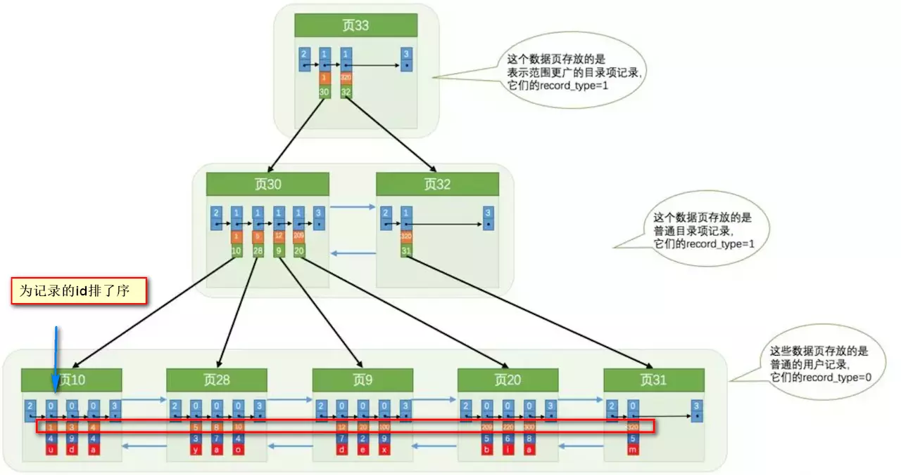
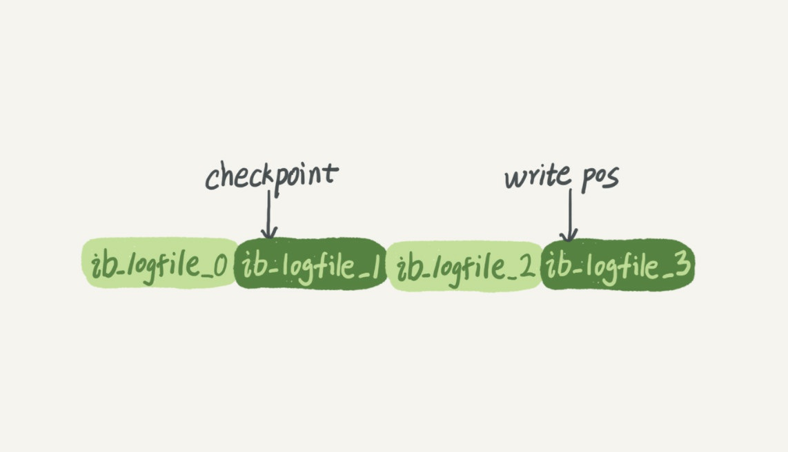

# 数据库基础知识

## 元组，码，候选码，主码，主属性，非主属性


- 元组  tuple：是**关系数据库**中的基本概念，关系是一张表，表中的每行（**数据库中的每条记录**）就是一个元组，每列就是一个属性。在二维表里，元组也称为行

- 码：**唯一标识实体的  <属性>，对应表中的列**

- 候选码：关系中的**某一属性或属性组**的值能**唯一的标识一个元组**，而其**任何子集都不能再标识**，则称该属性组为候选码。

  例如：在学生实体中，“学号”是能唯一的区分学生实体的，同时又假设“姓名”、“班级”的属性组合足以区分学生实体，那么{学号}和{姓名，班级}都是候选码。

- **主码** : 主码也叫主键。主码是**从候选码中选出来的**。 一个实体集中只能有一个主码，但可以有多个候选码。

- **外码** : 外码也叫外键。如果一个关系中的一个属性是另外一个关系中的主码则这个属性为外码。

- **主属性** ： **候选码中出现过的属性称为主属性**。比如关系 ：工人（工号，身份证号，姓名，性别，部门）.显然工号和身份证号都能够唯一标示这个关系，所以都是候选码。工号、身份证号这两个属性就是主属性。如果主码是一个属性组，那么属性组中的属性都是主属性。

- **非主属性：** 不包含在任何一个候选码中的属性称为非主属性。比如在关系——学生（学号，姓名，年龄，性别，班级）中，主码是“学号”，那么其他的“姓名”、“年龄”、“性别”、“班级”就都可以称为非主属性。


## 主键和外键有什么区别?


- **主键(主码)** ：主键用于唯一标识一个元组，不能有重复，不允许为空。一个表只能有一个主键。
- **外键(外码)** ：外键用来和其他表建立联系用，外键是另一表的主键，外键是可以有重复的，可以是空值。一个表可以有多个外键。


## 什么是 ER 图？


实体-联系图（Entity Relationship Diagram），提供了表示 **实体类型、属性和联系的方法**，用来描述现实世界的概念模型。它是描述现实世界关系概念模型的有效方法。

学生选课的 ER 图，每个学生可以选若干门课程，同一门课程也可以被若干人选择，**多对多关系（M:N）**


将ER图转为数据库实际的关系模型：


## 数据库三范式


**1NF(第一范式)**

属性（对应于表中的字段）不能再被分割，也就是这个字段只能是一个值，不能再分为多个其他的字段了。**1NF是所有关系型数据库的最基本要求** ，也就是说关系型数据库中创建的表一定满足第一范式。

**2NF(第二范式)**

2NF在1NF的基础之上，消除了非主属性对于码的**部分函数依赖**。如下图所示，展示了第一范式到第二范式的过渡。第二范式在第一范式的基础上增加了一个列，这个列称为主键，非主属性都依赖于主键。

> 增加一个主键，进行属性的拆分，如果不是一一对应的属性（没有直接依赖），就拆出单独一个表


---

一些重要的概念：

- **函数依赖（functional dependency）** ：若在一张表中，在属性（或属性组）X的值确定的情况下，必定能确定属性Y的值，那么就可以说Y函数依赖于X，写作 X → Y。

- **部分函数依赖（partial functional dependency）** ：如果X→Y，并且存在X的一个真子集X0，使得X0→Y，则称**Y对X部分函数依赖**。比如学生基本信息表R中（学号，身份证号，姓名）当然学号属性取值是唯一的，在R关系中，（学号，身份证号）->（姓名），（学号）->（姓名），（身份证号）->（姓名）；所以姓名部分函数依赖与（学号，身份证号）；

- **完全函数依赖(Full functional dependency)** ：在一个关系中，若某 个**非主属性**数据项**依赖于全部关键字**称之为完全函数依赖。比如学生基本信息表R（学号，班级，姓名）假设不同的班级学号有相同的，班级内学号不能相同，在R关系中，（学号，班级）->（姓名），但是（学号）->(姓名)不成立，（班级）->(姓名)不成立，所以姓名完全函数依赖与（学号，班级）；

- **传递函数依赖** ： 在关系模式R(U)中，设X，Y，Z是U的不同的属性子集，如果X确定Y、Y确定Z，且有X不包含Y，Y不确定X，（X∪Y）∩Z=空集合，则称Z传递函数依赖(transitive functional dependency) 于X。传递函数依赖会导致数据冗余和异常。传递函数依赖的Y和Z子集往往同属于某一个事物，因此可将其合并放到一个表中。

  比如在关系R(学号 ,姓名, 系名，系主任)中，学号 → 系名，系名 → 系主任，所以存在**非主属性**系主任对于学号的传递函数依赖。

---

**3NF(第三范式)**

3NF在2NF的基础之上，消除了非主属性对于码的传递函数依赖 。符合3NF要求的数据库设计，**基本**上解决了数据冗余过大，插入异常，修改异常，删除异常的问题。比如在关系R(学号 ,姓名, 系名，系主任)中，学号 → 系名，系名 → 系主任，所以存在非主属性系主任对于学号的传递函数依赖，所以该表的设计，不符合3NF的要求。


**总结**

- 1NF：属性不可再分。（**每个属性只能表示一个含义**）
- 2NF：1NF的基础之上，消除了非主属性对于码的部分函数依赖。
- 3NF：3NF在2NF的基础之上，消除了非主属性对于码的**传递函数依赖** 。


## 存储过程


一些 SQL 语句的集合，中间加了逻辑控制语句。

在 **业务复杂** 的时候很实用，比如很多时候我们完成一个操作可能需要写一大串SQL语句，这时候我们就可以写有一个存储过程，这样也方便了我们下一次的调用。

另外，使用存储过程**比单纯SQL语句执行要快**，因为存储过程是**预编译过的。**

存储过程在互联网公司应用不多，因为存储过程难以调试和扩展，而且没有移植性，还会消耗数据库资源。

阿里巴巴Java开发手册里要求禁止使用存储过程！


## drop、delete与truncate区别？


- drop（**丢弃数据**）：`drop table 表名`，直接将整个表删除，在删除表的时候使用
- truncate (清空数据) : `truncate table 表名` ，只删除表中的数据，再插入数据的时候自增长id又从1开始，在清空表中数据的时候使用。
- delete（删除数据） : `delete from 表名 where 列名=值`，删除某一列的数据，如果不加 where 子句和`truncate table 表名`作用类似。（自增id不会变小）


truncate 和不带 where 子句的 delete、以及 drop 都会删除表内的数据，但是 **truncate 和 delete 只删除数据不删除表的结构(定义)，执行drop语句，此表的结构也会删除，也就是执行 drop 之后对应的表不复存在。**


---

***它们属于不同的数据库语言！***

truncate和drop 属于DDL(数据定义语言)语句，**操作立即生效，原数据不放到 rollback segment 中，<不能回滚>**，操作不触发 trigger。

而 delete 语句是**DML (数据库操作语言)**语句，这个操作会放到 **rollback segement 中，<u>事务提交之后才生效</u>。**


---

**DML 语句和 DDL 语句区别：**

- DML 是**数据库操作语言（Data Manipulation Language）**的缩写，是指对数据库中**<表记录的操作>**，主要包括**表记录的插入（insert）、更新（update）、删除（delete）和查询（select）**，是开发人员日常使用最频繁的操作。
- DDL 是**数据定义语言（Data Definition Language）**的缩写，简单来说，就是对数据库内部的对象进行创建、删除、修改的操作语言。它和 DML 语言的最大区别是 DML 只是对表内部数据的操作，而不涉及到表的定义、结构的修改，更不会涉及到其他对象。DDL 语句更多的被数据库管理员（DBA）所使用，一般的开发人员很少使用。


---

**执行速度不同？**

一般来说:drop>truncate>delete（这个我没有设计测试过）。


# 什么是 MySQL


**关系型数据库**，因为MySQL是开源免费的，方便扩展。阿里巴巴数据库系统也大量用到了mysql，稳定性有保障！

mysql开放源代码，可以对其进行个性化的修改。

默认端口号是 3306


# 事务


## 什么是事务


**事务就是逻辑上的一组操作，要么都执行，要么都不执行**

> 假如小明要给小红转账1000元，这个转账会涉及到两个关键操作就是：将小明的余额减少1000元，将小红的余额增加1000元。万一在这两个操作之间突然出现错误比如银行系统崩溃，导致小明余额减少而小红的余额没有增加，这样就不对了。事务就是保证这两个关键操作要么都成功，要么都要失败。


## 事物的四大特性(ACID)


1. **原子性atomicity**：事务是最小的执行单位，**不允许分割**。**确保事务这个动作要么全部完成，要么完全不起作用**
2. **一致性consistency**：执行事务前后，数据保持一致，多个事务对同一个数据读取的结果是相同的。如：转账前2个人的 总金额 是 2000，转账后 2 个人总金额也是 2000.
3. **隔离性isolation**： **事务与事务之间不应该相互影响，执行时保持隔离的状态.**         事务是并发控制机制，他们交错使用时也能提供一致性。隔离让我们隐藏来自外部世界未提交的状态变化，一个失败的事务不应该破坏系统的状态。隔离是通过用**悲观或乐观锁机制实现的。**
4. **持久性durability**：一旦事务执行成功，对数据库的**修改是持久的**。就算关机，数据也是要保存下来的


> 其实事务**主要是为了实现 C** ，也就是一致性，具体是通过 AID，即原子性、隔离性和持久性来达到一致性的目的


## 并发事务带来哪些问题


一个数据库可能拥有**多个访问客户端**,这些客户端都可以**并发方式访问数据库**. 数据库的相同数据可能被**多个事务同时访问**,如果**不采取隔离措施,就会导致各种问题, 破坏数据的完整性**  


- **脏读（Dirty read）**：一个事务正在访问数据并且**对数据进行了修改**，而这种修改**还没有提交**到数据库中，**这时另外一个事务也访问了这个数据，然后使用了这个数据**。因为这个数据是**还没有提交的数据**，那么另一个事务读到的这个数据是**“脏数据”**，依据"脏数据"所做的操作可能是不正确的。

- **丢失修改（Lost to modify）**：指在一个事务读取一个数据时，另外一个事务也访问了该数据，那么在第一个事务中修改了这个数据后，第二个事务也修改了这个数据。这样**第一个事务内的修改结果就被丢失**，因此称为**丢失修改**。 

  例如：事务1读取某表中的数据A=20，事务2也读取A=20，事务1修改A=A-1，事务2也修改A=A-1，最终结果A=19，**事务1的修改被丢失。**

- **不可重复读（Unrepeatableread）**：指在一个事务内多次读同一数据。在这个事务还没有结束时，另一个事务也访问该数据。那么，在第一个事务中的两次读数据之间，由于**第二个事务的修改导致第一个事务两次读取的数据可能不太一样**。这就发生了**在一个事务内两次读到的数据是不一样的情况，因此称为不可重复读。**

- **幻读（Phantom read）**：幻读与不可重复读类似。它发生在一个事务（T1）读取了几行数据，接着另一个并发事务（T2）**<插入>**了一些数据时。在随后的查询中，第一个事务（T1）就会发现**多了一些原本不存在的记录**，就好像**发生了幻觉一样**，所以称为幻读。


## 不可重复读和幻读区别


- **不可重复读的重点是  修改**

- **幻读的重点在于 新增或删除**


> 例1（同样的条件, 你读取过的数据, 再次读取出来发现值不一样了 ）：事务1中的A先生读取自己的工资为 1000的操作还没完成，事务2中的B先生就修改了A的工资为2000，导 致A再读自己的工资时工资变为 2000；这就是不可重复读。


> 例2（同样的条件, 第1次和第2次读出来的记录数不一样 ）：假某工资单表中工资大于3000的有4人，事务1读取了所有工资大于3000的人，共查到4条记录，这时事务2 又插入了一条工资大于3000的记录，事务1再次读取时查到的记录就变为了5条，这样就导致了幻读。


## 事务的隔离级别有哪些？MySQL的默认隔离级别是？


SQL 标准定义了四个隔离级别：

- **READ-UNCOMMITTED(读取未提交)：** 最低的隔离级别，允许读取尚未提交的数据变更，**可能会导致脏读、幻读或不可重复读**。
- **READ-COMMITTED(读取已提交)：** 允许读取并发事务已经提交的数据，**可以阻止脏读，但是幻读或不可重复读仍有可能发生**。
- **REPEATABLE-READ(可重复读)：** 对同一字段的多次读取结果都是一致的，除非数据是被本身**事务自己所修改**，**可以阻止脏读和不可重复读，但<幻读仍有可能发生>**。
- **SERIALIZABLE(可串行化)：** 最高的隔离级别，完全服从ACID的隔离级别。所有的事务依次逐个执行，这样事务之间就完全不可能产生干扰，也就是说，**该级别可以防止脏读、不可重复读以及幻读**。


|     隔离级别     | 脏读 | 不可重复读 | 幻影读 |
| :--------------: | :--: | :--------: | :----: |
| READ-UNCOMMITTED |  √   |     √      |   √    |
|  READ-COMMITTED  |  ×   |     √      |   √    |
| REPEATABLE-READ  |  ×   |     ×      |   √    |
|   SERIALIZABLE   |  ×   |     ×      |   ×    |


MySQL InnoDB 存储引擎**默认**支持的隔离级别是 **REPEATABLE-READ 可重复读**，通过命令 `SELECT @@tx_isolation;`  mysql8 ：`SELECT @@transaction_isolation;`


与 SQL 标准不同的地方：**<u>InnoDB存储引擎</u>**  在  **REPEATABLE-READ（可重读）**事务隔离级别下使用的是 **Next-Key Lock 锁算法**， 因此可以避免幻读的产生，这与其他数据库系统 （SQL Server）是不同的。

所以说InnoDB 存储引擎的默认支持的隔离级别是 **REPEATABLE-READ（可重读）** 已经**可以完全保证事务的隔离性要求**，即达到了 SQL标准的**SERIALIZABLE(可串行化)**隔离级别。


> InnoDB 存储引擎在 **分布式事务** 的情况下一般会用到**SERIALIZABLE(可串行化)**隔离级别


----

在实现上，数据库里面会**创建一个视图**，访问的时候**以视图的逻辑结果为准**。

- 在“可重复读”隔离级别下，这个视图是在**事务启动时创建**的，整个事务存在期间都用这个视图，**所以读到的某个数据其实都是一个值，不会被其他事务改变**
- “读提交”隔离级别下，这个视图是在**每个 SQL 语句开始执行**的时候创建的。这样就可以读到其他最新提交事务的数据，但会出现"不可重复读"问题
- “读未提交”隔离级别下直接**返回记录上的最新值**，**没有视图概念**
- “串行化”隔离级别下直接用**加锁**的方式来避免并行访问。


> 不同的隔离级别下， 数据库行为是有所不同的。 **Oracle数据库的默认隔离级别其实就是“读提交”**， 因此对于一些从Oracle迁移到MySQL的应用， 为保证数据库隔离级别的一致，你一定要记得将MySQL的隔离级别设置为“读提交”  
>
> 不同的隔离级别下， 数据库行为是有所不同的。 Oracle数据库的默认隔离级别其实就是“读提交”， 因此对于一些从Oracle迁移到MySQL的应用， 为保证数据库隔离级别的一致，你一定要记得将MySQL的隔离级别设置为“读提交”  
>


可以将启动参数`transaction-isolation`的值设置成  `四种隔离级别`。 

```sql
set global transaction isolation level  read uncommitted / read committed / repeatable read / SERIALIZABLE;
```

你可以用`show variables`来查看当前的值  

```sql
show variables like 'transaction_isolation';
```


----

"存在即合理"，每个隔离级别都有它自己的使用场景，根据业务来定。

**什么时候需要“可重复读”的场景呢？**这有一个数据校对的:chestnut:

假设你在管理一个个人银行账户表。 一个表存了每个月月底的余额， 一个表存了账单明细。 这时候你要做数据校对， 也就是判断上个月的余额和当前余额的差额， 是否与本月的账单明细一致。

你一定希望**在校对过程中， 即使有用户发生了一笔新的交易， 也不影响你的校对结果。**

这时候使用“可重复读”隔离级别就很方便。 事务启动时的视图可以认为是静态的， **不受其他事务更新的影响**。  


## 事务隔离的实现(MVCC)


这里重点说明“可重复读”

每条记录在更新的时候都会同时***记录一条回滚操作***。记录上的最新值，通过回滚操作，都可以得到**前一个状态的值**。

假设一个值从1被按顺序改成了2、 3、 4， 在回滚日志里面就会有类似下面的记录  


当前值最终被修改为了4，但是在查询这条记录的时候，**不同时刻启动的事务**会有不同的 **read-view**。

A、B、C相当于一个记录在三个事务a、b、c启动时的状态，此时事务a想获得这个自己事务中的这个值，那么就需要回滚到 read-view A。

在视图 A、B、C 里面，这一个记录的值分别为1 、2 、4，**同一条记录**在系统中可以**存在多个版本**，就是数据库的 **多版本并发控制 MVCC**。

对于 read-view A，要得到 1，就必须将当前值**依次执行图中所有回滚操作得到**。

同时会发现，即使现在还有一个事务正在将4改成5，这个事务跟 read-view A、B、C对应的事务是**不会冲突的**。


回滚日志在不需要的时候删除！系统会判断，当没有事务再需要用到这些回滚日志的时候，回滚日志会被删除。什么时候才不需要呢？？**当系统里没有比这个回滚日志更早的 read-view 的时候。**


---

**尽量不要使用长事务！**

长事务意味着系统里面会**存在很老的事务视图**。

> 这个长事务很早就开启了，但一直没有结束，在这期间启动了很多事务并且修改了长事务需要读取的值，那么这整个版本链就会非常长！undo log文件也会很大！

由于这些事务随时可能访问数据库里的任何数据，所以**这个事务提交之前**，数据库里面它可能用到的所有的回滚记录都必须保留，导致**大量占用存储空间**

在MySQL 5.5及以前的版本， **回滚日志是跟数据字典一起放在 ibdata 文件里的**， 即使长事务最终提交， 回滚段被清理， 文件也不会变小。 我见过数据只有20GB， 而回滚段有200GB的库。 最终只好为了清理回滚段， 重建整个库。

除了对回滚段的影响， 长事务还占用锁资源  


-----

在 MySQL 的 InnoDB 引擎中就是指  在 **已提交读(READ COMMITTD)和可重复读(REPEATABLE READ)这两种隔离级别下的事务对于 SELECT 操作会访问版本链中的记录的过程。**


----

### **版本链** 

在 InnoDB 引擎表中，它的聚簇索引记录中有两个必要的隐藏列：

- **trx_id**：用来存储的每次对某条聚簇索引记录进行修改的时候的**事务id**。

- **roll_pointer**：每次对哪条聚簇索引记录有修改的时候，都会**把老版本写入 undo log** 中。这个roll_pointer就是存了一个指针，它指向这条聚簇索引记录的上一个版本的位置，通过它来获得上一个版本的记录信息。

  > 注意**插入操作的undo日志没有这个属性，因为它没有老版本**

  

  比如现在有个trx_id=60 的事务执行这条记录的修改语句：

  ```
  update table set name='小明1' where id=1
  ```

  此时在undo日志中就存在版本链：

  


### ReadView

>  readView 就是用来判断**哪个版本对当前事务可见**的
>

**已提交读和可重复读的区别就在于它们生成 ReadView 的策略不同**

ReadView中主要就是有个列表来存储我们系统中**<u>当前活跃着的读写事务，也就是begin了还<未提交>的事务</u>**。通过这个列表来判断记录的某个版本是否对当前事务可见。

- creator_trx_id：当前事务 ID
- m_ids：生成 readView时还活跃的事务ID集合，也就是 **已经启动还未提交的事务 ID 列表**
- min_trx_id：当前活跃 iD 之中的最小值
- max_trx_id：生成 readView 时 InnoDB 将分配给下一个事务的 ID 的值（事务ID是递增分配的，这里的ID就是当前使用的最大事务ID值+1）


判断条件如下：

- 如果当前数据版本的 trx_id ==  creator_trx_id，说明修改这条数据的事务就是当前事务，所以可见；
- 如果当前数据版本的 trx_id < min_trx_id，说明修改这条数据的事务在当前事务生成 readView 的时候**已提交**，所以可见；
- 如果当前数据版本的 trx_id **在 m_ids 中**，说明修改这条数据的事务此时还**未提交，所以不可见；**
- 如果当前数据版本的 trx_id >= max_trx_id，说明修改这条数据的事务在当前事务生成 readView 的时候还未启动，所以不可见（结合事务 ID 递增来看）。


---

------

假设当前**列表里**的事务id为[80,90,100]：说明事务id的最大最小值是80、100（也可能比如95已经提交了，这里只是记录最大最小值），80之前的事务都提交了，可以访问；100之后的事务在**ReadView生成之后才发生的**，**是不可访问的**

- 如果要访问的记录版本的事务id是 50，比当前列表最小的id80小，那说明**这个事务在之前就提交了，所以对当前活动的事务来说是可访问的。**
- 如果你要访问的记录版本的事务id为 90,发现此事务在列表id最大值和最小值之间，那就再判断一下**是否在列表内**，如果在那就说明此事务**<还未提交>，所以版本不能被访问**。如果不在那说明**事务已经提交，所以版本可以被访问。**
- 如果你要访问的记录版本的事务id为110，那比事务列表最大id100都大，那说明**这个版本是在ReadView生成之后才发生的，所以不能被访问。**


在 select 时，**先找最近记录**，如果最近这一条记录事务 id 不符合条件，即不可见，再去找上一个版本再比较当前事务的id和这个版本事务id看能不能访问，以此类推**直到返回可见的版本**或者结束


---

在 **读已提交 隔离级别下**

此时有一个`事务id为100的事务`，修改了name,使得name等于小明2，但是`事务还没提交`。则此时的版本链是


**此时，另一个事务发起了select 语句要查询 id=1 的记录**：此时**生成的ReadView 列表只有[100]**。那就去版本链去找了，首先肯定**找最近的一条**，发现trx_id是100,也就是name为小明2的那条记录，发现在列表内，所以不能访问。


这时候就通过指针继续找下一条，name为小明1的记录，发现trx_id是60，**小于列表中的最小id,所以可以访问，直接访问结果为小明1。**


那这时候我们把事务id为100的事务**提交了**，并且新建了一个`事务id为110`也修改id为1的记录，并且**不提交**事务

这时候版本链就是:


之前那个做 select 的事务又查询 id=1 的记录

**区别在这！**

- **如果是  读已提交   隔离级别，这时候会重新生成一个 ReadView，那你的活动事务列表中的值就变了，变成了[110]。**

  去版本链通过trx_id对比查找到合适的结果就是小明2。

- **如果是  可重复读  隔离级别，这时候你的 ReadView 还是第一次 select 时候生成的 ReadView，也就是列表的值还是[100]。所以select的结果是小明1**

  > 所以第二次select结果和第一次一样！
  >
  > 所以叫**可重复读**！


综上：

**已提交读隔离级别下的事务在每次查询的开始都会生成一个独立的ReadView,而可重复读隔离级别则在第一次读的时候生成一个ReadView，之后的读都复用之前的ReadView。**


### 实现


拿 **insert （1，XX）**这条语句举例，成功插入之后数据页的记录上不仅存储 ID 1、name XX，还有 **trx_id 和 roll_pointer** 这两个隐藏字段：

- **trx_id**：当前事务 ID。
- **roll_pointer**：指向 undo log 的指针。


此时插入的事务 ID 是 1。此时插入会生成一条 undolog，并且记录上的 `roll_pointer` 会指向这条 undolog 

而这条 undolog  是一个类型为`TRX_UNDO_INSERT_REC` 的 log，代表是 **insert 生成的**，里面存储了主键的长度和值(还有其他值，不提)。


InnoDB 可以根据 undolog  里的主键的值，找到这条记录，然后把它删除来实现**回滚（复原）**的效果。

因此可以简单地理解 undolog 里面存储的就是**当前操作的反向操作**，所以认为里面存了个 `delete 1` 就行。


此时，事务 1 提交，另一个 ID 为 5 的事务再执行 `**update NO where id 1** `

此时的记录和 undolog 就如下图所示：


可以发现：之前 insert 产生的 undolog 没了，**insert 的事务提交了之后对应的 undolog 就回收了**，因为不可能有别的事务会访问比这还要早的版本了（**已经提交了**）


而 update 产生的 undolog 又不一样：

它的类型为 `TRX_UNDO_UPD_EXIST_REC`。

此时事务 5 提交，然后另一个 ID 为 11 的事务执行 **update Yes where id 1** 这个语句，此时的记录和 undolog 就如下图所示：


注意： :warning: **update 产生的 undolog 不会马上删除**，因为可能有别的事务需要访问之前的版本，所以不能删


## MVCC详解


> Multi-Version  Concurrency Control （多版本并发控制）


---

:question: 为什么需要 MVCC？

如果没有 MVCC 读写操作之间就会冲突。

> 想象一下有一个事务 1 正在执行，此时一个事务 2 修改了记录A，还未提交。此时事务 1 要读取记录 A，因为事务 2 还未提交，**所以事务 1 无法读取最新的记录A**，不然就是发生脏读的情况，所以应该读记录 A 被事务 2 修改之前的数据，但是记录A已经被事务 2 改了呀，所以事务1咋办？只能用锁阻塞等待事务2的提交，这种实现叫 LBCC（Lock-Based Concurrent Control）。


如果有多版本的话，事务2修改的记录 A，还未提交，但是记录 A 被修改之前的版本还在，此时事务 1 就可以通过 **undolog 回滚日志** 来读取之前的版本，这样读写之间就不会阻塞了！

**MVCC 提高了事务的并发度，提升数据库的性能**


之前讲到，如果是**「可重复读隔离级别」**，事务启动的时候会创建一个视图 read-view，之后事务执行期间，即使有其他事务修改了数据，**事务T看到的仍然跟启动时看到的一样**。


一个事务要更新一行，如果刚好有**另一个事务**拥有这一行的行锁，会**被锁住**，进入**等待状态**。

**既然进入了等待状态，那么等到这个事务自己获取到行锁要更新数据的时候，它读到的值是什么呢？（读已提交 / 可重复读）**


:chestnut:

```mysql
CREATE TABLE `t` (
    `id` int(11) NOT NULL,
    `k` int(11) DEFAULT NULL,
    PRIMARY KEY (`id`)
) ENGINE=InnoDB;

insert into t(id, k) values(1,1),(2,2);
```


:zap: **注意事务的启动时机**

> **`begin/start transaction` 命令并不是一个事务的起点，** 在执行到它们之后的第一个操作InnoDB表的语句， 事务才真正启动。 如果你想要**马上启动一个事务**， 可以使用start transaction with consistent snapshot 这个命令。  

事务C没有显式使用 begin/commit，表示这个 update 语句本身就是一个事务，语句完成后**自动提交**（这里 autocommit=1  ），事务B 在更新了行之后进行查询；事务A 在一个**只读事务**中查询，并且时间顺序上是在事务B的查询之后。  

> 这个例子中，事务B查到的k的值是3， 而事务A查到的k的值是1  


----

在 MySQL 中，有两个 **视图** 的概念

- view。它是一个用**查询语句定义的虚拟表**， 在调用的时候执行查询语句并生成结果。创建视图的语法是create view …， 而它的查询方法与表一样。  

- InnoDB在实现MVCC时用到的一致性读视图 ，**即 consistent read view**，用于支持 RC（Read Committed读提交）

  它没有物理结构，作用是**事务执行期间**用来定义：**我能看到什么数据**


----

在可重复读隔离级别下，事务在启动的时候就“**拍了个快照**”。

:warning:**这个快照是基于整个库的**，但是MySQL不是通过拷贝整个库的数据出来来实现这个功能。

**InnoDB里面每个事务有一个唯一的事务ID：transcation id**。是在事务开始的时候向 InnoDB 的事务系统申请的，**按申请顺序严格递增**

**每行数据也都是有多个版本的**。每次事务更新的时候，都会生成一个新的数据版本，并且把transaction id赋值给这个数据版本的事务ID， 记为row trx_id。 同时， **旧的数据版本要保留**，并且在新的数据版本中， 能够有信息可以**直接拿到它(旧的数据版本)**。  

就是说，数据表中的一行记录，其实可能有**多个版本（row）**，每个版本有自己的 row trx_id。

如图：


实际上 InnoDB 不会真的存储了多个版本的数据，只是借助 undolog 记录每次写操作的**「反向操作」**，所以**「索引树上对应的记录只会有一个版本」**，**即最新版本**。但是可以根据 undolog 中的记录反向操作得到数据的历史版本，**看上去是有多个版本**


**那么语句更新生成的 undo log（回滚日志）在哪呢**

图中的**三个虚线箭头**， 就是undo log； 而V1、 V2、 V3并不是物理上真实存在的， 而是每次需要的时候**根据当前版本和undo log**计算出来的。 比如， 需要V2的时候， 就是通过V4依次执行U3、 U2算出来。  


----

:question: InnoDB 是怎么定义那个 100G 的快照的？

按照可重复读的定义， 一个事务启动的时候， 能够看到所有**已经提交**的事务结果。 但是之后， **这个事务执行期间， 其他事务的更新对它不可见。**  

因此， 一个事务只需要在启动的时候声明说， “以我启动的时刻为准， **如果一个「数据版本」是在我启动之前生成的（已提交的事务操作）， 就认**； **如果是我启动以后才生成的， 我就不认**， 我**必须要找到它的上一个版本”**  ，如果上一个版本也不可见，就继续往前找。


**实现上，InnoDB为每个事务构造了一个数组，同来保存这个事务启动瞬间，当前正在活跃，即：启动了「还没提交」的所有事务ID**

> 数组里面**事务ID的最小值记为低水位**， 当前系统里面**「已经创建过」的事务ID**的**「最大值加1」**记为高水位。  

**这个视图数组和高水位， 就组成了当前事务的一致性视图（read-view）**  

数据版本的**可见性规则**， 就是**基于数据的row trx_id和这个一致性视图的对比结果**得到的。  

> **这个低水位和高水位，都是一个事务启动时的属性，属于每个事务自己**


这个视图数组把所有的row trx_id 分成了几种不同的情况：


当前事务的启动瞬间来说，一个数据版本的 row trx_id，有以下几种可能：

1. 如果在绿色部分，表示这个版本是已提交的事务或者是当前事务自己生成的，**这个数据是可见的**

2. 如果落在红色部分， 表示这个版本是由将来启动的事务生成的， 是肯定不可见的；  

3. 如果落在黄色部分， 那就包括两种情况

   a. 若 row trx_id**在数组中**， 表示这个版本是由**「还没提交」**的事务生成的， **不可见**；

   b. 若 row trx_id**不在数组中**， 表示这个版本是**「已经提交」**的事务生成的， 可见。  

对于上上个图，如果有一个事务，它的低水位(trx_id)是18，当它访问这一行数据时， 就会从V4通过U3计算出V3， 所以在它看来， 这一行的值是11。  

:star: 这样，系统里面随后发生的更新，就跟这个事务看到的内容无关了。因为**之后的更新**，生成的版本一定属于2 / 3a的情况，而对于当前事务来说，这些新的数据版本你是不存在的，所以这个事务的快照，**就是静态的**


----

再来分析这个结果：


分析下事务A的语句返回的结果， 为什么是k=1

1. 事务A开始前， 系统里面只有一个活跃事务ID是99；
2. 事务A、 B、 C的版本号分别是100、 101、 102， 且当前系统里只有这四个事务；
3. 三个事务开始前， (1,1） 这一行数据的row trx_id是90。  

这样：事务A的视图数组就是：[99, 100]，事务B的视图数组是：[99, 100, 101]，事务C的视图数组是[99,100,101,102]  


事务A的逻辑操作：


第一个有效更新是 事务C，把数据从(1,1)改成了(1,2)。 这时候， **这个数据的最新版本的row trx_id是102**， 而90这个版本已经成为了**历史版本（）**。  

第二个有效更新是事务B， 把数据从(1,2)改成了(1,3)。 这时候， 这个数据的最新版本（即rowtrx_id） 是101， **而102又成为了历史版本**。  

在事务A查询的时候， 其实事务B还没有提交， 但是它生成的(1,3)这个版本已经**变成当前版本了（只要有事务修改，那么就会变成当前版本，只是对前面已经启动的事务不可见而已。）**。 但这个版本**对事务A必须是不可见的（事务B还未提交）**， 否则就变成**脏读**了。  

- 现在事务A开始读数据，视图数组是[99, 100]
- **都是从当前版本读起，也就是(1, 3)**
- 找到(1,3)的时候， 判断出row trx_id=101， **比高水位大**， 处于红色区域， 不可见；  
- 接着， 找到上一个历史版本， 一看row trx_id=102， **比高水位大**， 处于红色区域， 不可见；  
- 再往前找， 终于找到了（1,1)， 它的row trx_id=90， 比低水位小， 处于绿色区域， 可见。  

:star: 这样执行下来，虽然在A启动 -> 读数据期间，这一行数据被修改过很多次，但是事务A不论在什么时候查询，看到的这行数据的结果都是一致的，**:arrow_right:  一致性读**


----

:star::star::star:

一个数据版本， 对于一个**事务视图**来说， 除了**自己的更新总是可见**以外， 有三种情况  :

1. 版本未提交，不可见

2. 版本已提交，但是是在视图创建后提交的，不可见

   > (**低水位以后的trx_id，都是在该视图创建之后产生的事务，不论是否提交，都不可见**)

3. 版本已提交，而且是在视图创建前提交的，可见（**低水位之前的 trx_id**）


----

**再来分析更新逻辑**


> 还是上面的例子，事务B的视图数组是先生成的，之后事务C才提交，为什么可以看见 事务C 修改后的 (1, 2)呢，然后修改成 (1, 3)呢？


**如果事务B在更新之前查询一次数据，那么这个查询返回的k的值确实是 1**


> :star2::star2: 但是，**当它要去更新数据的时候，就不能再在历史版本上更新了**，**否则事务C的更新就丢失了**


:exclamation: 因此：**事务B此时的 `set k=k+1` 是在 (1, 2) 的基础上进行的操作**

有这么一条规则：**<u>更新数据都是先读后写</u>**的， 而这个**读， 只能读「<u>当前的值</u>」 （其他事务最新更新在这个数据上的值，即最新版本的值）**，

称为**“当前读”**（ current read） 


因此， 在更新的时候， **当前读**拿到的数据是(1,2)， 更新后生成了新版本的数据(1,3)， 这个新版本的row trx_id是101  

在执行事务B**查询**语句的时候， 一看自己的版本号是101， 最新数据的版本号也是101， **是自己的更新， 可以直接使用**， 所以查询得到的k的值是3。  


---

### **当前读**

除了update语句外， select语句如果**加锁**， 也是当前读。  

把事务A的查询语句`select * from t where id=1`修改一下， 加上`lock in share mode` 或 `for update`， 也都可以读到版本号是101的数据， 返回的k的值是3   

分别加了读锁（S锁， 共享锁） 和写锁（X锁， 排他锁）：

```mysql
select k from t where id=1 lock in share mode
select k from t where id=1 for update
```


---

将 事务C 变成下面的 C'：


更新后并没有马上提交， 在它提交前， 事务B的更新语句**先**发起了  

虽然**事务C’还没提交**， 但是**(1,2)这个版本也已经生成了**， 并且是当前的**最新版本**  

:star: **两阶段锁协议**

事务C' 没提交，也就是说 (1,2) 这个版本上的**写锁（事务C'对这条记录加的行级锁）还没释放**。而事务B是**当前读**，必须要**读最新版本**，而且**「必须加锁」**，因此就被锁住了

——>  必须**等到事务C’释放这个锁， 才能继续事务B的当前读。**  


:gem: **事务的可重复读的能力是怎么实现的？**

可重复读的核心就是**一致性读**（consistent read）；而事务更新数据的时候，只能用当前读。如果当前记录的 **行锁** 被其他事务占用的话，就需要进入 **锁等待**


-----

而 **读已提交隔离级别** 的逻辑也类似，区别：

- 在*可重复读隔离级别*下， 只需要在**「事务开始的时候」**创建一致性视图， 之后**事务里的其他查询**都共用这个一致性视图；
- 在*读提交隔离级别*下， **「每一个语句执行前」都会重新算出一个新的视图**。  


在读提交隔离级别下， 事务A和事务B的查询语句查到的k  ?

> :star:
>
> ```mysql
> start transaction with consistent snapshot;
> ```
>
> 这个命令的意思是 **从这个语句开始，创建一个持续整个事务的一致性快照。**
>
> **所以在读提交隔离级别下，这个用法就没意义了，等效于普通的 `start transcation`**


事务A的查询语句的视图数组是在执行这个语句的时候创建的，时序上：(1, 2), (1, 3)的生成时间都在创建这个视图数组的时刻之前，但是：

- (1,3)还没提交， **处于下水位和高水位之间，并且在视图数组中**， 不可见；  
- (1,2 )提交了，**处于下水位和高水位之间，但是不在视图数组中**， 可见；  

在事务A进行查询的时候，视图数组是[99,100,101] (假设在事务A之前还有个未提交的事务id=99)，**但这时该视图的高水位是103(在这个查询之前已经创建了102号事务并提交，最大值+1即为高水位)**，低水位是99，所以：

- 事务B在视图数组中，不可见
- 事务C不在视图数组中，但位于**高低水位之间**，可见。

所以事务A查询返回k=2


---

**为什么表的结构不支持“可重复读”？因为表结构没有对应的行数据，也没有 row trx_id，因此只能遵循当前读的逻辑**

MySQL 8.0已经可以把表结构放在InnoDB字典里了， 也许以后会支持表结构的可重复读。  


----

----

-----

:question: 用下面的表结构和初始化语句作为试验环境， 事务隔离级别是可重复读  

要把所有**“字段c和id值相等的行”的c值清零**， 但是却发现了一个“诡异”的、 **改不掉**的情况。 

请你构造出这种情况， 并说明其原理。  

```mysql
CREATE TABLE `t` (
    `id` int(11) NOT NULL,
    `c` int(11) DEFAULT NULL,
    PRIMARY KEY (`id`)
) ENGINE=InnoDB;

insert into t(id, c) values(1,1),(2,2),(3,3),(4,4);
```


再思考一下， 在实际的业务开发中有没有可能碰到这种情况？ 你的应用代码会不会掉进这个“坑”里， 你又是怎么解决的呢？  


------

**要让更新语句不成功，有两种方法：**

1. 使得更新的条件不成立。在另一个客户端B执行：`update t set c=c+1`，这时候虽然select无法读出来变化（**可重复读**），**但是update使用“当前读”，可以读取到变化的最新版本，然后修改就会失败！**

   

2. **行锁**，需要更新的行数据被另一个事务使用**“行锁”**锁住了，**那么根据两阶段锁协议，就需要等待另一个事务完成，当前的update才可以成功更新！**

   

   


最终，等待时间过长，事务执行失败~

用新的方式来分析session B’的更新为什么对session A不可见就是： 在session A视图数组创建的瞬间， session B’是活跃的， 属于“版本未提交， 不可见”这种情况。  


## undolog


通过上面对 MVCC 的详解，可以看出 undolog **算是热点资源，那么多个事务不会争抢 undolog 吗？**


为了提高 undolog 的**写入性能**，**每个事务**都有属于自己的 undolog 页面链表，提高了写入并发度，**不至于多个事务同时写一处地方的 undolog，导致并发度降低**

再细一点就是 insert 类型的 undolog 和 update 类型的 undolog **属于不同的链表**。


普通表和临时表各有一条 insert 类型的 undolog 和 update 类型的 undolog ，所以最多一个事务可以有四条 undolog 页面链表。

之所以分**普通表和临时表**，是因为普通表的 undolog 写入是需要**记录到redolog 中的需要保证崩溃恢复**，而**临时表则不需要记录**，反正就是临时的。

> delete 其实是属于 update 的，不过分了好几种情况，反正 delete 只会给记录上**打个标记**，**表明这条记录被删除了**，**不会马上删除这条记录**，因为记录还得**存着给别的事务作为版本链访问呢**，如果删了这条记录，那版本链也就不存在了
>
> 被删除的记录也不会永远存在，后台有一个 purge 线程，如果探测出当前**没有事务会访问这个记录**了，就会把它真正的删除。


## 事务的启动方式


长事务有潜在风险，尽量避免。其实很多时候是由于误用导致。

MySQL的事务启动方式有以下几种：

1. 显示启动事务语句，`begin 或 start transaction` 或 `start transaction with consistent snapshot;` 。配套的提交语句是 `commit`，回滚语句是 `rollback`
2. `set autocommit=0`，这个命令会将这个线程的 **自动提交关掉**。意味着如果你只执行一个**select**语句， **这个事务就启动了**， 而且并**不会自动提交**。 这个事务持续存在**直到你主动执行commit 或 rollback 语句**， 或者断开连接。  


有些客户端连接框架会默认连接成功后先执行一个set autocommit=0的命令。 这就导致**接下来的查询都在事务中**， 如果是长连接， 就导致了意外的长事务。

**因此， 建议总是使用set autocommit=1, 通过显式语句的方式来启动事务，如果没有通过显式语句启动事务，那么都是自动提交的事务**  


对于一个需要频繁使用事务的业务， 第二种方式每个事务在开始时都不需要主动执行一次 “begin”， 减少了语句的交互次数。 如果你也有这个顾虑， 我建议你使用`commit work and chain`语法。

在autocommit为1的情况下， 用begin显式启动的事务， 如果执行commit则提交事务。 如果**执行commit work and chain**， 则是**提交事务并自动启动下一个事务**， 这样也省去了再次执行begin语句的开销。 同时带来的好处是从程序开发的角度明确地知道每个语句是否处于事务中。


> **可以在`information_schema`库的`innodb_trx`这个表中查询长事务， 比如下面这个语句， 用于查找持续时间超过60s的事务。**  
>
> ```mysql
> select * from information_schema.innodb_trx where TIME_TO_SEC(timediff(now(),trx_started)) > 60
> ```


---

## 如何避免长事务对业务的影响


系统里面应该避免长事务， 如果你是业务开发负责人同时也是数据库负责人， 你会有什么方案来避免出现或者处理这种情况呢？  


从应用开发端和数据库端来看。

**应用开发端：**

1. 确认是否使用了 `set autocommit=0`。这个确认工作可以在测试环境中开展， 把MySQL的`general_log`开起来， 然后随便跑一个业务逻辑， 通过general_log的日志来确认。 一般框架如果会设置这个值， 也就会提供参数来控制行为， 你的目标就是把它改成1。  

2. 确认是否有不必要的只读事务。 有些框架会习惯不管什么语句先用begin/commit框起来。 我见过有些是业务并没有这个需要， 但是也把好几个select语句放到了事务中。 **这种只读事务可以去掉，只读事务不需要进事务！**

3. 业务连接数据库的时候， 根据业务本身的预估， 通过`SETMAX_EXECUTION_TIME`命令，来**控制每个语句执行的最长时间**， 避免单个语句**意外（见后面笔记~）**执行太长时间。 


**从数据库端来看：**

1. 监控 `information_schema.Innodb_trx  `表，设置**长事务阈值**，超过就报警 /  kill

2. Percona的pt-kill这个工具不错， 推荐使用；  

3. 在业务功能测试阶段要求输出所有的general_log， 分析日志行为提前发现问题；  

4. 如果使用的是MySQL 5.6或者更新版本， 把`innodb_undo_tablespaces`设置成2（或更大的值） 。 如果真的出现**大事务导致回滚段过大**， 这样设置后清理起来更方便。  

> 有关undo log：
>
> https://blog.csdn.net/w892824196/article/details/100163555


# 索引


> **索引的出现就是为了提高数据查询的效率，就像书的目录一样**


![[思维导图-索引篇]](../picture/MySQL/f3f34283a61ddb8d86bad05062e1f824.jpg)


## 为什么索引能提高查询的速度


---

### **MySQL 的基本存储结构**


MySQL的基本存储结构是页（记录都存在页里边）：（InnoDB）


- **各个数据页可以组成一个<<u>双向链表</u>>**

- **每个数据页中的记录又可以组成一个<u>单向链表</u>**
  - **每个数据页**都会为存储在它里面的记录生成一个页目录，在**通过主键查找**某条记录的时候会在页目录中使用**二分法快速定位到对应的槽**，然后再**遍历**该槽对应分组中的记录即可快速找到指定的记录
  - 以其他列（非主键）作为搜索条件：只能从最小记录开始**依次遍历单链表中的每条记录**


所以：如果我们写  `select * from user where indexname = 'xxx'` 这样没有进行 **任何优化** 的sql语句，默认会这样做：

1. **定位到记录所在的页：需要遍历双向链表，找到所在的页**
2. **从所在的页内查找相应的记录：由于不是根据主键查询，只能遍历所在页的单链表**

时间复杂度：O(n)


**索引做了些什么可以让我们查询加快速度呢？将无序的数据变成相对有序**




> **分多个层级，最顶层的页存放下一层的页号（非叶子的页中有字段记录当前页存放的记录id的范围，这样才能确定该走哪个子树），下一层的页号存放普通目录项记录，再下一层是根据id对记录排好序**


要找到id为8的记录简要步骤：


没有使用索引，就需要遍历双向链表来定位对应的页，现在通过目录就能很快定位到对应的页！（二分查找，时间复杂度近似为O(logn)）

然后在页内遍历单向链表找到对应的记录！

**底层结构就是 B+ 树，B+树作为树的一种实现，能够让我们很快地查找出对应的记录**


## 索引的优缺点

优点

- 使用索引可以大大加快 **数据的检索速度**（**<u>大大减少检索的数据量</u>**），这也是创建索引的最主要的原因
- 通过创建 **<u>唯一性索引</u>**，可以保证数据库表中每一行**数据的唯一性**


缺点：

- 创建索引和维护索引需要耗费许多时间。当对表中的数据进行增删改的时候，如果数据有索引，那么**索引也需要动态的修改，会降低 SQL 执行效率。**
- 索引需要**使用物理文件存储，也会耗费一定空间**。


但是，**使用索引一定能提高查询性能吗?**

大多数情况下，索引查询都是比全表扫描要快的。但是如果数据库的数据量不大，那么使用索引也不一定能够带来很大提升。


## 索引的常见模型


### Hash表 

哈希表是键值对的集合，可以做到快速检索数据（近乎O(1)复杂度）

比如现在维护一个身份证信息和姓名的表，需要根据身份证号查找对应的名字：


假设，这时候要查ID_card_n2对应的名字是什么， 处理步骤就是： 首先， 将ID_card_n2通过哈希函数算出N； 然后， 按顺序遍历， 找到User2  

**这种结构增加新的 User 时速度会很快，只需要往后追加。但是因为不是有序的，做区间查询的速度很慢！**

比如：现在要找身份证号在`[ID_card_X, ID_card_Y]`这个区间的所有用户， 就必须**全部扫描一遍了**  


综上，**哈希表这种结构适用于只有等值查询的场景，比如Memcached及其他一些NoSQL引擎**


> 就不介绍哈希算法了。。。
>
> 哈希算法出现**Hash冲突**，不同的 key 最后得到的 index 相同。**链地址法 -> 红黑树**

**既然哈希表这么快，为什么 MySQL 没有使用其作为索引的数据结构呢？**

1. **Hash 冲突问题**
2. **Hash 索引不支持<顺序和范围查询>  ——>  这是它最大的缺点**：假如我们要对表中的数据进行排序或者进行范围查询，那 Hash 索引就不行了

:chestnut:

```java
SELECT * FROM tb1 WHERE id < 500;Copy to clipboardErrorCopiedCopy to clipboardErrorCopied
```

**B+树** 在这种**范围查询**中，优势非常大，**直接遍历比 500 小的叶子节点就够了**。

而 Hash 索引是**根据 hash 算法来定位**的，难不成还要把 1 - 499 的数据，**<u>每个都进行一次 hash 计算来定位</u>**吗?这就是 Hash 最大的缺点了。


### 有序数组


**有序数组在等值查询和范围查询场景中的性能都非常优秀**

还是上面的:chestnut:，如果使用有序数组来实现的话：


这个数组按照身份证号递增的顺序保存的，如果需要查ID_card_n2对应的名字， 用**二分法**就可以快速得到， 这个时间复杂度是**O(log(N))**。  


同时很显然， 这个索引结构**支持范围查询**。 你要查身份证号在[ID_card_X, ID_card_Y]区间的User， 可以先用二分法找到ID_card_X（如果不存在ID_card_X， 就找到大于ID_card_X的第一个User） ， 然后向右遍历， 直到查到第一个大于ID_card_Y的身份证号， 退出循环。  


如果仅仅看查询效率， 有序数组就是最好的数据结构了。 但是， 在需要**更新数据**的时候就麻烦了， 你往中间**插入一个记录就必须得挪动后面所有的记录， 成本太高。**  

**所以，有序数组索引只适用于静态存储引擎**，比如：要保存的是2017年某个城市的所有人口信息， 这类**不会再修改的数据**。  


### 二叉搜索树


还是上面的:chestnut:


每个节点的左儿子小于父节点，父节点小于右儿子

如果要查ID_card_n2的话， 按照图中的搜索顺序就是按照UserA -> UserC -> UserF -> User2这个路径得到。 这个时间复杂度是**O(log(N))**  

多叉树就是每个节点有多个儿子，儿子之间的大小保证从左到右递增。虽然二叉树是**搜索效率最高**的， 但是实际上**大多数的数据库存储却并不使用二叉树**。 

其原因是， **索引不止存在内存中， 还要写到磁盘上。**  

> 你可以想象一下一棵**100万节点**的平衡二叉树， **树高20**。 一次查询可能需要**访问20个数据块**。 在机械硬盘时代， 从磁盘随机读一个数据块需要10 ms左右的寻址时间。 也就是说， 对于一个100万行的表， 如果使用二叉树来存储， 单独访问一个行可能需要20个10 ms的时间， 这个查询可真够慢的。  
>
> **慢的主要原因还是树太高了！那么就使用多叉树来降低树的高度！并且减少数据块的访问次数**


为了让一个查询尽量少地读磁盘， 就必须让查询过程访问尽量少的数据块。 那么， 我们就不应该使用二叉树， 而是要使用“N叉”树。 这里， **“N叉”树中的“N”取决于数据块的大小。**  


以 InnoDB 的一个整数字段索引为例，**这个 N 差不多是 1200**。这棵树的高度为4的时候(树根的数据库总是在内存中)，就可以存  `1200的3次方个值 ≈ 17亿`。一个 十亿行 的表上一个整数字段的索引，查找一个值最多只需要访问 3 次磁盘。（树的第二层也有很大概率在内存中，访问次数更少！）


N叉树 **在读写上的性能优点，以及适配磁盘的访问模式，被广泛用于数据库引擎中！**


哈希表 -> 有序数组 -> 二叉树 -> N叉树 ，都是在不断迭代！不断优化！直到今天，跳表、LSM树等数据结构也被用于引擎设计中。


> **数据库底层存储的核心就是基于这些数据模型的**。 每碰到一个新数据库， 我们需要**先关注它的数据模型**， 这样才能**从理论上分析出这个数据库的适用场景。**  


### B树 & B+树


在 InnoDB 中，表都是根据主键顺序以索引的形式存放的，这种存储方式称为**索引组织表**。


假设， 我们有一个主键列为ID的表， 表中有字段k， 并且在k上有索引。  

```mysql
create table T(
	id int primary key,
	k int not null,
	name varchar(16),
	index (k) ## 为字段 k 也建一个索引
)engine=InnoDB;
```

表中R1~R5的(ID,k)值分别为(100,1)、 (200,2)、 (300,3)、 (500,5)和(600,6)， 两棵树的示例示意图如下  


根据叶子节点的内容，索引类型分为主键索引和非主键索引。

- 主键索引的叶子节点存的是整行数据。 在InnoDB里， 主键索引也被称为聚簇索引（clustered index）  

- 非主键索引的叶子节点内容是主键的值。 在InnoDB里， 非主键索引也被称为二级索引（secondaryindex）   

> 基于非主键索引的查询需要多扫描一棵索引树。 因此， 我们在应用中应该尽量使用主键查询。


B树 也称为 B-树，全称：**多路平衡查找树**。B+树 是 B 树的一种变体。

> B：Balanced **平衡**

**大部分数据库系统以及文件系统都采用 B- 树 或其变种 B+ 树作为索引结构**


---

**B树和B+树两者的异同？**


- B 树的所有节点 **既存放 key，也存放 data**，而B+树 **只有<叶子结点>存放key 和 data，其他内节点只存放 key**

- B 树的 叶子节点都是 **独立**的；**B+树的叶子节点有一条 <引用链> 指向与它相邻的叶子节点**

- B 树的检索过程相当于对 范围内的**每个节点的关键字做二分查找**，可能还没到达叶子节点，检索就结束了。

  而B+树 **检索效率很稳定：任何查找都是从根节点到叶子节点的过程，叶子节点的顺序检索很明显**


> 只有叶子节点存储数据（**即表的具体记录，非叶子节点不保存具体记录，保存的是数据页的目录表**）


在 MySQL 中，MyISAM 引擎和 InnoDB 引擎都是使用的 B+Tree 作为索引结构，**但两者的实现方式不太一样**：

- MyISAM 引擎中，**B+Tree 叶节点的 data 域存放的是数据记录的地址**。在索引检索的时候，首先按照 B+Tree 搜索算法搜索索引，如果指定的 Key 存在，则取出其 data 域的值，然后**以 data 域的值为地址读取相应的数据记录**。

  这被称为**“非聚簇索引”**。

- InnoDB 引擎中，其**数据文件本身就是索引文件**。相比 MyISAM，索引文件和数据文件是分离的，其**表数据文件本身就是按 B+Tree 组织的一个索引结构，树的叶节点 data 域保存了完整的数据记录**。

  这个索引的 **key 是数据表的主键**，因此 InnoDB 表数据文件本身就是主索引。这被称为“**聚簇索引**（或聚集索引）”，而其余的索引都作为**辅助索引**，辅助索引的 ***data 域存储相应记录<主键的值>而不是地址***，这也是和 MyISAM 不同的地方。

  在根据主索引搜索时，直接找到 key 所在的节点即可取出数据；

  在根据辅助索引查找时，则需要**先取出主键的值，在走一遍主索引**。 

  因此，在设计表的时候，**不建议使用过长的字段作为主键**，也**不建议使用非单调的字段作为主键，这样会造成主索引频繁分裂。**


## 索引维护


B+ 树 为了维护索引的有序性，在插入新值的时候需要做必要的维护。

以这个图为例：


如果插入新的行ID值为 700，则只需要在 R5 的记录后面插入一个新纪录，如果插入的ID值为 400，就相对麻烦了，需要**<u>逻辑上挪动</u>**后面的数据，空出位置

更糟的是，如果 R5 所在的数据页满了，根据B+树的算法，需要申请一个新的数据页，然后挪动部分数据过去。**页分裂**。这种情况下，性能自然会受到影响！

除了性能外， 页分裂操作还影响**数据页的利用率**。 原本放在一个页的数据， 现在分到两个页中，**整体空间利用率降低大约50%。**  


当然**有分裂就有合并**。 当相邻两个页**由于删除了数据， 利用率很低之后， 会将数据页做合并**。 合并的过程， 可以认为是分裂过程的逆过程  


来一个:chestnut:

> 可能在一些建表规范里面见到过类似的描述， 要求**建表语句里一定要有自增主键**。 当然事无绝对， 我们来分析一下**哪些场景下应该使用自增主键， 而哪些场景下不应该。**  

自增主键是指自增列上定义的主键，在建表语句中一般是这么定义的：

```
Not Null Primary Key auto_increment
```

插入新记录的时候可以不指定ID的值， 系统会获取当前ID最大值加1作为下一条记录的ID值。  

也就是说， 自增主键的插入数据模式， 正符合了我们前面提到的**<u>递增插入</u>**的场景。 每次插入一条新记录， **都是追加操作**， 都**不涉及到挪动其他记录， 也不会触发叶子节点的分裂**。  


如果使用有**业务逻辑**的字段做主键，则往往**不容易保证有序插入**，写数据成本高

假如**表中确实有一个唯一字段**，比如字符串类型的身份证号，那应该用身份证号做主键，还是用自增字段做主键呢？

由于每个非主键索引（二级索引）的叶子节点上都是主键的值。 如果用身份证号做主键， 那么每个**二级索引的叶子节点占用约20个字节**， 而如果用整型做主键， 则只要4个字节， 如果是长整型（bigint） 则是 8 个字节

**显然，主键长度越小，普通索引的叶子节点就越小，普通索引占用的空间也就越小**


所以，从 **性能和存储空间** 方面考量，自增主键往往是更合理的选择。

有些业务场景的需求：

1. 只有一个索引
2. 该索引必须是唯一索引

这就是典型的**KV场景**。

由于没有其他索引， 所以也就***不用考虑其他索引的叶子节点大小的问题***。

这时候我们就要优先考虑上一段提到的“尽量使用主键查询”原则， 直接将这个索引设置为主键，可以**避免每次查询需要搜索两棵树**。  


## 重建索引


如果要重建索引 k，两个 SQL 语句可以这么写

```mysql
alter table T drop index k;
alter table T add index(k);
```

如果要重建主键索引：

```mysql
alter table T drop primary key;
alter table T add primary key(id);
```


:question: 对于上面这两个重建索引的作法， 说出你的理解。 

**如果有不合适的， 为什么， 更好的方法是什么？**  


---

通过两个 alter 语句重建索引 k，以及通过两个 alter 语句重建主键索引是否合理

:question: 为什么要重建索引？

索引可能因为删除，或者叶分裂等原因，**导致数据页有空洞**，重建索引会创建一个新的索引，把数据按顺序插入，这样页的利用率最高，**使得索引更紧凑、更省空间**


重建索引 k 的做法是 **合理的**:+1: ，可以达到省空间的目的。

但是重建主键的过程不合理。不论是删除主键还是创建主键，都**会将整个表重建**。**这样的话，重建索引 k 的语句就白做了！**

这两个语句，可以用一个语句代替：

```mysql
alter table T engine=InnoDB
```

详见：《为什么表数据删掉一半， 表文件大小不变？ 》   


## 索引类型


### 主键索引 Primary Key


数据库表的主键使用的就是主键索引

**一张数据表有只能有一个主键，并且主键不能为 null，不能重复。**

在 MySQL 的 InnoDB 的表中，当没有显示的指定表的主键时，InnoDB 会自动先检查表中是否有唯一索引的字段，如果有，则选择该字段为默认的主键，否则 InnoDB 将会自动创建一个 **6Byte 的自增主键（不会显示在表中，存储结构中用到）**


### 二级索引 (辅助索引)


**二级索引又称为辅助索引，是因为二级索引的叶子节点存储的数据是主键。也就是说，通过二级索引，可以定位主键的位置。**

唯一索引，普通索引，前缀索引等索引属于二级索引。

**PS:不懂的同学可以暂存疑，慢慢往下看，后面会有答案的，也可以自行搜索。**

1. **唯一索引(Unique Key)** ：唯一索引也是一种约束。**唯一索引的属性列不能出现重复的数据，但是<u>允许数据为 NULL</u>，一张表允许创建多个唯一索引。** 建立唯一索引的目的大部分时候都是为了该属性列的数据的唯一性，而**不是为了查询效率**。
2. **普通索引(Index)** ：**普通索引的<u>唯一作用就是为了快速查询数据</u>，一张表允许创建多个普通索引，并<u>允许数据重复和 NULL</u>。**
3. **前缀索引(Prefix)** ：前缀索引只适用于**字符串类型**的数据。前缀索引是对文本的前几个字符创建索引，相比普通索引建立的数据更小， 因为只取前几个字符。
4. **全文索引(Full Text)** ：全文索引主要是为了**检索大文本数据中的关键字**的信息，是目前搜索引擎数据库使用的一种技术。Mysql5.6 之前只有 MYISAM 引擎支持全文索引，5.6 之后 InnoDB 也支持了全文索引。

**二级索引（辅助索引）：叶子节点的key值为该索引的排序字段，data值为该记录对应的主键id，需要再去主键索引中查询**


## 聚集索引和非聚集索引


### 聚集索引 


**聚集索引即索引结构和数据一起存放的索引。主键索引属于聚集索引。**

在 Mysql 中，InnoDB 引擎的表的 **`.ibd`文件就包含了该表的索引和数据**，对于 InnoDB 引擎表来说，该表的索引(B+树)的**每个非叶子节点存储索引**，**叶子节点存储索引和索引对应的数据**。


---

**聚集索引的优点**

聚集索引的查询速度非常的快，因为整个 B+树本身就是一颗多叉平衡树，叶子节点也都是有序的，定位到索引的节点，就相当于定位到了数据。


---

**聚集索引的缺点**

1. **依赖有序的数据**：B+树是多路平衡树，如果索引的数据不是有序的，那么就**需要在插入时排序**，如果数据是整型还好排序，否则类似于字符串或 UUID 这种又长又难比较的数据，**插入或查找的速度肯定比较慢**
2. **更新代价大**： 如果对索引列的数据被修改时，那么对应的索引也将会被修改， 而且况聚集索引的叶子节点还存放着数据，修改代价肯定是较大的， 所以**对于主键索引来说，主键一般都是不可被修改的。（所以基本都设置为自增主键）**


### 非聚集索引


**非聚集索引即索引结构和数据分开存放的索引。**

**<u>InnoDB中的二级索引</u> 或 <u>MyISAM的索引结构</u>   是非聚集索引。**


> MYISAM 引擎的表的**.MYI 文件包含了表的索引**， 该表的索引(B+树)的每个叶子非叶子节点存储索引， 叶子节点存储索引和索引对应数据的指针，指向**.MYD 文件的数据**。
>
> **非聚集索引的叶子节点并不一定存放数据的指针， 因为二级索引的叶子节点就存放的是主键，根据主键再回表查数据。**


----

**非聚集索引的优点**

**更新代价比聚集索引要小** 。非聚集索引的更新代价就没有聚集索引那么大了，非聚集索引的叶子节点是不存放数据的


---

**非聚集索引的缺点**

1. 非聚集索引也依赖于 **有序的数据**

2. **可能会二次查询（回表）**：这应该是非聚集索引最大的缺点了。 当查到索引对应的指针或主键后，可能还需要**根据指针或主键再到数据文件或表中查询。**


### 非聚集索引一定需要回表查询吗（覆盖索引）


**非聚集索引不一定回表查询。**

> 试想一种情况，用户准备使用 SQL 查询用户名，而用户名字段正好建立了索引。

```text
 SELECT name FROM table WHERE name='guang19';
```

> 那么这个索引的 key 本身就是 name，查到对应的 name 直接返回就行了，无需回表查询。

**即使是 MYISAM 也是这样，虽然 MYISAM 的主键索引确实需要回表， 因为它的主键索引的叶子节点存放的是指针。但是如果 SQL 查的就是主键呢?**

```text
SELECT id FROM table WHERE id=1;
```

**主键索引本身的 key 就是主键，查到返回就行了。**

**这种情况就称之为覆盖索引了。**

## 覆盖索引


在下面这个表T中， 如果我执行 `select * from T where k between 3 and 5`， 需要执行几次树的搜索操作， 会扫描多少行？  


```mysql
create table T (
    ID int primary key,
    k int NOT NULL DEFAULT 0,
    s varchar(16) NOT NULL DEFAULT '',
    index k(k)
)engine=InnoDB;

insert into T values(100,1, 'aa'),(200,2,'bb'),(300,3,'cc'),(500,5,'ee'),(600,6,'ff'),(700,7,'gg');
```


这条 SQL 语句的执行过程：

1. 在 k 索引树上找到 k=3 的记录，取得 ID = 300
2. 再到 ID 索引树 查找 ID=300对应的 记录R3
3. 在 k 索引树 取下一个值 k=5，取得ID=500
4. 再回到ID索引树查到ID=500对应的R4；
5. 在k索引树取下一个值k=6， **不满足条件， 循环结束**。  

**回到主键索引树搜索的过程，称为回表**。这个查询过程读取了 k索引树 的 **3条记录，回表了2次**

在这个:chestnut:中，由于查询结果所需要的数据只在主键索引上有，**所以不得不回表**。

能不能经过索引优化，避免回表过程呢？

使用覆盖索引：

如果执行的语句是：`select ID from Twhere k between 3 and 5  `，这时只需要查 ID 的值，而 ID的值 **已经在 k 索引树上了**，因此可以直接提供查询结果，不需要回表。

也就是说， 在这个查询里面，索引k已经**“覆盖了”我们的查询需求， 我们称为覆盖索引。**  


如果一个索引包含（覆盖）所有需要查询的字段的值，我们就称之为 “覆盖索引”。

在 InnoDB 存储引擎中，如果不是主键索引，**叶子节点存储的是主键 + 列值**，最终还是需要“回表查询”，就是还需要通过主键再查找一次。

这样就会比较，如果要查询出的列和索引是对应的，不做回表操作！


**覆盖索引可以减少树的搜索次数，显著提升查询性能，所以使用覆盖索引是一个常用的性能优化手段**


----

基于覆盖索引的说明，问题：**在一个市民信息表上， 是否有必要将身份证号和名字建立联合索引？  **

```mysql
CREATE TABLE `tuser` (
    `id` int(11) NOT NULL,
    `id_card` varchar(32) DEFAULT NULL,
    `name` varchar(32) DEFAULT NULL,
    `age` int(11) DEFAULT NULL,
    `ismale` tinyint(1) DEFAULT NULL,
    PRIMARY KEY (`id`),
    KEY `id_card` (`id_card`),
    KEY `name_age` (`name`,`age`)
) ENGINE=InnoDB
```

身份证号是市民的唯一标识。如果有根据身份证号查询市民信息的需求，我们**只要在身份证号字段上建立索引就够了**。 而再建立一个**（身份证号、 姓名） 的联合索引**， 是不是**浪费空间** :question:  


假如说：现在有一个高频请求，**根据市民的身份证号查询他的姓名，这个联合索引就有意义了**。可以在这个高频请求上用到覆盖索引，不再需要回表查整行记录，减少语句的执行时间。


索引字段的维护总是有代价的。 因此， 在建立冗余索引来支持覆盖索引时就需要权衡考虑了。 这正是业务DBA， 或者称为业务数据架构师的工作  


**覆盖索引即需要查询的字段正好是索引的字段，那么直接根据该索引，就可以查到数据了， 而无需回表查询。**

> 如主键索引，如果一条 SQL 需要查询主键，那么正好根据主键索引就可以查到主键。
>
> 再如普通索引，如果***一条 SQL 需要查询 name，name 字段正好有索引， 那么直接根据这个索引就可以查到数据，也无需回表***。

覆盖索引: 


## 最左前缀原则 & 联合索引

如果为每一种查询都涉及一个索引，索引是不是太多了？按照市民的身份证号去查他的家庭住址？单独为一个不频繁的请求创建一个索引（身份证号，地址）又感觉有点浪费。


用（name, age）这个联合索引来分析：


:star: 这个索引项是按照 **索引定义里面出现的字段顺序排序的，先排序name字段，name字段相等再排序age字段**


当你的逻辑需求是**查到所有名字是“张三”的人**时， 可以快速定位到 `ID4`， 然后向后遍历得到所有需要的结果。  

如果你要查的是所有名字**第一个字是“张”**的人， 你的SQL语句的条件是`"where name like‘张%’"`。 这时， 你也能够用上这个索引， 查找到第一个符合条件的记录是 `ID3`， 然后**向后遍历，直到不满足条件为止**。  


:star2::star2: **只要满足最左前缀，就可以利用索引来加锁检索。这个最左前缀可以是联合索引的最左N个字段，也可以是字符串索引的最左M个字符**


---

:question: **在建立联合索引的时候，如何安排索引内的字段顺序**

评估标准：索引的复用能力。因为可以支持最左前缀，当已经有了(a,b)这个联合索引后，就不需要单独在 a 上建立索引了。

:star: **第一原则是：如果通过调整顺序，可以少维护一个索引，那么这个顺序往往就是需要优先考虑采用的**


如果查询条件里只有 b 的语句，是无法使用 (a,b) 这个联合索引的，这时候就需要再维护一个索引 (b)

这个时候就要考虑 **空间**。

比如上面这个市民表的情况， **name字段是比age字段大的** ， 那我就建议你创建一个（name,age)的联合索引和一个(age)的单字段索引  


MySQL中的索引可以以 **一定顺序引用多列**，称为联合索引。如 User 表的 name 和 city 加联合索引就是 (name, city)

而最左前缀原则指的是：**如果查询的时候查询条件<精确匹配索引的左边>连续一列或几列，则此列就可以被用到**

如：

```mysql
select * from user where name=xx and city=xx ; ## 可以命中索引
select * from user where name=xx ; ## 可以命中索引
select * from user where city=xx ; ## 无法命中索引            
```

> 这里需要注意的是，查询的时候如果两个条件都用上了，但是顺序不同，如 `city= xx and name ＝xx`，那么现在的查询引擎会自动优化为匹配联合索引的顺序，这样是能够命中索引的。


由于最左前缀原则，在创建联合索引时，索引字段的顺序需要考虑**字段值去重之后的个数，较多的放前面(才能使得索引 尽可能多的匹配到查询语句)**。

ORDER BY子句也遵循此规则。


---

:question: 问题：

**实际上主键索引也是可以使用多个字段的**。 DBA小吕在入职新公司的时候， 就发现自己接手维护的库里面， 有这么一个表， 表结构定义类似这样的：  

```mysql
CREATE TABLE `geek` (
    `a` int(11) NOT NULL,
    `b` int(11) NOT NULL,
    `c` int(11) NOT NULL,
    `d` int(11) NOT NULL,
    PRIMARY KEY (`a`,`b`),
    KEY `c` (`c`),
    KEY `ca` (`c`,`a`),
    KEY `cb` (`c`,`b`)
) ENGINE=InnoDB;
```

公司的同事告诉他说， 由于历史原因， 这个表需要a、 b做联合主键， 这个小吕理解了。

但是小吕又纳闷了， 既然主键包含了a、 b这两个字段， 那意味着单独在字段c上创建一个索引， 就已经包含了三个字段了呀， 为什么要创建“ca”“cb”这两个索引？

同事告诉他， 是因为他们的业务里面有这样的两种语句：  

```mysql
select * from geek where c=N order by a limit 1;
select * from geek where c=N order by b limit 1;
```

这位同事的解释对吗， 为了这两个查询模式， 这两个索引是否都是必须的？ 为什么呢？  


---

表记录

```
–a--|–b--|–c--|–d--
1 	 2 	  3 	d
1 	 3 	  2 	d
1 	 4 	  3 	d
2 	 1 	  3 	d
2 	 2 	  2 	d
2 	 3 	  4 	d
```

主键 a，b的聚簇索引组织顺序相当于 `order by a, b`​，也就是先按 a 排序，再按 b 排序，c 无序

**索引 ca** 的组织是**先按 c 排序，再按 a 排序**，同时记录主键

```
–c--|–a--|–主键部分b-- （注意，主键部分这里不是ab， 而是只有b，a已经在前面联合索引中出现过了）
2 	1 		3
2 	2 		2
3 	1 		2
3 	1 		4
3 	2 		1
4 	2 		3
```

**这个跟索引 c 的数据是一模一样的:exclamation: ，都是 c -- a -- b，并且也是按这个顺序，所以就是多余的~**

索引 cb 的组织是先按c排序，再按b排序，同时记录主键（**和上面不同的是这个是按照c b 排序的，ca索引按照 c a排序**）

```
–c--|–b--|–主键部分a-- （同上）
2 	2 		2
2 	3 		1
3 	1 		2
3 	2 		1
3 	4 		1
4 	3 		2
```

结论是  ca 可以去掉（**冗余索引**），cb可以保留


## 索引下推

满足最左前缀原则的时候，最左前缀可以用于在索引中定位记录。那如果不符合最左前缀的部分，会怎么样呢？

还是以(name,age)为例。有一个需求：检索出表中**“名字第一个字是张，而且年龄是 10 岁的  所有男孩”**。那么SQL语句是这么写的：

```mysql
select * from tuser where name like '张%' and age=10 and ismale=1;
```

这个语句在搜索索引树的时候，**只能用“张”**，找到第一个满足条件的记录 ID3。:exclamation: **这里不满足左前缀，因为多了个字段，就只能用第一个条件来匹配联合索引**

然后？

当然是判断其他条件是否满足。

- 在MySQL 5.6之前， 只能**从ID3开始一个个回表**。 到**主键索引上找出数据行， 再对比字段值**。  


上图特意去掉了 age的值，因为 **这个过程 InnoDB 并不会去看 age 的值**，只是按顺序把 “name第一个字是 张 ”的记录一条条取出来回表。因此，需要回表 4 次。


- 而MySQL 5.6 引入的索引下推优化（indexcondition pushdown)， 可以在索引遍历过程中， **对索引中包含的字段先做判断**， 直接**过滤掉不满足条件的记录**， ***减少回表次数***。  


InnoDB 在 (name,age)索引内部就判断了 age 是否等于 10，**对于不等于10的**
**记录， 直接判断并跳过。** 在我们的这个例子中， 只需要对ID4、 ID5这两条记录回表取数据判断， 就只需要回表2次。  


## 注意避免重复 / 冗余索引


mysql允许在**相同列上创建多个索引**，~~无论是有意还是无意~~，mysql需要**<u>单独维护重复的索引</u>**，并且优化器在优化查询的时候也需要逐个地进行考虑，这会影响性能。

　　重复索引是指的在**相同的列上按照相同的顺序创建的相同类型的索引**，应该避免这样创建重复索引，发现以后也应该立即删除。但，在相同的列上创建**不同类型的索引**来满足不同的查询需求是可以的。

```mysql
CREATE TABLE test(
  ID INT NOT NULL PRIMARY KEY,
  A INT NOT NULL,
  B INT NOT NULL,
  UNIQUE(ID),
  INDEX(ID),
) ENGINE=InnoDB;
```

这段SQL创建了3个重复索引。通常并没有理由这么做。

---

==**左前缀规则**==

冗余索引和重复索引有一些不同，如果创建了索引（a,b），再创建索引（a）就是冗余索引，因为这只是前面一个索引的  **<u>前缀索引</u>**，因此（a,b）也可以当作(a)来使用，但是**（b,a）就不是冗余索引，索引(b)也不是**，因为b不是索引（a,b）的最左前缀列。

另外，其他不同类型的索引在相同列上创建（如哈希索引和全文索引）不会是B-Tree索引的冗余索引，而无论覆盖的索引列是什么。


例如，有人可能会增加一个新的索引(A,B)而不是索引(A)。还有一种情况是**将一个索引扩展为(A,ID)**  ,其中***ID是主键***，对于InnoDB来说**<u>*主键已经包含在二级索引中了，所以这也是冗余的  ！*</u>**


大多数情况下都不需要冗余索引，应该尽量扩展已有的索引而不是创建新索引，但有时候处于性能方面的考虑需要冗余索引，因为**扩展已有的索引**会导致其变得太大


MySQLS.7 版本后，可以通过查询 sys 库的 `schema_redundant_indexes` 表来查看冗余索引


## MySQL 为表字段添加索引操作


1.添加PRIMARY KEY（主键索引）

```sql
ALTER TABLE `table_name` ADD PRIMARY KEY ( `column` ) 
```

2.添加UNIQUE(唯一索引)

```sql
ALTER TABLE `table_name` ADD UNIQUE ( `column` ) 
```

3.添加INDEX(普通索引)

```sql
ALTER TABLE `table_name` ADD INDEX index_name ( `column` )
```

4.添加FULLTEXT(全文索引)

```sql
ALTER TABLE `table_name` ADD FULLTEXT ( `column`) 
```

5.添加多列索引

```sql
ALTER TABLE `table_name` ADD INDEX index_name ( `column1`, `column2`, `column3` )
```


## 普通索引和唯一索引(change buffer)


在不同的业务场景下，应该选择哪一种索引

---

:chestnut:

假设你在维护一个市民系统， 每个人都有一个唯一的身份证号， 而且业务代码已经保证了不会写入两个重复的身份证号。 如果市民系统需要按照身份证号查姓名， 就会执行类似这样的SQL语句  ：

```mysql
select name from CUser where id_card = 'xxxxxxxyyyyyyzzzzz';
```

那么，**id_card字段是需要建立索引的**

由于身份证号字段比较大，不建议把身份证号当做主键，要么给id_card字段创建唯一索引， 要么创建一个普通索引。逻辑都正确，**但是性能上呢？**


假设字段k上的值不重复：


从两种索引对查询语句和更新语句的性能影响来进行分析：

---

**查询过程**


执行查询的语句是：

```mysql
select id from T where k=5  
```

先是通过**B+树**从树根开始， **按层搜索到叶子节点**， 也就是图中右下角的这个数据页， 然后可以认为数据页内部通过**二分法**来定位记录  

- 对于普通索引来说， 查找到满足条件的第一个记录(5,500)后， 需要**查找下一个记录， 直到碰到第一个不满足k=5条件的记录。**  （有比如有多个k=5的值）
- 对于唯一索引来说， 由于索引定义了唯一性， 查找到第一个满足条件的记录后， 就会**停止继续检索**。  

但其实对于本就唯一的字段值，**性能几乎没有差距**

InnoDB的数据是按**数据页**为单位来读写的。 也就是说， 当需要读一条记录的时候，并不是将这个记录本身从磁盘读出来， 而是**以页为单位， 将其整体读入内存**。 在InnoDB中， 每个数据页的大小默认是**16KB**。  

因为引擎是按页读写的， 所以说， 当找到k=5的记录的时候， **它所在的数据页就都在内存里了**。那么， 对于普通索引来说， 要多做的那一次**<u>“查找和判断下一条记录”的操作</u>**， 就只需要**一次指针寻找和一次计算**。  

如果k=5这个记录刚好是这个数据页的**最后一个记录**， 那么要**取下一个记录**， 必须读取下一个数据页， 这个操作会稍微复杂一些。  对于整型字段， **一个数据页可以放近千个key**， 因此出现这种情况的概率会很低  


---

**更新过程**


:boom: **change buffer**

当需要更新一个数据页时，如果数据页在内存中就直接更新，如果这个数据页还没有在内存的话，在不影响数据一致性的前提下，**InnoDB会将这些更新操作缓存在 change buffer中，这样就不需要从磁盘中读入这个数据页了  **。

在下次查询需要访问这个数据页的时候， 将数据页读入内存， 然后执行change buffer中与这个页有关的操作。 通过这种方式就能保证这个数据逻辑的正确性。  

虽然名字叫作change buffer，实际上它是可以持久化的数据。 也就是说， **<u>change buffer在内存中有拷贝， 也会被写入到磁盘上</u>**  

将change buffer 中的操作**应用到原数据页**，**得到最新结果**的过程称为 `merge`。除了访问这个数据页会触发 merge 外，**系统有后台线程会定期 merge**。在数据库**正常关闭**（shutdown） 的过程中，也会执行merge操作  

如果能够将更新操作**先记录在change buffer**， **减少读磁盘**， 语句的执行速度会得到明显的提升。 而且， 数据读入内存是需要占用buffer pool的， 所以这种方式还能够避免占用内存， 提高内存利用率  


:question: **什么条件下可以使用 change buffer 呢？**

- **对于唯一索引来说**， 所有的更新操作都要先判断这个操作**<u>是否违反唯一性约束</u>**:exclamation: 。 比如， 要插入(4,400)这个记录， 就要先判断现在表中是否已经存在k=4的记录， 而这**<u>必须要将数据页读入内存才能判断</u>**。 如果都已经读入到内存了， 那直接更新内存会更快， 就**没必要使用change buffer了**。  

实际上也只有普通索引可以使用。

change buffer**用的是buffer pool里的内存**， 因此不能无限增大。

 change buffer的大小， 可以**通过参数 `innodb_change_buffer_max_size` 来动态设置**。 这个参数设置为50的时候， 表示changebuffer的大小**最多只能占用buffer pool的50%**。  


---

如果要在这张表中插入一个新纪录(4, 400)，InnoDB的处理流程是怎样的？

1. **这个记录要更新的目标页在内存中**

   - 对于**唯一索引**来说， 找到3和5之间的位置， 判断到**没有冲突**， 插入这个值， 语句执行结束；  
   - 对于普通索引来说， 找到3和5之间的位置， 插入这个值（不判断是否重复）， 语句执行结束  

   普通索引和唯一索引对更新语句性能影响的差别， 只是一个判断， 只会耗费微小的CPU时间。  


2. **这个记录要更新的目标页不在内存中  **
   - 对于唯一索引来说， 需要**将数据页读入内存， 判断到没有冲突**， 插入这个值， 语句执行结束；  
   - 对于普通索引来说， 则是**将更新记录在change buffer**， 语句执行就**结束**了。  


> :heavy_exclamation_mark: 将数据从磁盘读入内存涉及**随机IO的访问**，**是数据库中成本最高的操作之一**。
>
> change buffer因为减少了随机磁盘访问， 所以对更新性能的提升是会很明显的  


----

**change buffer 的使用场景**


:question:普通索引的所有场景， 使用change buffer都可以起到加速作用吗？  


merge的时候是真正进行数据更新的时候，而 change buffer **的主要目的就是将记录的变更动作缓存下来**。

所以在一个数据页做merge之前， **change buffer记录的变更越多**（也就是这个页面上要更新的次数越多） ， 收益就越大。  


因此， 对于 **写多读少** 的业务来说， 页面在写完以后**马上被访问到的概率比较小**， 此时change buffer的使用效果最好。 这种业务模型常见的就是**账单类、 日志类的系统**。  

> 写完后很长时间都不读取该页，那么使用change buffer就能提高效率。如果短时间内会读，那还不如直接将数据页加载进内存修改数据~


反过来， 假设一个业务的**更新模式是写入之后马上会做查询**， 那么即使满足了条件， 将更新先记录在change buffer， 但之后由于马上要访问这个数据页， 会**立即触发merge过程**。 这样**<u>随机访问IO的次数不会减少， 反而增加了change buffer的维护代价</u>**。 所以， 对于这种业务模式来说， change buffer反而起到了副作用。  


---

**索引选择和实践**


如果所有的更新后面， 都**马上伴随着对这个记录的查询**， 那么你应该关闭change buffer。 而在其他情况下， change buffer都能提升更新性能。  


在实际使用中， 你会发现， 普通索引和change buffer的配合使用， 对于**数据量大的表**的更新优化还是很明显的。


特别地， 在使用**机械硬盘**时， change buffer这个机制的收效是非常显著的。 所以， 当你有一个类似“历史数据”的库， 并且出于成本考虑用的是机械硬盘时， 那你应该**特别关注这些表里的索引， 尽量使用普通索引， 然后把change buffer 尽量开大， 以确保这个“历史数据”表的数据写入速度**  


---

**change buffer 和 redo log  **


WAL(先写日志，再写磁盘) 提升性能的核心机制， 也的确是尽量减少随机读写，  


现在，执行插入语句：

```
insert into t(id,k) values(id1,k1),(id2,k2);
```

假设当前k索引树的状态， 查找到位置后， **k1所在的数据页在内存**(InnoDB bufferpool)中， **k2所在的数据页不在内存中**。 

如图所示是带change buffer的更新状态图


所做操作：

1. Page1 在内存中，直接更新内存
2. Page 2没有在内存中， 就**在内存的change buffer区域**， 记录下“我要往Page 2插入一行”这个信息  
3. 将上述**两个动作记入redo log中**（图中3和4）   


执行这条更新语句的成本很低，就是写了两处内存，然后写了一处磁盘：记录日志操作，**而且还是顺序写的**

**图中的两个虚线箭头， 是后台操作， 不影响更新的响应时间  **


那么读请求该怎么处理：

```mysql
select * from t where k in (k1, k2)
```

读语句发生在更新语句后不久， 内存中的数据都还在， 那么此时的这两个读操作就与系统表空间（ibdata1） 和 redo log（ib_log_fileX） 无关了  


1. 读Page 1的时候， 直接从内存返回。虽然磁盘上还是之前的数据， 但是这里直接从内存返回结果， 结果是正确的  
2. 要读Page 2的时候， 需要**把Page 2从磁盘读入内存中**， 然后**应用change buffer里面的操作日志**， 生成一个**正确的版本并返回结果**。  

**直到需要读 Page2 的时候，这个数据页才会被读入内存**


对比这两个机制在提升更新性能上的收益的话，

-  redo log 主要节省的是随机**写**磁盘的IO消耗（ 转成**顺序写**，双指针标识位置）  
- change buffer主要节省的则是随机**读**磁盘的IO消耗。  


---

:question:

change buffer一开始是写内存的， 那么如果这个时候**<u>机器掉电重启， 会不会导致change buffer丢失呢？</u>** change buffer丢失可不是小事儿， 再从磁盘读入数据可就没有了merge过程， 就等于是数据丢失了。 会不会出现这种情况呢？  


# MyIslam 与 InnoDB 的区别


**MyISAM是MySQL的默认数据库引擎（5.5版之前）**，由早期的 **ISAM** （Indexed Sequential Access Method：有索引的顺序访问方法）所改良。虽然性能极佳，而且提供了大量的特性，包括**全文索引、压缩、空间函数**等，

但**<u>MyISAM不支持事务和行级锁</u>**，而且最大的缺陷就是**崩溃后无法安全恢复**。不过，5.5版本之后，**MySQL引入了InnoDB**（另一种数据库引擎）。

大多数时候我们使用的都是InnoDB存储引擎，但是在某些情况下使用 MyISAM 也是合适的比如**<u>读密集</u>**的情况下。（如果你不介意 MyISAM 崩溃回复问题的话）。


**两者的对比：**

1. **是否支持行级锁** : MyISAM 只有表级锁(table-level locking)，而InnoDB 支持行级锁(row-level locking)和表级锁,默认为行级锁。

2. **是否支持事务和崩溃后的安全恢复： MyISAM** 强调的是性能，每次查询具有原子性,其执行数度比InnoDB类型更快，但是不提供事务支持。但是**InnoDB** 提供事务支持事务，外部键等高级数据库功能。 具有事务(commit)、回滚(rollback)和崩溃修复能力(crash recovery capabilities)的事务安全(transaction-safe (ACID compliant))型表。

3. **是否支持外键：** MyISAM不支持，而InnoDB支持。

4. **是否支持MVCC** ：**仅 InnoDB 支持**。

   应对高并发事务, **MVCC比单纯的加锁更高效**;  

   MVCC只在 `读已提交READ COMMITTED` 和 `可重复读REPEATABLE READ` **两个隔离级别下工作**;   

   MVCC可以使用 **乐观(optimistic)锁 和 悲观(pessimistic)锁来实现**;

   各数据库中MVCC实现并不统一。

   推荐阅读：[MySQL-InnoDB-MVCC多版本并发控制](https://segmentfault.com/a/1190000012650596)

5. ......


> **不要轻易相信“MyISAM比InnoDB快”之类的经验之谈**，这个结论往往不是绝对的。在很多我们已知场景中，InnoDB的速度都可以让MyISAM望尘莫及，尤其是用到了**聚簇索引**，或者需要访问的数据都可以放入内存的应用。
>
> ————《高性能MySQL》


# 锁


**根据加锁的范围，MySQL 里面的锁可以大致分成 全局锁、表级锁和行锁三类**

## 全局锁


全局锁就是对整个数据库实例加锁。

全局加锁的命令：

```mysql
Flush tables with read lock ## FTWRL
```

当你需要让整个库处于  **只读** 状态的时候，使用这个命令，之后其他线程的以下语句都会被阻塞：数据更新语句（**数据的增删改**）、数据定义语句（建表、修改表结构）和**更新**类事务的提交语句。


**全局锁的典型使用场景是：做全库逻辑备份**。就是把**整个库、每个表**都 `select` 出来存成文本

> 在备份过程中整个库完全处于只读状态！


让整库都只读，有一些问题：

- 在主库上备份，在备份期间都**不能执行更新**，**业务基本上停摆！**
- 在从库上备份，备份期间从库不能执行主库同步过来的 binlog，会导致 **主从延迟**


----

> 如果备份时不加锁会怎么样呢？
>
> 假设你现在要维护“xxxx”的购买系统， 关注的是用户账户余额表和用户课程表。  
>
> 现在发起一个逻辑备份。 假设备份期间， 有一个用户， 他购买了一门课程， 业务逻辑里就要扣掉他的余额， 然后往已购课程里面加上一门课。
>
> 如果时间顺序上是先备份账户余额表(u_account)， 然后用户购买， 然后备份用户课程表(u_course)  
>
> 那么：备份结果里，用户A的数据状态是“**账户余额没扣， 但是用户课程表里面已经多了一门课**”。 如果后面用这个备份来恢复数据的话， 用户A就发现， 自己赚了。  
>
> 如果备份表的顺序反过来， 先备份用户课程表再备份账户余额表， 又可能会出现什么结果？  


**不加锁的话，备份系统备份的得到的库不是一个逻辑时间点，这个视图是<逻辑不一致>的！**

有一个方法能够拿到一致性视图的：就是在可重复读隔离级别下开启一个事务  


官方自带的逻辑备份工具是 `mysqldump`。 当 `mysqldump` 使用参数  `–single-transaction` 的时候， 导数据之前就会**启动一个事务， 来确保拿到一致性视图**。 而由于MVCC的支持， 这个过程中**数据是可以正常更新**的。  

> 既然有这个功能，那么还需要 FTWRL 干什么呢？
>
> **一致性读是好， 但前提是引擎要支持这个隔离级别。 比如， 对于MyISAM这种不支持事务的引擎， 如果备份过程中有更新， 总是只能取到最新的数据， 那么就破坏了备份的一致性。 这时， 我们就需要使用FTWRL命令了。  **
>
> 所以：`single-transaction` 方法只适用于使用事务引擎的表/库  


> 全库只读也可以通过设置参数：`set global readonly=true  ` 来实现，但不建议使用：
>
> 1. 有些系统中， `readonly的值` 会被用来**做其他逻辑**， 比如用来**判断一个库是主库还是备库(readonly=true)**。 因此， **修改global变量的方式影响面更大**， 不建议修改这个参数。  
> 2. 异常处理机制上有差异 。如果执行FTWRL命令之后由于**客户端**发生异常断开， 那么**MySQL会自动释放这个全局锁， 整个库回到可以正常更新的状态**。 而将整个库设置为readonly之后， 如果客户端发生异常， 则数据库就会一直保持readonly状态， 这样会**导致整个库长时间处于不可写状态**， 风险较高。  


## 表级锁


表级别的锁有两种：表锁、元数据锁（metadata lock）

```mysql
lock tables ... read/write
unlock tables ... ## 或者在客户端断开连接时自动释放
```

lock tables 语法除了会限制别的线程的读写外，也限定了**本线程**接下来的操作对象

如果在某个线程A中执行 `lock tables t1 read, t2 write;` 这个语句， 则**其他线程写t1、 读写t2的语句都会被阻塞**。 同时， 线程A在执行unlock tables之前， **也只能执行读t1、 读写t2**的操作。 连**写t1都不允许**， 自然也不能访问其他表。  


> 在还没有出现更细粒度的锁的时候， 表锁是最常用的处理并发的方式。 而对于InnoDB这种支持行锁的引擎， 一般不使用lock tables命令来控制并发， 毕竟锁住整个表的影响面还是太大。  


另一种是：MDL元数据锁。不需要显式使用，访问一个表的时候会被自动加上，**保证读写的正确性  **

**如果一个查询正在遍历一个表中的数据， 而执行期间另一个线程对这个表结构做变更， 删了一列， 那么查询线程拿到的结果跟表结构对不上， 肯定是不行的  **。因此：MySQL5.5 引入了 MDL，当对一个表做增删改查操作的时候，加 MDL 读锁；当要对表做**结构变更**操作的时候， 加MDL写锁。  

- **读锁之间不互斥**，因此可以有多个线程同时对一张表做增删改查
- **读写锁之间、写锁之间是互斥的**。用来保证变更表结构操作的安全性 。如果有两个线程要同时给一个表**加字段**， 其中一个要**等另一个执行完才能开始执行**  


> 给一个表加字段， 或者修改字段， 或者加索引， 需要**扫描全表的数据**。 
>
> 在对大表操作的时候， 你肯定会特别小心， 以免对线上服务造成影响。 而实际上， 即使是小表， 操作不慎也会出问题。 我们来看一下下面的操作序列， 假设表t是一个小表。  


session A先启动， 这时候会对表t加一个**MDL读锁**。 由于session B需要的也是**MDL读锁**， 因此可以正常执行  

之后session C会被blocked， 是因为session A的**MDL读锁还没有释放， 而session C需要MDL写锁**， 因此只能**被阻塞**。  

**注意:warning: **

但是之后所有要在表t上新申请MDL**读锁的请求也会被session C阻塞**。 前面我们说了， 所有对表的增删改查操作都**<u>需要先申请MDL读锁</u>**， 就都被锁住， 等于**<u>这个表现在完全不可读写了</u>**。  

如果某个表上的**查询语句频繁**， 而且客户端有**重试机制**， 也就是说超时后会再起一个**新session再请求**的话， 这个**库的线程很快就会爆满！！！**

你现在应该知道了， 事务中的MDL锁， 在语句执行开始时申请， 但是语句结束后并不会马上释放， 而会等到**整个事务提交后再释放**。  


----

**那么如何安全地给小表加字段？**

首先我们要解决**长事务**， 事务不提交， 就会**一直占着MDL锁**。 在MySQL的`information_schema`库的 `innodb_trx`表中， 你可以查到**当前执行中的事务**。 

如果你要**做DDL变更的表刚好有长事务在执行**， 要考虑**先暂停DDL， 或者kill掉这个长事务**。  


---

问题又来了：如果要变更的表是一个热点表，请求频繁，但是现在不得不需要加一个字段，该怎么办呢？

kill不管用，因为请求马上就来!

在alter table语句里面**设定等待时间**， 如果在这个指定的等待时间里面**能够拿到MDL写锁最好**， 拿不到也**不要阻塞后面的业务语句**， **先放弃**。 之后开发人员或者DBA再通过**重试命令重复这个过程**。  

MariaDB已经合并了AliSQL的这个功能， 所以这两个开源分支目前都支持DDL语句 ` NOWAIT / WAIT n`这个语法。  

```mariadb
ALTER TABLE tbl_name NOWAIT add column ...
ALTER TABLE tbl_name WAIT N add column ...
```


:question: 备份一倍都会在备库上执行，在用 `-single-transcation` 方法做逻辑备份的过程中，如果**主库上的一个小表做了一个 DDL**，比如给一个表上加了一列，这时候备库上会看到什么现象呢？

其实就是从主库的 binlog 传来一个 DDL 语句。


假设这个 DDL 是针对 表t1 的，这里有几个备份过程关键的语句（执行mysqldump –single-transaction` 的底层语句）：

```mysql
Q1:SET SESSION TRANSACTION ISOLATION LEVEL REPEATABLE READ;
Q2:START TRANSACTION WITH CONSISTENT SNAPSHOT；
/* other tables */
Q3:SAVEPOINT sp;
/* 时刻 1 */
Q4:show create table `t1`;
/* 时刻 2 */
Q5:SELECT * FROM `t1`;
/* 时刻 3 */
Q6:ROLLBACK TO SAVEPOINT sp;
/* 时刻 4 */
/* other tables */
```

- 备份开始时，为了确保 RR可重复读 隔离级别，再设置一次 RR隔离级别  Q1
- 启动事务，这里用 `WITH CONSISTENT SNAPSHOT` 确保这个语句执行完就可以得到一个**一致性视图**   Q2
- 设置一个**保存点**  Q3
- `show create` 是为了**拿到表结构**(Q4)， 然后正式**导数据** （Q5） ， **回滚**到 `SAVEPOINT sp`， 在这里的作用是**释放 t1的MDL锁**   


**DDL从主库传过来的时间按照效果不同**， 有四个不同时刻。 (题目设定为小表， 假定到达后，如果开始执行， 则很快能够执行完成 )

1. 在 时刻1 到达，没有影响，备份拿到的是 DDL 后的表结构
2. 在 时刻2 到达，则表结构被改过，Q5导数据语句执行的时候，报 `Table definition has changed, please retrytransaction `， 现象： **mysqldump终止；** 
3. 在 时刻2 和 时刻3 之间到达，mysqldump占着t1的MDL读锁， binlog被阻塞， 现象：**主从延迟**， **直到Q6执行完成，释放 MDL 读锁**  
4. 从 时刻4 开始，`mysqldump` **释放了MDL读锁**， 现象： **没有影响**， **备份拿到的是DDL前的表结构**  


## 行锁


MySQL 的行锁是在引擎层 **由各个引擎自己实现的**。所以并不是所有引擎都支持行锁（MyISAM）

不支持行锁意味着并发控制只能使用表锁，对于这种引擎的表， **同一张表**上任何时刻只能有一个更新在执行， 这就会影响到**业务并发度**。

 **InnoDB是支持行锁的，这也是MyISAM被InnoDB替代的重要原因之一。**  


---

### **两阶段锁**


下面的操作中，事务B的update语句执行时会使什么现象呢？（id是表t的主键）


取决于事务A在执行完两条update语句后， **持有哪些锁， 以及在什么时候释放**。  

-> 实际上**事务B的update语句会被阻塞**， 直到事务A执行commit之后， 事务B才能继续执行。  

所以得出：**事务A持有的两个记录的行锁， 都是在commit的时候才释放的  **

> :star::star::star:
>
> **在 InnoDB 事务中，行锁是在需要的时候才加上的，但并不是不需要了就立刻释放，而是要等到事务结束时才释放。**
>
> **这就是两阶段锁协议**


:white_check_mark: :star2: **如果你的事务中需要锁住多个行，要把最可能造成锁冲突、最可能影响并发度的锁尽量往后放**


:chestnut: 实现一个电影票在线交易业务，顾客A要在影院B购买电影票，涉及以下操作：

1. 从顾客A账户余额中**扣除**电影票价；
2. 给影院B的账户余额**增加**这张电影票价；
3. 记录一条交易日志。  

需要 update 两条记录，并 insert 一条记录。**如何安排这三个语句在事务中的顺序呢？**

同时，有另外一个顾客C要在**影院B**买票， 那么这两个事务冲突的部分就是**语句2**了。

> 因为它们要**更新同一个影院账户的余额， 需要修改同一行数据。**  

根据两阶段锁协议，不论你怎样安排语句顺序， 所有的操作需要的行锁都是在事务提交的时候才释放的。

所以， 如果你把语句2安排在最后， 比如按照3、 1、 2这样的顺序， 那么**影院账户余额这一行的锁时间就最少**。 这就最大程度地**减少了事务之间的锁等待， 提升了并发度**。  


> 现在由于你的正确设计， 影院余额这一行的行锁在一个事务中不会停留很长时间。 但是，这并没有完全解决你的困扰。  
>
> 如果这个影院做活动， 可以低价预售一年内所有的电影票， 而且这个活动只做一天。 于是在活动时间开始的时候， 你的MySQL就挂了。 登上服务器一看， **CPU消耗接近100%， 但整个数据库每秒就执行不到100个事务**。 这是什么原因呢？


---

**死锁和死锁检测**

当并发系统中不同线程出现循环资源依赖， 涉及的线程都在等待别的线程释放资源时， 就会导致这几个线程都进入无限等待的状态， 称为死锁。

 这里用数据库中的行锁举个例子：

  

这时候，事务 A 在等待事务 B 释放 id=2 的行锁，而事务 B 在等待 事务A 释放 id=1 的行锁。

事务A和事务B在**「互相」等待对方的资源释放**， 就是进入了死锁状态。 当出现死锁以后， 有两种策略：  

- 直接进入等待，知道超时，超时时间：`innodb_lock_wait_timeout  `

- 发起死锁检测，发现死锁后，主动回滚死锁链条中的某一个事务，**让其他事务得以继续执行**。 

  将**参数`innodb_deadlock_detect`设置为on**， 表示开启这个逻辑  

> 在InnoDB中， innodb_lock_wait_timeout的默认值是50s， 意味着如果采用第一个策略， 当出现死锁以后， 第一个被锁住的线程要**过50s才会超时退出**， 然后其他线程才有可能继续执行。 对于**在线服务**来说， 这个等待时间往往是无法接受的。  


所以通常使用 主动死锁检测，而且 `innodb_deadlock_detect`的**默认值本身就是on**  。

:warning: 但是它也是有额外负担的  

每当一个事务被锁，就看它所依赖的线程有没有被别人锁住，如此循环，最后判断是否出现了循环等待，也就是死锁


:question: 上面的所有事务都要更新同一行的场景呢？  

每个新来的被堵住的线程，都要判断**会不会由于自己的加入导致死锁**，时间复杂度O(N^2)。假设有1000个并发线程要同时更新同一行， 那么死锁检测操作就是100万这个量级的 。虽然最终检测的结果是没有死锁， 但是这期间要**消耗大量的CPU资源**。 

因此， 就会看到**CPU利用率很高， 但是每秒却执行不了几个事务**。  


:question: 怎么解决由这种**<u>热点行更新</u>**导致的性能问题呢？ **问题的症结在于， 死锁检测要耗费大量的CPU资源**  

1. 如果能确保这个业务一定不会出现死锁，临时把死锁检测关掉。业务设计的时候一般不会把死锁当做一个严重错误， 毕竟**出现死锁了， 就回滚**， 然后通过业务重试一般就没问题了， 这是**业务无损**的。 而关掉死锁检测意味着可能会出现**大量的超时**， 这是业务有损的。  


2. **控制并发度**

   同一行同时最多只有10个线程在更新， 那么**死锁检测的成本很低**， 就不会出现这个问题  

> 一个直接的想法就是， **在客户端做并发控制**。 但是， 你会很快发现这个方法不太可行， 因为客户端很多。 一个应用， 有600个客户端， 这样即使每个客户端控制到只有5个并发线程， 汇总到数据库服务端以后， 峰值并发数也可能要达到3000。  

​	因此， 这个**并发控制要做在数据库服务端**  。可以考虑在中间件实现；或者修改 MySQL 源码，思路：对于相同行的更新，**在进入引擎之前排队**。 这样在InnoDB内部就**不会有大量的死锁检测工作了**。  


3. 将一行改成逻辑上的多行来减少锁冲突  。比如将 **影院账户放在多条记录上，比如10个记录，影院的账户总额等于这10个记录的值的总和**。这样每次要给影院账户加金额的时候， **随机选其中一条记录来加**。 这样每次**冲突概率变成原来的1/10**， 可以**减少锁等待个数**， 也就减少了死锁检测的CPU消耗。  同时也需要添加一些业务逻辑上的判断。


----

:question: 如果你要**删除一个表里面的前10000行数据**， 有以下三种方法可以做到：

第一种， 直接执行`delete from Tlimit 10000`;
第二种， 在一个连接中循环执行20次 `delete from Tlimit 500`;
第三种， 在20个连接中同时执行`delete from Tlimit 500`。

你会选择哪一种方法呢？ 为什么呢？  


第二种方式是相对较好的  

第一种方式单个语句占用时间长，锁的时间长，属于**大事务**，会导致**主从延迟**

第三种会人为造成**锁冲突**


## 乐观锁和悲观锁


---

### 悲观锁

总是假设最坏的情况，每次去拿数据的时候**都认为别人会修改**，所以每次在拿数据的时候都会上锁，这样别人想拿这个数据就会**阻塞直到它拿到锁**（**共享资源每次只给一个线程使用，其它线程阻塞，用完后再把资源转让给其它线程**）。

**传统的关系型数据库**里边就用到了很多这种锁机制，比如行锁，表锁等，读锁，写锁等，都是在**做操作之前先上锁**。Java中`synchronized`和`ReentrantLock`等**独占锁**就是悲观锁思想的实现。


----

### 乐观锁

总是假设最好的情况，每次去拿数据的时候**<u>都认为别人不会修改</u>**，所以不会上锁，但是在更新的时候会**<u>判断一下在此期间别人有没有去更新这个数据</u>**，可以使用**<u>版本号机制</u>**和**<u>CAS算法</u>**实现。

**乐观锁适用于<多读>的应用类型，这样可以提高吞吐量**，像数据库提供的类似于**write_condition机制**，其实都是提供的乐观锁。在Java中`java.util.concurrent.atomic`包下面的原子变量类就是使用了乐观锁的一种实现方式**CAS**实现的。


---

### 两种锁的使用场景


**乐观锁一般会使用 版本号机制 或 CAS算法实现**


---

1. 版本号机制

一般是在数据表中加上一个**数据版本号version字段**，表示数据被修改的次数，当数据被修改时，**version值会加一**。当线程A要更新数据值时，在**读取数据的同时也会读取version值**，在提交更新时，若**刚才读取到的version值和   当前数据库中的version值相等时**才更新，否则**重试**更新操作，直到更新成功。


> **举一个简单的例子：** 假设数据库中帐户信息表中有一个 version 字段，当前值为 1 ；而当前帐户余额字段（ balance ）为 $100 。
>
> 1. 操作员 A 此时将其读出（ version=1 ），并从其帐户余额中扣除 50（100-$50 ）。
> 2. 在操作员 A 操作的过程中，操作员B 也读入此用户信息（ version=1 ），并从其帐户余额中扣除 20（100-$20 ）。
> 3. 操作员 A 完成了修改工作，将数据版本号加一（ version=2 ），连同帐户扣除后余额（ balance=$50 ），提交至数据库更新，此时由于提交数据版本大于数据库记录当前版本，数据被更新，数据库记录 version 更新为 2 。
> 4. 操作员 B 完成了操作，也将版本号加一（ version=2 ）试图向数据库提交数据（ balance=$80 ），但此时比对数据库记录版本时发现，操作员 B 提交的数据版本号为 2 ，数据库记录当前版本也为 2 ，不满足 “ 提交版本必须大于记录当前版本才能执行更新 “ 的乐观锁策略，因此，**<u>操作员 B 的提交被驳回</u>**。
>
> 这样，就**避免了操作员 B 用基于 version=1 的旧数据修改的结果覆盖操作员A 的操作结果的可能。**


---

2. CAS算法

即**compare and swap（比较与交换）**，是一种有名的**无锁算法**。无锁编程，即不使用锁的情况下实现多线程之间的变量同步，也就是在没有线程被阻塞的情况下实现变量的同步，所以也叫非阻塞同步（Non-blocking Synchronization）。**CAS算法**涉及到三个操作数

- 需要读写的内存值 V
- 进行比较的值 A
- 拟写入的新值 B

当且仅当 V 的值等于 A时，CAS通过原子方式用新值B来更新V的值，否则不会执行任何操作（比较和替换是一个原子操作）。一般情况下是一个**自旋操作**，即**不断的重试**。

```java
public final int getAndAddInt(Object var1, long var2, int var4) {
    int var5;
    do {
        //获取最新值 var5
        var5 = this.getIntVolatile(var1, var2);
    } while(!this.compareAndSwapInt(var1, var2, var5, var5 + var4));//如果当前值不等于上次获得的值 var5，那么继续自旋，说明有人修改了这个值
	
    //最后返回修改前的旧值
    return var5;
}
```

https://blog.csdn.net/qq_34337272/article/details/81252853


### 乐观锁的缺点


> **ABA问题是 乐观锁一个常见的问题**


---

1. ABA问题

如果一个变量V初次读取的时候是A值，并且在准备赋值的时候检查到它仍然是A值，那我们就能说明它的值没有被其他线程修改过了吗？很明显是不能的，因为在这段时间它的值可能被改为其他值，然后又改回A，那CAS操作就会误认为它从来没有被修改过。这个问题被称为CAS操作的 **"ABA"问题。**

JDK 1.5 以后的 `AtomicStampedReference 类`就提供了此种能力，其中的 `compareAndSet 方法`就是首先**<u>检查当前引用是否等于预期引用，并且当前标志是否等于预期标志</u>**，如果全部相等，则以原子方式将该引用和该标志的值设置为给定的更新值。


---

2. 循环时间长、开销大

**自旋 CAS（不成功就一直循环执行直到成功），如果长时间不成功，会给 CPU 带来非常大的执行开销**

如果JVM能支持**处理器提供的pause指令**那么效率会有一定的提升，pause指令有两个作用：

- 第一它可以**延迟流水线执行指令**（de-pipeline）,**使 CPU 不会消耗过多的执行资源**，延迟的时间取决于具体实现的版本，在一些处理器上延迟时间是零。

- 第二它可以避免在退出循环的时候因**内存顺序冲突**（memory order violation）而引起CPU流水线被清空（CPU pipeline flush），从而提高CPU的执行效率。

---

3. 只能保证一个共享变量的原子操作

CAS 只对**单个共享变量**有效，当操作涉及**跨多个共享变量**时 CAS 无效。

但是从 JDK 1.5开始，提供了`AtomicReference类`来保证**引用对象之间的原子性**，你可以把多个变量放在一个对象里来进行 CAS 操作.所以我们可以使用锁或者利用`AtomicReference类`**把多个共享变量合并成一个共享变量来操作。**


## 锁机制与 InnoDB 锁算法

---

**MyISAM 和 InnoDB 存储引擎使用的锁：**

- MyISAM 采用表级锁（table-level locking）
- InnoDB 支持 **行级锁**（row-level locking） 和表级锁，默认为 **行级锁**


---

**表级锁和行级锁对比：**

- **表级锁：**MySQL中锁定 **力度最大**  的一种锁，对当前操作的**整张表加锁**，实现简单，资源消耗也比较少，加锁快，**<u>不会出现死锁</u>**。其锁定粒度最大，**触发锁冲突的概率最高，并发度最低**，MyISAM和 InnoDB引擎都支持表级锁。

- **行级锁：** Mysql中锁定 **粒度最小** 的一种锁，只针对当前操作的行进行加锁。 **行级锁能大大减少数据库操作的冲突**。其加锁粒度最小，并发度高，但加锁的开销也最大，加锁慢，**<u>会出现死锁</u>**。


https://blog.csdn.net/qq_34337272/article/details/80611486


---

**InnoDB存储引擎的锁的算法有三种：**

- Record lock：单个行记录上的锁
- Gap lock：间隙锁，**锁定一个范围**，**<u>不包括记录本身</u>**。锁加在不存在的空闲空间，可以是两个索引记录之间，也可能是第一个索引记录之前或最后一个索引之后的空间。
- Next-key lock：**record + gap** 锁定一个范围，**<u>包括记录本身</u>**


> 当我们用范围条件而不是相等条件检索数据，并请求共享或排他锁时，InnoDB会给符合条件的已有数据记录的索引项加锁；对于键值在条件范围内但并不存在的记录，
> 叫做“间隙（GAP)”，InnoDB也会对这个“间隙”加锁，这种锁机制就是所谓的间隙锁。
>
>
> 间隙锁在InnoDB的唯一作用就是防止其它事务的插入操作，以此来达到防止幻读的发生，所以间隙锁不分什么共享锁与排它锁。
>
> 要禁止间隙锁的话，可以把隔离级别降为读已提交，或者开启参数innodb_locks_unsafe_for_binlog。


---

**注意：**

1. InnoDB 对于**行的查询**使用 next-key lock
2. Next-key lock 为了**解决 Phantom Problem 幻读问题**
3. 当查询的索引含有唯一属性时，将 next-key lock 降级为 record key
4. Gap锁设计的目的是为了阻止多个事务将**记录插入到同一范围内**，而这会导致**幻读问题**的产生
5. 有两种方式显式**关闭gap锁**：（除了外键约束和唯一性检查外，其余情况仅使用record lock） A. 将事务隔离级别设置为RC(读已提交) B. 将参数innodb_locks_unsafe_for_binlog设置为1


# 大表优化


MySQL单表记录数过大时，数据库的CRUD性能会明显下降，一些常见的优化措施如下：


1. **限定数据的范围**

务必禁止不带任何限制数据范围条件的查询语句。比如：我们当用户在查询订单历史的时候，我们可以控制在一个月的范围内；


2. **读写分离**

经典的数据库拆分方案，主库负责写，从库负责读；


3. **垂直分区**

**根据数据库里面数据表的相关性进行拆分。** 例如，用户表中既有用户的登录信息又有用户的基本信息，可以**将用户表拆分成两个单独的表**，甚至放到单独的库做分库。

**简单来说垂直拆分是指数据表列的拆分，把一张列比较多的表拆分为多张表。** 如下图所示，这样来说大家应该就更容易理解了。


- **垂直拆分的优点：** 可以使得**列数据变小**，在**查询时减少读取的Block数，减少I/O次数**。此外，垂直分区可以简化表的结构，易于维护。
- **垂直拆分的缺点：** **主键会出现冗余**，需要管理冗余列，并会**引起Join操作**，可以通过在应用层进行Join来解决。此外，垂直分区会**让事务变得更加复杂；**


4. **水平分区**

**保持数据表结构不变，通过某种策略存储数据分片。这样每一片数据分散到不同的表或者库中，达到了分布式的目的。 水平拆分可以支撑非常大的数据量。**

水平拆分是指数据表行的拆分，表的行数超过200万行时，就会变慢，这时可以**把一张的表的数据拆成多张表来存放**。

举个例子：我们可以将用户信息表拆分成多个用户信息表，这样就可以**避免单一表数据量过大对性能造成影响。**


**水平拆分可以支持非常大的数据量**

分表仅仅解决了单一表数据过大的问题，但由于**表的数据还是在同一台机器**，对于提升**MySQL并发能力**并没有什么意义，**水平拆分最好分库**


水平拆分能够 **支持非常大的数据量存储，应用端改造也少**，但 **分片事务难以解决** ，跨节点Join性能较差，逻辑复杂。《Java工程师修炼之道》的作者推荐 **尽量不要对数据进行分片，因为拆分会带来逻辑、部署、运维的各种复杂度** ，一般的数据表在优化得当的情况下支撑千万以下的数据量是没有太大问题的。如果实在要分片，尽量选择客户端分片架构，这样可以减少一次和中间件的网络I/O。


**数据库分片的两种常见方案：**

- **客户端代理**：**分片逻辑在应用端，封装在jar包中，通过修改或者封装JDBC层来实现。** 当当网的 **Sharding-JDBC** 、阿里的TDDL是两种比较常用的实现。
- **中间件代理**： **在应用和数据中间加了一个代理层。分片逻辑统一维护在中间件服务中。** 我们现在谈的 **Mycat** 、360的Atlas、网易的DDB等等都是这种架构的实现。


# **读写分离**


一般情况下，选择 **一主多从**，也就是**一台主数据库负责写，其他的从数据库负责读。**

主库和从库之间会**进行数据同步**，以**保证从库中数据的准确性**。


----

## 读写分离会带来什么问题？如何解决？


对于提升数据库的并发非常有效，但是会引来一个问题：**主库和从库的数据存在延迟**。比如你写完主库之后，**主库的数据同步到从库需要时间的，这个时间差就导致了 主库和从库的数据不一致性问题**。

即：**主从同步延迟** 


----

主从同步延迟问题的解决，没有特别好的一种方案，只能根据自己的业务场景来考虑。

以下有几种解决方法：

1. **强制将读请求路由到主库处理**

既然从库的数据过期了，那我直接从主库读取？？会增加主库的压力！不过实现起来比较简单，使用的最多

比如 `Sharding-JDBC` 就是采用的这种方案。**通过使用 Sharding-JDBC 的 `HintManager` 分片键值管理器，我们可以强制使用主库。**

```java
HintManager hintManager = HintManager.getInstance();
hintManager.setMasterRouteOnly();
// 继续JDBC操作
```

对于这种方案，你可以将那些**<u>必须获取最新数据的读请求</u>**都交给主库处理。

如果对时效性要求不那么高，就去从库中读取


2. **延迟读取**

既然主从同步存在延迟，那我就在**延迟之后读取**啊，比如主从同步延迟 0.5s,那我就 1s 之后再读取数据。这样多方便啊！方便是方便，但是也很扯淡。

不过，如果你是这样**设计业务流程**就会好很多：对于一些**对数据比较敏感**的场景，你可以在**完成写请求之后，避免立即进行请求操作**。比如你支付成功之后，跳转到一个支付成功的页面，当你点击返回之后才返回自己的账户（进行一些跳转，作为同步的延迟）。


> **更多方法，见 MySQL 实战 45 讲《读写分离有哪些坑》**


## 如何实现读写分离


实现读写分离一般包括以下几步：

1. **部署多台数据库，选择其中的一台作为主数据库**，其他的一台或者多台作为从数据库
2. 保证主数据库和从数据库之间的数据是实时同步的，这个过程就是我们常说的 **主从复制**
3. 系统将写请求交给主数据库处理，读请求交给从数据库处理


----

项目中常用的方式有两种：

1. **代理方式**


在应用和数据库中间加一个代理层。应用程序所有的数据请求都交给代理层处理，代理层负责分离读写请求，将它们路由到对应的数据库中


提供类似功能的中间件有 **MySQL Router**（官方）、**Atlas**（基于 MySQL Proxy）、**Maxscale**、**MyCat**。


2. **组件方式**

引入第三方组件来帮助我们读写请求

这种方式目前在各种互联网公司中用的最多的，相关的实际的案例也非常多。如果你要采用这种方式的话，推荐使用 `sharding-jdbc` ，**直接引入 jar 包即可使用，非常方便。同时，也节省了很多运维的成本**


> 可以在 shardingsphere 官方找到[sharding-jdbc 关于读写分离的操作](https://shardingsphere.apache.org/document/legacy/3.x/document/cn/manual/sharding-jdbc/usage/read-write-splitting/)。


## 主从复制原理


MySQL binlog(binary log 即**二进制日志文件**) 主要记录了 MySQL 数据库中数据的所有变化(**<u>数据库执行的所有 DDL(数据定义语言)  和 DML(数据库操作语言) 语句</u>**)。

因此，我们根据主库的 **MySQL binlog 日志就能够将主库的数据同步到从库中**。

更具体和详细的过程是这个样子的（图片来自于：[《MySQL Master-Slave Replication on the Same Machine》](https://www.toptal.com/mysql/mysql-master-slave-replication-tutorial)）：


1. **<u>主库</u>**将数据库中**数据的变化写入到 binlog**
2. 从库连接主库
3. 从库会创建一个 I/O 线程**<u>向主库请求更新的 binlog</u>**
4. 主库会创建一个 **<u>binlog dump 线程来发送 binlog</u>**，从库中的 I/O 线程负责**接收**
5. 从库的 I/O 线程**将接收的 binlog 写入到 relay log 中**
6. 从库的 SQL 线程**读取 relay log 同步数据本地**（再执行一遍 SQL）


看到binlog就要想到**主从复制**。除了主从复制之外，binlog还能帮助我们实现**数据恢复**


阿里开源的 canal 工具。

这个工具**可以帮助我们实现 MySQL 和其他数据源比如 Elasticsearch 或者另外一台 MySQL 数据库之间的数据同步**。很显然，这个工具的底层原理肯定也是**<u>依赖 binlog</u>**。canal 的原理就是**模拟 MySQL 主从复制的过程**，**解析 binlog 将数据同步到其他的数据源。**

常用的**分布式缓存组件 Redis 也是通过主从复制**实现的读写分离。


---

简单总结一下：**MySQL 主从复制是依赖于 binlog 。另外，常见的一些同步 MySQL 数据到其他数据源的工具（比如 canal）的底层一般也是依赖 binlog 。**


# 分库分表


读写分离是 **应对数据库读并发过高**，没有解决数据库存储问题。

**如果MySQL一张表的数据量过大怎么办？如何将解决 MySQL 的存储压力呢？**

**分库分表！**


## 什么是分库分表


**分库** 就是将数据库中的数据分散到不同的数据库上

- 将数据库中的**用户表和用户订单表**分别放在两个不同的数据库
- 由于用户表**数据量太大**，对用户表进行水平切分，将切分后的2张用户表**分别放在两个不同的数据库**


---

**分表** 就是对单表的数据进行切分，可以是垂直拆分，也可以是水平拆分

- **垂直拆分？**

  对数据表 **列** 的拆分，把一张列比较多的表拆分为多张表

  :chestnut: 将用户信息表中的**一些列单独抽出来**作为一个表。


- **水平拆分？**

  对数据表行的拆分，把一张行比较多的表拆分为多张表

  :chestnut: 我们可以将用户信息表拆分成多个用户信息表，这样就可以避免单一表数据量过大对性能造成影响。


## 什么情况需要分库分表


遇到下面几种场景可以考虑分库分表：

- **单表**的数据达到千万级别以上，数据库**读写速度比较缓慢**（分表）。
- 数据库中的数据**占用的空间**越来越大，备份时间越来越长（分库）。
- 应用的**并发量太大**（**<u>分库</u>**）。


## 分库分表带来什么问题？


在公司做的任何技术决策，不光是要考虑这个技术能不能满足我们的要求，是否适合当前业务场景，还要重点考虑其带来的成本。

引入分库分表之后，会给系统带来什么挑战呢？

- **join 操作** ： 同一个数据库中的表**分布在了不同的数据库中**，导致**无法使用 join 操作**。这样就导致我们需要**手动进行数据的封装**，比如你在一个数据库中查询到一个数据之后，再根据这个数据去另外一个数据库中找对应的数据。
- **事务问题** ：同一个数据库中的表分布在了不同的数据库中，如果**单个操作涉及到多个数据库，那么数据库自带的事务就无法满足我们的要求了**。
- **分布式 id** ：分库之后， 数据遍布在不同服务器上的数据库，数据库的自增主键已经没办法满足**生成的主键唯一id**了。我们如何为不同的数据节点生成全局唯一主键呢？这个时候，我们就需要**为我们的系统引入<u>分布式 id</u> 了。**
- ......

另外，引入分库分表之后，一般需要 DBA 的参与，同时还**需要更多的数据库服务器**，这些都属于成本。


## 分库分表推荐方案


ShardingSphere 项目（包括 Sharding-JDBC、Sharding-Proxy 和 Sharding-Sidecar）是当当捐入 Apache 的，目前主要由京东数科的一些巨佬维护。


除了支持读写分离和分库分表，还提供分布式事务、数据库治理等功能

[芋道 Spring Boot 分库分表入门](https://mp.weixin.qq.com/s/A2MYOFT7SP-7kGOon8qJaw)


## 分库分表后，数据怎么迁移


如何将老库的数据迁移到新库？

- **停机迁移**，写个脚本将单表数据写到新库。
- **双写方案**，针对那些不能停机迁移的场景
  - 对于程序层面，**对老库的更新操作**，同时也要写入分库分表后的新数据库系统。这样就能**保证新库里的数据是最新的**
  - 写一个脚本将老的单机数据库的数据写入到分库分表后的数据库系统
  - 写一个脚本**<u>检查</u>**新库数据的准确性以及是否有遗漏的数据
  - 如果老库完全迁移到新库，将程序中数据库配置的属性改为新库就行~（ :chestnut: 分布式配置中心）


----

有没有一种不停机并且不用怎么改动项目代码的方法呢？？

我们可以利用**数据库同步工具 canal 来获取老库的 binglog 并解析**，我们根据解析的结果**将数据写入到新库中去**。


## 除了分库分表，还有其他方法吗

除了这分库分表种解决方案之外，目前还有很多公司使用了目前比较火的一个开源的分布式关系型数据库 **TiDB**。

对于，TiDB 来说根本不用担心数据库存储压力，可以为我们节省很多事情。

并且，TiDB 天然支持水平扩容或者缩容、金融级高可用，并且，兼容 MySQL 5.7 协议和 MySQL 生态。非常适合高可用、强一致要求较高、数据规模较大等各种应用场景。


# 实践


## 阿里巴巴Java开发手册数据库部分


1. **模糊查询**

对于模糊查询阿里巴巴开发手册这样说到：

> **<u>【强制】</u>**页面搜索**严禁左模糊或者全模糊**，如果需要请走**<u>搜索引擎</u>**来解决。
>
> 说明:索引文件具有 B-Tree 的**最左前缀匹配特性**，如果左边的值未确定，那么无法使用此索引。


---

2. 外键和级联

对于外键和级联，阿里巴巴开发手册这样说到：

> **<u>【强制】</u>**不得使用外键与级联，**一切外键概念必须在应用层解决**。
>
> 说明:以学生和成绩的关系为例，学生表中的 student_id 是主键，那么成绩表中的 student_id 则为外键。
>
> 如果**更新学生表中的 student_id，同时触发成绩表中的 student_id 更新，即为级联更新**。
>
> 外键与级联更新适用于**<u>单机低并发，不适合分布式、高并发集群</u>**;
>
> 级联更新是**强阻塞**，存在数据库更新风暴的风险;
>
> **外键影响数据库的插入速度**


---

**为什么不要用外键呢？**大部分人可能会这样回答：

> 1. **增加了复杂性：** 
>
>    a.每次做 DELETE 或者 UPDATE 都**必须考虑外键约束**，会导致开发的时候很痛苦,   测试数据极为不方便;
>
>    b.外键的**主从关系是定的**，假如哪天**需求有变化**，数据库中的这个字段根本不需要和其他表有关联的话就会增加很多麻烦。
>
> 2. 外键还会因为需要请求**对其他表内部加锁**而容易出现死锁情况；
>
> 3. **对分库分表不友好** ：因为**分库分表下外键是无法生效**的。
>
> 4. ......


外键也是有很多好处的，比如：

1. 保证了**数据库数据的一致性和完整性**；
2. **级联操作方便**，减轻了程序代码量；
3. ......


---

3. `@Transactional`事务注解


对于`@Transactional`事务注解，阿里巴巴开发手册这样说到：

> 【参考】@Transactional事务不要滥用。**事务会影响数据库的QPS**，另外使用事务的地方需要**考虑各方面的回滚方案**，包括缓存回滚、搜索引擎回滚、消息补偿、统计修正等。


## 创建索引的注意事项

1. **选择合适的字段创建索引**
   - **不为 NULL 的字段**：索引字段的数据应该尽量不为 NULL，因为对于数据为 NULL 的字段，数据库较难优化。如果字段频繁被查询，但又避免不了为 NULL，建议使用 0,1,true,false 这样语义较为清晰的短值或短字符作为替代
   - **被频繁查询的字段**：我们创建索引的字段应该是查询操作非常频繁的字段。
   - **被作为条件查询的字段**：被作为 WHERE 条件查询的字段，应该被考虑建立索引。
   - **频繁需要排序的字段**：索引已经排序，这样查询可以利用索引的排序，加快排序查询时间。
   - **被经常频繁用于<连接>的字段**：经常用于连接的字段可能是一些外键列，对于外键列并不一定要建立外键，只是说该列涉及到表与表的关系。对于频繁被连接查询的字段，可以考虑建立索引，提高多表连接查询的效率。


2. **被频繁更新的字段应该<慎重建立索引>**

虽然索引能带来查询上的效率，但是维护索引的成本也是不小的。 如果一个字段**不被经常查询，反而被经常修改**，那么就更不应该在这种字段上建立索引了。


3. **尽可能的考虑建立联合索引而不是单列索引**

因为索引是需要占用磁盘空间的，可以简单理解为**每个索引都对应着一颗 B+树**。如果一个表的字段过多，索引过多，那么当这个表的数据达到一个体量后，索引占用的空间也是很多的，且修改索引时，耗费的时间也是较多的。

如果是联合索引，**多个字段在一个索引上，那么将会节约很大磁盘空间，且修改数据的操作效率也会提升。**


4. **注意避免冗余索引**

冗余索引指的是索引的功能相同，**能够命中索引(a, b)就肯定能命中索引(a) ，那么索引(a)就是冗余索引。**

:chestnut: （name,city ）和（name ）这两个索引就是冗余索引，能够命中前者的查询肯定是能够命中后者的 在大多数情况下，都应该尽量扩展已有的索引而不是创建新索引。


5. **考虑在字符串类型的字段上使用前缀索引代替普通索引**

前缀索引仅限于字符串类型，**较普通索引会占用更小的空间**，所以可以考虑使用前缀索引带替普通索引。


## 一些建议


- 对于**中到大型表**索引都是非常有效的，但是特大型表的话维护开销会很大，不适合建索引
- 避免 **where 子句中对字段施加函数，这会造成无法命中索引。**
- 在使用 InnoDB 时使用**与业务无关的自增主键作为主键**，即使用逻辑主键，而不要使用业务主键。
- 删除长期未使用的索引，不用的索引的存在会造成不必要的性能损耗 MySQL 5.7 可以通过查询 sys 库的 schema_unused_indexes 视图来查询哪些索引从未被使用
- 在使用 limit offset（**分页查询，直接通过索引结构的 B+ 树**） 查询缓慢时，可以**借助索引来提高性能**


# 一条SQL查询语句是如何执行的？  


## MySQL 基础架构


MySQL可以分为  **Server层**  和 **存储引擎** 两部分

- **Server层**：包括连接器、查询缓存、分析器、优化器、执行器等，涵盖 MySQL 的大多数核心服务功能，以及所有的 **内置函数(日期、时间、数学和加密函数等)**，所有 **跨存储引擎的功能** 都在这一层实现，比如存储过程、触发器、视图等

- **存储引擎**：**负责数据的存储和提取**。其架构模式是插件式的，支持 InnoDB、MyISAM、Memory等多个存储引擎。InnoDB从 MySQL5.5.5版本后成为**默认存储引擎**

> 如果执行 `create table` 建表的时候不明确指定引擎类型，默认使用的就是 InnoDB。也可以指定存储引擎的类型：`engine=memory`。不同存储引擎的表数据存取方式不同，支持的功能也不同


不同的存储引擎共用一个 Server 层，即：从连接器到执行器的部分。


## 连接器


首先会连接到这个数据库上，**连接器负责跟客户端建立连接、获取权限、维持和管理连接。**

连接命令

```
mysql -h$ip -P$port -u$user -p
```

然后输入密码，即可完成连接。

连接命令中的 mysql 是 **客户端工具，用来跟服务器建立连接。**在完成经典的TCP握手之后，连接器就要开始认证身份，**到权限表中查出我拥有的权限，之后，这个连接里面的权限判断逻辑，都将依赖于此时独到的权限**

即：一个用户成功建立连接后，即使用管理员账号对这个用户的权限做了修改，也**不会影响已经存在连接的权限**。修改完成后，只有新建的连接才会使用新的权限设置

在show processlist命令中看到各个连接的状态


默认 8小时 没动静，连接器会自动断开，参数 `wait_timeout`


---

尽量使用长连接，但可能 MySQL 的内存涨的很快，因为MySQL在执行过程中**<u>临时使用的内存</u>**是**<u>管理在连接对象里面</u>**的，长连接积累，内存占用太大，被OOM，即MySQL异常重启

解决：

1. 定期断开长连接，使用一段时间，或者执行了一个占用内存的大查询，断开连接，需要再重连
2. 如果你用的是MySQL 5.7或更新版本， 可以在每次执行一个比较大的操作后， 通过执行`mysql_reset_connection`来**重新初始化连接资源**。 这个过程**不需要重连和重新做权限验证**，但是会将连接恢复到刚刚创建完时的状态。  


## 查询缓存(mysql8.0删除该功能)


连接建立完成后，就可以执行 select 语句了。

MySQL 拿到一个查询请求后，先到查询缓存看看，**是否之前执行过这条语句**。之前执行过的语句及其结果会以 k-v对 的形式，倍之间缓存在内存中。k：查询的语句，v：查询的结果。

如果语句不在查询缓存中，继续后面的执行阶段。**执行完成后，执行结果会被缓存到查询缓存中**。如果查询 **命中缓存**，MySQL不需要执行后面的复杂操作，直接返回结果，效率看似很高！


> **但是建议不要使用查询缓存，因为查询缓存往往弊大于利**

查询缓存的 **失效** 非常频繁，只要有一个对 **表的更新**，这个表上所有的查询缓存都会被清空。

很可能你费劲地把结果存起来， 还没使用呢， 就被一个更新全清空了。 **对于更新压力大的数据库来说， 查询缓存的命中率会非常低**。 除非你的业务就是有一张**静态表**， 很长时间才会更新一次。比如， **一个系统配置表， 那这张表上的查询才适合使用查询缓存**  


好在 MySQL 提供了关闭 / 开启 查询缓存的参数，将my.cnf中的参数query_cache_type设置成DEMAND， 这样**对于默认的SQL语句都不使用查询缓存**。 而对于你确定要使用查询缓存的语句， 可以用SQL_CACHE显式指定， 像下面这个语句一样：  

```sql
mysql> select SQL_CACHE * from T where ID=10；
```


**需要注意的是， MySQL 8.0版本直接将查询缓存的整块功能删掉了， 也就是说8.0开始彻底没有这个功能了。  **


## 分析器


如果没命中查询缓存，就要开始执行语句了！对SQL语句做解析

分析器先做 **词法分析**。输入的是由多个字符串和空格组成的一条 SQL 语句，MySQL 需要识别出里面的字符串分别是什么？代表什么？

MySQL从你输入的"select"这个关键字识别出来， 这是一个查询语句。 它也要把字符串“T”识别成“表名T”， 把字符串“ID”识别成“列ID”。
做完了这些识别以后， 就要做“语法分析”。 根据词法分析的结果， 语法分析器会根据语法规则，**判断你输入的这个SQL语句是否满足MySQL语法**。

如果你的语句不对， 就会收到“You have an error in your SQL syntax”的错误提醒。

> 一般语法错误会提示**第一个出现错误的位置**， 所以你要关注的是紧接“use near”的内容 


## 优化器


经过分析器，MySQL知道你要做什么了。

优化器是在表里面有多个索引的时候，**<u>决定使用哪个索引</u>**，

或者在一个语句有多表关联（join）的时候，**<u>决定各个表的连接顺序</u>**。比如执行下面语句进行两个表的join：

```mysql
select * from t1 join t2 where t1.c=10 and t2.d=20
```

- 既可以先从表t1里面取出c=10的记录的ID值， 再根据ID值关联到表t2， 再判断t2里面d的值是否等于20。
- 也可以先从表t2里面取出d=20的记录的ID值， 再根据ID值关联到t1， 再判断t1里面c的值是否等于10。  

**两种方法的逻辑结果一样，但效率会不同！这就是优化器做的事情~**

优化器阶段完成后，语句的执行方案就确定了，进行执行器阶段。


## 执行器


MySQL通过分析器知道你要做什么，通过优化器知道了该怎么做，就进入了执行器阶段，开始执行语句。


当前是进行的查询操作，**那么就要応判断一下你对这个表 T 是否有执行查询的权限，如果没有，就会返回没有权限的错误：**

```mysql
mysql> select * from T where ID=10;

ERROR 1142 (42000): SELECT command denied to user 'b'@'localhost' for table 'T'
```

如果有权限， 就**打开表继续执行**。 打开表的时候， 执行器就会根据表的引擎定义， 去**使用这个引擎提供的接口**。  


比如我们这个例子中的表T中， ID字段没有索引， 那么执行器的执行流程是这样的：

1. 调用**InnoDB引擎接口取这个表的第一行**， 判断ID值是不是10， 如果不是则跳过， 如果是则将这行存在结果集中(这里并不会直接返回，因为不知道ID这个属性是不是唯一的)；
2. 调用引擎接口**<u>取“下一行”</u>**， 重复相同的判断逻辑， **直到取到这个表的最后一行**。
3. 执行器将上述遍历过程中**所有满足条件的行**组成的记录集作为结果集返回给客户端。

至此， 这个语句就执行完成了

:warning:

对于有索引的表，执行的逻辑差不多： 第一次调用的是“**取满足条件的第一行**”这个接口，之后循环取 “**满足条件的下一行**”这个接口，**这些接口都时在存储引擎中已经定义好的**

会在数据库慢查询日志中看到一个 rows_examined 的字段，表示这个语句**执行过程中扫描了多少行**。这个值就是在执行器每次调用引擎获取数据行的时候累加的。  

> 在有些场景下， 执行器调用一次， 在**引擎内部则扫描了多行**， 因此引擎扫描行数跟rows_examined并不是完全相同的。   


----


分析会分析关键词和语法


# 日志系统：SQL更新语句如何完成


建表：一个主键ID和一个整型字段c：

```mysql
create table T(
	ID int primary key,
	c int
);
```

如果要将 ID = 2 这一行的值加1，SQL语句：

```mysql
update T set c=c+1 where ID=2;
```


重温一下 SQL 语句的基本执行链路：


- 执行语句前要先连接数据库，这是连接器干的事情
- 表上有更新的时候，和这个表有关的查询缓存就会失效，**这条语句会把表 T 上所有的缓存结果清空**
- 分析器通过词法和语法解析知道这是一条更新语句，优化器决定要使用 ID 这个索引，然后执行器负责具体执行，找到这一行，然后更新


**和查询流程不一样的是，更新流程还设计两个重要的日志模块，redo log（重做日志） 和 binlog（归档日志）。**


## redo log


如果每一次的更新操作都需要写进磁盘，然后磁盘也要找到对应的那条记录，然后再更新，整个过程 IO 成本、查找成本都很高。为了解决这个问题，MySQL的设计者就用了类似"酒店掌柜粉板"的思路来提升更新效率。  

粉板和账本配合的整个过程，就是 MySQL 里经常说到的 WAL 技术，WAL 的全称是 Write-Ahead-Logging，关键点就是 **先写日志，再写磁盘**

当有一条记录需要更新的时候，InnoDB引擎 就会先把记录写到 redo log里面，并更新内存。**这时候更新就算完成了**。同时，InnoDB引擎会在适当的时候，**将这个操作记录更新到磁盘里面**，而这个更新往往实在系统比较空闲的时候做。

注意：InnoDB 的 redo log 是固定大小的，比如可以配置为一组 4 个文件，每个文件的大小是 1GB，那么这块“粉板”总共就可以记录 4GB 的操作。从头开始写，写到末尾就又回到开头循环写，

如下图：



write_pos 是**当前记录的位置**，一边往redo log中写，这个指针一边后移，写到第三号文件末尾后就回到第-号文件开头。

checkpoint 是当前要 **擦除**的位置，也是往后推移并且循环的，**擦除记录前要把记录更新到磁盘上的数据文件中**

write_pos 到 checkpoint 之间的是 **空着的部分**，可以用来记录新的操作。如果 write_pos 追上 checkpoint，表示 **redo log日志文件记满了！这时候不能再执行新的更新，得停下来擦除一些记录，即：把 checkpoint 推进一下**

:star::star::star::star::star:

有了 redo log，InnoDB可以保证即使数据库发生**异常重启**，**之前提交的记录都不会消失**，这个能力称为：**crash-safe**，（故障恢复的能力）


## binlog


MySQL整体来看，一共就两块：Server层，主要做的是 **MySQL 功能**层面的事情，还有一块是存储引擎层，负责**存储相关**的具体事宜。

**redo log 是 InnoDB 引擎特有的日志，而 Server层也有自己的日志，称为 binlog（归档日志）**


> 为啥有两份日志？
>
> 因为最开始MySQL里并没有InnoDB引擎。 MySQL自带的引擎是MyISAM， 但是MyISAM没有 crash-safe 的能力， binlog 日志只能用于归档。 而InnoDB是另一个公司以插件形式引入MySQL的， 既然只依靠***binlog是没有crash-safe能力的***， 所以InnoDB使用另外一套日志系统— — 也就是  redo log来实现crash-safe能力  


他们的不同之处：

1. **redo log 是 InnoDB引擎特有的**；binlog 是 MySQL 的 Server层实现的，**所有引擎都可以使用**
2. redo log是 **物理日志**，记录的是"在某个数据页上做了什么修改"；binlog是 **逻辑日志**，记录的是 **这个语句的原始逻辑**，比如 "给ID=2这一行的c字段+1"
3. redo log是 **循环写的**，空间是固定的，会用完；binlog是 **可以追加写入的**。"**追加写**"是指 binlog 文件写到一定大小后会切换到下一个文件，并不会覆盖以前的日志


## InnoDB执行update语句流程


1. 执行器先找引擎 取ID=2 这一行。ID是主键，引擎直接用树搜索找到这一条记录。如果ID=2这一行所在的**数据页**本来就**在内存中（涉及到置换算法）**，就直接返回给执行器

2. 执行器拿到引擎给的行数据，把这个值加1，得到新的一行数据，再**调用引擎接口写入这行新的数据**

3. 引擎将这行新数据***更新到内存中***，同时将这个更新操作***记录到 redo log里面***，此时redo log 处于 **prepare状态**。然后告知执行器**执行完成了**，随时可以提交事务

4. 执行器生成这个操作的 binlog，并**把binlog写入磁盘**

5. 执行器调用引擎的提交事务接口，引擎**把刚刚写入的 redo log 改成提交状态**，更新完成。


浅色表示在 **InnoDB 内部** 执行的，深色表示在 **执行器** 中执行的


> 将redo log的写入拆成了两个步骤：prepare 和 commit，“**两阶段提交**”


## 两阶段提交


为什么需要两阶段提交呢？

:+1: **为了让两份日志之间的逻辑一致**。

:chestnut: 怎样让数据库恢复到半个月前任意一秒的状态？


binlog 会记录所有的逻辑操作，并且采用“追加写”的形式。如果备份系统中保存了最近半个月的所有binlog，那么就可以恢复！同时系统会定期做**整库备份**（一天 / 一周）

当需要恢复到指定的某一秒时，比如某天下午两点发现中午十二点有一次误删表，需要找回数据：

- 首先，**找到最近的一次全量备份**，从这个备份恢复到**临时库**
- 然后，从备份的时间点开始，将**备份的 binlog** 依次取出来，**重放**到中午误删表之前的那个时刻

这样临时库就更误删之前的线上库一样了，然后将表数据恢复到线上库中


-----

所以为什么需要两阶段提交？

由于 redo log 和 binlog 是两个独立的逻辑，如果不用两阶段提交，要么就是先写完 redo log 再写 binlog，或者反过来，这样会有什么问题？

仍然用前面的update语句来做例子。 假设当前ID=2的行， 字段c的值是0， 再假设执行update语句过程中在写完第一个日志后， **第二个日志还没有写完期间发生了crash**， 会出现什么情况呢？  

1. **先写 redo log 后写 binlog**

   假设redo log写完，binlog还没写完的时候，MySQL进程异常重启。不过 redo log 写完后，系统即使崩溃，仍然能够恢复数据，所以恢复后c为1

   但是由于 binlog 没写完就 crash 了，这时候binlog没有记录这个语句。因此之后备份日志的时候，保存的 binlog 日志就没有这条语句。

   需要用 binlog 来恢复临时库的时候，由于**这个语句的 binlog 丢失，这个临时库就会少了这一次更新，恢复出来的c为0，与原库的值不同，导致不一致**


2. **先写 binlog 后写 redo log**

   在binlog 写完之后 crash，由于 redo log还没写，崩溃恢复以后这个事务是无效的，所以c的值还是0.但是 binlog 里面记录了："把c从0改成1" 这个日志，在之后用binlog来恢复的时候就多了一个事务出来，恢复出来的这一行的c的值就是1，又与原库不同了

如果不使用两阶段提交，那么数据库的状态就有可能和用它的日志恢复出来的库状态不一致。

:warning::warning::warning:

不只是误操作后需要用这个过程来恢复数据。 当你**需要扩容**的时候， 也就是需要再**多搭建一些备库来增加系统的读能力**的时候， 现在常见的做法也是用**全量备份加上应用binlog来实现的**， 这个“不一致”就会导致你的线上出现**主从数据库不一致**的情况。

简单说， redo log和binlog都可以用于表示事务的提交状态， 而两阶段提交就是**让这两个状态保持逻辑上的一致**  


`innodb_flush_log_at_trx_commit`  这个参数设置成1的时候，表示每次事务的redo log都直接持久化到磁盘。 这个参数建议设置成1， 这样可以保证MySQL异常重启之后数据不丢失。

`sync_binlog`  这个参数设置成1的时候， 表示每次事务的binlog都持久化到磁盘。 这个参数也建议设置成1， 这样可以保证MySQL异常重启之后binlog不丢失。  


----

定期全量备份的周期“**取决于系统重要性**， 有的是一天一备， 有的是一周一备”。 那么在什么场景下， **一天一备会比一周一备更有优势呢**？ 或者说， 它影响了这个**数据库系统的哪个指标**？  

好处是：**"最长恢复时间 RTO"**  更短。

在一天一备的模式里， 最坏情况下需要应用**一天的 binlog**。 比如， 你每天0点做一次全量备份，而要恢复出一个到昨天晚上23点的备份。

一周一备最坏情况就要应用**一周的 binlog **了  

当然这个是有成本的， 因为更频繁全量备份需要消耗更多存储空间， 所以这个RTO是成本换来的， 就需要你根据业务重要性来评估了。  


