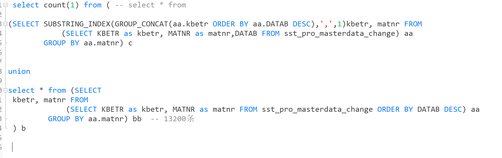
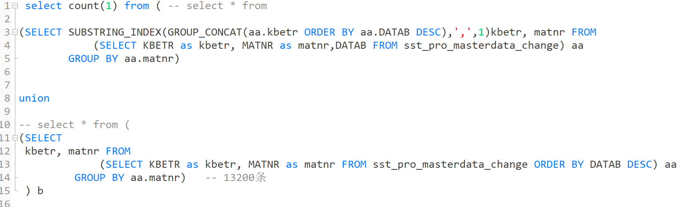

# 练习题

## 聚合函数相关


以这道题为例：[**统计各个部门的工资记录数**](https://www.nowcoder.com/practice/6a62b6c0a7324350a6d9959fa7c21db3?tpId=82&&tqId=29774&rp=1&ru=/ta/sql&qru=/ta/sql/question-ranking)

```mysql
select d.dept_no, n.dept_name, count(s.emp_no) as sum from
dept_emp d join salaries s on s.emp_no=d.emp_no
join departments n on n.dept_no=d.dept_no
group by d.dept_no
order by d.dept_no asc
```

这道题根据 dept_no 属性进行分组，对每个组内的emp_no 属性个数进行计算，就可以得到每个部门中的工资记录条数。


> GROUP BY 语句用于 **结合聚合函数**，根据一个或多个列对结果集进行分组。

group by 就是根据需要分组的字段，将拥有相同该字段值的行数据都分到一个组中

随后，在 select 使用聚合函数时，例如：sum, avg, count, max等等，使用的属性就是组内的各个属性，对其进行计数、求平均值等操作

**由于查询结果已经分组，那么这些聚合操作不会对整表的数据进行聚合，只会在组内聚合**


> :chestnut: [**获取每个部门中当前员工薪水最高的相关信息**](https://www.nowcoder.com/practice/4a052e3e1df5435880d4353eb18a91c6?tpId=82&&tqId=29764&rp=1&ru=/ta/sql&qru=/ta/sql/question-ranking)
>
> d.emp_no是非聚合字段，不能出现在SELECT。因为**一个聚合字段(dept_no)对应多个非聚合字段**(emp_no)，所以选择的时候，会随机选择非聚合字段中的任何一个，于是出错。
>
> 如果写成这样，当多人同时拥有最高薪水时也无法查出
>
> **简而言之：使用GROUP BY子句时，SELECT子句中只能有聚合键、聚合函数、常数。**


## 子查询 & 联表


[ **使用子查询的方式找出属于Action分类的所有电影对应的title,description**](https://www.nowcoder.com/practice/2f2e556d335d469f96b91b212c4c203e?tpId=82&&tqId=29782&rp=1&ru=/ta/sql&qru=/ta/sql/question-ranking)

- 这是子查询，内层使用 select查询出外层查询所需要的数据 / 数据范围，外层可以使用 in / not in

```mysql
select f.title,f.description from film as f
where f.film_id in (select fc.film_id from film_category as fc
               where fc.category_id in (select c.category_id from category as c
                                        where c.name = 'Action'));
```


- 多表查询 / join。将多张表拼在一起，这个过程中会增加很多字段然后形成一张 **大表**，找到所需数据

```mysql
select f.title,f.description
from film as f inner join film_category as fc on f.film_id = fc.film_id
               inner join category as c on c.category_id = fc.category_id
where c.name = 'Action';
```


## [mysql字符串拼接](https://www.nowcoder.com/practice/6744b90bbdde40209f8ecaac0b0516fe?tpId=82&&tqId=29800&rp=1&ru=/ta/sql&qru=/ta/sql/question-ranking)


MySQL、SQL Server、Oracle等数据库支持CONCAT方法，
而本题所用的SQLite数据库只支持用连接符号"||"来连接字符串

 CONCAT方法：

```mysql
select CONCAT(CONCAT(last_name," "),first_name) as name from employees

select CONCAT(last_name," "，first_name) as name from employees
```


```mysql
select last_name||" "||first_name as name from employees
```


https://www.nowcoder.com/practice/810bf4ee3ac64949b08983aa66ec7bee?tpId=82&&tqId=29818&rp=1&ru=/ta/sql&qru=/ta/sql/question-ranking

```mysql
-- select last_name || "'"|| first_name as name FROM employees
select concat(last_name,"'",first_name) as name from employees;
```


## [强制索引](https://www.nowcoder.com/practice/f9fa9dc1a1fc4130b08e26c22c7a1e5f?tpId=82&&tqId=29807&rp=1&ru=/ta/sql&qru=/ta/sql/question-ranking)


mysql:

```mysql
SELECT * FROM salaries FORCE INDEX(idx_emp_no) WHERE emp_no = 10005
```

sqlite:

```sqlite
SELECT * FROM salaries INDEXED BY idx_emp_no WHERE emp_no = 10005
```


## [新增一列](https://www.nowcoder.com/practice/119f04716d284cb7a19fba65dd876b03?tpId=82&&tqId=29808&rp=1&ru=/ta/sql&qru=/ta/sql/question-ranking)


```mysql
alter table actor add column 
create_date datetime not null default '2020-10-01 00:00:00' -- 这些和创建表的语句一样
after last_update; -- 在这一列之后
```


## [case用法](https://www.nowcoder.com/practice/5cdbf1dcbe8d4c689020b6b2743820bf?tpId=82&&tqId=29827&rp=1&ru=/ta/sql&qru=/ta/sql/question-ranking)


```mysql
SELECT e.emp_no, e.first_name, e.last_name, b.btype, s.salary, 
(CASE b.btype 
 WHEN 1 THEN s.salary * 0.1
 WHEN 2 THEN s.salary * 0.2
 ELSE s.salary * 0.3 END) AS bonus
FROM employees AS e INNER JOIN emp_bonus AS b ON e.emp_no = b.emp_no
INNER JOIN salaries AS s ON e.emp_no = s.emp_no AND s.to_date = '9999-01-01'
```


## 更新或删除，不能使用select中的表直接作为子查询语句


[删除重复记录](https://www.nowcoder.com/practice/3d92551a6f6d4f1ebde272d20872cf05?tpId=82&&tqId=29810&rp=1&ru=/ta/sql&qru=/ta/sql/question-ranking)

```mysql
-- id是自增主键，多次插入同一条记录，主键不同，但是后面的数据是相同的。根据emp_no分组，保留每组最小的id
-- MySQL的UPDATE或DELETE中子查询不能为同一张表，可将查询结果再次SELECT，相当于套一层select *
-- ERROR 1093 (HY000): You can't specify target table 'titles_test' for update in FROM clause
delete from titles_test
where id not in (
    select * from(
        select min(id) from titles_test  group by emp_no
    ) as a
);
```

[**将所有获取奖金的员工当前的薪水增加10%**](https://www.nowcoder.com/practice/d3b058dcc94147e09352eb76f93b3274?tpId=82&&tqId=29816&rp=1&ru=/ta/sql&qru=/ta/sql/question-ranking)

```mysql
update salaries set salary=salary*1.1 where emp_no in (
select * from (select s.emp_no from salaries s 
inner join emp_bonus eb
on s.emp_no=eb.emp_no
) as a )
and to_date = '9999-01-01'
```


解决办法：

再套一层子查询：`select *`


## [**查找最晚入职员工的所有信息**](https://www.nowcoder.com/practice/218ae58dfdcd4af195fff264e062138f?tpId=82&&tqId=29753&rp=1&ru=/ta/sql&qru=/ta/sql/question-ranking)

```mysql
select * from employees 
where hire_date=
(select max(hire_date) from employees)
```

使用子查询，先找出所有入职时间里最大（即最晚）的时间，这样可以确保多条最晚入职时间都可以被查询出来。

有使用 order by **按由大到小排序后选取第一条的方法**，但这种方法仅限于当最晚入职数据**只有一条时**才正确，不能保证有**多条同一最晚时间**时的准确性。

```mysql
select * from employees 
order by hire_date desc 
limit 1;
```


## [查找入职员工时间排名倒数第三的员工所有信息](https://www.nowcoder.com/practice/ec1ca44c62c14ceb990c3c40def1ec6c?tpId=82&&tqId=29754&rp=1&ru=/ta/sql&qru=/ta/sql/question-ranking)


```mysql
select * from employees
where hire_date=
(
select distinct hire_date from employees order by hire_date desc limit 2, 1
)
```

- LIMIT m,n : 表示从第m+1条开始，取n条数据；

  LIMIT n ： 表示从**第0条开始(默认)**，取n条数据，是limit(0,n)的缩写。

  `limit 2, 1` 去掉排名倒数第一第二的数据，取倒数第三条

- 需要**加distinct去重**。

  **因为子查询是只需要倒数第三的日期值，**

  假设 5-23（入职最晚日期）入职的有a,b,c 3人；

  ​    5-22（入职第二晚日期）入职的有d,e 2人；

  ​    5-21(入职倒数第三晚)入职的有f,g,h 3人；

  ​    5-21前入职的若干...

  若 不加distinct去重，那么**按照日期倒序**，limit 2,1（从倒数第2行开始，取一条数据）的查询结果为 5-23（多个相同值也计算在内）

  加了distinct去重，会按入职日期进行分组，**多个相同入职日期会分为一组**，这样limit 2,1的结果即为 5-21。

- `order by ... desc`  按照该字段降序排序


## [查找薪水记录超过15次的员工号emp_no以及其对应的记录次数t](https://www.nowcoder.com/practice/6d4a4cff1d58495182f536c548fee1ae?tpId=82&&tqId=29759&rp=1&ru=/ta/sql&qru=/ta/sql/question-ranking)


```mysql
select emp_no, count(emp_no) as t 
from salaries
group by emp_no 
HAVING t > 15
```


- 如何统计薪水涨幅超过15次的员工，就是用的`count(emp_no)`这个方法直接计算的

  **注意用count这个统计出现次数的方法。**

- group by就是分组，根据薪水对所有的行数据进行分组

- WHERE语句在GROUP BY语句之前；SQL会在分组之前计算WHERE语句。  

  HAVING语句在GROUP BY语句之后；**SQL会在分组之后计算HAVING语句，**

  :star2: **这里是先分组，然后利用分组结果来进行判断，故使用HAVING**


## [**查找当前薪水详情以及部门编号dept_no**](https://www.nowcoder.com/practice/c63c5b54d86e4c6d880e4834bfd70c3b?tpId=82&&tqId=29755&rp=1&ru=/ta/sql&qru=/ta/sql/question-ranking)


```mysql
select s.*, m.`dept_no` from 
`dept_manager` as m left join `salaries` as s on m.`emp_no`=s.`emp_no`
```


这里全体员工表中有员工也有部门领导，所以使用部门领导表左连接薪水表，可以筛除所有的普通员工。


类似的，这个题：[ **查找所有员工的last_name和first_name以及对应部门编号dept_no**](https://www.nowcoder.com/practice/dbfafafb2ee2482aa390645abd4463bf?tpId=82&&tqId=29757&rp=1&ru=/ta/sql&qru=/ta/sql/question-ranking)

```mysql
select e.last_name, e.first_name, d.dept_no from 
employees as e left join dept_emp as d 
on e.emp_no=d.emp_no
```

查找所有已经分配部门的员工的last_name和first_name以及dept_no，也包括暂时没有分配具体部门的员工，**这里需要所有的员工信息，没有部门的表示为null，那么就使用员工表左连接部门表**


## [**获取所有非manager的员工emp_no**](https://www.nowcoder.com/practice/32c53d06443346f4a2f2ca733c19660c?tpId=82&&tqId=29762&rp=1&ru=/ta/sql&qru=/ta/sql/question-ranking)


```mysql
select emp_no from employees where emp_no 
not in 
(select emp_no from dept_manager)
```


- 使用NOT IN选出在employees但不在dept_manager中的emp_no记录

- 先使用LEFT JOIN连接两张表，再从此表中选出dept_no值为NULL对应的emp_no记录

```mysql
SELECT e.emp_no
FROM employees AS e
LEFT JOIN dept_manager AS d
ON e.emp_no=d.emp_no
WHERE dept_no IS NULL;
```


## [**获取所有员工当前的manager**](https://www.nowcoder.com/practice/e50d92b8673a440ebdf3a517b5b37d62?tpId=82&&tqId=29763&rp=1&ru=/ta/sql&qru=/ta/sql/question-ranking)


```mysql
select e.emp_no, m.emp_no as manager from
dept_emp as e left join dept_manager as m on e.dept_no=m.dept_no
where e.emp_no <> m.emp_no
```


- 自己与经理的部门要相同，故有限制条件 `e.dept_no = m.dept_no`

- 如果manager是自己，那么不显示。是自己也就是员工编号emp_no和经理编号emp_no是一样的


## [**获取每个部门中当前员工薪水最高的相关信息**](https://www.nowcoder.com/practice/4a052e3e1df5435880d4353eb18a91c6?tpId=82&&tqId=29764&rp=1&ru=/ta/sql&qru=/ta/sql/question-ranking)


```mysql
select r.dept_no,ss.emp_no,r.maxSalary from 
(
    select d.dept_no, max(s.salary)as maxSalary 
    from dept_emp d,salaries s
    where d.emp_no=s.emp_no and d.to_date='9999-01-01' and s.to_date='9999-01-01'
    group by d.dept_no
) as r, salaries ss, dept_emp dd
where r.maxSalary=ss.salary and r.dept_no=dd.dept_no
and dd.emp_no=ss.emp_no
and ss.to_date='9999-01-01'
and dd.to_date='9999-01-01'
order by r.dept_no asc
```

- where筛选条件和 内连接+on筛选条件，效果一致，可以替换

- 先通过 `group by d.dept_no` **聚合操作**， 获得每个部门的部门编号及部门内的最高薪水，作为子表
- 三张表联表查询，通过部门编号和最高薪水来查到 **它们属于哪一个员工**
- 根据部门编号排序
- **可以查询出一个部门中有多个相同的最高薪水的情况**


记录一个有问题的方法：

```mysql
SELECT d.dept_no, d.emp_no, s.salary
FROM dept_emp as d
INNER JOIN salaries as s
ON d.emp_no=s.emp_no
WHERE d.to_date='9999-01-01’
AND s.to_date='9999-01-01'
GROUP BY d.dept_no
HAVING salary=MAX(s.salary);
```

d.emp_no是非聚合字段，不能出现在SELECT。因为一个聚合字段(dept_no)对应多个非聚合字段(emp_no)，所以选择的时候，会随机选择非聚合字段中的任何一个，于是出错。

如果写成这样，当多人同时拥有最高薪水时也无法查出

**简而言之：使用GROUP BY子句时，SELECT子句中只能有聚合键、聚合函数、常数。**


如果这题**不需要给出emp_no**(即只求所有部门中当前员工薪水最高值)，则用INNER JOIN和GROUP BY和MAX即可解决：

```mysql
SELECT d.dept_no, MAX(s.salary)
FROM dept_emp as d
INNER JOIN salaries as s
ON d.emp_no=s.emp_no
AND d.to_date='9999-01-01'
AND s.to_date='9999-01-01'
GROUP BY d.dept_no;
```


## [**统计出当前各个title类型对应的员工当前薪水对应的平均工资**](https://www.nowcoder.com/practice/c8652e9e5a354b879e2a244200f1eaae?tpId=82&&tqId=29768&rp=1&ru=/ta/sql&qru=/ta/sql/question-ranking)


统计出各个title类型对应的员工薪水对应的平均工资avg。结果给出title以及平均工资avg，并且以avg升序排序

```mysql
select t.title, avg(s.salary) as `avg` from 
titles t inner join salaries s on t.emp_no=s.emp_no
group by t.title
order by `avg` asc
```

- 按照 title 类型进行聚合
- 使用 avg 聚合计算出每个title类型中的薪资的平均值
- 对聚合出的每个title类型中的薪资的平均值进行升序排序


## [**获取当前薪水第二多的员工的emp_no以及其对应的薪水salary**](https://www.nowcoder.com/practice/8d2c290cc4e24403b98ca82ce45d04db?tpId=82&&tqId=29769&rp=1&ru=/ta/sql&qru=/ta/sql/question-ranking)

 

**结果不唯一时：**

```mysql
select emp_no, salary from salaries
where salary = (select distinct salary from salaries order by salary desc limit 1, 1)
```

- 子查询，通过 `distinct` 找到唯一的、第二大的薪水值，然后去表中找到所有等于这个值的员工信息


**只存在唯一值：**

```mysql
select emp_no, salary from salaries
order by salary desc
limit 1, 1
```


## [**获取当前薪水第二多的员工的emp_no以及其对应的薪水salary**](https://www.nowcoder.com/practice/c1472daba75d4635b7f8540b837cc719?tpId=82&&tqId=29770&rp=1&ru=/ta/sql&qru=/ta/sql/question-ranking)


```mysql
select e.emp_no, s.salary, e.last_name, e.first_name 
from employees e join salaries s 
on e.emp_no=s.emp_no 
and s.salary = (
    select max(salary) from salaries -- 第二大的
    where salary < ( 
        select max(salary) from salaries -- 找到最大的
    )
)
```


通用型可以求任意第几高，并且可以求多个形同工资

```mysql
select e.emp_no,s.salary,e.last_name,e.first_name
from
employees e
join 
salaries s on e.emp_no=s.emp_no 
and  s.to_date='9999-01-01'
and s.salary = 
(
     select s1.salary
     from 
     salaries s1
     join
     salaries s2 on s1.salary<=s2.salary -- 自连接， 使用<=，那么还包括一个最大值 
     and s1.to_date='9999-01-01' and s2.to_date='9999-01-01'
     group by s1.salary -- 对s1的工资属性进行分组聚合
     having count(distinct s2.salary)=2 -- 对每个分组，去除重复的值，最终每个组元素的个数即为大于等于（包括自己）当前组的聚合值的个数，选择2，即为当前组只有一个比自己大的值，那么就是第二名
 )
```


## [ **查找所有员工的last_name和first_name以及对应的dept_name**](https://www.nowcoder.com/practice/5a7975fabe1146329cee4f670c27ad55?tpId=82&&tqId=29771&rp=1&ru=/ta/sql&qru=/ta/sql/question-ranking)


```mysql
select last_name, first_name, dept_name from
(select e.last_name, e.first_name, e.emp_no, de.dept_no from employees e left join dept_emp de on e.emp_no=de.emp_no) as t
left join departments d on t.dept_no=d.dept_no

-- select e.last_name, e.first_name, e.emp_no, de.dept_no from employees e left join dept_emp de on e.emp_no=de.emp_no  这里也使用左连接，目的是能够展示所有的员工，无论有没有部门，如果使用内连接，那么只会找到在中间表中记录了部门信息的员工
```


## [**查找在职员工自入职以来的薪水涨幅情况**](https://www.nowcoder.com/practice/fc7344ece7294b9e98401826b94c6ea5?tpId=82&&tqId=29773&rp=1&ru=/ta/sql&qru=/ta/sql/question-ranking)


```mysql

-- 思路：不需要计算每一次的涨幅，只计算当前的工资和入职时的工资
select e.emp_no, (s1.salary-s2.salary) as growth from
employees e 
inner join salaries s1 on e.emp_no=s1.emp_no and s1.to_date='9999-01-01' -- 找出当前工资
inner join salaries s2 on e.emp_no=s2.emp_no and e.hire_date=s2.from_date -- 入职时的工资
order by growth asc;
```


需要分别求得入职时的工资与当前时间“ 9999-01-01”对应的工资。


## [**对所有员工的薪水按照salary降序进行1-N的排名**](https://www.nowcoder.com/practice/b9068bfe5df74276bd015b9729eec4bf?tpId=82&&tqId=29775&rp=1&ru=/ta/sql&qru=/ta/sql/question-ranking)


```mysql
select s.emp_no, t.salary, t.t_rank from 
-- 子表只需要查出工资和排名，emp_no不需要，因为作为非聚合属性，会随机选一个，并且也不需要这个属性，只要将该子表的工资、排名和主表对应即可
(
    select s1.salary, count(distinct s2.salary) as t_rank from salaries s1 join salaries s2 on s1.salary<=s2.salary
    group by s1.salary
) as t
join salaries s on  s.salary=t.salary
order by t.t_rank asc

-- 使用自连接进行排名  需要进行去重操作：有并列排名并且不占位
-- select s1.emp_no,s1.salary, count(distinct s2.salary) as t_rank from salaries s1 join salaries s2 on s1.salary<=s2.salary group by s1.salary
```


- 本题的精髓在于**`s1.salary <= s2.salary`，意思是在输出s1.salary的情况下，有多少个s2.salary大于等于s1.salary**，比如当s1.salary=94409时，有3个s2.salary（分别为94692,94409,94409）大于等于它，但由于94409重复，利用COUNT(DISTINCT s2.salary)去重可得工资为94409的rank等于2。其余排名以此类推。


## [ **获取员工其当前的薪水比其manager当前薪水还高的相关信息**](https://www.nowcoder.com/practice/f858d74a030e48da8e0f69e21be63bef?tpId=82&&tqId=29777&rp=1&ru=/ta/sql&qru=/ta/sql/question-ranking)


```mysql
select emp.emp_no, mng.emp_no as manager_no, emp.salary as emp_salary, mng.salary as manager_salary from
(
    select e.emp_no, e.dept_no, s.salary from dept_emp e join salaries s 
    on s.emp_no=e.emp_no and e.emp_no not in (select emp_no from dept_manager)
) as emp
join
(
    select d.emp_no, d.dept_no, s.salary from dept_manager d join salaries s on s.emp_no=d.emp_no
) as mng
on emp.dept_no=mng.dept_no and emp.salary>mng.salary
```

> 把复杂的查询分成一个个简单的查询，最后再**将其组合在一起**，这便是分合的思想。 

本题主要思想是创建两张表（一张记录当前所有员工的工资，另一张只记录部门经理的工资）进行比较

1、先用INNER JOIN连接salaries和demp_emp，建立当前所有员工的工资记录emp

2、再用INNER JOIN连接salaries和demp_manager，建立当前所有员工的工资记录mng

3、最后用限制条件 `emp.dept_no=mng.dept_no and emp.salary>mng.salary` 找出同一部门中工资比经理高的员工，并根据题意依次输出emp_no、manager_no、emp_salary、manager_salary


## [**汇总各个部门当前员工的title类型的分配数目**](https://www.nowcoder.com/practice/4bcb6a7d3e39423291d2f7bdbbff87f8?tpId=82&&tqId=29778&rp=1&ru=/ta/sql&qru=/ta/sql/question-ranking)


```mysql
select d.dept_no, d.dept_name, t.title, count(e.emp_no) as `count`
from departments d join dept_emp e on d.dept_no=e.dept_no
join titles t on t.emp_no=e.emp_no
-- 这里注意：需要先按照dept_no分组，因为不同部门，包含了不同title，首先是根据部门分组，然后同一部门再根据title分组。
group by d.dept_no, t.title
order by d.dept_no asc
```


关键在于**用 GROUP BY 同时对 de.dept_no 和 t.title进行分组**

> group by 可以对多个属性进行分组，按先后次序


## [**SQL28**](https://www.nowcoder.com/practice/3a303a39cc40489b99a7e1867e6507c5?tpId=82&&tqId=29780&rp=1&ru=/ta/sql&qru=/ta/sql/question-ranking)


```mysql
select c.name, count(fc.film_id) from
film f join film_category fc on f.film_id=fc.film_id and f.description like '%robot%'
-- 找出包含电影总数量(count(film_category.category_id))>=5部的所有类别id  只要求这个分类本身对应电影数量>=5，(也就是说既包含有robot的又包含没有robot的)。  
and fc.category_id in (select category_id from film_category group by category_id HAVING count(film_id)>=5)
join category c on c.category_id=fc.category_id

-- 或者筛选出数量>=5的分类，建立一张子表
```


## [**使用join查询方式找出没有分类的电影id以及名称**](https://www.nowcoder.com/practice/a158fa6e79274ac497832697b4b83658?tpId=82&&tqId=29781&rp=1&ru=/ta/sql&qru=/ta/sql/question-ranking)


- 可以直接使用 关键字：not in

- 用 `LEFT JOIN` 连接 film 和 film_category，限定条件为 f.film_id = fc.film_id

```mysql
select f.film_id, f.title from film f left join film_category fc on f.film_id=fc.film_id
where fc.category_id is null
```

**这里注意，where是作用在左连接后的表上的，不能写成 on ... and ...**


## [**批量插入数据，不使用replace操作**](https://www.nowcoder.com/practice/153c8a8e7805400ba8e384e03acc6b3e?tpId=82&&tqId=29803&rp=1&ru=/ta/sql&qru=/ta/sql/question-ranking)


mysql:

```mysql
insert IGNORE into actor
values(3,'ED','CHASE','2006-02-15 12:34:33');
```


sqlite:

```mysql
insert or ignore into actor
values(3,'ED','CHASE','2006-02-15 12:34:33');
```


## [**创建一个actor_name表**](https://www.nowcoder.com/practice/881385f388cf4fe98b2ed9f8897846df?tpId=82&&tqId=29804&rp=1&ru=/ta/sql&qru=/ta/sql/question-ranking)


mysql:

```mysql
create table actor_name
select first_name,last_name from actor;
```

sqlite:

```mysql
create table actor_name as
select first_name,last_name from actor;
```


## [创建视图](https://www.nowcoder.com/practice/b9db784b5e3d488cbd30bd78fdb2a862?tpId=82&&tqId=29806&rp=1&ru=/ta/sql&qru=/ta/sql/question-ranking)


```mysql
CREATE VIEW actor_name_view (first_name_v, last_name_v) AS
SELECT first_name, last_name FROM actor 

CREATE VIEW actor_name_view AS
SELECT first_name AS fist_name_v, last_name AS last_name_v
FROM actor 
```


## [构造触发器](https://www.nowcoder.com/practice/7e920bb2e1e74c4e83750f5c16033e2e?tpId=82&&tqId=29809&rp=1&ru=/ta/sql&qru=/ta/sql/question-ranking)


```mysql
CREATE TRIGGER audit_log AFTER INSERT ON employees_test
for each row
BEGIN
    INSERT INTO audit VALUES(NEW.ID,NEW.NAME);
END;
```


## [删除重复记录](https://www.nowcoder.com/practice/3d92551a6f6d4f1ebde272d20872cf05?tpId=82&&tqId=29810&rp=1&ru=/ta/sql&qru=/ta/sql/question-ranking)


```mysql
-- id是自增主键，多次插入同一条记录，主键不同，但是后面的数据是相同的。根据emp_no分组，保留每组最小的id
-- MySQL的UPDATE或DELETE中子查询不能为同一张表，可将查询结果再次SELECT，相当于套一层select *
delete from titles_test
where id not in (
    select * from(
        select min(id) from titles_test  group by emp_no
    ) as a
);
```


## [更新语句(replace)](https://www.nowcoder.com/practice/2bec4d94f525458ca3d0ebf3bc8cd240?tpId=82&&tqId=29812&rp=1&ru=/ta/sql&qru=/ta/sql/question-ranking)


- 方法一：**全字段更新替换**。由于 REPLACE 的新记录中 id=5，与表中的主键 id=5 冲突，故会替换掉表中 id=5
  的记录，否则会插入一条新记录（例如新插入的记录 id = 10）。并且要将所有字段的值写出，否则将置为空。

```mysql
replace into titles_test
select 5, 10005, title, from_date, to_date
from titles_test
where id = 5;
```


- 方法二：**运用REPLACE(X,Y,Z)函数。**其中X是要处理的字符串，Y是X中将要被替换的字符串，Z是用来替换Y的字符串，最终返回替换后的字符串。

  以下语句用UPDATE和REPLACE 配合完成，用REPLACE函数替换后的新值复制给 id=5 的
  emp_no。REPLACE的参数为整型时也可通过。

```mysql
update titles_test set emp_no = REPLACE(emp_no, 10001, 10005) where id=5
```


## [重命名表]()


```mysql
ALTER TABLE titles_test RENAME TO titles_2017

RENAME TABLE titles_test to titles_2017;
```


## [创建外键约束]()


```mysql
alter table audit 
add foreign key (emp_no) 
references employees_test (id)
```


## [**查找字符串 10,A,B 中逗号,出现的次数cnt**](https://www.nowcoder.com/practice/e3870bd5d6744109a902db43c105bd50?tpId=82&&tqId=29819&rp=1&ru=/ta/sql&qru=/ta/sql/question-ranking)


```mysql
select (length("10,A,B") - length(replace("10,A,B",",","")) ) as cnt;
```


## [截取字符串substr](https://www.nowcoder.com/practice/74d90728827e44e2864cce8b26882105?tpId=82&&tqId=29820&rp=1&ru=/ta/sql&qru=/ta/sql/question-ranking)


本题考查 `substr(X,Y,Z)` 或 substr(X,Y) 函数的使用。其中**X是要截取的字符串**。**Y是字符串的起始位置**（注意第一个字符的位置为1，而不为0），取值范围是±(1~length(X))，

- 当Y等于length(X)时，则截取最后一个字符；
- 当Y等于负整数-n时，则从倒数第n个字符处截取。
- **Z是要截取字符串的长度**，取值范围是正整数，
- **若Z省略，则从Y处一直截取到字符串末尾；**
- 若Z大于剩下的字符串长度，也是截取到字符串末尾为止。


```mysql
SELECT first_name FROM employees ORDER BY substr(first_name,length(first_name)-``1``) 
SELECT first_name FROM employees ORDER BY substr(first_name,-``2``) 
```


## [分组内字符串连接group_concat](https://www.nowcoder.com/practice/6e86365af15e49d8abe2c3d4b5126e87?tpId=82&&tqId=29821&rp=1&ru=/ta/sql&qru=/ta/sql/question-ranking)


此函数必须与 GROUP BY 配合使用。此题以 dept_no 作为分组，将每个分组中不同的emp_no用逗号连接起来（即可省略Y）

```mysql
select dept_no, group_concat(emp_no SEPARATOR ',') from dept_emp group by dept_no
-- 默认就是逗号连接
```


# sql操作


### union&union all


union和union all的区别是,union会**自动压缩**多个结果集合中的重复结果，而union all则将所有的结果全部显示出来，**不管是不是重复**。

Union：对两个**结果集**进行**并集操作**，不包括重复行，同时进行默认规则的排序；
UNION在进行表链接后会筛选掉重复的记录，所以在表链接后会对所产生的结果集进行排序运算，删除重复的记录再返回结果。


> **一般union这两个操作都是在查询出结果以后才能进行合并操作，并且在结果列对应的情况才行，因为union操作会将第二个结果直接合并在第一个下，字段名也会跟随第一个结果**


----

union使用




需要是两次查询结果进行union操作，而不能像上图一样一个是表c，一个是select *后的查询结果


这样就可以




### like concat & like


```mysql
select * from tree1 where path like CONCAT('%','6')
```

拼接结果，防止sql注入：

```mysql
-- 后端这样使用：，传入num
select * from tree1 where path like CONCAT('%',#{num})   
```


### substring_index,left,right


```
substring_index(string,sep,num)
substring_index(字符串,分隔符,序号)


参数说明

string：用于截取目标字符串的字符串。可为字段，表达式等。

sep：分隔符，string存在且用于分割的字符，比如“，”、“.”等。

num：序号，为非0整数。若为整数则表示从左到右数，若为负数则从右到左数。

比如“www.mysql.com”截取字符‘www’，分割符为“.”，从左到右序号为1，即substring_index("www.mysql.com",'.',1)；

若从右开始获取“com”则为序号为-1即substring_index("www.mysql.com",'.',-1)
```


---


```
LEFT(str,len)
```

str: 给定的字符串，将从其左侧提取字符

len: 要提取的字符数，如果此参数大于字符串中的字符数，则此函数将返回实际的字符串

注意: **如果任一参数为Null，结果返回Null**

```
SELECT LEFT('2019-01-30',NULL);
SELECT LEFT(NULL,3);
结果为NULL;
```


> [SUBSTRING](http://www.yiibai.com/mysql/substring.html)(或[SUBSTR](http://www.yiibai.com/mysql/substring.html))函数也提供与`LEFT`函数相同的功能。


### group_concat()


将分组中括号里对应的字符串进行连接.如果分组中括号里的参数xxx有多行，那么就会将这多行的字符串连接，每个字符串之间会有特定的符号进行分隔

```mysql
# 将分组中column1这一列对应的多行的值按照column2 升序或者降序进行连接，其中分隔符为seq
# 如果用到了DISTINCT，将表示将不重复的column1按照column2升序或者降序连接
# 如果没有指定SEPARATOR的话，也就是说没有写，那么就会默认以 ','分隔
GROUP_CONCAT([DISTINCT] column1 [ORDER BY column2 ASC\DESC] [SEPARATOR seq]);

```

- [ ORDER BY column2 ASC\DESC] :表示将会根据column2升序或者降序连接.其中column2不一定一定要求是column1,只要**保证column2在这个分组**中即可.如果没有写ORDER BY句段，那么**连接是没有顺序的**。
- [ SEPARATOR seq] : 表示各个column1将会以什么分隔符进行分隔，例如SEPARATOR '’,则表示column1将会以进行分隔。如果没有指定seq的时候，也即没有写SEPARATOR seq这个句段，那么就会默认是以","分隔的。

> **排序规则的字段一定是需要在当前分组内，**


**CONCAT函数中要连接的数据含有NULL，最后返回的是NULL，但是GROUP_CONCAT不会这样，他会忽略NULL值。**


---

:chestnut:

```mysql
    mysql> SELECT * FROM employee2;
      +----+-----------+------+---------+---------+
      | id | name      | age  | salary  | dept_id |
      +----+-----------+------+---------+---------+
      |  3 | 小肖      |   29 | 30000.0 |       1 |
      |  4 | 小东      |   30 | 40000.0 |       2 |
      |  6 | 小非      |   24 | 23456.0 |       3 |
      |  7 | 晓飞      |   30 | 15000.0 |       4 |
      |  8 | 小林      |   23 | 24000.0 |    NULL |
      | 10 | 小五      |   20 |  4500.0 |    NULL |
      | 11 | 张山      |   24 | 40000.0 |       1 |
      | 12 | 小肖      |   28 | 35000.0 |       2 |
      | 13 | 李四      |   23 | 50000.0 |       1 |
      | 17 | 王武      |   24 | 56000.0 |       2 |
      | 18 | 猪小屁    |    2 | 56000.0 |       2 |
      | 19 | 小玉      |   25 | 58000.0 |       1 |
      | 21 | 小张      |   23 | 50000.0 |       1 |
      | 22 | 小胡      |   25 | 25000.0 |       2 |
      | 96 | 小肖      |   19 | 35000.0 |       1 |
      | 97 | 小林      |   20 | 20000.0 |       2 |
      +----+-----------+------+---------+---------+
      16 rows in set (0.16 sec)
      
      mysql> SELECT
          -> dept_id,
          -> GROUP_CONCAT(name ORDER BY age DESC SEPARATOR '*') -- 分组中的name中的多行数据将按照age降序进行连接，分隔符为 * 
          -> FROM employee2
          -> GROUP BY dept_id; -- 注意如果这里没有GROUP BY dept_id，那么就会因为输出dept_id而发生报错，行数不对应，dept_id是所有的数据都有，但GROUP_CONCAT拼接出的数据只有一个，所以需要分组
      +---------+----------------------------------------------------+
      | dept_id | GROUP_CONCAT(name ORDER BY age DESC SEPARATOR '*') |
      +---------+----------------------------------------------------+
      |    NULL | 小林*小五                                           |
      |       1 | 小肖*小玉*张山*小张*李四*小肖                          |
      |       2 | 小东*小肖*小胡*王武*小林*猪小屁                         |
      |       3 | 小非                                                |
      |       4 | 晓飞                                                |
      +---------+----------------------------------------------------+
      
      
      mysql> SELECT
          -> GROUP_CONCAT(name SEPARATOR '*') 
          -> FROM employee2; -- 这时候虽然没有使用GROUP BY，但是可以正常运行，此时是将所有的name连接,连接时为无序,分隔符为*
      +-------------------------------------------------------------------------------------------------------+
      | GROUP_CONCAT(name SEPARATOR '*')                                                                      | 
      +--------------------------------------------------------------------------------------------------------
      | 小肖*小东*小非*晓飞*小林*小五*张山*小肖*李四*王武*猪小屁*小玉*小张*小胡*小肖*小林                                | 
      +-------------------------------------------------------------------------------------------------------+
      1 row in set (0.00 sec)
      
      mysql> SELECT
          -> GROUP_CONCAT(DISTINCT name SEPARATOR '*') -- 将不同的name进行连接
          -> FROM employee2;
      +-----------------------------------------------------------------------------------------------+
      | GROUP_CONCAT(DISTINCT name SEPARATOR '*')                                                     |
      +-----------------------------------------------------------------------------------------------+
      | 小东*小五*小张*小林*小玉*小肖*小胡*小非*张山*晓飞*李四*猪小屁*王武                            |
      +-----------------------------------------------------------------------------------------------+
      1 row in set (0.00 sec)
      
      
      mysql> SELECT
          -> dept_id,
          -> GROUP_CONCAT(name) AS employees
          -> FROM employee2
          -> GROUP BY dept_id; -- 输出每个部门的员工，每个员工之间用逗号分隔，因为没有写SEPARATOR ，所以就默认以逗号分隔
      +---------+----------------------------------------------+
      | dept_id | employees                                    |
      +---------+----------------------------------------------+
      |    NULL | 小林,小五                                    |
      |       1 | 小肖,张山,李四,小玉,小张,小肖                |
      |       2 | 小东,小肖,王武,猪小屁,小胡,小林              |
      |       3 | 小非                                         |
      |       4 | 晓飞                                         |
      +---------+----------------------------------------------+
      5 rows in set (0.00 sec)
      
      mysql> SELECT
          -> dept_id,
          -> GROUP_CONCAT(DISTINCT name) -- 将不同的name连接，并且用逗号分隔
          -> AS employees
          -> FROM  employee2
          -> GROUP BY dept_id;
      +---------+----------------------------------------------+
      | dept_id | employees                                    |
      +---------+----------------------------------------------+
      |    NULL | 小五,小林                                    |
      |       1 | 小张,小玉,小肖,张山,李四                     |
      |       2 | 小东,小林,小肖,小胡,猪小屁,王武              |
      |       3 | 小非                                         |
      |       4 | 晓飞                                         |
      +---------+----------------------------------------------+
      5 rows in set (0.00 sec)

```


### concat_ws


CONCAT_WS(separator,str1,str2,…)

CONCAT_WS() 代表 `CONCAT With Separator` ，是CONCAT()的特殊形式。第一个参数是其它参数的分隔符。分隔符的位置放在要连接的两个字符串之间。分隔符可以是一个字符串，也可以是其它参数。如果分隔符为 NULL，则结果为 NULL。函数会忽略任何分隔符参数后的 NULL 值。但是CONCAT_WS()不会忽略任何空字符串。 (然而会忽略所有的 NULL）。

```mysql
SELECT CONCAT_WS(',','First name',NULL,'Last Name');
```

返回结果为

```mysql
+----------------------------------------------+
| CONCAT_WS(',','First name',NULL,'Last Name') |
+----------------------------------------------+
| First name,Last Name             			  |
+----------------------------------------------+
```


### left join / right join


经常会遇到多表查询问题

两张表联结查询，a表存储id等基本信息，b表存详细信息：时间等


此时要根据时间范围来查询a、b表信息。

```mysql
select * from a left join 
(
	select * from b where b.date between x and y
)
on a.id = b.id
```


> 不要**<u>乱用</u>**left / right join....
>
> 不如直接多表查询

这样结果会显示a. *和b. *，**因为是按照两个表的id进行连接，并且以a为准**

> **以a表为准：** 不管b的筛选条件如何，都以两表联结的条件on为准，其他字段如果没有，就**显示null**，只要a表数据有就行,
>
> 


对这种情况，

- 可以用 right join，筛选b表的数据行并为基准匹配a表

- 或者用普通的inner join
- **不要在 left join语句里面进行where筛选操作**，在整个语句的外面进行where判断，


