# Spring特点以及常用模块


1. 轻量级
2. 控制反转 IOC  ——>  **低耦合**
3. 面向切面 AOP（Aspect Oriented Programming） ——>  **抽出业务逻辑**
4. 容器  ——>  **IOC容器，保存所需的所有实例，可以配置是单例也可以是每次都创建（`@Configuration(proxyBeanMethods=true)`）**
5. 框架 ——> 组件组合、多种功能


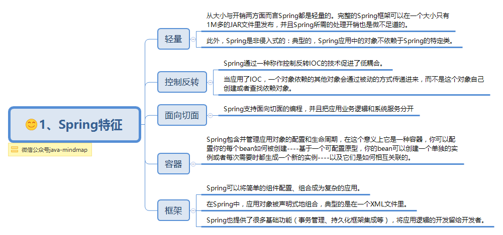


核心组件


---

**常用模块**


1. BeanFactory，工厂模式的实现，使用IOC解耦应用程序组件之间的依赖
2. 使用切面，**集中管理事务、日志、安全等功能**，**复用性和管理的便捷性**
3. mvc框架

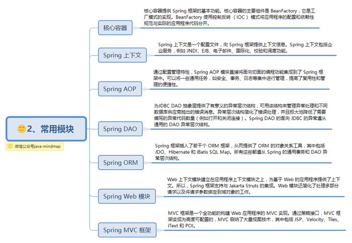


第三方框架集成：

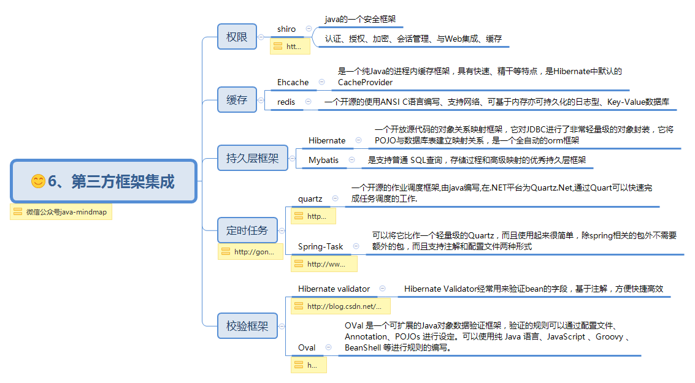


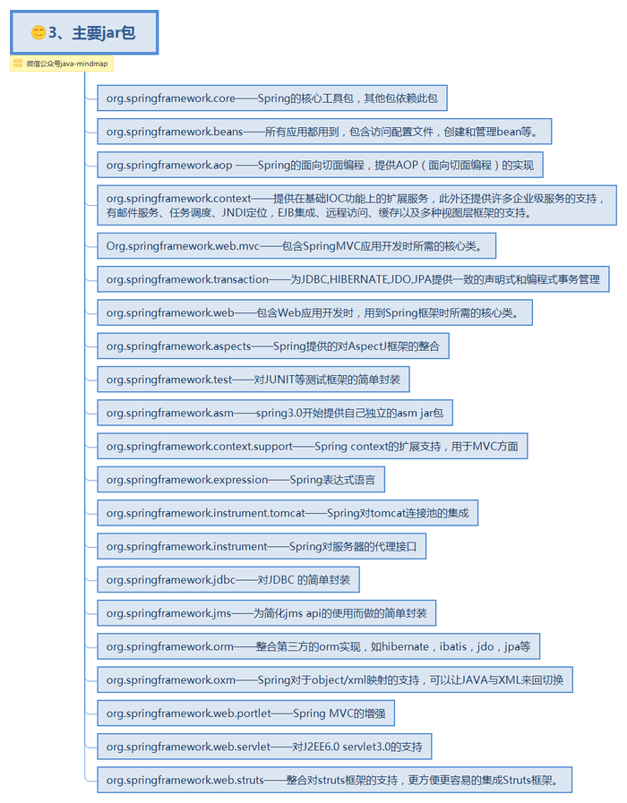


# 常用注解


bean注入与装配（**依赖注入**）的方式有很多种，通过xml、getter/setter、构造函数或者注解等。

**@ResponseBody请求是异步的，返回json数据**

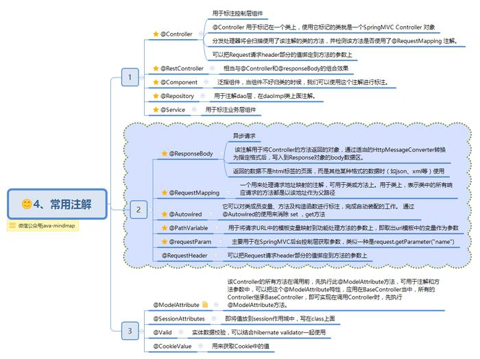


# 控制反转和依赖注入


## IOC是什么


Inversion of Control，“控制反转”，**是一种设计思想**。Ioc意味着将设计好的对象交给容器控制，而不是传统的在你的对象内部直接控制。

> “谁控制谁？控制什么？为何是反转（反转/正转）？哪些方面反转了？”


- 谁控制谁，控制什么？

  传统Java SE程序设计，我们直接在对象内部***通过new进行创建对象***，是程序***主动去创建依赖对象***；而***IoC是有专门一个容器来创建这些对象***，即**由Ioc容器来控制对象的创建**；谁控制谁？当然是**IoC 容器控制了对象**；控制什么？那就是主要控制了外部资源获取（不只是对象包括比如文件等）。


- 为何是反转，哪些方面反转了

  有反转就有正转，传统应用程序是由我们自己在对象中主动控制去**直接获取依赖对象**，也就是正转；而反转则是由***<u>容器来帮忙创建及注入依赖对象</u>***；为何是反转？因为由容器帮我们查找及注入依赖对象，对象只是***被动的接受依赖对象***，所以是反转；哪些方面反转了？***依赖对象的获取被反转了。***

  - 传统程序设计，都是**主动去创建相关对象然后再组合起来**
  - 当有了IoC/DI的容器后，在客户端类中**不再主动去创建这些对象了**，只需要声明出来即可


Spring所倡导的开发方式就是如此，所有的类都会在spring容器中登记，告诉spring**你是个什么东西，你需要什么东西**，然后spring会在系统运行到适当的时候，**把你要的东西主动给你**，同时也**把你交给其他需要你的东西**。**所有的类的创建、销毁都由 spring来控制**，也就是说**控制对象生存周期**的不再是引用它的对象，而是spring。对于某个具体的对象而言，以前是它控制其他对象，现在是***所有对象都被spring控制***，所以这叫控制反转。


## IoC能做什么


IoC 不是一种技术，只是一种思想，一个重要的面向对象编程的法则，它能指导我们如何设计出***松耦合***、更优良的程序。传统应用程序都是由我们在类内部主动创建依赖对象，从而导致***类与类之间高耦合***，难于测试；有了IoC容器后，把**创建和查找依赖对象的控制权交给了容器**，由容器进行注入组合对象，所以对象与对象之间是 松散耦合，这样也方便测试，利于功能复用，更重要的是使得程序的整个体系结构变得非常灵活。

其实IoC对编程带来的最大改变不是从代码上，而是从思想上，发生了“主从换位”的变化。应用程序原本是老大，**要获取什么资源都是主动出击**，但是在IoC/DI思想中，应用程序就变成被动的了，***被动的等待IoC容器来创建并注入它所需要的资源了。***

IoC很好的体现了面向对象设计法则之一  ——  好莱坞法则：“别找我们，我们找你”；即由**IoC容器帮对象找相应的依赖对象并注入，而不是由对象主动去找。**


## IoC和DI


DI—Dependency Injection，即“依赖注入”：**组件之间依赖关系**由容器在***运行期***  决定，形象的说，即由容器动态的将某个依赖关系注入到组件之中。依赖注入的目的并非为软件系统带来更多功能，而是为了提升组件重用的频率，并为系统搭建一个灵活、可扩展的平台。通过依赖注入机制，我们只需要通过简单的配置，而无需任何代码就可**指定目标需要的资源**，**完成自身的业务逻辑**，而不需要关心具体的资源来自何处，由谁实现。

理解DI的关键是：“谁依赖谁，为什么需要依赖，谁注入谁，注入了什么”，那我们来深入分析一下：

●谁依赖于谁：当然是**应用程序依赖于IoC容器**；

●为什么需要依赖：应用程序需要IoC容器来**提供对象需要的外部资源**；

●谁注入谁：很明显是**IoC容器注入应用程序某个对象**，应用程序依赖的对象；

●注入了什么：就是注入某个对象**所需要的外部资源**（包括**对象、资源、常量数据）。**


IoC的一个重点是在系统运行中，动态的向某个对象提供它所需要的其他对象。这一点是通过DI（Dependency Injection，依赖注入）来实现的。比如对象A需要操作数据库，以前我们总是要在A中自己编写代码来获得一个Connection对象，有了 spring我们就只需要告诉spring，A中需要一个Connection，***至于这个Connection怎么构造，何时构造，A不需要知道 (已经构造完成并注入到了 ioc容器中)***。在系统运行时，spring会在适当的时候制造一个Connection，然后像**打针**一样，**注射**到A当中，这样就完成了对各个对象之间关系的控制。

A需要依赖 Connection才能正常运行，而这个Connection是由spring注入到A中的，依赖注入的名字就这么来的。那么DI是如何实现的呢？ Java 1.3之后一个重要特征是**反射**（reflection），它允许程序在***运行的时候动态的生成对象、执行对象的方法、改变对象的属性，spring就是通过反射来实现注入的。***


IoC和DI是什么关系呢？其实它们是同一个概念的不同角度描述，由于控制反转概念比较含糊（可能只是理解为容器控制对象这一个层面，很难让人想到谁来维护对象关系），所以2004年大师级人物Martin Fowler又给出了一个新的名字：“依赖注入”，相对IoC 而言，“依赖注入”明确描述了***<u>“被注入对象依赖 IoC 容器配置依赖对象”</u>***


## 耦合关系


在没有使用Spring的时候，每个对象在需要使用他的合作对象时，自己均要使用像new object() 这样的语法来将合作对象创建出来，这个合作对象是由自己主动创建出来的，创建合作对象的主动权在自己手上，自己需要哪个合作对象，就主动去创建，创建合作对象的主动权和创建时机是由自己把控的，而这样就会使得对象间的耦合度高了，A对象需要使用合作对象B来共同完成一件事，A要使用B，那么A就对B产生了依赖，也就是A和B之间存在一种耦合关系，并且是紧密耦合在一起。

简单来说，耦合可以理解为：在需要对B中的构造等进行修改时，需要对每个依赖了B对象的地方进行修改，每个new B(... , ... , ... , ...)的地方都需要修改，具有**高耦合**


而使用了Spring之后就不一样了，**创建合作对象B的工作是由Spring来做的**，Spring创建好B对象，然后存储到一个容器里面，当A对象需要使用B对象时，Spring就从存放对象的那个容器里面取出A要使用的那个B对象，然后交给A对象使用，至于Spring是如何创建那个对象，以及什么时候创建好对象的，**A对象不需要关心这些细节问题(你是什么时候生的，怎么生出来的我可不关心，能帮我干活就行)**，A得到Spring给我们的对象之后，两个人一起协作完成要完成的工作即可。


**创建对象的控制权进行转移**，这样**一堆类之间的繁杂依赖关系就没了**，它们都依赖IoC容器了，**通过IoC容器来建立它们之间的关系**


控制反转是应用于软件工程领域中的，在运行时被装配器对象来绑定耦合对象的一种编程技巧，对象之间耦合关系在编译时通常是未知的。在传统的编程方式中，**业务逻辑的流程是由应用程序中的早已被设定好关联关系的对象来决定的**。在使用控制反转的情况下，**业务逻辑的流程是由对象关系图来决定的，该对象关系图由装配器负责实例化**，这种实现方式还可以将对象之间的关联关系的***定义抽象化***。而绑定的过程是通过“依赖注入”实现的。

控制反转是一种以给予应用程序中目标组件更多控制为目的设计范式，并在我们的实际工作中起到了有效的作用。

依赖注入是在***编译阶段尚未知所需的功能是来自哪个的类***  的情况下，将其他对象所依赖的功能对象实例化的模式。这就需要一种机制用来激活相应的组件以提供特定的功能，所以依赖注入是控制反转的基础（当前类需要被）。否则如果在组件不受框架控制的情况下，框架又怎么知道要创建哪个组件？

在Java中依赖注入有以下三种实现方式：

1. 构造器注入
2. Setter方法注入
3. 接口注入


# Spring IOC

## Spring IOC原理


Spring通过一个配置文件描述  **Bean**  以及  **Bean之间的依赖关系**，利用 Java语言的反射功能  **实例化 Bean并建立 Bean之间的依赖关系**。

Spring  的  IoC 容器在完成这些底层工作的基础上，提供了 Bean**实例缓存**、**生命周期**管理、**Bean 实例管理**、事件发布、**资源装载**等高级服务


---

**Spring容器高层视图：**

Spring 启动时读取应用程序提供的 Bean 配置信息，并在Spring容器中生成一份相应的 **Bean配置注册表**，然后根据这张注册表**实例化 Bean**，装配好 Bean 之间的**依赖关系**，为上层应用提供**准备就绪的运行环境**。 

Bean缓存池为 HashMap实现

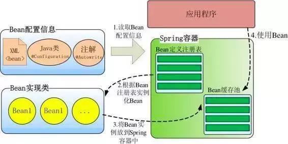


## IOC容器实现


### **BeanFactory-框架基础设施**

BeanFactory 是 Spring 框架的基础设施，**面向 Spring 本身**； **ApplicationContext 面向使用Spring 框架的开发者**

几乎所有的应用场合我们都**直接使用 ApplicationContext** 而非底层的 BeanFactory。  


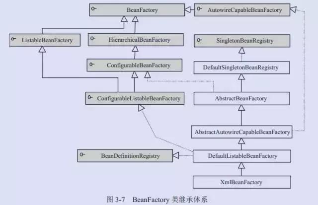


1. BeanDefinitionRegistry 注册表  ： Spring 配置文件中每一个节点元素在 Spring 容器里都通过一个 BeanDefinition 对象表示， 它**描述了 Bean 的配置信息**。而 BeanDefinitionRegistry 接口提供了**向容器手工注册 BeanDefinition 对象**的方法。


2. BeanFactory 顶层接口 ：位于 类结构树的顶端，最主要就是 getBean(String beanName),从容器中返回**特定名称的 Bean**， BeanFactory的功能就是通过其他的接口得到**不断的扩展**


3. ListableBeanFactory ：该接口定义了**访问容器中 Bean 基本信息的若干方法**，如查看 Bean 的个数，获取**某一类型 Bean 的配置名**，查看容器中是否**包括某一个 Bean** 等方法


4. HierarchicalBeanFactory 父子级联   ：父子级联IoC容器的接口，子容器可以通过接口方法访问父容器，通过 HierarchicalBeanFactory  接口， **Spring 的 IoC容器可以建立<父子层级关联的容器体系>**，子容器可以访问父容器中的 Bean，但父容器不能访问子容器的 Bean。

   Spring 使用功能 父子容器实现了很多功能，如在SpringMVC中，展现层 Bean 位于一个子容器中，业务层和持久层的 Bean位于父容器中，这样，展现层 Bean 就可以引用业务层和持久层的 Bean，而业务层和持久层的 Bean则看不到展现层的 Bean


5. ConfigurableBeanFactory  ：是一个重要的接口，增强了 IoC 容器的可定制性，它定义了设置类装载器、属性编辑器、容器初始化后置处理器等方法；  


6. AutowireCapableBeanFactory 自动装配  ：定义了将容器中的 Bean 按某种规则（按名字匹配、按类型匹配等）进行自动装配的方法

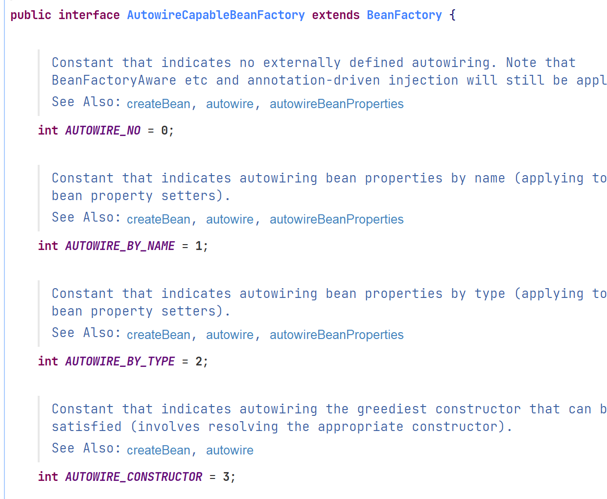


7. SingletonBeanRegistry 运行期间注册单例 Bean  ：允许在运行期间向容器注册**单实例 Bean** 的方法；对于单实例（singleton）的 Bean 来说，**BeanFactory会缓存 Bean 实例，所以第二次使用 getBean() 获取 Bean 时将直接从 IoC容器的缓存中获取 Bean 实例。**

   Spring 在 DefaultSingletonBeanRegistry 类中提供了一个用于**缓存单实例 Bean 的缓存器**，它是一个用 HashMap 实现的缓存器， 单实例的 Bean 以beanName 为键保存在这个 HashMap 中。  

```java
private final Map<String, Object> singletonObjects = new ConcurrentHashMap<>(256);
```


8. 依赖日志框架：在初始化 BeanFactory 时，必须为其提供一种日志框架，比如使用 Log4J， 即在类路径下提供 Log4J 配置文件，这样启动 Spring 容器才不会报错  


### ApplicationContext 面向开发应用  


ApplicationContext 由 BeanFactory 派生而来，提供了更多面向实际应用的功能。

ApplicationContext 继承了 HierarchicalBeanFactory 和 ListableBeanFactory接口，同时也实现了其他多个接口，扩展了 BeanFactory 的功能

```java
public interface ApplicationContext extends EnvironmentCapable, ListableBeanFactory, HierarchicalBeanFactory,
      MessageSource, ApplicationEventPublisher, ResourcePatternResolver
```

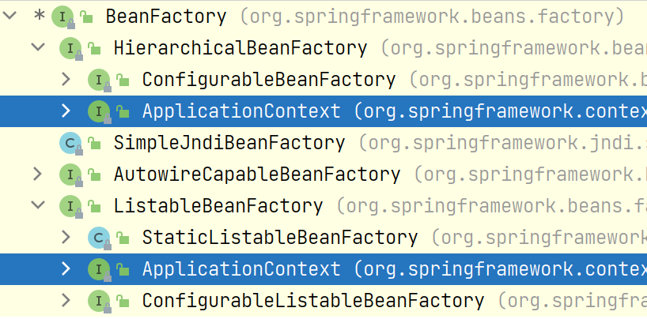


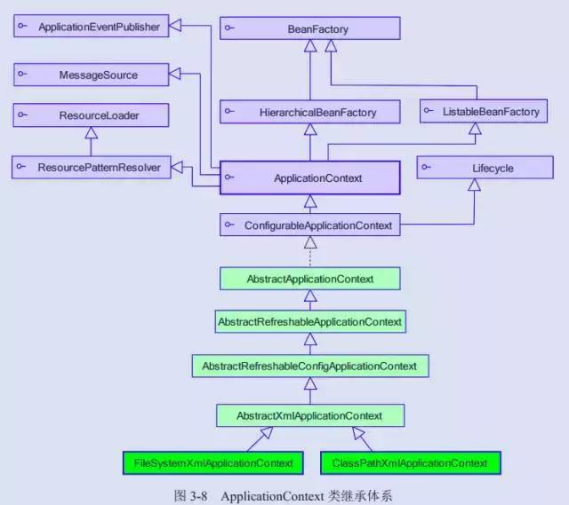


1. **ClassPathXmlApplicationContext**：默认从类路径加载配置文件
2. **FileSystemXMLApplicationContext**：默认从文件系统中装载配置文件
3. **ApplicationEventPublisher**：让***容器***  拥有**发布应用上下文事件**的功能，包括容器启动事件、关闭事件等
4. **MessageSouece**：为应用提供 i18n 国际化消息访问的控制
5. **ResourcePatternResolver**：所有 ApplicationContext 实现类都实现了类似于PathMatchingResourcePatternResolver 的功能，可以通过**带前缀的 Ant 风格的资源文件路径装载 Spring 的配置文件**  
6. LifeCycle：Spring2.0引入，提供了 start() 和 stop() 两个方法，控制 **异步处理过程**。改接口同时被 ApplicationContext 实现 以及具体的Bean实现，ApplicationContext会将 start/stop 的信息传递给容器中所有实现了该接口的 bean，以达到管理 JMX、任务调度等目的

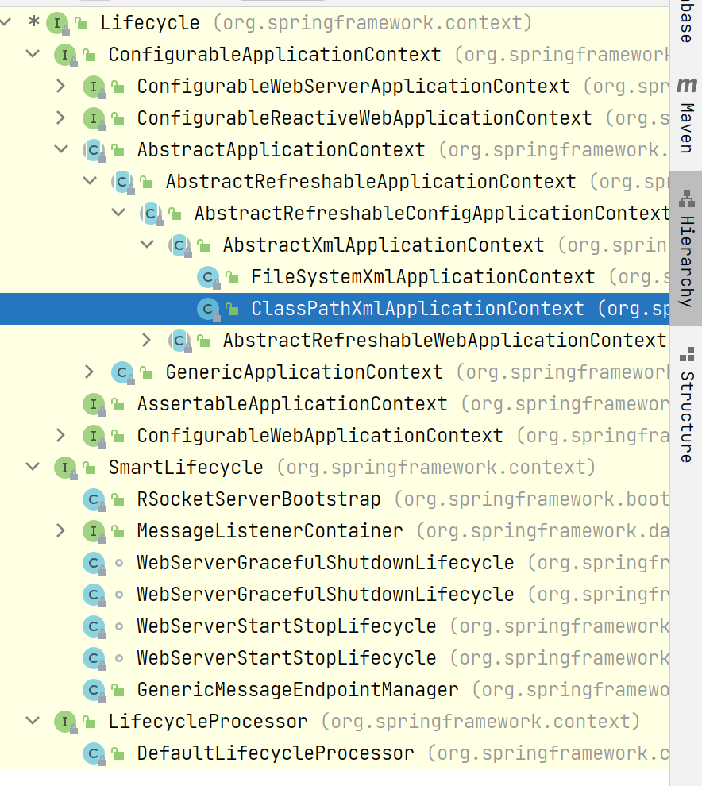


7. ConfigurableApplicationContext  ：继承自 ApplicationContext 接口，**新增了两个主要的方法：refresh() 和 close()，让 ApplicationContext 具有启动、刷新和关闭应用上下文的能力**。在应用上下文关闭的情况下调用 refresh()即可**启动应用上下文**，在已经启动的状态下，调用 refresh()则**清除缓存并重新装载配置信息**，而调用 close()则可**关闭**应用上下文  


---

### WebApplication体系架构


WebApplicationContext 是专门为 Web 应用准备的，允许从相对于 **Web 根目录**的路径中**装载配置文件**完成初始化工作。

从 WebApplicationContext 中可以获得ServletContext 的引用， 整个 Web 应用上下文对象将作为属性**放置到 ServletContext中**，以便 **Web 应用环境可以访问 Spring 应用上下文**。  


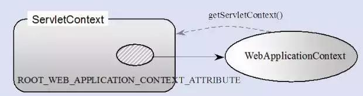


## Spring Bean 作用域


Spring 3 中为 Bean定义了五种作用域：

- singleton 单例
- prototype 原型
- **request**
- **session**
- **global session**


1.  Singleton 单例模式（**多线程下不安全**）

Spring IoC 容器中只会存在一个 **共享的 Bean 实例**，无论有多少个 Bean 引用它，**始终都指向同一个对象**。

**该模式在多线程下是不安全的。** 

Singleton 作用域是 Spring 中的缺省作用域，也可以显示的将 Bean 定义为 singleton 模式：

```xml
<bean id="userDao" class="com.ioc.UserDaoImpl" scope="singleton"/>
```


> Singleton是单例类型，就是在**创建起容器时就同时自动创建了一个bean的对象**，**不管你是否使用**，他都存在了，每次获取到的对象都是同一个对象。注意，Singleton作用域是Spring中的**缺省作用域**


2. prototyle **原型模式每次使用时创建**

**每次通过 Spring 容器获取 protutype 定义的 bean时，容器都将创建一个新的 Bean 实例，每个Bean实例都有自己的属性和状态**。而 singleton 全局只有一个对象。

**对有状态的 bean 使用 prototype 作用域，对无状态的 bean 使用 singleton 作用域**

> 有状态指的是每次访问这个 bean 都需要对其有不同的一个状态属性，如果需要某个变量保持全局一致，比如 JVM 缓存，那么就使用单例模式，因为整个jvm进程都需要使用一个相同的状态

> Prototype是原型类型，它**在我们创建容器的时候并没有实例化**，而是当我们获取bean的时候才会去创建一个对象，而且我们每次获取到的对象都不是同一个对象


3. Request：一次request 一个实例

request：**在一次 Http 请求中，容器会返回该 Bean 的同一实例。对不同的 Http 请求则会产生新的 Bean，而且该 bean 仅在当前 Http Request 内有效**。当前 Http 请求结束，该 bean 实例也将被销毁

```xml
<bean id="loginAction" class="com.cnblogs.Login" scope="request"/>
```


4. Session

session：在一次 Http Session中，容器会返回该 Bean 的同一实例。对不同的Session 请求则会创建新的实例，该 bean 实例仅在当前 Session 内有效。 同 Http 请求相同，每一次session 请求创建新的实例，而不同的实例之间不共享属性，且实例仅在自己的 session 请求内有效，请求结束，则实例将被销毁  

```xml
<bean id="userPreference" class="com.ioc.UserPreference" scope="session"/>
```


5. global Session  

在一个全局的 Http Session 中，容器会返回该 Bean 的同一个实例，仅在
使用 portlet context 时有效  


## Spring Bean 生命周期


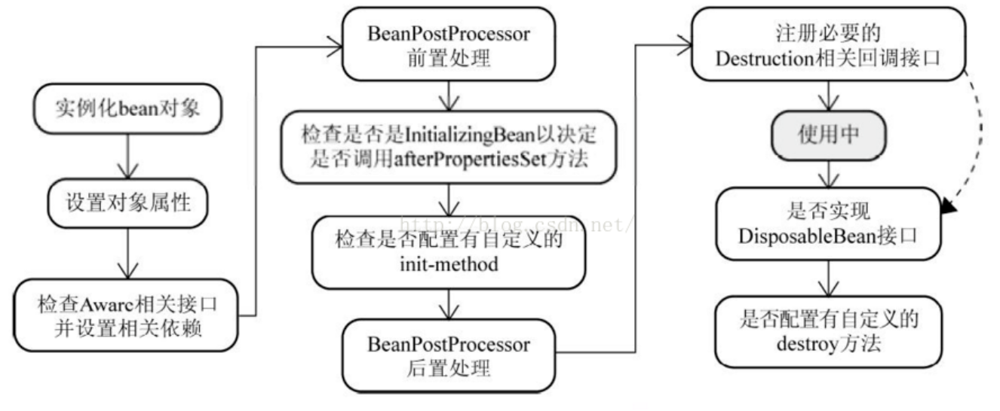


1. **实例化**：实例化一个 Bean，也就是我们常说的 new一个对象
2. **IOC依赖注入**：按照 Spring 上下文对实例化的 Bean 进行配置，也就是 IOC 注入
3. **setBeanName 实现**：如果这个 Bean 已经实现了 BeanNameAware 接口，会调用它实现的 setBeanName(String) 方法，此处传递的就是 Spring 配置文件中 Bean 的 id 值
4. **BeanFactoryAware实现**：如果这个 Bean 已经实现了 `BeanFactoryAware` 接口，会调用它实现的 set**BeanFactory**，setBeanFactory(BeanFactory)传递的是 **Spring 工厂自身**（可以用这个方式来**获取其它 Bean**，只需在 Spring 配置文件中配置一个普通的 Bean 就可以）  

5. **ApplicationContextAware 实现** ：如果这个 Bean 已经实现了 `ApplicationContextAware` 接口，会调用setApplicationContext(ApplicationContext)方法，传入 Spring 上下文（同样这个方式也可以实现步骤 4 的内容，但比 4 更好，**因为 ApplicationContext 是 BeanFactory 的子接口**，有更多的实现方法）  

6. **postProcessBeforeInitialization 接口实现-初始化预处理  **：如果这个 Bean 关联了 `BeanPostProcessor` 接口，将会调用postProcessBeforeInitialization(Object obj, String s)方法， BeanPostProcessor 经常被用作是 **Bean 内容的更改**，并且由于这个是在 Bean 初始化结束时调用那个的方法，也可以被应用于**内存或缓存技术**。  

7. **init-method **：如果 Bean 在 Spring 配置文件中配置了 init-method 属性会自动调用其配置的初始化方法。  

8. **postProcessAfterInitialization**：如果这个 Bean 关联了 `BeanPostProcessor` 接口，将会调用postProcessAfterInitialization(Object obj, String s)方法。

   > 注： 以上工作完成以后**就可以应用这个 Bean 了**，那这个 Bean 是一个 Singleton 的，所以一般情况下我们调用**同一个 id 的 Bean** 会是在**内容地址相同的实例**，当然在 Spring 配置文件中也可以配置非 Singleton。  

9. **Destroy 过期自动清理阶段**：当 Bean 不再需要时，会经过**清理阶段**，如果 Bean 实现了 `DisposableBean` 这个接口，会调用那个其实现的 destroy()方法

10. **destroy-method 自配置清理**：如果这个 Bean 的 Spring 配置中配置了 destroy-method 属性，会自动调用其配置的销毁方法。  


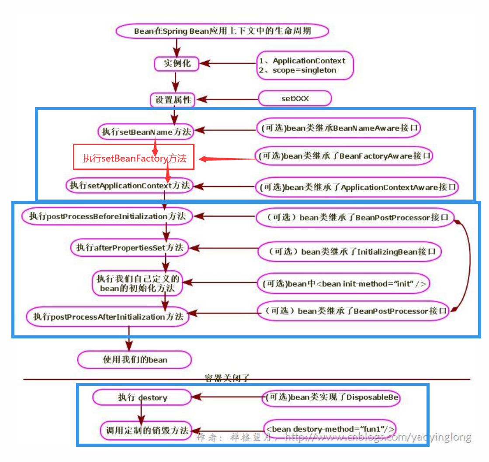


11. bean 标签有两个重要的属性（init-method 和 destroy-method）。**通过这两个属性，我们可以自己定制初始化和注销方法。不过它们也有响应的注解：`@PostConstruct` 和 `@PreDestroy`  **


```xml
<bean id="" class="" init-method="初始化方法" destroy-method="销毁方法">
```


> 当scope=”prototype”时，容器也会延迟初始化bean，**Spring读取xml文件的时候，并不会立刻创建对象，而是在第一次请求该bean时才初始化**（如调用getBean方法时）。在**第一次请求每一个**prototype的bean时，Spring容器都会调用其构造器创建这个对象，然后调用init-method属性值中所指定的方法。对象销毁的时候，Spring容器**不会帮我们调用任何方法，因为是非单例**，这个类型的对象有很多个，**Spring容器一旦把这个对象交给你之后，就不再管理这个对象了。**
>


> 对于作用域为prototype的bean，其**destroy方法并没有被调用**。如果bean的scope设为prototype时，当容器关闭时，destroy方法不会被调用。
>
> 对于prototype作用域的bean，有一点非常重要，那就是**Spring不能对一个prototype bean的整个生命周期负责**：容器在初始化、配置、装饰或者是装配完一个prototype实例后，将它**交给客户端**，**随后就对该prototype实例不闻不问了**。
>
> 不管何种作用域，容器**都会调用所有对象的初始化生命周期回调方法**。
>
> 但对prototype而言，任何配置好的**析构**生命周期回调方法都**将不会被调用**。清除prototype作用域的对象并释放任何prototype bean所持有的昂贵资源，**都是客户端代码的职责**（让Spring容器释放被prototype作用域bean占用资源的一种可行方式是，通过使用bean的后置处理器，该处理器持有要被清除的bean的引用）。谈及prototype作用域的bean时，在某些方面你可以将Spring容器的角色看作是Java new操作的替代者，任何迟于该时间点的生命周期事宜都得交由客户端来处理。
>
> 　　Spring容器可以管理singleton作用域下bean的生命周期，在此作用域下，Spring能够**精确地知道bean何时被创建，何时初始化完成，以及何时被销毁**。而对于prototype作用域的bean，Spring**只负责创建**，当容器创建了bean的实例后，bean的实例就交给了客户端的代码管理，Spring容器将不再跟踪其生命周期，并且不会管理那些被配置成prototype作用域的bean的生命周期。
>
> https://blog.csdn.net/qq_35956041/article/details/81588160


## Spring 依赖注入四种方式


1. **构造器注入**


```java
/*带参数，方便利用构造器进行注入*/
public CatDaoImpl(String message){
	this. message = message;
}
```


```xml
<bean id="CatDaoImpl" class="com.CatDaoImpl">
<constructor-arg value=" message "></constructor-arg>
</bean>
```

也可以直接将@bean或者 @component的对象注入构造函数中


2. **setter方法注入**

```java
public class Id {
    private int id;
    public int getId() { return id; }
    public void setId(int id) { this.id = id; }
}
```

```xml
<bean id="id" class="com.id "> <property name="id" value="123"></property> </bean>
```


3. **静态工厂注入**

静态工厂顾名思义，就是通过调用静态工厂的方法来获取自己需要的对象，为了**让 spring 管理所有对象**，我们不能直接通过"工程类.静态方法()"来获取对象，而是依然**通过 spring 注入的形式获取**  

```java
public class DaoFactory { //静态工厂
    public static final FactoryDao getStaticFactoryDaoImpl(){
    	return new StaticFacotryDaoImpl();
    }
}

public class SpringAction {
    private FactoryDao staticFactoryDao; //注入对象
    
    //注入对象的 set 方法
    public void setStaticFactoryDao(FactoryDao staticFactoryDao) {
    	this.staticFactoryDao = staticFactoryDao;
    }
}
```


```xml
<!--factory-method="getStaticFactoryDaoImpl"指定调用哪个工厂方法-->
<bean name="springAction" class=" SpringAction" >
<!--使用静态工厂的方法注入对象,对应下面的配置文件-->
	<property name="staticFactoryDao" ref="staticFactoryDao"></property>
</bean>

<!--此处获取对象的方式是从工厂类中获取静态方法-->
<bean name="staticFactoryDao" class="DaoFactory"
factory-method="getStaticFactoryDaoImpl"></bean>
```


4. **实例工厂**

**获取对象实例的方法不是静态的**，需要首先 new 工厂类，再调用普通的实例方法

```java
public class DaoFactory { //实例工厂
    public FactoryDao getFactoryDaoImpl(){
    	return new FactoryDaoImpl();
    }
}

public class SpringAction {
    private FactoryDao factoryDao; //注入对象
    
    public void setFactoryDao(FactoryDao factoryDao) {
    	this.factoryDao = factoryDao;
    }
}
```


```xml
<bean name="springAction" class="SpringAction">
<!--使用实例工厂的方法注入对象,对应下面的配置文件-->
	<property name="factoryDao" ref="factoryDao"></property>
</bean>


<bean name="daoFactory" class="com.DaoFactory"></bean>

<!--此处获取对象的方式是从工厂类中获取实例方法-->
<bean name="factoryDao" factory-bean="daoFactory"
factory-method="getFactoryDaoImpl"></bean>
```


## 五种不同方式的自动装配


Spring装配包括  **手动装配和自动装配**。

手动装配：基于xml装配、构造方法、setter方法等

自动装配有五种自动装配的方式，用来指导Spring容器用自动装配的方式来进行依赖注入

1. no：默认是不进行自动装配，通过显式设置 ref 属性来进行装配
2. byName：通过参数名 自动装配， Spring 容器在配置文件中发现 bean 的 autowire 属性被设置成 byname，之后容器试图匹配、装配和该 bean 的属性具有**相同名字的 bean**。  
3. byType：通过**参数类型**自动装配， Spring 容器在配置文件中发现 bean 的 autowire 属性被设置成 byType，之后容器试图匹配、装配和该 bean 的属性具有相同类型的 bean。如果有**多个 bean 符合条件，则抛出错误**。  
4. constructor：这个方式类似于 byType， 但是要提供给构造器参数，如果没有确定的带参数的**构造器参数类型**，将会抛出异常。  
5. autodetect：**首先尝试使用 constructor 来自动装配，如果无法工作，则使用 byType 方式**。  


# Spring AOP 原理


横切：剖解开封装的对象，并将影响了多个类的 **<公共行为>** 封装到一个可重用模块，将其命名为 Aspect，即切面。

“切面”：与业务无关，却为业务门模块锁共同调用的逻辑或责任封装起来，**便于减少系统的重复代码，降低模块之间的耦合度**，并有利于未来的可操作性和可维护性。


AOP吧软件系统分为两个部分：**核心关注点和横切关注点**

- **业务处理**的核心流程是和信关注点，与之关系不大的是 横切关注点。

- **横切关注点**的一个特点是，他们经常发生在核心关注点的多处，而各处基本相似， 比如**权限认证、日志、事务**。 

> AOP 的作用在于分离系统中的各种关注点，将核心关注点和横切关注点分离开


AOP 主要应用场景有：

1. **Authentication 权限**
2. **Caching 缓存**
3. Context passing 内容传递
4. Error handling 错误处理
5. Lazy loading 懒加载
6. Debugging 调试
7.  logging, tracing, profiling and monitoring 记录跟踪 优化 校准
8. Performance optimization 性能优化
9. Persistence 持久化
10. Resource pooling 资源池
11. Synchronization 同步
12. Transactions 事务  


## AOP 核心概念


1、**切面**（aspect） ： 类是对物体特征的抽象，切面就是对横切关注点的抽象

2、**横切关注点**： 对**哪些方法进行拦截**，拦截后怎么处理，这些关注点称之为横切关注点。

3、**连接点**（joinpoint） ： 被拦截到的点，因为 Spring 只支持**方法类型的连接点**，所以在 Spring中连接点指的就是**被拦截**到的**<方法>**，实际上连接点还可以是字段或者构造器。

4、**切入点**（pointcut） ： 对连接点进行拦截的定义

5、**通知**（advice） ： 所谓通知指的就是指**拦截到连接点之后要执行的代码**， 通知分为**前置、后置、异常、最终、环绕**通知五类。

6、目标对象： 代理的目标对象

7、织入（weave） ： 将切面应用到目标对象并导致**代理对象创建**的过程  

8、引入（introduction）： 在不修改代码的前提下，引入可以在**运行期**为类**动态地添加一些方法或字段**


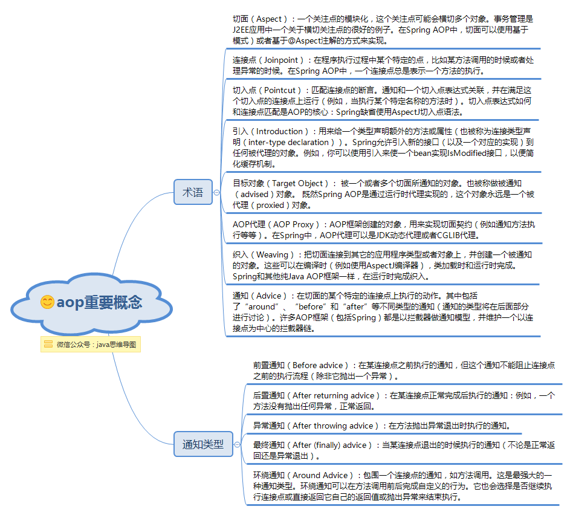


## AOP 两种代理方式


Spring 提供了两种方式来生成代理对象: JDKProxy 和 Cglib，具体使用哪种方式 生成由AopProxyFactory 根据 AdvisedSupport 对象的配置来决定。 

默认的策略是如果**目标类是接口，则使用 JDK 动态代理技术，否则使用 Cglib 来生成代理。**  


----

- JDK 动态接口代理  

JDK 动态代理主要涉及到 `java.lang.reflect` 包中的两个类： `Proxy` 和 `InvocationHandler`。

`InvocationHandler` 是一个接口，通过实现该接口**定义横切逻辑**，并通过**反射机制**调用目标类的代码，**动态将横切逻辑和业务逻辑编制在一起**。 

Proxy 利用 InvocationHandler 动态**创建一个符合某一接口的实例**，生成目标类的代理对象。  

```java
public static void main(String[] args) {

    //创建目标对象
    Target target = new Target();
    //获得增强对象
    Advice advice = new Advice();

    //返回值  就是动态生成的代理对象
    //代理对象和目标对象是兄弟关系，用接口来接收
    TargetInterface proxy = (TargetInterface) Proxy.newProxyInstance(
            target.getClass().getClassLoader(),//目标对象类加载器
            target.getClass().getInterfaces(),//目标对象相同的接口字节码对象数组
            new InvocationHandler() {
                @Override
                public Object invoke(Object proxy, Method method, Object[] args) throws Throwable {
                    //织入通知，在这个连接点上要执行哪些动作
                    advice.before();//前置增强
                    Object invoke = method.invoke(target, args);//执行目标方法
                    advice.after();//后置增强
                    return invoke;
                }
                //调用代理对象的任何方法，实质执行的都是invoke方法
            }
    );

    //调用代理对象的方法
    proxy.save();//save running
}
```


---

- CGLib 动态代理  

CGLib 全称为 **Code Generation Library**，是一个强大的高性能， 高质量的代码生成类库，可以在**运行期扩展 Java 类与实现 Java 接口**， CGLib 封装了 asm，可以在**运行期动态生成新的 class**。

和 JDK 动态代理相比较： JDK 创建代理有一个限制，就是只能为接口创建代理实例，而**对于没有通过接口定义业务方法的类**，则可以**通过 CGLib 创建动态代理**。  


```java
@Aspect
public class TransactionDemo {
    
    @Pointcut(value="execution(* com.yangxin.core.service.*.*.*(..))")
    public void point(){
    }
    
    @Before(value="point()")
    public void before(){
    	System.out.println("transaction begin");
    }
    
    @AfterReturning(value = "point()")
    public void after(){
    	System.out.println("transaction commit");
    }
    
    @Around("point()")
    public void around(ProceedingJoinPoint joinPoint) throws Throwable{
        System.out.println("transaction begin");
        joinPoint.proceed();
        System.out.println("transaction commit");
    }
    
}
```


# SpringMVC 原理


Spring 的模型-视图-控制器 （MVC） 框架是围绕一个 DispatcherServlet来设计的，这个DispatcherServlet 会把请求分发给各个处理器，并支持可配置的处理器映射、试图渲染、本地化、时区与主题渲染等，也能支持文件上传


## MVC 流程


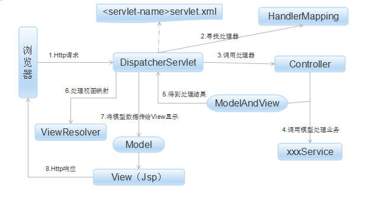


1. 客户端发送 Http 请求到 DispatcherServlet

2. 由DispatcherServlet 控制器查询一个或多个 **HandlerMapping**，**找到处理请求的 Controller**

3. DispatcherServlet 将请求提交到 Controller

4. 5. 调用业务service处理，并返回结果：Controller调用业务逻辑处理后，返回 ModelAndView

6. 7. 处理视图映射并返回模型：DispatcherServlet 查询一个或多个 ViewResolver 视图解析器，找到 ModelAndView 指定的

8. Http响应：视图负责将结果显示到客户端


## MVC 常用注释


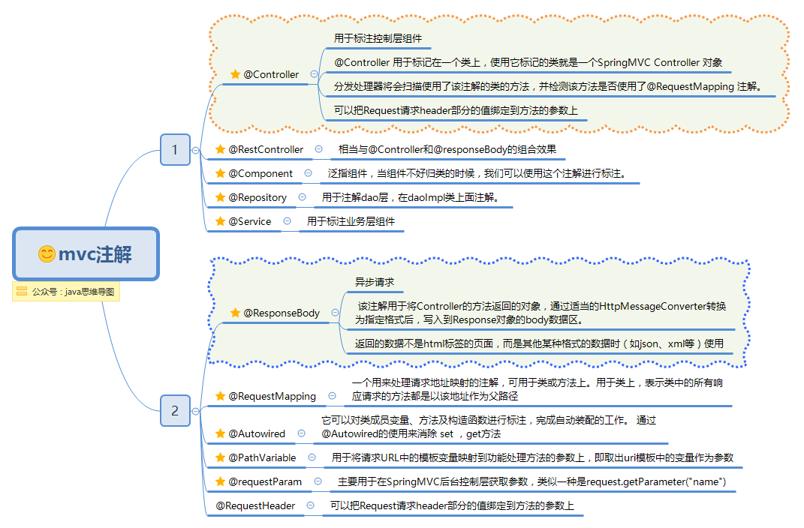

- @RequestBody，接收post请求中请求体里的数据


# SpringBoot 原理


1. 创建独立的 Spring 应用程序
2. **嵌入的 Tomcat，无需部署 WAR 文件**
3. 简化 Maven 配置
4. 自动配置 Spring（AutoConfiguration）、
5. 提供生产就绪型功能，如指标、健康检查和外部配置（actuator）
6. 对 xml 没有要求配置（properties / yaml配置文件）


# JPA 原理


事务是计算机应用中不可或缺的组件模型，它保证了用户操作的原子性 ( Atomicity )、一致性( Consistency )、隔离性 ( Isolation ) 和持久性 ( Durabilily   

**ACID**


## 本地事务


依赖底层资源管理器（数据库连接），**事务处理局限在当前事务资源内**

这种事务处理方式不存在对应用服务器的依赖，因而部署靓货但无法支持多数据源的分布式事务。

在数据库连接中使用本地事务示例：

```java
public void transferAccount() {
    Connection conn = null;
    Statement stmt = null;
    try{
        conn = getDataSource().getConnection();
        // 将自动提交设置为 false，若设置为 true 则数据库将会把每一次数据更新认定为一个事务并自动提交
        conn.setAutoCommit(false);
        stmt = conn.createStatement();
        // 将 A 账户中的金额减少 500
        stmt.execute("update t_account set amount = amount - 500 where account_id = 'A'");
        // 将 B 账户中的金额增加 500
        stmt.execute("update t_account set amount = amount + 500 where account_id = 'B'");
        // 提交事务
        conn.commit();
    // 事务提交：转账的两步操作同时成功
        
    } catch(SQLException sqle){
        // 发生异常，回滚在本事务中的操做
        conn.rollback();
        // 事务回滚：转账的两步操作完全撤销
        stmt.close();
        conn.close();
    }
}
```


## 分布式事务


Java 事务编程接口（JTA： Java Transaction API）和 Java 事务服务 (JTS； Java Transaction Service) 为 J2EE 平台提供了分布式事务服务。分布式事务（Distributed Transaction）包括**事务管理器**（ Transaction Manager）和一个或多个支持 XA 协议的**资源管理器** ( Resource Manager )。

我们可以将资源管理器看做任意类型的**持久化数据存储**；事务管理器承担着**所有事务参与单元的协调与控制**。  


```java
public void transferAccount() {
    UserTransaction userTx = null;
    Connection connA = null; Statement stmtA = null;
    Connection connB = null; Statement stmtB = null;
    
    try{
        // 获得 Transaction 管理对象
        userTx = (UserTransaction)getContext().lookup("java:comp/UserTransaction");
        connA = getDataSourceA().getConnection();// 从数据库 A 中取得数据库连接
        connB = getDataSourceB().getConnection();// 从数据库 B 中取得数据库连接
        userTx.begin(); // 启动事务
        stmtA = connA.createStatement();// 将 A 账户中的金额减少 500
        stmtA.execute("update t_account set amount = amount - 500 where account_id = 'A'");
        // 将 B 账户中的金额增加 500
        stmtB = connB.createStatement();
        stmtB.execute("update t_account set amount = amount + 500 where account_id = 'B'");
        userTx.commit();// 提交事务
        // 事务提交：转账的两步操作同时成功（数据库 A 和数据库 B 中的数据被同时更新）
        
    } catch(SQLException sqle){
        // 发生异常，回滚在本事务中的操作
        userTx.rollback();// 事务回滚：数据库 A 和数据库 B 中的数据更新被 -> 同时撤销
    } catch(Exception ne){ }
}
```


## 两阶段提交


两阶段提交主要保证了分布式事务的原子性：**所有结点要么全部做，要么全不做，两个阶段：准备阶段、提交阶段**


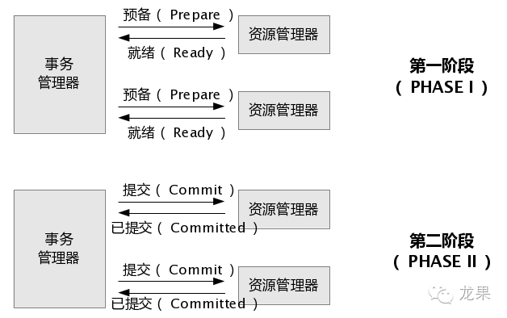


1. **准备阶段**

事务**协调者（事务管理器）**给每个**参与者（资源管理器）** 发送 prepare 消息，每个参与者要么返回失败（如权限验证失败），要么在本地执行事务。

**写本地的 redo 和 undo 日志，但不提交**


2. **提交阶段**

如果协调者收到了参与者的失败消息或者超时，直接给**每个参与者发送回滚**(Rollback)消息；否则，**发送提交(Commit)消息**；参**与者根据协调者的指令执行提交或者回滚操作**，释放所有事务处理过程中**使用的锁资源**。 (注意:必须在**最后阶段释放锁资源**)  

将提交分成两阶段进行的目的很明确，就是**尽可能晚地提交事务**，让事务**在提交前尽可能地完成所有能完成的工作**。  


# Mybatis 缓存


MyBatis 中有一级缓存和二级缓存，默认情况系哦啊一级缓存是开启的，而且是不能关闭的。


- 一级缓存是指 SqlSession 级别的缓存，当在**同一个 SqlSession** 中进行**相同的 SQL 语句查询**时，第二次以后的查询不会从数据库查询，而是直接从缓存中获取，**一级缓存最多缓存 1024 条 SQL**。


- 二级缓存是指可以**跨 SqlSession 的缓存**。 是 **mapper 级别的缓存**，对于 mapper 级别的缓存**不同的sqlsession 是可以共享的**  


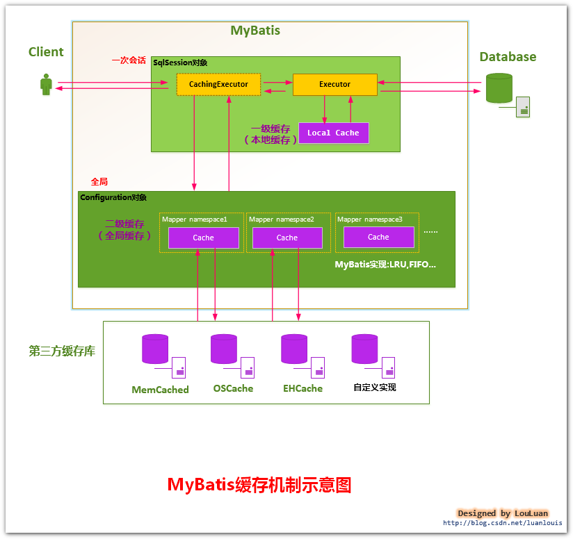


## MyBatis 一级缓存


第一次发出一个查询 sql，sql 查询结果写入 sqlsession 的一级缓存中，缓存使用功能的数据结构是一个  map

- key：MapperID + offset + limit + Sql + 所有的入参

- value: 用户信息

同一个 sqlSession 再次发出相同的 sql，就从缓存中取出数据。

**如果两次中间出现 commit 操作（修改、添加、删除），本 sqlsession 中的<一级缓存区域全部清空>，下次再去缓存中查询不到所以要从数据库查询， 从数据库查询到再写入缓存。  **


## Mybatis 二级缓存


二级缓存的范围是 mapper 级别（mapper 同一个命名空间），mapper 以命名空间为单位创建缓存数据结构，结构是 map。

mybatis 的二级缓存是通过 **CacheExecutor** 实现的。

CacheExecutor是 **Executor 的代理对象**。所有的查询操作，在 CacheExecutor 中都会先匹配缓存中是否存在，不存在则查询数据库。

- key： MapperID+offset+limit+Sql+所有的入参  


具体使用需要配置：

1. Mybatis **全局配置**中启用**二级缓存配置**
2. 在对应的 Mapper.xml 中配置 **cache 节点**
3. 在对应的 select 查询节点中添加 useCache=true  


# 常见问题


## 关于Spring Boot中的业务层（Service）是否要创建接口的分析


> Spring Boot框架开发web项目时，在业务层（Service）这一部分，标准做法是：定义一个接口，然后再一个或多个类去实现。那么疑问来了: 
>
> 为什么我们要维护两份同构代码，而不直接使用一个类呢？


不创建接口，通过把业务实现类直接通过注解@Autowired注入控制层Controller，也一点不耽误功能的实现啊，那么我为什么还要创建接口？

**不是必须要使用接口，但强烈建议使用接口。**


----

**情景1：**

在开源框架中有很多这种情况,就是某个功能支持用户自定义扩展.说白了,它提供了一个接口,我们只需要实现这个接口,把我们自己的实现逻辑补上,就可以让框架按照我们的逻辑来执行.问题来了,框架的作者并不知道我们的实现类是什么,如果不定义一个接口,那么要如何在框架中调用我们的实现类呢?


**情景2：**

我和同事分别做项目的2个不同功能模块,但是同事的功能中却需要调用我这头实现的部分逻辑.为了让他有一个"占位符"可用,我是不是应该**快速的写个接口**扔给他呢?


**情景3：**

一个**适配器**功能,或是说一个简单的**工厂类**,如果没有定义接口,那么面对**众多实现类,要如何统一操作呢?**


**情景4：**

想让项目的代码符合某种"规范",但是又不可能看着别人写代码吧,那好办,先出一套接口,然后你们就看着办~


**情景5：**

java中没有多继承,但是可以多实现接口,那么就有一件很有趣的事情了,一个实现类可以实现多个接口,然后此时接口可以**有选择的暴露实现类的部分方法**,做到**"窄化"实现类功能**的目的。

> C implements A, B
>
> 创建一个C对象时，如果将这个实现类的实例对象的引用赋给接口A（A c = new C();），那么这个对象只能使用接口A的方法，而不能使用接口B的方法，即：暴露实现类的部分方法


> 说到底,多一个接口仅仅是扩展性和某些情况下有优势,但是是否会用到接口的便利性，不确定的情况下我们未必一定要为"可能"买单，只是多写那几行代码，付出一点就可能避免"未来"的大"麻烦",何乐而不为!?
>


