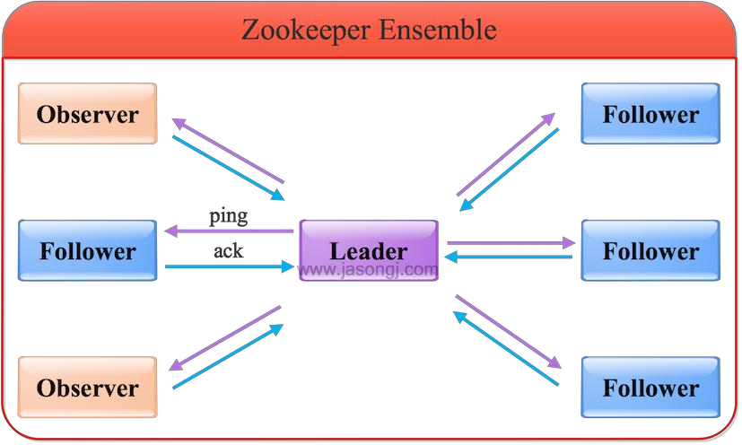

# Zookeeper 概念

Zookeeper 是一个分布式协调服务，用于**服务发现、分布式锁、分布式领导选举、配置管理**等。

Zookeeper 提供了类似 Linux 文件系统的树形结构（轻量级的 **内存文件系统，但只适合存少量信息，完全不适合存储大量文件或者大文件**），同时提供了 **对于每个节点的监控与通知机制**

## Zookeeper 角色

Zookeeper 集群是一个基于 **主从复制** 的 **高可用集群**，每个服务器承担下面三种角色中的一种：

- **Leader**

1. 一个 Zookeeper 集群 **同一时间只会有一个实际工作的 Leader**，它会发起并维护与**各 Follower 及 Observer 间的心跳**
2. **所有的写操作必须要通过 Leader 完成再由 Leader 将写操作广播给其他服务器，只要有超过 <半数节点>（不包括Observer节点）写入成功，该写请求就会被提交**

- **Follower**

1. 一个 Zookeeper 集群可能同时存在多个 Follower，会响应 Leader 的心跳
2. **Follower 可直接处理并返回客户端的 <读请求>，同时会将写请求转发给 Leader 处理**
3. **负责在 Leader 处理写请求时对请求进行投票**

- **Observer**

与 Follower类似（也可以直接处理并返回 **读请求**），**但无投票权**。Zookeeper 需要 **保证高可用和强一致性**，

为了支持更多的客户端，需要增加更多服务器，**Server增多，投票阶段的延迟增大，会影响性能**

**引入 Observer ，Observer 不参与投票；Observer 接收客户端的连接，并将写请求转发给 Leader 节点**。

加入更多的 Observer 节点，提高**伸缩性**，同时也不会影响吞吐率

## ZAB 协议

### **事务编号 Zxid （事务请求计数器 + epoch）**

在 ZAB （Zookeeper Atomic Broadcast，Zookeeper **原子消息广播协议**） 协议的事务编号 Zxid 设计中，Zxid是一个 64 位的数字，其中低32位是一个简单的单调递增的计数器，**针对客户端每一个事务请求，计数器加1**；高32位 代表 Leader 周期 epoch 的编号，**每当 选举产生一个新的 Leader 服务器，就会从 这个Leader服务器上取出其本地日志中最大事务的 Zxid，并从中读取 epoch 值，然后 加一，以此作为新的 epoch**，并将 低32位 从0开始计数

> Zxid（Transaction id）类似于 RDBMS 中的事务ID，用于标识以此更新操作的 Proposal（提议）ID，为了保证**顺序性**，该 **zxid必须单调递增**

### epoch

epoch：可以理解为 **当前集群所处的年代或者周期**。每个leader就像皇帝，都有自己的年号，所以每次改朝换代，leader变更后，都会在前一个年代的基础上 +1，

这样就算 **旧的 leader 崩溃恢复之后，也没有人听他的了！因为 Follower 只听从当前年代的 leader 的命令**

### Zab协议两种模式- 恢复模式（选主）、广播模式（同步）

Zab协议有两种模式：**恢复模式（选主），广播模式（同步）**。

当服务启动或者在leader领导者崩溃后，Zab就进入了恢复模式，当领导者被选举出来，且大多数 Server 完成了和 leader 的状态同步后，恢复模式就结束了，状态同步保证了 leader 和 Follower具有**相同的系统状态**

### ZAB 协议 4 阶段

1. **Leader election（选举阶段）**：节点在一开始都处于**选举阶段**，只要有一个节点得到超半数节点的票数，就可以当选**准 leader**。只有到达广播阶段（broadcast），**准leader才会成为真正的 leader**。

   这一阶段的目的是为了选出一个 **准 leader**，然后进入下一阶段

2. **Discovery（发现阶段-接收提议、生成epoch、接受epoch）**：在这个阶段，**Followers 跟  准leader 进行通信，同步 Followers 最近接受的事务提议**。这一阶段的主要目的是 **发现当前大多数节点接收的最新提议**，并且 **准leader 生成新的 epoch，让Followers 接受，更新它们的 accepted Epoch**

   一个 Follower 只会连接一个 leader，**如果有一个节点 f 认为 另一个 Follower p 是 leader，f 在尝试连接 p 时会被拒绝，f被拒绝之后，就会进入重新选举阶段**

3. Synchronization（同步阶段 - 同步 Follower副本）：同步阶段主要是利用 **leader 前一阶段获得的最新提议历史，同步集群中<所有的副本>。只有当 大多数节点都同步完成，准 leader 才会成为真正的 leader**。

   Follower 只会接收 zxid比自己的 lastZxid大的提议。

4. Broadcast（广播阶段 - leader消息广播）：这个阶段，**Zookeeper 集群才能正式对外提供事务服务，并且 leader 可以进行消息广播。**同时如果有新的节点加入，还需要对新节点进行同步

> ZAB 提交事务并不像 2PC 一样需要全部 follower 都 ACK， 只需要得到超过半数的节点的 ACK 就可以了。  

### ZAB 协议 JAVA实现

协议的 Java 版本实现跟上面的定义有些不同，选举阶段使用的是 `Fast Leader Election（FLE）`，它包含了 选举的发现职责。因为 FLE 会**选举拥有最新提议历史的节点作为 leader**，这样就**省去了发现最新提议的步骤**。

实际的实现将 **发现阶段 和 同步合并为 Recovery Phase（恢复阶段）**。所以， ZAB 的实现**只有三个阶段**： Fast Leader Election； Recovery Phase； Broadcast Phase。  

## 投票机制

**每个 server 首先给自己投票，然后用自己的选票和其他  server 选票对比，权重大的胜出，使用权重较大的更新自身选票箱。（给票多的投票）**

1. 每个 Server 启动以后 **都询问其他的 Server 它要投票给谁**。对于其他 Server 的询问， Server 每次根据自己的状态都回复自己**推荐的 leader** 的 id 和上一次处理事务的 zxid（每个Server首先都会推荐自己）

2. 收到所有 Server 回复以后，就 **计算出 <zxid 最大>（最近接受到事务）（初始启动时使用服务器编号） 的那个 Server**，并将这个 Server 相关信息设置成**下一次要投票的 Server**。

3. 计算这个过程中，**获得票数最多的 Server 为获胜者**，如果获胜者的票数超过半数，则改 Server 被选为 leader。否则，继续这个过程，直到 leader 被选举出来

4. leader 就会开始等待 Server（Follower） 连接

5. Follower 连接 leader，将**最大的 zxid** 发送给 leader

6. leader根据 Follower 的 zxid **确定同步点，至此选举阶段完成**

7. 选举阶段**完成 Leader 同步**后通知 follower 已经成为 **uptodate 状态**  

8. Follower 收到 uptodate 消息后，又可以**重新接受 client 的请求**进行服务了  

目前有 5 台服务器，每台服务器均没有数据，它们的编号分别是 1,2,3,4,5,按编号依次启动，它们的选择举过程如下：

1. 服务器 1 启动，给自己投票，然后发投票信息，由于**其它机器还没有启动**所以它**收不到反馈信息**，服务器 1 的状态一直属于 **Looking**。
2. 服务器 2 启动，给自己投票，同时**与之前启动的服务器 1 交换结果（服务器1给自己投票）**，由于**服务器 2 的编号**大所以服务器 2 胜出（**服务器1投给2, 2投给2，服务器2此时共2票**），但此时投票数没有大于半数，所以两个服务器的状态依然是LOOKING。
3. 服务器 3 启动，给自己投票，同时与之前启动的服务器 1,2 交换信息，由于服务器 3 的编号最大所以服务器 3 胜出，此时投票数正好大于半数，所以服务器 3 成为领导者，服务器1,2 成为小弟。
4. 服务器 4 启动，给自己投票，同时与之前启动的服务器 1,2,3 交换信息，尽管服务器 4 的编号大，但之前服务器 3 已经胜出，所以服务器 4 只能成为小弟。
5. 服务器 5 启动，后面的逻辑同服务器 4 成为小弟。  

> 每个 Server启动并投票时，也会询问其他的几台服务器都给谁投票了，然后根据这个结果来判断leader！

## Zookeeper 工作原理（原子广播）

1. **Zookeeper 的核心是：原子广播**。这个机制保证了 **各个Server之间的同步**。实现这个机制的协议叫做 Zab协议，Zab协议有两种模式：**恢复模式和广播模式**

2. 当服务启动或者在领导者崩溃后，Zab就进入了 **恢复模式**，当领导者被选举出来，且大多数 server 都完成了和 leader 的状态同步之后，恢复模式就结束了

3. 状态同步保证了 leader 和 Follower 具有**相同的系统状态**

4. **一旦 leader 已经和多数的 follower 进行了状态同步后，他就可以开始广播消息了**，即进入广播状态。这时候当一个 Server 新加入 Zookeeper集群，它会在恢复模式下启动，发现 leader，并和leader 进行状态同步。待到同步结束，他也参与消息广播。

   Zookeeper 服务一直维持在 broadcast 装填，直到leader 崩溃了或者leader 失去了大部分的 followers的支持

5. 广播模式需要保证 proposal 被按顺序处理，因此 zk 采用了 **递增的事务id号 zxid来保证**。所有的提议 proposal 都在被提出的时候加上了 zxid。

6. 实现中 zxid 是一个 64位的数字，高32位是 epoch 用来标识 leader 关系是否改变，每次一个leader被选出来，它都会有一个**新的 epoch**。低32位是个**递增计数**

7. 当 leader 崩溃或者 leader失去大多数的 follower，这时候 **zk 进入恢复模式**，恢复模式需要重新选举出一个新的 leader，让所有的 Server 都恢复到 **一个正确的状态**

## Znode 有四种形式的目录节点

1. PERSISTENT：持久的节点
2. EPHEMERAL `[ɪˈfemərəl]`：暂时的节点
3. PERSISTENT_SEQUENTIAL：持久化顺序编号目录节点  
4. EPHEMERAL_SEQUENTIAL：暂时化顺序编号目录节点  

# 简述 ZAB 协议以及 Zookeeper

Zookeeper 为分布式应用提供了一个**高效可靠的分布式协调服务**。实现依赖于 ZAB 协议，实现了一种**主备模式**的架构来保持集群中**数据的一致性。**Zookeeper 使得分布式应用可以通过一个共享的**树形结构**的命名空间实现协调。Zookeeper 将所有的数据存储在**内存**中。

Zookeeper集群中的**任何一台机器都可以响应客户端的读操作**，且全脸数据存在内存中。**因此：Zookeeper 更适合以<读操作>为主的应用场景**

集群中包括三种角色：leader，follower，observer。leader是通过选举确定的一台机器，为客户端提供  **读写功能**。follower与Observer都 **提供读工鞥那**，不同的是 Observer **不参与选举，也不参与过半写成功策略。**

**因此：Observer 可以再不影响写性能的前提下提升集群的读性能**

Zookeeper集群的数量为 **奇数个**

Zookeeper节点分为 **临时节点、持久节点、顺序节点**，每个节点有个 stat结构。

**最重要的功能是 watcher 功能。**

开源客户端：zkclient，curator

---

Zab协议：是为 Zookeeper 专门设计的一种支持崩溃恢复的消息广播协议。ZAB协议 **只允许有一个主进程接受客户事务请求并处理**，即 leader。当leader收到请求后，将请求事务转化为 **事务proposal（事务提案）**，由于leader 会为每一个 follower 创建一个队列，将该事务放入响应队列，**保证事务的顺序性**。之后会在队列中顺序的向其他节点广播该提案，follower收到后，将其以事务的形式写入到本地日志中，并像leader**发送反馈 ack**。leader会等待其他 follower 的回复，当收到一般以上的 follower 响应时，leader 会向其他节点发送 commit消息，同时 leader **提交该提案**

ZAB有两种模式：故障恢复模式以及消息广播（----------）

系统启动或者 leader 服务器出现故障等现象时，进入**故障恢复模式**。将会开启 **新的一轮选举**

选举产生的 leader 会与过半的 follower **进行同步**，使数据一致。当同步结束后，退出恢复模式，进入消息广播模式。

**当一台遵从 ZAB 协议的服务器启动后，如果检测到有 leader在广播消息，会自动进入恢复模式，完成与 leader 的同步以后，进入消息广播模式。**

集群中的 **非leader节点收到客户请求**，将请求发送到 leader 服务器

故障恢复：

Zab 协议需要保证已经被 leader 提交的事务最终**被所有的机器提交**

Zab 协议需要保证丢弃那些只在 leader 上提出的事务

为了保证以上两点：选举时如果选择 ZXID 最大的节点可以解决上述问题，数据同步时为每一个 follower 创建一个队列，leader 将各个 follower **没有提交的事务写入各个队列**，并发送给 各个 follower。

<u>**follower将事务同步后，leader 将其加入真正可用的follower 列表！**</u>

重新选举的条件：leader宕机或发生故障，集群中少于一半的节点与当前 leader **保持连接**

# 分布式一致性协议

- 2pc
- 3pc
- paxos
- zab

**分布式应用中，每个节点都知道自己的事务提交的结果是成功或是失败，但是无法直接获取其他分布式节点的结果，因此需要一个协调者，其他节点成为参与者**

---

2pc：提交事务请求，执行事务提交。

- 缺点：***同步阻塞、单点故障、不一致、 太过保守（没有较好容错机制，任何一个节点出现故障都会导致事务失败，当某个节点出现故障时，协调者只能通过超时机制判断是否终止）***

用于数据库领域内，解决了**分布式事务的原子性问题**

1. 提交事务请求

询问其他节点是否可以执行事务提交操作，发送事务给各个节点

各个节点**执行事务（但不提交）**，并将操作写入 **本地事务日志**

各个参与者向协调者发送反馈

2. 执行事务提交

   1. 若协调者收到了 **所有参与者的 ack 反馈**

      向所有的参与者发送 commit 消息

      参与者收到 commit 消息后执行**事务提交操作**并向协调者发送 ack反馈，然后释放事务资源

      协调者收到反馈后完成事务

   2. 若 协调者收到了某个 参与者的 **NO反馈**，或者等待超时

      向所有参与者发送回滚请求

      参与者收到后执行 **回滚请求**

      执行完后向协调者发送 ACK 反馈

      协调者接收到所有参与者的 ACK 反馈后**完成事务中断**

---

3pc：cancommit   precommit   docommit

（将 2pc 的提交事务请求一分为二）

缺点：

- ***单点故障、***
- ***数据不一致***

> ***解决了同步阻塞问题***
>
> ***超时提交策略，降低事务资源的阻塞范围，***
>
> ***第一、第二阶段协调者等待超时，会执行中断操作***
>
> ***第三阶段参与者等待超时会执行commit操作，提交事务***

1. canCommit：

   协调者向所有参与者发送包含事务内容在内的 canCommit 请求，等待参与者的反馈

   参与者收到 canCommit 请求后，若判断自己**可以顺利执行事务**，向协调者发送 ACK 响应，否则反馈 No 响应

2. preCommit：

   - 若协调者收到了所有参与者的 ACK 响应，向所有的参与者**发送 preCommit 请求**

     参与者收到 preCommit 请求后 ***执行事务***，并将操作**写入本地事务日志**，成功后**向协调者发送 ACK 响应**

   - 若协调者在第一阶段的反馈中**有 No**，或者协调者**等待超时**，则向**所有的参与者发送中断请求**

3. doCommit：

   - 如果协调者收到了第二阶段的所有参与者的 ACK 请求，则向参与者发送 doCommit 请求，**执行事务的提交（preCommit这一步只是执行事务，并不提交，因为可能需要回滚）**

     参与者收到 doCommit 请求后，**执行事务的提交，成功后释放事务资源**，提交后向 协调者发送 ACK 反馈，协调者收到所有参与者反馈后，完成事务的提交

   - 若协调者等待超时，或者第二阶段中有参与者发送 NO 反馈

     向所有参与者发送**中断请求**

     参与者收到 **中断请求后，执行事务回滚**，然后释放事务资源，向协调者发送 ACK 响应，协调者收到所有的 ACK 后终端事务

- 优点：降低了阻塞范围，不会产生同步阻塞，即每一个**参与者在等待超时**之后会**提交事务请求**，不必等待**其他参与者反馈**

  引入超时之后，**第三阶段**即使出现单点故障之后，参与者在时间内未收到协调者信息，**最终仍会提交事务，达成一致性**

  

- 缺点：在 preCommit 之后，若协调者与参与者出现**通信故障**，**导致参与者未收到来自协调者的 中断信息，参与者会执行提交操作，导致数据不一致**

---

paxos见下题

# Paxos 算法

Paxos算法是基于消息传递的且具有高度容错性的一种的算法，解决的问题是：**一个分布式系统如何就某个值（决议）达成一致**。该算法前提是 假设不存在**拜占庭将军问题**。

该算法中一共三种角色：proposer、acceptor、learner。Proposer负责提出提案，acceptor负责对提案**作出裁决**，learner负责学习得到的提案。为了避**免单点故障，会有一个 acceptor 集合**，proposer 向该集合发送提案，acceptor 结合中的每个成员都有可能同意该提案且每个 acceptor 只能批准一个提案，当有**一半以上的成员同意，则同意该提案**

主要过程：prepare阶段，accept阶段

- prepare阶段：Proposer **提出编号为 Mn 的提案**，向 acceptor 集合**发送 prepare 请求**，Acceptor做出反馈：**保证不会再接受编号 比 Mn 小的提案****，如果acceptor 已经**批准过**某提案，会向 proposer 返回已经批准的编号最大的提案的 value 值。

  如果 acceptor 收到一个**编号为 Mn** 的请求，且编号**大于** acceptor 已经响应的所有 prepare 请求的编号，将自己**已经批准**过的编号**<u>最大的提案值反馈给 proposer（如果此时有更大的Mn值到来并且 acceptor 批准，那么在接收到小的 Mn 的 accept 请求时，会拒绝并返回这个更大的 Mn 的 value值，见下面链接~）</u>**，同时 **acceptor 承诺不会再接受编号比 Mn 小的提案**。（**优化：忽略编号小于已批准的提案的请求**）

  如果 proposer 收到了集合至少**一半**的响应，则会发送一个针对 Mn  Vn 的accept 请求给 Acceptor。Vn为收到的所有响应中**编号最大的提案的值**。如果响应不包括值，则可以由 proposer 选择任意值

- Accept 阶段：**Acceptor 收到 accept 请求**后，只要未收到任何编号大于 Mn 的 prepare请求，则通过该提案（Accept 阶段**接受提案的要求**）。

  如果收到了小于当前这个 acceptor 最大的Mn值的 accept 请求，则直接会拒绝该请求

Leaner学习策略三种：

优化：为了避免死循环，比如两个proposer 一次提出一系列编号递增的提案。可以产生一个 **主proposer**，**提案只能由主 proposer 负责提出**

paxos算法的应用：chubby（分布式锁服务、GFS中master选举）

https://blog.csdn.net/guoyunyuhou/article/details/89498057

# paxos 算法与 Zab 协议的联系与区别

相似：

1. 都有类似于 leader 的角色负责**协调集群**
2. leader 或者 proposer 都是只要集群中超过一半的 follower / acceptor 做出正确的反馈即可提交事务
3. zab 与 paxos 的事务或者提案都有一个 epoch 周期，即选举周期

区别：

**Zookeeper 主要实现高可用，提供分布式协调服务，而 Paxos主要用于实现分布式一致性**

# ZAB 集群数据同步的过程

Zookeeper 中的事务都有一个**全局唯一的 ID 称为 zxid**，zxid由两部分（64位，分成两个32位）组成：一部分为 **leader 周期 epoch**，一部分为 **递增计数器**。

- 1.1 对于 准 leader，集群中的所有 **follower** 向 **准 leader**  发送一个 **自己最后接受的事务的 epoch 值**
- 1.2 当 准leader 收到集群中过半的 follower 发送的 epoch 后，自其中选出最大的 epoch 值 e，**并加 1** 得到 e1，将这个 e1 **发送到集群中过半的 follower（能响应的followers）**
- 1.3 当 follower 收到 准leader 发送的 epoch值 e1 后，将自己的 epoch 值 **更新为 e1**，并向准 leader 发送 **ACK 信息**，包括 epoch 值与***<u>历史事务集合</u>***
- 1.4 当 准leader 收到 ACK 信息后 会在所有的历史事务集合中选择其中一个历史事务集合作为***初始化事务集合***，该历史事务集合满足其 **zxid 最大**

正式同步：

- 2.1 准 leader 将 **epoch 与初始化事务集合**发给 **集群中过半的 follower**

  > leader 会为每一个 follower 分配一个**队列**，并将那些**没有被**各个 follower 同步的事务以 **proposal** 的形式发送给各个follower，并在后面**追加 commit 消息，表示该事务已经被提交**

- 2.2 当 follower 收到后，会接收 **初始化事务集合里的事务**，并执行。反馈给 准leader，表明自己已经处理

- 2.3 准 leader 收到后给 follower **发送 commit 消息**，follower 收到 commit 后提交事务，完成数据同步

注：在 Zookeeper 选举中，通过投票选举leader。同步过程与上相似，但是会简单一些，因为选举得到的 **leader 就是 zxid 最大的机器**。

**若zxid 一致则选取的是 myid 最大的机器**

# Zookeeper 中的 ACL

Zookeeper 中的 ACL 由三部分组成：权限模式：授权对象：权限

权限模式：IP，digest，world，super

# Zookeeper 底层实现 数据一致性  （日志文件与数据快照）

通过 **事务日志以及数据快照** 来实现的。

**事务日志**：记录了对 Zookeeper 的操作。以 **zxid命名（写入该日志文件的第一个事务的 zxid，因此可以根据事务 id 很快定位到对应的日志文件位于哪里）**，可以**快速定位**到查询的事务。同时采用**磁盘<预分配策略>**，未使用的部分**写为0（以0填充没写的部分）**，避免每次追加数据**都需要磁盘 IO** 为文件**开辟新空间**。其每个日志文件的大小固定为 64M。

---

**数据快照**：是 Zookeeper 数据存储的另一个非常重要的机制。用来记录**某一时刻** Zookeeper **全部内存数据内容**，将其写入到指定的磁盘文件中。也是使用 **zxid 作为文件后缀名**。并没有采用**磁盘预分配**的策略。因此数据快照文件一定程度上反应了当前 Zookeeper 的**<u>全量数据大小</u>**

每一次的客户端操作都要写入 日志文件，同时更新 Zookeeper 的内存数据。当 Zookeeper 进行了若干次(snapCount)操作之后，会将内存中的全量数据 **dump（dump：将内存中的数据转储到硬盘中）** 到本地文件，即数据快照。

为了避免 Zookeeper 中所有结点**同时**进行数据快照（快照时会关闭日志文件），Zookeeper 采用 **<u>过半随机</u>** 的策略。logCount >= (snapCount / 2 + randroll)，等事务日志写满 logCount 条事务日志之后，创建一个新的事务日志文件

开始快照时，首先**关闭当前日志文件**，重新创建一个新的日志文件。从内存中获取 **Zookeeper 的全量数据和校验信息**，并**序列化写入**到本地磁盘文件，以本次写入的**第一个事务的 ZXID 为后缀**

**数据恢复** 时会加载最近 100 个快照文件。之所以是100，最近的那个快照文件可能不能通过校验。则向前继续解析，直到第一个可以正确校验的快照文件截止。然后执行**事务日志**中的操作，即使**不是<最近一个快照>，可以从快照文件中找到 ZXID，可以定位到具体事务文件从哪一个开始**

Zookeeper 的内存模型

Zookeeper 像个 **内存数据库**，基于树的结构。主要由 dataTree 和 dataNode组成。

其中 DataNode 是整个树的核心，是一个**独立**的组件，不与任何网络、客户端以及请求事务相关。

dataTree 中以 ConCurrentHashMap 的形式存储着整个树的**所有结点及其对应的路径**，对于**临时节点**单独放在一个 ConCurrentHashMap

dataNode 是最小的存储单元，保存着**结点的数据**、ACL、**父节点、子节点列表**

对目标节点的查找并不是使用树的结构层层查找，而是***在 ConCurrentHashMap 中根据路径名查找 DataNode，提高了查找效率***

# 为什么会存在 Zookeeper，可以用在哪里

- 数据发布与订阅（**配置文件二代管理**）
- **分布式锁**
- 分布式选举
- 分布式日志收集
- 命名服务
- 集群管理

---

- 数据发布与订阅 / **配置信息管理**：**数据库切换**。

配置信息一般较小，集群中各个**节点共享**，且**数据内容在运行时会动态变化**。将**配置信息存储**在 Zookeeper 集群中，每个节点开机时在 Zookeeper 集群中**获取配置信息**同时在 Zookeeper 的响应 znode 上**<u>注册 watcher 监听</u>**，当配置信息发生变化，Zookeeper 会给节点发送 **watcher通知**，客户端再去重新获取

特点：数据量小，数据内容运行时 **实时变化**，各机器**共享数据**

---

- 负载均衡

动态 DNS 服务：应用的机器在一定规模范围之内可以使用本地 host绑定来实现域名解析，域名变更频繁且规模较大时，使用 Zookeeper

---

- 命名服务

**RPC 中的服务器列表**等，通过一个资源引用的方式获得对**资源的使用与定位**。

**即：为分布式系统中的机器或者服务等提供一个唯一的全局id**。在分布式情况下采用数据库主键类似的全局 id 不方便，且只能保证局部全局唯一。

首先依据任务不同类型创建类型及诶单，在申请全局唯一 id时，在相应的节点下创建顺序节点，最后返回后与类型**拼接**，**实现全局唯一 id**。

若采用 UUID，每个**<u>id过长且含义不明</u>**

---

- 集群管理

集群的监控与控制，当集群增加机器时，在相应的 cluster 节点下，创建一个新的临时节点，客户端在 cluster 注册 watcher 监听，增加节点后可以等到变更的通知。

---

- 分布式日志系统的管理

传统的架构是  将所有需要收集日志的机器分为**不同的组**，每个组使用一个日志收集器，需要满足**日志源机器(产生日志的机器)的动态变化  以及  日志收集器的动态变化**。

在 Zookeeper 中创建一个**收集器的根节点 root**，每一个收集器启动时在 root 节点下创建一个持久节点（**为了验证存活性，在每个收集器节点下创建一个状态节点**），所有收集器创建结束后系统根据 root 节点下子节点的数量将**<日志源>机器分成对应的若干组**并分配在相应的子节点下。

**每个子节点创建一个 status 子节点用于记录该收集器的负载程度及状态信息，每个收集器都会定时的向该节点写入自己的状态信息，通常是进度信息**，日志系统根据该节点最后更新时间来判断对应的收集器是否存活。如果某个收集器挂了，则将其所有的任务进行转移。若加入新节点，转移时根据status中的负载程度将任务转移到负载程度较低的节点下（即**优先给新节点分配任务**）；若收集器挂掉，将该收集器下的机器分配到其他负载程度较低的节点下

---

- master选举

临时节点。如果通过关系型数据库的话，当master 挂了之后其他的节点不会感知。使用 Zookeeper，每天在根节点下创建一个**日期节点**，集群中所有的机器**同时**在该节点下创建一个**相同的临时节点，只有一个能创建成功！该机器为 master。**

**<u>其他机器注册 watcher 监听</u>，当 master 挂了之后其他机器节点再起重复上述步骤获取 master**

---

- 分布式锁

排它锁。

所有申请锁的机器，在**同一个 znode 节点下创建同一个子临时节点**。

同时只有一个机器创建成功，该机器获得锁。该机器宕机 / 锁使用结束后，自动删除该节点。

其他机器通过 **watcher** 获得该通知，重新去申请这个锁。

---

- 共享锁 ，创建顺序临时节点

---

- 分布式队列（**临时顺序节点，监听比自己小的节点**）、分布式屏障（**监听上一次节点**）

# 横向扩展？可以通过增加机器提升集群的性能吗？

在 Zookeeper 集群中，**所有的事务请求都是由 leader 处理，通过横向的扩展可以增加集群读的性能，但是不会增加集群的事务处理的性能**。

但是 Zookeeper 对于**水平扩容方面做的并不好**，**需要进行整个集群的重启**：整体重启 / **逐台重启（重启过程会保证集群对外的正常服务）**

> 水平扩容：购买更多的服务器
>
> 纵向扩容：购买更好的服务器

