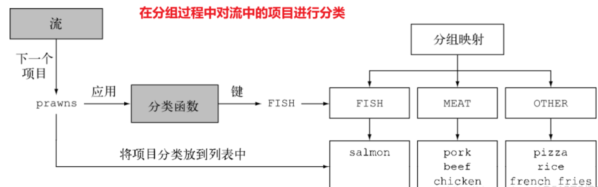

# Stream流处理


## 收集器Collectors


### 分组 groupingBy


> https://blog.51cto.com/u_15239532/2835721

例子： 把菜单中的菜按照类型进行分类，有菜的放一组，有肉的放一组，其他的都放另一组。

```java
Map<Dish.Type, List<Dish>> collect = menu.stream().collect(groupingBy(Dish::getType));
```

**用 Collectors.groupingBy 工厂方法返回的收集器就可以轻松地完成这项任务。**

```java
public static <T, K> Collector<T, ?, Map<K, List<T>>>  groupingBy(Function<? super T, ? extends K> classifier) {
	return groupingBy(classifier, toList());
}
```

给 groupingBy 方法传递了一个 Function （**以方法引用的形式**），它提取了流中每一道 Dish 的 Dish.Type 。我们把这个 Function 叫作分类函数，因为它用来把流中的元素分成不同的组。


分组操作的结果是一个 **Map** ，把**分组函数返回的值**作为映射的**键**，把流中所有**具有这个分类值的项目的列表**作为对应的**映射值**。




# 方法引用

https://www.cnblogs.com/r1-12king/p/15080322.html


---

不同类型的方法引用


| 种类                                     | 语法                                 | 例子           |
| ---------------------------------------- | ------------------------------------ | -------------- |
| 静态方法引用                             | ContainingClass::staticMethodName    | Math::abs      |
| **特定对象**的实例方法引用               | containingObject::instanceMethodName | this::equals   |
| **实例方法**的任意一个特定类型的对象引用 | `ContainingClass::staticMethodName`  | String::concat |
| 构造器引用                               | ClassName::new                       | HashSet::new   |


----

**类::实例方法**


> 这种模式并不是要直接调用类的实例方法，这样显然连编译都过不去。


这种模式实际上是 对象::实例方法模式的一种变形，当一个对象调用方法时，**<u>方法的某个参数是函数式接口</u>**，而且函数式接口的方法参数列表的第一个参数就是调用者对象所属的类时，可以引用调用者类中定义的，不包含函数式接口第一个参数的方法，并用类::实例方法这种形式来表达

```java
@FunctionalInterface
interface TestInterface<T> {
    String handleString(T a, String b);
}
class TestClass {
    String oneString;
    public String concatString(String a) {
        return this.oneString + a;
    }
    public String startHandleString(TestInterface<TestClass> testInterface, String str) {
        String result = testInterface.handleString(this, str);
        return result;
    }
}

public class Test {
    public static void main(String[] args) {
        TestClass testClass = new TestClass();
        testClass.oneString = "abc";
        String result = testClass.startHandleString(TestClass::concatString, "123");
        System.out.println(result);

        //相当于以下效果
        TestClass testClass2 = new TestClass();
        testClass2.oneString = "abc";
        TestInterface theOne2 = (a, b) -> testClass2.concatString(b);
        String result2 = theOne2.handleString(theOne2, "123");
        System.out.println(result2);

    }
}
```


当一个对象调用一个方法，方法的参数中包含一个函数式接口，该函数式接口的第一个参数类型是这个对象的类，那么这个函数式接口可**用方法引用代替**，并且替换用的方法可以不包含函数式接口的第一个参数（调用对象的类）。


