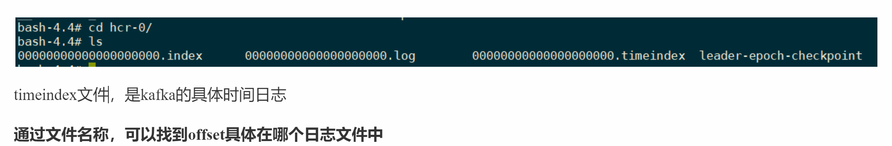
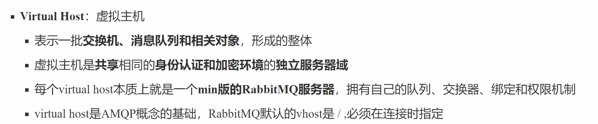
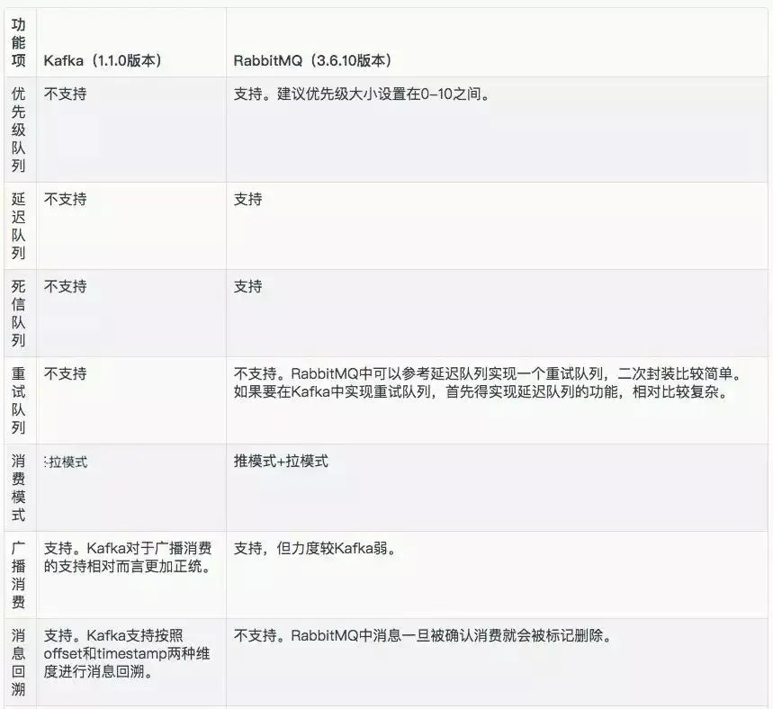
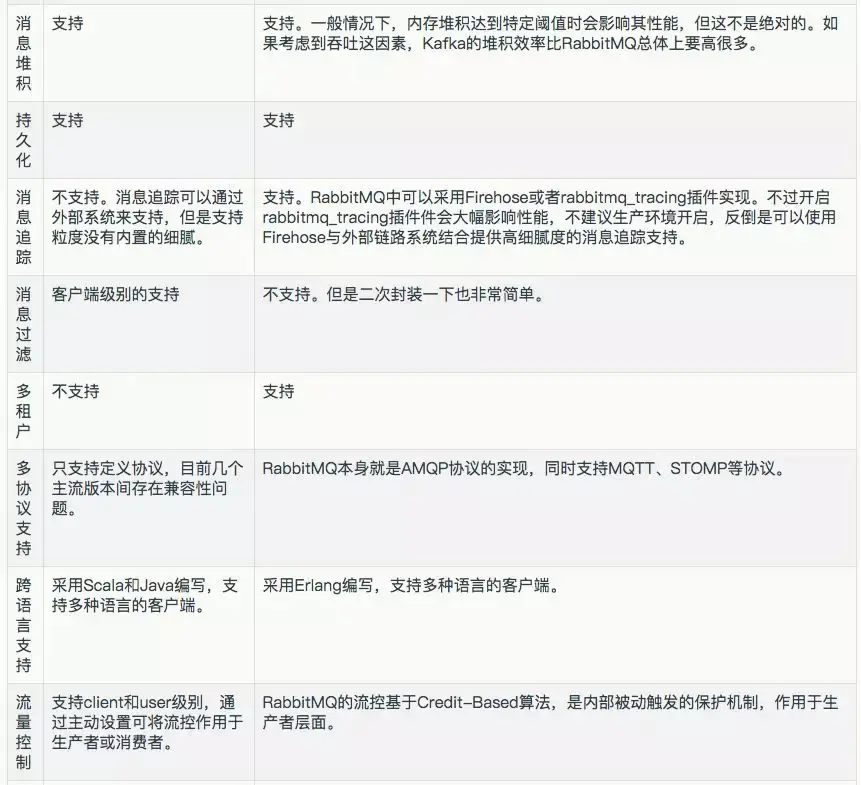
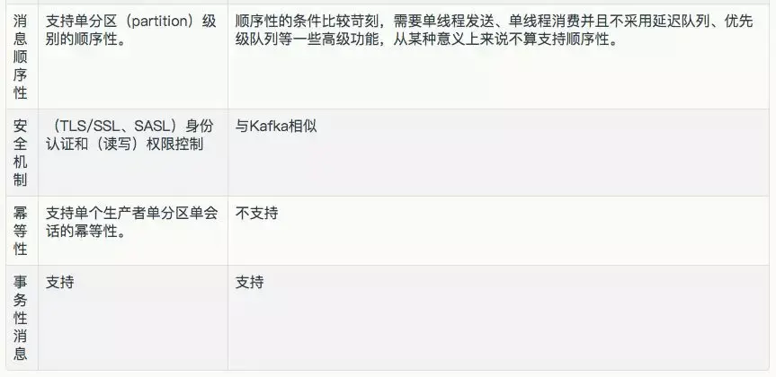

# 面试题连环炮

- 为什么使用消息队列？

> 知不知道你们系统里为什么要用消息队列这个东西？

就是为了用而用，或者是别人设计的架构，从头到尾都没思考过？？


- 消息队列有什么优点和缺点？

> 你既然用了消息队列这个东西，你知不知道用了有什么好处&坏处？

盲目弄个 MQ 进系统里，后面出了问题你是不是就自己溜了给公司留坑？你要是没考虑过引入一个技术可能存在的弊端和风险，面试官把这类候选人招进来了，基本可能就是**挖坑型选手**。就怕你干 1 年挖一堆坑，自己跳槽了，给公司留下无穷后患。


- Kafka、ActiveMQ、RabbitMQ、RocketMQ 都有什么区别，以及适合哪些场景？

> 既然你用了 MQ，可能是某一种 MQ，那么你当时做没做过调研？


- 如何保证消息队列的高可用？

> 如果有人问到你 MQ 的知识，**高可用是必问的**。MQ 会导致**系统可用性降低**。所以只要你用了 MQ，接下来问的一些要点肯定就是围绕着 MQ 的那些缺点怎么来解决了。


- 如何保证消息不被重复消费？或者说，如何保证消息消费的**幂等性**？

> 其实这是很常见的一个问题，这俩问题基本可以连起来问。既然是消费消息，那肯定要考虑会不会重复消费？能不能避免重复消费？或者重复消费了也别造成系统异常可以吗？这个是 MQ 领域的基本问题，其实本质上还是问你**使用消息队列如何保证幂等性**，这个是你架构里要考虑的一个问题。


- 如何保证消息的可靠性传输？或者说，如何处理消息丢失的问题？

> 用 MQ 有个基本原则，就是**数据不能多一条，也不能少一条**，不能多，就是前面说的重复消费和幂等性问题。不能少，就是说这数据别搞丢了。那这个问题你必须得考虑一下。
>
> 如果说你这个是用 MQ 来传递非常核心的消息，比如说**计费、扣费**的一些消息，那必须确保这个 MQ 传递过程中**绝对不会把计费消息给弄丢**。


- 如何保证消息的顺序性？

> 第一看看你了不了解顺序这个事儿？第二看看你有没有办法保证消息是有顺序的？这是生产系统中常见的问题


- 如何解决消息队列的延时以及过期失效问题？消息队列满了以后该怎么处理？有几百万消息持续积压几小时，说说怎么解决？

> 本质针对的场景，都是说，可能你的消费端出了问题，不消费了；或者消费的速度极其慢。接着就坑爹了，可能你的**消息队列集群的磁盘都快写满了**，都没人消费，这个时候怎么办？或者是这整个就**积压了几个小时**，你这个时候怎么办？或者是你积压的时间太长了，导致比如 RabbitMQ 设置了**消息过期时间**后就没了怎么办？
>
> 所以就这事儿，其实线上挺常见的，一般不出，一出就是大 case。一般常见于，举个例子，消费端每次消费之后要写 mysql，**结果 mysql 挂了**，消费端傻了，不动了；或者是消费端出了个什么岔子，导致**消费速度极其慢**。


- 如果让你写一个消息队列，该如何进行架构设计？

> - 有没有对某一个消息队列做过较为深入的原理的了解，或者从整体了解把握住一个消息队列的架构原理。
> - 看看你的设计能力，给你一个常见的系统，就是消息队列系统，看看你能不能从全局把握一下整体架构设计，给出一些关键点出来。


# 为什么使用消息队列


> 消息队列都有哪些使用场景，然后你项目里具体是什么场景，说说你在这个场景里用消息队列是什么？


面试官问你这个问题，**期望的一个回答**是说，你们公司有个什么**业务场景**，这个业务场景有个什么技术挑战，如果**不用 MQ 可能会很麻烦**，但是你现在用了 MQ 之后带给了你很多的***好处***。


消息队列常见的使用场景，比较核心的有 3 个：**解耦**、**异步**、**削峰**。


## 解耦

A 系统发送数据到 B, C, D 三个系统，通过**接口调用发送**。如果 **E 系统也要这个数据**呢？那如果 C 系统现在不需要了呢？A 系统负责人几乎崩溃......


不使用MQ：A系统需要在**内部 手动增加/删除各种其他系统的调用**，肥肠麻烦！

A系统**严重和其他系统耦合**，很多系统需要A系统将这个数据发送过来。


A 系统要时时刻刻考虑 BCDE 四个系统如果挂了该咋办？要不要重发，要不要把消息存起来？头发都白了啊！！

----

如果使用 MQ：A 系统产生一条数据，**发送到 MQ 里面去**，哪个系统需要数据**自己去 MQ 里面消费**。如果**新系统**需要数据，直接**从 MQ 里消费即可**；如果某个系统不需要这条数据了，就**取消对 MQ 消息的消费即可**。


这样下来，**A 系统压根儿不需要去考虑要给谁发送数据，不需要维护这个代码，也不需要考虑人家是否调用成功、失败超时等情况。**


**总结：通过一个MQ，Pub/Sub发布订阅消息这么一个模型，A系统就跟其他系统彻底解耦了**


### 面试技巧

你需要去考虑一下你负责的系统中是否有**类似的场景**，就是***一个系统或者一个模块，调用了多个系统或者模块，互相之间的调用很复杂，维护起来很麻烦***。

但是其实这个调用是**不需要直接同步调用接口**的，如果用 MQ 给它异步化解耦，也是可以的，你就需要去考虑在你的项目里，是不是可以运用这个 MQ 去进行系统的解耦。**在简历中体现**出来这块东西，**用 MQ 做解耦**。


## 异步


不使用MQ，**同步高延时**请求场景：

A 系统接收一个请求，需要在自己本地写库，还需要在 B，C，D 三个系统写库，自己本地写库要 3ms，BCD 三个系统**分别写库**要 300ms、450ms、200ms。最终请求总延时是 3 + 300 + 450 + 200 = 953ms，接近 1s，用户感觉搞个什么东西，慢死了慢死了。。。用户通过浏览器发起请求，等待个 1s，这几乎是不可接受的。


---


如果**使用 MQ**，那么 A 系统**连续发送 3 条消息到 MQ 队列中**，假如耗时 5ms，A系统自己本地写库需要3ms，A 系统从接受一个请求到返回响应给用户，总时长是 3 + 5 = 8ms，对于用户而言，其实感觉上就是点个按钮，8ms 以后就直接返回了，爽！网站做得真好，真快！

每个系统自己从对应的MQ队列中去消费对应的消息，从消息中提取参数，**在自己本地执行**对应的操作。


> **在发完消息后就可以直接返回了，非常快！**
>
> **不需要整个线程等待三个系统调用依次完成再进行返回**


## 削峰

**削->将削掉的部分移到后面处理**


每天 0:00 到 12:00，A 系统风平浪静，每秒并发请求数量就 50 个。结果每次一到 12:00 ~ 13:00 ，**每秒并发请求数量突然会暴增**到 5k+ 条。但是系统是直接**基于 MySQL** 的，大量的请求涌入 MySQL，**每秒钟对 MySQL 执行约 5k 条 SQL**。

一般的 MySQL，扛到**每秒 2k 个请求就差不多了**，如果每秒请求到 5k 的话，可能就直接把 MySQL 给打死了，导致系统崩溃，用户也就没法再使用系统了。

但是**高峰期**一过，到了下午的时候，就**成了低峰期**，可能也就 1w 的用户同时在网站上操作，每秒中的请求数量可能也就 50 个请求，对整个系统**几乎没有任何的压力**。


----


如果使用 MQ，每秒 5k 个请求写入 MQ，A 系统每秒钟最多处理 2k 个请求，因为 MySQL 每秒钟最多处理 2k 个。A 系统从 MQ 中**慢慢拉取请求**，每秒钟就拉取 2k 个请求，***==不要超过自己每秒能处理的最大请求数量就 ok==***，

这样下来，哪怕是高峰期的时候，**A 系统也绝对不会挂掉**。而 MQ 每秒钟 5k 个请求进来，就 2k 个请求出去，结果就导致在中午高峰期（1 个小时=18w*60=千万条消息），可能有几十万甚至几百万的**请求积压**在 MQ 中。


这个**短暂的高峰期积压是 ok 的**，因为高峰期过了之后，每秒钟就 50 个请求进 MQ，但是 A 系统依然会按照每秒 2k 个请求的速度在处理。所以说，**只要高峰期一过，A 系统就会快速将积压的消息给解决掉。**


# 消息队列有什么优缺点


优点上面已经说了，就是**在特殊场景下有其对应的好处**，**解耦**、**异步**、**削峰**。


缺点有以下几个：

- 系统**可用性降低**
  系统引入的外部依赖越多，越容易挂掉。本来你就是 A 系统调用 B，C，D 三个系统的接口就好了， ABCD 四个系统好好的，没啥问题，偏加个 MQ 进来，万一 **MQ 挂了咋整(集群，高可用)**，**MQ 一挂，整套系统崩溃的**，不就完了？

  如何保证消息队列的高可用，可以[点击这里查看](https://gitee.com/shishan100/Java-Interview-Advanced/blob/master/docs/high-concurrency/how-to-ensure-high-availability-of-message-queues.md)。

- ***系统复杂度提高***

  出现故障，系统A发送了多条一样的消息（**保证消息的幂等**）

  硬生生加个 MQ 进来，你怎么[保证消息没有重复消费](https://gitee.com/shishan100/Java-Interview-Advanced/blob/master/docs/high-concurrency/how-to-ensure-that-messages-are-not-repeatedly-consumed.md)？怎么[处理消息丢失的情况](https://gitee.com/shishan100/Java-Interview-Advanced/blob/master/docs/high-concurrency/how-to-ensure-the-reliable-transmission-of-messages.md)？怎么保证**消息传递的顺序性**？头大头大，问题一大堆，痛苦不已。

- ***一致性问题***
  A 系统处理完了**直接返回成功了**，人都以为你这个请求就成功了；但是问题是，要是 BCD 三个系统那里，BD 两个系统写库成功了，结果 **C 系统写库失败了，咋整？数据就不一致了**。

所以消息队列实际是一种非常复杂的架构，你引入它有很多好处，但是也得针对它带来的坏处做各种**额外的技术方案和架构**来规避，做好之后，你会发现系统复杂度提升了一个数量级，也许是复杂了 10 倍。但是关键时刻，用，还是得用的。


# Kafka、ActiveMQ、RabbitMQ、RocketMQ 都有什么优缺点


| 特性                     | ActiveMQ                                  | RabbitMQ                                               | RocketMQ                                                     | Kafka                                                        |
| ------------------------ | ----------------------------------------- | ------------------------------------------------------ | ------------------------------------------------------------ | ------------------------------------------------------------ |
| 单机吞吐量               | **万级**，比 RocketMQ、Kafka 低一个数量级 | 同 ActiveMQ                                            | **10 万级**，支撑高吞吐                                      | 10 万级，高吞吐，一般配合**大数据类的系统**来进行**实时数据计算、日志采集**等场景 |
| topic 数量对吞吐量的影响 |                                           |                                                        | **topic** 可以达到几百/几千的级别，吞吐量会有较小幅度的下降，这是 RocketMQ 的一大优势，在同等机器下，可以**支撑大量的 topic** | topic 从几十到几百个时候，吞吐量会大幅度下降，在同等机器下，Kafka 尽量**保证 topic 数量不要过多**，如果要支撑大规模的 topic，需要增加更多的机器资源 |
| 时效性                   | ms 级                                     | **微秒级**，这是 RabbitMQ 的一大特点，***延迟最低***   | ms 级                                                        | 延迟在 ms 级以内                                             |
| 可用性                   | 高，基于**主从架构**实现高可用            | 同 ActiveMQ                                            | 非常高，分布式架构                                           | 非常高，分布式，一个数据多个**副本**，少数机器宕机，**不会丢失数据**，不会导致不可用 |
| 消息可靠性               | 有较低的概率丢失数据                      | 基本不丢                                               | 经过参数优化配置，可以**做到 0 丢失**                        | 同 RocketMQ                                                  |
| 功能支持                 | MQ 领域的功能极其完备                     | 基于 erlang 开发，**并发能力很强，性能极好，延时很低** | MQ 功能较为完善，还是**分布式**的，扩展性好                  | **功能较为简单**，主要支持简单的 MQ 功能，在大数据领域的实时计算以及日志采集被大规模使用 |


- 一般的业务系统要引入 MQ，最早大家都用 ActiveMQ，但是现在确实大家用的不多了，没经过大规模吞吐量场景的验证，社区也不是很活跃，不推荐用这个了


- 后来大家开始用 RabbitMQ，但是确实 **erlang 语言**阻止了大量的 Java 工程师去深入研究和掌控它，对公司而言，几乎处于**不可控的状态**，但是确实人家是开源的，比较稳定的支持，活跃度也高。**性能极好，延时很低，管理界面完善，操作方便**

  但是RabbitMQ问题也显而易见，吞吐量比RocketMQ低一些。RabbitMQ集群动态扩展会很麻烦，但主要是erlang语言本身带来的问题，很难阅读源码


- 不过现在确实越来越多的公司会去用 RocketMQ，确实很不错，毕竟是**阿里出品，大规模使用**，但社区可能有突然黄掉的风险（目前 RocketMQ 已捐给 [Apache](https://github.com/apache/rocketmq)，但 GitHub 上的活跃度其实不算高）对自己公司技术实力有绝对自信的，推荐用 RocketMQ，否则回去老老实实用 RabbitMQ ，有活跃的开源社区，绝对不会黄。

  所以**中小型公司**，技术实力较为一般，技术挑战不是特别高，用 RabbitMQ 是不错的选择；**大型公司**，基础架构研发实力较强，用 RocketMQ 是很好的选择。


- 如果是**大数据领域**的实时计算、日志采集等场景，用 Kafka 是业内标准的，绝对没问题，社区**活跃度很高**，绝对不会黄，何况几乎是全世界这个领域的事实性规范。


# 如何保证消息队列的高可用？


##  RabbitMQ 的高可用性


RabbitMQ 是比较有代表性的，因为是==**基于主从**（**非分布式，是集群模式，每一台机器的数据都相同，只是做到了同步**）==做高可用性的，我们就以 RabbitMQ 为例子讲解第一种 MQ 的高可用性怎么实现。

RabbitMQ 有三种模式：**单机模式**、**普通集群**模式、**镜像集群**模式。


> 见RabbitMQ笔记：


### 单机模式


单机模式，就是 Demo 级别的，一般就是本地启动了玩玩儿的😄，没人生产用单机模式。


###  普通集群模式（无高可用性）


普通集群模式，意思就是在多台机器上启动多个 RabbitMQ 实例，每个机器启动一个。你**创建的 queue，只会放在一个 RabbitMQ 实例上**，但是每个实例都同步 **queue 的元数据**（元数据可以认为是 ***queue 的一些配置信息，通过元数据，可以找到 queue 所在实例*** ）。你消费的时候，实际上如果连接到了另外一个实例，那么那个实例会**从 queue 所在实例上拉取数据**过来。


这种方式确实很麻烦，也不怎么好，**没做到所谓的分布式**，就是个普通集群。因为这导致你要么消费者每次随机连接一个实例然后拉取数据，要么固定连接那个 queue 所在实例消费数据，前者有**==数据拉取的开销==**，后者导致**==单实例性能瓶颈==**。

而且如果那个放 queue 的实例宕机了，会导致接下来其他实例就无法从那个实例拉取，如果你**开启了消息持久化**，让 RabbitMQ 落地存储消息的话，**消息不一定会丢**，得等这个实例**恢复**了，然后才可以继续从这个 queue 拉取数据。

所以这个事儿就比较尴尬了，这就**没有什么所谓的高可用性**，**这方案主要是==提高吞吐量==的**，就是说让集群中**多个节点来服务某个 queue 的读写操作**。


###  镜像集群模式（高可用性）


这种模式，才是所谓的 RabbitMQ 的高可用模式。跟普通集群模式不一样的是，在镜像集群模式下，你创建的 queue，无论元数据还是 queue 里的消息都会**存在于多个实例上**，就是说，每个 RabbitMQ 节点都有这个 queue 的一个**完整镜像**，**包含 queue 的全部数据**的意思。然后每次你写消息到 queue 的时候，都会自动把**消息同步**到多个实例的 queue 上。


那么**如何开启这个镜像集群模式**呢？其实很简单，RabbitMQ 有很好的管理控制台，就是在后台新增一个策略，这个策略是**镜像集群模式的策略**，指定的时候是可以**要求数据同步到所有节点**的，也可以要求同步到指定数量的节点，再次创建 queue 的时候，应用这个策略，就会自动将数据同步到其他的节点上去了。

> 见RabbitMQ笔记：


这样的话，好处在于，你任何一个机器宕机了，没事儿，**其它机器（节点）还包含了这个 queue 的完整数据**，别的 consumer 都可以到其它节点上去消费数据。

坏处在于，第一，这个性能开销也太大了吧，消息需要同步到所有机器上，导致网络带宽压力和消耗很重！

第二，这么玩儿，不是分布式的，就**没有扩展性可言**了，如果某个 queue 负载很重，你加机器，新增的机器也包含了这个 queue 的所有数据，并**没有办法线性扩展**你的 queue。你想，如果这个 queue 的数据量很大，**大到这个机器上的容量无法容纳了**，此时该怎么办呢？


##  Kafka 的高可用性


Kafka 一个最基本的架构认识：由**多个 broker** 组成，每个 broker 是一个节点；你创建一个 topic，这个 **topic 可以划分为多个 partition**，**每个 partition 可以存在于不同的 broker 上**，每个 partition 就**放一部分数据**。

这就是**天然的分布式消息队列**，就是说一个 topic 的数据，是**分散放在多个机器上的，每个机器就放一部分数据**。

实际上 RabbmitMQ 之类的，并不是分布式消息队列，它就是传统的消息队列，只不过提供了一些**集群、HA**(High Availability, 高可用性) 的机制而已，因为无论怎么玩儿，***RabbitMQ 一个 queue 的数据都是放在一个节点里的，镜像集群下，也是每个节点都放这个 queue 的完整数据。***

Kafka 0.8 以前，是没有 HA 机制的，就是任何一个 broker 宕机了，那个 broker 上的 **partition 就废了**，没法写也没法读，没有什么高可用性可言。

比如说，我们假设创建了一个 topic，指定其 partition 数量是 3 个，分别在三台机器上。但是，如果第二台机器宕机了，会导致这个 topic 的 1/3 的数据就**丢了**，因此这个是**做不到高可用**的。


如下图：创建了一个topic，partition=3，生产者往topic写了3条数据，这3条数据分布在了3台机器的不通过partition上


Kafka 0.8 以后，提供了 HA 机制，就是 **replica（复制品） 副本机制**。

(**和elasticsearch分片、副本机制相同**)

每个 partition 的数据都会**同步到其它机器**上，形成自己的多个 **replica 副本**。所有 replica 会选举一个 leader 出来，那么**生产和消费都跟这个 leader 打交道**，然后其他 replica 就是 **follower**。写的时候，leader 会负责把数据同步到所有 follower 上去，读的时候就直接读 leader 上的数据即可。

***只能读写 leader？***很简单，**要是你可以随意读写每个 follower，那么就要 care 数据一致性的问题**，系统复杂度太高，很容易出问题。Kafka 会**均匀地**将**一个 partition 的所有 replica 分布在不同的机器上，这样才可以提高容错性。**


每一台机器都存储一个replica副本，并且每一个replica都会至少有两个，这些副本会选举出一个leader，剩下的都是follower。**只有leader可以提供对外读写**，**消费者也只能从leader消费数据**，leader会将**数据同步**到follower上。

当leader挂了后，其他的副本就选出来一个leader


这么搞，就有所谓的**高可用性**了，因为如果某个 broker 宕机了，没事儿，那个 broker上面的 **partition** 在其他机器上**都有副本的**。如果这个宕机的 broker 上面有某个 partition 的 leader，那么此时会从 follower 中**重新选举**一个**新的 leader** 出来，大家继续读写那个新的 leader 即可。这就有所谓的高可用性了。

**写数据**的时候，生产者就写 leader，然后 leader **将数据落地写本地磁盘**，接着其他 follower 自己主动从 leader 来 pull 数据。一旦**所有 follower 同步好数据**了，就会发送 ack 给 leader，leader 收到所有 follower 的 ack 之后，就会**返回写成功**的消息给生产者。（当然，这只是其中一种模式，还可以适当调整这个行为）

**消费**的时候，只会从 leader 去读，但是只有当一个消息已经被所有 follower 都同步成功返回 ack 的时候，这个消息才会被消费者读到。


# 如何保证消息不被重复消费 / 如何保证消息消费的幂等性？


## 会有哪些重复消费的问题


首先，比如 RabbitMQ、RocketMQ、Kafka，都有可能会出现**消息重复消费**的问题，正常。因为这问题通常不是 MQ 自己保证的，**是由我们开发来保证**的。挑一个 Kafka 来举个例子，说说怎么重复消费吧。

---

Kafka 实际上有个 offset 的概念，就是每个消息写进去，都有一个 **offset**，代表消息的**序号**，然后 consumer 消费了数据之后，不是每消费一条就**立马提交**，**而是每隔一段时间**（定时定期），会把自己**消费过的消息的 offset 提交一下**，表示“我已经消费过了，下次我要是重启啥的，你就让我继续**从上次消费到的 offset 来继续消费**吧”。

但是凡事总有意外，比如我们之前生产经常遇到的，就是你有时候重启系统，看你怎么重启了，如果碰到点着急的，直接 **kill 进程了，再重启**。这会导致 consumer **有些消息处理了，但是没来得及提交 offset**，尴尬了。重启之后，**少数消息会再次消费一次**。

---

举个栗子。

有这么个场景。数据 1/2/3 依次进入 kafka，kafka 会给这三条数据每条分配一个 offset，代表这条数据的序号，我们就假设分配的 offset 依次是 152/153/154。***消费者从 kafka 去消费的时候，也是按照这个顺序去消费***。假如当消费者消费了 `offset=153` 的这条数据，刚准备去提交 offset 到 zookeeper，此时消费者进程被重启了。那么此时消费过的**数据 1/2 的 offset 并没有提交**，kafka 也就不知道你已经消费了 `offset=153` 这条数据。那么重启之后，消费者会找 kafka 说，嘿，哥儿们，你给我接着把**上次我消费到的那个地方**后面的数据继续给我传递过来。由于之前的 offset **没有提交成功**，那么**数据 1/2 会再次传过来**，如果此时消费者没有**==去重==**的话，那么就会导致重复消费。

zookeeper记录了消费者当前消费到了offset=x 的那条消费


如果消费者干的事儿是**拿一条数据就往数据库里写一条**，会导致说，你可能就把数据 1/2 在数据库里**插入了 2 次**，那么数据就错啦。

---

其实重复消费不可怕，可怕的是你没考虑到重复消费之后，**怎么保证幂等性**。

举个例子吧。假设你有个系统，消费一条消息就往数据库里插入一条数据，要是你一个消息重复两次，你不就**插入了两条**，这数据不就错了？但是你要是消费到第二次的时候，自己**判断一下是否已经消费过了，若是就直接扔了，这样不就保留了一条数据，从而保证了数据的正确性。**

一条数据重复出现两次，数据库里就**只有一条数据**，这就保证了系统的幂等性。

幂等性，通俗点说，就一个数据，或者一个请求，给你重复来多次，你得确保对应的数据是不会改变的，**不能出错**。


## 保证消息队列消费的幂等性


结合业务来思考，几个思路：

- 比如你拿个数据要写库，你**先根据主键查一下**，如果这数据都有了，你就别插入了，**update 一下**好吧。
- 比如你是写 **Redis**，那没问题了，反正每次都是 **==set，天然幂等性==**。
- 比如你不是上面两个场景，那做的稍微复杂一点，你需要让生产者发送每条数据的时候，里面加一个**全局唯一的 id**，类似订单 id 之类的东西，然后你这里消费到了之后，先根据这个 id 去比如 Redis 里查一下，**之前消费过吗**？如果没有消费过，你就处理，然后这个 **id 写 Redis(存到Redis中，内存快速查询)**。如果消费过了，那你就别处理了，保证别重复处理相同的消息即可。
- 在内存Set（Redis）中查询是否消费过这个id
- 比如基于数据库的**唯一键**来保证重复数据不会重复插入多条。因为有唯一键约束了，重复数据**插入只会报错**，**不会导致数据库中出现脏数据**。


# 如何保证消息的可靠性传输 / 如何处理消息丢失的问题？


据的丢失问题，可能出现在生产者、MQ、消费者中，咱们从 RabbitMQ 和 Kafka 分别来分析一下


## RabbitMQ


### 生产者弄丢了数据


生产者将数据发送到 RabbitMQ 的时候，可能数据就在**半路**给搞丢了，因为网络问题啥的，都有可能。

此时可以选择用 RabbitMQ 提供的**事务功能**，就是生产者**发送数据之前**开启 RabbitMQ 事务`channel.txSelect`，然后发送消息，如果消息没有成功被 RabbitMQ 接收到，那么生产者会收到异常报错，此时就可以回滚事务`channel.txRollback`，然后重试发送消息；如果收到了消息，那么可以提交事务`channel.txCommit`。


```java
// 开启事务
channel.txSelect
try {
    // 这里发送消息
} catch (Exception e) {
    //异常，回滚
    channel.txRollback
    // 这里再次重发这条消息
}

// 提交事务
channel.txCommit
```

问题是，RabbitMQ 事务机制（同步）一搞，基本上**吞吐量会下来，因为太耗性能**。


----

所以一般来说，如果你要确保说写 RabbitMQ 的消息别丢，可以开启 `confirm` 模式，在生产者那里设置开启 `confirm` 模式之后，你每次写的消息都会**分配一个唯一的 id**，然后如果写入了 RabbitMQ 中，***RabbitMQ 会给你回传一个 `ack` 消息***，告诉你说这个消息 ok 了。如果 RabbitMQ 没能处理这个消息，会**回调**你的一个 `nack` 接口，告诉你这个消息**接收失败，你可以重试**。而且你可以结合这个机制自己在内存里维护每个消息 id 的状态，如果超过一定时间还没接收到这个消息的回调，那么你可以重发。

> 见RabbitMQ笔记，配置回调方法。实现 `RabbitTemplate.ConfirmCallback`接口

事务机制和 `confirm` 机制最大的不同在于，**事务机制是同步的**，你提交一个事务之后会**阻塞**在那儿，但是 `confirm` 机制是**异步**的，你**发送个消息之后就可以发送下一个消息**，然后那个消息 RabbitMQ 接收了之后会***异步回调***  你的一个接口通知你这个消息接收到了。

所以一般在生产者这块**避免数据丢失**，都是用 `confirm` 机制的。**吞吐量会高一些**


###  RabbitMQ 弄丢了数据


就是 RabbitMQ 自己弄丢了数据，这个你必须**开启 RabbitMQ 的持久化**，就是消息写入之后会**==持久化到磁盘==**，哪怕是 RabbitMQ 自己挂了，**恢复之后会自动读取之前存储的数据**，一般数据不会丢。除非极其罕见的是，RabbitMQ 还没持久化，自己就挂了，**可能导致少量数据丢失**，但是这个概率较小。

---

设置持久化有**两个步骤**：

- 创建 **queue 的时候将其设置为持久化**
  这样就可以保证 RabbitMQ 持久化 **queue 的元数据**，但是它是不会持久化 queue 里的数据的。
- 第二个是发送消息的时候将消息的 `deliveryMode` 设置为 2
  就是将**消息设置为持久化**的，此时 RabbitMQ 就会将消息持久化到磁盘上去。


**必须要同时设置这两个持久化**才行，RabbitMQ 哪怕是挂了，再次重启，也会从磁盘上**重启恢复** queue，恢复这个 queue 里的数据。

注意，哪怕是你给 RabbitMQ 开启了持久化机制，也有一种可能，就是这个消息写到了 RabbitMQ 中，但是还**没来得及持久化到磁盘上**，结果不巧，此时 RabbitMQ 挂了，就会导致内存里的一点点数据丢失。

所以，持久化可以跟生产者那边的 `confirm` 机制配合起来，**只有消息被持久化到磁盘之后，才会通知生产者 `ack` 了**，所以哪怕是在持久化到磁盘之前，RabbitMQ 挂了，数据丢了，生产者收不到 `ack`，你也是可以自己重发的。


###  消费端弄丢了数据


RabbitMQ 如果丢失了数据，主要是因为你消费的时候，**刚消费到，还没处理，结果进程挂了**，比如重启了，那么就尴尬了，RabbitMQ 认为你都消费了，这数据就丢了。

**打开了自动确认机制，需要进行手动确认！**

```xml
<!--    配置监听-->
    <rabbit:listener-container connection-factory="connectionFactory" acknowledge="manual" prefetch="3">
        <rabbit:listener ref="consumerListener2" queue-names="test_spring_queue_1"/>
    </rabbit:listener-container>
```

这个时候得用 RabbitMQ 提供的 `ack` 机制，简单来说，就是你**必须关闭 RabbitMQ 的自动 `ack`**，可以通过一个 api 来调用就行，然后每次你自己代码里确保处理完的时候，再在程序里 `ack` 一把。这样的话，如果你还没处理完，不就没有 `ack` 了？那 **RabbitMQ 就认为你还没处理完**，这个时候 RabbitMQ **会把这个消费分配给别的 consumer 去处理，消息是不会丢的**。


实现 `ChannelAwareMessageListener`接口，进行手动确认

`channel.basicAck(message.getMessageProperties().getDeliveryTag(), true);`


##  Kafka


###  消费端弄丢了数据


**唯一**可能导致消费者弄丢数据的情况，就是说，你消费到了这个消息，然后消费者那边**自动提交了 offset**，让 Kafka **以为你已经消费好了**这个消息，但其实你才刚准备处理这个消息，你还没处理，**你自己就挂了**，**此时这条消息就丢咯**。。。。。。


跟 RabbitMQ 差不多，大家都知道 Kafka 会自动提交 offset，那么只要**关闭自动提交** offset，在处理完之后自己**==手动提交 offset==**，就可以保证数据不会丢。但是此时确实还是**可能会有重复消费**，比如你刚处理完，还没提交 offset，结果自己挂了，此时肯定会重复消费一次，自己保证幂等性就好了。


生产环境碰到的一个问题，就是说我们的 Kafka 消费者消费到了数据之后是写到一个**内存的 queue** 里先**缓冲**一下，结果有的时候，你刚把消息写**入内存 queue**，然后**消费者会自动提交 offset**。然后此时我们重启了系统，就会导致**内存 queue 里还没来得及处理的数据就丢失了**。。。。。。


###  Kafka 弄丢了数据


这块比较常见的一个场景，就是 Kafka 某个 broker 宕机，然后重新选举 partition 的 leader。大家想想，要是此时**其他的 follower 刚好还有些数据没有同步**，结果**此时 leader 挂了**，然后选举某个 follower 成 leader 之后，不就**少了一些数据**？这就**丢了一些数据啊！**


> 生产环境也遇到过， Kafka 的 leader 机器宕机了，将 follower 切换为 leader 之后，就会发现这个数据就丢了。


所以此时一般是要求起码**设置如下 4 个参数**：

- 给 topic 设置 `replication.factor` 参数：这个值必须大于 1，要求**每个 partition 必须有至少 2 个副本**。
- 在 Kafka 服务端设置 `min.insync.replicas` 参数：这个值必须大于 1，这个是要求一个 leader 至少**感知到有至少一个 follower 还跟自己保持联系**，没掉队，这样才能确保 leader 挂了还有一个 follower 吧。
- 在 producer 端设置 `acks=all`：这个是要求每条数据，必须是==**写入所有 replica 之后，才能认为是写成功了**==。
- 在 producer 端设置 `retries=MAX`（很大很大很大的一个值，**无限次重试**的意思）：这个是**==要求一旦写入失败，就无限重试==**，卡在这里了。

我们生产环境就是按照上述要求配置的，这样配置之后，至少**在 Kafka broker 端就可以保证在 leader 所在 broker 发生故障，进行 leader 切换时，数据不会丢失**。


如果leader没有向follower写数据成功，就宕机了，那么生产者会认为这次写数据**失败了**，**无限次重试**，此时切换了leader，再去尝试。


###  生产者会不会弄丢数据？


如果按照上述的思路设置了 `acks=all`，一定不会丢，要求是，*你的 leader 接收到消息，所有的 follower 都同步到了消息之后*，**才认为本次写成功了**。

如果没满足这个条件，生产者会认为没有写成功，生产者会**自动不断的重试，重试无限次**。


# 如何保证消息的顺序性


> 我举个例子，我们以前做过一个 mysql  `binlog` 同步的系统，压力还是非常大的，日同步数据要达到上亿，就是说数据从一个 mysql 库原封不动地**同步**到另一个 mysql 库里面去（mysql -> mysql）。常见的一点在于说比如大数据 team，就需要同步一个 mysql 库过来，对公司的业务系统的数据做各种复杂的操作。


你在 mysql 里增删改一条数据，对应出来了**增删改 3 条 `binlog` 日志**，接着这三条 `binlog` 发送到 MQ 里面，再**消费出来依次执行**，起码得保证人家是**按照顺序**来的吧？不然本来是：增加、修改、删除；你楞是换了顺序给执行成删除、修改、增加，不全错了么。

本来这个数据同步过来，应该最后这个数据被删除了；结果你搞错了这个顺序，最后这个数据保留下来了，**数据同步就出错了**。


## 顺序会错乱的两个场景


- **RabbitMQ**：一个 queue，多个 consumer。比如，生产者向 RabbitMQ 里发送了三条数据，顺序依次是 data1/data2/data3，压入的是 RabbitMQ 的一个内存队列。有**三个消费者**分别从 MQ 中消费这三条数据中的一条，结果**消费者2先执行完操作**，把 data2 存入数据库，然后是 data1/data3。这不**明显乱了**。


在数据发送到消息队列中，被**多个消费者并行**消费的顺序可能会错乱，导致出现错误。


- **Kafka**：比如说我们建了一个 topic，有三个 partition。生产者在写的时候，其实可以指定一个 key，比如说我们**指定了某个订单 id 作为 key**，那么**这个订单id**相关的数据，**一定会被分发到*同一个 partition 中*  去**，而且这个 **partition 中的数据一定是有顺序**的。

  消费者从 partition 中取出来数据的时候，也一定是有顺序的。到这里，顺序还是 ok 的，没有错乱。接着，我们在消费者里可能会搞**==多个线程==来并发处理消息**。因为如果消费者是单线程消费处理，而处理比较耗时的话，比如处理一条消息耗时几十 ms，那么 1 秒钟只能处理几十条消息，这吞吐量太低了。而多个线程并发跑的话，**顺序可能就乱掉了**。

**kafka保证一个消费者消费一个partition，不能多个消费者消费一个partition！**

**可以保证生产者在写到一个partition中的数据一定是有顺序的。一个消费者从partition中一定是按照顺序取出来的消息。**

**但==一个消费者可以  启动多线程==从partition中获取消息进行执行，==无法保证各线程的执行顺序（执行速度/任务阻塞/...）==**


## 解决方案


- RabbitMQ

**拆分多个 queue**，**每个 queue 只对应 一个 消费者**，就是多一些 queue 而已，确实是麻烦点；或者就一个 queue 只对应一个 consumer，然后这个 consumer 内部用，可以保证加入到一个queue中的消息都能顺序执行

**需要保证顺序的消息，发到一个queue中，只==由一个消费者依次串行处理==。就可以保证执行顺序！**


内存队列做排队，然后分发给底层不同的 worker 来处理。 


----

**kafka**


- 一个 topic，一个 partition，一个 consumer，**内部单线程消费**，单线程吞吐量太低，一般不会用这个。

- 写 N 个**内存 queue**，具有**相同 key** 的数据都到**同一个内存 queue**；然后对于 **N 个线程**，每个线程**分别消费一个内存 queue** 即可，这样就能保证顺序性。


（因为不止一组需要保持顺序的消息，**非常多不同的key**都需要执行**一系列有序**的操作。将hash值 / key值**相同的操作(表示是一组有序的操作)**都放到一个内存queue中。

开启多线程，每个线程从自己对应的内存queue中拉取当前的几个消息来执行）


# 如何解决消息队列的延时以及过期失效问题？消息队列满了以后该怎么处理？有几百万消息持续积压几小时，说说怎么解决？


##  大量消息在 mq 里积压了几个小时了还没解决


> 几千万条数据在 MQ 里积压了七八个小时，从下午 4 点多，积压到了晚上 11 点多。这个是我们真实遇到过的一个场景，确实是线上故障了，这个时候要不然就是修复 consumer 的问题，让它恢复消费速度，然后傻傻的等待几个小时消费完毕。这个肯定不能在面试的时候说吧。


一个消费者一秒是 1000 条，一秒 3 个消费者是 3000 条，一分钟就是 18 万条。所以如果你积压了几百万到上千万的数据，即使消费者恢复了，也需要大概 1 小时的时间才能恢复过来。

一般这个时候，只能**临时紧急扩容**了，具体操作步骤和思路如下：

- 先修复 consumer 的问题，确保其**恢复消费速度**，然后将现有 consumer 都停掉。
- 新建一个 topic，**partition 是原来的 10 倍**，临时建立好原先 10 倍的 queue 数量。
- 然后写一个临时的**分发数据**的 consumer 程序，这个程序部署上去消费积压的数据，**消费之后不做耗时的处理**，直接**均匀轮询写入临时建立好的 10 倍数量的 queue**。
- 接着临时征用 10 倍的机器来**部署 consumer**，每一批 consumer **消费一个临时 queue** 的数据。这种做法相当于是临时将 queue 资源和 consumer 资源扩大 10 倍，**以正常的 10 倍速度**来消费数据。
- 等快速消费完积压数据之后，**得恢复原先部署的架构**，**重新**用原先的 consumer 机器来消费消息。

原来3个消费者需要1个小时可以搞定，现在30个“临时”消费者6分钟就可以搞定。


##  mq 中的消息过期失效了


假设你用的是 RabbitMQ，RabbtiMQ 是可以设置**过期时间**的，也就是 TTL。如果消息在 queue 中积压超过一定的时间就会被 RabbitMQ 给清理掉，这个数据就没了。那这就是第二个坑了。这就不是说数据会大量积压在 mq 里，而是**大量的数据会直接搞丢**。

这个情况下，就不是说要增加 consumer 消费积压的消息，因为实际上**没啥积压**，而是**丢了**大量的消息。我们可以采取一个方案，就是**批量重导**，这个我们之前线上也有类似的场景干过。就是大量积压的时候，我们当时就直接丢弃数据了，然后等**过了高峰期**以后，比如大家一起喝咖啡熬夜到晚上12点以后，用户都睡觉了。这个时候我们就开始写程序，**将丢失的那批数据**，写个临时程序，一点一点的查出来，然后**重新灌入 mq 里面去**，**把白天丢的数据给他补回来**。也只能是这样了。

假设 1 万个订单积压在 mq 里面，没有处理，其中 1000 个订单都丢了，你只能手动写程序把那 1000 个订单给查出来，手动发到 mq 里去再补一次。


##  mq 都快写满了


写入到临时的mq里，准备几倍的临时消费者来处理。

如果消息积压在 mq 里，你很长时间都没有处理掉，此时导致 mq 都快写满了，咋办？这个还有别的办法吗？没有，谁让你第一个方案执行的太慢了，你临时写程序，接入数据来消费，**消费一个丢弃一个，都不要了**，快速消费掉所有的消息。然后走第二个方案，到了晚上再补数据吧。


# 如果让你写一个消息队列，该如何进行架构设计？


比如说这个消息队列系统，我们从以下几个角度来考虑一下：

- 首先这个 mq 得支持**可伸缩性**吧，就是需要的时候**快速扩容**，就可以增加**吞吐量和容量**，那怎么搞？

  设计个**分布式**的系统呗，参照一下 kafka 的设计理念，**==broker -> topic -> partition==**，每个 partition 放一个机器，就存**一部分**数据。如果现在资源不够了，简单啊，给 topic **增加 partition**，然后做**数据迁移，增加机器**，不就可以存放更多数据，提供更高的吞吐量了？

- 其次你得考虑一下这个 mq 的数据要不要落地磁盘吧？那肯定要了，落磁盘才能保证别进程挂了数据就丢了。那**落磁盘的时候怎么落**啊？**顺序写**，这样就没有磁盘随机读写的寻址开销，磁盘顺序读写的性能是很高的，这就是 kafka 的思路。

- 其次你考虑一下你的 mq 的**可用性**啊？这个事儿，具体参考之前可用性那个环节讲解的 kafka 的**高可用保障**机制。**==多副本 -> leader & follower -> broker 挂了重新选举 leader==** 即可对外服务。

- 能不能支持**数据 0 丢失**啊？可以的，参考我们之前说的那个 kafka 数据零丢失方案。

- 保证顺序...
- 重复消费...
- .......

> mq 肯定是很复杂的，面试官问你这个问题，其实是个开放题，他就是看看你有没有从架构角度整体构思和设计的思维以及能力。


# 选型要点概述


衡量一款消息中间件是否符合需求需要从多个维度进行考察，首要的就是功能维度，这个直接决定了你能否最大程度上的实现开箱即用，进而缩短项目周期、降低成本等。如果一款消息中间件的功能达不到想要的功能，那么就需要进行二次开发，这样会增加项目的技术难度、复杂度以及增大项目周期等。

## 功能维度

功能维度又可以划分个多个子维度，大致可以分为以下这些：


- **优先级队列**

优先级队列不同于先进先出队列，优先级高的消息具备优先被消费的特权，这样可以为下游提供不同消息级别的保证。不过这个优先级也是需要有一个前提的：**如果消费者的消费速度大于生产者的速度，并且消息中间件服务器**（一般简单的称之为 Broker）中**没有消息堆积**，那么对于发送的消息设置优先级也就没有什么实质性的意义了，因为生产者刚发送完一条消息就被消费者消费了，那么就相当于 Broker 中至多只有一条消息，对于单条消息来说优先级是没有什么意义的。


- **延迟队列**

当你在网上购物的时候是否会遇到这样的提示：“三十分钟之内未付款，订单自动取消”？这个是延迟队列的一种典型应用场景。延迟队列存储的是对应的延迟消息，所谓“延迟消息”是指当消息被发送以后，并不想让消费者立刻拿到消息，而是**等待特定时间后，消费者才能拿到这个消息进行消费**。延迟队列一般分为两种：**基于消息的延迟和基于队列的延迟**。

基于消息的延迟是指**为每条消息设置不同的延迟时间**，那么每当队列中有新消息进入的时候就会**重新根据延迟时间排序**，当然这也会对性能造成极大的影响。实际应用中大多采用**基于队列的延迟**，设置不同延迟级别的队列，比如 5s、10s、30s、1min、5mins、10mins 等，**每个队列中消息的延迟时间都是相同的**，这样免去了延迟排序所要承受的性能之苦，通过一定的扫描策略（比如定时）即可投递超时的消息。


- **死信队列**

由于某些原因消息无法被正确的投递，为了**确保消息不会被无故的丢弃**，一般将其置于一个特殊角色的队列，这个队列一般称之为***<u>死信队列</u>***。与此对应的还有一个“回退队列”的概念，试想如果消费者在消费时发生了异常，那么就不会对这一次消费进行确认（Ack）, 进而发生回滚消息的操作之后***消息始终会放在队列的顶部***，然后不断被处理和回滚，导致队列陷入死循环。为了解决这个问题，***可以为每个队列设置一个回退队列，它和死信队列都是为异常的处理提供的一种机制保障。实际情况下，回退队列的角色可以由死信队列和重试队列来扮演。***


- **重试队列**

重试队列其实可以看成是一种回退队列，具体指***消费端消费消息失败时***，为***防止消息无故丢失而重新将消息回滚到 Broker 中***。与回退队列不同的是重试队列一般分成多个重试等级，每个重试等级一般也会设置**重新投递延时**，重试次数越多投递延时就越大。举个例子：消息第一次消费失败入重试队列 Q1，Q1 的重新投递延迟为 5s，在 5s 过后重新投递该消息；如果消息再次消费失败则入重试队列 Q2，Q2 的重新投递延迟为 10s，在 10s 过后再次投递该消息。以此类推，重试越多次重新投递的时间就越久，为此需要设置一个上限，**超过投递次数就入死信队列**。重试队列与延迟队列有相同的地方，都是需要**设置延迟级别**，它们彼此的区别是：**延迟队列动作由内部触发**，**重试队列动作由外部消费端触发**；延迟队列作用一次，而重试队列的作用范围会向后传递。


- **消费模式**

消费模式分为推（push）模式和拉（pull）模式。推模式是指由 Broker 主动推送消息至消费端，实时性较好，不过需要一定的流制机制来确保服务端推送过来的消息不会压垮消费端。而拉模式是指消费端主动向 Broker 端请求拉取（一般是定时或者定量）消息，实时性较推模式差，但是可以根据自身的处理能力而控制拉取的消息量。


- **广播消费**

消息一般有两种传递模式：***点对点（P2P，Point-to-Point）模式和发布 / 订阅（Pub/Sub）模式***。对于点对点的模式而言，消息被消费以后，队列中不会再存储，所以**消息消费者不可能消费到已经被消费的消息**。虽然队列可以支持多个消费者，但是一条消息只会被一个消费者消费。***发布订阅模式定义了如何向一个内容节点发布和订阅消息***，这个内容节点称为**主题（topic）**，主题可以认为是消息传递的中介，消息发布者将消息发布到某个主题，而消息订阅者则从主题中订阅消息。主题使得消息的订阅者与消息的发布者互相保持独立，不需要进行接触即可保证消息的传递，发布 / 订阅模式在消息的一对多广播时采用。***RabbitMQ 是一种典型的点对点模式，而 Kafka 是一种典型的发布订阅模式***。但是 RabbitMQ 中可以通过设置交换器类型来实现发布订阅模式而达到广播消费的效果，Kafka 中也能以点对点的形式消费，你完全可以把其**消费组（consumer group）的概念看成是队列**的概念。不过对比来说，***<u>==Kafka 中因为有了消息回溯（offset）功能的存在，对于广播消费的力度支持比 RabbitMQ 的要强。==</u>***


- **消息回溯**

一般消息在消费完成之后就被处理了，之后再也不能消费到该条消息。消息回溯正好相反，是指**消息在消费完成之后，还能消费到之前被消费掉的消息**。对于消息而言，经常面临的问题是“**消息丢失**”，至于是真正由于**消息中间件的缺陷丢失**还是由于**使用方的误用而丢失**一般很难追查，如果消息中间件本身具备消息回溯功能的话，可以通过回溯消费复现“丢失的”消息进而查出问题的源头之所在。消息回溯的作用远不止与此，比如还有索引恢复、本地缓存重建，有些业务补偿方案也可以采用回溯的方式来实现。

kafka: offset，timeindex文件确保可以实现回溯




- **消息堆积 + 持久化**

***流量削峰***  是消息中间件的一个非常重要的功能，而这个功能其实得益于其  ***消息堆积能力***  。从某种意义上来讲，如果一个消息中间件不具备消息堆积的能力，那么就不能把它看做是一个合格的消息中间件。消息堆积分**内存式堆积和磁盘式堆积**。

***RabbitMQ 是典型的内存式堆积***，但这并非绝对，在某些条件触发后会有换页动作来**将内存中的消息换页到磁盘**（换页动作会影响吞吐），或者直接使用**惰性队列**来将消息直接**持久化至磁盘**中。

**Kafka 是一种典型的磁盘式堆积**，所有的消息都存储在磁盘中。一般来说，磁盘的容量会比内存的容量要大得多，对于磁盘式的堆积其堆积能力就是**整个磁盘的大小**。从另外一个角度讲，消息堆积也为消息中间件提供了**冗余存储**的功能。援引 纽约时报的案例，其直接将 Kafka 用作存储系统。


- **消息追踪**

对于分布式架构系统中的**链路追踪**（trace）而言，大家一定不会陌生。对于消息中间件而言，消息的链路追踪（以下简称消息追踪）同样重要。对于消息追踪最通俗的理解就是要知道**消息从哪来，存在哪里以及发往哪里去**。基于此功能下，我们可以对发送或者消费完的消息进行链路追踪服务，进而可以进行问题的快速定位与排查。


- **消息过滤**

消息过滤是指按照既定的过滤规则为下游用户提供指定类别的消息。就以 kafka 而言，完全可以***将不同类别的消息发送至不同的 topic 中***，由此可以实现某种意义的消息过滤，或者 Kafka 还可以根据分区对同一个 topic 中的消息进行分类。不过更加严格意义上的消息过滤应该是对**既定的消息采取一定的方式按照一定的过滤规则进行过滤**。同样以 Kafka 为例，可以通过客户端提供的 ConsumerInterceptor 接口或者 Kafka Stream 的 filter 功能进行消息过滤。


- **多租户**

也可以称为多重租赁技术，是一种软件架构技术，主要用来实现多用户的环境下公用相同的系统或程序组件，并且仍可以确保各用户间数据的隔离性。**RabbitMQ 就能够支持多租户技术**，每一个租户表示为一个 ***vhost(virtual host)***，



其本质上是一个独立的小型 RabbitMQ 服务器，有自己***独立的队列、交换器及绑定关系***等，并且它拥有自己独立的权限。vhost 就像是物理机中的虚拟机一样，它们在各个实例间提供**逻辑上的分离**，为**不同程序**安全保密地允许数据，它既能将**同一个 RabbitMQ 中的众多客户区分开**，又可以避免队列和交换器等**命名冲突**。


- **多协议支持**

消息是信息的载体，为了让生产者和消费者都能理解所承载的信息（生产者需要知道如何构造消息，消费者需要知道如何解析消息），它们就需要按照一种**统一的格式描述消息**，这种统一的格式称之为消息协议。有效的消息一定具有某种格式，而没有格式的消息是没有意义的。一般消息层面的协议有 AMQP、MQTT、STOMP、XMPP 等（消息领域中的 JMS 更多的是一个**规范**而不是一个协议），支持的协议越多其应用范围就会越广，通用性越强，比如 RabbitMQ 能够支持 MQTT 协议就让其在物联网应用中获得一席之地。还有的消息中间件是**基于其本身的私有协议运转的，典型的如 Kafka。**


- **跨语言支持**

对很多公司而言，其技术栈体系中会有多种编程语言，如 C/C++、JAVA、Go、PHP 等，消息中间件本身具备应用解耦的特性，如果能够进一步的支持多客户端语言，那么就可以将此特性的效能扩大。跨语言的支持力度也可以从侧面反映出一个消息中间件的流行程度。


- **流量控制**

流量控制（flow control）针对的是发送方和接收方速度不匹配的问题，提供一种速度匹配服务抑制发送速率使接收方应用程序的读取速率与之相适应。通常的流控方法有 Stop-and-wait、滑动窗口以及**令牌桶**等。


- **消息顺序性**

顾名思义，消息顺序性是指**保证消息有序**。这个功能有个很常见的应用场景就是 CDC（Change Data Chapture），以 MySQL 为例，如果其传输的 binlog 的顺序出错，比如原本是先对一条数据加 1，然后再乘以 2，发送错序之后就变成了先乘以 2 后加 1 了，造成了数据不一致。


- **安全机制**

在 Kafka 0.9 版本之后就开始增加了**身份认证和权限控制**两种安全机制。身份认证是指**客户端与服务端**连接进行身份认证，包括**客户端与 Broker 之间、Broker 与 Broker** 之间、**Broker 与 ZooKeeper** 之间的连接认证，目前支持 SSL、SASL 等认证机制。权限控制是指对客户端的读写操作进行权限控制，包括对消息或 Kafka 集群操作权限控制。权限控制是可插拔的，并支持与外部的授权服务进行集成。**对于 RabbitMQ 而言，其同样提供身份认证**（TLS/SSL、SASL）和**权限控制**（读写操作）的安全机制。


- **消息幂等性**

对于确保消息在生产者和消费者之间进行传输而言一般有三种传输保障（delivery guarantee）：At most once，至多一次，消息可能丢失，但绝不会重复传输；At least once，至少一次，消息绝不会丢，但是**可能会重复**；Exactly once，**精确一次**，每条消息肯定会被传输一次且仅一次。对于大多数消息中间件而言，一般只提供 At most once 和 At least once 两种传输保障，对于第三种一般很难做到，由此**消息幂等性也很难保证**。

Kafka 自 0.11 版本开始引入了幂等性和事务，Kafka 的幂等性是指单个生产者对于单分区单会话的幂等，而事务可以保证**原子性地写入到多个分区**，即***<u>==写入到多个分区的消息要么全部成功，要么全部回滚==</u>***，这两个功能加起来可以让 Kafka 具备 EOS（Exactly Once Semantic）的能力。

不过如果要考虑全局的幂等，还需要与从上下游方面综合考虑，即关联业务层面，幂等处理本身也是业务层面所需要考虑的重要议题。以下游消费者层面为例，有可能消费者消费完一条消息之后**没有来得及确认消息就发生异常**，等到恢复之后又得重新消费原来消费过的那条消息，那么这种类型的消息幂等是**无法有消息中间件层面来保证的**。如果要保证全局的幂等，需要引入更多的外部资源来保证，比如***<u>以订单号作为唯一性标识，并且在下游设置一个去重表</u>***。


- **事务性消息**

事务本身是一个并不陌生的词汇，事务是由事务开始（Begin Transaction）和事务结束（End Transaction）之间执行的全体操作组成。支持事务的消息中间件并不在少数，**Kafka 和 RabbitMQ 都支持**，不过此两者的事务是指**生产者发生消息的事务**，**要么发送成功，要么发送失败**。消息中间件可以作为用来实现分布式事务的一种手段，但其***本身并不提供全局分布式事务的功能。***

下表是对 Kafka 与 RabbitMQ 功能的总结性对比及补充说明。








## 性能维度


功能维度是消息中间件选型中的一个重要的参考维度，但这并不是唯一的维度。有时候性能比功能还要重要，况且性能和功能很多时候是相悖的，鱼和熊掌不可兼得**，Kafka 在开启幂等、事务功能的时候会使其性能降低，RabbitMQ 在开启 rabbitmq_tracing 插件的时候也会极大的影响其性能**。消息中间件的性能一般是指其***吞吐量***，虽然从功能维度上来说，RabbitMQ 的优势要大于 Kafka，但是 **Kafka 的吞吐量要比 RabbitMQ 高出 1 至 2 个数量级**，一般 RabbitMQ 的单机 QPS 在万级别之内，而 Kafka 的单机 QPS 可以维持在十万级别，甚至可以达到百万级。

> **消息中间件的吞吐量始终会受到硬件层面的限制**。就以网卡带宽为例，如果单机单网卡的带宽为 1Gbps，如果要达到百万级的吞吐，那么消息体大小不得超过 (1Gb/8)/100W，即约等于 134B，换句话说如果消息体大小超过 134B，那么就不可能达到百万级别的吞吐。这种计算方式同样可以适用于内存和磁盘。


**时延**作为性能维度的一个重要指标，却往往在消息中间件领域所被忽视，因为一般使用消息中间件的场景对时效性的要求并不是很高，**如果要求时效性完全可以采用 RPC 的方式实现**。消息中间件具备**消息堆积**的能力，消息堆积越大也就意味着**端到端的时延也就越长**，与此同时**延时队列**也是某些消息中间件的一大特色。那么为什么还要关注消息中间件的时延问题呢？消息中间件能够解耦系统，对于一个时延较低的消息中间件而言，它可以让上游生产者发送消息之后可以迅速的返回，也可以让消费者更加快速的获取到消息，在**没有堆积的情况下可以让整体上下游的应用之间的级联动作更加高效**，虽然不建议在时效性很高的场景下使用消息中间件，但是如果所使用的消息中间件的时延方面比较优秀，那么对于整体系统的性能将会是一个不小的提升。


## 可用性


在金融支付领域使用 RabbitMQ 居多，而在日志处理、大数据等方面 Kafka 使用居多，随着 RabbitMQ 性能的不断提升和 Kafka 可靠性的进一步增强，相信彼此都能在以前不擅长的领域分得一杯羹。

> 同步刷盘是增强一个组件可靠性的有效方式，消息中间件也不例外，Kafka 和 RabbitMQ 都可以支持同步刷盘，但是笔者对同步刷盘有一定的疑问：绝大多数情景下，一个组件的可靠性不应该由同步刷盘这种极其损耗性能的操作来保障，而是采用多副本的机制来保证。

这里还要提及的一个方面是扩展能力，这里我狭隘地将此归纳到可用性这一维度，消息中间件的扩展能力能够增强其用可用能力及范围，比如前面提到的 RabbitMQ 支持多种消息协议，这个就是基于其插件化的扩展实现。还有从集群部署上来讲，归功于 Kafka 的水平扩展能力，其基本上可以达到线性容量提升的水平，在 LinkedIn 实践介绍中就提及了有部署超过千台设备的 Kafka 集群。


**RabbitMQ 在于 routing，而 Kafka 在于 streaming，了解其根本对于自己能够对症下药选择到合适的消息中间件尤为重要。**


