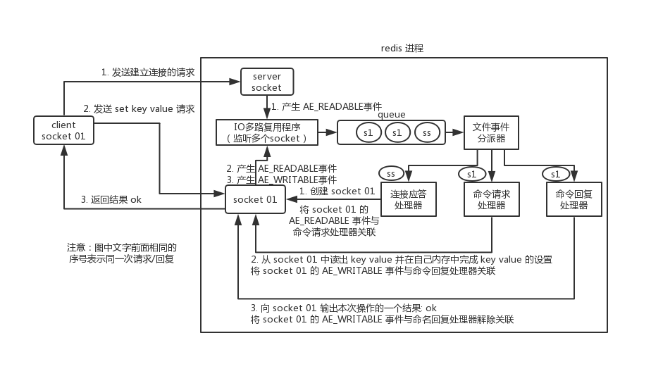

# 分布式缓存


# 项目中缓存是如何使用的？


- 项目中缓存是如何使用的？

## 为什么要用缓存？

用缓存，主要有两个用途：**高性能**、**高并发**。


- **高性能**

假设这么个场景，你有个操作，一个请求过来，你各种乱七八糟操作 mysql，半天查出来一个结果，耗时 600ms。**但是这个结果可能接下来几个小时都不会变了**，或者变了**也可以不用立即反馈给用户**。那么此时咋办？

缓存啊，折腾 600ms 查出来的结果，扔缓存里，一个 key 对应一个 value，下次再有人查，别走 mysql 折腾 600ms 了，直接从缓存里，通过一个 key 查出来一个 value，2ms 搞定。性能提升 300 倍。

就是说对于一些需要复杂操作耗时查出来的结果，且确定后面不怎么变化，但是有很多读请求，那么**直接将查询出来的结果放在缓存中，后面直接读缓存就好。**


- **高并发**

mysql 这么重的数据库，压根儿设计不是让你玩儿高并发的，虽然也可以玩儿，但是天然支持不好。**mysql 单机支撑到 `2000QPS` 也开始容易报警了。**

所以要是你有个系统，高峰期一秒钟过来的请求有 1万，一个 mysql 单机绝对会死掉。你这个时候就只能上缓存，**把很多数据放缓存，别放 mysql**。缓存功能简单，说白了就是 **`key-value` 式操作**，单机支撑的并发量轻松一秒几万十几万，支撑高并发 so easy。**单机承载并发量是 mysql 单机的几十倍。**


> **缓存是走内存的，内存天然就支撑高并发。**


## 用了缓存后会有什么不良后果？

常见的缓存问题有以下几个：

- [缓存与数据库双写数据不一致](https://gitee.com/shishan100/Java-Interview-Advanced/blob/master/docs/high-concurrency/redis-consistence.md)
- [缓存雪崩、缓存穿透](https://gitee.com/shishan100/Java-Interview-Advanced/blob/master/docs/high-concurrency/redis-caching-avalanche-and-caching-penetration.md)
- [缓存并发竞争](https://gitee.com/shishan100/Java-Interview-Advanced/blob/master/docs/high-concurrency/redis-cas.md)


# 为什么redis单线程效率却很高？


> 这个是问 redis 的时候，最基本的问题吧，redis 最基本的一个内部原理和特点，就是 redis 实际上是个**单线程工作模型**，你要是这个都不知道，那后面玩儿 redis 的时候，出了问题岂不是什么都不知道？
>
> 还有可能面试官会问问你 redis 和 memcached 的区别，但是 memcached 是早些年各大互联网公司常用的缓存方案，但是现在近几年基本都是 redis，没什么公司用 memcached 了。

## redis 和 memcached 有什么区别？


- **redis支持复杂的数据结构**

redis 相比 memcached 来说，拥有[更多的数据结构](https://gitee.com/shishan100/Java-Interview-Advanced/blob/master/docs/high-concurrency/redis-data-types.md)，能**支持更丰富的数据操作**。如果需要缓存能够支持更复杂的结构和操作， redis 会是不错的选择。


- **redis 原生支持集群模式**

在 redis3.x 版本中，便能支持 cluster 模式，而 **memcached 没有原生的集群模式**，需要***依靠客户端来实现往集群中分片写入数据***。redis官方就是支持redis cluster集群模式的。


- **性能对比**

由于 redis 只使用**单核**，而 memcached 可以使用**多核**，所以平均每一个核上 redis 在存储小数据时比 memcached 性能更高。**而在 100k 以上的数据中，memcached 性能要高于 redis。虽然 redis 最近也在存储大数据的性能上进行优化，但是比起 memcached，还是稍有逊色。**


## redis 的线程模型


redis 内部使用**文件事件处理器 `file event handler`**，这个文件事件处理器是单线程的，所以 redis 才叫做单线程的模型。它**采用 IO 多路复用机制同时监听listen() 多个client socket & server socket**，将产生事件的 socket 压入内存队列中，事件分派器根据 socket 上的事件类型来选择对应的事件处理器进行处理。

文件事件处理器的结构包含 4 个部分：

- **多个** socket（server socket ，客户端连接的socket）
- IO 多路复用程序
- 文件事件分派器
- 事件处理器（连接应答处理器、命令请求处理器、命令回复处理器）

多个 socket 可能会并发产生不同的操作，每个操作对应不同的文件事件，但是 **IO 多路复用程序会监听多个 socket**，会将产生事件的 socket **放入队列中排队**，事件分派器**每次从队列中取出一个 socket**，根据 socket 的事件类型交给对应的事件处理器进行处理。

来看客户端与 redis 的一次通信过程：



> 要明白，通信是通过 socket 来完成的，可以先去看一看 socket 网络编程。

- 首先，redis 服务端进程初始化的时候，会将 ***server socket 的 `AE_READABLE` 事件***  与连接应答处理器关联。

- 客户端 socket01 向 redis 进程的 server socket **请求建立连接**，此时 server socket 会产生一个 **`AE_READABLE` 事件**

- **IO 多路复用程序**监听到 server socket 产生的事件后，将该 **socket(server socket) 压入队列**中。

- **文件事件分派器从队列中获取 server socket**，交给**连接应答处理器**。

- **连接应答处理器**会   **创建一个能  *与客户端通信*  的 socket01**，并将该 socket01 的 `AE_READABLE` 事件**与命令请求处理器关联。**

  ——socket server在收到客户端的连接请求后，连接应答处理器创建出的socket01和客户端的socket01可以保持连接（而不是用server socket来连接）。客户端通过原先自己的socket01向server端的socket01发送读/写请求，并在这个socket上等待server响应。（肯定是先连接后再发送读/写请求，客户端再次发送请求：直接与server的socket01交互）

- 假设此时客户端发送了一个 `set key value` 请求，此时 redis 中的 socket01 会产生 `AE_READABLE` 事件，IO 多路复用程序将 socket01 压入队列，此时事件分派器从队列中获取到 socket01 产生的 `AE_READABLE` 事件，由于前面 socket01 的 `AE_READABLE` 事件已经与命令请求处理器关联，因此事件分派器将事件**交给命令请求处理器来处理**。命令请求处理器***读取 socket01 的 `key value` 并在自己内存中完成 `key value` 的设置***。
- 操作完成后，**它会将 socket01 的 `AE_WRITABLE` 事件与命令回复处理器关联。**

- 如果此时客户端准备好接收返回结果了，那么 **redis 中的 socket01 会产生一个 `AE_WRITABLE` 事件**，同样压入队列中，事件分派器找到相关联的**命令回复处理器**，由命令回复处理器对 socket01 **输入本次操作的一个结果**，比如-> `ok`，之后**解除 socket01 的 `AE_WRITABLE` 事件与命令回复处理器的关联**。

这样便完成了一次通信。关于 Redis 的一次通信过程，推荐阅读《[Redis 设计与实现——黄健宏](https://github.com/doocs/technical-books#database)》进行系统学习。


> 所有的操作都被包裹在 —— **文件事件处理器**。只有一个线程。通过IO多路复用


只要任何一个socket有事件产生，将socket压入队列，文件事件分派器拿出一个socket，判断是哪个时间，找到对应的事件处理器。该事件处理完后，才会再次拿一个socket来处理它的事件


## 为啥redis单线程模型也能效率这么高？


- **纯内存**操作。
- 核心是基于**非阻塞 （发过来的请求直接扔到队列中）   的 IO 多路复用**机制。IO多路复用程序不处理socket的事件，只负责 **轮询监听**  所有socket->压入队列
  - 若是阻塞的，那么只有返回上一个响应后，才能接收下一个请求。
  - 可以保持IO多路复用程序和事件处理器一直不间断全速运转。达到最高效率
- C 语言实现，一般来说，C 语言实现的程序**“距离”操作系统更近**，执行速度相对会更快。
- 单线程反而避免了**多线程的频繁上下文切换问题**，预防了多线程可能产生的竞争问题。


# redis都有哪些数据类型？分别在哪些场景下使用比较合适呢？


> 除非是面试官感觉看你简历，是工作 3 年以内的比较初级的同学，可能对技术没有很深入的研究，面试官才会问这类问题。否则，在宝贵的面试时间里，面试官实在不想多问。
>
> 其实问这个问题，主要有两个原因：
>
> - 看看你到底有没有全面的了解 redis 有哪些功能，一般怎么来用，啥场景用什么，就怕你别就会最简单的 KV 操作；
> - 看看你在实际项目里都怎么玩儿过 redis。
>
> 要是你回答的不好，没说出几种数据类型，也没说什么场景，你完了，面试官对你印象肯定不好，觉得你平时就是做个简单的 set 和 get。


redis 主要有以下几种数据类型：

- string
- hash
- list
- set
- sorted set


### string

这是最简单的类型，就是普通的 set 和 get，做简单的 KV 缓存。

```
set college szu
```

### hash

这个是类似 map 的一种结构，这个一般就是可以将**结构化的数据**，比如一个对象（前提是**这个对象没嵌套其他的对象**）给缓存在 redis 里，然后每次读写缓存的时候，可以就操作 hash 里的**某个字段**。

**缓存简单的对象**

```
hset person name bingo
hset person age 20
hset person id 1
hget person name
person = {
    "name": "bingo",
    "age": 20,
    "id": 1
}
```

### list

list 是**有序列表**，这个可以玩儿出很多花样。

比如可以通过 list 存储一些列表型的数据结构，类似  微博：**粉丝列表、文章的评论列表**之类的东西。

比如可以通过 lrange 命令，读取某个**闭区间内的元素**，可以***基于 list 实现分页查询***，这个是很棒的一个功能，基于 redis 实现简单的高性能分页

可以做类似微博那种**下拉不断分页的东西，性能高，就一页一页走**。

```
# 0开始位置，-1结束位置，结束位置为-1时，表示列表的最后一个位置，即查看所有。
lrange mylist 0 -1
```

比如可以搞个简单的消息队列，从 list 头怼进去，从 list 尾巴那里弄出来。

```
lpush mylist 1
lpush mylist 2
lpush mylist 3 4 5

# 1
rpop mylist
```

### set

set 是**无序集合，自动去重**。

直接基于 set 将系统里需要去重的数据扔进去，自动就给去重了，如果你需要对一些数据进行快速的全局去重，你当然也可以基于 jvm 内存里的 HashSet 进行去重，但是如果你的某个系统部署在**多台机器(分布式)**上呢？得**基于 redis 进行全局的 set 去重。**

可以基于 set 使用   **交集、并集、差集**的操作，比如交集，可以把两个人的粉丝列表整一个交集，看看俩人的共同好友是谁？对吧。

把两个大 V 的粉丝都放在两个 set 中，对两个 set 做交集。

```
#-------操作一个set-------
# 添加元素
sadd mySet 1

# 查看全部元素
smembers mySet

# 判断是否包含某个值
sismember mySet 3

# 删除某个/些元素
srem mySet 1
srem mySet 2 4

# 查看元素个数
scard mySet

# 随机删除一个元素
spop mySet

#-------操作多个set-------
# 将一个set的元素移动到另外一个set
smove yourSet mySet 2

# 求两set的交集
sinter yourSet mySet

# 求两set的并集
sunion yourSet mySet

# 求在yourSet中而不在mySet中的元素
sdiff yourSet mySet
```

### sorted set

sorted set 是排序的 set，**去重还可以排序**，写进去的时候**给一个分数**，***自动根据分数排序***

```
zadd board 85 zhangsan
zadd board 72 lisi
zadd board 96 wangwu
zadd board 63 zhaoliu

# 获取排名前三的用户（默认是升序，所以需要 rev 改为降序）
zrevrange board 0 3

# 获取某用户的排名
zrank board zhaoliu
```


**自动根据设定的分数排名，可以取出他们在zset中的排名**


# redis 的过期策略？


> 如果你连这个问题都不知道，上来就懵了，回答不出来，那线上你写代码的时候，想当然的认为写进 redis 的数据就一定会存在，后面导致系统各种 bug，谁来负责？
>
> 常见的有两个问题：
>
> - 往 redis 写入的数据怎么没了？
>
> 可能有同学会遇到，在生产环境的 redis 经常会丢掉一些数据，写进去了，过一会儿可能就没了。我的天，同学，你问这个问题就说明 redis 你就没用对啊。**redis 是缓存，你给当存储了是吧？**
>
> 啥叫缓存？用内存当缓存。内存是无限的吗，内存是很宝贵而且是有限的，磁盘是廉价而且是大量的。可能一台机器就几十个 G 的内存，但是可以有几个 T 的硬盘空间。redis 主要是**基于内存来进行高性能、高并发的读写操作的。**
>
> 那既然内存是有限的，比如 redis 就只能用 10G，你要是往里面写了 20G 的数据，**会咋办？当然会干掉 10G 的数据**，然后**就保留 10G 的数据了**。那干掉哪些数据？保留哪些数据？当然是**干掉不常用的数据，保留常用的数据了。**
>
> - 数据明明过期了，怎么还占用着内存？
>
> 设置好了过期时间，但你知道redis是怎么给你弄成过期的吗？什么时候真正将数据删除？
>
> 这是由 redis 的过期策略来决定。


## redis过期策略


redis 过期策略是：**定期删除+惰性删除**。


所谓**定期删除**，指的是 redis 默认是每隔 100ms 就**随机抽取**一些**设置了过期时间的 key**，检查其是否过期，**如果过期就删除**。

假设 redis 里放了 10w 个 key，都设置了过期时间，你每隔几百毫秒，就检查 10w 个 key，那 redis 基本上就死了，**cpu 负载会很高**的，消耗在你的检查过期 key 上了。注意，这里可不是每隔 100ms 就遍历***所有的设置过期时间的 key***，那样就是一场性能上的**灾难**。实际上 redis 是每隔 100ms   ***随机抽取***  一些 key 来检查和删除的。

但是问题是，定期删除可能会导致**很多过期 key 到了时间并没有被删除掉**，那咋整呢？

所以就是**惰性删除**了。这就是说，在你**获取某个 key 的时候**，redis ***会检查一下*** ，这个 key 如果设置了过期时间那么是否过期了？如果过期了**此时就会删除**，不会给你返回任何东西。

> **获取 key 的时候，如果此时 key 已经过期，就删除，不会返回任何东西。**

但是实际上这还是有问题的，如果定期删除漏掉了很多过期 key，然后你也没及时去查，也就没走惰性删除，此时会怎么样？如果***大量过期 key 堆积在内存里，导致 redis 内存块耗尽了，咋整？***


答案是：**走内存淘汰机制**。


##  内存淘汰机制


redis 内存淘汰机制有以下几个：

- noeviction: 当内存不足以容纳新写入数据时，**新写入操作会报错**，这个一般没人用吧，实在是太恶心了。

- **allkeys-lru**：当内存不足以容纳新写入数据时，在**键空间**中，移除**最近最少使用的 key**（这个是**最常用**的）。

  redis有10个key，已经满了，需要删除5个key

  有这么几个key：最近1分钟被查询了100次；最近10分钟被查询了1次；最近1小时被查询了1次。**没什么人查，那就删了吧**

- allkeys-random：当内存不足以容纳新写入数据时，在**键空间**中，随机移除某个 key，这个一般没人用吧，为啥要随机，肯定是把最近最少使用的 key 给干掉啊。

- volatile-lru：当内存不足以容纳新写入数据时，在***设置了过期时间的键空间***  中，移除最近最少使用的 key（这个一般不太合适）。

- volatile-random：当内存不足以容纳新写入数据时，在**设置了过期时间的键空间**中，**随机移除**某个 key。

- volatile-ttl：当内存不足以容纳新写入数据时，在**设置了过期时间的键空间**中，有**更早过期时间**的 key 优先移除。


##  手写一个 LRU 算法


你可以现场手写最原始的 LRU 算法，那个代码量太大了，似乎不太现实。

不求自己纯手工从底层开始打造出自己的 LRU

但是起码要知道  **如何利用已有的 JDK 数据结构实现一个 Java 版的 LRU**。

```java
class LRUCache<K, V> extends LinkedHashMap<K, V> {
    private final int CACHE_SIZE;

    /**
     * 传递进来最多能缓存多少数据
     *
     * @param cacheSize 缓存大小
     */
    public LRUCache(int cacheSize) {
        // true 表示让 linkedHashMap 按照  访问顺序来进行排序，最近访问的放在头部，最老访问的放在尾部。
        super((int) Math.ceil(cacheSize / 0.75) + 1, 0.75f, true);
        CACHE_SIZE = cacheSize;
    }

    @Override
    protected boolean removeEldestEntry(Map.Entry<K, V> eldest) {
        // 当 map中的数据量大于指定的缓存个数的时候，就自动删除最老的数据。这里设置的是最大容量的75%开始LRU
        return size() > CACHE_SIZE;
    }
}
```


# 怎么保证Redis是高并发且高可用的


如何保证 redis 的高并发和高可用？redis 的主从复制原理能介绍一下么？redis 的哨兵原理能介绍一下么？

> 主要是考考你，redis 单机能承载多高并发？如果单机扛不住如何扩容扛更多的并发？redis 会不会挂？既然 redis 会挂那怎么保证 redis 是高可用的？
>
> 其实针对的都是项目中你肯定要考虑的一些问题，如果你没考虑过，那确实你对生产系统中的问题思考太少。


如果你用 redis 缓存技术的话，肯定要考虑如何用 redis 来加多台机器，保证 redis 是**高并发**的，还有就是如何让 redis 保证自己不是挂掉以后就直接死掉了，即 redis **高可用**。


redis 实现**高并发**主要依靠**主从架构**，一主多从，一般来说，很多项目其实就足够了，单主用来写入数据，单机几万 QPS，多从用来查询数据，多个从实例可以提供每秒 10w 的 QPS。

如果想要在实现高并发的同时，容纳大量的数据，那么就需要 redis 集群，使用 redis 集群之后，可以提供每秒几十万的读写并发。

redis 高可用，如果是做主从架构部署，那么加上哨兵就可以了，就可以实现：**任何一个实例宕机，可以进行主备切换**


> 见redis笔记！


