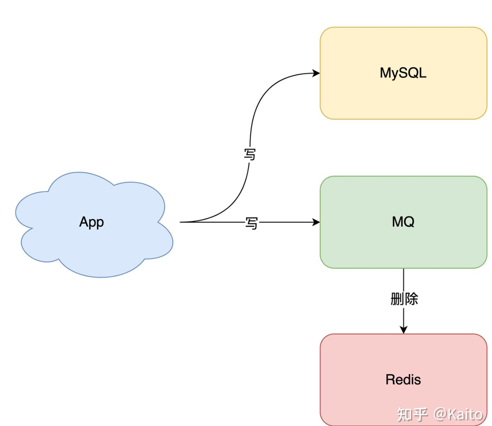
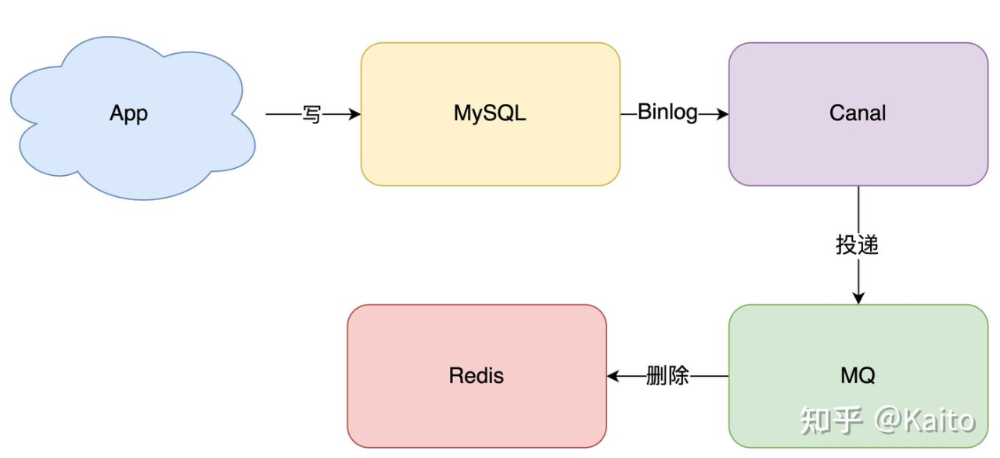

# 分布式缓存


# 项目中缓存是如何使用的？


- 项目中缓存是如何使用的？

## 为什么要用缓存？

用缓存，主要有两个用途：**高性能**、**高并发**。


- **高性能**

假设这么个场景，你有个操作，一个请求过来，你各种乱七八糟操作 mysql，半天查出来一个结果，耗时 600ms。**但是这个结果可能接下来几个小时都不会变了**，或者变了**也可以不用立即反馈给用户**。那么此时咋办？

缓存啊，折腾 600ms 查出来的结果，扔缓存里，一个 key 对应一个 value，下次再有人查，别走 mysql 折腾 600ms 了，直接从缓存里，通过一个 key 查出来一个 value，2ms 搞定。性能提升 300 倍。

就是说对于一些需要复杂操作耗时查出来的结果，且确定后面不怎么变化，但是有很多读请求，那么**直接将查询出来的结果放在缓存中，后面直接读缓存就好。**


- **高并发**

mysql 这么重的数据库，压根儿设计不是让你玩儿高并发的，虽然也可以玩儿，但是天然支持不好。**mysql 单机支撑到 `2000QPS` 也开始容易报警了。**

所以要是你有个系统，高峰期一秒钟过来的请求有 1万，一个 mysql 单机绝对会死掉。你这个时候就只能上缓存，**把很多数据放缓存，别放 mysql**。缓存功能简单，说白了就是 **`key-value` 式操作**，单机支撑的并发量轻松一秒几万十几万，支撑高并发 so easy。**单机承载并发量是 mysql 单机的几十倍。**


> **缓存是走内存的，内存天然就支撑高并发。**


## 用了缓存后会有什么不良后果？

常见的缓存问题有以下几个：

- [缓存与数据库双写数据不一致](https://gitee.com/shishan100/Java-Interview-Advanced/blob/master/docs/high-concurrency/redis-consistence.md)
- [缓存雪崩、缓存穿透](https://gitee.com/shishan100/Java-Interview-Advanced/blob/master/docs/high-concurrency/redis-caching-avalanche-and-caching-penetration.md)
- [缓存并发竞争](https://gitee.com/shishan100/Java-Interview-Advanced/blob/master/docs/high-concurrency/redis-cas.md)


# 为什么redis单线程效率却很高？


> 这个是问 redis 的时候，最基本的问题吧，redis 最基本的一个内部原理和特点，就是 redis 实际上是个**单线程工作模型**，你要是这个都不知道，那后面玩儿 redis 的时候，出了问题岂不是什么都不知道？
>
> 还有可能面试官会问问你 redis 和 memcached 的区别，但是 memcached 是早些年各大互联网公司常用的缓存方案，但是现在近几年基本都是 redis，没什么公司用 memcached 了。

## redis 和 memcached 有什么区别？


- **redis支持复杂的数据结构**

redis 相比 memcached 来说，拥有[更多的数据结构](https://gitee.com/shishan100/Java-Interview-Advanced/blob/master/docs/high-concurrency/redis-data-types.md)，能**支持更丰富的数据操作**。如果需要缓存能够支持更复杂的结构和操作， redis 会是不错的选择。


- **redis 原生支持集群模式**

在 redis3.x 版本中，便能支持 cluster 模式，而 **memcached 没有原生的集群模式**，需要***依靠客户端来实现往集群中分片写入数据***。redis官方就是支持redis cluster集群模式的。


- **性能对比**

由于 redis 只使用**单核**，而 memcached 可以使用**多核**，所以平均每一个核上 redis 在存储小数据时比 memcached 性能更高。**而在 100k 以上的数据中，memcached 性能要高于 redis。虽然 redis 最近也在存储大数据的性能上进行优化，但是比起 memcached，还是稍有逊色。**


- **Redis支持持久化**

## redis 的线程模型


redis 内部使用**文件事件处理器 `file event handler`**，这个文件事件处理器是单线程的，所以 redis 才叫做单线程的模型。它**采用 IO 多路复用机制同时监听listen() 多个client socket & server socket**，将产生事件的 socket 压入内存队列中，事件分派器根据 socket 上的事件类型来选择对应的事件处理器进行处理。

文件事件处理器的结构包含 4 个部分：

- **多个** socket（一个server socket接收连接请求 ，很多客户端连接产生的socket）
- IO 多路复用程序
- 文件事件分派器
- 事件处理器（连接应答处理器、命令请求处理器、命令回复处理器）

多个 socket 可能会并发产生不同的操作，每个操作对应不同的文件事件，但是 **IO 多路复用程序会监听多个 socket**，会将产生事件的 socket **放入队列中排队**，事件分派器**每次从队列中取出一个 socket**，根据 socket 的事件类型交给对应的事件处理器进行处理。

来看客户端与 redis 的一次通信过程：


> 要明白，通信是通过 socket 来完成的，可以先去看一看 socket 网络编程。

- 首先，redis 服务端进程初始化的时候，会将 ***server socket 的 `AE_READABLE` 事件***  与连接应答处理器关联。

- 客户端 socket01 向 redis 进程的 server socket **请求建立连接**，此时 server socket 会产生一个 **`AE_READABLE` 事件**

- **IO 多路复用程序**监听到 server socket 产生的事件后，将该 **socket(server socket) 压入队列**中。

- **文件事件分派器从队列中获取 server socket**，交给**连接应答处理器**。

- **连接应答处理器**会   **创建一个能  *与客户端通信*  的 socket01**，并将该 socket01 的 `AE_READABLE` 事件**与命令请求处理器关联。**

  ——socket server在收到客户端的连接请求后，连接应答处理器创建出的socket01和客户端的socket01可以保持连接（而不是用server socket来连接）。客户端通过原先自己的socket01向server端的socket01发送读/写请求，并在这个socket上等待server响应。（肯定是先连接后再发送读/写请求，客户端再次发送请求：直接与server的socket01交互）

- 假设此时客户端发送了一个 `set key value` 请求，此时 redis 中的 socket01 会产生 `AE_READABLE` 事件，IO 多路复用程序将 socket01 压入队列，此时事件分派器从队列中获取到 socket01 产生的 `AE_READABLE` 事件，由于前面 socket01 的 `AE_READABLE` 事件已经与命令请求处理器关联，因此事件分派器将事件**交给命令请求处理器来处理**。命令请求处理器***读取 socket01 的 `key value` 并在自己内存中完成 `key value` 的设置***。
- 操作完成后，**它会将 socket01 的 `AE_WRITABLE` 事件与命令回复处理器关联。**

- 如果此时客户端准备好接收返回结果了，那么 **redis 中的 socket01 会产生一个 `AE_WRITABLE` 事件**，同样压入队列中，事件分派器找到相关联的**命令回复处理器**，由命令回复处理器对 socket01 **输入本次操作的一个结果**，比如-> `ok`，之后**解除 socket01 的 `AE_WRITABLE` 事件与命令回复处理器的关联**。

这样便完成了一次通信。关于 Redis 的一次通信过程，推荐阅读《[Redis 设计与实现——黄健宏](https://github.com/doocs/technical-books#database)》进行系统学习。


> 所有的操作都被包裹在 —— **文件事件处理器**。只有一个线程。通过IO多路复用


只要任何一个socket有事件产生，将socket压入队列，文件事件分派器拿出一个socket，判断是哪个时间，找到对应的事件处理器。该事件处理完后，才会再次拿一个socket来处理它的事件


## 为啥redis单线程模型也能效率这么高？


- **纯内存**操作。
- 核心是基于**非阻塞 （发过来的请求直接扔到队列中）   的 IO 多路复用**机制。IO多路复用程序不处理socket的事件，只负责 **轮询监听**  所有socket->压入队列
  - 若是阻塞的，那么只有返回上一个响应后，才能接收下一个请求。
  - 可以保持IO多路复用程序和事件处理器一直不间断全速运转。达到最高效率
- C 语言实现，一般来说，C 语言实现的程序**“距离”操作系统更近**，执行速度相对会更快。
- 单线程反而避免了**多线程的频繁上下文切换问题**，预防了多线程可能产生的竞争问题。


# redis都有哪些数据类型？分别在哪些场景下使用比较合适呢？


> 除非是面试官感觉看你简历，是工作 3 年以内的比较初级的同学，可能对技术没有很深入的研究，面试官才会问这类问题。否则，在宝贵的面试时间里，面试官实在不想多问。
>
> 其实问这个问题，主要有两个原因：
>
> - 看看你到底有没有全面的了解 redis 有哪些功能，一般怎么来用，啥场景用什么，就怕你别就会最简单的 KV 操作；
> - 看看你在实际项目里都怎么玩儿过 redis。
>
> 要是你回答的不好，没说出几种数据类型，也没说什么场景，你完了，面试官对你印象肯定不好，觉得你平时就是做个简单的 set 和 get。


redis 主要有以下几种数据类型：

- string
- hash
- list
- set
- sorted set


### string

这是最简单的类型，就是普通的 set 和 get，做简单的 KV 缓存。

```
set college szu
```

### hash

这个是类似 map 的一种结构，这个一般就是可以将**结构化的数据**，比如一个对象（前提是**这个对象没嵌套其他的对象**）给缓存在 redis 里，然后每次读写缓存的时候，可以就操作 hash 里的**某个字段**。

**缓存简单的对象**

```
hset person name bingo
hset person age 20
hset person id 1
hget person name
person = {
    "name": "bingo",
    "age": 20,
    "id": 1
}
```

### list

list 是**有序列表**，这个可以玩儿出很多花样。

比如可以通过 list 存储一些列表型的数据结构，类似  微博：**粉丝列表、文章的评论列表**之类的东西。

比如可以通过 lrange 命令，读取某个**闭区间内的元素**，可以***基于 list 实现分页查询***，这个是很棒的一个功能，基于 redis 实现简单的高性能分页

可以做类似微博那种**下拉不断分页的东西，性能高，就一页一页走**。

```
# 0开始位置，-1结束位置，结束位置为-1时，表示列表的最后一个位置，即查看所有。
lrange mylist 0 -1
```

比如可以搞个简单的消息队列，从 list 头怼进去，从 list 尾巴那里弄出来。

```
lpush mylist 1
lpush mylist 2
lpush mylist 3 4 5

# 1
rpop mylist
```

### set

set 是**无序集合，自动去重**。

直接基于 set 将系统里需要去重的数据扔进去，自动就给去重了，如果你需要对一些数据进行快速的全局去重，你当然也可以基于 jvm 内存里的 HashSet 进行去重，但是如果你的某个系统部署在**多台机器(分布式)**上呢？得**基于 redis 进行全局的 set 去重。**

可以基于 set 使用   **交集、并集、差集**的操作，比如交集，可以把两个人的粉丝列表整一个交集，看看俩人的共同好友是谁？对吧。

把两个大 V 的粉丝都放在两个 set 中，对两个 set 做交集。

```
#-------操作一个set-------
# 添加元素
sadd mySet 1

# 查看全部元素
smembers mySet

# 判断是否包含某个值
sismember mySet 3

# 删除某个/些元素
srem mySet 1
srem mySet 2 4

# 查看元素个数
scard mySet

# 随机删除一个元素
spop mySet

#-------操作多个set-------
# 将一个set的元素移动到另外一个set
smove yourSet mySet 2

# 求两set的交集
sinter yourSet mySet

# 求两set的并集
sunion yourSet mySet

# 求在yourSet中而不在mySet中的元素
sdiff yourSet mySet
```

### sorted set

sorted set 是排序的 set，**去重还可以排序**，写进去的时候**给一个分数**，***自动根据分数排序***

```
zadd board 85 zhangsan
zadd board 72 lisi
zadd board 96 wangwu
zadd board 63 zhaoliu

# 获取排名前三的用户（默认是升序，所以需要 rev 改为降序）
zrevrange board 0 3

# 获取某用户的排名
zrank board zhaoliu
```


**自动根据设定的分数排名，可以取出他们在zset中的排名**


# redis 的过期策略？


> 如果你连这个问题都不知道，上来就懵了，回答不出来，那线上你写代码的时候，想当然的认为写进 redis 的数据就一定会存在，后面导致系统各种 bug，谁来负责？
>
> 常见的有两个问题：
>
> - 往 redis 写入的数据怎么没了？
>
> 可能有同学会遇到，在生产环境的 redis 经常会丢掉一些数据，写进去了，过一会儿可能就没了。我的天，同学，你问这个问题就说明 redis 你就没用对啊。**redis 是缓存，你给当存储了是吧？**
>
> 啥叫缓存？用内存当缓存。内存是无限的吗，内存是很宝贵而且是有限的，磁盘是廉价而且是大量的。可能一台机器就几十个 G 的内存，但是可以有几个 T 的硬盘空间。redis 主要是**基于内存来进行高性能、高并发的读写操作的。**
>
> 那既然内存是有限的，比如 redis 就只能用 10G，你要是往里面写了 20G 的数据，**会咋办？当然会干掉 10G 的数据**，然后**就保留 10G 的数据了**。那干掉哪些数据？保留哪些数据？当然是**干掉不常用的数据，保留常用的数据了。**
>
> - 数据明明过期了，怎么还占用着内存？
>
> 设置好了过期时间，但你知道redis是怎么给你弄成过期的吗？什么时候真正将数据删除？
>
> 这是由 redis 的过期策略来决定。


## redis过期策略


redis 过期策略是：**定期删除+惰性删除**。


所谓**定期删除**，指的是 redis 默认是每隔 100ms 就**随机抽取**一些**设置了过期时间的 key**，检查其是否过期，**如果过期就删除**。

假设 redis 里放了 10w 个 key，都设置了过期时间，你每隔几百毫秒，就检查 10w 个 key，那 redis 基本上就死了，**cpu 负载会很高**的，消耗在你的检查过期 key 上了。注意，这里可不是每隔 100ms 就遍历***所有的设置过期时间的 key***，那样就是一场性能上的**灾难**。实际上 redis 是每隔 100ms   ***随机抽取***  一些 key 来检查和删除的。

但是问题是，定期删除可能会导致**很多过期 key 到了时间并没有被删除掉**，那咋整呢？

所以就是**惰性删除**了。这就是说，在你**获取某个 key 的时候**，redis ***会检查一下*** ，这个 key 如果设置了过期时间那么是否过期了？如果过期了**此时就会删除**，不会给你返回任何东西。

> **获取 key 的时候，如果此时 key 已经过期，就删除，不会返回任何东西。**

但是实际上这还是有问题的，如果定期删除漏掉了很多过期 key，然后你也没及时去查，也就没走惰性删除，此时会怎么样？如果***大量过期 key 堆积在内存里，导致 redis 内存块耗尽了，咋整？***


答案是：**走内存淘汰机制**。


##  内存淘汰机制


redis 内存淘汰机制有以下几个：

- noeviction: 当内存不足以容纳新写入数据时，**新写入操作会报错**，这个一般没人用吧，实在是太恶心了。

- **allkeys-lru**：当内存不足以容纳新写入数据时，在**键空间**中，移除**最近最少使用的 key**（这个是**最常用**的）。

  redis有10个key，已经满了，需要删除5个key

  有这么几个key：最近1分钟被查询了100次；最近10分钟被查询了1次；最近1小时被查询了1次。**没什么人查，那就删了吧**

- allkeys-random：当内存不足以容纳新写入数据时，在**键空间**中，随机移除某个 key，这个一般没人用吧，为啥要随机，肯定是把最近最少使用的 key 给干掉啊。

- volatile-lru：当内存不足以容纳新写入数据时，在***设置了过期时间的键空间***  中，移除最近最少使用的 key（这个一般不太合适）。

- volatile-random：当内存不足以容纳新写入数据时，在**设置了过期时间的键空间**中，**随机移除**某个 key。

- volatile-ttl：当内存不足以容纳新写入数据时，在**设置了过期时间的键空间**中，有**更早过期时间**的 key 优先移除。


##  手写一个 LRU 算法


你可以现场手写最原始的 LRU 算法，那个代码量太大了，似乎不太现实。

不求自己纯手工从底层开始打造出自己的 LRU

但是起码要知道  **如何利用已有的 JDK 数据结构实现一个 Java 版的 LRU**。

```java
class LRUCache<K, V> extends LinkedHashMap<K, V> {
    private final int CACHE_SIZE;

    /**
     * 传递进来最多能缓存多少数据
     *
     * @param cacheSize 缓存大小
     */
    public LRUCache(int cacheSize) {
        // true 表示让 linkedHashMap 按照  访问顺序来进行排序，最近访问的放在头部，最老访问的放在尾部。
        super((int) Math.ceil(cacheSize / 0.75) + 1, 0.75f, true);
        CACHE_SIZE = cacheSize;
    }

    @Override
    protected boolean removeEldestEntry(Map.Entry<K, V> eldest) {
        // 当 map中的数据量大于指定的缓存个数的时候，就自动删除最老的数据。这里设置的是最大容量的75%开始LRU
        return size() > CACHE_SIZE;
    }
}
```


# 怎么保证Redis是高并发且高可用的


如何保证 redis 的高并发和高可用？redis 的主从复制原理能介绍一下么？redis 的哨兵原理能介绍一下么？

> 主要是考考你，redis 单机能承载多高并发？如果单机扛不住如何扩容扛更多的并发？redis 会不会挂？既然 redis 会挂那怎么保证 redis 是高可用的？
>
> 其实针对的都是项目中你肯定要考虑的一些问题，如果你没考虑过，那确实你对生产系统中的问题思考太少。


如果你用 redis 缓存技术的话，肯定要考虑如何用 redis 来加多台机器，保证 redis 是**高并发**的，还有就是如何让 redis 保证自己不是挂掉以后就直接死掉了，即 redis **高可用**。


redis 实现**高并发**主要依靠**主从架构**，一主多从，一般来说，很多项目其实就足够了，单主用来写入数据，单机几万 QPS，多从用来查询数据，多个从实例可以提供每秒 10w 的 QPS。

如果想要在实现高并发的同时，容纳大量的数据，那么就需要 redis 集群，使用 redis 集群之后，可以提供每秒几十万的读写并发。

redis 高可用，如果是做主从架构部署，那么加上哨兵就可以了，就可以实现：**任何一个实例宕机，可以进行主备切换**


> 见redis笔记！


# Redis集群


redis 集群模式的工作原理能说一下么？在集群模式下，redis 的 key 是如何寻址的？分布式寻址都有哪些算法？了解一致性 hash 算法吗？


-----

在前几年，redis 如果要搞几个节点，每个节点存储一部分的数据，得**借助一些「中间件」**来实现，比如说有 `codis`，或者 `twemproxy`，都有。有一些 redis 中间件，你读写 redis 中间件，**redis 中间件负责将你的数据分布式存储在多台机器上的 redis 实例中。**

这两年，redis 不断在发展，redis 也不断有新的版本，现在的 redis 集群模式，可以做到在多台机器上，部署多个 redis 实例，**每个实例存储一部分的数据**，同时**每个 redis 主实例可以挂 redis 从实例**，自动确保说，如果 redis **主**实例挂了，会自动切换到 redis **从**实例上来。

现在 redis 的新版本，大家都是用 **「redis cluster」** 的，也就是 redis **原生支持的 redis 集群模式**，那么面试官肯定会就 redis cluster 对你来个几连炮。要是你没用过 redis cluster，正常，以前很多人用 codis 之类的客户端来支持集群，但是起码你得研究一下 redis cluster 吧。

如果你的数据量很少，主要是承载高并发高性能的场景，比如你的缓存一般就**几个 G，单机就足够了**，可以使用 **replication**，**一个 master 多个 slaves**，要几个 slave 跟你要求的读吞吐量有关，然后自己搭建一个 sentinel 集群去保证 redis 主从架构的高可用性。

:zap:

redis cluster，主要是针对**「海量数据+高并发+高可用」**的场景。redis cluster 支撑 **N 个 redis master node**，**每个 master node 都可以挂载多个 slave node**。这样整个 redis 就可以**横向扩容**了————如果你要支撑更大数据量的缓存，那就**横向扩容更多的 master 节点，每个 master 节点就能存放更多的数据了。**


## redis cluster


> 实际上：redis-cluster读写都在master上进行。有点麻烦。。


- 自动将数据进行分片，每个 master 上放一部分数据
- 提供内置的**高可用支持**，部分 master 不可用时，还是可以继续工作的


在 redis cluster 架构下，每个 redis 要放开两个端口号，比如一个是 `6379`，另外一个就是 加1w 的端口号，比如 `16379`。

16379 端口号是用来进行**节点间通信**的，也就是 cluster bus 的东西，cluster bus 的通信，用来进行**故障检测、配置更新、故障转移授权**。cluster bus 用了另外一种二进制的协议，**`gossip` 协议**，用于节点间进行**高效的数据交换**，占用更少的**网络带宽和处理时间**。


## 节点间的内部通信机制


集群元数据的维护有两种方式：集中式、Gossip 协议。redis cluster 节点间采用 gossip 协议进行通信。


-------

------

**集中式**是将集群元数据（节点信息、故障等等）几种存储在某个节点上。集中式元数据集中存储的一个典型代表，就是大数据领域的 `storm`。它是分布式的大数据实时计算引擎，是集中式的元数据存储的结构，底层基于 zookeeper（分布式协调的中间件）对所有元数据进行存储维护。


redis 维护集群元数据采用另一个方式， `gossip` 协议，**「所有节点都持有一份元数据」**，不同的节点如果出现了元数据的变更，就**不断将元数据发送给其它的节点**，让**其它节点也进行元数据的变更**。


- **集中式**的   **好处**在于，元数据的读取和更新，**「时效性」**非常好，一旦元数据出现了变更，就**立即更新到集中式的存储中**，其它节点读取的时候就可以感知到；     **不好**在于，所有的元数据的更新压力**全部集中在一个地方**，可能会导致元数据的**存储有压力**。


- gossip 好处在于，元数据的**更新比较分散**，不是集中在一个地方，更新请求会**陆陆续续打到所有节点上去更新**，**降低了压力**；不好在于，元数据的更新有**「延时」**，可能导致集群中的一些操作会有一些滞后。
  - 10000 端口：每个节点都有一个专门用于**节点间通信**的端口，就是自己提供服务的端口号**+10000**，比如 7001，那么用于节点间通信的就是 17001 端口。每个节点每隔一段时间都会往另外几个节点发送 `ping` 消息，同时其它几个节点接收到 `ping` 之后返回 `pong`。
  - 交换的信息：信息包括**故障信息**，**节点的增加和删除**，**hash slot** 信息等等。


## gossip 协议


gossip 协议包含多种消息，包含 `ping`,`pong`,`meet`,`fail` 等等。


- meet：某个节点发送 meet 给新加入的节点，让新节点加入集群中，然后新节点就会开始与其他节点进行通信

```
redis-trib.rb add-node
```

> 其实内部就是发送了一个 `gossip meet` 消息给新加入的节点，通知那个节点去**加入我们的集群**。

- ping：每个节点都会**「频繁」**给其它节点发送 ping，其中包含自己的状态还有自己维护的集群元数据，互相通过 ping 交换元数据。
- pong：返回 ping 和 meet，包含自己的状态和其它信息，也用于信息广播和更新。
- fail：某个节点判断另一个节点 fail 之后，就**发送 fail 给其它节点**，通知其它节点说，**「某个节点宕机啦」**。


-----

**ping 消息深入**


ping 时要**携带一些元数据**，如果**很频繁**，可能会加重网络负担。

每个节点每秒会执行 10 次 ping，每次会选择 5 个**最久没有通信**的其它节点。当然如果发现某个节点通信延时达到了 `cluster_node_timeout / 2`，那么立即发送 ping，**<u>避免数据交换延时过长，落后的时间太长了</u>**。比如说，两个节点之间都 10 分钟没有交换数据了，那么整个集群处于严重的**「元数据不一致」**的情况，就会有问题。所以 `cluster_node_timeout` 可以调节，如果调得比较大，那么会降低 ping 的频率。

每次 ping，会带上**自己节点的信息**，还有就是带上 1/10 其它节点的信息，发送出去，进行交换。至少包含 `3` 个其它节点的信息，最多包含 `总节点数减 2` 个其它节点的信息。


## 分布式寻址算法


- hash 算法（大量缓存重建）
- 一致性 hash 算法（自动缓存迁移）+ 虚拟节点（自动负载均衡）
- redis cluster 的 hash slot 算法


-----

**一致性 hash 算法**


一致性 hash 算法将**整个 hash 值空间组织成一个虚拟的圆环**，整个空间按顺时针方向组织，下一步将各个 master 节点（使用服务器的 ip 或主机名）进行 hash。这样就能确定每个节点在其哈希环上的位置。

来了一个 key，首先计算 hash 值，并确定此数据在环上的位置，从此位置沿环**「顺时针“行走”」**，遇到的**第一个 master 节点**就是 key 所在位置。

- 在一致性哈希算法中，如果一个节点  **<u>挂了</u>**，受影响的数据仅仅是**此节点到环空间前一个节点**  之间的数据（沿着逆时针方向行走遇到的第一个节点），其它不受影响。增加一个节点也同理。

燃鹅，一致性哈希算法在**节点太少**时，容易因为节点分布不均匀而造成**<u>缓存热点</u>**的问题。为了解决这种热点问题，一致性 hash 算法引入了**虚拟节点**机制，即对每一个节点计算多个 hash，每个计算结果位置都放置一个虚拟节点。这样就实现了数据的均匀分布，负载均衡。


----

 **redis cluster 的 hash slot 算法**


redis cluster 有固定的 `16384` 个 hash slot，对每个 `key` 计算 `CRC16` 值，然后对 `16384` 取模，可以获取 key 对应的 hash slot。

redis cluster 中**<u>每个 master 都会持有部分 slot</u>**，比如有 3 个 master，那么可能每个 master 持有 5000 多个 hash slot。hash slot 让 node 的增加和移除很简单，增加一个 master，就**将其他 master 的 hash slot 移动部分过去**；减少一个 master，就**将它的 hash slot 移动到其他 master 上去**。移动 hash slot 的成本是非常低的。客户端的 api，可以对指定的数据，让他们走同一个 hash slot，通过 `hash tag` 来实现。

任何一台机器宕机，另外两个节点，不影响的。因为 key 找的是 hash slot，不是机器————**原先的 hash slot会被分配给 **

> 减少一个master，就将它的hash slot**分配到其他master上去, 然后仍然能够实现「负载均衡」的效果**


## redis cluster 的高可用与主备切换原理


**<u>几乎跟哨兵是类似的。</u>**


1. **判断节点宕机**

如果一个节点认为另外一个节点宕机，那么就是 `pfail`，**主观宕机**。如果多个节点都认为另外一个节点宕机了，那么就是 `fail`，**客观宕机**，跟哨兵的原理几乎一样，sdown，odown。

在 `cluster-node-timeout` 内，某个节点一直没有返回 `pong`，那么就被认为 `pfail`。

如果一个节点认为某个节点 `pfail` 了，那么会在 `gossip ping` 消息中，`ping` 给其他节点，如果**超过半数**的节点都认为 `pfail` 了，那么就会变成 `fail`。


2. **从节点过滤**

对宕机的 master node，从其所有的 slave node 中，选择一个切换成 master node。

检查每个 slave node 与 master node **断开连接**的时间，如果超过了 `cluster-node-timeout * cluster-slave-validity-factor`，那么就**没有资格**切换成 `master`。


3. **从节点选举**

每个从节点，都根据自己对 master 复制数据的 offset，来设置一个选举时间，**offset 越大（复制数据越多）的从节点，选举时间越靠前，优先进行选举。**

所有的 master node 开始 slave 选举投票，给要进行选举的 slave 进行投票，如果大部分 master node`（N/2 + 1）`都投票给了某个从节点，那么选举通过，那个从节点可以切换成 master。

从节点执行主备切换，从节点切换为主节点。


4. **与哨兵比较**

整个流程跟哨兵相比，非常类似，所以说，redis cluster 功能强大，**直接集成了 replication 和 sentinel 的功能。**


# redis的并发竞争问题


**多客户端同时并发写一个 key，可能本来应该先到的数据后到了，导致数据版本错了；或者是多客户端同时获取同一个 key，修改值之后再歇会去，只要顺序错了，数据就错了**


> redis 自己就有天然解决这个问题的 CAS 类的乐观锁方案。


某个时刻，多个系统实例都去更新某个 key。可以**<u>基于 zookeeper 实现分布式锁</u>**。每个系统通过 zookeeper 获取分布式锁，确保同一时间，只能有一个系统实例在**操作某个 key**，别人都不允许读和写。


你要写入缓存的数据，都是从 mysql 里查出来的，都得写入 mysql 中，写入 mysql 中的时候必须保存一个时间戳，从 mysql 查出来的时候，时间戳也查出来。

每次要**写之前，先判断**一下当前这个 value 的时间戳是否**比缓存里的 value 的时间戳要新**。如果是的话，那么可以写（说明可以更新缓存中的value值，因为这是最新的数据库数据）；否则，就不能用旧的数据覆盖新的数据。


# 如何保持 mysql 和 redis 中数据的一致性


-----

**如何保证「数据一致性」？**


1. 先更新缓存，后更新数据库
2. 先更新数据库，后更新缓存


**先不考虑并发，只看「异常」的情况**

1. 先更新缓存，后更新数据库

如果缓存更新成功了，但数据库更新失败，那么此时缓存中是最新值，但数据库中是「旧值」。

此时读请求可以命中缓存，拿到正确的值，但是一旦缓存失效，就会从数据库中读到旧值，那么之前修改的数据就失效了

2. 先更新数据库，后更新缓存

缓存更新失败，只有等到缓存失效后才能读到正确的值，在这之前读到的都是旧值


----

**并发问题**


并发引发的一致性问题


**多个线程的执行时序混乱**

:zap: 加**分布式锁**

两个线程要修改 「**同一条数据**」，每个线程在改之前，先去申请分布式锁，拿到锁的线程才允许更新数据库和缓存，拿不到锁的线程，返回失败，等待下次重试


**考虑到「缓存利用率」**


这时候就需要：**「删除缓存」**


## 为什么是删除缓存，而不是更新缓存


- 复杂点的缓存场景，缓存不单单是数据库中直接取出来的值，**而是可能经过了一系列的多表查询、计算才会存放到缓存中**


- **更新缓存的代价有时候是很高的。频繁更新一个缓存涉及的多个表，但这个缓存到底会不会被频繁访问到？**

  :chestnut:

  一个缓存涉及的表的字段，在 1 分钟内就修改了 20 次，或者是 100 次，那么缓存更新 20 次、100 次；但是这个缓存在 1 分钟内只被读取了 1 次，有**大量的冷数据**。实际上，如果你只是删除缓存的话，那么在 1 分钟内，这个缓存不过就重新计算一次而已，开销大幅度降低。**用到缓存才去算缓存。**


删除缓存，lazy计算的思想，**需要用到的时候再重新计算**


-----

## **删除缓存可以保证一致性吗？**


1. 先删除缓存，后更新数据库

   数据库更新失败，那么从数据库读取的还是旧值

2. 先更新数据库，后删除缓存

   删除缓存失败，缓存中还是旧值，不一致


-----

**先看并发问题：**

1. 先删除缓存，后更新数据库


**会被钻空子读到还没更新的数据库中的旧值，导致不一致**


2. 先更新数据库，后删除缓存


如果先更新数据库，那么只有在另一个线程A要读取的时候缓存中的数据失效了，才会去数据库读取，其他情况下都可以读到新值


**这种情况发生的概率很低！必须满足3个条件：**

1. 缓存刚好失效
2. 读请求 + 写请求并发
3. 更新数据库 + 删除缓存的**时间**（线程B的操作），要比读数据库 + 写缓存时间**短**（A线程）

条件3发生的概率非常低，**因为写数据库一般会先「加锁」，所以写数据库通常比读数据库的时间更长**


:zap: 「先更新数据库 + 后删除缓存」的方案是可以保证数据一致性的


##先删除缓存，后修改数据库的问题


数据发生了变更，**先删除了缓存，然后要去修改数据库**，此时还没修改———— 一个「**读**」请求过来，去读缓存，发现缓存空了，去查询数据库，**查到了修改前的旧数据。此时就造成了不一致**


> 只有在对一个数据在并发的进行读写的时候，才可能会出现这种问题。
>
> 其实如果说你的**并发量很低**的话，特别是读并发很低，每天访问量就 1 万次，那么很少的情况下，会出现刚才描述的那种不一致的场景。
>
> 但是问题是，如果每天的是上亿的流量，每秒并发读是几万，每秒只要有数据更新的请求，就**可能会出现上述的数据库+缓存不一致的情况**。


-----

**解决方案：**


更新数据的时候，根据**「数据的唯一标识」**，将操作路由之后，发送到一个 jvm 内部队列中。

读取数据的时候，如果数据不在缓存中（被另一个线程先一步删除了），那么将重新 **读取数据 + 更新缓存** 的操作，根据唯一标识路由之后，也发送**同一个 jvm 内部队列中（队列中前面的操作是修改数据库）**。

**一个队列对应一个工作线程来执行其中的任务**，每个**工作线程** **串行** 拿到对应的操作，然后一条一条的执行。

这样的话，**一个数据变更的操作（从队列中取出该操作），先删除缓存，然后再去更新数据库，但是还没完成更新————此时一个读请求过来，没有读到缓存，那么可以先将「缓存更新的请求」发送到队列中（此时队列中正在进行修改数据库的操作，那么这个读请求+更新缓存就会排在更新数据库后面再次等待工作线程执行），此时会在队列中积压，然后同步等待缓存更新完成**


里有一个**优化点**，一个队列中，其实**多个「更新缓存」请求「串」在一起（更新缓存之前，一定是配套修改数据库的操作，形成：修改数据库-读数据-更新缓存   这样的一系列组合操作）是没意义的**，因此可以做过滤，如果发现队列中已经有一个更新缓存的请求了，那么就不用再放个更新请求操作进去了，直接等待前面的更新操作请求完成即可。

**<u>待那个队列对应的工作线程完成了上一个操作的数据库的修改之后，才会去执行下一个操作，也就是缓存更新的操作，此时会从数据库中读取最新的值，然后写入缓存中。</u>**

如果请求还在**等待时间范围**内，**不断轮询**发现可以取到值了，那么就直接返回；如果请求等待的时间超过一定时长，那么这一次**直接从数据库中读取当前的「旧值」。**


**高并发场景下：**

-----

- 读请求尝试阻塞

由于读请求进行了非常轻度的**异步化（指重新加入另一工作线程负责的队列中等待执行）**，所以一定要注意读超时的问题，每个读请求必须在**超时时间范围**内返回。

该解决方案，最大的风险点在于说，**可能数据更新很频繁**，导致**队列中积压了大量更新操作**在里面，然后**读请求会发生大量的超时**，最后导致大量的请求直接走数据库。务必通过一些模拟真实的测试，看看更新数据的频率是怎样的。

另外一点，因为一个队列中，可能会积压针对**多个数据项**的更新操作，因此需要根据自己的业务情况进行测试，可能需要**部署多个服务**，每个服务分摊一些数据的更新操作。如果一个内存队列里居然会挤压 100 个商品的库存修改操作，每个库存修改操作要耗费 10ms 去完成，那么**最后一个商品的读请求，可能等待 10 * 100 = 1000ms = 1s 后**，才能得到数据，这个时候就导致**读请求的长时阻塞**。

一定要做根据实际业务系统的运行情况，去进行一些压力测试，和模拟线上环境，去看看最繁忙的时候，内存队列可能会挤压多少更新操作，可能会导致最后一个更新操作对应的读请求，会 hang 多少时间，如果读请求在 200ms 返回，如果你计算过后，哪怕是最繁忙的时候，积压 10 个更新操作，最多等待 200ms，那还可以的。

**如果一个内存队列中可能积压的更新操作特别多**，那么你就要**加机器**，让每个机器上部署的服务实例处理更少的数据，那么每个内存队列中积压的更新操作就会越少。

其实根据之前的项目经验，一般来说，数据的写频率是很低的，因此实际上正常来说，在队列中积压的更新操作应该是很少的。像这种针对读高并发、读缓存架构的项目，一般来说写请求是非常少的，每秒的 QPS 能到几百就不错了。

我们来**实际粗略测算一下**:zap:

如果一秒有 500 的写操作，如果分成 5 个时间片，每 200ms 就 100 个写操作，放到 20 个内存队列中，每个内存队列，可能就积压 5 个写操作。每个写操作性能测试后，一般是在 20ms 左右就完成，那么针对每个内存队列的数据的读请求，也就最多 hang 一会儿，200ms 以内肯定能返回了。

经过刚才简单的测算，我们知道，**单机支撑的写 QPS 在几百**是没问题的，如果写 QPS 扩大了 10 倍，那么就扩容机器，**扩容 10 倍的机器**，每个机器 20 个队列。


----

- 读请求并发量过高

这里还必须做好压力测试，确保恰巧碰上上述情况的时候，还有一个风险，就是突然间**大量读请求**会在几十毫秒的延时 hang 在服务上，看服务能不能扛的住，需要多少机器才能扛住最大的极限情况的峰值。

但是因为并不是所有的数据都在同一时间更新，**缓存也不会同一时间失效**，所以每次可能也就是少数数据的缓存失效了，然后那些数据对应的读请求过来，并发量应该也不会特别大。


----

- 多服务实例部署的请求路由

可能这个服务部署了多个实例，那么必须**保证**说，执行**数据更新操作**，以及执行缓存更新操作的请求，都通过 Nginx 服务器**路由到相同的服务实例上**。

比如说，对**「同一个商品」**的读写请求，全部**「路由到同一台机器上」**。可以自己去做服务间的按照某个请求参数的 hash 路由，也可以用 Nginx 的 hash 路由功能等等。


----

- **热点商品的路由**问题，导致请求的倾斜

万一某个商品的读写请求特别高，全部**打到相同的机器的相同的队列**里面去了，可能会造成某台机器的压力过大。就是说，因为只有在**商品数据更新**的时候才会**清空缓存，进而导致读不到缓存**，然后**才会导致读写并发**，所以其实要根据业务系统去看，如果**更新频率不是太高**的话，这个问题的影响并不是特别大，但是的确可能某些机器的负载会高一些。


-----

## **第二步执行失败导致数据不一致的问题**


:zap: **如何保证两步都执行成功？？？**


1. **重试**
   - 立即重试很大概率「**还会失败**」
   - 「**重试次数**」多少比较合理？
   - 占用**线程资源（使用异步）**，无法服务其他客户端请求


2. **「异步重试」**

   把重试请求写到**「消息队列」**中，由专门的消费者来重试，直到成功

   :question: 写消息队列也可能失败？增加了维护成本？

   如果在执行失败的线程中一直重试，还没执行成功，项目**重启**了，那么这个 **重试请求就「丢失」了**，这条数据一直不一致了。。。

   所以必须把重试消息或第二步操作放到另一个服务中，**用消息队列最合适：**

   - **消息队列保证可靠性**，写到队列中的消息，成功消费之前不会丢失（**即使重启项目**）
   - **消息队列保证消息成功投递**，拉取消息消费，直到成功消费后才会删除消息，否则还会继续投递消息给消费者（**重试机制**）


**写队列失败**和消息队列的维护成本：

- **写队列失败**：操作缓存和写消息队列，**同时失败概率很小**
- **维护成本**：mq已经是项目中必备的中间件




-----

:question: 如果实在不想用消息队列？

**订阅数据库变更日志，再操作缓存**

即：在业务应用在修改数据时，「**只需修改数据库，无需操作缓存**」

那谁来操作缓存？

数据库的「变更日志」

MySQL：当一条数据发生修改时，MySQL就会产生一条**变更日志（Binlog）**，可以**订阅这个日志**，拿到具体操作的数据，然后根据这条数据，去**删除对应的缓存**




并且对于订阅变更日志，也有较为成熟的开源中间件：阿里的canal

- **无需考虑写消息队列失败情况**：只要写 MySQL 成功，BinLog 肯定会有记录
- **自动投递到下游队列**：canal自动把数据库变成日志 **「投递给下游的消息队列」**


----

:star::star::star:


## 主从库延迟和延迟双删问题


**核心问题：要读取缓存的那个线程总是读不到缓存中的数据，而且随后读取到的总是数据库(从库)中的旧数据，并未读取到新数据，那么该线程写入缓存的就是旧数据**


解决办法：**删除缓存**

但不能立即删除，需要**「延迟删除」**，即：**「缓存延迟双删策略」**


那么这两个问题的解决方案如下：

1. 在线程 A 删除缓存、更新完数据库之后，先**休眠一会**，再**删除**一次缓存
   - 延迟时间：大于线程 B 读取数据库 + 写入缓存的时间
2. 线程 A 可以生成一条 「延迟消息」，写入消息队列中，消费者延时「删除」缓存
   - 延迟时间：大于「主从复制」的延迟时间


**分布式和高并发下**，这只能是一个大致估算的时间，例如 1~5s

并且也只能尽可能的保持一致性，极端情况，还是会发生不一致


**所以实际使用中，还是采用「先更新数据库，再删除缓存」的方案，这样可以有效避免并发导致的不一致的问题，还要尽可能保证「主从复制」不要有太大延迟，降低出问题的概率**


----

## 强一致？


非常难。。。

最常见的方案：2PC/3PC/Paxos/Raft这类一致性协议，性能较差，方案复杂，还需要考虑容错


非要强一致，那么就有违初衷了。

引入缓存的目的？**性能！**

当操作数据库和缓存完成之前，只要有其他请求可以进来，都可能查到「**中间状态**」的数据，非要追求强一致，**就必须要求所有更新操作完成之前这一段时间，不能有「任何请求」进来**

分布式锁虽然可以解决，但代价就太大，缓存到底对性能有多大提升呢？


**有失效时间兜底，这期间存在短期不一致，最终也能达到一致！**


----

## 实践心得


1. 性能和一致性不能同时满足，为了性能考虑，通常会采用「**最终一致性**」的方案
2. 缓存和数据库一致性问题，核心问题有三个：
   - 缓存利用率
   - 并发
   - 缓存 + 数据库一起成功问题
3. 失败场景要保证一致性，常见手段：**重试**，同步重试会影响吞吐量，所以通常采用 **异步重试**
4. 订阅变更日志的思想，**本质是把全为数据源（如MySQL）当做 leader 副本，让其它异质系统（如 Redis/ES）成为它的 follower 副本，通过同步变更日志的方式，保证 leader 和 follower 之间保持一致**


