# JAVA多线程并发


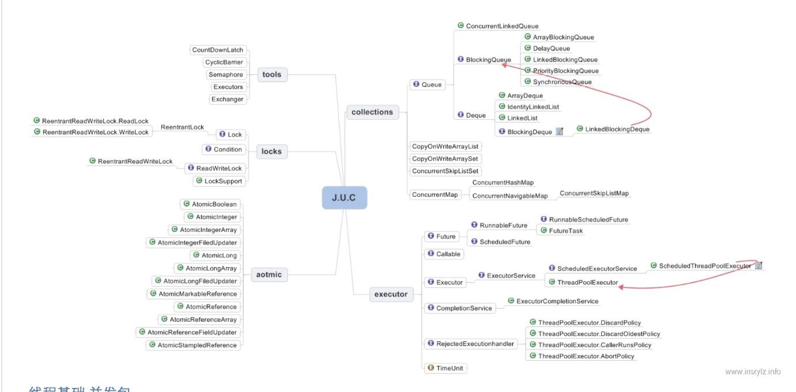


## java线程实现/创建方式


- 继承Thread类：

Thread类本质上是**实现了Runnable接口的一个实例**，代表**一个线程的实例**。启动线程的唯一方法就是Thread类的start()实例方法。**start()方法是一个native()方法**，它将启动一个新线程，并**执行run()方法**


- 实现Runnable接口

如果自己的类已经extends了另一个类，就无法直接extends Thread类，此时可以实现一个Runnable接口，然后使用这个类的实例对象来构造一个Thread实例，`thread.start()`启动线程

当传入一个Runnable的实现类作为构造参数后，Thread的run()方法就会调用`target.run()`

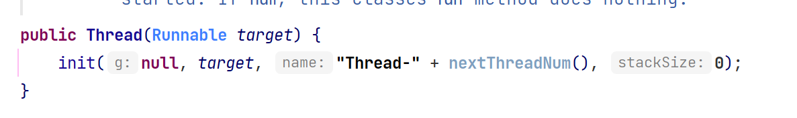

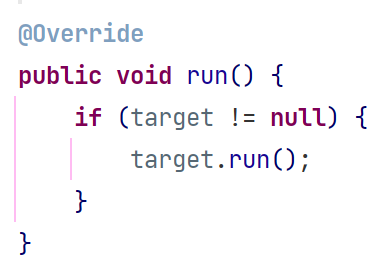


- ExecutorService、Callable<Class>、Future有返回值线程

**有返回值的任务必须事先Callable接口**，无返回值的任务必须实现Runnable接口。

执行Callable任务后，可以**获取一个Future对象**，在该对象上调用get就可以**获取到Callable任务返回的Object了**，再结合线程池接口ExecutorService就可以实现又返回结果的多线程了

```java
public static void main(String[] args) throws ExecutionException, InterruptedException {

    ExecutorService fixedThreadPool = Executors.newFixedThreadPool(16);
    // 创建多个有返回值的任务
    List<Future> list = new ArrayList<Future>();
    for (int i = 0; i < 16; i++) {
        Callable c = new MyCallable(i + " ");
    // 执行任务并获取 Future 对象
        Future f = fixedThreadPool.submit(c);
        list.add(f);
    }
    // 关闭线程池
    fixedThreadPool.shutdown();
    // 获取所有并发任务的运行结果
    for (Future f : list) {
        // 从 Future 对象上获取任务的返回值，并输出到控制台
        System.out.println("res： " + f.get().toString());
    }


}
static class MyCallable implements Callable<String>{
    public String x;

    public MyCallable(String x) {
        this.x = x;
    }

    @Override
    //可以有返回值
    public String call() throws Exception {
        return x;
    }
}
```


- 基于线程池的方式

线程和数据库连接这些资源是非常宝贵的，使用缓存的策略，使用线程池

```java
ExecutorService fixedThreadPool = Executors.newFixedThreadPool(16);
```


## 4种线程池


java里线程池的顶级接口是 `Executor` ，但Executor并不是一个线程池，而是一个执行线程的工具，真正的线程池接口是 `ExecutorService`

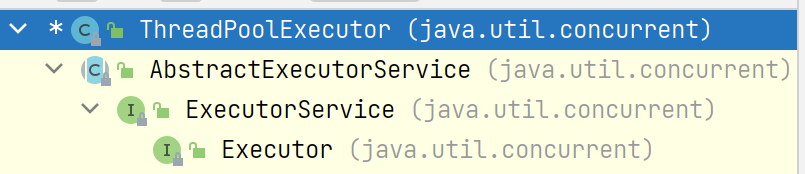


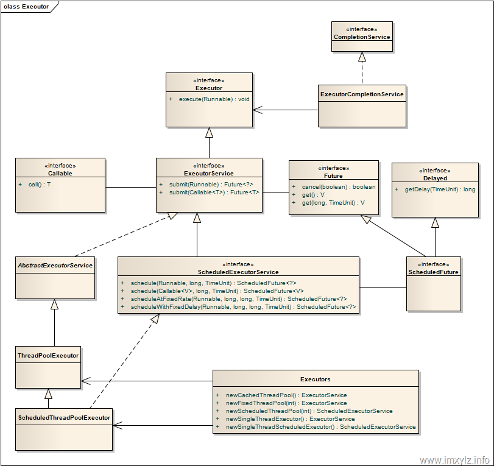


- newCachedThreadPool

创建一个可根据需要创建新线程的线程池，但是在以前构造的线程可用时将重用他们。对于执行很多短期异步任务的程序而言，可以提高程序性能

**调用execute 将重用以前构造的线程（如果线程可用），如果现有线程没有可用的，则创建一个线程并添加到池中。终止并从缓存中移除那些已有60s未被使用的线程**。因此：长时间保持空闲的线程不会使用任何资源

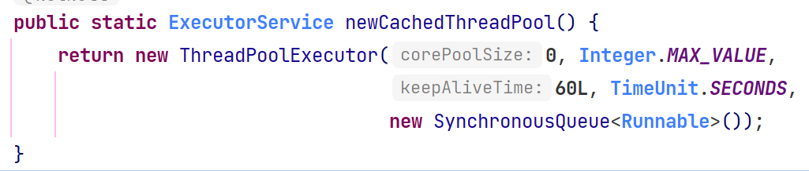


核心线程数是0，所有线程都可过期回收。理论上可以创建无限多的线程，但如果没有足够的任务，创建的线程空闲了60s后会被回收掉。


- newFixedThreadPool

**创建一个可重用<固定线程数>的线程池，以共享的<无界队列>方式来运行这些线程**

在任意时刻，大多数nThreads线程会处于处理任务的活动状态。

core=max，都不可回收，一直执行

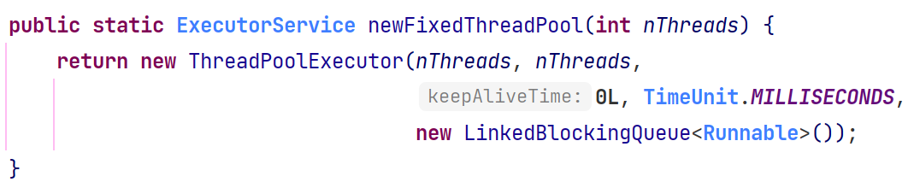

如果所有线程都处于活动状态时提交附加任务，则在有可用线程之前，附加任务将在队列中等待（）。如果在关闭前的执行期间由于失败而导致任何**线程终止**，那么一个新线程将**代替它执行后续的任务**。在某个线程被显式关闭之前，**池中的线程将一直存在**


- newScheduledThreadPool

创建一个线程池，它可安排在给定延迟后运行命令或者定期地执行


```java
public static void main(String[] args) throws ExecutionException, InterruptedException {
    ScheduledExecutorService scheduledExecutorService = Executors.newScheduledThreadPool(3);
    scheduledExecutorService.schedule(new Runnable() {
        @Override
        public void run() {
            System.out.println("这个任务的延时为5s....");
        }
    }, 5, TimeUnit.SECONDS);
    scheduledExecutorService.scheduleAtFixedRate(()->{
        System.out.println("这个任务延迟1s后，每3s执行一次..." + Thread.currentThread());
    } , 1, 3, TimeUnit.SECONDS);
    scheduledExecutorService.scheduleAtFixedRate(()->{
        System.out.println("这个任务 延迟2s后，每1s执行一次..." + Thread.currentThread());
    } , 2, 1, TimeUnit.SECONDS);
```


- newSingleThreadExecutor

返回一个线程池（这个线程池只有一个线程），**这个线程池可以在线程池死后（或异常）重新启动一个线程来替代原来的线程继续执行下去**

单线程，后台从队列（无界的阻塞队列）里面获取任务挨个执行，保证**任务顺序执行**

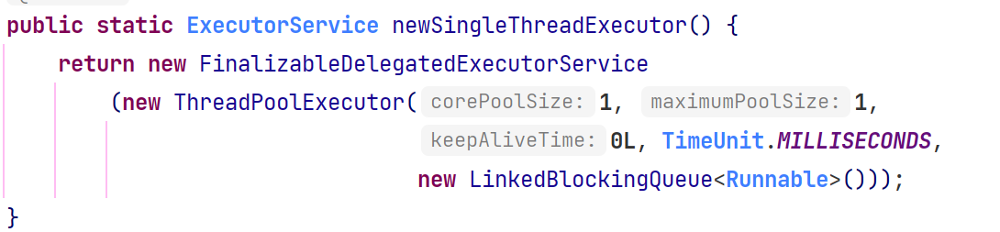


## 线程生命周期（状态）


线程被创建并启动后，不是一启动就进入执行状态，也不是一直处于执行状态。

在线程的生命周期中，它要经过新建new，就绪Runnable，运行Running，阻塞Blocking，死亡Dead五种状态。

尤其是线程启动后，**他不可能一直霸占CPU独自运行，CPU需要在多条线程之间切换，于是线程状态也会多次在运行、阻塞之间<切换>**


- 新建状态New

程序使用new关键字**创建了一个线程Thread**之后，该线程就处于新建状态，此时**仅由JVM为其分配内存，并初始化其成员变量的值，这时候还没有执行start()方法**


- 就绪状态Runnable

当线程的实例对象 **调用了start())方法之后**，该线程处于就绪状态。jvm会为其创建***方法调用栈和程序计数器***（jvm**栈和程序计数器是线程**），等待cpu调度运行


- 运行状态Running

如果处于 **就绪状态的线程获得了CPU，开始执行run()方法的线程执行体**


- 阻塞状态Blocking

线程因为某种原因放弃了 cpu 的使用权，即  让出了cpu timeslice，暂时停止运行，知道**线程进入可运行runnable状态**，才有机会再次获得cpu timeslice 转到运行 running 状态。

阻塞的情况分三种：

1. ***等待阻塞（o.wait()  ->  等待队列）***

运行running 的线程执行 `o.wait() 方法`，jvm会把该线程**放入等待队列**(waiting queue)中


2. ***同步阻塞（lock -> 锁池）***

运行running 的线程在**获取对象的同步锁**时，若该 **同步锁被别的线程占用**，即没获取到该对象的锁，则jvm会把该线程**放入锁池(lock pool)中**


3. ***其他阻塞（sleep / join）***

运行 running 的线程执行 `Thread.sleep(long ms)` 或 `t.join()` 方法，或者发出了**IO请求**时，JVM会把该线程置为阻塞状态。当sleep()状态超时（睡眠完毕），join()等待线程终止或者超时、或者IO处理完毕时，线程重新转入**可运行runable状态（等待cpu分配）**


- 线程死亡 Dead

线程会以下面三种放肆接收，结束后就是死亡状态


1. ***正常结束***

run()或 call() 方法执行完成，线程正常结束


2. ***异常结束***

线程抛出一个未捕获的Exception 或 Error


3. ***调用 stop()***

直接调用该线程的stop()方法来结束该线程——**该线程通常容易导致死锁，不推荐使用**


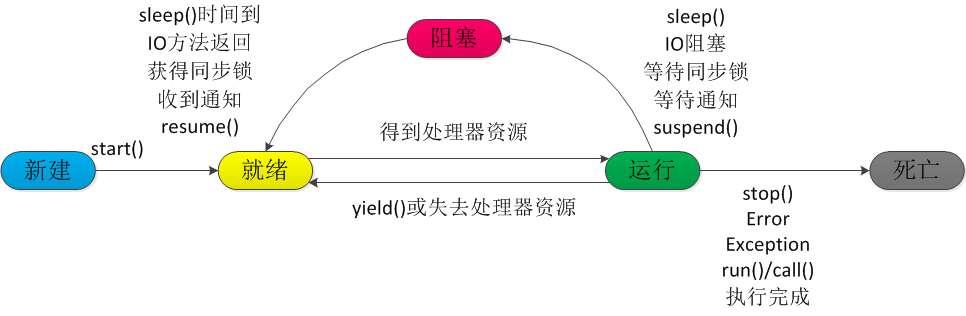


## 终止线程 4 种方式


- 正常运行结束

程序运行结束，线程自动结束


- 使用退出标志退出线程

一般 run() 方法执行完，线程就会正常结束。然而，常常有些线程是伺服线程（守护线程），需要 **长时间运行，只有外部某些条件满足的情况下，才能关闭这些线程**

使用一个变量来控制循环，如：设置一个boolean类型的标志，来控制while循环是否退出


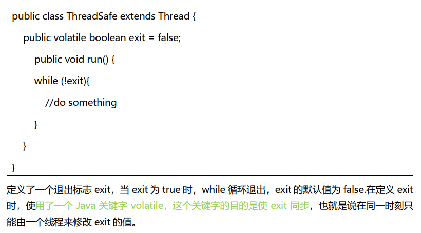

**并且获得的exit值总是内存中的最新值**


- interrupt方法结束线程

使用interrupt()方法来中断线程有两种情况：

1. 线程处于阻塞状态：如使用了sleep()，同步锁的wait,socket中的reveiver,accept等方法时，会使线程处于阻塞状态。当调用线程的interrupt()方法时，抛出InterruptException异常。阻塞中的那个方法抛出这个异常，**break跳出循环状态**，让我们有机会结束这个线程的执行

   **很多人认为只要只要调用了interrupt 方法线程就会结束。错的！一定要先捕获InterruptException异常之后通过break跳出循环（那么run方法就相当于执行完成了，不会再阻塞），才能正常结束run方法**

   

2. 线程未处于阻塞状态：使用isInterrupted() 判断线程的中断标志来退出循环，使用interrupt()方法时，中断标志就会置为true，和使用自定义的标志来控制循环是一样的道理


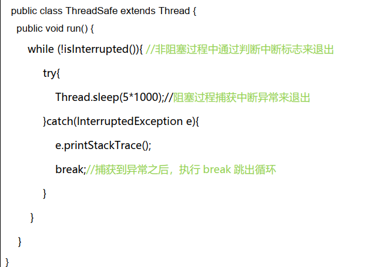


- stop方法终止线程（**线程不安全**）

可以直接使用 `thread.stop()`来强行终止线程，但是stop方法很危险！就像突然关闭电脑电源一样。。。调用后，创建子线程的线程会抛出 ThreadDeatherror的错误，会释放子线程所持有的所有锁。

一般任何进行加锁的代码块，都是为了保护数据的一致性，**如果在调用`thread.stop`后导致了该线程所持有的的所有锁突然释放（不可控制）**，被保护数据就可能呈现 **不一致性**，其他线程在使用这些被破坏的数据时，可能导致很多错误


## sleep和wait区别


1. 对于 sleep() 方法，首先要知道该方法是属于Thread类中的，而wait()方法，属于Object类的，每个类都有这个方法


2. sleep() 方法导致了 ***程序暂停执行指定的时间*** ，让出CPU给其他线程，但是他的 **监控状态依然保持着**，当指定的时间到了又会自动恢复 **就绪Runnable状态(不是Running！)**


3. 调用sleep()方法的过程中，***线程不会释放对象锁***


4. **当调用wait() 方法的时候，线程会放弃对象锁**，进入等待此对象的 <**等待锁定池**>，只有针对此对象调用 notify() 方法后本线程才进入<**对象锁定池**>准备获取对象锁进入运行状态


## start 与 run 区别


1. start() 方法来启动线程，真正实现了多线程运行，这是无需等待 run 方法体代码执行完毕，调用此start() 的线程就可以继续执行下面的代码


2. 通过调用 Thread 类的 start() 方法来启动一个线程，此时这个线程处于 **就绪状态**， ***并没有运行***


3. 方法 run() 成为线程体，它包含了要执行的这个线程的内容，执行 run() 方法后线程就进入了 **运行状态，开始运行run() 函数中我们自己实现的代码**。run方法运行结束，此线程终止，然后CPU再去调度其他线程


## java 后台线程


1. **守护线程  /  服务线程**， 是后台线程，  **为用户线程  提供  公共服务**，在没有用户线程可服务时会自动***离开***


2. 优先级：守护线程的 **优先级比较低**， 用于为系统中的其他对象和线程提供服务


3. 设置：通过 `setDaemon(true)` 来设置线程为“守护线程”，将一个**用户线程设置为守护线程**的方式是在  **线程对象运行start()方法 之前**，用线程对象的setDaemon方法

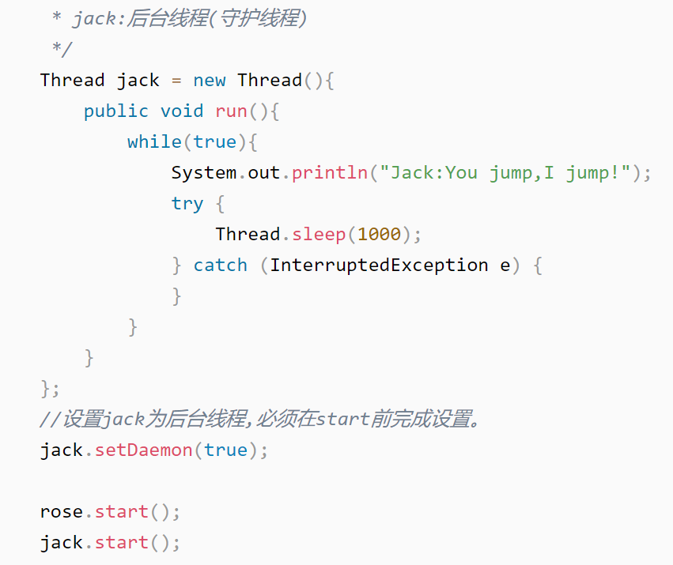


4. 在 Daemon线程中产恒的新线程也是Daemon的


5. ***线程则是JVM级别的***，以Tomcat为例，在**Web应用**中启动一个线程，这个线程的生命周期并不会和 Web 应用程序保持同步，即使**停止了Web应用**，这个线程依旧是活跃的


6. 栗子：垃圾回收线程就是一个经典的守护线程，当我们的程序中不再有任何运行的Thread，程序就不会产生垃圾，**所以当垃圾回收线程是 JVM 上仅剩的线程时，垃圾回收线程会自动离开**。  它始终在低级别的状态运行，用于**实时监控和管理系统中的可回收资源**


7. 生命周期：守护进程：Daemon是运行在**后台**的一种特殊进程。它独立于控制终端并且周期性地执行某种任务或等待处理某些发生的事件。守护进程依赖于系统，与系统“同生共死”。当jvm中所有线程都是守护线程的时候，jvm就可以退出了。如果还有一个以上的非守护线程，jvm不会退出


## Java 锁


---

- 乐观锁

认为<读多写少>，遇到并发写的可能性低，每次去***拿数据的时候都认为被人不会修改***，所以不会上锁，但是 **在更新的时候，会判断一下在此期间别人有没有去更新这个数据，采取在写数先读出当前<版本号>，然后<加锁操作>**(比较跟上一次的版本号，如果一样则更新)，如果失败则要重复读 - 比较 - 写 的操作

java中的乐观锁通过CAS操作实现的，CAS是一种**更新的原子操作**，**比较当前值跟传入的值是否一样，一样则更新，否则失败**


----

- 悲观锁

认为写多，遇到并发写的可能性高，***每次去拿数据的时候认为别人大概率都会修改***，在每次读数据的时候都会上锁，别人想再读就需要block直到拿到锁。

java中的悲观锁就是 **synchronized**，AQS框架下的锁则是**先尝试CAS乐观锁去获取锁**，获取不到，才会**转换为悲观锁**，如：ReentrantLock


----

- 自旋锁

**如果持有锁的线程在很短时间内能释放锁资源，那么那些等待竞争锁的线程就*<u>不需要做内核态和用户态之间的切换，然后进入阻塞挂起状态了</u>*，他们只需要等一等（自旋），等待有锁的线程释放锁后即可立即获得锁，避免用户线程和内核的切换的消耗**

线程自旋需要消耗cpu，**让cpu一直做无用功**，如果一直获取不到锁，那线程也不能一只占用cpu自旋做无用功，设定一个**自旋等待的最大时间**。如果超过这个时间还没有释放锁，那么自旋的线程会停止自旋进入阻塞状态


自旋锁优缺点：

尽可能减少线程阻塞，对于锁的**竞争不激烈，且占用锁时间非常短**的同步块来说性能可以大幅度提升，**自旋的消耗会小于线程阻塞挂起再唤醒的操作的消耗，这些操作会导致线程发生两次上下文切换**

如果锁的**竞争激烈，或者持有锁的线程需要长时间占用锁执行同步块**，不适合使用自旋锁了，一直占用cpu做无用功，大量线程在竞争一个锁，导致获取锁的时间很长，**线程自旋的消耗大于线程阻塞挂起操作的消耗**，其他需要cpu的线程又不能获得cpu，造成cpu浪费。


自旋锁时间阈值：（1.6 适应性自旋锁）

自旋锁的目的是为了占着cpu的资源不释放，等到获取到锁立即进行处理，如何选择自旋的执行时间？

jvm对于自选周期的选择，jdk1.5这个限度是一定的，写死的，**在1.6下引入了适应性自旋锁**，意味着自旋的时间不再是固定的了，而是由**前一次在同一个锁上的自旋时间以及锁的拥有者的状态来决定**，一个线程上下文切换的时间是最佳的一个时间，同时jvm还针对当前**cpu的负荷情况**做了较多优化，如果平均负载小于cpus/2，则一直自旋，如果拥有cpus/2个线程正在自旋，后来线程直接阻塞，如果正在自旋的线程发现Owner发生了变化则延迟自旋时间或进入阻塞，如果cpu处于节点模式则停止自旋

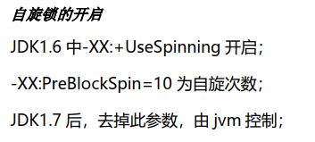


---

- Synchronized同步锁，见下面
- ReentrantLock，见下面
- Semaphore 信号量，见下面


---

- AtomInteger

是一个提供原子操作的Integer类，还有 Atom Boolean/Integer/Long/Reference

可以通过 AtomReference<V>**将一个对象的所有操作转化成原子操作**

**在多线程程序中：i++ / ++i 等运算不具有原子性，是不安全的线程操作之一**。通常会使用**synchronized**将该操作变成一个**原子操作**，但jvm为这一类操作提供同步类，  AtomInteger 的性能时 ReentrantLock 的好几倍


---

- 可重入锁（**递归锁**）

**这里讲的是广义上的可重入锁，而不是单指JAVA下的 ReentrantLock**

**可重入锁，也叫递归锁，同一线程  <外层函数>获得锁之后，<内层递归函数>仍然可以获取该锁的代码，不受影响**

JAVA中的 ReentrantLock 和 synchronized 都是 **可重入锁**


---

- 公平锁和非公平锁

Fair：加锁前检查是否有排队等待的线程，优先选择给排队等待的线程来加锁，**先来先得**

NonFair：加锁时，**直接尝试获取锁，获取不到自动到队尾等待**

1. 非公平锁性能比公平锁高 5-10倍，因为公平锁需要在多核的情况下**维护一个队列**

2. java中的 synchronized 是非公平锁，ReentrantLock 默认的 lock() 方法是 非公平锁（可以设置使用公平锁）


---

- ReadWriteLock 读写锁

**为了提高性能，Java提供了读写锁，在读的地方使用读锁，在写的地方使用写锁**

如果没有写锁的情况下，读是无阻塞的，提高了程序的执行效率。读锁和写锁，**多个读锁不互斥，读锁和写锁互斥**

如果你的代码只读数据，可以很多人同时读，但不能同时写，那就上读锁

如果会修改数据，只能有一个人写，不能同时有人读取，就上写锁，

接口：`java.util.concurrent.ReadWriteLock`，具体实现：`ReentrantReadWriteLock`


---

- 共享锁和独占锁

java并发包提供的加锁模式分为独占锁和共享锁

**独占锁：**

每次只能有一个线程能持有锁，ReentrantLock就是独占方式实现的**互斥锁**，**悲观保守的加锁策略，避免读/读冲突，某个只读线程获取锁，其他读线程只能等待，限制了不必要的并发性，因为读操作并不会影响数据的一致性**

**共享锁：**

允许多个线程同时获取锁，并发访问 共享资源，如 ReadWriteLock。**乐观锁，放宽了加锁策略**

AQS 的内部类 Node定义了两个常量 SHARED 和 EXCLUSIVE，分别标识AQS队列中等待线程的锁获取模式

(java并发包提供了ReadWriteLock读写锁)


---

- 重量级锁 **Mutex Lock**

synchronized 是通过 对象内部的一个叫做 **监视器锁 monitor** 来实现的。但是监视器锁本质又是依赖于底层的操作系统的  Mutex Lock  来实现的。而操作系统实现**线程之间的切换** 需要从用户态转换到和心态，成本高，需要较长时间，所以synchronized效率低。**这种依赖于操作系统 Mutex Lock 所实现的锁我们称之为 “重量级锁”**。 jdk1.6后，为了减少获得锁和释放锁所带来的的性能消耗，引入了 **轻量级锁、偏向锁**


---

- 轻量级锁

锁的状态有四种：无锁状态、偏向锁、轻量级锁、重量级锁

**锁升级：**

随着锁的竞争，锁可以从偏向锁升级到轻量级锁，再升级到重量级锁（**锁的升级是单向的，不会出现锁的降级**）

轻量级是相对于使用 **操作系统互斥量mutex lock**来实现的传统锁而言的

轻量级锁并不是用来代替重量级锁的，它本意是在没有多线程竞争的前提下，减少重量级锁产生的性能消耗

**轻量级锁 所适应的场景是  线程<交替执行>同步块的情况，如果存在<同一时间>访问同一锁的情况，就会导致轻量级锁膨胀为重量级锁**


---

- 偏向锁

大多数情况：锁不仅不存在多线程竞争，而且总是有由**同一线程多次获得**。

**偏向锁的目的是在 某个线程获得锁之后，消除这个线程重入（CAS）的开销，开起来让这个线程得到了偏护**

为了在没有多线程竞争的情况下，尽量减少轻量级锁执行路径，因为轻量级锁的获取和释放依赖多次 CAS 原子指令，**偏向锁只需要在置换 ThreadID 的时候依赖一次 CAS 原子指令**（由于一旦多线程竞争的情况就必须撤销偏向锁，所以偏向锁的**撤销操作的性能损耗**必须小于节省下来的**CAS原子指令的性能消耗**）

**轻量级锁是为了在线程交替执行同步块时提高性能，而偏向锁是在只有一个线程执行同步块时进一步提高性能**


---

- 分段锁

并非一种实际的锁：一种思想：ConcurrentHashMap 是分段锁的最佳实践


---

- 锁优化


1. ***减少锁持有时间***  ：

只有在**有线程安全要求**的程序上加锁


2. ***减小锁粒度***

将大对象（可能会被很多线程访问），**拆分成小对象**，可以大大增加**系统并行度，降低锁竞争**。降低了锁的竞争，偏向锁、轻量级锁的成功率才会提高。案例：ConcurrentHashMap


3. ***锁分离***

**最常见的就是 读写锁 ReadWriteLock**，根据功能，分离成读锁和写锁。只要操作不影响，锁就可以分离，如：LinkedBlockingQueue从头部取出，从尾部放数据


4. ***锁粗化***

保证多线程的有效并发，每个线程持有锁的时间尽量短，使用完公共资源后应该立即释放锁。

但是：**如果对同一个锁 不停的进行请求，同步和释放，也会消耗很多资源**


5. ***锁消除***

不可能被共享的对象，消除这些对象的锁操作


----

## Synchronized同步锁


> 同步方法支持一种简单的策略来**防止线程干扰和内存一致性错误**：如果一个对象对多个线程可见，则对该对象变量的**所有**读取或写入都是通过同步方法完成的。


synchronized可以把任意一个非null的对象当做锁，属于**独占式的悲观锁，同时属于可重入锁**


### **synchronized作用范围：**

1. 作用于方法时，锁住的是**对象的实例（this）**
2. 作用于静态方法时，锁住的是 ***Class 实例***，又因为Class的相关数据存储在永久代PermGen(metaspace)中，**全局共享**，因此静态方法锁相当于**类的一个全局锁**，会锁住所有调用该方法的线程

3. synchronized 作用于一个对象实例，锁住的是所有**以该对象 为锁的同步代码块**，它有多个队列，当多个线程一起访问某个对象监视器的时候，对象监视器会将这些线程存储在不同的容器中


### **synchronized核心组件：**

1. Wait Set：那些**调用 wait() 方法**被阻塞的线程被放置在这里
2. Contention List：**竞争队列**，所有**请求锁的线程**首先被放置在这个竞争队列中

3. Entry List：Connection List中那些 **有资格成为候选资源的线程被移动到 Entry List中**

4. OnDeck：任意时刻，**最多只有一个线程正在竞争锁资源，该线程被称为OnDeck**

5. Owner：当前已经获取到资源的线程
6. !Owner：当前释放锁的线程


### **Synchronized实现**：


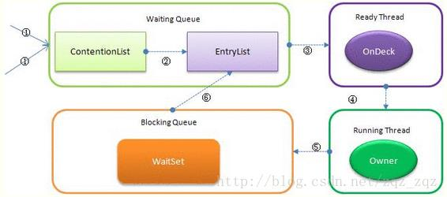


1. JVM每次从队列的尾部取出一个数据用于锁竞争候选者（OnDeck），但是并发情况下， Contention List 会被**大量的并发线程**进行CAS访问，为了**降低对尾部元素的竞争**，JVM会将一部分线程移动到 EntryList 中作为**候选竞争线程**。

2. Owner 线程会在 **unlock 时**，将Contention List 中的部分线程**迁移到Entry List 中**，并指定Entry List 中的**某个线程为 OnDeck 线程**（一般是按顺序，最先进去的那个线程）

3. Owner线程并不直接把锁**传递给 OnDeck 线程**，而是把**锁竞争的权利交给OnDeck（就是说OnDeck可能会竞争到锁，也可能竞争不到，只是拥有竞争锁的权利而已）** ，OnDeck需要重新竞争锁。虽然牺牲了一些公平性，但能极大提升系统的**吞吐量**，JVM中称为 “竞争切换”

4. OnDeck线程获取到锁资源后会变为 Owner 线程，而没有得到锁资源的仍然**停留在 EntryList** 中。如果 Owner 线程被 wait() 方法阻塞（**wait方法会释放锁**），则转移到 **WaitSet** 中，直到被notify 或者 notifyAll() 唤醒，会**重新进入EntryList中**

5. 处于 ContentionList、EntryList、WaitSet 中的线程**都处于阻塞状态**，该阻塞是由操作系统完成的，（linux下采用 pthread_mutex_lock 内核函数实现）

6. **Synchronized是非公平锁**。Synchronized 在线程进入 ContentionList时，**等待的线程会先尝试自旋获取锁，如果获取不到就进入Contention List中**，明显这对于 **已经进入队列的线程是不公平的！** 还有：自选获取锁的线程还可能**直接抢占 OnDeck 线程的锁资源**

7. 每个对象都有个monitor对象，**加锁就是在竞争 monitor 对象**，**代码块**加锁是在前后分别加上 **monitorenter 和 monitorexit 指令**来实现的，**方法**加锁是通过一个**标记位**来判断的

8. synchronized **是一个重量级操作，需要调用操作系统相关的接口**，性能是低效的，给线程加锁消耗的时间比有用操作的时间更多

9. java1.6 ，synchronized进行了优化，**适应自旋、锁消除、锁粗化、轻量级锁及偏向锁等**，效率提高。1.7和1.8**引入了偏向锁和轻量级锁**。在对象头中有标记位，不需要经过操作系统

10. **锁可以从偏向锁升级到轻量级锁，再升级到重量级锁**。升级过程叫膨胀

11. 1.6中默认的开启偏向锁和轻量级锁，通过 -XX:-UseBiasedLocking来禁用偏向锁


## ReentrantLock


继承接口 Lock 并实现了接口定义的方法，是一种可重入锁，除了能完成synchronized所有工作外，**还提供了诸如可响应中断锁，可轮询锁请求、定时锁等避免多线程死锁的方法**


Lock接口的主要方法：

1. void lock() ：执行此方法时，如果 **锁处于空闲状态，当前线程将获取到锁**。如果锁已经被其他线程持有，将禁用（阻塞）当前线程，直到当前线程获取到锁
2. boolean tryLock()： 如果锁可用, 则获取锁, 并立即返回 true, 否则返回 false. 该方法和lock()的区别在于, tryLock()只是"试图"获取锁, **如果锁不可用, 不会导致当前线程被禁用**,当前线程仍然继续往下执行代码. 而 lock()方法则是一定要获取到锁, 如果锁不可用, 就一直等待, 在未获得锁之前,当前线程并不继续向下执行。**可轮询的锁请求，不会一直阻塞**
3. void unlock()：执行此方法时, 当前线程将释放持有的锁. **锁只能由持有者释放**, 如果线程并不持有锁, 却执行该方法, 可能导致异常的发生.
4. Condition newCondition()： **条件对象**，获取等待通知组件。该**组件和当前的锁绑定**，当前线程只有**获取了锁，才能调用该组件的 await()方法**，而调用后，当前线程将**释放锁**。
5. getHoldCount() ： 查询当前线程保持此锁的次数，也就是执行此线程**执行 lock 方法的次**
   **数。**
6. getQueueLength（） ： 返回正**等待获取此锁的线程估计数**，比如启动 10 个线程， 1 个线程获得锁，此时返回的是 9
7. getWaitQueueLength(Condition condition)：返回等待与此锁相关的**给定条件**的线程估计数。比如 10 个线程，用**同一个 condition 对象**，并且此时这 10 个线程都执行了**condition 对象的 await 方法**，那么此时执行此方法返回 10
8. hasWaiters(Condition condition)： 查询是否有线程等待与此锁有关的给定条件 (condition)，对于指定 contidion 对象，有多少线程执行了 **condition.await 方法**
9. hasQueuedThread(Thread thread)： 查询**给定线程**是否等待获取此锁
10. hasQueuedThreads()： 是否有线程等待此锁
11. isFair()： 该锁是否**公平锁**
12. isHeldByCurrentThread()： 当前线程是否保持锁锁定，线程的执行 lock 方法的前后分
    别是 false 和 true
13. isLock()： 此锁是否有任意线程占用
14. lockInterruptibly（） ： 如果当前线程**未被中断，获取锁**，如果线程被中断，报异常
15.  tryLock（） ： 尝试获得锁，仅在调用时锁未被线程占用，获得锁
16.  tryLock(**long timeout**,  TimeUnit unit)： 如果锁在给定等待时间内没有被另一个线程保持，
    则获取该锁  。**定时锁**


---


- 非公平锁：

JVM按随机、就近原则分配锁的机制被称为不公平锁，ReentrantLock**在构造函数中提供了是否公平锁的初始化方式**。默认为非公平锁。非公平锁的实际执行效率远高于公平锁，也最常用非公平锁


- 公平锁：

公平锁指的是锁的分配机制是公平的，先对锁提出获取请求的线程会先被分配到锁，ReentrantLock在构造函数中提供了是否公平锁的初始化放回寺来定义公平锁


---


- **ReentrantLock 与 Synchronized**

1. ReentrantLock通过方法lock() 与 unlock() 来进行加锁和解锁操作，与 **synchronized 会被 JVM 自动解锁的机制不同，ReentrantLock 加锁后需要手动进行解锁**。为避免程序出现异常而无法正常解锁的情况，**使用ReentrantLock必须在 finally 控制块中进行解锁操作**

2. ReentrantLock的优势是 **可中断、公平锁、多个锁**。


```java
ReentrantLock lock = new ReentrantLock(true); //公平锁
        Condition condition = lock.newCondition();

        try{
            lock.lock();//需要先获得锁，才能对锁的condition进行操作，

            System.out.println("开始await 3s");
            //await使得当前获得锁的线程进行休眠
           condition.await(3000, TimeUnit.MILLISECONDS);
//            condition.await();
//            condition.signal();  //在其他线程中使用该condition对象来唤醒这个线程

            System.out.println("ThreadName: " + Thread.currentThread().getName());

        }finally {
            lock.unlock();
        }
```


---

- Condition 类和 Object 类锁方法区别：

1. Condition 类的 await 方法和 Object 类的 wait 方法等效
2. Condition 类的 signal 方法和 Object 类的 notify 方法等效
3. Condition 类的 signalAll 方法和 Object 类的 notifyAll 方法等效
4. ReentrantLock 类可以**唤醒指定条件的线程**，而 object 的唤醒是**随机的**  


- tryLock 和 lock 和 lockinterruptibly 的区别

1. tryLock 能获得锁就返回 true，不能就立即返回 false， tryLock(long timeout,TimeUnit unit)，可以增加时间限制，如果超过该时间段还没获得锁，返回 false
2. lock 能获得锁就返回 true，不能的话一直等待获得锁
3. lock 和 lockInterruptibly，如果两个线程分别执行这两个方法，但此时**中断这两个线程**，lock 不会抛出异常，而 **lockInterruptibly 会抛出异常**。  


## Semaphore 信号量


基于计数的信号量，可以设定一个阈值，多个线程**竞争获取许可信号**，做完自己的申请后归还，超过阈值后，**线程申请许可信号将会被阻塞**。Semaphore 可以用来构建一些对象池，资源池之类，如**数据库连接池**


- 实现互斥锁（计数器为1）

创建计数为 1 的 Semaphore，将其作为一种类似 **互斥锁的机制**，二元信号量，表示两种互斥状态

```
new Semaphore(5)
semp.acquire()  申请许可
semp.release()  释放许可
```


- **Semaphore 与 ReentrantLock**

Semaphore 基本能完成 ReentrantLock 的所有工作，通过 acquire() 与 release() 方法来获得和释放临界资源。  Semaphore.acquire() 方法默认为 **可响应中断锁**，和 lockInterruptibly()作用效果一致，在等待临界资源的过程中可以被 Thread.interrupt() 方法中断

Semaphore 实现了 **可轮询的锁请求与定时锁的功能**，除了方法名 tryAcquire 与 tryLock不同，其使用方法与 ReentrantLock 几乎一致。 Semaphore 也提供了**公平与非公平锁**的机制，也可在构造函数中进行设定。

Semaphore 的锁释放操作也由手动进行，因此与 ReentrantLock 一样，为避免线程因抛出异常而无法正常释放锁的情况发生，**释放锁的操作也必须在 finally 代码块中完成。**  


## 线程基本方法


wait, notify, notifyAll, sleep, yield


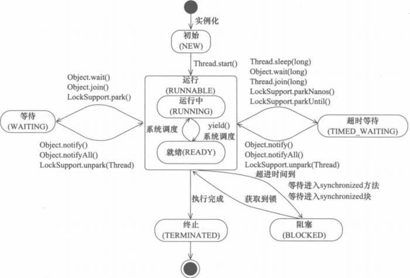


- 线程等待wait

调用该方法的新城进入WAITING状态，只有等待另外线程的通知或 被中断 才会返回。调用wait() 方法后，**会释放对象的锁**。wait一般用在 同步方法或同步代码块中


- 线程睡眠 sleep

导致当前线程休眠，**sleep不会释放当前线程的锁**，sleep(long)会导致线程进入 `TIMED-WAITING`  状态，而 wiat() 方法会导致当前线程进入 `WAITING` 状态


- 线程让步 yield

yield **会使当前线程让出 CPU 执行时间片**，与其他线程一起重新竞争 CPU 时间片。看各自的优先级


- 线程中断 interrupt

中断一个线程。**给这个线程一个通知信号，会影响这个线程内部的一个 *<中断标识位>* 。这个线程本身并不会因此而改变状态（阻塞、终止等）**

1. **调用 interrupt() 不会中断一个正在运行的线程**。仅仅改变了内部维护的中断标识位而已
2. 调用sleep而处于 TIMED-WAITING 状态的线程，调用interrupt() 方法，抛出异常：InterruptedException，使线程提前结束 TIMED-WAITING 状态

直接调用该线程实例的interrupt方法：

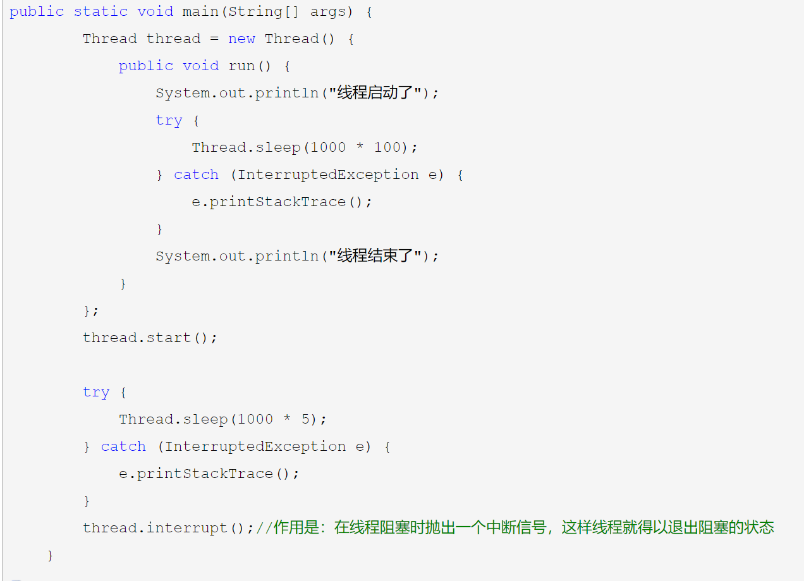


3. 许多声明抛出 InterruptedException 的方法(如 Thread.sleep(long mills 方法))，抛出异常前，都会**清除中断标识位**，所以抛出异常后，调用 **isInterrupted()方法将会返回 false**。


4. 中断状态是线程固有的一个标识位，可以通过此标识位安全的终止线程。比如,你想终止
   一个线程 thread 的时候，可以调用 thread.interrupt()方法，在线程的 run 方法内部可以
   根据 thread.isInterrupted()的值来优雅的终止线程(而不是捕捉中断异常。。)。  


----

- Join 等待其他线程终止

在当前线程调用另一个线程的join方法，**当前线程转为阻塞状态，另一个线程运行结束，当前线程由阻塞变为就绪状态，等待CPU分配时间片**


---

- 为什么要用  join()  方法

主线程生成并启动了子线程，需要用到**子线程返回的结果**。

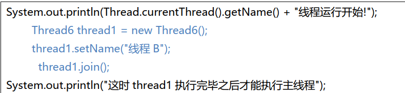


---

- 线程唤醒 notify

Object类的notify() 方法，**唤醒在此对象监视器上等待的单个线程**，如果所有线程都在此对象上等待，选择唤醒其中 **任意** 一个， **线程带调用 wait() 方法，在对象的监视器上等待，直到当前的线程放弃此对象上的锁定，才能继续执行被唤醒的线程**，然后这个线程处于就绪状态，与其他线程一起重新竞争 CPU 时间片


- 其他方法

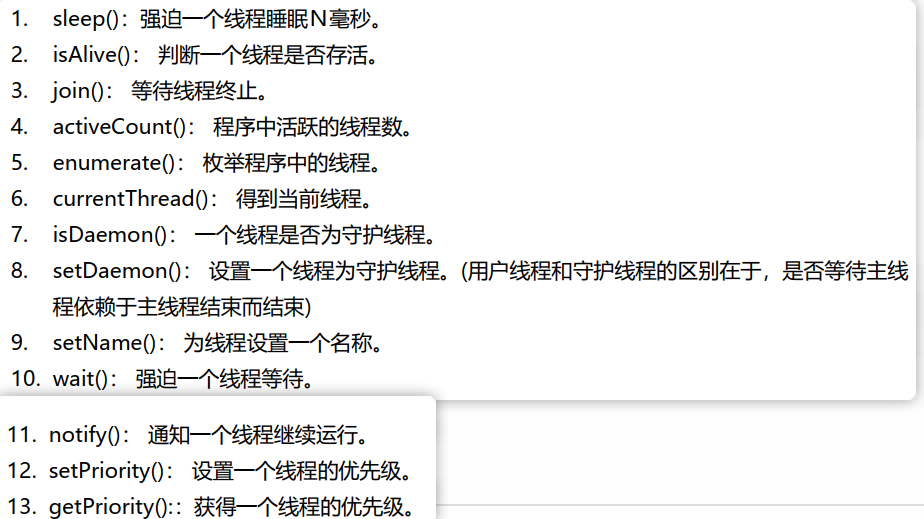


## 线程上下文切换


时间片轮转的方式，CPU给每个任务都服务一定的时间，把状态保存下来，然后加载下一个任务的状态。

**任务的状态保存以及再加载，这段过程就叫做<上下文切换>**

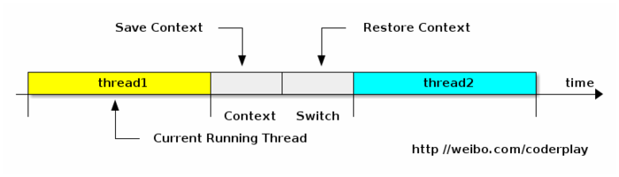


上下文：**某一时间点  CPU 寄存器和程序计数器的内容**


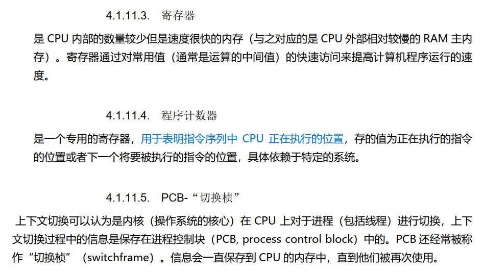


**上下文切换的信息保存在进程控制块中**


- 上下文切换的活动：

1. 挂起一个进程，将这个进程在 CPU 中的状态（上下文）存储于 内存中的某处
2. 在内存中**检索**下一个进程的**上下文**并将其在 CPU 的**寄存器中恢复**
3. 跳转到 程序计数器 所指向的位置（**进程被中断时的代码行**），恢复该进程在程序中


- 引起线程上下文切换的原因：

1. 当前执行任务的**时间片用完**之后，系统 CPU 正常调度下一个任务
2. 当前执行任务碰到 <**IO阻塞**>，将此任务挂起，继续下个任务
3. 多个任务**抢占锁资源**，没抢到的被挂起
4. 用户代码**挂起**当前任务，**让出** CPU 时间（yield(), wait() 。。。）
5. 硬件中断


## Java 阻塞队列原理


当队列中没有数据的情况下, **消费者端**的所有线程都会被自动阻塞（挂起），直到有数据放入队列

当队列中填满数据的情况下，**生产者端**的所有线程都会被自动阻塞（挂起），直到队列中有空的位置，线程被自动唤醒。  


### 阻塞队列的主要方法


阻塞队列提供了四组不同的方法用于 插入、移除、检查元素：


| 方法     | 抛出异常  | 返回特殊值 | 一直阻塞   | 超时退出           |
| -------- | --------- | ---------- | ---------- | ------------------ |
| 插入方法 | add(e)    | offer(e)   | **put(e)** | offer(e,time,unit) |
| 移除方法 | remove()  | poll()     | **take()** | poll(time,unit)    |
| 检查方法 | element() | peek()     | -          | -                  |


-   抛出异常：如果试图的操作**无法立即执行**，**抛出异常**。当阻塞队列满的时候，再往队列里插入元素，会抛出  `IllegalStateException("Queue full")`  异常。当队列为空时，从队列里获取元素时会抛出  `NoSuchElementException`异常
-   返回特殊值：如果试图的操作无法立即执行，返回一个**特殊值**，通常是  true/false
-   一直阻塞：如果试图的操作无法立即执行，则**一直阻塞或者响应中断**
-   超时退出：当试图的操作无法立即执行，该方法调用将会**发生阻塞**，直到能够执行，但**等待时间不会超过给定值**。返回一个特定值以告知该操作是否成功，通常是 true/false.

**注意：**

-   不能往阻塞队列中插入null，会抛出空指针异常
-   可以访问阻塞队列中的**任意元素**，调用remove(o)可以将队列之中的特定对象移除，效率不高，避免使用。


---

#### **插入操作**

1. `public boolean add(E e)`：将指定元素加入队列中（如果立即可行且不会违反容量限制），成功时返回 true，如果没有可用的空间，抛出 `IllegalStateException` 异常，如果是 这个要加入的元素是 null， 抛出 `NullPointerException  ` 异常


2. `public boolean offer(E e)`：将指定元素插入队列中（如果立即可行且不会违反容量限制），成功时返回true，如果没有可用的空间，返回false


3. `void put(E e) throws InterruptedException` ：将指定元素插入此队列中，如果空间不够，将**阻塞等待可用的空间**

```java
public void put(E e) throws InterruptedException {
    checkNotNull(e);
    final ReentrantLock lock = this.lock;
    lock.lockInterruptibly();
    try {
        //如果队列满了，则线程阻塞等待
        while (count == items.length)
            notFull.await();
        enqueue(e);
    } finally {
        lock.unlock();
    }
}
```


4. `public boolean offer(E e, long timeout, TimeUnit unit)` ：可以设定等待的时间， 如果在指定的时间内， 还不能往队列中加入 BlockingQueue， 则返回失败。  


----

#### **获取数据操作**


1. `poll(time)  ` ：取走 BlockingQueue 里排在首位的对象,若不能立即取出,则可以等 time 参数规定的时间,取不到时返回 null;  

2. `poll(long timeout, TimeUnit unit)` ：从 BlockingQueue 取出一个队首的对象， 如果在指定时间内， 队列一旦有数据可取， 则立即返回队列中的数据。否则直到**时间超时**还没有数据可取，返回失败  

3. `take()  ` ：取走 BlockingQueue 里排在首位的对象,若 BlockingQueue 为空, **阻塞进入等待状态**直到 BlockingQueue 有新的数据被加入。  

4. `public int drainTo(Collection<? super E> c, int maxElements)` ：一次性从 BlockingQueue 获取**所有可用的数据对象**（还可以指定**获取数据的个数**），通过该方法，可以提升获取数据效率；**不需要多次分批加锁或释放锁**。  


### Java中的阻塞队列家族


1. ArrayBlockingQueue ：由数组结构组成的有界阻塞队列。
2. LinkedBlockingQueue ：由链表结构组成的有界阻塞队列。
3. PriorityBlockingQueue ：支持优先级排序的无界阻塞队列。
4. DelayQueue：使用优先级队列实现的无界阻塞队列。
5. SynchronousQueue：**不存储元素**的阻塞队列。
6. LinkedTransferQueue：由链表结构组成的无界阻塞队列。
7. LinkedBlockingDeque：由链表结构组成的双向阻塞队列  


---

1. ArrayBlockingQueue  **公平、非公平**

数组实现，有界阻塞队列。

FIFO的原则，**默认情况下不保证<访问者公平>（任务是按顺序的）的访问队列**。所谓公平的访问队列是 指 阻塞的所有生产者线程或消费者线程，当队列可用时，按照阻塞的先后顺序访问队列，即 **先阻塞的生产者线程，可以先往队列里插入元素，先阻塞的消费者线程，可以先从队列里获取元素**。

如果需要保证公平性，会降低吞吐量，创建一个公平的阻塞队列：

```java
ArrayBlockingQueue fairQueue = new ArrayBlockingQueue(1000,true);
```


---

2. `LinkedBlockingQueue  `  **两个独立锁提高并发**

基于链表。FIFO的原则

**之所以能够高效处理并发数据，因为其对于生产者端和消费者端分别采用了独立的锁来控制数据同步**，在高并发情况，生产者和消费者可以**并行地操作队列中的数据**，一次来提高整个队列的并发性能

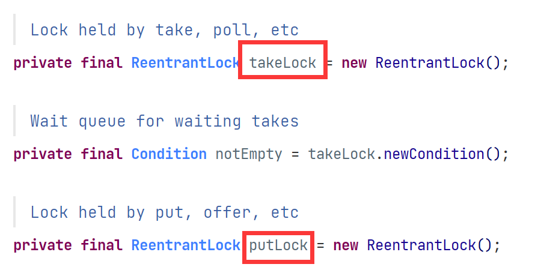

**LinkedBlockingQueue  默认一个近乎无限大小的容量**

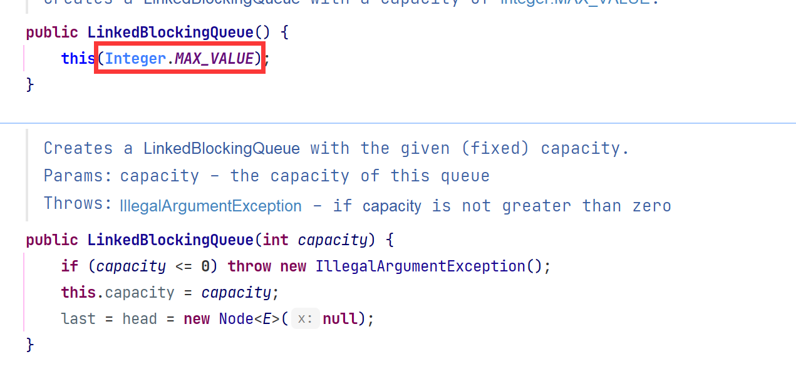


---

3. `PriorityBlockingQueue`    **compareTo排序实现优先**

**底层是 PriorityQueue **

**加入的元素需要实现 Comparable接口的compareTo方法**

**支持优先级的<有界>队列，默认队列长度为11**

默认元素采取自然顺序升序排序。可以自定义实现  compareTo()  方法来指定元素进行排序规则，或者初始化  PriorityBlockingQueue  时，指定构造参数  Comparator  来对元素进行排序。需要注意的是**不能保证同优先级元素的顺序**。  


---

4. DelayQueue   **缓存失效、定时任务** 

支持 **延时获取元素的无界阻塞队列**。

DelayQueue是一个没有大小限制的队列，因此往队列中插入数据的操作(生产者)永远不会被阻塞，而**只有获取数据的操作(消费者)才会被阻塞**。

**队列使用PriorityQueue 实现**

队列中的元素必须实现 Delayed 接口，创建元素时可以指定多久delay 才能从队列中获取当前元素。只有在延迟期满时，才能从队列中提取元素。

```java
public interface Delayed extends Comparable<Delayed> {

    /**
     * 加入延迟队列的元素都必须实现这个方法，并且 PriorityQueue 中 Comparable 的比较方法就是获取 元素的 延迟时间的属性
     * Returns the remaining delay associated with this object, in the
     * given time unit.
     *
     * @param unit the time unit
     * @return the remaining delay; zero or negative values indicate
     * that the delay has already elapsed
     */
    long getDelay(TimeUnit unit);
}
```

运用场景：

1. **缓存系统**的设计：用 DelayQueue 保存缓存元素的有效期，使用一个线程循环查询 DelayQueue，一旦能从 DelayQueue 中获取元素时，表示缓存有效期到了，从队列中删除

2. **定时任务调度**：保存当天将会执行的任务和执行时间，一旦从 DelayQueue获取到任务就开始执行，如 TimerQueue


---

5. `SynchronousQueue`    	 **不存储数据、可用于传递数据**

**是一个不存储元素的阻塞队列。每一个put 操作必须等待一个take操作，否则不能继续添加元素**

负责把生产者线程处理的数据直接传递给消费者线程。**队列本身不存储任何元素**，适合传递性场景

如：一个线程中使用的数据，传递给另一个线程使用。SynchronousQueue 的**吞吐量高**于 LinkedBlockingQueue 和 ArrayBlockingQueue


---

6. LinkedTransferQueue  

链表结构，无界阻塞 TransferQueue 队列，多了 tryTransger 和 transfer 方法

1. `transfer` 方法：如果当前有**消费者正在等待接收元素**（消费者使用 take()方法或带时间限制的poll()方法时）， transfer 方法可以把生产者传入的元素**立刻 transfer（传输）给消费者**。如果没有消费者在等待接收元素， transfer 方法会将元素存放在**队列的 tail 节点**，并等到该元素**被消费者消费了才返回。**  （保证元素交付到消费者才能返回）

2. `tryTransfer` 方法：则是用来试探下生产者传入的元素**是否能直接传给消费者**。如果没有消费者等待接收元素，则返回 false。和 transfer 方法的区别是 tryTransfer 方法无论消费者是否接收，**方法立即返回**。而 transfer 方法是必须等到**消费者消费了才返回**。  


---

7. LinkedBlockingDeque  


**链表结构，双向阻塞队列**，多了一个操作队列的入口，在多线程同时入队时，减少了一半的竞争。

LinkedBlockingDeque **多了 addFirst， addLast， offerFirst， offerLast，peekFirst， peekLast 等方法**，以 First 单词结尾的方法，表示插入，获取（peek）或移除双端队列的第一个元素。以 Last 单词结尾的方法，表示插入，获取或移除双端队列的最后一个元素。另外插入方法 add 等同于 addLast，移除方法 remove 等效于 removeFirst， take 方法等同于 takeFirst，不知道是不是 Jdk 的 bug，使用时还是用带有 First 和 Last 后缀的方法更清楚。

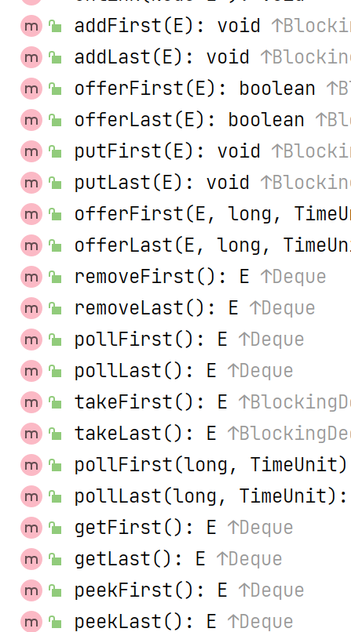

在初始化 LinkedBlockingDeque 时可以**设置容量**防止其过度膨胀。另外双向阻塞队列可以运用在“工作窃取”模式中  


## CyclicBarrier、 CountDownLatch、 Semaphore 的用法  


---

- **CountDownLatch**（线程计数器）  

位于juc包下，实现类似计数器的功能。

如有一个任务A，等待其他 n 个任务执行完毕之后才能执行，利用 CountDownLatch 来实现

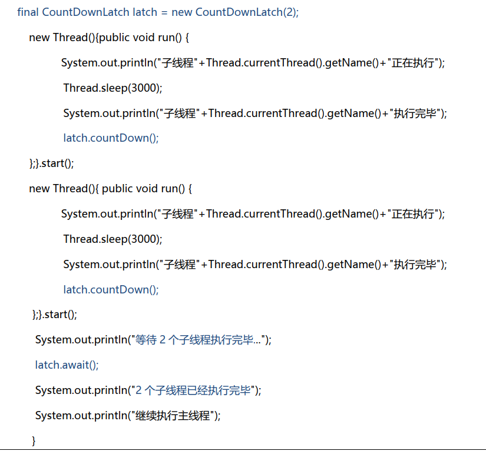


```java
// 定义前置任务线程
static class PreTaskThread implements Runnable {

    private String task;
    private CountDownLatch countDownLatch;

    public PreTaskThread(String task, CountDownLatch countDownLatch) {
        this.task = task;
        this.countDownLatch = countDownLatch;
    }

    @Override
    public void run() {
        try {
            Random random = new Random();
            Thread.sleep(random.nextInt(1000));
            System.out.println(task + " - 任务完成");
            countDownLatch.countDown();
        } catch (InterruptedException e) {
            e.printStackTrace();
        }
    }
}

public static void main(String[] args) {
    // 假设有三个模块需要加载
    CountDownLatch countDownLatch = new CountDownLatch(3);

    // 主任务
    new Thread(() -> {
        try {
            System.out.println("等待数据加载...");
            System.out.printf("还有%d个前置任务%n", countDownLatch.getCount());
            //阻塞等待前置任务完成，直到CountDownLatch的count减为0，会触发这个await，继续执行任务
            countDownLatch.await();
            System.out.println("数据加载完成，正式开始游戏！");
        } catch (InterruptedException e) {
            e.printStackTrace();
        }
    }).start();

    // 前置任务
    new Thread(new PreTaskThread("加载地图数据", countDownLatch)).start();
    new Thread(new PreTaskThread("加载人物模型", countDownLatch)).start();
    new Thread(new PreTaskThread("加载背景音乐", countDownLatch)).start();
}
```

**场景：一个线程等待多个前置任务完成。因为和CyclicBarrier不同的是，CyclicBarrier调用 await() 后自己会阻塞，而是用CountDownLatch的countDown() 后不会阻塞，只会将count值减一，阻塞的是调用CountDownLatch await() 阻塞等待count=0的线程**


count 属性：就是闭锁需要等待的线程数量，并且 CountDownLatch 没有任何方法去重新设置这个计数值

CountDownLatch设置的count只是一次性的，无法重复使用。


----

- CyclicBarrier  **回环栅栏，等待至 barrier 状态再全部同时执行**

让一组线程等待至某个状态之后再全部执行，叫做回环是因为：当所有等待线程都被释放以后，CyclicBarrier 可以被 **重用**。把这个状态叫做 Barrier，当调用 await() 之后，线程就处于 Barrier 了。

await() 有两个重载版本

1. public int await()： 用来**挂起当前线程**，直至所有线程都**到达 barrier 状态**再同时执行后续任务；  
2. public int await(long timeout, TimeUnit unit)： 让这些线程**等待至一定的时间**，如果还有线程没有到达 barrier 状态就直接让到达 barrier 的线程执行后续任务  


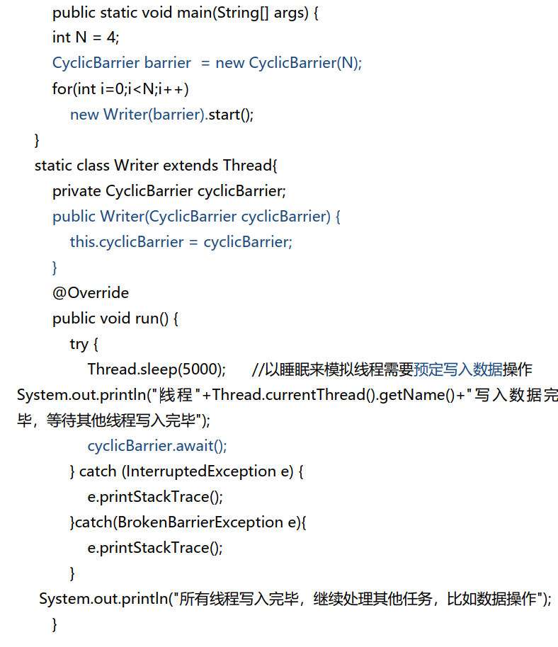


```java
static class PreTaskThread implements Runnable {

        private String task;
        private CyclicBarrier cyclicBarrier;

        public PreTaskThread(String task, CyclicBarrier cyclicBarrier) {
            this.task = task;
            this.cyclicBarrier = cyclicBarrier;
        }

        @Override
        public void run() {
            // 假设总共三个关卡
            for (int i = 1; i < 2; i++) {
                try {
                    Random random = new Random();
                    Thread.sleep(random.nextInt(1000));
                    System.out.printf("关卡%d的任务%s完成%n", i, task);
                    //给cyclicBarrier 一个信号然后等待其他任务完成
                    cyclicBarrier.await();
                    // 达到CyclicBarrier 状态后，这些被阻塞的线程继续进行后续操作（即下个for循环）
                    System.out.printf("准备加载关卡%d的任务: %s%n", i + 1, task);
                } catch (InterruptedException | BrokenBarrierException e) {
                    e.printStackTrace();
                }
                cyclicBarrier.reset(); // 重置屏障
            }
        }
    }

    public static void main(String[] args) {
        //一共需要等待三个线程小任务的完成，才算完成当前关卡的准备
        //如果不够这个数量，那么这个任务不会执行的
        CyclicBarrier cyclicBarrier = new CyclicBarrier(3, () -> {
            //每次触发 CyclicBarrier条件都会执行这个任务
            System.out.println("本关卡所有前置任务完成，开始游戏...");
        });

        new Thread(new PreTaskThread("加载地图数据", cyclicBarrier)).start();
        new Thread(new PreTaskThread("加载人物模型", cyclicBarrier)).start();
        new Thread(new PreTaskThread("加载背景音乐", cyclicBarrier)).start();
    }
```


一旦调用await()方法的**线程数量**等于构造方法中传入的**任务总量**（这里是3），就代表达到屏障了。CyclicBarrier允许我们在达到屏障的时候可以**执行一个任务**，可以在**构造方法传入一个Runnable类型的对象**

**区别：**

CountDownLatch不能复用。CountDownLatch一旦计数值`count`被降为0后，就**不能再重新设置**了，它只能起**一次**"屏障"的作用。而CyclicBarrier拥有CountDownLatch的**所有功能**，还可以使用`reset()`方法**重置屏障**。


----

Semaphore  **信号量，控制同时访问的线程个数**


**通过 acquire() 获取一个许可，如果没有就等待，而 release() 释放一个许可。**  

Semaphore 类中比较重要的几个方法：

1. public void acquire(): 用来获取一个许可，若无许可能够获得，则会一直等待，直到获得许
   可。
2. public void acquire(int permits):获取 permits 个许可
3. public void release() { } :释放许可。注意，在释放许可之前，必须先获获得许可。
4. public void release(int permits) { }:释放 permits 个许可  

上面 4 个方法***都会被阻塞***，如果想**立即得到执行结果**，可以使用下面几个方法  

1. public boolean tryAcquire():尝试获取一个许可，若获取成功，则立即返回 true，若获取失
   败，则立即返回 false
2. public boolean tryAcquire(long timeout, TimeUnit unit):尝试获取一个许可，若在指定的
   时间内获取成功，则立即返回 true，否则则立即返回 false
3. public boolean tryAcquire(int permits):尝试获取 permits 个许可，若获取成功，则立即返
   回 true，若获取失败，则立即返回 false
4. public boolean tryAcquire(int permits, long timeout, TimeUnit unit): 尝试获取 permits
   个许可，若在指定的时间内获取成功，则立即返回 true，否则则立即返回 false
5. 还可以通过 availablePermits()方法得到可用的许可数目。  


```java
static class Worker extends Thread {
    private int num;
    private Semaphore semaphore;

    public Worker(int num, Semaphore semaphore) {
        this.num = num;
        this.semaphore = semaphore;
    }

    @Override
    public void run() {
        try {
            semaphore.acquire(2);
            System.out.println("工人" + this.num + "占用一个机器在生产...");
            Thread.sleep(2000);
            System.out.println("工人" + this.num + "释放出机器");
            semaphore.release(2);
        } catch (InterruptedException e) {
            e.printStackTrace();
        }
    }
}

public static void main(String[] args) {
    int N = 8; //工人数
    Semaphore semaphore = new Semaphore(6); //机器数目
    for(int i=1;i<=N;i++)
        new Worker(i,semaphore).start();

}
```


CountDownLatch 和 CyclicBarrier 都能够实现 线程之间的等待，只不过它们侧重点不同：

- CountDownLatch 一般用于 **某个线程A（调用 countDownLatch. await()方法阻塞）等待若干个其他线程直辊完任务之后，它才执行**
- CyclicBarrier一般用于 **一组线程<互相等待>（都调用了 cyclicBarrier.await()阻塞 ）至某个状态**，然后这一组线程再同时执行，且 CyclicBarrier 是可以重用的


Semaphore 和锁有点类似，控制对某组资源的访问权限


## Volatile 的作用  变量可见性、禁止重排序


稍弱的同步机制，确保将变量的更新操作通知到其他线程。读取volatile类型的变量时总会返回最新写入的值


- **变量可见性**

**保证该变量对所有线程课件，指的是当一个线程修改了变量的值，那么新的值对于其他线程是可以立即获取的**

- **禁止重排序**

禁止了指令重排


访问volatile变量时不会执行加锁操作，不会使线程阻塞，适合的场景：一个变量被多个线程共享，线程直接给这个变量赋值

对非volatile变量进行读写的时候，每个线程先  **从内存拷贝变量到 CPU 缓存中**，如果计算机有多个cpu，每个线程可能在不同的cpu上被处理，意味着每个线程可以拷贝到不同的cpu cache 中，而 **如果声明变量是 volatile 的，jvm保证了不管是哪个cpu的哪个线程，读这个volatile变量都是从内存中读，跳过 cpu cache这一步**


---

适用场景：

对volatile变量的单次读写操作是可以保证原子性的，但 **并不能保证i++这种操作的原子性**，

本质上 **i ++ 是读、写两次操作**。

需要满足两个条件，才能适用volatile：

1. 对变量的写操作不依赖当前值（如：i++），或者单纯的变量赋值(boolean flag = true)

2. 该变量没有包含在具有其他变量的不定式中，不同的volatile变量之间，**不能相互依赖**。只有在状态真正独立于程序内其他内容时才能使用volatile


```java
static volatile int x = 0;
static ReentrantLock lock = new ReentrantLock();

public static void main(String[] args) throws InterruptedException {

    Thread t1 = new Thread(() -> {

        for (int i = 0; i < 10000; i++) {
            //                    lock.lock();
            x++;
            //                    lock.unlock();

        }
    });
    Thread t2 = new Thread(() -> {
        for (int i = 0; i < 10000; i++) {
            //                    lock.lock();
            x++;
            //                    lock.unlock();
        }
    });

    t1.start();
    t2.start();
    while (t1.isAlive() || t2.isAlive()) {
    }
    System.out.println(x);
}
```

如果不加锁的话，x是达不到20000的，因为 **volatile只能保证可见性，并不能保证并发安全性**

两个线程对x的操作，虽然每次读到的都是最新值，但如果多个线程并发读这个x值，那么会读到还没 x++ 的相同值，然后重复赋值，导致最终x不会累加到20000


## volatile不具有原子性


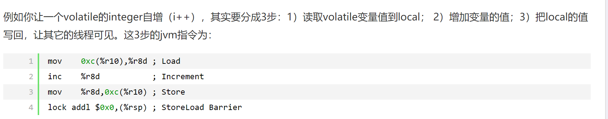


从Load到store到内存屏障，一共4步，其中最后一步jvm让这个最新的变量的值**在所有线程可见**，也就是最后一步让所有的CPU内核都获得了最新的值，但**中间的几步（从Load到Store）**是不安全的，中间如果其他的CPU修改了值将会丢失


```java
static volatile int x = 0;
        static ReentrantLock lock = new ReentrantLock();

        public static void main(String[] args) throws InterruptedException {
            Thread t1 = new Thread(() -> {
                for (int i = 0; i < 10000; i++) {
//                    lock.lock();
                    x++;
//                    lock.unlock();
                }
            });
            Thread t2 = new Thread(() -> {
                for (int i = 0; i < 10000; i++) {
//                    lock.lock();
                        x++;
//                    lock.unlock();
                }
            });

            t1.start();
            t2.start();
            while (t1.isAlive() || t2.isAlive()) {
            }
            System.out.println(x);//15936  14989
        }
```


这是一段线程不安全的singleton（单例模式）实现，尽管使用了volatile：

```java
public class wrongsingleton {
    private static volatile wrongsingleton _instance = null; 
 
    private wrongsingleton() {}
 
    public static wrongsingleton getInstance() {
        if (_instance == null) {
            _instance = new wrongsingleton();
        }
        return _instance;
    }
}
```


因为**volatile保证变量对线程的可见性，但不保证原子性**。


## 如何在两个线程之间共享数据


多线程通信——> **共享内存**

可见性、有序性、原子性

JMM解决了可见性和有序性的问题，锁解决了原子性的问题，**做到同步和互斥**


----

1. **将数据抽象成一个类，并将数据的操作作为这个类的方法，可以很容易做到同步，在方法上加 synchronized**

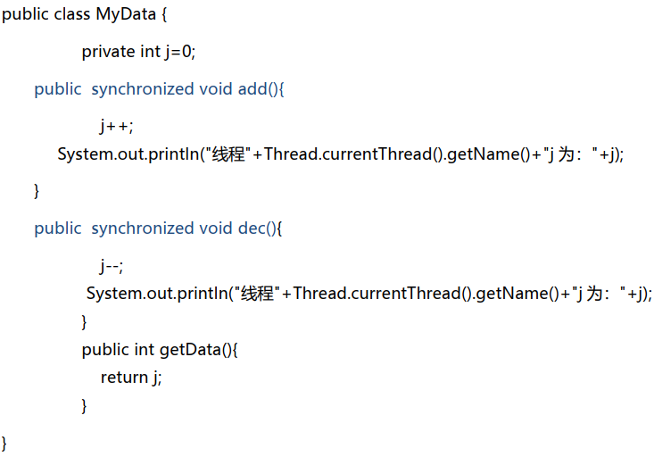

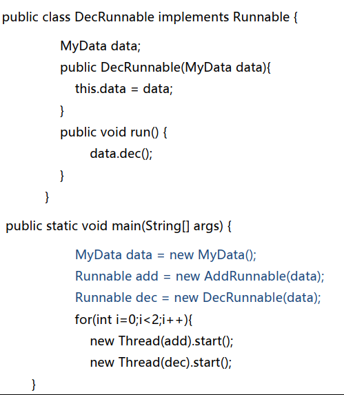


2. **Runnable对象作为一个类的内部类**，**共享数据**作为这个类的**成员变量**，每个线程对共享数据的操作方法也封装在外部类，以便实现对数据的各个操作的同步和互斥


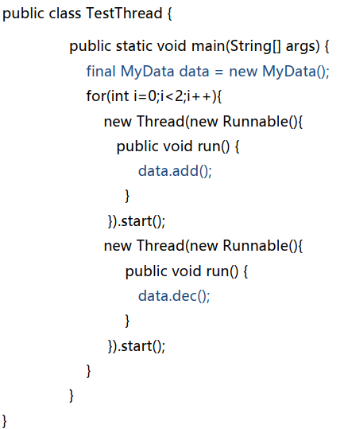


## ThreadLocal  线程本地存储


提供线程内的局部变量，**这种变量在线程的生命周期内起作用，减少同一个线程内多个函数或者组件之间一些公共变量的传递的复杂度**


***ThreadLocalMap （线程的一个属性）***

1. 每个线程都有一个自己的 ThreadLocalMap 类对象将**线程自己的对象**保持在其中，**各管各的**，线程可以正确访问到自己的对象
2. 一个**共有的 ThreadLocal 静态实例作为key**将不同对象的引用保存到不同线程的ThreadLocalMap中，在线程执行的各处通过这个静态的 ThreadLocal 实例的 get() 方法取得**自己线程保存的那个对象**，避免参数传递
3. ThreadLocalMap 其实就是线程里面的一个属性，它在 Thread 类中定义
   `ThreadLocal.ThreadLocalMap threadLocals = null;`  


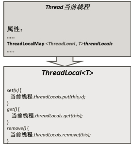


***使用场景***

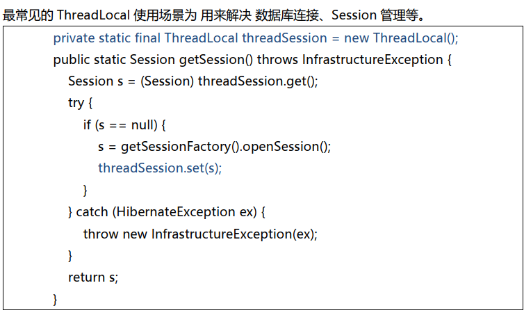


## Synchronized 和 ReentrantLock 区别


共同点：

1. 都是用来协调多线程对共享对象、变量的访问
2. 都是可重入锁，**同一线程可以多次获得同一个锁**
3. 保证可见性和互斥性


不同点：

1. ReentrantLock 显式的获得、释放锁，synchronized是隐式的
2. ReentrantLock **可响应中断、可轮回**，synchronized 不可以响应中断
3. ReentrantLock **是API级别的**，synchronized是 **JVM级别的**
4. ReentrantLock **可以实现公平锁**
5. ReentrantLock 通过 Condition 可以绑定多个条件
6. **底层实现不一样，synchronized是同步阻塞，悲观并发策略。ReentrantLock是同步非阻塞，乐观并发**
7. Lock是一个接口，synchronized是关键字，内置的语言实现
8. **synchronized发生异常时，自动释放线程占有的锁，不会导致死锁**。Lock如果不主动unlock() 释放锁，很可能导致死锁，**需要在finally块中释放锁**
9. **Lock可以让等待锁的线程响应中断**，而synchronized不行。synchronized等待的线程会**一直等待**，**不能响应中断**
10. 通过Lock可以知道是否成功获得锁，而synchronized就没法做到
11. Lock可以提高多个线程 **读操作的效率**，就是实现读写锁等


## ConcurrentHashMap


---

**减小锁粒度**

缩小锁定对象的范围，从而减小锁冲突的可能性，提高系统并发的能力。

减小锁粒度是一种削弱多线程锁竞争的有效手段，

对于hashmap最重要的两个方法是 get 和 set 方法。如果对 **整个HashMap加锁，可以得到线程安全的对象，但是加锁粒度太大**

**Segment的大小被称为 ConcurrentHashMap 的并发度**


----

ConcurrentHashMap 分段锁

ConcurrentHashMap 内部 **细分了若干个小的 HashMap**，成为分段 Segment。

**默认情况下一个 ConcurrentHashMap 被分为 16 个 Segment，就是锁的并发度**

如果需要在 ConcurrentHashMap 中添加一个新的映射，并不是将整个 HashMap加锁，而是首先根据 hashCode得到该key需要存放在哪个 Segment中，然后**对该段加锁，并完成put操作**。如果多个线程同时进行put操作，只要被加入的key不存放在一个Segment中，则 **线程间可以做到真正的并行**


---

**ConcurrentHashMap 是由 Segment数组结果 和 HashEntry 数组结构组成**


Segment继承了 ReentrantLock，是一种可重入锁，在 ConcurrentHashMap里扮演锁的角色，**HashEntry则用于存储键值对数据**

Segment的结构和HashMap类似，是一种数组和链表结构，一个Segment里包含一个HashEntry数组，每个HashEntry是一个链表结构的元素

**每个Segment守护一个HashEntry数组里的元素，当对HashEntry数组的数据进行修改时，必须首先获得它对应的Segment锁**

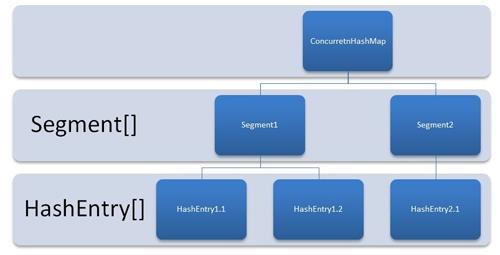


## Java中用到的线程调度


- 抢占式调度

每条线程执行的时间、线程的切换都由**系统控制**，可能每个线程执行相同的时间片，也可能某些较长、或者得不到，一个线程的阻塞不会


- 协同式调度

某个线程执行完后主动通知系统切换到另一线程执行，像接力一样，线程的执行时间由线程本身控制，线程切换可以预知，不存在多线程同步问题。

如果一个线程阻塞，那么整个系统可能崩溃

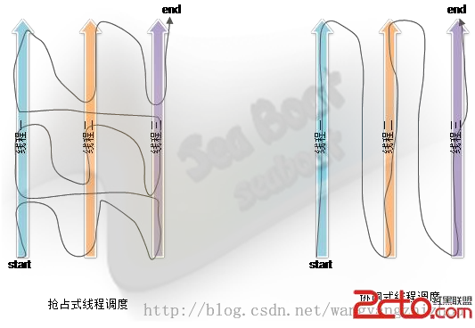


---

JVM的线程调度实现——**抢占式调度**

java使用的线程调度方式是  **抢占式调度**

按优先级分配CPU时间片运行，**且优先级越高越优先执行，但优先级高并不代表能肚子占用执行时间片**，可能只是得到的时间片较多，优先级低的也不会分配不到执行时间


---

线程让出CPU的情况

1. 当前运行线程主动放弃CPU，jvm暂时放弃CPU操作（时间片轮转调度的jvm不会让 **线程永久放弃CPU**，这里指的是**放弃本次时间片的执行权**），例如调用 yield() 方法
2. 当前线程进入阻塞状态，如IO阻塞
3. 当前线程运行结束，即运行完 run() 方法里面的任务


## 进程调度算法


- **作业调度**
- **进程调度**

---

**优先调度算法**


1. 先来先服务调度算法 FCFS

每次从后备作业队列中选择一个或多个最先进入该队列的作业，将它们调入内存，分配资源，创建进程，放入就绪队列，在**进程调度**时，从就绪队列中选择一个最先进入该队列的进程。

可以实现基本上的公平


2. 短作业 / 进程 优先调度 

**短作业优先 SJF  从后备队列中选择一个或多个估计运行时间最短的作业，调入内存运行**

**短进程优先 SPF 选出估计运行时间最短的进程，分配cpu，使它立即执行并一直执行到完成，或发生某事件被阻塞然后重新调度**

**并未照顾紧迫型作业**


---

**高优先权优先调度算法**

**照顾紧迫型作业**，优先处理：最高优先权优先 FPF调度算法


1. 非抢占式优先权算法

一旦将处理机分配给就绪队列中优先权最高的进程后，**一直执行下去，直至完成**。用于批处理系统，或者某些对实时性要求不严的实时系统中


2. **抢占式**优先权调度算法

**再起执行期间，只要又出现了另一个优先权更高的进程，进程调度程序就会立即停止当前进程（原本优先权最高的进程）的执行，重新将处理机分配给新到的优先权最高的进程**

可以更好的满足紧迫作业的要求，用于要求比较严格的实时系统中，以及性能较高的批处理和分时系统


3. **高响应比优先调度算法**

短作业优先很好用，但不足是：长作业的运行得不到保证。

**动态优先权**

**使作业的优先级随着等待时间的增加而以速率 a 提高**，则：长作业在等待一定时间后，**必然有机会分配到处理机**

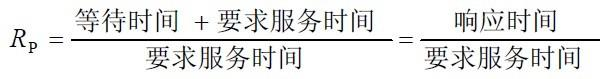


1. 如果作业的等待时间相同，那么 **要求的时间越短，优先权越高**。**该算法有利于短作业**
2. 要求得服务时间相同时，作业的优先权决定于 **其等待时间**，**等待时间越长，优先权越高**，实现的是  **先来先服务**

3. 对于长作业，作业的**优先级随着等待时间的增加而提高**，当 **某个长作业的等待时间足够长时，其优先级便可升到很高，从而也可以获得处理机**

该算法既照顾到了短作业，又考虑了作业到达的先后次序，不会使长作业长期得不到服务。


---

**基于时间片的轮转调度算法**


1. 时间片轮转法

将所有就绪进程按先来先服务的原则排成一个队列，**把CPU分配给队首进程，并令其执行一个时间片**。

执行的时间片用完时，由一个 **计时器发出始终中断请求，调度程序根据此信号来停止该进程的执行，并将它送往就绪队列的末尾；然后再把处理机分配给就绪队列中新的队首进程**，让它执行一个时间片。这样就可以保证就绪队列中的所有进程在一给定的时间内均能获得一时间片的处理机执行时间。  


2. 多级反馈队列调度算法  

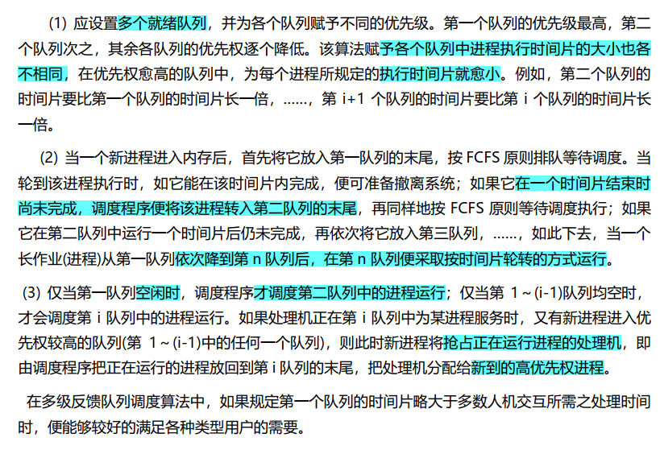


## CAS  


CAS（Compare And Swap/Set）比较并交换  

它包含 3 个参数CAS(V,E,N)。 V 表示要更新的变量(内存值)， E 表示预期值(旧的)， N 表示新值。当且仅当 V 值等于 E 值时，才会将 V 的值设为 N，   

**如果V值和E值不同，说明已经有其他线程做了更新，当前线程什么都不做。**

**乐观的太多进行（乐观锁）**，多个线程使用CAS操作一个变量时，**只有一个会胜出，并成功更新，其余均会失败。失败的线程不会被挂起，仅是被告知是啊比，并且允许再次尝试**


即使CAS没有锁，也可以发现其他线程对于当前线程的干扰


---

**原子包：java.util.concurrent.atomic  锁自旋**


getAndIncrement 采用了 CAS 操作  ，每次从内存中读取数据然后将此数据和+1 后的结果进行CAS 操作，如果成功就返回结果，否则重试直到成功为止。而 compareAndSet 利用 JNI 来完成CPU 指令的操作。  

```java
private volatile int value;


//  getAndIncrement方法调用 unsafe的getAndAddInt方法
public final int getAndAddInt(Object var1, long var2, int var4) {
    int var5;
    do {
        // 一直自旋获取最新的值并尝试CAS，失败就再获取最新的值
        var5 = this.getIntVolatile(var1, var2);
    } while(!this.compareAndSwapInt(var1, var2, var5, var5 + var4));

    return var5;
}
```

**总有一个线程能cas成功，其他线程在进行cas的时候发现现在的值和自己getIntVolatile时获取的不一样，然后cas失败，继续重复 do-while 进行cas操作，直到cas成功**

每次从内存中读取数据然后将此数据和+1 后的结果进行CAS 操作，如果成功就返回结果，否则重试直到成功为止。而 compareAndSet 利用 JNI 来完成CPU 指令的操作。  


---

ABA问题


在变量前面追加上**版本号或者时间戳**。jdk的atomic包里提供了一个类`AtomicStampedReference`类来解决ABA问题

**每次操作的版本号都会随之增加**，所以不会出现 ABA 问题，因为版本号只会增加不会减少  


## AQS  抽象队列同步器


AbstractQueuedSynchronizer 类如其名，抽象的队列式的同步器  

AQS 定义了一套**多线程访问共享资源的同步器框架**，许多同步类实现都依赖于它，如常用的   **ReentrantLock/Semaphore/CountDownLatch**  


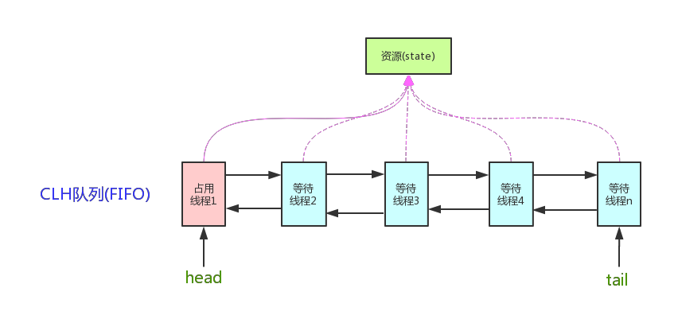


维护了一个 `volatile int state`，代表 **共享资源** 和一个  FIFO线程等待队列（多线程争用资源被阻塞时会进入次队列）。state的访问方式有三种：getState()，setState()，compareAndSetState()  


----

**AQS定义两种资源共享方式**


- **Exclusive 独占资源 ReentrantLock**

只有一个线程能执行，如 ReentrantLock

- **Share 共享资源 Semaphore/CountDownLatch**

共享，多个线程可共同执行


AQS只是一个框架，**具体资源的获取/释放方式交由自定义的同步器去实现，AQS只定义了一个接口。**

独 占模 式 下 只 用实现 tryAcquire - tryRelease ，而 共享 模 式 下 只用 实 现tryAcquireShared - tryReleaseShared  ，如果都定义成abstract，那么每个模式也要去实现另一模式下的接口。  

```java
//不是abstract的，根据需要选择性实现即可
protected int tryAcquireShared(int arg) {
    throw new UnsupportedOperationException();
}
```


不同的自定义同步器争用共享资源的方式也不同。自定义同步器在实现时只需要实现共享资源 state 的获取与释放方式即可，至于具体线程等待队列的维护（如获取资源失败入队/唤醒出队等）， AQS 已经在顶层实现好了。自定义同步器实现时主要实现以下几种方法  

1．isHeldExclusively()：该线程是否正在独占资源。只有用到 condition 才需要去实现它。

2．tryAcquire(int)：**独占方式**。尝试获取资源，成功则返回 true，失败则返回 false。

3.  tryRelease(int)：**独占方式**。尝试释放资源，成功则返回 true，失败则返回 false。

4． tryAcquireShared(int)：**共享方式**。尝试获取资源。负数表示失败； 0 表示成功，但没有剩余可用资源；正数表示成功，且有剩余资源。

5． tryReleaseShared(int)：**共享方式**。尝试释放资源，如果释放后允许唤醒后续等待结点返回true，否则返回 false。  


---

**同步器的实现是  ABS核心  state资源状态技术**

以ReentrantLock为例，state 初始化为0，表示未锁定装填。

A线程 lock() 时，调用 tryAcquire() 独占该锁并将state + 1.其他线程再 tryAcquire时就会失败，直到A线程unlock() 到 state=0（释放锁）位置，其他线程才有机会获取该锁。

**释放锁之前，A 线程自己是可以重复获取此锁的（state会累加），这就是可重入的概念。但要注意，获取多少次就要释放多少次，才能 保证 state 是能回到 零状态 的。**

```java
final boolean nonfairTryAcquire(int acquires) {
    final Thread current = Thread.currentThread();
    int c = getState();
    //如果锁没有被其他线程获取
    if (c == 0) {
        if (compareAndSetState(0, acquires)) {
            setExclusiveOwnerThread(current);
            return true;
        }
    }
    //如果是同一个线程反复获取锁，那么就累加state状态值
    else if (current == getExclusiveOwnerThread()) {
        int nextc = c + acquires;
        if (nextc < 0) // overflow
            throw new Error("Maximum lock count exceeded");
        setState(nextc);
        return true;
    }
    return false;
}
```


CountDownLatch，任务分为N个子线程去执行，state也初始化为N（N与线程数一致）。N个子线程是并行执行的，**每个子线程执行完后，countDown()一次，state会 CAS 减一**

```java
protected boolean tryReleaseShared(int releases) {
    // Decrement count; signal when transition to zero
    for (;;) {
        int c = getState();
        if (c == 0)
            return false;
        int nextc = c-1;
        if (compareAndSetState(c, nextc))
            return nextc == 0;
    }
}
```

等到所有子线程都执行完后(即 state=0)，会 unpark()主调用线程，然后主调用线程就会从 await()函数返回，继续后续动作  

```java
public final void acquireSharedInterruptibly(int arg)
        throws InterruptedException {
    if (Thread.interrupted())
        throw new InterruptedException();
    //尝试对状态减一，如果原本是0，则返回-1，表明此时已经达到了CountDownLatch的状态了，阻塞等待的线程返回。
    if (tryAcquireShared(arg) < 0)
        doAcquireSharedInterruptibly(arg);
}
```


ReentrantReadWriteLock 实现独占和共享两种方式
一般来说，自定义同步器要么是独占方法，要么是共享方式，他们也**只需实现 tryAcquiretryRelease、 tryAcquireShared-tryReleaseShared 中的一种即可**。 

但 AQS 也支持自定义同步器**同时实现独占和共享两种方式**，如 ReentrantReadWriteLock。  


