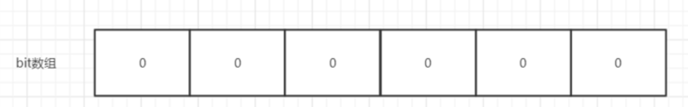
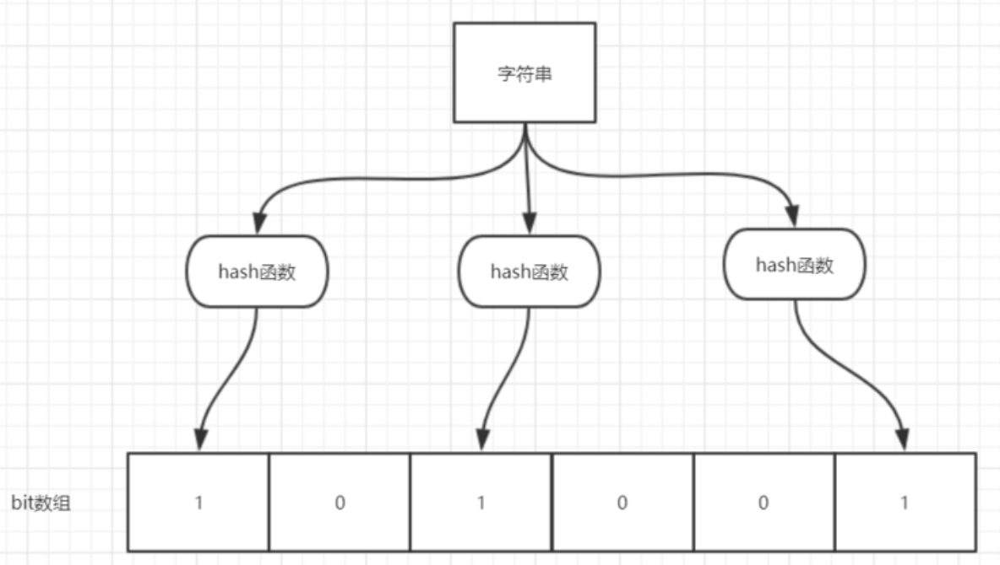
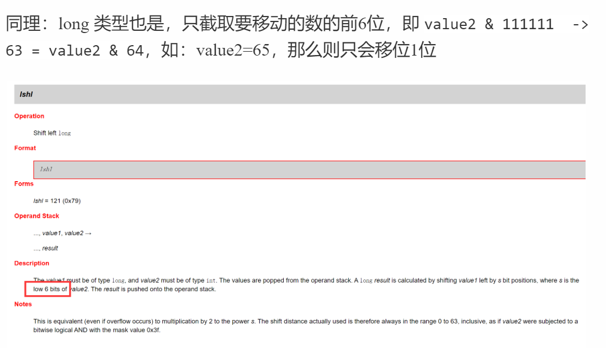
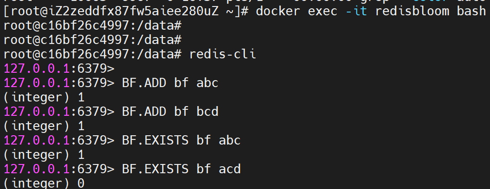

# 布隆过滤器

https://github.com/Snailclimb/JavaGuide/blob/master/docs/dataStructures-algorithms/data-structure/bloom-filter.md


布隆过滤器主要用于海量数据处理和缓存穿透这两个场景


## 什么是布隆过滤器


> **布隆过滤器是用来检索元素是否在给定大集合中的数据结构，高效并且性能优秀，缺点是具有一定的错误识别率和删除难度**


把它看作 **由二进制向量（位数组）和一系列随机映射函数（哈希函数）两部分组成的数据结构。**相比 List，Map，Set等数据结构，它占用空间更少并且效率更高。

缺点：返回的结果是**概率性的**，不是非常准确。理论情况：添加到集合中的元素越多，误报的可能性越大。

**并且存放在布隆过滤器的数据不容易删除（重复的hash值）**



位数组中每个元素都只占用 **1 bit**，并且每个元素只能是0/1,。这样申请一个100w个元素的位数组只占用`1 000 000Bit / 8 = 125000 Byte = 125000/1024kb ≈ 122kb` 的空间


## 布隆过滤器的原理


当一个元素**加入布隆过滤器**的时候，进行如下操作：

1. 使用布隆过滤器中的**哈希函数**对元素值进行计算，得到哈希值（**有几个哈希函数得到几个哈希值**）。
2. 根据得到的哈希值，在**位数组中把对应下标的值置为 1**。


当我们需要判断一个元素**是否存在于布隆过滤器**的时候，会进行如下操作：

1. 对给定元素再次进行相同的哈希计算；

2. 得到值之后判断位数组中的**每个元素是否都为 1**，如果值都为 1，那么说明这个值在布隆过滤器中。

   **如果存在一个值不为 1，说明该元素不在布隆过滤器中**。





如图所示，当字符串存储要加入到布隆过滤器中时，该字符串首先由多个哈希函数生成不同的哈希值，然后在对应的位数组的下表的元素设置为 1（当位数组初始化时 ，所有位置均为0）。当第二次存储相同字符串时，因为先前的对应位置已设置为 1，所以很容易知道此值已经存在（去重非常方便）。

如果我们需要判断某个字符串是否在布隆过滤器中时，只需要对给定字符串再次进行相同的哈希计算，得到值之后判断位数组中的每个元素是否都为 1，如果值都为 1，那么说明这个值在布隆过滤器中，如果存在一个值不为 1，说明该元素不在布隆过滤器中。

**不同的字符串可能哈希出来的位置相同，这种情况我们可以适当增加位数组大小或者调整我们的哈希函数。**


综上，我们可以得出：

- **布隆过滤器说某个元素存在，小概率会误判（不存在）。**

- **布隆过滤器说某个元素不在，那么这个元素一定不在。**

- 如果数据量足够大，所有的位都将被填满，那么不存在的数据都会被误判为存在，从而穿过过滤器！


## 布隆过滤器使用场景


1. 判断给定数据是否存在：比如判断一个数字是否存在于包含大量数字的数字集合中（集合很大，5亿+）、防止缓存穿透（判断请求的数据是否有效，避免请求绕过缓存直接打在db上）、邮箱的垃圾邮件过滤、黑名单功能

2. 去重：比如爬取给定网址的时候**对已经爬取过的 URL 去重**


## Java实现布隆过滤器


手动实现布隆过滤器：

1. 一个合适大小的位数组来保存数据
2. 几个不同的哈希函数
3. 添加元素到位数组（布隆过滤器）的方法实现
4. 判断给定元素是否存在于位数组（布隆过滤器）的方法实现


> java.util包中有个数据结构叫：BitSet
>
> ```java
> //初始化：传入的是布隆过滤器的位数
> private void initWords(int nbits) {
>     //用 long 数组来实现这个过滤器的位表示，long类型：64位bits 
>     //计算需要分割成多少个long来表示
>     words = new long[((nbits - 1) >> 6) + 1];
> }
> ```
>
> BitSet使用非常方便，免去了手动实现寻找数组下标以及位的操作~
>
> ```java
> public void set(int bitIndex) {
>     if (bitIndex < 0)
>         throw new IndexOutOfBoundsException("bitIndex < 0: " + bitIndex);
> 
>     int wordIndex = wordIndex(bitIndex);
>     expandTo(wordIndex);
> 	
>     //将long的这一位设置为1，
>     //这里bitIndex不用模64是因为对long类型做移位时会自动模64
>     words[wordIndex] |= (1L << bitIndex); // Restores invariants
> 
>     checkInvariants();
> }
> ```
>
> 


```java
import java.util.BitSet;

public class MyBloomFilter {

    /**
     * 位数组的大小
     * 33,554,432个 比特位
     */
    private static final int DEFAULT_SIZE = 2 << 24;
    /**
     * 通过这个数组可以创建 6 个不同的哈希函数
     */
    private static final int[] SEEDS = new int[]{3, 13, 46, 71, 91, 134};

    /**
     * 位数组。数组中的元素只能是 0 或者 1
     * 底层long数组的长度就是 524,288，使用空间：4096kb = 4mb，这么小的内存占用，却拥有 33,554,432 个比特位可以用来表示
     */
    private BitSet bits = new BitSet(DEFAULT_SIZE);

    /**
     * 存放包含 hash 函数的类的数组
     */
    private SimpleHash[] func = new SimpleHash[SEEDS.length];

    /**
     * 初始化多个包含 hash 函数的类的数组，每个类中的 hash 函数都不一样
     */
    public MyBloomFilter() {
        // 初始化多个不同的 Hash 函数
        for (int i = 0; i < SEEDS.length; i++) {
            func[i] = new SimpleHash(DEFAULT_SIZE, SEEDS[i]);
        }
    }

    /**
     * 添加元素到位数组
     * 使用 BitSet 的函数set来设置布隆过滤器中的指定位
     */
    public void add(Object value) {
        for (SimpleHash f : func) {
            bits.set(f.hash(value), true);
        }
    }

    /**
     * 判断指定元素是否存在于位数组
     * 利用 BitSet 的函数get来判断，并且要保证每个哈希函数的结果都在bitSet中
     */
    public boolean contains(Object value) {
        boolean ret = true;
        for (SimpleHash f : func) {
            ret = ret && bits.get(f.hash(value));
        }
        return ret;
    }

    /**
     * 静态内部类。用于 hash 操作！
     */
    public static class SimpleHash {

        private int cap;
        private int seed;

        public SimpleHash(int cap, int seed) {
            this.cap = cap;
            this.seed = seed;
        }

        /**
         * 计算 hash 值
         * 如果hash值大于设置的位长度，导致寻找long数组下标时越界，那么会自动扩容~
         */
        public int hash(Object value) {
            int h;
            return (value == null) ? 0 : Math.abs(seed * (cap - 1) & ((h = value.hashCode()) ^ (h >>> 16)));
        }

    }
}
```


## 利用Google开源的 Guava中自带的布隆过滤器


Guava 中布隆过滤器的实现算是比较权威的，所以实际项目中我们不需要手动实现一个布隆过滤器。

引入依赖：

```xml
<dependency>
     <groupId>com.google.guava</groupId>
     <artifactId>guava</artifactId>
     <version>28.0-jre</version>
</dependency>
```


创建了一个最多存放 最多 1500个整数的布隆过滤器，并且我们可以容忍误判的概率为百分之（0.01）


```java
// 创建布隆过滤器对象
BloomFilter<Integer> filter = BloomFilter.create(
    Funnels.integerFunnel(),
    1500,
    0.01);

// 判断指定元素是否存在
System.out.println(filter.mightContain(1));
System.out.println(filter.mightContain(2));

// 将元素添加进布隆过滤器
filter.put(1);
filter.put(2);
System.out.println(filter.mightContain(1));
System.out.println(filter.mightContain(2));
```


当`mightContain（）` 方法返回*true*时，我们可以99％确定该元素在过滤器中，当过滤器返回*false*时，我们可以100％确定该元素不存在于过滤器中。

**Guava 提供的布隆过滤器的实现还是很不错的（想要详细了解的可以看一下它的源码实现），但是它有一个重大的缺陷就是只能单机使用（另外，容量扩展也不容易），而现在互联网一般都是分布式的场景。**

**为了解决这个问题，我们就需要用到 Redis 中的布隆过滤器了。**


## Redis 中的布隆过滤器


Java client libraries for redis-modules https://github.com/dengliming/redis-modules-java


Redis v4.0 之后有了 Module（模块/插件） 功能，Redis Modules 让 Redis 可以使用外部模块扩展其功能 。布隆过滤器就是其中的 Module。详情可以查看 Redis 官方对 Redis Modules 的介绍 ：https://redis.io/modules

另外，官网推荐了一个 RedisBloom 作为 Redis 布隆过滤器的 Module,地址：https://github.com/RedisBloom/RedisBloom. 其他还有：

- redis-lua-scaling-bloom-filter （lua 脚本实现）：https://github.com/erikdubbelboer/redis-lua-scaling-bloom-filter
- pyreBloom（Python中的快速Redis 布隆过滤器） ：https://github.com/seomoz/pyreBloom
- ......

RedisBloom 提供了多种语言的客户端支持，包括：Python、Java、JavaScript 和 PHP。


---

**使用 Docker 安装**


搜索**docker redis bloomfilter** 然后在排除广告的第一条搜素结果就找到了我们想要的答案（这是我平常解决问题的一种方式，分享一下），具体地址：https://hub.docker.com/r/redislabs/rebloom/ （介绍的很详细 ）。

```bash
docker pull redislabs/rebloom
docker run -p 6379:6379 --name redis-redisbloom redislabs/rebloom:latest

docker exec -it redis-redisbloom bash #在另一个客户端打开

redis-cli
127.0.0.1:6379> 
```


---

**rebloom 常用命令**


> 注意： **key:布隆过滤器的名称**，**item : 添加的元素**。

1. **`BF.ADD `**：将元素添加到布隆过滤器中，如果该过滤器尚不存在，则创建该过滤器。格式：`BF.ADD {key} {item}`。
2. **`BF.MADD `**: 将一个或多个元素添加到“布隆过滤器”中，并创建一个尚不存在的过滤器。该命令的操作方式`BF.ADD`与之相同，只不过它允许多个输入并返回多个值。格式：`BF.MADD {key} {item} [item ...]` 。
3. **`BF.EXISTS` ** : 确定元素是否在布隆过滤器中存在。格式：`BF.EXISTS {key} {item}`。
4. **`BF.MEXISTS`** ： 确定一个或者多个元素是否在布隆过滤器中存在格式：`BF.MEXISTS {key} {item} [item ...]`。

另外，`BF.RESERVE` 命令需要单独介绍一下：

这个命令的格式如下：

`BF.RESERVE {key} {error_rate} {capacity} [EXPANSION expansion] `。

下面简单介绍一下每个参数的具体含义：

1. key：布隆过滤器的名称
2. error_rate :误报的期望概率。这应该是介于0到1之间的十进制值。例如，对于期望的误报率0.1％（1000中为1），error_rate应该设置为0.001。该数字越接近零，则每个项目的内存消耗越大，并且每个操作的CPU使用率越高。
3. capacity: 过滤器的容量。当实际存储的元素个数超过这个值之后，性能将开始下降。实际的降级将取决于超出限制的程度。随着过滤器元素数量呈指数增长，性能将线性下降。

可选参数：

- expansion：如果创建了一个新的子过滤器，则其大小将是当前过滤器的大小乘以`expansion`。默认扩展值为2。这意味着每个后续子过滤器将是前一个子过滤器的两倍。




