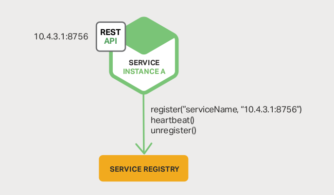
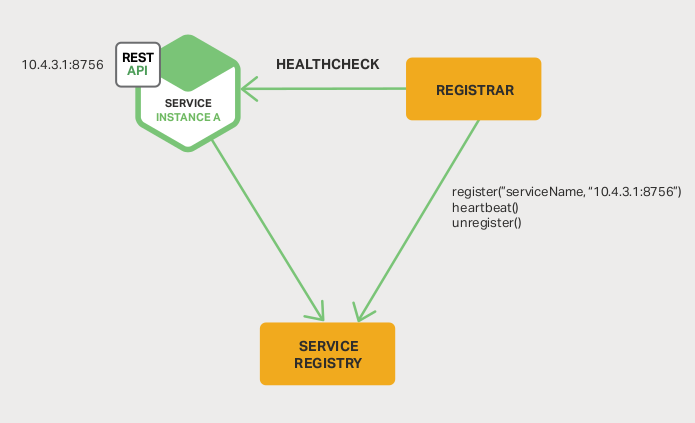
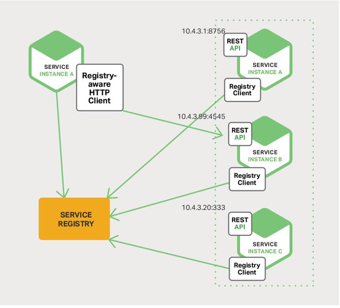
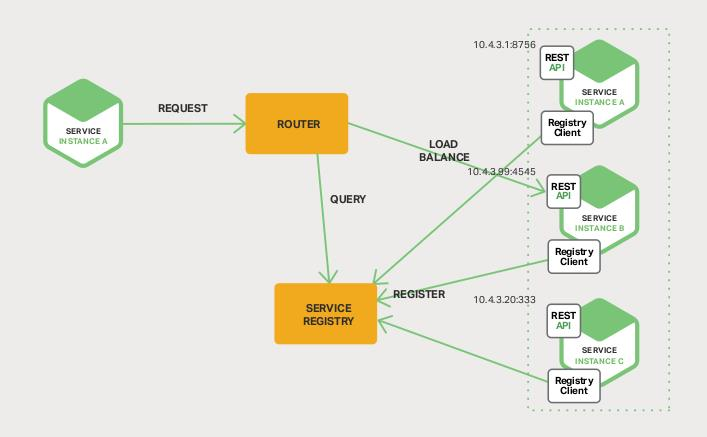
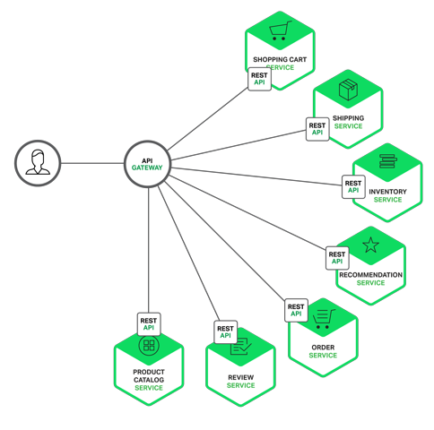
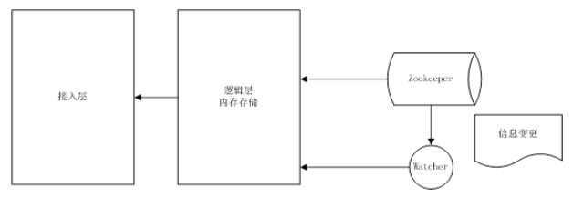
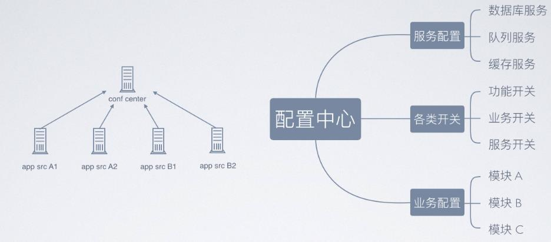
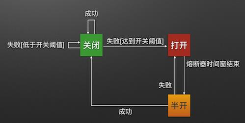

# 服务注册发现

服务注册就是**维护一个登记簿**，管理系统内所有的服务地址。

rovider 地址就行了。当下用于服务注册的工具非常多 ZooKeeper， Consul， Etcd, 还有 Netflix 的 eureka等。 

服务注册有两种形式：**客户端注册和第三方注册**。  

## 客户端注册（Zookeeper）

客户端注册：服务**自身要负责注册与注销的工作**

服务启动后向注册中心注册自身，当服务下线时注销自己。期间还需要和注册中心保持心跳，心跳不一定要客户端来做，也可以由注册中心老负责（**探活**）。

缺点是：**注册工作和服务耦合在一起（需要在服务中实现注册到Zookeeper的逻辑）**，不同语言都要实现一套注册逻辑

## 第三方注册  (独立的服务)

第三方注册由一个**独立的服务 Registrar 负责注册与注销。**

服务启动后 以某种方式**通知 Registrar**，然后 **Registrar 负责向注册中心发起注册工作**。同时注册中心（服务 Registrar）要维护与服务之间的心跳，服务不可用时，要**向注册中心注销服务**

这种方式的缺点是 Registrar 必须是一个高可用的系统，否则注册工作没法进展。  

> 由原本的服务自己来注册和注销变成：第三方服务来代办

## 客户端发现

客户端负责查询可用服务地址，以及负载均衡的工作。一旦发现某个服务不可用立即更换另外一个，非常直接。

缺点也在于多语言时的**重复工作**，每个语言实现相同的逻辑  

## 服务端发现

服务端发现需要**额外的 Router 服务**，请求先打到 Router，然后 **Router 负责查询服务与负载均衡**。
这种方式虽然没有客户端发现的缺点，但是它的缺点是**保证 Router 的高可用**。  

## 几种服务注册中心组件

Consul、Eureka、SmartStack、Etcd

SpringCloud-Alibaba Nacos

# API 网关

API GateWay 是一个服务器，**也可以说是进入系统的唯一节点、入口**

这跟面向对象设计模式中的 Facade 模式很像  

API Gateway **封装内部系统**的架构，并且**提供 API 给各个客户端**。它还可能有其他功能，如**授权、监控、负载均衡、缓存、请求分片和管理、静态响应处理**等  

**API Gateway 负责请求转发、合成和协议转换**

所有来自客户端的请求都要先经过 API Gateway，然后**路由这些请求到对应的微服务**。

API Gateway 将经常通过 **调用 多个微服务来处理一个请求以及聚合多个服务的结果**。

它可以在 web 协议与内部使用的 非 web 友好型**协议间进行转换**，如 Http、WebSocket协议

---

- 请求转发

服务转发主要是对客户端的请求按照微服务的负载**转发到不同的服务上**

- 响应合并

把业务上需要调用**多个服务接口**才能完成的工作**合并成一次调用**对外统一提供服务 

- 协议转换

重点是支持 SOAP， JMS， Rest 间的协议转换 

- 数据转换

XML和json之间的报文格式转换

- 安全认证
  1. 基于 Token 的**客户端访问控制和安全策略**
  2. 传输数据和报文**加密**，到服务端解密，需要在客户端有独立的 SDK 代理包
  3. 基于 Https 的传输加密，客户端和服务端数字证书支持
  4. 基于 OAuth2.0 的**服务安全认证**(授权码，客户端，密码模式等）  

# 配置中心

用作系统的参数配置，需要满足一下几个要求：高效获取、实时感知、分布式访问

---

- Zookeeper 配置中心

实现的架构图如下所示，采取**数据加载到内存**方式**解决高效获取的问题**，借助 zookeeper 的**节点监听机制**来实现**实时感知**。  

- 配置中心数据分类：各种服务、业务的数据分类保存

# 事件调度

每个微服务之间需要互相调用服务。这时候如果使用同步等待，将会非常耗时，可能不同的微服务在不同的地区、服务器上。

需要使用到消息队列！来进行服务调度的**解耦、异步**。

Kafka、RocketMQ、RabbitMQ.....

# 服务跟踪

微服务的数量不断增长，可能会跟踪一个请求从一个微服务到下一个微服务的传播过程，**SpringCloud Sleuth 正好解决了这个问题，它在日志中引入唯一 ID，以保证微服务调用之间的一致性，这样就就能跟踪某个请求是如何从一个微服务传递到下一个** 

1. 为了实现请求跟踪，当请求发送到分布式系统的入口端点时，只需要服务**跟踪框架**为**<该请求>**创建一个**唯一的跟踪标识**，同时在分布式系统内部流转的时候，框架始终保持传递该唯一标识，直到返回给请求方为止，**这个唯一标识就是 *Trace ID***。

   通过Trace ID 的记录，我们就能**将所有请求过程日志关联起来**  

2. 统计各处理单元的**时间延迟**，当请求达到各个服务组件时，或是处理逻辑到达某个状态时，也通过一个**唯一标识来标记它的开始、具体过程以及结束**，该标识就是 ***Span ID***。

   对于**每个 Span** 来说，它必须有**开始和结束两个节点**，通过记录开始 Span 和结束 Span 的**时间戳**，就能统计出该 Span 的**时间延迟**，除了时间戳记录之外，它还可以包含一些其他元数据，比如：事件名称、请求信息等。  

3. 在 Spring Boot 应用中，通过在工程中引入 `spring-cloud-starter-sleuth` 依赖之后， 它会自动的**为当前应用构建起各通信通道的跟踪机制**，比如：  
   - 通过诸如 RabbitMQ、 Kafka（或者其他任何 Spring Cloud Stream 绑定器实现的**消息中间件**）**传递的请求**。
   - 通过 Zuul网关 代理传递的请求。
   - 通过 RestTemplate 发起的请求。  

# 服务熔断（Hystrix ）

微服务架构中有多个服务层调用，基础服务的故障可能会导致**级联故障**，进而造成**整个系统不可用的情况**——> 服务雪崩效应。服务雪崩效应是一种因
“服务消费者”的不可用，并**将不可用逐渐放大**的过程

熔断器的原理很简单，如同电力过载保护器。它可以实现**快速失败**，在一段时间内侦测到许多类似的错误，**会强迫其以后的多个调用快速失败，不再访问远程服务器，从而防止应用程序不断地尝试执行可能会失败的操作**，使得应用程序继续执行而**不用等待修正错误**，或者浪费 CPU 时间去等到长时间的超时产生。

---

- Hystrix 断路器机制

断路器很好理解，当 Hystrix Command 请求后端服务失败数量超过一定比例（默认 50%），断路器会切换到开路状态（Open），**这时所有请求会直接失败而不会发送到后端服务**

断路器保持在开路状态一段时间后（默认 5 s），自动切换到半开路装填（HALF-OPEN），会判断下一次请求的返回情况。如果请求成功？断路器切回闭路状态（CLOSED），否则重新切换到开路状态（OPEN）

Hystrix 的断路器就像我们**家庭电路中的保险丝**, 一旦后端服务不可用, 断路器会**直接切断请求链, 避免发送大量无效请求影响系统吞吐量**, 并且断路器有***自我检测并恢复***  的能力。  

