# Java线程池——美团技术团队


## 线程池是什么？


Thread Pool，基于**<池化思想 管理线程> 的工具**

线程过多会带来**额外开销：创建销毁线程、调度线程**，会降低计算机的整体性能。

线程池维护多个线程，等待监督管理者分配<可并发执行的任务>（如果有先后顺序，可以使用 `CompletableFuture`进行**异步编排**）。

一方面避免了创建销毁线程的代价，另一方面避免了***线程数量膨胀导致的过分调度问题，对内核充分利用***

这里主要描述的线程池是 JDK 提供的 `ThreadPoolExecutor` 类

使用线程池的好处：

- **降低资源消耗**：重复利用已创建的线程
- **提高响应速度**：无需等待线程创建
- **提高线程的可管理性**：线程是稀缺资源，无限制创建会消耗系统资源，并且导致资源调度失衡。使用线程池可以进行**统一的分配、调优和监控**
- **提供更多更强大的功能**：可拓展性：延时定时线程池：ScheduledThreadPoolExecutor允许任务延期执行或定期执行


## 线程池解决了什么问题


**资源管理问题**

大并发环境下：系统不能确定在任意时刻中，有多少任务需要执行，多少资源需要投入，带来诸多问题：

1. 频繁申请 / 销毁资源和调度资源，将带来额外的消耗
2. 对 **资源无线申请** 缺少抑制手段，会引发系统资源耗尽
3. 无法合理**管理内部的资源分布**（独立的多个线程无法更好的管理），降低系统稳定性


池化(Pooling)思想：**为了最大化收益并最小化风险，将资源统一在一起管理的一种思想**


1.	内存池 (Memory Pooling)：预先申请**内存**，提升申请内存速度，减少内存碎片。
2.	连接池 (Connection Pooling)：预先申请数据库连接，提升**申请连接的速度**，降低系统的开销。
3.	实例池 (Object Pooling)：循环使用对象，减少资源在初始化和释放时的昂贵损耗。  


# 线程池设计与实现


## 总体设计


线程池核心实现类是 ThreadPoolExecutor

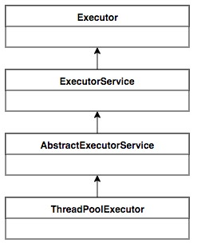

- 顶层接口是 `Executor`，顶层接口提供了一种思想：**将任务提交和任务执行进行解耦**。用户无需关注如何创建线程，如何调度线程来执行任务，只需要提供 `Runnable` 对象（**任务的运行逻辑**），提交到执行器`Executor`中，Executor 来完成线程的调配和任务的执行部分

- `ExecutorService` 接口增加了一些能力：1. 扩充执行任务的能力，补充可以为一个或一批异步任务**生成`Future`的方法 submit() **；2. 提供了管控线程池的方法，如停止线程池的运行（shutdown()）

- `AbstractExecutorService` 是上层的抽象类，将执行任务的流程串连起来，保证下层的实现只需要关注一个助兴任务的方法
- `ThreadPoolExecutor` 实现最复杂的运行部分，会一方面维护自身的生命周期，另一方面**同时管理线程和任务**，


运行流程：

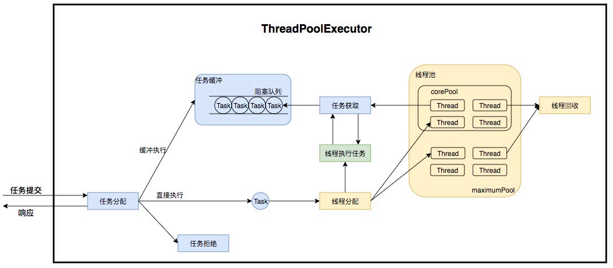


内部构建了一个 **生产者消费者模型**，将线程和任务解耦，并不直接关联，**良好的缓冲任务，复用线程**


线程池运行分成两部分

- **任务管理**：充当**生产者**的角色，任务提交后，线程池会判断该任务后续的流转
  - 直接申请线程**执行**该任务
  - **缓冲**到队列等待线程执行
  - **拒绝**该任务

- **线程管理**：**消费者**，被统一维护在线程池内，根据任务请求进行线程的分配，线程执行完任务后继续获取新的任务去执行，没任务时回收线程。


## 生命周期管理


线程池内部使用一个变量维护两个值，**运行状态 runState 和 线程数量 workerCount**

线程池将运行状态 (runState)、线程数量 (workerCount) 两个关键参数的维护放在了一起  

```java
private final AtomicInteger ctl = new AtomicInteger(ctlOf(RUNNING, 0));
```

`ctl` 这个 `AtomicInteger` 类型，是对线程池的运行状态和线程池中有效线程的数量进行控制的一个字段， 它同时包含两部分的信息：线程池的运行状态 (`runState`) 和线程池内有效线程的数量 (`workerCount`)，高 3 位保存 `runState`，低 29 位保存 `workerCount`，**两个变量之间互不干扰**。

用**一个变量去存储两个值，可避免在做相关决策时，出现不一致的情况**，不必为了维护两者的一致，而占用**锁资源**。

通过阅读线程池源代码也可以发现，经常出现要**同时判断线程池运行状态和线程数量的情况**。线程池也提供了若干方法去供用户获得线程池当前的运行状态、线程个数。这里都使用的是**位运算**的方式，相比于基本运算，速度也会快很多。  


```java
private final AtomicInteger ctl = new AtomicInteger(ctlOf(RUNNING, 0));  //二进制的30~32位是状态位，1~29位是表示线程数
private static final int COUNT_BITS = Integer.SIZE - 3; // 29
private static final int CAPACITY   = (1 << COUNT_BITS) - 1; // 用来计算的，0001111...1111


// runState is stored in the high-order bits
private static final int RUNNING    = -1 << COUNT_BITS;  // 1110000...000
private static final int SHUTDOWN   =  0 << COUNT_BITS;
private static final int STOP       =  1 << COUNT_BITS;
private static final int TIDYING    =  2 << COUNT_BITS;
private static final int TERMINATED =  3 << COUNT_BITS;


// Packing and unpacking ctl
private static int runStateOf(int c)     { return c & ~CAPACITY; }  // 计算当前运行状态
private static int workerCountOf(int c)  { return c & CAPACITY; }  //计算当前线程数量
private static int ctlOf(int rs, int wc) { return rs | wc; }  // 通过状态和线程数生成 ctl
```


ThreadPoolExecutor 的运行状态有五种：

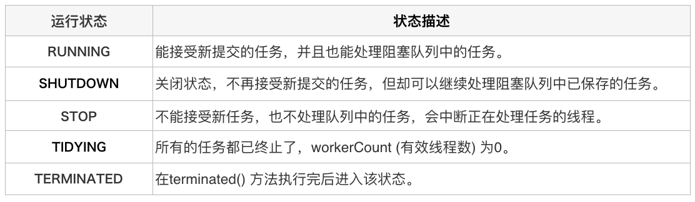


线程池生命周期：

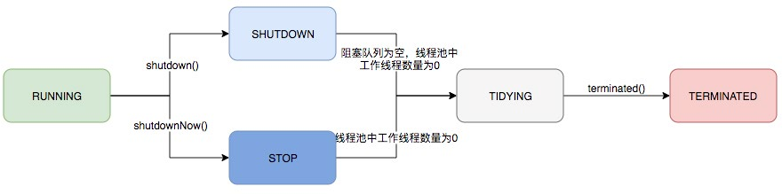


## 任务执行机制


### 任务调度


用户调度是线程池的主要入口，用户**提交了一个任务**，接下来该如何执行这个任务。

所有任务的调度又是由execute()方法完成的，**检查现在线程池的运行状态、运行线程数、运行策略，决定接下来执行的流程，是直接申请线程执行，或是缓冲到队列中执行，或是直接拒绝该任务。**

1. 首先检测线程池运行状态，如果不是RUNNING，则直接拒绝，**线程池要保证在RUNNING 的状态下 执行任务**
2. 如果 workerCount < corePoolSize，**直接创建并启动一个线程来执行新提交的任务**
3. 如果 workerCount >= corePoolSize，且线程池内的**阻塞队列未满**，则将任务添加到该阻塞队列中
4. 如果 `workerCount >= corePoolSize && workerCount < maximumPoolSize`，且线程池内的阻塞队列已满，**创建并启动**一个线程来执行新提交的任务
5. 如果 workerCount >= maximumPoolSize，并且线程池内的阻塞队列已满，**根据拒绝策略来处理该任务**，默认直接抛异常


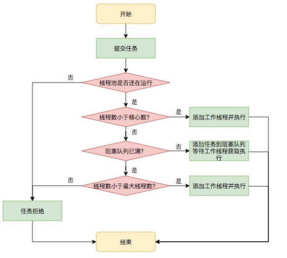


### 任务执行流程


1. 调用 ThreadPoolExecutor 线程池实例的 execute()  方法，传入一个Runnable任务
2. 判断工作线程的数量是否大于corePoolSize？
   - 小于：创建一个新的核心线程，并赋给它初始化任务 `addWorker(command, true)`
   - 大于等于：
     - 加入阻塞队列，**重复检查当前的线程数是否为0**，若为0（那么阻塞队列中的任务无法执行），则需要创建一个线程 `addWorker(null, false)`，**保证阻塞队列中的任务可以被执行**
     - 阻塞队列满了：尝试：`addWorker(null, false)` ，检查当前线程数是否大于 maximumPoolSize，大于：返回false；小于：创建一个新的非核心线程  `w = new Worker(firstTask);`，并将当前这个超出队列的任务赋给这个创建的新worker工作线程作为**初始化任务**。

```java
public void execute(Runnable command) {
    if (command == null)
        throw new NullPointerException();
    /*
     * Proceed in 3 steps:
     *
     * 1. If fewer than corePoolSize threads are running, try to
     * start a new thread with the given command as its first
     * task.  The call to addWorker atomically checks runState and
     * workerCount, and so prevents false alarms that would add
     * threads when it shouldn't, by returning false.
     *
     * 2. If a task can be successfully queued, then we still need
     * to double-check whether we should have added a thread
     * (because existing ones died since last checking) or that
     * the pool shut down since entry into this method. So we
     * recheck state and if necessary roll back the enqueuing if
     * stopped, or start a new thread if there are none.
     *
     * 3. If we cannot queue task, then we try to add a new
     * thread.  If it fails, we know we are shut down or saturated
     * and so reject the task.
     */
    int c = ctl.get();
    if (workerCountOf(c) < corePoolSize) {
        if (addWorker(command, true))
            return;
        c = ctl.get();
    }
    if (isRunning(c) && workQueue.offer(command)) {
        int recheck = ctl.get();
        if (! isRunning(recheck) && remove(command))
            reject(command);
        else if (workerCountOf(recheck) == 0)
            addWorker(null, false);
    }
    else if (!addWorker(command, false))
        reject(command);
}
```


3. 创建完毕worker工作线程后，获得worker中的线程属性： `final Thread t = w.thread;`，并执行worker这个任务。
4. Worker实现了 Runnable这个接口，故执行 run() 方法 `runWorker(this);`
5. 如果worker中的有初始任务对象  /  从阻塞队列中可以获得任务，那么就执行。否则结束当前这个worker

```java
final void runWorker(Worker w) {
        Thread wt = Thread.currentThread();
        Runnable task = w.firstTask;
        w.firstTask = null;
        w.unlock(); // allow interrupts
        boolean completedAbruptly = true;
        try {
            while (task != null || (task = getTask()) != null) {
                w.lock();
                // If pool is stopping, ensure thread is interrupted;
                // if not, ensure thread is not interrupted.  This
                // requires a recheck in second case to deal with
                // shutdownNow race while clearing interrupt
                if ((runStateAtLeast(ctl.get(), STOP) ||
                     (Thread.interrupted() &&
                      runStateAtLeast(ctl.get(), STOP))) &&
                    !wt.isInterrupted())
                    wt.interrupt();
                try {
                    beforeExecute(wt, task);
                    Throwable thrown = null;
                    try {
                        task.run();
                    } catch (RuntimeException x) {
                        thrown = x; throw x;
                    } catch (Error x) {
                        thrown = x; throw x;
                    } catch (Throwable x) {
                        thrown = x; throw new Error(x);
                    } finally {
                        afterExecute(task, thrown);
                    }
                } finally {
                    task = null;
                    w.completedTasks++;
                    w.unlock();
                }
            }
            completedAbruptly = false;
        } finally {
            processWorkerExit(w, completedAbruptly);
        }
    }
```

6. 当一个线程无事可做，超过一定的时间（keepAliveTime）时，线程池会判断，如果当前运行的线程数大于 corePoolSize，那么这个线程就被停掉。所以线程池的所有任务完成后，它最终会收缩到 corePoolSize 的大小（没有设定  allowCoreThreadTimeOut=true的情况下，若设定了为true，那么core线程也会被回收）。  

   `getTask()` 方法中限时从阻塞队列中  获取任务：

   ```java
   Runnable r = timed ?
       workQueue.poll(keepAliveTime, TimeUnit.NANOSECONDS) :
       workQueue.take();
   ```

7. 结束worker

```java
private void processWorkerExit(Worker w, boolean completedAbruptly) {
        if (completedAbruptly) // If abrupt, then workerCount wasn't adjusted
            decrementWorkerCount();

        final ReentrantLock mainLock = this.mainLock;
        mainLock.lock();
        try {
            completedTaskCount += w.completedTasks;
            // 将 worker 从维护所有workers的引用的哈希表中删除，worker就会被jvm当做垃圾回收掉
            workers.remove(w);
        } finally {
            mainLock.unlock();
        }

        tryTerminate();

        int c = ctl.get();
        if (runStateLessThan(c, STOP)) {
            if (!completedAbruptly) {
                // 是否设置了核心线程会超时？如果没设置，那么需要
                int min = allowCoreThreadTimeOut ? 0 : corePoolSize;
                //如果任务阻塞队列不为空，需要保证至少有一个worker才可以执行任务
                if (min == 0 && ! workQueue.isEmpty())
                    min = 1;
                //当前线程 >= min，直接退出即可，否则就创建一个worker线程
                if (workerCountOf(c) >= min)
                    return; // replacement not needed
            }
            addWorker(null, false);
        }
    }
```


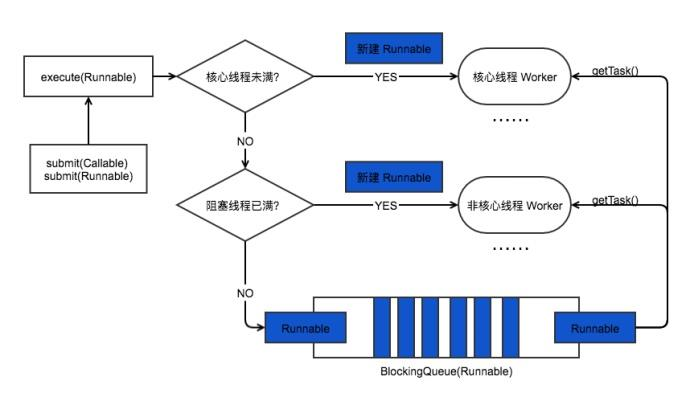


### 任务缓冲


将任务和线程解耦，不让两者直接关联，才可以做后续的分配工作

线程池中是以生产者消费者模式，通过一个阻塞队列来实现。阻塞队列缓存任务，工作线程从阻塞队列中获取任务。

阻塞队列 BlockingQueue，支持两个附加操作的队列：

1. 队列为空时，**获取元素**的线程等待队列变为非空
2. 队列满时，**存储元素**的线程等待队列可用


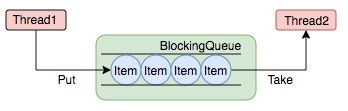


**不同的队列可以实现不同的任务存取策略**


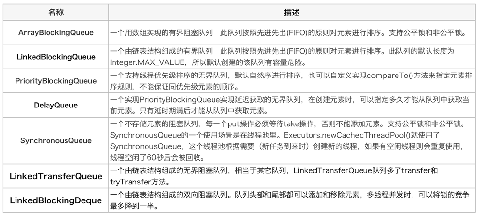


### 任务申请


有一种情况是线程从任务队列中获取任务然后执行，执行完任务的空闲线程会再次去从队列中申请任务再去执行。

线程需要从任务缓存模块中不断取任务执行，帮助worker线程从阻塞队列中获取任务，**实现线程管理模块和任务管理模块之间的通信**。这部分策略由 getTask() 方法实现：


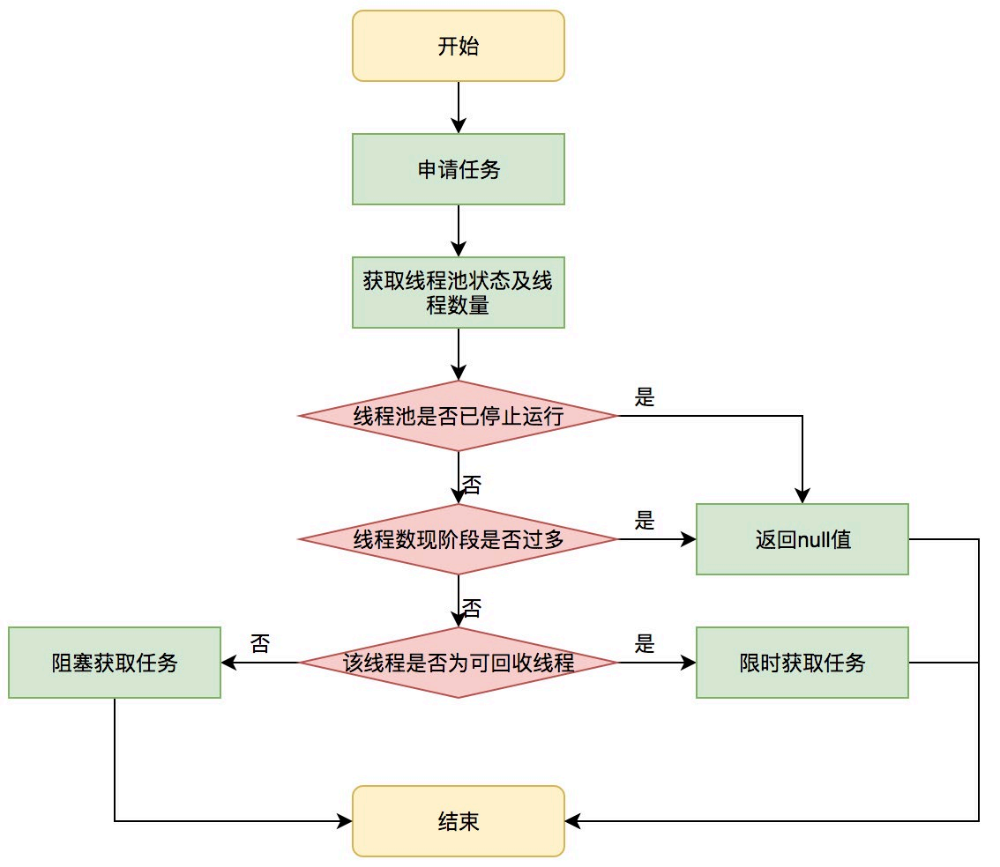


这里需要控制线程的数量，使其符合线程池的状态，如果线程池现在不应该持有那么多线程，则会返回null值。工作线程 Worker 会不断接收新任务去执行，而当工作线程 Worker **接收不到任务的时候，就会开始被回收**


### 任务拒绝


<任务拒绝模块>是线程池的**保护部分**，线程池有一个最大的容量，当线程池的任务缓存队列已满，并且线程池中的线程数目达到 maximumPoolSize时，就需要**拒绝掉该任务**，采取**任务拒绝策略**，保护线程池

拒绝策略是一个接口，其设计如下：

```java
public interface RejectedExecutionHandler {
	void rejectedExecution(Runnable r, ThreadPoolExecutor executor);
}  
```

用户可以通过实现这个接口去定制拒绝策略，也可以选择 JDK 提供的四种已有拒绝策略:

  

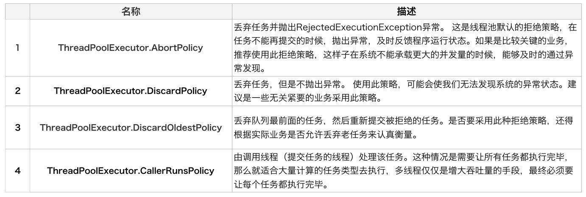


这些内置的拒绝策略都实现了  `RejectedExecutionHandler` 接口，实现 `rejectedExecution` 方法，使得我们可以自己实现**个性化的拒绝策略**

```java
public static class AbortPolicy implements RejectedExecutionHandler {
    /**
     * Creates an {@code AbortPolicy}.
     */
    public AbortPolicy() { }

    /**
     * Always throws RejectedExecutionException.
     *
     * @param r the runnable task requested to be executed
     * @param e the executor attempting to execute this task
     * @throws RejectedExecutionException always
     */
    public void rejectedExecution(Runnable r, ThreadPoolExecutor e) {
        throw new RejectedExecutionException("Task " + r.toString() +
                                             " rejected from " +
                                             e.toString());
    }
}
```


## Worker线程管理


### Worker线程


线程池为了掌握线程的状态并且维护线程的生命周期，设计了线程池内的工作线程 Worker

```java
private final class Worker extends AbstractQueuedSynchronizer 
implements Runnable{
    final Thread thread;// Worker 持有的线程
    Runnable firstTask;// 初始化的任务，可以为 null
}

Worker(Runnable firstTask) {
    setState(-1); // inhibit interrupts until runWorker
    this.firstTask = firstTask;
    this.thread = getThreadFactory().newThread(this);
}
```

Worker 这个工作线程，**实现了 Runnable接口，并持有一个线程 thread**，**一个初始化的任务 firstTask**。

**thread是在调用构造方法时通过 ThreadFactory来创建的线程**，可以用来执行任务


firstTask用来保存传入的第一个任务，这个任务也可以为null。

- 如果是非空，线程在启动初期立即执行这个任务（核心线程 & 队列满后创建的非核心线程  在创建的时候一定有firstTask任务的，立刻开始执行）
- 如果是null，需要去执行任务列表 workerQueue 中的任务 

> 有些特定情况会创建没有初始任务的worker，如：
>
> 1. 回收worker线程后，如果 `workerCountOf(c) < min`，那么需要保持corePoolSize的数量 或者 至少需要一个任务去执行阻塞队列中的任务
>
> 2. 执行新任务，并将其加入队列后，检查当前线程池的线程数量，发现线程数量为0，那么也需要创建一个worker去阻塞队列中拉取任务执行  ` if(workerCountOf(recheck) == 0){ addWorker(null, false); }`
>
> 3. 执行线程池方法 `setCorePoolSize(int corePoolSize)` 时，并且任务阻塞队列中还有未执行的任务时，创建核心线程直到数量为corePoolSize
>
>    ```java
>    while (k-- > 0 && addWorker(null, true)) {
>        if (workQueue.isEmpty())
>            break;
>    }
>    ```

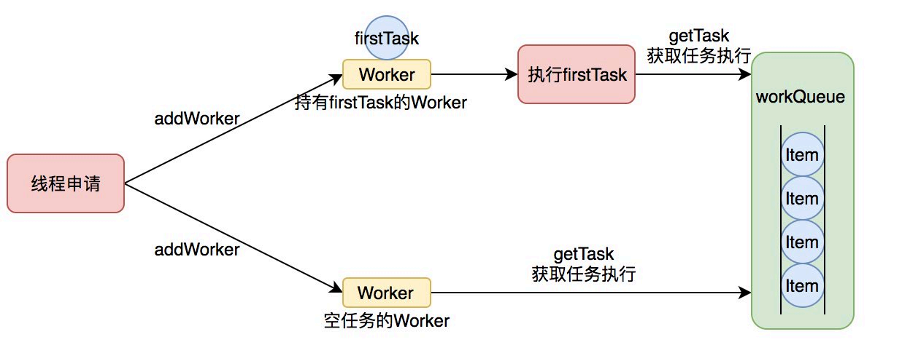


线程池使用一张 ***Hash 表去持有线程的引用***，通过添加引用、移除引用这样的操作来控制线程的生命周期。**如何判断线程是否在运行？**

Worker 通过继承 AQS，使用 AQS 来实现**独占锁**这个功能。没有使用可重入锁 ReentrantLock，而是使用 AQS，**实现不可重入的特性去反映线程现在的执行状态**

1. lock方法一旦获取了独占锁，表示当前线程正在执行任务中
2. 如果正在执行任务，则不应该中断线程
3. 如果该线程现在**不是独占锁的状态**，也就是空闲的状态，说明它没有在处理任务，这时可以对该线程进行中断。
4. **线 程 池 在 执 行 `shutdown` 方 法 或 `tryTerminate` 方 法** 时 会 调 用 `interruptIdleWorkers` 方 法 来 **中 断 空 闲 的 线 程**，`interruptIdleWorkers` 方 法 会 使 用 `tryLock` 方法来判断线程池中的线程是否是空闲状态；如果线程是空闲状态则可以安全回收。  


回收时，对所有线程池中的线程判断是否处于空闲状态

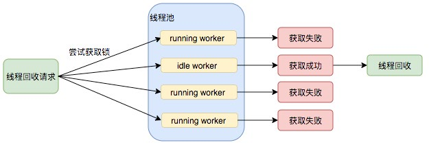


### Worker线程增加


通过 `addWorker()` 方法，功能就是增加一个线程，（线程池具体在哪个阶段增加的该线程是上一步完成的，这一步仅仅完成增加线程，并使它运行），最后返回是否成功这个结果。


```java
private boolean addWorker(Runnable firstTask, boolean core)
```

两个参数：

- firstTask：指定新增的线程执行的第一个任务，可以为空
- core：为true表示在新增线程时会判断当前活动线程数是否少于 `corePoolSize`，false表示新增线程前需要判断当前活动线程数是否少于 `maximumPoolSize` 


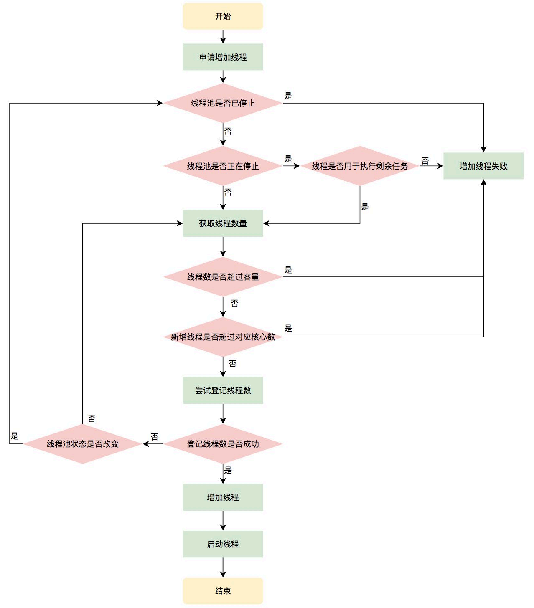


### Worker线程回收


***线程池中线程的销毁依赖 JVM 自动的回收***

线程池做的工作是根据当前线程池的状态**维护一定数量的线程引用**，**防止这部分线程被 JVM 回收**，当线程池决定哪些线程需要回收时，只需要将其**引用消除即可**。

Worker 被创建出来后，就会**不断地进行轮询**，然后获取任务去执行，核心线程可以**无限等待**获取任务，非核心线程要***限时获取任务***。当 Worker 无法获取到任务，也就是获取的任务为空时，循环会结束，Worker 会**主动消除**自身在线程池内的引用  


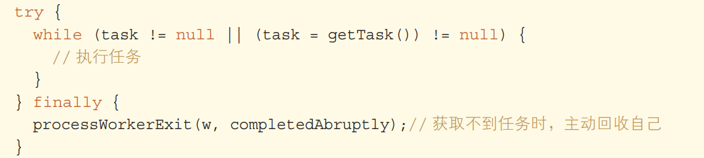


线程回收的工作是在 `processWorkerExit` 方法完成的。


> 将引用移出线程池的引用hash表后，jvm在进行gc的时候自动会将这个线程回收了

引起线程销毁的可能性有很多，线程池还要**判断是什么引发了这次销毁**，是否要改变线程池的现阶段状态，是否要根**据新状态，重新分配线程**  


### Worker线程执行任务


Worker中的 run() 方法调用了 runWorker 方法来执行任务：

```java
final void runWorker(Worker w) {
    Thread wt = Thread.currentThread();
    Runnable task = w.firstTask;
    w.firstTask = null;
    w.unlock(); // allow interrupts
    boolean completedAbruptly = true;
    try {
        while (task != null || (task = getTask()) != null) {
            w.lock();
            // If pool is stopping, ensure thread is interrupted;
            // if not, ensure thread is not interrupted.  This
            // requires a recheck in second case to deal with
            // shutdownNow race while clearing interrupt
            if ((runStateAtLeast(ctl.get(), STOP) ||
                 (Thread.interrupted() &&
                  runStateAtLeast(ctl.get(), STOP))) &&
                !wt.isInterrupted())
                wt.interrupt();
            try {
                beforeExecute(wt, task);
                Throwable thrown = null;
                try {
                    task.run();
                } catch (RuntimeException x) {
                    thrown = x; throw x;
                } catch (Error x) {
                    thrown = x; throw x;
                } catch (Throwable x) {
                    thrown = x; throw new Error(x);
                } finally {
                    afterExecute(task, thrown);
                }
            } finally {
                task = null;
                w.completedTasks++;
                w.unlock();
            }
        }
        completedAbruptly = false;
    } finally {
        processWorkerExit(w, completedAbruptly);
    }
}
```

1. while循环不断地通过 `getTask()` 方法获取任务
2. getTask() 方法从阻塞队列中取任务
3. 如果线程池正在停止，那么要保证当前线程是中断状态，否则要保证当前线程**不是中断状态**
4. 执行任务
5. 如果 **getTask 结果为 null** 则跳出循环，执行 `processWorkerExit()` 方法，**销毁线程**。  


> 尽可能减少创建 / 销毁 非核心线程的次数，所以线程池的任务分配逻辑是这样的：
>
> 先给core线程任务，然后把队列存满，如果再来任务，就创建非核心线程，从队列中拉取任务，这样可以保持非核心线程尽可能长的运行下去

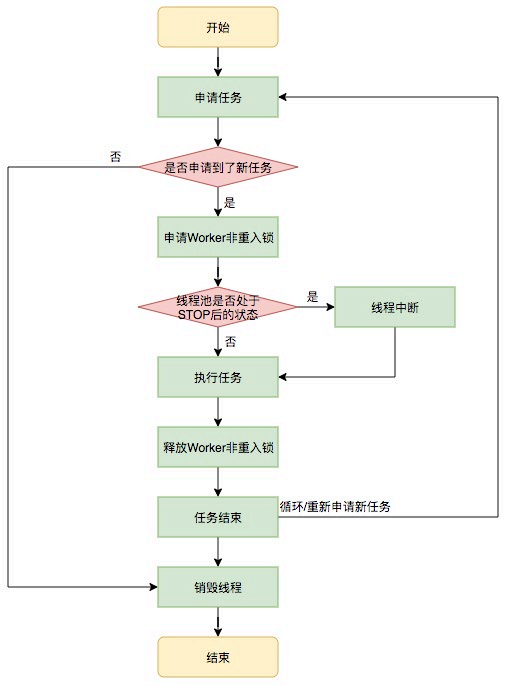


# 线程池在业务中的实践


## 业务背景


场景1：快速响应用户请求


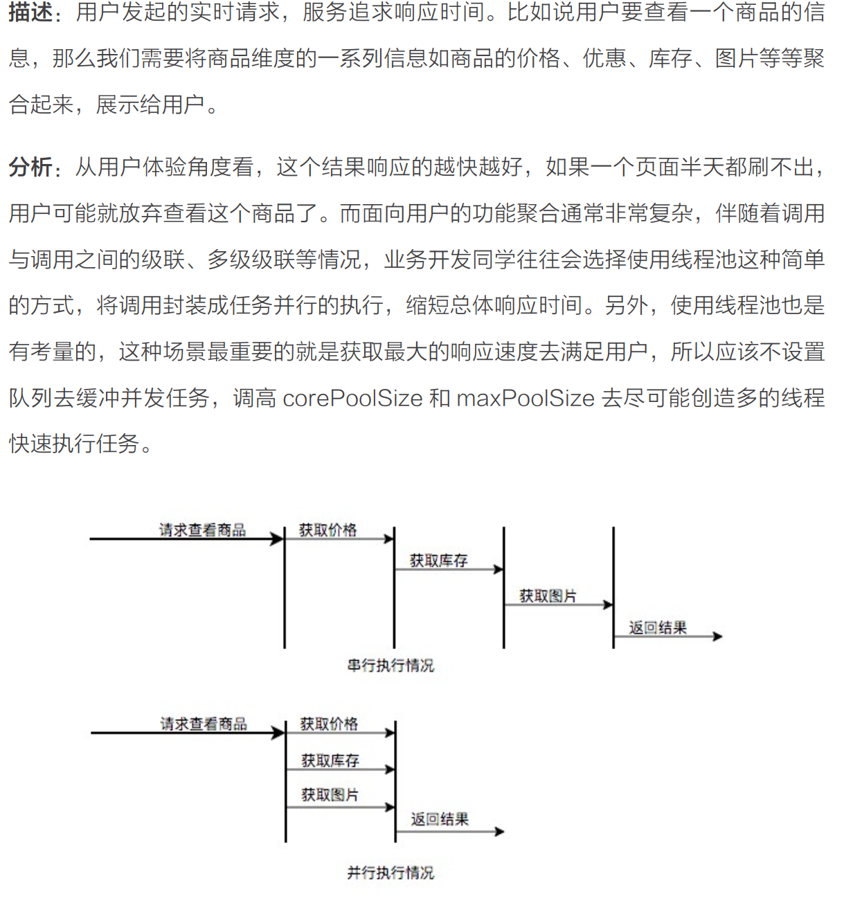


**长时间的大量计算，需要更大的吞吐量，线程如果太多会造成上下文切换问题，会降低吞吐量。**

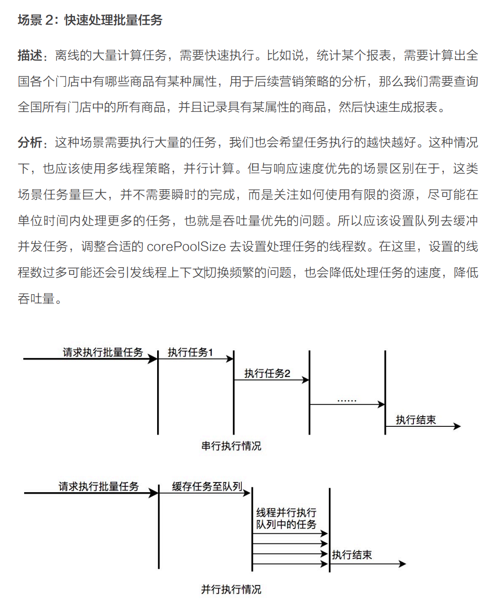


## 实际问题以及方案思考


**线程池的参数并不好配置**

线程池执行的情况和任务类型相关性较大：**IO密集型 和 CPU密集型的任务运行起来的情况差异非常大**


---

1. 页面展示接口大量调用降级

**事故原因**：该服务展示接口内部逻辑使用线程池做并行计算，由于没有预估好**调用的流量**，导致**最大核心数设置偏小**，大量抛出 `RejectedExecutionException`，触发接口降级条件

**线程池容量不足，队列也满了，导致无法再接收任务，使用默认任务拒绝策略，抛出异常**

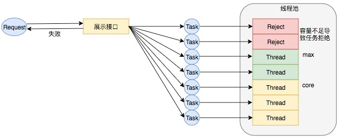


----

2. 业务服务不可用 S2 级故障，提供的服务执行时间过长，作为上游服务整体超时，大量下游服务调用失败

**事故原因**：使用线程池做资源隔离，**队列设置过长**，**最大线程数设置失效**，导致请求数量增加时，大量***任务堆积在队列中***，任务执行时间过长，下游服务的大量调用超时失败

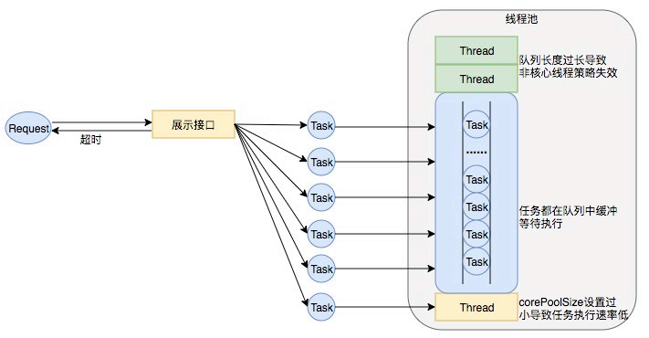


解决方法就是：**线程池参数动态化**

**将线程池的参数从代码中迁移到分布式配置中心上（如nacos），实现线程池参数可以动态配置和即时生效**


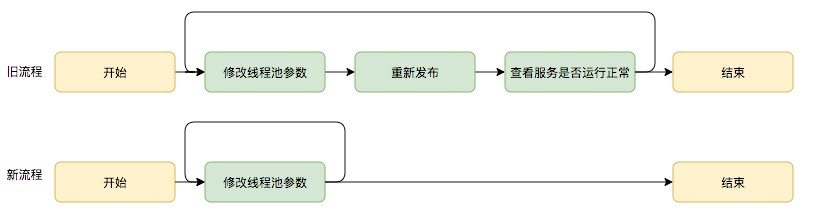


## 动态化线程池


1. 简化线程池配置：线程池有8个构造参数，最核心的是3个：corePoolSize, maximumPoolSize, workQueue

实际有两种场景：（1）**并行执行子任务，提高响应速度**。使用同步队列，没有任务被缓存，立即执行   （2）**并行执行大批次任务，提升吞吐量**。使用 **有界队列**（防止任务无限制堆积），使用队列去缓冲大量的任务。


2. 参数可动态修改，将线程池的配置放置在平台侧，方便查看和修改
3. 增加线程池监控。


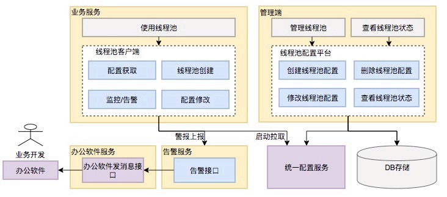


动态化线程池功能：

- **动态调参**
- **任务监控** ，可以看到线程池的任务执行情况，最大 / 平均任务执行时间 等
- **负载告警**
- **操作监控**
- **操作日志**
- **权限校验**

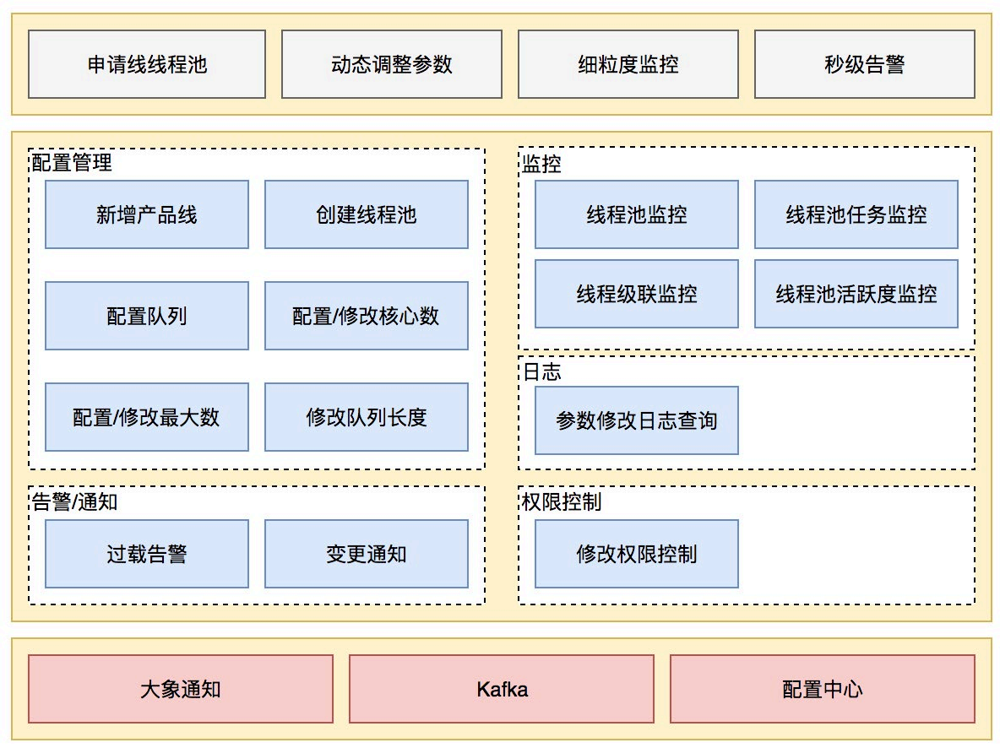


---

- 参数动态化

JDK 原生线程池 ThreadPoolExecutor 提供了如下几个 public 的 **setter 方法**  

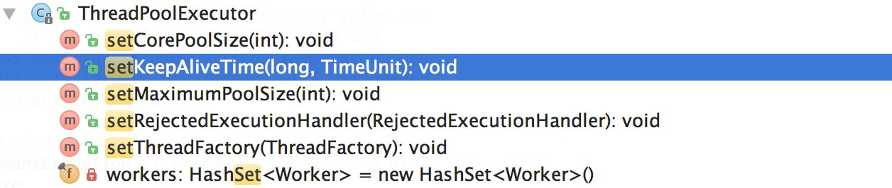

JDK 允许线程池使用方**通过 ThreadPoolExecutor 的实例来动态设置线程池的核心策略**，

以 setCorePoolSize 为方法例，在运行期线程池使用方调用此方法设置 corePoolSize 之后，线程池会直接覆盖原来的 corePoolSize 值，并且基于当前值和原始值的比较结果采取不同的处理策略。

- 对于当前值小于当前工作线程数的情况，说明**有多余的 worker 线程**，此时会向当前 ***idle 的 worker 线程发起中断请求以实现回收***，多余的 worker 在下次 idle 的时候**也会被回收**；
- 对于当前值大于原始值且当前队列中有待执行任务，则线程池会**创建新的 worker 线程**来**执行队列任务**，setCorePoolSize 具体流程如下：  


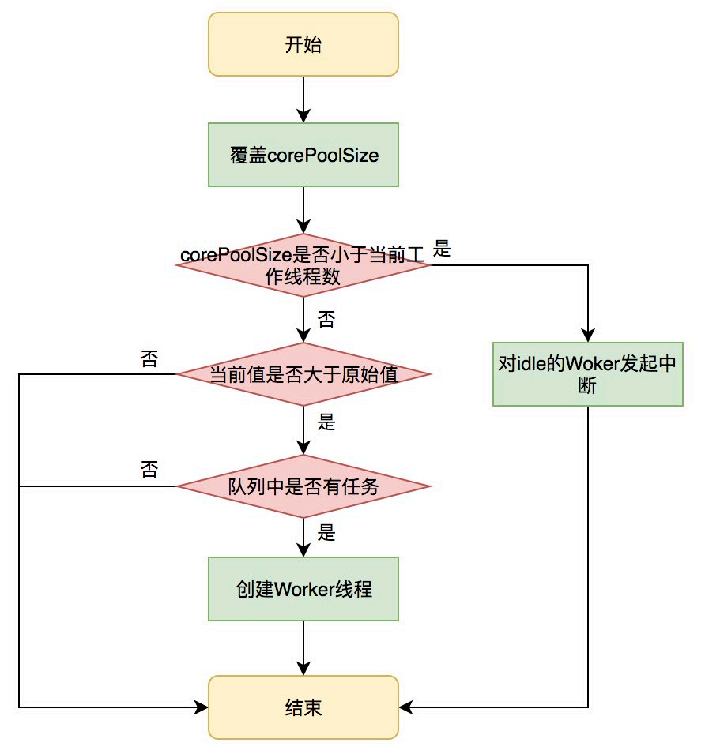


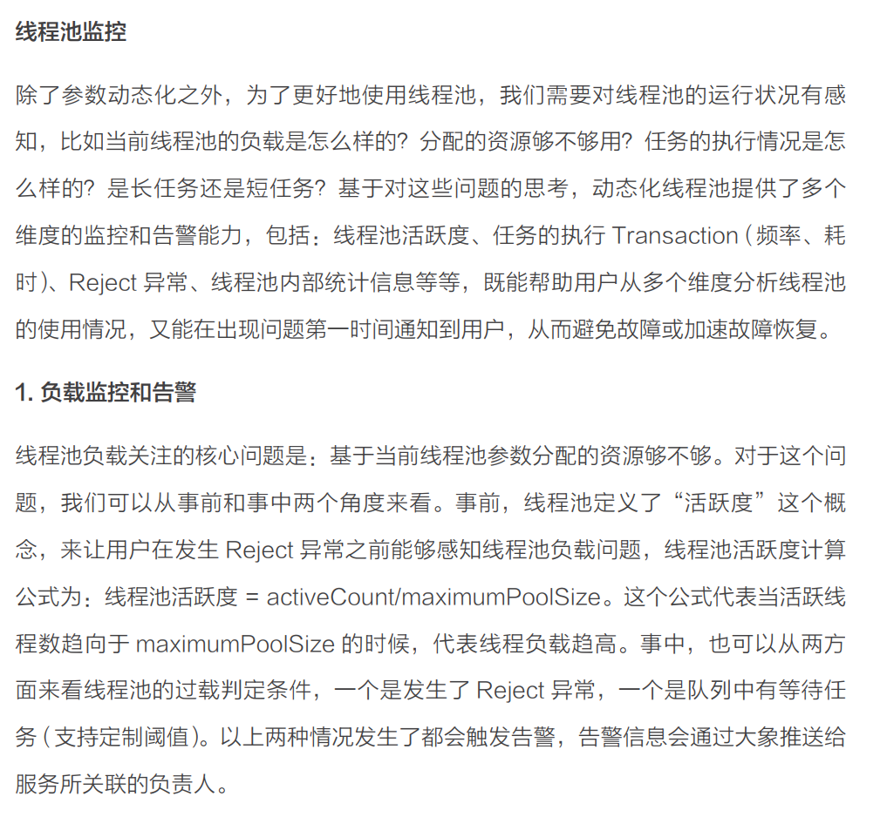


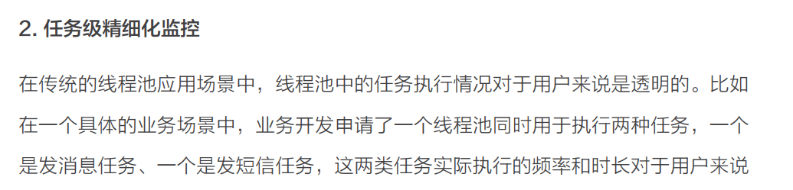

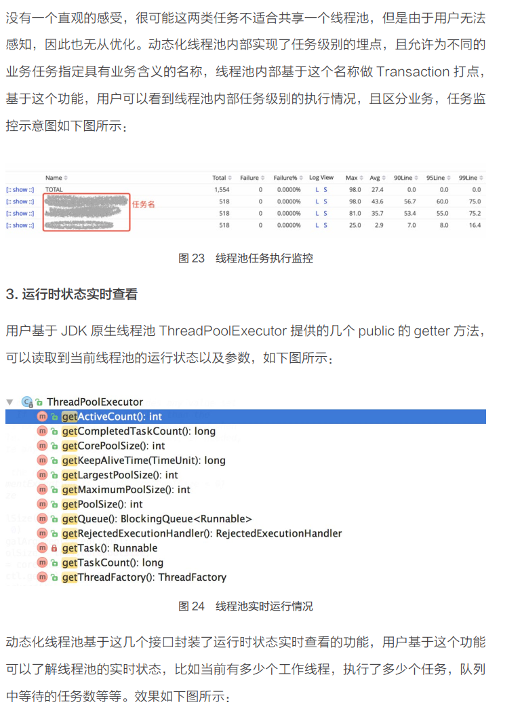

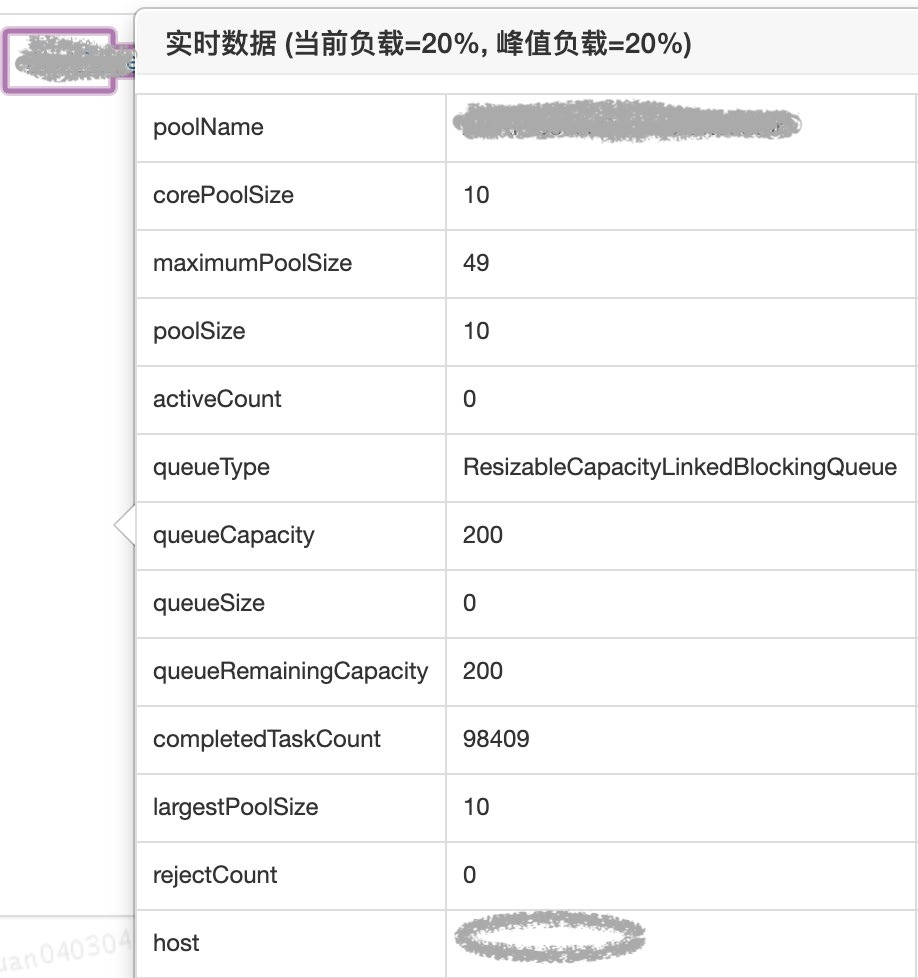


