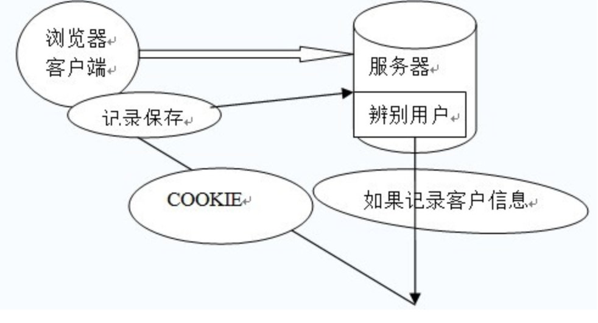
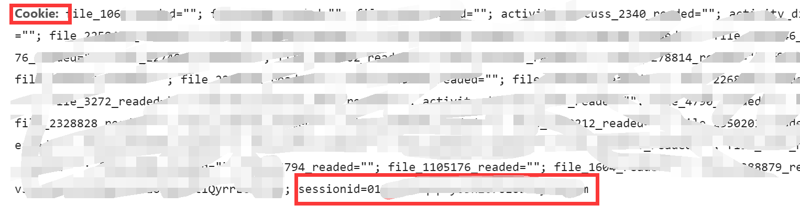

## Cookie 和 Session

### Cookie机制

在程序中，**会话跟踪**是很重要的事情。理论上，**一个用户的所有请求操作都应该属于同一个会话**，而另一个用户的所有请求操作则应该属于另一个会话，二者不能混淆。例如，用户A在超市购买的任何商品都应该放在A的购物车内，不论是用户A什么时间购买的，这都是属于同一个会话的，不能放入用户B或用户C的购物车内，这不属于同一个会话。

　　而Web应用程序是使用HTTP协议传输数据的。**HTTP协议是无状态的协议。一旦数据交换完毕，客户端与服务器端的连接就会关闭，再次交换数据需要建立新的连接。这就意味着服务器无法从连接上跟踪会话**。即用户A购买了一件商品放入购物车内，当再次购买商品时服务器已经无法判断该购买行为是属于用户A的会话还是用户B的会话了。要跟踪该会话，必须引入一种机制。

　　Cookie就是这样的一种机制。它可以**弥补HTTP协议无状态的不足**。在Session出现之前，基本上所有的网站都采用Cookie来跟踪会话。

---

什么是 Cookie

由于 HTTP **是一种无状态的协议，服务器单从网络上无从知道客户身份**

**给客户端们颁发一个通行证吧，每人一个，无论谁访问都必须携带自己通行证。这样服务器就能从通行证上确认客户身份了。这就是Cookie的工作原理**。

> **客户端保存这个通信证，发给服务器，服务器验证后进行相关操作**

Cookie实际上是一小段的文本信息。客户端请求服务器，如果服务器**需要记录该用户状态**，就使用response**向客户端浏览器颁发一个Cookie**。客户端浏览器会把Cookie保存起来。

当浏览器**再请求该网站时**，浏览器把请求的网址连同该Cookie一同提交给服务器。服务器**检查该Cookie**，以此来**辨认用户状态**。服务器还可以根据需要修改Cookie的内容。

查看某个网站颁发的Cookie很简单：在浏览器地址栏输入**javascript:alert (document. cookie)**就可以了

> 注意：Cookie功能需要浏览器的支持。
>
> 如果浏览器不支持Cookie（如大部分手机中的浏览器）或者把Cookie禁用了，Cookie功能就会失效。
>
> 不同的浏览器采用不同的方式保存Cookie。

### Session机制

除了 Cookie，Web应用中还经常使用 Session **来记录客户端状态**。相比 Cookie 简单一些，但增加了服务器的存储压力

---

**什么是 Session**

Session是另一种记录客户状态的机制，不同的是**Cookie保存在客户端浏览器中，而Session保存在服务器上**。客户端浏览器访问服务器的时候，**服务器把客户端信息以某种形式记录在服务器上**。

这就是Session。客户端浏览器再次访问时只需要**从该Session中查找该客户的状态**就可以了。

> 在当前会话中，

　　如果说**Cookie机制是通过检查客户身上的“通行证”来确定客户身份的话，那么Session机制就是通过检查服务器上的“客户明细表”来确认客户身份。**

**Session相当于程序在服务器上建立的一份客户档案，客户来访的时候只需要查询客户档案表就可以了。**

> 登录功能
>
> 登录界面验证用户登录信息，如果登录正确，就把用户信息以及登录时间保存进Session，然后转到欢迎页面welcome.jsp。welcome.jsp中从Session中获取信息，并将用户资料显示出来。

注意程序中Session中直接保存了**Person类对象与Date类对象**，使用起来要比Cookie方便。

当多个客户端执行程序时，服务器会保存多个客户端的Session。获取Session的时候也不需要声明获取谁的Session。**Session机制决定了当前客户只会获取到自己的Session，而不会获取到别人的Session。各客户的Session也彼此独立，互不可见**。

 

提示**：Session的使用比Cookie方便，但是过多的Session存储在服务器内存中，会对服务器造成压力。**

---

生命周期

Session保存在服务器端。**为了获得更高的存取速度，服务器一般把Session放在<内存>里。每个用户都会有一个<独立>的Session。如果Session内容过于复杂，当大量客户访问服务器时可能会导致<内存溢出>。因此，Session里的信息应该尽量精简。**

　　**Session在用户第一次访问服务器的时候自动创建**。需要注意只有访问JSP、Servlet等程序时才会创建Session，只访问HTML、IMAGE等静态资源并不会创建Session。如果尚未生成Session，也可以使用request.getSession(true)强制生成Session。

　　**Session生成后，只要用户继续访问，服务器就会更新Session的最后访问时间，并维护该Session**。用户每访问服务器一次，无论是否读写Session，服务器都认为该用户的Session“活跃（active）”了一次。

---

有效期

由于会有越来越多的用户访问服务器，因此Session也会越来越多。**为防止内存溢出，服务器会把长时间内没有活跃的Session从内存删除。这个时间就是Session的超时时间。如果超过了超时时间没访问过服务器，Session就自动失效了。**

### cookie和 session的区别

**1、cookie数据存放在客户的浏览器上，session数据放在服务器上.**

​    简单的说，当你登录一个网站的时候，如果web服务器端使用的是session,那么所有的数据都**保存在服务器上面**，

客户端每次请求服务器的时候会发送 **当前会话的session_id**，服务器根据当前session_id判断相应的用户数据标志，以确定用户是否登录，或具有某种权限。

由于数据是**存储在服务器 上面，所以你不能伪造**，但是如果你能够获取某个登录用户的**session_id**，用特殊的浏览器伪造该用户的请求也是能够成功的。

session_id是服务器和客户端链接时候随机分配的，一般来说是不会有重复，但如果有大量的并发请求，也不是没有重复的可能性。

Session是由应用服务器维持的一个**服务器端的存储空间**，用户在连接服务器时，会由服务器生成一个**唯一的SessionID**,用该SessionID **为标识符**来**存取服务器端的Session存储空间**。

而**SessionID**这一数据则是**保存到客户端**，***用Cookie保存的***，用户提交页面时，会**将这一 SessionID提交到服务器端**，来**存取Session数据**。这一过程，是不用开发人员干预的。

**所以一旦客户端禁用Cookie，那么Session也会失效。**

 

**2、cookie不是很安全，别人可以分析存放在本地的COOKIE并进行COOKIE。**

**欺骗考虑到安全应当使用session。**

 

**3、设置cookie时间可以使cookie过期。但是使用session-destory（），我们将会销毁会话。**

 

**4、session会在一定时间内保存在服务器上。当访问增多，会比较占用你服务器的性能考虑到减轻服务器性能方面，应当使用cookie。**

 

**5、单个cookie保存的数据不能超过4K，很多浏览器都限制一个站点最多保存20个cookie。(Session对象没有对存储的数据量的限制，其中可以保存更为复杂的数据类型)**

 注意:

   session很容易失效,用户体验很差;

   虽然cookie不安全,但是可以加密 ;

   cookie也分为永久和暂时存在的;

   浏览器 有禁止cookie功能 ,但一般用户都不会设置;

   一定要设置失效时间,要不然浏览器关闭就消失了;

 

   例如:

​      记住密码功能就是使用**永久cookie写在客户端电脑**，下次登录时，自动将cookie信息附加发送给服务端。

​      application是全局性信息，是所有用户共享的信息，如可以记录有多少用户现在登录过本网站，并把该信息展示个所有用户。

 

 **两者最大的区别在于生存周期，一个是IE启动到IE关闭.(浏览器页面一关 ,session就消失了)，一个是预先设置的生存周期，或永久的保存于本地的文件。(cookie)**

 

> Session信息是存放在server端，但**session id是存放在client cookie的**

