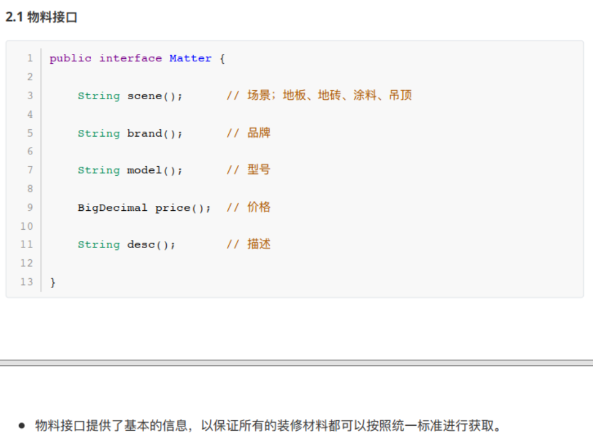

# 面向对象设计原则


1. **开闭原则**

**对扩展开放，对修改关闭**

在程序需要进行扩展的时候，**不能修改原来的代码，实现一个热插拔的效果**

为了使程序的扩展性好，易于维护和升级，需要使用接口和抽象类


2. **里式替换原则**

**任何基类可以出现的地方，子类一定可以出现**

LSP是继承复用的基石，只有当衍生类可以替换掉基类，软件单位的功能不受到影响时，基类才能真正被复用，而衍生类也能够**在基类的基础上增加新的行为**。

里氏代换原则是对“开-闭”原则的补充。实现“开-闭”原则的关键步骤就是**「抽象化」**。而基类与子类的继承关系就是抽象化的具体实现，所以里氏代换原则是对实现抽象化的具体步骤的规范。


3. **依赖倒转原则**

开闭原则的基础，**只对接口编程，依赖于抽象而不依赖于具体**


4. **接口隔离原则**

**使用多个隔离的接口，比使用单个接口要好**

**降低类之间的耦合度**

其实设计模式就是一个软件的设计思想，从**大型软件架构**出发，为了升级和维护方便。所以上文中多次出现：**降低依赖，降低耦合**。


5. **迪米特法则（最少知道法则）**

一个实体应当尽量少的与其他实体之间发生相互作用，使得系统功能模块相对独立


6. **合成复用原则**

尽量使用合成/聚合的方式，而不是使用**继承**。


**创建型**模式，共五种： 工厂方法模式、 抽象工厂模式、 单例模式、 建造者模式、原型模式。

**结构型**模式，共七种： 适配器模式、装饰器模式、 代理模式、外观模式、桥接模式、组合模式、 享元模式  

**行为型**模式，共十一种： 策略模式、模板方法模式、 观察者模式、迭代子模式、责任链模式、命令模式、备忘录模式、状态模式、访问者模式、中介者模式、解释器模式。  


# ——创建者模式——


# 单例模式

**创建型模式**


> volatile没有原子性：singleton 单例模式 **"双重锁检查"**

```java
public class Singleton {
    private static Singleton singleton; //如果不使用volatile关键字
    
    //双重锁检验
    public static Singleton getInstance(){
        if(singleton == null){
            synchronized (Singleton.class){
                if(singleton == null){
                    singleton = new Singleton();
                }
            }
        }
        
        return singleton;
    }
}
```


如果这里的变量声明不使用volatile关键字，是可能会发生错误的。它可能会**被重排序**：

``` java
singleton = new Singleton();//未用volatile关键字声明

//可以分解为以下三个步骤
1 	memory = allocate()//分配内存
2 	ctorInstance(memory) //初始化对象
3 	singleton=memory //设置s指向刚分配的地址
    
//可能会被重排序为 1-3-2
1 	memory=allocate();// 分配内存 相当于c的malloc
3 	singleton=memory //设置s指向刚分配的地址，但对象还没有被初始化
2 	ctorInstance(memory) //初始化对象
```

如果线程A执行了1、3还没开始执行2，线程B执行到了`if(singleton == null)`，它会判定singleton不为空，然后直接返回了一个**未初始化完成**的singleton

> 如果将singleton声明为volatile的，volatile不允许volatile写与前面的操作 （`singleton = memory`）重排序
>
> 在`singleton = new Singleton()`过程中，**new操作将作为「原子操作」**，**不可重排序**


**线程安全**的单例模式写法：

1. 懒加载（慢）

```java
public class SafeLazyInitialization { 
   private static Resource resource; 
    
    //为整个方法加上synchronized锁。效率较低，有需要的时候才会创建
   public synchronized static Resource getInstance() { 
      if (resource == null) 
          resource = new Resource(); 
      return resource; 
    } 
}
```


2. 主动初始化（浪费资源 / 饿汉式）

```java
public class EagerInitialization { 
    // 在加载该类的时候就创建对象实例
    private static Resource resource = new Resource();
    
    // 私有化构造函数
    private Singleton(){}

    // 返回对象实例
    public static Resource getResource() { return resource; }
}
```


3. 延迟初始化（好像还不错）

```java
public class ResourceFactory { 
    
    //在静态内部类中初始化单例对象
    //在访问该类的静态单例变量时，这个静态内部类才会被初始化————延迟初始化
    private static class ResourceHolder { 
        public static Resource resource = new Resource(); 
    } 
    public static Resource getResource() { 
        return ResourceHolder.resource ; 
    } 
}
```


4. 二次检查锁定


```java
public class Singleton {
    private static volatile Singleton singleton; //如果不使用volatile关键字.....
    
    //双重锁检验
    public static Singleton getInstance(){
        if(singleton == null){//二次检查，比独占锁效率高
            synchronized (Singleton.class){
                if(singleton == null){
                    singleton = new Singleton();
                }
            }
        }
        
        return singleton;
    }
}
```


## 场景


1. 数据库的连接池不会反复创建
2. spring中一个单例模式 bean 的生成和使用
3. 需要设置全局的一些属性保存


## 静态类使用


```java
public class Singleton_00{
	public static Map<String, String> cache = new ConcurrentHashMap<String, String>();
}
```

- 在第一次运行的时候直接初始化 Map 类，同时也不需要到延迟加载再使用
- 仅仅用于**全局访问**，不需要维持任何**状态**
- 如果需要被继承以及需要**维持一些特定状态**的情况下，就适合使用单例模式


## 懒汉模式（线程不安全）


**懒：要用的时候才初始化**

**饿：不管用不用，都先初始化上再说**

```java
public class Singleton_01{
    private static Singleton_01 instance;
    
    // 这个构造一定要是私有的，不允许外部直接创建对象
    private Singleton_01(){}
    
    public static Singleton_01 getInstance(){
        if(null != instance){
            return instance;
        }
        // 在这一步完成之前，如果多个线程访问该方法，那么都会创建一个对象并返回
        instance = new Singleton_01();
        return instance;
    }
}
```

- 单例模式有一个特点就是不允许外部直接创建，因此这里在默认的构造函数上添加了私有属性 private 
- 如果有多个访问者同时去获取对象实例，就会造成多个同样的实例并存，没有达到单例的要求


## 懒汉模式（线程安全）


```java
public class Singleton_02{
	private static Singleton_02 instance;
    
    private Singleton_02(){
        
    }
    
    public static synchronized Singleton_02 getInstance(){
        if(null != instance){
            return instance;
        }
        instance = new Singleton_02();
        return instance;
    }
}
```


**对整个方法加了synchronized关键字，所有的线程进入这个方法都会等待**

虽然是线程安全的，但由于锁加到了方法上，所有的访问都需要锁占用导致资源浪费


## 饿汉模式（线程安全）


```java
public class Singleton_03 {	
    
	private static Singleton_03 instance = new Singleton_03();
    
	private Singleton_03() {
        
	}
    
    public static Singleton_03 getInstance() {
    	return instance;
    }
}
```

饿：不管用不用，**都先加载出来**，放在那

和「静态类使用」中的实例化 Map 基本一致，在程序启动的时候直接将运行加载，需要时直接获取

- 但此种方法并不是 「懒加载」：**无论程序中是否用到这样的类，都会在程序启动之初进行创建**
- **导致的问题：**比如游戏，游戏地图还没打开，但是程序已经将这些地图全部实例化，占用内存过多


## 使用类的内部类（线程安全）


```java
public class Singleton_04{
    
    private static class SingletonHolder{
        private static Stingleton_04 instance = new Singleton_04();
    }
    
    private Singleton_04 getInstance(){
        return SingletonHolder.instance;
    }
}
```

- 既保证了线程安全，还保证了懒加载，也不会因为加锁的方式耗费性能
- **因为 JVM虚拟机 可以保证多线程并发访问的正确性，一个类的构造方法在多线程环境下可以被正确的加载**

**只有在访问到这个类的时候，类内的static变量才会被初始化**


## 双重锁校验（线程安全）


```java
public class Singleton_05{
    
    private static volatile Singleton_05 instance;
    
    private Singleton_05{
        
    }
    
    public static Singleton_05 getInstance(){
        if(null != instance){
            return instance;
        }
        
        synchronized(Singleton_05.class){
            
            // 这里还需要判断一次null，因为可能有多个线程等待着synchronized锁，那么被释放以后，其他线程就不能够再创建新对象了，所以需要判断一下
        	if(null == instance){
                instance = new Singleton_05();
            }    
        }
        return instance;
    }
}
```


- **双重锁方法其实就是方法级锁的优化，减少了部分获取实例的耗时**
- 也满足了懒加载

如果同时多个线程访问这个方法获取实例对象，其中一个进入synchronized块，


## CAS 「AtomicReference」（线程安全）


```java
public class Singleton_06{
    
    private statci final AtomicReference<Singleton_06> INSTANCE = new AtomicReference<Singleton_06>();
    
    private static  Singleton_06 instance;
    
    private Singleton_06(){
        
    }
    
    public static final Singleton_06 getInstance(){
        for(;;){
            Singleton_06 instance = INSTANCE.get();
            if(null != instance){
                return instance;
            }
            
            INSTANCE.compareAndSet(null, new Singleton_06());
            return INSTANCE.get();
        }
    }
    
    public static void main(String[] args){
        sout(Singleton_06.getInstance());
        sout(Singleton_06.getInstance());// same object
    }
    
}
```


- java 并发库提供了很多原子类支持并发访问的数据安全性：**AtomicInteger、AtomicBoolean、AtomicLong、AtomicReference**
- AtomicReference 可以封装引用一个 V 实例，**支持并发访问**
- 使用 CAS 的好处就是 **不需要使用传统的加锁方式保证线程安全，而是依赖于 「CAS的忙等算法」**，底层硬件实现，保证线程安全，
- **没有线程的切换和阻塞，也就没有了额外的开销，支持更大的并发**


多个线程访问该方法，如果本身已经被初始化，那么直接返回单例对象

否则，进行cas，不论cas失败/成功，最后这个引用一定是指向了单例对象

进行cas操作时，每次会读取内存中最新的值，与expect进行比较，**「原子操作」**，不会被打断这个过程，意味着同一时间只有一个线程在做这件事，后面的线程虽然 expect 为null，但内存中的instance值已经改变，cas返回 false


## Effective Java 推荐的枚举单例（线程安全）


```java
public enum Singleton_07{
    INSTANCE;
    
    public void test(){
        sout("hi~");
    }
}
```

**线程安全、自由串行化、单一实例**


调用方式：

```java
public void test(){
    Singleton_07.INSTANCE.test();
}
```

无偿提供了串行化机制，绝对防止对此实例化，即使面对复杂的串行化或者反射攻击的时候

**「单元素的枚举」成为实现 Singleton 的最佳方法**

继承场景不可使用（**枚举已经继承了 java.lang.enum 类**）


> 实际上和静态类是一样的，甚至静态类的效率更高一些


# （简单）工厂方法模式


创建型设计模式，在父类中提供一个创建对象的方法，允许子类决定实例化对象的类型


主要意图是定义一个**「创建对象的接口」**，让其子类自己决定**实例化哪一个工厂类**，**工厂模式使其创建过程延迟到子类进行**。  


这⾥里里我们模拟积分兑换中的发放多种类型商品，假如现在我们有如下三种类型的商品接口；  


- 三个接口返回类型不不同，有对象类型、布尔类型、还有一个空类型。
- 入参不不同，发放优惠券需要仿重、兑换卡需要卡ID、实物商品需要发货位置(对象中含有)。
- 另外可能会随着后续的业务的发展，会新增其他种商品类型。因为你所有的开发需求都是随着业务
  对市场的拓拓展⽽而带来的。  


定义发奖接口  

```java
public interface ICommodity {
	void sendCommodity(String uId, String commodityId, String bizId, Map<String, String> extMap) throws Exception;
}
```

- 所有的奖品无论是实物、虚拟还是第三方，都需要通过我们的程序实现此接口进行处理，以保证最终入参出参的统一性。
- 接口的入参包括； 用户ID 、 奖品ID 、 业务ID 以及 扩展字段 ⽤用于处理发放实物商品时的收获地址。  


接下来实现奖品发放接口：


或许还需要从map中取出发奖所需的额外信息：


- 每一种奖品的实现都包括在自己的类中，新增、修改或者删除都不会影响其他奖品功能的测试，降低回归测试的可能
- 后续在**新增的奖品**只需要按照此结构进行填充即可，非常易于维护和扩展。
  - 新创建一个奖品类 `NewCommodity implements Icommodity`，在这里面**实现发奖逻辑**即可
- 在统一了入参以及出参后，调用方**不再需要关心奖品发放的内部逻辑**，按照**统一的方式即可处理**。  


----

创建商店工厂


- 定义一个**商店的工厂类**，按照类型实现各种商品的服务。后续新增的商品在这里扩展即可

> 这里的工厂其实是简单工厂，即直接一个工厂类生产各种商品
>
> 如果需要扩展，则需要直接修改这个工厂的源代码，**违反了开闭原则**
>
> 见下文《简单工厂模式、工厂模式和抽象工厂模式》


测试：


-----

**工厂模式的用法和优势**


1. 定义方法接口！接口中有一个每个实现类都需要有不同实现的方法（发奖行为）。
2. 工厂方法返回的是：不同的实现类的对象，但是这些对象都被接口类所引用
3. 根据多态：接口类.方法()，即可执行各个具体实现类的操作
4. 将原本多轮if操作化为了一个if，执行的时候不需要知道具体是哪个实现类，因为这个接口引用的实现类已经在工厂中进行了实例化并返回，直接执行方法即可


**避免创建者与具体的产品逻辑耦合**

满足 **单一职责，每一个业务逻辑实现都在所属自己的类中完成**

满足 **开闭原则，无需更改 「使用调用方」，就可以在程序中 「引入新的产品类型」**


> 但这样也会带来一些问题，比如有非常多的奖品类型，那么**实现的子类会极速扩张**。因此也需要使⽤用其他的模式进行优化，这些在后续的设计模式中会逐步涉及到  


# 抽象工厂模式


抽象工厂模式与工厂方法模式虽然都是为了解决 **「接口选择问题」**，但实现上：

**抽象工厂是一个中心工厂，「创建其他工厂」的模式**


----

## 场景


很多时候初期业务的蛮荒发展，也会牵动着研发对系统的建设  

预估 QPS较低 、 系统压力力较⼩小 、 并发访问不大 、 近一年没有大动作 等等，在考虑时间投入成本的前提前，并不会投入特别多的人力去构建非常完善的系统。就像对 Redis 的使用，往往可能只要是单机的就可以满足现状。  

随着业务快速发展，单机redis满足不了系统需求。


随着这次的升级，可以预见的问题会有；

1. 很多服务⽤用到了Redis需要一起升级到**集群**。
2. 需要兼容**集群A和集群B**，便于后续的灾备。
3. 两套集群提供的**接口和方法**各有差异，需要做适配。
4. 不能影响到目前正常运行的系统。  


- 模拟一个集群服务，但是方法名与各业务系统中使用的方法名不同。


------

### 单集群代码使用


接口：


调用：


这就是最经典的使用场景了：

service实现类中注入RedisUtil工具类，实现工具类中各种调用方法的调用。

**当然，这里只有一个单机的RedisUtil的调用，应该分多种情况：单机、集群1、集群2**

### 垃圾代码实现


> ifelse 实现需求


简单说一下。。就是把三个redis的工具类都在serviceImpl实现类中实例化，根据传入的使用的redis类型参数，来执行某个redis工具类的具体方法。（if大法）


### 不能使用工厂模式？


在这个栗子中，三个redis的操作类的方法名称都不同，那么就没法用工厂模式来将他们都作为一个接口的实现类然后调用这个方法。


那么该如何实现「统一的操作」呢？


**就需要一个适配接口，来适配Service接口的方法**


两个适配接口的实现类就相当于生产出来的两个不同的产品，通过传入所需要生产的类型，直接生产出对应的对象


------

这时候可以把每个redis集群操作类中的方法（get, set, del...）**当成生产不同种类的小商品**，那么这两个集群操作类就是具体的工厂A、B，对应集群A、B


> 工厂模式中的例子，每个工厂只做一件事，就是发奖，只不过每个工厂的发奖逻辑不同，所以直接造出对应的产品类即可


集群A、B分别当成两个大工厂，方法（get, set, del...）**当成生产不同种类的小商品**，那么这时候就是 「**抽象工厂**」的形式了


## 抽象工厂模式重构代码


这里的抽象工厂的创建和获取方式，会采用代理类的方式进行实现。被代理的类就是目前的 Redis 操作方法类，让这个类在不需要任何修改下，就可以实现调用集群A和集群B的数据服务


并且，由于集群A和集群B在部分方法提供上是不同的，需要做一个接口适配，**这个适配类就相当于工厂中的工厂，用于创建把不同的服务抽象为统一的接口做相同的业务。**


----

适配接口（**和CacheService接口中的方法名称相同**）：


----

集群使用服务：


这两个实现其实很简单，就是两个实现类，分别使用自己所属的redis集群操作工具类，**来实现接口中定义的「统一名称」的方法**


----

### **定义抽象工程代理类和实现**


- getProxy方法：传入接口的实现类（ServiceImpl）的class对象作为需要代理的类，以及实现了适配接口的具体实现类（xxxCacheAdapter）。
- 返回代理的对象（该对象就是产生的代理类，是接口Service的实现类，和ServiceImpl没关系）

> ```java
> public static Object newProxyInstance(ClassLoader loader,  Class<?>[] interfaces, InvocationHandler h)
> ```
>
> - loader 自然是类加载器
> - interfaces 代码要用来代理的接口，这里就是CacheService
> - h 一个 InvocationHandler 对象↓


- 不能直接用method.invoke()
  - 这里实际上是新生成的代理类（service的实现类ServiceImpl）调用的invoke方法，那么在调用get等service方法时，需要在invoke方法中调用**Adapter**的方法，**并且Adapter中的方法名和Service接口中的方法名都相同，那么使用method.getName就可以通过调用的接口的方法名对应到适配器中的方法名，然后传入args并调用适配器中的这个方法**
- 通过穿透进来的集群服务进行方法操作
- 在 invoke 方法中，通过使用获取**方法名称**反射方式，调用**对应的适配器方法功能**


----

测试


## 总结

- 抽象工厂模式，解决的问题：一个**产品族**，存在多个**不同类型的产品**（Redis集群、操作系统），接口选择
- 单一职责、开闭原则、解耦  ，随着业务扩展，类实现较复杂。


**简单说，就是多个类共享一套接口方法，但是具体实现不同**


**解决了工厂方法模式的问题：在上面这个抽象工厂中，通过JDKProxy产生代理类，只需要传入参数：被代理的serviceImpl实现类、需要创建的工厂类型，就可以通过代理来实例化对象**


---

相比工厂方法模式：

两种方式最后生成的对象都需要使用接口来接收，区别在：

- 工程模式需要**「直接创建」工厂类**，而抽象工厂模式通过向代理类传入所需的工厂，来代理生产并调用所需工厂的方法生产实例对象

- **抽象工厂模式返回的是Service接口的实现类（通过代理生成）**，工厂模式返回的是实际的调用的(工具)实现类


对于抽象工厂来说，有一个适配器接口Adapter，**这个适配接口就是为了「适配Service接口」，使得通过jdk代理这种方式直接获得Service接口的实现类的代理，这个代理类中的方法对应着具体的Adapter实现类中的方法**


**这样就可以在ServiceImpl中省去注入这一步，直接调用所需方法，通过「代理」，触发invoke()方法，就会自动代理对应适配器实现类中的同名称方法**


# 简单工厂模式、工厂模式和抽象工厂模式


**简单工厂模式**（不属于23种设计模式）：

专门生产某个产品的类。

比如下图中的鼠标工厂，专业生产鼠标，给参数0，生产戴尔鼠标，给参数1，生产惠普鼠标。


其实上面讲的那种方式就是简单工厂模式


简单工厂模式有个问题：


类的创建依赖工厂类，想要扩展程序，必须对工厂类进行修改，**违反了开闭原则**


:zap: 解决办法：

定义一个创建对象的抽象方法，并创建多个不同的工厂类实现该抽象方法，这样一旦需要增加新的功能，<u>**直接增加新的工厂就可以了，不需要修改之前的代码**</u>

↓

----

**工厂模式**


如果还用简单工厂模式，要去修改工厂代码，增加一堆if else语句

而工厂模式直接创建两个工厂

工厂模式也就是**鼠标工厂**是个「**抽象类**」，有**生产鼠标这个方法**。
**戴尔鼠标工厂，惠普鼠标工厂**继承它，可以**分别生产**戴尔鼠标，惠普鼠标。
生产哪种鼠标**不再由参数决定**，而是创建鼠标工厂时，由戴尔鼠标工厂创建。
后续直接调用鼠标工厂.生产鼠标( )即可


通过不同的工厂会得到不同的实例化的对象

这时如果新增一个罗技品牌的鼠标，只要再增加一个 LogitechMouseFactory类：

```java
public class LogitechMouseFactory extends MouseFactory{
	@override
    public Mouse create createMouse(){
        return new LogitechMouse();
    }
}
```


:question: 工厂模式存在的问题与解决方法

客户端需要**创建类的具体的实例**。

简单来说就是：用户要造Hp鼠标，就要去惠普鼠标工厂，要造Dell鼠标，就要去Dell鼠标工厂。。。。。。

**当两个鼠标工厂发生变化了，用户也要跟着变化**

可以把工厂类抽象为接口，用户只需要去找默认的工厂提出自己的需求（**传入参数**），便能得到自己想要的产品，**而不用根据产品去寻找不同的工厂，方便用户操作**


----

**抽象工厂模式**


> 这里的抽象工厂模式讲的好像不准确。。。结合上文《抽象工厂模式》
>
> 三种工厂有点混乱了。。。:zap::zap:

抽象工厂模式也就是不仅生产鼠标，同时生产键盘。  

也就是PC厂商是个父类，有生产鼠标，生产键盘两个接口。  

戴尔工厂，惠普工厂继承它，可以分别生产戴尔鼠标+戴尔键盘，和惠普鼠标+惠普键盘。  

创建工厂时，由戴尔工厂创建。  

后续工厂.生产鼠标()则生产戴尔鼠标，工厂.生产键盘()则生产戴尔键盘。


**相当于是一个大工厂，生产多种小的商品。**


-----

那么这时，如果需要增加一个新产品？

- 每个品牌的工厂都需要再多生产一类产品，增加一个生产新产品的方法

- 新产品也需要一个接口，然后当多个品牌来实现这个接口以表示不同品牌的该新产品


---

---

---

### 抽象工厂


https://www.runoob.com/design-pattern/abstract-factory-pattern.html

**抽象工厂模式是围绕一个「超级工厂」创建「其他工厂」，故该超级工厂称为其他工厂的工厂。**


抽象工厂模式中，接口是负责创建一个相关对象的工厂，不需要显式指定他们的类。每个**生成的工厂**都能够**按照工厂模式提供对象**


- **意图：**提供一个创建一系列相关或相互依赖对象的接口，而无需指定它们具体的类

- **主要解决：**接口选择问题
- **何时使用：**系统的产品有多于一个的产品族，而系统只消费其中某一族的产品
- 在一个产品族中，定义多个产品；
- 在一个工厂里聚合多个同类产品

- **优点**：当一个产品族中的多个对象被设计成一起工作时，它能保证客户端始终只使用同一个产品族中的对象（**同一个产品类型工厂生产的同族实例对象**）
- 缺点：产品族扩展非常困难，要增加一个系列的某一个产品，既要在抽象的 Creator 里加代码，又要在具体的里面加代码。


----


这里有两个产品族：Shape和Color，对应着两个工厂，而这两个工厂由都是是超级工厂的实现类


形状接口及其实现类：


颜色接口及其实现类：


为 Color 和 Shape 对象创建抽象类来获取工厂：

```java
// AbstractFactory.java
public abstract class AbstractFactory {
   public abstract Color getColor(String color);
   public abstract Shape getShape(String shape) ;
}
```


创建扩展了 AbstractFactory 的工厂类，基于给定的信息生成实体类的对象。

```java
// ShapeFactory.java 负责生产shape产品族的各种产品，传入所需类型，返回实例对象
public class ShapeFactory extends AbstractFactory {
    
   @Override
   public Shape getShape(String shapeType){
      if(shapeType == null){
         return null;
      }        
      if(shapeType.equalsIgnoreCase("CIRCLE")){
         return new Circle();
      } else if(shapeType.equalsIgnoreCase("RECTANGLE")){
         return new Rectangle();
      } else if(shapeType.equalsIgnoreCase("SQUARE")){
         return new Square();
      }
      return null;
   }
   
   @Override
   public Color getColor(String color) {
      return null;
   }
}

// ColorFactory.java 负责生产color产品族的产品
public class ColorFactory extends AbstractFactory {
    
   @Override
   public Shape getShape(String shapeType){
      return null;
   }
   
   @Override
   public Color getColor(String color) {
      if(color == null){
         return null;
      }        
      if(color.equalsIgnoreCase("RED")){
         return new Red();
      } else if(color.equalsIgnoreCase("GREEN")){
         return new Green();
      } else if(color.equalsIgnoreCase("BLUE")){
         return new Blue();
      }
      return null;
   }
}
```


**创建一个 「工厂创造器、生成器类」，通过传递参数来选择创建 形状/颜色的工厂**

```java
// FactoryProducer.java
public class FactoryProducer {
   public static AbstractFactory getFactory(String choice){
      if(choice.equalsIgnoreCase("SHAPE")){
         return new ShapeFactory();
      } else if(choice.equalsIgnoreCase("COLOR")){
         return new ColorFactory();
      }
      return null;
   }
}
```


**使用 FactoryProducer ，传递参数来获取 AbstractFactory 的哪一个产品族工厂，通过传递类型信息来获取每个产品族具体要生成哪个种类的产品**

```java
public class AbstractFactoryPatternDemo {
   public static void main(String[] args) {
 
      //获取形状工厂
      // 这里都是使用抽象工厂类来接收，这个工厂对象 shapeFactory 只能通过接收固定参数，生成shape产品族的各种产品，而不能生成color产品族的产品
      AbstractFactory shapeFactory = FactoryProducer.getFactory("SHAPE");
 
      //获取形状为 Circle 的对象
      Shape shape1 = shapeFactory.getShape("CIRCLE");
 
      //调用 Circle 的 draw 方法
      shape1.draw();
 
      //获取形状为 Rectangle 的对象
      Shape shape2 = shapeFactory.getShape("RECTANGLE");
 
      //调用 Rectangle 的 draw 方法
      shape2.draw();
      
      //获取形状为 Square 的对象
      Shape shape3 = shapeFactory.getShape("SQUARE");
 
      //调用 Square 的 draw 方法
      shape3.draw();
 
      //获取颜色工厂
      AbstractFactory colorFactory = FactoryProducer.getFactory("COLOR");
 
      //获取颜色为 Red 的对象
      Color color1 = colorFactory.getColor("RED");
 
      //调用 Red 的 fill 方法
      color1.fill();
 
      //获取颜色为 Green 的对象
      Color color2 = colorFactory.getColor("Green");
 
      //调用 Green 的 fill 方法
      color2.fill();
 
      //获取颜色为 Blue 的对象
      Color color3 = colorFactory.getColor("BLUE");
 
      //调用 Blue 的 fill 方法
      color3.fill();
   }
}
```


> :zap: :zap: :zap: :zap: :zap: **「重点」​**
>
> 
>
> **区分了两个产品族，对应两个不同的「工厂」，实际上就是抽象工厂的核心**
>
> :star: 还有一点：工厂的生成也是需要一个工厂生成类来直接创建所需工厂，**而不是像工厂模式中直接new一个工厂类型**
>
> 传入参数，返回对应类型的工厂，使用抽象工厂 AbstractFactory 类来接收不同的工厂实例对象！


----


----


----

使用选择

- 简单工厂 ： 用来生产同一等级结构中的固定产品。（不支持拓展增加产品）

- 工厂方法 ：用来生产同一等级结构中的固定产品。（支持拓展增加产品）  

- 抽象工厂 ：用来生产**不同产品族**的**全部产品**。（支持拓展增加产品；支持增加产品族）  


- **简单工厂的适用场合**：只有伦敦工厂（只有这一个等级），并且这个工厂只生产三种类型的pizza：chesse,pepper,greak（固定产品）。

- **工厂方法的适用场合**：现在不光有伦敦工厂，还增设了纽约工厂（仍然是同一等级结构，但是支持了产品的拓展），这两个工厂依然只生产三种类型的pizza：chesse,pepper,greak（固定产品）。
- **抽象工厂的适用场合：**不光增设了纽约工厂（仍然是**同一等级**结构，但是支持了**产品的拓展**），这两个工厂还增加了一种新的类型的pizza：chinese pizza（增加产品族）。


**所以说抽象工厂就像工厂，而工厂方法则像是工厂的一种产品生产线。**因此，我们可以**用抽象工厂模式创建工厂**，而用工厂方法模式创建生产线。比如，我们可以使用**抽象工厂模式创建伦敦工厂和纽约工厂**，使用**工厂方法**实现cheese pizza和greak pizza的生产。类图如下：   


# 建造者模式


相同的物料，不同的组装方式 —产生—> 具体的、内容

**构建 - 表示 分离**

同样的构建过程，使用不同的材料，构建出不同的内容

## 场景


模拟装修公司对于设计出一些套餐装修服务的场景





## 垃圾代码实现


就是用ifelse来具体的实现每一种装修风格，根据选择的样式的不同，来细化到选择每一种装修材料


- 这段冗余的的代码，要解决的问题就是接收入参：装修面积area和装修等级level，根据不同类型的装修等级选择不同的材料
- 每一段if块中，都包含着不同的材料，最终生成装修清单和装修成本


-----

测试验证：


目前勉强满足功能，但如果业务快速发展，提供很多的套餐针对不同的户型，那么还需要**增加很多个if块**，难以维护！


## 建造者模式重构代码


**建造者模式** 主要解决的问题是在软件系统中，面临“一个复杂对象”的创建工作，通常由**各个部分的子对象**用**「一定的过程」**构成

由于需求的变化，这个复杂对象的**各个部分经常面临着重大的变化（替换材料）**，但将他们组合在**一起的过程（往往是一套流程）**却相对稳定


测试：


## 总结


建造者模式其实就是对：

建造一个统一模式、不同组成部分的整体  的  **一种形式上的抽取**


- 一些基本物料不会变，而其组合经常变化
- 单一职责原则以及 **可复用的技术、建造者独立、易扩展**


# 原型模式


主要解决创建重复对象，而这部分对象 内容本身比较复杂，**生成过程可能从「库 / RPC接口中获取数据的耗时较长」**，采用**克隆的方式**节省时间


## 场景


## 垃圾代码实现


按照每一个用户创建试卷的题目，并返回给调用方


这样的代码就是：**不面向对象，只面向过程**

不考虑扩展性，能用就行

以上的代码：创建选择题和问答题到集合中、定义详情字符串包装结果、返回结果内容


但以上的代码不能 **乱序**，所有人的试卷顺序都一样


## 原型模式重构代码


创建大量重复的类，我们模拟的场景：需要给不同的用户创建相同的试卷，**但试卷的题目肯定不能每次从试卷库抽取，或者RPC获取**，非常耗时


所以非常重要的就是 「**克隆**」，需要用到克隆的类中都需要实现 implements Cloneable 接口


这里的 `Collections.shuffle()` 将list打乱


主要操作的内容：

- 两个append()，对各项题目的添加，像建造者模式中使用的方式：添加装修物料
- clone()，核心操作就是「对象的复制、对两个集合的复制、打乱两个集合的顺序」
- 乱序操作，在 list 集合中有一个方法，Collections.shuffle，可以将原有集合的顺序打乱，输出一个新的顺序。


- 对外部提供创建试卷的方法，再创建的过程中使用的是 克隆 的方式，这个clone方法返回克隆好的对象


## 总结


原型设计模式的优点：便于通过克隆方式创建复杂对象，避免重复做初始化操作，不需要与类中所属的其他类耦合。

**如果对象中包含了循环引用的克隆，以及深度使用对象的克隆，都会更麻烦一些**


# ——结构型模式——


结构型模式包括：适配器、桥接、组合、装饰器、外观、享元、代理，这7类。  


# 适配器模式


适配器模式的主要作用就是把原本不兼容的接口，通过适配修改做到统一，使得用户方便使用，类似：万能充电器、数据线、转换头，都是为了适配各种不同的"口"，而做的兼容


业务开发中，经常需要做不同接口的兼容，尤其是 「中台服务」，把各个业务线的各种类型服务做**统一包装**，再**对外提供接口**进行使用


## 场景


**不同的业务接口会发送不同类型的消息，不能为每一个业务都开发一个MQ接口**


- 这里模拟三个不同类型的MQ 消息，在消息体中都有一些必要的字段，如：用户ID，时间，业务ID，但每个MQ的字段属性（名称）并不一样，uid / userID...

- 提供了两个不同类型的接口，查询内部订单下单数量，查询第三方是否首单
- 把这些不同类型的 MQ 和接口做适配兼容


## 垃圾代码实现


目前需要接收三个 MQ 消息，就有三个对应的类，但随着数量增加，就需要用设计模式来解决


三组MQ的消息都是一样的：


## 使用适配器模式重构代码


适配器主要解决的为就是：多种差异化类型的接口做统一输出，

> 在工厂模式中，对多种奖品，定义一个发奖接口，接收相同类型的参数，使用Map封装多余的信息，在每个实现类中对其进行具体的发奖逻辑实现，其实也是适配器的引用


link：Mq消息体中的属性名称 —— 实体类中的属性名称

obj就是json转为Map类型的键值对，是属性和值的映射


接口做了统一的包装，外部使用的时候不需要关心内部的具体逻辑，传入统一的参数即可


