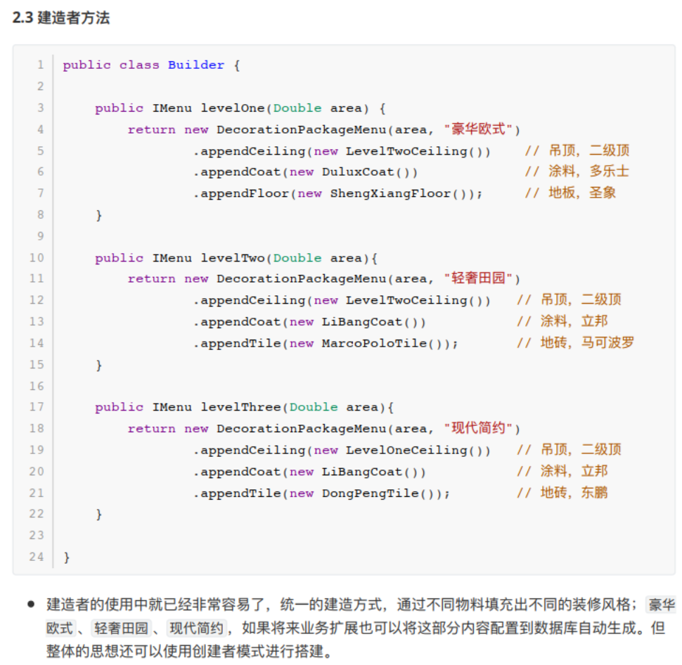
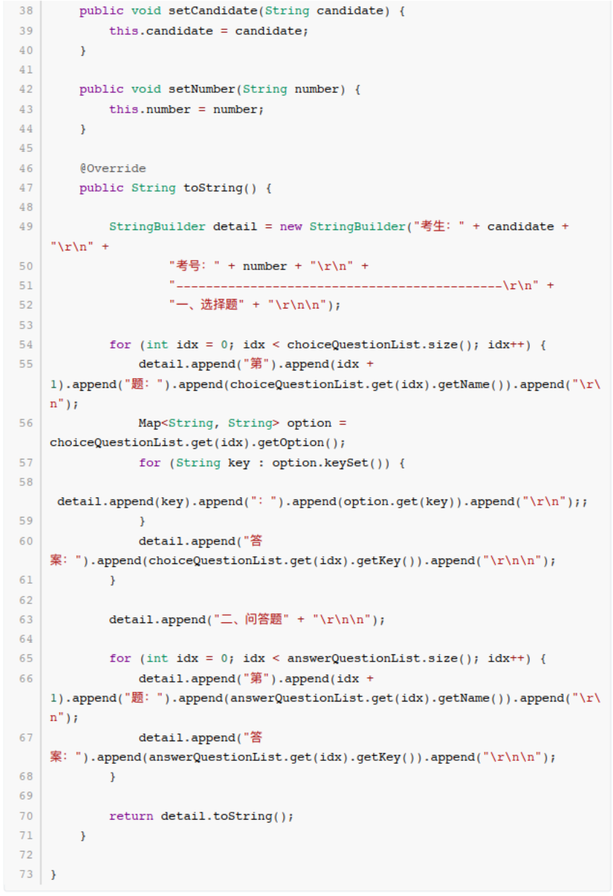
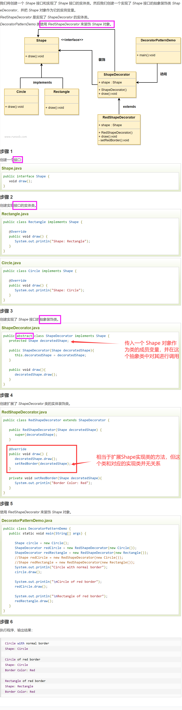

# 面向对象设计原则


1. **开闭原则**

**对扩展开放，对修改关闭**

在程序需要进行扩展的时候，**不能修改原来的代码，实现一个热插拔的效果**

为了使程序的扩展性好，易于维护和升级，需要使用接口和抽象类


2. **里式替换原则**

**任何基类可以出现的地方，子类一定可以出现**

LSP是继承复用的基石，只有当衍生类可以替换掉基类，软件单位的功能不受到影响时，基类才能真正被复用，而衍生类也能够**在基类的基础上增加新的行为**。

里氏代换原则是对“开-闭”原则的补充。实现“开-闭”原则的关键步骤就是**「抽象化」**。而基类与子类的继承关系就是抽象化的具体实现，所以里氏代换原则是对实现抽象化的具体步骤的规范。


3. **依赖倒转原则**

开闭原则的基础，**只对接口编程，依赖于抽象而不依赖于具体**


4. **接口隔离原则**

**使用多个隔离的接口，比使用单个接口要好**

**降低类之间的耦合度**

其实设计模式就是一个软件的设计思想，从**大型软件架构**出发，为了升级和维护方便。所以上文中多次出现：**降低依赖，降低耦合**。


5. **迪米特法则（最少知道法则）**

一个实体应当尽量少的与其他实体之间发生相互作用，使得系统功能模块相对独立


6. **合成复用原则**

尽量使用合成/聚合的方式，而不是使用**继承**。


**创建型**模式，共五种： 工厂方法模式、 抽象工厂模式、 单例模式、 建造者模式、原型模式。

**结构型**模式，共七种： 适配器模式、装饰器模式、 代理模式、外观模式、桥接模式、组合模式、 享元模式  

**行为型**模式，共十一种： 策略模式、模板方法模式、 观察者模式、迭代子模式、责任链模式、命令模式、备忘录模式、状态模式、访问者模式、中介者模式、解释器模式。  


# ——创建者模式——


# 单例模式

**创建型模式**


- **意图：**保证一个类仅有一个实例，并提供一个访问它的全局访问点。
- **主要解决：**一个全局使用的类频繁地创建与销毁。
- **何时使用：**当您想控制实例数目，节省系统资源的时候。
- **如何解决：**判断系统**是否已经有这个单例**，如果有则返回，如果没有则创建。
- **关键代码：**构造函数是私有的，即不能随机创建任意数目的实例对象。


> volatile没有原子性：singleton 单例模式 **"双重锁检查"**

```java
public class Singleton {
    private static Singleton singleton; //如果不使用volatile关键字
    
    //双重锁检验
    public static Singleton getInstance(){
        if(singleton == null){
            synchronized (Singleton.class){
                if(singleton == null){
                    singleton = new Singleton();
                }
            }
        }
        
        return singleton;
    }
}
```


如果这里的变量声明不使用volatile关键字，是可能会发生错误的。它可能会**被重排序**：

``` java
singleton = new Singleton();//未用volatile关键字声明

//可以分解为以下三个步骤
1 	memory = allocate()//分配内存
2 	ctorInstance(memory) //初始化对象
3 	singleton=memory //设置s指向刚分配的地址
    
//可能会被重排序为 1-3-2
1 	memory=allocate();// 分配内存 相当于c的malloc
3 	singleton=memory //设置s指向刚分配的地址，但对象还没有被初始化
2 	ctorInstance(memory) //初始化对象
```

如果线程A执行了1、3还没开始执行2，线程B执行到了`if(singleton == null)`，它会判定singleton不为空，然后直接返回了一个**未初始化完成**的singleton

> 如果将singleton声明为volatile的，volatile不允许volatile写与前面的操作 （`singleton = memory`）重排序
>
> 在`singleton = new Singleton()`过程中，**new操作将作为「原子操作」**，**不可重排序**


**线程安全**的单例模式写法：

1. 懒加载（慢）

```java
public class SafeLazyInitialization { 
   private static Resource resource; 
    
    //为整个方法加上synchronized锁。效率较低，有需要的时候才会创建
   public synchronized static Resource getInstance() { 
      if (resource == null) 
          resource = new Resource(); 
      return resource; 
    } 
}
```


2. 主动初始化（浪费资源 / 饿汉式）

```java
public class EagerInitialization { 
    // 在加载该类的时候就创建对象实例
    private static Resource resource = new Resource();
    
    // 私有化构造函数
    private Singleton(){}

    // 返回对象实例
    public static Resource getResource() { return resource; }
}
```


3. 延迟初始化（好像还不错）

```java
public class ResourceFactory { 
    
    //在静态内部类中初始化单例对象
    //在访问该类的静态单例变量时，这个静态内部类才会被初始化————延迟初始化
    private static class ResourceHolder { 
        public static Resource resource = new Resource(); 
    } 
    public static Resource getResource() { 
        return ResourceHolder.resource ; 
    } 
}
```


4. 二次检查锁定


```java
public class Singleton {
    private static volatile Singleton singleton; //如果不使用volatile关键字.....
    
    //双重锁检验
    public static Singleton getInstance(){
        if(singleton == null){//二次检查，比独占锁效率高
            synchronized (Singleton.class){
                if(singleton == null){
                    singleton = new Singleton();
                }
            }
        }
        
        return singleton;
    }
}
```


## 场景


1. 数据库的连接池不会反复创建
2. spring中一个单例模式 bean 的生成和使用
3. 需要设置全局的一些属性保存


## 静态类使用


```java
public class Singleton_00{
	public static Map<String, String> cache = new ConcurrentHashMap<String, String>();
}
```

- 在第一次运行的时候直接初始化 Map 类，同时也不需要到延迟加载再使用
- 仅仅用于**全局访问**，不需要维持任何**状态**
- 如果需要被继承以及需要**维持一些特定状态**的情况下，就适合使用单例模式


## 懒汉模式（线程不安全）


**懒：要用的时候才初始化**

**饿：不管用不用，都先初始化上再说**

```java
public class Singleton_01{
    private static Singleton_01 instance;
    
    // 这个构造一定要是私有的，不允许外部直接创建对象
    private Singleton_01(){}
    
    public static Singleton_01 getInstance(){
        if(null != instance){
            return instance;
        }
        // 在这一步完成之前，如果多个线程访问该方法，那么都会创建一个对象并返回
        instance = new Singleton_01();
        return instance;
    }
}
```

- 单例模式有一个特点就是不允许外部直接创建，因此这里在默认的构造函数上添加了私有属性 private 
- 如果有多个访问者同时去获取对象实例，就会造成多个同样的实例并存，没有达到单例的要求


## 懒汉模式（线程安全）


```java
public class Singleton_02{
	private static Singleton_02 instance;
    
    private Singleton_02(){
        
    }
    
    public static synchronized Singleton_02 getInstance(){
        if(null != instance){
            return instance;
        }
        instance = new Singleton_02();
        return instance;
    }
}
```


**对整个方法加了synchronized关键字，所有的线程进入这个方法都会等待**

虽然是线程安全的，但由于锁加到了方法上，所有的访问都需要锁占用导致资源浪费


## 饿汉模式（线程安全）


```java
public class Singleton_03 {	
    
	private static Singleton_03 instance = new Singleton_03();
    
	private Singleton_03() {
        
	}
    
    public static Singleton_03 getInstance() {
    	return instance;
    }
}
```

饿：不管用不用，**都先加载出来**，放在那

和「静态类使用」中的实例化 Map 基本一致，在程序启动的时候直接将运行加载，需要时直接获取

- 但此种方法并不是 「懒加载」：**无论程序中是否用到这样的类，都会在程序启动之初进行创建**
- **导致的问题：**比如游戏，游戏地图还没打开，但是程序已经将这些地图全部实例化，占用内存过多


## 使用静态内部类（线程安全、懒加载）

这种方式能达到双检锁方式一样的功效，但实现更简单。对静态域使用延迟初始化，应使用这种方式而不是双检锁方式。这种方式只适用于静态域的情况，双检锁方式可在实例域需要延迟初始化时使用。

这种方式同样**利用了 classloader 机制来保证初始化 instance 时只有一个线程**

和「饿汉模式」的区别：饿汉模式只要 Singleton 类被装载了，那么 instance 就会被实例化（**没有达到懒加载效果**），而这种方式是 Singleton 类被装载了，instance不一定被初始化。**因为 SingletonHolder 类被又被主动使用，只有通过显式掉一共 getInstance 方法时，才会显示装载 SingletonHolder 类，从而实例化 instance**

想象一下

- 如果**实例化 instance 很消耗资源**，所以**想让它延迟加载**

- 另外一方面，又不希望在 Singleton 类**加载时就实例化（不要使用饿汉模式加载）**，因为不能确保 Singleton 类还可能在其他的地方被主动使用，那么这个时候实例化 instance 显然是不合适的。这个时候，这种方式相比饿汉模式就显得很合理。


```java
public class Singleton_04{
    
    private static class SingletonHolder{
        private static Stingleton_04 instance = new Singleton_04();
    }
    
    private Singleton_04 getInstance(){
        return SingletonHolder.instance;
    }
}
```

- 既保证了**线程安全**，还保证了懒加载，也不会因为**<u>加锁的方式耗费性能</u>**
- **因为 JVM虚拟机 可以保证多线程并发访问的正确性，一个类的构造方法在多线程环境下可以被正确的加载**

**只有在访问到这个类的时候，类内的static变量才会被初始化**


## 双重锁校验（线程安全）


```java
public class Singleton_05{
    
    private static volatile Singleton_05 instance;
    
    private Singleton_05{
        
    }
    
    public static Singleton_05 getInstance(){
        if(null != instance){
            return instance;
        }
        
        synchronized(Singleton_05.class){
            
            // 这里还需要判断一次null，因为可能有多个线程等待着synchronized锁，那么被释放以后，其他线程就不能够再创建新对象了，所以需要判断一下
        	if(null == instance){
                instance = new Singleton_05();
            }    
        }
        return instance;
    }
}
```


- **双重锁方法其实就是方法级锁的优化，减少了部分获取实例的耗时**
- 也满足了懒加载

如果同时多个线程访问这个方法获取实例对象，其中一个进入synchronized块，


## CAS 「AtomicReference」（线程安全）


```java
public class Singleton_06{
    
    private statci final AtomicReference<Singleton_06> INSTANCE = new AtomicReference<Singleton_06>();
    
    private static  Singleton_06 instance;
    
    private Singleton_06(){
        
    }
    
    public static final Singleton_06 getInstance(){
        for(;;){
            Singleton_06 instance = INSTANCE.get();
            if(null != instance){
                return instance;
            }
            
            INSTANCE.compareAndSet(null, new Singleton_06());
            return INSTANCE.get();
        }
    }
    
    public static void main(String[] args){
        sout(Singleton_06.getInstance());
        sout(Singleton_06.getInstance());// same object
    }
    
}
```


- java 并发库提供了很多原子类支持并发访问的数据安全性：**AtomicInteger、AtomicBoolean、AtomicLong、AtomicReference**
- AtomicReference 可以封装引用一个 V 实例，**支持并发访问**
- 使用 CAS 的好处就是 **不需要使用传统的加锁方式保证线程安全，而是依赖于 「CAS的忙等算法」**，底层硬件实现，保证线程安全，
- **没有线程的切换和阻塞，也就没有了额外的开销，支持更大的并发**


多个线程访问该方法，如果本身已经被初始化，那么直接返回单例对象

否则，进行cas，不论cas失败/成功，最后这个引用一定是指向了单例对象

进行cas操作时，每次会读取内存中最新的值，与expect进行比较，**「原子操作」**，不会被打断这个过程，意味着同一时间只有一个线程在做这件事，后面的线程虽然 expect 为null，但内存中的instance值已经改变，cas返回 false


## Effective Java 推荐的枚举单例（线程安全）


```java
public enum Singleton_07{
    INSTANCE;
    
    public void test(){
        sout("hi~");
    }
}
```

**线程安全、自由串行化、单一实例**


调用方式：

```java
public void test(){
    Singleton_07.INSTANCE.test();
}
```

无偿提供了串行化机制，绝对防止对此实例化，即使面对复杂的串行化或者反射攻击的时候

**「单元素的枚举」成为实现 Singleton 的最佳方法**

继承场景不可使用（**枚举已经继承了 java.lang.enum 类**）


> 实际上和静态类是一样的，甚至静态类的效率更高一些


## 单例模式的选择


一般情况下，不建议使用懒汉方式（线程安全/不安全），建议使用饿汉方式。

只有在要明确实现 lazy loading 效果时，才会使用「静态内部类」的方式。

如果涉及到 **反序列化创建对象时**，可以尝试使用枚举方式。

其他情况均可使用双重检验锁方式


# （简单）工厂方法模式


创建型设计模式，在父类中提供一个创建对象的方法，允许子类决定实例化对象的类型


主要意图是定义一个**「创建对象的接口」**，让其子类自己决定**实例化哪一个工厂类**，**工厂模式使其创建过程延迟到子类进行**。  


这⾥里里我们模拟积分兑换中的发放多种类型商品，假如现在我们有如下三种类型的商品接口；  


- 三个接口返回类型不不同，有对象类型、布尔类型、还有一个空类型。
- 入参不不同，发放优惠券需要仿重、兑换卡需要卡ID、实物商品需要发货位置(对象中含有)。
- 另外可能会随着后续的业务的发展，会新增其他种商品类型。因为你所有的开发需求都是随着业务
  对市场的拓拓展⽽而带来的。  


定义发奖接口  

```java
public interface ICommodity {
	void sendCommodity(String uId, String commodityId, String bizId, Map<String, String> extMap) throws Exception;
}
```

- 所有的奖品无论是实物、虚拟还是第三方，都需要通过我们的程序实现此接口进行处理，以保证最终入参出参的统一性。
- 接口的入参包括； 用户ID 、 奖品ID 、 业务ID 以及 扩展字段 ⽤用于处理发放实物商品时的收获地址。  


接下来实现奖品发放接口：


或许还需要从map中取出发奖所需的额外信息：


- 每一种奖品的实现都包括在自己的类中，新增、修改或者删除都不会影响其他奖品功能的测试，降低回归测试的可能
- 后续在**新增的奖品**只需要按照此结构进行填充即可，非常易于维护和扩展。
  - 新创建一个奖品类 `NewCommodity implements Icommodity`，在这里面**实现发奖逻辑**即可
- 在统一了入参以及出参后，调用方**不再需要关心奖品发放的内部逻辑**，按照**统一的方式即可处理**。  


----

创建商店工厂


- 定义一个**商店的工厂类**，按照类型实现各种商品的服务。后续新增的商品在这里扩展即可

> 这里的工厂其实是简单工厂，即直接一个工厂类生产各种商品
>
> 如果需要扩展，则需要直接修改这个工厂的源代码，**违反了开闭原则**
>
> 见下文《简单工厂模式、工厂模式和抽象工厂模式》


测试：


-----

**工厂模式的用法和优势**


1. 定义方法接口！接口中有一个每个实现类都需要有不同实现的方法（发奖行为）。
2. 工厂方法返回的是：不同的实现类的对象，但是这些对象都被接口类所引用
3. 根据多态：接口类.方法()，即可执行各个具体实现类的操作
4. 将原本多轮if操作化为了一个if，执行的时候不需要知道具体是哪个实现类，因为这个接口引用的实现类已经在工厂中进行了实例化并返回，直接执行方法即可


**避免创建者与具体的产品逻辑耦合**

满足 **单一职责，每一个业务逻辑实现都在所属自己的类中完成**

满足 **开闭原则，无需更改 「使用调用方」，就可以在程序中 「引入新的产品类型」**


> 但这样也会带来一些问题，比如有非常多的奖品类型，那么**实现的子类会极速扩张**。因此也需要使⽤用其他的模式进行优化，这些在后续的设计模式中会逐步涉及到  


# 抽象工厂模式


抽象工厂模式与工厂方法模式虽然都是为了解决 **「接口选择问题」**，但实现上：

**抽象工厂是一个中心工厂，「创建其他工厂」的模式**


----

## 场景


很多时候初期业务的蛮荒发展，也会牵动着研发对系统的建设  

预估 QPS较低 、 系统压力力较⼩小 、 并发访问不大 、 近一年没有大动作 等等，在考虑时间投入成本的前提前，并不会投入特别多的人力去构建非常完善的系统。就像对 Redis 的使用，往往可能只要是单机的就可以满足现状。  

随着业务快速发展，单机redis满足不了系统需求。


随着这次的升级，可以预见的问题会有；

1. 很多服务⽤用到了Redis需要一起升级到**集群**。
2. 需要兼容**集群A和集群B**，便于后续的灾备。
3. 两套集群提供的**接口和方法**各有差异，需要做适配。
4. 不能影响到目前正常运行的系统。  


- 模拟一个集群服务，但是方法名与各业务系统中使用的方法名不同。


------

### 单集群代码使用


接口：


调用：


这就是最经典的使用场景了：

service实现类中注入RedisUtil工具类，实现工具类中各种调用方法的调用。

**当然，这里只有一个单机的RedisUtil的调用，应该分多种情况：单机、集群1、集群2**

### 垃圾代码实现


> ifelse 实现需求


简单说一下。。就是把三个redis的工具类都在serviceImpl实现类中实例化，根据传入的使用的redis类型参数，来执行某个redis工具类的具体方法。（if大法）


### 不能使用工厂模式？


在这个栗子中，三个redis的操作类的方法名称都不同，那么就没法用工厂模式来将他们都作为一个接口的实现类然后调用这个方法。


那么该如何实现「统一的操作」呢？


**就需要一个适配接口，来适配Service接口的方法**


两个适配接口的实现类就相当于生产出来的两个不同的产品，通过传入所需要生产的类型，直接生产出对应的对象


------

这时候可以把每个redis集群操作类中的方法（get, set, del...）**当成生产不同种类的小商品**，那么这两个集群操作类就是具体的工厂A、B，对应集群A、B


> 工厂模式中的例子，每个工厂只做一件事，就是发奖，只不过每个工厂的发奖逻辑不同，所以直接造出对应的产品类即可


集群A、B分别当成两个大工厂，方法（get, set, del...）**当成生产不同种类的小商品**，那么这时候就是 「**抽象工厂**」的形式了


## 抽象工厂模式重构代码


这里的抽象工厂的创建和获取方式，会采用代理类的方式进行实现。被代理的类就是目前的 Redis 操作方法类，让这个类在不需要任何修改下，就可以实现调用集群A和集群B的数据服务


并且，由于集群A和集群B在部分方法提供上是不同的，需要做一个接口适配，**这个适配类就相当于工厂中的工厂，用于创建把不同的服务抽象为统一的接口做相同的业务。**


----

适配接口（**和CacheService接口中的方法名称相同**）：


----

集群使用服务：


这两个实现其实很简单，就是两个实现类，分别使用自己所属的redis集群操作工具类，**来实现接口中定义的「统一名称」的方法**


----

### **定义抽象工程代理类和实现**


- getProxy方法：传入接口的实现类（ServiceImpl）的class对象作为需要代理的类，以及实现了适配接口的具体实现类（xxxCacheAdapter）。
- 返回代理的对象（该对象就是产生的代理类，是接口Service的实现类，和ServiceImpl没关系）

> ```java
> public static Object newProxyInstance(ClassLoader loader,  Class<?>[] interfaces, InvocationHandler h)
> ```
>
> - loader 自然是类加载器
> - interfaces 代码要用来代理的接口，这里就是CacheService
> - h 一个 InvocationHandler 对象↓


- 不能直接用method.invoke()
  - 这里实际上是新生成的代理类（service的实现类ServiceImpl）调用的invoke方法，那么在调用get等service方法时，需要在invoke方法中调用**Adapter**的方法，**并且Adapter中的方法名和Service接口中的方法名都相同，那么使用method.getName就可以通过调用的接口的方法名对应到适配器中的方法名，然后传入args并调用适配器中的这个方法**
- 通过穿透进来的集群服务进行方法操作
- 在 invoke 方法中，通过使用获取**方法名称**反射方式，调用**对应的适配器方法功能**


----

测试


## 总结

- 抽象工厂模式，解决的问题：一个**产品族**，存在多个**不同类型的产品**（Redis集群、操作系统），接口选择
- 单一职责、开闭原则、解耦  ，随着业务扩展，类实现较复杂。


**简单说，就是多个类共享一套接口方法，但是具体实现不同**


**解决了工厂方法模式的问题：在上面这个抽象工厂中，通过JDKProxy产生代理类，只需要传入参数：被代理的serviceImpl实现类、需要创建的工厂类型，就可以通过代理来实例化对象**


---

相比工厂方法模式：

两种方式最后生成的对象都需要使用接口来接收，区别在：

- 工程模式需要**「直接创建」工厂类**，而抽象工厂模式通过向代理类传入所需的工厂，来代理生产并调用所需工厂的方法生产实例对象

- **抽象工厂模式返回的是Service接口的实现类（通过代理生成）**，工厂模式返回的是实际的调用的(工具)实现类


对于抽象工厂来说，有一个适配器接口Adapter，**这个适配接口就是为了「适配Service接口」，使得通过jdk代理这种方式直接获得Service接口的实现类的代理，这个代理类中的方法对应着具体的Adapter实现类中的方法**


**这样就可以在ServiceImpl中省去注入这一步，直接调用所需方法，通过「代理」，触发invoke()方法，就会自动代理对应适配器实现类中的同名称方法**


# 简单工厂模式、工厂模式和抽象工厂模式


**简单工厂模式**（不属于23种设计模式）：

专门生产某个产品的类。

比如下图中的鼠标工厂，专业生产鼠标，给参数0，生产戴尔鼠标，给参数1，生产惠普鼠标。


其实上面讲的那种方式就是简单工厂模式


简单工厂模式有个问题：


类的创建依赖工厂类，想要扩展程序，必须对工厂类进行修改，**违反了开闭原则**


:zap: 解决办法：

定义一个创建对象的抽象方法，并创建多个不同的工厂类实现该抽象方法，这样一旦需要增加新的功能，<u>**直接增加新的工厂就可以了，不需要修改之前的代码**</u>

↓

----

**工厂模式**


如果还用简单工厂模式，要去修改工厂代码，增加一堆if else语句

而工厂模式直接创建两个工厂

工厂模式也就是**鼠标工厂**是个「**抽象类**」，有**生产鼠标这个方法**。
**戴尔鼠标工厂，惠普鼠标工厂**继承它，可以**分别生产**戴尔鼠标，惠普鼠标。
生产哪种鼠标**不再由参数决定**，而是创建鼠标工厂时，由戴尔鼠标工厂创建。
后续直接调用鼠标工厂.生产鼠标( )即可


通过不同的工厂会得到不同的实例化的对象

这时如果新增一个罗技品牌的鼠标，只要再增加一个 LogitechMouseFactory类：

```java
public class LogitechMouseFactory extends MouseFactory{
	@override
    public Mouse create createMouse(){
        return new LogitechMouse();
    }
}
```


:question: 工厂模式存在的问题与解决方法

客户端需要**创建类的具体的实例**。

简单来说就是：用户要造Hp鼠标，就要去惠普鼠标工厂，要造Dell鼠标，就要去Dell鼠标工厂。。。。。。

**当两个鼠标工厂发生变化了，用户也要跟着变化**

可以把工厂类抽象为接口，用户只需要去找默认的工厂提出自己的需求（**传入参数**），便能得到自己想要的产品，**而不用根据产品去寻找不同的工厂，方便用户操作**


----

**抽象工厂模式**


> 这里的抽象工厂模式讲的好像不准确。。。结合上文《抽象工厂模式》
>
> 三种工厂有点混乱了。。。:zap::zap:

抽象工厂模式也就是不仅生产鼠标，同时生产键盘。  

也就是PC厂商是个父类，有生产鼠标，生产键盘两个接口。  

戴尔工厂，惠普工厂继承它，可以分别生产戴尔鼠标+戴尔键盘，和惠普鼠标+惠普键盘。  

创建工厂时，由戴尔工厂创建。  

后续工厂.生产鼠标()则生产戴尔鼠标，工厂.生产键盘()则生产戴尔键盘。


**相当于是一个大工厂，生产多种小的商品。**


-----

那么这时，如果需要增加一个新产品？

- 每个品牌的工厂都需要再多生产一类产品，增加一个生产新产品的方法

- 新产品也需要一个接口，然后当多个品牌来实现这个接口以表示不同品牌的该新产品


---

---

---

### 抽象工厂


https://www.runoob.com/design-pattern/abstract-factory-pattern.html

**抽象工厂模式是围绕一个「超级工厂」创建「其他工厂」，故该超级工厂称为其他工厂的工厂。**


抽象工厂模式中，接口是负责创建一个相关对象的工厂，不需要显式指定他们的类。每个**生成的工厂**都能够**按照工厂模式提供对象**


- **意图：**提供一个创建一系列相关或相互依赖对象的接口，而无需指定它们具体的类

- **主要解决：**接口选择问题
- **何时使用：**系统的产品有多于一个的产品族，而系统只消费其中某一族的产品
- 在一个产品族中，定义多个产品；
- 在一个工厂里聚合多个同类产品

- **优点**：当一个产品族中的多个对象被设计成一起工作时，它能保证客户端始终只使用同一个产品族中的对象（**同一个产品类型工厂生产的同族实例对象**）
- 缺点：产品族扩展非常困难，要增加一个系列的某一个产品，既要在抽象的 Creator 里加代码，又要在具体的里面加代码。


----


这里有两个产品族：Shape和Color，对应着两个工厂，而这两个工厂由都是是超级工厂的实现类


形状接口及其实现类：


颜色接口及其实现类：


为 Color 和 Shape 对象创建抽象类来获取工厂：

```java
// AbstractFactory.java
public abstract class AbstractFactory {
   public abstract Color getColor(String color);
   public abstract Shape getShape(String shape) ;
}
```


创建扩展了 AbstractFactory 的工厂类，基于给定的信息生成实体类的对象。

```java
// ShapeFactory.java 负责生产shape产品族的各种产品，传入所需类型，返回实例对象
public class ShapeFactory extends AbstractFactory {
    
   @Override
   public Shape getShape(String shapeType){
      if(shapeType == null){
         return null;
      }        
      if(shapeType.equalsIgnoreCase("CIRCLE")){
         return new Circle();
      } else if(shapeType.equalsIgnoreCase("RECTANGLE")){
         return new Rectangle();
      } else if(shapeType.equalsIgnoreCase("SQUARE")){
         return new Square();
      }
      return null;
   }
   
   @Override
   public Color getColor(String color) {
      return null;
   }
}

// ColorFactory.java 负责生产color产品族的产品
public class ColorFactory extends AbstractFactory {
    
   @Override
   public Shape getShape(String shapeType){
      return null;
   }
   
   @Override
   public Color getColor(String color) {
      if(color == null){
         return null;
      }        
      if(color.equalsIgnoreCase("RED")){
         return new Red();
      } else if(color.equalsIgnoreCase("GREEN")){
         return new Green();
      } else if(color.equalsIgnoreCase("BLUE")){
         return new Blue();
      }
      return null;
   }
}
```


**创建一个 「工厂创造器、生成器类」，通过传递参数来选择创建 形状/颜色的工厂**

```java
// FactoryProducer.java
public class FactoryProducer {
   public static AbstractFactory getFactory(String choice){
      if(choice.equalsIgnoreCase("SHAPE")){
         return new ShapeFactory();
      } else if(choice.equalsIgnoreCase("COLOR")){
         return new ColorFactory();
      }
      return null;
   }
}
```


**使用 FactoryProducer ，传递参数来获取 AbstractFactory 的哪一个产品族工厂，通过传递类型信息来获取每个产品族具体要生成哪个种类的产品**

```java
public class AbstractFactoryPatternDemo {
   public static void main(String[] args) {
 
      //获取形状工厂
      // 这里都是使用抽象工厂类来接收，这个工厂对象 shapeFactory 只能通过接收固定参数，生成shape产品族的各种产品，而不能生成color产品族的产品
      AbstractFactory shapeFactory = FactoryProducer.getFactory("SHAPE");
 
      //获取形状为 Circle 的对象
      Shape shape1 = shapeFactory.getShape("CIRCLE");
 
      //调用 Circle 的 draw 方法
      shape1.draw();
 
      //获取形状为 Rectangle 的对象
      Shape shape2 = shapeFactory.getShape("RECTANGLE");
 
      //调用 Rectangle 的 draw 方法
      shape2.draw();
      
      //获取形状为 Square 的对象
      Shape shape3 = shapeFactory.getShape("SQUARE");
 
      //调用 Square 的 draw 方法
      shape3.draw();
 
      //获取颜色工厂
      AbstractFactory colorFactory = FactoryProducer.getFactory("COLOR");
 
      //获取颜色为 Red 的对象
      Color color1 = colorFactory.getColor("RED");
 
      //调用 Red 的 fill 方法
      color1.fill();
 
      //获取颜色为 Green 的对象
      Color color2 = colorFactory.getColor("Green");
 
      //调用 Green 的 fill 方法
      color2.fill();
 
      //获取颜色为 Blue 的对象
      Color color3 = colorFactory.getColor("BLUE");
 
      //调用 Blue 的 fill 方法
      color3.fill();
   }
}
```


> :zap: :zap: :zap: :zap: :zap: **「重点」​**
>
> 
>
> **区分了两个产品族，对应两个不同的「工厂」，实际上就是抽象工厂的核心**
>
> :star: 还有一点：工厂的生成也是需要一个工厂生成类来直接创建所需工厂，**而不是像工厂模式中直接new一个工厂类型**
>
> 传入参数，返回对应类型的工厂，使用抽象工厂 AbstractFactory 类来接收不同的工厂实例对象！


---

---

----

使用选择

- 简单工厂 ： 用来生产同一等级结构中的固定产品。（不支持拓展增加产品）

- 工厂方法 ：用来生产同一等级结构中的固定产品。（支持拓展增加产品）  

- 抽象工厂 ：用来生产**不同产品族**的**全部产品**。（支持拓展增加产品；支持增加产品族）  


- **简单工厂的适用场合**：只有伦敦工厂（只有这一个等级），并且这个工厂只生产三种类型的pizza：chesse,pepper,greak（固定产品）。

- **工厂方法的适用场合**：现在不光有伦敦工厂，还增设了纽约工厂（仍然是同一等级结构，但是支持了产品的拓展），这两个工厂依然只生产三种类型的pizza：chesse,pepper,greak（固定产品）。
- **抽象工厂的适用场合：**不光增设了纽约工厂（仍然是**同一等级**结构，但是支持了**产品的拓展**），这两个工厂还增加了一种新的类型的pizza：chinese pizza（增加产品族）。


**所以说抽象工厂就像工厂，而工厂方法则像是工厂的一种产品生产线。**因此，我们可以**用抽象工厂模式创建工厂**，而用工厂方法模式创建生产线。比如，我们可以使用**抽象工厂模式创建伦敦工厂和纽约工厂**，使用**工厂方法**实现cheese pizza和greak pizza的生产。类图如下：   


# 建造者模式


**意图：**将一个**复杂的构建**与其表示相分离，使得同样的**「构建过程」**可以创建**「不同的表示」**。

**主要解决：**主要解决在软件系统中，有时候面临着"**一个复杂对象**"的创建工作，其通常由各个部分的子对象用一定的算法构成；由于需求的变化，这个复杂对象的**各个部分经常面临着剧烈的变化，但是将它们组合在一起的算法却相对稳定。**

**何时使用：**一些基本部件不会变，而其组合经常变化的时候。

**如何解决：**将变与不变分离开。

**关键代码：**建造者：创建和提供实例，导演：管理建造出来的实例的依赖关系。

**应用实例：** 1、去肯德基，汉堡、可乐、薯条、炸鸡翅等是不变的，而其组合是经常变化的，生成出所谓的"套餐"。 2、**JAVA 中的 StringBuilder**

**优点：** 1、建造者独立，易扩展。 2、便于控制细节风险。

**缺点：** 1、产品必须有共同点，范围有限制。 2、如内部变化复杂，会有很多的建造类。

**使用场景：** 1、需要生成的对象具有复杂的内部结构。 2、需要生成的对象内部属性本身相互依赖。

**注意事项：**与工厂模式的区别是：建造者模式更加关注与零件装配的顺序。


相同的物料，不同的组装方式 —产生—> 具体的、内容

**构建 - 表示 分离**

同样的构建过程，使用不同的材料，构建出不同的内容

## 场景


模拟装修公司对于设计出一些套餐装修服务的场景


## 垃圾代码实现


就是用ifelse来具体的实现每一种装修风格，根据选择的样式的不同，来细化到选择每一种装修材料


- 这段冗余的的代码，要解决的问题就是接收入参：装修面积area和装修等级level，根据不同类型的装修等级选择不同的材料
- 每一段if块中，都包含着不同的材料，最终生成装修清单和装修成本


-----

测试验证：


目前勉强满足功能，但如果业务快速发展，提供很多的套餐针对不同的户型，那么还需要**增加很多个if块**，难以维护！


## 建造者模式重构代码


**建造者模式** 主要解决的问题是在软件系统中，面临“一个复杂对象”的创建工作，通常由**各个部分的子对象**用**「一定的过程」**构成

由于需求的变化，这个复杂对象的**各个部分经常面临着重大的变化（替换材料）**，但将他们组合在**一起的过程（往往是一套流程）**却相对稳定





测试：


## 总结


建造者模式其实就是对：

建造一个统一模式、不同组成部分的整体  的  **一种形式上的抽取**


- 一些基本物料不会变，而其组合经常变化
- 单一职责原则以及 **可复用的技术、建造者独立、易扩展**


# 原型模式


主要解决创建**重复对象**，**同时又能保证性能**，而这部分对象 内容本身比较复杂，**生成过程可能从「库 / RPC接口中获取数据的耗时较长」**，采用**克隆的方式**节省时间

实现一个原型接口，该接口用于创建当前对象的克隆。当**直接创建对象的代价比较大时**，则采用这种模式

> :chestnut:
>
> 一个对象需要在一个**高代价**的数据库操作之后被创建。我们可以缓存该对象，在下一个请求时返回它的**「克隆」**，在需要的时候更新数据库，以此来减少数据库调用。


**意图：**用原型实例指定创建对象的种类，并且通过拷贝这些原型创建新的对象。

**主要解决：**在运行期建立和删除原型。

**何时使用：** 1、当一个系统应该**「独立」**于它的产品创建，构成和表示时。 2、当要实例化的类是在运行时刻指定时，例如，通过动态装载。 3、为了避免创建一个与产品类层次平行的工厂类层次时。 4、当一个类的实例只能有几个不同状态组合中的一种时。建立相应数目的原型并**克隆它们**可能比每次用合适的状态**手工实例化**该类更方便一些。    

**如何解决：**利用已有的一个原型对象，**快速地生成和原型对象一样的实例**。

**关键代码：** 1、实现克隆操作，在 JAVA 继承 Cloneable，**重写 clone()** 2、原型模式同样用于**隔离**类对象的使用者和具体类型（易变类）之间的耦合关系，它同样要求这些"易变类"拥有稳定的接口。

**应用实例：** 1、细胞分裂。 2、JAVA 中的 Object clone() 方法。

**优点：** 1、**性能提高**。 2、逃避**构造函数**的约束（**通过clone生成**）

**缺点：** 1、配备克隆方法需要对类的功能进行通盘考虑，这对于全新的类不是很难，但对于已有的类不一定很容易，特别当一个类引用不支持串行化的间接对象，或者引用含有循环结构的时候。 2、必须实现 Cloneable 接口。

**使用场景：** 1、资源优化场景。 2、类初始化需要消化非常多的资源，这个资源包括数据、硬件资源等。 3、性能和安全要求的场景。 4、**通过 new 产生一个对象需要非常繁琐的数据准备或访问权限，则可以使用原型模式。** 5、一个对象多个修改者的场景。 6、一个对象需要提供给其他对象访问，而且各个调用者可能都**需要修改其值**时，可以考虑使用原型模式**拷贝多个对象供调用者使用**。 7、在实际项目中，原型模式很少单独出现，一般是和工厂方法模式一起出现，通过 clone 的方法创建一个对象，然后由工厂方法提供给调用者。原型模式已经与 Java 融为浑然一体，大家可以随手拿来使用。

**注意事项：**与通过对一个类进行实例化来构造新对象不同的是，原型模式是通过拷贝一个现有对象生成新对象的。浅拷贝实现 Cloneable，重写，深拷贝是通过实现 Serializable 读取二进制流。


## 场景


## 垃圾代码实现


按照每一个用户创建试卷的题目，并返回给调用方


这样的代码就是：**不面向对象，只面向过程**

不考虑扩展性，能用就行

以上的代码：创建选择题和问答题到集合中、定义详情字符串包装结果、返回结果内容


但以上的代码不能 **乱序**，所有人的试卷顺序都一样


## 原型模式重构代码


创建大量重复的类，我们模拟的场景：需要给不同的用户创建相同的试卷，**但试卷的题目肯定不能每次从试卷库抽取，或者RPC获取**，非常耗时


所以非常重要的就是 「**克隆**」，需要用到克隆的类中都需要实现 implements Cloneable 接口


这里的 `Collections.shuffle()` 将list打乱





主要操作的内容：

- 两个append()，对各项题目的添加，像建造者模式中使用的方式：添加装修物料
- clone()，核心操作就是「对象的复制、对两个集合的复制、打乱两个集合的顺序」
- 乱序操作，在 list 集合中有一个方法，Collections.shuffle，可以将原有集合的顺序打乱，输出一个新的顺序。


- 对外部提供创建试卷的方法，再创建的过程中使用的是 克隆 的方式，这个clone方法返回克隆好的对象


## 总结


原型设计模式的优点：便于通过克隆方式创建复杂对象，避免**重复做初始化操作**，不需要与类中所属的其他类耦合。

**如果对象中包含了循环引用的克隆，以及深度使用对象的克隆，都会更麻烦一些**


# ——结构型模式——


结构型模式包括：适配器、桥接、组合、装饰器、外观、享元、代理，这7类。  


# 适配器模式


适配器模式是作为两个不兼容的接口之间的桥梁。结合了两个独立接口的功能


涉及到一个单一的类，该类负责加入**独立的或不兼容的接口功能**

读卡器是作为内存卡和笔记本之间的适配器。您将内存卡插入读卡器，再将读卡器插入笔记本，这样就可以通过笔记本来读取内存卡。


**意图：**将一个类的接口**转换**成客户希望的另外一个接口。适配器模式使得原本由于**接口不兼容**而不能一起工作的那些类可以一起工作。

**主要解决：**主要解决在软件系统中，常常要将一些"现存的对象"**放到新的环境中**，而**新环境要求的接口是现对象不能满足的**。

**何时使用：** 1、系统需要使用现有的类，而此类的接口不符合系统的需要。 2、想要建立一个**可以「重复使用」的类**，用于与一些彼此之间没有太大关联的一些类，包括一些可能在将来引进的类一起工作，这些源类不一定有一致的接口。 3、通过接口转换，**将一个类插入另一个类系中**。（比如老虎和飞禽，现在多了一个飞虎，在不增加实体的需求下，增加一个适配器，在里面包容一个虎对象，实现飞的接口。）

**如何解决：**继承或依赖（推荐）。

**关键代码：**适配器继承或依赖已有的对象，实现想要的目标接口。

**应用实例：** 1、美国电器 110V，中国 220V，就要有一个适配器将 110V 转化为 220V。 2、JAVA JDK 1.1 提供了 Enumeration 接口，而在 1.2 中提供了 Iterator 接口，想要使用 1.2 的 JDK，则要将以前系统的 Enumeration 接口转化为 Iterator 接口，这时就需要适配器模式。 3、在 LINUX 上运行 WINDOWS 程序。 4、**JAVA 中的 jdbc**。

**优点：** 1、可以让任何两个没有关联的类一起运行。 2、提高了类的复用。 3、增加了类的透明度。 4、灵活性好。

**缺点：** 1、过多地使用适配器，会让系统非常零乱，不易整体进行把握。比如，明明看到调用的是 A 接口，其实内部被适配成了 B 接口的实现，一个系统如果太多出现这种情况，无异于一场灾难。因此如果不是很有必要，可以不使用适配器，而是直接对系统进行重构。 2.由于 JAVA 至多继承一个类，所以至多只能适配一个适配者类，而且目标类必须是抽象类。

**使用场景：**有动机地修改一个正常运行的系统的接口，这时应该考虑使用适配器模式。

**注意事项：**适配器不是在详细设计时添加的，而是解决正在服役的项目的问题。


通过下面的实例来演示适配器模式的使用。其中，音频播放器设备只能播放 mp3 文件，通过使用一个更高级的音频播放器来播放 vlc 和 mp4 文件。


```java
public class MediaAdapter implements MediaPlayer {
 
    // 将播放 MP4 和 vlc 格式的类插入这个适配器中，使得这个适配器可以播放这两种格式
    AdvancedMediaPlayer advancedMusicPlayer;

	// 
    public MediaAdapter(String audioType){
        if(audioType.equalsIgnoreCase("vlc") ){
            advancedMusicPlayer = new VlcPlayer();       
        } else if (audioType.equalsIgnoreCase("mp4")){
            advancedMusicPlayer = new Mp4Player();
        }  
    }

    @Override
    public void play(String audioType, String fileName) {
        if(audioType.equalsIgnoreCase("vlc")){
            advancedMusicPlayer.playVlc(fileName);
        }else if(audioType.equalsIgnoreCase("mp4")){
            advancedMusicPlayer.playMp4(fileName);
        }
    }
}
```


```java
public class AudioPlayer implements MediaPlayer {
    
    // 将适配器类插入到 mp3 播放器中，这样三种类型都可以播放了
    MediaAdapter mediaAdapter; 

    @Override
    public void play(String audioType, String fileName) {    

        //播放 mp3 音乐文件的内置支持
        if(audioType.equalsIgnoreCase("mp3")){
            System.out.println("Playing mp3 file. Name: "+ fileName);         
        } 
        //mediaAdapter 提供了播放其他文件格式的支持
        else if(audioType.equalsIgnoreCase("vlc") 
                || audioType.equalsIgnoreCase("mp4")){
            mediaAdapter = new MediaAdapter(audioType);
            mediaAdapter.play(audioType, fileName);
        }
        else{
            System.out.println("Invalid media. "+
                               audioType + " format not supported");
        }
    }   
}
```


适配器模式的主要作用就是把原本不兼容的接口，通过适配修改做到统一，使得用户方便使用，类似：万能充电器、数据线、转换头，都是为了适配各种不同的"口"，而做的兼容


业务开发中，经常需要做不同接口的兼容，尤其是 「中台服务」，把各个业务线的各种类型服务做**统一包装**，再**对外提供接口**进行使用


## 场景


**不同的业务接口会发送不同类型的消息，不能为每一个业务都开发一个MQ接口**


- 这里模拟三个不同类型的MQ 消息，在消息体中都有一些必要的字段，如：用户ID，时间，业务ID，但每个MQ的字段属性（名称）并不一样，uid / userID...

- 提供了两个不同类型的接口，查询内部订单下单数量，查询第三方是否首单
- 把这些不同类型的 MQ 和接口做适配兼容


## 垃圾代码实现


目前需要接收三个 MQ 消息，就有三个对应的类，但随着数量增加，就需要用设计模式来解决


三组MQ的消息都是一样的：


## 使用适配器模式重构代码


适配器主要解决的为就是：多种差异化类型的接口做统一输出，

> 在工厂模式中，对多种奖品，定义一个发奖接口，接收相同类型的参数，使用Map封装多余的信息，在每个实现类中对其进行具体的发奖逻辑实现，其实也是适配器的引用


link：Mq消息体中的属性名称 —— 实体类中的属性名称

obj就是json转为Map类型的键值对，是属性和值的映射


接口做了统一的包装，外部使用的时候不需要关心内部的具体逻辑，传入统一的参数即可


# 桥接模式


> **通过将抽象部分与实现部分分离，把多种可匹配的使用进行组合**
>
> 核心实现：**A类中含有B类接口，通过构造函数传递B类的实现，这个B类就是设计的桥**


桥接模式，是用于把 **抽象化与实现化解耦，使得二者可以独立变化**

涉及一个作为桥接的接口，使得**实体类的功能独立于接口实现类**。这两种类型的类可被结构化改变而互不影响


**意图：**将**抽象部分与实现部分分离**，使它们都可以独立的变化。

**主要解决：**在有多种可能会变化的情况下，用继承会造成**类爆炸**问题，扩展起来不灵活。

**何时使用：**实现系统可能有**多个角度**分类，**每一种角度都可能变化**。

**如何解决：**把这种多角度分类分离出来，让它们独立变化，**减少它们之间耦合。**

**关键代码：**抽象类依赖实现类。

**应用实例：** 1、猪八戒从天蓬元帅转世投胎到猪，转世投胎的机制将尘世划分为两个等级，即：灵魂和肉体，前者相当于抽象化，后者相当于实现化。生灵通过功能的委派，调用肉体对象的功能，使得生灵可以动态地选择。 2、墙上的开关，可以看到的开关是抽象的，**不用管里面具体怎么实现的**。

**优点：** 1、抽象和实现的分离。 2、优秀的扩展能力。 3、实现细节对客户透明。

**缺点：**桥接模式的引入会增加系统的理解与设计难度，由于聚合关联关系建立在抽象层，要求开发者针对抽象进行设计与编程。

**使用场景：** 1、如果一个系统需要在构件的抽象化角色和具体化角色之间增加更多的灵活性，避免在两个层次之间建立**「静态的继承联系」**，通过桥接模式可以使它们在抽象层建立一个关联关系。 2、对于那些**不希望使用继承或因为多层次继承导致系统类的个数急剧增加**的系统，桥接模式尤为适用。 3、一个类存在**两个独立变化的维度**，且这两个维度**都需要进行扩展**。

JDBC多种驱动程序的实现、同品牌类型的台式机和笔记本平板、业务实现中的多类接⼝同组过滤服务 等。这些场景都⽐较适合使⽤桥接模式进⾏实现，因为在⼀些组合中如果有如果每⼀个类都实现不同的 服务可能会出现笛卡尔积，⽽使⽤桥接模式就可以⾮常简单

**注意事项：**对于两个**「独立变化的维度:question: 」**，使用桥接模式再适合不过了。


---


将抽象和实现放在两个不同的类层次中，使它们可以独立地变化。——《Head First 设计模式》

---


**将类的功能层次结构和实现层次结构相分离**，**使二者能够独立地变化**，**并在两者之间搭建桥梁，实现桥接**。—— 《图解设计模式》

类的功能层次结构：父类具有基本功能，在子类中增加新的功能；

类的实现层次结构：父类通过声明抽象方法来定义接口，子类通过实现具体方法来实现接口；


桥接模式中有四个角色：

**抽象化角色**：使用实现者角色提供的接口来定义基本功能接口。

持有实现者角色，并在功能接口中委托给它，起到搭建桥梁的作用；

注意，抽象化角色**<u>并不是指它就是一个抽象类</u>**，而是指**<u>抽象了实现</u>**。

**改善后的抽象化角色**：作为抽象化角色的子类，**增加新的功能（引入实现者，调用实现者的方法）**，也就是增加新的接口（方法）；与其构成类的功能层次结构；

**实现者角色**：提供了用于抽象化角色的接口；它是一个抽象类或者接口。

**具体的实现者角色**：作为实现者角色的子类，通过实现具体方法来实现接口；与其构成类的实现层次结构。

如果抽象和实现两者做不到独立地变化，就不算桥接模式。


----

例子：


Shape的实现类 Circle 就是抽象了实现，其实是使用的 DrawDPI 的实现类实现的方法 drawCircle() ，来完成自己这个方法的实现，从而做到了分离、独立变化


具体的实现类放在作为**“桥梁”的接口中实现**，而“桥梁”接口中只有实现功能的抽象方法；具体实现类是继承“桥梁”，而**不直接继承实现类的抽象类（指Shape）**，抽象类Shape与具体的实现类RedCircle/GreenCircle在**结构上是相互独立的**，两者的相互变化并不会**影响到彼此**，只要“桥梁”没变，两者的变化并不会影响到彼此。

就以上教程的实例程序来说，具体的实现是RedCircle、GreenCircle，它们的抽象类为Shape，按一般逻辑来说，我们是**直接继承Shape来创建不同的具体对象**，但桥接模式中是通过**「“桥梁” DrawAPI」**建立**「抽象与具体实现之间的联系」**，**调用DrawAPI中的方法来具体实现**。


> 猪八戒投胎，灵魂在河的一边，河对面有两个肉体，红猪和绿猪；
>
> 灵魂需要过桥，选择红猪的肉体或者绿猪的肉体完成投胎。
>
> 在上面的例子中，红猪和绿猪就是 RedCircle 和 GreenCircle，灵魂是 Circle 类，而那座桥就是 drawAPI 这个接口。


## 场景


**多支付方式 —— 多密码模式 的结合**

那么最简单的就是使用 if-else


----

----

---

**桥接模式重构代码**


从 ifelse看，**本质就是两种不同类型的相互组合**，那么可以把 **支付方式和支付模式进行分离，通过「抽象类依赖实现类的方式进行桥接」**，通过这样拆分后支付与模式可以单独使用，

当需要组合的时候只需要**「把模式传递给支付」**即可


> **桥接模式的关键是选择的桥节点拆分，是否可以找到这样类似的相互组合**


-----

- **两种不同模式，每个模式包括多种选择的组合**
- 单一职责、开闭原则，易于维护和拓展


# 组合模式


**把一组相似的对象当作一个单一的对象**

依据树形结构来组合对象，用来表示部分以及整体层次。这种类型的设计模式属于结构型模式，它创建了对象组的树形结构。

这种模式创建了一个包含自己对象组的类。该类提供了**修改相同对象组**的方式。


**意图：**将对象组合成**树形结构**以表示**"部分-整体"**的层次结构。组合模式使得用户对单个对象和组合对象的使用具有一致性。

**主要解决：**它在我们树型结构的问题中，**模糊**了简单元素和复杂元素的概念，客户程序可以**像处理简单元素一样来处理复杂元素**，从而使得客户程序与复杂元素的内部结构解耦。

**何时使用：** 1、您想表示对象的部分-整体层次结构（树形结构）。 2、您希望用户**忽略组合对象与单个对象的不同**，用户将**统一地使用组合结构中的所有对象。**

**如何解决：**树枝和叶子实现统一接口，树枝内部组合该接口。

**关键代码：**树枝内部组合该接口，并且含有内部属性 List，里面放 Component。

**应用实例：** 1、算术表达式包括操作数、操作符和另一个操作数，其中，另一个操作数也可以是操作数、操作符和另一个操作数。 2、在 JAVA AWT 和 SWING 中，对于 Button 和 Checkbox 是树叶，Container 是树枝。

**优点：** 1、高层模块**调用简单**。 2、节点自由增加。

**缺点：**在使用组合模式时，其叶子和树枝的声明**都是实现类**，而不是接口，违反了依赖倒置原则。

**使用场景：**部分、整体场景，如**树形菜单，文件、文件夹**的管理。

**注意事项：**定义时为具体类。


----

这种设计⽅式可以让你的服务组节点进⾏**⾃由组合对外提供服务**，例如你有三个原⼦校验功能( A：身份 证 、 B：银⾏卡 、 C：⼿机号 )服务并对外提供调⽤使⽤。

有些调⽤⽅需要使⽤AB组合，有些调⽤⽅需要 使⽤到CBA组合，还有⼀些可能只使⽤三者中的⼀个。那么这个时候你就可以**使⽤组合模式**进⾏构建服 务，对于不同类型的调⽤⽅**配置不同的组织关系树**，⽽这个树结构你可以配置到数据库中也可以不断的 通过图形界⾯来控制树结构


----

-----


----

1、组合模式，就是在**一个对象中包含其他对象**，这些被包含的对象可能是**终点对象**（不再包含别的对象），也有可能是**非终点对象**（其内部还包含其他对象，或叫组对象），我们**将对象称为节点**，即一个根节点包含许多子节点，这些子节点有的不再包含子节点，而有的仍然包含**子节点**，以此类推。

2、所谓组合模式，其实说的是**「对象包含对象」**的问题，通过组合的方式（在对象内部引用对象）来进行布局，我认为这种组合是区别于继承的，而另一层含义是指**树形结构**子节点的抽象（将叶子节点与数枝节点抽象为子节点），区别于普通的分别定义叶子节点与数枝节点的方式。

3、并且这些包含的对象**「都是一个类的不同实例」**，只是区分了上下层级，从而形成了**「包含的关系」**


**一系列简单逻辑节点或者扩展的复杂逻辑节点在不同结构的组织下，对于外部的调用时仍然可以非常简单的**


# 过滤器模式


过滤器模式（Filter Pattern）或标准模式（Criteria Pattern）是一种设计模式，这种模式允许开发人员使用不同的标准来**过滤一组对象**，通过逻辑运算以解耦的方式把它们连接起来。这种类型的设计模式属于结构型模式，**它结合多个标准来获得单一标准。**


----

过滤模式的实现在java8里面有典型的应用方法就是分组操作，可以根据指定的指标进行分组筛选。

```java
Map<Integer, List<Person >> groupMap = persons.stream().collect(Collectors.groupingBy(Person::getGender));
groupMap.forEach((k, v) -> {
    System.out.println(k);
    v.forEach(System.out::println);
});
```

得到的结果形式就是：

-  **k**：是分组的指标，上面代码中的 gender
-  **v**：是一个list的集合对象，就是 personList


----

Java8 中有单独的过滤器。

```java
List<String> aList = Lists.newArrayList("1","2","");
// 过滤只有符合过滤条件的才会被保留
aList.stream().filter(x -> StringUtils.isNotEmpty(x))
```

这个方法可以可获取到全部非空的字符串。


# 装饰器模式


允许向一个现有的对象添加新的功能，同时又不改变其结构。这种类型的设计模式属于结构型模式，它是作为现有的类的一个包装。


这种模式创建了一个装饰类，用来包装原有的类，并在保持类方法签名完整性的前提下，提供了额外的功能。


**意图：**动态地给一个对象添加一些额外的职责。就增加功能来说，装饰器模式相比生成子类更为灵活。

**主要解决：**一般的，我们为了扩展一个类经常使用继承方式实现，由于继承**为类引入静态特征**，并且随着扩展功能的增多，**子类会很膨胀**。

**何时使用：**在不想增加很多子类的情况下扩展类。

**如何解决：**将具体功能职责划分，同时继承装饰者模式。

**关键代码：** 1、Component 类充当抽象角色，不应该具体实现。 2、修饰类引用和继承 Component 类，具体扩展类重写父类方法。

**优点：**装饰类和被装饰类可以**独立发展**，不会相互耦合，装饰模式是**继承的一个替代模式，装饰模式可以动态扩展一个实现类的功能。**

**缺点：**多层装饰比较复杂。

**使用场景：** 1、扩展一个类的功能。 2、动态增加功能，动态撤销。

**注意事项：**可代替继承。


**不改变原有类，可能会想到 继承、AOP切面，但是装饰器用的思路更为灵活，避免继承导致的子类过多，也可以避免 AOP 带来的复杂性**


---

---





使用装饰器模式满足单一职责原则，可以在自己的装饰类中完成 **「功能逻辑的扩展」**，而不影响主类，同时可以按需在运行时添加和删除这部分逻辑。

装饰器模式实现的重点：对抽象类继承接口方法的使用，同时设定被继承的接口可以**通过构造函数传递**其**实现类**，由此增加扩展性并重写方法里可以实现此部分父类实现的功能


# 外观模式


**隐藏系统的复杂性**，并向客户端**提供**一个客户端可以访问系统的**接口**。

也叫 **门面模式**，**降低调用方的使用接口的复杂逻辑组合**，提供方提供了一个中间层，用于包装逻辑提供 API 接口。

有些时候外观模式也被⽤在**中间件层**，对服务中的通⽤性复杂逻辑进⾏**中间件层包装**，让使⽤⽅可以只关⼼业务开发。

涉及到一个单一的类，该类提供了客户端**请求的简化方法**和对现有系统类方法的**委托调用**。


**意图：**为子系统中的一组接口提供一个一致的界面，外观模式定义了一个高层接口，这个接口使得这一子系统更加容易使用。

**主要解决：**降低访问复杂系统的**内部子系统时的复杂度**，简化客户端之间的接口。

**何时使用：** 1、客户端不需要知道系统内部的复杂联系，整个系统只需提供一个"接待员"即可。 2、定义系统的入口。

**如何解决：**客户端不与系统耦合，外观类与系统耦合。

**关键代码：**在客户端和复杂系统之间再加一层，这一层将调用顺序、依赖关系等处理好。

**应用实例：** 1、去医院看病，可能要去挂号、门诊、划价、取药，让患者或患者家属觉得很复杂，如果有提供接待人员，只让接待人员来处理，就很方便。 2、**JAVA 的三层开发模式**。

**优点：** 1、减少系统相互依赖。 2、提高灵 活性。 3、提高了安全性。

**缺点：**不符合开闭原则，如果要改东西很麻烦，继承重写都不合适。

**使用场景：** 1、为复杂的模块或子系统提供外界访问的模块。 2、子系统相对独立。 3、预防低水平人员带来的风险。

**注意事项：**在层次化结构中，可以使用外观模式定义系统中每一层的入口。


----


电脑的例子更形象：

电脑整机是 CPU、内存、硬盘的外观。有了外观以后，启动电脑和关闭电脑都简化了。

直接 **new 一个电脑**。

在 **new 电脑的同时把 cpu、内存、硬盘都初始化好并且接好线**。

对外暴露方法（启动电脑，关闭电脑）。

启动电脑（按一下电源键）：启动CPU、启动内存、启动硬盘

关闭电脑（按一下电源键）：关闭硬盘、关闭内存、关闭CPU


# 享元模式


主要用于减少创建对象的数量，以减少内存占用和提高性能


这种类型的设计模式属于结构型模式，它提供了**减少对象数量**从而改善应用所需的对象结构的方式。

享元模式尝试**重用现有的同类对象**，如果未找到匹配的对象，则创建新对象。


-----

**意图：**运用共享技术有效地支持大量细粒度的对象。

**主要解决：**在有大量对象时，有可能会造成**内存溢出**，我们把其中共同的部分抽象出来，如果有相同的业务请求，直接返回在内存中已有的对象，避免重新创建。

**何时使用：** 1、系统中有大量对象。 2、这些对象**消耗大量内存**。 3、这些对象的状态大部分可以外部化。 4、这些对象可以按照内蕴状态分为很多组，当把外蕴对象从对象中剔除出来时，每一组对象都可以用一个对象来代替。 5、系统不依赖于这些对象身份，这些对象是不可分辨的。

**如何解决：**用**唯一标识码**判断，如果在内存中有，则返回这个唯一标识码所标识的对象。

**关键代码：**用 **「HashMap」** 存储这些对象。

**应用实例：** 1、JAVA 中的 String，如果有则返回，如果没有则创建一个字符串保存在**字符串缓存池**里面。 2、数据库的数据池。

**优点：**大大减少对象的创建，降低系统的内存，使效率提高。

**缺点：**提高了系统的复杂度，需要分离出外部状态和内部状态，而且外部状态具有固有化的性质，不应该随着内部状态的变化而变化，否则会造成系统的混乱。

**使用场景：** 1、系统有大量相似对象。 2、需要**缓冲池**的场景。

**注意事项：** 1、注意划分外部状态和内部状态，否则可能会引起线程安全问题。 2、这些类必须有一个工厂对象加以控制。


----

----


# 代理模式


一个类代表另一个类的功能


**意图：**为其他对象提供一种代理以控制对这个对象的访问。

**主要解决：**在直接访问对象时带来的问题，比如说：要访问的对象在远程的机器上。在面向对象系统中，有些对象由于某些原因（比如对象创建开销很大，或者某些操作需要安全控制，或者需要进程外的访问），直接访问会给使用者或者系统结构带来很多麻烦，我们可以**在访问此对象时加上一个对此对象的访问层。**

**何时使用：**想在**访问一个类时做一些控制**。

**如何解决：**增加**中间层**。

**关键代码：**实现与被代理类组合。

**应用实例：** 1、Windows 里面的快捷方式。 2、猪八戒去找高翠兰结果是孙悟空变的，可以这样理解：把高翠兰的外貌抽象出来，高翠兰本人和孙悟空都实现了这个接口，猪八戒访问高翠兰的时候看不出来这个是孙悟空，所以说孙悟空是高翠兰代理类。 3、买火车票不一定在火车站买，也可以去代售点。 4、一张支票或银行存单是账户中资金的代理。支票在市场交易中用来代替现金，并提供对签发人账号上资金的控制。 5、spring aop。

**优点：** 1、职责清晰。 2、**高扩展性**。 3、智能化。

**缺点：** 1、由于在客户端和真实主题之间**增加了代理对象**，因此有些类型的代理模式可能会造成请求的处理速度变慢。 2、实现代理模式需要额外的工作，有些代理模式的实现非常复杂。

**使用场景：**按职责来划分，通常有以下使用场景： 1、远程代理。 2、虚拟代理。 3、Copy-on-Write 代理。 4、保护（Protect or Access）代理。 5、Cache代理。 6、防火墙（Firewall）代理。 7、同步化（Synchronization）代理。 8、智能引用（Smart Reference）代理。

**注意事项：** 1、和适配器模式的区别：适配器模式主要改变所考虑对象的接口，而代理模式**不能改变所代理类的接口**。 2、和装饰器模式的区别：装饰器模式为了增强功能，而代理模式是为了加以控制。


---

---


-----

Java代理


https://www.cnblogs.com/cC-Zhou/p/9525638.html


# ——行为型模式——


# 责任链模式


为请求创建了一个接收者对象的链。这种模式给予请求的类型，**对请求的发送者和接收者进行解耦**。


通常每个接收者都包含对另一个接收者的引用。如果一个对象不能处理该请求，那么它会**把相同的请求传给下一个接收者**，依此类推。


**意图：**避免请求发送者与接收者耦合在一起，让多个对象都有可能接收请求，将这些对象连接成一条链，并且沿着这条链传递请求，直到有对象处理它为止。

**主要解决：** **「职责链」**上的处理者负责处理请求，客户只需要将请求发送到职责链上即可，无须关心请求的处理细节和请求的传递，所以职责链将请求的发送者和请求的处理者解耦了。

**何时使用：**在处理消息的时候以过滤很多道。

**如何解决：**拦截的类都**实现统一接口**。

**关键代码：**Handler 里面聚合它自己，在 HandlerRequest 里判断是否合适，如果没达到条件则向下传递，向谁传递之前 set 进去。

**应用实例：** 1、红楼梦中的"击鼓传花"。 2、JS 中的事件**冒泡**。 3、JAVA WEB 中 Apache Tomcat 对 **Encoding** 的处理，Struts2 的**拦截器**，jsp servlet 的 **Filter**。

**优点：** 1、降低耦合度。它将请求的发送者和接收者解耦。 2、简化了对象。使得对象不需要知道**链的结构**。 3、增强给对象指派职责的灵活性。通过改变链内的成员或者调动它们的次序，允许动态地新增或者删除责任。 4、增加新的请求处理类很方便。

**缺点：** 1、不能保证请求一定被接收。 2、系统性能将受到一定影响，而且在进行代码调试时不太方便，可能会造成循环调用。 3、可能不容易观察运行时的特征，有碍于除错。

**使用场景：** 1、有多个对象可以**处理同一个请求**，具体哪个对象处理该请求由运行时刻自动确定。 2、在**不明确指定接收者**的情况下，向多个对象中的一个提交一个请求。 3、**可动态指定一组对象处理请求**。

**注意事项：**在 JAVA WEB 中遇到很多应用。


# 命令模式


数据驱动的设计模式


请求以命令的形式包裹在对象中，并传给调用对象。调用对象寻找可以处理该命令的合适的对象，并把该命令传给相应的对象，该对象执行命令。


**意图：**将一个请求封装成一个对象，从而使您可以用不同的请求对客户进行参数化。

**主要解决：**在软件系统中，行为请求者与行为实现者通常是一种紧耦合的关系，但某些场合，比如需要对行为进行记录、撤销或重做、事务等处理时，这种**无法抵御变化的紧耦合**的设计就不太合适。

**何时使用：**在某些场合，比如要对行为进行"记录、撤销/重做、事务"等处理，这种无法抵御变化的紧耦合是不合适的。在这种情况下，如何将"行为请求者"与"行为实现者"解耦？**将一组行为抽象为对象，可以实现二者之间的松耦合。**

**如何解决：**通过**调用者调用接受者执行命令**，顺序：**调用者→命令→接受者。**

**关键代码：**定义三个角色：1、received 真正的命令执行对象 2、Command 3、invoker 使用命令对象的入口

**应用实例：**struts 1 中的 action 核心控制器 ActionServlet 只有一个，相当于 Invoker，而模型层的类会随着不同的应用有不同的模型类，相当于具体的 Command。

**优点：** 1、降低了系统耦合度。 2、新的命令可以很容易添加到系统中去。

**缺点：**使用命令模式可能会导致某些系统有过多的具体命令类。

**使用场景：**认为是命令的地方都可以使用命令模式，比如： 1、GUI 中每一个按钮都是一条命令。 2、模拟 CMD。

**注意事项：**系统需要支持命令的撤销(Undo)操作和恢复(Redo)操作，也可以考虑使用命令模式，见命令模式的扩展。


**将具体执行命令的方法做一层包装，将表示不同操作的实现类(Stock)传入代表具体操作的类（Buy/Sell Stock）中，但是这些类实现了同一个接口（Order），所以他们都实现了execute()方法，只是该方法的实现逻辑不同，最终通过调用一系列 Order 接口的实现类，来统一命令操作（执行execute() 方法，获得不同效果）**


# 解释器模式


提供了评估语言的语法或表达式的方式，它属于行为型模式。

这种模式实现了一个**表达式接口**，该接口**解释一个特定的上下文**。这种模式被用在 SQL 解析、符号处理引擎等。


**意图：**给定一个语言，定义**它的文法表示**，并定义一个解释器，这个解释器使用该标识来解释语言中的句子。

**主要解决：**对于一些固定文法构建一个解释句子的解释器。

**何时使用：**如果一种特定类型的问题发生的频率足够高，那么可能就值得将该问题的各个实例表述为一个简单语言中的句子。这样就可以构建一个解释器，该解释器通过解释这些句子来解决该问题。

**如何解决：**构建**语法树，定义终结符与非终结符**。

**关键代码：**构建环境类，包含解释器之外的一些全局信息，一般是 HashMap。

**应用实例：**编译器、运算表达式计算。

**优点：** 1、可扩展性比较好，灵活。 2、增加了新的解释表达式的方式。 3、易于实现简单文法。

**缺点：** 1、可利用场景比较少。 2、对于复杂的文法比较难维护。 3、解释器模式会引起类膨胀。 4、解释器模式采用递归调用方法。

**使用场景：** 1、可以将一个需要解释执行的语言中的句子表示为一个抽象语法树。 2、一些重复出现的问题可以用一种简单的语言来进行表达。 3、一个简单语法需要解释的场景。

**注意事项：**可利用场景比较少，JAVA 中如果碰到可以用 expression4J 代替。


# 迭代器模式


是 Java 和 .Net 编程环境中非常常用的设计模式。这种模式用于顺序访问集合对象的元素，**不需要知道集合对象的底层表示**。


-----

**意图：**提供一种方法顺序访问一个聚合对象中各个元素, 而又无须暴露该对象的内部表示。

**主要解决：**不同的方式来遍历整个整合对象。

**何时使用：**遍历一个聚合对象。

**如何解决：**把在元素之间游走的责任交给迭代器，而不是聚合对象。

**关键代码：**定义接口：**hasNext, next**

**应用实例**： **JAVA 中的 iterator**

**优点：** 1、它支持以不同的方式**遍历一个聚合对象**。 2、迭代器简化了聚合类。 3、在同一个聚合上**可以有多个遍历**。 4、在迭代器模式中，**增加新的聚合类和迭代器类**都很方便，无须修改原有代码。

**缺点：**由于迭代器模式将**存储数据**和**遍历数据**的**「职责分离」**，增加新的聚合类需要对应增加新的迭代器类，类的个数成对增加，这在一定程度上增加了系统的复杂性。

**使用场景：** 1、访问一个聚合对象的内容而**无须暴露它的内部表示**。 2、需要为聚合对象提供多种遍历方式。 3、为遍历不同的聚合结构提供一个统一的接口。

**注意事项：**迭代器模式就是分离了集合对象的遍历行为，抽象出一个迭代器类来负责，这样既可以做到不暴露集合的内部结构，又可让外部代码透明地访问集合内部的数据。


# 中介者模式


在现实生活中，有很多中介者模式的身影，例如QQ游戏平台，聊天室、QQ群、短信平台和房产中介。不论是QQ游戏还是QQ群，它们都是充当一个中间平台，QQ用户可以登录这个中间平台与其他QQ用户进行交流，如果没有这些中间平台，我们如果想与朋友进行聊天的话，可能就需要当面才可以了。电话、短信也同样是一个中间平台，有了这个中间平台，每个用户都不要直接依赖与其他用户，只需要依赖这个中间平台就可以了，一切操作都由中间平台去分发。

中介者模式，定义了一个中介对象来封装一系列对象之间的交互关系。中介者使各个对象之间不需要显式地相互引用，从而使耦合性降低，而且可以独立地改变它们之间的交互行为。


