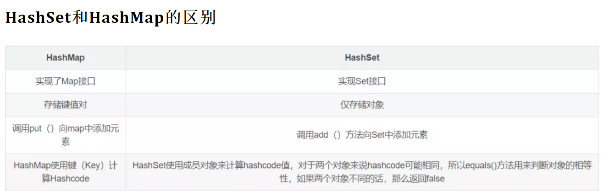
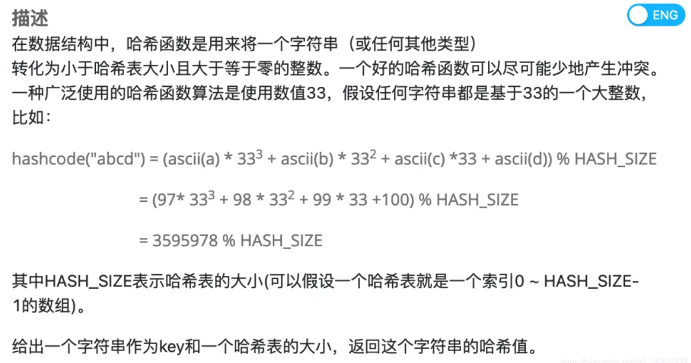
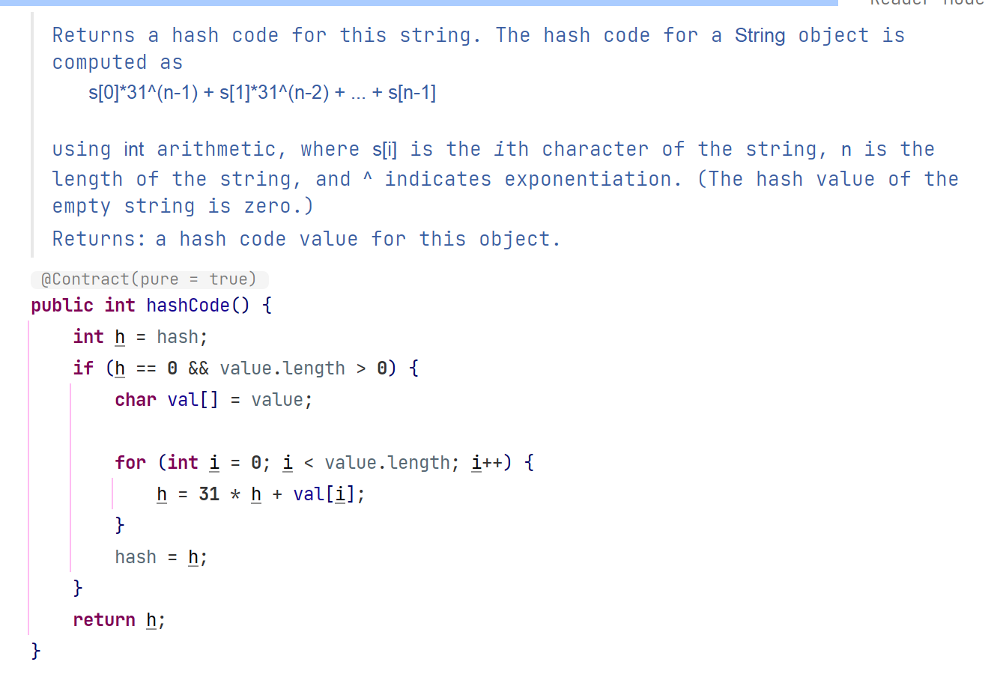
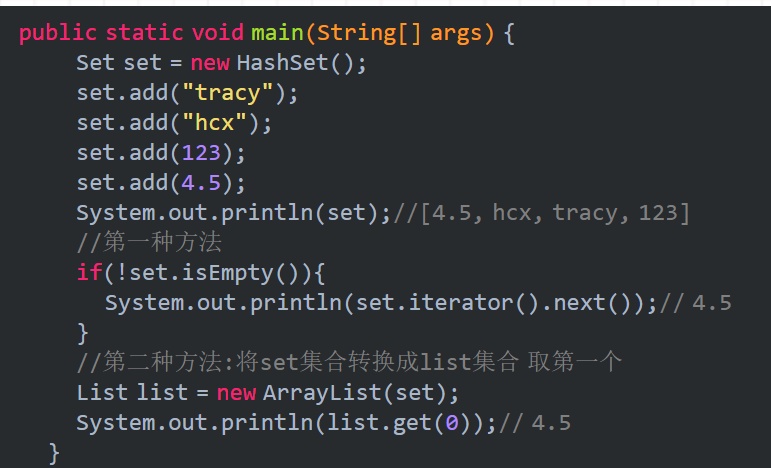

# Java集合


集合类存放于Java.util包中，主要有三种：Set，List（包含Queue）和map

1. Collection：是list，set，queue的最基本的接口
2. Iterator：迭代器，通过迭代器遍历集合中的数据
3. Map：映射表的基础接口


## List


List是有序的Collection。Java List一共三个实现类：ArrayList，Vector，LinkedList


- ArrayList (数组)

内部通过数组实现的，与匈奴对元素进行快速随机访问。缺点是每个元素之间不能有间隔，**当数组大小不满足时需要增加存储能力，就要将已经有数组的数据<复制>到<新的存储空间>中，当从ArrayList的中间位置插入或者删除元素时，需要对数组进行复制、移动，代价比较高。**

适合随机查找和遍历，不适合插入和删除

是线程不安全的，可以使用Collections.synchronizedList方法把你的ArrayList变成一个线程安全的List

初始容量是10，每次扩容为原先的1.5倍（更底层的细节先不考虑。。）


---

- Vector（数组实现，线程同步）

也是通过数组实现的，不同的是 **它支持线程的同步，即某一时刻只有一个线程能够写Vector**，避免多线程同时写而引起的不一致性，由于实现同步的花费，访问比较慢。。


---

- LinkedList（链表）

使用链表结构存储数据，很适合数据的动态插入和删除，随机访问和遍历速度比较慢。

提供了List接口中没有定义的方法，用于操作表头和表尾元素，***可以当做堆栈、队列和双向队列使用***


## Set


Set注重**独一无二**的性质，用于存储无序（存入和取出的顺序不一定相同）元素，**值不能重复**。对象的相等性本质是对象的hashcode值（**java是根据对象的内存地址计算出的此序号**）判断的，**如果想要让两个不同的对象视为相等的，就必须覆盖Object的hashCode方法和equals方法**


- HashSet（Hash表）

哈希表存放的是哈希值，HashSet存储元素的顺序并不是按照存入时的顺序（和List不同），而是**按照哈希值来存**的所有取数据也是**按照哈希值取**的。元素的哈希值是通过**元素**的**hashcode()方法**来获取的。

HashSet首先判断两个元素的哈希值，如果哈希值一样，接着会比较equals()方法，如果equals()结果为true，HashSet就视为同一个元素，如果equals为false，就不是同一个元素


哈希值相同，但equals为false的元素怎么存储呢？在同样的哈希值下链表形式顺延，哈希一样的存一列

HashSet通过hashCode值来确定元素在内存中的位置，**一个hashCode位置上可以存放多个元素**


- TreeSet (**二叉树**)

使用二叉树的原理对新 add()的对象按照指定的顺序排序，每增加一个对象都会进行排序，**将对象插入到二叉树的指定位置**

Integer和String都可以进行默认的TreeSet排序，自定义类的对象不可以。

**自己定义的类必须实现Comparable接口，并且重写 compare()函数**


- LinkedHashSet（HashSet + LinkedHashMap）

继承HashSet，基于LinkedHashMap实现，底层使用LinkedhashMap来保存所有元素，继承于HashSet，所有的方法都和HashSet相同，调用父类构造器，底层构造一个LinkedHashMap来实现，操作与父类HashSet相同。


## Map


----

- HashMap（数组 + 链表 + 红黑树）

HashMap根据键的hashCode值存储数据，大多数情况下可以直接定位到它的值，**访问速度很快**，遍历顺序却不确定。hashMap最多只允许一条记录的**键为null**，允许多条记录的值为null

**HashMap非线程安全**，任一时刻如果有多个线程同时写HashMap，会导致数据不一致。

使用Collections的synchronizedMap方法使HashMap具有线程安全的能力，或者使用ConcurrentHashMap。


java7实现：


java8每个元素是Node组成的链表

HashMap里面是一个数组，然后数组中每个元素是一个单向链表。上图中，每个绿色的实体是嵌套类Node的实例，Node包含四个属性，key, hash, value，用于单向链表的next

1.  capacity：当前数组容量，始终保持2^n，可以扩容，扩容后数组大小为当前的2倍
2. loadFactor: 负载因子，默认为0.75
3. threshold：扩容的阈值，等于capacity * loadFactor，占用的空间达到了这个阈值，就对整个capacity进行扩容


java8实现：

java8对HashMap进行了一些修改，**利用了红黑树，所以由  数组 + 链表 + 红黑树组成**

根据hash值可以快速定位到数组的具体下标，需要顺着链表一个个比较下去才能找到我们需要的，时间复杂度取决于链表的长度，为O(n)。

java8中为了降低这部分的复杂度，**当链表中的元素超过了8个以后，会将链表转换为红黑树**，在这些位置进行查找的时候将时间复杂度降低为O(logN)


---

- ConcurrentHashMap


1. Segment段

ConcurrentHashMap和HashMap思路差不多，**但是因为支持并发操作，结构复杂一点**

整个ConcurrentHashMap由一个个Segment组成，Segment代表“部分 / 段”的意思，所以很多地方都会将其描述为**分段锁**。


2. **线程安全（Segment 继承 ReentrantLock加锁）**

简单理解：ConcurrentHashMap 就是一个Segment数组，Segment通过继承ReentrantLock来进行加锁，所以每次需要加锁的操作锁住的是一个Segment，这样**只需要保证每个Segment是线程安全的，就实现了全局的线程安全**


3. 并行度，**默认16**

concurrencyLevell：并行级别、并发数、**Segment数**，默认是16，也就是说ConcurrentHashMap也有**16个Segments**，所以理论上，这个时候，最多可以同时支持16个线程**并发写**，(只要它们的操作分别在不同的Segment上)。

```java
/**
 * The default concurrency level for this table. Unused but
 * defined for compatibility with previous versions of this class.
 */
private static final int DEFAULT_CONCURRENCY_LEVEL = 16;
```

初始化构造的时候可以设置为其他值，但一旦初始化后，是不可以扩容的。就是当前ConcurrentHashMap的initialCapacity


每个Segment很像HashMap，不过需要保证线程安全


java8（引入了红黑树）


---

- HashTable（**线程安全**）

方法都带synchronized，它继承自Dictionary类，并且是线程安全的，任一时间只有一个线程能写HashTable，并发性不如ConcurrentHashMap，因为ConcurrentHashMap引入了**分段锁**。需要线程安全的还是使用ConcurrentHashMap


- TreeMap（可排序）

TreeMap实现SortedMap接口，能够把它保存的记录根据键排序，默认是**按键值**的升序排序，也可以**指定排序的比较器**，

使用 Iterator 遍历TreeMap时，得到的记录是排过序的

如果需要使用排序的映射，建议使用TreeMap

使用TreeMap时，key必须实现Comparable接口或者在构造TreeMap传入自定义的Comparator，否则会报异常~ 


- LinkedHashMap（记录插入顺序）

是HashMap的一个子类，保存了记录的插入顺序，在用Iterator遍历LinkedHashMap时，先得到的记录肯定是先插入的。默认按插入顺序遍历，可以构造时传入true，使用**LRU算法**来遍历，迭代顺序就是*最后访问其条目的顺序*，当get（Object key）时，将最新访问的元素放到双向链表的第一位


# 集合经典题目


## HashSet & HashMap


HashSet是通过HashMap来实现的，HashMap的输入参数有Key、Value两个组成

在**实现HashSet的时候**，保持**HashMap的Value为常量**，相当于在HashMap中只对Key对象进行处理。


---

**HashMap存储对象的过程**

1. 对HashMap的 Key 调用 hashCode() 方法，返回int 值，即：对应的hashCode
2. 把这个hashCode 作为 哈希表的索引，查找其在哈希表中的响应位置。若当前位置内容为null，表明当前没有key散列到这个hashCode上，则把HashMap的Key、Value**包装成Entry数组，放入当前位置**；
3. 若当前位置不为空，则继续查找当前hashCode索引处存放的链表，利用 equals() 方法，找到 Key 相同的 Entry 数组，用当前 Value 去替换旧的 Value
4. 若未找到与当前 Key 值想用的对象，则**把当前位置的链表后移**，**把新的 Entry数组放到链表表头** 

> 在jdk1.8之前是插入头部的，在**jdk1.8中是插入尾部的。**

```java
transient Node<K,V>[] table;

static class Node<K,V> implements Map.Entry<K,V> {
    final int hash;
    final K key;
    V value;
    //Node元素持有对链表中下一个元素的引用
    Node<K,V> next;
    //...
}
```

在jdk1.6中，HashMap中有个内置Entry类，它实现了Map.Entry接口；而在jdk1.8中，这个Entry类不见了，**变成了Node类，也实现了Map.Entry接口**，**与jdk1.6中的Entry是等价的**。


> 为什么要将头插法换成尾插法：
>
> - 解决死循环
>
> - 当时1.7时候用头插是考虑到了一个所谓的**热点数据**的点(**新插入的数据可能会更早用到**)，但这其实是个伪命题,  y因为JDK1.7中rehash的时候，旧链表迁移新链表的时候，如果在新表的数组索引位置相同，则链表元素会倒置(就是因为头插) 所以最后的结果 还是打乱了插入的顺序 所以总的来看支撑1.7使用头插的这点原因也不足以支撑下去了 所以就干脆换成尾插 一举多得


```java
for (int binCount = 0; ; ++binCount) {
    //e是p的下一个节点
    if ((e = p.next) == null) {
        //插入链表的尾部
        p.next = newNode(hash, key, value, null);
        //如果插入后链表长度大于8则转化为红黑树
        if (binCount >= TREEIFY_THRESHOLD - 1) // -1 for 1st
            treeifyBin(tab, hash);
        break;
    }
    //如果key在链表中已经存在，则退出循环
    if (e.hash == hash &&
        ((k = e.key) == key || (key != null && key.equals(k))))
        break;
    p = e;
}
//如果key在链表中已经存在，则修改其原先的key值，并且返回老的值
if (e != null) { // existing mapping for key
    V oldValue = e.value;
    if (!onlyIfAbsent || oldValue == null)
        e.value = value;
    afterNodeAccess(e);
    return oldValue;
}
```


---

**HasSet 存储对象的过程**

往HashSet添加元素的时候，HashSet会先调用元素的hashCode方法得到元素的哈希值 ，

然后通过元素 的哈希值经过移位等运算，就可以算出该元素在哈希表中的存储位置，存储时会出现两种情况：

1. 如果算出元素储存的位置目前没有任何元素存储，那么而直接存储到该位置上
2. 如果该元素的存储位置目前已经存在有其他的元素了，那么会调用该元素的 equals() 方法与该元素再比较一次，如果返回true，那么就是 **重复元素，不允许添加**，如果返回false，那么允许添加·





主要考点有：

- 是否会灵活的使用哈希表解决问题
- 是否熟练掌握哈希表的基本原理
- 哈希冲突解决方法


- HashSet实现了Set接口，其内部不**允许出现重复的值**，如果我们将一个对象存入HashSet，**必须重写equals()和hashCode()方法**，这样才能**确保集合中不存在同一个元素**。HashSet的内部是**无序的**，因此**不能使用 hashset.get(index) 来获取元素**。
- HashMap实现了Map接口，其内容是**键值对的映射**（key->value），不允许出现**相同的键（key）**。在查询的时候会根据给出的键来查询对应的值。
- 我们可以认为，HashSet和HashMap增查操作的时间复杂度都是常数级的。


---

**哈希冲突解决办法**

冲突（Collision），是说两个不同的 key 经过哈希函数的计算后，**得到了两个相同的值**。解决冲突的方法，主要有两种：

- 开散列法（Open Hashing）。是指哈希表所基于的**数组中，每个位置是一个 Linked List 的头结点**。这样冲突的 <key,value> 二元组，就都**放在同一个链表中**。
- 闭散列法（Closed Hashing）是指在发生冲突的时候，后来的元素，**往下一个位置去找空位**。





jdk1.8中String重写的hashCode方法：




## Set专题


### **Set如何保证元素不重复？**


Java的Set体系中，根据实现方式，主要分为两大类：HashSet 和 TreeSet


1. TreeSet **二叉树实现，数据自动排好序**，不续放入null值
2. HashSet 哈希表实现，数据无序，**可以放入一个null**。

二者中的值都不能重复


在HashSet中，基本的操作都是有HashMap底层实现的，因为HashSet底层是用HashMap存储数据的。当向HashSet中添加元素的时候，首先计算元素的hashcode值，然后通过扰动计算和按位与的方式计算出这个元素的存储位置，如果这个位置位空，就将元素添加进去；如果不为空，则用equals方法比较元素是否相等，相等就不添加，否则找一个空位添加。


TreeSet的底层是 TreeMap的keySet, TreeMap是基于红黑树实现的——平衡二叉查找树，保证**任何一个节点的左右子树的高度差不会超过较矮的那棵的一倍**

```java
public TreeSet() {
    this(new TreeMap<E,Object>());
}
```

TreeMap是按key排序的，元素在**插入TreeSet时compareTo()方法要被调用**，所以TreeSet中的元素要**实现Comparable接口**。

TreeSet作为一种Set，它不允许出现重复元素。TreeSet是**用compareTo()来判断重复元素的**。


### HashSet实现原理


基于HashMap，默认初始容量为16， 负载因子为0.75的HashMap。

封装了一个HashMap对象存储所有的集合元素，所有放入HashSet中的集合元素由 HashMap 的 key 来保存，value则存了一个 PRESENT，静态的Object常量对象，**引用不可改变**。

```java
// Dummy value to associate with an Object in the backing Map

private static final Object PRESENT = new Object();
```


若试图将某个类的对象当成HashMap的key，或者放入HashSet中保存时，重写该类的 equals(Object obj) 方法 和  hashCode() 方法，这两个方法的返回值必须保持一致：

***当两个equals() 返回值相同时，通过  hashCode() 方法比较也应该返回  true***


------

获取Set集合的第一个元素

使用迭代器，或传入ArrayList中，toArray方法就使用迭代器遍历集合；




### **Collection工具类中的sort方法如何比较元素？**


Collections工具类的sort方法有两种重载的形式：

1. 要求传入的待排序容器中存放的**对象实现 Comparable 接口**以实现元素的比较
2. 不强制性要求容器中的元素必须可比较，但是要求第二个参数，参数是 **Comparator接口的子类型（重写 compare 方法实现元素的比较）**，相当一个**临时定义的排序规则**，就是通过接口注入比较元素大小的算法，也是对回调模式的应用。


## 1.7 hashmap扩容时死循环问题


