# Java集合


集合类存放于Java.util包中，主要有三种：Set，List（包含Queue）和map

1. Collection：是list，set，queue的最基本的接口
2. Iterator：迭代器，通过迭代器遍历集合中的数据
3. Map：映射表的基础接口


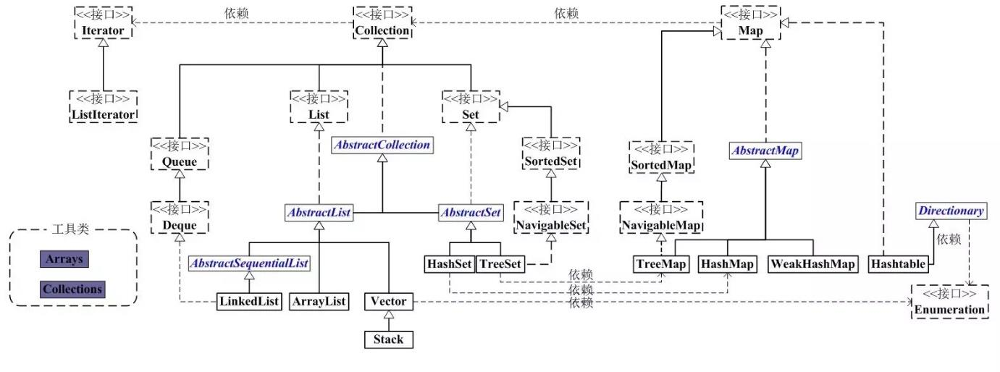


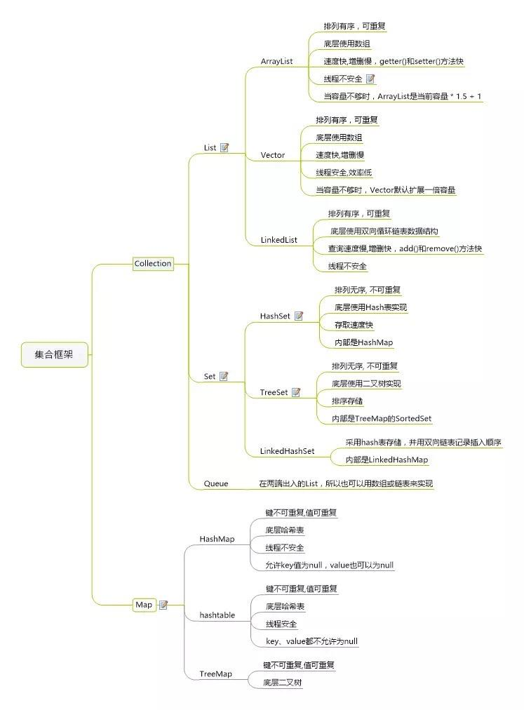


## List


List是有序的Collection。Java List一共三个实现类：ArrayList，Vector，LinkedList

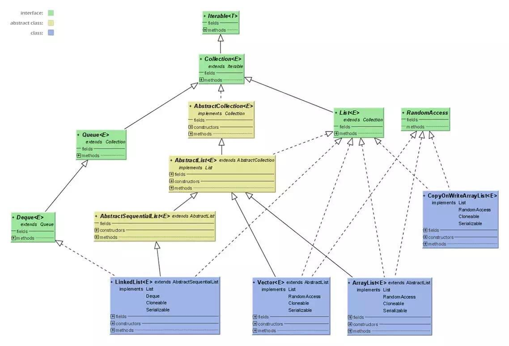


- ArrayList (数组)

内部通过数组实现的，与匈奴对元素进行快速随机访问。缺点是每个元素之间不能有间隔，**当数组大小不满足时需要增加存储能力，就要将已经有数组的数据<复制>到<新的存储空间>中，当从ArrayList的中间位置插入或者删除元素时，需要对数组进行复制、移动，代价比较高。**

适合随机查找和遍历，不适合插入和删除

是线程不安全的，可以使用Collections.synchronizedList方法把你的ArrayList变成一个线程安全的List

初始容量是10，每次扩容为原先的1.5倍（更底层的细节先不考虑。。）


---

- Vector（数组实现，线程同步）

也是通过数组实现的，不同的是 **它支持线程的同步，即某一时刻只有一个线程能够写Vector**，避免多线程同时写而引起的不一致性，由于实现同步的花费，访问比较慢。。


---

- LinkedList（链表）

使用链表结构存储数据，很适合数据的动态插入和删除，随机访问和遍历速度比较慢。

提供了List接口中没有定义的方法，用于操作表头和表尾元素，***可以当做堆栈、队列和双向队列使用***

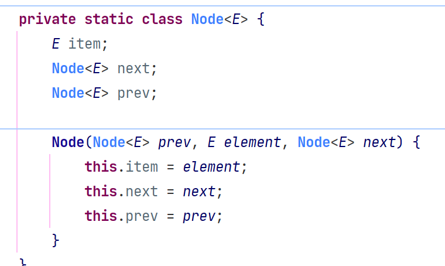


## Set


Set注重**独一无二**的性质，用于存储无序（存入和取出的顺序不一定相同）元素，**值不能重复**。对象的相等性本质是对象的hashcode值（**java是根据对象的内存地址计算出的此序号**）判断的，**如果想要让两个不同的对象视为相等的，就必须覆盖Object的hashCode方法和equals方法**


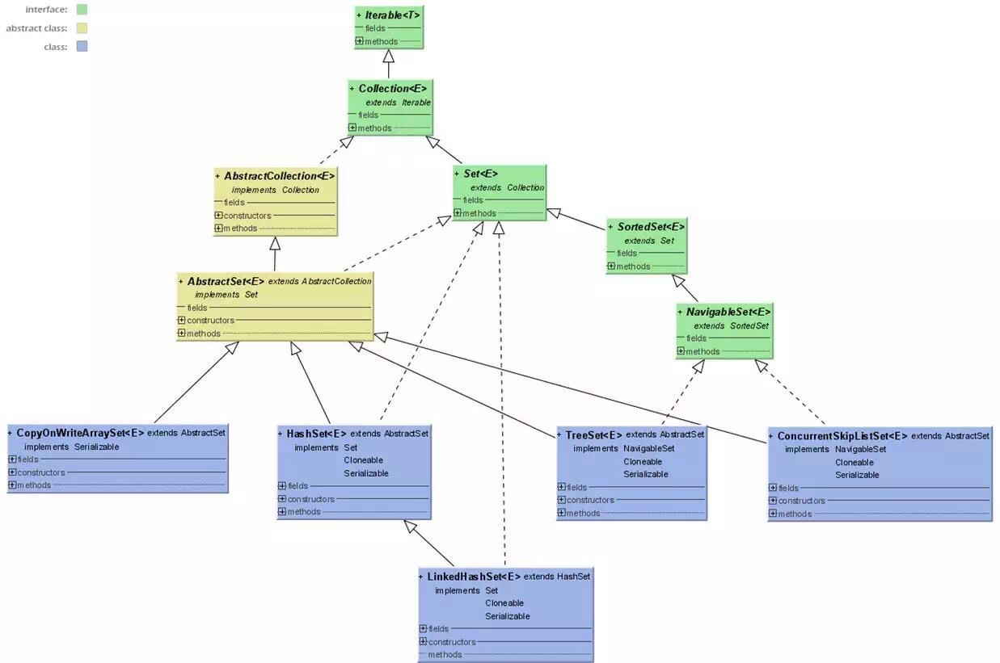


- HashSet（Hash表）

哈希表存放的是哈希值，HashSet存储元素的顺序并不是按照存入时的顺序（和List不同），而是**按照哈希值来存**的所有取数据也是**按照哈希值取**的。元素的哈希值是通过**元素**的**hashcode()方法**来获取的。

HashSet首先判断两个元素的哈希值，如果哈希值一样，接着会比较equals()方法，如果equals()结果为true，HashSet就视为同一个元素，如果equals为false，就不是同一个元素


哈希值相同，但equals为false的元素怎么存储呢？在同样的哈希值下顺延，哈希一样的存一列

HashSet通过hashCode值来确定元素在内存中的位置，**一个hashCode位置上可以存放多个元素**


- TreeSet (**二叉树**)

使用二叉树的原理对新 add()的对象按照指定的顺序排序，每增加一个对象都会进行排序，**将对象插入到二叉树的指定位置**

Integer和String都可以进行默认的TreeSet排序，自定义类的对象不可以。

**自己定义的类必须实现Comparable接口，并且重写 compare()函数**


- LinkedHashSet（HashSet + LinkedHashMap）

继承HashSet，基于LinkedHashMap实现，底层使用LinkedhashMap来保存所有元素，继承于HashSet，所有的方法都和HashSet相同，调用父类构造器，底层构造一个LinkedHashMap来实现，操作与父类HashSet相同。


## Map


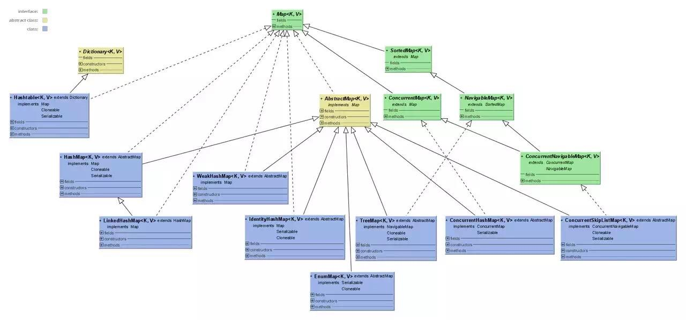


----

- HashMap（数组 + 链表 + 红黑树）

HashMap根据键的hashCode值存储数据，大多数情况下可以直接定位到它的值，**访问速度很快**，遍历顺序却不确定。hashMap最多只允许一条记录的**键为null**，允许多条记录的值为null

**HashMap非线程安全**，任一时刻如果有多个线程同时写HashMap，会导致数据不一致。

使用Collections的synchronizedMap方法使HashMap具有线程安全的能力，或者使用ConcurrentHashMap。


java7实现：

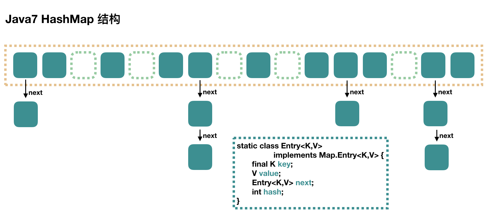

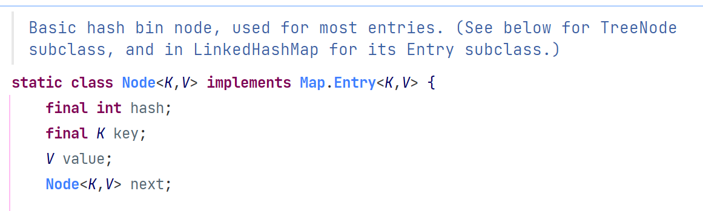

java8每个元素是Node组成的链表

HashMap里面是一个数组，然后数组中每个元素是一个单向链表。上图中，每个绿色的实体是嵌套类Node的实例，Node包含四个属性，key, hash, value，用于单向链表的next

1.  capacity：当前数组容量，始终保持2^n，可以扩容，扩容后数组大小为当前的2倍
2. loadFactor: 负载因子，默认为0.75
3. threshold：扩容的阈值，等于capacity * loadFactor，占用的空间达到了这个阈值，就对整个capacity进行扩容


java8实现：

java8对HashMap进行了一些修改，**利用了红黑树，所以由  数组 + 链表 + 红黑树组成**

根据hash值可以快速定位到数组的具体下标，需要顺着链表一个个比较下去才能找到我们需要的，时间复杂度取决于链表的长度，为O(n)。

java8中为了降低这部分的复杂度，**当链表中的元素超过了8个以后，会将链表转换为红黑树**，在这些位置进行查找的时候将时间复杂度降低为O(logN)


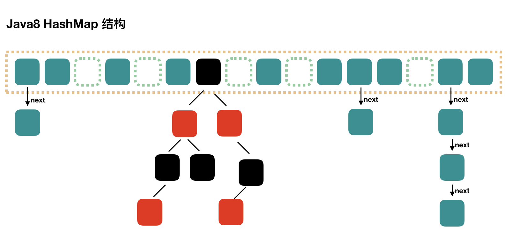


---

- ConcurrentHashMap


1. Segment段

ConcurrentHashMap和HashMap思路差不多，**但是因为支持并发操作，结构复杂一点**

整个ConcurrentHashMap由一个个Segment组成，Segment代表“部分 / 段”的意思，所以很多地方都会将其描述为**分段锁**。


2. **线程安全（Segment 继承 ReentrantLock加锁）**

简单理解：ConcurrentHashMap 就是一个Segment数组，Segment通过继承ReentrantLock来进行加锁，所以每次需要加锁的操作锁住的是一个Segment，这样**只需要保证每个Segment是线程安全的，就实现了全局的线程安全**


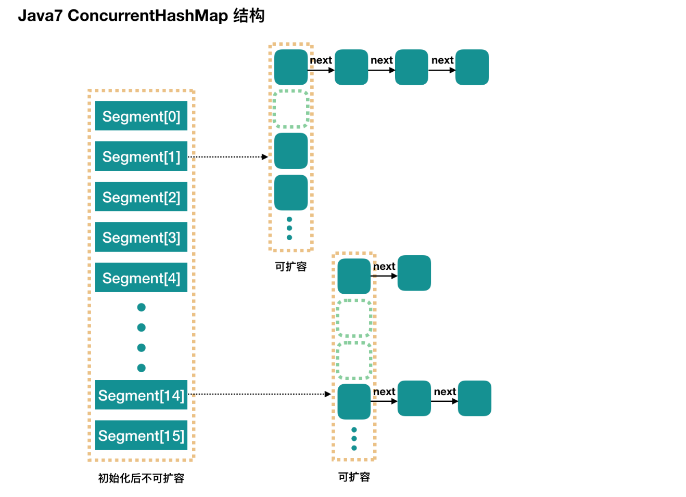


3. 并行度，**默认16**

concurrencyLevell：并行级别、并发数、**Segment数**，默认是16，也就是说ConcurrentHashMap也有**16个Segments**，所以理论上，这个时候，最多可以同时支持16个线程**并发写**，(只要它们的操作分别在不同的Segment上)。

```java
/**
 * The default concurrency level for this table. Unused but
 * defined for compatibility with previous versions of this class.
 */
private static final int DEFAULT_CONCURRENCY_LEVEL = 16;
```

初始化构造的时候可以设置为其他值，但一旦初始化后，是不可以扩容的。就是当前ConcurrentHashMap的initialCapacity

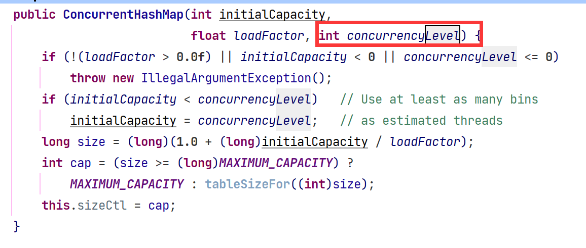

每个Segment很像HashMap，不过需要保证线程安全


java8（引入了红黑树）

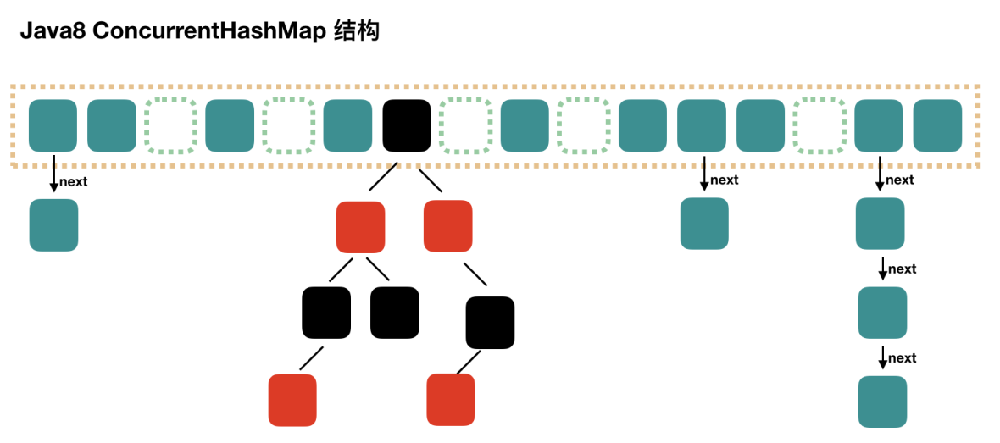


---

- HashTable（**线程安全**）

方法都带synchronized，它继承自Dictionary类，并且是线程安全的，任一时间只有一个线程能写HashTable，并发性不如ConcurrentHashMap，因为ConcurrentHashMap引入了**分段锁**。需要线程安全的还是使用ConcurrentHashMap


- TreeMap（可排序）

TreeMap实现SortedMap接口，能够把它保存的记录根据键排序，默认是**按键值**的升序排序，也可以**指定排序的比较器**，

使用 Iterator 遍历TreeMap时，得到的记录是排过序的

如果需要使用排序的映射，建议使用TreeMap

使用TreeMap时，key必须实现Comparable接口或者在构造TreeMap传入自定义的Comparator，否则会报异常~ 


- LinkedHashMap（记录插入顺序）

是HashMap的一个子类，保存了记录的插入顺序，在用Iterator遍历LinkedHashMap时，先得到的记录肯定是先插入的。默认按插入顺序遍历，可以构造时传入true，使用**LRU算法**来遍历，迭代顺序就是*最后访问其条目的顺序*，当get（Object key）时，将最新访问的元素放到双向链表的第一位


